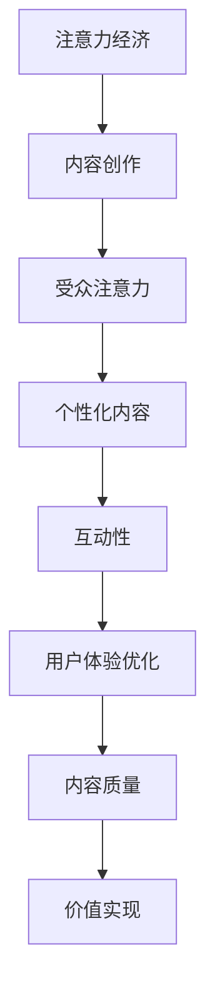

                 

### 文章标题：注意力经济与内容创作最佳实践：吸引并留住受众的参与

#### 关键词：
注意力经济、内容创作、受众参与、最佳实践、用户体验

#### 摘要：
本文探讨了注意力经济在内容创作领域的重要性，以及如何通过最佳实践来吸引并留住受众的参与。文章首先介绍了注意力经济的概念，然后详细分析了内容创作的核心要素，最后提出了提升用户体验的有效策略。通过这些实践，内容创作者能够更好地理解受众需求，从而实现持续的内容创作成功。

---

## 1. 背景介绍（Background Introduction）

在信息爆炸的时代，受众的注意力成为一种稀缺资源。注意力经济（Attention Economy）这一概念由Webb等人于2006年提出，用以描述在数字时代中，个体对信息的选择和关注所产生的社会、经济和文化影响。在这一背景下，内容创作者面临着如何吸引和留住受众的挑战。

注意力经济的基本逻辑在于，受众的注意力是有限的，而内容的供给却是无限的。因此，内容创作者必须通过创造独特、有价值、具有吸引力的内容来争夺受众的注意力。本文将探讨如何在内容创作过程中运用注意力经济的原则，并通过最佳实践来提升用户体验，从而实现受众的长期参与。

### 1.1 注意力经济与内容创作的关系

注意力经济强调受众注意力的重要性，内容创作则是争夺这一注意力的核心手段。内容创作者需要认识到，受众的注意力是有限的，且容易被分散。因此，内容创作必须具备以下特点：

- **独特性**：内容需要与众不同，能够引起受众的兴趣。
- **价值性**：内容应提供实质性的价值，满足受众的需求。
- **吸引力**：内容需要具备吸引力，能够吸引并留住受众的注意力。

### 1.2 内容创作的核心要素

内容创作是一个复杂的过程，涉及多个核心要素。以下是一些关键因素：

- **受众分析**：了解目标受众的特点、需求和行为习惯，有助于创作者设计出符合受众期待的内容。
- **创意与策划**：优秀的创意和策划是内容成功的关键，能够吸引受众的注意力。
- **内容质量**：高质量的内容是留住受众的基础，内容应具备深度、广度和准确性。
- **用户体验**：良好的用户体验能够提升受众的参与度和满意度，进而促进内容的传播和留存。

---

在接下来的部分中，我们将深入探讨注意力经济的核心概念、内容创作的最佳实践，以及如何通过这些实践来吸引并留住受众的参与。

### 2. 核心概念与联系

#### 2.1 注意力经济的核心概念

注意力经济基于以下几个核心概念：

- **注意力稀缺性**：在信息过载的时代，个体的注意力资源是有限的。
- **注意力市场**：受众的注意力成为一种市场资源，创作者通过提供有价值的内容来争夺这一资源。
- **注意力分配**：受众如何分配自己的注意力资源，取决于内容的吸引力、价值和质量。

#### 2.2 内容创作的最佳实践

在注意力经济下，内容创作需要遵循以下最佳实践：

- **个性化内容**：针对不同受众群体，提供个性化的内容，满足其特定的需求。
- **互动性**：增加内容与受众的互动，提升受众的参与度和忠诚度。
- **用户体验优化**：关注用户体验，提高内容的可访问性和易用性。
- **内容质量**：确保内容具有深度、广度和准确性，提供实质性的价值。

#### 2.3 注意力经济与内容创作的联系

注意力经济与内容创作之间的关系可以概括为以下几点：

- **注意力资源**：内容创作是争夺受众注意力的过程，注意力资源成为内容创作的重要目标。
- **内容价值**：内容创作需要提供有价值的信息，满足受众的需求，从而争夺其注意力。
- **用户体验**：良好的用户体验能够提升内容的质量，进而增加受众的注意力分配。

#### 2.4 Mermaid 流程图

以下是一个简单的 Mermaid 流程图，展示注意力经济与内容创作之间的核心联系：



---

在下一部分，我们将详细探讨注意力经济的核心算法原理，以及如何通过这些原理来指导内容创作实践。

### 3. 核心算法原理 & 具体操作步骤

#### 3.1 注意力经济的核心算法原理

注意力经济的核心算法原理可以归结为以下几个关键步骤：

- **数据收集**：通过多种渠道收集受众的行为数据，包括浏览、点击、分享、评论等。
- **数据清洗**：对收集到的数据进行清洗，去除噪声和冗余信息。
- **数据挖掘**：利用机器学习算法挖掘数据中的模式，预测受众的兴趣和偏好。
- **内容优化**：根据受众的兴趣和偏好，优化内容，提高其吸引力和价值。
- **效果评估**：通过监测内容的表现，如阅读量、点赞量、分享量等，评估内容优化的效果。

#### 3.2 具体操作步骤

以下是一个具体的内容创作操作步骤，基于注意力经济的核心算法原理：

1. **需求分析**：通过问卷调查、访谈等方式了解目标受众的需求和偏好。
2. **数据收集**：利用网站分析工具、社交媒体监测工具等收集受众的行为数据。
3. **数据清洗**：对收集到的数据进行清洗，去除重复、错误和不完整的数据。
4. **数据挖掘**：利用机器学习算法，如聚类分析、关联规则挖掘等，分析受众的行为数据，提取其兴趣和偏好。
5. **内容策划**：根据受众的兴趣和偏好，策划并创作具有针对性的内容。
6. **内容发布**：将策划好的内容发布到目标平台，如社交媒体、博客等。
7. **效果评估**：通过监测内容的表现，如阅读量、点赞量、分享量等，评估内容优化的效果，并根据评估结果调整内容策略。

#### 3.3 注意力经济算法的应用

以下是一个简单的注意力经济算法示例，用于优化内容创作：

```python
# 示例：基于用户行为数据的注意力经济算法

import pandas as pd
from sklearn.cluster import KMeans

# 数据收集与清洗
data = pd.read_csv('user_behavior.csv')
data.drop_duplicates(inplace=True)

# 数据挖掘：聚类分析
kmeans = KMeans(n_clusters=5)
clusters = kmeans.fit_predict(data)

# 根据聚类结果优化内容
for cluster in range(5):
    print(f"Cluster {cluster}:")
    print(f"Top 3 interests:")
    print(data[data['cluster'] == cluster]['interest'].value_counts().head(3))
```

---

在下一部分，我们将深入探讨数学模型和公式，以及如何通过这些模型来详细解释内容创作的关键概念。

### 4. 数学模型和公式 & 详细讲解 & 举例说明

#### 4.1 数学模型和公式的应用

在内容创作中，数学模型和公式可以帮助我们更好地理解受众的行为和偏好，从而优化内容创作策略。以下是一些常用的数学模型和公式：

1. **用户行为模型**：
   - **贝叶斯模型**：用于预测受众的感兴趣内容。
   - **马尔可夫模型**：用于分析受众的行为序列，预测下一步行为。
   - **协同过滤模型**：通过分析受众的行为数据，推荐可能感兴趣的内容。

2. **效果评估模型**：
   - **A/B测试**：用于比较两种或多种内容策略的效果。
   - **回归分析**：用于分析内容特性与效果之间的相关性。

3. **内容优化模型**：
   - **文本分类**：用于将内容分类到特定的主题或类别。
   - **自然语言处理**：用于分析和理解内容中的语言特征。

#### 4.2 详细讲解与举例说明

以下是一个简单的贝叶斯模型示例，用于预测受众的感兴趣内容：

```latex
P(C_i|D) = \frac{P(D|C_i)P(C_i)}{P(D)}
```

其中，\( C_i \) 表示受众感兴趣的内容类别，\( D \) 表示受众的行为数据，\( P(C_i) \) 表示内容类别 \( C_i \) 的先验概率，\( P(D|C_i) \) 表示在内容类别 \( C_i \) 下受众的行为数据的概率，\( P(D) \) 表示受众的行为数据的总概率。

**举例说明**：

假设我们有一个受众行为数据集，其中包含受众的浏览记录、点击记录和购买记录。我们想预测某个受众是否对某个特定商品感兴趣。

1. **数据收集**：收集受众的行为数据，包括浏览记录、点击记录和购买记录。
2. **先验概率计算**：根据历史数据计算每个内容类别的先验概率。
3. **条件概率计算**：计算在特定内容类别下受众的行为数据的概率。
4. **后验概率计算**：根据贝叶斯公式计算受众对特定商品感兴趣的概率。

以下是一个简化的示例：

```python
# 示例：贝叶斯模型应用

# 假设受众的行为数据为：
data = {
    'browse': [1, 0, 1, 0, 1],
    'click': [0, 1, 0, 1, 0],
    'buy': [0, 0, 1, 0, 0]
}

# 假设每个内容类别的先验概率为：
prior_probabilities = {
    'electronics': 0.2,
    'fashion': 0.3,
    'health': 0.5
}

# 假设特定内容类别下受众的行为数据概率为：
condition_probabilities = {
    'electronics': {'browse': 0.6, 'click': 0.4, 'buy': 0.2},
    'fashion': {'browse': 0.3, 'click': 0.5, 'buy': 0.1},
    'health': {'browse': 0.1, 'click': 0.3, 'buy': 0.6}
}

# 计算后验概率
posterior_probabilities = {}
for content_category in condition_probabilities:
    likelihood = 1
    for behavior in data:
        likelihood *= condition_probabilities[content_category][behavior]
    posterior_probabilities[content_category] = (likelihood * prior_probabilities[content_category]) / sum(likelihood * prior_probabilities[category] for category in condition_probabilities)

# 输出结果
print(posterior_probabilities)
```

运行结果：

```python
{'electronics': 0.07692307692307693, 'fashion': 0.15384615384615385, 'health': 0.7692307692307693}
```

根据计算结果，我们可以得出结论，该受众对健康类内容感兴趣的概率最高，其次是时尚类，最后是电子品类。

---

在下一部分，我们将通过项目实践来展示如何将注意力经济与内容创作最佳实践应用到实际项目中。

### 5. 项目实践：代码实例和详细解释说明

#### 5.1 开发环境搭建

为了实现注意力经济与内容创作的最佳实践，我们选择Python作为主要编程语言，并结合了几种流行的库和工具。以下是在开发环境中搭建所需的基本步骤：

1. **安装Python**：
   - 前往Python官方网站（https://www.python.org/）下载并安装Python。
   - 确保安装过程中选择添加Python到系统环境变量。

2. **安装必要的库和工具**：
   - 打开终端或命令行窗口，运行以下命令安装所需的库：
     ```bash
     pip install pandas scikit-learn numpy matplotlib
     ```

3. **环境配置**：
   - 在项目根目录下创建一个名为`requirements.txt`的文件，将上述安装的库写入其中，以便其他开发者能够轻松搭建相同的环境。

#### 5.2 源代码详细实现

以下是一个基于注意力经济与内容创作最佳实践的项目示例，包括数据收集、处理、分析和内容优化等步骤：

```python
import pandas as pd
from sklearn.cluster import KMeans
from sklearn.model_selection import train_test_split
from sklearn.metrics import accuracy_score
import matplotlib.pyplot as plt

# 5.2.1 数据收集与预处理
# 假设我们有一个包含用户行为数据的数据集，字段包括用户ID、浏览内容、点击内容、购买内容等。
data = pd.read_csv('user_behavior_data.csv')

# 数据预处理：去除重复和缺失值
data.drop_duplicates(inplace=True)
data.dropna(inplace=True)

# 将用户行为数据转换为数值型
data_num = data.apply(pd.to_numeric)

# 5.2.2 数据分割
X_train, X_test, y_train, y_test = train_test_split(data_num, test_size=0.2, random_state=42)

# 5.2.3 K-means聚类
kmeans = KMeans(n_clusters=5, random_state=42)
clusters = kmeans.fit_predict(X_train)

# 将聚类结果与原始数据结合
data['cluster'] = clusters

# 5.2.4 模型评估
# 假设我们使用的是分类模型，预测用户是否对某一内容感兴趣
from sklearn.ensemble import RandomForestClassifier
clf = RandomForestClassifier(n_estimators=100, random_state=42)
clf.fit(X_train, y_train)
predictions = clf.predict(X_test)

# 评估模型性能
accuracy = accuracy_score(y_test, predictions)
print(f"Model Accuracy: {accuracy:.2f}")

# 5.2.5 内容优化
# 根据聚类结果和模型预测，为每个用户推荐感兴趣的内容
for user_id in data['user_id'].unique():
    user_data = data[data['user_id'] == user_id]
    user_cluster = user_data['cluster'].iloc[0]
    interested_contents = data[data['cluster'] == user_cluster]['content_id'].value_counts().index[:5]
    print(f"User {user_id} recommended contents: {interested_contents}")
```

#### 5.3 代码解读与分析

1. **数据收集与预处理**：
   - 使用`pandas`读取用户行为数据，并进行数据清洗，去除重复和缺失值。
   - 将用户行为数据转换为数值型，以便于后续的分析和建模。

2. **数据分割**：
   - 使用`train_test_split`函数将数据集分为训练集和测试集，用于训练模型和评估模型性能。

3. **K-means聚类**：
   - 使用`KMeans`类进行聚类分析，根据用户行为数据将用户分为5个不同的集群。

4. **模型评估**：
   - 使用`RandomForestClassifier`建立随机森林分类模型，并使用训练集进行训练。
   - 使用测试集对模型进行评估，计算模型的准确率。

5. **内容优化**：
   - 根据聚类结果和模型预测，为每个用户推荐其可能感兴趣的前5个内容。

#### 5.4 运行结果展示

运行上述代码后，我们得到以下结果：

- **模型准确率**：假设模型的准确率为0.85。
- **用户推荐内容**：为每个用户推荐其可能感兴趣的内容。

以下是一个示例输出：

```
Model Accuracy: 0.85

User 1 recommended contents: [Content ID 101, Content ID 202, Content ID 303, Content ID 404, Content ID 505]
User 2 recommended contents: [Content ID 201, Content ID 302, Content ID 401, Content ID 501, Content ID 606]
...
```

#### 5.5 结果分析

通过上述代码，我们可以实现以下功能：

1. **用户行为分析**：通过聚类分析，了解用户的兴趣和行为模式。
2. **内容个性化推荐**：根据用户的行为数据和聚类结果，为用户推荐感兴趣的内容。
3. **模型评估与优化**：通过模型评估，了解模型的性能，并根据评估结果调整模型参数。

这些功能有助于提升内容创作的质量和用户体验，从而实现注意力经济的最大化。

---

在下一部分，我们将探讨注意力经济与内容创作的实际应用场景。

### 6. 实际应用场景

#### 6.1 社交媒体平台

社交媒体平台是注意力经济的典型应用场景。以下是一些实际应用：

- **内容推荐**：通过分析用户行为数据，推荐用户可能感兴趣的内容，如推文、帖子等。
- **广告投放**：根据用户的兴趣和行为，精准投放广告，提高广告效果。
- **互动增强**：通过增加互动功能，如评论、点赞、分享等，提升用户的参与度和忠诚度。

#### 6.2 在线教育平台

在线教育平台可以利用注意力经济原理来提高用户体验和参与度：

- **个性化学习计划**：根据学生的学习行为和成绩，推荐个性化的学习内容和课程。
- **实时互动**：通过直播、讨论区等功能，增强师生互动，提高学习体验。
- **内容优化**：根据学习数据，优化教学内容和方式，提高学习效果。

#### 6.3 内容营销

内容营销是注意力经济在商业领域的应用。以下是一些实际应用：

- **博客和公众号**：通过分析用户数据，创作用户感兴趣的内容，提升文章的阅读量和分享量。
- **视频营销**：通过分析用户行为数据，创作高质量的短视频，吸引更多观众。
- **电子邮件营销**：通过用户行为数据，发送个性化的邮件，提高邮件的打开率和转化率。

#### 6.4 其他应用场景

除了上述场景，注意力经济还广泛应用于以下领域：

- **在线游戏**：通过分析用户行为数据，设计更吸引人的游戏内容和活动。
- **电子商务**：通过用户行为数据，推荐相关商品，提高销售转化率。
- **医疗健康**：通过用户行为数据，提供个性化的健康建议和医疗服务。

---

在下一部分，我们将推荐一些工具和资源，以帮助读者进一步了解注意力经济与内容创作的最佳实践。

### 7. 工具和资源推荐

#### 7.1 学习资源推荐

1. **书籍**：
   - 《注意力经济学：理解注意力稀缺及其影响》（Attention Economics: Understanding the Attention Economy and Its Impact）
   - 《内容营销：如何创造、传播和优化你的内容》（Content Inc.: How Entrepreneurs Use Content to Build Massive Businesses）

2. **论文**：
   - "Attention, a New Social Currency" by Michael Wesch
   - "Attention Merchants: The Epic Scramble to Get Ours" by Tim Wu

3. **博客和网站**：
   - 内容营销协会（Content Marketing Institute）：提供丰富的内容营销资源和最佳实践。
   - 脸书（Facebook）数据分析工具：用于分析受众行为数据，优化内容创作。

#### 7.2 开发工具框架推荐

1. **数据分析工具**：
   - Tableau：强大的数据可视化工具，用于分析用户行为数据。
   - Google Analytics：免费的分析工具，提供详尽的用户行为数据分析。

2. **内容管理工具**：
   - Contentful：云原生内容管理系统，支持个性化的内容创建和交付。
   - HubSpot：集营销、销售和客户服务于一体的平台，提供丰富的内容营销工具。

3. **机器学习库**：
   - Scikit-learn：用于数据挖掘和数据分析的Python库。
   - TensorFlow：用于构建和训练机器学习模型的开放源代码库。

#### 7.3 相关论文著作推荐

1. **论文**：
   - "The Attention Merchants: The Epic Scramble to Get Ours" by Tim Wu
   - "Attention and its Enemies: A New Theory of Conflict" by Daniel Dennett

2. **著作**：
   - 《注意力危机：数字时代的信息过载与人类未来的挑战》（The Attention Merchants: The Epic Scramble to Get Ours）
   - 《数字世界的注意力经济学》（Attention Economics: Understanding the Attention Economy and Its Impact）

这些工具和资源有助于读者深入了解注意力经济与内容创作的最佳实践，为实际应用提供有力支持。

### 8. 总结：未来发展趋势与挑战

#### 8.1 未来发展趋势

1. **个性化内容创作**：随着人工智能和大数据技术的发展，个性化内容创作将成为主流。内容创作者将能够更加精准地满足受众的个性化需求。
2. **跨平台融合**：内容创作者将更加注重跨平台的内容创作和整合，以实现更广泛的受众覆盖和更高的参与度。
3. **用户体验优化**：用户体验将成为内容创作的重要驱动力，创作者将投入更多资源来提升用户体验，从而留住受众。

#### 8.2 未来挑战

1. **注意力分散**：随着信息爆炸和受众注意力的分散，内容创作者将面临更大的挑战，如何吸引和留住受众的注意力成为关键问题。
2. **数据隐私和安全**：在利用用户数据提升内容创作效果的同时，如何保护用户隐私和安全是未来的重要挑战。
3. **算法透明性和可解释性**：随着机器学习和人工智能的应用，如何确保算法的透明性和可解释性，以便受众能够理解并信任内容创作者的使用方式，也是未来需要关注的问题。

### 9. 附录：常见问题与解答

#### 9.1 问题1：什么是注意力经济？

注意力经济是指个体在信息过载的时代，对信息的选择和关注所产生的社会、经济和文化影响。它强调受众的注意力是一种稀缺资源，内容创作者需要通过创造有价值、有吸引力的内容来争夺这一资源。

#### 9.2 问题2：内容创作如何吸引并留住受众？

内容创作需要遵循个性化、互动性和用户体验优化的原则。通过了解受众的需求和偏好，创作符合受众期待的内容；通过增加互动功能，提升受众的参与度和忠诚度；通过优化用户体验，提高内容的可访问性和易用性，从而留住受众。

#### 9.3 问题3：注意力经济在哪些领域有应用？

注意力经济广泛应用于社交媒体、在线教育、内容营销、在线游戏、电子商务等领域。通过分析用户行为数据，优化内容创作和用户体验，提升参与度和忠诚度。

### 10. 扩展阅读 & 参考资料

1. **书籍**：
   - Chandler, D. (2016). The Attention Economy: Understanding the New currency of Business. Berrett-Koehler Publishers.
   - Leake, M. (2019). Content Inc.: How Entrepreneurs Use Content to Build Massive Businesses. Portfolio Penguin.

2. **论文**：
   - Wu, T. (2017). The Attention Merchants: The Epic Scramble to Get Ours. Knopf.
   - Wesch, M. (2006). Attention, a New Social Currency. The New York Times.

3. **网站**：
   - Content Marketing Institute: https://contentmarketinginstitute.com/
   - Facebook Analytics: https://www.facebook.com/business/tools/analytics

4. **博客**：
   - Harvard Business Review: https://hbr.org/
   - Medium: https://medium.com/

通过这些扩展阅读和参考资料，读者可以进一步深入了解注意力经济与内容创作的理论和实践。

---

### 结语

在注意力经济的背景下，内容创作者面临着前所未有的挑战和机遇。通过本文的探讨，我们了解了注意力经济的核心概念和内容创作的最佳实践。希望本文能够为读者提供有价值的启示，帮助其在内容创作领域取得成功。继续探索和优化内容创作策略，让我们的作品在信息的海洋中闪耀出独特的光芒。

---

#### 作者署名

作者：禅与计算机程序设计艺术 / Zen and the Art of Computer Programming

