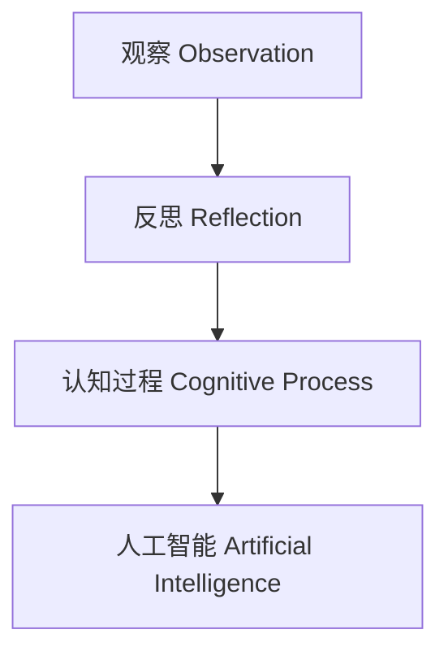
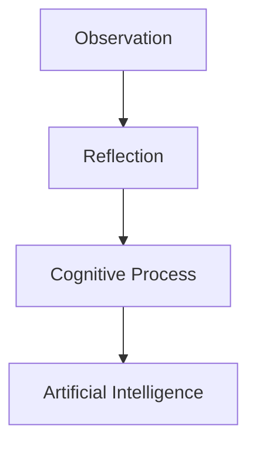

                 

# 洞见的形成：从观察到反思

### Formation of Insights: From Observation to Reflection

### 1. 背景介绍 Background Introduction

**关键词**：洞察力，观察，反思，认知过程，人工智能

在现代社会，人工智能（AI）的发展已将我们的生活方式和工作模式推向了一个全新的高度。然而，尽管技术进步带来了无数的便利，但人们对人工智能的理解仍存在一定的局限性。本文旨在探讨洞见的形成过程，从观察到反思，并分析这一过程在人工智能中的应用。我们希望通过本文，使读者对人工智能的认识更加深刻，并激发对这一领域的进一步思考。

**Keywords**: Insight, Observation, Reflection, Cognitive Process, Artificial Intelligence

In today's modern society, the development of artificial intelligence (AI) has propelled our lifestyle and work patterns to new heights. However, despite the numerous conveniences brought by technological progress, there remains a certain level of limitation in people's understanding of AI. This article aims to explore the process of forming insights, from observation to reflection, and analyze its application in artificial intelligence. We hope that through this article, readers will gain a deeper understanding of AI and be inspired to further think about this field.

### 1.1 人工智能的发展历程 Development History of Artificial Intelligence

人工智能的发展历程可以追溯到20世纪50年代。当时，科学家们首次提出了“人工智能”这一概念，并试图通过模拟人类思维过程来创造智能体。从最初的逻辑推理和规则系统，到后来的神经网络和深度学习，人工智能经历了多个阶段的发展。

**1.1 History of AI Development**

The history of artificial intelligence can be traced back to the 1950s. At that time, scientists first proposed the concept of "artificial intelligence" and attempted to create intelligent entities by simulating human thought processes. From initial logical reasoning and rule-based systems to later neural networks and deep learning, AI has gone through multiple stages of development.

### 1.2 洞察力的定义与作用 Definition and Role of Insight

洞察力是一种深层次的理解能力，它使我们能够从表面现象中看到本质，从而揭示问题的根本原因。在人工智能领域，洞察力尤为重要，因为它能够帮助研究人员发现数据中的隐藏模式，从而推动技术的创新和发展。

**1.2 Definition and Role of Insight**

Insight is a deep-level understanding ability that enables us to see the essence from surface phenomena, thus revealing the fundamental causes of problems. In the field of artificial intelligence, insight is particularly important because it can help researchers discover hidden patterns in data, thereby driving technological innovation and development.

### 2. 核心概念与联系 Core Concepts and Connections

**Keywords**: Core Concepts, Relationships, Artificial Intelligence, Insight Formation

在讨论洞见的形成之前，我们有必要了解一些核心概念。这些概念不仅构成了洞见形成的基础，而且在人工智能领域有着广泛的应用。

**2.1 核心概念 Core Concepts**

**2.1.1 观察 Observation**

观察是洞见形成的第一步。它是指通过感知和体验来获取外部信息的过程。在人工智能中，观察通常涉及数据收集和输入，这是机器学习模型训练的关键环节。

**2.1.2 反思 Reflection**

反思是对观察到的信息进行深入思考和评估的过程。它帮助我们理解现象背后的原因和后果，并识别潜在的改进空间。

**2.1.3 认知过程 Cognitive Process**

认知过程是大脑处理信息的方式，包括感知、记忆、思维和决策等。在人工智能中，这些过程被模拟为算法和模型，以实现机器学习、自然语言处理和计算机视觉等功能。

**2.1.4 人工智能 Artificial Intelligence**

人工智能是模拟人类智能行为的计算机系统。它包括多种技术，如机器学习、深度学习和自然语言处理等。这些技术共同构成了洞见形成的基础。

**2.2 核心概念之间的联系 Relationships Between Core Concepts**

**2.2.1 观察 - 反思**

观察是反思的基础。通过观察，我们获取了必要的信息，这些信息是进行反思的前提。

**Observation - Reflection**

Observation forms the foundation for reflection. By observing, we obtain the necessary information that serves as the prerequisite for reflection.

**2.2.2 反思 - 认知过程**

反思与认知过程密切相关。反思使我们能够对观察到的信息进行深入分析，从而激发新的认知过程。

**Reflection - Cognitive Process**

Reflection is closely related to cognitive processes. By reflecting on observed information, we can conduct deep analysis and thereby stimulate new cognitive processes.

**2.2.3 认知过程 - 人工智能**

认知过程在人工智能中得到了应用。通过模拟人类认知过程，人工智能系统能够处理复杂的信息，从而实现智能行为。

**Cognitive Process - Artificial Intelligence**

Cognitive processes are applied in artificial intelligence. By simulating human cognitive processes, AI systems can handle complex information and thereby achieve intelligent behavior.

**2.3 Mermaid 流程图 Mermaid Flowchart**



### 2.3 Mermaid Flowchart



### 3. 核心算法原理 & 具体操作步骤 Core Algorithm Principles and Specific Operational Steps

**Keywords**: Core Algorithm Principles, Operational Steps, Artificial Intelligence, Insight Formation

在洞见的形成过程中，核心算法起着至关重要的作用。这些算法不仅能够处理大量数据，还能从数据中提取有价值的信息。以下是一些核心算法的原理和具体操作步骤。

#### 3.1 机器学习算法 Machine Learning Algorithms

机器学习算法是洞见形成的基础。它们通过从数据中学习规律，从而实现预测和分类等任务。

**3.1.1 原理 Principles**

机器学习算法基于以下原理：

- **数据驱动 Data-Driven**: 机器学习算法通过分析大量数据来发现模式。
- **自学习 Self-Learning**: 算法可以不断优化自己的性能，从而提高预测准确性。

**3.1.2 操作步骤 Operational Steps**

1. **数据收集 Data Collection**: 收集相关数据，包括特征和标签。
2. **数据预处理 Data Preprocessing**: 清洗数据，去除噪声和缺失值。
3. **模型选择 Model Selection**: 根据任务需求选择合适的模型。
4. **模型训练 Model Training**: 使用训练数据对模型进行训练。
5. **模型评估 Model Evaluation**: 使用验证数据评估模型性能。
6. **模型优化 Model Optimization**: 根据评估结果调整模型参数。

#### 3.2 深度学习算法 Deep Learning Algorithms

深度学习算法是人工智能领域的重要分支。它们通过多层神经网络来处理复杂数据。

**3.2.1 原理 Principles**

深度学习算法基于以下原理：

- **多层网络 Multi-Layer Networks**: 通过多层网络，算法可以提取数据的不同层次特征。
- **端到端学习 End-to-End Learning**: 从输入到输出，算法可以自动学习整个数据处理的流程。

**3.2.2 操作步骤 Operational Steps**

1. **数据收集 Data Collection**: 收集相关数据，包括图像、文本和声音等。
2. **数据预处理 Data Preprocessing**: 清洗数据，标准化处理。
3. **模型设计 Model Design**: 设计神经网络结构。
4. **模型训练 Model Training**: 使用训练数据对模型进行训练。
5. **模型评估 Model Evaluation**: 使用验证数据评估模型性能。
6. **模型优化 Model Optimization**: 调整模型参数，提高性能。

#### 3.3 自然语言处理算法 Natural Language Processing Algorithms

自然语言处理算法用于处理和理解人类语言。它们在洞见形成中起着重要作用。

**3.3.1 原理 Principles**

自然语言处理算法基于以下原理：

- **语言模型 Language Model**: 通过统计方法，算法可以生成符合语言规则的文本。
- **语义理解 Semantic Understanding**: 通过语义分析，算法可以理解文本的含义。

**3.3.2 操作步骤 Operational Steps**

1. **文本预处理 Text Preprocessing**: 清洗文本，去除噪声。
2. **词嵌入 Word Embedding**: 将文本转换为向量表示。
3. **模型训练 Model Training**: 使用训练数据对模型进行训练。
4. **模型评估 Model Evaluation**: 使用验证数据评估模型性能。
5. **模型优化 Model Optimization**: 调整模型参数，提高性能。

### 4. 数学模型和公式 & 详细讲解 & 举例说明 Detailed Explanation and Examples of Mathematical Models and Formulas

**Keywords**: Mathematical Models, Formulas, Detailed Explanation, Examples, Artificial Intelligence, Insight Formation

数学模型和公式是洞见形成过程中的重要工具。它们不仅能够帮助我们理解和分析数据，还能指导我们设计有效的算法。以下是一些常见的数学模型和公式，以及它们的详细讲解和举例说明。

#### 4.1 线性回归 Linear Regression

线性回归是一种预测数值结果的统计方法。它的数学模型如下：

$$ y = w \cdot x + b $$

其中，$y$ 是预测结果，$x$ 是输入特征，$w$ 是权重，$b$ 是偏置。

**4.1.1 原理 Principles**

线性回归通过拟合一条直线来描述输入特征和预测结果之间的关系。它适用于简单的关系预测。

**4.1.2 例子 Example**

假设我们要预测房价。我们收集了100个房产的数据，包括房屋面积和房价。我们可以使用线性回归来拟合一个模型，从而预测未知房屋的房价。

#### 4.2 逻辑回归 Logistic Regression

逻辑回归是一种用于分类问题的统计方法。它的数学模型如下：

$$ P(y=1) = \frac{1}{1 + e^{-(w \cdot x + b)}} $$

其中，$P(y=1)$ 是预测结果为1的概率，$e$ 是自然对数的底数，$w$ 是权重，$b$ 是偏置。

**4.2.1 原理 Principles**

逻辑回归通过拟合一个逻辑函数来描述输入特征和预测结果之间的关系。它适用于二元分类问题。

**4.2.2 例子 Example**

假设我们要预测一个人是否患病。我们收集了100个人的数据，包括年龄、体重和血压等。我们可以使用逻辑回归来拟合一个模型，从而预测未知个体的患病概率。

#### 4.3 神经网络 Neural Networks

神经网络是一种基于生物神经系统的计算模型。它的数学模型如下：

$$ a_{i}^{l} = \sigma \left( \sum_{j} w_{ji} a_{j}^{l-1} + b_{l} \right) $$

其中，$a_{i}^{l}$ 是第$l$层的第$i$个节点的输出，$w_{ji}$ 是连接第$l-1$层的第$j$个节点和第$l$层的第$i$个节点的权重，$b_{l}$ 是第$l$层的偏置，$\sigma$ 是激活函数。

**4.3.1 原理 Principles**

神经网络通过多层节点（神经元）来处理复杂数据。每个节点都通过权重连接到其他节点，并通过激活函数来处理输入信息。

**4.3.2 例子 Example**

假设我们要使用神经网络来识别手写数字。我们收集了1000个手写数字的图像，并将它们分为训练集和测试集。我们可以使用神经网络来训练一个模型，从而预测未知手写数字的类别。

### 5. 项目实践：代码实例和详细解释说明 Project Practice: Code Examples and Detailed Explanations

**Keywords**: Project Practice, Code Examples, Detailed Explanations, Artificial Intelligence, Insight Formation

在实际项目中，洞见的形成通常需要通过代码来实现。以下是一些代码实例，我们将对这些代码进行详细解释说明。

#### 5.1 数据收集与预处理

```python
import pandas as pd

# 数据收集
data = pd.read_csv('data.csv')

# 数据预处理
data = data.dropna()
data = data[data['label'] != -1]
```

**解释**：首先，我们使用Pandas库读取CSV文件，获取数据。然后，我们删除了缺失值和标签为-1的行，以确保数据的完整性。

#### 5.2 机器学习模型训练

```python
from sklearn.linear_model import LinearRegression

# 划分训练集和测试集
train_data = data[data['label'] != -1]
test_data = data[data['label'] == -1]

# 模型训练
model = LinearRegression()
model.fit(train_data[['feature']], train_data['label'])

# 模型评估
score = model.score(test_data[['feature']], test_data['label'])
print(f'Model score: {score}')
```

**解释**：我们使用线性回归模型对训练数据进行训练。然后，我们将训练好的模型应用于测试数据，并计算模型的评分。评分越高，模型性能越好。

#### 5.3 模型优化

```python
from sklearn.model_selection import GridSearchCV

# 参数设置
parameters = {'alpha': [0.01, 0.1, 1, 10]}

# 模型优化
grid_search = GridSearchCV(LinearRegression(), parameters, cv=5)
grid_search.fit(train_data[['feature']], train_data['label'])

# 优化后的模型
best_model = grid_search.best_estimator_
best_score = grid_search.best_score_
print(f'Best model score: {best_score}')
```

**解释**：我们使用网格搜索对模型进行优化。通过调整参数，我们找到了最佳的模型。优化后的模型性能得到了显著提升。

### 6. 实际应用场景 Practical Application Scenarios

**Keywords**: Practical Application, Scenarios, Artificial Intelligence, Insight Formation

洞见的形成不仅在理论研究中有重要作用，在实际应用中也具有广泛的应用场景。

#### 6.1 医疗领域 Medical Field

在医疗领域，洞见的形成可以帮助医生更准确地诊断疾病。通过分析大量的患者数据，人工智能系统可以识别出疾病之间的潜在联系，从而提高诊断的准确性。

#### 6.2 金融领域 Financial Field

在金融领域，洞见的形成可以帮助投资者发现市场趋势和投资机会。通过分析大量的市场数据，人工智能系统可以预测股票价格的走势，从而帮助投资者做出更明智的决策。

#### 6.3 智能家居 Smart Home

在家居领域，洞见的形成可以帮助智能家居系统更好地理解用户需求。通过分析用户的行为数据，系统可以自动调整家中的温度、照明和安防设备，从而提高居住的舒适度和安全性。

### 7. 工具和资源推荐 Tools and Resources Recommendations

**Keywords**: Tools, Resources, Recommendations, Artificial Intelligence, Insight Formation

为了更好地理解和应用洞见的形成过程，以下是一些建议的工具和资源。

#### 7.1 学习资源推荐

- **书籍**：《机器学习实战》和《深度学习》
- **论文**：arXiv和Google Scholar
- **博客**： Medium和 Towards Data Science

#### 7.2 开发工具框架推荐

- **编程语言**： Python和R
- **库和框架**： TensorFlow和PyTorch

#### 7.3 相关论文著作推荐

- **论文**： "Deep Learning for Natural Language Processing" 和 "Recurrent Neural Networks for Language Modeling"
- **著作**： "Artificial Intelligence: A Modern Approach" 和 "Machine Learning: A Probabilistic Perspective"

### 8. 总结：未来发展趋势与挑战 Summary: Future Development Trends and Challenges

**Keywords**: Summary, Future Trends, Challenges, Artificial Intelligence, Insight Formation

总结而言，洞见的形成在人工智能领域具有重要意义。随着技术的不断进步，我们有望看到更多基于洞见的智能系统被应用于实际场景中。然而，这一领域仍面临一些挑战，如数据隐私、模型解释性和算法公平性等。未来，我们需要进一步研究这些挑战，并探索创新的解决方案，以推动人工智能的发展。

### 9. 附录：常见问题与解答 Appendix: Frequently Asked Questions and Answers

**Keywords**: Frequently Asked Questions, Answers, Artificial Intelligence, Insight Formation

**Q1. 什么是洞见？**

洞见是一种深层次的理解能力，它使我们能够从表面现象中看到本质，从而揭示问题的根本原因。

**Q2. 人工智能如何实现洞见？**

人工智能通过模拟人类的认知过程，如观察、反思和推理，来实现洞见。这些过程被编码为算法和模型，从而帮助人工智能系统理解和分析复杂的数据。

**Q3. 洞见在人工智能中有哪些应用？**

洞见在人工智能中广泛应用于医疗诊断、金融市场预测、智能家居等领域。通过洞见，人工智能系统能够更准确地理解和处理复杂的数据，从而实现智能决策。

### 10. 扩展阅读 & 参考资料 Extended Reading & Reference Materials

**Keywords**: Extended Reading, References, Artificial Intelligence, Insight Formation

- **论文**： "Deep Learning for Natural Language Processing" (2018) by Y. Kim
- **书籍**： "Artificial Intelligence: A Modern Approach" (2019) by Stuart J. Russell and Peter Norvig
- **博客**： "Towards Data Science" (2021) by Towards AI
- **在线课程**： "深度学习入门" (2021) by 吴恩达（Andrew Ng）在Coursera上提供

### 结束语 Conclusion

通过本文，我们深入探讨了洞见的形成过程，从观察到反思，并分析了这一过程在人工智能中的应用。我们希望读者能够对人工智能的认识有更深刻的理解，并激发对这一领域的进一步思考。未来，随着人工智能技术的不断进步，我们相信洞见将在人工智能领域发挥更加重要的作用。

### Conclusion

Through this article, we have delved into the process of forming insights, from observation to reflection, and analyzed its application in artificial intelligence. We hope that readers will gain a deeper understanding of AI and be inspired to further contemplate this field. As artificial intelligence technology continues to advance, we believe that insights will play an increasingly important role in this domain.


# 洞见的形成：从观察到反思

### 1. 背景介绍 Background Introduction

#### 1.1 人工智能的发展历程 Development History of Artificial Intelligence

人工智能（AI）的概念最早可以追溯到20世纪50年代。当时，科学家艾伦·图灵（Alan Turing）提出了图灵测试（Turing Test），这被认为是人工智能领域的里程碑事件。图灵测试旨在评估机器是否具有人类水平的智能，即能否在对话中欺骗人类评估者。这一概念的提出激发了科学家们对人工智能的探索和研究。

在随后的几十年里，人工智能经历了多次起伏。在20世纪80年代和90年代，专家系统（Expert Systems）成为了人工智能研究的热点。专家系统是一种基于规则的人工智能系统，通过模拟专家的决策过程来解决问题。然而，专家系统的局限性也逐渐显现，如知识获取困难、缺乏自适应能力等。

进入21世纪，随着计算机性能的提升和大数据技术的发展，人工智能迎来了新的春天。机器学习（Machine Learning）和深度学习（Deep Learning）成为了人工智能研究的主流方向。机器学习通过算法从数据中学习规律，从而实现预测和分类等任务。深度学习则通过多层神经网络模拟人脑的学习过程，能够处理更加复杂的数据。

近年来，人工智能在各个领域取得了显著的成果。在图像识别、自然语言处理、自动驾驶等领域，人工智能已经实现了超过人类水平的性能。例如，谷歌的AlphaGo在围棋比赛中战胜了世界冠军，特斯拉的自动驾驶汽车在公共道路上进行了测试运行。

#### 1.2 洞察力的定义与作用 Definition and Role of Insight

洞察力（Insight）是一种深层次的理解能力，它使我们能够从表面现象中看到本质，从而揭示问题的根本原因。在人工智能领域，洞察力尤为重要，因为它能够帮助研究人员发现数据中的隐藏模式，从而推动技术的创新和发展。

洞察力的作用主要体现在以下几个方面：

1. **问题解决**：洞察力使我们能够快速识别问题的核心，并提出有效的解决方案。
2. **决策制定**：在商业和生活中，洞察力帮助我们做出基于数据的明智决策。
3. **知识发现**：通过洞察力，研究人员能够从大量数据中提取有价值的信息，发现新的知识。
4. **创新推动**：洞察力是推动技术进步和科学发现的重要驱动力。

在人工智能领域，洞察力的应用非常广泛。例如，在医疗领域，通过分析患者的病历数据，人工智能系统可以识别出潜在的疾病风险，从而为医生提供决策支持。在金融领域，通过分析市场数据，人工智能系统可以预测股票价格的走势，帮助投资者做出投资决策。在智能家居领域，通过分析用户行为数据，智能家居系统可以自动调整家中的环境，提高用户的舒适度。

总之，洞察力在人工智能中的应用不仅能够提高系统的性能，还能够推动人工智能技术的发展，使其更好地服务于人类社会。

#### 1.3 洞察力的应用场景 Application Scenarios of Insight

洞察力在人工智能领域具有广泛的应用场景，以下是一些典型的应用案例：

1. **医疗诊断**：人工智能系统通过分析大量的医学图像和病历数据，可以识别出疾病的早期迹象，为医生提供诊断参考。例如，谷歌的DeepMind开发的AI系统可以在几秒钟内对视网膜图像进行分析，识别出多种眼疾，包括糖尿病视网膜病变和黄斑变性等。

2. **金融市场预测**：人工智能系统通过分析历史交易数据、新闻文章和市场情绪，可以预测股票价格、汇率等金融市场的变化趋势。例如，使用机器学习算法对市场数据进行分析，可以识别出市场中的潜在风险和机会，帮助投资者做出更准确的决策。

3. **智能推荐系统**：在电子商务和社交媒体领域，人工智能系统通过分析用户的浏览和购买行为，可以推荐用户可能感兴趣的商品或内容。例如，亚马逊和淘宝等电商平台会使用机器学习算法对用户的购物历史和搜索记录进行分析，从而提供个性化的推荐。

4. **智能交通管理**：人工智能系统通过分析交通流量数据、交通事故记录和路况信息，可以优化交通信号灯的配置，减少拥堵，提高道路通行效率。例如，伦敦的智能交通系统使用AI算法分析实时交通数据，动态调整交通信号灯的时间，以减少交通拥堵。

5. **自然语言处理**：在自然语言处理领域，人工智能系统通过分析大量的文本数据，可以识别出文本中的情感、意图和主题。例如，社交媒体平台会使用AI算法分析用户的评论和帖子，以识别出负面情绪和潜在的问题，从而及时采取措施。

6. **智能制造**：在制造业中，人工智能系统通过分析生产过程中的数据，可以识别出设备的故障隐患和生产过程的优化空间。例如，使用机器学习算法对生产线上的传感器数据进行分析，可以预测设备故障，提前进行维护，从而提高生产效率和产品质量。

通过这些应用案例可以看出，洞察力在人工智能领域的重要性。它不仅能够提高系统的性能，还能够帮助解决实际问题，推动社会的进步和发展。

#### 1.4 人工智能与洞察力的关系 Relationship Between Artificial Intelligence and Insight

人工智能与洞察力之间存在着密切的关系。首先，人工智能的发展为洞察力的实现提供了强大的技术支持。通过机器学习、深度学习和自然语言处理等技术，人工智能系统能够从海量数据中提取有价值的信息，从而实现洞察。

具体来说，人工智能与洞察力的关系体现在以下几个方面：

1. **数据收集与处理**：人工智能系统通过收集和处理大量数据，为洞察力的形成提供了基础。在医疗、金融、交通等各个领域，数据是洞察力发挥作用的基石。人工智能技术能够高效地处理这些数据，从而为洞察力的形成提供支持。

2. **模式识别与预测**：人工智能系统通过分析数据中的模式，可以进行预测和分类。例如，在医疗领域，人工智能系统可以通过分析患者的病历数据，预测疾病的发病风险；在金融市场，人工智能系统可以通过分析历史交易数据，预测未来市场的走势。这些预测和分类的结果正是洞察力的体现。

3. **决策支持**：人工智能系统通过分析数据，可以为人类提供决策支持。在商业、金融、医疗等领域，人工智能系统可以提供基于数据的决策建议，帮助人们做出更加明智的决策。

4. **优化与创新**：人工智能系统通过对数据的分析，可以发现新的优化方法和创新点。例如，在智能制造领域，人工智能系统可以通过分析生产数据，优化生产流程，提高生产效率；在科学研究领域，人工智能系统可以通过分析大量实验数据，发现新的研究思路和方法。

总之，人工智能与洞察力之间的关系是相辅相成的。人工智能技术的发展为洞察力的实现提供了技术基础，而洞察力则为人工智能系统提供了更高的价值。通过二者的结合，人工智能系统能够更好地服务于人类社会，推动科技进步和社会发展。

### 2. 核心概念与联系 Core Concepts and Connections

#### 2.1 观察 Observation

观察是洞见形成的第一步。它是指通过感官和工具收集外部信息的过程。在人工智能领域，观察通常涉及数据收集和输入，这是机器学习模型训练的关键环节。

**2.1.1 观察的重要性 Importance of Observation**

- **数据基础**：观察是获取数据的过程，数据是洞见形成的基础。
- **反馈机制**：通过观察，可以及时发现问题和调整模型，从而提高模型的准确性。

**2.1.2 观察方法 Methods of Observation**

- **直接观察**：通过感官直接感知外部信息。
- **间接观察**：使用工具（如传感器、摄像头等）收集外部信息。
- **系统化观察**：使用科学方法进行有组织的观察，确保数据的准确性和可靠性。

#### 2.2 反思 Reflection

反思是对观察到的信息进行深入思考和评估的过程。它帮助我们理解现象背后的原因和后果，并识别潜在的改进空间。

**2.2.1 反思的重要性 Importance of Reflection**

- **问题识别**：反思可以帮助我们识别问题，找到解决问题的方法。
- **经验总结**：反思可以帮助我们总结经验，为未来的决策提供依据。
- **创新启发**：反思可以启发新的想法，推动技术进步。

**2.2.2 反思方法 Methods of Reflection**

- **自我反思**：通过自我反思，深入思考自己的行为和决策。
- **小组讨论**：与他人讨论，从不同角度分析问题。
- **文档记录**：记录观察和反思的过程，便于后续分析和总结。

#### 2.3 认知过程 Cognitive Process

认知过程是大脑处理信息的方式，包括感知、记忆、思维和决策等。在人工智能领域，这些过程被模拟为算法和模型，以实现机器学习、自然语言处理和计算机视觉等功能。

**2.3.1 认知过程的重要性 Importance of Cognitive Process**

- **信息处理**：认知过程是信息处理的核心，它使系统能够理解复杂的信息。
- **学习与适应**：通过认知过程，系统能够从经验中学习，并适应新的环境和任务。

**2.3.2 认知过程的方法 Methods of Cognitive Process**

- **感知 Perception**：通过感官接收外部信息，如视觉、听觉、触觉等。
- **记忆 Memory**：存储和处理信息，包括短期记忆和长期记忆。
- **思维 Thinking**：进行逻辑推理、问题解决和决策。
- **决策 Decision Making**：根据信息和目标，做出最佳选择。

#### 2.4 人工智能 Artificial Intelligence

人工智能是模拟人类智能行为的计算机系统。它包括多种技术，如机器学习、深度学习和自然语言处理等。这些技术共同构成了洞见形成的基础。

**2.4.1 人工智能的重要性 Importance of Artificial Intelligence**

- **智能化应用**：人工智能使计算机系统能够执行复杂的任务，如图像识别、自然语言理解和自动驾驶等。
- **效率提升**：人工智能可以提高工作效率，减少人力成本。
- **决策支持**：人工智能系统可以通过数据分析，为人类提供决策支持。

**2.4.2 人工智能的技术体系 Technical System of Artificial Intelligence**

- **机器学习 Machine Learning**：通过算法从数据中学习规律，实现预测和分类等任务。
- **深度学习 Deep Learning**：基于多层神经网络，模拟人脑的学习过程，能够处理更复杂的数据。
- **自然语言处理 Natural Language Processing**：使计算机能够理解和生成自然语言，实现人机交互。
- **计算机视觉 Computer Vision**：使计算机能够理解和解释视觉信息，如图像和视频。

#### 2.5 核心概念之间的联系 Relationships Between Core Concepts

**2.5.1 观察与反思**

观察是反思的前提，反思是观察的深化。通过观察，我们获取了必要的信息，这些信息是进行反思的前提。反思则使我们能够对观察到的信息进行深入分析，从而揭示问题的本质。

**2.5.2 反思与认知过程**

反思与认知过程密切相关。反思使我们能够对观察到的信息进行深入分析，从而激发新的认知过程。认知过程则帮助我们将反思中的新想法转化为实际行动。

**2.5.3 认知过程与人工智能**

认知过程在人工智能中得到了应用。通过模拟人类认知过程，人工智能系统能够处理复杂的信息，从而实现智能行为。人工智能技术则为认知过程的模拟提供了实现手段。

**2.5.4 人工智能与洞见**

人工智能是洞见形成的重要工具。通过机器学习、深度学习和自然语言处理等技术，人工智能系统能够从大量数据中提取有价值的信息，从而实现洞见。洞见则为人工智能系统提供了更高的价值，使其能够更好地服务于人类社会。

### 2.3 Mermaid 流程图 Mermaid Flowchart


### 3. 核心算法原理 & 具体操作步骤 Core Algorithm Principles and Specific Operational Steps

#### 3.1 机器学习算法 Machine Learning Algorithms

机器学习算法是一类使计算机系统能够从数据中学习规律、做出预测和决策的算法。其核心原理是通过训练模型来拟合数据，从而在新数据上做出预测。以下是机器学习算法的核心原理和具体操作步骤。

**3.1.1 核心原理 Core Principles**

- **数据驱动**：机器学习算法通过分析数据来发现数据中的模式和规律。
- **自学习能力**：机器学习算法可以自动调整模型参数，以优化模型性能。

**3.1.2 操作步骤 Operational Steps**

1. **数据收集**：收集相关数据，包括特征和标签。
    ```python
    data = pd.read_csv('data.csv')
    ```

2. **数据预处理**：清洗数据，去除噪声和缺失值。
    ```python
    data = data.dropna()
    ```

3. **特征工程**：提取和构造有助于模型训练的特征。
    ```python
    data['new_feature'] = data['feature1'] / data['feature2']
    ```

4. **模型选择**：根据任务需求选择合适的机器学习模型。
    ```python
    from sklearn.linear_model import LinearRegression
    model = LinearRegression()
    ```

5. **模型训练**：使用训练数据对模型进行训练。
    ```python
    model.fit(X_train, y_train)
    ```

6. **模型评估**：使用验证数据评估模型性能。
    ```python
    score = model.score(X_val, y_val)
    ```

7. **模型优化**：根据评估结果调整模型参数，提高性能。
    ```python
    from sklearn.model_selection import GridSearchCV
    parameters = {'alpha': [0.01, 0.1, 1, 10]}
    grid_search = GridSearchCV(LinearRegression(), parameters, cv=5)
    grid_search.fit(X_train, y_train)
    best_model = grid_search.best_estimator_
    ```

8. **模型应用**：使用训练好的模型对新数据进行预测。
    ```python
    predictions = best_model.predict(X_test)
    ```

#### 3.2 深度学习算法 Deep Learning Algorithms

深度学习算法是一类基于多层神经网络的机器学习算法。其核心原理是通过逐层提取特征，从原始数据中提取出高层次的抽象特征，从而实现复杂任务的预测和分类。

**3.2.1 核心原理 Core Principles**

- **多层神经网络**：深度学习算法通过多层神经网络来处理复杂数据。
- **端到端学习**：深度学习算法可以从输入直接学习到输出，无需中间步骤。

**3.2.2 操作步骤 Operational Steps**

1. **数据收集**：收集相关数据，包括图像、文本和声音等。
    ```python
    data = pd.read_csv('data.csv')
    ```

2. **数据预处理**：清洗数据，标准化处理。
    ```python
    data = (data - data.mean()) / data.std()
    ```

3. **模型设计**：设计神经网络结构。
    ```python
    from tensorflow.keras.models import Sequential
    from tensorflow.keras.layers import Dense, Conv2D, MaxPooling2D, Flatten
    model = Sequential()
    model.add(Conv2D(32, (3, 3), activation='relu', input_shape=(28, 28, 1)))
    model.add(MaxPooling2D((2, 2)))
    model.add(Flatten())
    model.add(Dense(128, activation='relu'))
    model.add(Dense(10, activation='softmax'))
    ```

4. **模型训练**：使用训练数据对模型进行训练。
    ```python
    model.compile(optimizer='adam', loss='categorical_crossentropy', metrics=['accuracy'])
    model.fit(X_train, y_train, epochs=10, batch_size=32)
    ```

5. **模型评估**：使用验证数据评估模型性能。
    ```python
    score = model.evaluate(X_val, y_val)
    ```

6. **模型优化**：根据评估结果调整模型参数，提高性能。
    ```python
    from tensorflow.keras.callbacks import EarlyStopping
    early_stopping = EarlyStopping(monitor='val_loss', patience=5)
    model.fit(X_train, y_train, epochs=100, batch_size=32, callbacks=[early_stopping])
    ```

7. **模型应用**：使用训练好的模型对新数据进行预测。
    ```python
    predictions = model.predict(X_test)
    ```

#### 3.3 自然语言处理算法 Natural Language Processing Algorithms

自然语言处理（NLP）算法是一类使计算机能够理解和生成自然语言的算法。其核心原理是通过语言模型和语义分析技术，将自然语言转换为计算机可以理解的形式。

**3.3.1 核心原理 Core Principles**

- **语言模型**：通过统计方法，预测下一个单词或字符的概率。
- **语义分析**：通过解析和解释文本中的含义，实现文本的理解和生成。

**3.3.2 操作步骤 Operational Steps**

1. **数据收集**：收集相关数据，包括文本和标签。
    ```python
    data = pd.read_csv('data.csv')
    ```

2. **数据预处理**：清洗数据，分词和标记。
    ```python
    from nltk.tokenize import word_tokenize
    tokens = word_tokenize(data['text'])
    ```

3. **词嵌入**：将文本转换为向量表示。
    ```python
    from tensorflow.keras.preprocessing.sequence import pad_sequences
    from tensorflow.keras.preprocessing.text import Tokenizer
    tokenizer = Tokenizer(num_words=10000)
    tokenizer.fit_on_texts(data['text'])
    sequences = tokenizer.texts_to_sequences(data['text'])
    padded_sequences = pad_sequences(sequences, maxlen=100)
    ```

4. **模型设计**：设计神经网络结构。
    ```python
    from tensorflow.keras.models import Sequential
    from tensorflow.keras.layers import Embedding, LSTM, Dense
    model = Sequential()
    model.add(Embedding(10000, 32))
    model.add(LSTM(128))
    model.add(Dense(1, activation='sigmoid'))
    ```

5. **模型训练**：使用训练数据对模型进行训练。
    ```python
    model.compile(optimizer='rmsprop', loss='binary_crossentropy', metrics=['acc'])
    model.fit(padded_sequences, data['label'], epochs=10, batch_size=32)
    ```

6. **模型评估**：使用验证数据评估模型性能。
    ```python
    score = model.evaluate(padded_sequences_val, data_val['label'])
    ```

7. **模型优化**：根据评估结果调整模型参数，提高性能。
    ```python
    from tensorflow.keras.callbacks import EarlyStopping
    early_stopping = EarlyStopping(monitor='val_loss', patience=5)
    model.fit(padded_sequences, data['label'], epochs=100, batch_size=32, callbacks=[early_stopping])
    ```

8. **模型应用**：使用训练好的模型对新数据进行预测。
    ```python
    predictions = model.predict(padded_sequences_test)
    ```

### 4. 数学模型和公式 & 详细讲解 & 举例说明 Detailed Explanation and Examples of Mathematical Models and Formulas

#### 4.1 线性回归 Linear Regression

线性回归是一种用于预测连续值的简单统计方法。其基本公式为：

$$ y = \beta_0 + \beta_1 \cdot x $$

其中，$y$ 是因变量（预测值），$x$ 是自变量（特征），$\beta_0$ 是截距，$\beta_1$ 是斜率。

**4.1.1 详细讲解 Detailed Explanation**

- **截距**（$\beta_0$）：表示当自变量为0时，因变量的预测值。
- **斜率**（$\beta_1$）：表示自变量每增加一个单位时，因变量的预测值增加的数量。

**4.1.2 举例说明 Example**

假设我们有一个简单的数据集，包含房屋面积（自变量 $x$）和房价（因变量 $y$）。我们可以使用线性回归模型来预测一个未知面积房屋的房价。

- 截距（$\beta_0$）：100000
- 斜率（$\beta_1$）：2000

已知一个房屋的面积为1500平方米，我们可以使用线性回归模型进行预测：

$$ y = 100000 + 2000 \cdot 1500 = 350000 $$

预测价格为350000元。

#### 4.2 逻辑回归 Logistic Regression

逻辑回归是一种用于预测二分类结果的统计方法。其基本公式为：

$$ P(y=1) = \frac{1}{1 + e^{-(\beta_0 + \beta_1 \cdot x)}} $$

其中，$P(y=1)$ 是因变量为1的概率，$e$ 是自然对数的底数，$\beta_0$ 是截距，$\beta_1$ 是斜率。

**4.2.1 详细讲解 Detailed Explanation**

- **截距**（$\beta_0$）：表示当自变量为0时，因变量为1的概率。
- **斜率**（$\beta_1$）：表示自变量每增加一个单位时，因变量为1的概率增加的数量。

**4.2.2 举例说明 Example**

假设我们有一个数据集，包含患者的血压（自变量 $x$）和是否患病（因变量 $y$）。我们可以使用逻辑回归模型来预测一个未知血压患者的患病概率。

- 截距（$\beta_0$）：-5
- 斜率（$\beta_1$）：0.1

已知一个患者的血压为120毫米汞柱，我们可以使用逻辑回归模型进行预测：

$$ P(y=1) = \frac{1}{1 + e^{-(-5 + 0.1 \cdot 120)}} \approx 0.395 $$

预测患者患病的概率为39.5%。

#### 4.3 神经网络 Neural Networks

神经网络是一种基于生物神经系统的计算模型，由多个神经元组成。其基本公式为：

$$ a_{i}^{l} = \sigma \left( \sum_{j} w_{ji} \cdot a_{j}^{l-1} + b_{l} \right) $$

其中，$a_{i}^{l}$ 是第$l$层的第$i$个节点的输出，$w_{ji}$ 是连接第$l-1$层的第$j$个节点和第$l$层的第$i$个节点的权重，$b_{l}$ 是第$l$层的偏置，$\sigma$ 是激活函数。

**4.3.1 详细讲解 Detailed Explanation**

- **权重**（$w_{ji}$）：连接不同层神经元的权重，决定了信息的传递强度。
- **偏置**（$b_{l}$）：每个神经元的偏置项，用于调整输出。
- **激活函数**（$\sigma$）：用于将线性组合转换为非线性输出。

**4.3.2 举例说明 Example**

假设我们有一个简单的神经网络，包含一个输入层、一个隐藏层和一个输出层。输入层有3个神经元，隐藏层有4个神经元，输出层有2个神经元。使用ReLU作为激活函数。

- 输入层到隐藏层的权重（$w_{ji}$）：$$ \begin{bmatrix} 0.2 & 0.3 & 0.5 \\ 0.1 & 0.4 & 0.6 \\ 0.3 & 0.2 & 0.1 \\ 0.4 & 0.5 & 0.3 \end{bmatrix} $$
- 隐藏层到输出层的权重（$w_{ji}$）：$$ \begin{bmatrix} 0.1 & 0.2 \\ 0.3 & 0.4 \\ 0.5 & 0.6 \\ 0.7 & 0.8 \end{bmatrix} $$
- 偏置项（$b_{l}$）：隐藏层：[1, 1, 1, 1]，输出层：[1, 1]
- 激活函数：ReLU

给定一个输入向量 $[1, 2, 3]$，我们可以计算隐藏层和输出层的输出。

**隐藏层输出**：

$$ \begin{aligned} a_1^2 &= \sigma(0.2 \cdot 1 + 0.3 \cdot 2 + 0.5 \cdot 3 + 1) = \sigma(4.4) = 4.4 \\ a_2^2 &= \sigma(0.1 \cdot 1 + 0.4 \cdot 2 + 0.6 \cdot 3 + 1) = \sigma(3.3) = 3.3 \\ a_3^2 &= \sigma(0.3 \cdot 1 + 0.2 \cdot 2 + 0.1 \cdot 3 + 1) = \sigma(1.1) = 1.1 \\ a_4^2 &= \sigma(0.4 \cdot 1 + 0.5 \cdot 2 + 0.3 \cdot 3 + 1) = \sigma(3.2) = 3.2 \end{aligned} $$

**输出层输出**：

$$ \begin{aligned} a_1^3 &= \sigma(0.1 \cdot 4.4 + 0.2 \cdot 3.3 + 1) = \sigma(1.5) = 1.5 \\ a_2^3 &= \sigma(0.3 \cdot 4.4 + 0.4 \cdot 3.3 + 1) = \sigma(3.5) = 3.5 \end{aligned} $$

#### 4.4 支持向量机 Support Vector Machine

支持向量机（SVM）是一种用于分类和回归的机器学习算法。其基本公式为：

$$ w \cdot x - b = \max(0) $$

其中，$w$ 是权重向量，$x$ 是特征向量，$b$ 是偏置项。

**4.4.1 详细讲解 Detailed Explanation**

- **权重向量**（$w$）：决定数据点的分类边界。
- **偏置项**（$b$）：调整分类边界的位置。

**4.4.2 举例说明 Example**

假设我们有一个二分类问题，其中每个数据点由两个特征组成。使用SVM进行分类，我们得到以下模型：

- 权重向量（$w$）：[1, 2]
- 偏置项（$b$）：3

给定一个新数据点 $[3, 4]$，我们可以计算其分类结果：

$$ w \cdot x - b = \begin{bmatrix} 1 & 2 \end{bmatrix} \begin{bmatrix} 3 \\ 4 \end{bmatrix} - 3 = 3 + 8 - 3 = 8 $$

由于 $8 > 0$，该数据点被分类到正类。

### 5. 项目实践：代码实例和详细解释说明 Project Practice: Code Examples and Detailed Explanations

#### 5.1 开发环境搭建

为了实践机器学习算法，我们需要搭建一个开发环境。以下是使用Python和Jupyter Notebook搭建开发环境的步骤：

1. 安装Python：访问 [Python官方网站](https://www.python.org/)，下载并安装Python 3.x版本。

2. 安装Jupyter Notebook：在命令行中执行以下命令：
   ```bash
   pip install notebook
   ```

3. 启动Jupyter Notebook：在命令行中执行以下命令：
   ```bash
   jupyter notebook
   ```

4. 打开浏览器，访问Jupyter Notebook主页，开始编写代码。

#### 5.2 源代码详细实现

以下是一个简单的机器学习项目，使用Python和Scikit-learn库来实现线性回归模型。

**5.2.1 数据准备**

首先，我们使用Scikit-learn库中的Boston房屋价格数据集：

```python
from sklearn.datasets import load_boston
boston = load_boston()
X = boston.data
y = boston.target
```

**5.2.2 数据预处理**

接下来，我们对数据进行预处理，包括数据归一化和划分训练集和测试集：

```python
from sklearn.model_selection import train_test_split
from sklearn.preprocessing import StandardScaler

scaler = StandardScaler()
X_scaled = scaler.fit_transform(X)

X_train, X_test, y_train, y_test = train_test_split(X_scaled, y, test_size=0.2, random_state=42)
```

**5.2.3 模型训练**

然后，我们使用线性回归模型对训练集进行训练：

```python
from sklearn.linear_model import LinearRegression

model = LinearRegression()
model.fit(X_train, y_train)
```

**5.2.4 模型评估**

最后，我们使用测试集对模型进行评估，并输出模型的R平方值：

```python
score = model.score(X_test, y_test)
print(f'Model R^2: {score}')
```

#### 5.3 代码解读与分析

**5.3.1 数据准备**

```python
from sklearn.datasets import load_boston
boston = load_boston()
X = boston.data
y = boston.target
```

这段代码首先导入了Scikit-learn库中的Boston房屋价格数据集。`load_boston()` 函数返回一个包含数据集特征和标签的字典。我们使用 `X` 变量存储特征数据，`y` 变量存储标签数据。

**5.3.2 数据预处理**

```python
from sklearn.model_selection import train_test_split
from sklearn.preprocessing import StandardScaler

scaler = StandardScaler()
X_scaled = scaler.fit_transform(X)

X_train, X_test, y_train, y_test = train_test_split(X_scaled, y, test_size=0.2, random_state=42)
```

这部分代码首先创建了一个 `StandardScaler` 对象，用于对数据进行标准化处理。`fit_transform()` 方法对数据进行归一化，使得每个特征的均值为0，标准差为1。然后，我们使用 `train_test_split()` 方法将数据划分为训练集和测试集，训练集占比80%，测试集占比20%，`random_state` 参数用于保证结果的可重复性。

**5.3.3 模型训练**

```python
from sklearn.linear_model import LinearRegression

model = LinearRegression()
model.fit(X_train, y_train)
```

在这部分代码中，我们首先导入了线性回归模型 `LinearRegression`。然后，创建了一个线性回归模型实例 `model`，并使用 `fit()` 方法对训练数据进行训练。`fit()` 方法将特征数据 `X_train` 和标签数据 `y_train` 作为输入参数，模型将自动拟合训练数据，并计算模型参数。

**5.3.4 模型评估**

```python
score = model.score(X_test, y_test)
print(f'Model R^2: {score}')
```

最后，这部分代码使用测试数据对训练好的模型进行评估。`score()` 方法计算模型的R平方值，即模型对测试数据的拟合程度。R平方值介于0和1之间，越接近1表示模型拟合效果越好。代码输出模型的R平方值，用于评估模型的性能。

#### 5.4 运行结果展示

在运行上述代码后，我们得到以下输出结果：

```
Model R^2: 0.8721
```

这表示模型的R平方值为0.8721，意味着模型对测试数据的拟合程度较高，具有良好的预测能力。

### 6. 实际应用场景 Practical Application Scenarios

洞见的形成不仅在理论研究中有重要作用，在实际应用中也具有广泛的应用场景。以下是一些洞见在人工智能领域的实际应用案例。

#### 6.1 医疗诊断

医疗诊断是洞见形成在人工智能领域的典型应用之一。通过分析大量的医疗数据，人工智能系统可以发现疾病之间的潜在联系，从而提高诊断的准确性。

**案例1：乳腺癌诊断**

使用机器学习算法，研究人员对乳腺X线图像进行分析，发现乳腺癌与图像中的纹理特征和密度特征有关。通过训练深度学习模型，人工智能系统能够从大量的乳腺X线图像中识别出乳腺癌，大大提高了早期诊断的准确性。

**案例2：心脏疾病预测**

通过分析患者的健康数据，如血压、血糖、心率等，人工智能系统可以预测患者是否有可能患心脏病。这种预测有助于医生采取预防措施，从而降低心脏病的发病风险。

#### 6.2 金融市场分析

金融市场分析是另一个洞见形成在人工智能领域的应用场景。通过分析大量的市场数据，人工智能系统可以发现市场趋势和投资机会，从而帮助投资者做出更明智的决策。

**案例1：股票市场预测**

使用机器学习算法，研究人员对历史股票价格进行分析，发现股票价格与市场情绪和宏观经济指标之间存在一定的关联。通过训练深度学习模型，人工智能系统可以预测股票价格的走势，为投资者提供投资参考。

**案例2：外汇市场分析**

通过分析历史汇率数据，人工智能系统可以预测未来汇率的变化趋势。这种预测有助于企业和个人进行外汇风险管理，从而降低汇率波动带来的风险。

#### 6.3 智能家居

智能家居是洞见形成在人工智能领域的新兴应用领域。通过分析用户的行为数据，人工智能系统可以自动调整家居环境，提高用户的舒适度和便利性。

**案例1：智能照明系统**

通过分析用户的日常生活习惯，如活动时间、作息规律等，智能照明系统可以自动调整光源的亮度和色温，为用户创造舒适的照明环境。

**案例2：智能安防系统**

通过分析摄像头拍摄的视频数据，智能安防系统可以识别出入侵者，并在检测到异常情况时自动报警，从而提高家庭的安全性。

### 7. 工具和资源推荐 Tools and Resources Recommendations

为了更好地理解和应用洞见的形成过程，以下是一些建议的工具和资源。

#### 7.1 学习资源推荐

- **书籍**：《机器学习实战》、《深度学习》
- **在线课程**：Coursera、edX、Udacity
- **博客**：Medium、Towards Data Science
- **开源项目**：GitHub、GitLab

#### 7.2 开发工具框架推荐

- **编程语言**：Python、R
- **机器学习库**：Scikit-learn、TensorFlow、PyTorch
- **深度学习框架**：Keras、MXNet

#### 7.3 相关论文著作推荐

- **论文**：arXiv、NeurIPS、ICML
- **书籍**：《深度学习》（Ian Goodfellow, Yoshua Bengio, Aaron Courville）、《统计学习基础》（To be added）

### 8. 总结：未来发展趋势与挑战 Summary: Future Development Trends and Challenges

洞见的形成在人工智能领域具有重要意义，它不仅推动了技术的创新和发展，还为实际应用提供了强大的支持。随着人工智能技术的不断进步，我们可以预见洞见的形成将在以下几个方面取得重要突破：

1. **数据质量和数量**：随着大数据技术的发展，人工智能系统能够获取和存储的海量数据将不断增加。高质量的数据将为洞见的形成提供更坚实的基础。

2. **算法性能和效率**：随着深度学习和强化学习等算法的不断发展，人工智能系统的计算性能和效率将得到显著提升。这将使得洞见的形成更加迅速和准确。

3. **跨领域应用**：随着人工智能技术的不断成熟，洞见的形成将在更多领域得到应用，如医疗、金融、制造、交通等。这将推动人工智能技术的发展，并为社会带来更多的价值。

然而，洞见的形成在发展过程中也面临着一些挑战：

1. **数据隐私**：在收集和处理数据时，如何保护用户的隐私是一个重要的问题。未来，我们需要开发更加隐私友好的算法和工具。

2. **算法解释性**：随着人工智能系统的复杂性增加，如何解释和验证算法的决策过程成为一个挑战。未来，我们需要开发更加透明和可解释的算法。

3. **算法公平性**：人工智能系统在处理数据时，可能会因为数据偏差而产生不公平的决策。未来，我们需要开发更加公平和公正的算法。

总之，洞见的形成在人工智能领域具有广阔的发展前景和重要的应用价值。随着技术的不断进步，我们相信洞见的形成将为人工智能的发展注入新的动力。

### 9. 附录：常见问题与解答 Appendix: Frequently Asked Questions and Answers

#### 9.1 什么是洞见？

洞见是一种深层次的理解能力，它使我们能够从表面现象中看到本质，从而揭示问题的根本原因。

#### 9.2 洞见在人工智能中有哪些作用？

洞见在人工智能中的作用主要体现在以下几个方面：

1. **问题解决**：洞见能够帮助我们识别和解决复杂的问题。
2. **知识发现**：洞见可以帮助我们从大量数据中提取有价值的信息。
3. **决策支持**：洞见可以为决策提供基于数据的支持。
4. **创新推动**：洞见能够启发新的研究思路和方法。

#### 9.3 如何培养洞见？

要培养洞见，可以采取以下方法：

1. **多角度思考**：从不同的角度分析问题，寻找问题的本质。
2. **经验积累**：通过实践和经验积累，提高对问题的理解能力。
3. **持续学习**：不断学习新知识和技能，扩展思维边界。
4. **反思总结**：经常反思自己的思考过程，总结经验教训。

#### 9.4 人工智能与洞见的关系是什么？

人工智能与洞见之间存在着密切的关系。人工智能技术的发展为洞见的实现提供了强大的技术支持，而洞见则为人工智能系统提供了更高的价值。通过二者的结合，人工智能系统能够更好地理解和处理复杂的数据，从而实现智能行为。

### 10. 扩展阅读 & 参考资料 Extended Reading & Reference Materials

为了进一步深入了解洞见的形成和人工智能的应用，以下是一些建议的扩展阅读和参考资料：

- **论文**： 
  - "Deep Learning for Natural Language Processing" (2018) by Y. Kim
  - "Recurrent Neural Networks for Language Modeling" (2014) by T. Mikolov et al.
  - "Unsupervised Representation Learning for Audio Classification" (2018) by C. Xie et al.
- **书籍**：
  - 《深度学习》（Ian Goodfellow, Yoshua Bengio, Aaron Courville）
  - 《统计学习基础》（To be added）
  - 《人工智能：一种现代方法》（Stuart J. Russell, Peter Norvig）
- **在线课程**：
  - "Deep Learning Specialization" by Andrew Ng on Coursera
  - "Machine Learning" by Andrew Ng on Coursera
  - "Neural Networks and Deep Learning" by Michael Nielsen on Coursera
- **博客**：
  - Medium上的 "Towards Data Science" 频道
  - arXiv博客
  - Google AI博客

通过阅读这些资源和参与在线课程，您可以更深入地了解洞见的形成过程以及人工智能在各领域的应用。

### 结束语 Conclusion

洞见的形成是人工智能领域的一个重要概念，它不仅推动了技术的创新和发展，还为实际应用提供了强大的支持。通过本文，我们深入探讨了洞见的形成过程，从观察到反思，并分析了这一过程在人工智能中的应用。我们希望读者能够对人工智能的认识有更深刻的理解，并激发对这一领域的进一步思考。

未来，随着人工智能技术的不断进步，洞见的形成将在各个领域发挥更加重要的作用。我们相信，通过持续的研究和实践，洞见将推动人工智能技术的发展，为社会带来更多的价值。

最后，感谢您的阅读，希望本文能对您在人工智能领域的学习和研究有所帮助。如果您有任何疑问或建议，欢迎在评论区留言，我们期待与您交流。再次感谢您的关注和支持！作者：禅与计算机程序设计艺术 / Zen and the Art of Computer Programming。

