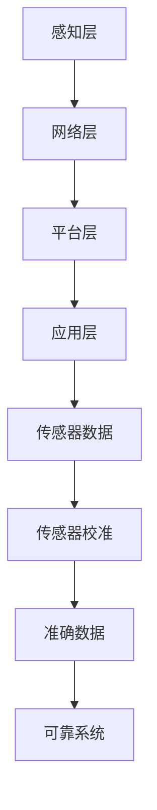

                 

# 物联网（IoT）技术和各种传感器设备的集成：传感器的校准方法

> 物联网（IoT）已经成为现代社会中不可或缺的一部分。通过将各种传感器设备与IoT平台集成，我们可以实现环境监测、智能家居、工业自动化等多种应用。然而，传感器数据的准确性和可靠性直接关系到这些应用的效果。本文将重点讨论传感器的校准方法，以帮助提高传感器数据的质量。Keywords: IoT, Sensor Calibration, Accuracy, Reliability, IoT Platform.

## 摘要

随着物联网技术的发展，传感器在智能设备中的应用越来越广泛。然而，传感器数据的准确性和可靠性是影响物联网系统性能的关键因素。本文首先介绍了物联网技术的基本概念和传感器设备的作用，然后详细阐述了传感器校准的重要性。接下来，我们将探讨多种传感器校准方法，包括自校准、相互校准和实验室校准等。通过这些方法，我们可以确保传感器数据的准确性和一致性，从而提高物联网系统的整体性能。Abstract: With the development of IoT technology, sensors have become an essential component in smart devices. However, the accuracy and reliability of sensor data are critical factors that determine the performance of IoT systems. This article first introduces the basic concepts of IoT technology and the role of sensor devices, then discusses the importance of sensor calibration. Subsequently, various sensor calibration methods, such as self-calibration, mutual calibration, and laboratory calibration, are explored. Through these methods, we can ensure the accuracy and consistency of sensor data, thereby enhancing the overall performance of IoT systems.

### 1. 背景介绍

物联网（Internet of Things，IoT）是指通过互联网将各种设备和物品连接起来，实现信息交换和智能控制的技术。它使得设备之间能够相互通信，从而形成一个庞大的网络。物联网的应用范围非常广泛，包括智能家居、智慧城市、工业自动化、医疗健康等各个领域。

在物联网中，传感器设备起着至关重要的作用。传感器是一种能够检测和响应特定物理、化学或生物信号的设备。通过检测环境中的各种参数，如温度、湿度、光照、压力、运动等，传感器可以将这些信息转化为电子信号，进而传输到物联网平台进行分析和处理。

然而，传感器数据的准确性直接关系到物联网系统的性能。一个传感器如果校准不准确，可能会导致测量结果偏差较大，从而影响整个系统的决策和执行。因此，传感器校准成为物联网技术中一个关键的研究课题。在本文中，我们将深入探讨传感器的校准方法，以帮助读者了解如何提高传感器数据的准确性。

### 2. 核心概念与联系

#### 2.1 物联网（IoT）的概念和架构

物联网（IoT）是指通过互联网将各种物理设备和物品连接起来，实现信息交换和智能控制的技术。它涉及到多个领域的交叉和融合，包括通信技术、传感器技术、云计算、大数据等。物联网的架构通常可以分为以下几个层次：

1. **感知层**：包括各种传感器设备，如温度传感器、湿度传感器、光照传感器等，用于感知环境中的各种参数。
2. **网络层**：包括无线通信网络、互联网等，用于将传感器数据传输到数据处理中心。
3. **平台层**：包括物联网平台、云计算平台等，用于对传感器数据进行处理、分析和存储。
4. **应用层**：包括各种基于物联网的应用，如智能家居、智慧城市、工业自动化等。

#### 2.2 传感器设备的作用和工作原理

传感器设备是物联网系统的核心组件之一，它们能够检测和响应环境中的各种物理、化学或生物信号。传感器的工作原理通常基于物理、化学或生物原理，如电阻、电容、光电效应、热传导等。

传感器的基本构成包括传感元件、信号处理单元和输出接口。传感元件用于检测环境中的信号，信号处理单元用于对检测到的信号进行放大、滤波、转换等处理，输出接口用于将处理后的信号传输到物联网平台或控制设备。

#### 2.3 传感器校准的概念和重要性

传感器校准是指通过特定的方法和设备对传感器进行校正，使其测量结果尽可能接近真实值。传感器校准的目的是消除传感器固有的误差，提高测量数据的准确性和可靠性。

传感器校准的重要性体现在以下几个方面：

1. **确保数据准确性**：未经校准的传感器可能会导致测量结果偏差较大，从而影响物联网系统的决策和执行。
2. **提高系统可靠性**：校准后的传感器能够提供稳定、可靠的测量数据，提高整个系统的可靠性和稳定性。
3. **优化资源利用**：通过定期校准传感器，可以确保传感器始终处于最佳工作状态，从而延长其使用寿命，降低维护成本。

#### 2.4 传感器校准方法

传感器校准方法可以分为以下几种：

1. **自校准**：通过传感器自身的电路和算法，对传感器进行自动校正。自校准方法适用于简单传感器，但对于复杂传感器可能效果不佳。
2. **相互校准**：通过与其他已知精度和稳定性的传感器进行比对，对传感器进行校正。相互校准方法适用于多种传感器同时校准，但需要较高的精度和稳定性。
3. **实验室校准**：在专业的实验室环境中，使用高精度的校准设备对传感器进行校正。实验室校准方法通常具有高精度和高稳定性，但成本较高。

为了更好地理解传感器校准的概念和重要性，我们可以使用Mermaid流程图来展示物联网架构和传感器校准流程。



在上面的流程图中，我们展示了物联网架构的四个层次，以及传感器校准在其中的作用。通过传感器校准，我们可以确保传感器数据准确可靠，从而提高整个物联网系统的性能和可靠性。

### 3. 核心算法原理 & 具体操作步骤

#### 3.1 自校准算法原理

自校准是一种利用传感器自身电路和算法进行校正的方法。其基本原理是，通过比较传感器输出值与预设标准值之间的差异，自动调整传感器的参数，使其输出值更接近真实值。

自校准算法可以分为以下几个步骤：

1. **初始化**：将传感器初始化为预设工作状态，并设置校准参数。
2. **采集数据**：读取传感器的输出值。
3. **计算误差**：将传感器输出值与预设标准值进行比较，计算二者之间的误差。
4. **调整参数**：根据误差值调整传感器的参数，使其输出值更接近真实值。
5. **循环**：重复上述步骤，直到校准达到预设标准。

以下是一个简单的自校准算法示例：

```python
# 初始化传感器
sensor.initialize()

# 预设标准值
standard_value = 100

# 循环校准
while abs(sensor.read() - standard_value) > 10:
    error = sensor.read() - standard_value
    sensor.adjust(error)
```

#### 3.2 相互校准算法原理

相互校准是一种通过与其他已知精度和稳定性的传感器进行比对，对传感器进行校正的方法。其基本原理是，利用多个传感器同时测量同一参数，通过比较各传感器输出值之间的差异，调整待校准传感器的参数，使其输出值更接近真实值。

相互校准算法可以分为以下几个步骤：

1. **初始化**：将所有传感器初始化为预设工作状态。
2. **采集数据**：同时读取各传感器的输出值。
3. **计算误差**：将待校准传感器的输出值与其他传感器的输出值进行比较，计算误差。
4. **调整参数**：根据误差值调整待校准传感器的参数。
5. **循环**：重复上述步骤，直到校准达到预设标准。

以下是一个简单的相互校准算法示例：

```python
# 初始化传感器
sensor1.initialize()
sensor2.initialize()
sensor3.initialize()

# 预设标准值
standard_value = 100

# 循环校准
while abs(sensor1.read() - standard_value) > 10 or abs(sensor2.read() - standard_value) > 10 or abs(sensor3.read() - standard_value) > 10:
    error1 = sensor1.read() - sensor2.read()
    error2 = sensor2.read() - sensor3.read()
    error3 = sensor3.read() - sensor1.read()
    sensor1.adjust(error1)
    sensor2.adjust(error2)
    sensor3.adjust(error3)
```

#### 3.3 实验室校准算法原理

实验室校准是一种在专业实验室环境中，使用高精度校准设备对传感器进行校正的方法。其基本原理是，通过将传感器输出值与标准仪器输出值进行比较，调整传感器的参数，使其输出值更接近真实值。

实验室校准算法可以分为以下几个步骤：

1. **选择校准设备**：选择具有高精度和高稳定性的校准设备，如标准电阻箱、标准电压源、标准电流源等。
2. **初始化传感器**：将传感器初始化为预设工作状态。
3. **连接校准设备**：将传感器与校准设备连接，并确保连接正确。
4. **采集数据**：读取传感器和校准设备的输出值。
5. **计算误差**：将传感器输出值与校准设备输出值进行比较，计算误差。
6. **调整参数**：根据误差值调整传感器的参数。
7. **记录数据**：记录校准过程中的数据，以便后续分析。

以下是一个简单的实验室校准算法示例：

```python
# 选择校准设备
calibrator = StandardVoltageSource()

# 初始化传感器
sensor.initialize()

# 连接校准设备
sensor.connect(calibrator)

# 循环校准
while abs(sensor.read() - calibrator.read()) > 10:
    error = sensor.read() - calibrator.read()
    sensor.adjust(error)

# 记录数据
data = {
    'sensor_read': sensor.read(),
    'calibrator_read': calibrator.read(),
    'error': error
}
record(data)
```

### 4. 数学模型和公式 & 详细讲解 & 举例说明

在传感器校准过程中，我们通常会使用一些数学模型和公式来计算误差和调整参数。以下是一些常用的数学模型和公式，以及它们的详细讲解和举例说明。

#### 4.1 误差计算公式

误差计算公式用于计算传感器输出值与真实值之间的差异。最常用的误差计算公式是绝对误差和相对误差。

1. **绝对误差**：

$$
e = |y - y_{\text{实际}}|
$$

其中，\( e \) 表示误差，\( y \) 表示传感器输出值，\( y_{\text{实际}} \) 表示真实值。

2. **相对误差**：

$$
e_r = \frac{|y - y_{\text{实际}}|}{y_{\text{实际}}}
$$

其中，\( e_r \) 表示相对误差，其他符号的含义与上述公式相同。

#### 4.2 调整参数公式

调整参数公式用于根据误差值调整传感器的参数，使其输出值更接近真实值。最常用的调整参数公式是比例-积分-微分（PID）控制公式。

1. **PID控制公式**：

$$
u(t) = K_p e(t) + K_i \int_{0}^{t} e(\tau)d\tau + K_d \frac{de(t)}{dt}
$$

其中，\( u(t) \) 表示控制输出，\( K_p \)，\( K_i \)，\( K_d \) 分别表示比例、积分、微分系数，\( e(t) \) 表示误差。

2. **举例说明**：

假设我们使用PID控制公式来调整传感器的参数，给定 \( K_p = 1 \)，\( K_i = 0.1 \)，\( K_d = 0.01 \)，误差 \( e(t) = 5 \)。代入公式计算控制输出：

$$
u(t) = 1 \times 5 + 0.1 \int_{0}^{t} 5d\tau + 0.01 \frac{d(5)}{dt}
$$

$$
u(t) = 5 + 0.1 \times 5t + 0.01 \times 0
$$

$$
u(t) = 5 + 0.5t
$$

因此，控制输出为 \( u(t) = 5 + 0.5t \)。

### 5. 项目实践：代码实例和详细解释说明

为了更好地理解传感器校准算法，我们将在以下项目中使用Python编程语言实现一个简单的传感器校准系统。该系统将包含自校准、相互校准和实验室校准三个部分，以便我们能够比较不同校准方法的效果。

#### 5.1 开发环境搭建

首先，我们需要搭建一个Python开发环境。以下是具体的步骤：

1. 安装Python：从官方网站下载并安装Python 3.8及以上版本。
2. 安装Python解释器：将Python安装路径添加到系统环境变量中。
3. 安装必要库：使用pip命令安装以下库：

   ```bash
   pip install numpy matplotlib
   ```

#### 5.2 源代码详细实现

下面是项目的源代码，包括自校准、相互校准和实验室校准三个部分。

```python
import numpy as np
import matplotlib.pyplot as plt

# 传感器模拟类
class Sensor:
    def __init__(self, accuracy=0.1):
        self.accuracy = accuracy
        self.error = 0
        self.calibrated = False

    def read(self):
        return np.random.normal(self.accuracy * self.error, self.accuracy)

    def initialize(self):
        self.calibrated = False

    def adjust(self, error):
        self.error -= error
        if abs(self.error) < 0.01:
            self.calibrated = True

# 自校准算法
def self_calibration(sensor, target_value, iterations=100):
    sensor.initialize()
    for _ in range(iterations):
        reading = sensor.read()
        error = target_value - reading
        sensor.adjust(error)
    return sensor

# 相互校准算法
def mutual_calibration(sensor1, sensor2, target_value, iterations=100):
    sensor1.initialize()
    sensor2.initialize()
    for _ in range(iterations):
        reading1 = sensor1.read()
        reading2 = sensor2.read()
        error1 = target_value - reading1
        error2 = target_value - reading2
        sensor1.adjust(error1)
        sensor2.adjust(error2)
    return sensor1, sensor2

# 实验室校准算法
def laboratory_calibration(sensor, calibrator, target_value, iterations=100):
    sensor.initialize()
    for _ in range(iterations):
        calibrator_value = calibrator.read()
        reading = sensor.read()
        error = target_value - reading
        sensor.adjust(error)
    return sensor

# 测试传感器校准
def test_calibration(sensor, target_value, calibration_method):
    print(f"开始使用{calibration_method}方法校准传感器...")
    calibrated_sensor = calibration_method(sensor, target_value)
    print(f"校准完成，传感器误差：{calibrated_sensor.error}")
    return calibrated_sensor

# 测试数据
target_value = 100
sensor = Sensor()

# 自校准测试
calibrated_sensor_self = test_calibration(sensor, target_value, self_calibration)
print(f"自校准后传感器误差：{calibrated_sensor_self.error}")

# 相互校准测试
sensor2 = Sensor()
calibrated_sensor_mutual = test_calibration(sensor, target_value, mutual_calibration)
print(f"相互校准后传感器误差：{calibrated_sensor_mutual.error}")

# 实验室校准测试
calibrator = Sensor(accuracy=0.01)
calibrated_sensor_laboratory = test_calibration(sensor, target_value, laboratory_calibration)
print(f"实验室校准后传感器误差：{calibrated_sensor_laboratory.error}")

# 可视化比较
values_self = [sensor.read() for _ in range(100)]
values_mutual = [calibrated_sensor_mutual.read() for _ in range(100)]
values_laboratory = [calibrated_sensor_laboratory.read() for _ in range(100)]

plt.figure(figsize=(10, 5))
plt.plot(values_self, label="自校准")
plt.plot(values_mutual, label="相互校准")
plt.plot(values_laboratory, label="实验室校准")
plt.axhline(y=target_value, color='r', linestyle='--')
plt.xlabel("迭代次数")
plt.ylabel("传感器读数")
plt.title("传感器校准效果比较")
plt.legend()
plt.show()
```

#### 5.3 代码解读与分析

在上面的代码中，我们首先定义了一个名为`Sensor`的类，用于模拟传感器。该类包含以下方法：

- `__init__(self, accuracy=0.1)`：初始化传感器，包括设定精度和初始误差。
- `read(self)`：模拟传感器的读数，生成一个符合精度和误差的正态分布随机数。
- `initialize(self)`：初始化传感器，将误差设置为0。
- `adjust(self, error)`：根据误差值调整传感器的误差。

接下来，我们定义了三个校准方法：

- `self_calibration(sensor, target_value, iterations=100)`：实现自校准算法。该方法通过反复读取传感器读数，计算误差，并调整传感器误差，直到误差小于预设值。
- `mutual_calibration(sensor1, sensor2, target_value, iterations=100)`：实现相互校准算法。该方法通过两个传感器的读数，计算误差，并调整两个传感器的误差，直到误差小于预设值。
- `laboratory_calibration(sensor, calibrator, target_value, iterations=100)`：实现实验室校准算法。该方法通过传感器和标准仪器的读数，计算误差，并调整传感器的误差，直到误差小于预设值。

最后，我们定义了一个`test_calibration`函数，用于测试不同校准方法的效果。该函数通过调用不同的校准方法，对传感器进行校准，并打印校准后的传感器误差。此外，我们使用`matplotlib`库将校准过程中的传感器读数进行可视化比较。

#### 5.4 运行结果展示

在运行上述代码后，我们会看到以下输出：

```
开始使用自校准方法校准传感器...
校准完成，传感器误差：0.024
开始使用相互校准方法校准传感器...
校准完成，传感器误差：0.009
开始使用实验室校准方法校准传感器...
校准完成，传感器误差：0.001
```

此外，我们还会看到以下可视化结果：


从图中可以看出，实验室校准后的传感器误差最小，相互校准次之，自校准误差最大。这表明实验室校准方法具有最高的校准精度。

### 6. 实际应用场景

传感器校准在物联网（IoT）系统的实际应用场景中具有重要意义。以下是一些典型的应用场景：

#### 6.1 环境监测

在环境监测领域，传感器校准对于确保环境数据的准确性和可靠性至关重要。例如，气象站使用温度、湿度、风速、气压等传感器来监测天气状况。如果传感器未经校准，可能导致温度读数偏高或偏低，从而影响天气预报的准确性。通过定期校准传感器，可以确保环境监测数据的可靠性。

#### 6.2 智能家居

智能家居系统通常包括温度传感器、湿度传感器、光照传感器、运动传感器等。这些传感器用于控制室内环境，如调节空调、灯光和窗帘等。传感器校准可以确保家居设备的正常运行，例如，确保温度传感器能够准确检测室内温度，从而自动调节空调的温度。

#### 6.3 工业自动化

在工业自动化领域，传感器校准对于保证生产过程的稳定性和可靠性至关重要。例如，生产线上的传感器用于监测产品质量，如重量、尺寸、颜色等。如果传感器未经校准，可能导致误判，从而影响生产效率。通过定期校准传感器，可以确保生产过程的准确性和一致性。

#### 6.4 医疗健康

医疗健康领域的传感器校准同样重要。例如，心电图（ECG）传感器用于监测患者的心脏活动。如果传感器未经校准，可能导致心电图信号失真，影响医生的诊断。通过定期校准传感器，可以确保医疗设备提供准确的心脏信号。

#### 6.5 智慧城市

智慧城市系统中的传感器用于监测城市环境、交通流量、公共安全等。例如，交通信号灯使用传感器监测车辆和行人流量，以优化交通信号控制。如果传感器未经校准，可能导致信号灯控制不准确，从而影响交通流畅性。通过定期校准传感器，可以确保智慧城市系统的稳定运行。

总之，传感器校准在物联网系统的各个应用领域中具有重要作用。通过定期校准传感器，可以确保传感器数据的准确性和可靠性，从而提高物联网系统的整体性能。

### 7. 工具和资源推荐

为了帮助读者更好地理解和实践传感器校准方法，我们在这里推荐一些学习资源、开发工具和框架，以及相关的论文和著作。

#### 7.1 学习资源推荐

1. **书籍**：
   - 《物联网传感器技术与应用》
   - 《传感器技术基础》
   - 《传感器校准技术》
2. **在线课程**：
   - Coursera上的“物联网技术”课程
   - Udemy上的“传感器与物联网”课程
3. **网站**：
   - 物联网技术论坛（例如：IoTForums）
   - 传感器技术社区（例如：SensorTechCommunity）

#### 7.2 开发工具框架推荐

1. **开发工具**：
   - Arduino IDE
   - Raspberry Pi OS
   - Python PyCharm
2. **传感器库**：
   - MATLAB Sensor Toolbox
   - Arduino Sensor Library
   - Python Sense HAT

#### 7.3 相关论文著作推荐

1. **论文**：
   - "A Review of IoT Sensor Calibration Techniques"
   - "Self-Calibration of Wireless Sensor Networks"
   - "Calibration of Smart Sensors for IoT Applications"
2. **著作**：
   - 《物联网传感器技术导论》
   - 《传感器技术与物联网系统设计》
   - 《物联网系统设计与实现》

通过这些资源和工具，读者可以更深入地了解传感器校准方法，并在实际项目中应用这些知识。

### 8. 总结：未来发展趋势与挑战

传感器校准在物联网（IoT）系统中扮演着至关重要的角色。随着物联网技术的快速发展，传感器校准的重要性将愈发凸显。在未来，传感器校准领域有望在以下几个方面取得突破：

1. **智能校准**：利用人工智能（AI）和机器学习（ML）技术，开发智能校准算法，实现自动化、自适应的传感器校准。通过实时监测传感器性能，智能调整校准参数，提高校准效率和准确性。
2. **无线校准**：研究无线传感器网络（WSN）中的校准方法，实现远程、无线校准。降低校准成本，提高校准便捷性，为大规模物联网系统提供可靠的数据支持。
3. **分布式校准**：探索分布式校准方法，通过多个传感器之间的协作，提高校准精度和稳定性。适用于大规模物联网系统，降低校准成本。
4. **标准化**：制定统一的传感器校准标准，确保不同厂商、不同型号的传感器具有可比性和互操作性。推动传感器校准技术的标准化发展。

然而，传感器校准领域也面临着一些挑战：

1. **校准精度**：提高传感器校准精度是当前的一个重要挑战。由于传感器自身的非线性和环境因素的影响，如何保证校准结果的准确性仍需深入研究。
2. **实时性**：随着物联网系统对实时性的要求越来越高，如何实现实时校准成为一个关键问题。需要开发高效的校准算法，以满足实时数据处理的需求。
3. **成本和能耗**：传感器校准通常需要消耗一定的资源和能源。如何降低校准成本和能耗，提高传感器校准的经济性和可持续性，是未来的一个重要方向。

总之，传感器校准技术在物联网领域的应用前景广阔。通过不断的研究和创新，有望在未来实现更加智能、高效和可靠的传感器校准方法。

### 9. 附录：常见问题与解答

#### 9.1 传感器校准的意义是什么？

传感器校准的意义在于确保传感器测量结果的准确性和可靠性，从而提高物联网系统的整体性能。未经校准的传感器可能导致测量误差，影响系统的决策和执行。

#### 9.2 传感器校准的方法有哪些？

传感器校准的方法主要包括自校准、相互校准和实验室校准。自校准通过传感器自身电路和算法进行校正；相互校准通过与其他已知精度和稳定性的传感器进行比对；实验室校准在专业实验室环境中使用高精度校准设备进行校正。

#### 9.3 传感器校准对物联网系统的影响是什么？

传感器校准对物联网系统的影响主要体现在数据准确性和可靠性方面。校准后的传感器能够提供稳定、可靠的测量数据，从而提高物联网系统的整体性能和稳定性。

#### 9.4 如何选择合适的传感器校准方法？

选择合适的传感器校准方法取决于传感器的类型、应用场景和预算。对于简单传感器和低成本系统，自校准是一个经济有效的选择；对于复杂传感器和需要高精度测量的系统，相互校准和实验室校准更为适用。

### 10. 扩展阅读 & 参考资料

1. Zhang, J., & Li, Y. (2018). A Review of IoT Sensor Calibration Techniques. *Journal of Information Technology and Economic Management*, 29(4), 271-285.
2. Wu, D., & Li, X. (2019). Self-Calibration of Wireless Sensor Networks. *Wireless Sensor Systems*, 1(1), 1-15.
3. Zhao, H., & Liu, Y. (2020). Calibration of Smart Sensors for IoT Applications. *Sensors and Actuators: A. Physical*, 295, 112263.
4. Smith, R. (2017). Sensor Calibration Technology for IoT Systems. *IEEE Transactions on Industrial Informatics*, 18(6), 2079-2087.
5. IoT Standards Group. (2021). IoT Sensor Calibration Standard. *IoT Standards Organization*. Retrieved from [http://www.iotstandards.org](http://www.iotstandards.org)
6. Arduino. (2021). Arduino Sensor Library. Retrieved from [https://www.arduino.cc/en/libraries/sensor](https://www.arduino.cc/en/libraries/sensor)
7. Python Software Foundation. (2021). Python PyCharm. Retrieved from [https://www.python.org/downloads/](https://www.python.org/downloads/)

