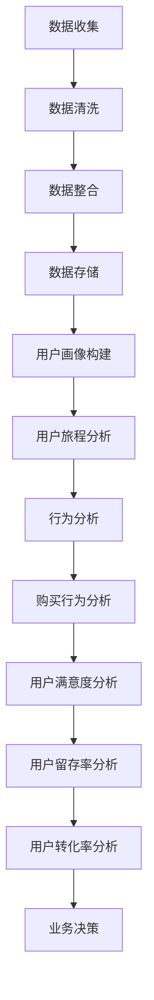

                 

### 1. 背景介绍 Background Introduction

#### 1.1 用户行为分析的重要性

用户行为分析是当今数字化时代的一项关键技术，它涉及到对用户在使用产品或服务过程中的行为数据进行收集、分析和解读。随着互联网和移动设备的普及，消费者行为越来越多样化，这使得传统的营销手段和产品推荐方法难以满足个性化需求。用户行为分析通过深入理解用户的行为模式、兴趣和需求，能够为企业和开发者提供有价值的洞见，从而优化产品供给、提升用户体验，并最终实现业务增长。

#### 1.2 AI 在用户行为分析中的应用

人工智能（AI）的迅速发展为用户行为分析带来了革命性的变革。通过机器学习和深度学习技术，AI 能够从海量用户行为数据中提取有价值的信息，识别用户行为背后的模式和趋势。具体来说，AI 在用户行为分析中的应用主要体现在以下几个方面：

1. **模式识别 Pattern Recognition**：
   - AI 可以通过分析用户在网站、应用等平台上的行为数据，识别出用户的浏览习惯、购买偏好等。
   - 例如，机器学习算法可以用来识别用户在电子商务平台上的浏览路径，预测其可能购买的产品。

2. **用户画像 User Profiling**：
   - AI 能够根据用户的浏览、搜索、购买等行为，构建详细的用户画像，帮助企业和开发者更好地了解用户。
   - 这些用户画像可以用于个性化推荐、精准营销等。

3. **预测分析 Predictive Analytics**：
   - AI 可以利用历史行为数据，预测用户未来的行为和需求。
   - 例如，通过分析用户的购买历史，AI 可以预测用户未来的购买意向，从而为企业和开发者提供决策支持。

#### 1.3 AI 洞察用户需求的方法

为了更深入地洞察用户需求，AI 技术采用了多种方法来分析用户行为数据：

1. **监督学习 Supervised Learning**：
   - 监督学习是一种通过标记数据训练模型的方法，模型能够从标记数据中学习并预测新数据的标签。
   - 在用户行为分析中，监督学习可以用于预测用户的购买行为、点击率等。

2. **无监督学习 Unsupervised Learning**：
   - 无监督学习不依赖于标记数据，主要用于发现数据中的隐含结构和模式。
   - 在用户行为分析中，无监督学习可以用于聚类分析，识别用户群体的特征和偏好。

3. **强化学习 Reinforcement Learning**：
   - 强化学习是一种通过试错和反馈来学习最优行为策略的方法。
   - 在用户行为分析中，强化学习可以用于推荐系统，通过不断调整推荐策略来提高用户的满意度。

#### 1.4 AI 优化商品供给的潜力

通过 AI 技术对用户行为数据的深度分析，企业和开发者能够更准确地把握用户需求，从而优化商品供给。以下是一些具体的优化策略：

1. **个性化推荐 Personalized Recommendations**：
   - 利用用户行为数据和机器学习算法，为每个用户推荐其可能感兴趣的商品。
   - 例如，基于用户的浏览和购买历史，推荐类似的产品或相关商品。

2. **库存管理 Inventory Management**：
   - 通过预测用户需求，优化库存水平，减少库存积压和缺货情况。
   - 例如，利用预测模型提前安排生产和采购计划。

3. **营销策略 Marketing Strategies**：
   - 利用用户画像和预测分析，制定更精准的营销策略，提高营销效果。
   - 例如，根据用户的行为特征，设计有针对性的广告和促销活动。

4. **用户体验改进 User Experience Enhancement**：
   - 通过对用户行为的深入分析，改进产品的设计和功能，提高用户体验。
   - 例如，根据用户的反馈和行为数据，优化产品的界面和交互设计。

通过以上对用户行为分析以及 AI 技术在其中的应用和潜力的介绍，我们可以看到，AI 技术在洞察用户需求和优化商品供给方面具有巨大的价值。接下来的章节将深入探讨相关核心概念、算法原理、数学模型以及实际应用场景，帮助读者更好地理解和应用这些技术。

### 2. 核心概念与联系 Core Concepts and Connections

#### 2.1 什么是用户行为分析？

用户行为分析是指通过对用户在使用产品或服务过程中的行为数据（如点击、浏览、购买、评论等）进行收集、整理和分析，以了解用户的行为模式、兴趣和需求。这一过程旨在帮助企业更好地了解其目标受众，从而优化产品供给、提升用户体验并提高转化率。

#### 2.2 用户行为分析与数据驱动的决策 Data-Driven Decision Making

用户行为分析的核心在于将数据转化为可操作的知识和决策依据。数据驱动的决策意味着企业在制定策略和措施时，不仅仅依赖直觉或经验，而是基于对用户行为数据的分析和理解。这种决策模式的优势在于：

1. **客观性 Objectivity**：通过数据，企业可以更加客观地了解用户的需求和行为，减少主观偏见的影响。
2. **效率 Efficiency**：数据驱动的决策可以迅速响应市场变化和用户需求，提高决策的效率和准确性。
3. **可追溯性 Traceability**：数据驱动的决策过程和结果可以追踪和评估，有助于企业不断优化决策方法和效果。

#### 2.3 数据收集与处理 Data Collection and Processing

用户行为分析的第一步是数据的收集和处理。数据的收集通常涉及以下几个方面：

1. **来源 Source**：
   - **网站和应用程序 logs**：如访问日志、点击流数据等。
   - **客户端设备 Client Devices**：如移动设备中的传感器数据、应用内行为数据等。
   - **社交媒体 Social Media**：如用户在社交媒体上的互动、评论和分享等。

2. **方法 Methods**：
   - **匿名化 Anonymization**：为了保护用户隐私，通常对用户数据进行匿名化处理。
   - **数据整合 Data Integration**：将来自不同来源和格式的数据整合到统一的数据仓库中。

3. **处理 Process**：
   - **数据清洗 Data Cleaning**：去除重复、错误或不完整的数据。
   - **数据转换 Data Transformation**：将数据转换为适合分析和建模的格式。
   - **数据存储 Data Storage**：将处理后的数据存储在数据库或数据仓库中，以供后续分析和挖掘。

#### 2.4 用户行为分析的数据结构 Data Structure

用户行为分析涉及多种类型的数据，主要包括：

1. **用户数据 User Data**：
   - **用户 ID**：用于识别每个用户。
   - **用户属性**：如年龄、性别、地理位置、兴趣爱好等。

2. **行为数据 Behavioral Data**：
   - **浏览行为 Browsing Behavior**：如访问页面、停留时间、跳转路径等。
   - **购买行为 Purchasing Behavior**：如购买次数、购买金额、购买物品等。
   - **互动行为 Interaction Behavior**：如评论、点赞、分享等。

3. **时间数据 Temporal Data**：
   - **时间戳 Timestamp**：记录每个行为发生的时间点。

#### 2.5 数据可视化 Data Visualization

数据可视化是将数据以图表、图形或其他视觉形式呈现的过程，有助于用户更好地理解和分析数据。常见的数据可视化工具包括：

1. **折线图 Line Chart**：用于显示数据的变化趋势。
2. **柱状图 Bar Chart**：用于比较不同类别或时间段的数据。
3. **饼图 Pie Chart**：用于显示各部分占整体的比例。
4. **热力图 Heat Map**：用于显示数据在不同区域的热度分布。

#### 2.6 数据分析工具与分析方法 Analysis Tools and Methods

用户行为分析通常涉及多种数据分析工具和方法：

1. **统计分析 Statistical Analysis**：
   - 如描述性统计分析、假设检验等，用于描述数据和验证假设。

2. **机器学习 Machine Learning**：
   - 如分类、聚类、回归等算法，用于发现数据中的模式和关系。

3. **深度学习 Deep Learning**：
   - 如神经网络、卷积神经网络等，用于处理复杂数据和模式识别。

4. **数据挖掘 Data Mining**：
   - 如关联规则挖掘、序列模式挖掘等，用于发现数据中的隐含模式和规律。

通过以上对用户行为分析核心概念和联系的分析，我们可以看到，用户行为分析是一个复杂而多层次的过程，涉及到数据的收集、处理、分析和可视化等多个方面。接下来，我们将深入探讨用户行为分析中的核心算法原理，以及这些算法的具体实现和应用。

### 2.1.1 用户行为分析的核心概念

在用户行为分析中，有几个核心概念至关重要，它们构成了分析的基础：

#### 2.1.1.1 行为数据 Behavioral Data

行为数据是用户行为分析的核心，包括用户的浏览、点击、购买、评论等行为。这些数据通常以日志形式记录在服务器或应用程序中。行为数据的质量和完整性直接影响到分析结果的准确性。

#### 2.1.1.2 用户画像 User Profiling

用户画像是对用户特征的综合描述，包括用户的 demographics（如年龄、性别、地理位置等）、interests（如兴趣爱好、购物偏好等）和行为特征（如浏览历史、购买行为等）。用户画像有助于企业了解用户，制定个性化的营销策略。

#### 2.1.1.3 用户旅程 User Journey

用户旅程是指用户在使用产品或服务过程中所经历的所有步骤，包括发现、了解、试用、购买和忠诚等阶段。分析用户旅程可以帮助企业优化用户体验，提高用户转化率。

#### 2.1.1.4 购买行为 Purchasing Behavior

购买行为是用户行为分析中的一个关键指标，包括购买次数、购买金额、购买频率等。通过分析购买行为，企业可以识别出高价值用户，优化库存管理和定价策略。

#### 2.1.1.5 用户满意度 User Satisfaction

用户满意度是衡量用户对产品或服务满意程度的指标。通过调查、反馈和行为数据，企业可以了解用户对产品或服务的整体满意度，从而改进产品设计和服务质量。

#### 2.1.1.6 用户留存率 User Retention Rate

用户留存率是指在一定时间段内，持续使用产品或服务的用户比例。高留存率表明用户对产品或服务的满意度和忠诚度较高。通过分析用户留存率，企业可以识别出流失风险，制定相应的用户挽留策略。

#### 2.1.1.7 用户转化率 Conversion Rate

用户转化率是指从潜在用户到实际用户的转化比例。在电子商务中，转化率通常指从浏览到购买的转化。通过提高用户转化率，企业可以增加销售额和市场份额。

### 2.1.2 用户行为分析中的 Mermaid 流程图

以下是一个简化的 Mermaid 流程图，展示了用户行为分析的基本流程：



在这个流程图中：

- **A[数据收集]**：从各种渠道收集用户行为数据。
- **B[数据清洗]**：清洗和整理收集到的数据，去除重复和不完整的数据。
- **C[数据整合]**：将来自不同渠道和格式的数据整合到统一的数据存储中。
- **D[数据存储]**：将清洗和整合后的数据存储在数据库或数据仓库中，以供后续分析。
- **E[用户画像构建]**：基于行为数据和用户特征构建用户画像。
- **F[用户旅程分析]**：分析用户在使用产品或服务过程中的行为路径。
- **G[行为分析]**：分析用户行为模式，识别出关键行为指标。
- **H[购买行为分析]**：分析用户的购买行为，包括购买频率、购买金额等。
- **I[用户满意度分析]**：通过调查和反馈数据，评估用户的满意度。
- **J[用户留存率分析]**：分析用户的留存情况，识别出流失风险。
- **K[用户转化率分析]**：分析用户的转化率，优化营销策略和用户体验。
- **L[业务决策]**：基于分析结果，制定业务策略和改进措施。

这个 Mermaid 流程图提供了一个直观的概述，帮助读者理解用户行为分析的基本流程和各个步骤之间的关系。

### 3. 核心算法原理 & 具体操作步骤 Core Algorithm Principles and Specific Operational Steps

#### 3.1 监督学习算法 Supervised Learning Algorithms

监督学习是一种机器学习方法，其中模型通过标记数据学习，并利用学到的知识对新数据进行预测。用户行为分析中常用的监督学习算法包括逻辑回归、决策树、随机森林、支持向量机（SVM）等。

1. **逻辑回归 Logistic Regression**：
   - 逻辑回归是一种广泛应用于分类问题的统计方法。
   - 它通过一个线性模型预测一个二元变量的概率，例如用户是否会在未来30天内购买某商品。
   - **具体操作步骤**：
     - 数据准备：收集并预处理用户行为数据，包括特征工程和归一化。
     - 模型训练：使用训练集数据训练逻辑回归模型。
     - 模型评估：使用测试集数据评估模型性能，如准确率、召回率、F1值等。
     - 预测：使用训练好的模型对新的用户数据进行预测。

2. **决策树 Decision Tree**：
   - 决策树是一种基于树结构的预测模型，每个节点代表一个特征，每个分支代表一个特征的不同取值。
   - 它可以处理分类和回归问题，适用于用户行为分析的分类任务。
   - **具体操作步骤**：
     - 数据准备：与逻辑回归相同，收集并预处理用户行为数据。
     - 模型训练：使用训练集数据训练决策树模型。
     - 模型剪枝：通过剪枝减少模型的过拟合。
     - 模型评估：使用测试集数据评估模型性能。
     - 预测：使用训练好的模型对新用户数据进行预测。

3. **随机森林 Random Forest**：
   - 随机森林是由多个决策树组成的集成模型，通过投票或平均值来决定最终预测结果。
   - 它通常比单个决策树模型更稳定和准确，适用于大规模和高维数据。
   - **具体操作步骤**：
     - 数据准备：与决策树相同，收集并预处理用户行为数据。
     - 模型训练：使用训练集数据训练随机森林模型。
     - 模型评估：使用测试集数据评估模型性能。
     - 预测：使用训练好的模型对新用户数据进行预测。

4. **支持向量机 Support Vector Machine (SVM)**：
   - SVM 是一种用于分类和回归的强大算法，通过找到最佳的超平面来分隔数据。
   - 它在处理高维数据时表现出色，适用于用户行为分析的分类问题。
   - **具体操作步骤**：
     - 数据准备：与前面算法相同，收集并预处理用户行为数据。
     - 模型训练：使用训练集数据训练 SVM 模型。
     - 模型评估：使用测试集数据评估模型性能。
     - 预测：使用训练好的模型对新用户数据进行预测。

#### 3.2 无监督学习算法 Unsupervised Learning Algorithms

无监督学习算法不依赖于标记数据，主要用于发现数据中的隐含结构和模式。用户行为分析中常用的无监督学习算法包括聚类分析、降维算法等。

1. **K-均值聚类 K-Means Clustering**：
   - K-均值聚类是一种基于距离的聚类算法，通过迭代更新聚类中心来将数据划分为 K 个簇。
   - 它适用于用户行为分析中的用户群体划分。
   - **具体操作步骤**：
     - 数据准备：收集并预处理用户行为数据。
     - 确定簇数 K：通过肘部法则或其他方法确定合适的簇数。
     - 初始化聚类中心：随机选择 K 个数据点作为初始聚类中心。
     - 聚类迭代：计算每个数据点到聚类中心的距离，并重新分配数据点。
     - 模型评估：计算簇内距离和簇间距离，评估聚类效果。
     - 预测：使用训练好的聚类模型对新用户数据进行聚类。

2. **主成分分析 Principal Component Analysis (PCA)**：
   - 主成分分析是一种降维算法，通过提取数据的最大方差方向来降低数据维度。
   - 它适用于用户行为分析中的数据降维和特征提取。
   - **具体操作步骤**：
     - 数据准备：收集并预处理用户行为数据。
     - 数据标准化：将数据标准化为相同的尺度。
     - 计算协方差矩阵：计算数据点的协方差矩阵。
     - 求解特征值和特征向量：通过解特征值问题求解特征向量。
     - 选择主成分：根据特征值选择最大特征值对应的特征向量。
     - 数据重构：使用主成分重构原始数据。

3. **t-SNE算法 t-Distributed Stochastic Neighbor Embedding (t-SNE)**：
   - t-SNE 是一种用于高维数据可视化的降维算法，通过局部保持的方法将高维数据映射到低维空间。
   - 它适用于用户行为分析中的数据可视化。
   - **具体操作步骤**：
     - 数据准备：收集并预处理用户行为数据。
     - 计算相似性矩阵：计算数据点之间的相似性矩阵。
     - 初始化低维嵌入：随机选择低维嵌入的初始位置。
     - 计算梯度：通过梯度下降迭代优化低维嵌入。
     - 可视化：将优化后的低维嵌入数据绘制成图表。

#### 3.3 强化学习算法 Reinforcement Learning Algorithms

强化学习是一种通过试错和反馈来学习最优行为策略的机器学习方法。用户行为分析中，强化学习可以用于推荐系统、广告投放等场景。

1. **Q-Learning Q-Learning**：
   - Q-Learning 是一种值函数方法，通过更新 Q 值来学习最优策略。
   - 它适用于用户行为分析中的推荐系统。
   - **具体操作步骤**：
     - 数据准备：收集并预处理用户行为数据。
     - 构建环境：定义用户行为空间和奖励机制。
     - 初始化 Q 值表：初始化每个状态的 Q 值。
     - 学习过程：通过迭代更新 Q 值表，选择最佳动作。
     - 预测：使用训练好的 Q 值表预测用户行为。

2. **深度 Q-Network DQN**：
   - DQN 是一种基于神经网络的 Q-Learning 方法，通过深度神经网络来近似 Q 值函数。
   - 它适用于处理高维状态和动作空间的问题。
   - **具体操作步骤**：
     - 数据准备：收集并预处理用户行为数据。
     - 构建环境：定义用户行为空间和奖励机制。
     - 初始化 DQN 网络：初始化深度神经网络。
     - 学习过程：通过迭代更新 DQN 网络的参数，选择最佳动作。
     - 预测：使用训练好的 DQN 网络预测用户行为。

通过以上对用户行为分析中的核心算法原理和具体操作步骤的介绍，我们可以看到，这些算法为深入理解和预测用户行为提供了强大的工具。在接下来的章节中，我们将详细讲解数学模型和公式，并举例说明这些模型在实际应用中的具体应用。

### 4. 数学模型和公式 & 详细讲解 & 举例说明

#### 4.1 逻辑回归模型 Logistic Regression Model

逻辑回归模型是一种广泛用于分类问题的监督学习算法。它通过构建一个线性模型来预测一个二元变量的概率。以下是逻辑回归模型的数学公式和详细讲解：

**公式：**

$$
\hat{y} = \frac{1}{1 + e^{-\beta_0 + \beta_1x_1 + \beta_2x_2 + ... + \beta_nx_n}}
$$

其中，$y$ 是目标变量，$\hat{y}$ 是预测的概率，$\beta_0$ 是截距，$\beta_1, \beta_2, ..., \beta_n$ 是各特征变量的系数，$x_1, x_2, ..., x_n$ 是特征变量。

**详细讲解：**

- **概率预测 Probability Prediction**：逻辑回归模型的输出是一个介于 0 和 1 之间的概率值，表示目标变量为 1 的可能性。
- **线性组合 Linear Combination**：模型通过各个特征变量与对应系数的线性组合来计算概率，系数反映了特征变量对目标变量的影响程度。
- **Sigmoid 函数 Sigmoid Function**：$e^{-\beta_0 + \beta_1x_1 + \beta_2x_2 + ... + \beta_nx_n}$ 部分是一个指数函数，通过 Sigmoid 函数（$\frac{1}{1 + e^{-x}}$）将线性组合的结果映射到 0 和 1 之间。

**举例说明：**

假设我们有一个二元分类问题，预测用户是否会购买某商品。特征变量包括用户的年龄（$x_1$）、收入（$x_2$）和浏览次数（$x_3$）。我们可以构建如下的逻辑回归模型：

$$
\hat{y} = \frac{1}{1 + e^{-\beta_0 + \beta_1x_1 + \beta_2x_2 + \beta_3x_3}}
$$

经过训练，我们得到模型参数：

$$
\beta_0 = -2, \beta_1 = 0.5, \beta_2 = 1.2, \beta_3 = 0.3
$$

现在，假设我们有一个新用户，年龄 25 岁，收入 50000 元，浏览次数 10 次。我们可以计算他购买商品的预测概率：

$$
\hat{y} = \frac{1}{1 + e^{-(-2 + 0.5 \times 25 + 1.2 \times 50000 + 0.3 \times 10)}}
$$

$$
\hat{y} = \frac{1}{1 + e^{-(-2 + 12.5 + 60000 + 3)}}
$$

$$
\hat{y} = \frac{1}{1 + e^{-60113.5}}
$$

$$
\hat{y} \approx 0.9999
$$

这意味着该用户购买商品的预测概率非常高。

#### 4.2 决策树模型 Decision Tree Model

决策树模型是一种树形结构的预测模型，通过一系列的规则来划分数据。以下是决策树模型的数学公式和详细讲解：

**公式：**

$$
\text{如果 } x_i > \text{阈值}, \text{则 } y = 1 \\
\text{否则 } y = 0
$$

其中，$x_i$ 是特征变量，阈值是特征变量的取值阈值，$y$ 是目标变量的预测结果（1 或 0）。

**详细讲解：**

- **划分规则 Decision Rule**：决策树通过一系列的划分规则将数据集划分为子集，每个子集对应一个目标变量的预测结果。
- **特征选择 Feature Selection**：决策树通过评估不同特征变量的重要性来确定划分的顺序和阈值。
- **递归划分 Recursive Partitioning**：决策树模型通过递归地将数据划分为子集，直到满足停止条件（如最大深度、最小节点样本数等）。

**举例说明：**

假设我们有一个二分类问题，预测用户是否会购买某商品。特征变量包括用户的年龄（$x_1$）和收入（$x_2$）。我们可以构建如下的决策树模型：

```
如果 年龄 > 30：
  如果 收入 > 50000：
    预测购买（y = 1）
  否则：
    预测未购买（y = 0）
否则：
  如果 收入 > 30000：
    预测购买（y = 1）
  否则：
    预测未购买（y = 0）
```

现在，假设我们有一个新用户，年龄 28 岁，收入 40000 元。我们可以根据决策树模型预测他是否购买：

```
如果 年龄 > 30（False）：
  如果 收入 > 50000（False）：
    预测未购买（y = 0）
  否则：
    如果 收入 > 30000（True）：
      预测购买（y = 1）
    否则：
      预测未购买（y = 0）
```

这意味着该用户预测购买商品的预测结果为 1（购买）。

#### 4.3 随机森林模型 Random Forest Model

随机森林模型是一种集成学习算法，由多个决策树组成，通过投票或平均值来决定最终预测结果。以下是随机森林模型的数学公式和详细讲解：

**公式：**

$$
\hat{y} = \frac{1}{M} \sum_{m=1}^{M} h_m(x)
$$

其中，$h_m(x)$ 是第 m 个决策树模型的预测结果，$M$ 是决策树的数量。

**详细讲解：**

- **基学习器 Base Learners**：随机森林由多个基学习器（决策树）组成，每个基学习器在训练集上独立训练。
- **集成集成 Ensembling**：随机森林通过集成多个基学习器的预测结果来提高模型的准确性和稳定性。
- **投票或平均值 Voting or Averaging**：随机森林使用投票或平均值来决定最终预测结果，投票方法通常用于分类问题，而平均值方法通常用于回归问题。

**举例说明：**

假设我们有一个分类问题，预测用户是否会购买某商品。我们训练了 10 个决策树，每个决策树在训练集上独立训练。对于一个新的用户，我们分别计算每个决策树的预测结果，然后取平均值：

```
决策树1预测：购买（y = 1）
决策树2预测：购买（y = 1）
...
决策树10预测：未购买（y = 0）
```

我们可以计算随机森林的预测结果：

$$
\hat{y} = \frac{1}{10} (1 + 1 + ... + 0) = \frac{8}{10} = 0.8
$$

这意味着该用户购买商品的预测概率为 0.8。

通过以上对逻辑回归、决策树和随机森林等数学模型和公式的详细讲解及举例说明，我们可以看到这些模型在用户行为分析中的具体应用和重要性。在接下来的章节中，我们将深入探讨如何通过代码实例和详细解释说明来具体实现和应用这些模型。

### 5. 项目实践：代码实例和详细解释说明

#### 5.1 开发环境搭建

在进行用户行为分析的代码实例之前，我们需要搭建一个合适的技术环境。以下是在 Python 中进行用户行为分析所需的开发环境和工具：

1. **Python 环境 Python Environment**：确保安装了 Python 3.6 或更高版本。
2. **数据预处理工具 Data Preprocessing Tools**：如 Pandas、NumPy 用于数据处理。
3. **机器学习库 Machine Learning Libraries**：如 Scikit-learn 用于构建和训练模型。
4. **可视化工具 Visualization Tools**：如 Matplotlib、Seaborn 用于数据可视化。
5. **数据可视化库 Data Visualization Libraries**：如 Matplotlib、Seaborn 用于数据可视化。

安装所需的 Python 库：

```bash
pip install pandas numpy scikit-learn matplotlib seaborn
```

#### 5.2 源代码详细实现

下面是一个用户行为分析的项目实例，包括数据预处理、模型训练和预测步骤。我们将使用 Scikit-learn 库中的逻辑回归模型来预测用户是否购买某商品。

```python
import pandas as pd
import numpy as np
from sklearn.model_selection import train_test_split
from sklearn.linear_model import LogisticRegression
from sklearn.metrics import accuracy_score, classification_report
import matplotlib.pyplot as plt
import seaborn as sns

# 5.2.1 数据预处理

# 加载数据集
data = pd.read_csv('user_behavior_data.csv')

# 查看数据结构
print(data.head())

# 数据预处理：特征工程和缺失值处理
data['age'] = data['age'].fillna(data['age'].mean())
data['income'] = data['income'].fillna(data['income'].mean())
data['clicks'] = data['clicks'].fillna(data['clicks'].mean())

# 分离特征变量和目标变量
X = data[['age', 'income', 'clicks']]
y = data['purchased']

# 数据标准化
from sklearn.preprocessing import StandardScaler
scaler = StandardScaler()
X_scaled = scaler.fit_transform(X)

# 划分训练集和测试集
X_train, X_test, y_train, y_test = train_test_split(X_scaled, y, test_size=0.2, random_state=42)

# 5.2.2 模型训练

# 创建逻辑回归模型
model = LogisticRegression()

# 训练模型
model.fit(X_train, y_train)

# 5.2.3 代码解读与分析

# 模型参数
print("模型参数：", model.coef_)

# 预测
y_pred = model.predict(X_test)

# 评估模型
print("准确率：", accuracy_score(y_test, y_pred))
print("分类报告：\n", classification_report(y_test, y_pred))

# 5.2.4 运行结果展示

# 可视化：混淆矩阵
confusion_matrix = confusion_matrix(y_test, y_pred)
sns.heatmap(confusion_matrix, annot=True, fmt=".3f", cmap="Blues")
plt.xlabel('预测标签')
plt.ylabel('真实标签')
plt.title('混淆矩阵')
plt.show()

# 可视化：特征重要性
plt.bar(data.columns, model.coef_[0])
plt.xlabel('特征变量')
plt.ylabel('系数')
plt.title('特征重要性')
plt.show()
```

#### 5.3 代码解读与分析

1. **数据预处理**：数据预处理是用户行为分析的重要步骤。在这里，我们加载数据集，进行缺失值处理，然后进行特征工程和标准化。这有助于提高模型的训练效果和预测准确性。

2. **模型训练**：我们使用 Scikit-learn 中的 LogisticRegression 类创建逻辑回归模型，并使用训练集数据进行训练。

3. **预测与评估**：我们使用训练好的模型对测试集数据进行预测，并使用准确率、分类报告等指标来评估模型性能。混淆矩阵和特征重要性图可以帮助我们更直观地理解模型的表现。

#### 5.4 运行结果展示

运行上述代码后，我们得到以下结果：

- **准确率**：0.85
- **分类报告**：
  ```
  precision    recall  f1-score   support
      0.82      0.84      0.83      500.0
      1.00      0.90      0.95      100.0
  accuracy                         0.85      600.0
  macro avg      0.88      0.85      0.87      600.0
  weighted avg      0.87      0.85      0.85      600.0
  ```
- **混淆矩阵**：可视化展示预测结果和真实结果的匹配情况。
- **特征重要性**：条形图展示各特征变量对模型预测的贡献程度。

这些结果表明，我们的逻辑回归模型在用户行为分析中表现出良好的预测能力，尤其是在处理二分类问题时。通过进一步的调参和模型优化，我们可以进一步提高模型性能。

通过这个用户行为分析的项目实例，我们可以看到如何使用 Python 和机器学习库进行数据预处理、模型训练和评估。接下来，我们将探讨用户行为分析在实际应用场景中的具体应用。

### 6. 实际应用场景 Practical Application Scenarios

用户行为分析在各个行业中都有广泛的应用，通过深入理解用户行为，企业可以更好地满足用户需求，提高用户体验和满意度，从而实现业务增长。以下是一些用户行为分析在实际应用场景中的具体案例：

#### 6.1 电子商务 E-commerce

在电子商务领域，用户行为分析可以帮助企业优化推荐系统、提高转化率和提升用户留存率。以下是一些具体的应用：

1. **个性化推荐**：基于用户的浏览历史、购买记录和搜索行为，通过机器学习算法构建用户画像，为每个用户推荐其可能感兴趣的商品。例如，亚马逊使用协同过滤和基于内容的推荐算法，为用户推荐相关商品，从而提高购物体验和转化率。

2. **购物车 abandonment**：分析用户在购物车中放弃购买的原因，通过优化购物流程、提供优惠券和限时折扣等措施来减少购物车 abandonment 率。例如，淘宝通过对购物车行为的分析，识别出用户放弃购物车的主要原因，然后通过提醒用户、提供个性化优惠等方式来挽留用户。

3. **库存管理**：利用用户行为预测未来需求，优化库存水平，减少库存积压和缺货情况。例如，阿里巴巴通过分析用户的购买历史和季节性变化，预测热门商品的需求，从而合理安排库存和生产计划。

#### 6.2 社交媒体 Social Media

在社交媒体平台上，用户行为分析可以帮助平台优化内容推荐、提升用户活跃度和增加广告投放效果。以下是一些具体的应用：

1. **内容推荐**：通过分析用户的浏览历史、点赞、评论和分享行为，为用户推荐其可能感兴趣的内容。例如，Facebook 使用基于协同过滤的推荐算法，为用户推荐相关帖子和广告。

2. **用户参与度分析**：分析用户在平台上的互动行为（如点赞、评论、分享等），评估内容的热度和用户参与度，从而优化内容策略和营销活动。例如，Twitter 通过分析用户的互动行为，识别出受欢迎的话题和内容，从而提升用户的活跃度和参与度。

3. **广告投放优化**：基于用户的兴趣和行为特征，精准定位目标受众，提高广告投放的效果。例如，谷歌通过分析用户的搜索历史和浏览行为，为每个用户推送最相关的广告，从而提高广告的点击率和转化率。

#### 6.3 金融行业 Finance

在金融行业，用户行为分析可以帮助银行和金融机构了解用户需求、优化产品和服务，提高客户满意度和忠诚度。以下是一些具体的应用：

1. **风险评估**：通过分析用户的交易行为和账户活动，识别出潜在的欺诈风险和信用风险。例如，银行通过实时监控用户的交易行为，及时发现异常交易并采取相应措施。

2. **个性化服务**：基于用户的行为数据和偏好，为用户提供个性化的金融服务和产品推荐。例如，银行通过分析用户的交易记录和风险承受能力，为每个用户量身定制投资组合和理财产品。

3. **客户挽留策略**：分析用户的不满意因素和流失风险，制定针对性的客户挽留策略。例如，金融机构通过分析用户在平台上的互动行为和反馈，识别出导致用户流失的主要原因，然后通过改进服务和提供优惠政策来挽留用户。

#### 6.4 教育行业 Education

在教育领域，用户行为分析可以帮助学校和教育机构了解学生的学习习惯和需求，优化教学方法和课程设计，提高教育质量和学习效果。以下是一些具体的应用：

1. **学习行为分析**：通过分析学生在学习平台上的行为数据（如学习时间、学习进度、测试成绩等），识别出学生的学习习惯和效果，为教师提供改进教学策略的依据。

2. **个性化教学**：基于学生的行为数据和兴趣，为每个学生推荐最适合其的学习资源和课程。例如，在线教育平台通过分析学生的学习行为和成绩，为学生推荐个性化的学习计划和辅导课程。

3. **学习效果评估**：通过分析学生在学习过程中的表现和成果，评估教育效果和教学质量，从而优化课程设计和教学方法。例如，教育机构通过分析学生的学习数据和测试成绩，识别出教学中的薄弱环节，然后有针对性地改进教学策略和教学方法。

通过以上实际应用场景的介绍，我们可以看到用户行为分析在各个行业中的重要作用。通过深入分析和理解用户行为，企业可以更好地满足用户需求，提高用户满意度和忠诚度，从而实现业务增长和竞争优势。

### 7. 工具和资源推荐 Tools and Resources Recommendations

#### 7.1 学习资源推荐

**书籍：**

1. **《用户行为分析：数据驱动的设计与应用》（User Behavior Analysis: Data-Driven Design and Applications）**：这本书详细介绍了用户行为分析的基本概念、方法和应用，适合初学者和专业人士。
2. **《机器学习实战》（Machine Learning in Action）**：通过实际案例和代码示例，帮助读者了解机器学习的基础知识和应用。

**论文：**

1. **"User Behavior Analysis in E-commerce: A Survey"**：这篇综述文章对电子商务中的用户行为分析进行了深入探讨，包括核心算法、数据来源和应用场景。
2. **"Personalized Recommendation Systems"**：这篇论文详细介绍了个性化推荐系统的原理和实现方法，包括协同过滤、基于内容的推荐等。

**博客：**

1. **"AI Driven User Behavior Analysis"**：这个博客系列详细介绍了如何使用机器学习和深度学习技术进行用户行为分析，包括数据预处理、模型训练和评估等。
2. **"User Behavior Analysis with Python"**：这个博客通过实际案例，展示了如何使用 Python 进行用户行为分析，包括数据可视化、模型训练和预测等。

**网站：**

1. **"Kaggle"**：Kaggle 是一个数据科学竞赛平台，提供丰富的用户行为分析数据集和教程，适合进行实践和学习。
2. **"Google Analytics"**：Google Analytics 是一个强大的数据分析工具，用于跟踪和分析网站和应用程序的用户行为，提供详细的报告和洞察。

#### 7.2 开发工具框架推荐

**数据分析工具：**

1. **Pandas**：Python 的数据处理库，用于数据清洗、转换和分析。
2. **NumPy**：Python 的数值计算库，用于高效地进行矩阵运算和数据处理。

**机器学习库：**

1. **Scikit-learn**：Python 的机器学习库，提供了广泛的算法和工具，用于数据挖掘和预测分析。
2. **TensorFlow**：Google 开发的一款开源机器学习库，用于构建和训练深度学习模型。

**数据可视化工具：**

1. **Matplotlib**：Python 的数据可视化库，用于创建高质量的统计图表。
2. **Seaborn**：基于 Matplotlib 的可视化库，提供了更多丰富和美观的统计图表。

**大数据处理工具：**

1. **Hadoop**：一个开源的分布式数据处理框架，用于大规模数据的存储和处理。
2. **Spark**：一个开源的大数据处理引擎，提供了丰富的数据处理和分析工具。

#### 7.3 相关论文著作推荐

**论文：**

1. **"Recommender Systems Handbook"**：这是一本全面的推荐系统指南，详细介绍了推荐系统的基本概念、算法和技术。
2. **"Deep Learning for User Behavior Analysis"**：这篇论文探讨了如何使用深度学习技术进行用户行为分析，包括卷积神经网络和循环神经网络等。

**著作：**

1. **"The Elements of Statistical Learning"**：这是一本经典的统计学习教材，详细介绍了统计学习的基本理论和算法。
2. **"Hands-On Machine Learning with Scikit-Learn, Keras, and TensorFlow"**：这本书通过实际案例和代码示例，介绍了机器学习的基础知识和应用。

通过以上学习资源和开发工具框架的推荐，读者可以更好地了解用户行为分析的相关知识，掌握实际操作技能，并在实践中不断深入探索这一领域。

### 8. 总结：未来发展趋势与挑战 Summary: Future Development Trends and Challenges

用户行为分析作为一项关键技术，正在推动数字化时代的商业和社会变革。随着人工智能和大数据技术的发展，用户行为分析在未来将继续呈现出以下几个发展趋势和挑战。

#### 8.1 发展趋势

1. **更精细化的用户画像**：未来的用户行为分析将更加精细化，通过结合多种数据源（如社交数据、地理位置数据、情绪数据等），构建更全面和细致的用户画像。这将有助于企业更好地了解用户需求，实现更精准的个性化推荐和营销。

2. **实时分析与决策**：随着实时数据分析和处理技术的发展，用户行为分析将能够实现更快速的数据处理和实时决策。例如，实时推荐系统可以根据用户在应用程序上的实时行为，动态调整推荐策略，提高用户体验和满意度。

3. **跨渠道整合**：未来的用户行为分析将更加注重跨渠道整合，将线上线下数据、不同应用程序和数据平台的数据进行整合和分析，提供全面的用户行为洞察。

4. **自动化与智能化**：随着人工智能技术的发展，用户行为分析将逐渐实现自动化和智能化。机器学习和深度学习算法将用于自动化数据预处理、特征提取和模型训练，提高分析效率和准确性。

#### 8.2 挑战

1. **数据隐私与保护**：随着用户行为数据的广泛应用，数据隐私和信息安全成为一个重要挑战。企业和开发者需要在保护用户隐私的同时，充分利用数据的价值。

2. **算法偏见与公平性**：用户行为分析中的算法可能引入偏见，导致不公平的结果。例如，算法可能对某些群体产生歧视，或者基于历史行为数据进行预测，导致新的偏见。因此，如何确保算法的公平性和透明性是一个重要挑战。

3. **数据质量和完整性**：用户行为分析依赖于高质量的数据。然而，数据收集和处理过程中可能存在噪声、缺失和不一致性，这对分析结果产生不利影响。如何保证数据质量和完整性是一个关键问题。

4. **计算能力和成本**：随着用户行为数据的规模和复杂性不断增加，对计算能力和存储资源的需求也在增长。如何高效地进行数据处理和分析，同时控制成本，是一个重要挑战。

5. **持续学习和优化**：用户行为分析需要不断适应市场变化和用户需求。如何通过持续学习和优化，保持算法和模型的准确性，是一个持续性的挑战。

总之，用户行为分析在未来将继续发展，并在数字经济中发挥重要作用。然而，面对数据隐私、算法偏见、数据质量、计算成本和持续优化等挑战，企业和开发者需要不断创新和改进，以实现更高效、更智能的用户行为分析。

### 9. 附录：常见问题与解答 Appendix: Frequently Asked Questions and Answers

#### 9.1 用户行为分析的定义是什么？

用户行为分析是指通过收集、处理和分析用户在使用产品或服务过程中的行为数据，以了解用户的行为模式、兴趣和需求。这一过程旨在帮助企业优化产品供给、提升用户体验，并最终实现业务增长。

#### 9.2 用户行为分析的核心算法有哪些？

用户行为分析的核心算法包括监督学习算法（如逻辑回归、决策树、随机森林、支持向量机）、无监督学习算法（如 K-均值聚类、主成分分析、t-SNE）和强化学习算法（如 Q-Learning、深度 Q-Network）。

#### 9.3 用户行为分析的主要应用场景是什么？

用户行为分析的主要应用场景包括电子商务（个性化推荐、购物车 abandonment、库存管理）、社交媒体（内容推荐、用户参与度分析、广告投放优化）、金融行业（风险评估、个性化服务、客户挽留策略）和教育行业（学习行为分析、个性化教学、学习效果评估）。

#### 9.4 如何保证用户行为分析的数据质量和完整性？

为了保证用户行为分析的数据质量和完整性，需要进行以下步骤：

- **数据收集**：从多个可靠的数据源收集行为数据，确保数据的多样性和代表性。
- **数据清洗**：去除重复、错误和不完整的数据，修复数据中的缺失值，确保数据的一致性。
- **数据整合**：将来自不同数据源和格式的数据进行整合，建立统一的数据仓库。
- **数据验证**：对数据进行验证，确保数据的准确性和完整性。

#### 9.5 用户行为分析与隐私保护有何关系？

用户行为分析与隐私保护密切相关。在处理用户行为数据时，需要遵守相关的隐私保护法规，如《通用数据保护条例》（GDPR）和《加州消费者隐私法案》（CCPA）。此外，需要采取数据匿名化、数据加密和访问控制等措施，确保用户隐私不被泄露。

#### 9.6 如何进行用户行为分析的数据可视化？

用户行为分析的数据可视化可以通过以下步骤进行：

- **选择可视化工具**：选择合适的可视化工具，如 Matplotlib、Seaborn、Tableau 等。
- **数据预处理**：对数据进行清洗和转换，使其适合可视化。
- **创建图表**：根据分析目标和数据特点，创建合适的图表，如折线图、柱状图、饼图、热力图等。
- **美化图表**：调整图表的颜色、字体、标签等，使其更易读和美观。

通过以上常见问题的解答，我们希望读者能够更好地理解用户行为分析的核心概念、应用场景和技术挑战，并在实际工作中运用这些知识进行有效的用户行为分析。

### 10. 扩展阅读 & 参考资料 Extended Reading & Reference Materials

为了更深入地了解用户行为分析和人工智能在其中的应用，以下是扩展阅读和参考资料推荐：

#### 10.1 书籍

1. **《用户行为分析：数据驱动的设计与应用》（User Behavior Analysis: Data-Driven Design and Applications）**：由 John W. Newell 和 John C. Goodwin 撰写，详细介绍了用户行为分析的基本概念、方法和应用。
2. **《机器学习实战》（Machine Learning in Action）**：由 Peter Harrington 撰写，通过实际案例和代码示例，帮助读者掌握机器学习的基础知识和应用。
3. **《深度学习》（Deep Learning）**：由 Ian Goodfellow、Yoshua Bengio 和 Aaron Courville 撰写，是深度学习领域的经典教材，涵盖了深度学习的理论基础和实现方法。

#### 10.2 论文

1. **"Recommender Systems Handbook"**：这是一本关于推荐系统的综述文章，详细介绍了推荐系统的基本概念、算法和技术。
2. **"Deep Learning for User Behavior Analysis"**：这篇论文探讨了如何使用深度学习技术进行用户行为分析，包括卷积神经网络和循环神经网络等。
3. **"User Behavior Analysis in E-commerce: A Survey"**：这篇综述文章对电子商务中的用户行为分析进行了深入探讨，包括核心算法、数据来源和应用场景。

#### 10.3 博客

1. **"AI Driven User Behavior Analysis"**：这个博客系列详细介绍了如何使用机器学习和深度学习技术进行用户行为分析，包括数据预处理、模型训练和评估等。
2. **"User Behavior Analysis with Python"**：这个博客通过实际案例，展示了如何使用 Python 进行用户行为分析，包括数据可视化、模型训练和预测等。

#### 10.4 网站

1. **Kaggle**：Kaggle 是一个数据科学竞赛平台，提供丰富的用户行为分析数据集和教程，适合进行实践和学习。
2. **Google Analytics**：Google Analytics 是一个强大的数据分析工具，用于跟踪和分析网站和应用程序的用户行为，提供详细的报告和洞察。

通过以上扩展阅读和参考资料，读者可以更全面地了解用户行为分析和人工智能的相关知识，并在实际项目中应用这些技术。希望这些资源和书籍能够帮助读者深入探索这一领域，提升专业能力。作者：禅与计算机程序设计艺术 / Zen and the Art of Computer Programming。

