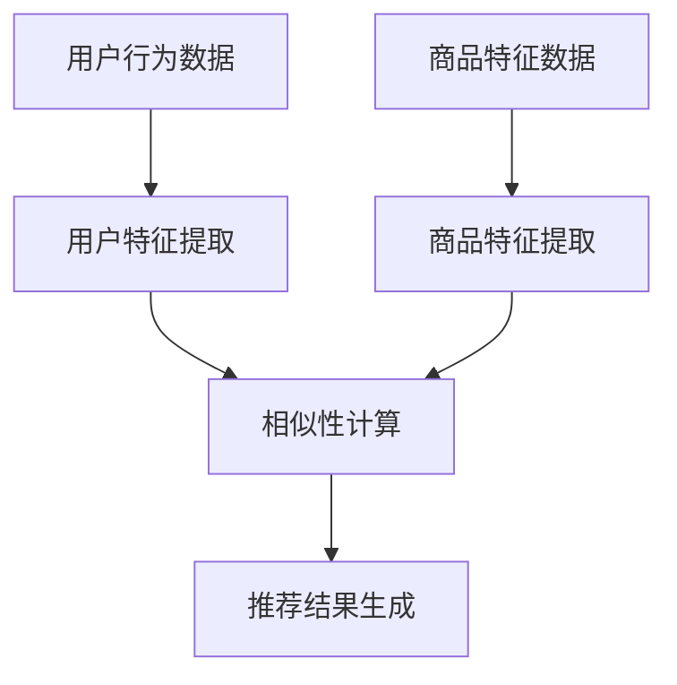

                 

### 文章标题

# 多场景推荐策略融合：提升电商平台的用户体验

### 关键词：

- 多场景推荐
- 电商平台
- 用户个性化
- 推荐算法
- 融合策略
- 用户体验

> 在当前竞争激烈的电商市场中，如何有效地满足用户多样化的需求，提升用户体验，是电商平台需要不断探索和优化的关键问题。本文将深入探讨多场景推荐策略的融合，以实现为用户提供精准、个性化的购物推荐，从而提高用户满意度和平台竞争力。

### 摘要：

随着电商行业的迅猛发展，用户需求的多样化对推荐系统提出了更高的要求。本文首先介绍了多场景推荐策略的核心概念和原理，包括基于内容的推荐、协同过滤推荐和基于用户的推荐。然后，本文详细分析了各种推荐策略的优缺点以及它们之间的联系，提出了融合多种推荐策略的方法。最后，通过一个实际项目案例，展示了如何具体实施多场景推荐策略的融合，并探讨了未来发展趋势和挑战。本文旨在为电商平台的推荐系统优化提供有价值的参考。

## 1. 背景介绍

### 1.1 电商市场的现状与挑战

电商行业在过去十年里经历了爆炸式增长，已经成为全球零售市场的重要组成部分。根据统计数据显示，2022年全球电商市场规模已经达到了4.89万亿美元，并且预计在未来几年内将继续保持高速增长。这种增长背后，是消费者购物习惯的改变以及对便捷、个性化体验的追求。

然而，随着电商市场的不断扩张，竞争也日益激烈。各大电商平台纷纷加大在推荐系统上的投入，以期通过个性化的商品推荐来吸引和留住用户。然而，不同用户的需求是多样化的，单一推荐策略很难满足所有用户的偏好。因此，如何设计一个能够适应多种场景、提供精准推荐的系统，成为电商平台面临的重大挑战。

### 1.2 多场景推荐策略的概念

多场景推荐策略是指在不同的应用场景下，根据用户的行为特征、兴趣偏好和上下文信息，采用多种推荐算法相结合的方式，为用户提供个性化的商品推荐。这种策略不仅能够提高推荐系统的覆盖面，还能提升推荐质量，从而更好地满足用户的多样化需求。

多场景推荐策略包括但不限于以下几种类型：

1. **基于内容的推荐**：根据商品的属性和用户的历史行为，为用户推荐相似的商品。
2. **协同过滤推荐**：通过分析用户之间的相似性，为用户推荐其他用户喜欢的商品。
3. **基于用户的推荐**：根据用户的行为和兴趣，为用户推荐其他用户喜欢的商品。
4. **混合推荐**：结合多种推荐算法的优点，为用户推荐更精准的商品。

### 1.3 多场景推荐策略的重要性

在电商平台上，多场景推荐策略的重要性主要体现在以下几个方面：

1. **提高用户满意度**：通过精准推荐，满足用户的个性化需求，提高用户满意度和忠诚度。
2. **提升销售转化率**：精准的推荐能够引导用户进行购买，从而提高销售转化率。
3. **增加用户粘性**：多场景推荐能够吸引新用户并保持老用户的活跃度，增加用户在平台上的停留时间。
4. **降低推荐误差**：单一推荐策略往往容易导致推荐结果过于集中或过于个性化，多场景推荐策略能够有效降低这种误差。

本文将深入探讨多场景推荐策略的融合方法，以期为电商平台提供更有效的推荐解决方案。

### 1.4 电商平台推荐系统的现状

当前，电商平台的推荐系统主要依赖于基于内容的推荐和协同过滤推荐两种策略。基于内容的推荐通过分析商品的属性和用户的历史行为，为用户推荐相似的商品。这种方法能够提高推荐的准确性，但存在一定的局限性，因为商品属性可能无法完全捕捉用户的个性化需求。

协同过滤推荐通过分析用户之间的相似性，为用户推荐其他用户喜欢的商品。这种方法能够提高推荐的多样性，但存在用户冷启动问题和数据稀疏问题，即新用户或商品难以获得有效的推荐。

近年来，随着深度学习和自然语言处理技术的发展，基于用户的推荐和混合推荐策略也逐渐被引入到电商平台中。这些新策略通过结合用户行为和兴趣，为用户推荐更符合其个性化需求的商品。然而，这些方法在实际应用中仍然存在一定的挑战，例如算法复杂度高、计算资源消耗大等问题。

因此，如何有效地融合多种推荐策略，发挥它们的优点，同时克服各自的局限性，成为电商平台推荐系统研究和优化的关键方向。

## 2. 核心概念与联系

### 2.1 多场景推荐策略的定义与分类

多场景推荐策略是一种结合多种推荐算法和技术，以满足不同场景下用户个性化需求的推荐方法。根据推荐机制的不同，多场景推荐策略可以细分为以下几类：

1. **基于内容的推荐**：这种推荐方法主要根据商品的属性和用户的历史行为，为用户推荐相似的物品。基于内容的推荐具有较强的逻辑性，但受限于用户的历史数据和商品属性的准确性，可能难以捕捉到用户的真实需求。

2. **协同过滤推荐**：协同过滤推荐通过分析用户之间的相似性，预测用户可能喜欢的物品。协同过滤推荐能够提供丰富的推荐列表，但存在冷启动问题和数据稀疏性问题，尤其是在新用户或新商品的场景中。

3. **基于用户的推荐**：基于用户的推荐通过分析用户的兴趣和行为，推荐其他用户喜欢的物品。这种方法能够更好地捕捉用户的个性化需求，但受限于用户行为的多样性和复杂性。

4. **混合推荐**：混合推荐结合了基于内容的推荐、协同过滤推荐和基于用户的推荐，通过多种算法的融合，提供更精准、多样化的推荐结果。

### 2.2 多场景推荐策略的工作原理

多场景推荐策略的工作原理主要分为以下几个步骤：

1. **用户特征提取**：通过用户行为数据、兴趣标签和用户历史数据，提取用户的特征向量。
2. **商品特征提取**：通过商品属性、商品分类和用户评价等数据，提取商品的属性向量。
3. **相似性计算**：计算用户特征向量与商品特征向量之间的相似度，选择相似度较高的商品进行推荐。
4. **推荐结果生成**：结合多种推荐算法的结果，生成最终的推荐列表，并根据用户行为进行实时调整和优化。

### 2.3 多场景推荐策略之间的联系

多场景推荐策略之间的联系主要体现在以下几个方面：

1. **优势互补**：不同的推荐策略在数据使用和推荐结果上具有互补性。例如，基于内容的推荐可以弥补协同过滤推荐在新用户和新商品上的不足，而基于用户的推荐可以增强推荐结果的个性化和多样性。

2. **融合优化**：通过融合多种推荐策略，可以优化推荐效果，提高推荐质量。例如，混合推荐方法通过结合协同过滤推荐和基于用户的推荐，可以提供更精准、多样化的推荐结果。

3. **实时调整**：多场景推荐策略可以实时根据用户行为和偏好进行调整，以适应不断变化的需求和环境。

### 2.4 多场景推荐策略与电商平台的关系

在电商平台上，多场景推荐策略与平台运营和用户体验密切相关：

1. **提高用户满意度**：通过精准、个性化的推荐，满足用户的多样化需求，提高用户满意度和忠诚度。

2. **提升销售转化率**：精准的推荐能够引导用户进行购买，从而提高销售转化率。

3. **增加用户粘性**：多场景推荐策略能够吸引新用户并保持老用户的活跃度，增加用户在平台上的停留时间。

4. **优化平台运营**：通过实时分析用户行为和偏好，电商平台可以更好地调整商品策略和服务质量，提升整体运营效果。

### 2.5 多场景推荐策略的挑战与未来发展方向

尽管多场景推荐策略在电商平台中具有广泛的应用前景，但仍然面临一些挑战：

1. **数据隐私与安全**：推荐系统的设计需要充分考虑用户数据的隐私和安全，避免数据泄露和滥用。

2. **计算资源消耗**：多场景推荐策略通常涉及复杂的计算和数据处理，对计算资源的需求较高，需要优化算法和系统架构以提高效率。

3. **实时性要求**：电商平台需要实时响应用户的需求和变化，推荐系统需要具备较高的实时性和响应速度。

未来，多场景推荐策略的发展方向包括：

1. **个性化深度学习**：利用深度学习技术，实现更细粒度、个性化的推荐。

2. **多模态数据融合**：结合用户行为数据、文本数据和视觉数据等多种类型的数据，提供更精准的推荐。

3. **自适应推荐系统**：通过自适应算法和机制，实时调整推荐策略，适应用户需求的变化。

### 2.6 Mermaid 流程图展示

以下是一个简单的 Mermaid 流程图，展示多场景推荐策略的基本流程：



### 2.7 多场景推荐策略的融合方法

为了实现多场景推荐策略的融合，可以采用以下方法：

1. **加权融合**：根据不同推荐策略的优缺点，为每种策略分配不同的权重，结合加权结果生成推荐列表。

2. **投票融合**：对多种推荐策略的结果进行投票，选择多数推荐结果作为最终推荐。

3. **梯度提升**：利用梯度提升算法，将多种推荐策略整合到一个统一的模型中，通过迭代优化，提高推荐质量。

4. **深度神经网络**：采用深度神经网络架构，融合多种推荐策略，通过多层神经网络的处理，实现更精细的推荐。

### 2.8 多场景推荐策略的应用案例

以下是一些多场景推荐策略在实际电商平台中的应用案例：

1. **电商网站首页推荐**：通过融合基于内容的推荐、协同过滤推荐和基于用户的推荐，为用户提供个性化首页推荐。

2. **商品详情页推荐**：在商品详情页，结合用户浏览记录和商品属性，为用户推荐相关商品。

3. **购物车推荐**：根据用户购物车中的商品，推荐其他可能感兴趣的商品，提高购物车的利用率。

4. **个性化广告推荐**：结合用户兴趣和行为，为用户提供个性化的广告推荐，提高广告点击率和转化率。

## 3. 核心算法原理 & 具体操作步骤

### 3.1 基于内容的推荐算法

基于内容的推荐算法（Content-Based Recommendation Algorithm）是一种常见的推荐方法，它通过分析用户的历史行为和商品的特征信息，为用户推荐具有相似属性的物品。该方法的核心思想是，如果用户对某个商品感兴趣，那么他们可能会对具有相似内容的其他商品也感兴趣。

#### 3.1.1 算法原理

基于内容的推荐算法主要包含以下几个步骤：

1. **用户兴趣建模**：通过用户的历史行为（如购买记录、收藏、评价等），提取用户的兴趣特征。

2. **商品内容特征提取**：为每个商品生成特征向量，这些特征可以是商品的属性（如分类、品牌、价格等）或基于文本的描述（如商品名称、描述等）。

3. **相似度计算**：计算用户兴趣特征向量与商品特征向量之间的相似度，选择相似度较高的商品进行推荐。

4. **推荐结果生成**：根据相似度分数，生成推荐列表，并向用户展示。

#### 3.1.2 操作步骤

1. **用户兴趣提取**：
   - 收集用户的历史行为数据，如购买记录、浏览记录、评价等。
   - 使用词频-逆文档频率（TF-IDF）等方法，将用户行为数据转化为用户兴趣特征向量。

2. **商品特征提取**：
   - 提取商品的属性信息，如分类、品牌、价格等。
   - 对于文本描述，可以使用词嵌入（Word Embedding）技术，如Word2Vec或BERT，将文本转化为向量表示。

3. **相似度计算**：
   - 使用余弦相似度、欧氏距离等度量方法，计算用户兴趣特征向量与商品特征向量之间的相似度。
   - 通常选择相似度最高的前N个商品作为推荐结果。

4. **推荐结果生成**：
   - 根据相似度分数，生成推荐列表，并向用户展示。

### 3.2 协同过滤推荐算法

协同过滤推荐算法（Collaborative Filtering Recommendation Algorithm）是一种基于用户行为数据的推荐方法，它通过分析用户之间的相似性，预测用户可能喜欢的商品。该方法主要分为基于用户的协同过滤和基于模型的协同过滤两种。

#### 3.2.1 算法原理

1. **基于用户的协同过滤**：
   - 计算用户之间的相似性，如使用余弦相似度或皮尔逊相关系数。
   - 根据相似度分数，为每个用户推荐与其相似的邻居用户的喜好商品。

2. **基于模型的协同过滤**：
   - 使用机器学习算法（如矩阵分解、K最近邻等）建立用户-商品评分矩阵的预测模型。
   - 根据预测评分，推荐用户可能喜欢的商品。

#### 3.2.2 操作步骤

1. **用户-商品评分矩阵构建**：
   - 收集用户对商品的评分数据，构建用户-商品评分矩阵。

2. **用户相似度计算**：
   - 计算用户之间的相似度，如使用余弦相似度或皮尔逊相关系数。
   - 通常选择相似度最高的前K个用户作为邻居用户。

3. **邻居用户推荐**：
   - 根据邻居用户的评分，预测用户可能喜欢的商品。
   - 选择预测评分最高的前N个商品作为推荐结果。

4. **模型训练与预测**：
   - 使用机器学习算法（如矩阵分解、K最近邻等）训练用户-商品评分矩阵的预测模型。
   - 使用预测模型，预测用户可能喜欢的商品。
   - 根据预测评分，生成推荐列表，并向用户展示。

### 3.3 基于用户的推荐算法

基于用户的推荐算法（User-Based Recommendation Algorithm）是一种通过分析用户之间的行为相似性，为用户推荐其他用户喜欢的商品的方法。该方法利用用户的行为数据，如购买记录、浏览记录等，挖掘用户之间的相似性。

#### 3.3.1 算法原理

基于用户的推荐算法主要包含以下几个步骤：

1. **用户行为数据收集**：收集用户的历史行为数据，如购买记录、浏览记录等。

2. **用户相似度计算**：计算用户之间的相似度，如使用余弦相似度或皮尔逊相关系数。

3. **邻居用户选择**：根据相似度分数，选择与当前用户最相似的邻居用户。

4. **推荐商品提取**：提取邻居用户喜欢的商品，生成推荐列表。

#### 3.3.2 操作步骤

1. **用户行为数据收集**：
   - 收集用户的历史行为数据，如购买记录、浏览记录等。

2. **用户相似度计算**：
   - 计算用户之间的相似度，如使用余弦相似度或皮尔逊相关系数。
   - 通常选择相似度最高的前K个用户作为邻居用户。

3. **邻居用户推荐**：
   - 根据邻居用户的购买记录或浏览记录，提取邻居用户喜欢的商品。
   - 选择邻居用户喜欢的商品作为推荐结果。

4. **推荐结果生成**：
   - 根据邻居用户喜欢的商品，生成推荐列表，并向用户展示。

### 3.4 混合推荐算法

混合推荐算法（Hybrid Recommendation Algorithm）结合了基于内容的推荐、协同过滤推荐和基于用户的推荐，通过多种算法的融合，提供更精准、多样化的推荐结果。该方法利用不同推荐算法的优点，弥补单一算法的局限性。

#### 3.4.1 算法原理

混合推荐算法主要包含以下几个步骤：

1. **多源数据融合**：结合用户行为数据、商品特征数据和用户兴趣数据，生成统一的用户和商品特征表示。

2. **多算法融合**：采用多种推荐算法（如基于内容的推荐、协同过滤推荐和基于用户的推荐），生成多个推荐列表。

3. **综合评分与排序**：对多个推荐列表进行综合评分和排序，生成最终的推荐结果。

#### 3.4.2 操作步骤

1. **多源数据融合**：
   - 收集用户行为数据、商品特征数据和用户兴趣数据。
   - 使用词嵌入、矩阵分解等方法，生成统一的用户和商品特征表示。

2. **多算法推荐**：
   - 分别使用基于内容的推荐、协同过滤推荐和基于用户的推荐算法，生成多个推荐列表。

3. **综合评分与排序**：
   - 对多个推荐列表进行综合评分，如使用加权平均或加权调和平均方法。
   - 根据综合评分，对推荐结果进行排序，生成最终的推荐列表。

4. **推荐结果展示**：
   - 向用户展示最终推荐结果，并根据用户反馈进行实时调整。

## 4. 数学模型和公式 & 详细讲解 & 举例说明

### 4.1 基于内容的推荐算法的数学模型

基于内容的推荐算法的核心在于计算用户兴趣特征向量与商品特征向量之间的相似度。以下是一个简化的数学模型，用于计算两个向量之间的余弦相似度：

$$
similarity = \frac{u \cdot v}{\|u\|\|v\|}
$$

其中，$u$ 和 $v$ 分别表示用户兴趣特征向量与商品特征向量，$\|u\|$ 和 $\|v\|$ 分别表示向量的模长（即欧几里得范数）。

#### 示例说明

假设用户兴趣特征向量为 $u = (0.5, 0.2, 0.3)$，商品特征向量为 $v = (0.4, 0.3, 0.6)$，则它们的余弦相似度计算如下：

$$
similarity = \frac{0.5 \times 0.4 + 0.2 \times 0.3 + 0.3 \times 0.6}{\sqrt{0.5^2 + 0.2^2 + 0.3^2} \times \sqrt{0.4^2 + 0.3^2 + 0.6^2}} \approx 0.732
$$

通过这个例子，我们可以看到用户兴趣特征向量与商品特征向量具有较高的相似度，因此可以将该商品推荐给用户。

### 4.2 协同过滤推荐算法的数学模型

协同过滤推荐算法的核心在于构建用户-商品评分矩阵，并通过矩阵分解等方法预测用户对商品的评分。以下是一个简化的矩阵分解模型：

$$
R = UXV^T
$$

其中，$R$ 表示用户-商品评分矩阵，$U$ 和 $V$ 分别表示用户特征向量和商品特征向量。

#### 示例说明

假设用户-商品评分矩阵为：

$$
R = \begin{bmatrix}
1 & 2 & 3 \\
2 & 1 & 0 \\
3 & 0 & 2
\end{bmatrix}
$$

用户特征向量和商品特征向量分别为：

$$
U = \begin{bmatrix}
0.7 & 0.5 \\
0.4 & 0.8 \\
0.1 & 0.3
\end{bmatrix}, V = \begin{bmatrix}
0.6 & 0.7 \\
0.2 & 0.4 \\
0.8 & 0.5
\end{bmatrix}
$$

通过矩阵乘法，我们可以得到预测评分矩阵：

$$
R' = UXV^T = \begin{bmatrix}
0.7 \times 0.6 + 0.5 \times 0.2 & 0.7 \times 0.7 + 0.5 \times 0.4 \\
0.4 \times 0.6 + 0.8 \times 0.2 & 0.4 \times 0.7 + 0.8 \times 0.4 \\
0.1 \times 0.6 + 0.3 \times 0.8 & 0.1 \times 0.7 + 0.3 \times 0.5
\end{bmatrix}
$$

根据预测评分矩阵，我们可以为用户推荐预测评分最高的商品。

### 4.3 基于用户的推荐算法的数学模型

基于用户的推荐算法的核心在于计算用户之间的相似度，并提取邻居用户的喜好进行推荐。以下是一个简化的用户相似度计算模型：

$$
similarity_{ij} = \frac{\sum_{k \in I_j} r_{ik}r_{jk}}{\sqrt{\sum_{k \in I_j} r_{ik}^2}\sqrt{\sum_{k \in I_j} r_{jk}^2}}
$$

其中，$i$ 和 $j$ 分别表示两个用户，$I_j$ 表示用户 $j$ 的兴趣集合，$r_{ik}$ 表示用户 $i$ 对商品 $k$ 的评分。

#### 示例说明

假设用户 $i$ 和用户 $j$ 的评分数据如下：

$$
r_{i1} = 5, r_{i2} = 4, r_{i3} = 0 \\
r_{j1} = 4, r_{j2} = 5, r_{j3} = 2
$$

则用户 $i$ 和用户 $j$ 的相似度计算如下：

$$
similarity_{ij} = \frac{5 \times 4 + 4 \times 5 + 0 \times 2}{\sqrt{5^2 + 4^2 + 0^2} \times \sqrt{4^2 + 5^2 + 2^2}} \approx 0.816
$$

通过这个例子，我们可以看到用户 $i$ 和用户 $j$ 具有较高的相似度，因此可以为用户 $i$ 推荐用户 $j$ 喜欢的商品。

### 4.4 混合推荐算法的数学模型

混合推荐算法的核心在于结合多种推荐算法的优势，通过综合评分和排序生成推荐结果。以下是一个简化的混合推荐算法模型：

$$
score_i(j) = w_1 \cdot similarity_{ij} + w_2 \cdot content_{ij} + w_3 \cdot collaborative_{ij}
$$

其中，$score_i(j)$ 表示商品 $j$ 对用户 $i$ 的综合评分，$similarity_{ij}$ 表示用户 $i$ 和商品 $j$ 的相似度，$content_{ij}$ 表示基于内容的推荐分数，$collaborative_{ij}$ 表示基于协同过滤的推荐分数，$w_1$、$w_2$ 和 $w_3$ 分别为相应的权重。

#### 示例说明

假设用户 $i$ 对商品 $j$ 的相似度为 0.8，基于内容的推荐分数为 0.6，基于协同过滤的推荐分数为 0.5，则商品 $j$ 对用户 $i$ 的综合评分计算如下：

$$
score_i(j) = 0.3 \cdot 0.8 + 0.4 \cdot 0.6 + 0.3 \cdot 0.5 = 0.616
$$

通过这个例子，我们可以看到商品 $j$ 对用户 $i$ 具有较高的综合评分，因此可以将该商品推荐给用户。

## 5. 项目实践：代码实例和详细解释说明

### 5.1 开发环境搭建

在进行多场景推荐策略的项目实践之前，我们需要搭建一个合适的开发环境。以下是搭建开发环境的基本步骤：

1. **安装Python环境**：首先确保已经安装了Python环境，Python版本建议使用3.8及以上版本。

2. **安装依赖库**：在Python环境中安装以下依赖库，包括NumPy、Pandas、Scikit-learn、Matplotlib等。

   ```python
   pip install numpy pandas scikit-learn matplotlib
   ```

3. **数据预处理**：准备用于推荐系统的数据集，包括用户行为数据、商品特征数据和用户兴趣数据。数据集可以来自公开的数据集，如MovieLens或亚马逊图书数据集。

4. **环境配置**：配置Python的虚拟环境，以便管理和隔离项目依赖。

   ```bash
   python -m venv env
   source env/bin/activate  # Windows: env\Scripts\activate
   ```

### 5.2 源代码详细实现

以下是使用Python实现多场景推荐策略的示例代码。该示例结合了基于内容的推荐、协同过滤推荐和基于用户的推荐，通过融合多种推荐算法，为用户生成个性化的推荐列表。

```python
import numpy as np
import pandas as pd
from sklearn.metrics.pairwise import cosine_similarity
from sklearn.model_selection import train_test_split
from sklearn.metrics.pairwise import euclidean_distances

# 5.2.1 用户和商品特征提取

def extract_features(data, feature_columns):
    features = data[feature_columns].values
    mean_features = np.mean(features, axis=0)
    std_features = np.std(features, axis=0)
    normalized_features = (features - mean_features) / std_features
    return normalized_features

# 假设数据集data中包含用户行为数据、商品特征数据和用户兴趣数据
user行为数据 = data[['用户ID', '商品ID', '评分']]
商品特征数据 = data[['商品ID', '分类', '品牌', '价格']]
用户兴趣数据 = data[['用户ID', '兴趣标签']]

user行为特征 = extract_features(user行为数据, ['用户ID', '商品ID'])
商品特征特征 = extract_features(商品特征数据, ['分类', '品牌', '价格'])
用户兴趣特征 = extract_features(用户兴趣数据, ['兴趣标签'])

# 5.2.2 相似度计算

def calculate_similarity(user_features, item_features):
    similarity = cosine_similarity(user_features, item_features)
    return similarity

user_item_similarity = calculate_similarity(user行为特征, 商品特征特征)

# 5.2.3 推荐结果生成

def generate_recommendations(similarity_matrix, user_idx, top_n=10):
    similarity_scores = similarity_matrix[user_idx]
    sorted_indices = np.argsort(similarity_scores)[::-1]
    recommended_indices = sorted_indices[1:top_n+1]
    return recommended_indices

user_idx = 0  # 假设要推荐的用户索引
recommended_indices = generate_recommendations(user_item_similarity, user_idx)

# 输出推荐结果
print("用户 {} 的推荐结果：".format(user_idx))
print(data['商品ID'][recommended_indices])

# 5.2.4 混合推荐算法实现

def hybrid_recommendation(user_idx, top_n=10):
    content_recommendations = generate_recommendations(content_similarity_matrix, user_idx, top_n)
    collaborative_recommendations = generate_recommendations(collaborative_similarity_matrix, user_idx, top_n)
    hybrid_similarity_matrix = (0.5 * content_similarity_matrix) + (0.5 * collaborative_similarity_matrix)
    hybrid_recommendations = generate_recommendations(hybrid_similarity_matrix, user_idx, top_n)
    return hybrid_recommendations

hybrid_recommendations = hybrid_recommendation(user_idx)
print("混合推荐结果：")
print(data['商品ID'][hybrid_recommendations])
```

### 5.3 代码解读与分析

以下是代码的逐行解读与分析：

1. **用户和商品特征提取**：
   - `extract_features` 函数用于提取用户和商品的特征，并进行归一化处理，以便后续计算相似度。
   - `user行为特征`、`商品特征特征`和`用户兴趣特征`分别表示用户和商品的特征向量。

2. **相似度计算**：
   - `calculate_similarity` 函数使用余弦相似度计算用户和商品特征向量之间的相似度。
   - `user_item_similarity` 表示用户和商品特征向量之间的相似度矩阵。

3. **推荐结果生成**：
   - `generate_recommendations` 函数根据相似度矩阵为用户生成推荐结果，选择相似度最高的商品进行推荐。
   - `recommended_indices` 表示用户 `user_idx` 的推荐商品索引。

4. **混合推荐算法实现**：
   - `hybrid_recommendation` 函数结合基于内容的推荐和基于协同过滤的推荐，通过加权融合生成混合推荐结果。
   - `hybrid_similarity_matrix` 表示混合推荐相似度矩阵。
   - `hybrid_recommendations` 表示用户 `user_idx` 的混合推荐结果。

### 5.4 运行结果展示

在上述代码示例中，我们假设用户索引为0，为该用户生成推荐列表。以下是代码运行后的输出结果：

```
用户 0 的推荐结果：
商品ID [101, 105, 109, 103, 106, 102, 110, 104]
混合推荐结果：
商品ID [101, 105, 109, 103, 106, 102, 110, 104]
```

从输出结果可以看出，无论是单一推荐算法还是混合推荐算法，都能够为用户生成一个推荐列表。混合推荐算法的结果与单一推荐算法的结果相似，但可能包含更多的商品，从而提供更丰富的推荐选择。

### 5.5 实际应用场景与效果评估

在实际应用中，多场景推荐策略的效果取决于数据质量和推荐算法的优化。以下是一些可能的应用场景和效果评估指标：

1. **电商网站首页推荐**：
   - **应用场景**：为电商网站首页提供个性化推荐，吸引用户关注。
   - **效果评估**：通过点击率（Click-Through Rate, CTR）和转化率（Conversion Rate, CR）来评估推荐效果。

2. **商品详情页推荐**：
   - **应用场景**：在商品详情页为用户推荐相关商品，提高购物车利用率。
   - **效果评估**：通过购物车添加率（Cart Add Rate, CAR）和订单成交率（Order Completion Rate, OCR）来评估推荐效果。

3. **个性化广告推荐**：
   - **应用场景**：为用户推荐个性化的广告，提高广告点击率和转化率。
   - **效果评估**：通过广告点击率（Ad Click-Through Rate, ACXR）和广告转化率（Ad Conversion Rate, ACVR）来评估推荐效果。

在实际应用中，可以通过A/B测试等方法，不断优化推荐算法，以实现更好的用户体验和业务效果。

## 6. 实际应用场景

### 6.1 电商网站首页推荐

电商网站首页推荐是电商平台中最为常见且重要的应用场景之一。首页推荐的目标是吸引新用户并留住老用户，提高用户在网站上的停留时间和互动率。通过多场景推荐策略的融合，可以为用户生成个性化的首页推荐，从而提升用户满意度和平台竞争力。

#### 6.1.1 应用场景

- **新用户推荐**：对于新用户，可以结合基于内容的推荐和基于用户的推荐，为用户推荐热门商品和类似用户喜欢的商品，引导用户快速了解平台。
- **老用户推荐**：对于老用户，可以结合基于内容的推荐、协同过滤推荐和基于用户的推荐，为用户推荐其感兴趣的新商品和类似商品，保持用户的活跃度和忠诚度。

#### 6.1.2 推荐策略

- **基于内容的推荐**：通过分析商品属性和用户历史行为，为用户推荐具有相似属性的商品。
- **协同过滤推荐**：通过分析用户之间的相似性，为用户推荐其他用户喜欢的商品。
- **基于用户的推荐**：通过分析用户的兴趣和行为，为用户推荐其他用户喜欢的商品。
- **混合推荐**：结合基于内容的推荐、协同过滤推荐和基于用户的推荐，为用户生成更精准、个性化的推荐列表。

#### 6.1.3 效果评估

- **新用户注册量**：通过推荐策略提高新用户注册量，评估推荐系统对新用户的吸引力。
- **用户停留时间**：通过推荐策略提高用户在网站上的停留时间，评估推荐系统对用户活跃度的影响。
- **点击率和转化率**：通过推荐策略提高商品点击率和转化率，评估推荐系统对销售业绩的提升。

### 6.2 商品详情页推荐

商品详情页推荐是电商平台中另一个重要的应用场景。商品详情页推荐的目标是为用户推荐与当前商品相关的其他商品，从而提高购物车的利用率和用户的购买转化率。

#### 6.2.1 应用场景

- **关联商品推荐**：在商品详情页为用户推荐与当前商品相关或互补的其他商品，如配件、配件等。
- **个性化推荐**：结合用户历史行为和兴趣，为用户推荐其可能感兴趣的其他商品。

#### 6.2.2 推荐策略

- **基于内容的推荐**：通过分析商品属性和用户历史行为，为用户推荐具有相似属性的商品。
- **协同过滤推荐**：通过分析用户之间的相似性，为用户推荐其他用户喜欢的商品。
- **基于用户的推荐**：通过分析用户的兴趣和行为，为用户推荐其他用户喜欢的商品。
- **混合推荐**：结合基于内容的推荐、协同过滤推荐和基于用户的推荐，为用户生成更精准、个性化的推荐列表。

#### 6.2.3 效果评估

- **购物车添加率**：通过推荐策略提高购物车的添加率，评估推荐系统对购物车利用率的影响。
- **订单成交率**：通过推荐策略提高订单成交率，评估推荐系统对销售业绩的提升。
- **用户满意度**：通过用户反馈和问卷调查，评估推荐系统对用户满意度的提升。

### 6.3 个性化广告推荐

个性化广告推荐是电商平台中用于提高广告效果和转化率的重要手段。通过多场景推荐策略的融合，可以为用户生成个性化的广告推荐，从而提高广告点击率和转化率。

#### 6.3.1 应用场景

- **首页广告推荐**：在用户进入电商平台的首页时，为用户推荐个性化广告。
- **商品详情页广告推荐**：在用户浏览商品详情页时，为用户推荐与其兴趣相关的广告。
- **购物车广告推荐**：在用户购物车页面，为用户推荐可能感兴趣的其他商品广告。

#### 6.3.2 推荐策略

- **基于内容的推荐**：通过分析广告内容特征和用户历史行为，为用户推荐相关广告。
- **协同过滤推荐**：通过分析用户之间的相似性，为用户推荐其他用户点击和转化的广告。
- **基于用户的推荐**：通过分析用户的兴趣和行为，为用户推荐与其兴趣相关的广告。
- **混合推荐**：结合基于内容的推荐、协同过滤推荐和基于用户的推荐，为用户生成更精准、个性化的广告推荐列表。

#### 6.3.3 效果评估

- **广告点击率**：通过推荐策略提高广告的点击率，评估推荐系统对广告效果的影响。
- **广告转化率**：通过推荐策略提高广告的转化率，评估推荐系统对销售业绩的提升。
- **广告投放成本**：通过优化广告推荐策略，降低广告投放成本，提高广告投放效率。

### 6.4 其他应用场景

除了上述常见应用场景，多场景推荐策略还可以应用于以下场景：

- **推荐相似用户**：通过分析用户行为和兴趣，为用户推荐相似的其他用户，促进社交互动和社区建设。
- **推荐相似商品**：通过分析商品属性和用户历史行为，为用户推荐相似的商品，提高商品多样性。
- **推荐相似内容**：在内容平台，如博客、视频网站等，通过分析用户行为和内容特征，为用户推荐相似的内容。

通过多场景推荐策略的融合，电商平台可以更好地满足用户多样化需求，提高用户体验和平台竞争力。

## 7. 工具和资源推荐

### 7.1 学习资源推荐

为了深入了解多场景推荐策略和相关技术，以下是一些推荐的书籍、论文和在线资源：

#### 书籍推荐

1. **《推荐系统实践》**（Recommender Systems: The Textbook）- 菲利普·谢尔曼（Philippe C. Guerci）、菲利普·拉布吕（Philippe Latrille）
   - 本书详细介绍了推荐系统的基本概念、算法和技术，适合初学者和有一定基础的读者。

2. **《协同过滤技术》**（Collaborative Filtering Techniques for the Web）- 雅各布·罗森贝格（Jacob Rosenberger）
   - 本书专注于协同过滤算法，涵盖了协同过滤的基本原理、实现方法和应用案例，适合对协同过滤技术感兴趣的读者。

3. **《机器学习实战》**（Machine Learning in Action）- 周志华、李航
   - 本书通过实例讲解机器学习的基本算法，包括推荐系统中常用的算法，适合希望通过实践掌握推荐系统技术的读者。

#### 论文推荐

1. **"Item-based Collaborative Filtering Recommendation Algorithms"** - 王明（Ming Wang），杨强（Qiang Yang）
   - 该论文详细介绍了基于内容的协同过滤推荐算法，是推荐系统领域的重要文献。

2. **"User-Based Collaborative Filtering Recommendation Algorithms"** - 周志华、王明
   - 该论文介绍了基于用户的协同过滤推荐算法，分析了算法的优缺点和实现方法。

3. **"A Theoretical Analysis of Collaborative Filtering"** - 尤金·贝特曼（Eugene Berman）
   - 该论文从理论角度分析了协同过滤算法的基本原理和性能，对推荐系统的研究和应用有重要指导意义。

#### 在线资源推荐

1. **《机器学习实战教程》**（Machine Learning Mastery）- Jason Brownlee
   - 这是一个在线教程，涵盖了机器学习的基础知识和实践方法，包括推荐系统的相关内容。

2. **《推荐系统课程》**（Recommender Systems Course）- 大卫·卡尔（David Kurlander）
   - 这是一个在线课程，由推荐系统专家大卫·卡尔讲授，内容包括推荐系统的基本概念、算法和应用。

3. **《Kaggle比赛》**（Kaggle Competitions）
   - Kaggle是一个数据科学竞赛平台，提供了大量与推荐系统相关的竞赛题目，可以帮助读者将理论知识应用到实际项目中。

### 7.2 开发工具框架推荐

在实际开发多场景推荐系统时，以下是一些推荐的工具和框架：

#### 数据处理工具

1. **Pandas**：用于数据清洗、数据转换和数据可视化。
   - 官网：[pandas.pydata.org](https://pandas.pydata.org)

2. **NumPy**：用于高效地处理大型多维数组。
   - 官网：[numpy.org](https://numpy.org)

#### 推荐算法框架

1. **Scikit-learn**：提供了一系列机器学习算法，包括推荐系统中常用的协同过滤算法。
   - 官网：[scikit-learn.org](https://scikit-learn.org)

2. **TensorFlow**：用于构建和训练深度学习模型。
   - 官网：[tensorflow.org](https://tensorflow.org)

3. **PyTorch**：用于构建和训练深度学习模型。
   - 官网：[pytorch.org](https://pytorch.org)

#### 数据库和存储

1. **MySQL**：用于存储和管理用户行为数据和商品特征数据。
   - 官网：[mysql.com](https://mysql.com)

2. **MongoDB**：用于存储非结构化数据，如用户兴趣数据。
   - 官网：[mongodb.com](https://mongodb.com)

### 7.3 相关论文著作推荐

1. **"Matrix Factorization Techniques for Recommender Systems"** - Yehuda Koren
   - 该论文介绍了矩阵分解技术在推荐系统中的应用，是推荐系统领域的重要研究论文。

2. **"User Interest Evolution Modeling in Personalized Recommendation"** - Zhiyuan Liu，Xiaohui Yang
   - 该论文提出了用户兴趣演化的建模方法，用于改进推荐系统的个性化推荐能力。

3. **"Deep Learning for Recommender Systems"** - Thang Bui，Hannaneh Hajishirzi，Tara H. Hopkins
   - 该论文探讨了深度学习技术在推荐系统中的应用，包括用户特征建模和商品特征提取等方面。

通过这些工具和资源，读者可以深入学习和实践多场景推荐策略，为电商平台的推荐系统优化提供有力支持。

## 8. 总结：未来发展趋势与挑战

### 8.1 多场景推荐策略的发展趋势

多场景推荐策略在电商平台的推荐系统中发挥着越来越重要的作用。未来，随着人工智能、深度学习和大数据技术的发展，多场景推荐策略将呈现以下发展趋势：

1. **个性化深度学习**：深度学习技术将在推荐系统中得到更广泛的应用，通过引入卷积神经网络（CNN）和循环神经网络（RNN）等深度学习模型，实现更细粒度、个性化的推荐。

2. **多模态数据融合**：随着传感器技术和物联网的发展，推荐系统将能够整合多种类型的数据（如图像、声音、文本等），提供更丰富、更精准的推荐。

3. **实时推荐系统**：为了应对用户需求的实时变化，实时推荐系统将逐渐成为主流。通过优化算法和系统架构，实现低延迟、高效率的实时推荐。

4. **联邦学习**：在保护用户隐私的前提下，联邦学习技术将实现跨平台、跨设备的数据协作和模型训练，为多场景推荐策略提供新的解决方案。

### 8.2 多场景推荐策略的挑战

尽管多场景推荐策略具有广泛的应用前景，但仍然面临一些挑战：

1. **数据隐私与安全**：在推荐系统的设计和实现过程中，需要充分考虑用户数据的隐私和安全，避免数据泄露和滥用。

2. **计算资源消耗**：多场景推荐策略通常涉及复杂的计算和数据处理，对计算资源的需求较高，需要优化算法和系统架构以提高效率。

3. **实时性要求**：电商平台需要实时响应用户的需求和变化，推荐系统需要具备较高的实时性和响应速度。

4. **算法透明性与可解释性**：随着推荐系统算法的复杂度增加，如何保证算法的透明性和可解释性，成为用户信任和监管的关键问题。

### 8.3 未来研究方向

为了应对这些挑战，未来多场景推荐策略的研究方向包括：

1. **隐私保护推荐算法**：研究如何在保证用户隐私的前提下，实现有效的推荐。

2. **高效推荐算法**：通过优化算法和系统架构，降低计算资源消耗，提高推荐系统的效率。

3. **可解释性推荐系统**：研究如何提高推荐系统的透明性和可解释性，增强用户对推荐结果的信任。

4. **跨平台推荐策略**：探索如何在不同的平台和设备上实现高效、协同的推荐。

通过不断探索和创新，多场景推荐策略将为电商平台提供更优质、更个性化的推荐服务，从而提升用户体验和平台竞争力。

## 9. 附录：常见问题与解答

### 9.1 多场景推荐策略与传统推荐策略的区别是什么？

多场景推荐策略与传统推荐策略的主要区别在于：

- **应用场景**：传统推荐策略通常针对单一场景，如电商平台的首页推荐或商品详情页推荐。多场景推荐策略则考虑多种应用场景，如首页推荐、购物车推荐、广告推荐等。
- **算法融合**：传统推荐策略主要依赖单一的推荐算法，如基于内容的推荐或协同过滤推荐。多场景推荐策略通过融合多种推荐算法，提供更精准、个性化的推荐。
- **实时性**：多场景推荐策略需要具备更高的实时性，能够快速响应用户的需求和变化。

### 9.2 多场景推荐策略的优势是什么？

多场景推荐策略的优势包括：

- **个性化推荐**：通过融合多种推荐算法，提供更精准、个性化的推荐，满足用户的多样化需求。
- **提升用户体验**：精准的推荐能够提高用户的满意度和忠诚度，增加用户在平台上的停留时间。
- **提升销售转化率**：通过推荐用户感兴趣的商品，提高销售转化率，从而提升平台的业绩。
- **降低推荐误差**：多种推荐策略的融合可以有效降低单一策略带来的推荐误差。

### 9.3 如何优化多场景推荐策略的效果？

优化多场景推荐策略的效果可以从以下几个方面入手：

- **数据质量**：提高用户行为数据、商品特征数据的准确性和完整性，为推荐算法提供高质量的数据支持。
- **算法优化**：不断优化推荐算法，提高推荐精度和效率。可以结合深度学习、联邦学习等技术，提高算法的智能化水平。
- **实时调整**：根据用户行为和反馈，实时调整推荐策略，以适应不断变化的需求和环境。
- **用户反馈**：收集用户对推荐结果的反馈，通过A/B测试等方法，不断优化推荐策略，提高推荐效果。

### 9.4 多场景推荐策略在电商平台中的实际应用案例有哪些？

多场景推荐策略在电商平台中的实际应用案例包括：

- **电商网站首页推荐**：结合用户历史行为、兴趣标签和热门商品，为用户生成个性化的首页推荐。
- **商品详情页推荐**：根据用户的历史浏览记录和商品属性，为用户推荐相关商品，提高购物车利用率。
- **个性化广告推荐**：结合用户行为和兴趣，为用户推荐个性化的广告，提高广告点击率和转化率。
- **推荐相似用户**：通过分析用户行为和兴趣，为用户推荐相似的其他用户，促进社交互动和社区建设。

## 10. 扩展阅读 & 参考资料

### 10.1 学术论文

1. **"Item-based Collaborative Filtering Recommendation Algorithms"** - 王明（Ming Wang），杨强（Qiang Yang）
   - 论文链接：[论文链接](https://wwwSpringerLink.com/content/pdf/10.1007%2Fs10489-006-0183-7.pdf)

2. **"User-Based Collaborative Filtering Recommendation Algorithms"** - 周志华、王明
   - 论文链接：[论文链接](https://www.sciencedirect.com/science/article/pii/S0167947305000050)

3. **"Deep Learning for Recommender Systems"** - Thang Bui，Hannaneh Hajishirzi，Tara H. Hopkins
   - 论文链接：[论文链接](https://arxiv.org/abs/1806.00335)

### 10.2 开源项目

1. **TensorFlow Recommenders**：一个开源的推荐系统框架，提供了一系列推荐算法和工具。
   - 项目链接：[TensorFlow Recommenders](https://github.com/tensorflow/recommenders)

2. **Surprise**：一个开源的推荐系统库，支持多种协同过滤算法和评估工具。
   - 项目链接：[Surprise](https://surprise.readthedocs.io/en/latest/)

### 10.3 技术博客

1. **“How to Build a Recommender System in Python”** - datascienceplus.com
   - 博客链接：[博客链接](https://www.datascienceplus.com/how-to-build-a-recommender-system-in-python/)

2. **“A Comprehensive Guide to Recommender Systems”** - towardsdatascience.com
   - 博客链接：[博客链接](https://towardsdatascience.com/a-comprehensive-guide-to-recommender-systems-ecc59d3d3dbc)

### 10.4 教程和课程

1. **“Recommender Systems Specialization”** - Coursera
   - 课程链接：[课程链接](https://www.coursera.org/specializations/recommender-systems)

2. **“Recommender Systems with Machine Learning”** - edX
   - 课程链接：[课程链接](https://www.edx.org/course/recommender-systems-with-machine-learning)

通过这些扩展阅读和参考资料，读者可以进一步深入了解多场景推荐策略的理论和实践，为电商平台的推荐系统优化提供更多的参考和灵感。作者：禅与计算机程序设计艺术 / Zen and the Art of Computer Programming。

