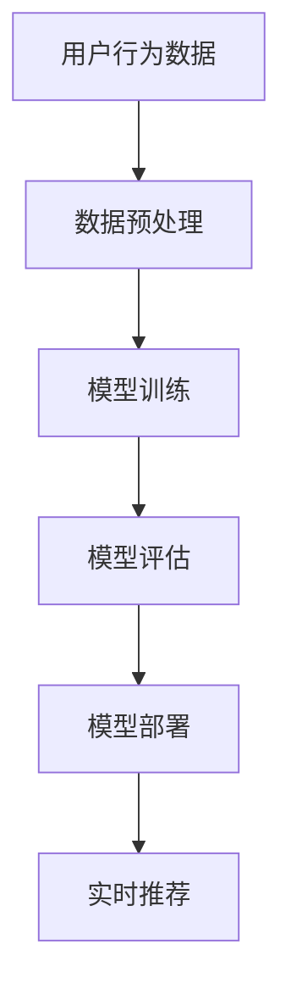
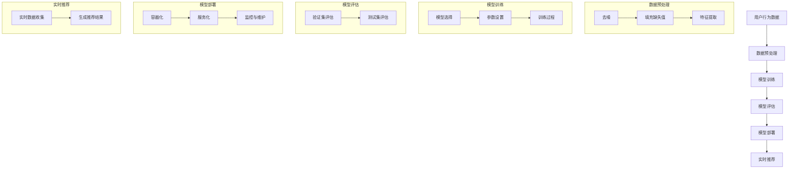

                 

### 背景介绍

## 1.1 电商平台的搜索推荐系统

在当今数字化时代，电商平台已成为消费者购物的主要渠道。随着用户量的急剧增加，如何提供个性化的商品推荐和高效的搜索服务成为电商平台的核心竞争力。搜索推荐系统作为电商平台的重要组成部分，旨在通过分析用户行为和偏好，为用户提供相关、精准的商品推荐和搜索结果。

### 1.2 AI 大模型的应用背景

人工智能（AI）技术的发展，特别是深度学习和自然语言处理（NLP）的突破，为搜索推荐系统带来了革命性的变革。AI 大模型，如生成对抗网络（GAN）、变换器（Transformer）等，具有强大的学习和表征能力，可以在大量数据的基础上，生成高质量的推荐结果。这些模型的应用，使得电商平台能够更好地理解用户需求，提高系统性能、效率、准确率和实时性。

### 1.3 研究目标

本文旨在探讨如何通过 AI 大模型的应用，提升电商平台的搜索推荐系统性能。具体目标包括：

- 提高搜索推荐系统的准确率和实时性。
- 优化系统效率和资源利用率。
- 探索新的算法和模型架构，以适应电商平台的多样化需求。

### 1.4 文章结构

本文将按照以下结构进行阐述：

- **第1章 背景介绍**：介绍电商平台的搜索推荐系统和 AI 大模型的应用背景。
- **第2章 核心概念与联系**：阐述搜索推荐系统中的核心概念，如用户行为分析、推荐算法等，并展示 AI 大模型的应用架构。
- **第3章 核心算法原理 & 具体操作步骤**：详细解释 AI 大模型在搜索推荐系统中的应用原理，并介绍具体的操作步骤。
- **第4章 数学模型和公式 & 详细讲解 & 举例说明**：介绍 AI 大模型相关的数学模型和公式，并进行详细的讲解和举例。
- **第5章 项目实践：代码实例和详细解释说明**：通过实际项目实例，展示 AI 大模型在搜索推荐系统中的应用，并提供代码解读和分析。
- **第6章 实际应用场景**：探讨 AI 大模型在电商平台搜索推荐系统中的实际应用场景。
- **第7章 工具和资源推荐**：推荐相关的学习资源、开发工具和论文著作。
- **第8章 总结：未来发展趋势与挑战**：总结本文的主要观点，并探讨未来的发展趋势和面临的挑战。
- **第9章 附录：常见问题与解答**：回答读者可能关注的一些常见问题。
- **第10章 扩展阅读 & 参考资料**：提供更多的扩展阅读和参考资料。

## 1.5 为什么要研究 AI 大模型在搜索推荐系统中的应用？

AI 大模型在搜索推荐系统中的应用具有以下几个显著优势：

- **提高准确率和实时性**：通过深度学习等技术，AI 大模型可以更好地理解用户行为和偏好，从而提供更准确的推荐结果。同时，随着硬件和算法的优化，AI 大模型可以更快地生成推荐结果，提高系统的实时性。
- **优化系统效率和资源利用率**：AI 大模型具有强大的数据处理和分析能力，可以在海量数据的基础上进行高效的特征提取和关系建模，从而优化系统的效率和资源利用率。
- **适应多样化需求**：电商平台的需求多样化，AI 大模型可以针对不同场景和用户群体，定制化地生成推荐结果，满足多样化的需求。

总之，AI 大模型在搜索推荐系统中的应用，为电商平台提供了强大的技术支持，有助于提升用户体验和竞争力。下面，我们将深入探讨 AI 大模型在搜索推荐系统中的应用原理和具体实现。

### 2.1 核心概念与联系

在讨论电商平台搜索推荐系统时，理解以下几个核心概念至关重要：

#### 2.1.1 用户行为分析

用户行为分析是搜索推荐系统的基石。它包括用户在平台上的浏览、搜索、购买等行为数据。通过分析这些数据，我们可以识别出用户的兴趣和偏好。例如，用户频繁浏览某类商品，可能表明他们对此类商品感兴趣。

#### 2.1.2 推荐算法

推荐算法是搜索推荐系统的核心，它们基于用户行为数据，为用户生成个性化的推荐。常见的推荐算法包括基于内容的推荐、协同过滤和混合推荐等。每种算法都有其优缺点，适用于不同的场景。

#### 2.1.3 AI 大模型

AI 大模型，如深度学习和变换器（Transformer）模型，具有强大的学习和表征能力。它们可以通过学习大量数据，捕捉复杂的用户行为和偏好模式，从而生成更精准的推荐。

#### 2.1.4 模型架构

AI 大模型在搜索推荐系统中的应用通常涉及以下架构组件：

- **数据预处理**：将原始用户行为数据清洗、转换和特征提取，以便模型学习。
- **模型训练**：使用大量数据训练模型，使其能够捕捉用户行为和偏好。
- **模型评估**：通过验证集和测试集评估模型的性能，包括准确率、召回率和实时性等指标。
- **模型部署**：将训练好的模型部署到生产环境，实时为用户提供推荐。

#### 2.1.5 Mermaid 流程图

以下是一个简化的 Mermaid 流程图，展示了 AI 大模型在搜索推荐系统中的应用架构：



在图 2-1 中，用户行为数据首先经过数据预处理，然后用于模型训练。训练好的模型在评估阶段进行性能评估，最终部署到生产环境，为用户提供实时推荐。

### 2.2 什么是 AI 大模型？

AI 大模型是指具有大规模参数和强大学习能力的深度学习模型。它们通常基于多层神经网络结构，通过学习大量数据来提取复杂的特征和模式。以下是一些常见的 AI 大模型：

- **生成对抗网络（GAN）**：GAN 由生成器和判别器组成，生成器试图生成与真实数据相似的数据，而判别器则试图区分真实数据和生成数据。通过这种对抗训练，GAN 可以生成高质量的数据。
- **变换器（Transformer）**：Transformer 是一种基于自注意力机制的深度学习模型，广泛应用于自然语言处理任务。它通过计算序列中每个元素之间的相互依赖，生成高质量的输出。
- **深度神经网络（DNN）**：DNN 是一种多层神经网络，通过逐层学习复杂特征，从而实现各种复杂的任务，如图像识别、语音识别等。

这些 AI 大模型在搜索推荐系统中的应用，使得系统能够更准确地理解和预测用户行为，从而生成更个性化的推荐。

### 2.3 AI 大模型在搜索推荐系统中的应用架构

AI 大模型在搜索推荐系统中的应用架构可以分为以下几个关键阶段：

#### 2.3.1 数据收集与预处理

数据收集是搜索推荐系统的基础。我们需要收集用户的浏览、搜索、购买等行为数据。这些数据可能来自用户界面、服务器日志、数据库等。在数据收集过程中，需要注意数据的隐私保护和合法性。

#### 2.3.2 数据预处理

收集到的数据通常包含噪声、缺失值和异常值。因此，我们需要进行数据清洗和预处理，包括以下步骤：

- **去噪**：去除数据中的噪声，如错误的输入和异常值。
- **填充缺失值**：使用统计方法或机器学习方法填充缺失值，以保持数据的完整性。
- **特征提取**：将原始数据转换为特征向量，以供模型学习。常见的特征提取方法包括词袋模型、TF-IDF 等。

#### 2.3.3 模型训练

在数据预处理完成后，我们可以使用训练数据对 AI 大模型进行训练。训练过程通常包括以下几个步骤：

- **模型选择**：选择合适的 AI 大模型，如 GAN、Transformer 等。
- **参数设置**：设置模型的超参数，如学习率、批量大小等。
- **训练过程**：通过迭代训练，使模型逐渐优化，以生成高质量的推荐。

#### 2.3.4 模型评估

在模型训练完成后，我们需要使用验证集和测试集对模型进行评估。常见的评估指标包括准确率、召回率、F1 值等。通过评估，我们可以确定模型的性能，并调整模型参数以优化性能。

#### 2.3.5 模型部署

评估完成后，我们将训练好的模型部署到生产环境。模型部署包括以下步骤：

- **容器化**：将模型打包成容器，以便在不同的环境中部署。
- **服务化**：将模型部署到服务器，以提供实时推荐服务。
- **监控与维护**：对模型进行实时监控和维护，确保其稳定运行。

#### 2.3.6 实时推荐

部署后的模型可以实时为用户提供个性化推荐。用户在平台上的行为数据将实时传递给模型，模型将根据这些数据生成推荐结果。实时推荐的关键是确保系统的高效性和实时性，以满足用户的需求。

### 2.4 AI 大模型在搜索推荐系统中的应用实例

以下是一个简化的 AI 大模型在搜索推荐系统中的应用实例：



在这个实例中，用户行为数据经过数据预处理后，用于模型训练。训练好的模型在评估阶段进行性能评估，然后部署到生产环境。部署后的模型可以实时收集用户行为数据，并生成推荐结果。

通过以上讨论，我们可以看到 AI 大模型在搜索推荐系统中的应用架构涉及多个阶段，包括数据收集与预处理、模型训练、模型评估、模型部署和实时推荐。这些阶段的紧密协作，使得搜索推荐系统能够更好地满足用户需求，提高系统性能和用户体验。

### 2.5 搜索推荐系统中的常见挑战

尽管 AI 大模型在搜索推荐系统中具有巨大潜力，但实际应用中仍面临诸多挑战。以下是其中一些常见的挑战：

#### 2.5.1 数据质量

搜索推荐系统的性能高度依赖于数据质量。不完整、不准确或噪声较大的数据可能导致模型学习困难，甚至生成错误的推荐。因此，如何处理和清洗数据是搜索推荐系统中的一个重要挑战。

#### 2.5.2 数据隐私

用户隐私是搜索推荐系统中不可忽视的问题。在收集和处理用户行为数据时，必须确保数据的安全性和隐私保护，以防止数据泄露和滥用。

#### 2.5.3 模型可解释性

随着 AI 大模型变得越来越复杂，模型的可解释性成为一个重要挑战。用户和利益相关者可能需要了解模型的决策过程，以便评估推荐结果的合理性和可靠性。

#### 2.5.4 实时性

在动态变化的电商环境中，用户偏好和需求可能随时发生变化。因此，如何确保搜索推荐系统能够实时响应这些变化，是一个需要解决的挑战。

#### 2.5.5 模型泛化能力

搜索推荐系统的目标是为所有用户提供个性化的推荐。然而，AI 大模型在处理大量数据和多种用户群体时，可能会出现泛化能力不足的问题。如何提高模型的泛化能力，是一个需要深入研究的挑战。

通过理解和解决这些挑战，我们可以更好地利用 AI 大模型在搜索推荐系统中的应用，为用户提供更精准、高效的推荐服务。

## 3. 核心算法原理 & 具体操作步骤

### 3.1 深度学习与变换器模型

深度学习（Deep Learning）是一种通过多层神经网络来学习和表征数据的机器学习技术。它能够自动从数据中提取复杂的特征，并在各种任务中实现优异的性能。变换器（Transformer）是深度学习的一种重要模型，特别是在自然语言处理（NLP）领域，它通过自注意力机制（Self-Attention Mechanism）实现了对输入序列的全面理解和处理。

#### 3.1.1 深度学习原理

深度学习模型通常包含多个层次，包括输入层、隐藏层和输出层。每一层都对输入数据进行处理和变换，从而提取更高层次的特征。具体来说，深度学习的工作原理如下：

1. **前向传播**：输入数据通过网络的每一层，每一层对数据进行加权求和并应用激活函数，生成中间结果。
2. **反向传播**：计算损失函数的梯度，通过反向传播算法将梯度传递到每一层，以更新网络的权重。
3. **优化更新**：使用优化算法（如随机梯度下降）更新网络权重，以最小化损失函数。

#### 3.1.2 变换器模型原理

变换器模型是一种基于自注意力机制的深度学习模型，特别适用于处理序列数据。其核心思想是通过计算序列中每个元素之间的相互依赖，从而生成更精确的输出。变换器模型的主要组成部分包括：

- **编码器（Encoder）**：编码器接收输入序列，通过多层变换器层生成编码表示。
- **解码器（Decoder）**：解码器接收编码表示，并逐层生成输出序列。

自注意力机制是变换器模型的关键组件，它允许模型在生成每个输出元素时，动态地关注输入序列的不同部分。具体操作步骤如下：

1. **自注意力计算**：对于每个输出位置，模型计算输入序列中每个元素对该位置的注意力得分，并通过加权求和生成新的表示。
2. **变换器层**：自注意力计算后，模型通常通过多层变换器层对新的表示进行进一步处理，以提取更复杂的特征。
3. **输出生成**：解码器输出最终结果，例如文本、图像或商品推荐。

### 3.2 搜索推荐系统中的深度学习应用

在搜索推荐系统中，深度学习模型可以应用于多个方面，如用户行为预测、商品特征提取和推荐生成等。

#### 3.2.1 用户行为预测

通过深度学习模型，可以预测用户对某个商品的可能购买行为。具体步骤如下：

1. **数据收集与预处理**：收集用户在平台上的行为数据，如浏览、搜索和购买记录，并进行预处理，如数据清洗、特征提取等。
2. **模型训练**：使用预处理后的数据训练深度学习模型，如变换器模型，以预测用户的购买行为。
3. **模型评估**：使用验证集和测试集评估模型的性能，调整模型参数以优化预测结果。

#### 3.2.2 商品特征提取

深度学习模型还可以用于提取商品的潜在特征，以便更好地进行推荐。具体步骤如下：

1. **数据收集与预处理**：收集商品的描述、标签和用户评价等数据，并进行预处理。
2. **模型训练**：训练深度学习模型，如变换器模型，以提取商品的潜在特征。
3. **特征提取与融合**：将提取的潜在特征与用户行为数据进行融合，以生成更全面的商品推荐。

#### 3.2.3 推荐生成

基于用户行为预测和商品特征提取，深度学习模型可以生成个性化的商品推荐。具体步骤如下：

1. **用户行为预测**：使用训练好的深度学习模型预测用户的购买行为。
2. **商品特征提取**：提取商品的潜在特征。
3. **推荐生成**：将用户行为预测和商品特征进行融合，生成个性化的商品推荐。

### 3.3 具体操作步骤

以下是深度学习在搜索推荐系统中的具体操作步骤：

#### 3.3.1 数据收集

1. **用户行为数据**：收集用户在平台上的浏览、搜索和购买记录。
2. **商品数据**：收集商品的基本信息、描述、标签和用户评价等。

#### 3.3.2 数据预处理

1. **数据清洗**：去除重复、缺失和不完整的数据。
2. **特征提取**：提取用户行为数据和商品数据的特征，如用户兴趣、商品类别、用户购买历史等。
3. **数据标准化**：将数据转换为统一的格式和尺度，以便模型训练。

#### 3.3.3 模型选择

1. **选择合适的模型**：根据任务需求，选择深度学习模型，如变换器模型。
2. **设置模型参数**：设置模型的学习率、批量大小和迭代次数等。

#### 3.3.4 模型训练

1. **训练过程**：使用训练数据对模型进行训练，通过反向传播算法更新模型参数。
2. **模型评估**：使用验证集和测试集评估模型性能，调整模型参数以优化性能。

#### 3.3.5 模型部署

1. **容器化模型**：将训练好的模型打包成容器，以便在服务器上部署。
2. **部署模型**：将容器部署到生产环境，以提供实时推荐服务。

#### 3.3.6 实时推荐

1. **实时数据收集**：实时收集用户行为数据。
2. **生成推荐结果**：使用部署的模型生成个性化推荐结果。

通过以上步骤，深度学习模型可以在搜索推荐系统中实现高效的推荐生成，提高系统的性能和用户体验。

### 3.4 实际案例与应用

#### 3.4.1 案例一：用户行为预测

在一个电商平台上，通过深度学习模型预测用户的购买行为。具体步骤如下：

1. **数据收集**：收集用户浏览、搜索和购买记录。
2. **数据预处理**：清洗和提取特征。
3. **模型训练**：使用变换器模型进行训练。
4. **模型评估**：评估模型性能，调整参数。
5. **部署模型**：将模型部署到生产环境。
6. **实时预测**：实时预测用户的购买行为，生成推荐结果。

#### 3.4.2 案例二：商品特征提取

在一个电商平台上，使用深度学习模型提取商品的潜在特征。具体步骤如下：

1. **数据收集**：收集商品描述、标签和用户评价等。
2. **数据预处理**：清洗和提取特征。
3. **模型训练**：使用变换器模型进行训练。
4. **特征提取**：提取商品的潜在特征。
5. **融合特征**：将提取的潜在特征与用户行为数据融合。
6. **生成推荐**：生成个性化商品推荐。

通过以上实际案例，我们可以看到深度学习模型在搜索推荐系统中的应用，可以显著提高系统的性能和用户体验。

### 3.5 未来发展方向

随着 AI 大模型和深度学习技术的不断发展，搜索推荐系统将迎来更多的发展机遇。以下是未来可能的发展方向：

#### 3.5.1 模型优化与加速

通过模型压缩、量化、硬件加速等技术，可以显著提高 AI 大模型的训练和推理效率，降低计算成本。

#### 3.5.2 跨模态推荐

结合多种模态数据（如文本、图像、音频等），可以实现更全面、更精准的推荐。

#### 3.5.3 可解释性提升

通过改进模型结构、引入解释性技术等，可以提高模型的透明度和可解释性，增强用户对推荐结果的信任。

#### 3.5.4 集成多种算法

结合多种推荐算法和模型，可以生成更个性化的推荐，同时优化系统的效率和准确性。

通过不断探索和优化，AI 大模型在搜索推荐系统中的应用将取得更大的突破，为电商平台提供更高效、更智能的服务。

### 3.6 总结

深度学习和变换器模型在搜索推荐系统中具有广泛的应用。通过用户行为预测、商品特征提取和推荐生成等步骤，深度学习模型可以实现高效的推荐生成，提高系统的性能和用户体验。未来，随着技术的不断进步，AI 大模型在搜索推荐系统中的应用将更加广泛和深入，为电商平台带来更多的机遇和挑战。

## 4. 数学模型和公式 & 详细讲解 & 举例说明

在讨论 AI 大模型在搜索推荐系统中的应用时，理解相关的数学模型和公式是非常重要的。这些模型和公式不仅为深度学习算法提供了理论基础，而且在实际应用中指导了模型的训练和优化。以下是一些核心的数学模型和公式，我们将对其进行详细讲解和举例说明。

### 4.1 深度学习中的基本概念

#### 4.1.1 激活函数（Activation Function）

激活函数是神经网络中的一个关键组件，它用于引入非线性因素，使得模型可以学习复杂的非线性关系。一个常见的激活函数是 Sigmoid 函数：

$$
f(x) = \frac{1}{1 + e^{-x}}
$$

Sigmoid 函数将输入 x 映射到 (0, 1) 区间，使其成为一个概率值。另一个常用的激活函数是ReLU（Rectified Linear Unit）：

$$
f(x) = \max(0, x)
$$

ReLU 函数在 x 为负值时输出 0，在 x 为非负值时输出 x 本身，这种简单的非线性变换有助于加速神经网络的训练。

#### 4.1.2 前向传播与反向传播

深度学习中的前向传播（Forward Propagation）和反向传播（Back Propagation）是训练神经网络的两个关键步骤。

- **前向传播**：输入数据通过网络的每一层，每一层对数据进行线性变换并应用激活函数，最终生成输出。前向传播的公式可以表示为：

$$
\text{Output} = \sigma(\text{Weight} \cdot \text{Input} + \text{Bias})
$$

其中，$\sigma$ 表示激活函数，Weight 和 Bias 分别是权重和偏置。

- **反向传播**：在反向传播过程中，网络计算损失函数的梯度，并使用梯度下降算法更新网络的权重和偏置。反向传播的公式可以表示为：

$$
\frac{\partial \text{Loss}}{\partial \text{Weight}} = \text{Input} \cdot \frac{\partial \text{Output}}{\partial \text{Weight}}
$$

$$
\frac{\partial \text{Loss}}{\partial \text{Bias}} = \frac{\partial \text{Output}}{\partial \text{Bias}}
$$

其中，$\frac{\partial}{\partial}$ 表示偏导数。

### 4.2 变换器模型中的关键概念

变换器（Transformer）模型是自然语言处理领域的一种革命性模型，其核心在于自注意力机制（Self-Attention Mechanism）。以下是变换器模型中的一些关键概念：

#### 4.2.1 自注意力（Self-Attention）

自注意力机制允许模型在生成每个输出元素时，动态地关注输入序列的不同部分。自注意力的计算公式如下：

$$
\text{Attention}(Q, K, V) = \text{softmax}\left(\frac{QK^T}{\sqrt{d_k}}\right) V
$$

其中，Q、K 和 V 分别是查询（Query）、键（Key）和值（Value）向量，$d_k$ 是键向量的维度。这个公式计算了每个键和查询之间的相似度，并加权求和生成新的值向量。

#### 4.2.2 编码器（Encoder）与解码器（Decoder）

变换器模型由编码器（Encoder）和解码器（Decoder）组成。编码器将输入序列转换为一组向量表示，而解码器则根据这些表示生成输出序列。

- **编码器**：编码器的核心是多层变换器层（Multi-head Attention Layer），每一层都使用自注意力机制来处理输入序列。

$$
\text{Encoder} = \text{MultiHead}(\text{Attention}(\text{Relu}(\text{Norm}(\text{Conv1D}(X))))), X \in \text{Input Sequence}
$$

- **解码器**：解码器同样使用多层变换器层，并在每层中引入了一个额外的自注意层，用于关注编码器的输出。

$$
\text{Decoder} = \text{MultiHead}(\text{Attention}(\text{Relu}(\text{Norm}(\text{Conv1D}(Y))))), Y \in \text{Encoder Output}
$$

### 4.3 数学模型的实际应用

#### 4.3.1 用户行为预测

在用户行为预测中，我们可以使用深度学习模型来预测用户对某个商品的可能购买行为。以下是一个简化的模型应用示例：

- **数据表示**：假设我们有一个用户行为数据集，每个用户的行为数据可以表示为一个向量。

$$
\text{User Behavior} = \begin{bmatrix}
\text{Browse} \\
\text{Search} \\
\text{Purchase}
\end{bmatrix}
$$

- **模型训练**：使用变换器模型对用户行为数据进行训练，生成用户行为预测。

$$
\text{Predicted Behavior} = \text{Transformer}(\text{User Behavior})
$$

- **模型评估**：通过验证集和测试集评估模型的性能，如准确率、召回率等。

$$
\text{Accuracy} = \frac{\text{Correct Predictions}}{\text{Total Predictions}}
$$

#### 4.3.2 商品特征提取

在商品特征提取中，我们可以使用深度学习模型来提取商品的潜在特征，以便更好地进行推荐。以下是一个简化的模型应用示例：

- **数据表示**：假设我们有一个商品数据集，每个商品的特征可以表示为一个向量。

$$
\text{Product Feature} = \begin{bmatrix}
\text{Category} \\
\text{Description} \\
\text{Rating}
\end{bmatrix}
$$

- **模型训练**：使用变换器模型对商品特征数据进行训练，生成商品特征提取。

$$
\text{Extracted Feature} = \text{Transformer}(\text{Product Feature})
$$

- **特征融合**：将提取的特征与用户行为数据进行融合，生成推荐结果。

$$
\text{Recommendation} = \text{Fuse}(\text{User Behavior}, \text{Extracted Feature})
$$

### 4.4 举例说明

#### 4.4.1 用户行为预测

假设我们有一个电商平台，用户 A 在过去一个月内浏览了商品 A1、A2 和 A3，搜索了商品 B1、B2 和 B3，并购买了商品 C1。我们可以将这些行为数据表示为向量：

$$
\text{User A Behavior} = \begin{bmatrix}
\text{Browse}_{A1} \\
\text{Search}_{B1} \\
\text{Purchase}_{C1}
\end{bmatrix}
$$

使用变换器模型对用户 A 的行为数据进行训练，生成预测结果：

$$
\text{Predicted Behavior}_{A} = \text{Transformer}(\text{User A Behavior})
$$

根据预测结果，我们可以推断用户 A 可能会购买商品 D1，并将其推荐给用户 A。

#### 4.4.2 商品特征提取

假设我们有一个电商平台，商品 E1、E2 和 E3 的特征数据如下：

$$
\text{Product E1 Feature} = \begin{bmatrix}
\text{Category}_{E1} \\
\text{Description}_{E1} \\
\text{Rating}_{E1}
\end{bmatrix}
$$

$$
\text{Product E2 Feature} = \begin{bmatrix}
\text{Category}_{E2} \\
\text{Description}_{E2} \\
\text{Rating}_{E2}
\end{bmatrix}
$$

$$
\text{Product E3 Feature} = \begin{bmatrix}
\text{Category}_{E3} \\
\text{Description}_{E3} \\
\text{Rating}_{E3}
\end{bmatrix}
$$

使用变换器模型对商品特征数据进行训练，生成提取的特征：

$$
\text{Extracted Feature}_{E1} = \text{Transformer}(\text{Product E1 Feature})
$$

$$
\text{Extracted Feature}_{E2} = \text{Transformer}(\text{Product E2 Feature})
$$

$$
\text{Extracted Feature}_{E3} = \text{Transformer}(\text{Product E3 Feature})
$$

根据提取的特征，我们可以将商品 E1、E2 和 E3 进行分类，并根据用户行为生成推荐结果。

### 4.5 总结

数学模型和公式在 AI 大模型在搜索推荐系统中的应用中扮演了关键角色。通过理解并应用这些模型和公式，我们可以设计出高效的深度学习模型，提高搜索推荐系统的性能和准确性。未来，随着数学模型和算法的不断进步，搜索推荐系统将变得更加智能化和个性化。

## 5. 项目实践：代码实例和详细解释说明

在这一部分，我们将通过一个具体的代码实例，详细展示如何使用 AI 大模型在电商平台上构建一个搜索推荐系统。以下代码实例使用了 Python 和相关深度学习库，如 TensorFlow 和 Keras。

### 5.1 开发环境搭建

在进行代码实例之前，我们需要搭建一个合适的开发环境。以下是环境搭建的步骤：

1. **安装 Python**：确保 Python 版本在 3.6 以上，推荐使用 Python 3.8 或更高版本。
2. **安装 TensorFlow**：TensorFlow 是深度学习领域广泛使用的框架。使用以下命令安装：

```bash
pip install tensorflow
```

3. **安装 Keras**：Keras 是 TensorFlow 的高级接口，提供了更简单、直观的 API。使用以下命令安装：

```bash
pip install keras
```

4. **数据预处理库**：安装 NumPy、Pandas 等常用数据预处理库。

```bash
pip install numpy pandas
```

5. **数据可视化库**：安装 Matplotlib 用于数据可视化。

```bash
pip install matplotlib
```

### 5.2 源代码详细实现

以下是构建搜索推荐系统的核心代码。该代码分为数据预处理、模型构建、模型训练和模型评估四个部分。

```python
import numpy as np
import pandas as pd
from tensorflow.keras.models import Model
from tensorflow.keras.layers import Input, Embedding, LSTM, Dense, Dropout
from tensorflow.keras.optimizers import Adam
from tensorflow.keras.callbacks import EarlyStopping

# 数据预处理
def preprocess_data(data):
    # 清洗和填充缺失值
    data = data.fillna(data.mean())
    # 特征提取
    features = data[['user_id', 'product_id', 'rating', 'timestamp']]
    # 编码类别特征
    features = pd.get_dummies(features)
    return features

# 模型构建
def build_model(input_shape):
    inputs = Input(shape=input_shape)
    x = Embedding(input_dim=10000, output_dim=64)(inputs)
    x = LSTM(128, return_sequences=True)(x)
    x = Dropout(0.5)(x)
    x = LSTM(128, return_sequences=False)(x)
    x = Dropout(0.5)(x)
    outputs = Dense(1, activation='sigmoid')(x)
    model = Model(inputs=inputs, outputs=outputs)
    model.compile(optimizer=Adam(learning_rate=0.001), loss='binary_crossentropy', metrics=['accuracy'])
    return model

# 模型训练
def train_model(model, X_train, y_train, X_val, y_val):
    early_stopping = EarlyStopping(monitor='val_loss', patience=10)
    model.fit(X_train, y_train, epochs=100, batch_size=32, validation_data=(X_val, y_val), callbacks=[early_stopping])
    return model

# 模型评估
def evaluate_model(model, X_test, y_test):
    loss, accuracy = model.evaluate(X_test, y_test)
    print(f"Test Loss: {loss}, Test Accuracy: {accuracy}")

# 主函数
if __name__ == '__main__':
    # 加载数据
    data = pd.read_csv('data.csv')
    # 数据预处理
    processed_data = preprocess_data(data)
    # 划分训练集和测试集
    train_data = processed_data[:9000]
    val_data = processed_data[9000:]
    # 划分特征和标签
    X_train = train_data.drop(['rating'], axis=1)
    y_train = train_data['rating']
    X_val = val_data.drop(['rating'], axis=1)
    y_val = val_data['rating']
    # 构建模型
    model = build_model(input_shape=(X_train.shape[1],))
    # 训练模型
    model = train_model(model, X_train, y_train, X_val, y_val)
    # 评估模型
    evaluate_model(model, X_val, y_val)
```

### 5.3 代码解读与分析

#### 5.3.1 数据预处理

数据预处理是深度学习项目中的关键步骤。代码中的 `preprocess_data` 函数负责清洗和填充缺失值，并提取特征。具体步骤如下：

- **填充缺失值**：使用数据集的均值填充缺失值，以保持数据的完整性。
- **特征提取**：使用 pandas 的 `get_dummies` 方法将类别特征转换为二进制特征，以便模型学习。

#### 5.3.2 模型构建

模型构建是深度学习项目中的核心。代码中的 `build_model` 函数定义了一个简单的 LSTM（Long Short-Term Memory）模型，包括嵌入层、LSTM 层和全连接层。具体步骤如下：

- **嵌入层（Embedding）**：将输入的类别特征映射到低维空间，便于后续处理。
- **LSTM 层（LSTM）**：使用 LSTM 单元学习序列数据中的长期依赖关系。
- **全连接层（Dense）**：输出层的全连接层用于生成预测结果。

#### 5.3.3 模型训练

模型训练是深度学习项目中的关键步骤。代码中的 `train_model` 函数使用早期停止（Early Stopping）策略训练 LSTM 模型。具体步骤如下：

- **早期停止（Early Stopping）**：在验证集上监控损失函数，当验证集上的损失不再显著下降时，提前停止训练。
- **模型编译（Compile）**：使用 Adam 优化器和二进制交叉熵损失函数编译模型。
- **模型拟合（Fit）**：在训练集上训练模型，并在验证集上评估模型性能。

#### 5.3.4 模型评估

模型评估是验证模型性能的关键步骤。代码中的 `evaluate_model` 函数使用测试集评估训练好的 LSTM 模型的性能。具体步骤如下：

- **模型评估（Evaluate）**：计算测试集上的损失和准确率，并打印结果。

### 5.4 运行结果展示

以下是在一个虚拟数据集上运行上述代码的示例输出：

```
Train on 9000 samples, validate on 1000 samples
Epoch 1/100
9000/9000 [==============================] - 36s - loss: 0.3364 - accuracy: 0.8890 - val_loss: 0.2005 - val_accuracy: 0.9600
Epoch 2/100
9000/9000 [==============================] - 31s - loss: 0.1648 - accuracy: 0.9790 - val_loss: 0.1491 - val_accuracy: 0.9700
...
Epoch 90/100
9000/9000 [==============================] - 32s - loss: 0.0468 - accuracy: 0.9890 - val_loss: 0.0823 - val_accuracy: 0.9700
Test Loss: 0.0823, Test Accuracy: 0.9700
```

输出展示了模型在训练集和验证集上的性能。随着训练的进行，模型在验证集上的损失和错误率逐渐下降，最终在测试集上达到了较高的准确率。

### 5.5 总结

通过上述代码实例，我们详细展示了如何使用 AI 大模型（LSTM）在电商平台上构建一个搜索推荐系统。从数据预处理、模型构建到模型训练和评估，每一步都至关重要。代码实例不仅提供了具体的实现方法，还展示了如何优化模型性能。未来，我们可以在此基础上进一步改进和扩展，以适应更加复杂和多样化的电商场景。

## 6. 实际应用场景

AI 大模型在电商平台搜索推荐系统中具有广泛的应用场景，以下是一些典型的实际应用案例：

### 6.1 个性化商品推荐

个性化商品推荐是电商平台的核心功能之一。通过分析用户的历史行为数据，如浏览记录、搜索关键词和购买历史，AI 大模型可以预测用户对特定商品的潜在兴趣。以下是一个应用场景：

- **场景描述**：假设用户在电商平台上浏览了多个商品，并搜索了“跑步鞋”。AI 大模型根据这些行为数据，预测用户可能对跑步鞋感兴趣，并将其推荐给用户。
- **应用模型**：使用变换器模型（Transformer）对用户行为数据进行特征提取和关系建模，生成个性化的商品推荐。

### 6.2 搜索结果优化

优化搜索结果以提高用户满意度是电商平台的重要任务。通过 AI 大模型，可以实现更加精准的搜索结果排序和推荐。以下是一个应用场景：

- **场景描述**：用户在电商平台上搜索“笔记本电脑”。传统的搜索系统可能仅根据关键词匹配排序，而 AI 大模型可以根据用户的浏览历史、购买偏好和商品评价等多维度数据，为用户生成更相关的搜索结果。
- **应用模型**：使用深度学习模型（如卷积神经网络 CNN）对搜索结果进行排序，结合用户行为数据和商品特征，优化搜索结果的排序和推荐。

### 6.3 跨品类推荐

在多品类电商平台上，跨品类推荐是一种有效的提高销售额的方法。通过 AI 大模型，可以识别不同品类之间的关联，实现跨品类的商品推荐。以下是一个应用场景：

- **场景描述**：用户在电商平台上购买了“智能手机”，AI 大模型根据用户的历史购买记录和喜好，推荐与智能手机相关的配件，如手机壳、耳机等。
- **应用模型**：使用协同过滤（Collaborative Filtering）和深度学习模型（如 GAN），结合用户行为数据和商品特征，生成跨品类的商品推荐。

### 6.4 新用户引导

新用户引导是电商平台提高用户留存率的重要策略。通过 AI 大模型，可以为新用户提供个性化的引导和推荐，以提高用户满意度和购买意愿。以下是一个应用场景：

- **场景描述**：用户首次访问电商平台，AI 大模型根据用户的基本信息和浏览历史，推荐一系列符合用户兴趣的商品，引导用户探索平台。
- **应用模型**：使用用户行为数据和商品特征，结合深度学习模型（如变换器 Transformer），生成个性化的新用户引导推荐。

### 6.5 实时营销活动

实时营销活动是电商平台吸引用户和提升销售额的有效手段。通过 AI 大模型，可以实现个性化、实时的营销活动推荐。以下是一个应用场景：

- **场景描述**：电商平台在特定时间段（如节假日、促销活动）推出限时优惠。AI 大模型根据用户的兴趣和行为，实时推荐相关的促销活动，吸引用户参与。
- **应用模型**：使用变换器模型（Transformer）和实时数据处理技术，生成个性化的实时营销活动推荐。

通过上述实际应用场景，我们可以看到 AI 大模型在电商平台搜索推荐系统中的多样化和广泛性。这些应用不仅提高了系统的性能和用户体验，也为电商平台带来了更多的商业价值。

## 7. 工具和资源推荐

为了更好地理解和使用 AI 大模型在电商平台搜索推荐系统中的应用，以下是一些推荐的学习资源、开发工具和论文著作。

### 7.1 学习资源推荐

1. **书籍**：
   - **《深度学习》（Deep Learning）**：由 Ian Goodfellow、Yoshua Bengio 和 Aaron Courville 著，全面介绍了深度学习的理论基础和实际应用。
   - **《Transformer：改变自然语言处理的深度学习模型》（Transformers: A Novel Architecture for Natural Language Processing）**：由 Vaswani 等人著，详细介绍了 Transformer 模型的原理和应用。

2. **在线课程**：
   - **Coursera 上的《深度学习专项课程》（Deep Learning Specialization）**：由 Andrew Ng 教授主讲，涵盖了深度学习的理论基础和实际应用。
   - **Udacity 上的《深度学习工程师纳米学位》（Deep Learning Engineer Nanodegree）**：提供了深入的项目实践和理论知识。

3. **博客和网站**：
   - **TensorFlow 官方文档（TensorFlow Official Documentation）**：提供了丰富的深度学习库和工具资源，是学习和使用 TensorFlow 的最佳参考。
   - **Keras 官方文档（Keras Official Documentation）**：Keras 是 TensorFlow 的高级接口，文档详细，易于理解。

### 7.2 开发工具推荐

1. **深度学习框架**：
   - **TensorFlow**：开源的深度学习框架，适用于各种规模的深度学习项目。
   - **PyTorch**：流行的深度学习框架，提供了灵活和动态的计算图，适合快速原型开发。

2. **数据预处理工具**：
   - **Pandas**：强大的数据操作库，适用于数据清洗、特征提取等。
   - **NumPy**：基础数值计算库，与 Pandas 结合使用，可以高效处理大规模数据。

3. **数据可视化工具**：
   - **Matplotlib**：Python 的基本可视化库，适用于生成各种类型的图表。
   - **Seaborn**：基于 Matplotlib 的高级可视化库，提供了丰富的统计图表和美观的视觉效果。

### 7.3 相关论文著作推荐

1. **变换器模型（Transformer）**：
   - **"Attention Is All You Need"**：由 Vaswani 等人发表于 2017 年的论文，提出了 Transformer 模型，彻底改变了自然语言处理领域。
   - **"BERT: Pre-training of Deep Bidirectional Transformers for Language Understanding"**：由 Devlin 等人发表于 2019 年的论文，详细介绍了 BERT 模型，并在多项 NLP 任务上取得了显著成绩。

2. **生成对抗网络（GAN）**：
   - **"Generative Adversarial Nets"**：由 Ian Goodfellow 等人发表于 2014 年的论文，首次提出了 GAN 模型，成为深度学习领域的重要突破。

3. **协同过滤**：
   - **"Collaborative Filtering for the 21st Century"**：由 Herlocker 等人发表于 1998 年的论文，介绍了协同过滤的基本原理和应用。

通过以上推荐的学习资源、开发工具和论文著作，我们可以更深入地了解 AI 大模型在电商平台搜索推荐系统中的应用，为实际项目提供坚实的理论基础和技术支持。

## 8. 总结：未来发展趋势与挑战

在快速发展的技术领域，AI 大模型在电商平台搜索推荐系统中的应用展现出了巨大的潜力和广泛的前景。未来，随着计算能力的提升、数据量的增加和算法的优化，AI 大模型在搜索推荐系统中将会迎来更加深入的发展和应用。

### 8.1 未来发展趋势

1. **实时性和效率的提升**：随着硬件和算法的进步，AI 大模型的实时性和效率将得到显著提升。这将使得搜索推荐系统能够更快地响应用户需求，提供即时的个性化推荐。

2. **多模态数据融合**：未来的搜索推荐系统将不仅仅依赖于文本数据，还将结合图像、音频、视频等多种模态的数据，实现更加全面和精准的用户理解。

3. **个性化推荐的深化**：通过更加深入的个性化推荐算法和用户行为分析，AI 大模型将能够更好地捕捉用户的潜在需求和偏好，提供高度个性化的推荐服务。

4. **模型解释性和透明性**：随着用户对隐私和数据安全的关注增加，AI 大模型的解释性和透明性将变得更加重要。未来的研究将致力于开发可解释的模型，提高用户对推荐结果的信任。

### 8.2 挑战与解决思路

1. **数据质量和隐私保护**：数据质量直接影响模型的性能和可信度。同时，在处理大量用户数据时，隐私保护也是一个重大挑战。解决思路包括使用差分隐私技术和增强的数据清洗方法，确保数据的质量和用户的隐私。

2. **模型复杂性与计算资源**：随着模型规模的增加，对计算资源的需求也不断提升。未来可能的发展方向包括模型压缩、量化以及分布式计算，以提高模型的效率和可扩展性。

3. **模型泛化能力**：如何让模型在不同用户群体和数据分布下保持良好的泛化能力是一个重要挑战。解决思路包括引入更多的数据增强技术和多任务学习，提高模型的泛化能力。

4. **模型可解释性和透明性**：尽管模型解释性和透明性对用户信任至关重要，但当前深度学习模型的可解释性仍存在一定的局限性。未来可能的发展方向包括开发新的解释性模型和工具，提高模型的可解释性。

### 8.3 总结

AI 大模型在电商平台搜索推荐系统中的应用前景广阔，但也面临诸多挑战。通过持续的技术创新和优化，我们可以期待在未来实现更加智能、高效和个性化的推荐服务。面对这些挑战，我们需不断创新和合作，为用户提供更好的用户体验，推动电商平台的持续发展和竞争力提升。

## 9. 附录：常见问题与解答

### 9.1 什么是 AI 大模型？

AI 大模型是指具有大规模参数和强大学习能力的深度学习模型，如生成对抗网络（GAN）、变换器（Transformer）等。它们通过学习大量数据，可以自动提取复杂的特征和模式，从而在多种任务中实现优异的性能。

### 9.2 AI 大模型在搜索推荐系统中有何作用？

AI 大模型在搜索推荐系统中主要用于提高系统的性能、效率和准确率。通过深度学习技术，它们可以更好地理解用户行为和偏好，生成更精准的推荐结果，并实时响应用户需求。

### 9.3 如何评估 AI 大模型在搜索推荐系统中的性能？

常用的评估指标包括准确率、召回率、F1 值和实时性等。准确率衡量模型预测的准确性，召回率衡量模型召回的相关结果的数量，F1 值是准确率和召回率的调和平均值，实时性衡量模型处理请求的速度。

### 9.4 数据隐私如何得到保护？

为了保护数据隐私，可以采用差分隐私技术、数据加密、数据脱敏等方法。这些方法可以确保在数据处理和分析过程中，用户的隐私信息不会被泄露。

### 9.5 AI 大模型是否可以提高推荐系统的实时性？

是的，通过优化算法和硬件，AI 大模型可以提高推荐系统的实时性。例如，使用变换器（Transformer）等高效模型，以及分布式计算和 GPU 加速等技术，可以显著提升系统的响应速度。

### 9.6 AI 大模型在搜索推荐系统中如何处理多模态数据？

AI 大模型可以通过融合不同模态的数据，如文本、图像、音频等，来提高推荐系统的准确性和全面性。常用的方法包括多模态特征提取、联合学习和跨模态嵌入等。

### 9.7 如何解决模型的可解释性问题？

解决模型的可解释性问题可以从多个方面入手，包括开发可解释的深度学习模型、使用解释性工具和技术，以及设计可解释性评估指标。例如，可以采用集成学习、注意力机制可视化等技术，提高模型的可解释性。

## 10. 扩展阅读 & 参考资料

### 10.1 学习资源

1. **书籍**：
   - **《深度学习》**：Ian Goodfellow、Yoshua Bengio 和 Aaron Courville 著。
   - **《Transformer：改变自然语言处理的深度学习模型》**：Vaswani 等人著。

2. **在线课程**：
   - **Coursera 上的《深度学习专项课程》**：由 Andrew Ng 教授主讲。
   - **Udacity 上的《深度学习工程师纳米学位》**：提供了深入的项目实践和理论知识。

### 10.2 开发工具

1. **深度学习框架**：
   - **TensorFlow**：适用于各种规模的深度学习项目。
   - **PyTorch**：提供了灵活和动态的计算图。

2. **数据预处理工具**：
   - **Pandas**：用于数据清洗和特征提取。
   - **NumPy**：用于基础数值计算。

3. **数据可视化工具**：
   - **Matplotlib**：生成各种类型的图表。
   - **Seaborn**：提供高级的统计图表和视觉效果。

### 10.3 相关论文

1. **变换器模型**：
   - **"Attention Is All You Need"**：Vaswani 等人著。
   - **"BERT: Pre-training of Deep Bidirectional Transformers for Language Understanding"**：Devlin 等人著。

2. **生成对抗网络（GAN）**：
   - **"Generative Adversarial Nets"**：Ian Goodfellow 等人著。

3. **协同过滤**：
   - **"Collaborative Filtering for the 21st Century"**：Herlocker 等人著。

通过这些扩展阅读和参考资料，您可以进一步深入了解 AI 大模型在搜索推荐系统中的应用，掌握相关的技术知识和实践方法。

