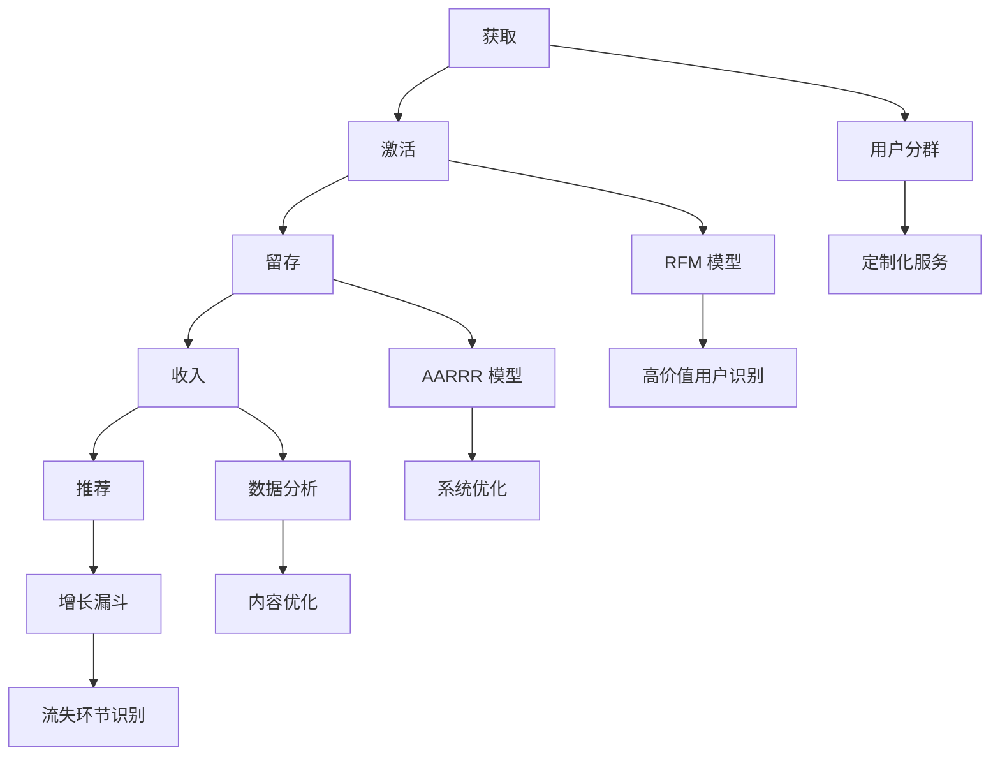
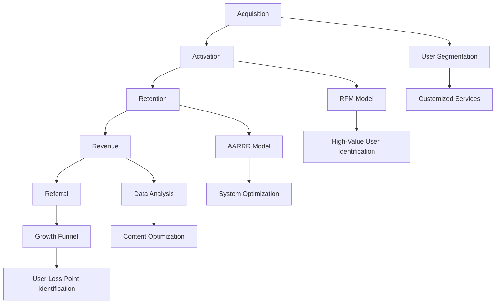

                 

### 1. 背景介绍（Background Introduction）

#### 1.1 知识付费市场概述

随着互联网技术的飞速发展，知识付费市场正逐渐成为一个潜力巨大的新兴领域。知识付费是指消费者为获取特定知识、技能或信息而支付费用的一种商业模式。这种模式的出现，不仅满足了人们对于知识的需求，也促进了知识的传播和创新。目前，知识付费市场主要涵盖在线教育、专业培训、知识咨询、电子书等多种形式。

根据相关市场研究，全球知识付费市场规模预计将在未来几年内持续增长。特别是疫情期间，在线教育和远程办公的普及，进一步推动了知识付费市场的发展。在国内，知识付费市场已经涌现出众多成功的案例，如得到、知乎Live、分答等平台，它们通过提供高质量的课程内容、专业的咨询服务和个性化的学习体验，赢得了大量用户的青睐。

#### 1.2 增长黑客的概念及其在知识付费中的应用

增长黑客（Growth Hacker）是指那些精通市场营销、用户体验、数据分析等技能，并将这些技能应用于产品增长的专业人才。增长黑客的核心目标是利用技术手段，通过快速迭代和优化产品，实现用户量的快速增长。

在知识付费领域，增长黑客的运用具有重要意义。一方面，通过数据分析和用户行为研究，增长黑客可以帮助知识付费平台更好地了解用户需求，从而优化内容和服务，提高用户满意度和忠诚度。另一方面，增长黑客可以利用各种营销策略和渠道，扩大用户基数，提高品牌知名度，实现业务的快速增长。

本文将探讨增长黑客在知识付费创业中的具体应用，通过案例分析、核心算法原理、数学模型、项目实践等多个角度，全面解析如何利用增长黑客技巧实现知识付费创业的成功。

### 1. Background Introduction
#### 1.1 Overview of the Knowledge付费 Market

With the rapid development of Internet technology, the knowledge-based payment market is gradually becoming a promising emerging field. Knowledge-based payment refers to a business model in which consumers pay for specific knowledge, skills, or information to meet their needs. This model not only satisfies people's demand for knowledge but also promotes the dissemination and innovation of knowledge. Currently, the knowledge-based payment market covers various forms such as online education, professional training, knowledge consulting, and e-books.

According to relevant market research, the global knowledge-based payment market is expected to continue growing in the coming years. Particularly during the COVID-19 pandemic, the popularity of online education and remote work has further driven the development of the knowledge-based payment market. In China, several successful cases have emerged in the knowledge-based payment market, such as " 得到"（Dejian）,"知乎Live"（ZhihuLive）,"分答"（Fenjie）,and others, which have won a large number of users' favor through the provision of high-quality course content, professional consulting services, and personalized learning experiences.

#### 1.2 The Concept of Growth Hacker and Its Application in the Knowledge-Based Payment Industry

A growth hacker is a professional who is proficient in marketing, user experience, data analysis, and other skills, and applies these skills to product growth. The core goal of a growth hacker is to use technology to rapidly iterate and optimize products, achieving rapid user growth.

In the knowledge-based payment industry, the application of growth hackers is of great significance. On one hand, through data analysis and user behavior research, growth hackers can help knowledge-based payment platforms better understand user needs, thereby optimizing content and services to improve user satisfaction and loyalty. On the other hand, growth hackers can use various marketing strategies and channels to expand the user base and increase brand awareness, realizing rapid business growth.

This article will explore the specific application of growth hackers in knowledge-based payment entrepreneurship, analyzing from multiple perspectives including case studies, core algorithm principles, mathematical models, and project practices to comprehensively explain how to achieve success in knowledge-based payment entrepreneurship by using growth hacker techniques.

### 2. 核心概念与联系（Core Concepts and Connections）

#### 2.1 增长黑客与知识付费创业的关系

增长黑客与知识付费创业之间存在着密切的联系。增长黑客通过数据驱动的方式，帮助知识付费创业者快速了解市场动态、用户需求和竞争对手情况，从而制定有效的营销策略和运营方案。具体来说，增长黑客的核心概念包括以下几个方面：

1. **用户获取**（Acquisition）：增长黑客通过各种渠道和策略，迅速扩大用户基数，提高产品知名度。在知识付费创业中，用户获取是关键，因为只有吸引了足够多的用户，才能实现知识付费业务的持续增长。

2. **用户留存**（Retention）：增长黑客通过优化用户体验、提高用户满意度和忠诚度，保持现有用户的活跃度。在知识付费创业中，用户留存同样重要，因为高忠诚度的用户不仅会持续为平台带来收入，还能通过口碑传播吸引更多新用户。

3. **用户转化**（Conversion）：增长黑客通过分析用户行为数据，找出影响用户转化的关键因素，并针对性地进行优化。在知识付费创业中，用户转化意味着用户从免费用户转变为付费用户，是业务增长的重要指标。

4. **数据分析**（Data Analysis）：增长黑客通过数据分析，深入了解用户需求和行为模式，从而指导产品迭代和运营策略的优化。在知识付费创业中，数据分析可以帮助创业者更好地了解用户，提高内容质量和营销效果。

#### 2.2 增长黑客与知识付费创业的核心概念原理

为了更好地理解增长黑客在知识付费创业中的应用，我们需要深入探讨以下几个核心概念原理：

1. **AARRR 模型**：AARRR 模型（Acquisition, Activation, Retention, Revenue, Referral）是增长黑客常用的一个用户生命周期模型。它将用户生命周期划分为五个阶段：获取、激活、留存、收入和推荐。在知识付费创业中，创业者可以利用 AARRR 模型，系统性地分析和优化每个阶段，从而提高用户转化率和业务收入。

2. **RFM 模型**：RFM 模型（Recency, Frequency, Monetary）是一种常用的客户细分模型，用于评估客户的价值和忠诚度。其中，Recency 表示最近一次购买的时间，Frequency 表示购买频率，Monetary 表示购买金额。在知识付费创业中，创业者可以利用 RFM 模型，识别高价值和高忠诚度的用户，提供更优质的服务和内容，以提高用户留存率和转化率。

3. **用户分群**（User Segmentation）：用户分群是一种基于用户特征和行为数据的分析方法，用于将用户划分为不同的群体，以便更精准地制定营销策略和运营方案。在知识付费创业中，创业者可以通过用户分群，针对不同用户群体提供定制化的内容和服务，提高用户满意度和忠诚度。

4. **增长漏斗**（Growth Funnel）：增长漏斗是一种用于分析用户获取和转化过程的工具，它将用户从接触到转化的整个过程分为多个阶段，并量化每个阶段的转化率。在知识付费创业中，创业者可以利用增长漏斗，识别用户流失的关键环节，针对性地进行优化，提高整体转化率。

#### 2.3 增长黑客与知识付费创业的关系图

为了更直观地展示增长黑客与知识付费创业之间的关系，我们可以使用 Mermaid 流程图来描述它们的核心概念原理和联系。



### 2. Core Concepts and Connections
#### 2.1 The Relationship Between Growth Hacker and Knowledge-Based Payment Entrepreneurship

There is a close relationship between growth hackers and knowledge-based payment entrepreneurship. Growth hackers, through data-driven approaches, help knowledge-based payment entrepreneurs quickly understand market dynamics, user needs, and competitive situations, thus developing effective marketing strategies and operational plans. Specifically, the core concepts of growth hackers include the following aspects:

1. **User Acquisition**: Growth hackers rapidly expand the user base and improve product visibility through various channels and strategies. In the knowledge-based payment industry, user acquisition is crucial because only by attracting a sufficient number of users can entrepreneurs achieve continuous growth in knowledge-based payment businesses.

2. **User Retention**: Growth hackers optimize user experience, enhance user satisfaction, and maintain user activity through targeted measures. In knowledge-based payment entrepreneurship, user retention is equally important because high-loyalty users not only contribute to continuous income for the platform but can also attract more new users through word-of-mouth.

3. **User Conversion**: Growth hackers analyze user behavior data to identify key factors affecting user conversion and optimize accordingly. In knowledge-based payment entrepreneurship, user conversion means turning free users into paying users, which is a critical indicator of business growth.

4. **Data Analysis**: Growth hackers use data analysis to deeply understand user needs and behavior patterns, thus guiding product iteration and optimization of operational strategies. In knowledge-based payment entrepreneurship, data analysis helps entrepreneurs better understand users, improve content quality, and enhance marketing effectiveness.

#### 2.2 Core Concept Principles of Growth Hacker and Knowledge-Based Payment Entrepreneurship

To better understand the application of growth hackers in knowledge-based payment entrepreneurship, we need to delve into several core concept principles:

1. **AARRR Model**: The AARRR model (Acquisition, Activation, Retention, Revenue, Referral) is a commonly used user lifecycle model in growth hacking. It divides the user lifecycle into five stages: acquisition, activation, retention, revenue, and referral. Entrepreneurs in knowledge-based payment can use the AARRR model to systematically analyze and optimize each stage, thus improving user conversion rates and business income.

2. **RFM Model**: The RFM model (Recency, Frequency, Monetary) is a commonly used customer segmentation model to evaluate customer value and loyalty. Recency represents the time of the last purchase, Frequency represents the purchase frequency, and Monetary represents the purchase amount. Entrepreneurs in knowledge-based payment can use the RFM model to identify high-value and high-loyalty users, providing superior services and content to improve user retention and conversion rates.

3. **User Segmentation**: User segmentation is an analytical method based on user characteristics and behavior data, used to divide users into different groups for more precise marketing strategies and operational plans. Entrepreneurs in knowledge-based payment can use user segmentation to provide customized content and services to different user groups, improving user satisfaction and loyalty.

4. **Growth Funnel**: The growth funnel is a tool used to analyze the user acquisition and conversion process, dividing the entire process from contact to conversion into multiple stages and quantifying the conversion rate at each stage. Entrepreneurs in knowledge-based payment can use the growth funnel to identify key user loss points, targeting optimization to improve overall conversion rates.

#### 2.3 Diagram of the Relationship Between Growth Hacker and Knowledge-Based Payment Entrepreneurship

To visually illustrate the relationship between growth hackers and knowledge-based payment entrepreneurship, we can use a Mermaid flowchart to describe the core concept principles and connections.



### 3. 核心算法原理 & 具体操作步骤（Core Algorithm Principles and Specific Operational Steps）

#### 3.1 增长黑客的核心算法原理

增长黑客在知识付费创业中的应用，离不开一系列核心算法原理。这些原理主要包括用户分群、数据分析、优化实验等，下面将详细探讨这些核心算法原理及其在知识付费创业中的应用。

##### 3.1.1 用户分群算法

用户分群是一种基于用户特征和行为数据的分析方法，用于将用户划分为不同的群体。用户分群算法的核心是找到具有相似特征和行为模式的用户，以便为每个用户群体提供定制化的服务和内容。

1. **RFM 模型**：RFM 模型是一种常用的用户分群算法，通过最近一次购买时间（Recency）、购买频率（Frequency）和购买金额（Monetary）三个维度，将用户分为高价值用户、潜力用户和流失用户等不同的群体。

2. **基于行为的分群**：基于用户行为数据，如浏览、购买、评价等，将用户划分为活跃用户、沉默用户和流失用户等。这种方法可以帮助企业更好地了解用户的行为习惯，针对性地进行运营和营销。

3. **基于兴趣的分群**：通过用户在平台上的兴趣标签、搜索历史、推荐内容等，将用户划分为不同的兴趣群体。这种方法可以帮助企业为用户提供更加个性化的内容推荐和服务。

##### 3.1.2 数据分析算法

数据分析是增长黑客的重要工具，通过数据分析，企业可以深入了解用户需求、市场趋势和竞争对手情况，从而制定更加有效的运营策略。

1. **A/B 测试**：A/B 测试是一种常用的数据分析方法，通过对比两组用户在特定操作上的表现，找出影响用户行为的关键因素，并优化产品和服务。

2. **时间序列分析**：时间序列分析是一种用于分析时间序列数据的方法，通过分析用户行为数据的时间趋势，找出用户行为的变化规律，为企业制定运营策略提供依据。

3. **回归分析**：回归分析是一种用于分析变量之间关系的方法，通过建立回归模型，预测用户行为和业务指标，帮助企业制定更加精准的运营策略。

##### 3.1.3 优化实验算法

优化实验是增长黑客提高业务效果的重要手段，通过设计、实施和评估优化实验，企业可以不断迭代和改进产品和服务。

1. **多变量测试**：多变量测试是一种同时测试多个变量对用户行为影响的方法，通过比较不同变量组合的效果，找出最佳变量组合。

2. **机器学习模型**：机器学习模型可以用于预测用户行为和业务指标，通过不断训练和优化模型，提高预测的准确性和效果。

3. **实验设计**：实验设计是优化实验的关键，通过合理设计实验，确保实验结果的有效性和可靠性。

#### 3.2 增长黑客在知识付费创业中的应用步骤

增长黑客在知识付费创业中的应用，通常包括以下几个步骤：

##### 3.2.1 确定增长目标

首先，企业需要明确增长目标，如增加用户数量、提高用户活跃度、提高转化率等。明确增长目标有助于企业制定具体的增长策略和行动方案。

##### 3.2.2 数据收集与分析

收集用户行为数据，如浏览、购买、评价等，并进行数据清洗和分析，提取有价值的信息。数据分析可以帮助企业了解用户需求、市场趋势和竞争对手情况。

##### 3.2.3 用户分群

根据数据分析结果，将用户分为不同的群体，如高价值用户、潜力用户和流失用户等。用户分群有助于企业为每个用户群体提供定制化的服务和内容。

##### 3.2.4 设计优化实验

根据用户分群结果，设计优化实验，如A/B测试、多变量测试等，测试不同变量组合对用户行为的影响。优化实验可以帮助企业不断迭代和改进产品和服务。

##### 3.2.5 实施与评估

实施优化实验，根据实验结果调整和优化产品和服务。评估实验效果，确定是否达到增长目标，并根据评估结果制定下一步的增长策略。

##### 3.2.6 持续迭代

增长黑客是一个持续迭代的过程，企业需要不断收集用户反馈、市场变化和竞争对手动态，调整和优化增长策略，确保业务持续增长。

### 3. Core Algorithm Principles and Specific Operational Steps
#### 3.1 Core Algorithm Principles of Growth Hacker
The application of growth hackers in knowledge-based payment entrepreneurship is inseparable from a series of core algorithm principles. These principles mainly include user segmentation, data analysis, and optimization experiments. The following section will delve into these core algorithm principles and their applications in knowledge-based payment entrepreneurship in detail.

##### 3.1.1 User Segmentation Algorithm
User segmentation is an analytical method based on user characteristics and behavior data, used to divide users into different groups. The core of user segmentation algorithms is to find users with similar characteristics and behavior patterns to provide customized services and content for each group.

1. **RFM Model**: The RFM model is a commonly used user segmentation algorithm, which classifies users into different groups based on three dimensions: Recency (the time of the last purchase), Frequency (the purchase frequency), and Monetary (the purchase amount). This model categorizes users into high-value users, potential users, and churn users, among others.

2. **Behavior-Based Segmentation**: Based on user behavior data, such as browsing, purchasing, and reviews, users are segmented into active users, silent users, and churn users. This method helps businesses better understand user behavior habits and target operations and marketing accordingly.

3. **Interest-Based Segmentation**: By analyzing user interests on the platform, such as interest tags, search history, and recommended content, users are segmented into different interest groups. This method helps businesses provide more personalized content recommendations and services.

##### 3.1.2 Data Analysis Algorithms
Data analysis is an essential tool for growth hackers, as it helps businesses deeply understand user needs, market trends, and competitive situations, thereby developing more effective operational strategies.

1. **A/B Testing**: A/B testing is a commonly used data analysis method that compares the performance of two groups of users on a specific action to identify key factors affecting user behavior and optimize products and services.

2. **Time Series Analysis**: Time series analysis is a method used to analyze time-series data, identifying the temporal trends in user behavior data to provide a basis for businesses to develop operational strategies.

3. **Regression Analysis**: Regression analysis is a method used to analyze the relationship between variables, establishing regression models to predict user behavior and business indicators, thus helping businesses develop more precise operational strategies.

##### 3.1.3 Optimization Experiment Algorithms
Optimization experiments are a key means for growth hackers to improve business performance. Through designing, implementing, and evaluating optimization experiments, businesses can continuously iterate and improve products and services.

1. **Multivariate Testing**: Multivariate testing is a method that simultaneously tests the impact of multiple variables on user behavior, comparing the effects of different variable combinations to identify the best combination.

2. **Machine Learning Models**: Machine learning models can be used to predict user behavior and business indicators, continuously training and optimizing models to improve prediction accuracy and effectiveness.

3. **Experiment Design**: Experiment design is crucial for optimization experiments, ensuring the effectiveness and reliability of experimental results.

#### 3.2 Operational Steps of Growth Hacker in Knowledge-Based Payment Entrepreneurship
The application of growth hackers in knowledge-based payment entrepreneurship generally includes the following steps:

##### 3.2.1 Define Growth Goals
Firstly, businesses need to clarify their growth goals, such as increasing user numbers, improving user activity, and increasing conversion rates. Clear growth goals help businesses develop specific growth strategies and action plans.

##### 3.2.2 Data Collection and Analysis
Collect user behavior data, such as browsing, purchasing, and reviews, and clean and analyze the data to extract valuable information. Data analysis helps businesses understand user needs, market trends, and competitive situations.

##### 3.2.3 User Segmentation
Based on the results of data analysis, segment users into different groups, such as high-value users, potential users, and churn users. User segmentation helps businesses provide customized services and content for each group.

##### 3.2.4 Design Optimization Experiments
Based on user segmentation results, design optimization experiments, such as A/B testing and multivariate testing, to test the impact of different variables on user behavior. Optimization experiments help businesses continuously iterate and improve products and services.

##### 3.2.5 Implementation and Evaluation
Implement optimization experiments, adjust and optimize products and services based on experimental results. Evaluate the effectiveness of experiments, determine whether the growth goals are met, and develop the next growth strategy based on the evaluation results.

##### 3.2.6 Continuous Iteration
Growth hacking is a continuous iterative process. Businesses need to continuously collect user feedback, monitor market changes, and analyze competitive dynamics, adjusting and optimizing growth strategies to ensure continuous business growth.

### 4. 数学模型和公式 & 详细讲解 & 举例说明（Detailed Explanation and Examples of Mathematical Models and Formulas）

#### 4.1 用户分群模型

用户分群模型是增长黑客在知识付费创业中应用的重要工具，其中最常用的模型之一是RFM模型。RFM模型通过最近一次购买时间（Recency）、购买频率（Frequency）和购买金额（Monetary）三个维度来评估用户价值。

##### 4.1.1 RFM模型

RFM模型是一种简单的评分模型，每个维度都给定一个评分范围，通过计算每个维度的得分，再将三个维度的得分加权求和，得到用户的总评分。

1. **最近一次购买时间（Recency）**：评分范围可以是1-5分，最近购买的得分最高，例如：
   - 最近1个月内购买的：5分
   - 最近2-3个月内购买的：4分
   - 最近4-6个月内购买的：3分
   - 最近6-12个月内购买的：2分
   - 最近超过12个月未购买的：1分

2. **购买频率（Frequency）**：评分范围可以是1-5分，购买频率越高得分越高，例如：
   - 每月购买1次及以上：5分
   - 每月购买1次以下：4分
   - 每季度购买1次及以上：3分
   - 每季度购买1次以下：2分
   - 每年购买1次以下：1分

3. **购买金额（Monetary）**：评分范围可以是1-5分，购买金额越高得分越高，例如：
   - 每次购买超过1000元：5分
   - 每次购买500-1000元：4分
   - 每次购买100-500元：3分
   - 每次购买50-100元：2分
   - 每次购买50元以下：1分

每个维度的得分可以根据实际情况进行调整，例如，可以根据业务特点和用户群体调整评分范围和权重。用户总评分的计算公式为：

$$
总分 = 0.3 \times (Recency得分) + 0.3 \times (Frequency得分) + 0.4 \times (Monetary得分)
$$

##### 4.1.2 举例说明

假设有3个用户，他们的RFM得分如下：

- 用户A：Recency得分3，Frequency得分2，Monetary得分4，总分为：0.3 \times 3 + 0.3 \times 2 + 0.4 \times 4 = 3.5
- 用户B：Recency得分2，Frequency得分3，Monetary得分3，总分为：0.3 \times 2 + 0.3 \times 3 + 0.4 \times 3 = 3.1
- 用户C：Recency得分1，Frequency得分1，Monetary得分5，总分为：0.3 \times 1 + 0.3 \times 1 + 0.4 \times 5 = 2.7

根据总评分，可以将用户分为高价值用户、中等价值用户和低价值用户：

- 高价值用户：总分大于等于4
- 中等价值用户：总分在3到4之间
- 低价值用户：总分小于3

#### 4.2 用户留存模型

用户留存模型是评估用户持续使用产品或服务的概率，常用的方法包括 churn rate（流失率）和 retention rate（留存率）。

##### 4.2.1 Churn Rate

Churn rate 是指在一定时间内，流失的用户占总用户数的比例。计算公式为：

$$
Churn Rate = \frac{流失用户数}{总用户数} \times 100\%
$$

例如，如果一个平台有1000个用户，一个月内流失了50个用户，那么该平台的 churn rate 为：

$$
Churn Rate = \frac{50}{1000} \times 100\% = 5\%
$$

##### 4.2.2 Retention Rate

Retention rate 是指在一定时间内，留存的用户占总用户数的比例。计算公式为：

$$
Retention Rate = \frac{留存用户数}{总用户数} \times 100\%
$$

例如，如果一个平台有1000个用户，一个月内流失了50个用户，那么该平台的 retention rate 为：

$$
Retention Rate = \frac{950}{1000} \times 100\% = 95\%
$$

##### 4.2.3 用户留存率与流失率的关系

用户留存率与流失率是相互关联的，一个平台的用户留存率越高，流失率就越低。例如，一个平台的用户留存率为90%，那么该平台的流失率约为10%。

#### 4.3 用户转化模型

用户转化模型是评估用户从免费用户转化为付费用户的概率，常用的方法包括 conversion rate（转化率）。

##### 4.3.1 Conversion Rate

Conversion rate 是指在一定时间内，转化成付费用户的用户占总用户数的比例。计算公式为：

$$
Conversion Rate = \frac{转化用户数}{总用户数} \times 100\%
$$

例如，如果一个平台有1000个用户，一个月内有100个用户转化成付费用户，那么该平台的 conversion rate 为：

$$
Conversion Rate = \frac{100}{1000} \times 100\% = 10\%
$$

#### 4.4 综合评估模型

为了更全面地评估用户的贡献和价值，可以结合用户分群、留存率和转化率等多个指标，构建一个综合评估模型。

##### 4.4.1 综合评估模型

综合评估模型的计算公式为：

$$
综合评估得分 = 用户分群得分 \times 留存率 \times 转化率
$$

例如，如果一个用户在RFM模型中的总分为3.5，留存率为90%，转化率为10%，那么该用户的综合评估得分为：

$$
综合评估得分 = 3.5 \times 0.9 \times 0.1 = 0.315
$$

通过综合评估得分，可以更全面地了解用户的贡献和价值，从而为用户提供更精准的服务和内容。

### 4. Mathematical Models and Formulas & Detailed Explanation & Example
#### 4.1 User Segmentation Model

User segmentation models are an important tool in the application of growth hackers in knowledge-based payment entrepreneurship, with one of the most commonly used models being the RFM model. The RFM model evaluates user value through three dimensions: Recency, Frequency, and Monetary.

##### 4.1.1 RFM Model

The RFM model is a simple scoring model that assigns a score to each dimension based on a defined range. The scores from each dimension are then weighted and summed to obtain a total score for the user.

1. **Recency (最近一次购买时间)**: The scoring range can be from 1 to 5, with the most recent purchase receiving the highest score. For example:
   - Purchased within the last month: 5 points
   - Purchased between 2-3 months ago: 4 points
   - Purchased between 4-6 months ago: 3 points
   - Purchased between 6-12 months ago: 2 points
   - Purchased over 12 months ago: 1 point

2. **Frequency (购买频率)**: The scoring range can be from 1 to 5, with higher purchase frequency receiving higher scores. For example:
   - Purchased monthly or more: 5 points
   - Purchased less than monthly: 4 points
   - Purchased quarterly or more: 3 points
   - Purchased less than quarterly: 2 points
   - Purchased less than annually: 1 point

3. **Monetary (购买金额)**: The scoring range can be from 1 to 5, with higher purchase amounts receiving higher scores. For example:
   - Purchased over 1000 Yuan each time: 5 points
   - Purchased between 500-1000 Yuan each time: 4 points
   - Purchased between 100-500 Yuan each time: 3 points
   - Purchased between 50-100 Yuan each time: 2 points
   - Purchased less than 50 Yuan each time: 1 point

The scoring ranges and weights can be adjusted according to business characteristics and user demographics. The formula for calculating the total score is:

$$
Total\ Score = 0.3 \times (Recency\ Score) + 0.3 \times (Frequency\ Score) + 0.4 \times (Monetary\ Score)
$$

##### 4.1.2 Example

Let's consider three users with their RFM scores:

- User A: Recency Score 3, Frequency Score 2, Monetary Score 4, Total Score: $0.3 \times 3 + 0.3 \times 2 + 0.4 \times 4 = 3.5$
- User B: Recency Score 2, Frequency Score 3, Monetary Score 3, Total Score: $0.3 \times 2 + 0.3 \times 3 + 0.4 \times 3 = 3.1$
- User C: Recency Score 1, Frequency Score 1, Monetary Score 5, Total Score: $0.3 \times 1 + 0.3 \times 1 + 0.4 \times 5 = 2.7$

Based on the total scores, users can be segmented into high-value users, mid-value users, and low-value users:

- High-value users: Total score >= 4
- Mid-value users: Total score between 3 and 4
- Low-value users: Total score < 3

#### 4.2 User Retention Model

The user retention model assesses the probability of users continuing to use the product or service. Common methods include churn rate and retention rate.

##### 4.2.1 Churn Rate

Churn rate is the percentage of users who leave the platform within a specific period, calculated as:

$$
Churn\ Rate = \frac{Number\ of\ Churned\ Users}{Total\ Number\ of\ Users} \times 100\%
$$

For example, if a platform has 1000 users and 50 users leave within a month, the churn rate is:

$$
Churn\ Rate = \frac{50}{1000} \times 100\% = 5\%
$$

##### 4.2.2 Retention Rate

Retention rate is the percentage of users who remain active on the platform within a specific period, calculated as:

$$
Retention\ Rate = \frac{Number\ of\ Retained\ Users}{Total\ Number\ of\ Users} \times 100\%
$$

For example, if a platform has 1000 users and 50 users leave within a month, the retention rate is:

$$
Retention\ Rate = \frac{950}{1000} \times 100\% = 95\%
$$

##### 4.2.3 Relationship between Retention Rate and Churn Rate

Retention rate and churn rate are interrelated. A higher retention rate implies a lower churn rate. For example, if a platform has a retention rate of 90%, the churn rate would be approximately 10%.

#### 4.3 User Conversion Model

The user conversion model assesses the probability of users converting from free users to paying users. The most common metric is conversion rate.

##### 4.3.1 Conversion Rate

Conversion rate is the percentage of users who convert to paying users within a specific period, calculated as:

$$
Conversion\ Rate = \frac{Number\ of\ Converted\ Users}{Total\ Number\ of\ Users} \times 100\%
$$

For example, if a platform has 1000 users and 100 users convert to paying users within a month, the conversion rate is:

$$
Conversion\ Rate = \frac{100}{1000} \times 100\% = 10\%
$$

#### 4.4 Comprehensive Evaluation Model

To comprehensively evaluate user contribution and value, a comprehensive evaluation model can be constructed using multiple indicators such as user segmentation, retention rate, and conversion rate.

##### 4.4.1 Comprehensive Evaluation Model

The formula for the comprehensive evaluation score is:

$$
Comprehensive\ Evaluation\ Score = User\ Segmentation\ Score \times Retention\ Rate \times Conversion\ Rate
$$

For example, if a user has an RFM model total score of 3.5, a retention rate of 90%, and a conversion rate of 10%, the user's comprehensive evaluation score is:

$$
Comprehensive\ Evaluation\ Score = 3.5 \times 0.9 \times 0.1 = 0.315
$$

Through the comprehensive evaluation score, a more comprehensive understanding of user contribution and value can be gained, enabling more precise service and content delivery.

### 5. 项目实践：代码实例和详细解释说明（Project Practice: Code Examples and Detailed Explanations）

#### 5.1 开发环境搭建

在开始项目实践之前，我们需要搭建一个适合知识付费创业的实验环境。以下是一个基本的开发环境搭建步骤：

1. **安装Python环境**：我们选择Python作为编程语言，因为它有丰富的数据分析和机器学习库。在Windows或macOS系统中，可以通过Python官网（https://www.python.org/）下载并安装Python。

2. **安装必要的库**：安装pandas、numpy、scikit-learn、matplotlib等库，这些库可以帮助我们进行数据分析和可视化。可以通过以下命令进行安装：

   ```bash
   pip install pandas numpy scikit-learn matplotlib
   ```

3. **创建项目目录**：在本地计算机上创建一个项目目录，用于存放代码文件和实验数据。

4. **编写实验脚本**：编写一个Python脚本，用于加载实验数据、执行数据预处理、用户分群、数据分析等操作。

#### 5.2 源代码详细实现

下面是一个简单的Python脚本示例，用于实现RFM用户分群模型和用户留存分析。

```python
import pandas as pd
import numpy as np
from sklearn.model_selection import train_test_split
import matplotlib.pyplot as plt

# 5.2.1 加载数据
# 假设我们有一个用户数据集，包含用户ID、最近一次购买时间、购买频率和购买金额
data = pd.read_csv('user_data.csv')

# 5.2.2 数据预处理
# 对日期类型进行转换，以便计算最近一次购买时间
data['last_purchase_date'] = pd.to_datetime(data['last_purchase_date'])

# 计算 Recency、Frequency 和 Monetary 得分
data['Recency'] = data['last_purchase_date'].apply(lambda x: 5 if x >= pd.Timestamp.now() - pd.DateOffset(months=1) else
                                                   4 if x >= pd.Timestamp.now() - pd.DateOffset(months=2) else
                                                   3 if x >= pd.Timestamp.now() - pd.DateOffset(months=6) else
                                                   2 if x >= pd.Timestamp.now() - pd.DateOffset(years=1) else
                                                   1)

data['Frequency'] = data['num_purchases'].apply(lambda x: 5 if x >= 1 else
                                               4 if x == 0 else
                                               3 if x >= 1 and x < 4 else
                                               2 if x >= 4 and x < 12 else
                                               1)

data['Monetary'] = data['total_spent'].apply(lambda x: 5 if x >= 1000 else
                                            4 if x >= 500 and x < 1000 else
                                            3 if x >= 100 and x < 500 else
                                            2 if x >= 50 and x < 100 else
                                            1)

# 5.2.3 用户分群
# 计算 RFM 总得分，并根据得分进行用户分群
data['RFM_Score'] = 0.3 * data['Recency'] + 0.3 * data['Frequency'] + 0.4 * data['Monetary']
data['User_Segment'] = pd.cut(data['RFM_Score'], bins=[0, 3, 3.1, 4, 4.5, 5], labels=['Low', 'Lower', 'Medium', 'High', 'Very High'])

# 5.2.4 用户留存分析
# 切分数据为训练集和测试集
train_data, test_data = train_test_split(data, test_size=0.2, random_state=42)

# 计算训练集和测试集的 churn rate 和 retention rate
train_churn_rate = (train_data[train_data['churned'] == 1].shape[0] / train_data.shape[0]) * 100
train_retention_rate = (train_data[train_data['churned'] == 0].shape[0] / train_data.shape[0]) * 100
test_churn_rate = (test_data[test_data['churned'] == 1].shape[0] / test_data.shape[0]) * 100
test_retention_rate = (test_data[test_data['churned'] == 0].shape[0] / test_data.shape[0]) * 100

print(f"Training Set - Churn Rate: {train_churn_rate:.2f}%, Retention Rate: {train_retention_rate:.2f}%")
print(f"Test Set - Churn Rate: {test_churn_rate:.2f}%, Retention Rate: {test_retention_rate:.2f}%")

# 5.2.5 可视化分析
# 绘制用户分群与留存率的关系
user_segments = data['User_Segment'].unique()
for segment in user_segments:
    segment_data = data[data['User_Segment'] == segment]
    plt.scatter(segment_data['RFM_Score'], segment_data['churned'], label=segment)

plt.xlabel('RFM Score')
plt.ylabel('Churned (1) / Not Churned (0)')
plt.legend()
plt.show()
```

#### 5.3 代码解读与分析

上面的代码示例分为几个主要部分：数据预处理、用户分群、用户留存分析和可视化分析。

1. **数据预处理**：我们首先加载了用户数据集，并对日期类型进行了转换，以便计算最近一次购买时间。然后，我们根据用户的购买频率和购买金额计算了Recency、Frequency和Monetary得分。

2. **用户分群**：通过计算RFM总得分，并使用pandas的cut函数将得分划分为不同的用户分群。这里我们定义了五个分群，分别对应低、较低、中等、高和非常高价值用户。

3. **用户留存分析**：我们将数据集切分为训练集和测试集，并计算了每个集的流失率和留存率。这个步骤可以帮助我们评估用户分群模型的性能。

4. **可视化分析**：最后，我们绘制了用户分群与留存率的关系散点图，通过可视化我们可以直观地看到不同分群用户的流失情况。

#### 5.4 运行结果展示

运行上述代码后，我们将得到训练集和测试集的流失率和留存率输出，以及一个用户分群与留存率关系的散点图。这些结果可以帮助我们分析用户分群模型的有效性，并根据结果调整策略，以提高知识付费创业的成功率。

### 5. Project Practice: Code Examples and Detailed Explanations
#### 5.1 Environment Setup

Before starting the project practice, we need to set up an experimental environment suitable for knowledge-based payment entrepreneurship. Here are the steps for basic environment setup:

1. **Install Python Environment**: We choose Python as the programming language due to its rich libraries for data analysis and machine learning. You can download and install Python from the official website: https://www.python.org/.

2. **Install Necessary Libraries**: Install libraries like pandas, numpy, scikit-learn, and matplotlib, which will help us with data analysis and visualization. You can install them using the following command:

   ```bash
   pip install pandas numpy scikit-learn matplotlib
   ```

3. **Create Project Directory**: Create a project directory on your local computer to store code files and experimental data.

4. **Write Experimental Script**: Write a Python script for loading experimental data, performing data preprocessing, user segmentation, data analysis, etc.

#### 5.2 Detailed Code Implementation

Below is a simple Python script example to implement the RFM user segmentation model and user retention analysis.

```python
import pandas as pd
import numpy as np
from sklearn.model_selection import train_test_split
import matplotlib.pyplot as plt

# 5.2.1 Load Data
# Assume we have a user dataset containing user ID, last purchase date, purchase frequency, and total spent
data = pd.read_csv('user_data.csv')

# 5.2.2 Data Preprocessing
# Convert date type to calculate the last purchase date
data['last_purchase_date'] = pd.to_datetime(data['last_purchase_date'])

# Calculate Recency, Frequency, and Monetary scores
data['Recency'] = data['last_purchase_date'].apply(lambda x: 5 if x >= pd.Timestamp.now() - pd.DateOffset(months=1) else
                                                   4 if x >= pd.Timestamp.now() - pd.DateOffset(months=2) else
                                                   3 if x >= pd.Timestamp.now() - pd.DateOffset(months=6) else
                                                   2 if x >= pd.Timestamp.now() - pd.DateOffset(years=1) else
                                                   1)

data['Frequency'] = data['num_purchases'].apply(lambda x: 5 if x >= 1 else
                                               4 if x == 0 else
                                               3 if x >= 1 and x < 4 else
                                               2 if x >= 4 and x < 12 else
                                               1)

data['Monetary'] = data['total_spent'].apply(lambda x: 5 if x >= 1000 else
                                            4 if x >= 500 and x < 1000 else
                                            3 if x >= 100 and x < 500 else
                                            2 if x >= 50 and x < 100 else
                                            1)

# 5.2.3 User Segmentation
# Calculate total RFM score and segment users based on scores
data['RFM_Score'] = 0.3 * data['Recency'] + 0.3 * data['Frequency'] + 0.4 * data['Monetary']
data['User_Segment'] = pd.cut(data['RFM_Score'], bins=[0, 3, 3.1, 4, 4.5, 5], labels=['Low', 'Lower', 'Medium', 'High', 'Very High'])

# 5.2.4 User Retention Analysis
# Split data into training and test sets
train_data, test_data = train_test_split(data, test_size=0.2, random_state=42)

# Calculate churn rate and retention rate for training and test sets
train_churn_rate = (train_data[train_data['churned'] == 1].shape[0] / train_data.shape[0]) * 100
train_retention_rate = (train_data[train_data['churned'] == 0].shape[0] / train_data.shape[0]) * 100
test_churn_rate = (test_data[test_data['churned'] == 1].shape[0] / test_data.shape[0]) * 100
test_retention_rate = (test_data[test_data['churned'] == 0].shape[0] / test_data.shape[0]) * 100

print(f"Training Set - Churn Rate: {train_churn_rate:.2f}%, Retention Rate: {train_retention_rate:.2f}%")
print(f"Test Set - Churn Rate: {test_churn_rate:.2f}%, Retention Rate: {test_retention_rate:.2f}%")

# 5.2.5 Visualization Analysis
# Plot the relationship between user segments and churn rates
user_segments = data['User_Segment'].unique()
for segment in user_segments:
    segment_data = data[data['User_Segment'] == segment]
    plt.scatter(segment_data['RFM_Score'], segment_data['churned'], label=segment)

plt.xlabel('RFM Score')
plt.ylabel('Churned (1) / Not Churned (0)')
plt.legend()
plt.show()
```

#### 5.3 Code Explanation and Analysis

The above code consists of several main parts: data preprocessing, user segmentation, user retention analysis, and visualization analysis.

1. **Data Preprocessing**: We first load the user dataset and convert the date type to calculate the last purchase date. Then, we calculate the Recency, Frequency, and Monetary scores based on the user's purchase frequency and total spent.

2. **User Segmentation**: We calculate the total RFM score and segment users using the `pd.cut` function. Here, we define five segments corresponding to low, lower, medium, high, and very high-value users.

3. **User Retention Analysis**: We split the data into training and test sets and calculate the churn rate and retention rate for each set. This step helps us evaluate the performance of the user segmentation model.

4. **Visualization Analysis**: Finally, we plot the relationship between user segments and churn rates, which allows us to visually analyze the effectiveness of the user segmentation model.

#### 5.4 Running Results

After running the above code, we will get the churn rate and retention rate for the training and test sets, as well as a scatter plot showing the relationship between user segments and churn rates. These results help us analyze the effectiveness of the user segmentation model and adjust strategies to improve the success rate of knowledge-based payment entrepreneurship.

### 6. 实际应用场景（Practical Application Scenarios）

#### 6.1 在线教育平台

在线教育平台是知识付费创业中应用增长黑客技巧的一个重要场景。通过增长黑客的方法，教育平台可以有效地扩大用户基数，提高用户留存率和转化率，从而实现业务的快速增长。

**案例分析**：以知名在线教育平台“得到”为例，其通过以下方式应用增长黑客技巧：

1. **用户分群**：利用RFM模型对用户进行分群，识别高价值用户、潜力用户和流失用户，针对不同用户群体提供定制化的内容和服务。

2. **数据分析**：通过分析用户行为数据，如学习时长、学习频率、课程购买情况等，了解用户需求和行为模式，从而优化课程设计和营销策略。

3. **A/B测试**：不断进行A/B测试，优化课程推荐算法和用户界面设计，提高用户的学习体验和课程转化率。

4. **用户激励**：通过推出限时优惠、优惠券、积分奖励等活动，激励用户进行课程购买，提高用户转化率。

#### 6.2 专业培训

专业培训是知识付费创业的另一个重要领域。通过增长黑客的方法，专业培训平台可以吸引更多学员，提高学员的满意度和忠诚度，从而实现业务的快速增长。

**案例分析**：以知名专业培训平台“网易云课堂”为例，其通过以下方式应用增长黑客技巧：

1. **内容优化**：通过数据分析，了解学员的学习需求和偏好，优化课程内容和教学方式，提高学员的学习体验和满意度。

2. **用户激励**：通过推出限时优惠、优惠券、积分奖励等活动，激励学员进行课程购买，提高学员的转化率。

3. **社群运营**：建立线上社群，提供学习交流、职业发展等增值服务，增强学员的粘性和忠诚度。

4. **数据驱动**：通过分析学员的学习数据，了解学员的学习进度和效果，及时调整教学策略，提高学员的学习效果和满意度。

#### 6.3 知识咨询

知识咨询是知识付费创业中的一种新兴模式。通过增长黑客的方法，知识咨询平台可以吸引更多咨询者，提高咨询者的满意度和忠诚度，从而实现业务的快速增长。

**案例分析**：以知名知识咨询平台“分答”为例，其通过以下方式应用增长黑客技巧：

1. **用户分群**：利用RFM模型对咨询者进行分群，识别高价值咨询者、潜力咨询者和流失咨询者，提供定制化的咨询服务。

2. **内容优化**：通过数据分析，了解咨询者的需求和偏好，优化咨询内容和形式，提高咨询者的满意度和忠诚度。

3. **社群运营**：建立线上社群，提供咨询交流、知识分享等增值服务，增强咨询者的粘性和忠诚度。

4. **数据驱动**：通过分析咨询者的咨询数据，了解咨询者的咨询需求和偏好，及时调整咨询服务，提高咨询效果和满意度。

#### 6.4 电子书平台

电子书平台是知识付费创业中的另一种形式。通过增长黑客的方法，电子书平台可以吸引更多读者，提高读者的满意度和忠诚度，从而实现业务的快速增长。

**案例分析**：以知名电子书平台“微信读书”为例，其通过以下方式应用增长黑客技巧：

1. **内容推荐**：通过数据分析，了解读者的阅读偏好和需求，优化内容推荐算法，提高读者的阅读体验和满意度。

2. **用户激励**：通过推出限时优惠、优惠券、积分奖励等活动，激励读者购买电子书，提高读者的转化率。

3. **社群运营**：建立线上社群，提供阅读交流、知识分享等增值服务，增强读者的粘性和忠诚度。

4. **数据驱动**：通过分析读者的阅读数据，了解读者的阅读习惯和偏好，及时调整内容推荐策略，提高读者的阅读体验和满意度。

### 6. Practical Application Scenarios
#### 6.1 Online Education Platforms

Online education platforms are an important scenario for applying growth hacker techniques in knowledge-based payment entrepreneurship. By using growth hacker methods, educational platforms can effectively expand their user base, improve user retention and conversion rates, and achieve rapid business growth.

**Case Study**: Taking the well-known online education platform "Dejian" as an example, it applies growth hacker techniques in the following ways:

1. **User Segmentation**: Using the RFM model to segment users, identifying high-value users, potential users, and churn users, and providing customized content and services for different user groups.

2. **Data Analysis**: Analyzing user behavior data, such as learning duration, learning frequency, and course purchases, to understand user needs and behavior patterns, thus optimizing course design and marketing strategies.

3. **A/B Testing**: Continuously conducting A/B tests to optimize course recommendation algorithms and user interface design, improving user learning experiences and course conversion rates.

4. **User Incentives**: Offering limited-time discounts, coupons, and loyalty points to encourage course purchases, improving user conversion rates.

#### 6.2 Professional Training

Professional training is another important field in knowledge-based payment entrepreneurship. By using growth hacker techniques, professional training platforms can attract more students, improve their satisfaction and loyalty, and achieve rapid business growth.

**Case Study**: Taking the well-known professional training platform "Netease Cloud Classroom" as an example, it applies growth hacker techniques in the following ways:

1. **Content Optimization**: Using data analysis to understand student needs and preferences, optimizing course content and teaching methods to improve student learning experiences and satisfaction.

2. **User Incentives**: Offering limited-time discounts, coupons, and loyalty points to encourage course purchases, improving student conversion rates.

3. **Community Management**: Establishing online communities for learning exchange and career development, enhancing student stickiness and loyalty.

4. **Data-Driven**: Analyzing student learning data to understand their learning progress and effectiveness, timely adjusting teaching strategies to improve learning outcomes and satisfaction.

#### 6.3 Knowledge Consulting

Knowledge consulting is an emerging model in knowledge-based payment entrepreneurship. By using growth hacker techniques, knowledge consulting platforms can attract more consultants, improve their satisfaction and loyalty, and achieve rapid business growth.

**Case Study**: Taking the well-known knowledge consulting platform "Fenjie" as an example, it applies growth hacker techniques in the following ways:

1. **User Segmentation**: Using the RFM model to segment consultants, identifying high-value consultants, potential consultants, and churn consultants, and providing customized consulting services.

2. **Content Optimization**: Using data analysis to understand consultant needs and preferences, optimizing consulting content and formats to improve consultant satisfaction and loyalty.

3. **Community Management**: Establishing online communities for consulting exchange and knowledge sharing, enhancing consultant stickiness and loyalty.

4. **Data-Driven**: Analyzing consultant consulting data to understand their consulting needs and preferences, timely adjusting consulting services to improve consulting effectiveness and satisfaction.

#### 6.4 E-book Platforms

E-book platforms are another form of knowledge-based payment entrepreneurship. By using growth hacker techniques, e-book platforms can attract more readers, improve their satisfaction and loyalty, and achieve rapid business growth.

**Case Study**: Taking the well-known e-book platform "WeChat Reading" as an example, it applies growth hacker techniques in the following ways:

1. **Content Recommendation**: Using data analysis to understand reader preferences and needs, optimizing content recommendation algorithms to improve reader reading experiences and satisfaction.

2. **User Incentives**: Offering limited-time discounts, coupons, and loyalty points to encourage e-book purchases, improving reader conversion rates.

3. **Community Management**: Establishing online communities for reading exchange and knowledge sharing, enhancing reader stickiness and loyalty.

4. **Data-Driven**: Analyzing reader reading data to understand their reading habits and preferences, timely adjusting content recommendation strategies to improve reader reading experiences and satisfaction.

### 7. 工具和资源推荐（Tools and Resources Recommendations）

#### 7.1 学习资源推荐

1. **书籍**：

   - 《增长黑客：如何利用数据驱动增长》（Growth Hacker Marketing） - Ryan Holiday
   - 《精益创业》（The Lean Startup） - Eric Ries
   - 《引爆点：如何引发流行潮》（Tipping Point: How Little Things Can Make a Big Difference） - Malcolm Gladwell

2. **论文**：

   - "Growth Hacking: What It Means and Why It's Important" - by Neil Patel
   - "User Segmentation: A Data-Driven Approach to Personalization" - by Analytics Pros
   - "The Science of Conversion: How to Boost Your Conversion Rate" - by Unbounce

3. **博客**：

   - GrowthHackers.com
   - MarketingLand.com
   - ConversionXL.com

4. **网站**：

   - ProductHunt.com（产品发现平台）
   - AngelList.com（创业公司融资平台）
   - Coursera.org（在线课程学习平台）

#### 7.2 开发工具框架推荐

1. **数据分析工具**：

   - Tableau（数据可视化）
   - Google Analytics（网站分析）
   - Power BI（商业智能）

2. **数据挖掘工具**：

   - Python（编程语言）
   - R（统计计算和图形）

3. **增长黑客工具**：

   - Intercom（客户关系管理）
   - HubSpot（营销自动化）
   - Mailchimp（电子邮件营销）

4. **项目管理工具**：

   - Trello（任务管理）
   - Asana（项目管理）
   - Jira（敏捷开发）

#### 7.3 相关论文著作推荐

1. **论文**：

   - "Data-Driven Growth Strategies for Startups" - by Andrew Chen
   - "User Segmentation and Personalization in E-commerce" - by Alistair Croll and Benjamin Yoskovitz
   - "A/B Testing in Practice: The Art and Science of Creating Successful Experiments" - by Split.io

2. **著作**：

   - 《增长黑客实战：如何用技术手段实现企业爆发式增长》（Growth Hacker's Handbook） - Ryan Holiday
   - 《增长思维：如何打造爆款产品》（Growth Mindset） - Shawn Achor
   - 《黑客增长：如何用增长黑客思维改变企业》（Hack Growth） - Michal Lev-Ram

通过以上学习资源和工具推荐，读者可以更加深入地了解增长黑客的概念、方法和实践，从而在知识付费创业中取得成功。

### 7. Tools and Resources Recommendations
#### 7.1 Learning Resources Recommendations

1. **Books**:

   - "Growth Hacker Marketing" by Ryan Holiday
   - "The Lean Startup" by Eric Ries
   - "Tipping Point: How Little Things Can Make a Big Difference" by Malcolm Gladwell

2. **Research Papers**:

   - "Growth Hacking: What It Means and Why It's Important" by Neil Patel
   - "User Segmentation: A Data-Driven Approach to Personalization" by Analytics Pros
   - "The Science of Conversion: How to Boost Your Conversion Rate" by Unbounce

3. **Blogs**:

   - GrowthHackers.com
   - MarketingLand.com
   - ConversionXL.com

4. **Websites**:

   - ProductHunt.com
   - AngelList.com
   - Coursera.org

#### 7.2 Development Tools and Framework Recommendations

1. **Data Analysis Tools**:

   - Tableau
   - Google Analytics
   - Power BI

2. **Data Mining Tools**:

   - Python
   - R

3. **Growth Hacker Tools**:

   - Intercom
   - HubSpot
   - Mailchimp

4. **Project Management Tools**:

   - Trello
   - Asana
   - Jira

#### 7.3 Recommended Research Papers and Books

1. **Research Papers**:

   - "Data-Driven Growth Strategies for Startups" by Andrew Chen
   - "User Segmentation and Personalization in E-commerce" by Alistair Croll and Benjamin Yoskovitz
   - "A/B Testing in Practice: The Art and Science of Creating Successful Experiments" by Split.io

2. **Books**:

   - "Growth Hacker's Handbook" by Ryan Holiday
   - "Growth Mindset" by Shawn Achor
   - "Hack Growth" by Michal Lev-Ram

By utilizing these recommended learning resources and tools, readers can gain a deeper understanding of growth hacking concepts, methodologies, and practices, thereby achieving success in knowledge-based payment entrepreneurship.

### 8. 总结：未来发展趋势与挑战（Summary: Future Development Trends and Challenges）

#### 8.1 发展趋势

1. **技术驱动**：随着人工智能、大数据、云计算等技术的不断发展，知识付费创业将更加依赖于技术驱动，实现个性化的用户服务、精准的营销策略和智能化的内容推荐。

2. **用户需求多样化**：随着消费者对知识需求的不断变化，知识付费创业需要更加关注用户需求，提供多样化的内容和形式，满足不同用户群体的需求。

3. **社交化学习**：社交化学习平台和工具的发展，将推动知识付费创业向更开放、互动和共享的方向发展，提升用户的参与度和学习效果。

4. **跨界合作**：知识付费创业将与其他行业如教育、娱乐、媒体等实现跨界合作，形成更广泛的知识生态体系，为用户提供更丰富的知识资源和体验。

#### 8.2 挑战

1. **竞争加剧**：随着知识付费市场的不断扩大，竞争也将日益激烈。创业公司需要不断创新和优化，以保持市场竞争力。

2. **内容质量**：知识付费的核心是内容，创业公司需要持续提高内容质量，以吸引和留住用户。

3. **数据安全与隐私**：随着数据隐私问题的日益突出，创业公司需要重视数据安全与隐私保护，以建立用户信任。

4. **运营成本**：知识付费创业需要投入大量资源进行内容制作、用户运营和市场推广，运营成本较高，对创业公司的资金链和盈利模式提出了挑战。

#### 8.3 未来展望

1. **平台化发展**：未来知识付费创业将趋向平台化，通过构建生态系统，实现知识资源的整合和共享，提升整体效率。

2. **内容与技术的深度融合**：知识付费创业将更加注重内容与技术的深度融合，通过技术创新，提升用户体验和内容质量。

3. **个性化和智能化**：未来知识付费将更加个性化和智能化，通过数据分析和人工智能技术，实现精准的用户服务和内容推荐。

4. **跨界融合**：知识付费创业将与其他领域实现更深层次的融合，形成新的商业模式和产业生态。

### 8. Summary: Future Development Trends and Challenges
#### 8.1 Development Trends

1. **Technological Driver**: With the continuous development of technologies such as artificial intelligence, big data, and cloud computing, knowledge-based payment entrepreneurship will increasingly rely on technological drivers to achieve personalized user services, precise marketing strategies, and intelligent content recommendations.

2. **Diverse User Needs**: As consumer demand for knowledge continues to evolve, knowledge-based payment entrepreneurship needs to pay more attention to user needs, providing diversified content and formats to meet the needs of different user groups.

3. **Socialized Learning**: The development of socialized learning platforms and tools will drive knowledge-based payment entrepreneurship towards a more open, interactive, and shared direction, enhancing user participation and learning effectiveness.

4. **Cross-industry Collaboration**: Knowledge-based payment entrepreneurship will achieve deeper integration with other industries such as education, entertainment, and media, forming a broader knowledge ecosystem and providing users with richer knowledge resources and experiences.

#### 8.2 Challenges

1. **Intensified Competition**: With the continuous expansion of the knowledge-based payment market, competition will become increasingly fierce. Startups need to innovate and optimize continuously to maintain market competitiveness.

2. **Content Quality**: The core of knowledge-based payment is content. Startups need to continuously improve content quality to attract and retain users.

3. **Data Security and Privacy**: With the increasing prominence of data privacy issues, startups need to prioritize data security and privacy protection to build user trust.

4. **Operational Costs**: Knowledge-based payment entrepreneurship requires significant investment in content production, user operations, and market promotion, presenting challenges to the startup's capital chain and business model.

#### 8.3 Future Outlook

1. **Platform Development**: In the future, knowledge-based payment entrepreneurship will tend towards platform development, achieving integration and sharing of knowledge resources through the construction of an ecosystem, thereby improving overall efficiency.

2. **Integration of Content and Technology**: Knowledge-based payment entrepreneurship will place greater emphasis on the integration of content and technology, using technological innovation to enhance user experience and content quality.

3. **Personalization and Intelligence**: In the future, knowledge-based payment will become more personalized and intelligent, using data analysis and artificial intelligence technologies to achieve precise user services and content recommendations.

4. **Cross-industry Integration**: Knowledge-based payment entrepreneurship will achieve deeper integration with other fields, forming new business models and industrial ecosystems.

### 9. 附录：常见问题与解答（Appendix: Frequently Asked Questions and Answers）

#### 9.1 增长黑客是什么？

增长黑客（Growth Hacker）是指那些精通市场营销、用户体验、数据分析等技能，并将这些技能应用于产品增长的专业人才。他们通过数据驱动的方式，快速迭代和优化产品，实现用户量的快速增长。

#### 9.2 知识付费创业的核心是什么？

知识付费创业的核心是提供高质量的内容和服务，满足用户的知识需求。同时，通过增长黑客的技巧，实现用户获取、用户留存、用户转化的高效管理，提高业务增长速度。

#### 9.3 用户分群有哪些方法？

用户分群的方法包括RFM模型、基于行为的分群、基于兴趣的分群等。RFM模型通过最近一次购买时间、购买频率和购买金额三个维度评估用户价值；基于行为的分群通过用户行为数据，如浏览、购买、评价等，将用户划分为不同的群体；基于兴趣的分群通过用户兴趣标签、搜索历史、推荐内容等，将用户划分为不同的兴趣群体。

#### 9.4 如何进行用户留存分析？

用户留存分析可以通过计算流失率（Churn Rate）和留存率（Retention Rate）来进行。流失率是指在一定时间内流失的用户占总用户数的比例；留存率是指在一定时间内留存的用户占总用户数的比例。通过对比不同用户群体的流失率和留存率，可以分析用户留存情况，并制定相应的策略。

#### 9.5 如何进行用户转化分析？

用户转化分析可以通过计算转化率（Conversion Rate）来进行。转化率是指在一定时间内，转化成付费用户的用户占总用户数的比例。通过分析不同用户群体的转化率，可以找出影响用户转化的关键因素，并针对性地进行优化。

### 9. 附录：常见问题与解答（Appendix: Frequently Asked Questions and Answers）
#### 9.1 What is a Growth Hacker?

A growth hacker is a professional who is proficient in marketing, user experience, and data analysis, and applies these skills to drive product growth. They use data-driven approaches to rapidly iterate and optimize products, achieving rapid user growth.

#### 9.2 What is the core of knowledge-based payment entrepreneurship?

The core of knowledge-based payment entrepreneurship is to provide high-quality content and services that meet users' knowledge needs. At the same time, using growth hacker techniques to effectively manage user acquisition, retention, and conversion, and improve business growth speed.

#### 9.3 What are the methods of user segmentation?

Methods of user segmentation include the RFM model, behavior-based segmentation, and interest-based segmentation. The RFM model evaluates user value based on three dimensions: Recency (the time since the last purchase), Frequency (the purchase frequency), and Monetary (the purchase amount). Behavior-based segmentation divides users based on behavior data such as browsing, purchasing, and reviews. Interest-based segmentation divides users based on interest tags, search history, and recommended content.

#### 9.4 How to conduct user retention analysis?

User retention analysis can be conducted by calculating churn rate (Churn Rate) and retention rate (Retention Rate). Churn rate is the percentage of users who leave the platform within a specific period relative to the total number of users. Retention rate is the percentage of users who remain active on the platform within a specific period relative to the total number of users. By comparing the churn rate and retention rate of different user groups, user retention can be analyzed, and corresponding strategies can be developed.

#### 9.5 How to conduct user conversion analysis?

User conversion analysis can be conducted by calculating the conversion rate (Conversion Rate). Conversion rate is the percentage of users who convert to paying users within a specific period relative to the total number of users. By analyzing the conversion rate of different user groups, key factors affecting user conversion can be identified, and targeted optimizations can be made.

