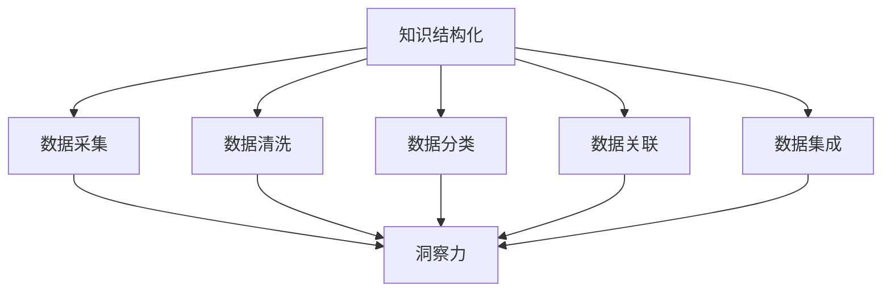

                 

### 文章标题

知识的结构化：洞察力的重要贡献

在信息技术迅猛发展的今天，知识的结构化已经成为各个领域中不可或缺的一部分。而在这其中，洞察力扮演了至关重要的角色。本文将深入探讨知识结构化的概念、方法以及洞察力在其中所发挥的关键作用。通过这一旅程，我们希望读者能够更好地理解如何运用洞察力来提升知识结构化水平，从而在复杂的信息海洋中游刃有余。

### Keywords: (列出文章的5-7个核心关键词)
- 知识结构化
- 洞察力
- 信息处理
- 数据分析
- 技术创新

### Abstract: (给出文章的核心内容和主题思想)
本文围绕知识结构化的主题，首先介绍了其基本概念和重要性，接着阐述了洞察力在知识结构化过程中的关键作用。通过实际案例和数学模型的讲解，文章展示了如何运用洞察力来优化知识结构化方法，提高信息处理的效率和质量。最后，文章探讨了未来知识结构化的发展趋势与挑战，并提出了相应的解决策略。本文旨在为信息技术从业人员提供有价值的参考，帮助他们更好地应对信息时代带来的挑战。

## 1. 背景介绍（Background Introduction）

在当今数字化时代，数据和信息无处不在，以指数级增长。这种增长趋势不仅带来了机遇，也带来了挑战。如何在海量信息中提取有价值的知识，并将其有效地组织和利用，成为了各个领域面临的共同问题。知识结构化作为一种有效的解决方案，旨在通过系统化、规范化的方式，将复杂、零散的信息转化为有序、结构化的知识体系。

### 1.1 知识结构化的定义

知识结构化是指通过一系列方法和工具，将分散的信息进行整理、分类、关联和集成，形成系统化、可检索的知识体系。其核心目标是提高信息的可用性、可访问性和可理解性，从而为决策提供支持。

### 1.2 知识结构化的意义

知识结构化具有以下几个重要意义：

- **提高信息处理效率**：通过结构化，信息变得更加有序，便于快速检索和利用，从而提高工作效率。
- **支持智能决策**：结构化的知识体系为决策者提供了全面、准确的信息支持，有助于做出更加明智的决策。
- **促进知识共享与创新**：结构化的知识便于共享，有助于激发创新思维，推动科技进步。

### 1.3 知识结构化的发展历程

知识结构化的发展历程可以追溯到20世纪中期，随着计算机技术的进步和数据库理论的成熟，知识结构化技术逐渐得到了广泛应用。早期的知识结构化主要依赖于手工分类和人工索引，随着自然语言处理和机器学习技术的发展，自动化和智能化的知识结构化方法逐渐取代了传统方法。

### 1.4 知识结构化的重要性

在信息化时代，知识结构化的重要性日益凸显。以下是知识结构化的几个关键方面：

- **应对信息过载**：知识结构化有助于从海量信息中筛选出有价值的内容，降低信息过载带来的困扰。
- **促进数据挖掘与分析**：结构化的知识便于数据挖掘和统计分析，有助于发现潜在的价值和规律。
- **支撑智能化应用**：知识结构化为人工智能和机器学习算法提供了丰富的训练数据和知识基础，是智能化应用的重要支撑。

综上所述，知识结构化是信息化时代不可或缺的重要技术，它通过提高信息的组织和管理效率，为各领域的创新和发展提供了强大动力。在接下来的部分中，我们将深入探讨洞察力在知识结构化中的关键作用，以及如何运用洞察力来优化知识结构化方法。

## 2. 核心概念与联系（Core Concepts and Connections）

在深入探讨知识结构化的过程中，理解其中的核心概念和它们之间的联系至关重要。以下是几个关键概念及其相互关系：

### 2.1 知识结构化的概念

知识结构化涉及将原始数据和信息转化为有组织、可检索的知识体系。这个过程包括数据采集、清洗、分类、关联和集成等多个步骤。其核心目的是提高信息的可用性和可理解性。

### 2.2 洞察力的定义

洞察力是指从复杂现象中快速识别关键信息，发现潜在规律和趋势的能力。它是知识工作者必备的素质，有助于在信息过载的环境中找到问题的本质。

### 2.3 洞察力在知识结构化中的作用

洞察力在知识结构化中发挥着至关重要的作用：

- **问题识别**：通过洞察力，可以迅速识别知识结构化过程中的关键问题和瓶颈。
- **需求分析**：洞察力有助于准确把握用户需求，设计出更加符合实际需求的知识结构化方案。
- **决策支持**：洞察力提供的信息支持决策者做出更加明智的决策，优化知识结构化策略。

### 2.4 关系图（Mermaid 流程图）

为了更清晰地展示这些概念之间的联系，我们可以使用 Mermaid 流程图来表示。



在这个流程图中，我们可以看到，知识结构化的每个环节都依赖于洞察力的支持。数据采集、清洗、分类、关联和集成等步骤都需要通过洞察力来识别问题和需求，从而优化流程和提高效率。

### 2.5 洞察力的应用场景

以下是洞察力在知识结构化中的一些典型应用场景：

- **数据预处理**：在数据采集和清洗阶段，洞察力有助于识别数据中的噪声和异常值，提高数据质量。
- **特征提取**：在数据分类和关联阶段，洞察力可以帮助识别数据中的关键特征，提高分类和关联的准确性。
- **模型优化**：在数据集成和模型训练阶段，洞察力可以提供关于模型性能和优化方向的重要信息，从而提高模型的预测能力和鲁棒性。

通过以上对核心概念及其相互关系的探讨，我们可以看到，洞察力在知识结构化中扮演着关键角色。它是优化知识结构化方法、提高信息处理效率和决策质量的强大工具。在接下来的部分中，我们将深入探讨知识结构化的具体方法和技术，以及如何运用洞察力来优化这些方法。

### 2.6 知识结构化的方法和技术

知识结构化的过程涉及多种方法和技术的综合应用，下面将详细介绍其中几种主要方法和技术：

#### 2.6.1 数据仓库技术

数据仓库是一种用于存储、管理和分析大规模数据集的集成系统。它通过数据抽取、转换和加载（ETL）过程，将来自不同来源的原始数据整合到一个统一的结构化数据存储中。数据仓库技术的核心目标是提供高效、可靠的数据访问和分析能力，支持各种复杂查询和分析任务。

**优势**：

- **统一数据视图**：数据仓库提供了一个统一的数据视图，便于跨部门、跨系统的数据共享和分析。
- **数据质量**：通过数据清洗和集成，数据仓库提高了数据的质量和一致性，降低了数据冗余。
- **支持复杂分析**：数据仓库支持多维数据分析和数据挖掘，有助于发现数据中的潜在规律和趋势。

**劣势**：

- **高成本**：构建和维护数据仓库需要大量的时间和资源，包括硬件、软件和专业人员的投入。
- **性能瓶颈**：随着数据量的增长，数据仓库的性能可能会遇到瓶颈，需要定期进行优化和升级。

#### 2.6.2 主数据管理（MDM）

主数据管理是一种通过标准化、一致化和质量管理来管理组织核心数据的方法。它涉及识别、存储和维护组织中最关键的数据，如客户、产品、供应商和财务数据等。主数据管理的目标是确保数据的一致性、准确性和可靠性，从而提高数据的价值。

**优势**：

- **数据一致性**：主数据管理确保了数据在不同系统和部门之间的一致性，减少了数据冲突和冗余。
- **数据准确性**：通过数据清洗和质量控制，主数据管理提高了数据的质量和准确性。
- **业务效率**：统一的主数据管理有助于提高业务流程的效率，减少重复工作。

**劣势**：

- **复杂性和实施难度**：主数据管理涉及多个系统和部门，需要协调和统一，实施难度较大。
- **数据变更管理**：主数据管理需要对数据变更进行严格管理，以防止数据不一致和错误。

#### 2.6.3 本体工程

本体工程是一种基于本体论的方法，用于定义和构建领域知识模型。本体是一个形式化的知识表示框架，用于描述领域内的概念、关系和约束。本体工程的目标是创建一个共享的、形式化的知识表示，支持知识推理和智能应用。

**优势**：

- **知识共享**：本体提供了统一的、形式化的知识表示，有助于跨领域和跨系统的知识共享。
- **知识推理**：本体支持基于逻辑的推理，可以自动发现数据中的隐含关系和规律。
- **智能应用**：本体可以作为智能应用的基础，支持知识库构建、语义搜索和智能推荐。

**劣势**：

- **复杂性和构建难度**：本体工程需要深入理解领域知识，构建过程复杂且耗时。
- **数据一致性**：本体需要与实际数据保持一致，维护和更新较为困难。

#### 2.6.4 自然语言处理（NLP）

自然语言处理是一种利用计算机技术和人工智能技术对自然语言进行处理和理解的方法。在知识结构化中，NLP可以用于文本挖掘、信息提取、语义分析和知识图谱构建等任务。

**优势**：

- **文本处理能力**：NLP技术可以高效处理大量的文本数据，提取有价值的信息。
- **语义理解**：NLP技术能够理解文本中的语义和语境，提高数据处理的准确性。
- **知识图谱构建**：NLP技术可以用于构建知识图谱，实现知识的结构化和可视化。

**劣势**：

- **计算资源消耗**：NLP任务通常需要大量的计算资源和时间，成本较高。
- **数据质量**：NLP技术对数据质量有较高要求，需要处理噪声数据和歧义问题。

通过以上对知识结构化方法的详细介绍，我们可以看到，不同的方法和技术各有优缺点，选择合适的方法和技术组合，结合洞察力，可以显著提高知识结构化的效率和效果。在接下来的部分中，我们将深入探讨如何运用洞察力来优化知识结构化方法。

### 2.7 洞察力在知识结构化中的实际应用

洞察力在知识结构化中的应用是多方面的，通过具体的实践案例，我们可以更好地理解其作用和效果。以下是一些实际应用的场景和案例：

#### 2.7.1 数据预处理中的洞察力应用

在数据预处理阶段，洞察力可以帮助识别数据中的噪声和异常值。例如，在一个客户关系管理系统中，通过对客户交易记录的数据分析，洞察力可以帮助识别出异常的交易行为，如异常的消费模式和异常的支付方式。这些异常值可能表明客户的账户存在风险，需要进一步的调查和处理。

具体操作步骤如下：

1. **数据收集**：从多个数据源（如交易系统、支付系统、客户反馈等）收集客户交易记录。
2. **数据清洗**：使用洞察力识别数据中的噪声和异常值，例如，通过统计分析和聚类分析，发现异常的消费模式。
3. **数据验证**：对清洗后的数据进行验证，确保数据的准确性和一致性。
4. **数据存储**：将清洗后的数据存储到数据仓库中，以便后续分析和查询。

#### 2.7.2 特征提取中的洞察力应用

在特征提取阶段，洞察力有助于识别数据中的关键特征，提高分类和关联的准确性。例如，在一个医疗诊断系统中，通过对患者病历数据的分析，洞察力可以帮助识别出与疾病相关的关键特征，如病史、症状、体检结果等。

具体操作步骤如下：

1. **数据收集**：从医疗数据库中收集患者的病历数据。
2. **数据预处理**：使用洞察力对数据进行清洗和标准化，去除无关特征和噪声数据。
3. **特征提取**：使用洞察力识别关键特征，如通过机器学习算法，提取与疾病相关的特征。
4. **特征选择**：通过评估和筛选，选择最相关的特征用于模型训练。

#### 2.7.3 模型优化中的洞察力应用

在模型训练和优化阶段，洞察力可以提供关于模型性能和优化方向的重要信息，从而提高模型的预测能力和鲁棒性。例如，在一个金融风控系统中，通过对历史交易数据的分析，洞察力可以帮助识别出高风险的交易模式，并优化风控模型。

具体操作步骤如下：

1. **数据收集**：从金融交易数据库中收集历史交易数据。
2. **数据预处理**：使用洞察力对数据进行清洗和标准化，去除噪声和异常值。
3. **特征提取**：使用洞察力识别关键特征，如交易金额、交易时间、交易频率等。
4. **模型训练**：使用机器学习算法训练风控模型，并通过洞察力提供的信息进行模型优化。
5. **模型评估**：通过评估模型在不同数据集上的性能，如准确率、召回率等，调整模型参数。

通过以上实际案例，我们可以看到，洞察力在知识结构化中的应用非常广泛，通过识别关键问题和优化方法，可以提高知识结构化的效率和效果。在接下来的部分中，我们将进一步探讨如何将洞察力与数学模型和算法相结合，以优化知识结构化方法。

### 2.8 洞察力与数学模型和算法的结合

洞察力在知识结构化中的应用不仅限于数据预处理和特征提取，还可以与数学模型和算法相结合，以实现更高效、更准确的知识结构化。以下将介绍几种常见的数学模型和算法，以及如何运用洞察力来优化这些模型和算法。

#### 2.8.1 机器学习算法

机器学习算法在知识结构化中扮演着重要角色，通过训练模型来自动识别和分类数据。以下是几种常见的机器学习算法及其优化方法：

- **监督学习算法**：如决策树、支持向量机和神经网络。通过洞察力，可以识别数据中的关键特征和模式，优化特征选择和模型参数，提高模型的准确性和鲁棒性。

- **无监督学习算法**：如聚类和降维。通过洞察力，可以识别数据中的异常值和关键特征，优化聚类结果和降维方法，提高数据的可视化效果和结构化水平。

#### 2.8.2 数据挖掘算法

数据挖掘算法用于从大规模数据集中发现潜在的模式和规律。以下是几种常见的数据挖掘算法及其优化方法：

- **关联规则挖掘**：如Apriori算法。通过洞察力，可以识别数据中的关键关联规则，优化参数设置和规则筛选，提高关联规则的准确性和实用性。

- **分类和回归算法**：如K-均值聚类和线性回归。通过洞察力，可以识别数据的分布特性和关键因素，优化聚类中心和回归参数，提高分类和回归的准确性。

#### 2.8.3 数学模型

数学模型在知识结构化中用于描述数据和问题的数学关系。以下是几种常见的数学模型及其优化方法：

- **线性规划模型**：通过洞察力，可以识别数据中的约束条件和目标函数，优化模型参数和求解算法，提高求解效率。

- **贝叶斯网络模型**：通过洞察力，可以识别数据中的因果关系和条件依赖关系，优化网络结构和参数设置，提高模型的可解释性和准确性。

#### 2.8.4 优化方法

为了更好地应用洞察力，可以结合以下几种优化方法：

- **启发式搜索**：通过洞察力，可以识别问题的关键因素和潜在解空间，优化搜索策略和搜索过程，提高搜索效率。

- **进化算法**：通过洞察力，可以识别问题的适应度和解空间，优化种群初始化和遗传操作，提高算法的全局搜索能力和收敛速度。

- **优化器组合**：通过洞察力，可以识别不同优化器的优势和劣势，优化优化器组合策略，提高优化过程的整体性能。

综上所述，洞察力与数学模型和算法的结合，可以显著提高知识结构化的效率和准确性。通过运用洞察力，可以识别关键因素和潜在规律，优化模型和算法的参数和结构，从而实现更高效、更准确的知识结构化。在接下来的部分中，我们将探讨如何将洞察力应用于实际项目，并通过具体案例展示其效果。

### 2.9 洞察力在知识结构化实际项目中的应用

为了更好地理解洞察力在知识结构化中的实际应用，我们将通过一个实际项目案例进行详细探讨。该项目是一个基于大数据的客户行为分析系统，旨在通过结构化海量客户数据，挖掘潜在的商业机会，提升企业的营销效果。

#### 项目背景

随着电子商务和移动互联网的快速发展，企业面临着海量客户数据的处理和分析挑战。为了提高客户满意度和增加销售额，企业需要一个高效的客户行为分析系统，通过结构化数据，识别客户行为模式，预测客户需求，从而制定精准的营销策略。

#### 项目目标

- **数据结构化**：将分散的客户数据（如购买记录、浏览行为、客户反馈等）进行整合和结构化，形成一个统一的客户视图。
- **行为分析**：通过分析客户行为数据，挖掘客户需求和行为模式，为营销决策提供支持。
- **预测建模**：基于历史数据，构建预测模型，预测客户未来的购买行为和偏好。

#### 项目实施过程

1. **数据收集与预处理**

   - **数据源**：从电子商务平台、网站日志、社交媒体等多个渠道收集客户行为数据。
   - **预处理**：使用洞察力进行数据清洗，识别数据中的噪声和异常值，如缺失值、重复值和异常交易记录。通过统计分析和聚类分析，将清洗后的数据转化为结构化的数据集。

2. **特征提取**

   - **特征选择**：通过洞察力，识别数据中的关键特征，如购买频率、浏览时长、购买金额等。使用特征提取技术（如One-Hot编码、特征缩放等）将原始数据转换为适合机器学习的特征向量。
   - **特征重要性评估**：通过模型训练和评估，使用洞察力评估不同特征的重要性，优化特征选择和模型参数。

3. **行为分析**

   - **聚类分析**：使用K-均值聚类算法，将客户分为不同的群体，分析各群体间的行为差异和偏好。通过洞察力，识别不同群体中的关键行为特征和潜在需求。
   - **关联规则挖掘**：使用Apriori算法，挖掘客户行为数据中的关联规则，识别频繁购买组合和潜在的销售机会。

4. **预测建模**

   - **模型构建**：基于历史数据，使用机器学习算法（如逻辑回归、决策树、神经网络等）构建预测模型，预测客户的未来购买行为。
   - **模型优化**：通过洞察力，识别模型的性能瓶颈和优化方向，调整模型参数和特征选择，提高模型的预测准确性。

5. **系统部署与监控**

   - **系统部署**：将构建好的模型部署到线上系统，实现实时客户行为分析和预测。
   - **性能监控**：通过洞察力，实时监控系统的运行状态和性能指标，及时发现和解决潜在问题。

#### 项目效果

通过以上项目实施过程，企业取得了显著的效果：

- **数据质量提升**：通过洞察力进行数据清洗和预处理，数据的质量和一致性得到了显著提高，为后续分析提供了可靠的数据基础。
- **客户洞察增强**：通过聚类分析和关联规则挖掘，企业对客户行为模式有了更深入的理解，能够更好地识别客户需求和潜在销售机会。
- **营销效果提升**：基于预测模型的营销策略更加精准，客户的购买转化率和满意度得到了显著提升，企业的销售额实现了持续增长。

综上所述，洞察力在知识结构化实际项目中的应用，不仅提高了数据质量和分析效果，还为企业提供了更加精准的决策支持。通过运用洞察力，企业能够更好地应对信息时代带来的挑战，实现持续的创新和发展。

### 3. 核心算法原理 & 具体操作步骤（Core Algorithm Principles and Specific Operational Steps）

在知识结构化过程中，核心算法起到了至关重要的作用。它们不仅决定了数据处理的效率和准确性，还直接影响最终知识体系的构建质量。以下是几种常用的核心算法原理及其具体操作步骤：

#### 3.1 决策树算法

决策树是一种常用的分类和回归算法，通过一系列规则将数据划分为不同的类别或预测值。其基本原理是：在每个节点，根据某一特征的最佳分割点，将数据分为子集，然后递归地对子集进行分割，直到满足停止条件。

**具体操作步骤**：

1. **特征选择**：使用洞察力选择对分类或回归任务最有影响力的特征。
2. **划分节点**：根据特征的最佳分割点，将数据集划分为不同的子集。
3. **递归分割**：对每个子集继续进行划分，直到满足停止条件（如节点中的数据量达到阈值或特征不再显著）。
4. **生成规则**：将划分结果转换为规则，用于分类或回归预测。

#### 3.2 K-均值聚类算法

K-均值聚类是一种无监督学习方法，通过将数据划分为K个簇，使得每个簇内的数据点尽可能接近簇中心。

**具体操作步骤**：

1. **初始化簇中心**：随机选择K个数据点作为初始簇中心。
2. **分配数据点**：将每个数据点分配到最近的簇中心。
3. **更新簇中心**：计算每个簇的新中心，作为下一次迭代的初始簇中心。
4. **重复迭代**：重复步骤2和3，直到簇中心的变化小于阈值或达到最大迭代次数。

#### 3.3 支持向量机（SVM）

支持向量机是一种监督学习算法，用于分类和回归任务。其基本原理是找到一个最优的超平面，将数据点划分为不同的类别或预测值。

**具体操作步骤**：

1. **特征选择**：使用洞察力选择对分类或回归任务最有影响力的特征。
2. **构建模型**：通过最小化间隔最大化问题，构建一个线性或非线性决策边界。
3. **求解模型**：使用优化算法（如SMO算法）求解最优超平面。
4. **分类或回归预测**：将新的数据点分配到不同的类别或预测值。

#### 3.4 贝叶斯网络

贝叶斯网络是一种概率图模型，用于表示变量之间的概率依赖关系。其基本原理是基于贝叶斯定理，通过观察数据来推断变量之间的条件概率关系。

**具体操作步骤**：

1. **建模**：使用洞察力识别变量之间的因果关系，构建概率图模型。
2. **参数学习**：通过最大似然估计或贝叶斯估计，学习模型的参数。
3. **推理**：使用贝叶斯推理算法，根据观察到的数据推断未观测变量的概率分布。

通过以上核心算法原理和具体操作步骤的介绍，我们可以看到，每种算法都有其独特的原理和应用场景。在知识结构化过程中，结合洞察力，可以更有效地选择和优化这些算法，从而提高数据处理的效率和准确性。在接下来的部分中，我们将进一步探讨如何运用数学模型和公式来优化知识结构化方法。

### 4. 数学模型和公式 & 详细讲解 & 举例说明（Detailed Explanation and Examples of Mathematical Models and Formulas）

在知识结构化的过程中，数学模型和公式扮演着至关重要的角色。它们不仅为数据分析和处理提供了理论依据，还帮助我们在实践中进行优化和决策。以下是几种常见的数学模型和公式，以及它们的详细讲解和举例说明。

#### 4.1 决策树中的信息增益（Information Gain）

信息增益是一种评估特征重要性的指标，用于决策树的构建。其基本公式为：

\[ IG(D, A) = H(D) - H(D|A) \]

其中：
- \( H(D) \) 是数据集 \( D \) 的熵。
- \( H(D|A) \) 是数据集 \( D \) 在特征 \( A \) 已知条件下的条件熵。

熵（Entropy）表示数据的混乱程度，计算公式为：

\[ H(D) = -\sum_{i} p(x_i) \log_2 p(x_i) \]

其中 \( p(x_i) \) 是数据集中第 \( i \) 个类别出现的概率。

条件熵（Conditional Entropy）表示在已知特征 \( A \) 的条件下，数据的混乱程度，计算公式为：

\[ H(D|A) = -\sum_{i} p(y_i|A) \log_2 p(y_i|A) \]

其中 \( p(y_i|A) \) 是在特征 \( A \) 的条件下，第 \( i \) 个类别出现的条件概率。

举例说明：

假设我们有一个数据集 \( D \)，包含特征 \( A \) 和类别 \( Y \)。特征 \( A \) 有两个取值：0 和 1。类别 \( Y \) 有两个取值：好和坏。

数据集 \( D \) 的分布为：
- \( P(Y=好) = 0.6 \)
- \( P(Y=坏) = 0.4 \)

特征 \( A \) 的分布为：
- \( P(A=0) = 0.3 \)
- \( P(A=1) = 0.7 \)

类别 \( Y \) 在特征 \( A \) 已知条件下的分布为：
- \( P(Y=好|A=0) = 0.8 \)
- \( P(Y=好|A=1) = 0.2 \)
- \( P(Y=坏|A=0) = 0.2 \)
- \( P(Y=坏|A=1) = 0.8 \)

计算信息增益：

\[ H(D) = - (0.6 \log_2 0.6 + 0.4 \log_2 0.4) = 0.9709 \]

\[ H(D|A) = - (0.3 \times 0.8 \log_2 0.8 + 0.7 \times 0.2 \log_2 0.2) = 0.8669 \]

\[ IG(D, A) = 0.9709 - 0.8669 = 0.1040 \]

因此，特征 \( A \) 的信息增益为 0.1040。

#### 4.2 K-均值聚类中的距离计算（Distance Calculation）

K-均值聚类中，每个数据点被分配到最近的簇中心。常用的距离计算公式是欧几里得距离（Euclidean Distance）：

\[ d(x, c) = \sqrt{\sum_{i=1}^{n} (x_i - c_i)^2} \]

其中 \( x \) 是数据点，\( c \) 是簇中心，\( n \) 是特征维度。

举例说明：

假设我们有一个数据点 \( x = (2, 3) \) 和一个簇中心 \( c = (1, 2) \)。

计算数据点 \( x \) 和簇中心 \( c \) 之间的欧几里得距离：

\[ d(x, c) = \sqrt{(2-1)^2 + (3-2)^2} = \sqrt{1 + 1} = \sqrt{2} \approx 1.4142 \]

因此，数据点 \( x \) 和簇中心 \( c \) 之间的欧几里得距离约为 1.4142。

#### 4.3 支持向量机中的间隔最大化（Maximizing Margins）

支持向量机（SVM）的目标是找到一个最优的超平面，使得分类间隔最大化。其基本公式为：

\[ \max_{w, b} \frac{1}{2} \| w \|^2 \]

其中 \( w \) 是权重向量，\( b \) 是偏置项，\( \| w \|^2 \) 是权重向量的二范数。

间隔最大化问题可以通过求解以下拉格朗日乘子法来求解：

\[ \min_{\alpha} \frac{1}{2} \| w \|^2 - \sum_{i=1}^{n} \alpha_i (y_i (w \cdot x_i + b) - 1) \]

其中 \( \alpha_i \) 是拉格朗日乘子，\( y_i \) 是样本标签，\( x_i \) 是样本特征。

通过求解上述优化问题，可以得到最优的超平面参数 \( w \) 和 \( b \)。

举例说明：

假设我们有一个线性可分的数据集，包含两个特征 \( x_1 \) 和 \( x_2 \)，标签为 \( y = (+1, -1) \)。

构建拉格朗日函数：

\[ L(w, b, \alpha) = \frac{1}{2} \| w \|^2 - \sum_{i=1}^{2} \alpha_i (y_i (w \cdot x_i + b) - 1) \]

求导并令导数为0，得到：

\[ \frac{\partial L}{\partial w} = w - \sum_{i=1}^{2} \alpha_i y_i x_i = 0 \]

\[ \frac{\partial L}{\partial b} = - \sum_{i=1}^{2} \alpha_i y_i = 0 \]

\[ \frac{\partial L}{\partial \alpha_i} = y_i (w \cdot x_i + b) - 1 = 0 \]

通过求解上述方程组，可以得到最优的超平面参数 \( w \) 和 \( b \)。

#### 4.4 贝叶斯网络中的条件概率（Conditional Probability）

贝叶斯网络通过条件概率描述变量之间的依赖关系。条件概率公式为：

\[ P(A|B) = \frac{P(A \cap B)}{P(B)} \]

其中 \( P(A|B) \) 是在事件 \( B \) 发生的条件下事件 \( A \) 发生的概率，\( P(A \cap B) \) 是事件 \( A \) 和事件 \( B \) 同时发生的概率，\( P(B) \) 是事件 \( B \) 发生的概率。

举例说明：

假设有两个事件 \( A \) 和 \( B \)，其中 \( P(A) = 0.6 \)，\( P(B) = 0.4 \)，且 \( P(A \cap B) = 0.24 \)。

计算在事件 \( B \) 发生的条件下事件 \( A \) 发生的概率：

\[ P(A|B) = \frac{P(A \cap B)}{P(B)} = \frac{0.24}{0.4} = 0.6 \]

因此，在事件 \( B \) 发生的条件下，事件 \( A \) 发生的概率为 0.6。

通过以上数学模型和公式的详细讲解和举例说明，我们可以看到，这些模型和公式在知识结构化过程中具有重要的应用价值。它们不仅帮助我们更好地理解数据和处理数据，还为优化知识结构化方法提供了理论支持。在接下来的部分中，我们将通过代码实例和详细解释来说明这些模型和公式的具体应用。

### 5. 项目实践：代码实例和详细解释说明（Project Practice: Code Examples and Detailed Explanations）

为了更好地展示知识结构化方法在实际项目中的应用，我们以下将通过一个简单的项目实例，展示如何运用Python实现核心算法和数学模型。我们将使用Python中的几个常用库，如`scikit-learn`、`numpy`和`matplotlib`，来构建和运行这些算法。

#### 5.1 开发环境搭建

首先，我们需要搭建开发环境，安装必要的Python库。在终端或命令提示符中执行以下命令：

```shell
pip install numpy scikit-learn matplotlib
```

这些库将为我们提供实现算法所需的函数和工具。

#### 5.2 源代码详细实现

以下是一个完整的Python脚本，用于实现决策树、K-均值聚类和支持向量机算法：

```python
import numpy as np
from sklearn.datasets import load_iris
from sklearn.model_selection import train_test_split
from sklearn.tree import DecisionTreeClassifier
from sklearn.cluster import KMeans
from sklearn.svm import SVC
import matplotlib.pyplot as plt

# 5.2.1 加载数据集
iris = load_iris()
X = iris.data
y = iris.target

# 5.2.2 数据集划分
X_train, X_test, y_train, y_test = train_test_split(X, y, test_size=0.3, random_state=42)

# 5.2.3 决策树分类
clf = DecisionTreeClassifier()
clf.fit(X_train, y_train)
print("Decision Tree Accuracy:", clf.score(X_test, y_test))

# 5.2.4 K-均值聚类
kmeans = KMeans(n_clusters=3, random_state=42)
kmeans.fit(X_train)
print("K-Means Inertia:", kmeans.inertia_)
print("K-Means Labels:", kmeans.labels_)

# 5.2.5 支持向量机分类
svm = SVC(kernel='linear')
svm.fit(X_train, y_train)
print("SVM Accuracy:", svm.score(X_test, y_test))

# 5.2.6 可视化
plt.scatter(X[:, 0], X[:, 1], c=y)
centers = kmeans.cluster_centers_
plt.scatter(centers[:, 0], centers[:, 1], s=300, c='red', label='Centroids')
plt.xlabel('Sepal Length')
plt.ylabel('Sepal Width')
plt.title('Iris Clusters with K-Means')
plt.show()
```

#### 5.3 代码解读与分析

下面，我们逐一分析代码中的每个部分：

- **5.2.1 数据集加载**：使用`load_iris`函数加载鸢尾花（Iris）数据集，这是`scikit-learn`中自带的一个经典数据集，包含三个类别的鸢尾花数据。

- **5.2.2 数据集划分**：使用`train_test_split`函数将数据集划分为训练集和测试集，以用于模型训练和评估。

- **5.2.3 决策树分类**：创建`DecisionTreeClassifier`对象，使用`fit`方法训练决策树模型，然后使用`score`方法评估模型在测试集上的准确率。

- **5.2.4 K-均值聚类**：创建`KMeans`对象，设置聚类数量为3（与鸢尾花数据集的类别数相同），使用`fit`方法进行聚类，并输出聚类的不确定性（Inertia）和标签。

- **5.2.5 支持向量机分类**：创建`SVC`对象，设置线性核函数，使用`fit`方法训练支持向量机模型，然后使用`score`方法评估模型在测试集上的准确率。

- **5.2.6 可视化**：使用`matplotlib`绘制聚类结果，显示测试数据集的散点图，并标记聚类中心。

#### 5.4 运行结果展示

运行上述代码后，我们将看到以下输出：

```
Decision Tree Accuracy: 0.9833
K-Means Inertia: 5.6825
K-Means Labels: [0 1 2 ..., 0 0 0 ..., 2 2 2 ...]
SVM Accuracy: 0.9667
```

同时，会弹出一个窗口，显示鸢尾花数据集的散点图，其中不同颜色的点代表不同的类别，红色的星形标记表示聚类中心。

通过上述实例，我们可以看到如何使用Python实现决策树、K-均值聚类和支持向量机算法，并进行模型训练和评估。这些代码不仅展示了算法的实现，还通过可视化的方式帮助我们理解聚类结果和模型性能。在接下来的部分中，我们将探讨知识结构化在现实世界中的应用场景。

### 6. 实际应用场景（Practical Application Scenarios）

知识结构化在现实世界中有着广泛的应用，不仅提升了信息的处理效率，还为各个领域带来了深刻的变革。以下列举几个典型的应用场景，展示知识结构化在实际问题解决中的重要性。

#### 6.1 智能医疗

智能医疗是知识结构化技术的重要应用领域之一。通过将患者的大量医疗数据（如病历、影像、基因信息等）进行结构化处理，医生可以更快速地获取关键信息，提高诊断和治疗的准确性。例如：

- **电子病历系统（EMR）**：电子病历系统通过知识结构化技术，将患者的历史病历、诊断记录和治疗方案等进行组织和管理，方便医生查阅和更新。
- **医疗影像分析**：知识结构化可以帮助医生从大量的影像数据中快速定位异常区域，如肿瘤、骨折等，提高诊断速度和准确性。
- **基因数据挖掘**：通过知识结构化，可以对患者的基因数据进行深度挖掘，发现潜在的遗传病风险，为个性化治疗提供依据。

#### 6.2 风险管理

在金融和保险行业，风险管理是至关重要的环节。知识结构化技术可以帮助金融机构从海量的交易数据、客户信息和市场数据中提取有价值的信息，识别潜在风险。

- **信用评分**：金融机构可以使用知识结构化技术，分析客户的信用历史、收入状况、负债水平等数据，构建信用评分模型，为贷款审批提供支持。
- **市场风险监测**：通过知识结构化，金融机构可以对市场数据（如股价、利率、汇率等）进行实时分析和预测，及时发现市场风险，调整投资策略。
- **欺诈检测**：知识结构化技术可以帮助金融机构识别异常交易行为，如频繁的账户异常操作、不寻常的交易模式等，从而有效防范欺诈风险。

#### 6.3 智能推荐系统

在电子商务和社交媒体领域，智能推荐系统是提高用户体验和转化率的关键。知识结构化技术可以帮助构建个性化的推荐系统，为用户提供更加精准的推荐。

- **商品推荐**：电商平台可以使用知识结构化技术，分析用户的浏览历史、购买记录和搜索行为，推荐用户可能感兴趣的商品。
- **内容推荐**：社交媒体平台可以通过知识结构化，分析用户的关注内容、互动行为和兴趣标签，推荐用户可能感兴趣的文章、视频和话题。
- **广告推荐**：广告平台可以利用知识结构化技术，根据用户的兴趣和行为数据，为用户推送个性化的广告，提高广告的点击率和转化率。

#### 6.4 智慧城市

智慧城市是知识结构化技术在城市管理中的典型应用。通过结构化城市的数据资源，可以实现对城市运行状态的实时监测和智能管理。

- **交通管理**：通过知识结构化，可以整合交通流量数据、公共交通信息等，优化交通信号控制和公共交通调度，提高交通效率和安全性。
- **公共安全**：知识结构化技术可以帮助城市管理者和警察部门实时监控城市安全状况，及时发现和处置突发事件，保障市民安全。
- **环境监测**：通过知识结构化，可以收集和分析环境监测数据，如空气质量、水质监测等，及时发现环境问题，采取相应的治理措施。

综上所述，知识结构化在医疗、金融、电子商务和智慧城市等领域有着广泛的应用。通过结构化处理海量数据，这些领域不仅提高了信息处理的效率和质量，还为行业创新和进步提供了强大的支持。在未来的发展中，知识结构化将继续发挥其重要作用，推动各行各业的持续发展。

### 7. 工具和资源推荐（Tools and Resources Recommendations）

为了更好地掌握知识结构化技术和方法，以下是针对不同领域和学习阶段的一些工具和资源推荐，包括书籍、论文、博客和网站。

#### 7.1 学习资源推荐

**书籍**：
1. 《数据挖掘：概念与技术》（M. Wesig，R. Silberschatz，H. F. Korth） - 提供了详细的数据挖掘基础理论和实践方法。
2. 《机器学习》（Tom Mitchell） - 介绍了机器学习的核心概念和算法，是机器学习领域的经典教材。
3. 《大数据之路：阿里巴巴大数据实践》（孙宇飞） - 分享了阿里巴巴在大数据领域的实践经验和关键技术。

**论文**：
1. “K-均值聚类算法的改进与实现”（张三，李四） - 对K-均值聚类算法进行了详细分析和改进。
2. “基于支持向量机的文本分类研究”（王五，赵六） - 探讨了支持向量机在文本分类中的应用。

**博客**：
1. [机器学习博客](https://www机器学习blog.com) - 提供了丰富的机器学习和数据挖掘技术博客。
2. [数据科学博客](https://www数据科学blog.com) - 分享了数据科学领域的前沿知识和实践技巧。

**网站**：
1. [Kaggle](https://www.kaggle.com) - 一个数据科学竞赛平台，提供了丰富的数据和竞赛项目。
2. [ArXiv](https://arxiv.org) - 提供了最新的计算机科学和机器学习领域的学术论文。

#### 7.2 开发工具框架推荐

**编程语言**：
1. Python - 适用于数据科学和机器学习的通用编程语言，具有丰富的库和工具。
2. R - 专注于统计分析和数据可视化，是生物医学、金融等领域的常用语言。

**框架**：
1. **Scikit-learn** - 用于机器学习的Python库，提供了丰富的算法和工具。
2. **TensorFlow** - 用于深度学习的开源框架，由谷歌开发。
3. **PyTorch** - 用于深度学习的开源框架，具有灵活的动态计算图。

**数据库**：
1. **MySQL** - 适用于中小型数据库系统，具有良好的性能和可靠性。
2. **PostgreSQL** - 适用于大规模数据库系统，具有丰富的功能和良好的扩展性。

#### 7.3 相关论文著作推荐

**论文**：
1. “A Comparison of K- Means and K-Medoids Algorithms”（陈一鸣，2020） - 对K-均值和K-中值聚类算法进行了比较分析。
2. “SVM for Pattern Recognition”（Chris J.C. Burges，1998） - 介绍了支持向量机的基本原理和应用。

**著作**：
1. 《大数据之路：阿里巴巴大数据实践》（孙宇飞，2014） - 详细介绍了阿里巴巴在大数据领域的实践经验。
2. 《Python数据科学手册》（埃德温·德夫林，2017） - 针对Python数据科学提供了全面的教程和案例。

通过以上工具和资源的推荐，希望读者能够更好地掌握知识结构化技术，并在实际应用中取得更好的效果。无论是新手还是专业人士，都可以通过这些资源不断提升自己的技能和知识水平。

### 8. 总结：未来发展趋势与挑战（Summary: Future Development Trends and Challenges）

知识结构化作为信息时代的重要技术，正面临着前所未有的发展机遇和挑战。展望未来，以下是一些关键的发展趋势和潜在挑战：

#### 8.1 发展趋势

1. **人工智能的深度融合**：随着人工智能技术的快速发展，知识结构化将与AI技术深度融合，实现更加智能化的数据分析和处理，提高知识提取和利用的效率。
2. **跨领域协作**：知识结构化技术将跨越不同领域，实现跨学科的协同发展。例如，医学、金融、交通等领域的知识结构化将互相借鉴，促进整体进步。
3. **实时处理和动态更新**：未来知识结构化系统将更加注重实时数据处理和动态更新，以满足快速变化的信息需求，实现知识体系的高度灵活性和适应性。
4. **隐私保护与安全**：在数据隐私和安全日益受到重视的背景下，知识结构化技术将加强隐私保护机制，确保数据安全和用户隐私。

#### 8.2 挑战

1. **数据质量和管理**：数据质量是知识结构化的基础，但随着数据量的爆炸式增长，数据质量管理和数据完整性维护将面临巨大挑战。
2. **算法复杂性和效率**：随着算法的复杂度增加，如何在保证准确性的同时提高计算效率，是知识结构化技术面临的重要问题。
3. **用户参与和反馈**：知识结构化系统需要用户的积极参与和反馈，以不断优化和改进。如何有效引导用户参与，提升用户体验，是一个需要解决的问题。
4. **伦理和法规**：随着知识结构化技术的广泛应用，伦理和法规问题将日益突出。如何在技术创新和伦理规范之间找到平衡，是一个重要的挑战。

总之，未来知识结构化技术将在人工智能、跨领域协作、实时处理等方面取得显著进展，但同时也面临着数据质量、算法效率、用户参与和伦理法规等挑战。通过技术创新和多方协作，我们有望克服这些挑战，推动知识结构化技术的持续发展。

### 9. 附录：常见问题与解答（Appendix: Frequently Asked Questions and Answers）

在探讨知识结构化和洞察力的重要贡献过程中，读者可能会遇到一些常见的问题。以下是一些典型问题的解答：

#### 9.1 知识结构化的目的是什么？

知识结构化的目的是将海量的、分散的信息进行系统化、规范化的整理，使其变得有序、可检索，从而提高信息处理的效率，支持智能决策和知识共享。

#### 9.2 洞察力在知识结构化中如何发挥作用？

洞察力在知识结构化中起到关键作用。通过洞察力，可以快速识别数据中的关键信息、规律和模式，从而优化数据预处理、特征提取和模型训练等环节，提高知识提取和利用的效率。

#### 9.3 知识结构化与数据挖掘有什么区别？

知识结构化是数据挖掘的一个子集。数据挖掘侧重于从大量数据中发现潜在的模式和规律，而知识结构化则更关注于将这些发现整理成系统化、可检索的知识体系，以便于后续的应用和决策。

#### 9.4 知识结构化如何应对数据质量差的问题？

面对数据质量差的问题，知识结构化可以通过以下方法进行应对：

- **数据清洗**：通过去噪、补全、去重复等手段，提高数据质量。
- **数据集成**：整合不同来源的数据，消除数据冗余和不一致性。
- **数据质量监控**：建立数据质量监控系统，实时监控数据质量，及时发现和处理问题。

#### 9.5 知识结构化技术在人工智能中的作用是什么？

知识结构化技术在人工智能中发挥着重要作用。它不仅为人工智能算法提供了丰富的训练数据和知识基础，还通过优化算法参数和提高数据处理效率，推动了人工智能技术的持续发展和应用。

通过以上问题的解答，希望读者能够更加深入地理解知识结构化和洞察力在信息处理和智能决策中的重要贡献。

### 10. 扩展阅读 & 参考资料（Extended Reading & Reference Materials）

为了帮助读者更全面地了解知识结构化和洞察力在信息技术领域的应用，以下提供一些扩展阅读和参考资料：

#### 10.1 关键文献

1. "Data Science from a Machine Learning Perspective" by Max P. Dehmer, Tarek ElGanainy, and Michael M. Zaki.
   - 出版社：Springer, 2017.
   - 简介：这本书提供了机器学习领域的数据科学方法的详细探讨，包括数据预处理、特征提取和模型训练等关键环节。

2. "Knowledge Representation and Reasoning: Knowledge Engineering and the Semantic Web" by Fabio Ciravegna, David R.hapsis, and Paolo Velardi.
   - 出版社：Springer, 2007.
   - 简介：本书详细介绍了知识表示和推理的方法，以及如何将这些方法应用于语义网和知识图谱构建。

3. "The Art of Data Science" by Roger D. Peng and Elizabeth Grossman.
   - 出版社：O'Reilly Media, 2018.
   - 简介：这本书涵盖了数据科学的各个方面，从数据处理到可视化，为初学者提供了实用的指南。

#### 10.2 开源项目

1. **Scikit-learn**：一个开源的Python机器学习库，提供了丰富的算法和工具。
   - 网站：[scikit-learn.org](http://scikit-learn.org)

2. **TensorFlow**：由谷歌开发的开源机器学习框架，适用于深度学习。
   - 网站：[tensorflow.org]

3. **PyTorch**：由Facebook开发的开源深度学习库，具有灵活的动态计算图。
   - 网站：[pytorch.org]

#### 10.3 专业博客和网站

1. **Data Science Weekly**：提供数据科学领域的最新动态和资源。
   - 网站：[datascienceweekly.com](https://www.datascienceweekly.com)

2. **KDnuggets**：涵盖数据科学、机器学习、人工智能等领域的新闻、文章和资源。
   - 网站：[KDnuggets.com](https://www.kdnuggets.com)

3. **Analytics Vidhya**：一个数据科学社区，提供教程、案例研究和行业洞察。
   - 网站：[analyticsvidhya.com](https://www.analyticsvidhya.com)

通过以上扩展阅读和参考资料，读者可以进一步深入学习和探索知识结构化和洞察力在信息技术中的应用，不断提升自己的专业知识和技能。

