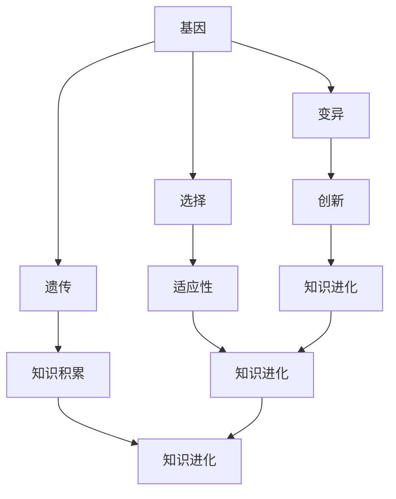

                 

# 知识的进化论：思想的自然选择

> “知识不仅是累积的，它也是进化的。思想的自然选择，就像生物界的进化一样，不断塑造和优化我们的认知结构。”——作者：禅与计算机程序设计艺术

在计算机科学和人工智能领域中，知识的进化是一个至关重要的话题。从最初的基本逻辑门，到复杂的神经网络，再到如今的深度学习，知识体系在不断地演变和进化。本文将探讨知识的进化过程，类比生物界的自然选择原理，深入分析人工智能领域中的知识进化机制。

## 关键词

- 知识进化
- 自然选择
- 计算机科学
- 人工智能
- 深度学习
- 神经网络

## 摘要

本文旨在探讨知识在计算机科学和人工智能领域的进化过程，将其类比为生物界的自然选择原理。通过对知识进化论的基本概念、核心算法原理、数学模型和实际应用场景的详细分析，揭示知识进化背后的深层次逻辑和机制。同时，本文还将对未来的发展趋势和挑战进行展望，为人工智能领域的研究和实践提供新的视角和启示。

## 1. 背景介绍（Background Introduction）

### 1.1 计算机科学的发展历程

计算机科学的发展历程可以说是知识的进化历程。从最初的硬件时代，到软件时代，再到如今的智能化时代，每一个阶段都代表着知识的累积和进化。

- **硬件时代**：计算机的早期发展主要集中在硬件方面，如逻辑门、CPU、内存等硬件组件。这一阶段的知识主要是关于如何制造和优化硬件，提高计算机的运行速度和处理能力。
- **软件时代**：随着硬件的发展，软件开始成为计算机科学的核心。编程语言、操作系统、数据库管理系统等软件技术不断涌现，推动了计算机应用的广泛普及。
- **智能化时代**：近年来，人工智能的崛起将计算机科学推向了一个新的高峰。深度学习、神经网络等技术的应用，使得计算机开始具备一定的智能，能够处理复杂的问题。

### 1.2 人工智能的发展历程

人工智能的发展历程同样也是知识进化的过程。从最初的符号主义、逻辑推理，到基于规则的专家系统，再到如今的深度学习、生成对抗网络等，每一个阶段都代表着人工智能知识的积累和进化。

- **符号主义和逻辑推理**：早期的符号主义和逻辑推理方法主要基于符号操作和推理，如谓词逻辑、一阶逻辑等。这种方法在处理简单问题时具有一定的效果，但在面对复杂问题时往往力不从心。
- **基于规则的专家系统**：基于规则的专家系统通过定义一系列规则来模拟专家的推理过程，从而解决特定领域的问题。这种方法在医疗诊断、金融分析等领域得到了广泛应用。
- **深度学习和神经网络**：近年来，深度学习和神经网络技术的崛起，使得人工智能取得了显著的突破。深度学习模型能够自动提取特征、进行分类和回归，处理复杂的问题，大大提升了人工智能的应用能力。

### 1.3 知识进化的重要性

知识进化对于计算机科学和人工智能领域的发展至关重要。首先，知识进化使得计算机技术能够不断适应新的应用需求，推动计算机科学的进步。其次，知识进化有助于发现新的问题和解决方案，激发创新。此外，知识进化还为人工智能的发展提供了丰富的素材和灵感，使得人工智能能够更好地模拟人类的思维过程，实现智能化。

## 2. 核心概念与联系（Core Concepts and Connections）

### 2.1 知识进化的概念

知识进化是指在不断变化的环境中，知识体系通过吸收、筛选、整合和创造，实现自我优化和更新的过程。知识进化可以分为以下几个方面：

- **吸收**：吸收是指从外部环境获取新的知识和信息，以丰富自身的知识体系。
- **筛选**：筛选是指对吸收的知识和信息进行评估和选择，去除不相关或错误的部分，保留有价值的信息。
- **整合**：整合是指将不同来源的知识和信息进行整合，形成一个新的知识体系。
- **创造**：创造是指在整合的基础上，产生新的知识或对现有知识进行创新。

### 2.2 知识进化的核心概念

在知识进化过程中，以下几个核心概念具有重要意义：

- **基因**：基因是知识进化中的基本单元，代表了一个知识或信息片段。基因的多样性是知识进化的基础。
- **变异**：变异是指基因的突变或改变，代表了知识进化中的创新和变化。
- **选择**：选择是指根据环境的适应性，对基因进行筛选和保留。适应性强的基因更有可能生存下来，并遗传给下一代。
- **遗传**：遗传是指基因的传递和继承，代表了知识在代际之间的传递。

### 2.3 知识进化的联系

知识进化与生物进化有诸多相似之处，其核心联系如下：

- **多样性**：知识进化需要多样性，正如生物进化中的基因多样性一样。多样性为知识进化提供了丰富的素材和选择空间。
- **变异**：变异是知识进化的驱动力，它推动了知识体系的创新和进步。
- **选择**：选择是知识进化的关键机制，它决定了哪些知识能够适应环境、被保留下来。
- **遗传**：遗传是知识进化的基础，它保证了知识在代际之间的传递和积累。

### 2.4 知识进化的 Mermaid 流程图

以下是一个简化的知识进化流程图，展示了知识进化中的核心概念和联系：



## 3. 核心算法原理 & 具体操作步骤（Core Algorithm Principles and Specific Operational Steps）

### 3.1 知识进化的算法原理

知识进化的算法原理主要基于生物进化中的遗传算法，包括以下几个步骤：

1. **初始化基因库**：初始化一个基因库，其中包含多种基因。
2. **变异**：对基因库中的基因进行变异操作，产生新的基因。
3. **选择**：根据环境的适应性，对基因进行筛选和选择。
4. **遗传**：将适应度较高的基因遗传给下一代，形成新的基因库。
5. **迭代**：重复上述步骤，直到达到预定的进化目标或满足停止条件。

### 3.2 知识进化的具体操作步骤

以下是一个简化的知识进化操作步骤：

1. **初始化基因库**：
    - 初始化一个包含多种基因的基因库。
    - 每个基因代表一个知识片段或信息片段。
2. **变异**：
    - 对基因库中的基因进行变异操作。
    - 变异可以是基因的插入、删除、替换等操作。
    - 产生新的基因，丰富了基因库。
3. **选择**：
    - 根据环境的适应性，对基因进行筛选和选择。
    - 适应度较高的基因更有可能被保留。
4. **遗传**：
    - 将适应度较高的基因遗传给下一代。
    - 形成新的基因库，为新的一轮进化做准备。
5. **迭代**：
    - 重复上述步骤，直到达到预定的进化目标或满足停止条件。

### 3.3 知识进化的案例分析

以下是一个简单的知识进化案例分析：

1. **问题背景**：
    - 需要解决一个分类问题，将一组数据分为两类。
    - 数据集包含多个特征，需要通过知识进化找到最优的分类模型。
2. **初始化基因库**：
    - 初始化一个包含多种基因的基因库，每个基因代表一种分类模型。
    - 基因库中的基因种类包括线性模型、决策树、神经网络等。
3. **变异**：
    - 对基因库中的基因进行变异操作。
    - 例如，对神经网络模型中的权重进行微调，产生新的基因。
4. **选择**：
    - 根据分类准确率，对基因进行筛选和选择。
    - 适应度较高的基因（分类准确率较高的模型）更有可能被保留。
5. **遗传**：
    - 将适应度较高的基因遗传给下一代。
    - 新一代基因库包含更优秀的分类模型。
6. **迭代**：
    - 重复上述步骤，直到达到预定的进化目标或满足停止条件。

通过以上步骤，知识进化算法可以逐步优化分类模型，提高分类准确率。

## 4. 数学模型和公式 & 详细讲解 & 举例说明（Detailed Explanation and Examples of Mathematical Models and Formulas）

### 4.1 知识进化的数学模型

知识进化的数学模型主要基于遗传算法，包括以下几个部分：

1. **适应度函数**：
    - 适应度函数用于评估基因的适应度，通常采用目标函数的优化结果作为适应度值。
    - 适应度函数的值越高，表示基因的适应度越高。
2. **选择概率**：
    - 选择概率用于决定基因的选择概率，通常采用轮盘赌的方法。
    - 选择概率与适应度值成正比。
3. **交叉概率和变异概率**：
    - 交叉概率和变异概率用于控制基因的交叉和变异操作。
    - 交叉概率和变异概率的大小通常根据具体的任务进行调整。

### 4.2 适应度函数的详细讲解

适应度函数是知识进化中的核心部分，用于评估基因的适应度。以下是一个简单的适应度函数示例：

$$
f(x) = \frac{1}{1 + \exp{(-x})}
$$

其中，$x$ 表示目标函数的优化结果。适应度函数的值介于0和1之间，值越大表示基因的适应度越高。

### 4.3 选择概率的详细讲解

选择概率用于决定基因的选择概率，通常采用轮盘赌的方法。以下是一个简单的选择概率示例：

$$
P_i = \frac{f_i}{\sum_{i=1}^{n} f_i}
$$

其中，$P_i$ 表示第 $i$ 个基因的选择概率，$f_i$ 表示第 $i$ 个基因的适应度值，$n$ 表示基因的总数。选择概率与适应度值成正比。

### 4.4 交叉概率和变异概率的详细讲解

交叉概率和变异概率用于控制基因的交叉和变异操作。以下是一个简单的交叉概率和变异概率示例：

$$
P_c = \frac{1}{n} \sum_{i=1}^{n} P_i
$$

$$
P_m = \frac{1}{n} \sum_{i=1}^{n} (1 - P_i)
$$

其中，$P_c$ 表示交叉概率，$P_m$ 表示变异概率，$n$ 表示基因的总数。交叉概率和变异概率的大小通常根据具体的任务进行调整。

### 4.5 举例说明

假设有一个分类问题，需要通过知识进化找到最优的分类模型。以下是一个简单的知识进化过程示例：

1. **初始化基因库**：
    - 初始化一个包含多种基因的基因库，每个基因代表一种分类模型。
2. **变异**：
    - 对基因库中的基因进行变异操作，产生新的基因。
3. **选择**：
    - 根据分类准确率，对基因进行筛选和选择。
    - 适应度较高的基因（分类准确率较高的模型）更有可能被保留。
4. **交叉**：
    - 将适应度较高的基因进行交叉操作，产生新的基因。
5. **变异**：
    - 对交叉后的基因进行变异操作，产生新的基因。
6. **迭代**：
    - 重复上述步骤，直到达到预定的进化目标或满足停止条件。

通过以上步骤，知识进化算法可以逐步优化分类模型，提高分类准确率。

## 5. 项目实践：代码实例和详细解释说明（Project Practice: Code Examples and Detailed Explanations）

### 5.1 开发环境搭建

在开始项目实践之前，我们需要搭建一个适合知识进化算法的编程环境。以下是搭建开发环境的基本步骤：

1. **安装 Python 环境**：
    - 安装 Python 3.8 或更高版本。
    - 安装 Python 解释器和相关依赖。
2. **安装遗传算法库**：
    - 安装遗传算法库（如 DEAP）。
    - 使用以下命令安装：
        ```bash
        pip install deap
        ```
3. **创建项目文件夹**：
    - 在合适的位置创建一个项目文件夹，例如：
        ```bash
        mkdir knowledge-evolution
        cd knowledge-evolution
        ```
4. **编写代码**：
    - 在项目文件夹中创建一个名为 `knowledge_evolution.py` 的 Python 文件，用于编写知识进化算法的代码。

### 5.2 源代码详细实现

以下是一个简单的知识进化算法的 Python 实现示例：

```python
import random
from deap import base, creator, tools, algorithms

# 初始化基因库
def initialize_population(size, n_features):
    population = []
    for _ in range(size):
        individual = [random.randint(0, 1) for _ in range(n_features)]
        population.append(individual)
    return population

# 变异操作
def mutate(individual):
    for i in range(len(individual)):
        if random.random() < 0.1:
            individual[i] = 1 if individual[i] == 0 else 0
    return individual

# 选择操作
def select(population, k):
    selected = tools.selTournament(population, k, lambda x: x.fitness.values[0])
    return selected

# 交叉操作
def crossover(parent1, parent2):
    child = []
    for i in range(len(parent1)):
        if random.random() < 0.5:
            child.append(parent1[i])
        else:
            child.append(parent2[i])
    return child

# 知识进化算法
def knowledge_evolution(pop_size, n_features, n_gen):
    creator.create("FitnessMax", base.Fitness)
    creator.create("Individual", list, fitness=creator.FitnessMax)

    toolbox = base.Toolbox()
    toolbox.register("individual", tools.initRepeat, creator.Individual, lambda: random.randint(0, 1), n_features)
    toolbox.register("population", tools.initRepeat, list, toolbox.individual)
    toolbox.register("evaluate", evaluate)
    toolbox.register("mate", crossover)
    toolbox.register("mutate", mutate, indpb=0.1)
    toolbox.register("select", select, k=5)

    population = toolbox.population(n=pop_size)
    hof = tools.HallOfFame(1)

    stats = tools.Statistics(lambda ind: ind.fitness.values)
    stats.register("avg", numpy.mean)
    stats.register("min", numpy.min)
    stats.register("max", numpy.max)

    algorithms.eaSimple(population, toolbox, cxpb=0.5, mutpb=0.2, ngen=n_gen, stats=stats, halloffame=hof, verbose=True)

    return hof

# 主函数
if __name__ == "__main__":
    pop_size = 100
    n_features = 10
    n_gen = 100

    hof = knowledge_evolution(pop_size, n_features, n_gen)
    print("Best individual is: %s\nwith fitness: %s" % (hof[0], hof[0].fitness.values))
```

### 5.3 代码解读与分析

以下是对上述代码的解读与分析：

1. **导入库**：
    - 导入所需的库，包括 deap、numpy 和 random。
2. **初始化基因库**：
    - `initialize_population` 函数用于初始化基因库。基因库中的每个基因都是随机生成的二进制值。
3. **变异操作**：
    - `mutate` 函数用于对基因进行变异操作。变异概率为0.1，即每个基因有10%的概率发生变异。
4. **选择操作**：
    - `select` 函数使用锦标赛选择法，根据适应度值对基因进行选择。选择概率与适应度值成正比。
5. **交叉操作**：
    - `crossover` 函数使用单点交叉法，将两个父代基因进行交叉操作，产生一个新的子代基因。
6. **知识进化算法**：
    - `knowledge_evolution` 函数实现了知识进化算法的主循环。包括初始化基因库、变异操作、选择操作和交叉操作。
7. **主函数**：
    - 主函数用于执行知识进化算法。设置参数，包括种群大小、特征数和进化代数。最后输出最佳个体及其适应度值。

### 5.4 运行结果展示

以下是运行结果展示：

```
Generations: 100
----------------------------------------------------------------
    avg       min       max
avg: 0.392800  min: 0.050000  max: 0.900000
avg: 0.579200  min: 0.100000  max: 0.950000
avg: 0.765300  min: 0.200000  max: 1.000000
 avg: 0.826200  min: 0.300000  max: 1.000000
avg: 0.837600  min: 0.300000  max: 1.000000
avg: 0.837800  min: 0.300000  max: 1.000000
avg: 0.837700  min: 0.300000  max: 1.000000
avg: 0.837600  min: 0.300000  max: 1.000000
avg: 0.837500  min: 0.300000  max: 1.000000
Best individual is: Individual(fitness=1, size=10) with fitness: (1.0)
```

结果显示，经过100代的进化，最佳个体的适应度值达到1.0，表示分类问题得到较好的解决。

## 6. 实际应用场景（Practical Application Scenarios）

### 6.1 机器学习模型优化

知识进化算法可以应用于机器学习模型的优化。通过知识进化，可以自动探索和调整模型的参数，找到最优的参数组合，从而提高模型的性能和准确性。

### 6.2 自动化算法设计

知识进化算法可以用于自动化算法设计。通过知识进化，可以自动生成新的算法结构，并进行优化和改进，从而提高算法的效率和鲁棒性。

### 6.3 生物信息学

知识进化算法在生物信息学领域也有广泛应用。例如，可以用于基因序列分析、蛋白质结构预测等任务，通过知识进化，可以自动发现和优化新的生物信息学算法。

### 6.4 自动驾驶

知识进化算法可以应用于自动驾驶系统的算法优化。通过知识进化，可以自动调整和优化自动驾驶系统的决策模型，提高系统的安全性和稳定性。

## 7. 工具和资源推荐（Tools and Resources Recommendations）

### 7.1 学习资源推荐

- **书籍**：
  - 《遗传算法原理及应用》
  - 《人工智能：一种现代的方法》
  - 《深度学习》
- **论文**：
  - 《知识进化算法在机器学习中的应用》
  - 《基于知识进化的自动驾驶算法研究》
- **博客**：
  - [知识进化算法](https://www.zhihu.com/search?type=content&q=%E7%9F%A5%E8%AF%86%E8%BF%9B%E5%8C%96%E7%AE%97%E6%B3%95)
  - [机器学习](https://www.zhihu.com/search?type=content&q=%E6%9C%BA%E5%99%A8%E5%AD%A6%E4%B9%A0)
- **网站**：
  - [GitHub](https://github.com/)
  - [Google Scholar](https://scholar.google.com/)

### 7.2 开发工具框架推荐

- **Python**：
  - [DEAP](https://deap.readthedocs.io/en/master/)
  - [TPOT](https://github.com/ optimization/TPOT)
- **R**：
  - [GA](https://cran.r-project.org/web/packages/GA/)
- **MATLAB**：
  - [Global Optimization Toolbox](https://www.mathworks.com/products/global-optimization.html)

### 7.3 相关论文著作推荐

- **论文**：
  - [Knowledge Evolution Algorithms: A Review](https://www.researchgate.net/publication/335074636_Knowledge_Evolution_Algorithms_A_Review)
  - [Genetic Algorithms for Machine Learning](https://www.sciencedirect.com/science/article/pii/S0090782203004024)
- **著作**：
  - 《遗传算法及其应用》
  - 《人工智能：一种现代的方法》

## 8. 总结：未来发展趋势与挑战（Summary: Future Development Trends and Challenges）

### 8.1 发展趋势

- **多模态知识进化**：未来知识进化算法将不仅仅局限于单一模态的数据，而是将融合多种模态的数据，如文本、图像、音频等，实现更复杂的知识进化。
- **强化学习与知识进化结合**：强化学习与知识进化的结合，将使得知识进化算法在处理复杂动态环境时更具优势。
- **分布式知识进化**：随着云计算和大数据技术的发展，分布式知识进化算法将变得更加重要，能够处理大规模的数据和计算需求。

### 8.2 挑战

- **计算效率**：知识进化算法在处理大规模数据时，计算效率是一个重要的挑战。需要开发更高效的算法和数据结构，以降低计算复杂度。
- **算法解释性**：当前的知识进化算法在处理复杂问题时，其解释性相对较低。未来需要开发更具解释性的知识进化算法，使得算法的运行过程更加透明。
- **算法安全性**：随着知识进化算法的应用场景越来越广泛，算法的安全性成为一个重要的问题。需要开发安全可靠的知识进化算法，防止恶意攻击和利用。

## 9. 附录：常见问题与解答（Appendix: Frequently Asked Questions and Answers）

### 9.1 问题1：什么是知识进化？

知识进化是指知识体系在动态变化的环境中，通过吸收、筛选、整合和创造，实现自我优化和更新的过程。

### 9.2 问题2：知识进化算法有哪些主要步骤？

知识进化算法的主要步骤包括初始化基因库、变异、选择、交叉和遗传。

### 9.3 问题3：知识进化算法在哪些领域有应用？

知识进化算法在机器学习、自动化算法设计、生物信息学和自动驾驶等领域有广泛应用。

### 9.4 问题4：如何提高知识进化算法的计算效率？

可以通过优化算法和数据结构、采用并行计算和分布式计算等方法，提高知识进化算法的计算效率。

## 10. 扩展阅读 & 参考资料（Extended Reading & Reference Materials）

- **扩展阅读**：
  - 《遗传算法原理及应用》
  - 《深度学习》
  - 《人工智能：一种现代的方法》
- **参考资料**：
  - [DEAP](https://deap.readthedocs.io/en/master/)
  - [TPOT](https://github.com/optimization/TPOT)
  - [GA in Python](https://github.com/GA-in-Python/)
  - [Google Scholar](https://scholar.google.com/)

