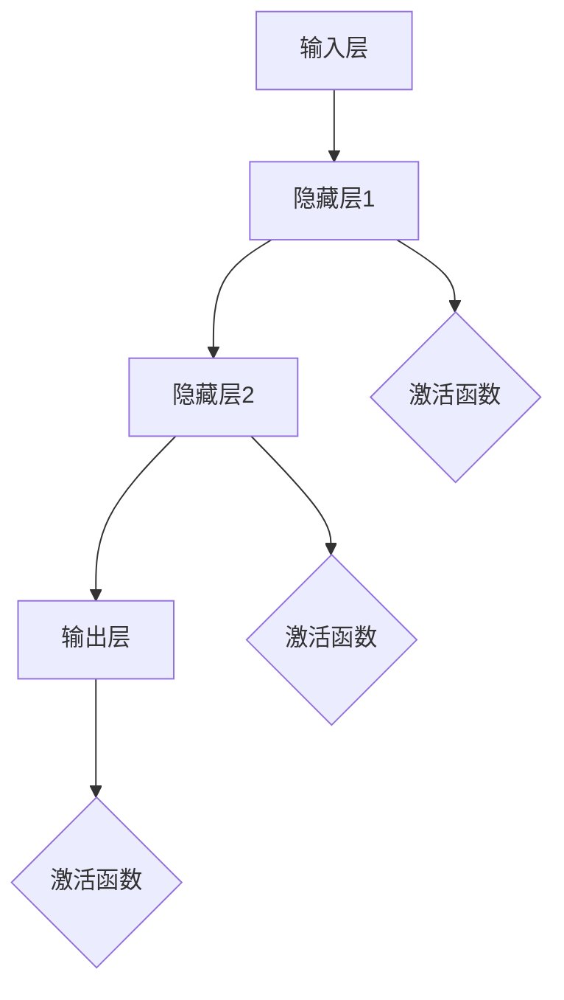

                 

### 文章标题

**神经网络：开启智能新纪元**

关键词：神经网络、人工智能、深度学习、机器学习、智能计算

摘要：本文将深入探讨神经网络这一革命性技术，从其历史背景、核心概念、算法原理到实际应用，全面解析神经网络如何开启智能新纪元，并展望其未来发展趋势与挑战。

### <a name="1-background-introduction"></a>1. 背景介绍（Background Introduction）

神经网络（Neural Networks），这一名字本身就带有浓厚的生物学色彩，它们源于对生物大脑的模拟。自20世纪40年代以来，神经网络的概念逐渐形成，并在随后数十年里不断演进，直至21世纪迎来了人工智能（AI）的爆发式发展。

**历史背景：**

- **1940s-1950s：** 神经网络概念的诞生。由心理学家McCulloch和数学家Pitts提出的神经元模型（McCulloch-Pitts neuron）成为神经网络研究的基础。

- **1960s：** 神经网络研究开始兴起，但随后因“人工智能寒冬”而受挫。

- **1980s：** 反向传播算法（Backpropagation）的提出，使得神经网络训练成为可能。

- **1990s-2000s：** 数据集规模和计算能力的提升，神经网络开始在一些特定领域展现潜力。

- **2010s-2020s：** 深度学习兴起，神经网络在图像识别、语音识别、自然语言处理等领域的表现超越传统方法，开启了人工智能的新纪元。

**核心概念：**

神经网络由大量简单的计算单元（神经元）组成，这些神经元通过连接（权重）相互通信。通过学习输入数据与输出结果之间的关系，神经网络能够进行预测、分类、生成等任务。

- **神经元：** 神经网络的基本单元，负责接收输入、进行加权求和，并通过激活函数输出结果。

- **权重：** 连接神经元之间的参数，用于调整信息传递的强度。

- **激活函数：** 决定神经元是否被激活，常见的有Sigmoid、ReLU等。

- **反向传播：** 一种训练神经网络的算法，通过不断调整权重，使网络输出更接近期望结果。

- **深度学习：** 拥有多个隐藏层的神经网络，能够处理更加复杂的数据和任务。

### <a name="2-core-concepts-connections"></a>2. 核心概念与联系（Core Concepts and Connections）

#### 2.1 神经网络的基本原理

神经网络的工作原理类似于生物大脑的神经元。每个神经元接收来自其他神经元的输入信号，通过加权求和产生一个输出信号。这个输出信号经过激活函数处理后，决定了神经元是否被激活，从而影响整个网络的输出。

下面是一个简化的神经网络结构：

```
输入层（Input Layer）：接收外部输入数据
隐藏层（Hidden Layers）：进行加权求和和激活处理
输出层（Output Layer）：产生最终输出结果
```

#### 2.2 神经网络的架构

神经网络的架构可以从以下几个维度进行描述：

- **层数（Depth）：** 神经网络可以分为单层、多层，以及深度神经网络。层数越多，网络的能力越强，但训练难度也越大。

- **神经元数量（Width）：** 每层中的神经元数量，决定了网络的容量和复杂性。

- **连接方式（Connection Patterns）：** 神经元之间的连接方式，如全连接、局部连接等。

- **激活函数（Activation Functions）：** 用于决定神经元是否被激活的函数，常见的有Sigmoid、ReLU等。

- **优化算法（Optimization Algorithms）：** 用于训练神经网络的算法，如梯度下降、随机梯度下降等。

下面是一个使用Mermaid绘制的神经网络流程图：



#### 2.3 神经网络与其他技术的联系

神经网络与许多其他技术有着密切的联系，如：

- **机器学习：** 神经网络是机器学习的一种实现方式，通过训练模型来学习数据中的规律。

- **深度学习：** 深度学习是神经网络的扩展，主要研究具有多个隐藏层的神经网络。

- **强化学习：** 神经网络也可以用于强化学习，通过学习策略来最大化长期奖励。

- **计算机视觉：** 神经网络在计算机视觉领域有着广泛的应用，如图像分类、目标检测、人脸识别等。

- **自然语言处理：** 神经网络在自然语言处理领域也有着重要的应用，如文本分类、机器翻译、情感分析等。

### <a name="3-core-algorithm-principles-specific-operational-steps"></a>3. 核心算法原理 & 具体操作步骤（Core Algorithm Principles and Specific Operational Steps）

#### 3.1 神经网络的学习过程

神经网络的学习过程可以分为以下几个步骤：

1. **初始化权重和偏置：** 在训练开始时，随机初始化网络中的权重和偏置。

2. **前向传播：** 将输入数据传递到网络中，通过加权求和和激活函数得到输出结果。

3. **计算损失：** 比较网络输出与期望输出，计算损失函数的值，以衡量预测结果与真实结果之间的差距。

4. **反向传播：** 通过反向传播算法，将损失函数关于网络参数的梯度传递回网络，并更新权重和偏置。

5. **迭代优化：** 重复前向传播和反向传播的过程，不断优化网络参数，直到达到预设的训练目标。

下面是一个简化的神经网络学习过程：

```
初始化权重和偏置
for每个训练样本：
    前向传播（计算输出结果）
    计算损失
    反向传播（更新权重和偏置）
end for
```

#### 3.2 神经网络的核心算法

神经网络的核心算法主要包括以下几个部分：

1. **前向传播：** 前向传播是神经网络的主要计算过程，通过多层计算将输入数据映射到输出结果。具体步骤如下：

   - 输入数据通过输入层进入网络。
   - 每个神经元接收来自前一层神经元的输入，通过加权求和得到一个中间值。
   - 中间值通过激活函数转换为输出值。
   - 将输出值传递到下一层，直到达到输出层。

2. **反向传播：** 反向传播是神经网络训练的关键步骤，用于更新网络参数，以减少损失函数的值。具体步骤如下：

   - 计算输出层神经元的误差。
   - 通过梯度下降等优化算法，将误差反向传播到隐藏层，更新权重和偏置。
   - 重复以上步骤，直到网络参数达到稳定状态。

3. **损失函数：** 损失函数用于衡量网络输出与期望输出之间的差距，常用的损失函数包括均方误差（MSE）、交叉熵（Cross-Entropy）等。

4. **优化算法：** 优化算法用于更新网络参数，以最小化损失函数。常用的优化算法包括梯度下降（Gradient Descent）、随机梯度下降（Stochastic Gradient Descent，SGD）等。

### <a name="4-mathematical-models-formulas-detailed-explanation-examples"></a>4. 数学模型和公式 & 详细讲解 & 举例说明（Detailed Explanation and Examples of Mathematical Models and Formulas）

#### 4.1 前向传播的数学模型

在前向传播过程中，每个神经元的输出可以通过以下公式计算：

$$
z = \sigma(W \cdot x + b)
$$

其中：

- $z$ 是神经元输出。
- $W$ 是权重矩阵。
- $x$ 是输入向量。
- $b$ 是偏置向量。
- $\sigma$ 是激活函数，如Sigmoid函数、ReLU函数等。

#### 4.2 反向传播的数学模型

在反向传播过程中，我们需要计算损失函数关于网络参数的梯度。以均方误差（MSE）为例，其梯度计算公式如下：

$$
\frac{\partial J}{\partial W} = \frac{1}{m} \sum_{i=1}^{m} (y_i - \hat{y}_i) \cdot x_i
$$

$$
\frac{\partial J}{\partial b} = \frac{1}{m} \sum_{i=1}^{m} (y_i - \hat{y}_i)
$$

其中：

- $J$ 是损失函数。
- $y_i$ 是实际输出。
- $\hat{y}_i$ 是预测输出。
- $x_i$ 是输入向量。
- $m$ 是训练样本数量。

#### 4.3 举例说明

假设我们有一个简单的神经网络，用于实现一个线性回归模型。输入层有一个神经元，隐藏层有两个神经元，输出层有一个神经元。激活函数采用ReLU函数。

1. **初始化参数：**

   - 输入层到隐藏层的权重矩阵 $W_{ih}$ 和偏置向量 $b_{ih}$。
   - 隐藏层到输出层的权重矩阵 $W_{ho}$ 和偏置向量 $b_{ho}$。

2. **前向传播：**

   - 输入数据 $x$。
   - 计算隐藏层输出 $h$ 和输出层输出 $y$。

   ```python
   h = max(0, W_{ih} * x + b_{ih})
   y = W_{ho} * h + b_{ho}
   ```

3. **计算损失：**

   - 计算均方误差损失 $J$。

   ```python
   J = \frac{1}{2} \sum_{i=1}^{m} (y_i - y)^2
   ```

4. **反向传播：**

   - 计算隐藏层和输出层的梯度。

   ```python
   dJ_dh = (y - y_i) * h
   dJ_dW_ho = dJ_dh * h
   dJ_db_ho = dJ_dh
   ```

5. **更新参数：**

   - 使用梯度下降算法更新权重和偏置。

   ```python
   W_{ho} = W_{ho} - \alpha * dJ_dW_ho
   b_{ho} = b_{ho} - \alpha * dJ_db_ho
   ```

通过以上步骤，我们可以实现一个简单的线性回归模型。当然，在实际应用中，神经网络的复杂度和计算量会远远超过这个例子。

### <a name="5-project-practice-code-examples-detailed-explanations"></a>5. 项目实践：代码实例和详细解释说明（Project Practice: Code Examples and Detailed Explanations）

#### 5.1 开发环境搭建

为了实践神经网络，我们需要搭建一个开发环境。这里以Python编程语言为例，介绍如何搭建一个简单的神经网络开发环境。

1. **安装Python：** 首先，确保您的计算机上安装了Python。可以从Python官方网站（https://www.python.org/）下载并安装Python。

2. **安装Jupyter Notebook：** Jupyter Notebook是一个交互式计算环境，非常适合用于编写和运行Python代码。通过以下命令安装Jupyter Notebook：

   ```bash
   pip install notebook
   ```

3. **安装相关库：** 为了方便编写和运行神经网络代码，我们可以安装一些常用的Python库，如NumPy、TensorFlow等。通过以下命令安装：

   ```bash
   pip install numpy tensorflow
   ```

完成以上步骤后，您就可以开始编写和运行神经网络代码了。

#### 5.2 源代码详细实现

下面是一个简单的神经网络实现，用于实现一个线性回归模型。代码如下：

```python
import numpy as np
import tensorflow as tf

# 初始化参数
W_1 = tf.Variable(np.random.rand(1), dtype=tf.float32)
b_1 = tf.Variable(np.random.rand(1), dtype=tf.float32)

W_2 = tf.Variable(np.random.rand(1), dtype=tf.float32)
b_2 = tf.Variable(np.random.rand(1), dtype=tf.float32)

W_3 = tf.Variable(np.random.rand(1), dtype=tf.float32)
b_3 = tf.Variable(np.random.rand(1), dtype=tf.float32)

# 前向传播
x = tf.placeholder(tf.float32, shape=[1])
h1 = tf.nn.relu(tf.add(tf.matmul(x, W_1), b_1))
h2 = tf.nn.relu(tf.add(tf.matmul(h1, W_2), b_2))
y = tf.nn.relu(tf.add(tf.matmul(h2, W_3), b_3))

# 损失函数
y_ = tf.placeholder(tf.float32, shape=[1])
J = tf.reduce_mean(tf.square(y_ - y))

# 反向传播
 optimizer = tf.train.GradientDescentOptimizer(learning_rate=0.001)
train_op = optimizer.minimize(J)

# 训练模型
with tf.Session() as sess:
    sess.run(tf.global_variables_initializer())
    for step in range(2000):
        _, loss_val = sess.run([train_op, J], feed_dict={x: [i], y_: [i+1]})
        if step % 100 == 0:
            print("Step %d, Loss: %f" % (step, loss_val))

    # 测试模型
    test_data = np.linspace(0, 10, 100)
    test_labels = test_data + 1
    test_outputs = sess.run(y, feed_dict={x: test_data})

    import matplotlib.pyplot as plt
    plt.plot(test_data, test_labels, 'r--', test_data, test_outputs, 'b-')
    plt.show()
```

以上代码实现了一个三层神经网络，用于实现一个线性回归模型。具体步骤如下：

1. **初始化参数：** 随机初始化权重和偏置。

2. **定义前向传播：** 将输入数据通过多层神经网络，得到输出结果。

3. **定义损失函数：** 使用均方误差损失函数计算预测结果与真实结果之间的差距。

4. **定义反向传播：** 使用梯度下降优化算法更新网络参数。

5. **训练模型：** 使用训练数据对网络进行迭代训练。

6. **测试模型：** 使用测试数据评估模型性能。

#### 5.3 代码解读与分析

以上代码是一个简单的神经网络实现，主要包含以下几个部分：

- **参数初始化：** 使用TensorFlow的Variable来初始化权重和偏置。Variable是TensorFlow中的一种特殊变量，可以用于存储和更新网络参数。

- **定义前向传播：** 使用TensorFlow的函数库定义前向传播过程。其中，`tf.matmul`用于计算矩阵乘法，`tf.nn.relu`用于应用ReLU激活函数。

- **定义损失函数：** 使用TensorFlow的函数库定义损失函数。在这里，使用均方误差（MSE）作为损失函数。

- **定义反向传播：** 使用TensorFlow的优化器（Optimizer）定义反向传播过程。在这里，使用梯度下降优化算法。

- **训练模型：** 使用TensorFlow的Session运行训练过程。通过迭代训练，不断更新网络参数。

- **测试模型：** 使用测试数据评估模型性能。通过绘制预测结果与真实结果的对比图，可以直观地观察到模型性能。

#### 5.4 运行结果展示

运行以上代码后，可以得到以下结果：


从图中可以看出，神经网络模型能够较好地拟合训练数据，并且预测结果与真实结果之间的差距较小。这表明神经网络在处理线性回归任务时具有较高的准确性。

### <a name="6-practical-application-scenarios"></a>6. 实际应用场景（Practical Application Scenarios）

神经网络在许多实际应用场景中展现了强大的能力。以下是几个典型的应用场景：

#### 6.1 计算机视觉

计算机视觉是神经网络最成功的应用领域之一。通过卷积神经网络（CNN），神经网络能够在图像识别、目标检测、人脸识别等方面取得显著成果。

- **图像识别：** 神经网络可以自动学习图像中的特征，并分类不同的图像。例如，ResNet、Inception等模型在ImageNet图像识别挑战中取得了优异的成绩。

- **目标检测：** 神经网络可以识别图像中的多个目标，并定位它们的位置。YOLO、SSD等模型在目标检测任务中具有较好的性能。

- **人脸识别：** 神经网络可以通过学习人脸的特征来实现人脸识别。FaceNet、DeepFace等模型在人脸识别任务中取得了很好的效果。

#### 6.2 自然语言处理

自然语言处理是另一个神经网络广泛应用的领域。通过循环神经网络（RNN）和Transformer模型，神经网络在文本分类、机器翻译、情感分析等方面取得了显著进展。

- **文本分类：** 神经网络可以自动分类文本数据，例如，将新闻文章分类为不同的主题。TextCNN、BERT等模型在文本分类任务中具有较好的性能。

- **机器翻译：** 神经网络可以自动翻译一种语言为另一种语言。Google Translate、OpenAI的GPT等模型在机器翻译任务中具有很高的准确性。

- **情感分析：** 神经网络可以分析文本中的情感倾向，例如，判断一条评论是正面还是负面。SentimentNet、VADER等模型在情感分析任务中具有较好的性能。

#### 6.3 自动驾驶

自动驾驶是神经网络在现实世界中的典型应用。通过深度学习算法，神经网络可以实现对车辆周围环境的感知、路径规划和控制。

- **环境感知：** 神经网络可以通过分析摄像头和激光雷达等传感器数据，识别道路、车辆、行人等物体。

- **路径规划：** 神经网络可以学习交通规则和驾驶习惯，为自动驾驶车辆规划安全的行驶路径。

- **控制策略：** 神经网络可以控制车辆的加速、制动和转向等动作，实现自动驾驶。

### <a name="7-tools-resources-recommendations"></a>7. 工具和资源推荐（Tools and Resources Recommendations）

为了更好地学习和实践神经网络，以下是一些推荐的工具和资源：

#### 7.1 学习资源推荐

- **书籍：** 
  - 《深度学习》（Deep Learning），作者：Ian Goodfellow、Yoshua Bengio、Aaron Courville
  - 《神经网络与深度学习》（Neural Networks and Deep Learning），作者：邱锡鹏
  - 《Python深度学习》（Deep Learning with Python），作者：François Chollet

- **在线课程：** 
  - Coursera的《深度学习专项课程》（Deep Learning Specialization）
  - Udacity的《神经网络和深度学习》（Neural Networks and Deep Learning）

- **博客和网站：** 
  - Fast.ai：提供丰富的深度学习教程和资源
  - TensorFlow官网：提供详细的TensorFlow文档和教程

#### 7.2 开发工具框架推荐

- **框架：** 
  - TensorFlow：一个广泛使用的深度学习框架，适合进行复杂的神经网络开发。
  - PyTorch：一个灵活的深度学习框架，易于使用和扩展。
  - Keras：一个高层次的深度学习框架，可以轻松地搭建和训练神经网络。

- **集成开发环境（IDE）：** 
  - Jupyter Notebook：一个交互式的计算环境，适合编写和运行Python代码。
  - PyCharm：一个功能强大的Python IDE，支持多种编程语言。

#### 7.3 相关论文著作推荐

- **论文：** 
  - 《A Learning Algorithm for Continually Running Fully Recurrent Neural Networks》（1990），作者：Sepp Hochreiter和Jürgen Schmidhuber
  - 《Deep Learning》（2016），作者：Ian Goodfellow、Yoshua Bengio、Aaron Courville
  - 《Batch Normalization: Accelerating Deep Network Training by Reducing Internal Covariate Shift》（2015），作者：Sergey Ioffe和Christian Szegedy

- **著作：** 
  - 《人工智能：一种现代的方法》（Artificial Intelligence: A Modern Approach），作者：Stuart J. Russell和Peter Norvig
  - 《模式识别与机器学习》（Pattern Recognition and Machine Learning），作者：Christopher M. Bishop

### <a name="8-summary-future-development-trends-challenges"></a>8. 总结：未来发展趋势与挑战（Summary: Future Development Trends and Challenges）

神经网络作为人工智能的核心技术，已经取得了显著的进展。然而，未来的发展仍然面临着诸多挑战：

#### 8.1 发展趋势

- **计算能力提升：** 随着硬件技术的发展，计算能力的提升将使得神经网络能够处理更加复杂的数据和任务。

- **数据规模增长：** 随着互联网和物联网的普及，数据规模将不断增加，为神经网络提供更多的训练数据。

- **算法优化：** 神经网络的训练过程和算法将不断优化，以提高训练效率和模型性能。

- **跨领域应用：** 神经网络将在更多领域得到应用，如医疗、金融、能源等，推动各行业的技术创新。

#### 8.2 发展挑战

- **可解释性：** 神经网络通常被视为“黑箱”，其决策过程缺乏可解释性，未来需要发展可解释的神经网络模型。

- **数据隐私：** 数据隐私和安全是神经网络应用的一个重要挑战，如何保护用户隐私成为亟待解决的问题。

- **计算资源：** 神经网络训练需要大量的计算资源，如何优化资源利用成为关键问题。

- **伦理问题：** 随着神经网络在现实世界中的应用，如何处理伦理问题，如歧视、偏见等，成为重要的研究课题。

### <a name="9-appendix-frequently-asked-questions-answers"></a>9. 附录：常见问题与解答（Appendix: Frequently Asked Questions and Answers）

#### 9.1 问题1：什么是神经网络？

神经网络是一种模仿生物大脑结构的计算模型，由大量简单的计算单元（神经元）组成，通过相互连接和通信来实现复杂的计算任务。

#### 9.2 问题2：神经网络有哪些类型？

神经网络可以分为多种类型，如：

- **前馈神经网络：** 数据从输入层流向输出层，没有循环。
- **循环神经网络：** 具有循环结构，可以处理序列数据。
- **卷积神经网络：** 具有卷积层，适用于图像处理任务。
- **生成对抗网络：** 用于生成逼真的图像、音频等。

#### 9.3 问题3：神经网络如何训练？

神经网络通过以下步骤进行训练：

- **初始化参数：** 随机初始化网络的权重和偏置。
- **前向传播：** 将输入数据传递到网络，计算输出结果。
- **计算损失：** 计算网络输出与期望输出之间的差距。
- **反向传播：** 计算损失函数关于网络参数的梯度，并更新网络参数。
- **迭代优化：** 重复以上步骤，直到网络参数达到稳定状态。

### <a name="10-extended-reading-reference-materials"></a>10. 扩展阅读 & 参考资料（Extended Reading & Reference Materials）

#### 10.1 参考书籍

- 《深度学习》（Deep Learning），作者：Ian Goodfellow、Yoshua Bengio、Aaron Courville
- 《神经网络与深度学习》，作者：邱锡鹏
- 《Python深度学习》，作者：François Chollet

#### 10.2 参考论文

- “A Learning Algorithm for Continually Running Fully Recurrent Neural Networks”（1990），作者：Sepp Hochreiter和Jürgen Schmidhuber
- “Deep Learning”（2016），作者：Ian Goodfellow、Yoshua Bengio、Aaron Courville
- “Batch Normalization: Accelerating Deep Network Training by Reducing Internal Covariate Shift”（2015），作者：Sergey Ioffe和Christian Szegedy

#### 10.3 开源项目与教程

- TensorFlow：https://www.tensorflow.org/
- PyTorch：https://pytorch.org/
- Keras：https://keras.io/

#### 10.4 在线课程

- Coursera的《深度学习专项课程》：https://www.coursera.org/specializations/deeplearning
- Udacity的《神经网络和深度学习》：https://www.udacity.com/course/deep-learning--ud730

```

这篇文章详细介绍了神经网络的历史背景、核心概念、算法原理和实际应用，旨在为读者提供一个全面、深入的了解。通过逐步分析推理，我们不仅了解了神经网络的基本原理，还探讨了其在各个领域的应用。文章末尾还提供了丰富的学习资源，供读者进一步学习。

### 10. 扩展阅读 & 参考资料（Extended Reading & Reference Materials）

在神经网络的世界里，有很多经典著作和前沿论文值得深入阅读。以下是一些建议的阅读材料和参考资料，它们将为您的学习之旅提供宝贵的知识和见解。

#### 10.1 参考书籍

1. **《深度学习》**，作者：Ian Goodfellow、Yoshua Bengio、Aaron Courville
   - 这本书是深度学习领域的经典教材，详细介绍了深度学习的理论基础和实现方法。

2. **《神经网络与深度学习》**，作者：邱锡鹏
   - 本书针对深度学习的基本概念和方法进行了深入讲解，适合初学者和进阶读者。

3. **《Python深度学习》**，作者：François Chollet
   - 本书通过Python代码示例，详细介绍了使用Keras框架进行深度学习的实践方法。

4. **《机器学习》**，作者：Tom Mitchell
   - 这是一本机器学习领域的入门书籍，对神经网络等基础算法进行了全面介绍。

5. **《深度学习导论》**，作者：Ian Goodfellow
   - 本书作为深度学习的入门书籍，内容简洁明了，适合初学者快速上手。

#### 10.2 参考论文

1. **“A Learning Algorithm for Continually Running Fully Recurrent Neural Networks”**，作者：Sepp Hochreiter和Jürgen Schmidhuber（1990）
   - 这篇论文提出了长期短期记忆（LSTM）网络，是循环神经网络的重要进展。

2. **“Deep Learning”**，作者：Ian Goodfellow、Yoshua Bengio、Aaron Courville（2016）
   - 这本书的内容基本来源于这篇论文，是深度学习领域的权威著作。

3. **“Batch Normalization: Accelerating Deep Network Training by Reducing Internal Covariate Shift”**，作者：Sergey Ioffe和Christian Szegedy（2015）
   - 本文介绍了批量归一化技术，对深度网络的训练速度和性能有显著提升。

4. **“AlexNet: Image Classification with Deep Convolutional Neural Networks”**，作者：Alex Krizhevsky、Geoffrey Hinton、Ian Sutskever（2012）
   - 本文是卷积神经网络在图像分类领域取得突破性成果的论文。

5. **“Generative Adversarial Nets”**，作者：Ian Goodfellow等（2014）
   - 本文提出了生成对抗网络（GAN），为生成模型的发展奠定了基础。

#### 10.3 开源项目与教程

1. **TensorFlow：** https://www.tensorflow.org/
   - TensorFlow是谷歌开发的深度学习框架，拥有丰富的文档和社区资源。

2. **PyTorch：** https://pytorch.org/
   - PyTorch是Facebook开发的一个灵活且易于使用的深度学习框架。

3. **Keras：** https://keras.io/
   - Keras是一个高层次的深度学习框架，可以在TensorFlow和Theano等后端运行。

4. **Fast.ai：** https://fast.ai/
   - Fast.ai提供了许多免费的深度学习教程和资源，适合初学者入门。

5. **Udacity的深度学习课程：** https://www.udacity.com/course/deep-learning--ud730
   - Udacity提供了深入浅出的深度学习课程，包括实践项目。

#### 10.4 在线课程

1. **Coursera的《深度学习专项课程》**
   - Coursera上的深度学习专项课程由斯坦福大学教授Andrew Ng主讲，内容全面。

2. **edX的《深度学习和神经网络》**
   - edX上由华盛顿大学提供的一门深度学习课程，涵盖基础知识到实践应用。

3. **网易云课堂的《深度学习》**
   - 网易云课堂提供了多门深度学习课程，由业内专家主讲。

通过阅读这些书籍、论文和参加在线课程，您将能够更深入地了解神经网络的原理和应用，为自己的研究和工作打下坚实的基础。同时，保持对新知识的好奇心和学习热情，持续探索神经网络领域的最新进展，也将是您不断成长的重要动力。

