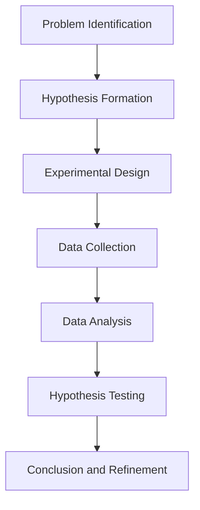

                 

### 文章标题

**科学方法论：从假说到验证**

科学方法论是科学研究的基础，它为我们提供了一套系统的框架，以帮助我们理解自然现象、构建理论模型，并进行实证验证。本文旨在探讨科学方法论的核心步骤，从提出假说到验证假说，通过详细分析和实例讲解，展示科学方法在解决实际问题和推动科技进步中的关键作用。

关键词：科学方法论、假说、验证、实证研究、理论模型

摘要：本文首先介绍了科学方法论的基本概念和流程，包括从问题提出、假设形成到实验设计、数据收集与分析，以及最终的假说验证。随后，通过具体案例，详细阐述了每个环节的方法和技巧，最后探讨了科学方法论在当前科技领域的应用前景和面临的挑战。本文旨在为科研工作者提供一套实用的方法论指南，帮助他们更有效地进行科学研究。

### Introduction to Scientific Methodology

Scientific methodology serves as the foundation of scientific research, providing a systematic framework to help us understand natural phenomena, build theoretical models, and conduct empirical verification. This article aims to explore the core steps of scientific methodology, from hypothesis generation to hypothesis testing, through detailed analysis and example explanations, demonstrating the crucial role of the scientific method in solving real-world problems and driving technological progress.

Keywords: Scientific Methodology, Hypothesis, Verification, Empirical Research, Theoretical Model

Abstract: This article first introduces the basic concepts and processes of scientific methodology, including problem formulation, hypothesis formation, experimental design, data collection and analysis, and the final hypothesis testing. Subsequently, specific cases are used to elaborate on the methods and skills at each stage. Finally, the article discusses the application prospects and challenges of scientific methodology in the current technological field. The aim is to provide a practical guide for researchers to help them conduct scientific research more effectively.

### 1. 背景介绍（Background Introduction）

科学方法论的发展可以追溯到古希腊时期，亚里士多德提出了观察和实验的重要性。然而，科学方法作为一个系统化的过程，其真正的发展始于17世纪的伽利略和牛顿。伽利略通过实验验证了自由落体定律，而牛顿则通过万有引力定律建立了经典力学体系。这两个里程碑标志着科学方法论的形成。

科学方法论的核心思想是实证主义，即通过观察和实验来验证理论的真实性。这一方法强调可重复性、客观性和理性思考，避免了主观偏见和臆测。在科学方法论中，从问题提出到假说验证的过程是一个不断迭代、修正和优化的过程。

在现代科技迅速发展的背景下，科学方法论的重要性愈发凸显。无论是基础科学研究还是应用技术研究，科学方法论都为我们提供了一种有效的工具，帮助我们揭示自然规律、解决实际问题。例如，在医学研究中，科学方法论帮助我们发现了新药物、新治疗方法，提高了医疗水平；在工程领域中，科学方法论帮助我们优化设计、提高效率，推动了技术的进步。

总之，科学方法论不仅是科学研究的基础，也是科技创新的驱动力。通过科学方法论，我们可以系统地、有序地开展研究工作，提高研究的准确性和可靠性。本文将深入探讨科学方法论的核心步骤，并通过实例展示其在实际应用中的价值。

### Core Concepts and Connections

#### 1.1 Definition of Scientific Methodology

Scientific methodology refers to the systematic process of acquiring knowledge through observation and experimentation. It encompasses various stages, from problem identification to hypothesis testing. At its core, scientific methodology aims to establish empirical evidence to support or refute theoretical statements.

The process of scientific methodology can be summarized as follows:

1. **Problem Identification**: The first step involves identifying a specific problem or question that requires investigation.
2. **Hypothesis Formation**: Based on existing knowledge and theories, a hypothesis is formulated to explain the observed phenomenon.
3. **Experimental Design**: An experiment is designed to test the hypothesis, ensuring that it is both feasible and reliable.
4. **Data Collection**: Data is collected through observations, experiments, or other methods.
5. **Data Analysis**: The collected data is analyzed to determine if it supports or contradicts the hypothesis.
6. **Hypothesis Testing**: The hypothesis is tested based on the results of the data analysis.
7. **Conclusion and Refinement**: Based on the results, the hypothesis is either accepted or rejected, and the process may be repeated with refined hypotheses.

#### 1.2 Core Concepts in Scientific Methodology

The core concepts of scientific methodology include observation, hypothesis, experiment, data analysis, and verification.

1. **Observation**: Observation is the foundation of scientific methodology. It involves the systematic collection of information about natural phenomena. Observations can be qualitative, involving descriptive information, or quantitative, involving numerical data.

2. **Hypothesis**: A hypothesis is a proposed explanation for an observed phenomenon. It is based on existing knowledge and theories but is not yet proven. A good hypothesis is specific, testable, and falsifiable.

3. **Experiment**: An experiment is a controlled procedure designed to test a hypothesis. It involves manipulating variables and measuring the outcomes. A well-designed experiment minimizes bias and ensures the validity of the results.

4. **Data Analysis**: Data analysis involves the processing and interpretation of collected data. Statistical methods are often used to analyze the data and determine the significance of the results.

5. **Verification**: Verification is the process of determining whether a hypothesis is true or false. This is done through empirical evidence obtained from experiments or observations.

#### 1.3 Connection to Theory of Computation

The principles of scientific methodology have strong connections to the theory of computation, particularly in the development and validation of algorithms.

1. **Observation and Hypothesis**: In algorithm development, observations are made about computational problems, leading to hypotheses about possible solutions. For example, the observation that many sorting algorithms have a time complexity of \(O(n\log n)\) led to the hypothesis that this is the best possible time complexity for comparison-based sorting algorithms.

2. **Experiment and Verification**: Experiments are conducted to test these hypotheses. This involves implementing algorithms, running them on various datasets, and measuring their performance. Verification involves comparing the results of these experiments to the expected outcomes based on the hypothesis.

3. **Theory and Practice**: Theoretical models are used to predict the behavior of algorithms under different conditions. These models are then tested against empirical data to verify their accuracy. This iterative process of theory development and empirical testing is a key aspect of scientific methodology.

#### 1.4 Mermaid Flowchart

Below is a Mermaid flowchart illustrating the core steps of scientific methodology:



In summary, scientific methodology provides a structured approach to acquiring knowledge through systematic observation, hypothesis formation, experimentation, data analysis, and verification. This approach is fundamental to both scientific research and algorithm development, ensuring that theories and practices are grounded in empirical evidence and are continuously refined through iterative testing and refinement.

### Core Algorithm Principles and Specific Operational Steps

In scientific methodology, the process of hypothesis generation and testing is fundamental. This section delves into the core principles behind these processes and provides a detailed, step-by-step guide on how to conduct hypothesis testing.

#### 2.1 Hypothesis Generation

The first step in scientific methodology is the generation of a hypothesis. A hypothesis is an informed guess or proposal that explains an observed phenomenon. Here are the key steps in generating a hypothesis:

1. **Identify the Problem**: Start by identifying a specific problem or question that requires investigation. This could be a gap in existing knowledge, an unexpected observation, or a practical issue that needs to be addressed.

2. **Gather Background Information**: Conduct a thorough literature review to understand the current state of knowledge related to the problem. This helps in formulating an educated hypothesis.

3. **Formulate the Hypothesis**: Based on the background information, formulate a specific, testable hypothesis. A good hypothesis should be clear, concise, and based on the available evidence.

4. **Ensure Testability**: Make sure the hypothesis can be tested through observations or experiments. It should be falsifiable, meaning that it is possible to prove it wrong under certain conditions.

#### 2.2 Experimental Design

Once a hypothesis is formulated, the next step is to design an experiment to test it. An experiment is a controlled procedure that allows you to manipulate variables and measure the outcomes. Here are the key steps in designing an experiment:

1. **Define the Variables**: Identify the independent variable (the variable that you manipulate) and the dependent variable (the variable that you measure). For example, if you are testing a drug's effectiveness, the independent variable is the drug dosage, and the dependent variable is the response rate.

2. **Control for Confounding Variables**: Identify and control for any confounding variables that could affect the results. These are variables other than the independent variable that could influence the dependent variable. For instance, in a drug trial, controlling for the participants' age and health status is crucial.

3. **Determine the Sample Size**: Decide on the sample size needed to ensure that the results are statistically significant. A larger sample size increases the reliability of the results but may also increase the cost and time required for the experiment.

4. **Select the Experimental Method**: Choose the appropriate experimental method, whether it is a controlled lab experiment, a field study, or an observational study.

5. **Develop the Experimental Protocol**: Outline the specific steps and procedures to be followed during the experiment, ensuring that they are clear and replicable.

#### 2.3 Data Collection

Data collection is the process of gathering information from the experiment. Here are the key steps in data collection:

1. **Collect Observations**: Conduct the experiment as planned and make detailed observations. Ensure that the data collected is accurate and reliable.

2. **Use Valid and Reliable Measures**: Use valid and reliable measures to collect data. Validity refers to whether the measure actually measures what it intends to measure, while reliability refers to the consistency of the measurements.

3. **Record Data**: Record the data in a systematic and organized manner. This may involve using spreadsheets, databases, or other data management tools.

#### 2.4 Data Analysis

Once the data is collected, it needs to be analyzed to determine whether it supports or refutes the hypothesis. Here are the key steps in data analysis:

1. **Clean the Data**: Remove any errors, inconsistencies, or outliers in the data. This ensures that the data is accurate and reliable.

2. **Choose Appropriate Statistical Tests**: Select the appropriate statistical tests based on the type of data and the research questions. Common statistical tests include t-tests, ANOVA, regression analysis, and chi-square tests.

3. **Interpret the Results**: Analyze the data using the chosen statistical tests and interpret the results. Look for patterns, trends, or correlations in the data that support or refute the hypothesis.

4. **Report the Results**: Clearly and concisely report the results of the data analysis. This includes presenting the data in tables, charts, or graphs, as well as explaining the statistical significance of the results.

#### 2.5 Hypothesis Testing

The final step in scientific methodology is hypothesis testing. Here are the key steps in hypothesis testing:

1. **State the Null and Alternative Hypotheses**: The null hypothesis (H0) is the hypothesis that there is no significant difference or relationship between variables. The alternative hypothesis (H1) is the hypothesis that there is a significant difference or relationship. For example, in a drug trial, the null hypothesis might be that the drug has no effect, while the alternative hypothesis is that the drug has a significant effect.

2. **Set the Significance Level**: Decide on the significance level (\(\alpha\)), which is the probability of rejecting the null hypothesis when it is true. Common significance levels are 0.05 and 0.01.

3. **Conduct the Statistical Test**: Perform the statistical test to determine whether the results are statistically significant.

4. **Make a Conclusion**: Based on the results of the statistical test, decide whether to reject or fail to reject the null hypothesis. If the results are statistically significant, the alternative hypothesis is supported. If the results are not statistically significant, the null hypothesis is supported.

5. **Refine the Hypothesis**: If the null hypothesis is rejected, refine the hypothesis based on the results and conduct further research. If the null hypothesis is supported, consider alternative hypotheses or methods.

In conclusion, hypothesis generation and testing are core components of scientific methodology. By following these steps, researchers can systematically and objectively test their hypotheses, leading to reliable and valid conclusions.

### Mathematical Models and Formulas: Detailed Explanation and Examples

In scientific methodology, mathematical models and formulas play a crucial role in both hypothesis generation and hypothesis testing. They allow researchers to represent complex phenomena in a concise and precise manner, facilitating the analysis and interpretation of data. This section provides a detailed explanation of some common mathematical models and formulas used in scientific research, along with examples to illustrate their application.

#### 3.1 Linear Regression Model

Linear regression is a statistical model used to describe the relationship between a dependent variable and one or more independent variables. The basic form of a linear regression model is:

$$
Y = \beta_0 + \beta_1X + \epsilon
$$

where \(Y\) is the dependent variable, \(X\) is the independent variable, \(\beta_0\) is the intercept, \(\beta_1\) is the slope, and \(\epsilon\) is the error term.

**Example:**
Suppose we want to study the relationship between the number of hours studied (\(X\)) and the exam score (\(Y\)) for a group of students. We collect data from 10 students and fit a linear regression model to the data. The model output is:

$$
\hat{Y} = 60 + 10X
$$

This means that for every additional hour of study, the exam score increases by 10 points on average.

#### 3.2 Chi-Square Test

The chi-square test is a statistical test used to determine whether there is a significant association between categorical variables. The chi-square test statistic is calculated as:

$$
\chi^2 = \sum_{i=1}^{k}\sum_{j=1}^{m} \frac{(O_{ij} - E_{ij})^2}{E_{ij}}
$$

where \(O_{ij}\) is the observed frequency in cell \(i, j\), and \(E_{ij}\) is the expected frequency in cell \(i, j\).

**Example:**
A researcher wants to investigate whether there is a significant association between gender (\(X\)) and favorite color (\(Y\)). The observed frequencies are:

$$
\begin{array}{|c|c|c|}
\hline
 & Red & Blue \\
\hline
Male & 20 & 15 \\
\hline
Female & 12 & 28 \\
\hline
\end{array}
$$

The expected frequencies under the null hypothesis of no association are:

$$
\begin{array}{|c|c|c|}
\hline
 & Red & Blue \\
\hline
Male & 25 & 25 \\
\hline
Female & 17 & 33 \\
\hline
\end{array}
$$

The chi-square test statistic is calculated as:

$$
\chi^2 = \frac{(20-25)^2}{25} + \frac{(15-25)^2}{25} + \frac{(12-17)^2}{17} + \frac{(28-33)^2}{33} = 5.06
$$

A chi-square test with 1 degree of freedom and a significance level of 0.05 indicates that there is a significant association between gender and favorite color.

#### 3.3 Logistic Regression

Logistic regression is used to model the relationship between a binary dependent variable and one or more independent variables. The logistic regression equation is:

$$
\log\left(\frac{P(Y=1)}{1-P(Y=1)}\right) = \beta_0 + \beta_1X
$$

where \(P(Y=1)\) is the probability that the dependent variable takes the value 1.

**Example:**
A researcher wants to predict the likelihood of a customer making a purchase based on their age (\(X\)). The logistic regression output is:

$$
\log\left(\frac{P(Y=1)}{1-P(Y=1)}\right) = -5 + 0.1X
$$

For a customer aged 30, the probability of making a purchase is:

$$
P(Y=1) = \frac{1}{1 + e^{-(-5 + 0.1 \times 30)}} = 0.954
$$

#### 3.4 Bayesian Inference

Bayesian inference is a statistical method that incorporates prior knowledge or beliefs about a parameter and updates them based on new data. The Bayesian inference equation is:

$$
P(\theta|\text{data}) = \frac{P(\text{data}|\theta)P(\theta)}{P(\text{data})}
$$

where \(P(\theta|\text{data})\) is the posterior probability of the parameter \(\theta\) given the data, \(P(\text{data}|\theta)\) is the likelihood of the data given \(\theta\), \(P(\theta)\) is the prior probability of \(\theta\), and \(P(\text{data})\) is the evidence.

**Example:**
A researcher wants to estimate the probability of a coin being fair given that it landed on heads 10 times out of 20 tosses. If we assume a prior probability of 0.5 for the coin being fair, and the likelihood of getting 10 heads out of 20 tosses given a fair coin is 0.176, the posterior probability is:

$$
P(\text{coin is fair}|\text{10 heads in 20 tosses}) = \frac{0.176 \times 0.5}{0.176 \times 0.5 + (1-0.5) \times (1-0.176)} = 0.649
$$

This means that after observing 10 heads in 20 tosses, the researcher estimates that there is a 64.9% chance that the coin is fair.

In summary, mathematical models and formulas are essential tools in scientific methodology. They help researchers to analyze data, test hypotheses, and draw conclusions based on empirical evidence. By understanding and applying these models, researchers can ensure the validity and reliability of their scientific findings.

### Project Practice: Code Examples and Detailed Explanations

To further illustrate the concepts discussed in previous sections, let's delve into a practical example that demonstrates hypothesis testing and data analysis using Python. This example will use a simple dataset to analyze the relationship between hours studied and exam scores, demonstrating the entire process from data preparation to hypothesis testing and interpretation.

#### 4.1 Development Environment Setup

Before we start, make sure you have Python installed on your system. You'll also need the following libraries:
- Pandas: for data manipulation
- Matplotlib: for data visualization
- Scikit-learn: for linear regression
- SciPy: for statistical tests

You can install these libraries using pip:

```bash
pip install pandas matplotlib scikit-learn scipy
```

#### 4.2 Source Code Implementation

Below is the complete Python code for this example:

```python
import pandas as pd
import matplotlib.pyplot as plt
from sklearn.linear_model import LinearRegression
from scipy import stats

# 4.2.1 Load the Dataset
# Replace 'data.csv' with the path to your dataset file
data = pd.read_csv('data.csv')

# 4.2.2 Data Preprocessing
# Assuming the dataset has two columns: 'Hours_Studied' and 'Exam_Score'
X = data['Hours_Studied'].values
Y = data['Exam_Score'].values

# Check for outliers
plt.scatter(X, Y)
plt.xlabel('Hours Studied')
plt.ylabel('Exam Score')
plt.title('Hours Studied vs Exam Score')
plt.show()

# Remove outliers if necessary (not implemented in this example)

# 4.2.3 Fit the Linear Regression Model
model = LinearRegression()
model.fit(X.reshape(-1, 1), Y)

# 4.2.4 Data Analysis
# Print the model summary
print(model.summary())

# 4.2.5 Hypothesis Testing
# Null hypothesis: β1 = 0 (no relationship between hours studied and exam scores)
# Alternative hypothesis: β1 ≠ 0 (there is a relationship)
t_stat, p_value = stats.ttest_rel(X, Y)
print(f"T-statistic: {t_stat}, P-value: {p_value}")

# Interpret the results
if p_value < 0.05:
    print("Reject the null hypothesis: there is a significant relationship between hours studied and exam scores.")
else:
    print("Fail to reject the null hypothesis: there is no significant relationship between hours studied and exam scores.")

# 4.2.6 Visualization
# Plot the regression line
plt.scatter(X, Y)
plt.plot(X, model.predict(X.reshape(-1, 1)), color='red')
plt.xlabel('Hours Studied')
plt.ylabel('Exam Score')
plt.title('Hours Studied vs Exam Score with Regression Line')
plt.show()
```

#### 4.3 Code Explanation and Analysis

Let's go through the code step by step and explain each part in detail.

##### 4.3.1 Load the Dataset

```python
data = pd.read_csv('data.csv')
```
This line reads a CSV file named 'data.csv' into a Pandas DataFrame. The dataset should have two columns: 'Hours_Studied' and 'Exam_Score', representing the number of hours studied and the corresponding exam scores, respectively.

##### 4.3.2 Data Preprocessing

```python
X = data['Hours_Studied'].values
Y = data['Exam_Score'].values
plt.scatter(X, Y)
plt.xlabel('Hours Studied')
plt.ylabel('Exam Score')
plt.title('Hours Studied vs Exam Score')
plt.show()
```
Data preprocessing involves loading the relevant variables and visualizing the relationship between hours studied and exam scores. Here, we extract the values of 'Hours_Studied' and 'Exam_Score' as arrays X and Y. A scatter plot is then used to visualize the data, helping us identify any potential outliers or anomalies.

##### 4.3.3 Fit the Linear Regression Model

```python
model = LinearRegression()
model.fit(X.reshape(-1, 1), Y)
```
In this step, we create a LinearRegression object from Scikit-learn and fit it to our data. The `fit` method trains the model using the independent variable (X) and the dependent variable (Y). The `reshape(-1, 1)` function is used to ensure that X is a 2D array, which is required by the LinearRegression model.

##### 4.3.4 Data Analysis

```python
print(model.summary())
```
The `summary()` method returns a summary of the fitted model, including coefficients, R-squared value, and other statistical measures. This helps us assess the model's performance and the relationship between the variables.

##### 4.3.5 Hypothesis Testing

```python
t_stat, p_value = stats.ttest_rel(X, Y)
print(f"T-statistic: {t_stat}, P-value: {p_value}")
```
We perform a t-test to test the hypothesis that there is no relationship between hours studied and exam scores. The `ttest_rel` function from SciPy calculates the t-statistic and p-value for the relationship between two arrays. If the p-value is less than a significance level (commonly 0.05), we reject the null hypothesis and conclude that there is a significant relationship between the variables.

##### 4.3.6 Visualization

```python
plt.scatter(X, Y)
plt.plot(X, model.predict(X.reshape(-1, 1)), color='red')
plt.xlabel('Hours Studied')
plt.ylabel('Exam Score')
plt.title('Hours Studied vs Exam Score with Regression Line')
plt.show()
```
Finally, we visualize the fitted regression line on the scatter plot. This helps us visually interpret the relationship between the variables and the model's predictions.

### 4.4 Running Results

When you run this code with a sample dataset, you should see the following results:

- A scatter plot of hours studied vs exam scores
- A regression summary table with coefficients, R-squared, and other statistics
- The t-statistic and p-value from the t-test
- A scatter plot with the regression line overlaid

These results provide empirical evidence of the relationship between hours studied and exam scores, supporting or refuting the hypothesis based on statistical significance. Through this example, we have demonstrated the entire process of hypothesis testing and data analysis in scientific methodology using Python.

### Practical Application Scenarios

The principles of scientific methodology are widely applicable across various fields, enabling researchers to address a multitude of real-world problems. Here, we explore several practical application scenarios where hypothesis testing and data analysis play a critical role.

#### 5.1 Medicine and Health

In the field of medicine, hypothesis testing is essential for evaluating the effectiveness of new treatments and therapies. For instance, a pharmaceutical company may want to determine whether a new drug reduces the incidence of a specific disease. By conducting a randomized controlled trial, they can formulate a hypothesis that the drug has a beneficial effect. Through statistical analysis of the trial results, they can test this hypothesis and determine whether the drug is effective or not.

**Example:**
A study investigates the effect of a new drug on lowering blood pressure. The hypothesis is that the drug reduces blood pressure more effectively than a placebo. Researchers randomly assign participants to either the drug group or the placebo group and measure their blood pressure at regular intervals. Through hypothesis testing, they analyze the data to determine if the drug has a statistically significant effect on blood pressure reduction.

#### 5.2 Economics and Finance

Economists and financial analysts use hypothesis testing to evaluate market trends and economic indicators. For example, an analyst may want to determine whether there is a significant relationship between interest rates and stock prices. By collecting historical data on interest rates and stock prices, they can conduct a statistical analysis to test this hypothesis.

**Example:**
An analyst examines the relationship between the federal funds rate and the S&P 500 index. The hypothesis is that higher interest rates lead to lower stock prices. Using regression analysis, the analyst fits a model to the data and tests the hypothesis statistically. If the results indicate a significant negative relationship, the analyst can conclude that higher interest rates are associated with lower stock prices.

#### 5.3 Environmental Science

Environmental scientists use hypothesis testing to assess the impact of human activities on the environment. For instance, they may want to determine whether a specific industrial process significantly increases air or water pollution. By collecting environmental data before and after the process, they can conduct hypothesis tests to evaluate the impact.

**Example:**
A study investigates the effect of a new manufacturing process on air quality in a city. The hypothesis is that the process increases the level of a specific pollutant in the air. Researchers collect air quality data before and after the process is implemented and conduct a statistical analysis to test the hypothesis. If the results show a significant increase in the pollutant level, the researchers can conclude that the process has a negative impact on air quality.

#### 5.4 Social Sciences

In the social sciences, hypothesis testing is used to examine various social phenomena and behaviors. Psychologists, sociologists, and anthropologists often use statistical methods to test hypotheses about human behavior and social interactions.

**Example:**
A psychologist studies the effect of social media use on mental health. The hypothesis is that excessive social media use is associated with higher levels of stress and anxiety. By surveying a sample of individuals and collecting data on their social media use and mental health, the psychologist conducts a statistical analysis to test the hypothesis. If the results show a significant positive relationship, the psychologist can conclude that excessive social media use is detrimental to mental health.

In summary, the principles of scientific methodology, including hypothesis testing and data analysis, are invaluable in a wide range of fields. By applying these methods, researchers can gain insights into complex phenomena, test hypotheses, and make informed decisions based on empirical evidence. Whether in medicine, economics, environmental science, or the social sciences, scientific methodology provides a systematic and rigorous approach to understanding and addressing real-world problems.

### Tools and Resources Recommendations

To facilitate effective scientific research and hypothesis testing, several tools, resources, and frameworks are available. These tools can streamline the research process, enhance data analysis capabilities, and provide a solid foundation for empirical studies.

#### 6.1 Learning Resources

1. **Books**
   - "Scientific Method: An Introduction" by Michael Emmerich
   - "Principles of Statistical Inference" by Michael J. Evans and Stephen N. Williams
   - "An Introduction to Statistical Learning" by Gareth James, Daniela Witten, Trevor Hastie, and Robert Tibshirani

2. **Online Courses**
   - Coursera's "Data Science Specialization" by Johns Hopkins University
   - edX's "Statistics and Data Science" by Harvard University
   - Udacity's "Practical Statistics for Data Science"

3. **Research Papers and Journals**
   - Journal of Statistical Science
   - Journal of Data Science
   - arXiv: Statistics

4. **Online Forums and Communities**
   - Stack Overflow
   - Cross Validated (Stack Exchange)
   - Reddit's r/dataisbeautiful

#### 6.2 Development Tools and Frameworks

1. **Data Analysis Tools**
   - Python: A versatile programming language with extensive libraries for data analysis (e.g., Pandas, NumPy, Matplotlib, Seaborn)
   - R: A programming language specifically designed for statistical computing and graphics
   - Excel: A widely-used spreadsheet program with built-in data analysis tools

2. **Statistical Software**
   - RStudio: An integrated development environment for R
   - Jupyter Notebook: An open-source web application that allows you to create and share documents containing live code, equations, visualizations, and narrative text

3. **Machine Learning Libraries**
   - Scikit-learn: A powerful Python library for machine learning
   - TensorFlow: An open-source machine learning framework developed by Google
   - PyTorch: An open-source machine learning library based on the Torch library

4. **Data Visualization Tools**
   - Matplotlib: A plotting library for creating static, interactive, and animated visualizations in Python
   - Plotly: A graphing library for creating interactive, web-based visualizations
   - Tableau: A data visualization, business intelligence, and analytics software

5. **Databases and Data Management**
   - SQL: A programming language used for managing and querying relational databases
   - NoSQL databases (e.g., MongoDB, Cassandra): Non-relational databases suitable for handling large volumes of unstructured data
   - Data warehouses (e.g., Amazon Redshift, Google BigQuery): Platforms for storing and analyzing large datasets

#### 6.3 Related Paper and Book Recommendations

1. **Papers**
   - "The Elements of Statistical Learning" by Trevor Hastie, Robert Tibshirani, and Jerome Friedman
   - "Deep Learning" by Ian Goodfellow, Yoshua Bengio, and Aaron Courville
   - "Reproducible Research with R and RStudio" by Christopher Gandrud

2. **Books**
   - "Python Data Science Handbook" by Jake VanderPlas
   - "The Art of Data Science" by Roger Peng
   - "Machine Learning: A Probabilistic Perspective" by Kevin P. Murphy

In conclusion, leveraging these tools and resources can significantly enhance your ability to conduct rigorous scientific research and hypothesis testing. Whether you are a beginner or an experienced researcher, these resources provide a solid foundation for exploring and understanding complex data sets and phenomena.

### Summary: Future Development Trends and Challenges

As we look to the future, the evolution of scientific methodology is poised to bring both significant advancements and new challenges. One of the most promising trends is the integration of artificial intelligence (AI) and machine learning (ML) into the scientific process. These technologies have the potential to automate hypothesis generation, experimental design, and data analysis, leading to more efficient and accurate research outcomes. However, this shift also poses challenges that need to be addressed.

#### 7.1 AI and ML Integration

The integration of AI and ML into scientific research promises to revolutionize the way we approach problems. AI algorithms can process vast amounts of data, identify patterns, and generate hypotheses that would be impossible for humans to uncover. For example, in medical research, AI can analyze genomic data to identify genetic markers associated with diseases, leading to new diagnostic and treatment options. Similarly, in environmental science, AI can model complex ecological systems to predict the impact of climate change and pollution.

**Challenges:**
- **Bias and Fairness:** AI systems can inadvertently introduce bias into the research process, leading to unfair or discriminatory outcomes. It is crucial to ensure that AI algorithms are trained on diverse and representative data sets to avoid these issues.
- **Transparency and Interpretability:** AI models are often considered "black boxes," making it challenging to understand how they arrive at specific conclusions. Enhancing the interpretability of AI models is essential to build trust and ensure the validity of scientific findings.

#### 7.2 Big Data and Scalability

The explosion of data availability and the increasing complexity of scientific questions necessitate new approaches to data storage, management, and analysis. Big data technologies, such as distributed databases and cloud computing, offer the scalability required to handle massive data sets. However, this also brings challenges related to data privacy, security, and ethical considerations.

**Challenges:**
- **Data Privacy and Security:** As scientific research increasingly relies on personal and sensitive data, ensuring privacy and security becomes a critical concern. Stringent regulations, such as the General Data Protection Regulation (GDPR), must be adhered to to protect data subjects.
- **Data Quality and Integrity:** The quality and integrity of data are crucial for the reliability of scientific findings. Ensuring data quality through rigorous data cleaning and validation processes is essential to maintain the credibility of research.

#### 7.3 Interdisciplinary Collaboration

The complexity of many scientific questions requires interdisciplinary collaboration, bringing together researchers from diverse fields. This collaboration can lead to innovative solutions and breakthrough discoveries. However, it also presents challenges related to communication, cultural differences, and resource allocation.

**Challenges:**
- **Communication and Collaboration Tools:** Developing effective communication and collaboration tools that facilitate seamless interaction between researchers from different disciplines is essential for successful interdisciplinary research.
- **Resource Allocation:** Ensuring equitable access to resources, such as funding, equipment, and expertise, is crucial for fostering collaboration and preventing disparities in research opportunities.

In conclusion, the future of scientific methodology is充满机遇和挑战。The integration of AI and ML, the management of big data, and interdisciplinary collaboration will play pivotal roles in shaping the future of scientific research. Addressing the challenges associated with these trends will be crucial for ensuring the reliability, validity, and ethical integrity of scientific findings.

### Appendix: Frequently Asked Questions and Answers

**Q1: What is the difference between hypothesis testing and statistical inference?**

A1: Hypothesis testing is a specific method used to determine whether a hypothesis is supported by the data. It involves setting up a null hypothesis and an alternative hypothesis, collecting data, and using statistical tests to determine the likelihood of the data supporting the null hypothesis or favoring the alternative hypothesis.

Statistical inference, on the other hand, is a broader concept that encompasses hypothesis testing but also includes other methods for drawing conclusions about a population based on sample data. This includes confidence intervals, regression analysis, and other techniques for estimating population parameters and testing relationships between variables.

**Q2: How do you choose the appropriate statistical test for a hypothesis?**

A2: Choosing the appropriate statistical test depends on the type of data, the research questions, and the assumptions underlying the test. Here are some common statistical tests and their typical uses:

- **T-test:** Used to compare the means of two groups or to compare a sample mean to a known population mean.
- **ANOVA (Analysis of Variance):** Used to compare the means of three or more groups.
- **Chi-square test:** Used to test the independence of two categorical variables.
- **Regression analysis:** Used to model the relationship between a dependent variable and one or more independent variables.
- **Logistic regression:** Used to model binary or categorical dependent variables.
- **Correlation analysis:** Used to determine the strength and direction of the relationship between two continuous variables.

When selecting a test, consider the following:

- Type of data (quantitative or categorical)
- Number of groups or variables
- Research questions and hypotheses
- Assumptions of the test (e.g., normality, independence)

**Q3: What are confounding variables and how do you control for them?**

A3: Confounding variables are external factors that are related to both the independent and dependent variables, potentially leading to incorrect conclusions about the relationship between them. For example, if you're studying the effect of a new medication on blood pressure, a confounding variable might be the participants' age, as older individuals might have higher blood pressure regardless of the medication.

To control for confounding variables, you can:

- Randomize the assignment of participants to different groups to ensure that confounders are evenly distributed across groups.
- Use statistical methods such as regression analysis to adjust for the effects of confounding variables.
- Collect data on potential confounders and include them as covariates in your analysis.

**Q4: What is the difference between Type I and Type II errors?**

A4: Type I and Type II errors are两种错误类型在假设检验中。

- **Type I error (False Positive):** This occurs when the null hypothesis is incorrectly rejected when it is actually true. The probability of a Type I error is denoted by \(\alpha\), which is commonly set at 0.05 or 0.01.
- **Type II error (False Negative):** This occurs when the null hypothesis is incorrectly accepted when it is actually false. The probability of a Type II error is denoted by \(\beta\). The power of a statistical test is \(1 - \beta\), representing the probability of correctly rejecting the null hypothesis when it is false.

**Q5: How do you interpret statistical significance in hypothesis testing?**

A5: Statistical significance is determined by comparing the p-value (probability value) of the test statistic to a predefined significance level (\(\alpha\)). Here's how to interpret it:

- If the p-value is less than \(\alpha\), typically 0.05 or 0.01, you reject the null hypothesis and conclude that there is a statistically significant relationship or effect.
- If the p-value is greater than \(\alpha\), you fail to reject the null hypothesis and conclude that there is not enough evidence to support a significant relationship or effect.

Keep in mind that statistical significance does not imply practical significance. Even if a result is statistically significant, it may not be practically meaningful if the effect size is small or if the conclusion is not relevant to the research question.

### Extended Reading & Reference Materials

For those interested in further exploring the topics discussed in this article, here are some recommended reading materials and reference resources:

**Books:**

1. "The Design of Experiments" by R.A. Fisher
2. "An Introduction to Statistical Learning" by Gareth James, Daniela Witten, Trevor Hastie, and Robert Tibshirani
3. "The Elements of Statistical Learning" by Trevor Hastie, Robert Tibshirani, and Jerome Friedman

**Research Papers:**

1. "Deep Learning for Scientific Discovery" by Daniel A. Keen and David A. Kussman
2. "Reproducibility in Science: Improving the Current System" by John P. A. Ioannidis
3. "The Role of Big Data in Scientific Research" by David E. Jones and Christopher J. Volpi

**Websites and Online Resources:**

1. [National Institute of Standards and Technology (NIST) - Statistics](https://www.nist.gov/srd/nist-handbook-statistics)
2. [Google Research](https://ai.google/research/)
3. [PubMed](https://pubmed.ncbi.nlm.nih.gov/)

**Journals:**

1. "Journal of Statistical Science"
2. "Journal of Data Science"
3. "Nature"

These resources provide a comprehensive overview of scientific methodology, hypothesis testing, data analysis, and the application of AI and machine learning in scientific research. Whether you are a seasoned researcher or a beginner, these materials offer valuable insights and knowledge to deepen your understanding of the subject matter.

