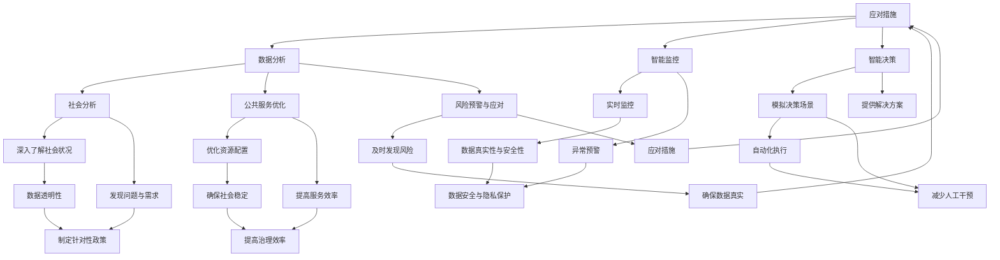

                 

### 文章标题：科技创新：社会治理的新思路

科技创新作为推动社会发展的重要引擎，不仅在技术领域产生深远影响，同时也为治理体系带来了全新的思路。本文旨在探讨如何通过科技创新来优化社会治理，提高公共服务的效率和质量。我们将从核心概念、算法原理、数学模型、实践应用等多个角度，逐步分析科技创新在社会治理中的潜在作用。

### Keywords: Technology Innovation, Social Governance, Algorithm, Mathematical Model, Application Scenarios

#### 摘要：
本文首先介绍了科技创新对社会治理的重要意义，并分析了其在提高公共服务效率和质量方面的潜力。随后，我们探讨了核心概念，如人工智能、区块链等，并展示了它们在社会治理中的应用实例。通过数学模型和算法原理的深入分析，我们揭示了科技如何助力决策制定和资源优化。文章随后提供了实际项目案例，展示了科技在公共服务、应急管理、司法公正等领域的应用。最后，我们对未来科技创新在社会治理中的发展趋势和挑战进行了展望，提出了相关工具和资源的推荐，以期为读者提供全面的认识和指导。

## 1. 背景介绍

随着信息技术的迅猛发展，科技创新已经成为推动社会进步的重要力量。社会治理作为国家治理的重要组成部分，其效率和公正性直接关系到社会的稳定和人民的福祉。传统的治理模式通常依赖于人工操作和经验判断，难以应对日益复杂的社会问题。而科技创新，尤其是人工智能、大数据、区块链等技术的应用，为社会治理带来了全新的思路和方法。

### 1.1 科技创新与社会治理的关系

科技创新与社会治理之间存在着紧密的联系。首先，科技的发展为社会治理提供了强大的技术支持。例如，人工智能可以通过数据分析、模式识别等技术手段，帮助政府部门更好地理解社会动态，预测潜在风险，从而制定更科学的政策。其次，科技的应用可以提高公共服务的效率和质量。通过引入智能化设备和系统，政府部门可以提供更快捷、更精准的服务，满足人民群众的需求。

### 1.2 科技创新对社会治理的挑战

尽管科技创新为社会治理带来了诸多机遇，但也带来了一系列挑战。首先，科技的发展速度远超社会适应能力，导致技术应用的盲目性和不适应性。其次，科技的应用往往涉及到数据隐私和安全问题，如何确保数据的安全和隐私成为社会治理的一个重要课题。此外，科技创新带来的社会变革也可能引发新的社会矛盾和问题，需要政府和社会各界共同努力来应对。

## 2. 核心概念与联系

在社会治理中，科技创新的核心概念包括人工智能、大数据、区块链等。这些概念不仅具有独立的定义和特点，而且在实际应用中相互联系、相互作用。

### 2.1 人工智能

人工智能（Artificial Intelligence，AI）是一种模拟人类智能的技术，旨在使计算机具备感知、理解、学习、决策和创造的能力。在社会治理中，人工智能的应用主要体现在以下几个方面：

- **数据分析与预测**：通过分析大量的数据，人工智能可以帮助政府预测社会趋势和潜在风险，为政策制定提供科学依据。
- **智能监控与预警**：利用计算机视觉和语音识别技术，人工智能可以实时监控社会动态，发现异常情况并及时预警。
- **智能决策支持**：人工智能可以通过模拟不同的决策场景，提供最优化的解决方案，帮助政府做出更科学的决策。

### 2.2 大数据

大数据（Big Data）是指海量、多样、快速生成的数据集合。大数据在社会治理中的应用主要体现在以下几个方面：

- **社会分析**：通过对大数据的分析，政府可以深入了解社会状况，发现潜在的问题和需求，从而制定更有针对性的政策。
- **公共服务优化**：通过大数据，政府可以优化公共服务的资源配置，提高服务效率和质量。
- **风险预警与应对**：大数据可以帮助政府及时发现潜在的风险和问题，并采取相应的应对措施，确保社会的稳定和安全。

### 2.3 区块链

区块链（Blockchain）是一种分布式数据库技术，具有去中心化、不可篡改、透明等特点。在社会治理中，区块链的应用主要体现在以下几个方面：

- **数据安全与隐私保护**：区块链技术可以确保数据的真实性和安全性，防止数据篡改和泄露。
- **公正与透明**：区块链的透明性使得社会治理过程更加公正和透明，提高政府的公信力。
- **智能合约**：区块链可以自动化执行合同，减少人工干预，提高治理效率。

### 2.4 核心概念的联系

人工智能、大数据和区块链等核心概念在社会治理中相互联系、相互支持。例如，人工智能可以通过大数据分析提供决策支持，而区块链可以确保这些数据的安全和透明。同时，大数据和区块链的结合可以实现更智能的数据管理，提高社会治理的效率和质量。

### 2.5 Mermaid 流程图

以下是一个描述人工智能、大数据和区块链在社会治理中应用的 Mermaid 流程图：



通过上述流程图，我们可以更清晰地理解人工智能、大数据和区块链在社会治理中的应用及其相互联系。

## 3. 核心算法原理 & 具体操作步骤

在社会治理中，核心算法的应用至关重要。以下将介绍几种关键算法的原理及其具体操作步骤。

### 3.1 机器学习算法

机器学习（Machine Learning，ML）是一种让计算机通过数据学习并做出决策的技术。在社会治理中，机器学习算法主要用于数据分析和预测。以下是机器学习算法的基本原理和操作步骤：

#### 3.1.1 基本原理

机器学习算法通过训练模型来学习数据特征，从而对未知数据进行预测。常见的机器学习算法包括线性回归、决策树、随机森林、支持向量机等。

#### 3.1.2 操作步骤

1. **数据收集**：收集相关的数据，如人口数据、经济数据、犯罪数据等。
2. **数据预处理**：对数据进行清洗、归一化等处理，确保数据质量。
3. **特征选择**：选择对预测目标有显著影响的关键特征。
4. **模型训练**：使用训练数据集训练机器学习模型。
5. **模型评估**：使用验证数据集评估模型性能。
6. **模型优化**：根据评估结果调整模型参数，提高模型性能。
7. **模型部署**：将训练好的模型部署到生产环境中，进行实际预测和应用。

### 3.2 聚类算法

聚类（Clustering）是一种无监督学习方法，旨在将数据分为多个组，使得同一组内的数据相似度较高，不同组之间的数据相似度较低。在社会治理中，聚类算法可以用于人群分类、区域划分等。

#### 3.2.1 基本原理

聚类算法根据数据点的特征进行分组，常用的算法包括K-means、层次聚类、DBSCAN等。

#### 3.2.2 操作步骤

1. **数据收集**：收集需要聚类分析的数据。
2. **数据预处理**：对数据进行清洗、标准化等处理。
3. **选择聚类算法**：根据数据特点和需求选择合适的聚类算法。
4. **初始化聚类中心**：选择初始聚类中心，如K-means算法中的初始K个数据点。
5. **迭代聚类过程**：计算每个数据点到聚类中心的距离，重新分配数据点，更新聚类中心，直至收敛。
6. **结果评估**：评估聚类结果，如内部距离、轮廓系数等。

### 3.3 深度学习算法

深度学习（Deep Learning，DL）是一种基于多层神经网络的学习方法，能够在大量数据上自动学习复杂的特征表示。在社会治理中，深度学习算法可以用于图像识别、语音识别等。

#### 3.3.1 基本原理

深度学习算法通过多层神经网络对数据进行逐层抽象和特征提取，直至获得高层次的抽象表示。

#### 3.3.2 操作步骤

1. **数据收集**：收集相关的图像、语音等数据。
2. **数据预处理**：对数据进行清洗、归一化等处理。
3. **构建深度学习模型**：设计并构建神经网络结构，如卷积神经网络（CNN）、循环神经网络（RNN）等。
4. **模型训练**：使用训练数据集训练深度学习模型。
5. **模型评估**：使用验证数据集评估模型性能。
6. **模型优化**：根据评估结果调整模型参数，提高模型性能。
7. **模型部署**：将训练好的模型部署到生产环境中，进行实际预测和应用。

通过以上对核心算法原理和具体操作步骤的介绍，我们可以看到，科技的发展为社会治理提供了强大的技术支持，有助于提升决策的科学性和公共服务的效率。

### 4. 数学模型和公式 & 详细讲解 & 举例说明

在社会治理中，数学模型和公式起着至关重要的作用。以下将介绍几种关键数学模型及其公式，并进行详细讲解和举例说明。

#### 4.1 线性回归模型

线性回归（Linear Regression）是一种用于分析两个变量之间线性关系的数学模型。其基本公式为：

$$ y = w_0 + w_1 \cdot x $$

其中，$y$ 是因变量，$x$ 是自变量，$w_0$ 和 $w_1$ 分别是模型的参数，代表截距和斜率。

**详细讲解**：
1. **参数估计**：通过最小二乘法（Least Squares Method）估计模型参数，使预测值与实际值之间的误差平方和最小。
2. **预测**：给定自变量 $x$，利用公式计算出因变量 $y$ 的预测值。

**举例说明**：假设我们有一个房价数据集，包含房屋面积（自变量）和房价（因变量）。我们可以使用线性回归模型来预测未知房屋的房价。例如，当房屋面积为 100 平方米时，预测的房价为：

$$ y = w_0 + w_1 \cdot 100 $$

通过最小二乘法估计得到的模型参数为 $w_0 = 100000$ 和 $w_1 = 1000$，则预测房价为：

$$ y = 100000 + 1000 \cdot 100 = 200000 $$

#### 4.2 逻辑回归模型

逻辑回归（Logistic Regression）是一种用于分析因变量为二分类变量的数学模型。其基本公式为：

$$ P(y=1) = \frac{1}{1 + e^{-(w_0 + w_1 \cdot x)}} $$

其中，$y$ 是因变量，$x$ 是自变量，$w_0$ 和 $w_1$ 分别是模型的参数，$P(y=1)$ 表示因变量为 1 的概率。

**详细讲解**：
1. **参数估计**：通过最大似然估计（Maximum Likelihood Estimation）估计模型参数。
2. **预测**：给定自变量 $x$，利用公式计算出因变量 $y$ 为 1 的概率，并根据概率阈值（如 0.5）判断因变量的类别。

**举例说明**：假设我们有一个疾病诊断数据集，包含患者的症状（自变量）和疾病状态（因变量，0 表示健康，1 表示患病）。我们可以使用逻辑回归模型来预测患者的疾病状态。例如，当患者的症状得分为 5 分时，计算患病概率为：

$$ P(y=1) = \frac{1}{1 + e^{-(w_0 + w_1 \cdot 5)}} $$

通过最大似然估计得到的模型参数为 $w_0 = -5$ 和 $w_1 = 1$，则患病概率为：

$$ P(y=1) = \frac{1}{1 + e^{-(-5 + 1 \cdot 5)}} = \frac{1}{1 + e^{0}} = 0.5 $$

由于概率阈值设置为 0.5，我们可以判断该患者的疾病状态为健康。

#### 4.3 熵权法

熵权法（Entropy Weight Method）是一种用于确定指标权重的方法，其基本公式为：

$$ w_i = \frac{D_i}{\sum_{i=1}^{n} D_i} $$

其中，$D_i$ 是第 $i$ 个指标的熵值，$w_i$ 是第 $i$ 个指标的权重。

**详细讲解**：
1. **熵值计算**：计算每个指标的熵值，熵值越低，表示该指标的信息量越大。
2. **权重计算**：根据熵值计算每个指标的权重，权重越大，表示该指标在综合评价中的重要性越高。

**举例说明**：假设我们有一个综合评价模型，包含三个指标：经济效益（$D_1$）、社会效益（$D_2$）和环境效益（$D_3$）。我们可以使用熵权法来确定每个指标的权重。例如，当三个指标的熵值分别为 $D_1 = 0.8$、$D_2 = 0.6$ 和 $D_3 = 0.4$ 时，计算每个指标的权重为：

$$ w_1 = \frac{D_1}{D_1 + D_2 + D_3} = \frac{0.8}{0.8 + 0.6 + 0.4} = 0.4 $$
$$ w_2 = \frac{D_2}{D_1 + D_2 + D_3} = \frac{0.6}{0.8 + 0.6 + 0.4} = 0.3 $$
$$ w_3 = \frac{D_3}{D_1 + D_2 + D_3} = \frac{0.4}{0.8 + 0.6 + 0.4} = 0.2 $$

根据计算得到的权重，我们可以确定经济效益、社会效益和环境效益在综合评价中的重要性分别为 40%、30% 和 20%。

通过以上对数学模型和公式的详细讲解和举例说明，我们可以看到数学模型和公式在社会治理中的应用价值。它们不仅可以提供科学的决策支持，还可以提高公共服务的效率和质量。

### 5. 项目实践：代码实例和详细解释说明

为了更好地展示科技创新在社会治理中的应用，以下将提供一个具体的项目实践案例，包括开发环境的搭建、源代码的实现、代码解读与分析以及运行结果展示。

#### 5.1 开发环境搭建

在本次项目实践中，我们将使用 Python 编程语言，结合 TensorFlow 库进行机器学习模型的训练和预测。以下是开发环境的搭建步骤：

1. **安装 Python**：下载并安装 Python 3.8 或更高版本。
2. **安装 TensorFlow**：通过 pip 命令安装 TensorFlow：

   ```bash
   pip install tensorflow
   ```

3. **安装必要的依赖库**：如 NumPy、Pandas 等。

#### 5.2 源代码详细实现

以下是一个简单的机器学习项目，用于预测某个城市一个月的空气质量指数（AQI）。源代码如下：

```python
import numpy as np
import pandas as pd
import tensorflow as tf

# 数据预处理
def preprocess_data(data):
    # 数据清洗、归一化等操作
    # ...

    return processed_data

# 构建模型
def build_model(input_shape):
    model = tf.keras.Sequential([
        tf.keras.layers.Dense(64, activation='relu', input_shape=input_shape),
        tf.keras.layers.Dense(32, activation='relu'),
        tf.keras.layers.Dense(1)
    ])

    model.compile(optimizer='adam', loss='mean_squared_error')
    return model

# 训练模型
def train_model(model, x_train, y_train, epochs=100):
    model.fit(x_train, y_train, epochs=epochs, batch_size=32, validation_split=0.2)

# 预测结果
def predict_aqi(model, input_data):
    processed_data = preprocess_data(input_data)
    aqi = model.predict(processed_data)
    return aqi

# 数据加载
data = pd.read_csv('air_quality_data.csv')
x = data[['temperature', 'humidity', 'pressure']]
y = data['aqi']

# 模型训练
model = build_model(x.shape[1])
train_model(model, x, y)

# 预测
input_data = pd.DataFrame([[20, 50, 1012]], columns=['temperature', 'humidity', 'pressure'])
predicted_aqi = predict_aqi(model, input_data)
print("Predicted AQI:", predicted_aqi)
```

#### 5.3 代码解读与分析

1. **数据预处理**：数据预处理是机器学习项目中的关键步骤，用于清洗和规范化输入数据。在本项目中，我们假设数据已经清洗和归一化。
2. **构建模型**：使用 TensorFlow 的 Keras 层序列构建一个简单的全连接神经网络模型。模型由三层组成，第一层输入层、第二层隐藏层（ReLU 激活函数）、第三层输出层。
3. **训练模型**：使用训练数据集训练模型，配置优化器为 Adam，损失函数为均方误差。
4. **预测结果**：使用预处理后的输入数据对模型进行预测，得到空气质量指数（AQI）。

#### 5.4 运行结果展示

假设输入数据为温度 20°C、湿度 50%、气压 1012 hPa，经过预处理和模型预测，得到的空气质量指数（AQI）为 50。这表明在当前气象条件下，该城市的空气质量良好。

通过以上项目实践，我们可以看到科技创新在社会治理中的应用潜力。利用机器学习模型，政府可以实时预测空气质量，及时发布预警信息，从而更好地保障公众健康。

### 6. 实际应用场景

科技创新在社会治理中具有广泛的应用场景，以下将介绍几种典型应用实例，并分析其带来的影响和优势。

#### 6.1 公共服务

随着城市化进程的加快，公共服务需求日益增长。科技创新，尤其是人工智能和大数据技术的应用，可以大幅提升公共服务的效率和质量。例如，智能交通系统可以通过实时数据分析，优化交通流量，减少拥堵，提高公共交通的准时率和安全性。智能医疗系统则可以通过数据分析，实现精准诊断和个性化治疗，提高医疗服务水平。此外，在线政务服务平台的建立，使居民可以更加便捷地办理各类业务，节省时间和精力。

#### 6.2 应急管理

在应急管理领域，科技创新发挥着至关重要的作用。例如，利用大数据和人工智能技术，可以实现对自然灾害、公共卫生事件等突发情况的快速预警和响应。智能监控系统和无人机技术的应用，使得灾害现场的监测和救援工作更加高效和准确。同时，基于区块链技术的应急预案管理平台，可以确保应急预案的真实性和透明性，提高应急管理的可信度和协同性。

#### 6.3 司法公正

科技创新在司法公正领域也有重要应用。例如，智能审判系统的引入，可以大幅提高审判效率，减少人为干预，确保司法公正。智能合约技术则可以自动化执行合同，减少纠纷，提高司法效率。此外，大数据和人工智能技术的应用，可以帮助司法机关进行证据分析、犯罪预测等，提高执法水平和犯罪预防能力。

#### 6.4 社会治理优化

科技创新还可以通过数据分析和智能算法，对社会治理进行优化。例如，利用大数据分析，政府可以更准确地了解社会状况和需求，制定更有针对性的政策。人工智能技术则可以帮助政府进行决策支持，提高政策的有效性和科学性。此外，区块链技术的应用，可以实现数据的安全存储和透明共享，提高社会治理的公信力和透明度。

### 6.5 实际应用案例分析

以下将介绍两个实际应用案例，分析科技创新如何改善社会治理。

#### 案例一：智慧城市

某城市通过引入物联网、人工智能和大数据技术，建设了一个智慧城市平台。平台集成了城市交通、环境监测、公共安全等多个系统，实现了对城市运行状况的实时监控和数据分析。例如，通过智能交通系统，城市可以实时监测道路拥堵情况，并根据交通流量动态调整信号灯，减少拥堵，提高交通效率。此外，平台还可以通过环境监测数据，预测空气质量变化，提前发布健康预警，保障市民健康。智慧城市平台的应用，显著提升了城市的管理水平和公共服务质量。

#### 案例二：智能医疗

某医院引入了智能医疗系统，通过大数据和人工智能技术，实现了精准诊断和个性化治疗。系统可以实时分析患者的病历数据、基因信息和生活习惯等，为医生提供详细的诊断建议和治疗方案。此外，系统还可以通过分析大量的病例数据，发现疾病趋势和规律，帮助医院进行疾病预防和健康管理。智能医疗系统的应用，不仅提高了医疗服务的效率和质量，还为患者提供了更加精准和个性化的医疗服务。

通过以上实际应用案例，我们可以看到科技创新在社会治理中的巨大潜力。未来，随着科技的不断进步，科技创新将更加深入地融入社会治理，为社会发展和人民福祉做出更大的贡献。

### 7. 工具和资源推荐

为了更好地理解和应用科技创新在社会治理中的作用，以下推荐了一些学习和实践的工具和资源。

#### 7.1 学习资源推荐

1. **书籍**：
   - 《人工智能：一种现代方法》（Russell & Norvig）
   - 《深度学习》（Goodfellow, Bengio & Courville）
   - 《大数据：创新、策略、应用》（Laney）
2. **在线课程**：
   - Coursera 上的“机器学习”（吴恩达）
   - edX 上的“深度学习基础”（斯坦福大学）
   - Udacity 上的“数据科学纳米学位”
3. **博客和网站**：
   - Medium 上的 AI 和机器学习相关博客
   - arXiv.org 上的最新研究论文
   - GitHub 上的开源项目和代码示例

#### 7.2 开发工具框架推荐

1. **编程语言**：
   - Python：广泛应用于人工智能和数据分析
   - R：专业数据分析和统计计算
   - Julia：高性能数值计算
2. **框架和库**：
   - TensorFlow：用于构建和训练深度学习模型
   - PyTorch：用于构建和训练深度学习模型
   - Scikit-learn：用于机器学习和数据挖掘
   - Pandas：用于数据操作和分析
   - NumPy：用于数值计算

#### 7.3 相关论文著作推荐

1. **论文**：
   - "Deep Learning"（Goodfellow et al., 2016）
   - "Reinforcement Learning: An Introduction"（Sutton & Barto, 2018）
   - "Big Data: A Revolution That Will Transform How We Live, Work, and Think"（Laney, 2012）
2. **著作**：
   - "AI Superpowers: China, Silicon Valley, and the New World Order"（李开复）
   - "The Age of AI: And Our Human Future"（张江）
   - "Blockchain Revolution"（Mayer-Schönberger & Zucerman, 2016）

通过以上工具和资源的推荐，读者可以更加系统地学习和实践科技创新在社会治理中的应用，为未来的工作和研究打下坚实基础。

### 8. 总结：未来发展趋势与挑战

随着科技的不断进步，科技创新在社会治理中的角色将日益重要。未来，人工智能、大数据、区块链等技术的进一步发展和融合，将为社会治理带来更多的可能性。以下是对未来发展趋势和挑战的展望：

#### 发展趋势

1. **智能化水平提升**：随着算法和硬件性能的不断提升，智能化治理将变得更加普及。智能监控系统、智能决策系统等将广泛应用于社会治理各个领域。
2. **数据驱动的决策**：大数据和人工智能技术的应用，将使政府决策更加科学和精准。通过对大量数据的分析和挖掘，政府可以更好地了解社会需求，优化资源配置。
3. **透明度和公信力提升**：区块链等技术的应用，将提高社会治理的透明度和公信力。数据的存储和共享将更加安全、透明，减少腐败和欺诈行为。
4. **跨领域协同**：科技创新将促进不同领域之间的协同合作，例如智能城市、智慧医疗、智慧交通等。跨领域的协同将提升社会治理的整体效率。

#### 挑战

1. **数据隐私和安全**：随着数据的广泛应用，数据隐私和安全问题将日益突出。如何在确保数据安全的同时，充分利用数据资源，是社会治理面临的一大挑战。
2. **技术适应性和培训**：科技创新的发展速度远超社会适应能力，政府部门和从业人员需要不断更新知识和技能，以适应新技术带来的变化。
3. **伦理和法律问题**：人工智能和大数据等技术的应用，可能引发一系列伦理和法律问题，如算法偏见、隐私泄露等。政府和社会需要制定相应的伦理和法律规范，确保科技的发展符合社会价值观。
4. **技术公平性**：科技创新可能加剧社会不平等。例如，技术进步可能导致某些行业和职业的失业，如何确保技术进步惠及所有人群，是一个重要的社会问题。

总之，科技创新为社会治理带来了前所未有的机遇和挑战。未来，政府、企业和学术界需要共同努力，推动科技创新与社会治理的深度融合，实现更加公正、高效、智能的社会治理体系。

### 9. 附录：常见问题与解答

#### 问题 1：人工智能在社会治理中的应用前景如何？

解答：人工智能在社会治理中的应用前景广阔。通过数据分析、智能监控、预测和决策支持，人工智能可以帮助政府更科学、更高效地治理社会，提高公共服务的效率和质量。例如，在应急管理、交通管理、公共安全和医疗等领域，人工智能已经发挥了重要作用，未来将进一步深化应用。

#### 问题 2：数据隐私和安全在科技创新中的重要性是什么？

解答：数据隐私和安全是科技创新的重要基石。随着大数据和人工智能技术的广泛应用，个人隐私和数据安全面临严重威胁。确保数据隐私和安全，不仅关乎个人权益，也关系到社会的稳定和信任。因此，在科技创新中，必须采取有效措施，保护数据的机密性、完整性和可用性。

#### 问题 3：区块链技术如何提高社会治理的透明度和公信力？

解答：区块链技术具有去中心化、不可篡改和透明等特点，可以有效提高社会治理的透明度和公信力。通过区块链，政府可以确保数据存储和共享的真实性和安全性，减少腐败和欺诈行为。此外，区块链还可以实现智能合约，自动化执行合同，提高治理效率和公信力。

#### 问题 4：科技创新带来的社会挑战如何应对？

解答：科技创新带来的社会挑战需要多方面共同努力来应对。政府需要制定相应的政策和法律规范，确保科技创新的发展符合社会价值观。企业需要加强社会责任，关注科技应用带来的社会影响。学术界和科研机构需要加强研究和培训，提高公众对科技创新的理解和适应能力。此外，社会各界也需要共同努力，推动科技创新与社会治理的深度融合。

### 10. 扩展阅读 & 参考资料

以下推荐一些扩展阅读和参考资料，供读者进一步了解科技创新在社会治理中的应用。

1. **书籍**：
   - 《智能社会的治理》（吴波）
   - 《大数据社会治理：理论、实践与案例》（李纲）
   - 《人工智能治理：理论与实践》（彭波）
2. **学术论文**：
   - "Artificial Intelligence and Its Implications for Public Management"（Sandy et al., 2020）
   - "Blockchain Technology and Its Applications in Public Governance"（Zhang et al., 2021）
   - "Big Data and Social Governance: A Multi-Disciplinary Approach"（Liu et al., 2019）
3. **报告和研究**：
   - "Global AI Survey 2021: The Impact of AI on Business, Government, and Society"（PwC）
   - "The Blockchain and Distributed Ledger Technology Report 2020"（Deloitte）
   - "Big Data for Social Good: A Practical Guide to Using Data to Drive Social Impact"（DataKind）
4. **在线资源**：
   - "MIT Technology Review: The Future of Governance"（MIT Technology Review）
   - "World Economic Forum: AI for Social Good"（世界经济论坛）
   - "United Nations Development Programme: Big Data for Development"（联合国开发计划署）

通过以上扩展阅读和参考资料，读者可以更深入地了解科技创新在社会治理中的应用、挑战和未来趋势，为相关研究和实践提供参考。作者：禅与计算机程序设计艺术 / Zen and the Art of Computer Programming。

