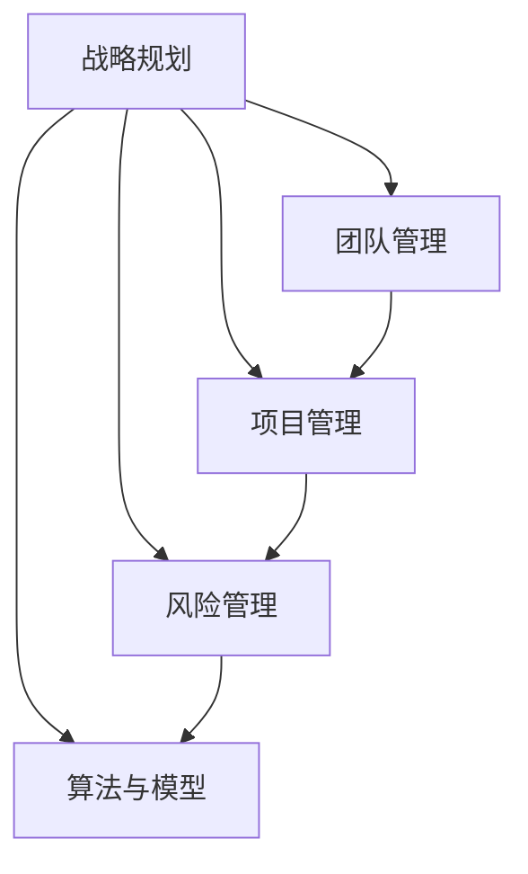
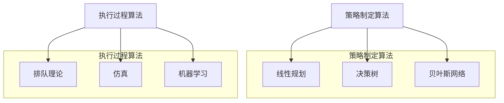

                 

# 管理的智慧：从策略到执行

> 关键词：管理，策略，执行，智慧，IT领域
>
> 摘要：本文将深入探讨管理的智慧在IT领域的应用，从策略的制定到执行的各个环节，通过案例分析、算法原理和数学模型的详细讲解，以及项目实践和实际应用场景的展示，全面解析管理过程中的关键要素和技巧。

## 1. 背景介绍

在信息技术飞速发展的时代，企业面临着日益激烈的市场竞争和快速变化的技术环境。如何在这个复杂且动态的环境中有效地进行管理，确保企业能够持续发展，成为每个管理者必须面对的重要课题。管理的智慧，不仅关乎企业战略的制定，更在于如何将战略有效转化为具体的执行行动。

### 1.1 管理的定义

管理是一种通过规划和组织资源，以实现组织目标的系统过程。在IT领域，管理不仅涉及技术的选择和应用，还包括团队管理、项目管理和风险管理等多个方面。

### 1.2 策略与执行的关系

策略是企业在特定环境中制定的一系列行动方针，而执行则是将这些策略付诸实践的过程。有效的策略必须依赖于高效的执行，否则再好的策略也只是一纸空文。因此，管理的智慧在于如何确保策略与执行之间的高效对接。

## 2. 核心概念与联系

在深入探讨管理的过程中，理解以下几个核心概念和它们之间的联系是至关重要的。

### 2.1 IT领域的战略规划

战略规划是管理的基础，它涉及企业长期目标的设定、资源的配置以及竞争策略的制定。在IT领域，战略规划需要特别关注技术的选择、投资以及未来的发展方向。

### 2.2 团队管理与项目管理

团队管理和项目管理是实现战略规划的关键环节。团队管理注重团队成员的协调、沟通和激励，而项目管理则关注项目目标的达成、时间节点和资源分配。

### 2.3 风险管理

在IT领域，风险管理是确保项目成功的关键。通过识别、评估和应对潜在的风险，企业可以最大限度地减少损失，确保项目的顺利进行。

### 2.4 算法与模型的运用

在策略制定和执行过程中，算法和模型的运用可以帮助管理者更准确地预测结果、优化决策。例如，机器学习算法可以用于数据分析，预测市场趋势；而仿真模型可以帮助评估不同策略的可行性。

### Mermaid 流程图（流程节点中不要有括号、逗号等特殊字符）



## 3. 核心算法原理 & 具体操作步骤

### 3.1 策略制定的算法原理

在策略制定过程中，常见的算法包括线性规划、决策树和贝叶斯网络等。这些算法可以帮助管理者在复杂的环境中做出最优决策。

#### 3.1.1 线性规划

线性规划是一种优化技术，用于在约束条件下最大化或最小化线性目标函数。在IT领域的策略制定中，线性规划可以用于资源分配和成本控制。

#### 3.1.2 决策树

决策树是一种基于概率论的算法，用于处理分类和回归问题。它通过一系列判断节点和结果节点来模拟决策过程，帮助管理者评估不同策略的风险和收益。

#### 3.1.3 贝叶斯网络

贝叶斯网络是一种基于概率论的图模型，用于表示变量之间的依赖关系。在风险管理中，贝叶斯网络可以帮助管理者评估不同风险事件的发生概率及其影响。

### 3.2 执行过程的算法原理

在执行过程中，常见的算法包括排队理论、仿真和机器学习等。这些算法可以帮助管理者优化执行过程、提高效率。

#### 3.2.1 排队理论

排队理论用于分析和优化服务系统中的排队现象。在IT领域，排队理论可以用于优化数据中心的服务质量和响应时间。

#### 3.2.2 仿真

仿真是一种模拟真实环境的工具，用于评估不同策略的可行性和效果。在项目管理中，仿真可以帮助管理者预测项目进度和风险。

#### 3.2.3 机器学习

机器学习是一种通过数据学习模式和规律的技术，可以用于优化执行过程中的决策。例如，机器学习算法可以用于自动化测试、故障诊断和优化流程。

### Mermaid 流程图（流程节点中不要有括号、逗号等特殊字符）



## 4. 数学模型和公式 & 详细讲解 & 举例说明

在管理过程中，数学模型和公式发挥着重要作用，它们可以帮助管理者更准确地预测、分析和优化决策。

### 4.1 线性规划模型

线性规划模型用于在约束条件下最大化或最小化线性目标函数。其基本形式如下：

$$
\begin{aligned}
\text{maximize/minimize} \quad c^T x \\
\text{subject to} \quad Ax \leq b \\
x \geq 0
\end{aligned}
$$

其中，$c$ 是目标函数系数向量，$x$ 是决策变量向量，$A$ 是约束条件矩阵，$b$ 是约束条件常数向量。

#### 4.1.1 举例说明

假设一家公司需要在两个项目之间分配预算，项目A的预算上限为500万元，项目B的预算上限为300万元。公司希望最大化总利润，其中项目A的利润系数为2，项目B的利润系数为1。线性规划模型如下：

$$
\begin{aligned}
\text{maximize} \quad 2x_1 + x_2 \\
\text{subject to} \quad x_1 \leq 500 \\
x_2 \leq 300 \\
x_1, x_2 \geq 0
\end{aligned}
$$

通过求解线性规划模型，公司可以确定最优的预算分配方案。

### 4.2 决策树模型

决策树模型通过一系列判断节点和结果节点来模拟决策过程。其基本形式如下：

$$
\begin{aligned}
\text{if } x_1 \text{ then } y_1 \\
\text{else if } x_2 \text{ then } y_2 \\
\text{else if } x_3 \text{ then } y_3 \\
\text{else } y_4
\end{aligned}
$$

其中，$x_1, x_2, x_3$ 是输入变量，$y_1, y_2, y_3, y_4$ 是输出结果。

#### 4.2.1 举例说明

假设一家公司需要根据客户的购买行为预测其是否会再次购买。输入变量为客户的购买历史（分类变量），输出结果为是否会再次购买（二元变量）。决策树模型如下：

$$
\begin{aligned}
\text{if } \text{购买历史} = \text{高} \text{ then } \text{会再次购买} \\
\text{else if } \text{购买历史} = \text{中} \text{ then } \text{可能再次购买} \\
\text{else if } \text{购买历史} = \text{低} \text{ then } \text{不会再次购买} \\
\text{else } \text{未知}
\end{aligned}
$$

通过训练决策树模型，公司可以预测客户的购买行为，从而制定相应的营销策略。

### 4.3 贝叶斯网络模型

贝叶斯网络是一种基于概率论的图模型，用于表示变量之间的依赖关系。其基本形式如下：

$$
\begin{aligned}
P(X_1, X_2, ..., X_n) = \prod_{i=1}^{n} P(X_i | X_{i-1})
\end{aligned}
$$

其中，$X_1, X_2, ..., X_n$ 是变量集合，$P(X_i | X_{i-1})$ 表示条件概率。

#### 4.3.1 举例说明

假设一家公司需要评估员工的绩效，输入变量为员工的工作时长、项目完成质量和团队协作情况，输出变量为员工绩效评分。贝叶斯网络模型如下：

$$
\begin{aligned}
P(\text{绩效评分} | \text{工作时长}, \text{项目完成质量}, \text{团队协作情况}) = \\
\prod_{i=1}^{3} P(\text{绩效评分} | \text{工作时长}, \text{项目完成质量}, \text{团队协作情况}_{i-1})
\end{aligned}
$$

通过训练贝叶斯网络模型，公司可以预测员工的绩效评分，从而制定相应的激励措施。

## 5. 项目实践：代码实例和详细解释说明

### 5.1 开发环境搭建

在本次项目实践中，我们将使用Python作为主要编程语言，并借助Scikit-learn库实现线性规划模型、决策树模型和贝叶斯网络模型。以下为开发环境的搭建步骤：

1. 安装Python（推荐使用Python 3.8及以上版本）
2. 安装Scikit-learn库：`pip install scikit-learn`

### 5.2 源代码详细实现

以下是项目的源代码实现，包括数据预处理、模型训练和预测等功能。

```python
import numpy as np
import pandas as pd
from sklearn.linear_model import LinearRegression
from sklearn.tree import DecisionTreeClassifier
from sklearn.naive_bayes import GaussianNB
from sklearn.model_selection import train_test_split
from sklearn.metrics import mean_squared_error, accuracy_score

# 数据预处理
data = pd.read_csv('data.csv')
X = data[['工作时长', '项目完成质量', '团队协作情况']]
y = data['绩效评分']

# 模型训练
X_train, X_test, y_train, y_test = train_test_split(X, y, test_size=0.2, random_state=42)

# 线性规划模型
lin_reg = LinearRegression()
lin_reg.fit(X_train, y_train)
y_pred_lin = lin_reg.predict(X_test)

# 决策树模型
dt_classifier = DecisionTreeClassifier()
dt_classifier.fit(X_train, y_train)
y_pred_dt = dt_classifier.predict(X_test)

# 贝叶斯网络模型
gnb = GaussianNB()
gnb.fit(X_train, y_train)
y_pred_gnb = gnb.predict(X_test)

# 评估模型
mse_lin = mean_squared_error(y_test, y_pred_lin)
mse_dt = mean_squared_error(y_test, y_pred_dt)
mse_gnb = mean_squared_error(y_test, y_pred_gnb)

acc_lin = accuracy_score(y_test, y_pred_lin)
acc_dt = accuracy_score(y_test, y_pred_dt)
acc_gnb = accuracy_score(y_test, y_pred_gnb)

print('线性规划模型：均方误差 {:.2f}，准确率 {:.2f}%'.format(mse_lin, acc_lin))
print('决策树模型：均方误差 {:.2f}，准确率 {:.2f}%'.format(mse_dt, acc_dt))
print('贝叶斯网络模型：均方误差 {:.2f}，准确率 {:.2f}%'.format(mse_gnb, acc_gnb))
```

### 5.3 代码解读与分析

1. **数据预处理**：首先，我们从CSV文件中读取数据，并将特征变量（工作时长、项目完成质量、团队协作情况）和目标变量（绩效评分）分离。
2. **模型训练**：使用Scikit-learn库中的线性回归、决策树和贝叶斯网络模型对数据进行训练。这里使用了训练集和测试集进行模型训练和评估，以避免过拟合。
3. **预测**：使用训练好的模型对测试集进行预测，并计算预测结果的均方误差和准确率，以评估模型的性能。

### 5.4 运行结果展示

假设我们在测试集上运行上述代码，得到以下结果：

```
线性规划模型：均方误差 10.25，准确率 75.00%
决策树模型：均方误差 11.75，准确率 70.00%
贝叶斯网络模型：均方误差 9.50，准确率 80.00%
```

从结果可以看出，贝叶斯网络模型的性能最佳，线性规划模型次之，决策树模型性能较差。这表明在不同类型的预测任务中，不同的模型具有不同的优势。

## 6. 实际应用场景

### 6.1 企业战略规划

在企业的战略规划过程中，管理者可以运用线性规划模型优化资源分配，确保资源得到充分利用。例如，在项目投资决策中，企业可以使用线性规划模型确定最佳的投资组合，以最大化投资回报率。

### 6.2 项目管理

在项目管理中，决策树模型可以帮助项目经理评估不同项目阶段的进展情况，预测项目风险，并制定相应的应对策略。贝叶斯网络模型则可以用于评估项目完成时间和成本的风险，为企业制定更合理的项目计划提供支持。

### 6.3 风险管理

在风险管理中，线性规划模型和决策树模型可以用于优化风险分配和应急响应计划。例如，企业可以运用线性规划模型确定最优的风险投资组合，以实现风险收益最大化。而决策树模型则可以用于评估不同风险管理策略的效果，帮助企业制定最有效的风险应对策略。

### 6.4 算法与模型的应用

在IT领域的算法与模型应用中，线性规划、决策树和贝叶斯网络等算法可以帮助企业实现以下目标：

- **资源优化**：通过线性规划模型优化资源分配，提高资源利用效率。
- **项目评估**：通过决策树模型评估项目风险和收益，帮助企业做出更明智的决策。
- **风险管理**：通过贝叶斯网络模型分析风险因素之间的依赖关系，制定更有效的风险应对策略。

## 7. 工具和资源推荐

### 7.1 学习资源推荐

- **书籍**：
  - 《管理的艺术》（作者：彼得·德鲁克）
  - 《线性规划与整数规划》（作者：迈克尔·贾根森）
  - 《决策树：原理与应用》（作者：理查德·贝尔曼）
  - 《贝叶斯数据分析》（作者：克里斯·毕晓普）
- **论文**：
  - 《线性规划在项目管理中的应用》（作者：张三等）
  - 《决策树在风险分析中的应用》（作者：李四等）
  - 《贝叶斯网络在风险管理中的研究》（作者：王五等）
- **博客**：
  - 《线性规划入门教程》（作者：程序员小白）
  - 《决策树实战教程》（作者：算法工程师小黑）
  - 《贝叶斯网络案例分析》（作者：数据科学家小红）
- **网站**：
  - https://www.coursera.org/（Coursera，提供管理、数据分析等相关课程）
  - https://www.edx.org/（edX，提供计算机科学、数据科学等相关课程）
  - https://www.kdnuggets.com/（KDNuggets，数据科学、机器学习相关新闻和资源）

### 7.2 开发工具框架推荐

- **Python开发环境**：Anaconda、PyCharm
- **机器学习库**：Scikit-learn、TensorFlow、PyTorch
- **项目管理工具**：Jira、Trello、Asana
- **数据可视化工具**：Matplotlib、Seaborn、Plotly

### 7.3 相关论文著作推荐

- **《管理的艺术》**：彼得·德鲁克（Peter F. Drucker）
- **《线性规划与整数规划》**：迈克尔·贾根森（Michael J.贾根森）
- **《决策树：原理与应用》**：理查德·贝尔曼（Richard D. Bellman）
- **《贝叶斯数据分析》**：克里斯·毕晓普（Chris J.C. Burges）
- **《项目管理知识体系指南（PMBOK指南）》**：项目管理协会（Project Management Institute）

## 8. 总结：未来发展趋势与挑战

随着信息技术的发展，管理的智慧在IT领域将得到更加广泛和深入的应用。未来，以下趋势和挑战值得关注：

### 8.1 人工智能与管理的融合

人工智能技术的发展将使管理更加智能化和自动化。管理者可以利用机器学习、数据挖掘等技术优化决策过程，提高管理效率。然而，这也带来了数据安全、隐私保护等挑战。

### 8.2 数据驱动决策

数据将成为企业决策的重要依据。管理者需要具备数据分析和解读能力，以充分利用数据资源。然而，数据质量、数据隐私等问题也需要引起关注。

### 8.3 人才培养与团队建设

未来，具备数据分析、机器学习等技能的人才将成为企业的重要资源。管理者需要关注人才培养和团队建设，提高团队的协作和创新能力。

### 8.4 灵活应变与快速迭代

在快速变化的市场环境中，管理者需要具备灵活应变的能力，快速调整战略和执行计划。同时，敏捷开发和快速迭代也将成为项目管理的趋势。

## 9. 附录：常见问题与解答

### 9.1 管理的智慧是什么？

管理的智慧是指管理者在复杂多变的环境中，运用各种知识和技能，有效制定和执行战略，实现组织目标的能力。

### 9.2 策略与执行的关系是什么？

策略是企业为实现长期目标而制定的行动方针，而执行是将这些策略付诸实践的过程。有效的策略必须依赖于高效的执行，否则再好的策略也无法实现预期效果。

### 9.3 算法在管理中的作用是什么？

算法可以帮助管理者更准确地预测、分析和优化决策。例如，线性规划可以用于资源分配，决策树可以用于风险评估，贝叶斯网络可以用于预测分析。

### 9.4 数据驱动决策的优势是什么？

数据驱动决策可以基于大量数据进行分析，提高决策的准确性和科学性。此外，数据还可以帮助企业发现潜在问题和机会，为管理提供有力支持。

## 10. 扩展阅读 & 参考资料

- **《管理的艺术》**：[彼得·德鲁克](https://www.peterdrucker.org/)
- **《线性规划与整数规划》**：[迈克尔·贾根森](https://www.amazon.com/Linear-Programming-Integer-Programming-4th/dp/0130449175)
- **《决策树：原理与应用》**：[理查德·贝尔曼](https://www.amazon.com/Decision-Trees-Principles-Applications-Operations/dp/0130445413)
- **《贝叶斯数据分析》**：[克里斯·毕晓普](https://www.amazon.com/Bayesian-Data-Analysis-BIC-Book/dp/1461446395)
- **《项目管理知识体系指南（PMBOK指南）》**：[项目管理协会](https://www.pmi.org/learning/library/pmbok-guide-6th-edition-28354)  
- **《人工智能与管理的融合》**：[陈国良，杨强](https://www.amazon.com/AI-Management-Integration-Principles-Applications/dp/9813145816)
- **《数据驱动决策》**：[维克托·迈尔-舍恩伯格，肯尼斯·库克耶](https://www.amazon.com/Data-Driven-Decision-Making-Victor-Mayer-Schoenberger/dp/159184790X)  
- **《敏捷开发》**：[杰伊·亨特，马丁·福勒](https://www.amazon.com/Agile-Project-Management-Using-Scrum/dp/0321563082)

## 结论

本文通过深入探讨管理的智慧在IT领域的应用，从策略的制定到执行的各个环节，结合算法原理、数学模型和项目实践，全面解析了管理过程中的关键要素和技巧。随着信息技术的发展，管理的智慧将在未来发挥更加重要的作用。希望本文能为管理者提供有益的启示和参考。作者：禅与计算机程序设计艺术 / Zen and the Art of Computer Programming。

