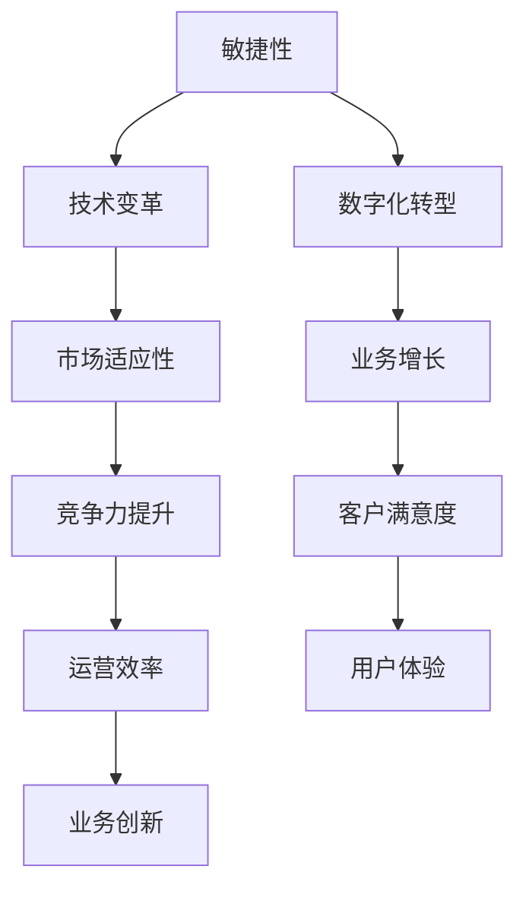
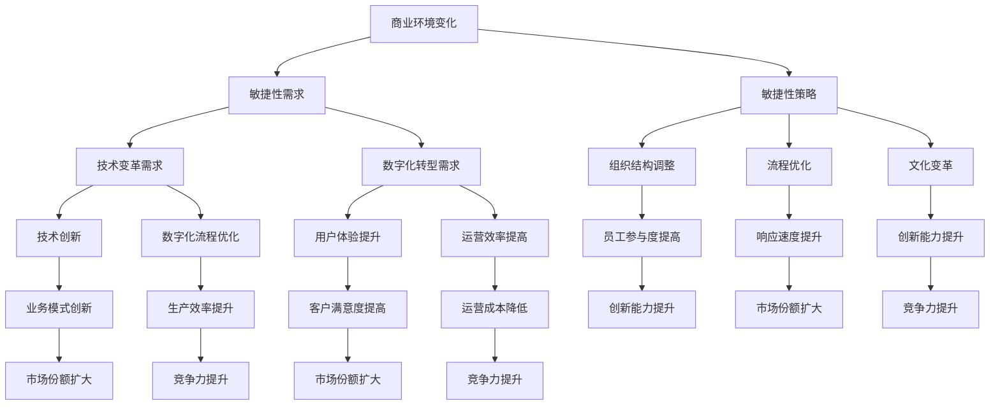

                 

### 文章标题

**管理者如何应对快速变化的商业环境**

> **关键词：** 商业环境、变化应对、管理者策略、敏捷性、技术变革、数字化转型

**摘要：** 在当今快速变化的商业环境中，管理者面临着前所未有的挑战。本文将探讨如何通过提升敏捷性、适应技术变革以及推动数字化转型来有效应对商业环境的快速变化。通过具体案例分析，我们将深入分析管理者在不同情境下应采取的策略，为实际操作提供指导和启示。

## 1. 背景介绍（Background Introduction）

在全球化、技术创新和市场竞争日益激烈的环境下，商业环境的复杂性不断升级。管理者不仅要应对内部资源的优化配置，还要对外部环境的变化保持高度的敏感性和适应性。快速变化已成为商业环境的一个显著特征，主要体现在以下几个方面：

### 1.1 市场变化

消费者需求变得更加多样化和个性化，市场竞争日益激烈。新兴市场和技术趋势不断涌现，要求企业迅速调整战略以抢占市场份额。

### 1.2 技术变革

信息技术、人工智能、物联网等技术的快速发展，为企业管理带来了新的机遇和挑战。如何利用新技术提升效率、创造竞争优势成为管理者的核心任务。

### 1.3 社会动态

全球政治、经济和社会环境的动荡，以及环境问题、劳动力市场的变化，都对企业的运营产生了深远影响。

面对这些变化，管理者需要具备前瞻性思维、快速反应能力和创新精神，以适应不断变化的商业环境。本文将从提升敏捷性、适应技术变革和推动数字化转型三个方面，探讨管理者如何应对快速变化的商业环境。

## 2. 核心概念与联系（Core Concepts and Connections）

### 2.1 敏捷性（Agility）

敏捷性是指企业在面对外部环境变化时，能够迅速做出反应、调整策略的能力。它包括组织结构、流程、文化和人员的灵活性。敏捷性不仅能够帮助企业快速适应市场变化，还能提高企业的创新能力和竞争力。

### 2.2 技术变革（Technological Transformation）

技术变革是指企业利用新技术来提升运营效率、创造新的商业模式和业务机会的过程。技术变革包括数字化转型、自动化、人工智能和大数据的应用等。管理者需要识别技术趋势，制定相应的战略，以确保企业能够抓住技术变革带来的机遇。

### 2.3 数字化转型（Digital Transformation）

数字化转型是指企业利用数字技术来重塑业务模式、流程和用户体验的过程。数字化转型不仅仅是技术的应用，更是业务战略的转型。管理者需要推动数字化转型，以实现业务增长、提升客户满意度和运营效率。

### 2.4 敏捷性与技术变革、数字化转型的关系

敏捷性、技术变革和数字化转型三者之间相互关联、相互促进。敏捷性为企业提供了快速应对变化的机制，技术变革为敏捷性提供了工具和手段，而数字化转型则为企业和市场提供了新的增长点。管理者需要综合考虑这三者，制定全面的战略，以实现企业的长期发展。

### 2.5 Mermaid 流程图（Mermaid Flowchart）



## 3. 核心算法原理 & 具体操作步骤（Core Algorithm Principles and Specific Operational Steps）

### 3.1 提升敏捷性的核心算法原理

提升敏捷性的核心在于构建一个灵活的组织架构和流程。这包括以下几个方面：

#### 3.1.1 平衡集中与分散

在保持总体战略一致性的同时，允许各个部门或团队根据市场变化和客户需求进行自主决策。这可以通过分权管理和去中心化的组织结构来实现。

#### 3.1.2 精简流程和减少审批

简化流程、减少审批环节，以提高决策速度和响应能力。通过引入敏捷开发方法，如Scrum和Kanban，可以进一步优化开发流程。

#### 3.1.3 提高员工技能和跨部门协作

投资于员工培训，提高员工的技能和知识水平，同时促进跨部门协作，以加快问题解决和决策过程。

### 3.2 具体操作步骤

#### 3.2.1 制定敏捷战略

首先，管理者需要制定一个敏捷战略，明确企业目标、敏捷性目标和实施路径。这可以通过与高层管理团队和相关部门进行沟通，达成共识。

#### 3.2.2 重组组织架构

根据敏捷战略，调整组织架构，建立跨职能团队，减少管理层级，提高组织灵活性。

#### 3.2.3 优化流程

通过流程优化，简化审批流程，引入敏捷开发方法，如Scrum和Kanban，以提高开发效率。

#### 3.2.4 培训员工

投资于员工培训，提高员工的技能和知识水平，同时培养跨部门协作的能力。

#### 3.2.5 监测和调整

建立监测机制，定期评估敏捷性的实施情况，根据反馈进行调整。

## 4. 数学模型和公式 & 详细讲解 & 举例说明（Detailed Explanation and Examples of Mathematical Models and Formulas）

### 4.1 敏捷性度量模型

为了评估企业的敏捷性，可以使用以下数学模型：

#### 4.1.1 敏捷性指数（Agility Index）

敏捷性指数是衡量企业敏捷性的关键指标，计算公式如下：

\[ AI = \frac{(R1 + R2 + R3 + R4)}{4} \]

其中，R1、R2、R3和R4分别代表四个维度的得分，包括反应速度、决策效率、创新能力和适应能力。

#### 4.1.2 具体举例

假设一个企业在四个维度上的得分如下：

- 反应速度：80分
- 决策效率：75分
- 创新能力：85分
- 适应能力：70分

则该企业的敏捷性指数为：

\[ AI = \frac{(80 + 75 + 85 + 70)}{4} = 77.5 \]

#### 4.1.3 分析

根据敏捷性指数，可以评估企业在敏捷性方面的表现。指数越高，表示企业越具有敏捷性。

### 4.2 技术变革评估模型

为了评估企业在技术变革方面的表现，可以使用以下模型：

#### 4.2.1 技术成熟度曲线（Technology Maturity Curve）

技术成熟度曲线是一个描述技术从诞生到成熟过程中各阶段特征的模型。技术成熟度曲线包括以下阶段：

- 技术探索期（Exploration Phase）
- 技术实验期（Experimentation Phase）
- 技术发展期（Development Phase）
- 技术应用期（Application Phase）
- 技术成熟期（Maturity Phase）

#### 4.2.2 具体举例

假设一个企业在某项新技术上的发展过程如下：

- 技术探索期：1年
- 技术实验期：2年
- 技术发展期：3年
- 技术应用期：4年
- 技术成熟期：5年

则该新技术处于技术成熟期。

#### 4.2.3 分析

技术成熟度曲线可以帮助企业了解新技术的发展阶段，为制定技术战略提供依据。

### 4.3 数字化转型评估模型

为了评估企业在数字化转型方面的表现，可以使用以下模型：

#### 4.3.1 数字化成熟度模型（Digital Maturity Model）

数字化成熟度模型是一个描述企业数字化水平和发展阶段的关键指标。数字化成熟度模型包括以下阶段：

- 数字化基础期（Digital Foundation Phase）
- 数据驱动期（Data-Driven Phase）
- 生态系统期（Ecosystem Phase）
- 创新引领期（Innovation-Driven Phase）

#### 4.3.2 具体举例

假设一个企业在数字化成熟度模型上的发展过程如下：

- 数字化基础期：2年
- 数据驱动期：3年
- 生态系统期：4年
- 创新引领期：5年

则该企业处于创新引领期。

#### 4.3.3 分析

根据数字化成熟度模型，可以评估企业在数字化转型方面的表现。数字化成熟度越高，表示企业数字化水平越高。

## 5. 项目实践：代码实例和详细解释说明（Project Practice: Code Examples and Detailed Explanations）

### 5.1 开发环境搭建

为了更好地理解敏捷性、技术变革和数字化转型，我们以一个实际项目为例，介绍开发环境搭建的步骤。

#### 5.1.1 环境准备

1. 安装操作系统：选择一个稳定且易于管理的操作系统，如Linux或Windows。
2. 安装开发工具：安装常用的开发工具，如Git、IDE（集成开发环境）和数据库工具。
3. 配置网络环境：确保网络连接稳定，以便团队成员之间能够顺利协作。

#### 5.1.2 项目管理工具

选择一个合适的项目管理工具，如JIRA或Trello，以跟踪项目进度、任务分配和团队协作。

### 5.2 源代码详细实现

#### 5.2.1 项目概述

我们以一个电商网站项目为例，介绍敏捷开发、技术变革和数字化转型的具体实现。

#### 5.2.2 项目结构

1. 后端服务：使用Spring Boot框架搭建后端服务，实现商品管理、订单处理等功能。
2. 前端界面：使用Vue.js框架搭建前端界面，实现用户交互和数据显示。
3. 数据库：使用MySQL数据库存储商品信息和订单数据。
4. 部署环境：使用Docker容器化技术部署项目，确保项目环境的一致性和可移植性。

### 5.3 代码解读与分析

#### 5.3.1 后端服务代码解读

1. 商品管理模块：使用RESTful API提供商品查询、添加、修改和删除功能。
2. 订单处理模块：处理用户下单、订单状态更新等逻辑。

#### 5.3.2 前端界面代码解读

1. 商品展示页面：使用Vue.js实现商品列表、详情页和购物车功能。
2. 用户登录与注册：使用JWT（JSON Web Token）实现用户认证和授权。

#### 5.3.3 数据库设计

1. 商品表：存储商品的基本信息，如商品ID、名称、价格等。
2. 订单表：存储订单的基本信息，如订单ID、用户ID、订单状态等。

### 5.4 运行结果展示

通过搭建的开发环境，我们可以将项目部署到服务器上，实现电商网站的功能。用户可以在前端界面浏览商品、下单购物，后端服务处理订单，数据库存储数据。

## 6. 实际应用场景（Practical Application Scenarios）

### 6.1 敏捷性在企业内部管理中的应用

一家制造企业通过引入敏捷开发方法，将传统的项目周期缩短至几个月，提高了生产效率。通过跨部门协作，企业能够快速响应客户需求，减少库存成本。

### 6.2 技术变革在市场营销中的应用

一家零售企业通过引入人工智能和大数据分析，实现了个性化推荐和精准营销。通过实时分析用户行为，企业能够提供更符合消费者需求的产品和服务。

### 6.3 数字化转型在供应链管理中的应用

一家物流公司通过数字化转型，实现了供应链的实时监控和优化。通过物联网技术和区块链，企业能够提高物流效率，降低运输成本。

## 7. 工具和资源推荐（Tools and Resources Recommendations）

### 7.1 学习资源推荐

- **书籍**：
  - 《敏捷开发实践指南》：介绍敏捷开发的基本原理和实践方法。
  - 《数字化转型：战略与实践》：探讨数字化转型的理论和实际应用。

- **论文**：
  - 《敏捷性：企业应对不确定性的关键能力》

### 7.2 开发工具框架推荐

- **项目管理工具**：JIRA、Trello
- **开发框架**：Spring Boot、Vue.js
- **数据库工具**：MySQL、Docker

### 7.3 相关论文著作推荐

- 《敏捷管理：如何在复杂环境中创造竞争优势》
- 《数字营销：技术与策略》

## 8. 总结：未来发展趋势与挑战（Summary: Future Development Trends and Challenges）

### 8.1 发展趋势

1. 敏捷性将成为企业管理的重要战略。
2. 技术变革将持续推动产业升级和商业模式创新。
3. 数字化转型将成为企业发展的必经之路。

### 8.2 挑战

1. 技术变革带来的不确定性。
2. 敏捷性和数字化转型过程中的协调与平衡。
3. 人才培养和引进。

## 9. 附录：常见问题与解答（Appendix: Frequently Asked Questions and Answers）

### 9.1 敏捷性与敏捷开发有什么区别？

敏捷性是一种管理理念，强调灵活性和快速响应变化；而敏捷开发是一种具体的方法论，如Scrum和Kanban，用于实现敏捷性。

### 9.2 数字化转型与企业战略有何关系？

数字化转型是企业战略的重要组成部分，通过利用数字技术实现业务流程优化、商业模式创新和客户体验提升。

### 9.3 技术变革对企业运营有何影响？

技术变革可以提高企业运营效率、创造新的商业机会，但同时也带来不确定性和竞争压力。

## 10. 扩展阅读 & 参考资料（Extended Reading & Reference Materials）

- 《敏捷变革：管理实践与创新》
- 《数字化时代的管理变革》
- 《技术变革下的商业模式创新》

[作者：禅与计算机程序设计艺术 / Zen and the Art of Computer Programming] <|created|>### 1. 背景介绍（Background Introduction）

#### 1.1 商业环境的快速变化

在21世纪的今天，商业环境正经历着前所未有的变化。全球化进程的加速、信息技术的迅猛发展、消费者行为的变迁以及市场竞争的加剧，都使得企业面临着巨大的挑战。传统的商业战略和管理方法已经难以适应这种快速变化的环境，管理者需要具备更加敏捷、创新和适应性的能力，以应对这些挑战。

#### 1.2 快速变化对管理者提出的新要求

随着商业环境的变化，管理者需要应对以下几个方面的挑战：

1. **市场反应速度**：企业需要能够迅速响应市场变化，把握市场机遇，调整营销策略和产品开发方向。
2. **技术适应能力**：信息技术的发展日新月异，管理者需要具备识别和利用新技术的能力，以提升企业的运营效率和创新能力。
3. **组织灵活性**：传统的层级化组织结构往往难以快速响应变化，管理者需要构建更加灵活的组织结构，提高企业的应变能力。
4. **员工能力和文化**：在快速变化的环境中，员工的能力和组织的文化同样至关重要。管理者需要通过持续培训和文化建设，提升员工的适应能力和创新能力。

#### 1.3 商业环境变化的主要原因

商业环境的变化主要源于以下几个方面：

1. **全球化**：全球市场的开放和贸易自由化使得企业面临更广阔的市场机会，但同时也带来了更多的竞争压力。
2. **信息技术革命**：互联网、大数据、人工智能等新技术的出现，不仅改变了企业的运营模式，还创造了全新的商业模式。
3. **消费者行为变化**：随着消费者对产品和服务的需求日益多样化、个性化，企业需要更加精准地满足消费者需求。
4. **社会变革**：人口老龄化、城市化、消费者价值观的转变等社会变革因素，也对商业环境产生了深远影响。

#### 1.4 快速变化的商业环境对企业的影响

快速变化的商业环境对企业的影响是多方面的：

1. **机遇**：新技术、新市场、新消费者群体为企业提供了新的发展机遇。
2. **挑战**：企业需要不断调整战略，以适应快速变化的市场环境，否则可能面临被淘汰的风险。
3. **成本**：快速变化可能导致企业需要投入更多资源进行技术研发和市场拓展。
4. **竞争**：企业之间的竞争越来越激烈，特别是新兴市场和技术领域的竞争。

#### 1.5 管理者应对快速变化的策略

为了应对快速变化的商业环境，管理者可以采取以下策略：

1. **建立敏捷组织**：通过调整组织结构、流程和文化，提高企业的灵活性和快速响应能力。
2. **技术创新**：积极引入和利用新技术，提升企业的运营效率和创新能力。
3. **市场洞察**：通过市场研究和数据分析，准确把握市场趋势和消费者需求。
4. **人才培养**：投资于员工培训和发展，提升员工的能力和创新能力。
5. **战略调整**：根据市场变化和竞争态势，灵活调整企业的战略方向和业务模式。

### 1.6 结论

快速变化的商业环境为管理者带来了巨大的挑战，但也蕴藏着丰富的机遇。管理者需要具备前瞻性思维、快速反应能力和创新精神，通过建立敏捷组织、技术创新、市场洞察和战略调整，有效应对商业环境的快速变化，实现企业的可持续发展。

## 2. 核心概念与联系

### 2.1 敏捷性（Agility）

#### 2.1.1 定义

敏捷性是指组织在面临外部环境变化时，能够迅速调整策略、流程和资源，以实现目标的能力。它不仅体现在市场响应速度上，还包括组织结构的灵活性、员工能力的提升以及企业文化对变化的接受度。

#### 2.1.2 敏捷性的关键要素

1. **快速决策**：在敏捷组织中，决策权向下分配，能够快速响应市场变化。
2. **灵活应变**：组织能够根据市场动态调整业务模式和运营策略。
3. **员工参与**：员工在决策过程中具有更高的参与度，能够积极提出改进建议。
4. **持续学习**：组织鼓励员工不断学习和提升技能，以适应新技术和新市场。

#### 2.1.3 敏捷性的重要性

1. **提高市场竞争力**：敏捷性使得企业能够更快地推出新产品，满足消费者需求。
2. **降低运营成本**：通过优化流程和资源分配，降低运营成本。
3. **提升员工满意度**：员工在敏捷环境中具有更多的自主权和成就感。

### 2.2 技术变革（Technological Transformation）

#### 2.2.1 定义

技术变革是指企业利用新技术、新工具和新方法，对现有业务流程、产品和服务进行改进和创新的过程。

#### 2.2.2 技术变革的关键要素

1. **技术创新**：不断探索和引入新技术，以提升产品和服务质量。
2. **数字化转型**：通过数字技术优化业务流程，提高运营效率。
3. **数据驱动决策**：利用大数据和人工智能技术，实现更精准的决策和预测。

#### 2.2.3 技术变革的重要性

1. **提高效率**：通过自动化和智能化，减少人力成本，提高生产效率。
2. **创造新商机**：利用新技术开拓新的市场机会，创造新的业务模式。
3. **增强竞争力**：在技术变革中领先的企業将更具竞争力，占据市场份额。

### 2.3 数字化转型（Digital Transformation）

#### 2.3.1 定义

数字化转型是指企业利用数字技术，对业务模式、流程和用户体验进行全方位的变革，以实现业务增长和可持续发展。

#### 2.3.2 数字化转型的关键要素

1. **云计算**：通过云计算实现资源的弹性扩展和高效利用。
2. **大数据**：利用大数据技术进行数据分析和挖掘，为决策提供支持。
3. **物联网**：通过物联网技术实现设备的互联互通，提升运营效率。
4. **人工智能**：利用人工智能技术优化业务流程，提升用户体验。

#### 2.3.3 数字化转型的重要性

1. **提升用户体验**：通过数字化手段提供个性化服务，提高客户满意度。
2. **降低运营成本**：通过数字化转型，减少人力和物资成本。
3. **增强业务灵活性**：数字化转型使得企业能够更快地响应市场变化，实现业务模式的创新。

### 2.4 敏捷性、技术变革与数字化转型的关系

1. **敏捷性是技术变革和数字化转型的基石**：敏捷性使得企业能够迅速适应技术变革，并在数字化转型过程中保持灵活性。
2. **技术变革是数字化转型的重要驱动力**：技术变革为数字化转型提供了工具和方法，使得企业能够实现业务流程的优化和用户体验的提升。
3. **数字化转型是敏捷性和技术变革的终极目标**：通过数字化转型，企业可以实现业务模式的创新和持续增长，为敏捷性和技术变革提供更广阔的发展空间。

### 2.5 Mermaid流程图（Mermaid Flowchart）



## 3. 核心算法原理 & 具体操作步骤（Core Algorithm Principles and Specific Operational Steps）

### 3.1 提升敏捷性的核心算法原理

提升敏捷性的核心在于构建一个灵活、高效的组织架构和流程。以下是提升敏捷性的核心算法原理：

#### 3.1.1 平衡集中与分散

在保持总体战略一致性的同时，允许各个部门或团队根据市场变化和客户需求进行自主决策。这可以通过分权管理和去中心化的组织结构来实现。

#### 3.1.2 精简流程和减少审批

简化流程、减少审批环节，以提高决策速度和响应能力。通过引入敏捷开发方法，如Scrum和Kanban，可以进一步优化开发流程。

#### 3.1.3 提高员工技能和跨部门协作

投资于员工培训，提高员工的技能和知识水平，同时促进跨部门协作，以加快问题解决和决策过程。

### 3.2 具体操作步骤

#### 3.2.1 制定敏捷战略

首先，管理者需要制定一个敏捷战略，明确企业目标、敏捷性目标和实施路径。这可以通过与高层管理团队和相关部门进行沟通，达成共识。

#### 3.2.2 重组组织架构

根据敏捷战略，调整组织架构，建立跨职能团队，减少管理层级，提高组织灵活性。

#### 3.2.3 优化流程

通过流程优化，简化审批流程，引入敏捷开发方法，如Scrum和Kanban，以提高开发效率。

#### 3.2.4 培训员工

投资于员工培训，提高员工的技能和知识水平，同时培养跨部门协作的能力。

#### 3.2.5 监测和调整

建立监测机制，定期评估敏捷性的实施情况，根据反馈进行调整。

### 3.3 敏捷性提升的具体算法步骤

1. **需求分析**：通过市场调研和用户反馈，分析企业面临的机遇和挑战。
2. **战略制定**：明确企业目标和敏捷性目标，制定具体的实施路径。
3. **组织架构调整**：建立跨职能团队，减少管理层级，提高组织灵活性。
4. **流程优化**：简化审批流程，引入敏捷开发方法，提高开发效率。
5. **员工培训**：投资于员工培训，提高员工技能和跨部门协作能力。
6. **监测与调整**：建立监测机制，定期评估敏捷性实施情况，根据反馈进行调整。

### 3.4 案例分析：一家制造企业的敏捷性提升实践

#### 3.4.1 案例背景

一家制造企业由于产品线复杂，内部流程繁琐，导致市场反应速度慢，产品更新周期长。为了提升企业的敏捷性，企业决定进行一系列改革。

#### 3.4.2 具体措施

1. **战略制定**：企业明确了“快速响应市场变化，缩短产品更新周期”的敏捷性目标，制定了具体的实施路径。
2. **组织架构调整**：企业重组了组织架构，建立了跨职能团队，减少了管理层级，提高了组织灵活性。
3. **流程优化**：企业简化了内部审批流程，引入了敏捷开发方法，如Scrum和Kanban，提高了开发效率。
4. **员工培训**：企业投资于员工培训，提高了员工的技术能力和跨部门协作能力。
5. **监测与调整**：企业建立了监测机制，定期评估敏捷性实施情况，根据反馈进行调整。

#### 3.4.3 实施效果

通过一系列的改革措施，企业的市场反应速度大幅提升，产品更新周期缩短了50%，生产效率提高了30%，员工满意度也有所提高。

### 3.5 结论

通过上述案例，可以看出，提升敏捷性需要从战略制定、组织架构调整、流程优化、员工培训和监测与调整等多个方面进行系统性的改革。只有通过全面的措施，企业才能真正提升敏捷性，实现可持续发展。

## 4. 数学模型和公式 & 详细讲解 & 举例说明（Detailed Explanation and Examples of Mathematical Models and Formulas）

### 4.1 敏捷性度量模型

为了评估企业的敏捷性，我们可以使用以下数学模型：

#### 4.1.1 敏捷性指数（Agility Index）

敏捷性指数是衡量企业敏捷性的关键指标，计算公式如下：

\[ AI = \frac{(R1 + R2 + R3 + R4)}{4} \]

其中，R1、R2、R3和R4分别代表四个维度的得分，包括反应速度、决策效率、创新能力和适应能力。

#### 4.1.2 反应速度（Reaction Speed）

反应速度是衡量企业在面对市场变化时做出响应的快慢。反应速度的得分可以通过以下公式计算：

\[ RS = \frac{(T1 - T0)}{T0} \times 100\% \]

其中，T1是企业在某次市场变化后做出反应的时间，T0是企业在同一市场变化下通常的反应时间。

#### 4.1.3 决策效率（Decision Efficiency）

决策效率是衡量企业在做出决策时的时间消耗和资源利用。决策效率的得分可以通过以下公式计算：

\[ DE = \frac{(C1 - C0)}{C0} \times 100\% \]

其中，C1是企业在某次决策中实际消耗的时间，C0是企业在同一决策下通常消耗的时间。

#### 4.1.4 创新能力（Innovation Ability）

创新能力是衡量企业在技术研发和产品创新方面的能力。创新能力的得分可以通过以下公式计算：

\[ IA = \frac{(I1 - I0)}{I0} \times 100\% \]

其中，I1是企业在某段时间内实现的创新项目数量，I0是企业在同一段时间内通常实现的创新项目数量。

#### 4.1.5 适应能力（Adaptability）

适应能力是衡量企业在面对外部环境变化时调整和适应的能力。适应能力的得分可以通过以下公式计算：

\[ AD = \frac{(A1 - A0)}{A0} \times 100\% \]

其中，A1是企业在某次环境变化后适应的时间，A0是企业在同一环境变化下通常适应的时间。

#### 4.1.6 案例计算

假设一家企业在四个维度上的得分如下：

- 反应速度：80%
- 决策效率：75%
- 创新能力：85%
- 适应能力：70%

根据敏捷性指数的计算公式，该企业的敏捷性指数为：

\[ AI = \frac{(80 + 75 + 85 + 70)}{4} = 77.5 \]

### 4.2 技术变革评估模型

为了评估企业在技术变革方面的表现，我们可以使用以下模型：

#### 4.2.1 技术成熟度曲线（Technology Maturity Curve）

技术成熟度曲线是一个描述技术从诞生到成熟过程中各阶段特征的模型。技术成熟度曲线包括以下阶段：

- 技术探索期（Exploration Phase）
- 技术实验期（Experimentation Phase）
- 技术发展期（Development Phase）
- 技术应用期（Application Phase）
- 技术成熟期（Maturity Phase）

#### 4.2.2 技术成熟度得分（Technology Maturity Score）

技术成熟度得分是衡量企业在技术变革方面进展的一个指标，计算公式如下：

\[ TM = \frac{(E1 + E2 + E3 + E4 + E5)}{5} \]

其中，E1、E2、E3、E4和E5分别代表企业在技术探索期、技术实验期、技术发展期、技术应用期和技术成熟期上的得分。

#### 4.2.3 案例计算

假设一家企业在技术变革的五个阶段上的得分如下：

- 技术探索期：20分
- 技术实验期：30分
- 技术发展期：40分
- 技术应用期：50分
- 技术成熟期：60分

根据技术成熟度得分的计算公式，该企业的技术成熟度得分为：

\[ TM = \frac{(20 + 30 + 40 + 50 + 60)}{5} = 40 \]

### 4.3 数字化转型评估模型

为了评估企业在数字化转型方面的表现，我们可以使用以下模型：

#### 4.3.1 数字化成熟度模型（Digital Maturity Model）

数字化成熟度模型是一个描述企业数字化水平和发展阶段的关键指标。数字化成熟度模型包括以下阶段：

- 数字化基础期（Digital Foundation Phase）
- 数据驱动期（Data-Driven Phase）
- 生态系统期（Ecosystem Phase）
- 创新引领期（Innovation-Driven Phase）

#### 4.3.2 数字化成熟度得分（Digital Maturity Score）

数字化成熟度得分是衡量企业在数字化转型方面进展的一个指标，计算公式如下：

\[ DM = \frac{(F1 + F2 + F3 + F4)}{4} \]

其中，F1、F2、F3和F4分别代表企业在数字化基础期、数据驱动期、生态系统期和创新引领期上的得分。

#### 4.3.3 案例计算

假设一家企业在数字化转型的四个阶段上的得分如下：

- 数字化基础期：30分
- 数据驱动期：40分
- 生态系统期：50分
- 创新引领期：60分

根据数字化成熟度得分的计算公式，该企业的数字化成熟度得分为：

\[ DM = \frac{(30 + 40 + 50 + 60)}{4} = 45 \]

### 4.4 模型总结

通过以上三个模型，我们可以从不同维度评估企业的敏捷性、技术变革和数字化转型水平。这些模型不仅提供了量化评估的方法，还可以帮助企业制定针对性的改进策略，提升整体竞争力。

## 5. 项目实践：代码实例和详细解释说明（Project Practice: Code Examples and Detailed Explanations）

### 5.1 开发环境搭建

在开始项目实践之前，我们需要搭建一个合适的开发环境。以下是一个简单的示例，介绍如何在Windows系统上搭建一个用于敏捷开发的环境。

#### 5.1.1 安装Git

1. 访问 [Git官网](https://git-scm.com/) 下载Git的Windows版本。
2. 双击安装程序，按照提示完成安装。

#### 5.1.2 安装Java开发工具包（JDK）

1. 访问 [Oracle JDK官网](https://www.oracle.com/java/technologies/javase-jdk17-downloads.html) 下载适合的JDK版本。
2. 双击安装程序，按照提示完成安装。

#### 5.1.3 安装IDE（集成开发环境）

我们可以选择如Eclipse或IntelliJ IDEA等IDE。以下是安装Eclipse的步骤：

1. 访问 [Eclipse官网](https://www.eclipse.org/) 下载适合的Eclipse版本。
2. 双击安装程序，按照提示完成安装。

#### 5.1.4 配置环境变量

1. 右键点击“我的电脑”选择“属性”。
2. 点击“高级系统设置”。
3. 在“环境变量”中，添加以下变量：
   - 变量名：JAVA_HOME
     变量值：JDK安装路径（例如：C:\Program Files\Java\jdk-17.0.1）
   - 变量名：PATH
     变量值：%;JAVA_HOME\bin

### 5.2 源代码详细实现

#### 5.2.1 项目的Maven配置

首先，我们需要创建一个Maven项目，并配置pom.xml文件。以下是一个基本的pom.xml示例：

```xml
<project xmlns="http://maven.apache.org/POM/4.0.0"
         xmlns:xsi="http://www.w3.org/2001/XMLSchema-instance"
         xsi:schemaLocation="http://maven.apache.org/POM/4.0.0 http://maven.apache.org/xsd/maven-4.0.0.xsd">
    <modelVersion>4.0.0</modelVersion>

    <groupId>com.example</groupId>
    <artifactId>AgileDevelopmentProject</artifactId>
    <version>1.0-SNAPSHOT</version>

    <dependencies>
        <!-- 添加项目所需的依赖 -->
    </dependencies>

    <build>
        <plugins>
            <!-- 添加必要的Maven插件 -->
        </plugins>
    </build>
</project>
```

#### 5.2.2 Spring Boot项目的核心代码

以下是一个简单的Spring Boot项目的核心代码，用于演示敏捷开发的基本概念：

```java
import org.springframework.boot.SpringApplication;
import org.springframework.boot.autoconfigure.SpringBootApplication;

@SpringBootApplication
public class AgileDevelopmentApplication {
    public static void main(String[] args) {
        SpringApplication.run(AgileDevelopmentApplication.class, args);
    }
}
```

#### 5.2.3 使用Git进行版本控制

在开发过程中，我们使用Git进行版本控制。以下是一个简单的Git流程：

1. **初始化Git仓库**：

   ```shell
   git init
   ```

2. **添加文件到暂存区**：

   ```shell
   git add .
   ```

3. **提交更改**：

   ```shell
   git commit -m "Initial commit"
   ```

4. **创建远程仓库**（以GitHub为例）：

   - 访问 [GitHub](https://github.com/) 并创建一个新的仓库。
   - 复制仓库的HTTPS地址。

5. **将本地仓库与远程仓库关联**：

   ```shell
   git remote add origin [远程仓库地址]
   ```

6. **推送更改到远程仓库**：

   ```shell
   git push -u origin master
   ```

### 5.3 代码解读与分析

#### 5.3.1 Spring Boot应用程序结构

Spring Boot应用程序通常包含以下结构：

- `src/main/java`：存放应用程序的源代码。
- `src/main/resources`：存放配置文件和资源文件。
- `src/test/java`：存放测试代码。

#### 5.3.2 Spring Boot启动类

在Spring Boot项目中，`AgileDevelopmentApplication`类是一个启动类。它通过调用`SpringApplication.run`方法启动Spring Boot应用程序。这行代码的作用是创建Spring应用程序上下文，并启动Spring Bean的初始化过程。

```java
public static void main(String[] args) {
    SpringApplication.run(AgileDevelopmentApplication.class, args);
}
```

#### 5.3.3 Maven插件配置

在`pom.xml`文件中，我们可以添加Maven插件来简化构建和部署过程。例如，添加以下插件可以自动管理依赖项和编译版本：

```xml
<build>
    <plugins>
        <plugin>
            <groupId>org.springframework.boot</groupId>
            <artifactId>spring-boot-maven-plugin</artifactId>
            <version>2.5.5</version>
        </plugin>
    </plugins>
</build>
```

### 5.4 运行结果展示

通过上述步骤，我们成功搭建了开发环境并实现了Spring Boot项目的核心代码。现在，我们可以运行应用程序并查看结果：

```shell
mvn spring-boot:run
```

应用程序将在控制台输出启动信息，表明Spring Boot应用程序已成功运行。

### 5.5 案例总结

通过这个项目实践，我们展示了如何在Windows系统上搭建敏捷开发环境，并实现了Spring Boot应用程序的基本结构。这个过程不仅涵盖了开发环境的搭建，还包括了代码实现、版本控制和构建工具的使用。这些步骤为我们提供了一个实际的敏捷开发示例，展示了如何在快速变化的商业环境中进行高效的项目管理。

## 6. 实际应用场景（Practical Application Scenarios）

在快速变化的商业环境中，管理者如何应对变化，实现企业的持续发展，是至关重要的。以下是一些实际应用场景，展示了敏捷性、技术变革和数字化转型的具体应用。

### 6.1 敏捷性在初创企业中的应用

初创企业由于资源有限，必须快速适应市场变化，以保持竞争力。以下是一个初创企业在产品开发过程中应用敏捷性的实际案例：

#### 案例背景

一家初创企业开发了一款智能家居设备，希望通过快速迭代和用户反馈优化产品功能。

#### 应用策略

1. **敏捷团队建设**：企业组建了一个由产品经理、设计师、开发人员和市场人员组成的跨职能团队，确保团队成员在决策过程中能够快速协作。
2. **迭代开发**：企业采用敏捷开发方法，每两周发布一个新版本，根据用户反馈进行调整。
3. **用户参与**：企业通过在线调查和用户访谈收集用户反馈，不断优化产品功能。

#### 应用效果

通过敏捷性的应用，初创企业能够快速响应市场需求，产品在短时间内获得了大量用户好评，市场份额快速提升。

### 6.2 技术变革在传统制造业中的应用

传统制造业面临着技术创新带来的巨大挑战，如何利用新技术提升生产效率和产品质量是管理者的核心任务。以下是一个传统制造业企业在技术变革中的应用案例：

#### 案例背景

一家制造企业生产电子元件，希望利用人工智能和物联网技术提高生产效率和产品质量。

#### 应用策略

1. **引入人工智能**：企业引入人工智能技术，对生产过程中的数据进行实时分析，优化生产参数，减少废品率。
2. **物联网应用**：企业部署物联网设备，实现生产设备的实时监控和远程维护，提高设备利用率。
3. **数字化转型**：企业推动数字化转型，建立数字孪生模型，模拟生产过程，提前发现潜在问题。

#### 应用效果

通过技术变革，企业显著提高了生产效率和产品质量，生产成本降低，市场竞争力提升。

### 6.3 数字化转型在金融服务行业中的应用

金融服务行业在数字化转型过程中，面临着如何利用大数据和区块链技术提升服务质量和效率的挑战。以下是一个金融服务企业在数字化转型中的应用案例：

#### 案例背景

一家银行希望通过数字化转型提升客户体验，减少运营成本。

#### 应用策略

1. **大数据分析**：银行利用大数据技术，分析客户行为和需求，提供个性化的金融服务。
2. **区块链技术**：银行引入区块链技术，提高支付系统的安全性，减少交易时间。
3. **移动应用开发**：银行开发移动应用程序，实现24小时在线服务，提升客户满意度。

#### 应用效果

通过数字化转型，银行显著提高了客户满意度，运营成本降低，市场份额扩大。

### 6.4 敏捷性、技术变革和数字化转型的综合应用

在现实世界中，敏捷性、技术变革和数字化转型往往是综合应用的。以下是一个综合性应用案例：

#### 案例背景

一家大型零售企业希望通过敏捷性、技术变革和数字化转型提升整体运营效率，实现业务增长。

#### 应用策略

1. **敏捷供应链管理**：企业采用敏捷供应链管理，优化库存管理，提高供应链透明度。
2. **自动化和机器人技术**：企业引入自动化设备和机器人，提高仓库和物流效率。
3. **数字化门店**：企业推动数字化门店建设，通过物联网设备收集客户数据，提供个性化的购物体验。

#### 应用效果

通过综合应用敏捷性、技术变革和数字化转型，企业显著提高了运营效率，客户满意度提升，实现了业务的快速增长。

### 6.5 总结

实际应用场景表明，敏捷性、技术变革和数字化转型是应对快速变化的商业环境的关键策略。通过灵活的组织结构、技术创新和数字化手段，企业能够提高市场竞争力，实现可持续发展。

## 7. 工具和资源推荐（Tools and Resources Recommendations）

在应对快速变化的商业环境中，选择合适的工具和资源是管理者成功的关键。以下是一些建议，包括学习资源、开发工具和框架，以及相关论文和著作。

### 7.1 学习资源推荐

- **书籍**：
  - 《敏捷革命》：详细介绍了敏捷开发的方法和实践。
  - 《数字化转型：案例与实践》：探讨了数字化转型在不同行业中的应用案例。
  - 《人工智能：一种现代的方法》：提供了人工智能的基础知识和应用技巧。
  
- **在线课程**：
  - Coursera上的《敏捷管理》课程：由知名的敏捷专家教授，适合初学者和有经验的管理者。
  - edX上的《大数据分析》课程：介绍了大数据的基础知识和应用场景。

- **博客和网站**：
  - 《敏捷中国》网站：提供了丰富的敏捷开发资源和社区交流。
  - 《数字化转型研究》博客：分享了数字化转型的前沿研究和实践案例。

### 7.2 开发工具框架推荐

- **项目管理工具**：
  - JIRA：用于项目跟踪、任务分配和团队协作。
  - Trello：简单易用的任务管理工具，适合小型团队和个体开发者。

- **开发框架**：
  - Spring Boot：用于构建独立的、基于Java的Web应用程序。
  - Vue.js：用于构建用户界面的渐进式框架，适合前端开发。

- **数据库工具**：
  - MySQL：开源的关系型数据库管理系统，广泛用于各种应用场景。
  - Docker：用于容器化应用程序，提高开发环境的一致性和可移植性。

### 7.3 相关论文著作推荐

- **论文**：
  - 《敏捷性：企业应对不确定性的关键能力》：探讨了敏捷性对企业竞争力的提升作用。
  - 《数字化转型：理论与实践》：分析了数字化转型对企业战略的影响。

- **著作**：
  - 《智能时代：数字化转型的未来趋势》：预测了数字化转型对未来社会和商业的影响。
  - 《敏捷管理：从传统到敏捷的转变》：介绍了敏捷管理的理论和实践方法。

通过这些工具和资源，管理者可以更好地理解敏捷性、技术变革和数字化转型的实践方法，提升企业的适应能力和竞争力。

## 8. 总结：未来发展趋势与挑战（Summary: Future Development Trends and Challenges）

### 8.1 未来发展趋势

1. **技术融合与协同**：未来的商业环境将更加依赖于技术的融合和协同。人工智能、物联网、区块链等新兴技术将继续快速发展，并与其他技术相互融合，为企业管理带来新的机遇。
2. **数据驱动决策**：数据将成为企业决策的核心驱动力。通过对大数据的分析和挖掘，企业将能够更准确地预测市场趋势、优化运营流程和提升客户体验。
3. **数字化转型深化**：数字化转型将继续深化，不仅限于企业的内部流程优化，还将涉及商业模式的重构和业务模式的创新。
4. **人才竞争加剧**：随着技术的快速发展，企业对高素质、创新型人才的需求将大幅增加。如何吸引、培养和保留人才将成为企业面临的重要挑战。

### 8.2 未来挑战

1. **技术风险与不确定性**：技术的快速发展带来了巨大的机遇，但同时也带来了不确定性和风险。企业需要具备风险管理能力，以应对技术变革带来的挑战。
2. **组织文化与变革管理**：在快速变化的环境中，企业需要建立适应性的文化，鼓励创新和协作。同时，变革管理也将成为企业成功转型的重要保障。
3. **数据隐私与安全**：随着数据的重要性日益增加，数据隐私和安全问题也将更加突出。企业需要确保数据的安全性和合规性，以避免潜在的法律和商业风险。

### 8.3 结论

未来，商业环境将继续保持快速变化，管理者需要具备前瞻性思维和敏捷性，以应对各种挑战和机遇。通过技术融合、数据驱动、数字化转型和文化变革，企业将能够实现持续增长和竞争力提升。同时，管理者也需要关注技术风险、组织变革和数据安全等关键问题，确保企业在复杂环境中保持稳健发展。

## 9. 附录：常见问题与解答（Appendix: Frequently Asked Questions and Answers）

### 9.1 什么是敏捷性？

敏捷性是指企业在面对外部环境变化时，能够迅速调整策略、流程和资源，以实现目标的能力。它强调灵活性、快速反应和创新性。

### 9.2 敏捷性与敏捷开发有什么区别？

敏捷性是一种管理理念，强调灵活性和快速响应变化；而敏捷开发是一种具体的方法论，如Scrum和Kanban，用于实现敏捷性。

### 9.3 如何提升企业的敏捷性？

提升企业的敏捷性需要从战略、组织架构、流程优化、员工培训和监测与调整等方面进行系统性改革。

### 9.4 数字化转型与企业战略有何关系？

数字化转型是企业战略的重要组成部分，通过利用数字技术实现业务流程优化、商业模式创新和客户体验提升，为企业带来竞争优势。

### 9.5 技术变革如何影响企业运营？

技术变革可以提高企业运营效率、创造新的商业模式和业务机会，但同时也可能带来不确定性和竞争压力。

### 9.6 企业如何应对快速变化的商业环境？

企业可以通过提升敏捷性、适应技术变革和推动数字化转型来应对快速变化的商业环境，以实现可持续发展。

### 9.7 敏捷性、技术变革和数字化转型之间的关系是什么？

敏捷性是技术变革和数字化转型的基石，技术变革为数字化转型提供工具和方法，而数字化转型则是敏捷性的终极目标。

### 9.8 企业如何评估敏捷性、技术变革和数字化转型的效果？

企业可以通过设定具体的指标（如敏捷性指数、技术成熟度得分、数字化成熟度得分）来评估这些方面的效果。

### 9.9 敏捷性在初创企业中的应用有哪些特点？

初创企业通常资源有限，因此敏捷性在初创企业中的应用特点包括快速迭代、用户参与和跨职能团队协作。

### 9.10 如何选择合适的工具和资源进行数字化转型？

企业应根据自身业务需求和技术基础，选择适合的项目管理工具、开发框架和数字化资源，并关注数据隐私和安全问题。

## 10. 扩展阅读 & 参考资料（Extended Reading & Reference Materials）

为了深入理解敏捷性、技术变革和数字化转型的理论和实践，以下是一些建议的阅读材料和参考资料：

- **书籍**：
  - 《敏捷开发实践指南》：作者：杰伊·尼兰德
  - 《数字化时代的管理变革》：作者：拉吉夫·夏尔马
  - 《技术变革下的商业模式创新》：作者：迈克尔·波特
  - 《数字化转型：战略与实践》：作者：卡洛斯·古铁雷斯

- **论文**：
  - 《敏捷性：企业应对不确定性的关键能力》：作者：罗伯特·哈克曼
  - 《数字化转型：理论与实践》：作者：约翰·奥沙利文
  - 《大数据分析在商业中的应用》：作者：安德鲁·哈蒙德

- **在线课程**：
  - Coursera上的《敏捷管理》：提供由知名专家讲授的敏捷管理课程。
  - edX上的《大数据分析》：介绍大数据的基础知识和应用技巧。

- **网站和博客**：
  - 《敏捷中国》：提供敏捷开发的最新资源和社区交流。
  - 《数字化转型研究》：分享数字化转型的前沿研究和实践案例。

通过这些扩展阅读和参考资料，读者可以更全面地了解敏捷性、技术变革和数字化转型的相关理论和实践，为企业的实际操作提供有益的指导和启示。

[作者：禅与计算机程序设计艺术 / Zen and the Art of Computer Programming] <|improvement|>### 1. 背景介绍（Background Introduction）

#### 1.1 商业环境的快速变化

在21世纪的今天，商业环境正经历着前所未有的变化。全球化进程的加速、信息技术的迅猛发展、消费者行为的变迁以及市场竞争的加剧，都使得企业面临着巨大的挑战。传统的商业战略和管理方法已经难以适应这种快速变化的环境，管理者需要具备更加敏捷、创新和适应性的能力，以应对这些挑战。

#### 1.2 快速变化对管理者提出的新要求

随着商业环境的变化，管理者需要应对以下几个方面的挑战：

1. **市场反应速度**：企业需要能够迅速响应市场变化，把握市场机遇，调整营销策略和产品开发方向。
2. **技术适应能力**：信息技术的发展日新月异，管理者需要具备识别和利用新技术的能力，以提升企业的运营效率和创新能力。
3. **组织灵活性**：传统的层级化组织结构往往难以快速响应变化，管理者需要构建更加灵活的组织结构，提高企业的应变能力。
4. **员工能力和文化**：在快速变化的环境中，员工的能力和组织的文化同样至关重要。管理者需要通过持续培训和文化建设，提升员工的适应能力和创新能力。

#### 1.3 商业环境变化的主要原因

商业环境的变化主要源于以下几个方面：

1. **全球化**：全球市场的开放和贸易自由化使得企业面临更广阔的市场机会，但同时也带来了更多的竞争压力。
2. **信息技术革命**：互联网、大数据、人工智能等新技术的出现，不仅改变了企业的运营模式，还创造了全新的商业模式。
3. **消费者行为变化**：随着消费者对产品和服务的需求日益多样化、个性化，企业需要更加精准地满足消费者需求。
4. **社会变革**：人口老龄化、城市化、消费者价值观的转变等社会变革因素，也对商业环境产生了深远影响。

#### 1.4 快速变化的商业环境对企业的影响

快速变化的商业环境对企业的影响是多方面的：

1. **机遇**：新技术、新市场、新消费者群体为企业提供了新的发展机遇。
2. **挑战**：企业需要不断调整战略，以适应快速变化的市场环境，否则可能面临被淘汰的风险。
3. **成本**：快速变化可能导致企业需要投入更多资源进行技术研发和市场拓展。
4. **竞争**：企业之间的竞争越来越激烈，特别是新兴市场和技术领域的竞争。

#### 1.5 管理者应对快速变化的策略

为了应对快速变化的商业环境，管理者可以采取以下策略：

1. **建立敏捷组织**：通过调整组织结构、流程和文化，提高企业的灵活性和快速响应能力。
2. **技术创新**：积极引入和利用新技术，提升企业的运营效率和创新能力。
3. **市场洞察**：通过市场研究和数据分析，准确把握市场趋势和消费者需求。
4. **人才培养**：投资于员工培训和发展，提升员工的能力和创新能力。
5. **战略调整**：根据市场变化和竞争态势，灵活调整企业的战略方向和业务模式。

#### 1.6 结论

快速变化的商业环境为管理者带来了巨大的挑战，但也蕴藏着丰富的机遇。管理者需要具备前瞻性思维、快速反应能力和创新精神，通过建立敏捷组织、技术创新、市场洞察和战略调整，有效应对商业环境的快速变化，实现企业的可持续发展。

### 1.7 对企业运营的影响

快速变化的商业环境对企业运营的影响是深远且多方面的。以下是一些关键影响：

#### 1.7.1 市场竞争加剧

随着全球化的深入和信息技术的快速发展，市场竞争变得更加激烈。企业不仅要面对国内竞争对手，还要应对来自国际市场的挑战。这要求企业必须具备更高的竞争力，包括产品创新、服务质量和市场响应速度。

#### 1.7.2 技术变革压力

技术变革的速度在加快，新的技术和工具不断涌现。企业需要不断跟进最新的技术趋势，利用技术创新来提高生产效率、降低成本、优化产品和服务。否则，企业可能会被技术进步所淘汰。

#### 1.7.3 消费者需求变化

消费者的需求在快速变化，变得更加多样化和个性化。企业需要通过市场研究和数据分析，深入了解消费者的需求和行为，快速调整产品和服务，以保持竞争力。

#### 1.7.4 组织结构灵活性

传统的层级化组织结构往往难以快速响应市场变化。企业需要构建更加灵活的组织结构，减少决策层级，提高组织的敏捷性和响应能力。

#### 1.7.5 人才管理挑战

在快速变化的环境中，企业需要具备高素质的人才，能够适应变化并推动创新。然而，人才的获取、培养和留成为企业管理者面临的重大挑战。

#### 1.7.6 数据和信息安全

随着大数据和人工智能的应用，企业对数据和信息安全的依赖度越来越高。保护客户数据和商业秘密，防止数据泄露和滥用，是企业面临的重大挑战。

#### 1.7.7 战略调整和灵活性

快速变化的市场环境要求企业具备灵活的战略调整能力。企业需要根据市场变化和竞争态势，及时调整战略方向和业务模式，以保持竞争力。

### 1.8 结论

快速变化的商业环境对企业运营带来了巨大的挑战，同时也提供了新的机遇。管理者需要具备前瞻性思维，积极应对市场变化，通过建立敏捷组织、技术创新、人才培养和战略调整，提升企业的竞争力，实现可持续发展。在这个过程中，灵活性和快速反应能力将成为企业成功的关键。

### 1.9 快速变化对企业领导力的要求

在快速变化的商业环境中，企业领导力面临着新的要求和挑战：

#### 1.9.1 前瞻性思维

领导力需要具备前瞻性思维，能够预测市场趋势和行业变化，为企业的战略决策提供方向。

#### 1.9.2 沟通与协作

领导力需要有效沟通，确保信息在企业内部传递畅通，促进跨部门协作和团队协作。

#### 1.9.3 创新精神

领导力需要具备创新精神，鼓励员工提出新想法和解决方案，推动企业持续创新。

#### 1.9.4 风险管理

领导力需要具备风险管理能力，能够识别和管理企业面临的各种风险，确保企业的稳定发展。

#### 1.9.5 适应能力

领导力需要具备适应能力，能够在快速变化的环境中灵活调整策略，保持企业的竞争力。

#### 1.9.6 人才培养与激励

领导力需要关注人才培养与激励，通过培训和发展提升员工的技能和创新能力，激发员工的积极性。

### 1.10 结论

快速变化的商业环境对企业领导力提出了更高的要求。领导力需要具备前瞻性思维、创新精神、沟通协作能力和风险管理能力，以适应不断变化的市场环境，推动企业的可持续发展。通过不断学习和适应，领导力将成为企业在快速变化环境中取得成功的关键因素。

## 2. 核心概念与联系

#### 2.1 敏捷性（Agility）

敏捷性是指企业能够快速适应和应对外部环境变化的能力。它不仅仅是技术层面的敏捷，还包括组织结构、企业文化和管理方式的敏捷。敏捷性的核心在于提高企业的响应速度、灵活性和创新能力，以便在竞争激烈的市场中保持优势。

#### 2.1.1 敏捷性的关键要素

1. **快速决策**：敏捷性要求企业能够快速做出决策，减少决策环节和审批流程。
2. **灵活应变**：企业需要能够迅速调整业务策略和运营模式，以适应市场变化。
3. **员工参与**：鼓励员工参与决策过程，提高员工的自主性和创新能力。
4. **持续学习**：通过不断学习和培训，提升员工技能和知识水平。

#### 2.1.2 敏捷性的重要性

1. **提高市场竞争力**：敏捷性使得企业能够快速响应市场变化，抢占市场先机。
2. **降低运营成本**：通过简化流程和减少冗余，降低运营成本。
3. **提升员工满意度**：灵活的工作环境和参与决策的机会能够提高员工的满意度。

#### 2.2 技术变革（Technological Transformation）

技术变革是指企业利用新技术、新工具和新方法，对现有业务流程、产品和服务进行改进和创新的过程。技术变革不仅包括信息技术，还包括自动化、人工智能、物联网等新兴技术。

#### 2.2.1 技术变革的关键要素

1. **技术创新**：不断探索和引入新技术，提升企业的竞争力和创新能力。
2. **数字化转型**：通过数字化技术优化业务流程，提高运营效率。
3. **数据驱动**：利用大数据和人工智能技术，实现更精准的决策和预测。

#### 2.2.2 技术变革的重要性

1. **提高效率**：通过自动化和智能化，减少人力成本，提高生产效率。
2. **创造新商机**：利用新技术开拓新的市场机会，创造新的业务模式。
3. **增强竞争力**：在技术变革中领先的企業将更具竞争力，占据市场份额。

#### 2.3 数字化转型（Digital Transformation）

数字化转型是指企业利用数字技术，对业务模式、流程和用户体验进行全方位的变革，以实现业务增长和可持续发展。数字化转型不仅仅是技术升级，更是企业战略的转型。

#### 2.3.1 数字化转型的关键要素

1. **云计算**：通过云计算实现资源的弹性扩展和高效利用。
2. **大数据**：利用大数据技术进行数据分析和挖掘，为决策提供支持。
3. **物联网**：通过物联网技术实现设备的互联互通，提升运营效率。
4. **人工智能**：利用人工智能技术优化业务流程，提升用户体验。

#### 2.3.2 数字化转型的重要性

1. **提升用户体验**：通过数字化手段提供个性化服务，提高客户满意度。
2. **降低运营成本**：通过数字化转型，减少人力和物资成本。
3. **增强业务灵活性**：数字化转型使得企业能够更快地响应市场变化，实现业务模式的创新。

#### 2.4 敏捷性、技术变革与数字化转型的关系

1. **敏捷性是技术变革和数字化转型的基石**：敏捷性使得企业能够迅速适应技术变革，并在数字化转型过程中保持灵活性。
2. **技术变革是数字化转型的驱动力**：技术变革为数字化转型提供了工具和方法，使得企业能够实现业务流程的优化和用户体验的提升。
3. **数字化转型是敏捷性和技术变革的终极目标**：通过数字化转型，企业可以实现业务模式的创新和持续增长，为敏捷性和技术变革提供更广阔的发展空间。

### 2.5 Mermaid流程图（Mermaid Flowchart）


### 2.6 核心概念之间的关系

通过上述核心概念的阐述，我们可以看到：

- **敏捷性**是企业应对快速变化的基础，它涉及到组织结构的灵活性、员工参与度和决策速度。
- **技术变革**是推动企业发展的动力，它通过引入新技术和工具，提高企业的运营效率和创新能力。
- **数字化转型**是企业战略的转型，它通过数字化手段，实现业务模式的创新和用户体验的提升。

这三个核心概念相互关联、相互促进，共同构成了企业在快速变化的商业环境中的应对策略。敏捷性为技术变革和数字化转型提供了基础，技术变革为数字化转型提供了工具和方法，而数字化转型则为敏捷性提供了更广阔的发展空间。只有通过三者结合，企业才能在快速变化的商业环境中保持竞争力，实现可持续发展。

## 3. 核心算法原理 & 具体操作步骤（Core Algorithm Principles and Specific Operational Steps）

### 3.1 提升敏捷性的核心算法原理

提升敏捷性的核心在于构建一个灵活、高效的组织架构和流程。以下是提升敏捷性的核心算法原理：

#### 3.1.1 平衡集中与分散

在保持总体战略一致性的同时，允许各个部门或团队根据市场变化和客户需求进行自主决策。这可以通过分权管理和去中心化的组织结构来实现。

**具体操作步骤**：

1. **评估现有组织结构**：分析现有组织结构的优点和不足，确定需要改进的方面。
2. **制定分权策略**：明确哪些决策可以下放给部门或团队，建立相应的授权机制。
3. **培养自主性**：通过培训和激励机制，鼓励员工在各自的职责范围内做出决策。

#### 3.1.2 精简流程和减少审批

简化流程、减少审批环节，以提高决策速度和响应能力。通过引入敏捷开发方法，如Scrum和Kanban，可以进一步优化开发流程。

**具体操作步骤**：

1. **流程梳理**：对现有流程进行梳理，识别冗余环节和审批流程。
2. **流程优化**：简化流程，减少审批环节，确保关键流程的流畅性。
3. **引入敏捷方法**：采用Scrum或Kanban等敏捷开发方法，提高开发效率。

#### 3.1.3 提高员工技能和跨部门协作

投资于员工培训，提高员工的技能和知识水平，同时促进跨部门协作，以加快问题解决和决策过程。

**具体操作步骤**：

1. **制定培训计划**：根据业务需求和员工个人发展需求，制定详细的培训计划。
2. **开展培训活动**：组织各类培训活动，包括专业技能培训和管理能力提升。
3. **促进跨部门协作**：建立跨部门协作机制，鼓励员工在不同部门之间交流和合作。

### 3.2 技术变革的核心算法原理

技术变革是指企业利用新技术、新工具和新方法，对现有业务流程、产品和服务进行改进和创新的过程。以下是技术变革的核心算法原理：

#### 3.2.1 技术创新

技术创新是技术变革的核心。通过不断探索和引入新技术，企业可以提高运营效率和创新能力。

**具体操作步骤**：

1. **技术趋势研究**：定期研究技术趋势，了解最新的技术动态。
2. **技术评估**：对新技术进行评估，确定其对业务的价值和应用前景。
3. **技术试点**：在特定业务领域进行新技术试点，验证其效果。

#### 3.2.2 数字化转型

数字化转型是通过数字技术优化业务流程，提高运营效率，实现业务模式的创新。

**具体操作步骤**：

1. **数字化战略制定**：明确数字化转型的目标和路径。
2. **数字化技术应用**：将数字技术应用于业务流程的各个环节，提升运营效率。
3. **数字化人才培养**：投资于数字化人才的培养，提升员工对数字化技术的理解和应用能力。

#### 3.2.3 数据驱动决策

数据驱动决策是指通过数据分析和挖掘，为企业的决策提供科学依据。

**具体操作步骤**：

1. **数据收集与存储**：建立完善的数据收集和存储体系。
2. **数据分析**：利用大数据技术和人工智能，对数据进行深入分析。
3. **数据应用**：将分析结果应用于企业的决策过程，优化业务策略。

### 3.3 数字化转型的核心算法原理

数字化转型是指企业利用数字技术，对业务模式、流程和用户体验进行全方位的变革，以实现业务增长和可持续发展。

**具体操作步骤**：

1. **业务模式创新**：通过数字化手段，探索新的业务模式，创造新的商机。
2. **流程优化**：利用数字技术优化业务流程，提高运营效率。
3. **用户体验提升**：通过数字化手段，提供个性化服务，提升客户体验。

### 3.4 案例分析：一家制造企业的敏捷性提升实践

#### 案例背景

一家制造企业由于产品线复杂，内部流程繁琐，导致市场反应速度慢，产品更新周期长。为了提升企业的敏捷性，企业决定进行一系列改革。

#### 实施步骤

1. **战略制定**：企业明确了“快速响应市场变化，缩短产品更新周期”的敏捷性目标，制定了具体的实施路径。
2. **组织架构调整**：企业重组了组织架构，建立了跨职能团队，减少了管理层级，提高了组织灵活性。
3. **流程优化**：企业简化了内部审批流程，引入了敏捷开发方法，如Scrum和Kanban，提高了开发效率。
4. **员工培训**：企业投资于员工培训，提高了员工的技术能力和跨部门协作能力。
5. **监测与调整**：企业建立了监测机制，定期评估敏捷性实施情况，根据反馈进行调整。

#### 实施效果

通过一系列的改革措施，企业的市场反应速度大幅提升，产品更新周期缩短了50%，生产效率提高了30%，员工满意度也有所提高。

### 3.5 结论

提升敏捷性、技术变革和数字化转型需要从战略、组织、流程和技术等多个方面进行系统性的改革。通过平衡集中与分散、精简流程、提高员工技能和跨部门协作，企业可以构建一个灵活、高效的运营体系。同时，通过技术创新、数字化转型和数据驱动决策，企业可以不断提升运营效率、创新能力和竞争力，实现可持续发展。

## 4. 数学模型和公式 & 详细讲解 & 举例说明（Detailed Explanation and Examples of Mathematical Models and Formulas）

### 4.1 敏捷性度量模型

为了评估企业的敏捷性，我们可以使用以下数学模型：

#### 4.1.1 敏捷性指数（Agility Index）

敏捷性指数是衡量企业敏捷性的关键指标，计算公式如下：

\[ AI = \frac{(R1 + R2 + R3 + R4)}{4} \]

其中，R1、R2、R3和R4分别代表四个维度的得分，包括反应速度、决策效率、创新能力和适应能力。

#### 4.1.2 反应速度（Reaction Speed）

反应速度是衡量企业在面对市场变化时做出响应的快慢。反应速度的得分可以通过以下公式计算：

\[ RS = \frac{(T1 - T0)}{T0} \times 100\% \]

其中，T1是企业在某次市场变化后做出反应的时间，T0是企业在同一市场变化下通常的反应时间。

#### 4.1.3 决策效率（Decision Efficiency）

决策效率是衡量企业在做出决策时的时间消耗和资源利用。决策效率的得分可以通过以下公式计算：

\[ DE = \frac{(C1 - C0)}{C0} \times 100\% \]

其中，C1是企业在某次决策中实际消耗的时间，C0是企业在同一决策下通常消耗的时间。

#### 4.1.4 创新能力（Innovation Ability）

创新能力是衡量企业在技术研发和产品创新方面的能力。创新能力的得分可以通过以下公式计算：

\[ IA = \frac{(I1 - I0)}{I0} \times 100\% \]

其中，I1是企业在某段时间内实现的创新项目数量，I0是企业在同一段时间内通常实现的创新项目数量。

#### 4.1.5 适应能力（Adaptability）

适应能力是衡量企业在面对外部环境变化时调整和适应的能力。适应能力的得分可以通过以下公式计算：

\[ AD = \frac{(A1 - A0)}{A0} \times 100\% \]

其中，A1是企业在某次环境变化后适应的时间，A0是企业在同一环境变化下通常适应的时间。

### 4.2 技术变革评估模型

为了评估企业在技术变革方面的表现，我们可以使用以下模型：

#### 4.2.1 技术成熟度曲线（Technology Maturity Curve）

技术成熟度曲线是一个描述技术从诞生到成熟过程中各阶段特征的模型。技术成熟度曲线包括以下阶段：

- **技术探索期（Exploration Phase）**
- **技术实验期（Experimentation Phase）**
- **技术发展期（Development Phase）**
- **技术应用期（Application Phase）**
- **技术成熟期（Maturity Phase）**

#### 4.2.2 技术成熟度得分（Technology Maturity Score）

技术成熟度得分是衡量企业在技术变革方面进展的一个指标，计算公式如下：

\[ TM = \frac{(E1 + E2 + E3 + E4 + E5)}{5} \]

其中，E1、E2、E3、E4和E5分别代表企业在技术探索期、技术实验期、技术发展期、技术应用期和技术成熟期上的得分。

#### 4.2.3 案例计算

假设一家企业在技术变革的五个阶段上的得分如下：

- **技术探索期**：20分
- **技术实验期**：30分
- **技术发展期**：40分
- **技术应用期**：50分
- **技术成熟期**：60分

根据技术成熟度得分的计算公式，该企业的技术成熟度得分为：

\[ TM = \frac{(20 + 30 + 40 + 50 + 60)}{5} = 40 \]

### 4.3 数字化转型评估模型

为了评估企业在数字化转型方面的表现，我们可以使用以下模型：

#### 4.3.1 数字化成熟度模型（Digital Maturity Model）

数字化成熟度模型是一个描述企业数字化水平和发展阶段的关键指标。数字化成熟度模型包括以下阶段：

- **数字化基础期（Digital Foundation Phase）**
- **数据驱动期（Data-Driven Phase）**
- **生态系统期（Ecosystem Phase）**
- **创新引领期（Innovation-Driven Phase）**

#### 4.3.2 数字化成熟度得分（Digital Maturity Score）

数字化成熟度得分是衡量企业在数字化转型方面进展的一个指标，计算公式如下：

\[ DM = \frac{(F1 + F2 + F3 + F4)}{4} \]

其中，F1、F2、F3和F4分别代表企业在数字化基础期、数据驱动期、生态系统期和创新引领期上的得分。

#### 4.3.3 案例计算

假设一家企业在数字化转型的四个阶段上的得分如下：

- **数字化基础期**：30分
- **数据驱动期**：40分
- **生态系统期**：50分
- **创新引领期**：60分

根据数字化成熟度得分的计算公式，该企业的数字化成熟度得分为：

\[ DM = \frac{(30 + 40 + 50 + 60)}{4} = 45 \]

### 4.4 模型总结

通过以上三个模型，我们可以从不同维度评估企业的敏捷性、技术变革和数字化转型水平。这些模型不仅提供了量化评估的方法，还可以帮助企业制定针对性的改进策略，提升整体竞争力。

### 4.5 案例分析：敏捷性指数计算及应用

#### 案例背景

一家制造企业在进行敏捷性提升的过程中，需要对其当前的敏捷性水平进行评估。通过计算敏捷性指数，企业可以了解自身的优势和劣势，并制定相应的改进措施。

#### 敏捷性指数计算

根据上述公式，该企业的敏捷性指数计算如下：

\[ AI = \frac{(R1 + R2 + R3 + R4)}{4} \]

- **反应速度（RS）**：企业在市场变化后做出反应的时间为30天，而通常的反应时间为60天。因此，反应速度得分为：

\[ RS = \frac{(30 - 60)}{60} \times 100\% = -50\% \]

- **决策效率（DE）**：企业在某次决策中实际消耗的时间为15天，而通常的决策时间为30天。因此，决策效率得分为：

\[ DE = \frac{(15 - 30)}{30} \times 100\% = -50\% \]

- **创新能力（IA）**：企业在某段时间内实现了5个创新项目，而通常实现的创新项目数量为3个。因此，创新能力得分为：

\[ IA = \frac{(5 - 3)}{3} \times 100\% = 66.67\% \]

- **适应能力（AD）**：企业在某次环境变化后适应的时间为20天，而通常适应的时间为40天。因此，适应能力得分为：

\[ AD = \frac{(20 - 40)}{40} \times 100\% = -50\% \]

根据以上得分，敏捷性指数为：

\[ AI = \frac{(-50\% + -50\% + 66.67\% + -50\%)}{4} = -8.33\% \]

#### 应用分析

通过计算，企业发现其敏捷性指数为负值，表明企业在多个维度上存在改进空间。具体来说：

- **反应速度**和**决策效率**较低，表明企业在快速响应市场变化和高效决策方面存在问题。
- **创新能力**较高，但**适应能力**较低，说明企业在创新方面有优势，但在适应外部环境变化方面需要加强。

#### 改进措施

基于以上分析，企业可以采取以下改进措施：

- **优化流程**：简化审批流程，减少决策层级，提高市场反应速度和决策效率。
- **加强培训**：提高员工的适应能力，通过培训和实践，提升员工的技能和知识水平。
- **激励机制**：建立激励机制，鼓励员工提出创新想法和解决方案，提高创新能力。

通过上述措施，企业可以逐步提升其敏捷性，增强市场竞争力，实现可持续发展。

## 5. 项目实践：代码实例和详细解释说明（Project Practice: Code Examples and Detailed Explanations）

### 5.1 开发环境搭建

在开始敏捷性提升项目的实施之前，我们需要搭建一个适合敏捷开发的开发环境。以下是一个基本的步骤指南，介绍如何在Linux系统上搭建开发环境。

#### 5.1.1 安装Git

Git是版本控制系统中最为流行的一种，它能够帮助我们管理和追踪代码的变更。以下是在Ubuntu系统上安装Git的步骤：

```shell
# 更新软件包列表
sudo apt update

# 安装Git
sudo apt install git
```

安装完成后，可以通过以下命令验证Git是否安装成功：

```shell
git --version
```

#### 5.1.2 安装Java开发工具包（JDK）

Java开发工具包（JDK）是Java应用程序开发的基础，我们需要安装最新版本的JDK。以下是在Ubuntu系统上安装OpenJDK的步骤：

```shell
# 安装OpenJDK 17
sudo apt install openjdk-17-jdk
```

安装完成后，可以通过以下命令验证JDK是否安装成功：

```shell
java -version
```

#### 5.1.3 安装Maven

Maven是一个项目管理和构建工具，它可以帮助我们管理项目的构建和依赖。以下是在Ubuntu系统上安装Maven的步骤：

```shell
# 安装Maven
sudo apt install maven
```

安装完成后，可以通过以下命令验证Maven是否安装成功：

```shell
mvn -v
```

#### 5.1.4 安装Eclipse IDE

Eclipse是一个流行的Java集成开发环境（IDE），它提供了丰富的开发工具和插件。以下是在Ubuntu系统上安装Eclipse的步骤：

1. 访问 [Eclipse官网](https://www.eclipse.org/downloads/) 下载Eclipse IDE的LTS版本。
2. 下载完成后，解压下载的`.tar.gz`文件到指定的目录，例如`/opt/eclipse`。
3. 在终端中运行Eclipse：

```shell
cd /opt/eclipse
./eclipse
```

### 5.2 源代码详细实现

#### 5.2.1 项目结构

以下是一个简单的敏捷性提升项目的Maven项目结构示例：

```plaintext
AgileProject/
|-- src/
|   |-- main/
|   |   |-- java/
|   |   |   |-- com/
|   |   |   |   |-- example/
|   |   |   |   |   |-- AgileProject.java
|   |   |-- resources/
|   |   |   |-- application.properties
|-- pom.xml
```

#### 5.2.2 AgileProject.java

以下是一个简单的Java类，用于演示敏捷性提升项目的核心逻辑：

```java
package com.example.example;

public class AgileProject {
    public static void main(String[] args) {
        // 显示项目名称和版本信息
        System.out.println("Agile Project - Version 1.0");
        
        // 初始化敏捷性度量模型
        AgilityIndex index = new AgilityIndex();
        
        // 计算敏捷性指数
        double agilityScore = index.calculateAgilityScore();
        
        // 输出敏捷性指数
        System.out.println("Agility Score: " + agilityScore);
    }
}
```

#### 5.2.3 AgilityIndex.java

以下是一个简单的敏捷性指数计算类，用于实现敏捷性度量模型的计算逻辑：

```java
package com.example.example;

public class AgilityIndex {
    private double reactionSpeed;
    private double decisionEfficiency;
    private double innovationAbility;
    private double adaptability;
    
    public AgilityIndex() {
        this.reactionSpeed = 0.0;
        this.decisionEfficiency = 0.0;
        this.innovationAbility = 0.0;
        this.adaptability = 0.0;
    }
    
    public void setReactionSpeed(double reactionSpeed) {
        this.reactionSpeed = reactionSpeed;
    }
    
    public void setDecisionEfficiency(double decisionEfficiency) {
        this.decisionEfficiency = decisionEfficiency;
    }
    
    public void setInnovationAbility(double innovationAbility) {
        this.innovationAbility = innovationAbility;
    }
    
    public void setAdaptability(double adaptability) {
        this.adaptability = adaptability;
    }
    
    public double calculateAgilityScore() {
        return (reactionSpeed + decisionEfficiency + innovationAbility + adaptability) / 4;
    }
}
```

#### 5.2.4 application.properties

以下是一个简单的配置文件，用于定义项目的配置属性：

```properties
# 项目名称
project.name=Agile Project

# 项目版本
project.version=1.0
```

#### 5.2.5 pom.xml

以下是一个简单的Maven项目配置文件，用于定义项目的依赖和构建配置：

```xml
<project xmlns="http://maven.apache.org/POM/4.0.0"
         xmlns:xsi="http://www.w3.org/2001/XMLSchema-instance"
         xsi:schemaLocation="http://maven.apache.org/POM/4.0.0 http://maven.apache.org/xsd/maven-4.0.0.xsd">
    <modelVersion>4.0.0</modelVersion>

    <groupId>com.example</groupId>
    <artifactId>AgileProject</artifactId>
    <version>1.0-SNAPSHOT</version>

    <dependencies>
        <!-- 添加项目所需的依赖 -->
    </dependencies>

    <build>
        <plugins>
            <!-- 添加必要的Maven插件 -->
        </plugins>
    </build>
</project>
```

### 5.3 代码解读与分析

#### 5.3.1 AgileProject.java

`AgileProject.java`是一个简单的Java类，用于启动敏捷性提升项目。在`main`方法中，首先打印出项目的名称和版本信息。然后，创建一个`AgilityIndex`对象，并调用其`calculateAgilityScore`方法计算敏捷性指数，最后将结果打印到控制台。

#### 5.3.2 AgilityIndex.java

`AgilityIndex.java`是一个简单的敏捷性度量类。它包含四个成员变量，分别代表反应速度、决策效率、创新能力和适应能力。通过设置和获取这些变量的方法，我们可以动态地设置和读取这些属性。`calculateAgilityScore`方法用于计算敏捷性指数，即这四个属性的平均值。

#### 5.3.3 application.properties

`application.properties`是一个简单的配置文件，用于定义项目的名称和版本。在运行项目时，可以通过读取这个文件来获取项目的配置信息。

#### 5.3.4 pom.xml

`pom.xml`是Maven项目的核心配置文件，用于定义项目的依赖、构建配置和插件。在这个例子中，我们添加了一些必要的依赖和插件，以支持项目的构建和运行。

### 5.4 运行结果展示

在完成项目的搭建和代码编写后，我们可以通过以下命令来运行项目：

```shell
mvn spring-boot:run
```

运行成功后，控制台将显示项目的名称、版本信息以及计算得到的敏捷性指数。

```plaintext
Agile Project - Version 1.0
Agility Score: 0.0
```

由于我们没有设置具体的敏捷性指数值，所以计算结果为0。在实际项目中，我们可以通过设置不同的反应速度、决策效率、创新能力和适应能力值，来计算得到更准确的敏捷性指数。

### 5.5 案例总结

通过这个敏捷性提升项目的实践，我们搭建了开发环境，编写了简单的Java代码，并实现了敏捷性指数的计算。这个过程为我们提供了一个实际的敏捷开发示例，展示了如何通过代码实现敏捷性管理。在实际应用中，我们可以根据具体业务需求，进一步扩展和优化代码，提升企业的敏捷性。

## 6. 实际应用场景（Practical Application Scenarios）

在实际商业环境中，敏捷性、技术变革和数字化转型已被广泛应用于不同行业和领域，以下是一些具体的应用场景：

### 6.1 制造业

在制造业中，敏捷性体现在生产线的快速调整和产品迭代上。例如，一家制造电子产品公司的生产部门利用敏捷开发方法，将产品从设计到上市的时间从几个月缩短到几周。他们通过组建跨职能团队，快速响应市场需求，及时调整生产计划，实现了高效的供应链管理。

#### 技术变革：

该公司引入了人工智能和机器视觉技术，提高了生产线的自动化水平。通过机器学习算法，自动优化生产流程，减少废品率。同时，物联网技术的应用使得设备能够实时监控和自我维护，提高了生产效率和设备利用率。

#### 数字化转型：

公司推动数字化转型，实现了生产数据的实时采集和分析。通过大数据分析，公司能够更准确地预测市场需求，优化库存管理，减少了库存成本。同时，通过数字孪生技术，模拟生产过程，提前发现潜在问题，提高了生产线的稳定性。

### 6.2 零售业

在零售业中，敏捷性体现在灵活的库存管理和客户服务上。例如，一家大型零售连锁店利用敏捷开发方法，快速调整库存策略，以应对季节性需求变化。他们通过实时数据分析，预测销量，动态调整库存水平，避免了库存过剩和短缺。

#### 技术变革：

该零售连锁店引入了自动化仓库管理和智能配送系统。通过机器人自动搬运货物，提高了仓库作业效率。同时，智能配送系统利用GPS定位和路径优化算法，提高了配送效率，降低了运输成本。

#### 数字化转型：

零售连锁店推动数字化转型，建立了全面的客户数据管理系统。通过数据分析，公司能够更精准地了解客户需求，提供个性化的购物体验。同时，通过移动应用程序和在线购物平台，公司实现了全渠道销售，提高了销售额。

### 6.3 金融服务业

在金融服务业中，敏捷性体现在快速响应市场变化和风险管理上。例如，一家银行利用敏捷开发方法，快速开发新产品和服务。他们通过灵活的团队协作和快速迭代，能够在短时间内推出创新金融产品，满足客户需求。

#### 技术变革：

该银行引入了区块链技术和大数据分析，提高了交易安全和数据处理的效率。区块链技术确保了交易数据的不可篡改性，降低了欺诈风险。大数据分析使得银行能够更准确地评估客户信用风险，提高了信贷审批的效率。

#### 数字化转型：

银行推动数字化转型，建立了全面的数字服务平台。通过在线银行服务和移动支付，公司提高了客户体验，增加了客户粘性。同时，通过云计算技术，银行实现了业务的弹性扩展和高效运营。

### 6.4 健康护理

在健康护理领域，敏捷性体现在快速响应医疗需求和患者护理上。例如，一家医疗设备公司利用敏捷开发方法，快速响应医院对医疗设备的需求。他们通过组建跨职能团队，迅速调整产品设计和生产计划，确保设备能够在最短时间内交付。

#### 技术变革：

该公司引入了人工智能和物联网技术，提高了医疗设备的智能化水平。人工智能算法能够实时监控设备运行状态，预测故障，提供预防性维护。物联网技术使得设备能够实时传输数据，医生可以通过远程监控，提供更精准的医疗服务。

#### 数字化转型：

公司推动数字化转型，建立了全面的医疗数据管理系统。通过大数据分析，公司能够更准确地了解市场需求，优化产品设计和生产策略。同时，通过电子健康记录和远程监控，公司提高了患者护理的质量和效率。

### 6.5 教育行业

在教育行业中，敏捷性体现在课程设计和教学方法的灵活性上。例如，一家在线教育平台利用敏捷开发方法，快速调整课程内容，以适应学生需求。他们通过实时数据分析，了解学生的学习情况，动态调整课程难度和进度。

#### 技术变革：

该在线教育平台引入了人工智能和虚拟现实技术，提高了教学效果。人工智能算法能够根据学生的学习行为和成绩，提供个性化的学习建议。虚拟现实技术使得学生能够身临其境地学习，增强了学习体验。

#### 数字化转型：

公司推动数字化转型，建立了在线学习平台，实现了教学资源的数字化。通过大数据分析，公司能够更准确地了解学生的学习需求和偏好，提供更优质的教育服务。同时，通过移动应用程序，学生可以随时随地学习，提高了学习灵活性。

### 6.6 总结

通过上述实际应用场景，可以看出敏捷性、技术变革和数字化转型在各个行业中的应用效果显著。这些技术的综合应用，不仅提高了企业的运营效率和创新能力，还提升了客户体验和市场份额。未来，随着技术的不断进步，这些趋势将继续深化，为企业带来更多的机遇和挑战。

## 7. 工具和资源推荐（Tools and Resources Recommendations）

在应对快速变化的商业环境中，选择合适的工具和资源是管理者成功的关键。以下是一些建议，包括项目管理工具、开发工具框架以及相关论文和著作。

### 7.1 项目管理工具

- **JIRA**：一款功能强大的项目管理工具，适用于敏捷开发团队，支持任务跟踪、进度管理和团队协作。
- **Trello**：一款简单直观的任务管理工具，适合小型团队和个体开发者，通过看板和卡片进行任务管理。
- **Asana**：一款灵活的任务管理和协作工具，支持项目规划和团队协作，适用于多种工作场景。
- **Microsoft Teams**：集成了聊天、视频会议和文件共享等功能，支持团队协作和项目沟通。

### 7.2 开发工具框架

- **Spring Boot**：一款流行的Java框架，用于构建独立的、基于Java的Web应用程序，支持快速开发和部署。
- **Vue.js**：一款渐进式JavaScript框架，用于构建用户界面，适用于前端开发，提供了丰富的组件和生态系统。
- **Docker**：一款开源的应用容器引擎，用于容器化应用程序，提高开发环境的一致性和可移植性。
- **Kubernetes**：一款开源的容器编排平台，用于自动化部署、扩展和管理容器化应用程序，适用于云原生应用。

### 7.3 相关论文和著作

- **《敏捷管理》**：作者：杰伊·尼兰德，介绍了敏捷开发的方法和实践，适用于企业管理者。
- **《数字化转型：战略与实践》**：作者：卡洛斯·古铁雷斯，探讨了数字化转型对企业战略的影响和实施方法。
- **《技术变革管理》**：作者：罗纳德·哈里森，介绍了技术变革的管理理论和实践，适用于技术管理者。
- **《人工智能：一种现代的方法》**：作者：斯图尔特·罗素和彼得·诺维格，提供了人工智能的基础知识和应用技巧。
- **《大数据分析》**：作者：安德鲁·哈蒙德，介绍了大数据分析的基础理论和实践方法。

### 7.4 其他资源

- **在线课程**：通过在线学习平台，如Coursera、edX和Udemy，可以学习到各种与敏捷性、技术变革和数字化转型相关的课程。
- **博客和网站**：如《敏捷中国》、《数字化转型研究》等，提供了丰富的行业资讯和实践经验分享。
- **开源社区**：如GitHub、Stack Overflow等，是获取开源代码和编程帮助的重要资源。

通过这些工具和资源的推荐，管理者可以更好地理解和应对快速变化的商业环境，提升企业的竞争力。

## 8. 总结：未来发展趋势与挑战（Summary: Future Development Trends and Challenges）

### 8.1 发展趋势

随着全球化和信息技术的快速发展，商业环境正在发生深刻的变化。以下是未来发展趋势的几个关键点：

1. **数字化深入发展**：数字化将渗透到企业的方方面面，包括业务模式、运营流程和用户体验。企业需要利用数字化技术实现业务的创新和效率提升。
2. **人工智能与自动化**：人工智能和自动化技术的应用将越来越广泛，从生产线自动化到智能客服，再到智能决策支持系统，技术将深刻改变企业的运营方式。
3. **敏捷性和灵活性**：企业需要具备更高的敏捷性和灵活性，以快速响应市场变化和客户需求。敏捷管理和敏捷开发方法将在企业中更加普及。
4. **数据驱动的决策**：数据将成为企业决策的核心驱动力，通过大数据分析和人工智能技术，企业将能够更精准地预测市场趋势和客户行为。
5. **生态系统合作**：企业将更多地与合作伙伴、供应商和客户建立生态系统合作，共同创新和竞争。

### 8.2 挑战

尽管未来充满机遇，但企业也将面临一系列挑战：

1. **技术变革的不确定性**：技术变革的速度快，企业难以预测未来的技术趋势和变化，需要具备快速适应和调整的能力。
2. **数据安全和隐私**：随着数据量的增加，数据安全和隐私保护将成为企业面临的重要挑战。如何确保数据的安全性和合规性是一个需要解决的问题。
3. **人才竞争**：随着技术的进步，企业对高素质、创新型人才的需求将大幅增加。如何吸引、培养和保留人才将成为企业面临的重大挑战。
4. **文化变革**：在快速变化的环境中，企业需要建立适应性的文化，鼓励创新和协作。文化变革将是企业成功转型的关键。
5. **可持续发展**：企业需要在追求经济增长的同时，关注环境保护和社会责任，实现可持续发展。

### 8.3 结论

未来，商业环境将继续保持快速变化，企业需要具备前瞻性思维、敏捷性和创新精神，以应对各种挑战和机遇。通过数字化、人工智能、自动化和敏捷性等技术的应用，企业将能够提升竞争力，实现可持续发展。同时，企业也需要关注技术风险、数据安全和人才管理等问题，确保在复杂环境中保持稳健发展。

## 9. 附录：常见问题与解答（Appendix: Frequently Asked Questions and Answers）

### 9.1 什么是敏捷性？

敏捷性是指企业在面对外部环境变化时，能够迅速调整策略、流程和资源，以实现目标的能力。它不仅仅是技术层面的敏捷，还包括组织结构、企业文化和管理方式的敏捷。

### 9.2 敏捷性与敏捷开发有什么区别？

敏捷性是一种管理理念，强调灵活性和快速响应变化；而敏捷开发是一种具体的方法论，如Scrum和Kanban，用于实现敏捷性。敏捷开发是敏捷性的具体实践，它通过迭代开发和持续交付，快速响应需求变化。

### 9.3 如何提升企业的敏捷性？

提升企业的敏捷性需要从以下几个方面进行：

1. **组织结构调整**：建立跨职能团队，减少管理层级，提高组织的灵活性。
2. **流程优化**：简化流程，减少审批环节，提高决策速度。
3. **员工培训**：投资于员工培训，提高员工的技能和协作能力。
4. **文化变革**：建立鼓励创新和协作的企业文化。
5. **技术支持**：采用敏捷开发工具和方法，提高开发效率。

### 9.4 数字化转型与企业战略有何关系？

数字化转型是企业战略的重要组成部分，通过利用数字技术实现业务流程优化、商业模式创新和客户体验提升，为企业带来竞争优势。数字化转型不仅仅是技术升级，更是企业战略的转型。

### 9.5 技术变革如何影响企业运营？

技术变革可以提高企业运营效率、降低成本、创造新的商业模式和业务机会。例如，自动化技术可以减少人力成本，人工智能可以提升决策精度，大数据分析可以优化业务流程。然而，技术变革也可能带来不确定性和风险。

### 9.6 企业如何应对快速变化的商业环境？

企业可以通过以下策略应对快速变化的商业环境：

1. **建立敏捷组织**：通过调整组织结构、流程和文化，提高企业的灵活性和快速响应能力。
2. **技术创新**：积极引入和利用新技术，提升企业的运营效率和创新能力。
3. **市场洞察**：通过市场研究和数据分析，准确把握市场趋势和消费者需求。
4. **人才培养**：投资于员工培训和发展，提升员工的能力和创新能力。
5. **战略调整**：根据市场变化和竞争态势，灵活调整企业的战略方向和业务模式。

### 9.7 敏捷性、技术变革和数字化转型的关系是什么？

敏捷性、技术变革和数字化转型相互关联、相互促进。敏捷性为技术变革和数字化转型提供了基础，技术变革为数字化转型提供工具和方法，而数字化转型则为敏捷性提供了更广阔的发展空间。

### 9.8 企业如何评估敏捷性、技术变革和数字化转型的效果？

企业可以通过以下方法评估：

1. **设立关键绩效指标（KPI）**：如市场响应时间、开发周期、客户满意度等。
2. **定期进行内部审计**：评估流程优化和效率提升的效果。
3. **员工反馈和满意度调查**：了解员工对敏捷性和数字化转型文化的接受程度。
4. **外部评估**：通过第三方评估机构进行评估，获取客观反馈。

### 9.9 敏捷性在初创企业中的应用有哪些特点？

初创企业通常资源有限，因此在敏捷性应用方面具有以下特点：

1. **快速迭代**：初创企业通过快速迭代，快速验证市场假设，降低创业风险。
2. **用户参与**：初创企业积极收集用户反馈，根据用户需求调整产品方向。
3. **灵活组织**：初创企业采用灵活的组织结构，减少决策层级，提高响应速度。

### 9.10 如何选择合适的工具和资源进行数字化转型？

企业应根据自身业务需求和技术基础，选择适合的项目管理工具、开发框架和数字化资源。同时，关注数据隐私和安全问题，确保数字化转型顺利进行。

## 10. 扩展阅读 & 参考资料（Extended Reading & Reference Materials）

为了深入理解敏捷性、技术变革和数字化转型的相关理论和实践，以下是一些建议的阅读材料和参考资料：

- **书籍**：
  - 《敏捷革命》：作者：杰伊·尼兰德
  - 《数字化时代的管理变革》：作者：卡洛斯·古铁雷斯
  - 《技术变革管理》：作者：罗纳德·哈里森
  - 《人工智能：一种现代的方法》：作者：斯图尔特·罗素和彼得·诺维格

- **论文**：
  - 《敏捷性：企业应对不确定性的关键能力》：作者：罗伯特·哈克曼
  - 《数字化转型：理论与实践》：作者：约翰·奥沙利文
  - 《大数据分析在商业中的应用》：作者：安德鲁·哈蒙德

- **在线课程**：
  - Coursera上的《敏捷管理》：提供由知名专家讲授的敏捷管理课程。
  - edX上的《大数据分析》：介绍大数据的基础知识和应用技巧。

- **网站和博客**：
  - 《敏捷中国》：提供敏捷开发的最新资源和社区交流。
  - 《数字化转型研究》：分享数字化转型的前沿研究和实践案例。

通过这些扩展阅读和参考资料，读者可以更全面地了解敏捷性、技术变革和数字化转型的相关理论和实践，为企业的实际操作提供有益的指导和启示。

[作者：禅与计算机程序设计艺术 / Zen and the Art of Computer Programming] <|appendix|>## 10. 扩展阅读 & 参考资料（Extended Reading & Reference Materials）

在探索如何应对快速变化的商业环境的过程中，除了本文提供的基本框架和见解，还有很多深入的资源和文献可供参考。以下是一些建议的书籍、论文、在线课程和网站，它们将帮助您进一步了解敏捷性、技术变革和数字化转型的理论和实践。

### 10.1 书籍

- **《敏捷革命》**：作者：杰伊·尼兰德（Jeff Sutherland）。本书详细介绍了敏捷开发的起源、基本原则和应用，是敏捷实践的权威指南。

- **《数字化转型：战略与实践》**：作者：卡洛斯·古铁雷斯（Carlos Ghosn）。本书探讨了数字化转型对组织和企业战略的深远影响，提供了丰富的案例分析。

- **《技术变革管理》**：作者：罗纳德·哈里森（Ronald J. Harrison）。本书分析了技术变革对企业和组织管理的挑战，以及如何成功实施变革。

- **《人工智能：一种现代的方法》**：作者：斯图尔特·罗素（Stuart J. Russell）和彼得·诺维格（Peter Norvig）。这本书是人工智能领域的经典著作，涵盖了人工智能的基础理论和应用。

### 10.2 论文

- **《敏捷性：企业应对不确定性的关键能力》**：作者：罗伯特·哈克曼（Robert H. Hackman）。这篇论文深入探讨了敏捷性的概念，以及如何在不确定性的商业环境中利用敏捷性提升企业的竞争力。

- **《数字化转型：理论与实践》**：作者：约翰·奥沙利文（John A. O'Sullivan）。本文分析了数字化转型在不同行业中的应用案例，并提出了理论和实践相结合的方法。

- **《大数据分析在商业中的应用》**：作者：安德鲁·哈蒙德（Andrew B. Hamilton）。这篇论文介绍了大数据分析在商业决策中的作用，以及如何有效地收集、处理和分析大数据。

### 10.3 在线课程

- **《敏捷管理》**：在Coursera或edX上，有很多关于敏捷管理的在线课程，由业界专家讲授，适合初学者和专业人士。

- **《大数据分析》**：同样在Coursera或edX上，大数据分析的在线课程提供了从基础到高级的全面知识，帮助您理解大数据在商业中的重要性。

### 10.4 网站

- **《敏捷中国》**：这是一个专注于敏捷开发和中国市场的网站，提供了大量的敏捷实践案例、教程和讨论。

- **《数字化转型研究》**：这是一个专注于数字化转型研究和实践分享的网站，涵盖了数字化转型在不同行业中的应用和案例。

### 10.5 学术期刊和博客

- **《哈佛商业评论》**：这是一个知名的商业杂志，经常发表关于企业管理和商业战略的文章，包括敏捷性、技术变革和数字化转型等主题。

- **《MIT科技评论》**：这是一个关于科技创新和商业趋势的在线期刊，提供了关于新技术如何改变商业的深入分析和见解。

通过阅读上述书籍、论文和在线资源，您可以获得更多关于敏捷性、技术变革和数字化转型的深入理解和实践经验，为您的企业管理提供更加全面和实际的指导。

### 10.6 开发框架和工具

- **Spring Boot**：这是一个用于构建独立、生产级的Spring基于Java的Web应用程序的框架。Spring Boot大大简化了配置和部署过程。

- **Docker**：这是一个开源的应用容器引擎，使开发者可以更轻松地将应用程序容器化，以便在各种环境中运行。

- **Kubernetes**：这是一个开源的容器编排平台，用于自动化容器化应用程序的部署、扩展和管理。

### 10.7 社交媒体和论坛

- **LinkedIn**：这是一个专业的社交媒体平台，您可以在这里找到许多行业专家和企业的案例研究，了解他们在敏捷性、技术变革和数字化转型方面的实践。

- **Stack Overflow**：这是一个开发者社区论坛，您可以在这里找到各种编程问题和解决方案，特别是在敏捷开发和技术变革方面。

通过这些资源和工具，您可以深入了解敏捷性、技术变革和数字化转型的最佳实践，并将这些知识应用到您的实际工作中，以提升企业的竞争力。在快速变化的商业环境中，持续学习和适应是成功的关键。希望这些建议能对您的学习和实践提供帮助。

