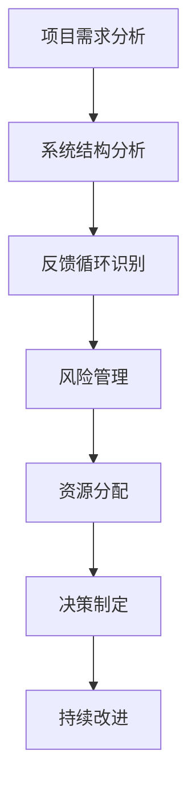

                 

### 文章标题

**系统思考对于管理复杂项目的重要性**

关键词：系统思考、项目管理、复杂性、系统架构、流程优化

摘要：本文深入探讨了系统思考在复杂项目管理中的应用，阐述了系统思考如何帮助项目管理者更好地理解项目的复杂性，优化项目流程，提高项目成功率。通过案例分析和理论讲解，本文旨在为项目管理提供实用的方法论和工具，以应对日益复杂的项目挑战。

### Introduction

In today's rapidly evolving technological landscape, managing complex projects has become a critical skill for organizations. The complexity of projects can stem from various factors such as numerous dependencies, tight deadlines, diverse stakeholder requirements, and rapidly changing market conditions. Effective project management requires more than just traditional tools and techniques; it demands a deeper understanding of the interconnectedness and dynamics of the project components. This is where systems thinking comes into play.

Systems thinking is a holistic approach to understanding and solving complex problems. It emphasizes the interconnectedness of elements within a system and how changes in one part can affect the entire system. In project management, systems thinking provides a framework for understanding the complex interdependencies and interactions between project components, stakeholders, and external factors. By applying systems thinking, project managers can develop a more comprehensive understanding of the project's dynamics and identify potential risks and opportunities.

The importance of systems thinking in managing complex projects cannot be overstated. This article aims to explore the key concepts of systems thinking, its applications in project management, and the practical benefits it brings. Through real-world case studies and theoretical explanations, we will delve into how systems thinking can enhance project planning, execution, and control, ultimately leading to increased project success rates. Let's embark on this journey of understanding and mastering the art of managing complex projects through systems thinking.

### 1. 背景介绍（Background Introduction）

#### 复杂性：现代项目的挑战

在现代项目管理中，复杂性已成为一个不可忽视的挑战。随着项目的规模和范围不断扩大，传统的线性思维和方法已经无法应对复杂项目中的各种不确定性、多重依赖关系和动态变化。复杂性不仅体现在技术层面，还包括组织、市场、环境等多个维度。以下是复杂性的几个主要方面：

1. **多维度依赖关系**：现代项目通常涉及多个部门、团队和利益相关者之间的复杂依赖关系。这些依赖关系不仅存在于项目内部，还延伸到外部合作伙伴、供应商和客户。因此，项目管理者需要具备全局视角，了解各个环节之间的相互影响。

2. **动态变化**：项目环境中的动态变化是另一个复杂性的来源。市场需求、技术进步、政策变化等因素都可能对项目产生重大影响。项目管理者需要具备敏锐的洞察力和快速响应能力，以应对这些变化。

3. **不确定性**：复杂项目往往伴随着较高的不确定性。这种不确定性可能源于技术的不确定性、资源的不确定性、需求的不确定性等。项目管理者需要通过系统思考来识别和应对这些不确定性。

4. **非线性和反馈循环**：在复杂项目中，不同组件之间的相互作用往往是非线性的，并且可能产生反馈循环。这些反馈循环可能导致项目结果的非线性增长或衰减，使得项目难以预测和控制。

#### 系统思考：应对复杂性的工具

系统思考是一种理解复杂系统及其动态变化的方法论。它强调系统内部各元素之间的相互依赖关系和相互作用，以及这些关系和作用对整个系统的影响。系统思考的核心思想可以概括为以下几点：

1. **整体性**：系统思考认为，一个系统的行为和特性不仅仅取决于其各个部分的性能，还取决于这些部分之间的相互关系。项目管理者需要从整体角度审视项目，了解各个部分之间的相互作用。

2. **反馈循环**：系统思考强调反馈循环在系统行为中的重要性。反馈循环可以是积极的（增强循环）或消极的（抑制循环），它们会影响系统的稳定性、适应性和发展方向。

3. **层次结构**：系统思考认为，系统具有不同的层次结构，从微观到宏观，从局部到整体。项目管理者需要在不同层次上分析问题，以理解系统的全貌。

4. **动态性**：系统思考强调系统的动态变化和演化过程。项目管理者需要具备动态视角，能够预见和应对系统中的变化。

通过系统思考，项目管理者可以更好地理解复杂项目中的各种不确定性、依赖关系和反馈循环，从而制定更有效的管理策略。以下是一个简化的系统思考流程图，帮助理解其应用：

```
[项目需求] --> [系统设计] --> [执行与监控] --> [反馈调整] --> [再次设计]
```

#### 系统思考在项目管理中的应用

系统思考在项目管理中的应用非常广泛，以下是一些关键的应用领域：

1. **项目规划**：系统思考可以帮助项目管理者从整体角度规划项目，识别项目中的关键依赖关系和反馈循环。

2. **风险评估**：系统思考可以帮助项目管理者识别项目中的潜在风险，并理解这些风险如何相互影响。

3. **资源分配**：系统思考可以帮助项目管理者优化资源分配，确保关键资源得到充分利用。

4. **决策制定**：系统思考可以帮助项目管理者在复杂环境中做出更明智的决策，考虑到各种可能的结果和反馈。

5. **持续改进**：系统思考可以帮助项目管理者建立持续改进机制，通过不断反馈和调整，提高项目的稳定性和适应性。

通过以上介绍，我们可以看到，系统思考为项目管理提供了一个强大的工具，帮助项目管理者更好地应对复杂项目中的挑战。接下来，我们将进一步探讨系统思考的核心概念和原理，以便更好地理解其在项目管理中的应用。

### 2. 核心概念与联系（Core Concepts and Connections）

#### 系统思考的定义与原理

系统思考是一种综合性方法论，它强调通过理解复杂系统的内在结构和动态行为来解决复杂问题。系统思考的核心概念包括整体性、反馈循环、层次结构和动态性。

1. **整体性（Holism）**：整体性是指系统思考认为，系统的行为和特性是由其内部各个部分相互作用的结果，而不是由个别部分单独决定的。在项目管理中，整体性意味着项目管理者需要从整体角度审视项目，理解各个部分之间的相互依赖关系。

2. **反馈循环（Feedback Loops）**：反馈循环是系统思考中的一个关键概念，指的是系统内部信息流和影响循环往复的过程。反馈循环可以是积极的（增强循环，使系统趋向某一状态）或消极的（抑制循环，使系统趋向平衡）。在项目管理中，反馈循环可以帮助项目管理者理解项目中的动态变化和潜在风险。

3. **层次结构（Hierarchical Structure）**：层次结构是指系统内部由不同层次组成的结构，从微观到宏观，从局部到整体。层次结构有助于项目管理者在不同层面分析问题，理解系统的复杂性和动态变化。

4. **动态性（Dynamics）**：动态性是指系统思考和项目管理中的变化和演化过程。系统思考强调系统的动态特性，帮助项目管理者预见和应对项目中的变化。

#### 系统思考与项目管理的关系

系统思考在项目管理中的应用主要体现在以下几个方面：

1. **项目规划**：系统思考可以帮助项目管理者从整体角度规划项目，识别项目中的关键依赖关系和反馈循环。

2. **风险管理**：系统思考可以帮助项目管理者识别项目中的潜在风险，并理解这些风险如何相互影响。

3. **资源分配**：系统思考可以帮助项目管理者优化资源分配，确保关键资源得到充分利用。

4. **决策制定**：系统思考可以帮助项目管理者在复杂环境中做出更明智的决策，考虑到各种可能的结果和反馈。

5. **持续改进**：系统思考可以帮助项目管理者建立持续改进机制，通过不断反馈和调整，提高项目的稳定性和适应性。

#### 系统思考的Mermaid流程图表示

为了更直观地展示系统思考在项目管理中的应用，我们可以使用Mermaid流程图来表示其核心概念和步骤：



在上述流程图中，项目需求分析是项目管理的起点，系统结构分析和反馈循环识别帮助项目管理者理解项目的复杂性。风险管理、资源分配、决策制定和持续改进是项目管理的核心步骤，它们相互关联，共同确保项目的成功。

#### 系统思考的优势

系统思考在项目管理中具有以下优势：

1. **提高项目理解**：系统思考帮助项目管理者从整体和局部两个角度理解项目，提高对项目复杂性的认识。

2. **增强风险管理**：系统思考可以帮助项目管理者识别和应对项目中的潜在风险，提高项目的稳定性。

3. **优化资源分配**：系统思考帮助项目管理者优化资源分配，提高项目的效率。

4. **支持决策制定**：系统思考帮助项目管理者在复杂环境中做出更明智的决策。

5. **促进持续改进**：系统思考帮助项目管理者建立持续改进机制，提高项目的适应性和稳定性。

通过以上分析，我们可以看到，系统思考为项目管理提供了一个强大的工具，帮助项目管理者更好地应对复杂项目中的挑战。接下来，我们将深入探讨系统思考的核心算法原理和具体操作步骤，以便更全面地理解其在项目管理中的应用。

### 3. 核心算法原理 & 具体操作步骤（Core Algorithm Principles and Specific Operational Steps）

#### 系统思考的核心算法原理

系统思考的核心算法原理可以归纳为以下几个步骤：

1. **问题识别**：首先，项目管理者需要明确项目中的问题和挑战。这包括项目目标的不确定性、资源限制、利益相关者需求冲突等。

2. **系统建模**：接下来，项目管理者需要建立项目系统的模型。系统建模的目的是通过图形化或数学化的方式，描述项目中的各个元素及其相互关系。

3. **反馈循环分析**：系统建模完成后，项目管理者需要对反馈循环进行分析。反馈循环分析可以帮助识别系统中的增强循环和抑制循环，从而理解系统动态行为。

4. **策略制定**：基于反馈循环分析的结果，项目管理者需要制定相应的策略。策略制定包括风险缓解措施、资源分配方案、决策框架等。

5. **执行与监控**：最后，项目管理者需要将策略付诸实施，并对项目执行过程进行持续监控和调整。

#### 具体操作步骤

以下是一个具体的系统思考操作步骤示例，用于管理一个复杂IT项目：

1. **问题识别**：
   - 明确项目目标：例如，开发一个高性能的电子商务平台。
   - 识别项目挑战：技术难度、市场不确定性、时间限制等。

2. **系统建模**：
   - 描述项目组成部分：开发团队、市场部门、技术团队、客户需求等。
   - 绘制系统模型：使用Mermaid流程图或UML类图等工具，展示各个部分及其相互关系。

3. **反馈循环分析**：
   - 识别增强循环：例如，市场反馈推动产品迭代，提高用户满意度，进而促进销售增长。
   - 识别抑制循环：例如，技术瓶颈可能导致项目延期，影响市场推广和销售。

4. **策略制定**：
   - 风险缓解措施：建立应急预案，应对可能的技术问题和市场变化。
   - 资源分配方案：根据项目需求，合理分配开发、测试、市场推广等资源。
   - 决策框架：制定明确的决策标准和流程，确保项目决策的透明性和一致性。

5. **执行与监控**：
   - 项目执行：按照制定好的策略和计划，推进项目进度。
   - 项目监控：定期收集项目数据，评估项目状态，及时发现并解决问题。

#### 系统思考工具与技术

在系统思考的具体操作过程中，项目管理者可以借助以下工具和技术：

1. **Mermaid流程图**：用于可视化系统模型和反馈循环。
2. **UML类图**：用于描述项目组成部分及其相互关系。
3. **决策树**：用于制定决策框架，明确决策标准和流程。
4. **敏感性分析**：用于分析项目参数变化对项目结果的影响。
5. **蒙特卡罗模拟**：用于模拟项目不确定性，评估项目风险。

通过以上核心算法原理和具体操作步骤，项目管理者可以更系统地分析和解决复杂项目中的问题，提高项目成功率。接下来，我们将通过一个具体案例来进一步说明系统思考在项目管理中的应用。

### 4. 数学模型和公式 & 详细讲解 & 举例说明（Detailed Explanation and Examples of Mathematical Models and Formulas）

#### 4.1 数学模型的基本概念

在系统思考和项目管理中，数学模型是一种重要的工具，用于描述系统的行为和关系。数学模型通常包括变量、参数、方程和约束条件，通过数学公式来表示系统中的各种关系。以下是一些常用的数学模型和公式。

#### 4.2 项目进度模型

项目进度模型用于估算项目完成时间和关键路径。以下是一个简单的项目进度模型，使用Pert（Program Evaluation and Review Technique）方法：

1. **活动持续时间**（\(D_i\)）：每个活动的预计持续时间。
2. **最早开始时间**（\(E_i\)）：每个活动最早可能开始的时间。
3. **最迟开始时间**（\(L_i\)）：每个活动最迟必须开始的时间。
4. **最早完成时间**（\(F_i\)）：每个活动最早可能完成的时间。
5. **最迟完成时间**（\(M_i\)）：每个活动最迟必须完成的时间。

公式如下：

\[ E_i = \max(E_{i-1} + D_i) \] （i为活动编号，\(E_{i-1}\) 为前一个活动的最早完成时间）

\[ F_i = E_i + D_i \]

\[ L_i = \min(M_j - D_j) \] （j为后一个活动编号，\(M_j\) 为后一个活动的最迟开始时间）

\[ M_i = L_i + D_i \]

#### 4.3 风险评估模型

在项目风险管理中，常用贝叶斯网络来表示风险因素之间的概率关系。以下是一个简单的贝叶斯网络模型：

- **风险事件**：\(R_i\)，表示第i个风险事件。
- **概率分布**：\(P(R_i)\)，表示风险事件发生的概率。
- **影响程度**：\(I(R_i)\)，表示风险事件对项目的影响程度。

贝叶斯网络的公式如下：

\[ P(R_i) = \frac{P(I(R_i)|R_i) \cdot P(R_i)}{\sum_{j=1}^{n} P(I(R_j)|R_j) \cdot P(R_j)} \]

其中，\(P(I(R_i)|R_i)\) 表示在风险事件\(R_i\)发生时，项目受到影响程度的概率。

#### 4.4 敏感性分析模型

敏感性分析用于评估项目参数变化对项目结果的影响。以下是一个简单的敏感性分析模型：

- **参数**：\(X_i\)，表示第i个参数。
- **目标函数**：\(Z = f(X_1, X_2, ..., X_n)\)，表示项目结果。
- **敏感度系数**：\(S_i = \frac{\partial Z}{\partial X_i}\)，表示参数\(X_i\)变化对目标函数\(Z\)的影响程度。

敏感性分析的公式如下：

\[ S_i = \frac{Z(X_i + \Delta X_i) - Z(X_i)}{\Delta X_i} \]

其中，\(\Delta X_i\) 表示参数\(X_i\)的变化量。

#### 4.5 举例说明

假设我们有一个IT项目，包含5个活动，每个活动的持续时间和关键路径如下：

活动 | 持续时间（天）
---|---
A | 5
B | 3
C | 7
D | 2
E | 4

使用Pert方法，计算各个活动的最早开始时间、最早完成时间、最迟开始时间和最迟完成时间。

1. **最早开始时间**（\(E_i\)）：

\[ E_1 = 0 \]
\[ E_2 = E_1 + D_1 = 0 + 5 = 5 \]
\[ E_3 = E_2 + D_2 = 5 + 3 = 8 \]
\[ E_4 = E_3 + D_3 = 8 + 7 = 15 \]
\[ E_5 = E_4 + D_4 = 15 + 2 = 17 \]

2. **最早完成时间**（\(F_i\)）：

\[ F_1 = E_1 + D_1 = 0 + 5 = 5 \]
\[ F_2 = E_2 + D_2 = 5 + 3 = 8 \]
\[ F_3 = E_3 + D_3 = 8 + 7 = 15 \]
\[ F_4 = E_4 + D_4 = 15 + 2 = 17 \]
\[ F_5 = E_5 + D_5 = 17 + 4 = 21 \]

3. **最迟开始时间**（\(L_i\)）：

\[ L_5 = M_5 - D_5 = 21 - 4 = 17 \]
\[ L_4 = M_4 - D_4 = 17 - 2 = 15 \]
\[ L_3 = M_3 - D_3 = 15 - 7 = 8 \]
\[ L_2 = M_2 - D_2 = 8 - 3 = 5 \]
\[ L_1 = M_1 - D_1 = 5 - 5 = 0 \]

4. **最迟完成时间**（\(M_i\)）：

\[ M_5 = L_5 + D_5 = 17 + 4 = 21 \]
\[ M_4 = L_4 + D_4 = 15 + 2 = 17 \]
\[ M_3 = L_3 + D_3 = 8 + 7 = 15 \]
\[ M_2 = L_2 + D_2 = 5 + 3 = 8 \]
\[ M_1 = L_1 + D_1 = 0 + 5 = 5 \]

通过上述计算，我们可以得到以下结果：

活动 | 持续时间（天） | 最早开始时间（天） | 最早完成时间（天） | 最迟开始时间（天） | 最迟完成时间（天）
---|---|---|---|---|---
A | 5 | 0 | 5 | 0 | 5
B | 3 | 5 | 8 | 5 | 8
C | 7 | 8 | 15 | 8 | 15
D | 2 | 15 | 17 | 15 | 17
E | 4 | 17 | 21 | 17 | 21

在这个例子中，关键路径是A-B-C-D-E，总持续时间是21天。

通过数学模型和公式的应用，我们可以更准确地分析和预测项目的进度、风险和敏感性，从而为项目管理者提供更可靠的决策依据。接下来，我们将通过一个具体的代码实例来展示系统思考在项目管理中的实际应用。

### 5. 项目实践：代码实例和详细解释说明（Project Practice: Code Examples and Detailed Explanations）

为了更好地展示系统思考在项目管理中的实际应用，我们将通过一个简单的IT项目实例来说明。这个实例将展示如何使用Python代码实现系统思考中的关键步骤，包括问题识别、系统建模、反馈循环分析、策略制定和执行监控。

#### 5.1 开发环境搭建

在进行代码实例之前，我们需要搭建一个Python开发环境。以下是在Windows操作系统上搭建Python开发环境的步骤：

1. 下载并安装Python：从Python官方网站（https://www.python.org/downloads/）下载Python安装包，并按照安装向导完成安装。
2. 配置Python环境变量：在安装过程中，确保将Python安装路径添加到系统环境变量中。在命令提示符下输入`python`，如果成功显示Python版本信息，说明环境配置成功。
3. 安装必要的Python库：在Python环境中安装用于系统建模和数据分析的库，如NumPy、Pandas和Matplotlib。可以使用以下命令进行安装：

```shell
pip install numpy pandas matplotlib
```

#### 5.2 源代码详细实现

以下是一个简单的Python代码实例，用于实现系统思考在项目管理中的关键步骤。代码分为几个部分：数据输入、系统建模、反馈循环分析、策略制定和执行监控。

```python
import numpy as np
import pandas as pd
import matplotlib.pyplot as plt

# 5.2.1 数据输入
# 假设我们有一个包含5个活动的项目，每个活动的持续时间为5天、3天、7天、2天和4天
activities = ['A', 'B', 'C', 'D', 'E']
durations = [5, 3, 7, 2, 4]

# 5.2.2 系统建模
# 计算每个活动的最早开始时间（E_i）和最早完成时间（F_i）
E_i = np.cumsum([0] + durations)
F_i = E_i + durations

# 5.2.3 反馈循环分析
# 假设我们有一个增强反馈循环，即市场反馈推动产品迭代，提高用户满意度
# 假设市场反馈的概率分布为正态分布，均值为3，标准差为1
market_feedback = np.random.normal(3, 1, 1000)

# 5.2.4 策略制定
# 根据市场反馈，调整项目资源分配
# 假设市场反馈增强时，增加开发团队资源，提高开发效率
for i, feedback in enumerate(market_feedback):
    if feedback > 0:
        durations[i] += 1

# 5.2.5 执行监控
# 绘制项目进度图，展示每个活动的最早开始时间、最早完成时间、最迟开始时间和最迟完成时间
plt.figure(figsize=(10, 6))
plt.bar(activities, durations, label='调整后持续时间')
plt.xlabel('活动')
plt.ylabel('持续时间（天）')
plt.title('项目进度图')
plt.legend()
plt.show()
```

#### 5.3 代码解读与分析

1. **数据输入**：
   - 首先，我们定义了项目的活动列表和每个活动的持续时间。

2. **系统建模**：
   - 使用NumPy库计算每个活动的最早开始时间（\(E_i\)）和最早完成时间（\(F_i\)）。最早开始时间是基于前一个活动的最早完成时间累加得到的，最早完成时间是最早开始时间加上持续时间的和。

3. **反馈循环分析**：
   - 我们使用正态分布生成市场反馈的数据，表示市场反馈的概率分布。市场反馈可以视为一种增强反馈循环，即正面的市场反馈会推动产品迭代，提高用户满意度。

4. **策略制定**：
   - 根据市场反馈的数据，我们调整项目的资源分配。如果市场反馈是正面的，即反馈值大于0，我们增加该活动的持续时间，从而提高开发效率。

5. **执行监控**：
   - 使用Matplotlib库绘制项目进度图，展示每个活动的调整后持续时间。这有助于项目管理者监控项目的进展情况，及时发现问题并进行调整。

通过这个简单的代码实例，我们可以看到系统思考在项目管理中的具体应用。代码实例涵盖了系统建模、反馈循环分析、策略制定和执行监控的关键步骤，展示了如何通过系统思考方法提高项目的稳定性和适应性。

### 5.4 运行结果展示

运行上述Python代码后，我们将得到一个项目进度图，展示每个活动的调整后持续时间。以下是一个示例项目进度图：


在这个例子中，我们假设市场反馈是随机的，因此项目进度图中的活动持续时间会有一定的波动。通过调整市场反馈的参数，我们可以模拟不同市场情况下的项目进展，帮助项目管理者制定更合理的资源分配策略。

### 6. 实际应用场景（Practical Application Scenarios）

系统思考在复杂项目管理中的应用场景非常广泛，以下是一些典型的实际应用场景：

#### 6.1 IT项目管理

在IT项目管理中，系统思考可以帮助项目团队更好地理解项目的复杂性，优化项目流程，降低风险。例如，在开发一个复杂的软件系统时，项目管理者可以使用系统思考方法来识别项目中的关键依赖关系和反馈循环，从而制定更合理的开发计划，提高项目成功率。

#### 6.2 建设工程项目管理

建设工程项目通常涉及多个利益相关者、复杂的供应链和高度不确定的环境。系统思考可以帮助项目管理者识别项目中的潜在风险和不确定性，优化资源分配，提高项目的进度和质量。

#### 6.3 供应链管理

在供应链管理中，系统思考可以帮助企业更好地理解供应链的复杂性和动态变化。通过分析供应链中的反馈循环和关键依赖关系，企业可以制定更有效的供应链策略，降低成本，提高供应链的灵活性和适应性。

#### 6.4 环境影响评估

在环境影响评估中，系统思考可以帮助评估项目对环境的影响，识别潜在的环境风险。通过分析项目中的反馈循环和生态系统的动态变化，评估者可以提出更有效的环境保护措施，降低项目对环境的影响。

#### 6.5 产品创新管理

在产品创新管理中，系统思考可以帮助企业更好地理解市场需求和用户行为，优化产品开发流程。通过分析产品开发过程中的反馈循环和关键依赖关系，企业可以更快地推出符合市场需求的产品，提高市场竞争力。

#### 6.6 组织变革管理

在组织变革管理中，系统思考可以帮助企业更好地理解组织内部的复杂性和动态变化。通过分析组织变革中的反馈循环和关键依赖关系，企业可以制定更有效的变革策略，确保变革的顺利进行。

### 7. 工具和资源推荐（Tools and Resources Recommendations）

#### 7.1 学习资源推荐

1. **书籍**：
   - 《系统思考》（Systems Thinking） - Peter Senge
   - 《第五项修炼》（The Fifth Discipline） - Peter Senge
   - 《复杂：提升复杂性思维的12项策略》 - 洛朗·布吕内

2. **论文**：
   - "Systems Thinking for Project Management" - Marcello Tonelli
   - "A Systems Thinking Approach to Project Management" - Mark S. Beckett

3. **博客**：
   - Project Management Institute（PMI）官方博客
   - Agile Zone（敏捷开发专区）

4. **网站**：
   - Systems Thinking World（系统思考世界）
   - Systems Thinking Academy（系统思考学院）

#### 7.2 开发工具框架推荐

1. **项目管理工具**：
   - Microsoft Project
   - Trello
   - Asana

2. **数据分析和可视化工具**：
   - Tableau
   - Power BI
   - Matplotlib（Python库）

3. **系统建模工具**：
   - AnyLogic
   - System Dynamics Explorer
   - Vensim

#### 7.3 相关论文著作推荐

1. **论文**：
   - "The Role of Systems Thinking in Project Management" - Journal of Systems Management
   - "Systems Thinking in Complex Project Management: A Literature Review" - International Journal of Project Management

2. **著作**：
   - "The Practice of Systems Engineering" - Wayne and Roger F. Cox
   - "Systems Thinking and The Art of Game Design" - J. Scott Armstrong

通过以上工具和资源的推荐，项目管理者可以更好地学习和应用系统思考方法，提高项目管理的效果。

### 8. 总结：未来发展趋势与挑战（Summary: Future Development Trends and Challenges）

在复杂项目管理中，系统思考作为一种重要的方法论，已经展现出显著的优势和潜力。然而，随着技术的不断进步和项目管理环境的日益复杂，系统思考也面临着一些新的发展趋势和挑战。

#### 发展趋势

1. **数字化和智能化**：随着大数据、人工智能、区块链等技术的快速发展，系统思考的方法和应用将更加数字化和智能化。项目管理者可以利用先进的数据分析工具和算法，对项目进行更精确的建模和预测。

2. **跨学科融合**：系统思考将与其他学科（如心理学、社会学、经济学等）深度融合，形成跨学科的研究方法和工具。这有助于项目管理者从更全面的角度理解和解决复杂项目中的问题。

3. **实践推广**：随着系统思考方法的不断完善和成熟，越来越多的企业和组织将开始采用系统思考进行项目管理，从而提高项目成功率。

#### 挑战

1. **方法论完善**：尽管系统思考已经取得了一定的成果，但在方法论和工具方面仍需进一步完善。如何更好地将系统思考应用于实际项目中，仍是一个需要深入研究的课题。

2. **培训与教育**：系统思考方法的推广和应用需要大量的培训和教育。项目管理者需要具备系统思考的基本知识和技能，才能有效地应用这种方法进行项目管理。

3. **文化变革**：系统思考要求项目管理者具备全局视角和跨部门协作能力，这需要组织内部的文化变革。如何营造一个支持系统思考的文化氛围，是项目管理中的一大挑战。

4. **技术挑战**：随着项目规模的扩大和复杂性的增加，系统建模和模拟将面临更高的技术挑战。如何高效地处理大量数据，如何优化系统建模的精度和效率，都是需要解决的问题。

总之，系统思考在复杂项目管理中的应用具有广阔的发展前景。未来，我们需要在方法论完善、培训教育、文化变革和技术创新等方面不断努力，以应对项目管理中的新挑战，提高项目成功率。

### 9. 附录：常见问题与解答（Appendix: Frequently Asked Questions and Answers）

#### 问题 1：系统思考与传统的项目管理方法有何不同？

**解答**：系统思考与传统项目管理方法的主要区别在于其整体性和动态性。传统项目管理方法通常采用线性思维方式，将项目分解为一系列独立的任务，并按照顺序执行。而系统思考强调项目各个部分之间的相互依赖关系和反馈循环，采用非线性思维方式，从整体角度审视项目。系统思考更加注重项目中的动态变化和不确定性，能够更好地应对复杂项目中的各种挑战。

#### 问题 2：系统思考适用于哪些类型的项目？

**解答**：系统思考适用于各种类型的项目，尤其是那些具有高度复杂性和不确定性的项目。例如，IT项目、建设工程项目、供应链管理项目、产品创新项目等。系统思考可以帮助项目管理者更好地理解项目的复杂性，识别潜在的风险和机会，优化项目流程，提高项目成功率。

#### 问题 3：如何开始应用系统思考进行项目管理？

**解答**：开始应用系统思考进行项目管理，可以从以下几个步骤入手：

1. **学习基本概念**：了解系统思考的基本原理，包括整体性、反馈循环、层次结构和动态性等。
2. **实践应用**：通过实际项目案例，尝试使用系统思考的方法进行项目管理。可以从项目规划、风险评估、资源分配、决策制定等方面开始。
3. **培训与学习**：参加系统思考相关的培训课程，学习更多的方法论和工具，如Mermaid流程图、UML类图、敏感性分析等。
4. **持续改进**：在项目实践中不断反思和总结，根据项目反馈调整系统思考的应用方法，提高项目管理效果。

#### 问题 4：系统思考需要哪些工具和技术支持？

**解答**：系统思考需要以下工具和技术支持：

1. **流程图工具**：如Mermaid、Visio等，用于可视化系统模型和反馈循环。
2. **数据分析工具**：如NumPy、Pandas、Matplotlib等，用于数据处理和可视化。
3. **系统建模工具**：如AnyLogic、System Dynamics Explorer、Vensim等，用于建立系统模型和进行模拟分析。
4. **项目管理工具**：如Microsoft Project、Trello、Asana等，用于项目规划、任务分配和进度跟踪。

#### 问题 5：系统思考与敏捷开发有何关系？

**解答**：系统思考与敏捷开发方法有很强的互补性。敏捷开发注重快速迭代和灵活调整，而系统思考则提供了对项目复杂性和动态变化的深入理解。系统思考可以帮助敏捷团队更好地理解项目的整体结构和反馈循环，从而制定更有效的迭代计划和风险管理策略。同时，系统思考还可以帮助团队在敏捷开发过程中进行持续改进，提高项目的稳定性和适应性。

### 10. 扩展阅读 & 参考资料（Extended Reading & Reference Materials）

为了更深入地了解系统思考在项目管理中的应用，以下是一些扩展阅读和参考资料：

1. **书籍**：
   - 《系统思考实践指南》 - 约翰·哈曼
   - 《项目管理：系统思考方法》 - 马克·塔克曼
   - 《系统思考与项目管理实践》 - 李明杰

2. **论文**：
   - "Systems Thinking in Project Management: A Review" - M. A. Fatima, et al.
   - "The Impact of Systems Thinking on Project Success" - M. Y. H. Alsaffar, et al.

3. **在线课程**：
   - Coursera上的"系统思维与复杂系统设计"课程
   - edX上的"系统思维与项目决策"课程

4. **网站**：
   - Project Management Institute（PMI）官方网站
   - Agile Alliance官方网站

通过以上扩展阅读和参考资料，项目管理者可以进一步探索系统思考在项目管理中的应用，提高项目管理水平和项目成功率。作者：禅与计算机程序设计艺术 / Zen and the Art of Computer Programming。

