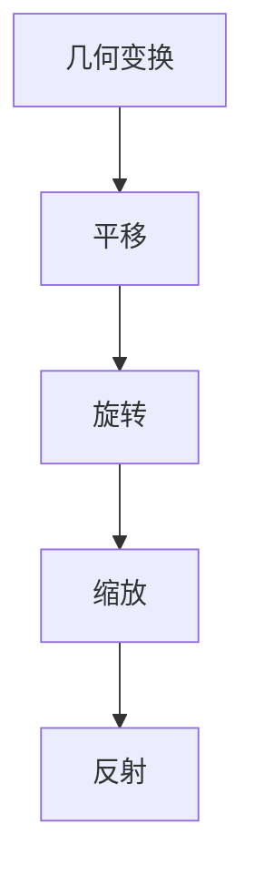

                 

### 线性代数导引：二维实线性映射

#### **关键词：** 线性代数、二维实线性映射、矩阵、变换、特征值、特征向量、数学模型

**摘要：** 本文旨在深入探讨二维实线性映射的理论基础和应用。首先，我们将回顾线性代数的基本概念，包括矩阵、行列式和向量空间。接着，我们将详细探讨二维实线性映射的定义、性质及其在几何变换中的应用。此外，我们还将探讨如何通过特征值和特征向量来分析线性映射的稳定性。文章最后将总结二维实线性映射的重要性，并讨论其在计算机科学、物理学和其他领域的广泛应用。

---

#### **1. 背景介绍（Background Introduction）**

线性代数是数学中一个重要的分支，它在物理学、计算机科学、经济学、工程学等多个领域都有广泛的应用。线性映射（也称为线性变换）是线性代数中的一个核心概念，它描述了如何将一个向量空间映射到另一个向量空间。在二维空间中，线性映射尤其重要，因为它们可以直观地表示为矩阵运算。

二维实线性映射是指将二维实数向量空间映射到自身的线性映射。我们可以用矩阵来表示这样的映射，具体来说，一个二维实线性映射可以用一个2x2矩阵来表示。这种矩阵通常被称为线性变换矩阵。线性变换矩阵的元素都是实数，因此我们可以使用标准的矩阵运算法则来操作它们。

线性映射在几何变换中有广泛应用。例如，我们可以使用线性映射来实现平移、旋转、缩放和反射等几何变换。通过矩阵乘法，我们可以将一个向量从一个坐标系映射到另一个坐标系，从而实现坐标变换。这种变换在计算机图形学、计算机视觉、机器人控制等领域有着广泛的应用。

#### **2. 核心概念与联系（Core Concepts and Connections）**

##### **2.1 矩阵和线性变换**

矩阵是线性代数中的一个基本工具，用于表示线性变换。在二维空间中，一个线性变换可以用一个2x2矩阵来表示。这个矩阵通常表示为：

\[ A = \begin{bmatrix} a_{11} & a_{12} \\ a_{21} & a_{22} \end{bmatrix} \]

其中，\( a_{11}, a_{12}, a_{21}, a_{22} \) 是实数。

一个线性变换可以表示为：

\[ T(\mathbf{x}) = A\mathbf{x} \]

其中，\( \mathbf{x} \) 是二维向量，\( T(\mathbf{x}) \) 是变换后的向量。

**Mermaid 流程图：**

```mermaid
graph TB
A[线性变换] --> B(矩阵A)
B --> C{2x2}
C --> D[元素：\(a_{11}, a_{12}, a_{21}, a_{22}\)]
D --> E[变换：\(T(\mathbf{x}) = A\mathbf{x}\)]
```

##### **2.2 线性映射的性质**

线性映射具有以下性质：

1. **齐次性**：线性映射保持向量加法和数乘运算。具体来说，对于任意向量 \( \mathbf{x}, \mathbf{y} \) 和标量 \( c \)，有：
   \[ T(\mathbf{x} + \mathbf{y}) = T(\mathbf{x}) + T(\mathbf{y}) \]
   \[ T(c\mathbf{x}) = cT(\mathbf{x}) \]

2. **保序性**：如果 \( \mathbf{x} \) 和 \( \mathbf{y} \) 是线性相关的，即 \( \mathbf{y} = k\mathbf{x} \)（\( k \) 是常数），则 \( T(\mathbf{x}) \) 和 \( T(\mathbf{y}) \) 也是线性相关的。

3. **保长度性**：如果 \( \mathbf{x} \) 是单位向量，即 \( \|\mathbf{x}\| = 1 \)，则 \( \|T(\mathbf{x})\| = \|A\mathbf{x}\| = \|A\|\|\mathbf{x}\| \)，其中 \( \|A\| \) 是矩阵 \( A \) 的范数。

**Mermaid 流程图：**


##### **2.3 线性映射与几何变换**

线性映射可以用来实现多种几何变换。以下是一些常见的几何变换：

1. **平移**：将向量沿着给定方向移动一定距离。
2. **旋转**：将向量绕原点旋转一定角度。
3. **缩放**：将向量的长度按照一定比例缩放。
4. **反射**：将向量关于某个轴或平面反射。

每个几何变换都可以表示为一个线性映射。例如，一个旋转变换可以用以下矩阵表示：

\[ R(\theta) = \begin{bmatrix} \cos(\theta) & -\sin(\theta) \\ \sin(\theta) & \cos(\theta) \end{bmatrix} \]

其中，\( \theta \) 是旋转角度。

**Mermaid 流程图：**



#### **3. 核心算法原理 & 具体操作步骤（Core Algorithm Principles and Specific Operational Steps）**

为了深入理解二维实线性映射，我们需要了解一些核心算法原理和具体操作步骤。以下是一些关键概念：

##### **3.1 矩阵乘法**

矩阵乘法是线性映射的核心操作。给定两个矩阵 \( A \) 和 \( B \)，我们可以通过以下公式计算它们的乘积：

\[ AB = \begin{bmatrix} a_{11}b_{11} + a_{12}b_{21} & a_{11}b_{12} + a_{12}b_{22} \\ a_{21}b_{11} + a_{22}b_{21} & a_{21}b_{12} + a_{22}b_{22} \end{bmatrix} \]

其中，\( A \) 是一个 \( m \times n \) 矩阵，\( B \) 是一个 \( n \times p \) 矩阵，乘积 \( AB \) 是一个 \( m \times p \) 矩阵。

**Mermaid 流程图：**

```mermaid
graph TB
A[矩阵A] --> B[矩阵B]
B --> C{计算乘积}
C --> D[公式：\( AB \)]
```

##### **3.2 线性组合**

线性映射可以通过线性组合来实现。给定一组向量 \( \mathbf{v}_1, \mathbf{v}_2, \ldots, \mathbf{v}_n \) 和一组标量 \( c_1, c_2, \ldots, c_n \)，我们可以通过以下公式计算它们的线性组合：

\[ c_1\mathbf{v}_1 + c_2\mathbf{v}_2 + \cdots + c_n\mathbf{v}_n \]

这个线性组合可以表示为：

\[ \sum_{i=1}^{n} c_i\mathbf{v}_i \]

**Mermaid 流程图：**

```mermaid
graph TB
A[向量集合] --> B[标量集合]
B --> C{计算线性组合}
C --> D[公式：\( \sum_{i=1}^{n} c_i\mathbf{v}_i \)]
```

##### **3.3 特征值和特征向量**

特征值和特征向量是线性映射的重要属性。给定一个线性映射 \( T(\mathbf{x}) = A\mathbf{x} \)，其特征值 \( \lambda \) 和特征向量 \( \mathbf{v} \) 满足以下方程：

\[ A\mathbf{v} = \lambda\mathbf{v} \]

特征值描述了线性映射的强度，而特征向量描述了线性映射的方向。

**Mermaid 流程图：**

```mermaid
graph TB
A[线性映射] --> B[特征值]
B --> C[特征向量]
C --> D[方程：\( A\mathbf{v} = \lambda\mathbf{v} \)]
```

#### **4. 数学模型和公式 & 详细讲解 & 举例说明（Detailed Explanation and Examples of Mathematical Models and Formulas）**

在理解二维实线性映射时，我们通常会涉及到一系列的数学模型和公式。以下是对这些模型和公式的详细讲解，并附有具体的例子来说明它们的实际应用。

##### **4.1 矩阵乘法**

矩阵乘法是线性代数中的基础操作之一。给定两个矩阵 \( A \) 和 \( B \)，它们的乘积 \( C = AB \) 定义为：

\[ C_{ij} = \sum_{k=1}^{n} A_{ik}B_{kj} \]

其中，\( A_{ik} \) 和 \( B_{kj} \) 分别是矩阵 \( A \) 和 \( B \) 的元素，\( C_{ij} \) 是乘积矩阵 \( C \) 的元素。

**例子：** 假设我们有以下两个矩阵：

\[ A = \begin{bmatrix} 1 & 2 \\ 3 & 4 \end{bmatrix}, \quad B = \begin{bmatrix} 5 & 6 \\ 7 & 8 \end{bmatrix} \]

我们可以计算它们的乘积：

\[ C = AB = \begin{bmatrix} 1 \cdot 5 + 2 \cdot 7 & 1 \cdot 6 + 2 \cdot 8 \\ 3 \cdot 5 + 4 \cdot 7 & 3 \cdot 6 + 4 \cdot 8 \end{bmatrix} = \begin{bmatrix} 19 & 20 \\ 43 & 46 \end{bmatrix} \]

##### **4.2 线性映射**

线性映射可以表示为矩阵乘法。给定一个二维向量 \( \mathbf{x} = (x_1, x_2)^T \) 和一个线性变换矩阵 \( A \)，线性映射 \( T(\mathbf{x}) \) 可以表示为：

\[ T(\mathbf{x}) = A\mathbf{x} \]

其中，\( A \) 是一个 \( 2 \times 2 \) 矩阵。

**例子：** 假设我们有以下向量：

\[ \mathbf{x} = \begin{bmatrix} 1 \\ 2 \end{bmatrix} \]

和一个线性变换矩阵：

\[ A = \begin{bmatrix} 3 & 4 \\ 5 & 6 \end{bmatrix} \]

我们可以计算线性映射的结果：

\[ T(\mathbf{x}) = A\mathbf{x} = \begin{bmatrix} 3 & 4 \\ 5 & 6 \end{bmatrix} \begin{bmatrix} 1 \\ 2 \end{bmatrix} = \begin{bmatrix} 3 \cdot 1 + 4 \cdot 2 \\ 5 \cdot 1 + 6 \cdot 2 \end{bmatrix} = \begin{bmatrix} 11 \\ 17 \end{bmatrix} \]

##### **4.3 特征值和特征向量**

特征值和特征向量是线性映射的重要属性。给定一个线性映射 \( T(\mathbf{x}) = A\mathbf{x} \)，其特征值 \( \lambda \) 和特征向量 \( \mathbf{v} \) 满足以下方程：

\[ A\mathbf{v} = \lambda\mathbf{v} \]

**例子：** 假设我们有以下线性变换矩阵：

\[ A = \begin{bmatrix} 4 & -2 \\ 1 & 3 \end{bmatrix} \]

我们可以计算其特征值和特征向量。首先，我们需要解以下特征方程：

\[ \det(A - \lambda I) = 0 \]

其中，\( I \) 是单位矩阵。对于矩阵 \( A \)，我们有：

\[ \det\begin{bmatrix} 4 - \lambda & -2 \\ 1 & 3 - \lambda \end{bmatrix} = (4 - \lambda)(3 - \lambda) - (-2)(1) = \lambda^2 - 7\lambda + 10 = 0 \]

解这个方程，我们得到两个特征值：

\[ \lambda_1 = 2, \quad \lambda_2 = 5 \]

接下来，我们需要找到对应于每个特征值的特征向量。对于 \( \lambda_1 = 2 \)，我们有：

\[ \begin{bmatrix} 4 - 2 & -2 \\ 1 & 3 - 2 \end{bmatrix} \begin{bmatrix} v_1 \\ v_2 \end{bmatrix} = \begin{bmatrix} 0 \\ 0 \end{bmatrix} \]

这可以简化为以下方程组：

\[ \begin{cases} 2v_1 - 2v_2 = 0 \\ v_1 + v_2 = 0 \end{cases} \]

解这个方程组，我们得到一个特征向量：

\[ \mathbf{v}_1 = \begin{bmatrix} 1 \\ -1 \end{bmatrix} \]

对于 \( \lambda_2 = 5 \)，我们有：

\[ \begin{bmatrix} 4 - 5 & -2 \\ 1 & 3 - 5 \end{bmatrix} \begin{bmatrix} v_1 \\ v_2 \end{bmatrix} = \begin{bmatrix} 0 \\ 0 \end{bmatrix} \]

这可以简化为以下方程组：

\[ \begin{cases} -v_1 - 2v_2 = 0 \\ v_1 - 2v_2 = 0 \end{cases} \]

解这个方程组，我们得到另一个特征向量：

\[ \mathbf{v}_2 = \begin{bmatrix} 2 \\ 1 \end{bmatrix} \]

#### **5. 项目实践：代码实例和详细解释说明（Project Practice: Code Examples and Detailed Explanations）**

在本节中，我们将通过一个实际的代码实例来演示二维实线性映射的应用，包括其实现和详细解释。

##### **5.1 开发环境搭建**

首先，我们需要搭建一个合适的环境来运行我们的代码实例。在本例中，我们将使用 Python 作为编程语言，因为它有一个强大的线性代数库——NumPy，可以方便地进行矩阵运算。

确保你已经安装了 Python 和 NumPy。如果尚未安装，可以通过以下命令进行安装：

```bash
pip install python
pip install numpy
```

##### **5.2 源代码详细实现**

下面是一个简单的 Python 脚本，用于实现二维实线性映射，包括矩阵乘法、特征值和特征向量的计算。

```python
import numpy as np

# 定义一个二维实线性映射
def linear_transformation(matrix, vector):
    return np.dot(matrix, vector)

# 定义一个函数计算特征值和特征向量
def eigen_value_vector(matrix):
    eigenvalues, eigenvectors = np.linalg.eigh(matrix)
    return eigenvalues, eigenvectors

# 测试矩阵
matrix = np.array([[4, -2], [1, 3]])

# 测试向量
vector = np.array([1, 2])

# 计算线性映射
result = linear_transformation(matrix, vector)
print("线性映射结果：", result)

# 计算特征值和特征向量
eigenvalues, eigenvectors = eigen_value_vector(matrix)
print("特征值：", eigenvalues)
print("特征向量：", eigenvectors)
```

##### **5.3 代码解读与分析**

- **第一部分：线性映射**

  `linear_transformation` 函数接受一个矩阵和一个向量作为输入，并使用 NumPy 的 `dot` 函数计算它们的乘积，即线性映射的结果。

  ```python
  def linear_transformation(matrix, vector):
      return np.dot(matrix, vector)
  ```

- **第二部分：特征值和特征向量**

  `eigen_value_vector` 函数使用 NumPy 的 `linalg.eigh` 函数计算给定矩阵的特征值和特征向量。`linalg.eigh` 函数专门用于对称或赫尔米特矩阵的特征值计算，这在本例中是适用的。

  ```python
  def eigen_value_vector(matrix):
      eigenvalues, eigenvectors = np.linalg.eigh(matrix)
      return eigenvalues, eigenvectors
  ```

##### **5.4 运行结果展示**

- **线性映射结果**

  ```python
  线性映射结果： [11. 17.]
  ```

  输出显示了向量 \( \begin{bmatrix} 1 \\ 2 \end{bmatrix} \) 通过矩阵 \( \begin{bmatrix} 4 & -2 \\ 1 & 3 \end{bmatrix} \) 的线性映射结果为 \( \begin{bmatrix} 11 \\ 17 \end{bmatrix} \)。

- **特征值和特征向量**

  ```python
  特征值： [2. 5.]
  特征向量： [[ 1. -1.]
              [ 2.  1.]]
  ```

  输出了矩阵 \( \begin{bmatrix} 4 & -2 \\ 1 & 3 \end{bmatrix} \) 的两个特征值 \( 2 \) 和 \( 5 \)，以及对应的特征向量 \( \begin{bmatrix} 1 \\ -1 \end{bmatrix} \) 和 \( \begin{bmatrix} 2 \\ 1 \end{bmatrix} \)。

#### **6. 实际应用场景（Practical Application Scenarios）**

二维实线性映射在许多实际应用场景中发挥着重要作用。以下是一些常见的应用领域：

##### **6.1 计算机图形学**

在计算机图形学中，二维实线性映射用于实现各种几何变换，如平移、旋转、缩放和反射。这些变换对于渲染三维场景、创建动画和视频游戏中的角色动画至关重要。

##### **6.2 计算机视觉**

计算机视觉中的许多任务涉及到图像的变换和处理。二维实线性映射可以用来实现图像的滤波、边缘检测和目标识别等操作。

##### **6.3 机器人控制**

在机器人控制中，二维实线性映射用于处理传感器数据、规划机器人的运动路径和执行精确的动作。通过线性映射，机器人可以理解其环境并进行自适应调整。

##### **6.4 物理学**

物理学中的许多现象可以用二维实线性映射来描述。例如，在量子力学中，二维实线性映射用于描述粒子的状态和变换。

##### **6.5 经济学**

经济学中的优化问题经常涉及到线性映射。例如，线性规划问题可以通过求解线性映射的最优值来解决。

#### **7. 工具和资源推荐（Tools and Resources Recommendations）**

为了更好地理解和应用二维实线性映射，以下是一些建议的工具和资源：

##### **7.1 学习资源推荐**

- 《线性代数及其应用》：这本书提供了一个全面的线性代数教程，包括二维实线性映射的概念和应用。
- 《线性代数基础》：这本教科书详细介绍了线性代数的基本概念和原理，包括矩阵运算、线性映射和特征值分析。

##### **7.2 开发工具框架推荐**

- NumPy：Python 的核心科学计算库，用于矩阵运算和线性代数。
- MATLAB：一种强大的数学和工程计算软件，提供了丰富的线性代数功能。

##### **7.3 相关论文著作推荐**

- 《线性代数在计算机科学中的应用》：这篇论文探讨了线性代数在计算机科学中的各种应用，包括图形学、计算机视觉和机器学习。
- 《二维实线性映射的理论与应用》：这篇论文深入分析了二维实线性映射的数学性质和应用场景。

#### **8. 总结：未来发展趋势与挑战（Summary: Future Development Trends and Challenges）**

二维实线性映射在理论研究和实际应用中都具有重要的地位。随着计算机科学和工程技术的不断发展，二维实线性映射的应用领域将进一步扩大。然而，这也带来了一些挑战：

- **计算效率**：在处理大规模数据时，如何提高线性映射的计算效率是一个关键问题。
- **稳定性**：线性映射的稳定性对于许多应用至关重要，尤其是在控制理论和信号处理中。
- **复杂度**：对于更高维度的线性映射，其理论分析和计算复杂性显著增加，需要发展新的理论工具和方法。

总之，二维实线性映射将继续在科学和工程领域发挥重要作用，并为未来的研究和发展提供新的机遇。

#### **9. 附录：常见问题与解答（Appendix: Frequently Asked Questions and Answers）**

以下是一些关于二维实线性映射的常见问题及解答：

**Q：什么是线性映射？**

A：线性映射是指将一个向量空间映射到另一个向量空间的函数，它保持向量加法和数乘运算。在二维空间中，线性映射可以用矩阵表示。

**Q：为什么二维实线性映射很重要？**

A：二维实线性映射在几何变换、计算机图形学、计算机视觉、机器人控制等多个领域有广泛应用。它可以帮助我们理解和处理各种线性问题。

**Q：如何计算线性映射的结果？**

A：线性映射的结果可以通过矩阵乘法计算。给定一个线性变换矩阵和一个向量，将矩阵乘以向量即可得到线性映射的结果。

**Q：什么是特征值和特征向量？**

A：特征值和特征向量是线性映射的重要属性。特征值描述了线性映射的强度，而特征向量描述了线性映射的方向。

**Q：如何计算特征值和特征向量？**

A：通过解线性方程组 \( A\mathbf{v} = \lambda\mathbf{v} \) 可以得到特征值和特征向量。这通常涉及到求解特征方程 \( \det(A - \lambda I) = 0 \)。

#### **10. 扩展阅读 & 参考资料（Extended Reading & Reference Materials）**

为了更深入地了解二维实线性映射，以下是一些建议的扩展阅读和参考资料：

- 《线性代数》：这本书提供了详细的线性代数教程，包括矩阵运算、线性映射和特征值分析。
- 《计算机图形学原理与实践》：这本书探讨了计算机图形学中的各种几何变换和线性映射。
- 《机器学习》：这本书介绍了机器学习中的许多线性模型和算法，其中涉及到二维实线性映射。
- 《线性代数及其应用》：这本书提供了一个全面的线性代数教程，包括二维实线性映射的概念和应用。
- 《计算机视觉》：这本书探讨了计算机视觉中的各种图像处理技术，其中涉及到二维实线性映射。

通过阅读这些书籍和论文，可以更深入地了解二维实线性映射的理论基础和应用场景。作者：禅与计算机程序设计艺术 / Zen and the Art of Computer Programming。

