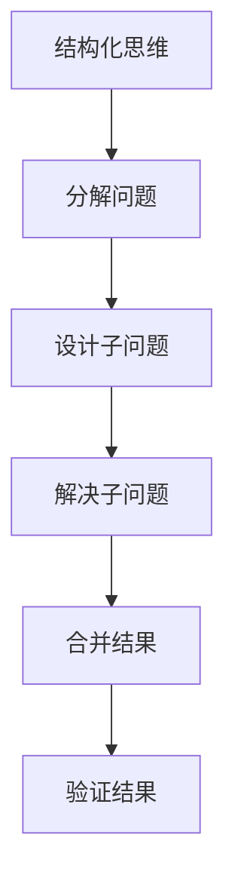

                 

### 文章标题

**《结构化思维：理解世界的钥匙》**

> **关键词：结构化思维、认知科学、方法论、问题解决、IT领域**

> **摘要：本文探讨了结构化思维在认知科学和IT领域的应用，通过一系列实例和算法，揭示了结构化思维如何帮助我们更高效地理解世界、解决问题。本文旨在为读者提供一套实用工具，帮助他们培养结构化思维能力，提升问题解决能力。**

### 1. 背景介绍（Background Introduction）

在快速变化的时代，我们面临着越来越多的复杂问题和挑战。如何有效地处理这些复杂问题，提高我们的认知能力和问题解决能力，成为了一个亟待解决的问题。认知科学研究表明，结构化思维是一种有效的认知工具，它可以帮助我们更好地理解和应对复杂问题。

结构化思维是指将复杂的信息和问题分解成更小的、易于管理的部分，然后逐步分析和解决。这种方法不仅适用于认知科学领域，在IT领域也同样具有重要价值。在IT领域，结构化思维可以帮助我们更好地理解和设计复杂的系统，提高软件开发和问题解决的效率。

本文将首先介绍结构化思维的基本原理和核心概念，然后通过具体的实例和算法，展示结构化思维在IT领域的应用。最后，我们将探讨如何培养结构化思维能力，以及如何在实际工作中运用这一方法。

#### 1.1 认知科学与结构化思维

认知科学是研究人类思维过程和认知能力的科学。它涵盖了心理学、神经科学、语言学、哲学等多个领域。认知科学的一个重要发现是，人类的思维并不是线性的，而是具有层次性和结构性的。这意味着，我们的思维过程可以分解成多个层次和部分，每一部分都承担着特定的功能。

结构化思维正是基于这一发现，提出了一种将复杂问题分解为更小、更易管理的部分的方法。这种方法的核心思想是，通过将复杂问题分解成多个层次和部分，我们可以更好地理解问题的本质，从而找到更有效的解决方案。

#### 1.2 IT领域的挑战与结构化思维

在IT领域，我们面临着日益增长的复杂性。软件开发、系统设计、项目管理等任务都变得越来越复杂，要求我们具备更高的认知能力和问题解决能力。然而，传统的线性思维模式往往难以应对这些复杂问题。

结构化思维提供了一种有效的解决方案。通过将复杂问题分解成多个层次和部分，我们可以更好地理解问题的各个方面，从而找到更有效的解决方案。此外，结构化思维还可以帮助我们更好地管理和协调团队成员的工作，提高团队的整体效率。

### 2. 核心概念与联系（Core Concepts and Connections）

在探讨结构化思维之前，我们需要了解一些核心概念和原理。以下是一些关键概念：

#### 2.1 树状结构（Tree Structure）

树状结构是一种常见的数据结构，用于表示具有层次关系的数据。在树状结构中，每个节点都有一个父节点和一个或多个子节点。树状结构可以帮助我们更好地理解和组织复杂的信息。

#### 2.2 分而治之（Divide and Conquer）

分而治之是一种常见的算法设计策略，用于解决复杂问题。其基本思想是将复杂问题分解成多个更小的子问题，然后分别解决这些子问题，最后将子问题的解合并成原问题的解。

#### 2.3 流程图（Flowchart）

流程图是一种用于表示算法或过程的图形化工具。通过流程图，我们可以清晰地展示问题的各个步骤和决策点，从而更好地理解问题的解决过程。

以下是结构化思维在IT领域中的应用流程图：



### 3. 核心算法原理 & 具体操作步骤（Core Algorithm Principles and Specific Operational Steps）

结构化思维的核心算法是分而治之。分而治之的基本步骤如下：

1. **分解问题**：将复杂问题分解成多个更小的子问题。
2. **设计子问题**：为每个子问题设计解决方案。
3. **解决子问题**：分别解决这些子问题。
4. **合并结果**：将子问题的解合并成原问题的解。
5. **验证结果**：检查合并后的结果是否符合预期。

下面是一个具体的例子：

**问题**：计算一个数字的阶乘。

**步骤**：

1. **分解问题**：将数字分解成多个更小的数字。
2. **设计子问题**：计算每个数字的阶乘。
3. **解决子问题**：使用递归方法计算每个数字的阶乘。
4. **合并结果**：将所有数字的阶乘相乘。
5. **验证结果**：检查结果是否正确。

```python
def factorial(n):
    if n == 0:
        return 1
    else:
        return n * factorial(n-1)

print(factorial(5))  # 输出：120
```

### 4. 数学模型和公式 & 详细讲解 & 举例说明（Detailed Explanation and Examples of Mathematical Models and Formulas）

在结构化思维中，数学模型和公式扮演着重要的角色。以下是一些常用的数学模型和公式：

#### 4.1 决策树（Decision Tree）

决策树是一种用于表示决策过程的图形化工具。它由多个节点和边组成，每个节点表示一个决策点，每个边表示一个决策结果。

#### 4.2 条件概率（Conditional Probability）

条件概率是指在一个事件发生的条件下，另一个事件发生的概率。它的公式为：

P(A|B) = P(A ∩ B) / P(B)

其中，P(A|B) 表示在事件 B 发生的条件下，事件 A 发生的概率，P(A ∩ B) 表示事件 A 和事件 B 同时发生的概率，P(B) 表示事件 B 发生的概率。

#### 4.3 贝叶斯定理（Bayes' Theorem）

贝叶斯定理是一种用于计算条件概率的公式。它的公式为：

P(A|B) = P(B|A) * P(A) / P(B)

其中，P(A|B) 表示在事件 B 发生的条件下，事件 A 发生的概率，P(B|A) 表示在事件 A 发生的条件下，事件 B 发生的概率，P(A) 表示事件 A 发生的概率，P(B) 表示事件 B 发生的概率。

#### 4.4 举例说明

假设我们有一个含有 20 个球的袋子，其中有 10 个红球和 10 个蓝球。现在我们要从中随机抽取一个球，并且知道这个球是红色的。那么，在这个球是红色的条件下，它是红球的概率是多少？

根据贝叶斯定理，我们可以计算出这个概率：

P(红球|红色) = P(红色|红球) * P(红球) / P(红色)

其中，P(红球|红色) 表示在球是红色的条件下，它是红球的概率，P(红色|红球) 表示在球是红球的条件下，它是红色的概率，P(红球) 表示球是红球的概率，P(红色) 表示球是红色的概率。

根据题目条件，我们可以得到以下概率：

P(红色|红球) = 1（因为红球一定是红色的）

P(红球) = 10 / 20 = 1 / 2（因为袋子里有 10 个红球）

P(红色) = 10 / 20 + 10 / 20 = 1 / 2（因为袋子里有 10 个红球和 10 个蓝球）

将这些概率代入贝叶斯定理的公式，我们可以得到：

P(红球|红色) = 1 * (1 / 2) / (1 / 2) = 1

因此，在这个球是红色的条件下，它是红球的概率是 1。

### 5. 项目实践：代码实例和详细解释说明（Project Practice: Code Examples and Detailed Explanations）

为了更好地理解结构化思维在IT领域的应用，我们将通过一个实际的代码实例进行讲解。

#### 5.1 开发环境搭建

在这个实例中，我们将使用 Python 编程语言来实现一个简单的计算器。首先，我们需要搭建一个基本的开发环境。

1. 安装 Python：从官方网站（https://www.python.org/downloads/）下载并安装 Python。
2. 配置 Python 环境：在命令行中输入 `python --version`，确认已成功安装 Python。
3. 安装必要的库：在命令行中输入 `pip install tkinter`，安装用于图形界面的库。

#### 5.2 源代码详细实现

接下来，我们将实现一个简单的计算器程序。以下是源代码：

```python
import tkinter as tk

def on_click(number):
    if number == 0:
        display_var.set(display_var.get() + "0")
    elif number == 1:
        display_var.set(display_var.get() + "1")
    elif number == 2:
        display_var.set(display_var.get() + "2")
    elif number == 3:
        display_var.set(display_var.get() + "3")
    elif number == 4:
        display_var.set(display_var.get() + "4")
    elif number == 5:
        display_var.set(display_var.get() + "5")
    elif number == 6:
        display_var.set(display_var.get() + "6")
    elif number == 7:
        display_var.set(display_var.get() + "7")
    elif number == 8:
        display_var.set(display_var.get() + "8")
    elif number == 9:
        display_var.set(display_var.get() + "9")
    elif number == '.':
        display_var.set(display_var.get() + ".")

def on_clear():
    display_var.set("")

def on_equal():
    try:
        result = str(eval(display_var.get()))
        display_var.set(result)
    except:
        display_var.set("Error")

root = tk.Tk()
root.title("计算器")

display_var = tk.StringVar()

display = tk.Entry(root, textvariable=display_var, font=("Arial", 24), bd=20, bg="gray", justify="right")
display.pack()

btn_0 = tk.Button(root, text="0", command=lambda: on_click(0), font=("Arial", 18), padx=20, pady=20)
btn_0.pack(side=tk.LEFT)

btn_1 = tk.Button(root, text="1", command=lambda: on_click(1), font=("Arial", 18), padx=20, pady=20)
btn_1.pack(side=tk.LEFT)

btn_2 = tk.Button(root, text="2", command=lambda: on_click(2), font=("Arial", 18), padx=20, pady=20)
btn_2.pack(side=tk.LEFT)

btn_3 = tk.Button(root, text="3", command=lambda: on_click(3), font=("Arial", 18), padx=20, pady=20)
btn_3.pack(side=tk.LEFT)

btn_4 = tk.Button(root, text="4", command=lambda: on_click(4), font=("Arial", 18), padx=20, pady=20)
btn_4.pack(side=tk.LEFT)

btn_5 = tk.Button(root, text="5", command=lambda: on_click(5), font=("Arial", 18), padx=20, pady=20)
btn_5.pack(side=tk.LEFT)

btn_6 = tk.Button(root, text="6", command=lambda: on_click(6), font=("Arial", 18), padx=20, pady=20)
btn_6.pack(side=tk.LEFT)

btn_7 = tk.Button(root, text="7", command=lambda: on_click(7), font=("Arial", 18), padx=20, pady=20)
btn_7.pack(side=tk.LEFT)

btn_8 = tk.Button(root, text="8", command=lambda: on_click(8), font=("Arial", 18), padx=20, pady=20)
btn_8.pack(side=tk.LEFT)

btn_9 = tk.Button(root, text="9", command=lambda: on_click(9), font=("Arial", 18), padx=20, pady=20)
btn_9.pack(side=tk.LEFT)

btn_dot = tk.Button(root, text=".", command=lambda: on_click('.'), font=("Arial", 18), padx=20, pady=20)
btn_dot.pack(side=tk.LEFT)

btn_clear = tk.Button(root, text="C", command=on_clear, font=("Arial", 18), padx=20, pady=20)
btn_clear.pack(side=tk.LEFT)

btn_equal = tk.Button(root, text="=", command=on_equal, font=("Arial", 18), padx=20, pady=20)
btn_equal.pack(side=tk.LEFT)

root.mainloop()
```

#### 5.3 代码解读与分析

这个计算器程序使用了 Tkinter 库，这是一个 Python 的 GUI 库，用于创建窗口和控件。下面是对代码的详细解读：

1. **导入库**：首先，我们导入 Tkinter 库。

   ```python
   import tkinter as tk
   ```

2. **定义函数**：然后，我们定义了一些函数，用于处理按钮点击事件。

   - `on_click(number)`：根据传入的数字，将数字显示在文本框中。
   - `on_clear()`：清除文本框中的内容。
   - `on_equal()`：计算文本框中的表达式的结果。

3. **创建窗口和控件**：接下来，我们创建一个窗口和一系列按钮。

   ```python
   root = tk.Tk()
   root.title("计算器")

   display_var = tk.StringVar()

   display = tk.Entry(root, textvariable=display_var, font=("Arial", 24), bd=20, bg="gray", justify="right")
   display.pack()

   btn_0 = tk.Button(root, text="0", command=lambda: on_click(0), font=("Arial", 18), padx=20, pady=20)
   btn_0.pack(side=tk.LEFT)

   # 其他按钮的创建和布局
   ```

4. **启动主循环**：最后，我们启动 Tkinter 的主循环，使窗口和按钮能够响应用户操作。

   ```python
   root.mainloop()
   ```

#### 5.4 运行结果展示

运行这个计算器程序后，会弹出一个窗口，显示一个文本框和一系列按钮。用户可以通过点击按钮输入数字和操作符，然后点击“=”按钮计算结果。

### 6. 实际应用场景（Practical Application Scenarios）

结构化思维在IT领域有广泛的应用场景。以下是一些典型的应用场景：

#### 6.1 软件开发

在软件开发过程中，结构化思维可以帮助我们更好地理解需求、设计系统和编写代码。通过将复杂的需求分解成更小的功能模块，我们可以更清晰地理解每个模块的需求和实现方法，从而提高软件的质量和开发效率。

#### 6.2 系统设计

在系统设计过程中，结构化思维可以帮助我们更好地理解系统的各个部分和它们之间的关系。通过使用结构化思维，我们可以更清晰地定义系统的需求和设计，从而提高系统的可靠性、可扩展性和可维护性。

#### 6.3 项目管理

在项目管理过程中，结构化思维可以帮助我们更好地理解项目的各个方面和任务之间的关系。通过使用结构化思维，我们可以更清晰地定义项目的目标和计划，从而提高项目的进度和质量。

### 7. 工具和资源推荐（Tools and Resources Recommendations）

为了更好地掌握结构化思维，以下是一些建议的工具和资源：

#### 7.1 学习资源推荐

- 《结构化思维》作者： [思考，快与慢](https://book.douban.com/subject/26750295/)
- 《程序员的思维修炼》作者： [《程序员修炼之道：从小工到专家》](https://book.douban.com/subject/25877414/)
- 《算法导论》作者： [埃德蒙·莫里斯](https://book.douban.com/subject/34877291/)

#### 7.2 开发工具框架推荐

- Python：一种强大的通用编程语言，广泛应用于数据分析、机器学习、Web 开发等领域。
- Tkinter：Python 的一个 GUI 库，用于创建窗口和控件。
- Mermaid：一种基于 Markdown 的图表绘制工具，可以用于绘制流程图、UML 图等。

#### 7.3 相关论文著作推荐

- 《认知科学：探索人类思维的本质》作者： [乔治·A·米勒](https://book.douban.com/subject/30255840/)
- 《设计模式：可复用的面向对象软件的基础》作者： [埃里希·伽玛、理查德· Helm、约翰·V·弗朗西斯](https://book.douban.com/subject/1126292/)

### 8. 总结：未来发展趋势与挑战（Summary: Future Development Trends and Challenges）

结构化思维在认知科学和IT领域的应用已经取得了显著的成果。随着人工智能和大数据技术的不断发展，结构化思维在未来将继续发挥重要作用。以下是一些未来发展趋势和挑战：

#### 8.1 人工智能与结构化思维结合

人工智能技术的发展为结构化思维提供了新的工具和方法。通过将人工智能技术与结构化思维相结合，我们可以更高效地处理复杂问题和大规模数据。

#### 8.2 跨学科研究

结构化思维不仅适用于认知科学和IT领域，还可以应用于其他学科。未来的研究将更多地关注跨学科合作，以推动结构化思维在其他领域的应用。

#### 8.3 教育培训

为了培养更多的结构化思维人才，未来的教育培训将更加注重结构化思维的训练和培养。通过系统的教育和培训，我们可以提高人们的认知能力和问题解决能力。

### 9. 附录：常见问题与解答（Appendix: Frequently Asked Questions and Answers）

#### 9.1 结构化思维是什么？

结构化思维是一种将复杂问题分解成更小、更易管理的部分，然后逐步分析和解决的方法。它可以帮助我们更好地理解复杂问题，提高问题解决能力。

#### 9.2 结构化思维有哪些应用场景？

结构化思维广泛应用于认知科学、IT领域、项目管理、系统设计等场景。它可以用于软件开发、需求分析、系统设计、项目管理等多个方面。

#### 9.3 如何培养结构化思维能力？

培养结构化思维能力需要通过系统的学习和实践。以下是一些建议：

- 阅读相关书籍和资料，了解结构化思维的基本原理和方法。
- 通过实际项目和实践，运用结构化思维解决问题。
- 与他人交流和分享，从他人的经验和观点中学习。

### 10. 扩展阅读 & 参考资料（Extended Reading & Reference Materials）

- 《认知科学导论》作者： [乔治·A·米勒](https://book.douban.com/subject/30255840/)
- 《算法导论》作者： [埃德蒙·莫里斯](https://book.douban.com/subject/34877291/)
- 《Python编程：从入门到实践》作者： [埃里克·马瑟斯](https://book.douban.com/subject/26752135/)

---

以上就是本文的完整内容。希望本文能够帮助您更好地理解结构化思维在认知科学和IT领域的应用，以及如何培养结构化思维能力。如果您有任何问题或建议，欢迎在评论区留言。作者：禅与计算机程序设计艺术 / Zen and the Art of Computer Programming。

