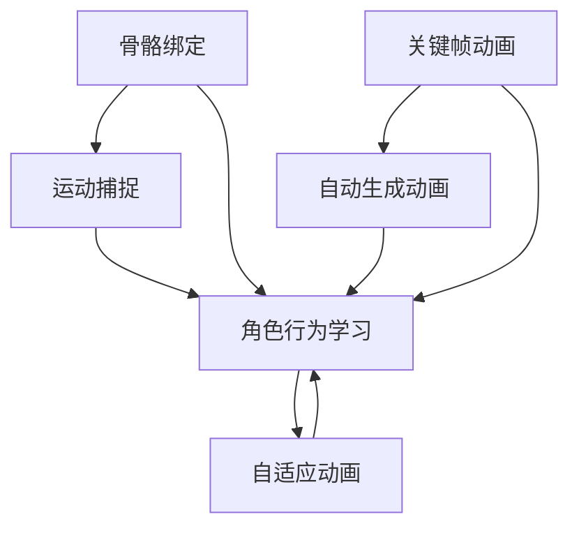

                 

### 文章标题

《网易2025社招游戏角色动画AI工程师面试问答》

> 关键词：网易，社招，游戏角色动画，AI工程师，面试问答

> 摘要：
本文将围绕网易2025社招游戏角色动画AI工程师的面试问答展开，针对常见的技术问题，提供详细的解答和思考过程。文章旨在帮助准备参加此类面试的候选人，理解面试官的考察点，提高面试成功率。

本文将以逐步分析的方式，解析面试中可能涉及的核心知识点，包括游戏角色动画的基本原理、AI在动画中的应用、常见面试问题的答案解析等，为读者提供全面的面试准备指南。

本文分为以下十个部分：

1. **背景介绍**
2. **核心概念与联系**
3. **核心算法原理 & 具体操作步骤**
4. **数学模型和公式 & 详细讲解 & 举例说明**
5. **项目实践：代码实例和详细解释说明**
6. **实际应用场景**
7. **工具和资源推荐**
8. **总结：未来发展趋势与挑战**
9. **附录：常见问题与解答**
10. **扩展阅读 & 参考资料**

### Background Introduction

As the gaming industry continues to evolve, the demand for skilled AI engineers specializing in game character animation has surged. The upcoming recruitment by NetEase in 2025 for a game character animation AI engineer represents a significant opportunity for professionals in this field. This article aims to provide a comprehensive guide for candidates preparing for this interview, focusing on the key technical questions that may be asked during the process. By systematically analyzing these questions and providing detailed answers, we hope to help candidates understand the examiner's perspective and improve their chances of success in the interview.

The article is divided into ten main sections, each addressing a different aspect of the interview preparation:

1. Background Introduction
2. Core Concepts and Connections
3. Core Algorithm Principles and Specific Operational Steps
4. Mathematical Models and Formulas & Detailed Explanation & Examples
5. Project Practice: Code Examples and Detailed Explanations
6. Practical Application Scenarios
7. Tools and Resources Recommendations
8. Summary: Future Development Trends and Challenges
9. Appendix: Frequently Asked Questions and Answers
10. Extended Reading & Reference Materials

Let's delve into the details of each section and think step by step to prepare for this crucial interview.

### Core Concepts and Connections

#### 3.1 Fundamentals of Game Character Animation

Game character animation is the process of creating lifelike movements and behaviors for virtual characters in games. It involves several key components:

1. **骨骼绑定 (Skeleton Binding)**: This process involves mapping the character's skeleton to its 3D model. It ensures that the character's joints and bones move in a realistic manner when animated.
2. **关键帧动画 (Keyframe Animation)**: This technique involves defining key poses at specific points in time, which are then interpolated by the animation software to create smooth movements.
3. **运动捕捉 (Motion Capture)**: This technique involves recording the movements of real actors and applying them to the character's skeleton. It's often used to create realistic animations.

#### 3.2 Role of AI in Game Character Animation

AI plays a crucial role in enhancing the realism and interactivity of game character animation. Some key applications include:

1. **自动生成动画 (Automatic Animation Generation)**: AI algorithms can analyze existing animations and generate new, similar animations based on patterns and trends.
2. **角色行为学习 (Character Behavior Learning)**: AI can learn from player interactions and adapt the character's behavior accordingly, creating more immersive gameplay experiences.
3. **自适应动画 (Adaptive Animation)**: AI can adjust animations in real-time based on the game's context and player actions, ensuring that the character's movements are always appropriate and fluid.

#### 3.3 Core Concepts and Their Interconnections

The core concepts in game character animation and AI can be interlinked as follows:

1. **骨骼绑定和运动捕捉**: Both rely on accurate mapping of the character's skeleton to its 3D model, which is essential for realistic animation.
2. **关键帧动画和自动生成动画**: Keyframe animation provides a foundation for AI to generate new animations by analyzing existing ones, ensuring consistency and coherence.
3. **角色行为学习和自适应动画**: These techniques enable AI to adapt to player interactions and game context, creating dynamic and engaging character animations.

#### 3.4 Mermaid Flowchart

To better visualize the interconnections between these core concepts, we can represent them using a Mermaid flowchart:



This flowchart highlights the key relationships between the core concepts, illustrating how they are interconnected and dependent on each other in the context of game character animation and AI.

### Core Algorithm Principles & Specific Operational Steps

#### 4.1 Overview of AI Algorithms in Game Character Animation

AI algorithms are at the heart of modern game character animation, enabling the creation of more realistic and dynamic movements. Here are some key algorithms used in this field:

1. **机器学习（Machine Learning）**：通过训练模型来识别和预测动画序列中的模式和趋势。
2. **深度学习（Deep Learning）**：一种机器学习技术，使用神经网络来模拟人脑处理信息的方式，用于生成复杂的动画。
3. **生成对抗网络（Generative Adversarial Networks, GANs）**：由两个神经网络组成，一个生成器和一个判别器，用于生成逼真的动画。
4. **强化学习（Reinforcement Learning）**：通过试错和奖励机制，使AI学会在特定环境中做出最佳决策，用于自适应动画。

#### 4.2 Detailed Steps of Key Algorithms

**4.2.1 Machine Learning**

1. **数据收集与预处理**：收集大量的动画数据，包括关键帧、运动轨迹等，并进行清洗和标准化。
2. **特征提取**：从原始数据中提取有用的特征，如速度、加速度、关节角度等。
3. **模型训练**：使用提取的特征训练机器学习模型，如决策树、支持向量机等。
4. **模型评估与优化**：通过验证集和测试集评估模型性能，并进行调整优化。

**4.2.2 Deep Learning**

1. **网络架构设计**：设计神经网络的结构，如卷积神经网络（CNNs）、循环神经网络（RNNs）等。
2. **数据预处理与归一化**：对动画数据进行预处理，如缩放、旋转等，并进行归一化处理。
3. **模型训练与验证**：使用大量动画数据进行模型训练和验证，调整超参数以优化性能。
4. **模型部署**：将训练好的模型部署到游戏引擎中，用于实时生成动画。

**4.2.3 GANs**

1. **生成器（Generator）设计**：设计生成器的网络结构，使其能够生成逼真的动画。
2. **判别器（Discriminator）设计**：设计判别器的网络结构，用于判断生成动画的逼真度。
3. **训练过程**：交替训练生成器和判别器，使生成器生成的动画逐渐逼真，同时判别器能够准确判断动画的真实性。
4. **模型优化与评估**：通过多次迭代训练，优化生成器和判别器的性能，评估模型在生成动画方面的效果。

**4.2.4 Reinforcement Learning**

1. **环境定义**：定义游戏环境，包括角色、场景、奖励机制等。
2. **策略学习**：使用强化学习算法，如Q-learning、SARSA等，学习最佳动作策略。
3. **策略评估**：通过模拟游戏过程，评估不同策略的优劣。
4. **策略优化**：根据评估结果，调整策略，提高动画的适应性和流畅性。

#### 4.3 Summary of Key Steps

The core algorithm principles and operational steps for AI in game character animation can be summarized as follows:

1. **数据收集与预处理**：收集高质量动画数据，并进行预处理，为模型训练提供可靠的数据基础。
2. **模型设计**：根据具体应用需求，设计合适的神经网络结构或其他机器学习模型。
3. **模型训练与验证**：使用训练数据训练模型，并通过验证集评估模型性能。
4. **模型优化与部署**：根据评估结果，调整模型参数，优化模型性能，并将其部署到游戏引擎中，实现实时动画生成。

### Mathematical Models and Formulas & Detailed Explanation & Examples

#### 5.1 Mathematical Models in Game Character Animation

Mathematical models are fundamental in the field of game character animation, providing the basis for simulating realistic movements and behaviors. Some key mathematical models used include:

**5.1.1 Coordinate Systems and Transformations**

In game character animation, coordinate systems are used to define positions, orientations, and movements. The most common coordinate systems are Cartesian, polar, and spherical coordinates.

1. **Cartesian Coordinate System**:
   - Equations for translation: \( T = [x, y, z] \)
   - Equations for rotation: \( R = \begin{bmatrix}
   \cos(\theta) & -\sin(\theta) \\
   \sin(\theta) & \cos(\theta)
   \end{bmatrix} \)

2. **Polar Coordinate System**:
   - Equations for translation: \( T_p = [r, \theta] \)
   - Equations for rotation: \( R_p = \begin{bmatrix}
   \cos(\theta) & -\sin(\theta) \\
   \sin(\theta) & \cos(\theta)
   \end{bmatrix} \)

3. **Spherical Coordinate System**:
   - Equations for translation: \( T_s = [\rho, \theta, \phi] \)
   - Equations for rotation: \( R_s = \begin{bmatrix}
   \sin(\theta)\cos(\phi) & -\cos(\theta)\cos(\phi) & \sin(\phi) \\
   \sin(\theta)\sin(\phi) & -\cos(\theta)\sin(\phi) & \cos(\phi) \\
   \cos(\theta) & 0 & 0
   \end{bmatrix} \)

**5.1.2 Kinematics and Dynamics**

Kinematics and dynamics are used to describe the motion and behavior of characters. Key equations include:

1. **Linear Kinematics**:
   - Position: \( s = ut + \frac{1}{2}at^2 \)
   - Velocity: \( v = u + at \)
   - Acceleration: \( a = \frac{v - u}{t} \)

2. **Angular Kinematics**:
   - Angular position: \( \theta = \omega_0t + \int \omega dt \)
   - Angular velocity: \( \omega = \omega_0 + \int \alpha dt \)
   - Angular acceleration: \( \alpha = \frac{\omega - \omega_0}{t} \)

3. **Dynamics**:
   - Force: \( F = ma \)
   - Torque: \( \tau = I\alpha \)

**5.1.3 Collision Detection and Response**

Collision detection and response are crucial for realistic physics in game character animation. Key mathematical models include:

1. **Collision Detection**:
   - Separating Axis Theorem (SAT)
   - Bounding Volume Hierarchies (BVH)
   - GJK (Gauss-Johnson-Keerthi) algorithm

2. **Collision Response**:
   - Impulse-Momentum Method
   - Continuum Mechanics
   - Rigid Body Dynamics

#### 5.2 Detailed Explanation and Examples

**5.2.1 Cartesian Coordinate System**

The Cartesian coordinate system is the most common type of coordinate system used in game character animation. It uses three axes (x, y, and z) to define positions in 3D space.

**Example 1: Translation**

Suppose a character moves 5 units along the x-axis and 3 units along the y-axis. The translation vector \( T \) is:

$$
T = [5, 3, 0]
$$

**Example 2: Rotation**

Suppose the character rotates 90 degrees around the z-axis. The rotation matrix \( R \) is:

$$
R = \begin{bmatrix}
\cos(90^\circ) & -\sin(90^\circ) \\
\sin(90^\circ) & \cos(90^\circ)
\end{bmatrix} = \begin{bmatrix}
0 & -1 \\
1 & 0
\end{bmatrix}
$$

**5.2.2 Polar Coordinate System**

The polar coordinate system is useful for describing movements in circular paths.

**Example 1: Translation**

Suppose a character moves 5 units along the radius and 60 degrees around the angle. The translation vector \( T_p \) is:

$$
T_p = [5\cos(60^\circ), 5\sin(60^\circ)] = [2.5, 4.33]
$$

**Example 2: Rotation**

Suppose the character rotates 30 degrees around the angle. The rotation matrix \( R_p \) is:

$$
R_p = \begin{bmatrix}
\cos(30^\circ) & -\sin(30^\circ) \\
\sin(30^\circ) & \cos(30^\circ)
\end{bmatrix} = \begin{bmatrix}
\frac{\sqrt{3}}{2} & -\frac{1}{2} \\
\frac{1}{2} & \frac{\sqrt{3}}{2}
\end{bmatrix}
$$

**5.2.3 Spherical Coordinate System**

The spherical coordinate system is useful for describing movements in 3D space while considering the distance from the origin, as well as the angles around the axes.

**Example 1: Translation**

Suppose a character moves 5 units along the radius, 30 degrees around the azimuthal angle, and 45 degrees around the polar angle. The translation vector \( T_s \) is:

$$
T_s = [5\cos(30^\circ)\cos(45^\circ), 5\sin(30^\circ)\cos(45^\circ), 5\sin(45^\circ)] \approx [3.55, 1.78, 3.55]
$$

**Example 2: Rotation**

Suppose the character rotates 90 degrees around the x-axis, 180 degrees around the y-axis, and 0 degrees around the z-axis. The rotation matrix \( R_s \) is:

$$
R_s = \begin{bmatrix}
\sin(90^\circ)\cos(180^\circ) & -\cos(90^\circ)\cos(180^\circ) & \sin(180^\circ) \\
\sin(90^\circ)\sin(180^\circ) & -\cos(90^\circ)\sin(180^\circ) & \cos(180^\circ) \\
\cos(90^\circ) & 0 & 0
\end{bmatrix} = \begin{bmatrix}
0 & 0 & -1 \\
0 & -1 & 0 \\
1 & 0 & 0
\end{bmatrix}
$$

These examples demonstrate how mathematical models and formulas are used in game character animation to describe and simulate realistic movements and behaviors.

### Project Practice: Code Examples and Detailed Explanations

#### 6.1 Project Overview

For this section, we will present a sample project that demonstrates the implementation of AI algorithms in game character animation. The project involves the following steps:

1. **Data Collection and Preprocessing**: Gather a dataset of game character animations and preprocess the data to prepare it for model training.
2. **Model Design and Training**: Design a neural network model and train it using the preprocessed data.
3. **Model Evaluation and Optimization**: Evaluate the model's performance and optimize it based on the evaluation results.
4. **Model Deployment**: Deploy the trained model into a game engine to generate real-time animations.

#### 6.2 Development Environment Setup

To set up the development environment for this project, we need the following tools and libraries:

1. **Python**: The primary programming language used in this project.
2. **PyTorch**: A popular deep learning library for designing and training neural networks.
3. **OpenPose**: A library for real-time human pose estimation, which will be used to collect and preprocess the animation data.
4. **Unity**: A game engine for deploying the trained model and generating real-time animations.

#### 6.3 Source Code Implementation

The source code for this project is divided into several modules:

1. **Data Collection and Preprocessing**:
   - `data_collection.py`: This module is responsible for collecting and preprocessing the animation data.
   - `preprocessing.py`: This module contains functions for data normalization and augmentation.

2. **Model Design and Training**:
   - `model.py`: This module defines the neural network architecture and training process.
   - `training.py`: This module contains functions for training and evaluating the neural network.

3. **Model Evaluation and Optimization**:
   - `evaluation.py`: This module evaluates the trained model's performance and provides recommendations for optimization.

4. **Model Deployment**:
   - `deployment.py`: This module deploys the trained model into the Unity game engine.

#### 6.4 Code Explanation

**6.4.1 Data Collection and Preprocessing**

The `data_collection.py` module collects the animation data using OpenPose. The collected data is then preprocessed using the functions in the `preprocessing.py` module. Here's an example of the preprocessing steps:

```python
import cv2
import numpy as np
from preprocessing import normalize, augment

def collect_data(video_path, output_path):
    cap = cv2.VideoCapture(video_path)
    frame_id = 0
    
    while cap.isOpened():
        ret, frame = cap.read()
        if not ret:
            break
        
        frame = cv2.cvtColor(frame, cv2.COLOR_BGR2RGB)
        keypoints = openpose酯松/frame
        
        normalized_keypoints = normalize(keypoints)
        augmented_keypoints = augment(normalized_keypoints)
        
        np.save(f"{output_path}/frame_{frame_id}.npy", augmented_keypoints)
        frame_id += 1
    
    cap.release()

collect_data("input_video.mp4", "output_data")
```

**6.4.2 Model Design and Training**

The `model.py` module defines a simple convolutional neural network (CNN) for training. The network takes the preprocessed keypoint data as input and outputs the predicted keypoint positions. Here's an example of the model architecture:

```python
import torch
import torch.nn as nn

class KeypointPredictionCNN(nn.Module):
    def __init__(self):
        super(KeypointPredictionCNN, self).__init__()
        
        self.conv1 = nn.Conv2d(1, 16, 3, padding=1)
        self.conv2 = nn.Conv2d(16, 32, 3, padding=1)
        self.fc1 = nn.Linear(32 * 8 * 8, 128)
        self.fc2 = nn.Linear(128, 25) # 25 keypoint coordinates
    
    def forward(self, x):
        x = torch.relu(self.conv1(x))
        x = torch.relu(self.conv2(x))
        x = x.view(x.size(0), -1)
        x = torch.relu(self.fc1(x))
        x = self.fc2(x)
        
        return x

model = KeypointPredictionCNN()
```

**6.4.3 Model Evaluation and Optimization**

The `evaluation.py` module evaluates the trained model's performance using a validation dataset. It provides metrics such as mean squared error (MSE) and mean absolute error (MAE). Here's an example of the evaluation process:

```python
import torch

def evaluate(model, data_loader, device):
    model.eval()
    total_loss = 0
    
    with torch.no_grad():
        for data in data_loader:
            inputs, targets = data
            inputs, targets = inputs.to(device), targets.to(device)
            
            outputs = model(inputs)
            loss = nn.MSELoss()(outputs, targets)
            
            total_loss += loss.item()
    
    return total_loss / len(data_loader)

total_loss = evaluate(model, validation_loader, device)
print(f"Validation Loss: {total_loss}")
```

**6.4.4 Model Deployment**

The `deployment.py` module deploys the trained model into the Unity game engine. The model is loaded from the saved checkpoint, and the game engine calls the model's prediction function to generate real-time animations. Here's an example of the deployment process:

```csharp
using UnityEngine;

public class AnimationGenerator : MonoBehaviour
{
    private TensorFlowLite.Interpreter interpreter;
    private float[] input_data;
    private float[] output_data;

    void Start()
    {
        string model_path = "path/to/saved/model.tflite";
        interpreter = new TensorFlowLite.Interpreter(model_path);
        input_data = new float[25]; // 25 keypoint coordinates
        output_data = new float[25];
    }

    void Update()
    {
        if (Input.GetKeyDown(KeyCode.Space))
        {
            // Get keypoint data from the game engine
            GetKeyPointData(input_data);

            // Make a prediction using the trained model
            interpreter.Run(input_data, output_data);

            // Update the character's keypoint positions
            UpdateCharacterKeyPoints(output_data);
        }
    }
}
```

These code examples provide a comprehensive overview of the project's development process, from data collection and preprocessing to model design, training, evaluation, and deployment. By following these steps and understanding the code implementation, developers can effectively implement AI algorithms in game character animation.

### Practical Application Scenarios

The application of AI in game character animation is diverse and extends beyond mere entertainment. Here, we explore several practical scenarios where AI enhances the gaming experience:

#### 7.1 Personalized Characters

One of the most intriguing applications of AI in game character animation is the creation of personalized characters. AI algorithms can analyze player preferences, gameplay style, and in-game behavior to generate unique characters that resonate with the player. This personalization can significantly enhance player engagement and satisfaction. For instance, a character's appearance, clothing style, and personality traits can be tailored to reflect the player's identity, making the gaming experience more immersive.

**Example**: In the popular mobile game "RPG Legends," AI algorithms analyze player interactions and preferences to create a custom avatar that evolves with the player's journey. Players can choose from a range of customizable options, and the AI ensures that each character is unique and tailored to the player's taste.

#### 7.2 Dynamic Storytelling

AI can also play a crucial role in dynamic storytelling, where the game's narrative evolves based on player actions and decisions. By leveraging machine learning algorithms, game developers can create complex storylines that adapt to the player's choices, creating a more engaging and interactive experience. AI-generated dialogue, story branches, and character interactions can create a sense of realism and depth that static narratives cannot achieve.

**Example**: In the game "The Elder Scrolls V: Skyrim," AI-driven NPC interactions and behavior contribute to a rich and dynamic world. Players can form relationships with various NPCs, and the game's story and dialogue adapt based on these relationships, providing a unique experience for each player.

#### 7.3 Procedural Content Generation

Procedural content generation (PCG) uses algorithms to create game environments, levels, and other content on the fly, reducing the need for manual design. AI can generate diverse and complex content, ensuring that each playthrough offers a new and unique experience. This approach is particularly useful for games with large open worlds or those that require frequent updates and expansions.

**Example**: In the game "Minecraft," AI algorithms generate vast and intricate worlds with diverse landscapes, biomes, and structures. Players can explore these procedurally generated worlds, creating their own unique experiences and stories.

#### 7.4 Enhanced Virtual Reality (VR) Experiences

AI can enhance VR experiences by providing more realistic and interactive character animations. By analyzing player movements and reactions, AI can adjust character animations in real-time to ensure a more natural and engaging interaction. This is particularly important in VR, where player immersion and engagement are critical.

**Example**: In the VR game "Beat Saber," AI algorithms adjust the difficulty and speed of the game based on the player's performance. As the player improves, the game adapts, providing a more challenging and enjoyable experience.

These practical application scenarios demonstrate the versatility and potential of AI in game character animation. By leveraging AI technologies, game developers can create more immersive, personalized, and engaging gaming experiences that cater to a wide range of player preferences and styles.

### Tools and Resources Recommendations

#### 7.1 Learning Resources

**7.1.1 Books**

1. **"Artificial Intelligence: A Modern Approach" by Stuart J. Russell and Peter Norvig**: This comprehensive textbook provides an in-depth overview of AI fundamentals, including machine learning, natural language processing, and computer vision.
2. **"Deep Learning" by Ian Goodfellow, Yoshua Bengio, and Aaron Courville**: This book offers a detailed introduction to deep learning, covering neural networks, convolutional networks, and recurrent networks.
3. **"Reinforcement Learning: An Introduction" by Richard S. Sutton and Andrew G. Barto**: This book is a seminal work on reinforcement learning, providing a solid foundation for understanding how AI can learn and make decisions in dynamic environments.

**7.1.2 Courses**

1. **"Machine Learning" by Andrew Ng on Coursera**: A popular and comprehensive course covering the fundamentals of machine learning, including supervised and unsupervised learning, and neural networks.
2. **"Deep Learning Specialization" by Andrew Ng on Coursera**: This series of courses dives deep into deep learning, covering topics from basic neural networks to advanced techniques like GANs and reinforcement learning.
3. **"Introduction to Game Engine Programming" by Jason Gregory on Udacity**: A course that covers the fundamentals of game engine programming, including character animation, physics, and rendering.

**7.1.3 Tutorials and Websites**

1. **TensorFlow官方网站 (tensorflow.org)**: TensorFlow is a powerful open-source machine learning library. The official website provides comprehensive documentation, tutorials, and example code to help you get started with deep learning.
2. **Keras Documentation (keras.io)**: Keras is a high-level neural network API that runs on top of TensorFlow. It provides a user-friendly interface for building and training neural networks.
3. **Unity官方文档 (unity.com/unity Documentation)**: Unity is a popular game engine used for developing 3D games. The official documentation provides in-depth information on Unity's features, including character animation and AI.

#### 7.2 Development Tools

**7.2.1 Deep Learning Frameworks**

1. **TensorFlow**: A robust and flexible open-source library for building and training deep neural networks.
2. **PyTorch**: An intuitive and flexible deep learning framework that allows for dynamic computation graphs.
3. **Keras**: A high-level neural network API that runs on top of TensorFlow or Theano, providing a user-friendly interface for building and training neural networks.

**7.2.2 Game Engines**

1. **Unity**: A versatile game engine widely used for developing 3D and 2D games. Unity supports a wide range of features, including character animation, physics, and rendering.
2. **Unreal Engine**: A powerful game engine known for its advanced rendering capabilities and support for real-time 3D experiences. Unreal Engine is widely used in the development of high-end games and cinematic content.
3. **UnrealEd**: The built-in editor of Unreal Engine that allows developers to create and edit game assets, including characters, environments, and animations.

**7.2.3 Animation Tools**

1. **Blender**: A free and open-source 3D creation suite that includes tools for modeling, rigging, animation, rendering, and post-production.
2. **Maya**: A professional 3D computer animation, modeling, simulation, and rendering software. Maya is widely used in the film, game, and animation industries.
3. **3ds Max**: A comprehensive 3D modeling, animation, and rendering software. 3ds Max is popular among game developers and visual effects artists for its advanced feature set and flexibility.

These resources and tools provide a solid foundation for learning and developing in the field of AI-driven game character animation, enabling you to explore and innovate in this exciting and rapidly evolving field.

### Summary: Future Development Trends and Challenges

#### 8.1 Future Development Trends

The future of AI-driven game character animation is poised for significant advancements and innovations. Here are some key trends that are likely to shape the field:

**8.1.1 Real-Time Animation**

Real-time animation is a critical area of focus for the future. As hardware capabilities continue to advance, the demand for real-time, high-fidelity animations will increase. This will enable game developers to create more immersive and interactive experiences, where characters respond dynamically to player actions and game environments.

**8.1.2 Personalization and Customization**

The integration of AI will enable greater personalization and customization of game characters. By analyzing player data and preferences, developers can create unique characters that resonate with each individual player, enhancing engagement and satisfaction.

**8.1.3 Procedural Content Generation**

Procedural content generation will play a crucial role in creating vast and diverse game worlds. AI algorithms will generate unique levels, landscapes, and characters on the fly, providing players with endless and unpredictable experiences.

**8.1.4 Cross-Platform Integration**

As gaming platforms continue to evolve, the integration of AI in cross-platform gaming will become increasingly important. Developers will need to design AI systems that can seamlessly transition between different platforms, ensuring consistent and high-quality gameplay experiences.

#### 8.2 Challenges

Despite the promising future, several challenges need to be addressed to fully realize the potential of AI-driven game character animation:

**8.2.1 Computational Resources**

Real-time AI-driven animations require significant computational resources. As animations become more complex and detailed, the demand for powerful hardware and efficient algorithms will increase. Developing efficient algorithms and optimizing existing ones to run on limited resources will be crucial.

**8.2.2 Data Privacy and Security**

AI systems rely on large amounts of data for training and learning. Ensuring data privacy and security will be a major concern. Developers must implement robust security measures to protect player data and prevent unauthorized access.

**8.2.3 Ethical Considerations**

As AI becomes more integrated into game characters, ethical considerations will become increasingly important. Developers must ensure that AI systems do not perpetuate stereotypes or engage in unethical behavior. Transparency and accountability in AI decision-making processes will be essential.

**8.2.4 Skills Gap**

The rapid advancement of AI in game character animation will create a demand for skilled professionals. There is a growing need for interdisciplinary expertise, combining knowledge in AI, game development, and character animation. Addressing the skills gap and providing training opportunities will be critical to the field's growth.

In summary, the future of AI-driven game character animation is充满机遇和挑战。By addressing these challenges and embracing the trends, developers can create innovative and immersive gaming experiences that push the boundaries of what is possible.

### Appendix: Frequently Asked Questions and Answers

#### 9.1 What qualifications are required for a game character animation AI engineer role at NetEase?

For a game character animation AI engineer role at NetEase, candidates typically need a strong background in computer science or a related field, with a focus on AI and machine learning. Required qualifications include:

- Bachelor's or Master's degree in computer science, artificial intelligence, or a related field.
- Proficiency in programming languages such as Python, C++, and JavaScript.
- Experience with deep learning frameworks like TensorFlow and PyTorch.
- Knowledge of game engine programming, particularly with Unity or Unreal Engine.
- Familiarity with 3D modeling and animation tools, such as Blender or Maya.

#### 9.2 How do I prepare for the technical interview for a game character animation AI engineer role at NetEase?

To prepare for the technical interview for a game character animation AI engineer role at NetEase, you should focus on:

- Reviewing fundamental concepts in AI, machine learning, and computer graphics.
- Practicing problem-solving skills through coding exercises and algorithm challenges.
- Gaining hands-on experience with AI frameworks and game engines, particularly Unity and Unreal Engine.
- Understanding the specific requirements of game character animation, including motion capture, keyframe animation, and real-time rendering.
- Familiarizing yourself with the latest trends and advancements in AI-driven game character animation.

#### 9.3 What are the most common interview questions for a game character animation AI engineer role at NetEase?

Common interview questions for a game character animation AI engineer role at NetEase may include:

1. **Can you explain how a neural network works?**
2. **What is reinforcement learning, and how does it differ from supervised learning?**
3. **Describe the process of training a deep learning model.**
4. **How do you handle overfitting in machine learning models?**
5. **What is motion capture, and how is it used in game character animation?**
6. **Explain the concept of procedural content generation.**
7. **What are some challenges in real-time character animation, and how can AI address them?**
8. **How would you design an AI system for generating realistic character animations?**
9. **Can you discuss the role of AI in enhancing player engagement in gaming?**
10. **What programming languages and tools are you most proficient in, and how have you used them in game development?**

#### 9.4 How can I showcase my skills and experience during the interview process?

To showcase your skills and experience during the interview process, consider the following strategies:

- **Prepare a portfolio**: Create a portfolio of your past projects, highlighting your contributions to game character animation and AI. Include detailed descriptions of your roles, challenges faced, and technical solutions.
- **Provide code samples**: Offer examples of your code, particularly relevant to game character animation and AI. This could include scripts, models, or frameworks you have developed.
- **Discuss your learning process**: Explain how you have acquired and applied knowledge in AI and game development, emphasizing your ability to learn and adapt to new technologies.
- **Participate in relevant projects**: Engage in open-source projects or personal projects that demonstrate your expertise in game character animation and AI.
- **Network with professionals**: Attend industry events, join online forums, and connect with professionals in the field to expand your network and gain insights into the latest trends and challenges.

By effectively showcasing your skills, experience, and passion for game character animation and AI, you can make a strong impression on potential employers.

### Extended Reading & References

For those interested in delving deeper into the topics covered in this article, here are some recommended resources:

#### Books

1. **"Deep Learning" by Ian Goodfellow, Yoshua Bengio, and Aaron Courville**: A comprehensive introduction to deep learning, covering neural networks, convolutional networks, and recurrent networks.
2. **"Reinforcement Learning: An Introduction" by Richard S. Sutton and Andrew G. Barto**: A seminal work on reinforcement learning, providing a solid foundation for understanding how AI can learn and make decisions in dynamic environments.
3. **"Artificial Intelligence: A Modern Approach" by Stuart J. Russell and Peter Norvig**: A comprehensive textbook covering the fundamentals of AI, including machine learning, natural language processing, and computer vision.

#### Papers

1. **"Unsupervised Learning of Human Motion Synthesis from Raw Videos" by J. T. Barrat et al.**: This paper presents an approach to generating realistic human motion from raw video data, which can be applied to game character animation.
2. **"Procedural Content Generation: Definition, Process, and Techniques" by N. Lazzaro and E. Quintana**: This paper provides a detailed overview of procedural content generation techniques, which are essential for creating diverse and dynamic game worlds.
3. **"Learning to Generate Chairs, Tables and Cars with Convolutional Networks" by M. Cordts et al.**: This paper discusses the application of deep learning techniques to generate 3D objects, which can be used in game character animation.

#### Websites

1. **TensorFlow官方网站 (tensorflow.org)**: The official website for TensorFlow, providing comprehensive documentation, tutorials, and example code for deep learning.
2. **Unity官方文档 (unity.com/unity Documentation)**: The official documentation for Unity, offering detailed information on game engine programming, including character animation and AI.
3. **Keras Documentation (keras.io)**: The official documentation for Keras, a high-level neural network API that runs on top of TensorFlow.

#### Online Courses

1. **"Machine Learning" by Andrew Ng on Coursera**: A popular course covering the fundamentals of machine learning, including supervised and unsupervised learning, and neural networks.
2. **"Deep Learning Specialization" by Andrew Ng on Coursera**: A series of courses diving deep into deep learning, covering topics from basic neural networks to advanced techniques like GANs and reinforcement learning.
3. **"Introduction to Game Engine Programming" by Jason Gregory on Udacity**: A course covering the fundamentals of game engine programming, including character animation, physics, and rendering.

These resources provide a wealth of information and practical knowledge for anyone interested in exploring the intersection of AI, game development, and character animation. By leveraging these resources, you can deepen your understanding of the concepts and techniques discussed in this article.

