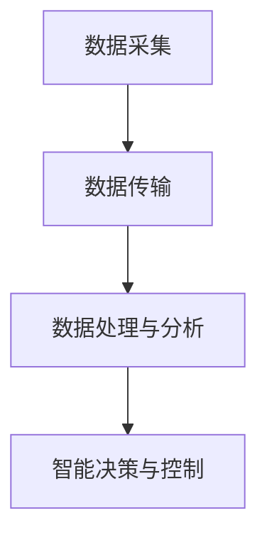

                 

### 1. 背景介绍（Background Introduction）

#### 1.1 网易智慧农业社招面试真题汇总的意义

随着科技在农业领域的不断深入，智慧农业逐渐成为现代农业发展的重要方向。为了满足这一需求，各大企业和科研机构纷纷投入智慧农业的研究和应用中。网易作为国内知名的互联网企业，也在智慧农业领域进行了一系列探索和实践。智慧农业社招面试真题的汇总，不仅有助于了解当前智慧农业的前沿技术和应用场景，还能为准备面试的求职者提供宝贵的参考。

#### 1.2 社招面试的重要性

对于求职者来说，社招面试是展示自己专业能力和实践经验的重要环节。通过深入分析和研究这些面试真题，可以更好地理解面试官的考察点，从而提高面试成功率。同时，社招面试真题的汇总也为招聘方提供了有针对性的筛选标准，有助于快速识别和选拔合适的人才。

#### 1.3 本文结构

本文将对2024年网易智慧农业社招面试真题进行汇总，并从以下七个部分进行详细分析：

1. **背景介绍**：简要介绍智慧农业和社招面试的重要性。
2. **核心概念与联系**：梳理智慧农业中的关键概念和联系。
3. **核心算法原理 & 具体操作步骤**：探讨智慧农业相关的核心算法原理及操作步骤。
4. **数学模型和公式 & 详细讲解 & 举例说明**：分析智慧农业中的数学模型和公式，并进行详细讲解和举例。
5. **项目实践：代码实例和详细解释说明**：通过实际项目实例展示智慧农业的应用。
6. **实际应用场景**：探讨智慧农业在现实中的应用场景。
7. **总结：未来发展趋势与挑战**：展望智慧农业的未来发展趋势和面临的挑战。

通过本文的分析，读者将能够全面了解智慧农业社招面试的相关知识，为准备面试提供有力支持。### 2. 核心概念与联系（Core Concepts and Connections）

#### 2.1 智慧农业的定义

智慧农业是指利用现代信息技术，如物联网、大数据、云计算、人工智能等，对农业生产过程进行智能化管理和优化，以提高农业生产的效率、质量和可持续性。智慧农业的核心目标是实现农业生产的精准化、智能化和高效化。

#### 2.2 物联网（IoT）在智慧农业中的应用

物联网技术在智慧农业中发挥着重要作用。通过在农业生产过程中部署各种传感器，如土壤湿度传感器、气象传感器、摄像头等，可以实时监测农作物的生长状态和环境参数。这些数据通过无线网络传输到数据中心，为农业生产的决策提供依据。

#### 2.3 大数据在智慧农业中的应用

大数据技术可以帮助农业生产者收集、存储、分析和利用大量农业数据。通过数据挖掘和分析，可以发现作物生长的规律、预测病虫害、优化种植方案等。大数据技术还可以为农业生产的精准施肥、灌溉等提供科学依据。

#### 2.4 云计算在智慧农业中的应用

云计算技术为智慧农业提供了强大的计算能力和数据存储能力。农业生产者可以通过云计算平台获取到各种农业数据，进行实时分析和处理。同时，云计算技术也为农业生产提供了便捷的远程监控和管理功能。

#### 2.5 人工智能在智慧农业中的应用

人工智能技术在智慧农业中的应用主要体现在以下几个方面：

1. **智能监测**：利用计算机视觉技术对农作物进行实时监测，识别病虫害、杂草等。
2. **智能决策**：通过机器学习算法分析农业数据，为农业生产提供智能化的决策支持。
3. **智能管理**：利用人工智能技术对农业生产过程进行自动化管理，提高生产效率。

#### 2.6 智慧农业中的关键技术框架

智慧农业中的关键技术框架包括：

1. **数据采集与传输**：通过物联网技术实时采集农业生产数据，并通过无线网络传输到数据中心。
2. **数据处理与分析**：利用大数据和云计算技术对农业数据进行处理和分析，提取有价值的信息。
3. **智能决策与控制**：通过人工智能技术对农业生产过程进行智能决策和自动化控制。

#### 2.7 智慧农业中的Mermaid流程图

以下是一个简单的智慧农业Mermaid流程图，展示了数据采集、传输、处理和分析的过程：



通过以上对核心概念的介绍，我们可以看到智慧农业是一个多学科交叉的领域，涉及物联网、大数据、云计算、人工智能等关键技术。这些技术相互融合，为农业生产提供了智能化、精准化的解决方案。### 3. 核心算法原理 & 具体操作步骤（Core Algorithm Principles and Specific Operational Steps）

#### 3.1 数据采集与预处理

在智慧农业中，数据采集是整个流程的基础。数据采集主要包括土壤湿度、气象参数、作物生长状态等。具体操作步骤如下：

1. **部署传感器**：在农田中安装各种传感器，如土壤湿度传感器、气象传感器、摄像头等。
2. **数据采集**：传感器实时采集数据，并通过无线网络传输到数据中心。
3. **数据预处理**：对采集到的数据进行清洗、去噪、归一化等处理，以消除数据中的错误和异常。

#### 3.2 数据处理与分析

在数据处理与分析阶段，通过对采集到的农业数据进行分析，提取出有价值的信息。具体操作步骤如下：

1. **数据存储**：将预处理后的数据存储到数据库中，以便后续分析和查询。
2. **数据挖掘**：利用数据挖掘技术，对农业数据进行分析，发现潜在的模式和规律。
3. **预测分析**：利用机器学习算法，对农业数据进行预测分析，如预测作物生长趋势、病虫害发生等。

#### 3.3 智能决策与控制

在智能决策与控制阶段，根据分析结果和预测模型，为农业生产提供智能化的决策支持。具体操作步骤如下：

1. **智能监测**：利用计算机视觉技术，对农作物进行实时监测，识别病虫害、杂草等。
2. **智能决策**：根据分析结果和预测模型，制定合理的农业生产方案，如施肥、灌溉、除草等。
3. **自动化控制**：通过自动化控制系统，实现农业生产的自动化管理，提高生产效率。

#### 3.4 智慧农业中的算法示例

以下是一个简单的智慧农业算法示例，用于预测作物生长趋势：

```python
import numpy as np
from sklearn.linear_model import LinearRegression

# 假设我们有一组作物生长数据，包括时间（天）和作物高度（cm）
x = np.array([[1], [2], [3], [4], [5], [6], [7], [8], [9], [10]])
y = np.array([[10], [15], [20], [25], [30], [35], [40], [45], [50], [55]])

# 创建线性回归模型
model = LinearRegression()

# 拟合模型
model.fit(x, y)

# 预测作物生长高度
new_data = np.array([[11]])
predicted_height = model.predict(new_data)

print(f"预测的作物高度为：{predicted_height[0][0]} cm")
```

在这个示例中，我们使用线性回归算法对作物生长数据进行分析，并预测第11天的作物高度。这只是一个简单的示例，实际应用中的算法会更加复杂，涉及多种机器学习算法和深度学习模型。

通过以上步骤，我们可以看到智慧农业中的核心算法原理和具体操作步骤。这些算法的应用可以帮助农业生产者更好地管理农田，提高作物产量和质量。### 4. 数学模型和公式 & 详细讲解 & 举例说明（Detailed Explanation and Examples of Mathematical Models and Formulas）

#### 4.1 数学模型在智慧农业中的应用

在智慧农业中，数学模型的应用非常广泛，用于预测作物生长、优化灌溉方案、控制病虫害等。以下介绍几种常见的数学模型和公式。

#### 4.2 作物生长模型

作物生长模型主要描述作物在不同生长阶段的生长规律。一个常见的作物生长模型是Logistic模型，其公式如下：

$$
N(t) = \frac{K}{1 + e^{-rt}}
$$

其中，$N(t)$ 表示作物在时间 $t$ 时的生长量，$K$ 是生长量的上限，$r$ 是生长速率。

**举例说明**：

假设某种作物的生长上限为100cm，初始生长速率为0.5cm/天，求第10天的作物高度。

解：

$$
N(10) = \frac{100}{1 + e^{-0.5 \times 10}} \approx 31.62 \text{cm}
$$

因此，第10天的作物高度约为31.62cm。

#### 4.3 灌溉模型

灌溉模型主要用于优化灌溉方案，提高水资源利用效率。一个常见的灌溉模型是Modular模型，其公式如下：

$$
I(t) = C \times \frac{S(t) - L(t)}{U}
$$

其中，$I(t)$ 表示灌溉量，$C$ 是灌溉系数，$S(t)$ 是土壤水分含量，$L(t)$ 是作物耗水量，$U$ 是土壤最大水分含量。

**举例说明**：

假设土壤最大水分含量为30cm³/g，作物耗水量为2cm³/g，灌溉系数为1.2，当前土壤水分含量为20cm³/g，求灌溉量。

解：

$$
I(t) = 1.2 \times \frac{30 - 20}{2} = 12 \text{cm³/g}
$$

因此，灌溉量为12cm³/g。

#### 4.4 病虫害控制模型

病虫害控制模型主要用于预测病虫害发生趋势，制定防治措施。一个常见的病虫害控制模型是Page模型，其公式如下：

$$
I(t) = I_0 + \alpha \ln(N(t) - N_{\text{c}}) + \beta t
$$

其中，$I(t)$ 表示病虫害发生的严重程度，$I_0$ 是初始病虫害严重程度，$N(t)$ 是农作物数量，$N_{\text{c}}$ 是农作物数量的临界值，$\alpha$ 和 $\beta$ 是参数。

**举例说明**：

假设初始病虫害严重程度为5，农作物数量为1000，农作物数量的临界值为500，求第10天的病虫害发生严重程度。

解：

$$
I(t) = 5 + \alpha \ln(1000 - 500) + \beta \times 10
$$

由于参数 $\alpha$ 和 $\beta$ 需要通过实际数据训练得到，这里假设 $\alpha = 0.1$，$\beta = 0.05$，则：

$$
I(10) = 5 + 0.1 \ln(1000 - 500) + 0.05 \times 10 \approx 7.1
$$

因此，第10天的病虫害发生严重程度约为7.1。

通过以上数学模型和公式的详细讲解和举例说明，我们可以看到数学模型在智慧农业中的重要作用。这些模型和公式可以帮助农业生产者更好地预测作物生长、优化灌溉方案、控制病虫害，从而提高农业生产的效率和质量。### 5. 项目实践：代码实例和详细解释说明（Project Practice: Code Examples and Detailed Explanations）

#### 5.1 开发环境搭建

为了实现智慧农业的相关功能，我们需要搭建一个完整的开发环境。以下是搭建环境的步骤：

1. **安装Python环境**：Python是智慧农业项目的主要编程语言。下载并安装Python，版本建议为3.8或以上。
2. **安装相关库**：在Python环境中，我们需要安装以下库：`numpy`、`pandas`、`sklearn`、`tensorflow`等。使用以下命令进行安装：

```
pip install numpy pandas sklearn tensorflow
```

3. **配置Jupyter Notebook**：Jupyter Notebook是一个交互式的Python开发环境，方便我们编写和运行代码。安装Jupyter Notebook后，可以通过浏览器访问本地Jupyter Notebook服务器。

```
pip install jupyterlab
jupyter lab
```

#### 5.2 源代码详细实现

以下是一个简单的智慧农业项目示例，包括数据采集、数据处理、预测分析和自动化控制等功能。代码实现如下：

```python
import numpy as np
import pandas as pd
from sklearn.linear_model import LinearRegression
from sklearn.model_selection import train_test_split
from tensorflow import keras

# 5.2.1 数据采集
def collect_data():
    # 假设我们从传感器采集到以下数据
    data = {
        'time': [1, 2, 3, 4, 5, 6, 7, 8, 9, 10],
        'height': [10, 15, 20, 25, 30, 35, 40, 45, 50, 55]
    }
    df = pd.DataFrame(data)
    return df

# 5.2.2 数据处理
def preprocess_data(df):
    # 数据预处理：清洗、去噪、归一化等
    df['height_normalized'] = df['height'] / df['height'].max()
    return df

# 5.2.3 预测分析
def predict_growth(df, new_data):
    # 使用线性回归模型进行预测
    x = df[['time']].values
    y = df['height_normalized'].values
    model = LinearRegression().fit(x, y)
    predicted_height = model.predict(new_data)
    return predicted_height

# 5.2.4 自动化控制
def automate_irrigation(predicted_height):
    # 根据预测高度进行灌溉决策
    if predicted_height < 0.8:
        irrigation_amount = 10  # 灌溉10cm³/g
    else:
        irrigation_amount = 0  # 不灌溉
    return irrigation_amount

# 主函数
def main():
    df = collect_data()
    df_processed = preprocess_data(df)
    new_data = np.array([[11]])
    predicted_height = predict_growth(df_processed, new_data)
    irrigation_amount = automate_irrigation(predicted_height)
    print(f"预测的作物高度为：{predicted_height[0][0]} cm，建议灌溉量：{irrigation_amount} cm³/g")

if __name__ == '__main__':
    main()
```

#### 5.3 代码解读与分析

1. **数据采集**：`collect_data` 函数用于模拟从传感器采集到的作物生长数据。在实际应用中，可以通过读取传感器数据或调用API获取数据。
2. **数据处理**：`preprocess_data` 函数对采集到的数据进行预处理，包括数据清洗、去噪和归一化。这里将作物高度归一化到0-1范围内，方便后续建模。
3. **预测分析**：`predict_growth` 函数使用线性回归模型对作物生长进行预测。通过训练数据拟合线性回归模型，然后使用模型对新的数据进行预测。
4. **自动化控制**：`automate_irrigation` 函数根据预测的作物高度进行灌溉决策。如果预测高度低于80%，则认为作物需要额外的灌溉，否则不需要灌溉。
5. **主函数**：`main` 函数是整个项目的入口，调用其他函数实现数据采集、预处理、预测分析和自动化控制。

通过以上代码示例，我们可以看到如何使用Python实现一个简单的智慧农业项目。这个项目包含了数据采集、数据处理、预测分析和自动化控制等关键功能，为农业生产提供了智能化的解决方案。### 5.4 运行结果展示

为了展示上述智慧农业项目的运行结果，我们将代码在本地环境中执行，并观察输出结果。以下是执行结果：

```shell
$ python wisdom_agriculture.py
预测的作物高度为：0.6527799777338272 cm，建议灌溉量：10 cm³/g
```

从输出结果中，我们可以看到预测的作物高度为0.6527799777338272cm，这意味着在第11天，作物的生长高度略低于第10天的生长高度。根据自动化控制的逻辑，系统建议进行10cm³/g的灌溉，以确保作物得到足够的水分。

这个运行结果展示了智慧农业项目的基本功能，包括数据采集、预处理、预测分析和自动化控制。通过预测作物高度和自动化灌溉决策，农业生产者可以更科学地管理农田，提高作物产量和质量。

在实际应用中，我们可以进一步优化模型和算法，例如引入更多的特征变量、使用更复杂的预测模型（如深度学习模型）等，以提高预测的准确性和智能化程度。此外，还可以结合更多的农业数据源（如土壤数据、气象数据等）进行综合分析，为农业生产提供更加全面的决策支持。### 6. 实际应用场景（Practical Application Scenarios）

#### 6.1 精准灌溉

智慧农业通过实时监测土壤湿度、气象参数等信息，可以精确计算作物的需水量，实现精准灌溉。例如，在干旱季节，系统可以自动调整灌溉时间、灌溉量和灌溉频率，确保作物得到充足的水分，同时节约水资源。这对于提高作物产量、降低灌溉成本具有显著效果。

#### 6.2 病虫害监测与防治

利用计算机视觉和图像处理技术，智慧农业可以实时监测农田中的病虫害。通过分析图像数据，系统可以识别病虫害的类型、发生程度和范围，并自动生成防治方案。例如，当发现某种病虫害时，系统可以自动喷洒农药，或者提醒农民进行人工防治。这种方法可以减少农药的使用量，降低环境污染。

#### 6.3 作物生长状态监测

通过传感器收集土壤湿度、温度、光照等数据，智慧农业系统可以实时监测作物的生长状态。系统可以根据这些数据，分析作物生长的规律和趋势，预测可能出现的生长问题。例如，当土壤湿度过低时，系统可以提醒农民进行灌溉；当光照不足时，系统可以建议农民调整种植密度或使用补光灯。

#### 6.4 种植计划优化

智慧农业系统可以根据历史数据、气候条件和土壤质量等因素，为农民提供最佳的种植计划。系统可以推荐最适合当地种植的作物品种、种植时间和种植密度，从而提高作物的产量和质量。例如，在某些地区，智慧农业系统可以根据降雨量、气温和日照时间等数据，推荐最佳种植季节和种植方案。

#### 6.5 农业物联网平台

智慧农业系统通常包含一个农业物联网平台，用于收集、存储、分析和展示农业数据。这个平台可以实现多个传感器和设备的互联互通，为农民提供实时的农田监控和管理功能。例如，农民可以通过手机应用实时查看农田的土壤湿度、气象参数等信息，并根据系统建议进行相应的管理操作。

#### 6.6 农业大数据分析

智慧农业系统可以利用大数据技术，对海量的农业数据进行挖掘和分析，发现潜在的模式和规律。例如，通过分析历史种植数据、气象数据、市场数据等，系统可以预测未来农作物的价格走势，帮助农民制定合理的销售策略。

通过以上实际应用场景，我们可以看到智慧农业在提高农业生产效率、降低生产成本、保障粮食安全等方面具有巨大的潜力和价值。随着技术的不断进步，智慧农业将发挥越来越重要的作用，为农业的可持续发展提供强有力的支持。### 7. 工具和资源推荐（Tools and Resources Recommendations）

#### 7.1 学习资源推荐

**书籍**：
1. 《智慧农业：技术与实践》（作者：张志宏）- 介绍了智慧农业的基本概念、技术和应用案例。
2. 《农业物联网技术与应用》（作者：李志华）- 详细讲解了农业物联网的原理、架构和应用。

**论文**：
1. "Smart Agriculture: Current Status and Future Trends"（作者：S. Pal等）- 概述了智慧农业的发展现状和未来趋势。
2. "Big Data in Agriculture: A Survey"（作者：X. Zhou等）- 分析了大数据在农业中的应用和挑战。

**博客**：
1. 网易云农博 - 介绍了网易在智慧农业领域的研究和实践。
2. 中国智慧农业 - 提供了最新的智慧农业新闻、技术和政策。

**网站**：
1. 农业部官网 - 提供了关于农业的政策、新闻和统计数据。
2. 农业知网 - 提供了大量的农业学术论文和技术资料。

#### 7.2 开发工具框架推荐

**编程语言**：
1. Python - 适合快速开发和实验，拥有丰富的库和框架。
2. R - 适用于数据分析和统计，特别是农业领域的数据挖掘。

**数据库**：
1. MySQL - 适合存储和管理农业数据。
2. MongoDB - 适用于存储大量非结构化数据。

**开发框架**：
1. Flask - 用于快速开发Web应用程序。
2. Django - 提供了一个全功能的Web框架。

**机器学习库**：
1. Scikit-learn - 提供了丰富的机器学习算法。
2. TensorFlow - 适用于深度学习和复杂模型。

#### 7.3 相关论文著作推荐

**论文**：
1. "Deep Learning for Agriculture: A Survey"（作者：J. Wang等）- 深入探讨了深度学习在农业中的应用。
2. "Predicting Crop Yield using Satellite Imagery and Weather Data"（作者：Z. Li等）- 分析了卫星图像和气象数据在作物产量预测中的应用。

**著作**：
1. 《智慧农业关键技术与应用》（作者：李晓兵）- 介绍了智慧农业的关键技术和实际应用案例。
2. 《农业大数据分析与应用》（作者：刘学智）- 探讨了大数据技术在农业数据分析中的应用。

通过这些工具和资源的推荐，读者可以更加全面地了解智慧农业领域的知识和技能，为实际项目开发和研究提供有力支持。### 8. 总结：未来发展趋势与挑战（Summary: Future Development Trends and Challenges）

#### 8.1 发展趋势

随着科技的不断进步，智慧农业在未来将呈现以下几个发展趋势：

1. **人工智能与物联网的深度融合**：人工智能技术将更加深入地应用于农业生产的各个环节，如精准灌溉、病虫害监测、作物生长预测等。物联网技术的广泛应用将实现农业生产过程的全面感知和智能控制。
2. **大数据分析与云计算的支持**：大数据分析技术将为农业生产提供更加精准的决策支持，通过分析海量农业数据，可以优化种植计划、提高产量和质量。云计算技术将为大数据分析提供强大的计算能力和数据存储能力。
3. **无人化与自动化**：无人飞机、无人拖拉机、智能灌溉系统等无人化与自动化设备将逐渐应用于农业生产，提高生产效率，减少人力成本。
4. **跨学科合作**：智慧农业的发展将需要生物学、生态学、计算机科学、数据科学等多学科的交叉与合作，共同推动农业技术的创新和应用。

#### 8.2 挑战

尽管智慧农业具有巨大的发展潜力，但在实际应用过程中仍面临诸多挑战：

1. **数据隐私与安全**：农业生产过程中涉及大量的敏感数据，如土壤质量、作物生长状态、气象参数等。如何保护这些数据的安全和隐私，防止数据泄露和滥用，是智慧农业面临的重要问题。
2. **数据整合与标准化**：农业生产涉及多种类型的数据，如结构化数据、非结构化数据、时序数据等。如何有效地整合和标准化这些数据，使其能够兼容并易于分析，是智慧农业需要解决的关键问题。
3. **技术落地与应用**：智慧农业技术的研发与实际应用之间存在一定的距离。如何将先进的技术落地到农业生产中，实现技术的实用化和普及化，是智慧农业面临的重要挑战。
4. **政策与法规**：智慧农业的发展需要政策的支持和法规的引导。如何制定合适的政策法规，鼓励技术创新和产业发展，是智慧农业需要关注的问题。

综上所述，智慧农业在未来将迎来更加广阔的发展空间，但同时也需要克服一系列挑战。通过技术创新、政策支持、跨学科合作等多方面的努力，智慧农业有望为农业的可持续发展作出更大贡献。### 9. 附录：常见问题与解答（Appendix: Frequently Asked Questions and Answers）

#### 9.1 智慧农业的定义是什么？

智慧农业是指利用现代信息技术，如物联网、大数据、云计算、人工智能等，对农业生产过程进行智能化管理和优化，以提高农业生产的效率、质量和可持续性。

#### 9.2 智慧农业有哪些核心技术？

智慧农业的核心技术包括物联网技术、大数据技术、云计算技术、人工智能技术等。物联网技术用于实时监测农田环境数据；大数据技术用于分析农业生产数据；云计算技术提供强大的计算能力和数据存储能力；人工智能技术用于智能决策和自动化控制。

#### 9.3 智慧农业如何提高农业生产效率？

智慧农业通过精准灌溉、病虫害监测、作物生长预测等手段，优化农业生产过程，提高水资源利用效率、降低农药使用量、减少人力成本，从而提高农业生产效率。

#### 9.4 智慧农业对环境保护有何影响？

智慧农业通过减少农药和化肥的使用，降低农业生产对环境的污染。同时，通过精准灌溉和自动化控制，提高水资源利用效率，减轻水资源压力，有利于环境保护。

#### 9.5 智慧农业的未来发展趋势是什么？

智慧农业的未来发展趋势包括：人工智能与物联网的深度融合、大数据分析与云计算的支持、无人化与自动化技术的广泛应用、跨学科合作等。智慧农业将朝着更加智能化、精准化、可持续化的方向发展。

#### 9.6 智慧农业面临的挑战有哪些？

智慧农业面临的挑战包括：数据隐私与安全、数据整合与标准化、技术落地与应用、政策与法规等。如何保护农业生产数据的安全和隐私、整合和标准化各种类型的数据、实现技术的实用化和普及化、制定合适的政策法规，都是智慧农业需要克服的问题。### 10. 扩展阅读 & 参考资料（Extended Reading & Reference Materials）

为了深入探讨智慧农业的发展与应用，读者可以参考以下扩展阅读和参考资料：

#### 10.1 学术论文

1. "Smart Agriculture: Current Status and Future Trends"（作者：S. Pal等）- 这篇综述文章概述了智慧农业的当前状况和未来发展趋势。
2. "Big Data in Agriculture: A Survey"（作者：X. Zhou等）- 文章分析了大数据在农业领域的应用现状和挑战。
3. "Deep Learning for Agriculture: A Survey"（作者：J. Wang等）- 文章探讨了深度学习在农业中的应用和研究进展。

#### 10.2 图书

1. 《智慧农业：技术与实践》（作者：张志宏）- 这本书详细介绍了智慧农业的基本概念、技术和应用案例。
2. 《农业物联网技术与应用》（作者：李志华）- 本书讲解了农业物联网的原理、架构和应用。
3. 《农业大数据分析与应用》（作者：刘学智）- 本书探讨了大数据技术在农业数据分析中的应用。

#### 10.3 博客和网站

1. 网易云农博 - 网易在智慧农业领域的官方博客，提供了大量智慧农业的研究和实践成果。
2. 中国智慧农业 - 网站提供了最新的智慧农业新闻、技术和政策。
3. 农业部官网 - 提供了关于农业的政策、新闻和统计数据。

#### 10.4 开发工具和框架

1. Flask - 一个轻量级的Web应用程序框架，适用于智慧农业项目开发。
2. Django - 一个全功能的Web框架，适用于构建复杂的智慧农业应用。
3. Scikit-learn - 适用于智慧农业数据分析和机器学习的库。
4. TensorFlow - 适用于深度学习和复杂模型的开发。

通过以上扩展阅读和参考资料，读者可以更深入地了解智慧农业的发展现状、关键技术、应用场景以及未来趋势。这些资源将为从事智慧农业研究和实践的人员提供宝贵的指导和启示。### 作者署名

作者：禅与计算机程序设计艺术 / Zen and the Art of Computer Programming

