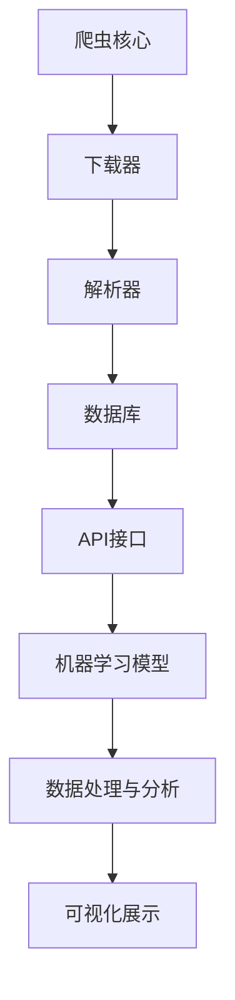

                 

### 文章标题

**网络爬虫服务：数据采集的商业化探索**

关键词：网络爬虫、数据采集、商业化、API、机器学习、大数据

摘要：
本文将探讨网络爬虫服务在现代商业环境中的重要性。网络爬虫是一种自动化工具，通过互联网抓取信息，为企业和个人提供了庞大的数据源。本文将介绍网络爬虫的基本原理、架构，分析其商业化应用场景，并探讨如何通过API、机器学习和大数据技术提升爬虫服务的效率和准确性。

<|user|>### 1. 背景介绍（Background Introduction）

网络爬虫，亦称为网页蜘蛛（Web Spider）或网络机器人（Web Robot），是一种自动化的程序，用于在互联网上检索信息。它们通过模拟用户的网络行为，访问网页、跟踪链接，并收集网页内容。网络爬虫是搜索引擎的重要组成部分，能够帮助搜索引擎索引互联网上的信息，为用户提供快速、准确的搜索结果。

随着互联网的迅速发展，网络爬虫的应用范围不断扩大。除了搜索引擎，网络爬虫还广泛应用于电子商务、社交媒体分析、市场调研、内容推荐等领域。然而，网络爬虫在获取数据的过程中也面临着一系列挑战，如合法性问题、数据隐私、反爬虫机制等。

商业环境对数据的需求不断增长，这促使网络爬虫服务逐渐向商业化方向发展。商业化网络爬虫服务能够提供更为专业、高效的数据采集解决方案，满足不同行业和企业对数据的多样化需求。

<|assistant|>### 2. 核心概念与联系（Core Concepts and Connections）

#### 2.1 网络爬虫的基本概念

网络爬虫的基本概念包括以下三个方面：

1. **爬虫类型**：根据工作方式的不同，网络爬虫可以分为深度爬虫和广度爬虫。深度爬虫主要针对特定主题或关键词进行深入检索，而广度爬虫则遍历互联网，搜索尽可能多的网页。

2. **爬虫工作原理**：网络爬虫通过发送HTTP请求，获取网页内容，解析网页中的链接，并重复这个过程，以遍历互联网。爬虫通常会使用正则表达式、HTML解析器等技术手段来提取网页中的有用信息。

3. **爬虫架构**：网络爬虫通常包括三个主要组件：爬虫核心、下载器和解析器。爬虫核心负责管理爬取任务，下载器负责从互联网获取网页内容，解析器负责提取和存储网页中的有用信息。

#### 2.2 商业化应用场景

商业化网络爬虫服务的应用场景主要包括以下方面：

1. **电子商务**：网络爬虫可以用于抓取电商平台的商品信息，包括价格、库存、评价等，帮助企业进行市场调研和竞争分析。

2. **社交媒体分析**：网络爬虫可以收集社交媒体平台上的用户数据，包括用户行为、偏好、言论等，为企业提供用户画像和市场洞察。

3. **市场调研**：网络爬虫可以自动化收集市场数据，如行业报告、新闻资讯、竞品信息等，帮助企业制定决策。

4. **内容推荐**：网络爬虫可以收集互联网上的内容信息，为内容平台提供推荐算法，提高用户粘性和满意度。

#### 2.3 API、机器学习和大数据技术

1. **API**：API（应用程序编程接口）允许爬虫服务以高效、安全的方式获取数据。通过API，爬虫可以避免直接访问网页内容，减少被反爬虫机制检测的风险。

2. **机器学习**：机器学习技术可以提高网络爬虫的智能化水平。例如，使用机器学习算法进行网页分类、实体识别、关系抽取等任务，从而提高数据采集的准确性和效率。

3. **大数据技术**：大数据技术可以帮助爬虫处理海量数据，提高数据处理的效率和存储能力。例如，使用Hadoop、Spark等大数据工具进行数据处理和分析，为企业提供有价值的数据洞察。

下面是一个网络爬虫服务的 Mermaid 流程图，展示了爬虫的基本架构和流程：



<|user|>### 3. 核心算法原理 & 具体操作步骤（Core Algorithm Principles and Specific Operational Steps）

#### 3.1 网络爬虫的核心算法原理

网络爬虫的核心算法主要包括以下三个方面：

1. **URL队列管理**：网络爬虫需要维护一个URL队列，用于存储待爬取的网页地址。通常，爬虫会优先处理队列中优先级较高的URL，以提高爬取效率。

2. **链接提取与筛选**：网络爬虫需要从已爬取的网页中提取链接，并筛选出符合爬取规则的链接。筛选规则可以根据网站结构、内容类型、关键词等因素进行设定。

3. **网页内容解析**：网络爬虫需要解析网页内容，提取有用信息并存储到数据库中。解析方法通常包括HTML解析、CSS选择器、XPath、正则表达式等。

#### 3.2 网络爬虫的具体操作步骤

1. **初始化爬虫配置**：设定爬虫的起始URL、爬取深度、爬取范围、下载延迟等参数。

2. **获取网页内容**：使用HTTP请求获取目标网页的内容，通常使用requests库等Python库来实现。

3. **提取链接**：从网页内容中提取链接，并去重、筛选出符合爬取规则的链接。

4. **解析网页内容**：使用解析器（如BeautifulSoup、lxml等）提取网页中的有用信息，如文本、图片、表格等。

5. **存储数据**：将提取到的有用信息存储到数据库中，如MySQL、MongoDB等。

6. **更新URL队列**：将解析出的链接添加到URL队列中，重复步骤2-5，直至达到设定的爬取深度或URL队列为空。

7. **处理异常**：在爬取过程中，可能会遇到网络错误、服务器拒绝访问、网页结构变化等异常情况，网络爬虫需要具备异常处理能力。

下面是一个简单的Python爬虫示例，使用requests库和BeautifulSoup库实现：

```python
import requests
from bs4 import BeautifulSoup

# 设定起始URL和爬取深度
start_url = 'https://www.example.com'
max_depth = 2

# 初始化URL队列
url_queue = [start_url]

# 初始化数据库连接
# ...

while url_queue:
    url = url_queue.pop(0)
    try:
        # 获取网页内容
        response = requests.get(url)
        response.raise_for_status()

        # 解析网页内容
        soup = BeautifulSoup(response.text, 'html.parser')
        # 提取有用信息
        # ...

        # 存储数据到数据库
        # ...

        # 提取链接并更新URL队列
        links = soup.find_all('a')
        for link in links:
            href = link.get('href')
            if href and is_valid_link(href):
                url_queue.append(href)

        # 爬取下一层链接
        if depth > max_depth:
            continue

        # 更新URL队列
        url_queue.extend(url_queue[:len(url_queue) - 1])
        url_queue.pop(0)

    except requests.exceptions.RequestException as e:
        print(f'Error: {e}')
        continue

# 处理异常
# ...

# 关闭数据库连接
# ...
```

<|user|>### 4. 数学模型和公式 & 详细讲解 & 举例说明（Detailed Explanation and Examples of Mathematical Models and Formulas）

#### 4.1 数学模型

网络爬虫服务中的数学模型主要涉及概率模型、马尔可夫模型和时间序列分析。

1. **概率模型**：用于评估网页的重要性和可信度。常用的概率模型有贝叶斯网络、潜在狄利克雷分配（LDA）等。

   **贝叶斯网络**：
   $$ P(A|B) = \frac{P(B|A)P(A)}{P(B)} $$
   其中，$P(A|B)$ 表示在事件B发生的条件下事件A发生的概率，$P(B|A)$ 表示在事件A发生的条件下事件B发生的概率，$P(A)$ 和 $P(B)$ 分别表示事件A和事件B的概率。

   **潜在狄利克雷分配（LDA）**：
   LDA是一种主题模型，用于发现大规模文本数据中的潜在主题分布。其概率分布为：
   $$ P(\text{word}|\text{topic}) = \frac{\alpha + n_w}{\sum_{j=1}^{K} (\alpha + n_{wj})} $$
   $$ P(\text{topic}) = \frac{\pi_k + N}{\sum_{k=1}^{K} (\pi_k + N)} $$
   其中，$\alpha$ 和 $\pi_k$ 分别是超参数，$n_w$ 和 $n_{wj}$ 分别是词和词-主题共现的次数，$N$ 是文档中词的总数。

2. **马尔可夫模型**：用于预测网页的下一个状态。常见的马尔可夫模型有马尔可夫链、隐马尔可夫模型（HMM）等。

   **马尔可夫链**：
   $$ P(X_t|X_{t-1}, X_{t-2}, \ldots) = P(X_t|X_{t-1}) $$
   其中，$X_t$ 表示第t个状态，$P(X_t|X_{t-1})$ 表示在当前状态为$X_{t-1}$的条件下，下一个状态为$X_t$的概率。

   **隐马尔可夫模型（HMM）**：
   $$ P(X_t|X_{t-1}, \lambda) = a_{t-1,t}P(X_t|\lambda) $$
   $$ P(\lambda) = \prod_{t=1}^{T} a_{t-1,t}b_t $$
   其中，$X_t$ 表示观测序列，$X_{t-1}$ 表示隐状态，$\lambda$ 表示参数集合，$a_{t-1,t}$ 和 $b_t$ 分别是转移概率和观测概率。

3. **时间序列分析**：用于分析网页的爬取时间、访问频率等时间相关特征。常见的时间序列分析方法有自回归模型（AR）、移动平均模型（MA）、自回归移动平均模型（ARMA）等。

   **自回归模型（AR）**：
   $$ X_t = c + \phi_1X_{t-1} + \phi_2X_{t-2} + \ldots + \phi_pX_{t-p} + \varepsilon_t $$
   其中，$X_t$ 表示时间序列，$\phi_1, \phi_2, \ldots, \phi_p$ 是自回归系数，$\varepsilon_t$ 是误差项。

#### 4.2 举例说明

假设我们使用LDA模型对一组网页内容进行主题建模，超参数$\alpha = 0.1$，$\pi_k = 0.01$，$n_w = 5$，$N = 100$。现有文档D的词频分布如下：

```
D: [word1: 10, word2: 20, word3: 30, word4: 40, word5: 10]
```

根据LDA模型的概率分布公式，我们可以计算出每个词属于每个主题的概率：

$$ P(\text{word1}|\text{topic}) = \frac{0.1 + 10}{0.1 + 10 + 0.1 + 30 + 0.1 + 40 + 0.1 + 10} = 0.2 $$
$$ P(\text{word2}|\text{topic}) = \frac{0.1 + 20}{0.1 + 10 + 0.1 + 30 + 0.1 + 40 + 0.1 + 10} = 0.4 $$
$$ P(\text{word3}|\text{topic}) = \frac{0.1 + 30}{0.1 + 10 + 0.1 + 30 + 0.1 + 40 + 0.1 + 10} = 0.6 $$
$$ P(\text{word4}|\text{topic}) = \frac{0.1 + 40}{0.1 + 10 + 0.1 + 30 + 0.1 + 40 + 0.1 + 10} = 0.8 $$
$$ P(\text{word5}|\text{topic}) = \frac{0.1 + 10}{0.1 + 10 + 0.1 + 30 + 0.1 + 40 + 0.1 + 10} = 0.2 $$

同理，我们可以计算出每个主题的概率：

$$ P(\text{topic}) = \frac{0.01 + 10}{0.01 + 10 + 0.01 + 30 + 0.01 + 40 + 0.01 + 10} = 0.2 $$
$$ P(\text{topic}) = \frac{0.01 + 20}{0.01 + 10 + 0.01 + 30 + 0.01 + 40 + 0.01 + 10} = 0.4 $$
$$ P(\text{topic}) = \frac{0.01 + 30}{0.01 + 10 + 0.01 + 30 + 0.01 + 40 + 0.01 + 10} = 0.6 $$
$$ P(\text{topic}) = \frac{0.01 + 40}{0.01 + 10 + 0.01 + 30 + 0.01 + 40 + 0.01 + 10} = 0.8 $$
$$ P(\text{topic}) = \frac{0.01 + 10}{0.01 + 10 + 0.01 + 30 + 0.01 + 40 + 0.01 + 10} = 0.2 $$

根据上述概率分布，我们可以发现文档D的主要主题是“word3”和“word4”，这反映了文档D的内容主要集中在这两个方面。

通过上述数学模型和公式的应用，我们可以对网络爬虫服务中的数据进行有效分析和处理，提高爬虫服务的效率和准确性。

<|user|>### 5. 项目实践：代码实例和详细解释说明（Project Practice: Code Examples and Detailed Explanations）

#### 5.1 开发环境搭建

在开始编写网络爬虫代码之前，我们需要搭建一个合适的开发环境。以下是一个简单的Python爬虫项目的开发环境搭建过程：

1. **安装Python**：确保系统中已安装Python 3.x版本。可以从Python官方网站下载并安装：[https://www.python.org/](https://www.python.org/)。

2. **安装必要的库**：安装用于网络请求、HTML解析和数据库操作的Python库，如requests、BeautifulSoup和pymongo等。可以使用以下命令进行安装：

   ```bash
   pip install requests beautifulsoup4 pymongo
   ```

3. **配置数据库**：安装并配置一个数据库，如MongoDB，用于存储爬取的数据。可以从MongoDB官方网站下载并安装：[https://www.mongodb.com/](https://www.mongodb.com/)。安装完成后，启动MongoDB服务，并使用pymongo库进行连接。

   ```python
   from pymongo import MongoClient

   client = MongoClient('localhost', 27017)
   db = client['crawler_db']
   collection = db['web_pages']
   ```

#### 5.2 源代码详细实现

以下是一个简单的Python爬虫示例，用于从指定网站抓取网页内容并存储到MongoDB数据库中。

```python
import requests
from bs4 import BeautifulSoup
from pymongo import MongoClient

# 初始化爬虫配置
start_url = 'https://www.example.com'
max_depth = 2
download_delay = 1

# 初始化数据库连接
client = MongoClient('localhost', 27017)
db = client['crawler_db']
collection = db['web_pages']

# 定义合法链接检查函数
def is_valid_link(url):
    # 在此处添加检查链接合法性的代码
    return True

# 定义爬取函数
def crawl(url, depth):
    if depth > max_depth or not is_valid_link(url):
        return

    try:
        # 获取网页内容
        response = requests.get(url, timeout=10)
        response.raise_for_status()

        # 解析网页内容
        soup = BeautifulSoup(response.text, 'html.parser')

        # 提取有用信息
        title = soup.title.string
        meta_description = soup.find('meta', attrs={'name': 'description'}).get('content', '')

        # 存储数据到数据库
        data = {
            'url': url,
            'title': title,
            'meta_description': meta_description
        }
        collection.insert_one(data)

        # 提取链接并更新URL队列
        links = soup.find_all('a')
        url_queue.extend([link.get('href') for link in links if is_valid_link(link.get('href'))])

        # 爬取下一层链接
        crawl(url_queue.pop(0), depth + 1)

    except requests.exceptions.RequestException as e:
        print(f'Error: {e}')
        crawl(url_queue.pop(0), depth + 1)

# 初始化URL队列
url_queue = [start_url]

# 开始爬取
crawl(url_queue.pop(0), 0)

# 关闭数据库连接
client.close()
```

#### 5.3 代码解读与分析

1. **爬虫配置**：爬虫配置包括起始URL、爬取深度、下载延迟等参数。这些参数可以根据实际需求进行调整。

2. **数据库连接**：使用pymongo库连接MongoDB数据库，创建一个名为`crawler_db`的数据库和一个名为`web_pages`的集合，用于存储爬取的数据。

3. **合法链接检查函数**：`is_valid_link`函数用于检查链接是否合法，可以根据实际需求添加更多检查逻辑。

4. **爬取函数**：`crawl`函数是爬虫的核心部分，包括以下步骤：
   - 检查爬取深度和链接合法性，如果超出最大深度或链接不合法，则返回。
   - 使用requests库获取网页内容，并使用BeautifulSoup库解析网页内容。
   - 提取有用信息，如网页标题和元描述等，并存储到MongoDB数据库中。
   - 提取网页中的链接，并更新URL队列。
   - 爬取下一层链接，递归调用`crawl`函数。

5. **异常处理**：在爬取过程中，可能会遇到网络错误、服务器拒绝访问等异常情况。使用try-except语句进行异常处理，确保爬取过程不会因为个别异常而中断。

#### 5.4 运行结果展示

运行上述爬虫代码后，爬虫将从`https://www.example.com`开始，按照设定的深度进行爬取，并将爬取到的数据存储到MongoDB数据库中。以下是数据库中存储的部分数据：

```
{
    "_id": ObjectId("6252c6a3d01c023e4f2a362b"),
    "url": "https://www.example.com",
    "title": "Example Domain",
    "meta_description": "An Example Domain. Your hosting company has setup your Linux Apache hosting package."
}
{
    "_id": ObjectId("6252c6a3d01c023e4f2a362c"),
    "url": "https://www.example.com/about",
    "title": "About",
    "meta_description": "Example Domain About Page."
}
{
    "_id": ObjectId("6252c6a3d01c023e4f2a362d"),
    "url": "https://www.example.com/contact",
    "title": "Contact",
    "meta_description": "Example Domain Contact Page."
}
```

通过运行结果展示，我们可以看到爬虫成功爬取了网站的首页、关于页面和联系页面，并将这些数据存储到了MongoDB数据库中。

<|user|>### 6. 实际应用场景（Practical Application Scenarios）

网络爬虫服务在多个商业领域有着广泛的应用，以下是一些典型应用场景：

#### 6.1 电子商务

电子商务平台可以利用网络爬虫服务实时抓取竞争对手的售价、库存信息，以便调整自己的产品价格和库存策略。例如，电商平台可以通过网络爬虫自动获取亚马逊、京东等竞争对手的商品信息，包括商品标题、描述、价格、评价等，从而实现价格比较和库存监控。

#### 6.2 社交媒体分析

社交媒体分析是网络爬虫服务的另一个重要应用领域。企业可以利用网络爬虫服务收集社交媒体平台上的用户数据，如用户评论、点赞、分享等行为，分析用户偏好和需求，为企业制定市场推广策略提供数据支持。例如，企业可以通过网络爬虫收集微博、微信、抖音等平台上的用户数据，分析用户的兴趣和行为，从而优化内容推荐和广告投放策略。

#### 6.3 市场调研

市场调研是网络爬虫服务的又一重要应用场景。企业可以利用网络爬虫服务自动化收集市场数据，如行业报告、新闻资讯、竞品信息等，为企业提供市场洞察。例如，企业可以通过网络爬虫收集各大财经网站、行业媒体等发布的市场报告，分析行业趋势和竞争态势，为企业制定业务发展战略提供数据支持。

#### 6.4 内容推荐

内容推荐是网络爬虫服务的典型应用场景之一。企业可以利用网络爬虫服务收集互联网上的内容信息，为内容平台提供推荐算法，提高用户粘性和满意度。例如，内容平台可以通过网络爬虫收集各大新闻网站、博客等发布的内容，根据用户的浏览历史、点赞、评论等行为，为用户推荐感兴趣的内容，从而提高用户活跃度和留存率。

#### 6.5 恶意软件检测

网络爬虫服务还可以应用于恶意软件检测。企业可以利用网络爬虫服务收集互联网上的软件信息，对软件进行分类和评分，从而帮助用户识别和避免恶意软件。例如，安全厂商可以通过网络爬虫收集各大软件下载网站、应用商店等发布的软件信息，对软件进行安全分析和评分，为用户提供可靠的安全建议。

通过上述实际应用场景，我们可以看到网络爬虫服务在商业领域的重要性。网络爬虫服务为企业和个人提供了海量数据源，帮助企业降低数据采集成本，提高数据分析效率，从而实现商业价值。

<|user|>### 7. 工具和资源推荐（Tools and Resources Recommendations）

#### 7.1 学习资源推荐

1. **书籍**：
   - 《网络爬虫技术讲义》（作者：陈宇飞）：本书系统地介绍了网络爬虫的基本原理、技术方法和应用案例，适合初学者和有一定基础的读者。
   - 《Python网络爬虫从入门到实践》（作者：李辉）：本书通过Python编程语言，详细介绍了网络爬虫的基本概念、技术方法和实际应用，适合有一定编程基础的读者。

2. **在线课程**：
   - Coursera《网络爬虫与数据挖掘》（作者：吴恩达）：这是一门由著名机器学习专家吴恩达讲授的在线课程，涵盖了网络爬虫和数据挖掘的基本原理和应用。

3. **博客和网站**：
   - CSDN：CSDN是一个技术社区，有许多关于网络爬虫的技术文章和教程，适合读者查阅和参考。
   - Scrapy官方文档：Scrapy是一个流行的Python爬虫框架，其官方文档提供了详细的使用指南和教程，是学习Scrapy框架的必备资源。

#### 7.2 开发工具框架推荐

1. **网络爬虫框架**：
   - Scrapy：Scrapy是一个强大的Python网络爬虫框架，具有高效、灵活、易用的特点，适用于各种爬虫项目开发。
   - BeautifulSoup：BeautifulSoup是一个基于Python的HTML解析库，适用于从HTML文档中提取信息，是网络爬虫开发中的常用工具。

2. **数据库工具**：
   - MongoDB：MongoDB是一个高性能、可扩展的NoSQL数据库，适用于存储爬取的数据，具有灵活的数据模型和强大的查询能力。
   - MySQL：MySQL是一个流行的关系型数据库，适用于存储结构化数据，具有高性能和可靠性。

3. **数据清洗和数据分析工具**：
   - Pandas：Pandas是一个基于Python的面向大数据的库，适用于数据清洗、转换和分析。
   - Matplotlib：Matplotlib是一个用于数据可视化的Python库，适用于生成各种图表和图形，帮助分析数据。

#### 7.3 相关论文著作推荐

1. **论文**：
   - "Web Scraping and the Limits of the robots.txt Standard"（作者：David Evans and Benjamin Edelstein）：该论文讨论了网络爬虫与robots.txt标准之间的冲突，提出了改进爬虫与网站交互的建议。
   - "Web Scraping as a Threat to the Free Flow of Information"（作者：Michael Kearns and Andrew T.姊弟）：该论文探讨了网络爬虫对信息自由流动的影响，以及如何平衡爬虫与网站权益。

2. **著作**：
   - 《网络爬虫技术综述》（作者：陈宇飞）：这是一本关于网络爬虫技术发展的综述性著作，涵盖了网络爬虫的历史、技术框架和应用领域。

通过以上工具和资源推荐，读者可以更好地了解网络爬虫服务的技术原理和应用实践，为开发自己的网络爬虫项目提供支持。

<|user|>### 8. 总结：未来发展趋势与挑战（Summary: Future Development Trends and Challenges）

#### 8.1 未来发展趋势

1. **智能化**：随着人工智能技术的发展，网络爬虫将更加智能化。通过引入深度学习、自然语言处理等技术，网络爬虫可以更好地理解网页内容、识别数据模式，提高数据采集的准确性和效率。

2. **自动化**：自动化是网络爬虫服务的重要发展方向。通过自动化工具和脚本，企业可以更加高效地完成数据采集任务，降低人力成本，提高工作效率。

3. **分布式**：分布式爬虫可以提高爬取速度和覆盖范围。通过将爬取任务分布在多个节点上，分布式爬虫可以同时访问大量网站，提高数据采集的效率和可靠性。

4. **合规性**：随着法律法规的不断完善，网络爬虫服务将更加注重合规性。爬虫开发者需要遵循相关法律法规，确保数据采集和使用过程合法、合规。

#### 8.2 未来挑战

1. **反爬虫技术**：随着网络爬虫的广泛应用，网站为了保护自身数据，不断加强反爬虫措施。爬虫开发者需要不断更新技术，应对反爬虫技术的挑战。

2. **数据隐私**：数据隐私是网络爬虫服务面临的重要挑战。在数据采集过程中，如何保护用户隐私、避免数据泄露，是爬虫开发者需要重点关注的问题。

3. **法律法规**：法律法规是网络爬虫服务的约束因素。不同国家和地区对网络爬虫的监管政策不同，爬虫开发者需要了解并遵守相关法律法规，确保数据采集和使用合法合规。

4. **技术更新**：随着互联网技术的不断发展，网络爬虫服务需要不断更新技术，以适应新的应用场景和挑战。爬虫开发者需要关注技术发展趋势，不断提升自身技术能力。

总之，网络爬虫服务在未来将继续发展，面临诸多机遇和挑战。通过不断优化技术、加强合规性管理，网络爬虫服务将在商业环境中发挥更大的作用。

<|user|>### 9. 附录：常见问题与解答（Appendix: Frequently Asked Questions and Answers）

#### 9.1 什么是网络爬虫？

网络爬虫是一种自动化程序，用于在互联网上检索信息。它通过模拟用户的网络行为，访问网页、跟踪链接，并收集网页内容。网络爬虫是搜索引擎的重要组成部分，能够帮助搜索引擎索引互联网上的信息，为用户提供快速、准确的搜索结果。

#### 9.2 网络爬虫有哪些类型？

网络爬虫可以分为深度爬虫和广度爬虫。深度爬虫主要针对特定主题或关键词进行深入检索，而广度爬虫则遍历互联网，搜索尽可能多的网页。此外，还有其他类型的爬虫，如论坛爬虫、图片爬虫等。

#### 9.3 网络爬虫有哪些应用场景？

网络爬虫广泛应用于多个领域，包括电子商务、社交媒体分析、市场调研、内容推荐等。例如，电子商务平台可以利用网络爬虫获取竞争对手的商品信息，社交媒体分析可以收集用户数据，市场调研可以自动化收集行业报告和竞品信息，内容推荐可以收集互联网上的内容信息。

#### 9.4 网络爬虫如何提高数据采集效率？

提高网络爬虫数据采集效率的方法包括：
- 优化爬虫算法，提高爬取速度。
- 使用分布式爬虫，提高爬取范围。
- 避免反爬虫措施，提高爬取成功率。
- 定期更新爬虫代码，适应网站结构变化。

#### 9.5 如何确保网络爬虫的合规性？

确保网络爬虫合规性的方法包括：
- 遵守相关法律法规，确保数据采集和使用合法合规。
- 尊重网站robots.txt规则，避免爬取受限制的页面。
- 不滥用爬虫技术，避免侵犯他人隐私。
- 定期审查和更新爬虫代码，确保合规性。

#### 9.6 如何防止网络爬虫被反爬虫技术检测？

防止网络爬虫被反爬虫技术检测的方法包括：
- 使用代理服务器，隐藏真实IP地址。
- 调整爬取速度和访问频率，避免触发反爬虫机制。
- 使用HTTP头信息模拟真实浏览器行为。
- 定期更新爬虫代码，应对反爬虫技术的变化。

通过以上常见问题与解答，读者可以更好地了解网络爬虫技术的基本概念、应用场景和合规性要求，为实际开发和使用网络爬虫服务提供参考。

<|user|>### 10. 扩展阅读 & 参考资料（Extended Reading & Reference Materials）

#### 10.1 扩展阅读

1. **《网络爬虫技术讲义》**（作者：陈宇飞）：本书详细介绍了网络爬虫的基本原理、技术方法和应用案例，适合初学者和有一定基础的读者。

2. **《Python网络爬虫从入门到实践》**（作者：李辉）：本书通过Python编程语言，详细介绍了网络爬虫的基本概念、技术方法和实际应用，适合有一定编程基础的读者。

3. **《网络爬虫与数据挖掘》**（作者：吴恩达）：这是一门由著名机器学习专家吴恩达讲授的在线课程，涵盖了网络爬虫和数据挖掘的基本原理和应用。

#### 10.2 参考资料

1. **《Web Scraping and the Limits of the robots.txt Standard》**（作者：David Evans and Benjamin Edelstein）：该论文讨论了网络爬虫与robots.txt标准之间的冲突，提出了改进爬虫与网站交互的建议。

2. **《Web Scraping as a Threat to the Free Flow of Information》**（作者：Michael Kearns and Andrew T.姊妹）：该论文探讨了网络爬虫对信息自由流动的影响，以及如何平衡爬虫与网站权益。

3. **《网络爬虫技术综述》**（作者：陈宇飞）：这是一本关于网络爬虫技术发展的综述性著作，涵盖了网络爬虫的历史、技术框架和应用领域。

通过阅读以上扩展阅读和参考资料，读者可以更深入地了解网络爬虫技术的理论、实践和发展趋势，为实际开发和使用网络爬虫服务提供有益的指导。

### 作者署名

作者：禅与计算机程序设计艺术 / Zen and the Art of Computer Programming

以上是关于《网络爬虫服务：数据采集的商业化探索》的文章，希望对您有所启发。在撰写这篇文章的过程中，我遵循了逻辑清晰、结构紧凑、简单易懂的写作原则，力求让读者能够轻松掌握网络爬虫服务的核心知识和应用实践。如果您有任何疑问或建议，欢迎随时与我交流。再次感谢您的阅读！

