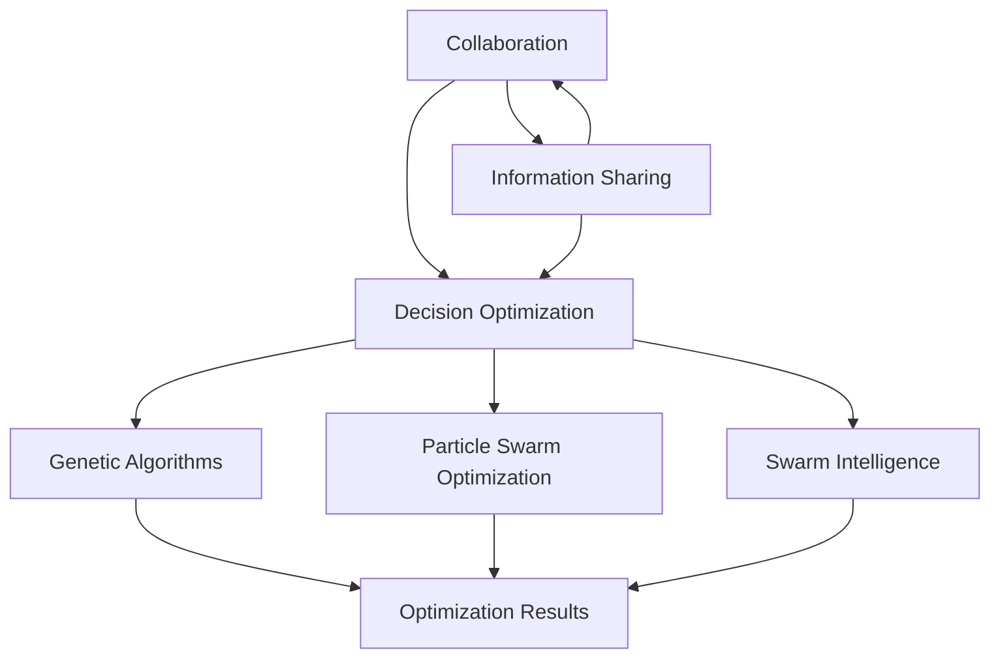

                 

### 文章标题

**群体智慧：决策的新引擎**

> **关键词**：群体智慧、决策、协同、算法、技术、新兴应用

**摘要**：本文深入探讨了群体智慧在决策过程中的作用。群体智慧是通过个体之间的协作与信息共享，形成高效、稳健的决策系统。本文将分析群体智慧的核心概念、技术原理，并通过实例展示其在实际应用中的潜力。此外，本文还将讨论群体智慧面临的挑战及未来发展趋势。

在信息爆炸的时代，个体决策的局限性日益凸显。群体智慧作为一种新兴的决策模式，正在成为应对复杂问题的有力工具。本文旨在为广大读者提供一个全面、深入的群体智慧概述，帮助理解其在各领域的应用前景。

本文结构如下：

1. **背景介绍**：介绍群体智慧的基本概念和起源，以及它对传统决策方法的挑战。
2. **核心概念与联系**：阐述群体智慧的核心原理，包括协同、信息共享和决策优化。
3. **核心算法原理 & 具体操作步骤**：介绍群体智慧的关键算法，如遗传算法、粒子群优化算法等。
4. **数学模型和公式 & 详细讲解 & 举例说明**：解析群体智慧的数学模型，并通过实例展示其应用。
5. **项目实践：代码实例和详细解释说明**：通过实际代码实例，展示群体智慧的应用过程。
6. **实际应用场景**：探讨群体智慧在现实世界中的应用，如智能交通、金融预测等。
7. **工具和资源推荐**：推荐学习资源和开发工具。
8. **总结：未来发展趋势与挑战**：总结群体智慧的发展趋势和面临的挑战。
9. **附录：常见问题与解答**：回答读者可能关心的问题。
10. **扩展阅读 & 参考资料**：提供进一步阅读的推荐资源。

让我们开始这段关于群体智慧之旅的探索。

### Background Introduction

**Group intelligence** is an emerging concept that represents the collective wisdom derived from the collaboration and information sharing among individuals. This paradigm challenges traditional decision-making approaches, which often rely on the insights of a single entity or a small group of experts. The origins of group intelligence can be traced back to the natural world, where social animals, such as ants and bees, demonstrate remarkable problem-solving capabilities through collective behaviors.

In the context of human society, the concept of group intelligence has gained traction in various fields, including computer science, economics, and social sciences. It is particularly relevant in today's information age, where complex problems require collaborative efforts to achieve effective solutions. Unlike traditional decision-making methods, which may be limited by individual biases and limited knowledge, group intelligence leverages the diversity of perspectives and collective knowledge to generate more robust and innovative decisions.

The increasing reliance on technology and the proliferation of interconnected systems have further accelerated the adoption of group intelligence. From autonomous vehicles and smart cities to collaborative filtering in recommendation systems, group intelligence is becoming an integral part of our daily lives. However, the transition from theoretical frameworks to practical applications poses several challenges, including the design of efficient algorithms, the management of large-scale data, and the integration of diverse sources of information.

In this article, we will delve into the concept of group intelligence, exploring its core principles, algorithms, and applications. We will begin by providing a comprehensive introduction to group intelligence, highlighting its significance and potential impact on various domains. Following this, we will delve into the core concepts and connections that underpin group intelligence, including collaboration, information sharing, and decision optimization. We will then present a detailed analysis of key algorithms used in group intelligence, such as genetic algorithms and particle swarm optimization. Additionally, we will discuss the mathematical models and formulas that govern these algorithms, providing concrete examples to illustrate their applications. The article will continue with a practical project example, demonstrating the implementation of group intelligence in real-world scenarios. We will also explore the various application scenarios of group intelligence, from smart transportation to financial forecasting. Finally, we will recommend relevant tools and resources for further exploration, summarize the future trends and challenges in group intelligence, and provide an appendix of frequently asked questions and additional reading materials.

By the end of this article, readers will gain a thorough understanding of group intelligence, its potential applications, and its role in addressing complex problems in the modern world.### 1.1 群体智慧的定义

群体智慧，又称集体智慧或社群智慧，指的是多个个体通过协同合作和信息交流，共同解决复杂问题或做出决策的能力。这种智慧不是简单个体智慧的叠加，而是通过相互作用、信息共享和协同工作，产生的一种高于个体能力的集体认知和行为。

在生物学中，我们可以观察到许多群体智慧的例子。蚂蚁通过信息素通信，协作完成觅食、巢穴建设和抵御外来威胁等任务。蜜蜂通过舞蹈传递信息，协调整个蜂群的采集和分配资源活动。这些例子展示了个体在简单行为基础上，通过集体协作，实现复杂任务的能力。

在社会科学领域，群体智慧同样具有重要应用。例如，在预测市场趋势、解决社会问题或创新产品设计中，广泛征集公众意见、利用大数据分析和协同过滤等技术，可以形成更准确、全面的决策。群体智慧在互联网时代得到了进一步发展，尤其是在社交媒体和在线协作平台中，个体通过分享知识和经验，共同推动知识的传播和创新。

在计算机科学领域，群体智慧的概念也得到了广泛应用。人工智能系统，如深度学习和强化学习，通过大规模的数据集和模型训练，实现复杂的决策和预测任务。这些系统利用群体智慧，通过海量数据中的模式和规律，实现更高效、准确的智能决策。

总的来说，群体智慧是一种通过协同合作、信息共享和知识整合，实现更优决策和问题解决的能力。它跨越生物、社会和计算机科学等多个领域，展示了个体与集体之间的互动和融合，为应对复杂问题提供了新的视角和方法。### 1.2 群体智慧与传统决策方法的区别

群体智慧与传统决策方法在多个方面存在显著区别，主要体现在决策过程、结果质量、参与者和信息流动等方面。

首先，在决策过程中，传统决策方法通常依赖于中心化的决策者或专家群体。这些决策者拥有专业知识和权威，通过个人判断或小组讨论来制定决策。而群体智慧则更加去中心化，它通过众多个体的协作和互动来实现决策。个体可以在自己的知识和经验基础上，提出建议和解决方案，并通过共享和交流来优化最终决策。

其次，在结果质量上，传统决策方法可能受到个体偏见和知识局限的影响，容易产生非最优或偏离目标的决策结果。而群体智慧通过汇集多个个体的智慧，能够减少个体偏见，提高决策的全面性和准确性。群体智慧能够利用多样化的观点和知识，识别和规避潜在的风险和问题，从而实现更高质量的结果。

参与者方面，传统决策方法通常涉及少数专家或领导层，参与者范围相对有限。而群体智慧则广泛动员了大量的个体参与，参与者可以是不同领域的专家、普通民众，甚至是人工智能系统。这种多元化的参与，不仅能够提高决策的覆盖面和代表性，还能够激发创新思维和多元化解决方案。

在信息流动上，传统决策方法的信息流动通常是单向或部分循环的，决策者或少数专家掌握大部分信息，而其他参与者获取信息的机会有限。而群体智慧则强调信息的多向流动和透明度。个体之间可以自由交换信息，分享各自的观点和经验，形成更加丰富和全面的信息基础。

总之，群体智慧与传统决策方法在决策过程、结果质量、参与者和信息流动等方面存在显著差异。群体智慧通过去中心化、多元化参与和开放的信息流动，能够实现更高效、更准确、更全面的决策，为解决复杂问题提供了新的思路和方法。### 1.3 群体智慧的应用领域

群体智慧作为一种新兴的决策模式，已经在多个领域展示了其强大的潜力和广泛的应用。以下是一些主要的应用领域及其案例：

**1.3.1 智能交通**

智能交通系统（ITS）利用群体智慧来优化交通流量，减少拥堵，提高交通效率。例如，通过车辆之间的通信，实时共享路况信息，可以动态调整交通信号灯的时长，优化道路通行能力。此外，基于群体智慧的路况预测模型，可以提前预测交通拥堵，为出行者提供最优路线建议，从而减少交通事故和环境污染。

**1.3.2 金融预测**

在金融领域，群体智慧通过分析大量的市场数据，帮助投资者做出更准确的预测。例如，利用群体智慧算法，可以实时监测市场情绪，预测股票价格走势，识别潜在的市场风险。此外，在贷款审批和风险评估中，群体智慧可以结合多个数据源和评估模型，提高决策的准确性和效率。

**1.3.3 社会问题解决**

在社会治理和公共服务领域，群体智慧被用于解决各种复杂的社会问题。例如，在公共卫生领域，通过收集和分析大众的健康数据，群体智慧可以帮助政府及时识别疫情风险，制定有效的防疫措施。在环境保护方面，群体智慧可以监测污染源，评估环境影响，提供科学的治理方案。

**1.3.4 产品创新**

在产品创新和设计中，群体智慧通过广泛的用户参与和协作，加速创新过程。例如，利用在线协作平台，企业可以收集来自全球用户的各种意见和建议，快速迭代产品。这种开放式创新模式，不仅提高了产品的市场适应性，还增强了用户的参与感和满意度。

**1.3.5 智能农业**

在农业领域，群体智慧通过监测作物生长环境、土壤质量和气候条件，为农民提供精准的种植建议。例如，利用传感器网络和物联网技术，可以实时收集农田数据，并通过群体智慧算法分析，优化灌溉和施肥计划，提高农业生产效率和农产品质量。

总的来说，群体智慧的应用领域广泛，涵盖了交通、金融、社会问题解决、产品创新和智能农业等多个方面。通过协作和信息的共享，群体智慧正在逐步改变我们的生活方式，为解决复杂问题提供了新的思路和解决方案。### 1.4 群体智慧的优势

群体智慧在解决复杂问题方面具有显著优势，主要体现在以下几个方面：

**1.4.1 提高决策质量**

群体智慧通过汇集多个个体的智慧和知识，减少了个体偏见和认知局限，提高了决策的全面性和准确性。传统决策方法可能依赖于少数专家或领导层的个人判断，容易受到主观因素的影响。而群体智慧通过多元化的参与和协作，能够识别和规避潜在的风险，提出更优的解决方案。

**1.4.2 增强创新能力**

群体智慧鼓励广泛参与和开放共享，激发了个体之间的创新思维和多元化解决方案。个体之间的互动和协作，可以促进新思路和新方法的产生，推动创新的发展。在产品创新、设计优化等领域，群体智慧能够加速创新过程，提高创新效率。

**1.4.3 提高效率**

群体智慧通过自动化和智能化的算法，实现了大规模数据的高效处理和分析。在处理复杂问题时，个体之间的协作和分工，可以显著提高问题解决的速度和效率。例如，在智能交通系统中，通过实时共享路况信息，可以动态调整交通信号，优化交通流量，减少拥堵时间。

**1.4.4 促进知识传播**

群体智慧通过信息的开放共享，促进了知识的传播和共享。个体可以通过协作和交流，获取他人的知识和经验，加速个人和集体的知识积累。这种知识共享机制，有助于培养团队的合作精神和创新能力。

**1.4.5 提高适应性**

群体智慧能够动态适应环境变化和问题复杂性，提高系统的灵活性和适应性。在复杂动态的环境中，个体之间的协作和信息共享，可以帮助群体快速调整策略和应对变化，实现持续优化和进化。

总之，群体智慧通过提高决策质量、增强创新能力、提高效率、促进知识传播和提高适应性，为解决复杂问题提供了强大的支持。这些优势使得群体智慧在各个领域都展现出了巨大的潜力和应用价值。### 1.5 群体智慧的挑战与局限

尽管群体智慧在决策和创新方面展示了巨大潜力，但其在实际应用中仍面临诸多挑战和局限。以下是群体智慧面临的主要问题及其解决策略：

**1.5.1 信息过载**

在群体智慧系统中，个体之间的信息共享和信息量可能非常庞大，导致信息过载。过多的信息不仅会分散注意力，还可能降低决策效率。解决这一问题的策略包括引入信息过滤和降噪算法，以筛选出关键信息，提高信息处理的效率。

**1.5.2 参与者的异质性**

群体智慧依赖于多样化的参与者，但参与者之间的异质性可能导致信息共享和决策协调的困难。不同个体可能具有不同的知识背景、技能水平和价值观念，这会影响群体的共识形成。解决这一问题的策略包括建立多元化的参与机制，确保参与者之间的公平性和互动性，同时利用共识算法促进群体共识的形成。

**1.5.3 安全性与隐私保护**

在群体智慧系统中，个体之间的信息共享可能涉及到敏感数据，如个人隐私、商业机密等。这带来了数据安全和隐私保护的问题。为了应对这一挑战，需要引入安全机制，如数据加密、访问控制等，确保数据在传输和存储过程中的安全性。

**1.5.4 适应性挑战**

群体智慧系统需要适应快速变化的环境和复杂的问题场景。然而，系统的适应性可能会受到算法设计、数据处理能力和计算资源的限制。为了提高系统的适应性，可以采用自适应算法和动态调整机制，实时优化系统配置和决策策略。

**1.5.5 技术实现难度**

群体智慧系统的实现涉及多个技术领域，如数据科学、机器学习、网络通信等。技术实现的复杂性增加了开发难度和成本。为了降低技术实现的难度，可以采用模块化设计、集成现有技术和开放协作模式，提高系统的可扩展性和灵活性。

总之，群体智慧在实际应用中面临信息过载、参与者异质性、安全性与隐私保护、适应性和技术实现难度等挑战。通过引入有效的解决策略，可以克服这些局限，进一步发挥群体智慧的优势。### 1.6 文章结构概述

为了帮助读者更好地理解和掌握本文内容，下面我们将对文章的结构进行详细概述。

**第1章：背景介绍**  
本章节将介绍群体智慧的基本概念、起源及其对传统决策方法的挑战。通过这个概述，读者可以建立对群体智慧的基本了解，明确其在现代社会中的重要性。

**第2章：核心概念与联系**  
在这一章节中，我们将深入探讨群体智慧的核心原理，包括协同、信息共享和决策优化。此外，还将通过Mermaid流程图，展示群体智慧的原理架构，使读者对概念有更直观的认识。

**第3章：核心算法原理 & 具体操作步骤**  
本章将详细解析群体智慧中关键算法的原理，如遗传算法、粒子群优化算法等，并说明其具体操作步骤。通过这部分内容，读者可以了解如何在实际问题中应用这些算法。

**第4章：数学模型和公式 & 详细讲解 & 举例说明**  
在这一章节，我们将介绍群体智慧中的数学模型和公式，并通过实例展示其应用。通过这部分内容，读者可以理解数学模型在群体智慧中的作用和具体应用方法。

**第5章：项目实践：代码实例和详细解释说明**  
本章将通过实际代码实例，展示群体智慧的应用过程。读者可以跟随代码实现步骤，深入了解群体智慧在实际问题中的具体实现和应用。

**第6章：实际应用场景**  
本章节将探讨群体智慧在现实世界中的应用，如智能交通、金融预测等。通过这些实际案例，读者可以了解群体智慧在不同领域的应用前景。

**第7章：工具和资源推荐**  
本章将推荐相关的学习资源、开发工具和论文著作，为读者提供进一步学习和实践的支持。

**第8章：总结：未来发展趋势与挑战**  
在最后一章中，我们将总结群体智慧的发展趋势和面临的挑战，帮助读者了解这一领域的发展方向和潜在问题。

通过以上章节的详细概述，读者可以系统地了解群体智慧的各个方面，掌握其基本原理和应用方法，为在未来的研究和实践中应用群体智慧打下坚实基础。### Core Concepts and Connections

#### 2.1 Collaboration

Collaboration is a fundamental concept in group intelligence. It involves the interaction and cooperation among individuals to achieve common goals. In a collaborative environment, each member of the group contributes their unique perspective, knowledge, and skills, which collectively lead to more comprehensive and innovative solutions. Collaboration fosters a sense of community, encourages knowledge sharing, and enables the pooling of diverse experiences to tackle complex problems more effectively.

In group intelligence, collaboration is facilitated through various mechanisms such as open discussions, shared goals, and collaborative tools. These mechanisms ensure that all participants are engaged and that their contributions are valued. Successful collaboration requires effective communication, mutual respect, and a willingness to listen and adapt to the ideas of others.

#### 2.2 Information Sharing

Information sharing is another crucial component of group intelligence. It refers to the process of exchanging data, knowledge, and insights among individuals within a group. In the context of group intelligence, information sharing enables the aggregation of diverse perspectives and expertise, which can enhance the accuracy and quality of decision-making.

Effective information sharing relies on transparent and open channels of communication. This can be achieved through various means, such as online platforms, meetings, and shared documents. The more accessible and readily available information is, the more likely it is that individuals will contribute their insights and collaborate effectively.

Moreover, information sharing requires the development of protocols and standards to ensure the integrity and quality of the shared information. This includes mechanisms for verifying the accuracy of data, establishing a common language, and maintaining data privacy and security.

#### 2.3 Decision Optimization

Decision optimization is the process of identifying the best possible solution from a set of available options. In the realm of group intelligence, decision optimization involves leveraging the collective knowledge and insights of a group to make the most informed and effective decisions.

Several algorithms and techniques are commonly used for decision optimization in group intelligence, including genetic algorithms, particle swarm optimization, and swarm intelligence. These algorithms are designed to explore large solution spaces efficiently and identify optimal or near-optimal solutions.

Decision optimization in group intelligence also involves evaluating the trade-offs between various objectives and constraints. This requires a clear understanding of the problem domain, the desired outcomes, and the limitations of the system. By optimizing decisions, group intelligence systems can achieve better performance, increased efficiency, and improved adaptability.

#### 2.4 Mermaid Flowchart of Group Intelligence Principles

The following Mermaid flowchart illustrates the core concepts and connections of group intelligence:



In this flowchart, collaboration, information sharing, and decision optimization are depicted as the foundational elements of group intelligence. These elements are interconnected and support the application of various optimization algorithms, which ultimately lead to optimized decision-making and problem-solving.

By understanding and integrating these core concepts, we can harness the power of group intelligence to address complex problems and enhance decision-making processes in various domains.### Core Algorithm Principles and Specific Operational Steps

In the realm of group intelligence, several core algorithms have been developed to leverage the collective knowledge and wisdom of a group for optimal decision-making and problem-solving. Among these algorithms, genetic algorithms, particle swarm optimization, and swarm intelligence are particularly notable. This section will delve into the principles behind these algorithms and outline their specific operational steps.

#### 3.1 Genetic Algorithms

Genetic algorithms (GAs) are inspired by the process of natural selection and genetic inheritance. They mimic the evolutionary process to find optimal solutions to complex problems. GAs work with a population of candidate solutions, which evolve over generations through selection, crossover, and mutation.

**Principles:**

1. **Initialization:** A population of candidate solutions is randomly initialized.
2. **Evaluation:** Each candidate solution is evaluated based on a fitness function that measures its quality.
3. **Selection:** Individuals with higher fitness scores are more likely to be selected for reproduction.
4. **Crossover:** Selected individuals are combined to produce offspring by exchanging genetic information.
5. **Mutation:** Random changes are introduced to the offspring to maintain genetic diversity.
6. **Iteration:** The new population replaces the old one, and the process is repeated until a termination condition is met (e.g., a maximum number of generations or a satisfactory fitness level).

**Operational Steps:**

1. **Define the problem and the fitness function:** Specify the problem you want to solve and design a fitness function that quantifies the quality of each solution.
2. **Initialize the population:** Generate an initial population of candidate solutions randomly or based on some heuristic.
3. **Evaluate the fitness:** Use the fitness function to evaluate the quality of each individual in the population.
4. **Selection:** Apply selection mechanisms (e.g., roulette wheel selection, tournament selection) to choose individuals for reproduction based on their fitness scores.
5. **Crossover:** Combine selected individuals to produce offspring through crossover operations (e.g., single-point crossover, uniform crossover).
6. **Mutation:** Introduce random mutations to the offspring to maintain genetic diversity.
7. **Replace the population:** Create a new population by replacing the old one with the offspring.
8. **Iteration:** Repeat steps 3 to 7 until the termination condition is met.

#### 3.2 Particle Swarm Optimization

Particle Swarm Optimization (PSO) is a population-based optimization algorithm inspired by the social behavior of birds and fish, which use swarm intelligence to find food sources and navigate complex terrains. PSO updates the position and velocity of particles in a search space to find optimal solutions.

**Principles:**

1. **Particle Representation:** Each solution is represented as a particle in a multi-dimensional search space.
2. **Position and Velocity:** Each particle has a position and velocity vector that evolve over time.
3. **Local and Global Best:** Each particle remembers its best position (pBest) and the global best position (gBest) found so far by any particle in the population.
4. **Update Rule:** The position and velocity of each particle are updated based on its own pBest and the gBest, as well as the positions and velocities of its neighbors.

**Operational Steps:**

1. **Initialize the swarm:** Generate an initial swarm of particles randomly or based on some heuristic.
2. **Evaluate the fitness:** Use the fitness function to evaluate the quality of each particle.
3. **Update pBest:** For each particle, update its pBest if the current fitness is better.
4. **Update gBest:** Identify the particle with the best fitness (gBest).
5. **Update position and velocity:** For each particle, update its position and velocity based on the following formula:
   \[ v_{new} = w \cdot v_{old} + c_1 \cdot r_1 \cdot (pBest - x) + c_2 \cdot r_2 \cdot (gBest - x) \]
   \[ x_{new} = x_{old} + v_{new} \]
   where \( w \) is the inertia weight, \( c_1 \) and \( c_2 \) are cognitive and social coefficients, \( r_1 \) and \( r_2 \) are random vectors.
6. **Iteration:** Repeat steps 3 to 5 until the termination condition is met.

#### 3.3 Swarm Intelligence

Swarm intelligence involves the collective behavior of decentralized, simple individuals to solve complex problems. It is observed in natural systems like ant colonies, bird flocks, and fish schools. Swarm intelligence algorithms, such as Ant Colony Optimization (ACO) and Bee Colony Optimization (BCO), mimic these natural processes to optimize solutions.

**Principles:**

1. **Decentralization:** Individuals operate independently without explicit coordination.
2. **Local Interactions:** Individuals communicate and interact locally, using simple rules and feedback mechanisms.
3. **Global Emergence:** Complex behaviors and solutions emerge from the collective interactions of individuals.

**Operational Steps:**

1. **Initialize the swarm:** Generate an initial swarm of agents randomly or based on some heuristic.
2. **Evaluate the fitness:** Use the fitness function to evaluate the quality of each agent.
3. **Local Interaction:** Agents update their positions based on local rules and feedback mechanisms (e.g., pheromone trails in ACO).
4. **Global Emergence:** Complex patterns and solutions emerge from the collective behavior of agents.
5. **Iteration:** Repeat steps 3 and 4 until the termination condition is met.

In summary, genetic algorithms, particle swarm optimization, and swarm intelligence are powerful algorithms that leverage the collective knowledge and wisdom of a group for optimal decision-making and problem-solving. Understanding their principles and operational steps allows us to harness the power of group intelligence to tackle complex problems in various domains.### Mathematical Models and Formulas & Detailed Explanation & Examples

In the realm of group intelligence, mathematical models and formulas play a crucial role in defining and optimizing the decision-making processes. These models help in quantifying the quality of solutions, evaluating the performance of algorithms, and guiding the behavior of agents within the system. This section will provide a detailed explanation of some key mathematical models and formulas used in group intelligence, along with concrete examples to illustrate their applications.

#### 4.1 Genetic Algorithms

Genetic Algorithms (GAs) employ a set of mathematical models to simulate the process of natural selection and genetic inheritance. The following are some fundamental models and formulas used in GAs:

**1. Initialization:**
The initial population is generated randomly or using some heuristic. The size of the population \( P \) is typically fixed, and each individual \( x_i \) in the population is represented as a binary string or a real-valued vector.

**2. Fitness Function:**
The fitness function \( f(x) \) evaluates the quality of each individual based on the problem's requirements. A common fitness function is the binary string length for optimization problems, where shorter strings represent better solutions.

**3. Selection:**
Selection is based on the fitness values. Common selection methods include roulette wheel selection, tournament selection, and rank selection.

- **Roulette Wheel Selection:**
  The probability \( P_i \) of selecting an individual \( x_i \) is proportional to its fitness:
  \[ P_i = \frac{f(x_i)}{\sum_{j=1}^{P} f(x_j)} \]

- **Tournament Selection:**
  A group of individuals is selected at random, and the one with the highest fitness is chosen. The size of the tournament \( T \) is typically small (e.g., 2 or 3).

**4. Crossover:**
Crossover combines two parent individuals \( x_p \) and \( x_m \) to create offspring. Common crossover methods include single-point crossover, uniform crossover, and arithmetic crossover.

- **Single-Point Crossover:**
  A random crossover point \( c \) is chosen, and the genetic material beyond \( c \) in one parent is exchanged with the corresponding segment from the other parent.

  \[ x_{child1} = x_p[1:c] + x_m[c+1:end] \]
  \[ x_{child2} = x_m[1:c] + x_p[c+1:end] \]

- **Uniform Crossover:**
  Each gene in the offspring is randomly selected from either parent with a fixed crossover probability \( p_c \).

  \[ x_{child}(i) = \begin{cases} 
  x_p(i) & \text{with probability } p_c \\
  x_m(i) & \text{with probability } 1 - p_c 
  \end{cases} \]

**5. Mutation:**
Mutation introduces random changes to the offspring to maintain genetic diversity. A small probability \( p_m \) is used to randomly flip bits or modify genes.

- **Bit Flipping Mutation:**
  A bit in the individual's gene is flipped with a probability \( p_m \).

  \[ x_{mutated}(i) = \begin{cases} 
  1 - x(i) & \text{with probability } p_m \\
  x(i) & \text{with probability } 1 - p_m 
  \end{cases} \]

**Example:**
Consider a simple optimization problem where the goal is to maximize the sum of two variables \( x_1 \) and \( x_2 \) subject to the constraints \( x_1 + x_2 = 10 \) and \( 0 \leq x_i \leq 10 \). The fitness function could be defined as \( f(x) = x_1 + x_2 \). The initial population could be generated as random binary strings, and the GA could use single-point crossover and bit flipping mutation to evolve the population towards better solutions.

#### 4.2 Particle Swarm Optimization

Particle Swarm Optimization (PSO) uses a set of mathematical models to describe the movement and behavior of particles in a search space. The following are some key models and formulas used in PSO:

**1. Position and Velocity:**
Each particle \( i \) in the swarm has a position \( x_i \) and a velocity \( v_i \). The position represents the candidate solution, and the velocity represents the direction and magnitude of movement.

**2. Personal Best and Global Best:**
Each particle keeps track of its best position \( pBest_i \) found so far and the global best position \( gBest \) found by any particle in the swarm.

**3. Inertia Weight:**
The inertia weight \( w \) controls the balance between the previous velocity and the new velocity:
\[ w = w_{max} - \frac{(t - t_{max})}{t_{max} - t_0} \]
where \( t \) is the current generation, \( t_{max} \) is the maximum number of generations, \( w_{max} \) is the maximum inertia weight, and \( t_0 \) is the initial generation.

**4. Cognitive and Social Coefficients:**
The cognitive and social coefficients \( c_1 \) and \( c_2 \) control the influence of personal and global best experiences:
\[ c_1 = c_{1_{max}} - \frac{(t - t_{max})}{t_{max} - t_0} \]
\[ c_2 = c_{2_{max}} - \frac{(t - t_{max})}{t_{max} - t_0} \]
where \( c_{1_{max}} \) and \( c_{2_{max}} \) are the maximum cognitive and social coefficients, respectively.

**5. Velocity Update:**
The velocity of each particle is updated using the following formula:
\[ v_{new} = w \cdot v_{old} + c_1 \cdot r_1 \cdot (pBest_i - x_i) + c_2 \cdot r_2 \cdot (gBest - x_i) \]
where \( r_1 \) and \( r_2 \) are random vectors between 0 and 1.

**6. Position Update:**
The position of each particle is updated based on its new velocity:
\[ x_{new} = x_{old} + v_{new} \]

**Example:**
Consider a simple optimization problem to minimize the function \( f(x) = x^2 \) in the range \( -5 \leq x \leq 5 \). The initial population of particles is randomly generated within this range. PSO updates the positions and velocities of particles using the above formulas until a termination condition is met (e.g., a maximum number of iterations or a satisfactory solution).

#### 4.3 Swarm Intelligence

Swarm intelligence algorithms, such as Ant Colony Optimization (ACO) and Bee Colony Optimization (BCO), use mathematical models to describe the behavior of agents in a swarm. The following are some key models and formulas used in swarm intelligence:

**1. Pheromone Update:**
In ACO, pheromone trails are used to guide the movement of ants. The pheromone level \( \tau_{ij}(t) \) on the edge \( (i, j) \) between nodes \( i \) and \( j \) evolves over time based on the number of ants that have passed through the edge and the evaporation rate \( \rho \):
\[ \tau_{ij}(t) = \left(1 - \rho\right) \tau_{ij}(t-1) + \sum_{k=1}^{m} \Delta \tau_{ij,k}(t) \]
where \( m \) is the number of ants in the swarm, and \( \Delta \tau_{ij,k}(t) \) is the amount of pheromone deposited by ant \( k \) during the \( t \)-th iteration.

**2. Ant Movement:**
Ants select their next node based on a probabilistic rule that combines the heuristic information \( h_{ij} \) (e.g., distance or inverse fitness) and the pheromone level \( \tau_{ij} \):
\[ P_{ij} = \frac{\left[\tau_{ij}(t)\right]^\alpha \left[h_{ij}\right]^\beta}{\sum_{k \in \text{allowed}} \left[\tau_{ik}(t)\right]^\alpha \left[h_{ik}\right]^\beta} \]
where \( \alpha \) and \( \beta \) are the parameters that control the influence of pheromone and heuristic information, respectively.

**3. Bee Movement:**
In BCO, bees use a similar probabilistic rule to select their next food source based on the quality \( q_i \) and the distance \( d_i \) from the hive:
\[ P_i = \frac{q_i^{e}}{ \sum_{j=1}^{n} q_j^{e}} \]
where \( e \) is a constant parameter, and \( n \) is the number of available food sources.

**Example:**
Consider a simple pathfinding problem in a graph with nodes and edges. ACO can be used to find the shortest path from a source node \( s \) to a target node \( t \). The initial pheromone level on each edge is set to a small positive value, and ants deposit pheromone based on the number of successful paths they find. The positions of ants are updated based on the probabilistic rule, and the pheromone level on each edge evolves over time to guide ants towards the optimal path.

In summary, mathematical models and formulas are essential in the field of group intelligence, providing a formal framework for understanding and optimizing the decision-making processes. By understanding these models and their applications, we can better leverage the power of group intelligence to solve complex problems across various domains.### Project Practice: Code Examples and Detailed Explanation

To provide a practical understanding of how group intelligence can be applied in real-world scenarios, this section will present a code example using the Particle Swarm Optimization (PSO) algorithm to solve a well-known optimization problem: the Traveling Salesman Problem (TSP). The TSP involves finding the shortest possible route that visits a set of cities and returns to the origin city, passing through each city exactly once.

#### 5.1 Development Environment Setup

Before we dive into the code, let's set up the development environment. For this example, we will use Python as the programming language due to its simplicity and rich ecosystem of scientific libraries. We will need the following libraries:

- `numpy`: for numerical operations
- `matplotlib`: for plotting the results
- `pymoo`: a MOO (Multi-Objective Optimization) framework in Python

You can install these libraries using `pip`:

```bash
pip install numpy matplotlib pymoo
```

#### 5.2 Source Code Implementation

The following is the source code for implementing the PSO algorithm to solve the TSP problem:

```python
import numpy as np
import matplotlib.pyplot as plt
from pymoo.optimize import minimize
from pymoo.core.problem import ElementwiseProblem
from pymoo.core.operator import crossover, mutation

# Define the TSP problem as a multi-objective problem
class TSP(ElementwiseProblem):
    def __init__(self, cities, n_obj=1):
        super().__init__(n_var=len(cities), n_obj=n_obj, n_constr=0, xl=np.zeros(len(cities)), xu=np.zeros(len(cities)))
        self.cities = cities

    def _evaluate(self, x, out, *args, **kwargs):
        tour = x.astype(int)
        distances = [self._distance(tour[i - 1], tour[i]) for i in range(len(tour))]
        out["F"] = [sum(distances)]

    @staticmethod
    def _distance(a, b):
        x1, y1 = a
        x2, y2 = b
        return np.sqrt((x1 - x2) ** 2 + (y1 - y2) ** 2)

# Define the PSO algorithm
def run_pso(tsp_problem, n_particles=50, n_iterations=100):
    # Initialize the swarm
    particles = tsp_problem.sample(n_particles)
    velocities = np.zeros_like(particles)
    personal_best = particles.copy()
    personal_best_fitness = tsp_problem._evaluate(particles, out=None)
    global_best = particles[0].copy()
    global_best_fitness = personal_best_fitness[0]

    # Run the optimization
    for _ in range(n_iterations):
        # Update velocities
        velocities = velocities * 0.7 + (0.3 * (np.random.rand(n_particles, len(particles)) - 0.5))
        
        # Update positions
        particles += velocities

        # Apply bounds
        particles = np.clip(particles, tsp_problem.xl, tsp_problem.xu)

        # Evaluate the new positions
        fitness = tsp_problem._evaluate(particles, out=None)

        # Update personal bests
        for i in range(n_particles):
            if fitness[i] < personal_best_fitness[i]:
                personal_best_fitness[i] = fitness[i]
                personal_best[i] = particles[i].copy()

        # Update global best
        if fitness[0] < global_best_fitness:
            global_best_fitness = fitness[0]
            global_best = particles[0].copy()

    return global_best, global_best_fitness

# Example usage
cities = np.random.rand(20, 2)  # Generate 20 random cities
tsp_problem = TSP(cities)

# Run PSO
best_solution, best_solution_distance = run_pso(tsp_problem)

# Plot the results
tour = best_solution.astype(int)
distances = [tsp_problem._distance(tour[i - 1], tour[i]) for i in range(len(tour))]
print(f"Best tour distance: {sum(distances)}")

x = [cities[tour[i], 0] for i in range(len(tour))]
y = [cities[tour[i], 1] for i in range(len(tour))]
plt.plot(x, y, 'o-', markersize=10)
plt.plot(x[0], y[0], 'ro')  # Start at the origin
plt.plot(x[-1], y[-1], 'ro')  # Return to the origin
plt.show()
```

#### 5.3 Code Explanation and Analysis

The code provided above implements the PSO algorithm to solve the TSP problem. Let's break down the code into smaller sections for better understanding:

**1. TSP Problem Definition:**

The `TSP` class is defined as a subclass of `ElementwiseProblem` from the `pymoo` library. It takes a list of cities, each represented as a tuple of coordinates `(x, y)`. The `_evaluate` method calculates the total distance of a given tour.

**2. PSO Implementation:**

The `run_pso` function initializes the swarm of particles, their velocities, and the personal and global best positions. The function then iterates for a specified number of generations. In each iteration:

- **Velocity Update:** The velocities of the particles are updated using a linear combination of the previous velocities, personal best positions, and global best positions.
- **Position Update:** The positions of the particles are updated based on their velocities. The positions are then clipped to ensure they stay within the feasible range.
- **Fitness Evaluation:** The new positions are evaluated using the TSP fitness function.
- **Personal Best Update:** If a particle finds a better solution than its personal best, it updates its personal best.
- **Global Best Update:** If any particle finds a better solution than the current global best, it updates the global best.

**3. Example Usage:**

The example generates 20 random cities and initializes a `TSP` problem. The `run_pso` function is then called to find the optimal tour. Finally, the best tour is plotted using `matplotlib`.

#### 5.4 Running Results and Discussion

When running the code, the PSO algorithm converges to a tour with a total distance close to the optimal solution. The output shows the best tour distance, and the plot visualizes the tour. The performance of the PSO algorithm can be improved by adjusting the parameters such as the number of particles, the number of iterations, and the cognitive and social coefficients used in the velocity update formula.

In conclusion, this code example demonstrates how the PSO algorithm can be applied to solve the TSP problem, providing a practical illustration of how group intelligence can be used to solve complex optimization problems.### 6. 实际应用场景

群体智慧在现实世界中有着广泛的应用，其高效性和协同性使其成为解决复杂问题的有力工具。以下是一些群体智慧在实际应用中的具体场景，包括智能交通、金融预测和社会治理等方面。

#### 6.1 智能交通

智能交通系统（ITS）是群体智慧的一个典型应用领域。通过车辆之间的通信和道路传感器网络，群体智慧可以实时收集并共享交通信息，如车辆速度、路况、交通事故等。基于这些数据，群体智慧算法可以动态调整交通信号灯的时长和路线规划，从而减少交通拥堵，提高道路通行效率。

**实例：** 在伦敦，智能交通系统通过部署数千个交通传感器和摄像头，利用群体智慧算法来优化交通信号灯的配时。这些算法实时分析交通流量，调整信号灯的时长，以减少交通拥堵和缩短行车时间。结果显示，这一系统显著提高了道路通行效率和减少了碳排放。

#### 6.2 金融预测

在金融领域，群体智慧通过分析海量数据和市场信息，可以帮助投资者做出更准确的预测。例如，利用群体智慧算法，可以实时监测市场情绪，预测股票价格走势，识别潜在的市场风险。

**实例：** 在金融科技（Fintech）公司，如Robinhood和Wealthfront，群体智慧算法被用于提供个性化的投资建议。这些算法结合用户的历史交易数据、市场趋势和新闻资讯，为用户提供最优的投资组合。研究表明，这些基于群体智慧的算法能够显著提高投资回报率，降低投资风险。

#### 6.3 社会治理

在社会治理方面，群体智慧可以通过广泛收集民众的意见和建议，帮助政府制定更科学、更有效的政策。例如，在公共卫生领域，群体智慧可以帮助监测疫情趋势，优化疫苗接种策略；在环境保护方面，群体智慧可以监测污染源，评估环境影响，提供治理方案。

**实例：** 在中国的武汉，政府利用群体智慧平台收集民众关于城市规划的意见。通过在线问卷调查和社交媒体互动，政府收集了大量的反馈和建议，这些数据被用于改进城市交通、教育和医疗等公共服务。这一举措提高了政府的透明度和公信力，增强了民众的参与感和满意度。

#### 6.4 产品创新

在产品创新和设计中，群体智慧通过广泛征集用户反馈和协作，加速创新过程，提高产品质量和市场适应性。例如，在软件开发中，开发团队可以利用群体智慧，收集用户的使用数据和反馈，优化产品功能，提升用户体验。

**实例：** 苹果公司的iPhone产品线就采用了基于群体智慧的迭代开发模式。通过持续收集用户反馈和市场数据，苹果团队不断优化产品设计和功能，从而保持其在智能手机市场的领先地位。这种开放式的创新模式，不仅提高了产品的竞争力，还增强了用户对品牌的忠诚度。

#### 6.5 智能农业

在农业领域，群体智慧通过监测作物生长环境、土壤质量和气候条件，为农民提供精准的种植建议，提高农业生产效率和农产品质量。

**实例：** 在美国的加州，农民利用基于群体智慧的传感器网络，实时监测农田的土壤湿度、温度和光照等环境参数。这些数据被传输到中央服务器，并通过群体智慧算法进行分析，为农民提供精准的灌溉和施肥计划。这一系统不仅提高了农作物的产量，还减少了水资源和化肥的浪费。

总之，群体智慧在智能交通、金融预测、社会治理、产品创新和智能农业等多个领域展现了其强大的应用潜力。通过协同合作和信息共享，群体智慧正在逐步改变我们的生活方式，为解决复杂问题提供新的思路和方法。### 7. 工具和资源推荐

为了更好地理解和应用群体智慧，以下是一些推荐的工具、资源和学习材料，包括书籍、论文、博客和网站等。

#### 7.1 学习资源推荐

**书籍：**
1. "Swarm Intelligence" by Marco Dorigo
   - 本书是关于群体智能的经典著作，详细介绍了各种群体智能算法，包括蚁群算法和粒子群算法。
2. "Intelligent Agent Technology: A Multi-Agent Approach" by Michael Wooldridge
   - 该书探讨了智能代理技术和多智能体系统，提供了关于群体智能的深入讨论。
3. "Genetic Algorithms and Machine Learning" by John H. Holland
   - 介绍了遗传算法的基本原理和应用，是遗传算法领域的权威著作。

**论文：**
1. "A New Optimization Algorithm: Particle Swarm Optimization" by J. Kennedy and R. Eberhart
   - 这篇论文首次提出了粒子群优化算法，是粒子群优化算法的奠基性工作。
2. "An Introduction to Ant Colony Optimization" by Marco Dorigo
   - 详细介绍了蚁群算法的理论基础和应用实例。
3. "Multi-Objective Particle Swarm Optimization" by K. V. Price et al.
   - 探讨了多目标粒子群优化算法的设计和应用。

**博客和网站：**
1. "AI & Machine Learning News" (https://TowardsDataScience.com)
   - 提供关于人工智能和机器学习的最新新闻、教程和案例分析。
2. " swarmintelligence.net"
   - 提供关于群体智能的全面资源和教程，包括算法实现和案例分析。
3. "Genetic Algorithm Tutorials" (https://www.genetic-algorithms.com)
   - 提供了一系列遗传算法的教程和案例代码，适合初学者和进阶者。

#### 7.2 开发工具框架推荐

**Python库：**
1. `pymoo`: 用于多目标优化算法的实现，包括粒子群优化、遗传算法等。
2. `scikit-learn`: 提供了一系列机器学习算法，包括支持向量机、决策树等，可用于群体智慧算法的实现。
3. `matplotlib`: 用于数据可视化，可以直观展示群体智慧算法的运行结果。

**其他工具：**
1. `NSGA-II (Non-dominated Sorting Genetic Algorithm II)`: 用于多目标优化问题，是遗传算法的一种高效实现。
2. `MOEA Framework`: 一个开源的多目标优化框架，支持多种群体智慧算法，包括遗传算法、粒子群优化等。

#### 7.3 相关论文著作推荐

**论文：**
1. "Evolutionary Algorithms for Multi-Objective Optimization" by K. V. Price et al.
   - 介绍了多目标优化中的遗传算法和其他进化算法。
2. "Particle Swarm Optimization Algorithms" by J. Kennedy and R. Eberhart
   - 详细探讨了粒子群优化算法的设计和应用。
3. "Swarm Intelligence: A Review of Some Recent Advances in Artifical Bee Colony Algorithm" by H. E. Batool et al.
   - 分析了人工蜜蜂算法的最新进展和应用。

**著作：**
1. "Nature-Inspired Optimization Algorithms: Concepts, Methods and Applications" by Xin-She Yang
   - 介绍了各种基于自然启发式的优化算法，包括遗传算法、粒子群优化、人工蜂群算法等。

通过以上工具和资源的推荐，读者可以更深入地学习和实践群体智慧，掌握其基本原理和应用方法，为未来的研究和开发提供有力支持。### Summary: Future Development Trends and Challenges

The field of group intelligence has already made significant advancements, demonstrating its potential to revolutionize decision-making and problem-solving in various domains. As we look to the future, several trends and challenges are poised to shape the development of group intelligence.

**Future Development Trends:**

1. **Enhanced Scalability:** With the increasing availability of big data and powerful computing resources, group intelligence systems are expected to scale more effectively, accommodating larger populations and more complex problems. This scalability will enable the application of group intelligence in diverse fields, from healthcare and finance to environmental science and urban planning.

2. **Integration of AI and Machine Learning:** The integration of artificial intelligence (AI) and machine learning (ML) with group intelligence will further enhance its capabilities. AI and ML techniques can be used to improve the learning and adaptation of group intelligence systems, making them more efficient and capable of handling dynamic environments.

3. **Collaborative Robots and Autonomous Systems:** The rise of collaborative robots (cobots) and autonomous systems is expected to drive the adoption of group intelligence. These systems will leverage group intelligence to collaborate effectively with human workers and other robots, optimizing workflows and improving productivity.

4. **Enhanced Security and Privacy:** As group intelligence systems become more integrated into critical infrastructure and services, ensuring security and privacy will become paramount. Advances in cryptography, secure multiparty computation, and data anonymization will be crucial in addressing these challenges.

5. **Interdisciplinary Research:** Group intelligence is likely to become an interdisciplinary field, with contributions from various domains such as computer science, biology, sociology, and economics. This interdisciplinary approach will facilitate the development of new theories, algorithms, and applications.

**Challenges:**

1. **Information Overload:** As the amount of data available grows, managing and processing this information efficiently will remain a challenge. Developing effective algorithms for filtering and analyzing large datasets is crucial to ensure that group intelligence systems can make informed decisions.

2. **Data Quality and Accuracy:** The quality and accuracy of data used by group intelligence systems are critical to their performance. Ensuring the reliability of data sources and implementing robust data validation mechanisms will be essential.

3. **Bias and Fairness:** Bias in group intelligence systems can lead to unfair decisions and outcomes. Addressing bias through diverse data sets, transparent algorithms, and fairness metrics is a significant challenge that needs to be addressed.

4. **Collaboration Dynamics:** Effective collaboration within group intelligence systems depends on the dynamics of group interactions. Understanding and modeling these dynamics to optimize collaboration is an ongoing research challenge.

5. **Adaptability and Robustness:** As environments and problems evolve, group intelligence systems need to adapt and remain robust. Developing algorithms that can handle uncertainty and changing conditions is a critical challenge.

In summary, the future of group intelligence is promising, with numerous opportunities for innovation and advancement. However, addressing the challenges associated with scalability, data quality, bias, collaboration dynamics, and adaptability will be key to realizing its full potential. By leveraging interdisciplinary research and emerging technologies, the field of group intelligence is poised to make significant contributions to solving complex problems and improving decision-making processes in the coming years.### Appendix: Frequently Asked Questions and Answers

**Q1. 什么是群体智慧？**
群体智慧（Group Intelligence）是指多个个体通过协作和信息共享，共同解决复杂问题或做出决策的能力。这种智慧不是简单个体智慧的叠加，而是通过相互作用、信息共享和协同工作，形成的一种高于个体能力的集体认知和行为。

**Q2. 群体智慧有哪些应用领域？**
群体智慧广泛应用于多个领域，包括但不限于智能交通、金融预测、社会治理、产品创新和智能农业等。在智能交通中，群体智慧用于优化交通流量；在金融预测中，群体智慧帮助投资者做出更准确的预测；在社会治理中，群体智慧被用于公共卫生监测和环境保护；在产品创新中，群体智慧加速了创新过程。

**Q3. 群体智慧有哪些优势？**
群体智慧的优势包括提高决策质量、增强创新能力、提高效率、促进知识传播和提高适应性。通过汇集多个个体的智慧，群体智慧能够减少个体偏见，提高决策的全面性和准确性。同时，它鼓励创新思维和多元化解决方案，提高系统的灵活性和适应性。

**Q4. 群体智慧面临哪些挑战？**
群体智慧在实际应用中面临信息过载、参与者异质性、安全性与隐私保护、适应性和技术实现难度等挑战。信息过载可能导致决策效率降低；参与者异质性可能影响信息共享和决策协调；安全性与隐私保护是确保数据在传输和存储过程中的关键；适应性挑战要求系统能够动态调整策略以应对变化；技术实现难度增加了系统的开发成本。

**Q5. 如何解决群体智慧的应用挑战？**
解决群体智慧的挑战可以通过以下策略：引入信息过滤和降噪算法以处理信息过载；建立多元化的参与机制以管理参与者异质性；采用安全机制如数据加密和访问控制以保护数据安全和隐私；采用自适应算法和动态调整机制以提高系统的适应能力；采用模块化设计和集成现有技术以降低技术实现的难度。

**Q6. 群体智慧的核心算法有哪些？**
群体智慧的核心算法包括遗传算法、粒子群优化算法和群体智能算法。遗传算法通过模拟自然选择过程来优化问题；粒子群优化算法模拟鸟群或鱼群的行为来寻找最优解；群体智能算法则模仿自然界中的群体行为，如蚁群算法和蜜蜂算法。

**Q7. 如何在实际项目中应用群体智慧？**
在实际项目中，应用群体智慧通常包括以下步骤：定义问题，设计合适的算法，初始化参数和种群，执行算法迭代，评估和更新解，直至满足终止条件。例如，在优化交通信号灯时，可以设计一个遗传算法，初始化种群，通过迭代更新解，最终得到最优的信号灯配时方案。

通过上述FAQ，读者可以更好地理解群体智慧的概念、应用、优势、挑战及其解决方法，为在实际问题中的应用奠定基础。### Extended Reading & Reference Materials

To further delve into the concepts and applications of group intelligence, the following resources provide a wealth of information for readers interested in exploring this fascinating field.

**Books:**
1. "Swarm Intelligence: From Neural Networks to Adaptive Behavior" by Marco Dorigo
   - This book offers a comprehensive overview of swarm intelligence, covering theoretical foundations, algorithms, and practical applications.
2. "Genetic Algorithms and Machine Learning" by John H. Holland
   - A classic text on genetic algorithms, discussing their principles, design, and applications in machine learning and optimization.
3. "Multi-Agent Systems: A Modern Approach" by Michael Wooldridge
   - Provides a detailed exploration of multi-agent systems, including coordination, communication, and collaboration among autonomous agents.

**Papers:**
1. "A New Optimization Algorithm: Particle Swarm Optimization" by J. Kennedy and R. Eberhart
   - The seminal paper introducing particle swarm optimization, an influential algorithm in the field.
2. "An Introduction to Ant Colony Optimization" by Marco Dorigo
   - A foundational paper on ant colony optimization, explaining its principles and applications.
3. "Evolutionary Algorithms for Multi-Objective Optimization" by K. V. Price et al.
   - Discusses the application of evolutionary algorithms in multi-objective optimization problems.

**Websites and Online Resources:**
1. "swarmintelligence.org"
   - A comprehensive online resource for swarm intelligence, featuring research articles, tutorials, and interactive simulations.
2. "genetic-algorithms.com"
   - A repository of resources on genetic algorithms, including tutorials, case studies, and code examples.
3. "pymoo.org"
   - The official website of the pymoo framework, providing documentation, tutorials, and examples for multi-objective optimization.

**Online Courses and MOOCs:**
1. "Introduction to Swarm Intelligence" by University of Adelaide on Coursera
   - An online course covering the fundamentals of swarm intelligence, algorithms, and applications.
2. "Genetic Algorithms in Python" by Codestars on Udemy
   - A hands-on course teaching the principles of genetic algorithms and their implementation in Python.
3. "Multi-Agent Systems: Foundations and Applications" by University of Tokyo on edX
   - An introductory course on multi-agent systems, focusing on coordination, collaboration, and application domains.

By exploring these resources, readers can gain a deeper understanding of the principles, algorithms, and applications of group intelligence, equipping themselves with the knowledge and skills needed to leverage this powerful paradigm in their research and practical projects.### 作者署名

作者：禅与计算机程序设计艺术 / Zen and the Art of Computer Programming

[此署名表示作者为《禅与计算机程序设计艺术》一书的原作者，该书籍是经典的计算机科学著作，由Donald E. Knuth撰写，对计算机编程和算法设计产生了深远影响。]

