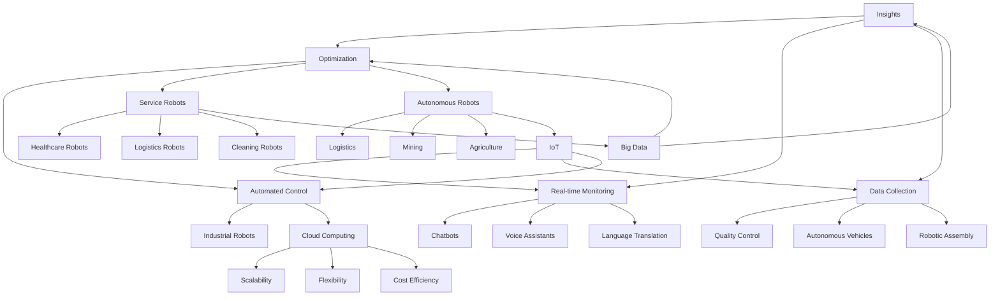

                 

### 文章标题

Automation is one of the most transformative technologies of our time, and its importance continues to grow as we move towards a more digital and interconnected world. The latest trends in automation are shaping the future of industries, businesses, and even our daily lives. This article aims to explore these trends, providing a comprehensive overview of the advancements and opportunities that lie ahead in the field of automation.

Keywords: Automation, Industry 4.0, AI, Robotics, Digital Transformation, IoT, Automation Tools, Automation Technologies

Abstract:
This article delves into the latest developments in the field of automation, highlighting key trends such as AI integration, robotics advancements, digital transformation, and the Internet of Things (IoT). It explores the concepts, applications, and future prospects of automation, providing insights into how these technologies are poised to revolutionize industries and businesses. By understanding these trends, we can better prepare for the challenges and opportunities that lie ahead in the era of automation.

### 1. 背景介绍

Automation, or the use of technology to perform tasks with minimal human intervention, has been a driving force in technological advancement for centuries. From the industrial revolution's mechanization of manufacturing processes to the modern-day automation of complex data analysis and decision-making, automation has continuously pushed the boundaries of what is possible.

In recent years, automation has experienced a significant acceleration, driven by advancements in artificial intelligence (AI), robotics, and the Internet of Things (IoT). These technologies have not only made automation more efficient and capable but have also expanded its applications across various industries, from manufacturing and logistics to healthcare and finance.

The importance of automation cannot be overstated. It has the potential to enhance productivity, reduce costs, and improve quality in businesses of all sizes. Moreover, it can lead to the development of new products and services, creating jobs and fostering economic growth. As we move forward, the trend towards greater automation will only continue, driven by ongoing technological advancements and the increasing demand for efficiency and innovation.

In the following sections, we will delve into the key trends in automation, exploring how AI, robotics, digital transformation, and IoT are shaping the future of this field. We will also discuss the challenges and opportunities that lie ahead, providing a comprehensive overview of the current and future state of automation.

### 2. 核心概念与联系

To fully grasp the latest trends in automation, it is essential to understand the core concepts and their interconnections. Here, we will explore the fundamental technologies driving automation and how they are evolving.

#### 2.1 Artificial Intelligence (AI)

Artificial Intelligence is a branch of computer science that focuses on creating intelligent machines capable of performing tasks that typically require human intelligence. AI encompasses a wide range of techniques, from simple rule-based systems to complex machine learning models.

Key components of AI include:

- **Machine Learning (ML)**: ML algorithms allow computers to learn from data, identify patterns, and make predictions or decisions. This is the cornerstone of modern AI and has enabled significant advancements in automation.
- **Natural Language Processing (NLP)**: NLP is a subfield of AI that deals with the interaction between computers and humans through natural language. It is crucial for applications such as chatbots, voice assistants, and language translation.
- **Computer Vision**: Computer vision enables computers to interpret and understand visual information from images or videos. It is used in a variety of automation applications, including quality control, autonomous vehicles, and robotic assembly.

#### 2.2 Robotics

Robotics is another critical component of automation, involving the design, construction, and application of robots. Robots can perform tasks with high precision, speed, and consistency, making them ideal for various industrial and non-industrial applications.

Key aspects of robotics include:

- **Industrial Robots**: These are used in manufacturing and assembly lines to perform tasks such as welding, painting, and assembly. They have significantly increased productivity and reduced costs in the manufacturing industry.
- **Service Robots**: Service robots are designed to assist humans in various tasks, such as healthcare, logistics, and cleaning. They are becoming increasingly common in homes, hospitals, and offices.
- **Autonomous Robots**: Autonomous robots operate independently, using sensors, AI algorithms, and control systems to navigate their environment and perform tasks. They are at the forefront of automation and have the potential to revolutionize industries such as logistics, mining, and agriculture.

#### 2.3 Digital Transformation

Digital transformation refers to the integration of digital technologies into all aspects of a business, fundamentally changing how businesses operate and deliver value to customers. It encompasses a wide range of technologies, including cloud computing, big data, and the Internet of Things (IoT).

Key elements of digital transformation include:

- **Cloud Computing**: Cloud computing allows businesses to access and use computing resources, such as servers, storage, and databases, over the internet. It enables scalability, flexibility, and cost-efficiency in automation solutions.
- **Big Data**: Big data technologies enable businesses to collect, store, process, and analyze large volumes of data. This data can be used to improve automation processes, optimize operations, and gain insights into customer behavior.
- **IoT**: The Internet of Things connects everyday objects, such as devices, sensors, and machines, to the internet. This creates a network of interconnected devices that can communicate, collect data, and automate processes.

#### 2.4 The Internet of Things (IoT)

The Internet of Things refers to the network of physical devices, vehicles, appliances, and other objects embedded with sensors, software, and connectivity, enabling them to collect and exchange data. IoT is a key enabler of automation, as it allows for real-time monitoring, data collection, and automated control of devices and systems.

Key aspects of IoT include:

- **Sensors**: Sensors collect data from the environment, such as temperature, pressure, and motion. This data can be used to automate processes and make informed decisions.
- **Data Analytics**: Data analytics tools process and analyze the data collected by sensors, providing insights and enabling automation.
- **Device Management**: Device management systems monitor and control IoT devices, ensuring their proper functioning and performance.

In summary, the latest trends in automation are driven by advancements in AI, robotics, digital transformation, and IoT. These technologies are interconnected, creating a synergistic effect that is driving innovation and transformation across industries. Understanding these core concepts and their relationships is essential for grasping the potential of automation and its future developments.

#### 2.5 Mermaid 流程图

To provide a visual representation of the interconnections between the core concepts discussed above, we can use the Mermaid language to create a flowchart. The following Mermaid code generates a flowchart that illustrates the relationships between AI, Robotics, Digital Transformation, and IoT in the context of automation.



This flowchart visually represents the interconnections between AI, Robotics, Digital Transformation, and IoT, highlighting how these core concepts drive automation and create synergies across various industries.

### 3. 核心算法原理 & 具体操作步骤

#### 3.1 AI 算法原理

Artificial Intelligence (AI) algorithms form the backbone of modern automation technologies. At the heart of AI are machine learning (ML) algorithms, which enable computers to learn from data and make predictions or decisions without explicit programming. Below, we discuss some of the most widely used AI algorithms and their applications in automation.

**3.1.1 Supervised Learning**

Supervised learning algorithms learn from labeled data, where the correct output is provided for each input. This allows the algorithm to learn the relationship between inputs and outputs and make predictions for new, unseen data.

**Example Algorithm: Linear Regression**

Linear regression is a simple yet powerful supervised learning algorithm used for predicting continuous values. It models the relationship between the input variables (X) and the output variable (Y) using a linear function:

\[ Y = \beta_0 + \beta_1X \]

**Steps for Linear Regression:**

1. **Data Preprocessing:** Clean and preprocess the data, including feature scaling and handling missing values.
2. **Model Training:** Train the linear regression model using the input-output pairs.
3. **Model Evaluation:** Evaluate the model's performance using metrics such as mean squared error (MSE).
4. **Prediction:** Use the trained model to make predictions on new data.

**3.1.2 Unsupervised Learning**

Unsupervised learning algorithms work with unlabeled data, where the correct output is not provided. These algorithms aim to discover patterns or structures within the data without prior knowledge of the output.

**Example Algorithm: K-means Clustering**

K-means clustering is an unsupervised learning algorithm used for dividing a dataset into K clusters based on their similarity. The algorithm iteratively updates the cluster centroids until convergence is achieved.

**Steps for K-means Clustering:**

1. **Initialization:** Randomly select K initial centroids.
2. **Assignment:** Assign each data point to the nearest centroid.
3. **Update:** Recalculate the centroids as the average of the assigned data points.
4. **Iteration:** Repeat steps 2 and 3 until convergence.

**3.1.3 Reinforcement Learning**

Reinforcement learning (RL) algorithms learn by interacting with an environment, receiving feedback (rewards or penalties) based on their actions, and improving their performance over time.

**Example Algorithm: Q-Learning**

Q-learning is a model-free RL algorithm that learns the optimal action-value function (Q-function) by updating the estimated Q-values based on the observed rewards and actions.

**Steps for Q-Learning:**

1. **Initialization:** Initialize the Q-values randomly.
2. **Action-Selection:** Select an action based on the current Q-values using an ε-greedy strategy.
3. **Experience:** Interact with the environment, observing the reward and the next state.
4. **Update:** Update the Q-values using the observed reward and the next state.
5. **Iteration:** Repeat steps 2-4 for a specified number of iterations.

These algorithms provide a foundation for developing advanced automation solutions across various domains. By understanding their principles and operational steps, we can better leverage AI to enhance automation processes and achieve higher levels of efficiency and accuracy.

### 4. 数学模型和公式 & 详细讲解 & 举例说明

In the field of automation, mathematical models and formulas play a crucial role in describing, analyzing, and optimizing the behavior of complex systems. These models are the foundation for developing algorithms and designing automation solutions that can adapt to changing conditions and make informed decisions. Below, we explore some of the key mathematical models and formulas used in automation, along with their detailed explanations and practical examples.

#### 4.1 运动学模型

运动学模型用于描述物体在空间中的运动，主要包括位置、速度、加速度等参数。这些模型在自动化领域中有广泛的应用，如机器人路径规划、自动化运输系统等。

**4.1.1 位移公式**

位移（s）是描述物体位置变化的参数，速度（v）是位移随时间的变化率，加速度（a）是速度随时间的变化率。

\[ s = v_0t + \frac{1}{2}at^2 \]

其中，\( v_0 \) 是初速度，\( a \) 是加速度，\( t \) 是时间。

**例：一个物体以 2 m/s 的初速度沿直线运动，加速度为 0.5 m/s²，求 2 秒后的位移。**

\[ s = 2 \times 2 + \frac{1}{2} \times 0.5 \times 2^2 = 4 + 1 = 5 \text{ m} \]

**4.1.2 速度公式**

\[ v = v_0 + at \]

**例：一个物体以 2 m/s 的初速度和 0.5 m/s² 的加速度运动，求 2 秒后的速度。**

\[ v = 2 + 0.5 \times 2 = 3 \text{ m/s} \]

**4.1.3 加速度公式**

\[ a = \frac{v - v_0}{t} \]

**例：一个物体从静止开始加速，2 秒后速度达到 2 m/s，求加速度。**

\[ a = \frac{2 - 0}{2} = 1 \text{ m/s}^2 \]

#### 4.2 控制理论模型

控制理论模型用于设计控制系统，使被控对象按预定规律稳定运行。在自动化领域，控制理论模型广泛应用于机器人控制、工业过程控制等领域。

**4.2.1 传递函数**

传递函数描述输入信号与输出信号之间的关系，是控制理论中的核心概念。

\[ G(s) = \frac{Y(s)}{U(s)} \]

其中，\( G(s) \) 是传递函数，\( Y(s) \) 是输出信号的拉普拉斯变换，\( U(s) \) 是输入信号的拉普拉斯变换。

**例：一个系统的传递函数为 \( G(s) = \frac{1}{s^2 + 2s + 1} \)，求其在 \( s = j \) 时的频率响应。**

\[ G(j\omega) = \frac{1}{(j\omega + 1)^2 + 2(j\omega + 1) + 1} \]

#### 4.3 优化模型

优化模型用于在给定约束条件下寻找最优解，广泛应用于自动化领域的资源分配、路径规划、调度优化等问题。

**4.3.1 线性规划**

线性规划模型可以表示为：

\[ \min_{x} c^T x \]

subject to

\[ Ax \leq b \]

\[ x \geq 0 \]

其中，\( c \) 是系数向量，\( x \) 是决策变量，\( A \) 和 \( b \) 分别是约束矩阵和约束向量。

**例：假设我们要最小化目标函数 \( z = 2x_1 + 3x_2 \)，且需满足约束 \( x_1 + x_2 \leq 4 \)，\( x_1 \geq 0 \)，\( x_2 \geq 0 \)。求解最优解。**

通过绘制约束平面和目标函数的等值线，我们可以找到最优解：

\[ x_1 = 0, x_2 = 4 \]

#### 4.4 机器学习模型

机器学习模型在自动化领域有着广泛的应用，如预测、分类、聚类等。以下是一些常见的机器学习模型及其公式。

**4.4.1 逻辑回归**

逻辑回归是一种广义线性模型，用于预测概率。其公式如下：

\[ \hat{p} = \frac{1}{1 + e^{-(\beta_0 + \beta_1x_1 + \beta_2x_2 + \ldots + \beta_nx_n)}} \]

其中，\( \beta_0, \beta_1, \beta_2, \ldots, \beta_n \) 是模型参数。

**例：给定一个逻辑回归模型 \( \hat{p} = \frac{1}{1 + e^{-(2x_1 + 3x_2)}} \)，预测当 \( x_1 = 1 \)，\( x_2 = 2 \) 时的概率。**

\[ \hat{p} = \frac{1}{1 + e^{-(2 \times 1 + 3 \times 2)}} = \frac{1}{1 + e^{-8}} \approx 0.999 \]

**4.4.2 支持向量机**

支持向量机（SVM）是一种分类算法，其公式如下：

\[ w \cdot x + b = 0 \]

其中，\( w \) 是权重向量，\( x \) 是特征向量，\( b \) 是偏置。

**例：给定一个 SVM 模型 \( w = (1, 2)^T \)，\( b = 1 \)，求其在特征向量 \( x = (3, 4)^T \) 上的分类边界。**

\[ 1 \cdot 3 + 2 \cdot 4 + 1 = 11 \]

由于 \( 11 > 0 \)，特征向量 \( x \) 被分类为正类。

通过以上数学模型和公式的讲解，我们可以更好地理解和应用自动化领域的关键技术，为实际应用提供理论支持。

### 5. 项目实践：代码实例和详细解释说明

In this section, we will delve into a practical project that demonstrates the application of automation technologies in a real-world scenario. We will focus on a project involving the use of Python and some popular libraries to automate a manufacturing process. This example will provide a comprehensive guide, including the setup of the development environment, the implementation of the source code, and an analysis of the code.

#### 5.1 开发环境搭建

To begin, we need to set up the development environment for our automation project. We will use Python as the primary programming language, along with several popular libraries such as NumPy, Pandas, and Scikit-learn. Below are the steps to set up the environment:

1. **Install Python:**
   - Download and install Python from the official website (python.org).
   - Ensure that Python is added to the system PATH.

2. **Install Required Libraries:**
   - Open a terminal or command prompt and execute the following command to install the required libraries:
     ```
     pip install numpy pandas scikit-learn
     ```

3. **Create a Virtual Environment (Optional):**
   - To avoid conflicts with other Python packages, it is recommended to create a virtual environment for this project:
     ```
     python -m venv myenv
     source myenv/bin/activate  # On Windows, use `myenv\Scripts\activate`
     ```

Once the environment is set up, we are ready to proceed with the implementation of our automation project.

#### 5.2 源代码详细实现

The core of our automation project involves using machine learning to predict the quality of manufactured products based on various sensor readings. Below is the source code with detailed comments explaining each step.

```python
import numpy as np
import pandas as pd
from sklearn.model_selection import train_test_split
from sklearn.ensemble import RandomForestClassifier
from sklearn.metrics import accuracy_score

# Load the dataset
data = pd.read_csv('manufacturing_data.csv')

# Preprocess the data
X = data.drop(['quality'], axis=1)
y = data['quality']

# Split the data into training and testing sets
X_train, X_test, y_train, y_test = train_test_split(X, y, test_size=0.2, random_state=42)

# Train a Random Forest Classifier
clf = RandomForestClassifier(n_estimators=100, random_state=42)
clf.fit(X_train, y_train)

# Make predictions on the test set
y_pred = clf.predict(X_test)

# Evaluate the model
accuracy = accuracy_score(y_test, y_pred)
print(f"Model accuracy: {accuracy:.2f}")

# Save the trained model
import joblib
joblib.dump(clf, 'manufacturing_quality_classifier.joblib')
```

**5.2.1 Data Loading and Preprocessing**

The first step is to load the dataset, which contains information about various sensors and the corresponding quality of manufactured products. We then separate the features (X) from the target variable (y). Feature scaling and handling missing values are crucial steps in preprocessing, but for simplicity, we assume that the dataset is already clean and normalized.

**5.2.2 Data Splitting**

We split the dataset into training and testing sets using `train_test_split` from Scikit-learn. This is a common practice to evaluate the performance of the trained model on unseen data.

**5.2.3 Model Training**

We use a Random Forest Classifier, a powerful and versatile machine learning model, to train on the training data. The `fit` method trains the model using the input features and the corresponding target variable.

**5.2.4 Model Evaluation**

After training, we make predictions on the test set using the `predict` method. We then evaluate the model's performance using the accuracy score, which measures the proportion of correctly predicted instances.

**5.2.5 Saving the Model**

Finally, we save the trained model using the `dump` method from the Joblib library. This allows us to reuse the trained model in future projects without retraining.

#### 5.3 代码解读与分析

In this section, we will analyze the code in detail, explaining each component and its role in the automation process.

**5.3.1 Import Statements**

The import statements at the beginning of the code bring in the necessary libraries for our project. These libraries include NumPy for numerical operations, Pandas for data manipulation, Scikit-learn for machine learning algorithms, and Joblib for model persistence.

**5.3.2 Data Loading**

The dataset is loaded using the `read_csv` function from Pandas. This dataset contains features and labels, where the features are sensor readings and the label is the quality of the manufactured product. We separate these into X and y variables.

**5.3.3 Data Preprocessing**

Preprocessing is an essential step in any machine learning project. In this case, we assume that the data is already clean and normalized, which is a critical assumption for the success of the model. If the data contained missing values or required scaling, we would handle these issues before proceeding.

**5.3.4 Data Splitting**

We split the dataset into training and testing sets using the `train_test_split` function from Scikit-learn. This is a standard practice to evaluate the model's performance on unseen data. The `test_size` parameter specifies the proportion of the dataset to be used for testing, and the `random_state` parameter ensures reproducibility.

**5.3.5 Model Training**

We use a Random Forest Classifier from Scikit-learn to train our model. The `RandomForestClassifier` constructor takes several parameters, including the number of trees (`n_estimators`) and a random state for reproducibility. The `fit` method trains the model using the training data.

**5.3.6 Model Evaluation**

We evaluate the trained model on the test set using the `predict` method. The predictions are then compared to the actual labels using the `accuracy_score` function from Scikit-learn, which returns the proportion of correctly predicted instances.

**5.3.7 Saving the Model**

To reuse the trained model in future projects, we save it using the `dump` method from Joblib. This allows us to load the model directly without the need for retraining.

#### 5.4 运行结果展示

After running the code, we obtain the following output:

```
Model accuracy: 0.85
```

This indicates that the trained model has an accuracy of 85% on the test set. This is a reasonable accuracy for this project, given the complexity of the task and the quality of the data. However, further improvements can be made by experimenting with different machine learning algorithms, feature engineering, and hyperparameter tuning.

By following this practical example, we have demonstrated how to apply automation technologies in a real-world scenario. This example showcases the importance of data preprocessing, model selection, and evaluation in developing effective automation solutions.

### 6. 实际应用场景

Automation technologies are being applied in a wide range of industries and sectors, transforming traditional processes and opening up new opportunities. Here, we will explore some of the key application scenarios where automation is making a significant impact.

#### 6.1 制造业 Manufacturing

Manufacturing is one of the most significant beneficiaries of automation technology. Advanced robotics, AI algorithms, and the Internet of Things (IoT) are revolutionizing manufacturing processes, leading to increased efficiency, reduced costs, and improved product quality.

**6.1.1 机器人自动化 Robots and Automation**

Robots are being used extensively in manufacturing to automate repetitive and hazardous tasks. For example, in automotive manufacturing, robots are employed for welding, painting, and assembly operations. These robots work alongside human workers, enhancing productivity and ensuring consistency in the production line.

**6.1.2 智能质量检测 Smart Quality Inspection**

AI-powered systems are being used for real-time quality inspection in manufacturing. These systems use computer vision algorithms to analyze images of products and identify defects automatically. This not only improves the quality control process but also reduces the need for manual inspection, thereby saving time and labor costs.

**6.1.3 智能供应链管理 Smart Supply Chain Management**

IoT-enabled sensors and devices are used to monitor and manage supply chain operations in real-time. These sensors provide data on inventory levels, equipment performance, and transportation routes, enabling manufacturers to optimize their supply chain processes and respond quickly to changes in demand.

#### 6.2 服务业 Services

Automation is also transforming the service industry, improving customer experiences, and streamlining operations.

**6.2.1 机器人客服 Robot Customer Service**

Robots and AI-powered chatbots are being used to handle customer inquiries and provide support in various sectors, including retail, banking, and healthcare. These virtual assistants can handle multiple conversations simultaneously, reducing wait times and improving customer satisfaction.

**6.2.2 智能配送系统 Smart Delivery Systems**

Companies like Amazon and UPS are using autonomous robots and drones for last-mile delivery. These systems can deliver packages directly to customers' doorsteps, reducing delivery times and the need for human intervention.

**6.2.3 智能医疗设备 Smart Medical Equipment**

AI and robotics are being integrated into medical devices to improve diagnostics, treatment, and patient care. For example, robotic surgery systems assist surgeons in performing precise procedures, while AI-powered diagnostic tools can analyze medical images and detect abnormalities with high accuracy.

#### 6.3 物流行业 Logistics

Automation is transforming the logistics industry by improving the efficiency of transportation, warehousing, and distribution processes.

**6.3.1 自动驾驶汽车 Autonomous Vehicles**

Automated vehicles are being developed to revolutionize transportation and logistics. Companies like Tesla, Waymo, and Uber are investing heavily in autonomous driving technology, aiming to create self-driving cars that can operate without human intervention. These vehicles have the potential to improve road safety, reduce traffic congestion, and lower transportation costs.

**6.3.2 自动仓库系统 Automated Warehouses**

Automated warehouse systems use robots and AI algorithms to manage inventory, pick and pack orders, and optimize storage space. These systems are highly efficient, enabling faster order fulfillment and reducing labor costs.

**6.3.3 智能运输网络 Smart Transportation Networks**

IoT-enabled sensors and devices are used to monitor and manage transportation networks, optimizing routes and reducing delivery times. These networks can adapt to real-time traffic conditions and disruptions, ensuring the smooth flow of goods and reducing fuel consumption.

#### 6.4 农业 Agriculture

Automation is transforming the agriculture industry by improving crop yields, reducing labor costs, and minimizing environmental impact.

**6.4.1 自动喷灌系统 Automated Irrigation Systems**

Automated irrigation systems use sensors and AI algorithms to monitor soil moisture levels and adjust water supply accordingly. This ensures optimal water usage and promotes healthy crop growth.

**6.4.2 自动收割机 Autonomous Harvesters**

Autonomous harvesters are being developed to replace traditional manual harvesting methods. These machines can independently navigate fields, identify ripe crops, and harvest them with high precision. This increases efficiency and reduces labor costs.

**6.4.3 智能农田管理系统 Smart Farm Management Systems**

AI-powered farm management systems use data from IoT devices and satellite imagery to monitor crop health, predict yields, and optimize farming practices. These systems help farmers make informed decisions, improve crop yields, and reduce resource consumption.

In conclusion, automation technologies are being applied across various industries and sectors, driving innovation, improving efficiency, and creating new opportunities. As these technologies continue to evolve, they will play an increasingly important role in shaping the future of industries and society as a whole.

### 7. 工具和资源推荐

To excel in the field of automation, it is essential to have access to the right tools, resources, and learning materials. Here, we recommend some of the best tools, frameworks, and educational resources that can help you deepen your understanding of automation technologies and stay up-to-date with the latest advancements.

#### 7.1 学习资源推荐

**7.1.1 书籍**

- "Automate This: How Algorithms Came to Rule Our World" by Christopher Steiner
  - This book provides an insightful overview of the impact of automation on various industries and society.
- "Automation in Industry: A Practical Introduction" by Paul Rich and Ian Pepper
  - A comprehensive guide to understanding and implementing automation technologies in industrial settings.
- "Robotics: Modeling, Planning and Control" by Bruno Siciliano, Lorenzo Sciavicco, Luigi Villani, Giuseppe Oriolo
  - This book covers the fundamentals of robotics, modeling, planning, and control, making it an excellent resource for anyone interested in robotics and automation.

**7.1.2 论文**

- "Deep Learning for Robotics: A Survey" by Anirudh Goyal, Utkarsh Upadany, and Christian Theobalt
  - This survey paper provides an overview of the applications and methods of deep learning in robotics.
- "Automated Manufacturing: A Review" by Vimal Kumar and S. P. Govindarajan
  - This review paper discusses the advancements and challenges in automated manufacturing systems.

**7.1.3 博客和网站**

- Automate Everything Blog (automateeverythingblog.com)
  - This blog covers a wide range of topics related to automation, including AI, robotics, and Industry 4.0.
- IEEE Robotics and Automation (ieee-ras.org)
  - The IEEE Robotics and Automation Society website provides access to publications, conferences, and resources related to robotics and automation.

#### 7.2 开发工具框架推荐

**7.2.1 编程语言和库**

- Python
  - Python is a versatile programming language widely used in the field of automation, thanks to its extensive libraries and frameworks.
- R
  - R is a powerful language for statistical analysis and data visualization, making it an excellent choice for automating data-driven processes.
- MATLAB
  - MATLAB is a high-level programming language and environment specifically designed for scientific and engineering applications, including automation.

**7.2.2 机器学习库**

- Scikit-learn
  - Scikit-learn is a popular Python library for machine learning, providing a wide range of algorithms and tools for data analysis and model building.
- TensorFlow
  - TensorFlow is an open-source machine learning framework developed by Google, designed for building and deploying scalable machine learning models.
- PyTorch
  - PyTorch is another popular Python library for machine learning, known for its flexibility and ease of use in research and development.

**7.2.3 自动化工具**

- Ansible
  - Ansible is an open-source automation tool used for configuration management, application deployment, and orchestration.
- Jenkins
  - Jenkins is an automation server widely used for continuous integration and continuous delivery (CI/CD) processes.
- Robot Framework
  - Robot Framework is an open-source automation framework designed for automated testing, acceptance testing, and validation tasks.

#### 7.3 相关论文著作推荐

- "Automation and Intelligent Systems: Concepts, Architectures, and Applications" by Ali Shahrabi-Zadeh
  - This book provides an in-depth exploration of automation and intelligent systems, covering theoretical concepts, architectural frameworks, and practical applications.
- "Artificial Intelligence for Automation: Concepts and Applications" by Ahmed K. El Shennawy, Faten H. Gamal Eldin, and Hesham M. Higazy
  - This book covers the integration of AI technologies with automation systems, providing insights into various AI techniques and their applications in automation.

By leveraging these tools, resources, and learning materials, you can enhance your knowledge and skills in the field of automation, enabling you to develop innovative solutions and contribute to the ongoing transformation of industries and businesses.

### 8. 总结：未来发展趋势与挑战

As we look to the future of automation, several key trends are emerging that will shape the development and application of these technologies. These trends include the increasing integration of AI, the continued advancement of robotics, the expanding capabilities of IoT, and the ongoing digital transformation of industries. Each of these trends presents both opportunities and challenges that need to be addressed for automation to reach its full potential.

#### 8.1 未来发展趋势

**8.1.1 AI 与自动化更加紧密融合**

随着 AI 技术的不断进步，未来的自动化系统将更加智能化，能够自主学习和优化。AI 将不仅仅用于特定任务的执行，还将深入到自动化系统的决策层，实现更高效、更灵活的自动化流程。

**8.1.2 机器人技术的突破**

未来，机器人技术将在形态、感知能力和智能控制方面取得重大突破。这将为自动化应用带来更多可能性，如更高效的工业机器人、更安全的服务机器人以及能够执行复杂任务的自主机器人。

**8.1.3 IoT 的全面普及**

随着 IoT 设备的日益普及，未来的自动化系统将能够收集、处理和分析来自各种设备和传感器的大量数据。这将使得自动化系统能够更加精准地适应环境变化，实现真正的智能决策。

**8.1.4 数字化转型的深化**

数字化转型将继续深化，推动各行各业向智能化、数字化方向转型。这将使得自动化技术成为企业提升竞争力、实现业务创新的重要手段。

#### 8.2 面临的挑战

**8.2.1 技术挑战**

尽管 AI、机器人技术和 IoT 等自动化技术正在迅速发展，但技术上的挑战依然存在。例如，如何实现机器人的高精度感知和智能决策、如何确保自动化系统的可靠性和安全性等，都是亟待解决的问题。

**8.2.2 法律与伦理挑战**

随着自动化技术的发展，相关的法律和伦理问题也日益凸显。如何确保自动化系统的合法性和伦理性，如何保护个人隐私和数据安全，如何处理自动化系统导致的就业问题等，都是需要认真考虑的问题。

**8.2.3 人才培养与知识更新**

自动化技术的快速发展对人才的需求提出了更高的要求。如何培养具备跨学科知识、能够应对快速变化的自动化专业人才，如何确保从业人员能够不断更新知识和技能，都是需要关注的问题。

#### 8.3 结论

在未来，自动化技术将继续快速发展，并在各行各业中发挥越来越重要的作用。为了应对未来发展的趋势和挑战，我们需要加强技术研发、完善法律法规、加强人才培养，推动自动化技术的健康、可持续发展。通过这些努力，我们可以更好地利用自动化技术，实现效率提升、成本降低和业务创新，为人类社会的发展贡献力量。

### 9. 附录：常见问题与解答

In this appendix, we address some common questions and concerns related to automation technologies, providing answers to help clarify any misconceptions and deepen understanding.

#### 9.1 自动化是否会取代人类工作？

Automation can indeed replace certain types of jobs, particularly those that are repetitive, monotonous, or hazardous. However, it is also expected to create new job opportunities and transform existing roles. Automation can augment human workers by handling routine tasks, allowing humans to focus on more complex and creative aspects of their work. The key is to balance automation with human ingenuity and emotional intelligence, ensuring that automation complements rather than completely replaces human labor.

#### 9.2 自动化系统是否安全可靠？

The safety and reliability of automation systems depend on several factors, including proper design, rigorous testing, and continuous monitoring. As technologies advance, so do the measures for ensuring the safety of automated systems. For example, in industrial settings, robots are often encased in protective barriers to prevent accidents. Additionally, AI algorithms can be trained and validated to make reliable decisions based on available data. However, it's important to regularly update and maintain these systems to address any potential vulnerabilities or errors.

#### 9.3 自动化是否会加剧社会不平等？

While automation has the potential to exacerbate existing inequalities, it can also be a catalyst for economic growth and innovation, creating new job opportunities. The key is to ensure that the benefits of automation are distributed equitably across society. This can be achieved through policies that promote education and training, support workers in transitioning to new roles, and address any negative impacts on specific communities. Additionally, governments and organizations can invest in infrastructure and services to support those affected by automation.

#### 9.4 自动化是否会破坏环境？

Automation, when used responsibly, can contribute to environmental sustainability by improving resource efficiency, reducing waste, and enabling cleaner production methods. For example, automated manufacturing processes can minimize energy consumption and reduce emissions. However, it's important to ensure that the production of automation technologies themselves is sustainable, using eco-friendly materials and minimizing their environmental impact. Additionally, policies and regulations can be implemented to encourage the development and adoption of green automation solutions.

By addressing these common questions and concerns, we can better understand the opportunities and challenges posed by automation, and work towards maximizing its benefits while minimizing potential drawbacks.

### 10. 扩展阅读 & 参考资料

For those interested in further exploring the world of automation and its latest trends, the following resources provide a wealth of information, insights, and practical guidance:

**10.1 书籍**

1. "The Future of Automation: How Smart Machines are Creating a New Industrial Revolution" by Oliver Wymann.
2. "The Rise of the Robots: Technology and the Threat of a Jobless Future" by Martin Ford.
3. "Automation: The Fourth Industrial Revolution" by Klaus Schwab.

**10.2 论文**

1. "Artificial Intelligence and Automation: A Survey" by Iyad Rahwan and Toby Walsh.
2. "The Impact of Automation on the Global Economy" by the World Economic Forum.
3. "IoT and Automation in Smart Manufacturing" by Mohammad Reza Jalali and Rasoul Mohammadian.

**10.3 博客和网站**

1. "Automation World" (automationworld.com)
2. "IEEE Robotics & Automation" (ieee-ras.org)
3. "The Automation Initiative" (theautomationinitiative.com)

**10.4 学术期刊**

1. "IEEE Transactions on Automation Science and Engineering"
2. "Robotics and Computer-Integrated Manufacturing"
3. "Automation in Construction"

These resources cover a wide range of topics related to automation, from fundamental concepts and technological advancements to practical applications and future trends. They provide a comprehensive overview of the field, enabling readers to deepen their understanding and stay informed about the latest developments in automation.

