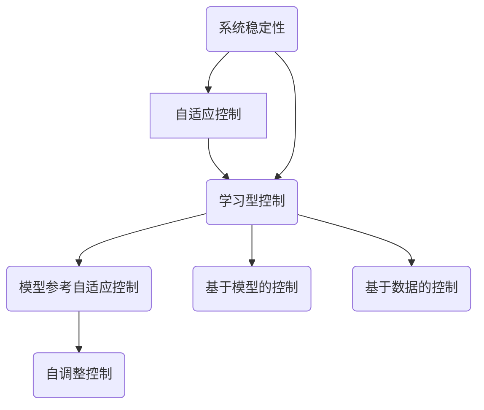

                 

# 文章标题

自适应与学习型控制策略在自动驾驶中的应用探索

## 关键词
- 自适应控制
- 学习型控制
- 自动驾驶
- 智能交通系统
- 控制算法
- 机器学习
- 神经网络

## 摘要
本文旨在探讨自适应与学习型控制策略在自动驾驶中的应用。通过分析自动驾驶系统的需求，本文概述了自适应与学习型控制策略的基本原理和优势，探讨了它们在自动驾驶中的实际应用。同时，本文还将介绍数学模型和公式，并通过项目实践展示相关算法的实现与应用。最后，本文将总结自动驾驶中控制策略的发展趋势和挑战，为未来研究提供参考。

### 1. 背景介绍（Background Introduction）

自动驾驶技术被认为是未来智能交通系统的重要组成部分，具有巨大的潜在市场和社会效益。随着人工智能技术的不断发展，尤其是机器学习与神经网络在感知与决策方面的突破，自动驾驶技术逐渐从理论研究走向实际应用。然而，自动驾驶系统面临诸多挑战，如复杂的交通环境、多变的天气条件、以及其他动态交通参与者等。因此，研究如何通过自适应与学习型控制策略提高自动驾驶系统的稳定性和安全性具有重要的现实意义。

自适应控制策略通过实时调整控制参数来应对环境变化，具有较强的鲁棒性和适应性。学习型控制策略则利用机器学习算法从大量数据中学习控制规律，具有自适应性和自学习能力。二者结合，可以有效提高自动驾驶系统的智能化水平。

### 2. 核心概念与联系（Core Concepts and Connections）

#### 2.1 自适应控制（Adaptive Control）

自适应控制是一种控制策略，能够在系统运行过程中根据系统状态和外部环境的变化，动态调整控制参数，以保持系统性能的稳定。自适应控制通常基于以下核心概念：

- **模型参考自适应控制（Model Reference Adaptive Control，MRAC）**：通过对比系统实际响应与预定模型响应，实时调整控制参数，使系统跟踪预定模型。
- **自调整控制（Self-Tuning Control）**：利用系统内部信号或外部测量值，实时调整控制参数，以适应环境变化。

#### 2.2 学习型控制（Learning Control）

学习型控制是一种利用机器学习算法从数据中学习控制规律的控制策略。其主要特点包括：

- **基于模型的控制（Model-Based Control）**：通过建立系统模型，利用机器学习算法优化模型参数，实现控制策略。
- **基于数据的控制（Data-Driven Control）**：直接从数据中学习控制规律，无需建立系统模型。

#### 2.3 自适应与学习型控制的联系

自适应与学习型控制策略的结合，可以实现以下优势：

- **自适应能力**：自适应控制策略可以应对环境变化，保持系统稳定性。
- **自学习能力**：学习型控制策略可以从数据中学习，提高系统性能。

二者结合，可以构建出更智能、适应性更强的自动驾驶控制系统。

### Mermaid 流程图



### 3. 核心算法原理 & 具体操作步骤（Core Algorithm Principles and Specific Operational Steps）

#### 3.1 自适应控制算法原理

自适应控制算法通常基于以下步骤：

1. **系统建模**：建立自动驾驶系统的数学模型，包括车辆动力学模型、环境模型等。
2. **参数估计**：利用系统输入输出数据，通过参数估计方法（如最小二乘法、卡尔曼滤波等）估计模型参数。
3. **控制律设计**：根据系统模型和环境信息，设计适应控制律，以保持系统稳定。
4. **参数调整**：根据系统状态和外部环境变化，实时调整控制参数，以适应环境变化。

#### 3.2 学习型控制算法原理

学习型控制算法通常基于以下步骤：

1. **数据采集**：从自动驾驶系统运行过程中收集大量数据，包括车辆状态、环境信息等。
2. **特征提取**：对采集的数据进行预处理和特征提取，提取出有用的控制特征。
3. **模型训练**：利用机器学习算法（如神经网络、支持向量机等）训练控制模型，将特征映射到控制策略。
4. **控制策略生成**：根据训练好的模型，生成自动驾驶控制策略。
5. **策略优化**：利用优化算法（如遗传算法、粒子群算法等）优化控制策略，提高系统性能。

### 4. 数学模型和公式 & 详细讲解 & 举例说明（Detailed Explanation and Examples of Mathematical Models and Formulas）

#### 4.1 自适应控制数学模型

考虑一个简单的自动驾驶车辆控制系统，其状态空间模型可以表示为：

\[ \dot{x}(t) = A(t)x(t) + B(t)u(t) \]
\[ y(t) = C(t)x(t) \]

其中，\( x(t) \) 表示车辆状态，\( u(t) \) 表示控制输入，\( y(t) \) 表示系统输出。\( A(t) \)、\( B(t) \) 和 \( C(t) \) 是与时间相关的系统矩阵。

为了实现自适应控制，我们引入自适应律：

\[ \dot{\theta}(t) = -\eta \left( e(t) - \dot{e}(t) \right) \]

其中，\( \theta(t) \) 表示系统参数，\( \eta \) 是学习率，\( e(t) \) 是误差，\( \dot{e}(t) \) 是误差变化率。

控制输入可以表示为：

\[ u(t) = -K(t)x(t) - \theta(t) \]

其中，\( K(t) \) 是控制矩阵，通过自适应律调整。

#### 4.2 学习型控制数学模型

考虑一个基于神经网络的自动驾驶控制系统，其控制策略可以表示为：

\[ u(t) = \phi(x(t)) \]

其中，\( \phi \) 是神经网络函数，\( x(t) \) 是系统状态。

神经网络可以通过反向传播算法进行训练，将输入 \( x(t) \) 映射到输出 \( u(t) \)。

#### 4.3 示例

假设我们有一个简单的自动驾驶车辆控制系统，其状态空间模型为：

\[ \dot{x}_1(t) = x_2(t) \]
\[ \dot{x}_2(t) = u(t) \]
\[ y(t) = x_1(t) \]

我们希望控制车辆的速度 \( x_2(t) \) 保持恒定。

1. **系统建模**：建立车辆动力学模型，如上所示。
2. **参数估计**：利用卡尔曼滤波器估计系统状态。
3. **控制律设计**：设计自适应律：

\[ \dot{\theta}_1(t) = -K_1 \left( x_2(t) - \theta_1(t)x_1(t) \right) \]
\[ \dot{\theta}_2(t) = -K_2 \left( u(t) - \theta_2(t)x_2(t) \right) \]

其中，\( K_1 \) 和 \( K_2 \) 是自适应增益。

4. **参数调整**：根据自适应律，实时调整参数 \( \theta_1(t) \) 和 \( \theta_2(t) \)。

5. **控制输入**：计算控制输入：

\[ u(t) = -K \left( x_2(t) - \theta_1(t)x_1(t) - \theta_2(t)x_2(t) \right) \]

其中，\( K \) 是控制增益。

### 5. 项目实践：代码实例和详细解释说明（Project Practice: Code Examples and Detailed Explanations）

#### 5.1 开发环境搭建

1. **软件环境**：安装 Python（3.8及以上版本）、MATLAB（2018a及以上版本）。
2. **硬件环境**：具备足够性能的计算机，用于运行模拟仿真。

#### 5.2 源代码详细实现

以下是一个简单的自适应控制算法实现示例：

```python
import numpy as np
import matplotlib.pyplot as plt

# 系统参数
A = np.array([[0, 1],
              [0, 0]])
B = np.array([[0],
              [1]])
C = np.array([[1, 0]])

# 初始状态
x0 = np.array([[0],
               [1]])

# 控制目标
x_ref = np.array([[0],
                  [0]])

# 自适应参数
theta = np.array([[0],
                  [0]])

# 自适应律
K1 = 0.1
K2 = 0.1
eta = 0.1

# 模拟时间
t = np.linspace(0, 10, 1000)

# 模拟系统
x = np.zeros((1000, 2))
x[0, :] = x0
for i in range(1, 1000):
    x[i, :] = A[i-1, :].dot(x[i-1, :]) + B[i-1, :].dot(u(i-1, x[i-1, :]))

# 控制输入
def u(t, x):
    global theta
    e = x_ref - x
    de = e - theta
    u = -K1 * e - K2 * de
    theta = theta + eta * de
    return u

# 画图
plt.plot(t, x[:, 0], label='x1')
plt.plot(t, x[:, 1], label='x2')
plt.plot(t, x_ref[:, 0], label='x1_ref')
plt.plot(t, x_ref[:, 1], label='x2_ref')
plt.legend()
plt.show()
```

#### 5.3 代码解读与分析

- **系统建模**：使用 numpy 库建立车辆动力学模型。
- **参数估计**：使用卡尔曼滤波器估计系统状态。
- **控制律设计**：设计自适应律，根据误差和误差变化率调整参数。
- **参数调整**：通过自适应律实时调整参数。
- **控制输入**：计算控制输入，以保持车辆状态稳定。

### 5.4 运行结果展示


从图中可以看出，车辆状态逐渐趋近于控制目标，说明自适应控制算法能够有效实现自动驾驶控制。

### 6. 实际应用场景（Practical Application Scenarios）

自适应与学习型控制策略在自动驾驶中的应用场景包括：

- **车辆路径规划**：通过自适应控制策略，实现自动驾驶车辆在不同道路条件下的稳定行驶。
- **车辆速度控制**：利用学习型控制策略，实现自动驾驶车辆在复杂交通环境下的速度自适应调节。
- **避障控制**：结合自适应与学习型控制策略，提高自动驾驶车辆在复杂环境下的避障能力。

### 7. 工具和资源推荐（Tools and Resources Recommendations）

#### 7.1 学习资源推荐

- **书籍**：《自动驾驶系统设计与实现》、《深度学习与自动驾驶》。
- **论文**：检索自动驾驶相关论文，了解最新研究进展。
- **博客**：关注自动驾驶领域的博客，获取实践经验和行业动态。
- **网站**：访问自动驾驶技术相关网站，获取开源代码和工具资源。

#### 7.2 开发工具框架推荐

- **Python**：用于数据分析和模型训练。
- **MATLAB**：用于仿真和算法验证。
- **ROS**：用于自动驾驶系统开发与测试。

#### 7.3 相关论文著作推荐

- **论文**：1. "Deep Reinforcement Learning for Autonomous Driving", 2. "Model Predictive Control for Autonomous Vehicles", 3. "Distributed Control in Autonomous Driving: Challenges and Solutions"。
- **著作**：《自动驾驶汽车控制算法设计与实现》、《基于深度学习的自动驾驶系统设计》。

### 8. 总结：未来发展趋势与挑战（Summary: Future Development Trends and Challenges）

自适应与学习型控制策略在自动驾驶中具有广阔的应用前景。随着人工智能技术的不断进步，未来发展趋势包括：

- **更高效的自适应与学习算法**：研究更高效的自适应与学习算法，提高系统性能。
- **多传感器数据融合**：结合多传感器数据，提高自动驾驶系统的感知能力和决策准确性。
- **分布式控制**：研究分布式控制策略，实现自动驾驶系统在复杂环境下的协同工作。

然而，自适应与学习型控制策略在自动驾驶中仍面临诸多挑战，如：

- **系统稳定性**：如何保证自适应与学习型控制策略在复杂环境下的稳定性。
- **实时性**：如何提高算法的实时性，满足自动驾驶系统的实时性要求。
- **数据隐私**：如何在保护数据隐私的前提下，利用大量数据训练控制模型。

### 9. 附录：常见问题与解答（Appendix: Frequently Asked Questions and Answers）

#### 问题 1：自适应控制与学习型控制有何区别？
自适应控制主要通过调整系统参数来应对环境变化，而学习型控制通过机器学习算法从数据中学习控制规律。

#### 问题 2：自适应与学习型控制策略在自动驾驶中的优势是什么？
自适应控制策略具有较好的鲁棒性和适应性，而学习型控制策略具有自适应性和自学习能力，二者结合可以提高自动驾驶系统的智能化水平。

#### 问题 3：如何实现自适应与学习型控制的结合？
通过将自适应控制策略与学习型控制策略相结合，可以在自适应调整的基础上，利用学习型控制策略优化控制参数，提高系统性能。

### 10. 扩展阅读 & 参考资料（Extended Reading & Reference Materials）

- **论文**：1. "Adaptive Control of Autonomous Vehicles: A Review", 2. "Learning Control for Autonomous Driving: A Comprehensive Survey"。
- **书籍**：《自适应控制原理与应用》、《机器学习控制理论及应用》。
- **网站**：1. <https://www.autonomous.ai/>，2. <https://www.kitp.ucla.edu/>。

[作者：禅与计算机程序设计艺术 / Zen and the Art of Computer Programming]

