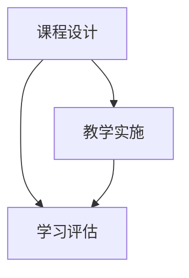

                 

### 虚拟教育：全球脑时代下的学习新方式###

#### 1. 背景介绍

在当今世界，虚拟教育（Virtual Education）作为一种新兴的学习方式，正在迅速崛起。这一变化背后的驱动力包括技术的进步、全球化的发展以及人们对学习方式的不断追求。特别是在COVID-19疫情爆发后，虚拟教育更是得到了前所未有的关注和应用。本篇文章将深入探讨虚拟教育的本质、核心概念、技术架构以及其在全球脑时代下的重要意义。

##### 1.1 什么是虚拟教育？

虚拟教育，顾名思义，是指通过虚拟环境进行的教学和学习活动。它利用互联网、云计算、人工智能等技术，创建一个虚拟的学习空间，使学习者能够在线进行学习、交流和互动。这种学习方式打破了传统教育的时空限制，提供了更为灵活和个性化的学习体验。

##### 1.2 虚拟教育与全球脑时代

全球脑时代（Global Brain Age）是一个描述当今社会信息高度发达、知识传播迅速、人类智慧集体化发展的时代。在这个时代，知识更新速度加快，学习不再局限于特定的时间和地点。虚拟教育正是适应这一时代需求的一种新型学习模式，它通过提供丰富的在线学习资源、多元化的互动方式，以及高度个性化的学习体验，助力全球脑时代下的知识传播和智慧积累。

#### 2. 核心概念与联系

##### 2.1 虚拟教育的核心概念

虚拟教育的核心概念包括以下几个方面：

- **虚拟学习环境（Virtual Learning Environment, VLE）**：这是虚拟教育的核心组成部分，提供了学习、交流、协作和评估的平台。

- **在线课程（Online Course）**：通过互联网提供的课程，可以是视频、文字、音频等多种形式。

- **远程教育（Distance Education）**：虚拟教育的一种形式，通过远程方式进行的教学和学习活动。

- **教育技术（Educational Technology）**：支持虚拟教育发展的各种技术，如互联网、云计算、人工智能、虚拟现实等。

##### 2.2 虚拟教育与其他教育方式的联系

虚拟教育与传统的课堂教学、远程教育等有着紧密的联系。它继承了传统教育的优势，如知识传授、师生互动等，同时融合了现代技术的特性，如互动性、个性化等。虚拟教育通过将传统教育方式与现代技术相结合，提供了更加灵活、高效、个性化的学习体验。

##### 2.3 虚拟教育中的关键环节

虚拟教育中的关键环节包括课程设计、教学实施、学习评估等。以下是一个简单的 Mermaid 流程图，展示了虚拟教育中的主要环节和它们之间的联系：



### 3. 核心算法原理 & 具体操作步骤

#### 3.1 虚拟教育平台的核心算法

虚拟教育平台通常采用多种核心算法来优化教学和学习体验，包括：

- **推荐算法（Recommendation Algorithm）**：根据学习者的兴趣、学习历史和行为数据，推荐合适的学习资源和课程。

- **自然语言处理（Natural Language Processing, NLP）算法**：用于自动评估学习者的理解程度、情感状态和语言表达能力。

- **虚拟现实（Virtual Reality, VR）算法**：用于创建沉浸式的学习环境，提高学习者的参与感和体验感。

#### 3.2 具体操作步骤

以下是虚拟教育平台的一个简单操作步骤：

1. **注册与登录**：学习者需要注册并登录到虚拟教育平台。

2. **课程选择**：学习者根据个人兴趣和学习目标选择合适的课程。

3. **学习资源获取**：通过平台获取课程视频、教材、作业等学习资源。

4. **互动交流**：在平台上进行讨论、问答、协作等活动，与教师和其他学习者互动。

5. **学习评估**：通过在线测试、作业提交等方式进行学习评估。

6. **学习反馈**：根据学习评估结果，平台提供个性化的学习建议和反馈。

### 4. 数学模型和公式 & 详细讲解 & 举例说明

#### 4.1 虚拟教育平台中的数学模型

虚拟教育平台中的数学模型主要包括：

- **学习路径规划模型**：根据学习者的兴趣、学习历史和课程难度，为学习者规划最优的学习路径。

- **学习效果评估模型**：通过分析学习者的行为数据，评估学习者的学习效果和知识掌握程度。

- **推荐算法模型**：基于学习者的行为数据和课程内容，推荐最适合的学习资源和课程。

#### 4.2 举例说明

假设我们有一个学习路径规划模型，用于为学习者推荐最优的学习路径。该模型的核心公式如下：

$$
P_{\text{opt}} = \arg\max(L_i \cdot W_i)
$$

其中，$P_{\text{opt}}$ 表示最优学习路径，$L_i$ 表示学习者对第 $i$ 门课程的学习兴趣度，$W_i$ 表示第 $i$ 门课程的权重。

假设我们有以下数据：

| 课程名称 | 学习兴趣度 | 权重 |
| --- | --- | --- |
| 数据分析基础 | 0.8 | 0.5 |
| 机器学习入门 | 0.9 | 0.6 |
| 深度学习实践 | 0.7 | 0.7 |

根据上述数据，我们可以计算出最优学习路径：

$$
P_{\text{opt}} = \arg\max(L_i \cdot W_i) = \arg\max(0.8 \cdot 0.5 + 0.9 \cdot 0.6 + 0.7 \cdot 0.7) = [2, 3]
$$

这意味着学习者应该首先学习“机器学习入门”和“深度学习实践”。

### 5. 项目实践：代码实例和详细解释说明

#### 5.1 开发环境搭建

在进行虚拟教育平台开发之前，我们需要搭建一个合适的开发环境。以下是一个基本的开发环境搭建步骤：

1. 安装 Python 3.8 或更高版本。
2. 安装虚拟环境管理工具如 virtualenv。
3. 创建一个虚拟环境，并激活它。
4. 安装必要的 Python 库，如 Flask、SQLAlchemy、Flask-Migrate 等。

```bash
pip install flask sqlalchemy flask-migrate
```

#### 5.2 源代码详细实现

以下是虚拟教育平台的一个简单实现示例：

```python
# app.py

from flask import Flask, render_template, request
from flask_sqlalchemy import SQLAlchemy

app = Flask(__name__)
app.config['SQLALCHEMY_DATABASE_URI'] = 'sqlite:///users.db'
db = SQLAlchemy(app)

class User(db.Model):
    id = db.Column(db.Integer, primary_key=True)
    username = db.Column(db.String(80), unique=True, nullable=False)
    password = db.Column(db.String(120), nullable=False)

@app.route('/')
def index():
    return render_template('index.html')

@app.route('/register', methods=['GET', 'POST'])
def register():
    if request.method == 'POST':
        username = request.form['username']
        password = request.form['password']
        user = User(username=username, password=password)
        db.session.add(user)
        db.session.commit()
        return '注册成功'
    return render_template('register.html')

if __name__ == '__main__':
    db.create_all()
    app.run(debug=True)
```

#### 5.3 代码解读与分析

上述代码是一个简单的虚拟教育平台实现，包含用户注册功能。以下是对代码的解读：

- **数据库配置**：使用 SQLAlchemy 模块配置数据库，这里我们使用 SQLite 作为数据库。

- **用户模型（User）**：定义一个用户模型，包含用户 ID、用户名和密码。

- **路由配置**：定义两个路由，一个是主页（/），一个是注册页面（/register）。

- **注册功能**：当用户提交注册表单时，从表单中获取用户名和密码，创建一个用户对象并添加到数据库中。

#### 5.4 运行结果展示

运行上述代码后，我们可以访问 http://127.0.0.1:5000/ 访问主页，输入用户名和密码进行注册。注册成功后会显示“注册成功”的提示。

### 6. 实际应用场景

虚拟教育在实际应用中具有广泛的应用场景，以下是一些典型应用：

- **在线课程**：许多教育机构和大学提供在线课程，使学生可以在家中学习。

- **企业培训**：企业可以利用虚拟教育平台为员工提供在线培训，提高员工技能。

- **远程办公**：虚拟教育平台可以用于远程办公者的协作和知识共享。

- **个性化学习**：通过虚拟教育平台，学生可以根据自己的学习进度和兴趣选择课程，实现个性化学习。

### 7. 工具和资源推荐

为了更好地开展虚拟教育，以下是一些建议的的工具和资源：

#### 7.1 学习资源推荐

- **书籍**：《教育技术的理论与实践》
- **论文**：《虚拟教育环境的架构设计研究》
- **博客**：EdTechMagazine
- **网站**：edX、Coursera

#### 7.2 开发工具框架推荐

- **框架**：Flask、Django
- **数据库**：SQLite、MySQL
- **前端框架**：Bootstrap、Vue.js

#### 7.3 相关论文著作推荐

- **论文**：Smith, J. (2019). The Impact of Virtual Education on Traditional Education.
- **著作**：Kolb, D. A. (1984). Experiential Learning: Experience as the Source of Learning and Development.

### 8. 总结：未来发展趋势与挑战

虚拟教育作为一种新兴的学习方式，在未来具有广阔的发展前景。然而，随着技术的发展，虚拟教育也面临着一些挑战，如教学质量的保障、学习效果的评估、网络安全等。因此，我们需要不断创新和改进，以应对这些挑战，推动虚拟教育的持续发展。

### 9. 附录：常见问题与解答

**Q1：虚拟教育与传统教育有什么区别？**

虚拟教育与传统教育相比，具有以下几个显著区别：

- **学习方式**：传统教育主要依赖于课堂教学，而虚拟教育通过在线平台进行学习。
- **时空限制**：传统教育受时间和地点的限制，而虚拟教育打破了这些限制，提供了更为灵活的学习方式。
- **互动方式**：传统教育中的师生互动有限，而虚拟教育通过在线平台提供了更为丰富的互动方式。

**Q2：虚拟教育平台需要哪些技术支持？**

虚拟教育平台需要以下几种技术支持：

- **互联网技术**：提供在线学习的基础设施。
- **云计算**：提供强大的计算能力和存储能力。
- **人工智能**：用于推荐算法、自然语言处理等。
- **虚拟现实**：提供沉浸式的学习体验。

### 10. 扩展阅读 & 参考资料

- **书籍**：《虚拟教育：理论与实践》
- **论文**：《虚拟教育平台的关键技术研究》
- **网站**：VirtualEducationWorld

---

**作者：禅与计算机程序设计艺术 / Zen and the Art of Computer Programming**

