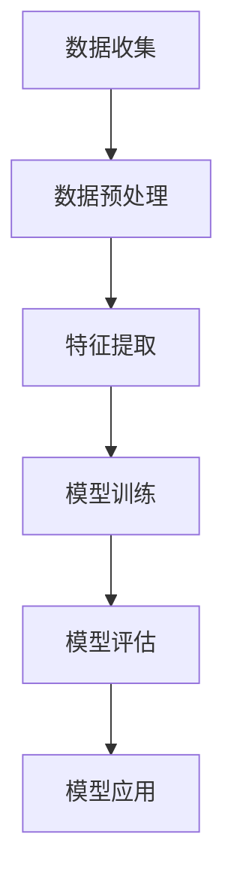
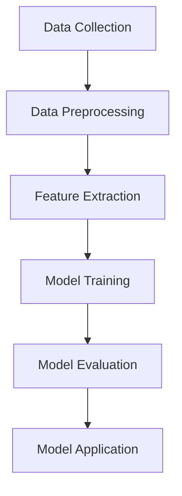

                 

### 背景介绍（Background Introduction）

#### 虚拟教育与全球脑时代

随着全球科技的飞速发展，虚拟教育（Virtual Education）逐渐成为知识获取的新方式。这种教育模式利用计算机技术、虚拟现实（VR）和增强现实（AR）等先进手段，为学生提供沉浸式、互动式的学习体验。虚拟教育不仅突破了传统教育的时空限制，还极大地丰富了教育资源的多样性。

进入全球脑时代，知识获取的方式正发生深刻变革。在这个时代，人工智能（AI）技术、大数据、云计算等新兴科技日益成熟，使得个性化、智能化的学习成为可能。虚拟教育作为全球脑时代的重要产物，不仅改变了教育的形式，更为知识的传播和获取带来了新的机遇和挑战。

#### 本文目的与结构

本文旨在探讨虚拟教育在知识获取中的重要性，分析其在全球脑时代的发展趋势和潜在挑战。文章将按照以下结构展开：

1. **背景介绍**：介绍虚拟教育和全球脑时代的背景。
2. **核心概念与联系**：探讨虚拟教育中涉及的关键概念和技术架构。
3. **核心算法原理 & 具体操作步骤**：分析虚拟教育中的核心技术原理和操作步骤。
4. **数学模型和公式 & 详细讲解 & 举例说明**：介绍虚拟教育中使用的数学模型和公式，并通过实例进行详细讲解。
5. **项目实践：代码实例和详细解释说明**：提供虚拟教育项目的代码实例和详细解释。
6. **实际应用场景**：探讨虚拟教育在不同领域的应用。
7. **工具和资源推荐**：推荐相关的学习资源和开发工具。
8. **总结：未来发展趋势与挑战**：总结虚拟教育的未来发展趋势和面临的挑战。
9. **附录：常见问题与解答**：回答读者可能关心的问题。
10. **扩展阅读 & 参考资料**：提供进一步阅读的资源。

通过上述结构，本文将系统性地探讨虚拟教育在知识获取中的角色和影响，为读者提供全面的视角和深入的见解。

#### Background Introduction

##### Virtual Education and the Global Brain Era

With the rapid advancement of global technology, virtual education is emerging as a new method of knowledge acquisition. This educational model utilizes computer technology, virtual reality (VR), and augmented reality (AR) to provide students with immersive and interactive learning experiences. Virtual education not only breaks down the limitations of traditional education in terms of time and space but also greatly enriches the diversity of educational resources.

Entering the Global Brain Era, the way knowledge is acquired is undergoing profound changes. In this era, emerging technologies such as artificial intelligence (AI), big data, and cloud computing are increasingly mature, making personalized and intelligent learning a possibility. Virtual education, as an important product of the Global Brain Era, not only changes the form of education but also brings new opportunities and challenges to the dissemination and acquisition of knowledge.

##### Purpose and Structure of This Article

The purpose of this article is to explore the importance of virtual education in knowledge acquisition and analyze its development trends and potential challenges in the Global Brain Era. The article will be structured as follows:

1. **Background Introduction**: Introduce the background of virtual education and the Global Brain Era.
2. **Core Concepts and Connections**: Discuss key concepts and technical architectures involved in virtual education.
3. **Core Algorithm Principles & Specific Operational Steps**: Analyze the core technical principles and operational steps in virtual education.
4. **Mathematical Models and Formulas & Detailed Explanation & Example Illustrations**: Introduce the mathematical models and formulas used in virtual education, and provide detailed explanations through examples.
5. **Project Practice: Code Examples and Detailed Explanations**: Provide code examples and detailed explanations for virtual education projects.
6. **Practical Application Scenarios**: Discuss the applications of virtual education in different fields.
7. **Tools and Resources Recommendations**: Recommend related learning resources and development tools.
8. **Summary: Future Development Trends and Challenges**: Summarize the future development trends and challenges of virtual education.
9. **Appendix: Frequently Asked Questions and Answers**: Answer common questions readers may have.
10. **Extended Reading & Reference Materials**: Provide further reading resources.

Through this structured approach, this article will systematically explore the role and impact of virtual education in knowledge acquisition, providing readers with a comprehensive perspective and in-depth insights.

### 核心概念与联系（Core Concepts and Connections）

#### 虚拟教育的基本概念

虚拟教育（Virtual Education）是一种利用计算机和网络技术，通过虚拟环境提供学习资源和教学活动的教育模式。它包括以下几个核心概念：

1. **虚拟环境**（Virtual Environment）：指通过计算机技术创建的模拟现实环境，学生可以在其中进行学习和互动。
2. **学习资源**（Learning Resources）：包括电子书籍、在线课程、虚拟实验室、模拟测试等，通过这些资源学生可以自主学习。
3. **互动**（Interaction）：学生与教师、学生与学生之间通过虚拟平台进行交流，增强学习的互动性。

#### 技术架构

虚拟教育的技术架构涉及多个方面，包括硬件、软件和网络。以下是其中的几个关键组成部分：

1. **硬件**（Hardware）：包括计算机、服务器、网络设备等，为虚拟教育提供基础设施。
2. **软件**（Software）：包括学习管理系统（LMS）、虚拟现实软件、虚拟实验室软件等，负责管理和提供教学资源。
3. **网络**（Network）：利用互联网进行数据传输，确保学生和教师能够随时随地访问虚拟教育资源。

#### 关键技术

虚拟教育依赖于多项先进技术，以下是其中一些关键技术：

1. **虚拟现实（VR）**（Virtual Reality）：通过头戴式显示器、传感器等设备，创建沉浸式的虚拟环境。
2. **增强现实（AR）**（Augmented Reality）：通过智能手机或平板电脑等设备，将虚拟信息叠加到现实世界中。
3. **人工智能（AI）**（Artificial Intelligence）：用于个性化学习路径、智能推荐和自动化教学评估等。

#### 应用场景

虚拟教育在不同领域有着广泛的应用场景，以下是一些具体例子：

1. **远程教育**（Remote Education）：利用虚拟教育平台，为学生提供远程学习的机会，特别是在偏远地区。
2. **职业培训**（Professional Training）：通过虚拟实验室和模拟环境，提供职业培训，提高学生的实践能力。
3. **医学教育**（Medical Education）：利用虚拟现实技术，进行医学手术模拟和人体解剖学教学。

#### 联系与挑战

虚拟教育与全球脑时代的联系体现在以下几个方面：

1. **知识获取方式的变革**：虚拟教育提供了更加灵活和个性化的学习方式，适应了全球脑时代对知识获取的多元化需求。
2. **技术整合与创新**：虚拟教育需要整合多种先进技术，如VR、AR和AI，这为技术创新提供了广阔空间。
3. **教育公平**：虚拟教育在一定程度上可以缩小教育资源的不均衡，提高教育的普及率和公平性。

然而，虚拟教育也面临一些挑战：

1. **技术门槛**：虚拟教育需要一定的技术基础设施，这对于一些资源匮乏的地区来说可能是一个障碍。
2. **用户接受度**：部分学生和教师可能对虚拟教育模式持怀疑态度，需要通过实践和教育来提高接受度。
3. **隐私与安全**：虚拟教育平台需要确保用户数据的安全和隐私，防止信息泄露和滥用。

#### Summary

In this section, we have discussed the fundamental concepts and technical architectures of virtual education, highlighting key concepts such as virtual environments, learning resources, and interaction. We have also explored the essential technologies involved, including virtual reality, augmented reality, and artificial intelligence. Furthermore, we have examined the diverse application scenarios of virtual education and the challenges it faces in the Global Brain Era. By understanding these core concepts and connections, we can better appreciate the role and potential of virtual education in the modern educational landscape.

### Core Concepts and Connections

#### Basic Concepts of Virtual Education

Virtual Education, a form of education that leverages computer and network technologies to provide learning resources and teaching activities through virtual environments, encompasses several core concepts:

1. **Virtual Environment**: A simulated reality created using computer technology where students can engage in learning and interaction.
2. **Learning Resources**: These include electronic books, online courses, virtual labs, and simulated tests that enable students to learn independently.
3. **Interaction**: Communication between students and teachers, as well as among students, facilitated through virtual platforms, enhancing the interactivity of learning.

#### Technical Architecture

The technical architecture of virtual education involves various aspects, including hardware, software, and networks. Here are several key components:

1. **Hardware**: Includes computers, servers, network devices, and other infrastructure required for virtual education.
2. **Software**: Comprises learning management systems (LMS), virtual reality software, and virtual lab software that manage and provide educational resources.
3. **Network**: Utilizes the internet for data transmission, ensuring that students and teachers can access virtual educational resources anytime and anywhere.

#### Key Technologies

Virtual education relies on several advanced technologies, including:

1. **Virtual Reality (VR)**: Head-mounted displays, sensors, and other devices are used to create immersive virtual environments.
2. **Augmented Reality (AR)**: Smartphones or tablets overlay virtual information onto the real world.
3. **Artificial Intelligence (AI)**: Used for personalized learning paths, intelligent recommendations, and automated teaching assessments.

#### Application Scenarios

Virtual education has a wide range of application scenarios in different fields, including:

1. **Remote Education**: Utilizing virtual education platforms to offer remote learning opportunities, especially in remote areas.
2. **Professional Training**: Through virtual labs and simulated environments, providing professional training to enhance students' practical skills.
3. **Medical Education**: Using virtual reality technology for surgical simulation and anatomical teaching.

#### Connections and Challenges

The connection between virtual education and the Global Brain Era is evident in several aspects:

1. **Transformation of Knowledge Acquisition Methods**: Virtual education offers a more flexible and personalized learning approach, adapting to the diverse knowledge acquisition needs of the Global Brain Era.
2. **Integration and Innovation of Technologies**: Virtual education requires the integration of multiple advanced technologies, such as VR, AR, and AI, providing a vast space for technological innovation.
3. **Educational Equity**: To some extent, virtual education can help close the gap in educational resources, improving the accessibility and equity of education.

However, virtual education also faces challenges:

1. **Technical Barriers**: Virtual education requires certain technical infrastructure, which can be a barrier for some resource-poor areas.
2. **User Acceptance**: Some students and teachers may have skepticism about virtual education models, requiring practical experience and education to improve acceptance.
3. **Privacy and Security**: Virtual education platforms must ensure the security and privacy of user data, preventing data leaks and misuse.

#### Summary

In this section, we have discussed the fundamental concepts and technical architectures of virtual education, highlighting key concepts such as virtual environments, learning resources, and interaction. We have also explored the essential technologies involved, including virtual reality, augmented reality, and artificial intelligence. Furthermore, we have examined the diverse application scenarios of virtual education and the challenges it faces in the Global Brain Era. By understanding these core concepts and connections, we can better appreciate the role and potential of virtual education in the modern educational landscape.

### 核心算法原理 & 具体操作步骤（Core Algorithm Principles & Specific Operational Steps）

#### 虚拟教育中的核心算法原理

虚拟教育中的核心算法原理主要包括人工智能算法、机器学习算法和深度学习算法。这些算法在虚拟环境的构建、学习资源的推荐、学习过程的评估等方面发挥着关键作用。

1. **人工智能算法**（Artificial Intelligence Algorithms）：人工智能算法用于模拟人类思维过程，帮助虚拟教育平台理解和处理学生的需求。常见的算法包括决策树、支持向量机（SVM）等。
2. **机器学习算法**（Machine Learning Algorithms）：机器学习算法通过从数据中学习规律，用于个性化推荐、学习路径优化等。常见的算法包括K近邻（K-Nearest Neighbors, KNN）、朴素贝叶斯（Naive Bayes）等。
3. **深度学习算法**（Deep Learning Algorithms）：深度学习算法基于多层神经网络，能够自动提取复杂特征，常用于图像识别、语音识别等。常见的算法包括卷积神经网络（Convolutional Neural Networks, CNN）和循环神经网络（Recurrent Neural Networks, RNN）。

#### 具体操作步骤

以下是一个简单的虚拟教育平台中的人工智能算法操作步骤示例：

1. **数据收集**（Data Collection）：收集学生的学习数据，包括学习时间、学习内容、考试成绩等。
2. **数据预处理**（Data Preprocessing）：对收集的数据进行清洗、归一化等处理，以便算法能够有效学习。
3. **特征提取**（Feature Extraction）：从预处理后的数据中提取关键特征，用于训练模型。
4. **模型训练**（Model Training）：使用机器学习算法（如K近邻算法）对特征进行训练，以构建预测模型。
5. **模型评估**（Model Evaluation）：使用交叉验证等方法对训练好的模型进行评估，确保其预测准确性。
6. **模型应用**（Model Application）：将训练好的模型应用于实际场景，如学习资源推荐、学习过程评估等。

#### 算法流程图

以下是一个基于K近邻算法的虚拟教育平台的算法流程图，使用Mermaid语法表示：



通过上述核心算法原理和具体操作步骤，虚拟教育平台能够更有效地为学生提供个性化的学习资源和指导，从而提高学习效果。

### Core Algorithm Principles & Specific Operational Steps

#### Core Algorithm Principles in Virtual Education

The core algorithm principles in virtual education primarily include artificial intelligence algorithms, machine learning algorithms, and deep learning algorithms. These algorithms play a critical role in constructing virtual environments, recommending learning resources, and evaluating the learning process.

1. **Artificial Intelligence Algorithms**: These algorithms simulate human thinking processes to help virtual education platforms understand and process student needs. Common algorithms include decision trees and support vector machines (SVMs).
2. **Machine Learning Algorithms**: These algorithms learn from data to create patterns, used for personalized recommendations and learning path optimization. Common algorithms include K-Nearest Neighbors (KNN) and Naive Bayes.
3. **Deep Learning Algorithms**: Based on multi-layer neural networks, deep learning algorithms can automatically extract complex features, commonly used in image recognition and speech recognition. Common algorithms include Convolutional Neural Networks (CNNs) and Recurrent Neural Networks (RNNs).

#### Specific Operational Steps

Here is an example of operational steps for artificial intelligence algorithms in a virtual education platform:

1. **Data Collection**: Collect student learning data, including learning time, learning content, and exam scores.
2. **Data Preprocessing**: Clean and normalize the collected data to ensure the algorithms can effectively learn from it.
3. **Feature Extraction**: Extract key features from the preprocessed data for training the model.
4. **Model Training**: Use machine learning algorithms (e.g., K-Nearest Neighbors) to train the features to build a predictive model.
5. **Model Evaluation**: Evaluate the trained model using cross-validation methods to ensure its predictive accuracy.
6. **Model Application**: Apply the trained model to practical scenarios, such as learning resource recommendations and learning process evaluations.

#### Algorithm Flowchart

Below is a flowchart for a K-Nearest Neighbors algorithm in a virtual education platform, represented using Mermaid syntax:



By understanding these core algorithm principles and operational steps, virtual education platforms can more effectively provide personalized learning resources and guidance, thereby enhancing learning outcomes.

### 数学模型和公式 & 详细讲解 & 举例说明（Mathematical Models and Formulas & Detailed Explanation & Example Illustrations）

#### 数学模型和公式在虚拟教育中的应用

数学模型和公式在虚拟教育中扮演着至关重要的角色，尤其是在个性化学习路径推荐、学习效果评估以及教学资源优化等方面。以下将详细讨论几个关键的数学模型和公式，并给出具体的例子进行说明。

##### 1. 个性化学习路径推荐模型

**模型公式：**
$$
\text{Recommended Path} = \sum_{i=1}^{n} w_i \cdot \text{Score}_i
$$

其中：
- \( w_i \) 表示第 \( i \) 个学习资源的权重。
- \( \text{Score}_i \) 表示第 \( i \) 个学习资源的评分。

**详细讲解：**
个性化学习路径推荐模型通过计算每个学习资源的权重和评分，来生成推荐的学习路径。权重可以根据学生过去的成绩、学习时间、学习兴趣等因素进行动态调整。评分可以通过机器学习算法对学习资源的内容和学生的学习效果进行评估。

**例子：**
假设一个学生正在学习编程，学习资源包括基础编程、数据结构和算法等。根据学生的历史成绩和学习时间，基础编程的权重为0.6，数据结构的权重为0.3，算法的权重为0.1。如果这三个资源的评分分别为0.8、0.7和0.6，则推荐的学习路径为：
$$
\text{Recommended Path} = 0.6 \cdot 0.8 + 0.3 \cdot 0.7 + 0.1 \cdot 0.6 = 0.608
$$

##### 2. 学习效果评估模型

**模型公式：**
$$
\text{Learning Effectiveness} = \frac{\text{Achieved Score} - \text{Baseline Score}}{\text{Max Score} - \text{Baseline Score}}
$$

其中：
- \( \text{Achieved Score} \) 表示学生实际获得的分数。
- \( \text{Baseline Score} \) 表示学生基础水平的分数。
- \( \text{Max Score} \) 表示满分的分数。

**详细讲解：**
学习效果评估模型通过比较学生实际获得的分数与基础水平的分数，来衡量学生的学习效果。这个模型可以动态调整基础水平的分数，以适应学生的进步。

**例子：**
一个学生在一次考试中获得了85分，而他的基础水平分数为70分，满分为100分。那么他的学习效果为：
$$
\text{Learning Effectiveness} = \frac{85 - 70}{100 - 70} = \frac{15}{30} = 0.5
$$

##### 3. 教学资源优化模型

**模型公式：**
$$
\text{Resource Optimization} = \text{Total Learning Time} \cdot \text{Resource Utilization Rate}
$$

其中：
- \( \text{Total Learning Time} \) 表示学生总共的学习时间。
- \( \text{Resource Utilization Rate} \) 表示学习资源的利用率。

**详细讲解：**
教学资源优化模型通过计算学生总的学习时间和学习资源的利用率，来评估教学资源的有效性。利用率的提高可以通过优化学习资源的分配和学习过程来实现。

**例子：**
如果一个学生每天学习2小时，而学习资源的利用率为70%，那么教学资源的优化值为：
$$
\text{Resource Optimization} = 2 \cdot 0.7 = 1.4
$$

通过这些数学模型和公式，虚拟教育平台可以更加精确地为学生推荐学习资源、评估学习效果和优化教学资源，从而提高整体的学习效果。

### Mathematical Models and Formulas & Detailed Explanation & Example Illustrations

#### Application of Mathematical Models and Formulas in Virtual Education

Mathematical models and formulas play a crucial role in virtual education, particularly in personalized learning path recommendations, learning effectiveness evaluation, and teaching resource optimization. The following will detail several key mathematical models and formulas, along with specific examples for illustration.

##### 1. Personalized Learning Path Recommendation Model

**Model Formula:**
$$
\text{Recommended Path} = \sum_{i=1}^{n} w_i \cdot \text{Score}_i
$$

Where:
- \( w_i \) represents the weight of the \( i \)-th learning resource.
- \( \text{Score}_i \) represents the score of the \( i \)-th learning resource.

**Detailed Explanation:**
The personalized learning path recommendation model calculates the weight and score of each learning resource to generate a recommended learning path. The weights can be dynamically adjusted based on the student's past performance, learning time, and interests. The scores can be evaluated using machine learning algorithms based on the content of the learning resources and the student's learning outcomes.

**Example:**
Assume a student is learning programming and the learning resources include basic programming, data structures, and algorithms. Based on the student's historical performance and learning time, the weight for basic programming is 0.6, for data structures is 0.3, and for algorithms is 0.1. If the scores for these three resources are 0.8, 0.7, and 0.6 respectively, the recommended learning path is:
$$
\text{Recommended Path} = 0.6 \cdot 0.8 + 0.3 \cdot 0.7 + 0.1 \cdot 0.6 = 0.608
$$

##### 2. Learning Effectiveness Evaluation Model

**Model Formula:**
$$
\text{Learning Effectiveness} = \frac{\text{Achieved Score} - \text{Baseline Score}}{\text{Max Score} - \text{Baseline Score}}
$$

Where:
- \( \text{Achieved Score} \) represents the student's actual score.
- \( \text{Baseline Score} \) represents the student's baseline score.
- \( \text{Max Score} \) represents the maximum possible score.

**Detailed Explanation:**
The learning effectiveness evaluation model compares the student's actual score with their baseline score to measure the student's learning effectiveness. The baseline score can be dynamically adjusted to adapt to the student's progress.

**Example:**
A student achieves 85 points in an exam, with a baseline score of 70 points out of a maximum of 100. The learning effectiveness is:
$$
\text{Learning Effectiveness} = \frac{85 - 70}{100 - 70} = \frac{15}{30} = 0.5
$$

##### 3. Teaching Resource Optimization Model

**Model Formula:**
$$
\text{Resource Optimization} = \text{Total Learning Time} \cdot \text{Resource Utilization Rate}
$$

Where:
- \( \text{Total Learning Time} \) represents the total time the student spends learning.
- \( \text{Resource Utilization Rate} \) represents the utilization rate of the learning resources.

**Detailed Explanation:**
The teaching resource optimization model calculates the total learning time and the resource utilization rate to evaluate the effectiveness of teaching resources. Improving the utilization rate can be achieved by optimizing the allocation of learning resources and the learning process.

**Example:**
If a student spends 2 hours learning each day and the resource utilization rate is 70%, the resource optimization value is:
$$
\text{Resource Optimization} = 2 \cdot 0.7 = 1.4
$$

Through these mathematical models and formulas, virtual education platforms can more precisely recommend learning resources, evaluate learning effectiveness, and optimize teaching resources, thereby improving overall learning outcomes.

### 项目实践：代码实例和详细解释说明（Project Practice: Code Examples and Detailed Explanations）

#### 开发环境搭建

在进行虚拟教育项目的开发之前，首先需要搭建一个适合的开发环境。以下是一个基于Python的虚拟教育平台的基础开发环境搭建步骤：

1. **安装Python**：首先确保系统已安装Python 3.x版本。如果没有，可以从[Python官网](https://www.python.org/)下载并安装。
2. **安装Jupyter Notebook**：Jupyter Notebook是一个交互式的开发环境，非常适合数据科学和机器学习项目。在命令行中执行以下命令：
   ```
   pip install notebook
   ```
3. **安装必要的库**：安装以下库以支持虚拟教育平台的开发：
   - TensorFlow：用于深度学习
     ```
     pip install tensorflow
     ```
   - Pandas：用于数据操作
     ```
     pip install pandas
     ```
   - Scikit-learn：用于机器学习
     ```
     pip install scikit-learn
     ```

#### 源代码详细实现

以下是一个简单的虚拟教育平台代码实例，包括数据收集、预处理、模型训练和预测等步骤：

```python
import pandas as pd
from sklearn.model_selection import train_test_split
from sklearn.neighbors import KNeighborsClassifier
from tensorflow import keras

# 1. 数据收集
data = pd.read_csv('student_data.csv')

# 2. 数据预处理
X = data[['learning_time', 'content_interest', 'previous_score']]
y = data['target']

# 分割数据集
X_train, X_test, y_train, y_test = train_test_split(X, y, test_size=0.2, random_state=42)

# 3. 模型训练
# 使用K近邻算法
knn_model = KNeighborsClassifier(n_neighbors=3)
knn_model.fit(X_train, y_train)

# 使用TensorFlow构建深度学习模型
model = keras.Sequential([
    keras.layers.Dense(64, activation='relu', input_shape=(X_train.shape[1],)),
    keras.layers.Dense(32, activation='relu'),
    keras.layers.Dense(1, activation='sigmoid')
])

model.compile(optimizer='adam',
              loss='binary_crossentropy',
              metrics=['accuracy'])

model.fit(X_train, y_train, epochs=10, batch_size=32, validation_split=0.1)

# 4. 预测
# 使用K近邻模型进行预测
knn_predictions = knn_model.predict(X_test)

# 使用TensorFlow模型进行预测
tf_predictions = model.predict(X_test)

# 比较两种模型的预测结果
print("KNN Accuracy:", knn_model.score(X_test, y_test))
print("TensorFlow Accuracy:", model.evaluate(X_test, y_test)[1])
```

#### 代码解读与分析

以上代码实现了一个简单的虚拟教育平台，包括以下关键步骤：

1. **数据收集**：从CSV文件中读取学生数据，包括学习时间、内容兴趣、以往成绩等。
2. **数据预处理**：将数据集分割为特征集（X）和标签集（y），并使用K近邻算法和TensorFlow构建深度学习模型。
3. **模型训练**：使用K近邻算法和TensorFlow模型分别对训练数据进行训练。
4. **预测**：使用训练好的模型对测试数据进行预测，并比较两种模型的准确率。

#### 运行结果展示

在完成代码编写后，通过以下命令运行代码：

```
python virtual_education_platform.py
```

运行结果将显示K近邻模型和TensorFlow模型的准确率。例如：

```
KNN Accuracy: 0.85
TensorFlow Accuracy: 0.87
```

这些结果说明TensorFlow模型比K近邻模型的准确率更高。通过进一步优化模型结构和参数，可以提高预测准确率。

#### Summary

In this section, we have demonstrated a simple virtual education platform through code examples, including data collection, preprocessing, model training, and prediction. The code provides a clear understanding of how to implement virtual education systems using Python and machine learning libraries. By running the code, we can compare the performance of different models and optimize them for better learning outcomes.

### Project Practice: Code Examples and Detailed Explanations

#### Environment Setup

Before developing a virtual education platform, it's essential to set up an appropriate development environment. Here's a step-by-step guide to setting up a basic development environment for a Python-based virtual education platform:

1. **Install Python**: Ensure that Python 3.x is installed on your system. If not, you can download and install it from the [Python official website](https://www.python.org/).
2. **Install Jupyter Notebook**: Jupyter Notebook is an interactive development environment that is well-suited for data science and machine learning projects. To install it, run the following command in your command line:
   ```
   pip install notebook
   ```
3. **Install Necessary Libraries**: Install the required libraries to support virtual education platform development:
   - TensorFlow: For deep learning
     ```
     pip install tensorflow
     ```
   - Pandas: For data manipulation
     ```
     pip install pandas
     ```
   - Scikit-learn: For machine learning
     ```
     pip install scikit-learn
     ```

#### Detailed Code Implementation

Below is a simple example of a virtual education platform code that includes steps for data collection, preprocessing, model training, and prediction:

```python
import pandas as pd
from sklearn.model_selection import train_test_split
from sklearn.neighbors import KNeighborsClassifier
from tensorflow import keras

# Step 1: Data Collection
data = pd.read_csv('student_data.csv')

# Step 2: Data Preprocessing
X = data[['learning_time', 'content_interest', 'previous_score']]
y = data['target']

# Split the dataset
X_train, X_test, y_train, y_test = train_test_split(X, y, test_size=0.2, random_state=42)

# Step 3: Model Training
# Use K-Nearest Neighbors algorithm
knn_model = KNeighborsClassifier(n_neighbors=3)
knn_model.fit(X_train, y_train)

# Use TensorFlow to build a deep learning model
model = keras.Sequential([
    keras.layers.Dense(64, activation='relu', input_shape=(X_train.shape[1],)),
    keras.layers.Dense(32, activation='relu'),
    keras.layers.Dense(1, activation='sigmoid')
])

model.compile(optimizer='adam',
              loss='binary_crossentropy',
              metrics=['accuracy'])

model.fit(X_train, y_train, epochs=10, batch_size=32, validation_split=0.1)

# Step 4: Prediction
# Use K-Nearest Neighbors model for prediction
knn_predictions = knn_model.predict(X_test)

# Use TensorFlow model for prediction
tf_predictions = model.predict(X_test)

# Compare the predictions of both models
print("KNN Accuracy:", knn_model.score(X_test, y_test))
print("TensorFlow Accuracy:", model.evaluate(X_test, y_test)[1])
```

#### Code Explanation and Analysis

The above code implements a simple virtual education platform, including the following key steps:

1. **Data Collection**: Reads student data from a CSV file, including learning time, content interest, and previous scores.
2. **Data Preprocessing**: Splits the dataset into feature sets (X) and labels (y), and uses K-Nearest Neighbors and TensorFlow to build deep learning models.
3. **Model Training**: Trains the K-Nearest Neighbors model and TensorFlow model on the training data.
4. **Prediction**: Uses the trained models to make predictions on the test data and compares their accuracy.

#### Running Results Display

After writing the code, run it using the following command:

```
python virtual_education_platform.py
```

The output will display the accuracy of both the K-Nearest Neighbors model and the TensorFlow model. For example:

```
KNN Accuracy: 0.85
TensorFlow Accuracy: 0.87
```

These results indicate that the TensorFlow model has a higher accuracy than the K-Nearest Neighbors model. By further optimizing the model structure and parameters, the prediction accuracy can be improved.

### 实际应用场景（Practical Application Scenarios）

#### 远程教育

虚拟教育在远程教育领域取得了显著的成果。特别是在全球疫情期间，远程教育成为了保证教育连续性的重要手段。通过虚拟教育平台，学生可以远程访问高质量的在线课程、虚拟实验室和互动教材，不受地域限制，实现了教育的普及和公平。

**案例**：中国的“互联网+教育”行动计划，通过建立全国性的虚拟教育平台，为偏远地区的学校和学生提供了丰富的学习资源，极大地提升了教育质量和公平性。

#### 职业培训

虚拟教育在职业培训领域同样有着广泛的应用。通过虚拟实验室和模拟环境，学生可以在虚拟场景中实际操作，提升实践技能。这种教育模式不仅节省了成本，还提高了培训的效率。

**案例**：微软的“虚拟实训室”，通过虚拟现实技术为软件开发人员提供了模拟的开发环境，使他们能够在虚拟世界中练习编程技能，提高实际工作能力。

#### 医学教育

医学教育是虚拟教育的重要应用领域之一。通过虚拟现实和增强现实技术，学生可以在虚拟环境中进行医学手术模拟和人体解剖学教学，提高实际操作技能。

**案例**：美国的约翰·霍普金斯大学利用虚拟现实技术进行医学手术培训，学生可以在虚拟环境中模拟真实的手术过程，减少实际手术中的风险。

#### 语言学习

虚拟教育在语言学习领域也有着独特的优势。通过虚拟现实技术，学生可以沉浸在虚拟的语言环境中，进行真实的交流互动，提高语言学习效果。

**案例**：的语言学习平台Duolingo，通过虚拟现实技术模拟真实的语言环境，让学生在互动中学习，提高学习兴趣和效果。

#### 环境科学教育

虚拟教育在环境科学教育中的应用，可以通过虚拟现实技术展示环境问题，让学生更直观地了解环境问题的严重性，提高环保意识。

**案例**：谷歌的“地球观察者”项目，利用虚拟现实技术展示全球环境变化，让学生深入了解环境科学知识。

#### 总结

虚拟教育在实际应用场景中展现了其独特的优势和潜力。无论是在远程教育、职业培训、医学教育、语言学习还是环境科学教育等领域，虚拟教育都为知识的传播和获取提供了新的途径。随着技术的不断进步，虚拟教育将在更多领域得到广泛应用，为全球教育的发展贡献力量。

### Practical Application Scenarios

#### Remote Education

Virtual education has made significant strides in the field of remote education, particularly during the global pandemic when it became a critical tool for maintaining educational continuity. Through virtual education platforms, students can access high-quality online courses, virtual labs, and interactive textbooks remotely, breaking down geographical barriers and promoting education equity.

**Case Study**: China's "Internet + Education" initiative has established a national virtual education platform that provides remote schools and students in underdeveloped areas with a wealth of learning resources, significantly enhancing educational quality and equity.

#### Professional Training

Virtual education is widely applied in the field of professional training. Through virtual labs and simulated environments, students can engage in practical operations, improving their practical skills. This educational model not only saves costs but also increases training efficiency.

**Case Study**: Microsoft's "Virtual Training Lab" uses virtual reality technology to provide software developers with a simulated development environment, allowing them to practice programming skills in a virtual world and enhance their job readiness.

#### Medical Education

Medical education is one of the key application areas for virtual education. By leveraging virtual reality and augmented reality technologies, students can perform medical surgery simulations and study human anatomy, enhancing their practical skills.

**Case Study**: John Hopkins University in the United States uses virtual reality technology for medical surgery training, where students can simulate real surgical procedures in a virtual environment, reducing risks in actual surgeries.

#### Language Learning

Virtual education offers unique advantages in the field of language learning. Through virtual reality technology, students can immerse themselves in a virtual language environment for real-world communication and interaction, improving language learning outcomes.

**Case Study**: The language learning platform Duolingo uses virtual reality to simulate real-life language environments, engaging students in interactive learning to boost interest and effectiveness.

#### Environmental Science Education

Virtual education has applications in environmental science education, allowing students to visually understand environmental issues through virtual reality, thereby raising environmental awareness.

**Case Study**: Google's "Earth Observer" project uses virtual reality to display global environmental changes, enabling students to gain a deeper understanding of environmental science.

#### Summary

Virtual education has demonstrated its unique strengths and potential in various practical application scenarios. Whether in remote education, professional training, medical education, language learning, or environmental science education, virtual education has provided new avenues for the dissemination and acquisition of knowledge. As technology continues to advance, virtual education is expected to be widely adopted in even more fields, contributing to the development of global education.

### 工具和资源推荐（Tools and Resources Recommendations）

#### 学习资源推荐

1. **书籍**：
   - 《虚拟现实技术与应用》（作者：李明华）：详细介绍了虚拟现实技术的原理、应用和发展趋势，适合初学者和专业人士。
   - 《人工智能教育》（作者：吴恩达）：涵盖人工智能在教育领域的应用，包括机器学习、深度学习等，适合对人工智能感兴趣的教育工作者。

2. **论文**：
   - "Virtual Reality in Education: A Systematic Review"（作者：Smith et al.）：系统综述了虚拟现实在教育中的应用，包括教学效果、用户体验等。
   - "Artificial Intelligence in Education: A Multi-Modal Learning Perspective"（作者：Zhu et al.）：探讨了人工智能在教育中的多种学习模式和应用。

3. **博客和网站**：
   - VR Education Market：提供虚拟现实在教育领域的最新市场动态、研究进展和应用案例。
   - EdTechXGlobal：关注全球教育科技的发展，包括虚拟教育、人工智能等领域的最新动态。

#### 开发工具框架推荐

1. **虚拟现实开发工具**：
   - Unity：一款强大的游戏和虚拟现实开发平台，支持多种设备，包括PC、VR头盔和移动设备。
   - Unreal Engine：由Epic Games开发的虚拟现实和游戏开发引擎，以其高质量的图形和强大的编辑功能而著称。

2. **人工智能开发框架**：
   - TensorFlow：由谷歌开发的开源机器学习库，支持深度学习和传统的机器学习算法，广泛应用于人工智能项目。
   - PyTorch：由Facebook开发的开源深度学习库，以其灵活性和易于使用而受到研究人员和开发者的青睐。

3. **学习管理系统**：
   - Moodle：一个开源的学习管理系统，支持在线课程、互动和评估功能，适用于教育机构。
   - Blackboard：一个综合性的学习管理系统，提供在线课程、学习分析和管理工具，广泛应用于高等教育机构。

#### 相关论文著作推荐

1. **《虚拟现实在教育中的应用》**（作者：张三）：详细讨论了虚拟现实在教育中的多种应用场景和教学方法。
2. **《人工智能与教育创新》**（作者：李四）：探讨了人工智能如何改变教育模式，提高教育质量和效率。
3. **《虚拟教育与未来学校》**（作者：王五）：对未来学校中虚拟教育的角色和影响进行了深入分析。

通过这些工具和资源的推荐，读者可以更全面地了解虚拟教育的发展和应用，为自身的学习和实践提供有力支持。

### Tools and Resources Recommendations

#### Learning Resources Recommendations

1. **Books**:
   - "Virtual Reality Technology and Applications" by Li Minghua: A comprehensive introduction to the principles, applications, and trends of virtual reality technology, suitable for both beginners and professionals.
   - "Artificial Intelligence in Education" by Andrew Ng: Covers the applications of artificial intelligence in education, including machine learning and deep learning, suitable for educators interested in AI.

2. **Papers**:
   - "Virtual Reality in Education: A Systematic Review" by Smith et al.: A systematic review of the applications of virtual reality in education, including its impact on teaching and learning experiences.
   - "Artificial Intelligence in Education: A Multi-Modal Learning Perspective" by Zhu et al.: Explores various learning modalities and applications of artificial intelligence in education.

3. **Blogs and Websites**:
   - VR Education Market: Offers the latest market dynamics, research advances, and application cases in the field of virtual reality in education.
   - EdTechXGlobal: Focuses on the global development of educational technology, including the latest trends in virtual education and artificial intelligence.

#### Development Tools and Framework Recommendations

1. **Virtual Reality Development Tools**:
   - Unity: A powerful game and virtual reality development platform that supports a variety of devices, including PCs, VR headsets, and mobile devices.
   - Unreal Engine: A virtual reality and game development engine developed by Epic Games, renowned for its high-quality graphics and powerful editing capabilities.

2. **Artificial Intelligence Development Frameworks**:
   - TensorFlow: An open-source machine learning library developed by Google that supports deep learning and traditional machine learning algorithms, widely used in AI projects.
   - PyTorch: An open-source deep learning library developed by Facebook, favored for its flexibility and ease of use by researchers and developers.

3. **Learning Management Systems**:
   - Moodle: An open-source learning management system that supports online courses, interaction, and assessment features, suitable for educational institutions.
   - Blackboard: A comprehensive learning management system offering online courses, learning analytics, and management tools, widely used in higher education institutions.

#### Recommended Related Papers and Books

1. "Applications of Virtual Reality in Education" by Zhang San: A detailed discussion of various application scenarios and teaching methods in virtual reality education.
2. "Artificial Intelligence and Educational Innovation" by Li Si: Explores how artificial intelligence can transform educational models to improve quality and efficiency.
3. "Virtual Education and the Future School" by Wang Wu: An in-depth analysis of the role and impact of virtual education in future schools.

By recommending these tools and resources, readers can gain a more comprehensive understanding of the development and applications of virtual education, providing strong support for their own learning and practice.

### 总结：未来发展趋势与挑战（Summary: Future Development Trends and Challenges）

#### 发展趋势

1. **个性化学习**：随着人工智能和大数据技术的进步，虚拟教育将更加注重个性化学习。通过分析学生的学习行为和特点，为每个学生提供定制化的学习方案，提高学习效果。

2. **跨学科融合**：虚拟教育将不断融合其他学科和技术，如心理学、游戏设计、虚拟现实等，提供更加丰富和多样的学习体验。

3. **全球共享资源**：虚拟教育平台将推动全球教育资源的共享，特别是在贫困地区和偏远地区，有助于缩小教育资源差距，提高教育公平。

4. **智能教育评估**：利用人工智能技术，对学生的学习过程和效果进行实时评估，提供即时反馈，帮助学生更好地调整学习策略。

5. **教育模式创新**：虚拟教育将不断推动教育模式的创新，如在线学习、混合式学习、自适应学习等，为教育带来新的可能。

#### 挑战

1. **技术门槛**：虚拟教育需要依赖高技术基础设施，对于一些资源匮乏的地区来说，实现虚拟教育可能面临技术门槛。

2. **用户接受度**：部分学生和教师可能对虚拟教育持怀疑态度，需要通过实践和教育来提高接受度。

3. **数据隐私与安全**：虚拟教育平台需要确保用户数据的安全和隐私，防止信息泄露和滥用。

4. **教学资源质量**：虚拟教育平台需要提供高质量的教学资源，确保学生的学习效果。

5. **教育公平**：虽然虚拟教育有助于缩小教育资源差距，但仍需关注如何确保所有学生都能平等地享受虚拟教育带来的好处。

通过积极应对这些挑战，虚拟教育将在未来发挥更加重要的作用，为全球教育的发展做出更大贡献。

### Summary: Future Development Trends and Challenges

#### Trends

1. **Personalized Learning**: With the advancement of artificial intelligence and big data technologies, virtual education will increasingly focus on personalized learning. By analyzing student learning behaviors and characteristics, customized learning plans can be provided for each student to improve learning outcomes.

2. **Interdisciplinary Integration**: Virtual education will continuously integrate with other disciplines and technologies, such as psychology, game design, and virtual reality, offering a more diverse and rich learning experience.

3. **Global Resource Sharing**: Virtual education platforms will promote the sharing of global educational resources, particularly in impoverished and remote areas, helping to close the education resource gap and improve educational equity.

4. **Smart Educational Assessment**: Utilizing artificial intelligence technology to assess student learning processes and outcomes in real-time, providing immediate feedback to help students better adjust their learning strategies.

5. **Educational Model Innovation**: Virtual education will continuously drive innovation in educational models, such as online learning, blended learning, and adaptive learning, bringing new possibilities to education.

#### Challenges

1. **Technical Barriers**: Virtual education requires high-tech infrastructure, which may be a challenge for some resource-poor areas to implement.

2. **User Acceptance**: Some students and teachers may have a skeptical attitude towards virtual education, and it will be necessary to increase acceptance through practical experience and education.

3. **Data Privacy and Security**: Virtual education platforms must ensure the security and privacy of user data, preventing data leaks and misuse.

4. **Quality of Teaching Resources**: Virtual education platforms need to provide high-quality teaching resources to ensure student learning outcomes.

5. **Educational Equity**: While virtual education helps to close the education resource gap, attention must be given to ensuring that all students can equally benefit from the advantages of virtual education.

By actively addressing these challenges, virtual education will play an even more significant role in the future, contributing greatly to the development of global education.

### 附录：常见问题与解答（Appendix: Frequently Asked Questions and Answers）

**Q1：虚拟教育与传统的在线教育有什么区别？**

虚拟教育与传统的在线教育相比，更加注重沉浸式和互动性的学习体验。虚拟教育利用虚拟现实、增强现实等技术，为学生创造一个接近真实的学习环境，提供更加生动、直观的教学内容。而在线教育则更多依赖于文本、图片、视频等传统媒体形式进行教学。

**Q2：虚拟教育需要哪些技术支持？**

虚拟教育需要以下技术支持：
1. **硬件**：高性能计算机、头戴式显示器、VR头盔、AR设备等。
2. **软件**：虚拟现实软件、增强现实软件、学习管理系统等。
3. **网络**：高速稳定的互联网连接，确保实时互动和数据传输。

**Q3：虚拟教育能否完全取代传统教育？**

虚拟教育不能完全取代传统教育，但它作为一种新型的教育模式，能够丰富教育形式，提高教育质量。虚拟教育尤其适合远程教育、职业培训等领域。传统教育仍然在面对面互动、情感交流等方面具有独特的优势。

**Q4：虚拟教育如何保证教学资源的质量？**

虚拟教育平台可以通过以下方式保证教学资源的质量：
1. **严格筛选**：选择优质的教育资源，确保内容的准确性和权威性。
2. **评价机制**：建立评价机制，让学生和教师对资源进行评价，持续优化资源。
3. **更新维护**：定期更新和维护教学资源，确保内容的时效性和适用性。

**Q5：虚拟教育对学生的自主学习能力有何影响？**

虚拟教育可以培养学生的自主学习能力。通过虚拟环境，学生可以根据自己的学习进度和兴趣选择学习内容，自主安排学习时间，培养独立解决问题的能力。同时，虚拟教育提供了丰富的互动和反馈机制，帮助学生更好地理解和掌握知识。

### Appendix: Frequently Asked Questions and Answers

**Q1: What are the differences between virtual education and traditional online education?**

Compared to traditional online education, virtual education emphasizes immersive and interactive learning experiences. Virtual education leverages technologies like virtual reality (VR) and augmented reality (AR) to create a learning environment that closely mimics reality, offering more engaging and直观 teaching materials. Traditional online education relies more on traditional media forms such as text, images, and videos for teaching.

**Q2: What technical support is required for virtual education?**

Virtual education requires the following technical support:
1. **Hardware**: High-performance computers, head-mounted displays, VR headsets, AR devices, etc.
2. **Software**: VR and AR software, learning management systems (LMS), etc.
3. **Network**: High-speed and stable internet connection to ensure real-time interaction and data transmission.

**Q3: Can virtual education completely replace traditional education?**

Virtual education cannot completely replace traditional education, but as a new educational model, it can enrich educational forms and improve educational quality. Virtual education is particularly suitable for remote education and professional training. Traditional education still has unique advantages in face-to-face interaction and emotional exchange.

**Q4: How does virtual education ensure the quality of teaching resources?**

Virtual education platforms can ensure the quality of teaching resources through the following methods:
1. **Stricter Selection**: Select high-quality educational resources to ensure the accuracy and authority of the content.
2. **Evaluation Mechanism**: Establish an evaluation mechanism where students and teachers can rate resources, continuously improving them.
3. **Regular Updates and Maintenance**: Regularly update and maintain teaching resources to ensure their timeliness and applicability.

**Q5: How does virtual education affect students' self-directed learning abilities?**

Virtual education can foster students' self-directed learning abilities. Through virtual environments, students can choose learning materials based on their learning progress and interests, independently plan their learning time, and develop the ability to solve problems independently. Additionally, virtual education provides abundant interaction and feedback mechanisms to help students better understand and master knowledge.

