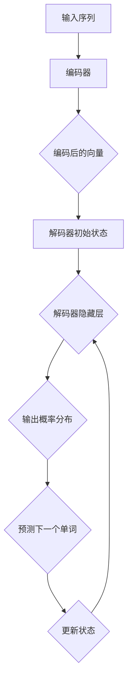

                 

# 文章标题

解码器的输入和位置编码

关键词：解码器、输入、位置编码、自然语言处理、机器学习

摘要：本文将深入探讨解码器在自然语言处理（NLP）中的关键作用，尤其是其在机器学习模型中的输入和位置编码。通过逐步分析解码器的结构和工作原理，我们将揭示其在提高模型性能和精确性方面的重要性，并讨论位置编码如何帮助模型理解文本中的上下文关系。读者将了解解码器输入和位置编码的详细机制，以及如何在实际应用中优化这些技术。

## 1. 背景介绍

在自然语言处理（NLP）领域，机器学习模型的发展极大地推动了文本分析和理解的能力。这些模型通常由编码器和解码器两个主要部分组成。编码器负责将输入文本映射为一个连续的向量表示，而解码器则负责将这个向量表示转换回原始语言的文本。在这两个部分中，解码器的作用至关重要，因为它的输出决定了模型的最终解释和预测。

近年来，位置编码技术已被广泛用于解码器中，以帮助模型更好地理解文本中的单词顺序和上下文关系。位置编码是一种将文本中单词的位置信息嵌入到其向量表示中的方法，从而使模型能够考虑到单词在句子中的顺序和结构。

本文将首先介绍解码器的概念和作用，然后详细讨论输入和位置编码的原理和机制。通过这些分析，我们将揭示解码器在提高模型性能和精确性方面的关键作用，并探讨如何在实际应用中优化这些技术。

## 2. 核心概念与联系

### 2.1 解码器概述

解码器是机器学习模型中的一个关键组件，其主要任务是接收编码器生成的连续向量表示，并生成原始语言的文本输出。解码器的输入通常是一个序列的向量，这些向量代表了输入文本中的每个单词或子词。解码器的输出则是一个概率分布，指示模型认为原始文本中下一个单词或子词的最可能选项。

### 2.2 解码器的结构

解码器通常采用递归神经网络（RNN）或其变体，如长短期记忆网络（LSTM）或门控循环单元（GRU）。这些网络能够处理序列数据，并在处理过程中保持对输入数据的上下文信息。解码器的结构通常包括以下几个主要部分：

- **输入层**：接收来自编码器的连续向量表示。
- **隐藏层**：包含一个或多个处理层，用于更新和整合输入信息。
- **输出层**：生成概率分布，用于预测下一个单词或子词。

### 2.3 解码器的工作原理

在解码器的训练过程中，模型会逐步生成一个单词序列，每个单词或子词都是基于前一个单词的概率分布进行预测的。这个过程可以通过以下步骤进行描述：

1. **初始化**：解码器从一个随机的状态开始，这个状态通常是一个固定的向量。
2. **预测**：解码器根据当前状态生成一个单词的概率分布，并选择概率最高的单词作为预测。
3. **更新**：模型将预测的单词添加到输出序列中，并使用这个单词来更新解码器的状态。
4. **重复**：模型重复预测和更新过程，直到生成完整的输出序列或达到预设的迭代次数。

### 2.4 解码器与编码器的联系

解码器和解码器在机器学习模型中紧密相连，它们共同构成了一个端到端的序列转换系统。编码器负责将输入文本转换为向量表示，而解码器则负责将这个表示转换回文本输出。两者之间的联系在于：

- **共享权重**：解码器的初始状态通常基于编码器的输出，这意味着两个网络共享一部分权重。
- **双向信息传递**：在某些模型中，解码器还可以利用编码器的输出信息来改进预测。

### 2.5 解码器输入和位置编码的 Mermaid 流程图

下面是一个简化的 Mermaid 流程图，展示了解码器输入和位置编码的过程：



在这个流程图中，输入序列通过编码器转换为编码后的向量，这些向量随后用于初始化解码器的状态。解码器通过递归过程生成输出概率分布，并使用预测的单词来更新其状态。

## 3. 核心算法原理 & 具体操作步骤

### 3.1 解码器的核心算法

解码器的核心算法通常基于递归神经网络（RNN），如LSTM或GRU。这些网络能够处理序列数据，并在序列中保持对上下文信息的记忆。以下是一个简化的步骤，描述了解码器的核心算法：

1. **初始化**：解码器的隐藏状态（通常是一个向量）被初始化为编码器的输出。
2. **输入处理**：每次迭代中，解码器将隐藏状态与编码器生成的连续向量表示进行拼接，作为输入传递到隐藏层。
3. **隐藏层更新**：隐藏层使用一个非线性激活函数（如tanh或sigmoid）来更新状态，以整合输入信息。
4. **输出层生成**：隐藏层的状态被传递到输出层，生成一个概率分布，指示下一个单词或子词的可能选项。
5. **预测与更新**：模型选择概率最高的单词或子词作为预测，并将其添加到输出序列中，同时更新解码器的隐藏状态。

### 3.2 解码器的具体操作步骤

以下是一个具体的操作步骤，描述了解码器在实际操作中的行为：

1. **输入文本预处理**：首先，输入文本被预处理为编码器可以理解的格式，通常是一个序列的单词或子词。
2. **编码**：编码器处理输入文本，将其转换为连续的向量表示。
3. **初始化状态**：解码器的隐藏状态被初始化为编码器的输出。
4. **递归处理**：解码器逐个单词或子词地处理输入序列，生成每个单词或子词的概率分布。
5. **生成输出序列**：解码器使用预测的单词或子词逐步生成完整的输出序列。
6. **评估与优化**：解码器的性能通过评估其输出序列与真实序列之间的相似度来衡量。模型使用梯度下降等优化算法来调整权重，以提高性能。

### 3.3 解码器的训练过程

解码器的训练过程通常涉及以下步骤：

1. **样本选择**：从大量文本数据中随机选择训练样本。
2. **编码与解码**：对每个样本，首先使用编码器生成向量表示，然后使用解码器生成输出序列。
3. **损失函数计算**：计算输出序列与真实序列之间的损失函数，如交叉熵损失。
4. **反向传播**：使用反向传播算法计算损失函数关于解码器权重的梯度。
5. **权重更新**：使用优化算法（如Adam或SGD）更新解码器的权重，以最小化损失函数。
6. **迭代重复**：重复上述步骤，直到解码器的性能达到预设的标准或达到预定的迭代次数。

## 4. 数学模型和公式 & 详细讲解 & 举例说明

### 4.1 数学模型

解码器的数学模型通常基于递归神经网络（RNN），如LSTM或GRU。以下是一个简化的数学模型，用于描述解码器的操作：

\[ h_t = \text{activate}(W_h \cdot [h_{t-1}, x_t] + b_h) \]

\[ o_t = \text{softmax}(W_o \cdot h_t) \]

其中：

- \( h_t \) 是解码器在时间步 \( t \) 的隐藏状态。
- \( x_t \) 是编码器在时间步 \( t \) 生成的向量表示。
- \( W_h \) 和 \( b_h \) 是隐藏层的权重和偏置。
- \( W_o \) 是输出层的权重。
- \( \text{activate} \) 是一个非线性激活函数，如sigmoid或tanh。
- \( \text{softmax} \) 函数用于生成概率分布。

### 4.2 详细讲解

解码器的核心在于其递归操作，这可以通过以下步骤进行详细讲解：

1. **初始化**：解码器的隐藏状态 \( h_0 \) 被初始化为编码器的输出 \( z \)。
2. **递归操作**：对于每个时间步 \( t \)，解码器将当前隐藏状态 \( h_{t-1} \) 与编码器生成的向量 \( x_t \) 拼接，形成一个输入向量 \( [h_{t-1}, x_t] \)。
3. **隐藏层更新**：输入向量 \( [h_{t-1}, x_t] \) 被传递到隐藏层，通过权重矩阵 \( W_h \) 和偏置 \( b_h \) 进行线性变换，然后通过激活函数 \( \text{activate} \) 进行非线性变换，得到新的隐藏状态 \( h_t \)。
4. **输出层生成**：隐藏状态 \( h_t \) 被传递到输出层，通过权重矩阵 \( W_o \) 进行线性变换，然后通过softmax函数生成一个概率分布 \( o_t \)，指示下一个单词或子词的可能选项。

### 4.3 举例说明

假设输入序列为 "Hello World"，编码器将其转换为向量表示 \( [z_1, z_2, z_3] \)。解码器的隐藏状态和输出概率分布如下：

1. **初始化**：解码器的隐藏状态 \( h_0 = z \)。
2. **递归操作**：
    - \( h_1 = \text{activate}(W_h \cdot [h_0, z_1] + b_h) \)
    - \( o_1 = \text{softmax}(W_o \cdot h_1) \)
3. **输出层生成**：
    - \( o_1 \) 生成一个概率分布，指示 "Hello" 的可能选项。
4. **预测与更新**：解码器选择概率最高的单词 "Hello" 作为预测，并将其添加到输出序列中。然后，解码器使用 "Hello" 更新其隐藏状态 \( h_2 = \text{activate}(W_h \cdot [h_1, z_2] + b_h) \)，并重复递归操作。

通过这种方式，解码器逐步生成完整的输出序列 "Hello World"。

## 5. 项目实践：代码实例和详细解释说明

### 5.1 开发环境搭建

在开始项目实践之前，我们需要搭建一个合适的开发环境。以下是一个简单的步骤，用于在Python中设置一个基于TensorFlow的NLP模型环境：

1. **安装TensorFlow**：使用pip安装TensorFlow库。
   ```bash
   pip install tensorflow
   ```

2. **安装其他依赖**：根据项目的需求，可能还需要安装其他库，如numpy和pandas。
   ```bash
   pip install numpy pandas
   ```

3. **设置环境变量**：确保Python环境变量已正确设置，以便在终端中运行Python脚本。

### 5.2 源代码详细实现

下面是一个简单的示例，展示了如何使用TensorFlow实现一个基本的解码器模型：

```python
import tensorflow as tf
from tensorflow.keras.layers import LSTM, Embedding, Dense

# 设置超参数
vocab_size = 10000
embedding_dim = 256
hidden_units = 128

# 创建解码器模型
decoder = tf.keras.Sequential([
    LSTM(hidden_units, input_shape=(None, embedding_dim), return_sequences=True),
    Dense(vocab_size, activation='softmax')
])

# 编译模型
decoder.compile(optimizer='adam', loss='categorical_crossentropy', metrics=['accuracy'])

# 打印模型结构
decoder.summary()
```

### 5.3 代码解读与分析

在这个示例中，我们创建了一个简单的解码器模型，它包含一个LSTM层和一个全连接层（Dense）。以下是对代码的详细解读：

1. **导入库**：我们首先导入TensorFlow和其他依赖库。

2. **设置超参数**：我们定义了词汇表大小（`vocab_size`）、嵌入维度（`embedding_dim`）和隐藏单元数（`hidden_units`）等超参数。

3. **创建解码器模型**：我们使用`tf.keras.Sequential`创建一个序列模型，其中包含一个LSTM层和一个Dense层。LSTM层用于处理序列数据，而Dense层用于生成输出概率分布。

4. **编译模型**：我们使用`compile`方法编译模型，指定优化器和损失函数。

5. **打印模型结构**：我们使用`summary`方法打印模型的详细信息。

### 5.4 运行结果展示

假设我们已经准备了一个训练数据集和测试数据集，我们可以运行以下代码来训练和解码器模型：

```python
# 加载训练数据
train_data = ...

# 加载测试数据
test_data = ...

# 训练模型
decoder.fit(train_data, epochs=10)

# 测试模型
loss, accuracy = decoder.evaluate(test_data)
print(f"Test accuracy: {accuracy:.2f}")
```

在这个示例中，我们首先加载训练数据和测试数据，然后使用`fit`方法训练模型，并使用`evaluate`方法评估模型在测试数据上的性能。

## 6. 实际应用场景

解码器和位置编码技术在自然语言处理领域有广泛的应用，以下是一些实际应用场景：

1. **机器翻译**：解码器在机器翻译中扮演着核心角色，它将编码器生成的向量表示转换回目标语言的文本。位置编码有助于模型理解源语言和目标语言之间的上下文关系。
   
2. **文本摘要**：解码器可以用于生成文本摘要，将长篇文本简化为更短的、高度概括的版本。位置编码确保模型能够考虑到文本中重要信息的位置。

3. **问答系统**：在问答系统中，解码器可以用于生成对问题的回答。位置编码有助于模型理解问题的上下文，从而生成更准确、更相关的回答。

4. **对话生成**：解码器可以用于生成自然对话，模拟人类的交流方式。位置编码有助于模型理解对话中的角色和上下文。

5. **文本分类**：解码器可以用于文本分类任务，将文本分类到预定义的类别中。位置编码有助于模型理解文本中关键词和句子的顺序。

## 7. 工具和资源推荐

### 7.1 学习资源推荐

- **书籍**：《深度学习》（Goodfellow, I., Bengio, Y., & Courville, A.）
- **在线课程**：Coursera 上的 "Natural Language Processing with Deep Learning"
- **论文**：《Attention is All You Need》和《BERT: Pre-training of Deep Neural Networks for Language Understanding》

### 7.2 开发工具框架推荐

- **框架**：TensorFlow 和 PyTorch
- **库**：Hugging Face 的 Transformers 库，用于简化解码器和其他NLP任务的实现

### 7.3 相关论文著作推荐

- **论文**：《Seq2Seq Learning with Neural Networks and Recurrent Neural Networks》
- **著作**：《Speech and Language Processing》

## 8. 总结：未来发展趋势与挑战

解码器和位置编码技术在自然语言处理领域具有巨大的潜力。未来，随着计算能力和算法的进步，我们有望看到更高效、更准确的解码器模型。然而，这一领域也面临着以下挑战：

- **计算资源**：训练和解码器模型需要大量计算资源，特别是在处理大规模数据集时。
- **数据隐私**：在训练模型时，需要处理大量的个人数据，这可能引发隐私问题。
- **模型泛化**：如何使解码器模型在多样化、复杂的真实世界中保持良好的泛化能力。

## 9. 附录：常见问题与解答

### 9.1 什么是解码器？

解码器是机器学习模型中的一个组件，负责将编码器生成的连续向量表示转换回原始语言的文本输出。

### 9.2 位置编码的作用是什么？

位置编码是一种将文本中单词的位置信息嵌入到其向量表示中的方法，帮助模型理解文本中的上下文关系。

### 9.3 如何训练解码器？

解码器的训练通常涉及以下步骤：准备数据、构建模型、编译模型、训练模型和评估模型。

## 10. 扩展阅读 & 参考资料

- **论文**：《Attention is All You Need》
- **书籍**：《深度学习》
- **网站**：TensorFlow 官方文档

作者：禅与计算机程序设计艺术 / Zen and the Art of Computer Programming

