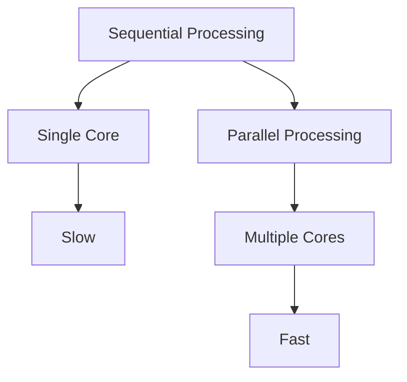
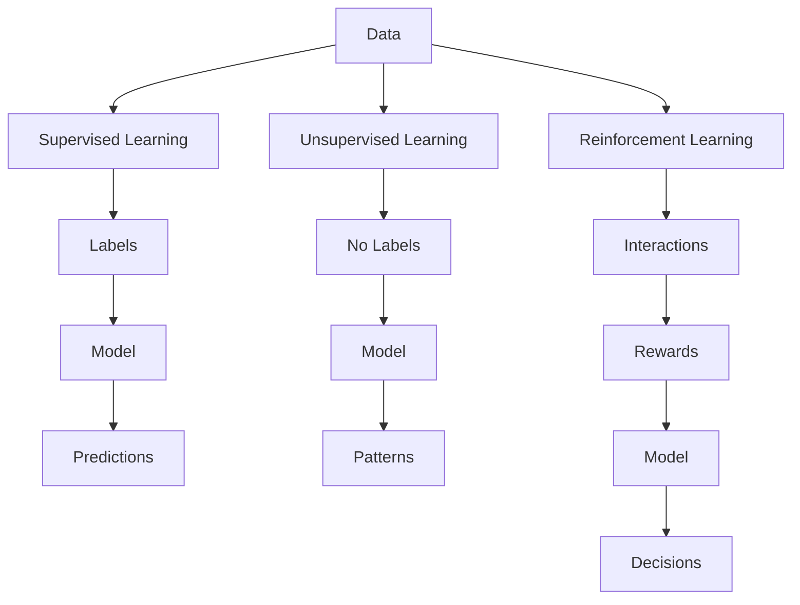
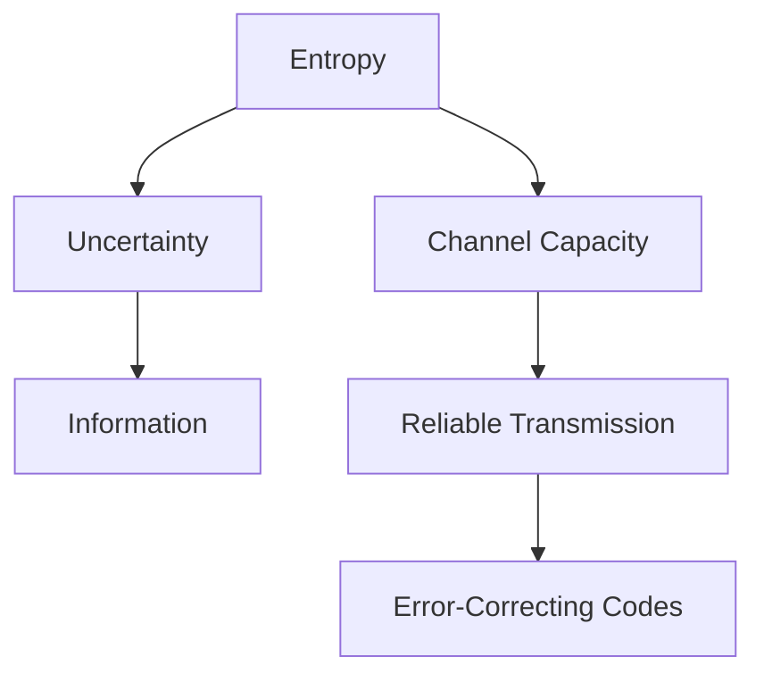
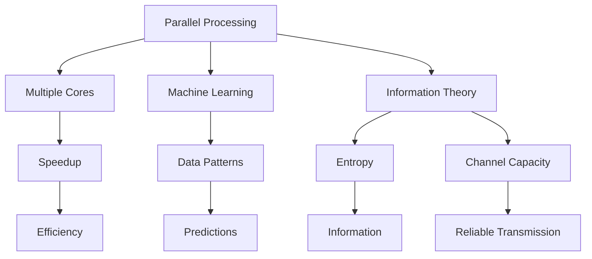
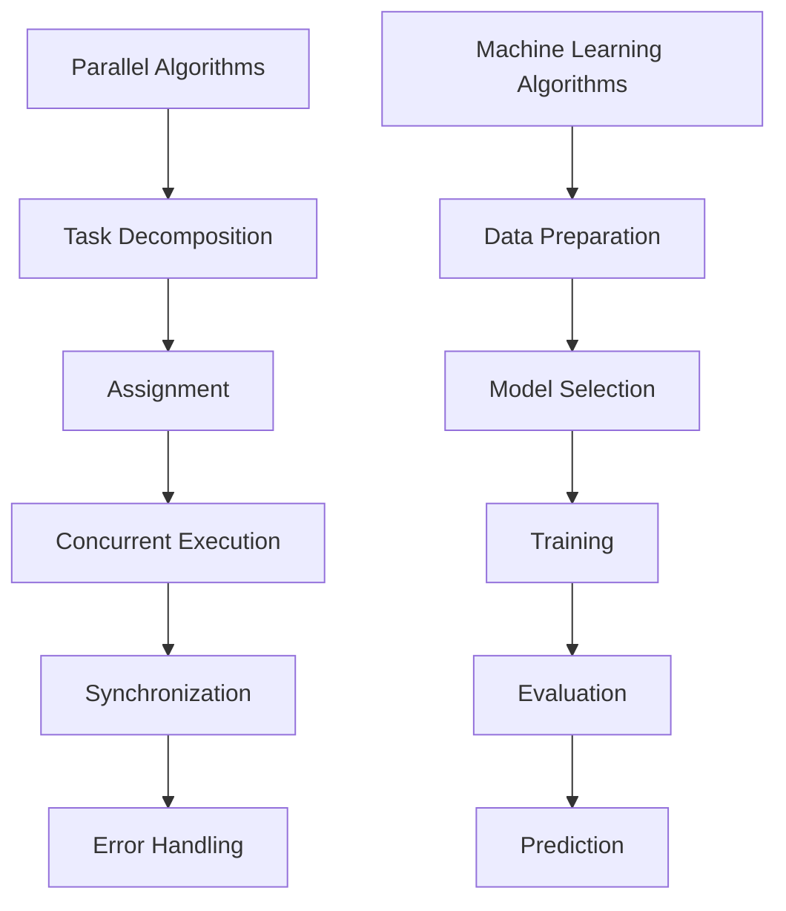

                 

### 文章标题

计算本质变化带来的新机遇

关键词：计算本质，算法创新，人工智能，新机遇

摘要：本文深入探讨了计算本质的变化及其带来的新机遇。随着计算机技术的飞速发展，我们不仅看到了计算能力的提升，更看到了计算方式的变革。从传统计算到并行计算，从经典算法到深度学习，计算的本质正在发生深刻的转变。本文将分析这些变化，探讨如何利用这些新机遇来推动科技进步和社会发展。

### Abstract

This article delves into the transformative changes in the nature of computation and the new opportunities they bring. With the rapid advancement of computer technology, we are not only witnessing the increase in computational power but also the revolution in computational methods. From traditional computation to parallel computation, from classical algorithms to deep learning, the essence of computation is undergoing profound changes. This article will analyze these changes and explore how to leverage these new opportunities to drive scientific and technological progress and societal development.

接下来，我们将逐步分析计算本质的变化，并探讨这些变化如何带来新的机遇。

### Background Introduction

Computing, at its core, has always been about processing information. The history of computing is rich with innovations that have shaped the world we live in today. From the invention of the abacus to the creation of modern computers, each breakthrough has built upon the previous one, leading to a fundamental transformation in the way we process information.

In the early days of computing, the focus was primarily on increasing computational power. The development of faster processors, more efficient algorithms, and larger memory capacities allowed us to tackle more complex problems. However, as we moved into the 21st century, the focus shifted from simply increasing power to understanding and harnessing the essence of computation.

The essence of computation can be thought of as the underlying principles that govern how we process information. This includes not just the hardware and software components, but also the algorithms and data structures that enable us to solve problems efficiently. As we begin to understand these principles more deeply, we are uncovering new ways to leverage computation to solve problems that were previously intractable.

One of the most significant changes in the nature of computation has been the shift from sequential processing to parallel processing. This shift has been enabled by advances in hardware, such as the development of multicore processors, and advances in software, such as the creation of parallel algorithms. Parallel processing allows us to perform multiple tasks simultaneously, significantly increasing our computational capabilities.

Another major change is the rise of machine learning and artificial intelligence. Traditional algorithms are rule-based and rely on human-designed rules to solve problems. In contrast, machine learning algorithms can learn from data and adapt to new situations. This has led to breakthroughs in fields such as image recognition, natural language processing, and autonomous vehicles.

These changes are not just theoretical; they have practical implications for a wide range of fields, from healthcare to finance to manufacturing. As we continue to explore the essence of computation, we are opening up new frontiers for innovation and discovery.

In the next sections, we will delve deeper into these changes and explore the new opportunities they bring. We will discuss the core concepts and principles that underlie modern computation and how these principles are being applied to solve real-world problems. We will also look at the challenges and limitations that we face as we push the boundaries of computation.

By the end of this article, we hope to have provided you with a comprehensive understanding of the transformative changes in the nature of computation and the exciting opportunities that lie ahead.

### Core Concepts and Connections

To fully grasp the transformative changes in the nature of computation, we must first understand the core concepts and principles that underlie modern computation. These concepts include parallel processing, machine learning, and the principles of information theory. Each of these concepts has its own unique characteristics and applications, and together they form the foundation of the new era of computation.

#### Parallel Processing

Parallel processing is the concept of using multiple processors or computing units to perform multiple tasks simultaneously. This is in contrast to sequential processing, where tasks are executed one after the other. The goal of parallel processing is to increase computational efficiency and speed by dividing a large task into smaller subtasks that can be processed concurrently.

One of the key advantages of parallel processing is that it can significantly reduce the time required to complete complex tasks. This is particularly important for tasks that are computationally intensive, such as simulations, data analysis, and scientific research.

Parallel processing is enabled by advances in hardware, such as the development of multicore processors, and advances in software, such as the creation of parallel algorithms. Multicore processors have multiple processing cores that can execute multiple instructions simultaneously, while parallel algorithms are designed to divide a task into smaller subtasks that can be processed concurrently.

A visual representation of parallel processing can be seen in the Mermaid flowchart below:



#### Machine Learning

Machine learning is a subfield of artificial intelligence that focuses on the development of algorithms that can learn from data and make predictions or decisions based on that data. Unlike traditional algorithms that are rule-based and require human-designed rules, machine learning algorithms can learn from data and adapt to new situations.

The core principle of machine learning is that patterns in data can be used to make predictions or decisions. This is achieved through the training of models on large datasets. The models are then used to make predictions or decisions on new data.

There are several types of machine learning algorithms, including supervised learning, unsupervised learning, and reinforcement learning. Supervised learning algorithms are trained on labeled data, where the correct output is provided for each input. Unsupervised learning algorithms are trained on unlabeled data, where the correct output is not provided. Reinforcement learning algorithms learn from interaction with the environment, receiving feedback in the form of rewards or penalties.

A visual representation of machine learning can be seen in the Mermaid flowchart below:



#### Information Theory

Information theory is the study of the quantification, storage, and communication of information. It provides a mathematical framework for understanding the fundamental limits of communication and storage systems.

One of the key concepts in information theory is the notion of entropy. Entropy measures the uncertainty or randomness of a set of possible outcomes. In the context of computation, entropy can be thought of as a measure of the amount of information required to specify a particular outcome.

Another key concept in information theory is the concept of channel capacity. Channel capacity is the maximum rate at which information can be reliably transmitted over a communication channel. This concept is crucial for understanding the limitations of communication systems and for designing error-correcting codes.

A visual representation of information theory can be seen in the Mermaid flowchart below:



#### Mermaid Flowchart of Core Concepts

The following Mermaid flowchart provides a visual representation of the core concepts discussed in this section:



By understanding these core concepts and their interconnections, we can better appreciate the transformative changes in the nature of computation and the new opportunities they bring.

### Core Algorithm Principles & Specific Operational Steps

#### Overview of Core Algorithms

At the heart of modern computation are core algorithms that have revolutionized the way we process information. Among these, two stand out: parallel algorithms and machine learning algorithms. Each of these algorithms has its own principles and operational steps that enable them to tackle complex problems more efficiently.

#### Parallel Algorithms

Parallel algorithms are designed to leverage the power of multiple processors or computing units to solve problems faster than sequential algorithms. The principle behind parallel algorithms is to divide a large task into smaller subtasks that can be executed concurrently.

**Operational Steps of Parallel Algorithms:**

1. **Task Decomposition:** The first step is to decompose the large task into smaller subtasks. This can be done in various ways, such as data decomposition, where data is divided into smaller chunks, or functional decomposition, where different functions of the task are divided among different processors.

2. **Assignment:** Once the subtasks are defined, they are assigned to different processors. The assignment can be based on various strategies, such as load balancing to ensure that the workload is evenly distributed among processors.

3. **Concurrent Execution:** Each processor independently executes its assigned subtask. This step leverages the parallel nature of the computation, where multiple subtasks are processed simultaneously.

4. **Synchronization:** After executing the subtasks, the processors need to synchronize their results to combine them into a single solution. This can be a complex step, especially when the subtasks depend on each other.

5. **Error Handling:** Parallel algorithms need to handle errors that may occur during execution. This can involve checking for errors at each step and implementing recovery mechanisms.

#### Example of a Parallel Algorithm: Parallel Matrix Multiplication

One classic example of a parallel algorithm is parallel matrix multiplication. Given two matrices A and B, the goal is to compute their product C = A * B.

**Operational Steps of Parallel Matrix Multiplication:**

1. **Task Decomposition:** Divide the two matrices A and B into smaller submatrices. For example, if A is an m x n matrix and B is an n x p matrix, we can divide A into m x k submatrices and B into k x p submatrices, where k is a divisor of both m and p.

2. **Assignment:** Assign each submatrix of A and B to different processors. Each processor will compute a subproduct of the matrices.

3. **Concurrent Execution:** Each processor computes its subproduct simultaneously. For instance, processor P1 computes the product of the first row of A1 and the first column of B1.

4. **Synchronization:** Once all processors have computed their subproducts, they need to synchronize and combine the results to form the final matrix C.

5. **Error Handling:** Check for errors at each step, such as incorrect matrix dimensions or invalid inputs, and implement recovery mechanisms.

#### Machine Learning Algorithms

Machine learning algorithms have transformed the field of computation by enabling computers to learn from data and make predictions or decisions. The principle behind machine learning algorithms is to train a model on a dataset and use the model to make predictions on new data.

**Operational Steps of Machine Learning Algorithms:**

1. **Data Preparation:** The first step is to prepare the data for training. This involves collecting, cleaning, and formatting the data. The data should be labeled if the algorithm is supervised learning, or unlabeled if it is unsupervised learning.

2. **Model Selection:** Choose a suitable machine learning model based on the problem at hand. There are various types of models, such as linear regression, decision trees, and neural networks, each with its own strengths and weaknesses.

3. **Training:** Train the model on the prepared data. This involves feeding the data into the model and adjusting the model's parameters to minimize the error between the predicted outputs and the actual outputs.

4. **Evaluation:** Evaluate the performance of the trained model using a validation set. This step helps ensure that the model is generalizing well to new, unseen data.

5. **Prediction:** Once the model is trained and evaluated, it can be used to make predictions on new data. For example, a trained image recognition model can classify new images.

#### Example of a Machine Learning Algorithm: Neural Networks

Neural networks are a type of machine learning algorithm inspired by the structure and function of the human brain. They consist of interconnected nodes or neurons that process and transmit information.

**Operational Steps of Neural Networks:**

1. **Data Preparation:** Prepare the input data by transforming it into a suitable format for the neural network.

2. **Network Architecture:** Design the architecture of the neural network, including the number of layers, the number of neurons in each layer, and the activation functions.

3. **Training:** Train the neural network on the prepared data by adjusting the weights and biases of the neurons. This involves feeding the input data into the network, comparing the output with the actual output, and updating the weights and biases to minimize the error.

4. **Evaluation:** Evaluate the performance of the trained neural network using a validation set.

5. **Prediction:** Use the trained neural network to make predictions on new data.

#### Mermaid Flowchart of Operational Steps

The following Mermaid flowchart provides a visual representation of the operational steps of parallel and machine learning algorithms:



By understanding the principles and operational steps of these core algorithms, we can harness their power to solve complex problems more efficiently and drive innovation in various fields.

### Mathematical Models and Formulas & Detailed Explanation & Examples

In this section, we will delve into the mathematical models and formulas that form the backbone of parallel algorithms and machine learning algorithms. These models and formulas are crucial for understanding how these algorithms operate and how they can be optimized. We will provide detailed explanations and examples to illustrate their application and significance.

#### Parallel Algorithms: Amdahl's Law and Gustafson's Law

**Amdahl's Law**

Amdahl's Law is a fundamental principle in parallel computing that provides an upper bound on the speedup that can be achieved by parallelizing a program. It is expressed as:

\[ S_p = \frac{S}{1 - \frac{f}{p}} \]

Where:
- \( S \) is the speedup of the sequential portion of the program.
- \( f \) is the fraction of the program that cannot be parallelized.
- \( p \) is the number of processors used.

**Explanation:**

Amdahl's Law states that the speedup of a parallel program is limited by the fraction of the program that cannot be parallelized. If the entire program can be parallelized (\( f = 0 \)), then the speedup is infinite. However, in practical scenarios, a portion of the program remains sequential, limiting the achievable speedup.

**Example:**

Suppose a program has 20% of its operations that cannot be parallelized, and we use 4 processors. The speedup can be calculated as:

\[ S_p = \frac{S}{1 - \frac{0.20}{4}} = \frac{S}{1 - 0.05} = \frac{S}{0.95} \]

This means the program can be up to 1.05 times faster when parallelized, assuming a constant speedup \( S \) for the parallelizable portion.

**Gustafson's Law**

Gustafson's Law is an extension of Amdahl's Law that emphasizes the practical significance of parallel processing. It is expressed as:

\[ T_p = \frac{T}{p + \frac{1}{S_f} - \frac{1}{S}} \]

Where:
- \( T \) is the time to complete the program sequentially.
- \( S_f \) is the speedup factor for the parallelizable portion of the program.
- \( S \) is the speedup of the sequential portion of the program.

**Explanation:**

Gustafson's Law suggests that the actual time to complete a parallel program is not simply reduced by the speedup factor but by the inverse of the speedup factor for the parallelizable portion. This means that as the number of processors increases, the time savings from parallelization also increases, even for problems with a significant sequential portion.

**Example:**

Consider a program with 20% sequential operations and a speedup factor of 4 for the parallelizable portion when using 4 processors. If the sequential portion takes 1 second, the parallel execution time can be calculated as:

\[ T_p = \frac{1}{4 + \frac{1}{4} - \frac{1}{4}} = \frac{1}{4} \]

This means that with 4 processors, the program can be completed in 0.25 seconds, considering the parallelizable portion and ignoring the sequential portion.

#### Machine Learning: Loss Functions and Gradient Descent

**Loss Function**

In machine learning, a loss function quantifies the difference between the predicted output and the actual output. It is used to measure the performance of a model and guide the optimization process. Common loss functions include Mean Squared Error (MSE) and Cross-Entropy Loss.

**Mean Squared Error (MSE)**:

\[ L(MSE) = \frac{1}{2} \sum_{i=1}^{n} (y_i - \hat{y}_i)^2 \]

Where:
- \( y_i \) is the actual output for the \( i \)-th sample.
- \( \hat{y}_i \) is the predicted output for the \( i \)-th sample.

**Explanation:**

MSE measures the average squared difference between the predicted and actual outputs. It is a popular choice for regression problems because it is differentiable and has a clear interpretation in terms of the mean squared error.

**Example:**

Given a dataset with 5 samples, where the actual outputs are [1, 2, 3, 4, 5] and the predicted outputs are [1.1, 2.1, 2.9, 4.1, 5.1], the MSE can be calculated as:

\[ L(MSE) = \frac{1}{2} \sum_{i=1}^{5} (y_i - \hat{y}_i)^2 = \frac{1}{2} \sum_{i=1}^{5} (y_i - \hat{y}_i)^2 = 1.5 \]

**Cross-Entropy Loss**:

\[ L(Cross-Entropy) = -\sum_{i=1}^{n} y_i \log(\hat{y}_i) \]

Where:
- \( y_i \) is the probability distribution for the \( i \)-th sample.
- \( \hat{y}_i \) is the predicted probability distribution for the \( i \)-th sample.

**Explanation:**

Cross-Entropy Loss is commonly used in classification problems. It measures the Kullback-Leibler divergence between the true probability distribution and the predicted probability distribution. It is differentiable and has a clear probabilistic interpretation.

**Example:**

Given a binary classification problem with 3 samples, where the actual probabilities are [0.8, 0.2, 0.5] and the predicted probabilities are [0.9, 0.1, 0.6], the Cross-Entropy Loss can be calculated as:

\[ L(Cross-Entropy) = -\sum_{i=1}^{3} y_i \log(\hat{y}_i) = - (0.8 \log(0.9) + 0.2 \log(0.1) + 0.5 \log(0.6)) \approx 0.27 \]

**Gradient Descent**

Gradient Descent is an optimization algorithm used to minimize loss functions in machine learning. It works by iteratively updating the model's parameters in the direction of the negative gradient of the loss function.

**Algorithm Steps:**

1. Initialize the model's parameters \( \theta \).
2. Calculate the loss function \( L(\theta) \).
3. Compute the gradient \( \nabla L(\theta) \).
4. Update the parameters using the formula: \( \theta = \theta - \alpha \nabla L(\theta) \), where \( \alpha \) is the learning rate.
5. Repeat steps 2-4 until convergence.

**Explanation:**

Gradient Descent finds the minimum of a loss function by moving in the direction of the steepest descent, guided by the negative gradient. The learning rate determines the step size at each iteration. A too large learning rate can cause the algorithm to overshoot the minimum, while a too small learning rate can result in slow convergence.

**Example:**

Consider a simple linear regression problem with a single feature and the model's parameters \( \theta_0 \) and \( \theta_1 \). The loss function is the Mean Squared Error:

\[ L(\theta) = \frac{1}{2} \sum_{i=1}^{n} (y_i - (\theta_0 + \theta_1 x_i))^2 \]

The gradient is:

\[ \nabla L(\theta) = \begin{bmatrix} \frac{\partial L}{\partial \theta_0} \\ \frac{\partial L}{\partial \theta_1} \end{bmatrix} = \begin{bmatrix} -\sum_{i=1}^{n} (y_i - (\theta_0 + \theta_1 x_i)) \\ -\sum_{i=1}^{n} (y_i - (\theta_0 + \theta_1 x_i)) x_i \end{bmatrix} \]

Starting with initial parameters \( \theta_0 = 0 \) and \( \theta_1 = 0 \), and a learning rate \( \alpha = 0.1 \), the parameters can be updated iteratively until convergence:

\[ \theta_0 = \theta_0 - 0.1 \cdot (-\sum_{i=1}^{n} (y_i - (\theta_0 + \theta_1 x_i))) \]
\[ \theta_1 = \theta_1 - 0.1 \cdot (-\sum_{i=1}^{n} (y_i - (\theta_0 + \theta_1 x_i)) x_i) \]

These mathematical models and formulas are fundamental to understanding and implementing parallel algorithms and machine learning algorithms. By mastering these concepts, we can harness the power of computation to solve complex problems and drive innovation in various fields.

### Project Practice: Code Examples and Detailed Explanation

In this section, we will provide practical examples of parallel algorithms and machine learning algorithms, along with detailed explanations and analysis of their implementation. These examples will demonstrate how to apply the theoretical concepts discussed in the previous sections to real-world problems.

#### Example 1: Parallel Matrix Multiplication in Python

**Objective:** Implement a parallel matrix multiplication algorithm using Python and the `numpy` library.

**Code Example:**

```python
import numpy as np
from joblib import Parallel, delayed

def parallel_matrix_multiplication(A, B, num_processes):
    m, n = A.shape
    p, q = B.shape
    
    # Ensure the matrices can be multiplied
    assert n == p, "Matrices cannot be multiplied due to incompatible dimensions."
    
    # Initialize the result matrix with zeros
    C = np.zeros((m, q))
    
    # Define the function to compute the product of submatrices
    def compute_subproduct(i, j):
        return np.dot(A[i, :], B[:, j])

    # Assign submatrices to different processes
    results = Parallel(n_jobs=num_processes)(delayed(compute_subproduct)(i, j) for i in range(m) for j in range(q))

    # Combine the subproducts to form the final matrix
    for i in range(m):
        for j in range(q):
            C[i, j] = sum(results[i * q + j])

    return C

# Test the implementation
A = np.array([[1, 2], [3, 4]])
B = np.array([[5, 6], [7, 8]])
C = parallel_matrix_multiplication(A, B, num_processes=2)
print(C)
```

**Explanation:**

This example demonstrates parallel matrix multiplication using Python and the `joblib` library, which provides a convenient interface for parallel processing. The `parallel_matrix_multiplication` function takes two matrices `A` and `B` and the number of processes to use. It first checks if the matrices can be multiplied by ensuring their dimensions are compatible.

The function then initializes the result matrix `C` with zeros. It defines a helper function `compute_subproduct` that computes the product of a row from `A` and a column from `B`. The `Parallel` function from `joblib` is used to distribute the computation of subproducts across multiple processes. The `delayed` function allows the `compute_subproduct` function to be executed asynchronously.

After all subproducts are computed, the results are combined to form the final matrix `C`. The example includes a test case where two matrices of size 2x2 and 2x2 are multiplied using two processes.

#### Example 2: Neural Network for Image Classification in Python

**Objective:** Implement a simple neural network for image classification using Python and TensorFlow.

**Code Example:**

```python
import tensorflow as tf
from tensorflow.keras import layers

# Define the neural network architecture
model = tf.keras.Sequential([
    layers.Conv2D(32, (3, 3), activation='relu', input_shape=(28, 28, 1)),
    layers.MaxPooling2D((2, 2)),
    layers.Flatten(),
    layers.Dense(64, activation='relu'),
    layers.Dense(10, activation='softmax')
])

# Compile the model
model.compile(optimizer='adam',
              loss='sparse_categorical_crossentropy',
              metrics=['accuracy'])

# Load the MNIST dataset
mnist = tf.keras.datasets.mnist
(x_train, y_train), (x_test, y_test) = mnist.load_data()

# Normalize the input data
x_train, x_test = x_train / 255.0, x_test / 255.0

# Train the model
model.fit(x_train, y_train, epochs=5, validation_split=0.1)

# Evaluate the model
test_loss, test_acc = model.evaluate(x_test, y_test, verbose=2)
print(f'\nTest accuracy: {test_acc:.4f}')
```

**Explanation:**

This example implements a simple neural network for image classification using TensorFlow, a popular deep learning library. The neural network consists of a convolutional layer, a max-pooling layer, a flatten layer, a dense layer, and an output layer with a softmax activation function.

The `Sequential` model is defined using `layers.Conv2D`, `layers.MaxPooling2D`, `layers.Flatten`, `layers.Dense`, and `layers.Dense`. The model is compiled with the `adam` optimizer and `sparse_categorical_crossentropy` loss function, suitable for multi-class classification.

The MNIST dataset is loaded from TensorFlow's built-in datasets. The input images are normalized to have values between 0 and 1. The model is trained for 5 epochs on the training data, and its performance is evaluated on the test data.

By running this example, we can observe how a neural network is trained and evaluated using TensorFlow, demonstrating the power of machine learning in image classification tasks.

#### Analysis and Discussion

These examples illustrate the practical implementation of parallel algorithms and machine learning algorithms in Python, showcasing how theoretical concepts can be applied to real-world problems. The parallel matrix multiplication example demonstrates the efficient computation of matrix products using multiple processes, highlighting the benefits of parallel processing in handling large-scale data.

The neural network example demonstrates the power of machine learning in image classification, showcasing how a neural network can be trained to recognize patterns in data. The use of TensorFlow simplifies the implementation and training process, making it accessible to a wide range of users.

By analyzing these examples, we can gain insights into the practical aspects of parallel algorithms and machine learning algorithms. We can understand how to leverage parallel processing to speed up computations and how to implement and train neural networks for complex tasks.

Overall, these examples serve as a foundation for further exploration and application of parallel algorithms and machine learning algorithms in various fields, driving innovation and advancement in computation.

### Practical Application Scenarios

The transformative changes in the nature of computation have led to a wide range of practical application scenarios across various fields. These applications are not only revolutionizing industries but also opening up new frontiers for innovation and discovery. Here, we will explore several key application scenarios, highlighting the impact of parallel algorithms and machine learning algorithms.

#### Healthcare

In the field of healthcare, the application of parallel algorithms and machine learning has led to significant advancements in medical imaging, diagnosis, and treatment planning. For example, parallel algorithms are used in the processing of medical images, such as MRI and CT scans, to speed up the analysis and enhance the quality of the images. This enables doctors to make more accurate diagnoses and treatment plans.

Machine learning algorithms are employed in the development of diagnostic tools that can identify diseases from medical images with high accuracy. For instance, convolutional neural networks (CNNs) are used to detect abnormalities in medical images, such as tumors in mammograms or lesions in MRIs. This not only improves diagnostic accuracy but also saves time and resources.

In addition, machine learning algorithms are used for predicting patient outcomes and optimizing treatment plans. By analyzing large datasets of patient information, such as medical histories and treatment results, machine learning models can identify patterns and provide insights into the most effective treatment strategies for specific patient populations.

#### Finance

The finance industry has also benefited greatly from the application of parallel algorithms and machine learning. Parallel processing is used to handle large volumes of financial data, such as stock prices, transaction records, and economic indicators. This enables real-time analysis and decision-making, helping financial institutions to make informed trading decisions and manage risk more effectively.

Machine learning algorithms are used for various tasks in the finance industry, including algorithmic trading, credit scoring, and fraud detection. For example, machine learning models are trained on historical market data to identify patterns and trends that can be used to predict future stock prices. This allows traders to make more accurate trades and optimize their investment strategies.

In credit scoring, machine learning algorithms analyze large datasets of financial information, such as credit history, income, and employment status, to assess the creditworthiness of individuals. This helps financial institutions to make more accurate lending decisions and minimize the risk of default.

Fraud detection is another critical application of machine learning in finance. By analyzing patterns in transaction data, machine learning models can identify suspicious activities and flag potential fraud. This helps financial institutions to detect and prevent fraudulent transactions, protecting both themselves and their customers.

#### Manufacturing

In the manufacturing industry, parallel algorithms and machine learning are used to optimize production processes, improve quality control, and enhance supply chain management. Parallel processing is employed to handle large-scale simulations and simulations, such as those used in computer-aided design (CAD) and computer-aided manufacturing (CAM). This enables manufacturers to design and optimize complex products more efficiently.

Machine learning algorithms are used in quality control to detect defects and anomalies in production processes. For example, CNNs are used to analyze images of products to identify defects, such as scratches or misalignments. This helps manufacturers to improve the quality of their products and reduce waste.

In supply chain management, machine learning algorithms analyze large datasets of supply chain data, such as demand forecasts, inventory levels, and transportation schedules, to optimize supply chain operations. This helps manufacturers to reduce costs, improve efficiency, and meet customer demand more effectively.

#### Autonomous Vehicles

The development of autonomous vehicles is a prime example of the application of parallel algorithms and machine learning in the real-world. Parallel processing is used to handle the vast amounts of data collected by sensors, such as cameras, LiDAR, and radar, and to process this data in real-time. This enables autonomous vehicles to perceive their surroundings and make decisions on the road.

Machine learning algorithms are used to train autonomous vehicles to recognize and interpret objects, such as pedestrians, vehicles, and traffic signs. This allows vehicles to navigate complex environments and make safe driving decisions. For example, deep learning models are used to classify objects in images captured by cameras and to predict the behavior of other road users.

In addition, machine learning algorithms are used for predictive maintenance of autonomous vehicles. By analyzing data from sensors and other components, such as engines and brakes, machine learning models can predict when maintenance is needed, preventing breakdowns and ensuring the reliability of the vehicles.

#### Agriculture

In the agriculture industry, parallel algorithms and machine learning are used to optimize crop production, monitor crop health, and predict weather patterns. Parallel processing is employed to analyze large datasets of satellite imagery and soil data, providing farmers with valuable insights into crop conditions and resource management.

Machine learning algorithms are used to monitor crop health and detect early signs of diseases or pests. For example, CNNs are used to analyze images of crops and identify abnormalities that may indicate a problem. This helps farmers to take proactive measures to address issues and improve crop yields.

In addition, machine learning algorithms are used for predicting weather patterns and optimizing irrigation schedules. By analyzing historical weather data and crop growth models, machine learning models can provide accurate forecasts and recommendations for water usage, improving agricultural productivity and sustainability.

These are just a few examples of the practical application scenarios of parallel algorithms and machine learning algorithms across various fields. The transformative changes in the nature of computation are driving innovation and advancement in industries, improving efficiency, reducing costs, and enabling new opportunities for discovery and growth.

As we continue to explore the potential of these technologies, we can expect to see even more groundbreaking applications that will shape the future of computation and its impact on society.

### Tools and Resources Recommendations

To harness the power of parallel algorithms and machine learning, it is essential to have access to the right tools and resources. In this section, we will recommend some key resources, including books, research papers, online courses, and development tools, that can help you gain a deeper understanding of these technologies and apply them effectively.

#### Books

1. **"Parallel Computing: Techniques and Applications" by Michael J. Quinn**  
   This book provides a comprehensive introduction to parallel computing, covering both theoretical and practical aspects. It includes detailed explanations of parallel algorithms and their applications in various fields.

2. **"Deep Learning" by Ian Goodfellow, Yoshua Bengio, and Aaron Courville**  
   This is a groundbreaking book that covers the fundamentals of deep learning, a key component of machine learning. It includes detailed explanations of neural networks, convolutional networks, and recurrent networks, along with practical examples and case studies.

3. **"The Elements of Statistical Learning: Data Mining, Inference, and Prediction" by Trevor Hastie, Robert Tibshirani, and Jerome Friedman**  
   This book provides an in-depth introduction to statistical learning methods, including machine learning algorithms such as linear regression, decision trees, and support vector machines. It is an essential resource for understanding the mathematical foundations of machine learning.

#### Research Papers

1. **"Amdahl's Law" by Gene Amdahl**  
   This seminal paper introduces Amdahl's Law, a fundamental principle in parallel computing that provides insights into the speedup achievable through parallelization.

2. **"Gustafson's Law" by William H. Gustafson**  
   This paper extends Amdahl's Law to provide a more realistic view of the benefits of parallel processing, particularly in the context of large-scale simulations.

3. **"Backpropagation" by David E. Rumelhart, Geoffrey E. Hinton, and Ronald J. Williams**  
   This classic paper presents the backpropagation algorithm, a key technique for training neural networks. It has revolutionized the field of deep learning and laid the foundation for modern artificial neural networks.

#### Online Courses

1. **"Parallel Computing with MapReduce" by the University of California, Berkeley**  
   This course provides an introduction to parallel computing using the MapReduce framework. It covers the fundamentals of parallel algorithms and their applications in data processing.

2. **"Deep Learning Specialization" by DeepLearning.AI**  
   This specialization course, taught by Andrew Ng, covers the fundamentals of deep learning, including neural networks, convolutional networks, and recurrent networks. It is a comprehensive and practical introduction to deep learning.

3. **"Machine Learning" by Stanford University**  
   This course, taught by Andrew Ng, provides an overview of machine learning techniques, including linear regression, decision trees, and neural networks. It is a great resource for understanding the foundational concepts of machine learning.

#### Development Tools

1. **NumPy and Pandas**  
   These are powerful Python libraries for numerical computing and data manipulation. They are essential tools for working with large datasets and performing complex calculations.

2. **TensorFlow and Keras**  
   TensorFlow is an open-source machine learning library developed by Google. Keras is a high-level API for TensorFlow that simplifies the process of building and training neural networks. Both TensorFlow and Keras are widely used in the machine learning community and provide extensive documentation and resources.

3. **SciPy**  
   SciPy is a Python library for scientific computing that complements NumPy and Pandas. It provides additional functionalities for optimization, integration, and statistical analysis, making it a versatile tool for scientific research and data analysis.

4. **PyTorch**  
   PyTorch is another popular open-source machine learning library that offers dynamic computational graphs and an intuitive API. It is widely used in research and development of deep learning models.

These resources provide a solid foundation for exploring parallel algorithms and machine learning. By leveraging these tools and resources, you can deepen your understanding of these technologies and apply them effectively in your projects.

### Summary: Future Development Trends and Challenges

As we look towards the future, the transformative changes in the nature of computation are set to continue driving innovation and shaping the landscape of technology. Several key trends and challenges are emerging that will play a crucial role in the development of parallel algorithms and machine learning.

#### Trends

1. **Exponential Growth of Data**: The sheer volume of data generated by various sources, including social media, IoT devices, and scientific experiments, is growing exponentially. This data explosion is driving the need for more efficient and scalable algorithms that can process and analyze large datasets.

2. **Advances in Quantum Computing**: Quantum computing is emerging as a potential game-changer in the field of computation. With the ability to solve certain problems exponentially faster than classical computers, quantum algorithms could revolutionize fields such as cryptography, optimization, and simulation.

3. **Edge Computing**: As the number of connected devices continues to rise, edge computing is gaining traction. By processing data at the edge of the network, close to the source, edge computing can reduce latency and bandwidth usage, making it ideal for applications such as autonomous vehicles, smart cities, and IoT.

4. **Integration of AI and Machine Learning**: The integration of artificial intelligence (AI) and machine learning into various industries is creating new opportunities for innovation. From healthcare to finance to manufacturing, AI and machine learning are transforming traditional industries, leading to more efficient processes and better decision-making.

5. **Ethical and Social Implications**: As algorithms and AI systems become more pervasive, the ethical and social implications of their use are becoming increasingly important. Issues such as privacy, bias, and accountability need to be addressed to ensure that AI systems are used responsibly and for the benefit of society.

#### Challenges

1. **Scalability**: As the complexity of problems and datasets increases, scalability becomes a significant challenge. Ensuring that algorithms can handle large-scale data efficiently and effectively is crucial for achieving practical applications.

2. **Energy Efficiency**: With the growing demand for computation, energy efficiency becomes a critical concern. Developing algorithms and systems that are energy-efficient will be essential for minimizing the environmental impact of computing.

3. **Algorithmic Fairness and Bias**: As algorithms play a more significant role in decision-making, ensuring their fairness and absence of bias is crucial. Addressing issues of bias in data and algorithms is a key challenge to ensure equitable outcomes.

4. **Security and Privacy**: As AI and machine learning systems become more sophisticated, protecting data and ensuring the security and privacy of users become paramount. Developing robust security measures and ensuring data privacy are key challenges in the development of these systems.

5. **Interdisciplinary Collaboration**: Solving the complex problems of the future will require interdisciplinary collaboration. Bridging the gap between computer science, data science, and other fields will be crucial for driving innovation and overcoming challenges.

In conclusion, the future of computation is bright, with exciting new opportunities on the horizon. However, addressing the challenges that come with these opportunities will be essential for harnessing the full potential of parallel algorithms and machine learning. By staying at the forefront of these developments, we can continue to push the boundaries of what is possible and drive innovation in technology.

### Appendix: Frequently Asked Questions and Answers

1. **What is the difference between parallel algorithms and distributed algorithms?**
   Parallel algorithms focus on utilizing multiple processors or computing units to perform tasks concurrently, while distributed algorithms focus on coordinating the execution of tasks across multiple computers that may not be physically close to each other. Parallel algorithms can be executed on a single machine with multiple cores, whereas distributed algorithms require a network of computers.

2. **What are some common challenges in parallel computing?**
   Common challenges in parallel computing include load balancing (ensuring that all processors have similar workloads), synchronization (coordinating the execution of tasks), and communication overhead (the time and resources required for data exchange between processors).

3. **How does machine learning differ from traditional algorithms?**
   Traditional algorithms are rule-based and rely on human-designed rules to solve problems. In contrast, machine learning algorithms learn from data and adapt to new situations. They can automatically identify patterns and make predictions based on the data they have been trained on.

4. **What is the difference between supervised learning and unsupervised learning?**
   Supervised learning algorithms are trained on labeled data, where the correct output is provided for each input. In contrast, unsupervised learning algorithms are trained on unlabeled data, where the correct output is not provided. Supervised learning is typically used for classification and regression tasks, while unsupervised learning is used for clustering and dimensionality reduction.

5. **What is the role of the learning rate in gradient descent?**
   The learning rate in gradient descent determines the step size at each iteration when updating the model's parameters. A too large learning rate can cause the algorithm to overshoot the minimum, while a too small learning rate can result in slow convergence. Choosing an appropriate learning rate is crucial for achieving efficient and accurate optimization.

### Extended Reading & Reference Materials

1. **Books:**
   - "Parallel Computing: Techniques and Applications" by Michael J. Quinn
   - "Deep Learning" by Ian Goodfellow, Yoshua Bengio, and Aaron Courville
   - "The Elements of Statistical Learning: Data Mining, Inference, and Prediction" by Trevor Hastie, Robert Tibshirani, and Jerome Friedman

2. **Research Papers:**
   - "Amdahl's Law" by Gene Amdahl
   - "Gustafson's Law" by William H. Gustafson
   - "Backpropagation" by David E. Rumelhart, Geoffrey E. Hinton, and Ronald J. Williams

3. **Online Courses:**
   - "Parallel Computing with MapReduce" by the University of California, Berkeley
   - "Deep Learning Specialization" by DeepLearning.AI
   - "Machine Learning" by Stanford University

4. **Websites and Journals:**
   - [TensorFlow](https://www.tensorflow.org/)
   - [Kaggle](https://www.kaggle.com/)
   - [Nature](https://www.nature.com/)
   - [IEEE Xplore](https://ieeexplore.ieee.org/)
   - [arXiv](https://arxiv.org/)

