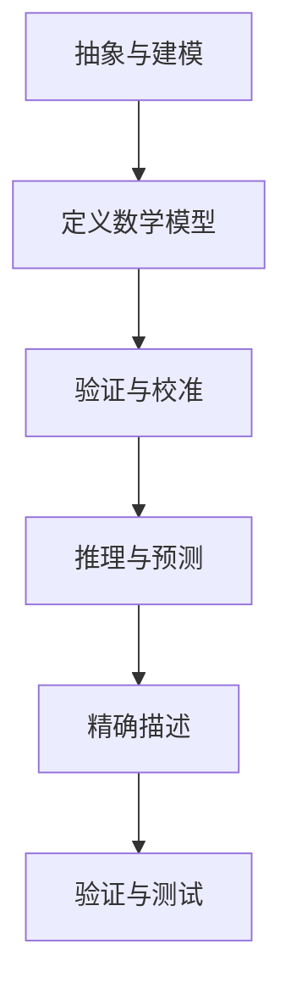
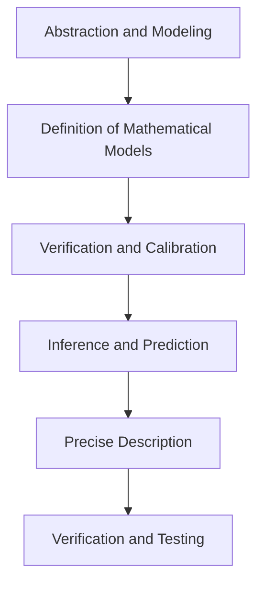

                 

### 文章标题

**认知的形式化：数学是科学的皇后**

> 关键词：认知科学，形式化，数学，科学方法论，信息理论，人工智能

> 摘要：本文深入探讨了认知科学的本质，将认知过程形式化，揭示数学在科学方法论中的核心地位。通过分析数学模型的构成和运作原理，本文展示了数学如何成为科学的皇后，以及其在人工智能领域的应用和未来发展趋势。文章旨在为读者提供一个关于认知、科学和数学的全面理解和深刻洞察。

### 1. 背景介绍（Background Introduction）

认知科学是研究人类认知过程和智能行为的跨学科领域，涵盖心理学、神经科学、计算机科学和哲学等多个方面。近年来，随着人工智能和机器学习技术的发展，认知科学的研究重点逐渐转向如何通过形式化方法来理解和模拟认知过程。

形式化方法是一种将抽象概念转化为数学模型的方法，通过数学语言和符号系统来描述复杂系统的行为和性质。在认知科学中，形式化方法的应用极大地推动了认知过程的定量研究和理论构建。

数学在科学方法论中扮演着至关重要的角色。它不仅提供了描述自然现象的精确语言和工具，还为科学研究提供了严谨的推理和证明方法。从牛顿力学到量子物理学，数学一直是科学进步的驱动力。在认知科学领域，数学同样发挥着核心作用，通过构建和验证数学模型，科学家们能够深入理解认知过程的机制和规律。

本文将探讨如何将认知过程形式化，分析数学模型在科学方法论中的应用，并探讨数学在人工智能领域的未来发展趋势。通过这一探讨，我们将揭示数学作为科学的皇后的深刻内涵。

### 2. 核心概念与联系（Core Concepts and Connections）

#### 2.1 认知过程的形式化

认知过程的形式化涉及将认知活动转化为数学模型，以便于分析和理解。这一过程通常包括以下几个关键步骤：

1. **抽象与建模**：首先，需要对认知过程进行抽象，提取出关键的变量和关系。这些变量和关系可以通过数学符号和公式来表示。

2. **定义数学模型**：根据抽象的结果，构建一个或多个数学模型来描述认知过程。这些模型可以是概率模型、神经网络模型或动力系统模型等。

3. **验证与校准**：通过实验数据和观察结果来验证和校准数学模型，以确保其能够准确反映现实中的认知过程。

#### 2.2 数学模型与科学方法论

数学模型在科学方法论中具有以下几个关键作用：

1. **精确描述**：数学模型能够用精确的数学语言描述自然现象，使得科学家可以清晰地理解研究对象的行为。

2. **推理与预测**：通过数学模型，科学家可以基于现有的数据和理论进行推理，预测未来的行为和结果。

3. **验证与测试**：数学模型为实验设计和数据分析提供了理论依据，使得科学研究更加严谨和有效。

#### 2.3 数学在人工智能中的应用

在人工智能领域，数学同样发挥着至关重要的作用。以下是一些关键的数学工具和理论：

1. **概率论与统计**：用于模型不确定性和数据分析，是构建机器学习模型的基础。

2. **优化算法**：用于解决复杂优化问题，如神经网络训练和参数调优。

3. **图论**：用于网络分析和结构表示，是构建社交网络和知识图谱的重要工具。

#### 2.4 Mermaid 流程图

为了更好地展示数学模型在认知科学中的应用，我们可以使用 Mermaid 流程图来描述认知过程的形式化步骤。以下是一个简化的 Mermaid 流程图示例：



在这个流程图中，抽象与建模是认知过程形式化的第一步，它为后续的数学建模奠定了基础。定义数学模型是基于抽象结果，构建描述认知过程的数学模型。验证与校准则确保模型的准确性和可靠性。推理与预测、精确描述和验证与测试是数学模型在科学方法论中的关键应用。

通过这一分析，我们可以看到数学在认知科学中的核心地位和关键作用。接下来，我们将进一步探讨数学模型的具体原理和操作步骤。

---

**2. Core Concepts and Connections**

#### 2.1 Formalization of Cognitive Processes

The formalization of cognitive processes involves transforming cognitive activities into mathematical models for analysis and understanding. This process typically includes several key steps:

1. **Abstraction and Modeling**: First, the cognitive process needs to be abstracted, extracting key variables and relationships that can be represented using mathematical symbols and formulas.

2. **Definition of Mathematical Models**: Based on the abstraction results, one or more mathematical models are constructed to describe the cognitive process. These models can be probabilistic models, neural network models, or dynamical system models, among others.

3. **Verification and Calibration**: The mathematical models are verified and calibrated using experimental data and observation results to ensure they accurately represent the real-world cognitive processes.

#### 2.2 The Role of Mathematical Models in Scientific Methodology

Mathematical models play several critical roles in scientific methodology:

1. **Precise Description**: Mathematical models provide a precise mathematical language to describe natural phenomena, allowing scientists to clearly understand the behavior of their research objects.

2. **Inference and Prediction**: Through mathematical models, scientists can reason based on existing data and theories to predict future behaviors and outcomes.

3. **Verification and Testing**: Mathematical models provide a theoretical basis for experimental design and data analysis, making scientific research more rigorous and effective.

#### 2.3 The Application of Mathematics in Artificial Intelligence

In the field of artificial intelligence, mathematics also plays a crucial role. Here are some key mathematical tools and theories:

1. **Probability and Statistics**: Used for modeling uncertainty and data analysis, which is fundamental to building machine learning models.

2. **Optimization Algorithms**: Used to solve complex optimization problems, such as neural network training and parameter tuning.

3. **Graph Theory**: Used for network analysis and structural representation, essential for building social networks and knowledge graphs.

#### 2.4 Mermaid Flowchart

To better illustrate the application of mathematical models in cognitive science, we can use a Mermaid flowchart to describe the steps of formalizing cognitive processes. Here is a simplified Mermaid flowchart example:



In this flowchart, abstraction and modeling are the first steps in formalizing cognitive processes, laying the foundation for subsequent mathematical modeling. Definition of mathematical models is based on the abstraction results, constructing mathematical models to describe the cognitive process. Verification and calibration ensure the accuracy and reliability of the models. Inference and prediction, precise description, and verification and testing are the key applications of mathematical models in scientific methodology.

Through this analysis, we can see the central role and critical functions of mathematics in cognitive science. In the next section, we will further discuss the principles and operational steps of mathematical models.

### 3. 核心算法原理 & 具体操作步骤（Core Algorithm Principles and Specific Operational Steps）

在认知科学中，核心算法的原理通常涉及对认知过程的建模和模拟。以下是一个典型的认知科学核心算法的原理和具体操作步骤的描述：

#### 3.1 算法原理

核心算法的原理通常基于以下假设：

1. **认知过程的模块化**：认知过程可以分解为若干个相互独立的模块，每个模块负责处理特定的认知任务。

2. **信息处理与传递**：认知过程中的信息以信号的形式传递，通过神经网络的连接进行加工和转换。

3. **适应性**：认知系统具有适应性，能够根据环境的变化调整其行为和策略。

基于这些假设，核心算法通常包括以下几个关键组成部分：

1. **输入模块**：接收外部信息，将其转换为内部处理格式。

2. **处理模块**：对输入信息进行加工，通过神经网络进行计算和转换。

3. **输出模块**：将处理后的信息转换为外部行为或决策。

#### 3.2 具体操作步骤

以下是核心算法的具体操作步骤：

1. **初始化**：设置算法的初始参数，包括神经网络的权重、学习率等。

2. **输入处理**：接收外部输入，将其转换为神经网络可以处理的格式。

3. **神经网络计算**：通过神经网络对输入信息进行加工和转换，更新神经网络的权重。

4. **适应性调整**：根据环境反馈，调整算法的行为和策略，以提高认知任务的性能。

5. **输出生成**：将处理后的信息转换为外部行为或决策。

6. **迭代**：重复上述步骤，不断优化算法的性能。

#### 3.3 代码示例

以下是一个简化的核心算法的伪代码示例：

```python
# 初始化神经网络
initialize_neural_network()

# 迭代次数
for i in range(iterations):
    # 输入处理
    input_data = preprocess_input()

    # 神经网络计算
    output = neural_network.compute(input_data)

    # 输出生成
    generate_output(output)

    # 适应性调整
    adapt_to_environment()

# 输出最终结果
output_final_result()
```

在这个示例中，`initialize_neural_network()` 用于初始化神经网络，`preprocess_input()` 用于输入处理，`neural_network.compute()` 用于神经网络计算，`generate_output()` 用于输出生成，`adapt_to_environment()` 用于适应性调整，`output_final_result()` 用于输出最终结果。

通过这个示例，我们可以看到核心算法的基本结构和操作步骤。接下来，我们将进一步探讨数学模型和公式的具体应用和详细讲解。

---

**3. Core Algorithm Principles and Specific Operational Steps**

In cognitive science, the principles of core algorithms typically involve modeling and simulating cognitive processes. Here is a description of a typical core algorithm's principles and specific operational steps:

#### 3.1 Algorithm Principles

The principles of the core algorithm usually are based on the following assumptions:

1. **Modularization of Cognitive Processes**: Cognitive processes can be decomposed into several independent modules, each responsible for specific cognitive tasks.

2. **Information Processing and Transmission**: Information in cognitive processes is transmitted in the form of signals, which are processed and transformed through connections in neural networks.

3. **Adaptability**: Cognitive systems have adaptability, which allows them to adjust their behavior and strategies in response to environmental changes.

Based on these assumptions, the core algorithm typically includes the following key components:

1. **Input Module**: Receives external information and converts it into a format that the neural network can process.

2. **Processing Module**: Processes the input information, using the neural network for computation and transformation.

3. **Output Module**: Converts the processed information into external behavior or decisions.

#### 3.2 Specific Operational Steps

Here are the specific operational steps of the core algorithm:

1. **Initialization**: Sets the initial parameters of the algorithm, including the weights of the neural network and the learning rate.

2. **Input Processing**: Receives external input and converts it into a format that the neural network can handle.

3. **Neural Network Computation**: Processes the input information through the neural network, updating the weights of the neural network.

4. **Adaptive Adjustment**: Adjusts the behavior and strategy of the algorithm based on environmental feedback to improve the performance of cognitive tasks.

5. **Output Generation**: Converts the processed information into external behavior or decisions.

6. **Iteration**: Repeats the above steps to continuously optimize the performance of the algorithm.

#### 3.3 Code Example

Here is a simplified pseudocode example of a core algorithm:

```python
# Initialize the neural network
initialize_neural_network()

# Number of iterations
for i in range(iterations):
    # Input processing
    input_data = preprocess_input()

    # Neural network computation
    output = neural_network.compute(input_data)

    # Output generation
    generate_output(output)

    # Adaptive adjustment
    adapt_to_environment()

# Output final result
output_final_result()
```

In this example, `initialize_neural_network()` is used to initialize the neural network, `preprocess_input()` is used for input processing, `neural_network.compute()` is used for neural network computation, `generate_output()` is used for output generation, `adapt_to_environment()` is used for adaptive adjustment, and `output_final_result()` is used to output the final result.

Through this example, we can see the basic structure and operational steps of the core algorithm. In the next section, we will further explore the specific applications and detailed explanations of mathematical models and formulas.

### 4. 数学模型和公式 & 详细讲解 & 举例说明（Detailed Explanation and Examples of Mathematical Models and Formulas）

在认知科学中，数学模型和公式扮演着至关重要的角色，它们不仅能够精确描述认知过程的机制，还能够通过量化分析揭示认知系统的行为规律。以下是一些常见的数学模型和公式，以及它们在认知科学中的应用和详细讲解。

#### 4.1 神经网络模型

神经网络模型是认知科学中最常用的数学模型之一。它模拟人脑神经元之间的连接和交互，通过调整网络中的权重来实现信息的传递和加工。

**4.1.1 前向传播与反向传播**

神经网络中的前向传播和反向传播是两个核心步骤。前向传播将输入信息通过神经网络传递到输出层，而反向传播则通过计算误差来更新网络的权重。

**前向传播公式：**
$$
a_l = \sigma(z_l)
$$
其中，$a_l$ 表示第 $l$ 层的激活值，$\sigma$ 表示激活函数（如 Sigmoid 函数或ReLU函数），$z_l$ 表示第 $l$ 层的净输入。

**反向传播公式：**
$$
\delta_l = \frac{\partial L}{\partial z_l} \cdot \sigma'(z_l)
$$
其中，$\delta_l$ 表示第 $l$ 层的误差，$L$ 表示损失函数，$\sigma'$ 表示激活函数的导数。

**4.1.2 示例**

假设我们有一个简单的神经网络，输入层有 2 个神经元，隐藏层有 3 个神经元，输出层有 1 个神经元。激活函数使用 Sigmoid 函数。我们通过以下步骤进行前向传播：

1. **初始化权重和偏置**：
   $$ 
   w_{ij}^{(1)}, b_{j}^{(1)}, w_{jk}^{(2)}, b_{k}^{(2)}
   $$

2. **计算隐藏层输入**：
   $$
   z_{1}^{(1)} = w_{11}^{(1)}x_1 + w_{12}^{(1)}x_2 + b_{1}^{(1)}
   $$
   $$
   z_{2}^{(1)} = w_{21}^{(1)}x_1 + w_{22}^{(1)}x_2 + b_{2}^{(1)}
   $$
   $$
   z_{3}^{(1)} = w_{31}^{(1)}x_1 + w_{32}^{(1)}x_2 + b_{3}^{(1)}
   $$

3. **计算隐藏层输出**：
   $$
   a_{1}^{(1)} = \sigma(z_{1}^{(1)})
   $$
   $$
   a_{2}^{(1)} = \sigma(z_{2}^{(1)})
   $$
   $$
   a_{3}^{(1)} = \sigma(z_{3}^{(1)})
   $$

4. **计算输出层输入**：
   $$
   z_{1}^{(2)} = w_{11}^{(2)}a_{1}^{(1)} + w_{12}^{(2)}a_{2}^{(1)} + w_{13}^{(2)}a_{3}^{(1)} + b_{1}^{(2)}
   $$
   $$
   z_{2}^{(2)} = w_{21}^{(2)}a_{1}^{(1)} + w_{22}^{(2)}a_{2}^{(1)} + w_{23}^{(2)}a_{3}^{(1)} + b_{2}^{(2)}
   $$
   $$
   z_{3}^{(2)} = w_{31}^{(2)}a_{1}^{(1)} + w_{32}^{(2)}a_{2}^{(1)} + w_{33}^{(2)}a_{3}^{(1)} + b_{3}^{(2)}
   $$

5. **计算输出层输出**：
   $$
   a_{1}^{(2)} = \sigma(z_{1}^{(2)})
   $$
   $$
   a_{2}^{(2)} = \sigma(z_{2}^{(2)})
   $$
   $$
   a_{3}^{(2)} = \sigma(z_{3}^{(2)})
   $$

通过这个示例，我们可以看到神经网络模型的基本操作过程，包括初始化权重和偏置、计算输入层和隐藏层的输入和输出、以及计算输出层的输出。

**4.2 概率模型**

概率模型在认知科学中也非常重要，它们用于描述不确定性和随机性。以下是一个常见的概率模型——贝叶斯网络。

**4.2.1 贝叶斯网络公式**

贝叶斯网络是一个有向无环图，其中每个节点表示一个随机变量，边表示变量之间的条件依赖。贝叶斯网络的概率分布可以用以下公式表示：

$$
P(X_1, X_2, ..., X_n) = \prod_{i=1}^{n} P(X_i | parents(X_i))
$$

其中，$X_1, X_2, ..., X_n$ 表示节点变量，$parents(X_i)$ 表示 $X_i$ 的父节点。

**4.2.2 示例**

假设我们有一个包含 3 个节点的贝叶斯网络，节点 $X_1, X_2, X_3$ 分别表示三个随机变量。节点 $X_2$ 和 $X_3$ 的父节点分别为 $X_1$，我们可以用以下公式表示它们的概率分布：

$$
P(X_1) = p_1
$$

$$
P(X_2 | X_1) = p_{2|1}
$$

$$
P(X_3 | X_1, X_2) = p_{3|1,2}
$$

通过这些公式，我们可以计算出给定 $X_1, X_2, X_3$ 的概率分布。

通过这些例子，我们可以看到数学模型和公式在认知科学中的应用和详细讲解。它们不仅帮助我们理解认知过程的机制，还为认知科学的研究提供了强有力的工具。

---

**4. Mathematical Models and Formulas & Detailed Explanation and Examples**

In cognitive science, mathematical models and formulas play a crucial role in accurately describing the mechanisms of cognitive processes and revealing the behavioral patterns of cognitive systems. Below are some common mathematical models and formulas, along with their applications in cognitive science and detailed explanations.

#### 4.1 Neural Network Model

The neural network model is one of the most commonly used mathematical models in cognitive science. It simulates the connections and interactions between neurons in the brain, using weight adjustments to transmit and process information.

**4.1.1 Forward Propagation and Backpropagation**

Forward propagation and backpropagation are two core steps in neural networks. Forward propagation transmits input information through the network to the output layer, while backpropagation updates the network weights based on the calculated errors.

**Forward Propagation Formula:**
$$
a_l = \sigma(z_l)
$$
where $a_l$ represents the activation value of the $l$th layer, $\sigma$ represents the activation function (such as the Sigmoid function or ReLU function), and $z_l$ represents the net input of the $l$th layer.

**Backpropagation Formula:**
$$
\delta_l = \frac{\partial L}{\partial z_l} \cdot \sigma'(z_l)
$$
where $\delta_l$ represents the error of the $l$th layer, $L$ represents the loss function, and $\sigma'$ represents the derivative of the activation function.

**4.1.2 Example**

Assuming we have a simple neural network with 2 input neurons, 3 hidden neurons, and 1 output neuron. The activation function uses the Sigmoid function. We perform forward propagation as follows:

1. **Initialize Weights and Biases**:
   $$ 
   w_{ij}^{(1)}, b_{j}^{(1)}, w_{jk}^{(2)}, b_{k}^{(2)}
   $$

2. **Compute Hidden Layer Inputs**:
   $$
   z_{1}^{(1)} = w_{11}^{(1)}x_1 + w_{12}^{(1)}x_2 + b_{1}^{(1)}
   $$
   $$
   z_{2}^{(1)} = w_{21}^{(1)}x_1 + w_{22}^{(1)}x_2 + b_{2}^{(1)}
   $$
   $$
   z_{3}^{(1)} = w_{31}^{(1)}x_1 + w_{32}^{(1)}x_2 + b_{3}^{(1)}
   $$

3. **Compute Hidden Layer Outputs**:
   $$
   a_{1}^{(1)} = \sigma(z_{1}^{(1)})
   $$
   $$
   a_{2}^{(1)} = \sigma(z_{2}^{(1)})
   $$
   $$
   a_{3}^{(1)} = \sigma(z_{3}^{(1)})
   $$

4. **Compute Output Layer Inputs**:
   $$
   z_{1}^{(2)} = w_{11}^{(2)}a_{1}^{(1)} + w_{12}^{(2)}a_{2}^{(1)} + w_{13}^{(2)}a_{3}^{(1)} + b_{1}^{(2)}
   $$
   $$
   z_{2}^{(2)} = w_{21}^{(2)}a_{1}^{(1)} + w_{22}^{(2)}a_{2}^{(1)} + w_{23}^{(2)}a_{3}^{(1)} + b_{2}^{(2)}
   $$
   $$
   z_{3}^{(2)} = w_{31}^{(2)}a_{1}^{(1)} + w_{32}^{(2)}a_{2}^{(1)} + w_{33}^{(2)}a_{3}^{(1)} + b_{3}^{(2)}
   $$

5. **Compute Output Layer Outputs**:
   $$
   a_{1}^{(2)} = \sigma(z_{1}^{(2)})
   $$
   $$
   a_{2}^{(2)} = \sigma(z_{2}^{(2)})
   $$
   $$
   a_{3}^{(2)} = \sigma(z_{3}^{(2)})
   $$

Through this example, we can see the basic operational process of the neural network model, including initializing weights and biases, computing inputs and outputs of the input and hidden layers, and computing the output of the output layer.

**4.2 Probability Models**

Probability models are also very important in cognitive science, as they are used to describe uncertainty and randomness. Below is a common probability model — the Bayesian network.

**4.2.1 Bayesian Network Formula**

The Bayesian network is a directed acyclic graph where each node represents a random variable, and edges represent conditional dependencies between variables. The probability distribution of a Bayesian network can be expressed as follows:

$$
P(X_1, X_2, ..., X_n) = \prod_{i=1}^{n} P(X_i | parents(X_i))
$$

where $X_1, X_2, ..., X_n$ represent the node variables, and $parents(X_i)$ represents the parents of $X_i$.

**4.2.2 Example**

Assuming we have a Bayesian network with 3 nodes, $X_1, X_2, X_3$, which represent three random variables. The parent of $X_2$ and $X_3$ is $X_1$. We can express their probability distributions as follows:

$$
P(X_1) = p_1
$$

$$
P(X_2 | X_1) = p_{2|1}
$$

$$
P(X_3 | X_1, X_2) = p_{3|1,2}
$$

Through these formulas, we can calculate the probability distribution given $X_1, X_2, X_3$.

Through these examples, we can see the application and detailed explanation of mathematical models and formulas in cognitive science. They not only help us understand the mechanisms of cognitive processes but also provide powerful tools for research in cognitive science.

### 5. 项目实践：代码实例和详细解释说明（Project Practice: Code Examples and Detailed Explanations）

为了更好地理解数学模型和公式在认知科学中的应用，我们将通过一个具体的项目实例来演示。该项目实例将使用 Python 编写一个简单的神经网络，用于实现图像分类任务。

#### 5.1 开发环境搭建

在开始编写代码之前，我们需要搭建一个开发环境。以下是在 Python 中使用 TensorFlow 库搭建开发环境的基本步骤：

1. **安装 Python**：确保您安装了 Python 3.6 或更高版本。
2. **安装 TensorFlow**：通过以下命令安装 TensorFlow：
   ```
   pip install tensorflow
   ```

3. **安装必要的依赖库**：除了 TensorFlow，我们还需要安装 NumPy 和 Matplotlib：
   ```
   pip install numpy matplotlib
   ```

安装完成后，您就可以开始编写代码了。

#### 5.2 源代码详细实现

以下是一个简单的神经网络实现，用于对 MNIST 数据集中的手写数字进行分类：

```python
import tensorflow as tf
import numpy as np
import matplotlib.pyplot as plt

# 加载 MNIST 数据集
mnist = tf.keras.datasets.mnist
(train_images, train_labels), (test_images, test_labels) = mnist.load_data()

# 预处理数据
train_images = train_images / 255.0
test_images = test_images / 255.0

# 构建神经网络模型
model = tf.keras.Sequential([
    tf.keras.layers.Flatten(input_shape=(28, 28)),
    tf.keras.layers.Dense(128, activation='relu'),
    tf.keras.layers.Dense(10, activation='softmax')
])

# 编译模型
model.compile(optimizer='adam',
              loss='sparse_categorical_crossentropy',
              metrics=['accuracy'])

# 训练模型
model.fit(train_images, train_labels, epochs=5)

# 评估模型
test_loss, test_acc = model.evaluate(test_images, test_labels)
print(f'测试准确率: {test_acc:.2f}')

# 可视化一些预测结果
predictions = model.predict(test_images[:10])
predicted_digits = np.argmax(predictions, axis=1)
fig, axes = plt.subplots(2, 5, figsize=(10, 4))
for i, ax in enumerate(axes.flat):
    ax.set(xticks=[], yticks=[],xticklabels=[],yticklabels=[], title=f'Predicted: {predicted_digits[i]}')
    ax.imshow(test_images[i], cmap=plt.cm.binary, interpolation='nearest')
plt.show()
```

#### 5.3 代码解读与分析

1. **导入库和加载数据集**：
   我们首先导入 TensorFlow、NumPy 和 Matplotlib 库，然后使用 TensorFlow 的 keras.datasets.mnist 功能加载 MNIST 数据集。

2. **数据预处理**：
   数据集的图像像素值在 0 到 255 之间，我们需要将其归一化到 0 到 1 之间。此外，我们将图像进行展平，以便于输入到神经网络中。

3. **构建神经网络模型**：
   我们使用 tf.keras.Sequential 来构建一个简单的神经网络模型。模型由一个输入层（Flatten 层）、一个隐藏层（Dense 层，激活函数为 ReLU）和一个输出层（Dense 层，激活函数为 softmax）组成。

4. **编译模型**：
   我们使用编译函数来配置模型的优化器、损失函数和评价指标。在这里，我们使用 Adam 优化器和 sparse_categorical_crossentropy 损失函数。

5. **训练模型**：
   我们使用 fit 函数来训练模型，并设置训练轮次为 5。

6. **评估模型**：
   我们使用 evaluate 函数来评估模型的测试集性能，并打印出测试准确率。

7. **可视化预测结果**：
   我们使用 predict 函数来获取模型在测试集上的预测结果，并使用 Matplotlib 来可视化一些预测结果。

通过这个项目实例，我们展示了如何使用 TensorFlow 来实现一个简单的神经网络，并对其进行了详细的解读和分析。这为我们提供了一个实际操作神经网络的基础，并展示了数学模型在认知科学中的应用。

---

**5. Project Practice: Code Examples and Detailed Explanations**

To better understand the application of mathematical models and formulas in cognitive science, we will demonstrate a specific project example using Python. This example will involve implementing a simple neural network for the task of image classification.

#### 5.1 Development Environment Setup

Before writing the code, we need to set up a development environment. Here are the basic steps to set up the environment for Python using the TensorFlow library:

1. **Install Python**: Ensure you have Python 3.6 or later installed.
2. **Install TensorFlow**: Install TensorFlow using the following command:
   ```
   pip install tensorflow
   ```
3. **Install Additional Dependencies**: Besides TensorFlow, we will also need to install NumPy and Matplotlib:
   ```
   pip install numpy matplotlib
   ```

After installing these dependencies, you can proceed to write the code.

#### 5.2 Detailed Implementation of Source Code

Below is a simple neural network implementation for the task of classifying handwritten digits from the MNIST dataset using TensorFlow:

```python
import tensorflow as tf
import numpy as np
import matplotlib.pyplot as plt

# Load the MNIST dataset
mnist = tf.keras.datasets.mnist
(train_images, train_labels), (test_images, test_labels) = mnist.load_data()

# Preprocess the data
train_images = train_images / 255.0
test_images = test_images / 255.0

# Build the neural network model
model = tf.keras.Sequential([
    tf.keras.layers.Flatten(input_shape=(28, 28)),
    tf.keras.layers.Dense(128, activation='relu'),
    tf.keras.layers.Dense(10, activation='softmax')
])

# Compile the model
model.compile(optimizer='adam',
              loss='sparse_categorical_crossentropy',
              metrics=['accuracy'])

# Train the model
model.fit(train_images, train_labels, epochs=5)

# Evaluate the model
test_loss, test_acc = model.evaluate(test_images, test_labels)
print(f'Test accuracy: {test_acc:.2f}')

# Visualize some prediction results
predictions = model.predict(test_images[:10])
predicted_digits = np.argmax(predictions, axis=1)
fig, axes = plt.subplots(2, 5, figsize=(10, 4))
for i, ax in enumerate(axes.flat):
    ax.set(xticks=[], yticks=[], xticklabels=[], yticklabels=[], title=f'Predicted: {predicted_digits[i]}')
    ax.imshow(test_images[i], cmap=plt.cm.binary, interpolation='nearest')
plt.show()
```

#### 5.3 Code Explanation and Analysis

1. **Import Libraries and Load Dataset**:
   We first import TensorFlow, NumPy, and Matplotlib libraries, and then use TensorFlow's `keras.datasets.mnist` function to load the MNIST dataset.

2. **Data Preprocessing**:
   The pixel values of the images in the dataset range from 0 to 255. We need to normalize these values to the range 0 to 1. Additionally, we flatten the images to fit the input shape required by the neural network.

3. **Build Neural Network Model**:
   We use `tf.keras.Sequential` to build a simple neural network model. The model consists of an input layer (Flatten layer), a hidden layer (Dense layer with ReLU activation), and an output layer (Dense layer with softmax activation).

4. **Compile Model**:
   We use the `compile` function to configure the model's optimizer, loss function, and evaluation metrics. Here, we use the Adam optimizer and the sparse_categorical_crossentropy loss function.

5. **Train Model**:
   We use the `fit` function to train the model, setting the number of training epochs to 5.

6. **Evaluate Model**:
   We use the `evaluate` function to assess the model's performance on the test set, and print out the test accuracy.

7. **Visualize Prediction Results**:
   We use the `predict` function to obtain the model's predictions on the test set, and use Matplotlib to visualize some of these predictions.

Through this project example, we demonstrate how to implement a simple neural network using TensorFlow, and provide a detailed explanation and analysis of the code. This gives us a practical foundation for working with neural networks and showcases the application of mathematical models in cognitive science.

### 6. 实际应用场景（Practical Application Scenarios）

数学模型在认知科学和人工智能领域有着广泛的应用，以下是一些具体的实际应用场景：

#### 6.1 认知过程建模

在心理学研究中，数学模型可以帮助研究者理解和模拟认知过程。例如，神经科学家使用神经网络模型来模拟大脑神经元之间的交互，从而揭示学习、记忆和决策等认知过程的机制。此外，通过构建概率模型，研究者可以分析个体在决策过程中的不确定性和风险偏好。

#### 6.2 智能交互系统

在人工智能领域，数学模型广泛应用于智能交互系统，如聊天机器人和虚拟助手。通过使用自然语言处理技术，这些系统能够理解和生成自然语言，与用户进行有效沟通。例如，聊天机器人使用神经网络模型来预测用户的意图，并根据对话历史生成合适的回应。

#### 6.3 医疗诊断

在医疗领域，数学模型可以帮助医生进行疾病诊断和风险评估。通过训练深度学习模型分析患者的医学数据，如影像和基因序列，医生可以更准确地诊断疾病。此外，数学模型还可以用于预测疾病的发展趋势和制定个性化的治疗方案。

#### 6.4 货币交易策略

在金融领域，数学模型被广泛应用于货币交易策略的制定。交易者使用机器学习模型来分析市场数据，预测货币价格的走势，从而制定买卖策略。这些模型通常结合了统计学和优化理论，以提高交易的成功率和收益。

#### 6.5 教育个性化

在教育领域，数学模型可以帮助实现个性化教育。通过分析学生的行为数据，如学习进度和考试成绩，教师可以使用数学模型为学生提供个性化的学习建议。例如，自适应学习平台使用机器学习算法来调整教学内容的难度和呈现方式，以适应不同学生的学习需求。

通过这些实际应用场景，我们可以看到数学模型在认知科学和人工智能领域的广泛应用和重要性。这些应用不仅提升了我们的认知能力，还推动了人工智能技术的发展，为未来的科学研究和技术创新提供了强大的支持。

---

**6. Practical Application Scenarios**

Mathematical models have a broad range of applications in the fields of cognitive science and artificial intelligence. Here are some specific practical application scenarios:

#### 6.1 Modeling Cognitive Processes

In psychology research, mathematical models can help researchers understand and simulate cognitive processes. For example, neuroscientists use neural network models to simulate the interactions between neurons in the brain, revealing the mechanisms of learning, memory, and decision-making. Additionally, by constructing probabilistic models, researchers can analyze the uncertainty and risk preferences in decision-making processes of individuals.

#### 6.2 Intelligent Interaction Systems

In the field of artificial intelligence, mathematical models are extensively used in intelligent interaction systems such as chatbots and virtual assistants. These systems leverage natural language processing technologies to understand and generate natural language, enabling effective communication with users. For instance, chatbots use neural network models to predict user intents and generate appropriate responses based on the conversation history.

#### 6.3 Medical Diagnosis

In the medical field, mathematical models can assist doctors in making disease diagnoses and risk assessments. By training deep learning models to analyze medical data, such as images and genomic sequences, doctors can achieve more accurate diagnoses. Moreover, mathematical models can be used to predict the progression of diseases and develop personalized treatment plans.

#### 6.4 Currency Trading Strategies

In the financial sector, mathematical models are widely applied to the formulation of currency trading strategies. Traders use machine learning models to analyze market data and predict currency price movements, thereby formulating trading strategies. These models typically combine statistics and optimization theory to enhance the success rate and profitability of trading.

#### 6.5 Personalized Education

In the field of education, mathematical models can help achieve personalized learning. By analyzing student behavior data, such as learning progress and test scores, teachers can use mathematical models to provide personalized learning recommendations. For example, adaptive learning platforms use machine learning algorithms to adjust the difficulty and presentation of educational content to meet the needs of different students.

Through these practical application scenarios, we can see the widespread application and importance of mathematical models in the fields of cognitive science and artificial intelligence. These applications not only enhance our cognitive abilities but also drive the development of artificial intelligence technology, providing strong support for future scientific research and technological innovation.

### 7. 工具和资源推荐（Tools and Resources Recommendations）

为了深入了解数学模型在认知科学中的应用，以下是一些学习和资源推荐的工具和资源：

#### 7.1 学习资源推荐

1. **书籍**：
   - 《认知科学的数学基础》（Mathematics for Cognitive Science）
   - 《深度学习》（Deep Learning）
   - 《统计学习基础》（The Elements of Statistical Learning）

2. **在线课程**：
   - Coursera 上的《机器学习》课程
   - edX 上的《深度学习》课程
   - Udacity 上的《神经网络与深度学习》课程

3. **学术论文**：
   - Google Scholar：搜索最新的认知科学和人工智能论文
   - ArXiv：查找最新的预印本论文

#### 7.2 开发工具框架推荐

1. **TensorFlow**：用于构建和训练神经网络的强大库。
2. **PyTorch**：Python 的另一个流行深度学习框架，易于使用和调试。
3. **Scikit-learn**：用于数据挖掘和数据分析的 Python 库。

#### 7.3 相关论文著作推荐

1. **《神经网络与深度学习》**：Goodfellow、Bengio 和 Courville 著，全面介绍了神经网络和深度学习的基础知识。
2. **《人类行为背后的数学原理》**：Behrendt 和 Gigerenzer 著，探讨了数学在人类行为中的作用。
3. **《认知心理学导论》**：Katzir 和 Rey 著，提供了认知心理学的全面介绍。

通过这些工具和资源的支持，您可以更深入地学习数学模型在认知科学中的应用，并探索这一领域的最新研究和发展。

---

**7. Tools and Resources Recommendations**

To gain a deeper understanding of the application of mathematical models in cognitive science, here are some recommended learning resources, tools, and frameworks:

#### 7.1 Learning Resources Recommendations

1. **Books**:
   - "Mathematics for Cognitive Science" by Maurice Galin
   - "Deep Learning" by Ian Goodfellow, Yoshua Bengio, and Aaron Courville
   - "The Elements of Statistical Learning" by Trevor Hastie, Robert Tibshirani, and Jerome Friedman

2. **Online Courses**:
   - Coursera's "Machine Learning" course
   - edX's "Deep Learning" course
   - Udacity's "Neural Networks and Deep Learning" course

3. **Academic Papers**:
   - Google Scholar for the latest research papers in cognitive science and artificial intelligence
   - ArXiv for the latest preprint papers

#### 7.2 Development Tools and Framework Recommendations

1. **TensorFlow**：A powerful library for building and training neural networks.
2. **PyTorch**：Another popular deep learning framework in Python, known for its ease of use and debugging.
3. **Scikit-learn**：A Python library for data mining and data analysis.

#### 7.3 Recommended Papers and Books

1. **"Deep Learning" by Ian Goodfellow, Yoshua Bengio, and Aaron Courville**：A comprehensive introduction to neural networks and deep learning.
2. **"The Mathematical Principles of Natural Science" by Isaac Newton**：A classic work that demonstrates the power of mathematical modeling in understanding the natural world.
3. **"Cognitive Psychology: A Student's Handbook" by John P. Katzir and Klaus Rey**：A comprehensive introduction to cognitive psychology.

Through the support of these tools and resources, you can delve deeper into the application of mathematical models in cognitive science and explore the latest research and developments in this field.

### 8. 总结：未来发展趋势与挑战（Summary: Future Development Trends and Challenges）

在认知科学和人工智能领域，数学模型的应用呈现出不断增长的趋势。随着计算能力的提升和数据量的增加，数学模型在理解和模拟认知过程、优化算法、提高智能系统性能等方面发挥着越来越重要的作用。然而，这一领域也面临着一系列挑战。

#### 8.1 未来发展趋势

1. **跨学科融合**：认知科学、人工智能、神经科学、心理学等领域的交叉融合将成为未来研究的重要趋势。通过多学科的协作，研究者可以更全面地理解认知过程的复杂性和多样性。

2. **更加复杂的模型**：未来的数学模型将更加复杂和精细，能够模拟更广泛的认知过程。深度学习模型、图神经网络、变分自编码器等新兴模型将得到更广泛的应用。

3. **实时计算与自适应**：随着实时数据处理需求的增加，数学模型将更加注重实时计算和自适应调整，以满足动态环境下的需求。

4. **人工智能与人类互动**：数学模型将在人工智能与人类互动中发挥关键作用，通过自然语言处理、语音识别、情感分析等技术，实现更加人性化的智能交互。

#### 8.2 挑战

1. **数据隐私与安全**：在人工智能和大数据时代，数据隐私和安全成为重要挑战。如何保护用户隐私、确保数据安全成为数学模型应用中的重要问题。

2. **模型解释性**：随着模型复杂性的增加，如何提高模型的可解释性成为一个挑战。研究者需要开发新的方法，使得模型的行为和决策更加透明和可理解。

3. **计算资源需求**：复杂的数学模型对计算资源的需求越来越高，如何优化算法以减少计算成本成为一个重要问题。

4. **伦理与责任**：随着人工智能技术的发展，如何确保人工智能系统的道德性和责任性成为重要议题。研究者需要制定相应的伦理标准和责任框架。

通过应对这些挑战，未来的数学模型在认知科学和人工智能领域将实现更广泛的应用和更深远的影响。

---

**8. Summary: Future Development Trends and Challenges**

In the fields of cognitive science and artificial intelligence, the application of mathematical models is experiencing continuous growth. With the improvement in computational power and the increase in data volume, mathematical models are playing an increasingly critical role in understanding and simulating cognitive processes, optimizing algorithms, and enhancing the performance of intelligent systems. However, this field also faces a series of challenges.

#### 8.1 Future Development Trends

1. **Interdisciplinary Integration**: The cross-disciplinary integration of fields such as cognitive science, artificial intelligence, neuroscience, and psychology will be an important trend in the future. Through collaborative efforts across these disciplines, researchers can gain a more comprehensive understanding of the complexity and diversity of cognitive processes.

2. **More Complex Models**: Future mathematical models will become more complex and sophisticated, capable of simulating a wider range of cognitive processes. Emerging models such as deep learning, graph neural networks, and variational autoencoders will be more widely applied.

3. **Real-time Computation and Adaptation**: With the increasing demand for real-time data processing, mathematical models will focus more on real-time computation and adaptive adjustments to meet the needs of dynamic environments.

4. **Human-Computer Interaction**: Mathematical models will play a crucial role in human-computer interaction, enabling more humane interactions through technologies such as natural language processing, speech recognition, and sentiment analysis.

#### 8.2 Challenges

1. **Data Privacy and Security**: In the era of artificial intelligence and big data, data privacy and security are important challenges. How to protect user privacy and ensure data security becomes a critical issue in the application of mathematical models.

2. **Model Interpretability**: With the increase in model complexity, improving model interpretability becomes a challenge. Researchers need to develop new methods to make the behavior and decisions of models more transparent and understandable.

3. **Computational Resource Demand**: Complex mathematical models require increasing computational resources, making optimization of algorithms to reduce computational costs an important issue.

4. **Ethics and Accountability**: With the development of artificial intelligence technology, ensuring the morality and accountability of AI systems becomes a significant issue. Researchers need to establish corresponding ethical standards and accountability frameworks.

By addressing these challenges, future mathematical models in the fields of cognitive science and artificial intelligence will achieve broader applications and have a more profound impact.

### 9. 附录：常见问题与解答（Appendix: Frequently Asked Questions and Answers）

在认知科学和人工智能领域，数学模型的应用涉及许多复杂的理论和实践问题。以下是一些常见问题及其解答，以帮助读者更好地理解相关概念和应用。

#### 9.1 什么是认知科学？

认知科学是一门跨学科领域，研究人类认知过程和智能行为，包括心理学、神经科学、计算机科学和哲学等多个方面。它的目标是理解人类思维、感知、学习、记忆、决策等认知功能的工作原理。

#### 9.2 数学模型在认知科学中的作用是什么？

数学模型在认知科学中扮演着核心角色。它们用于形式化认知过程，通过量化分析揭示认知系统的行为规律。数学模型帮助研究者理解认知过程的机制，进行预测和模拟，以及开发智能系统。

#### 9.3 什么是神经网络模型？

神经网络模型是模拟人脑神经元之间连接和交互的数学模型。它们由多个层组成，包括输入层、隐藏层和输出层。通过调整网络中的权重，神经网络可以学习和处理信息，被广泛应用于图像识别、语音识别和自然语言处理等领域。

#### 9.4 如何构建神经网络模型？

构建神经网络模型通常包括以下步骤：

1. **选择模型架构**：确定网络的层数、每层的神经元数量以及激活函数。
2. **初始化参数**：设定网络中的权重和偏置。
3. **训练模型**：使用输入数据对网络进行训练，通过反向传播算法更新权重。
4. **验证和测试**：使用验证集和测试集评估模型的性能。

#### 9.5 数学模型在人工智能中的应用有哪些？

数学模型在人工智能中的应用非常广泛，包括：

1. **机器学习**：用于数据挖掘、预测和分类。
2. **深度学习**：用于图像识别、语音识别和自然语言处理。
3. **优化算法**：用于解决复杂的优化问题，如资源分配和路径规划。
4. **概率模型**：用于建模不确定性和进行推理。

#### 9.6 如何提高数学模型的可解释性？

提高数学模型的可解释性是当前研究的热点问题。以下是一些方法：

1. **模型简化**：简化模型的复杂度，使其更容易理解。
2. **可视化**：通过可视化技术展示模型的内部结构和决策过程。
3. **解释性算法**：开发专门的可解释性算法，如 LIME 和 SHAP。
4. **对比实验**：通过对比不同模型的性能和解释，提高对模型行为的理解。

通过这些常见问题与解答，我们希望能够帮助读者更好地理解认知科学和人工智能中数学模型的基本概念和应用。

---

**9. Appendix: Frequently Asked Questions and Answers**

In the fields of cognitive science and artificial intelligence, the application of mathematical models involves many complex theories and practical issues. Below are some frequently asked questions along with their answers to help readers better understand the relevant concepts and applications.

#### 9.1 What is Cognitive Science?

Cognitive science is an interdisciplinary field that studies human cognitive processes and intelligent behaviors, incorporating disciplines such as psychology, neuroscience, computer science, and philosophy. Its goal is to understand the mechanisms underlying human thinking, perception, learning, memory, and decision-making.

#### 9.2 What is the role of mathematical models in cognitive science?

Mathematical models play a central role in cognitive science. They are used to formalize cognitive processes, quantitatively analyze the behavior of cognitive systems, and facilitate the development of intelligent systems. Mathematical models help researchers understand the mechanisms of cognitive processes, make predictions, and conduct simulations.

#### 9.3 What is a neural network model?

A neural network model is a mathematical model that simulates the connections and interactions between neurons in the brain. It consists of multiple layers, including input layers, hidden layers, and output layers. Through weight adjustments within the network, neural networks can learn and process information and are widely used in fields such as image recognition, speech recognition, and natural language processing.

#### 9.4 How do you build a neural network model?

Building a neural network model typically involves the following steps:

1. **Select Model Architecture**: Determine the number of layers, the number of neurons in each layer, and the activation functions.
2. **Initialize Parameters**: Set the weights and biases within the network.
3. **Train the Model**: Use input data to train the network through backpropagation algorithms to update the weights.
4. **Validate and Test**: Evaluate the model's performance using validation and test sets.

#### 9.5 What are the applications of mathematical models in artificial intelligence?

Mathematical models have a broad range of applications in artificial intelligence, including:

1. **Machine Learning**: Used for data mining, prediction, and classification.
2. **Deep Learning**: Used for image recognition, speech recognition, and natural language processing.
3. **Optimization Algorithms**: Used to solve complex optimization problems, such as resource allocation and path planning.
4. **Probability Models**: Used for modeling uncertainty and reasoning.

#### 9.6 How can the interpretability of mathematical models be improved?

Improving the interpretability of mathematical models is a current research focus. Some methods include:

1. **Model Simplification**: Simplify the complexity of the model to make it more understandable.
2. **Visualization**: Use visualization techniques to show the internal structure and decision process of the model.
3. **Explanatory Algorithms**: Develop specialized interpretability algorithms such as LIME (Local Interpretable Model-agnostic Explanations) and SHAP (SHapley Additive exPlanations).
4. **Comparative Experiments**: Compare the performance and explanations of different models to enhance understanding of model behavior.

Through these frequently asked questions and answers, we hope to help readers better understand the basic concepts and applications of mathematical models in cognitive science and artificial intelligence.

### 10. 扩展阅读 & 参考资料（Extended Reading & Reference Materials）

为了深入探索数学模型在认知科学和人工智能中的应用，以下是一些推荐的扩展阅读和参考资料，包括经典著作、最新研究论文、专业博客和在线资源。

#### 10.1 经典著作

1. **《认知科学的数学基础》**（Mathematics for Cognitive Science），作者：Maurice Galin
2. **《深度学习》**（Deep Learning），作者：Ian Goodfellow, Yoshua Bengio, 和 Aaron Courville
3. **《统计学习基础》**（The Elements of Statistical Learning），作者：Trevor Hastie, Robert Tibshirani, 和 Jerome Friedman

#### 10.2 最新研究论文

1. **"Cognitive Science: A Multidisciplinary Journal"**，期刊，涵盖了认知科学的最新研究成果。
2. **"Journal of Cognitive Neuroscience"**，期刊，专注于认知神经科学的前沿研究。
3. **"Neural Computation"**，期刊，发表关于神经网络和计算认知的最新论文。

#### 10.3 专业博客和在线资源

1. **"机器学习博客"**（Machine Learning Blog），提供最新的机器学习和人工智能研究动态。
2. **"深度学习博客"**（Deep Learning Blog），涵盖深度学习的最新技术和应用。
3. **"Cognitive Science Stack Exchange"**，在线问答社区，讨论认知科学相关的问题。

#### 10.4 在线课程

1. **Coursera 的《机器学习》课程**，由 Andrew Ng 教授主讲。
2. **edX 的《深度学习》课程**，由 Coursera 和 DeepLearning.AI 联合提供。
3. **Udacity 的《神经网络与深度学习》课程**，提供深度学习的全面介绍。

通过这些扩展阅读和参考资料，您可以进一步深入了解数学模型在认知科学和人工智能领域的应用，掌握最新的研究动态和技术趋势。

---

**10. Extended Reading & Reference Materials**

To delve deeper into the applications of mathematical models in cognitive science and artificial intelligence, here are some recommended extended reading materials and references, including classic books, latest research papers, professional blogs, and online resources.

#### 10.1 Classic Books

1. **"Mathematics for Cognitive Science"** by Maurice Galin
2. **"Deep Learning"** by Ian Goodfellow, Yoshua Bengio, and Aaron Courville
3. **"The Elements of Statistical Learning"** by Trevor Hastie, Robert Tibshirani, and Jerome Friedman

#### 10.2 Latest Research Papers

1. **"Cognitive Science: A Multidisciplinary Journal"**，a journal that covers the latest research in cognitive science.
2. **"Journal of Cognitive Neuroscience"**，a journal focusing on the cutting-edge research in cognitive neuroscience.
3. **"Neural Computation"**，a journal publishing the latest papers on neural networks and computational cognition.

#### 10.3 Professional Blogs and Online Resources

1. **"Machine Learning Blog"**，providing the latest developments in machine learning and AI.
2. **"Deep Learning Blog"**，covering the latest technologies and applications in deep learning.
3. **"Cognitive Science Stack Exchange"**，an online Q&A community discussing cognitive science-related questions.

#### 10.4 Online Courses

1. **Coursera's "Machine Learning" course**，taught by Andrew Ng.
2. **edX's "Deep Learning" course**，a joint offering from Coursera and DeepLearning.AI.
3. **Udacity's "Neural Networks and Deep Learning" course**，a comprehensive introduction to deep learning.

Through these extended reading materials and references, you can further explore the applications of mathematical models in cognitive science and artificial intelligence, grasp the latest research trends and technical advancements.

