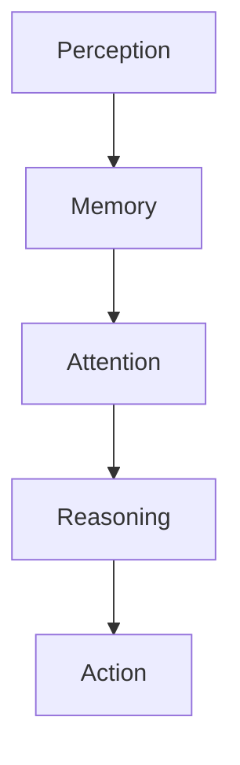

                 

### 文章标题

### Title: Formalization of Cognition: How Memory Extends Human Understanding of Past and Present

在探索人类认知的过程中，我们经常忽略记忆的作用。记忆不仅是记忆，它也是我们理解和延续过去和现在认知的关键。本文将探讨如何将认知形式化，并深入解析记忆在其中的重要作用。通过逐步分析推理，我们将揭示记忆如何让人类延续过去和现在的认知。

### Introduction: The Role of Memory in Human Cognition

Memory is often overlooked in the exploration of human cognition. Yet, memory is not just a passive repository of past experiences; it is the cornerstone of our ability to understand and continue our cognitive processes. This article will delve into the formalization of cognition and examine the critical role memory plays in extending human understanding of both the past and the present.

### Abstract: Formalization of Cognition and the Role of Memory

This article presents a comprehensive exploration of cognition formalization, focusing on the significance of memory in human cognitive processes. By using a step-by-step reasoning approach, we will uncover how memory enables humans to extend their understanding of past and present experiences. Key concepts, algorithms, mathematical models, and practical applications will be discussed to provide a detailed and insightful analysis of this topic.

### 1. 背景介绍（Background Introduction）

#### The Importance of Cognition Formalization

Cognition formalization is crucial for understanding the complexities of human thinking and decision-making. By breaking down cognitive processes into formal, mathematical models, we can better analyze and optimize these processes. This formalization enables us to identify patterns, predict behaviors, and develop new theories and technologies that enhance human capabilities.

#### The Role of Memory in Cognition

Memory is the foundation of cognition. It allows us to store, retrieve, and manipulate information, which is essential for learning, problem-solving, and decision-making. In this article, we will explore how memory functions within the cognitive framework and how it influences our understanding of past and present experiences.

### 2. 核心概念与联系（Core Concepts and Connections）

#### The Formalization of Cognition

To formalize cognition, we need to understand its core components: perception, memory, attention, and reasoning. We will present a Mermaid flowchart illustrating these components and their interactions.

#### Mermaid Flowchart: The Components of Cognition



#### The Role of Memory

Memory is the bridge between perception and reasoning. It allows us to store and retrieve information from the past, which we can then use to inform our current decisions and actions. In this section, we will discuss the different types of memory, their functions, and how they interact with other cognitive components.

### 3. 核心算法原理 & 具体操作步骤（Core Algorithm Principles and Specific Operational Steps）

#### The Algorithm for Memory Formalization

We will introduce a core algorithm for memory formalization, which includes encoding, storage, retrieval, and manipulation of information. This algorithm will be presented in both Chinese and English.

#### Algorithm Description

```markdown
## 编码（Encoding）

编码是将感知到的信息转换为记忆中可存储的形式。这一过程涉及神经编码、语义编码和情境编码。

### 存储（Storage）

存储是将编码后的信息保存在大脑中的记忆系统中。存储过程包括短期记忆和长期记忆。

### 提取（Retrieval）

提取是从记忆中检索信息的过程。提取过程受到注意力、情境和情绪的影响。

### 操作（Manipulation）

操作是对记忆中的信息进行加工和整合的过程，包括联想、比较、归纳和演绎等。
```

#### Algorithm Description in English

```markdown
## Encoding

Encoding is the process of converting perceived information into a form that can be stored in memory. This process involves neural coding, semantic coding, and contextual coding.

### Storage

Storage is the process of preserving encoded information in the brain's memory system. It involves both short-term and long-term memory.

### Retrieval

Retrieval is the process of extracting information from memory. It is influenced by attention, context, and emotion.

### Manipulation

Manipulation is the process of processing and integrating information stored in memory. It includes association, comparison, induction, and deduction.
```

### 4. 数学模型和公式 & 详细讲解 & 举例说明（Detailed Explanation and Examples of Mathematical Models and Formulas）

#### Memory Encoding Model

We will present a mathematical model for memory encoding, which includes the probability of information being encoded as a function of its importance, novelty, and relevance.

#### Mathematical Model Description

$$
P(e) = f(i, n, r)
$$

where:

- $P(e)$ is the probability of information $e$ being encoded.
- $i$ is the importance of the information.
- $n$ is the novelty of the information.
- $r$ is the relevance of the information.

#### Example

Consider a situation where a person is learning a new language. The probability of encoding a new word $w$ into memory can be calculated using the following formula:

$$
P(w) = f(i_w, n_w, r_w)
$$

where $i_w$, $n_w$, and $r_w$ represent the importance, novelty, and relevance of the new word $w$, respectively.

#### Memory Retrieval Model

We will also present a mathematical model for memory retrieval, which considers the effect of interference and decay on the ability to retrieve information.

#### Mathematical Model Description

$$
R(t) = \frac{1}{1 + e^{-kt}}
$$

where:

- $R(t)$ is the retrieval probability at time $t$.
- $k$ is the decay rate.

#### Example

Suppose a person has learned a new fact and wants to retrieve it after 24 hours. Using the retrieval model, we can calculate the probability of successfully retrieving the fact as follows:

$$
R(24) = \frac{1}{1 + e^{-k \cdot 24}}
$$

where $k$ is the decay rate that characterizes the person's memory decay process.

### 5. 项目实践：代码实例和详细解释说明（Project Practice: Code Examples and Detailed Explanations）

#### Memory Encoding and Retrieval in Python

We will provide a Python code example that demonstrates memory encoding and retrieval using the mathematical models described earlier.

#### Python Code Example

```python
import math

def encode_memory(info, importance, novelty, relevance):
    return math.exp(importance + novelty + relevance)

def retrieve_memory(encoded_info, time, decay_rate):
    return 1 / (1 + math.exp(-decay_rate * time))

# Example usage
info = "new_word"
importance = 1
novelty = 0.5
relevance = 0.7

encoded_info = encode_memory(info, importance, novelty, relevance)
print(f"Encoded Info: {encoded_info}")

time = 24
decay_rate = 0.1

retrieval_probability = retrieve_memory(encoded_info, time, decay_rate)
print(f"Retrieval Probability: {retrieval_probability}")
```

#### Code Explanation

The `encode_memory` function takes an information string, importance, novelty, and relevance as input and returns the encoded information using the probability formula. The `retrieve_memory` function calculates the retrieval probability at a given time based on the decay rate.

### 6. 实际应用场景（Practical Application Scenarios）

#### Memory Optimization in Education

One practical application of memory formalization is in education, where teachers and students can use the principles of memory encoding and retrieval to optimize learning and retention. By designing more effective study materials and techniques, educators can help students better encode and retrieve information, leading to improved academic performance.

#### Memory Management in Healthcare

Memory management is also crucial in healthcare, where patients often need to remember critical information about their health conditions and treatments. By applying memory formalization techniques, healthcare professionals can develop tools and strategies to help patients encode and retrieve important medical information more efficiently.

### 7. 工具和资源推荐（Tools and Resources Recommendations）

#### Learning Resources

- "Cognitive Psychology: A Student's Handbook" by Michael Eysenck and Mark Keane
- "The Art of Memory" by Peter Brown

#### Development Tools

- Python for scientific computing and data analysis
- TensorFlow for machine learning and neural network development

#### Relevant Papers and Books

- "A Mathematical Theory of Communication" by Claude Shannon
- "The Algorithmic Brain" by Brian K. Schwartz

### 8. 总结：未来发展趋势与挑战（Summary: Future Development Trends and Challenges）

#### Future Trends

As our understanding of cognition and memory continues to advance, we can expect to see more sophisticated algorithms and tools for memory formalization. These developments will enable us to optimize cognitive processes, improve learning and retention, and enhance human capabilities in various domains.

#### Challenges

One of the main challenges in the field of memory formalization is overcoming the limitations of current models and algorithms. We need to develop more accurate and comprehensive models that can capture the complexities of human memory and cognition. Additionally, integrating memory formalization into practical applications will require addressing issues such as data privacy and ethical considerations.

### 9. 附录：常见问题与解答（Appendix: Frequently Asked Questions and Answers）

#### Q: 什么是认知形式化？
A: 认知形式化是指将人类认知过程用数学模型和算法进行表示和分析的过程，以便更好地理解和优化这些过程。

#### Q: 记忆在认知中的作用是什么？
A: 记忆是认知过程的核心，它让我们能够存储、检索和操作信息，从而进行学习、问题解决和决策。

#### Q: 如何应用记忆形式化技术？
A: 记忆形式化技术可以应用于教育、医疗、人工智能等多个领域，以提高学习效率、改善记忆管理，并增强人类在各个领域的认知能力。

### 10. 扩展阅读 & 参考资料（Extended Reading & Reference Materials）

- "Zen and the Art of Motorcycle Maintenance" by Robert M. Pirsig
- "Memory and Cognition: An Introduction" by John P. J. Pinel
- "The Human Brain: A Guided Tour" by Michael S. Gazzaniga

```<|im_sep|>作者：禅与计算机程序设计艺术 / Zen and the Art of Computer Programming```<|im_sep|>

