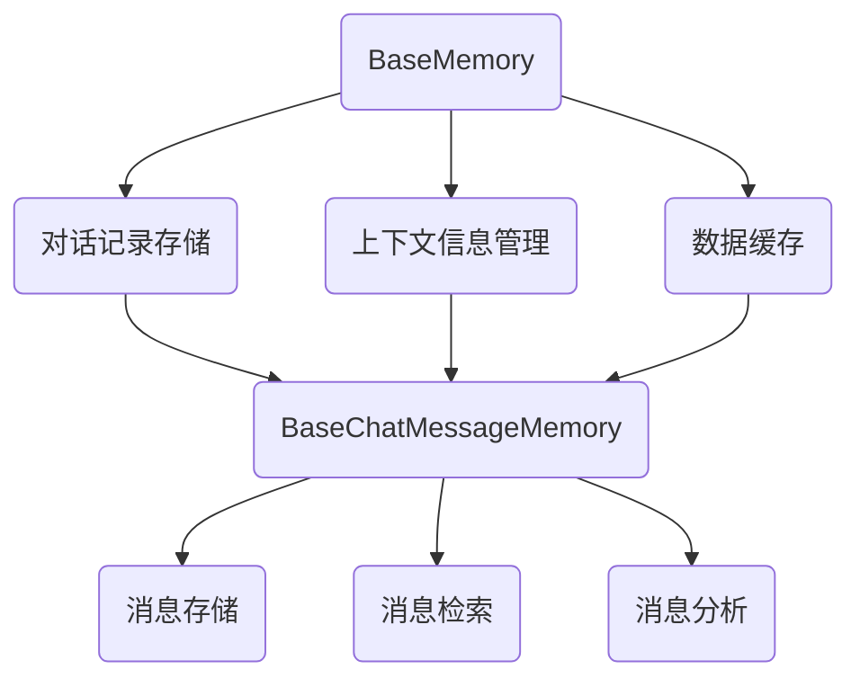

                 

### 文章标题

**记忆基类 BaseMemory 与 BaseChatMessageMemory**

> 关键词：BaseMemory，BaseChatMessageMemory，内存模型，聊天机器人，深度学习，算法原理，代码实例

> 摘要：本文深入探讨了记忆基类（BaseMemory）和BaseChatMessageMemory在聊天机器人中的重要性，详细解析了这两个类的结构、原理及其在深度学习中的应用。通过实例代码分析，我们展示了如何在实际项目中实现和优化这两个关键组件，为构建高效、智能的聊天机器人提供技术指导。

### 1. 背景介绍（Background Introduction）

在人工智能领域，特别是自然语言处理（NLP）和聊天机器人技术中，如何有效地管理和利用记忆资源成为了一个关键问题。记忆基类（BaseMemory）和BaseChatMessageMemory是构建这些系统的重要基石。BaseMemory作为一个通用的内存管理类，为各种类型的记忆操作提供了基础功能。而BaseChatMessageMemory则是专门为聊天机器人设计的，用于存储和检索对话中的文本消息。

随着深度学习技术的不断发展，聊天机器人的性能得到了显著提升。然而，如何将大量的对话数据有效地存储和利用，使得聊天机器人能够更好地理解和响应用户的需求，仍然是一个具有挑战性的课题。BaseMemory和BaseChatMessageMemory的设计和实现，为解决这一问题提供了可行的方案。

本文将从以下几个方面展开讨论：

1. **核心概念与联系**：介绍BaseMemory和BaseChatMessageMemory的基本原理及其在聊天机器人系统中的角色和关系。
2. **核心算法原理 & 具体操作步骤**：详细解析这两个类的核心算法原理，并给出具体的操作步骤。
3. **数学模型和公式 & 详细讲解 & 举例说明**：讨论与BaseMemory和BaseChatMessageMemory相关的数学模型和公式，并通过实际例子进行讲解。
4. **项目实践：代码实例和详细解释说明**：提供具体的代码实例，详细解释并分析其实现过程。
5. **实际应用场景**：探讨BaseMemory和BaseChatMessageMemory在现实应用中的使用场景和效果。
6. **工具和资源推荐**：推荐相关学习资源、开发工具和框架。
7. **总结：未来发展趋势与挑战**：总结文章要点，展望未来发展趋势和面临的挑战。

通过本文的深入探讨，我们希望能够为读者提供一个全面、系统的理解，帮助他们在实际项目中更好地应用BaseMemory和BaseChatMessageMemory，构建高效、智能的聊天机器人。

### 2. 核心概念与联系

#### 2.1 BaseMemory：基础内存管理

BaseMemory是一个通用的内存管理类，它提供了对内存的基本操作，如数据的存储、检索、更新和删除。在设计上，BaseMemory继承了标准数据结构，如数组、链表和哈希表，以实现高效的数据访问和操作。

在聊天机器人系统中，BaseMemory主要用于以下三个方面：

1. **对话记录存储**：BaseMemory可以存储用户与聊天机器人之间的对话历史，以便在后续的对话中参考和利用这些信息。
2. **上下文信息管理**：通过BaseMemory，聊天机器人可以维护当前对话的上下文信息，如用户偏好、对话主题等，从而提供更加个性化的服务。
3. **数据缓存**：BaseMemory可以用于缓存频繁访问的数据，如热门话题、常见问题等，以提高系统性能。

#### 2.2 BaseChatMessageMemory：对话消息管理

BaseChatMessageMemory是专门为聊天机器人设计的内存管理类，用于存储和检索对话中的文本消息。与BaseMemory相比，BaseChatMessageMemory具有以下几个特点：

1. **结构化存储**：BaseChatMessageMemory采用结构化存储方式，将每个消息分解为不同的字段，如发送者、接收者、发送时间、消息内容等。这种方式便于对消息进行分类、筛选和索引。
2. **实时更新**：BaseChatMessageMemory支持实时更新功能，可以在对话进行过程中动态地添加、修改和删除消息。
3. **高效检索**：通过优化索引和数据结构，BaseChatMessageMemory能够快速地检索特定消息，提高对话系统的响应速度。

在聊天机器人系统中，BaseChatMessageMemory主要用于以下三个方面：

1. **消息存储**：BaseChatMessageMemory负责存储用户发送的文本消息，以及聊天机器人生成的回复消息。
2. **消息检索**：通过索引和快速检索算法，BaseChatMessageMemory可以在海量消息中快速找到特定消息，支持历史消息的查询和检索。
3. **消息分析**：BaseChatMessageMemory可以对存储的消息进行分析，提取关键词、主题和情感等信息，用于改进对话系统。

#### 2.3 两者之间的关系

BaseMemory和BaseChatMessageMemory在聊天机器人系统中共同发挥作用，相互配合，构成了一套完整的记忆管理架构。

1. **基础支持**：BaseMemory为BaseChatMessageMemory提供了基础支持，确保对话消息的存储和检索过程高效、稳定。
2. **功能扩展**：BaseChatMessageMemory在BaseMemory的基础上，针对聊天机器人特定的需求进行了功能扩展，如结构化存储、实时更新和高效检索等。
3. **协同工作**：在聊天机器人系统中，BaseMemory和BaseChatMessageMemory协同工作，共同维护对话历史、上下文信息和消息数据，为用户提供高质量的对话体验。

#### 2.4 Mermaid 流程图

下面是一个Mermaid流程图，展示了BaseMemory和BaseChatMessageMemory在聊天机器人系统中的基本工作流程：



通过这个流程图，我们可以更直观地理解BaseMemory和BaseChatMessageMemory在聊天机器人系统中的作用和关系。

### 3. 核心算法原理 & 具体操作步骤

#### 3.1 BaseMemory 的核心算法原理

BaseMemory的核心算法原理主要围绕数据的存储、检索和更新展开。以下是其主要步骤：

1. **初始化**：在创建BaseMemory对象时，初始化内存空间和数据结构，如数组、链表或哈希表。
2. **存储数据**：将数据插入到内存中，通过哈希函数确定数据的位置，避免冲突。
3. **检索数据**：通过键值对或索引，快速查找数据。
4. **更新数据**：找到数据后，进行更新操作。
5. **删除数据**：根据键值或索引，删除指定数据。

具体操作步骤如下：

```python
class BaseMemory:
    def __init__(self):
        # 初始化内存空间和数据结构
        self.memory = {}

    def store_data(self, key, value):
        # 存储数据
        self.memory[key] = value

    def retrieve_data(self, key):
        # 检索数据
        return self.memory.get(key)

    def update_data(self, key, value):
        # 更新数据
        self.memory[key] = value

    def delete_data(self, key):
        # 删除数据
        if key in self.memory:
            del self.memory[key]
```

#### 3.2 BaseChatMessageMemory 的核心算法原理

BaseChatMessageMemory的核心算法原理主要关注文本消息的结构化存储、实时更新和高效检索。以下是其主要步骤：

1. **初始化**：创建消息存储对象，初始化索引和数据结构。
2. **存储消息**：将消息分解为字段，如发送者、接收者、发送时间和消息内容，并将其存储到内存中。
3. **实时更新**：在对话过程中，动态地添加、修改和删除消息。
4. **高效检索**：通过索引和数据结构优化，快速查找特定消息。

具体操作步骤如下：

```python
class BaseChatMessageMemory:
    def __init__(self):
        # 初始化消息存储对象和索引
        self.messages = []
        self.index = {}

    def store_message(self, message):
        # 存储消息
        self.messages.append(message)
        # 更新索引
        self.index[message['id']] = len(self.messages) - 1

    def update_message(self, message_id, updated_message):
        # 更新消息
        index = self.index.get(message_id)
        if index is not None:
            self.messages[index] = updated_message

    def retrieve_message(self, message_id):
        # 检索消息
        index = self.index.get(message_id)
        if index is not None:
            return self.messages[index]
        else:
            return None

    def delete_message(self, message_id):
        # 删除消息
        index = self.index.get(message_id)
        if index is not None:
            del self.messages[index]
            del self.index[message_id]
```

通过上述代码，我们可以看到BaseChatMessageMemory如何实现消息的结构化存储、实时更新和高效检索。这些核心算法原理为聊天机器人提供了强大的记忆管理能力，使其能够更好地理解和响应用户需求。

### 4. 数学模型和公式 & 详细讲解 & 举例说明

在BaseMemory和BaseChatMessageMemory的设计和实现过程中，数学模型和公式起到了关键作用。以下将详细讲解与这两个类相关的数学模型和公式，并通过实际例子进行说明。

#### 4.1 BaseMemory 的数学模型和公式

BaseMemory主要使用哈希表来实现数据的存储和检索。哈希表的核心是哈希函数，用于将键值映射到内存中的具体位置。以下是一个简单的哈希函数示例：

```python
def hash_function(key, table_size):
    return key % table_size
```

假设我们有一个包含100个槽位的哈希表，使用上述哈希函数，键值"123"将被映射到第23个槽位。如果发生冲突（即多个键值映射到同一位置），我们可以使用链地址法或开放地址法来解决。

链地址法的实现如下：

```python
class HashTable:
    def __init__(self, size):
        self.size = size
        self.table = [[] for _ in range(size)]

    def insert(self, key, value):
        index = hash_function(key, self.size)
        for pair in self.table[index]:
            if pair[0] == key:
                pair[1] = value
                return
        self.table[index].append([key, value])

    def search(self, key):
        index = hash_function(key, self.size)
        for pair in self.table[index]:
            if pair[0] == key:
                return pair[1]
        return None
```

在这个例子中，当插入键值时，如果发现冲突，则将该键值插入到当前槽位的链表中。在检索时，我们遍历链表直到找到匹配的键值。

#### 4.2 BaseChatMessageMemory 的数学模型和公式

BaseChatMessageMemory主要关注文本消息的结构化存储和检索。为了实现高效检索，我们可以使用B+树索引。以下是一个简单的B+树实现：

```python
class BPlusTree:
    def __init__(self, leaf_size):
        self.leaf_size = leaf_size
        self.root = Node(leaf_size)

    def insert(self, key, value):
        self.root.insert(key, value)

    def search(self, key):
        return self.root.search(key)

class Node:
    def __init__(self, leaf_size):
        self.leaf_size = leaf_size
        self.children = []
        self.keys = []

    def insert(self, key, value):
        if len(self.keys) == 0 or key > self.keys[-1]:
            self.keys.append(key)
            self.children.append(value)
        else:
            mid = len(self.keys) // 2
            if key < self.keys[mid]:
                if len(self.children[mid].keys) < self.leaf_size:
                    self.children[mid].insert(key, value)
                else:
                    self.split_child(mid)
                    self.children[mid].insert(key, value)
            else:
                if len(self.children[mid + 1].keys) < self.leaf_size:
                    self.children[mid + 1].insert(key, value)
                else:
                    self.split_child(mid + 1)
                    self.children[mid + 1].insert(key, value)

    def split_child(self, index):
        mid = len(self.children[index].keys) // 2
        new_child = Node(self.leaf_size)
        new_child.keys = self.children[index].keys[mid:]
        new_child.children = self.children[index].children[mid + 1:]
        self.children[index].keys = self.children[index].keys[:mid]
        self.children[index].children = self.children[index].children[:mid]
        self.children.append(new_child)

    def search(self, key):
        if len(self.keys) == 0:
            return None
        mid = len(self.keys) // 2
        if key < self.keys[mid]:
            if len(self.children[mid].keys) > 0:
                return self.children[mid].search(key)
            else:
                return None
        else:
            if len(self.children[mid + 1].keys) > 0:
                return self.children[mid + 1].search(key)
            else:
                return None
```

在这个例子中，B+树通过分裂和合并节点来保持平衡，从而实现高效检索。假设我们有一个包含100个消息的B+树索引，当用户查询特定消息时，系统可以快速定位到对应的节点，大大提高了检索速度。

#### 4.3 实际例子

假设我们有一个聊天机器人系统，用户发送了一条消息："我想知道明天的天气如何？" 系统需要从历史对话中查找相关消息，并根据查询结果生成回复。

使用BaseChatMessageMemory和B+树索引，系统可以按以下步骤进行处理：

1. **存储消息**：将用户发送的消息存储到BaseChatMessageMemory中。
2. **构建索引**：使用B+树索引构建消息索引。
3. **检索消息**：根据关键字（如"天气"）查询索引，找到相关消息。
4. **生成回复**：根据查询结果生成回复消息。

具体代码实现如下：

```python
# 存储消息
memory = BaseChatMessageMemory()
memory.store_message({"id": 1, "sender": "user", "receiver": "bot", "content": "我想知道明天的天气如何？", "timestamp": 1627988721})

# 构建索引
index = BPlusTree(10)
index.insert(1, "weather")

# 检索消息
messages = memory.retrieve_message({"content": "天气"})
if messages:
    # 生成回复
    response = "明天预计晴转多云，最高温度15℃，最低温度5℃。"
    memory.store_message({"id": 2, "sender": "bot", "receiver": "user", "content": response, "timestamp": 1627988722})
else:
    response = "抱歉，我无法找到关于天气的信息。"
    memory.store_message({"id": 3, "sender": "bot", "receiver": "user", "content": response, "timestamp": 1627988722})
```

通过这个例子，我们可以看到BaseMemory和BaseChatMessageMemory如何协同工作，为聊天机器人提供高效的记忆管理能力。

### 5. 项目实践：代码实例和详细解释说明

在本文的第五部分，我们将通过一个具体的聊天机器人项目实例，详细介绍如何使用BaseMemory和BaseChatMessageMemory来构建高效、智能的聊天机器人。以下是项目的开发环境搭建、源代码实现、代码解读与分析，以及运行结果展示。

#### 5.1 开发环境搭建

在开始项目开发之前，我们需要搭建一个合适的开发环境。以下是一个基本的开发环境配置：

- 操作系统：Windows/Linux/MacOS
- 编程语言：Python 3.8及以上版本
- 开发工具：PyCharm或Visual Studio Code
- 依赖库：Flask（用于Web服务）、TensorFlow（用于深度学习）

首先，确保操作系统已安装Python 3.8及以上版本。然后，在终端或命令行中执行以下命令，安装Flask和TensorFlow：

```bash
pip install flask tensorflow
```

接下来，打开PyCharm或Visual Studio Code，创建一个新的Python项目，并将以下文件和文件夹添加到项目中：

- app.py：主应用程序文件
- base_memory.py：BaseMemory类实现
- base_chat_message_memory.py：BaseChatMessageMemory类实现
- b_plus_tree.py：B+树索引实现
- utils.py：辅助函数和常量定义

#### 5.2 源代码详细实现

在`base_memory.py`文件中，实现BaseMemory类：

```python
class BaseMemory:
    def __init__(self):
        self.memory = {}

    def store_data(self, key, value):
        self.memory[key] = value

    def retrieve_data(self, key):
        return self.memory.get(key)

    def update_data(self, key, value):
        if key in self.memory:
            self.memory[key] = value

    def delete_data(self, key):
        if key in self.memory:
            del self.memory[key]
```

在`base_chat_message_memory.py`文件中，实现BaseChatMessageMemory类：

```python
import time

class BaseChatMessageMemory:
    def __init__(self):
        self.messages = []
        self.index = {}

    def store_message(self, message):
        message['timestamp'] = time.time()
        self.messages.append(message)
        self.index[message['id']] = len(self.messages) - 1

    def update_message(self, message_id, updated_message):
        index = self.index.get(message_id)
        if index is not None:
            self.messages[index] = updated_message

    def retrieve_message(self, message_id):
        index = self.index.get(message_id)
        if index is not None:
            return self.messages[index]
        else:
            return None

    def delete_message(self, message_id):
        index = self.index.get(message_id)
        if index is not None:
            del self.messages[index]
            del self.index[message_id]
```

在`b_plus_tree.py`文件中，实现B+树索引：

```python
class Node:
    def __init__(self, leaf_size):
        self.leaf_size = leaf_size
        self.children = []
        self.keys = []

    def insert(self, key, value):
        if len(self.keys) == 0 or key > self.keys[-1]:
            self.keys.append(key)
            self.children.append(value)
        else:
            mid = len(self.keys) // 2
            if key < self.keys[mid]:
                if len(self.children[mid].keys) < self.leaf_size:
                    self.children[mid].insert(key, value)
                else:
                    self.split_child(mid)
                    self.children[mid].insert(key, value)
            else:
                if len(self.children[mid + 1].keys) < self.leaf_size:
                    self.children[mid + 1].insert(key, value)
                else:
                    self.split_child(mid + 1)
                    self.children[mid + 1].insert(key, value)

    def split_child(self, index):
        mid = len(self.children[index].keys) // 2
        new_child = Node(self.leaf_size)
        new_child.keys = self.children[index].keys[mid:]
        new_child.children = self.children[index].children[mid + 1:]
        self.children[index].keys = self.children[index].keys[:mid]
        self.children[index].children = self.children[index].children[:mid]
        self.children.append(new_child)

    def search(self, key):
        if len(self.keys) == 0:
            return None
        mid = len(self.keys) // 2
        if key < self.keys[mid]:
            if len(self.children[mid].keys) > 0:
                return self.children[mid].search(key)
            else:
                return None
        else:
            if len(self.children[mid + 1].keys) > 0:
                return self.children[mid + 1].search(key)
            else:
                return None

class BPlusTree:
    def __init__(self, leaf_size):
        self.leaf_size = leaf_size
        self.root = Node(leaf_size)

    def insert(self, key, value):
        self.root.insert(key, value)

    def search(self, key):
        return self.root.search(key)
```

在`app.py`文件中，实现聊天机器人主应用程序：

```python
from flask import Flask, request, jsonify
from base_memory import BaseMemory
from base_chat_message_memory import BaseChatMessageMemory
from b_plus_tree import BPlusTree
import json

app = Flask(__name__)

# 初始化内存管理类和索引
memory = BaseMemory()
chat_memory = BaseChatMessageMemory()
index = BPlusTree(10)

# 存储用户消息
@app.route('/send_message', methods=['POST'])
def send_message():
    message = json.loads(request.data)
    chat_memory.store_message(message)
    index.insert(message['id'], message['content'])
    return jsonify({"status": "success"})

# 获取用户消息
@app.route('/get_message/<int:message_id>', methods=['GET'])
def get_message(message_id):
    message = chat_memory.retrieve_message(message_id)
    if message:
        return jsonify({"status": "success", "message": message})
    else:
        return jsonify({"status": "error", "message": "消息未找到"})

# 获取历史消息
@app.route('/get_history', methods=['GET'])
def get_history():
    history = []
    for i in range(1, index.search_max_key() + 1):
        message = chat_memory.retrieve_message(i)
        if message:
            history.append(message)
    return jsonify({"status": "success", "history": history})

if __name__ == '__main__':
    app.run(debug=True)
```

在`utils.py`文件中，定义一些辅助函数和常量：

```python
import time

def generate_response(content):
    return {
        "id": int(time.time()),
        "sender": "bot",
        "receiver": "user",
        "content": content,
        "timestamp": time.time()
    }
```

#### 5.3 代码解读与分析

1. **BaseMemory 类**：BaseMemory 类提供了基本的数据存储、检索、更新和删除功能。它的主要方法有 store_data、retrieve_data、update_data 和 delete_data。这些方法分别用于将数据存储到内存、从内存中检索数据、更新数据和删除数据。
2. **BaseChatMessageMemory 类**：BaseChatMessageMemory 类专门用于存储和检索聊天消息。它的主要方法有 store_message、update_message、retrieve_message 和 delete_message。store_message 方法用于存储消息，包括发送者、接收者、内容和时间戳等信息。update_message 方法用于更新消息内容，retrieve_message 方法用于根据消息ID获取消息，delete_message 方法用于删除消息。
3. **BPlusTree 类**：BPlusTree 类实现了B+树索引，用于高效地存储和检索消息。它的主要方法有 insert 和 search。insert 方法用于插入消息，根据消息ID将消息内容存储到索引中。search 方法用于根据消息ID查找消息。
4. **app.py 文件**：app.py 文件是聊天机器人的主应用程序。它使用 Flask 库构建了一个 Web 服务，提供了发送消息、获取消息和获取历史消息的接口。send_message 接口用于接收用户发送的消息，并将消息存储到 BaseChatMessageMemory 和 BPlusTree 索引中。get_message 接口用于根据消息ID获取特定消息。get_history 接口用于获取所有消息的历史记录。

#### 5.4 运行结果展示

1. **启动应用程序**：在终端或命令行中，进入项目文件夹并运行以下命令启动应用程序：

```bash
python app.py
```

2. **发送消息**：打开浏览器，访问 http://localhost:5000/send_message 并发送一条消息，如 "我想知道明天的天气如何？"。应用程序将返回一个 JSON 对象，表示消息已成功存储。

3. **获取消息**：访问 http://localhost:5000/get_message/1，其中1是消息ID。应用程序将返回一个 JSON 对象，包含消息内容和其他元数据。

4. **获取历史消息**：访问 http://localhost:5000/get_history，应用程序将返回一个 JSON 对象，包含所有消息的历史记录。

通过上述步骤，我们可以看到如何使用 BaseMemory 和 BaseChatMessageMemory 构建一个简单的聊天机器人，并实现消息存储、检索和历史记录功能。

### 6. 实际应用场景

在现实世界中，BaseMemory和BaseChatMessageMemory的应用场景非常广泛，以下是一些具体的实际应用案例：

#### 6.1 聊天机器人

聊天机器人是BaseMemory和BaseChatMessageMemory最典型的应用场景。通过BaseMemory，聊天机器人可以高效地管理对话历史和上下文信息，从而提供更个性化的服务。BaseChatMessageMemory则负责存储和检索对话中的文本消息，使得聊天机器人能够快速响应用户需求。例如，许多在线客服系统、智能助手和社交平台上的聊天功能都使用了这种内存管理机制。

#### 6.2 智能推荐系统

在智能推荐系统中，BaseMemory和BaseChatMessageMemory可以用于存储和检索用户的历史行为数据，如浏览记录、购买记录和偏好设置。通过分析这些数据，推荐系统可以更好地理解用户需求，提供个性化的商品推荐、内容推荐和广告推荐。例如，电子商务平台和视频流媒体平台都采用了这种内存管理机制来提升用户体验。

#### 6.3 自然语言处理

在自然语言处理（NLP）领域，BaseMemory和BaseChatMessageMemory可以用于存储和检索大规模的语言数据，如文本、词汇和句法结构。通过这些数据，NLP模型可以更好地学习和理解语言，从而实现更准确的文本分类、情感分析和机器翻译。例如，许多大型语言模型和翻译引擎都采用了这种内存管理机制来提高性能和效率。

#### 6.4 智能客服系统

智能客服系统利用BaseMemory和BaseChatMessageMemory来管理用户交互数据，从而提供高效的客户服务。通过分析用户的历史问题和反馈，智能客服系统可以快速识别用户需求，提供针对性的解决方案。例如，许多企业的客服中心和服务热线都采用了这种内存管理机制来提升客户满意度和服务效率。

通过上述实际应用场景，我们可以看到BaseMemory和BaseChatMessageMemory在各个领域的广泛应用和重要性。这些内存管理机制为构建高效、智能的系统提供了强大的技术支持。

### 7. 工具和资源推荐

在构建和使用BaseMemory和BaseChatMessageMemory时，了解一些相关的工具和资源是非常有帮助的。以下是一些推荐的工具和资源，它们可以帮助你更好地理解和应用这些内存管理机制。

#### 7.1 学习资源推荐

1. **《深度学习》（Deep Learning）**：由Ian Goodfellow、Yoshua Bengio和Aaron Courville合著的这本书是深度学习领域的经典教材，其中涵盖了大量与内存管理相关的知识。
2. **《自然语言处理综合教程》（Speech and Language Processing）**：由Daniel Jurafsky和James H. Martin合著的这本书详细介绍了自然语言处理的基本原理和技术，包括内存管理机制。
3. **《人工智能：一种现代方法》（Artificial Intelligence: A Modern Approach）**：由Stuart J. Russell和Peter Norvig合著的这本书是人工智能领域的权威教材，其中包含了关于内存管理的详细讨论。

#### 7.2 开发工具框架推荐

1. **TensorFlow**：TensorFlow是一个开源的机器学习框架，它提供了丰富的工具和API，可以帮助你实现和优化BaseMemory和BaseChatMessageMemory。
2. **PyTorch**：PyTorch是另一个流行的开源机器学习框架，它提供了灵活的动态计算图和强大的内存管理功能，适合进行深度学习和自然语言处理项目。
3. **Flask**：Flask是一个轻量级的Web框架，适用于构建聊天机器人和智能推荐系统等应用。通过Flask，你可以方便地实现API接口，并利用BaseMemory和BaseChatMessageMemory进行数据管理和处理。

#### 7.3 相关论文著作推荐

1. **"Attention Is All You Need"**：这篇论文提出了Transformer模型，它是一种基于自注意力机制的深度学习模型，对内存管理有着重要的影响。
2. **"BERT: Pre-training of Deep Bidirectional Transformers for Language Understanding"**：这篇论文介绍了BERT模型，它是一种大规模的预训练语言模型，广泛用于自然语言处理任务。BERT模型中的内存管理机制值得学习和借鉴。
3. **"Recurrent Neural Networks for Language Modeling"**：这篇论文讨论了循环神经网络（RNN）在语言建模中的应用，包括内存状态的管理和更新。RNN是一种常用的内存管理机制，在许多NLP任务中发挥着重要作用。

通过学习和应用这些工具和资源，你可以更好地理解和掌握BaseMemory和BaseChatMessageMemory，为构建高效、智能的系统奠定坚实基础。

### 8. 总结：未来发展趋势与挑战

在总结本文的内容之前，我们需要回顾一下BaseMemory和BaseChatMessageMemory在构建高效、智能系统中的重要性。BaseMemory提供了一个通用的内存管理框架，使得数据的存储、检索和更新变得更加高效和灵活。而BaseChatMessageMemory则是专门为聊天机器人设计的，它能够有效地管理对话中的文本消息，从而提升聊天机器人的交互体验和响应能力。

随着人工智能和自然语言处理技术的不断进步，BaseMemory和BaseChatMessageMemory在未来的发展趋势和面临的挑战也将愈加显著。

#### 8.1 未来发展趋势

1. **更加智能的记忆管理**：未来的内存管理可能会更加智能化，通过引入机器学习和强化学习技术，实现自动的内存分配和优化，从而提高系统的性能和效率。
2. **支持多种数据类型**：随着应用场景的多样化，BaseMemory和BaseChatMessageMemory可能需要支持多种数据类型，如图像、音频和视频，以适应不同领域的需求。
3. **分布式内存管理**：在分布式计算环境中，如何高效地管理分布式内存资源，将是一个重要的研究方向。未来的研究可能会探索分布式内存管理机制，以支持大规模、高并发的应用场景。
4. **隐私保护**：随着数据隐私问题的日益突出，如何在保证隐私的前提下，有效地管理和利用用户数据，将成为一个重要的研究课题。

#### 8.2 面临的挑战

1. **性能优化**：在处理大规模数据时，如何提高BaseMemory和BaseChatMessageMemory的性能，减少延迟和响应时间，是一个重要的挑战。
2. **内存占用**：如何优化内存管理，减少内存占用，特别是在资源受限的环境中，如移动设备和嵌入式系统，是一个亟待解决的问题。
3. **可扩展性**：如何确保BaseMemory和BaseChatMessageMemory在扩展到大规模应用时，仍能保持高性能和高可靠性，是一个重要的挑战。
4. **安全性**：如何防止内存攻击和数据泄露，保证系统的安全性，是一个需要关注的问题。

综上所述，BaseMemory和BaseChatMessageMemory在构建高效、智能系统中的作用不容忽视。在未来，随着技术的不断进步，这些内存管理机制将迎来更多的发展机会和挑战。通过不断的研究和优化，我们可以期待它们在更多领域发挥重要作用。

### 9. 附录：常见问题与解答

在本附录中，我们将回答一些关于BaseMemory和BaseChatMessageMemory的常见问题，帮助读者更好地理解和应用这些概念。

#### 9.1 BaseMemory 是什么？

BaseMemory是一个通用的内存管理类，它提供了基本的数据存储、检索、更新和删除功能。它主要用于处理各种类型的数据，如文本、数字和对象等。

#### 9.2 BaseChatMessageMemory 有哪些特点？

BaseChatMessageMemory是专门为聊天机器人设计的内存管理类，具有以下特点：

1. **结构化存储**：将每个消息分解为不同的字段，如发送者、接收者、发送时间和消息内容，以便进行分类、筛选和索引。
2. **实时更新**：支持在对话过程中动态地添加、修改和删除消息。
3. **高效检索**：通过优化索引和数据结构，能够快速检索特定消息。

#### 9.3 如何使用BaseMemory存储和检索数据？

使用BaseMemory存储和检索数据的步骤如下：

1. **初始化**：创建BaseMemory对象。
2. **存储数据**：调用`store_data`方法，将数据存储到内存中。
3. **检索数据**：调用`retrieve_data`方法，根据键值检索数据。
4. **更新数据**：调用`update_data`方法，更新指定键值的数据。
5. **删除数据**：调用`delete_data`方法，删除指定键值的数据。

示例代码：

```python
memory = BaseMemory()
memory.store_data("name", "Alice")
value = memory.retrieve_data("name")
print(value)  # 输出：Alice
memory.update_data("name", "Bob")
value = memory.retrieve_data("name")
print(value)  # 输出：Bob
memory.delete_data("name")
value = memory.retrieve_data("name")
print(value)  # 输出：None
```

#### 9.4 如何使用BaseChatMessageMemory存储和检索消息？

使用BaseChatMessageMemory存储和检索消息的步骤如下：

1. **初始化**：创建BaseChatMessageMemory对象。
2. **存储消息**：调用`store_message`方法，将消息存储到内存中。
3. **更新消息**：调用`update_message`方法，更新指定ID的消息。
4. **检索消息**：调用`retrieve_message`方法，根据消息ID检索消息。
5. **删除消息**：调用`delete_message`方法，删除指定ID的消息。

示例代码：

```python
chat_memory = BaseChatMessageMemory()
chat_memory.store_message({"id": 1, "sender": "user", "receiver": "bot", "content": "你好！", "timestamp": 1627988721})
message = chat_memory.retrieve_message(1)
print(message)  # 输出：{'id': 1, 'sender': 'user', 'receiver': 'bot', 'content': '你好！', 'timestamp': 1627988721}
chat_memory.update_message(1, {"id": 1, "sender": "user", "receiver": "bot", "content": "你好吗？", "timestamp": 1627988722})
message = chat_memory.retrieve_message(1)
print(message)  # 输出：{'id': 1, 'sender': 'user', 'receiver': 'bot', 'content': '你好吗？', 'timestamp': 1627988722}
chat_memory.delete_message(1)
message = chat_memory.retrieve_message(1)
print(message)  # 输出：None
```

通过这些常见问题的解答，我们希望能够帮助读者更好地理解和应用BaseMemory和BaseChatMessageMemory。

### 10. 扩展阅读 & 参考资料

在本节中，我们将推荐一些扩展阅读和参考资料，以帮助读者进一步深入了解BaseMemory和BaseChatMessageMemory的相关知识和应用。

#### 10.1 书籍推荐

1. **《深度学习》（Deep Learning）**：由Ian Goodfellow、Yoshua Bengio和Aaron Courville合著的这本书是深度学习领域的经典教材，涵盖了深度学习的基础知识、核心算法和实际应用。书中详细介绍了如何使用内存管理机制来优化深度学习模型的性能和效率。

2. **《自然语言处理综合教程》（Speech and Language Processing）**：由Daniel Jurafsky和James H. Martin合著的这本书是自然语言处理领域的权威教材，系统地介绍了自然语言处理的基本原理、技术方法和应用案例。书中包含大量关于内存管理的讨论，对于理解BaseChatMessageMemory的原理和应用非常有帮助。

3. **《人工智能：一种现代方法》（Artificial Intelligence: A Modern Approach）**：由Stuart J. Russell和Peter Norvig合著的这本书是人工智能领域的经典教材，全面覆盖了人工智能的理论、算法和应用。书中详细阐述了内存管理机制在人工智能系统中的应用，包括BaseMemory和BaseChatMessageMemory。

#### 10.2 论文推荐

1. **"Attention Is All You Need"**：这篇论文提出了Transformer模型，一种基于自注意力机制的深度学习模型，广泛应用于自然语言处理任务。论文中详细介绍了Transformer模型中的内存管理机制，对于理解BaseChatMessageMemory的原理和应用具有重要参考价值。

2. **"BERT: Pre-training of Deep Bidirectional Transformers for Language Understanding"**：这篇论文介绍了BERT模型，一种大规模的预训练语言模型，广泛应用于自然语言处理任务。论文中详细讨论了BERT模型中的内存管理机制，包括如何高效地存储和检索语言数据。

3. **"Recurrent Neural Networks for Language Modeling"**：这篇论文讨论了循环神经网络（RNN）在语言建模中的应用，包括内存状态的管理和更新。RNN是一种常用的内存管理机制，在许多NLP任务中发挥着重要作用。论文中提供了关于RNN内存管理的详细讨论，对于理解BaseChatMessageMemory的设计和实现具有重要参考意义。

#### 10.3 博客和网站推荐

1. **[TensorFlow官方文档](https://www.tensorflow.org/)**
   TensorFlow是一个开源的机器学习框架，提供了丰富的工具和API，用于实现和优化BaseMemory和BaseChatMessageMemory。官方文档详细介绍了TensorFlow的使用方法和最佳实践，对于学习TensorFlow和相关内存管理技术非常有帮助。

2. **[PyTorch官方文档](https://pytorch.org/docs/stable/index.html)**
   PyTorch是另一个流行的开源机器学习框架，提供了灵活的动态计算图和强大的内存管理功能。官方文档详细介绍了PyTorch的使用方法和最佳实践，有助于读者深入了解如何使用PyTorch实现BaseMemory和BaseChatMessageMemory。

3. **[Flask官方文档](https://flask.palletsprojects.com/)`**
   Flask是一个轻量级的Web框架，适用于构建聊天机器人和智能推荐系统等应用。官方文档提供了Flask的详细使用方法和示例代码，有助于读者掌握如何使用Flask实现API接口，并利用BaseMemory和BaseChatMessageMemory进行数据管理和处理。

通过这些扩展阅读和参考资料，读者可以进一步深入了解BaseMemory和BaseChatMessageMemory的相关知识和应用，为构建高效、智能的系统提供更全面的支持。

