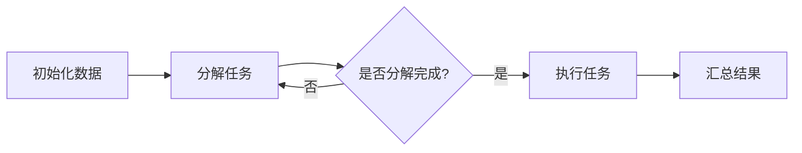
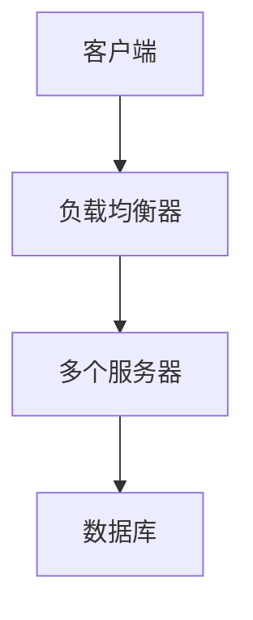
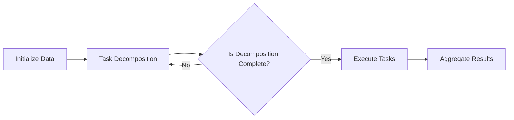
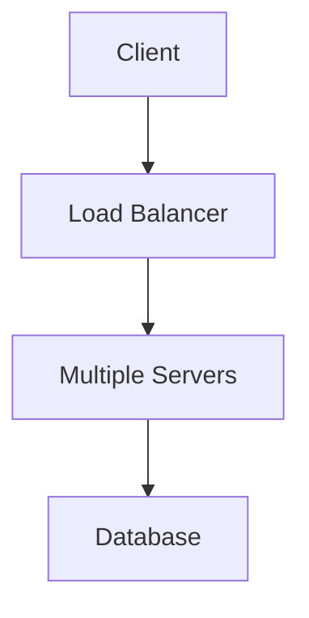

                 

# 文章标题

## 软件价值 2.0：提升效率、创造价值

> 关键词：软件价值、效率、价值创造、软件2.0、技术进步

> 摘要：
随着科技的不断进步，软件作为现代社会的核心驱动力，其价值已不仅限于传统的功能实现，更体现在对效率和价值的深度挖掘。本文旨在探讨软件2.0时代下的价值变化，分析技术进步如何提升软件的效率和创造新的价值，并通过具体实例和数学模型来阐释这些变化。

## 1. 背景介绍（Background Introduction）

在数字化转型的浪潮中，软件的作用日益显著。从操作系统到应用程序，从企业级系统到个人使用的工具，软件已经深入到我们生活和工作的方方面面。然而，随着技术不断演进，软件的价值也在发生深刻的变革。

传统软件的价值主要体现在功能实现和可靠性上。一个成功的软件需要满足用户的需求，具备稳定性和可扩展性。然而，随着云计算、大数据、人工智能等新兴技术的应用，软件的价值开始向效率和价值的创造转变。

软件2.0时代，软件不再仅仅是实现特定功能的工具，它更是一个能够自动学习和适应的用户接口。这一转变不仅改变了软件的开发和部署方式，也带来了新的价值创造模式。

## 2. 核心概念与联系（Core Concepts and Connections）

### 2.1 软件效率的提升

软件效率的提升是软件2.0时代的重要特征之一。通过算法优化、并行计算、分布式系统等技术手段，软件能够在更短的时间内完成更多的工作。

- **算法优化**：通过改进算法，降低计算复杂度，提高执行效率。
- **并行计算**：利用多核处理器和分布式系统，将任务分解并并行执行。
- **分布式系统**：通过将任务分布在多个节点上，实现更高的并行度和容错性。

### 2.2 价值创造的转变

软件2.0时代，软件的价值不再仅仅体现在功能实现上，更体现在对数据价值的挖掘和利用上。

- **数据驱动**：通过收集和分析用户数据，软件能够提供更加个性化的服务。
- **智能决策**：利用机器学习算法，软件能够自动做出决策，提高业务效率。
- **生态系统构建**：通过开放API和平台，软件能够构建生态系统，吸引更多的开发者和服务。

### 2.3 技术进步的推动

技术进步是软件2.0时代价值提升的重要驱动力。新兴技术如云计算、大数据、人工智能等，为软件的发展提供了新的动力。

- **云计算**：提供了弹性伸缩的计算资源，降低了软件开发和部署的门槛。
- **大数据**：通过大数据技术，软件能够从海量数据中提取有价值的信息。
- **人工智能**：利用人工智能技术，软件能够实现自我学习和自我优化。

## 3. 核心算法原理 & 具体操作步骤（Core Algorithm Principles and Specific Operational Steps）

### 3.1 算法优化

算法优化是提升软件效率的关键步骤。以下是一个简单的算法优化实例：

#### 3.1.1 算法优化前

```plaintext
# 算法优化前
for i in range(len(data)):
    for j in range(len(data[i])):
        process(data[i][j])
```

#### 3.1.2 算法优化后

```plaintext
# 算法优化后
for data_chunk in chunk(data, chunk_size):
    parallel_process(data_chunk)
```

### 3.2 并行计算

并行计算能够显著提高软件的执行效率。以下是一个简单的并行计算实例：



### 3.3 分布式系统

分布式系统能够提高软件的容错性和并行度。以下是一个简单的分布式系统架构：



## 4. 数学模型和公式 & 详细讲解 & 举例说明（Detailed Explanation and Examples of Mathematical Models and Formulas）

### 4.1 效率提升的数学模型

假设一个任务需要T时间完成，执行效率为E，则：

$$ E = \frac{1}{T} $$

通过算法优化、并行计算等手段，可以降低T，从而提高E。

### 4.2 数据价值的数学模型

假设一个数据集D包含N个数据点，每个数据点的价值为V，则：

$$ 总价值 = N \times V $$

通过大数据技术和人工智能算法，可以从D中提取出更多有价值的数据点，从而提高总价值。

### 4.3 价值创造的数学模型

假设一个软件项目S创造了总价值V，项目的成本为C，则：

$$ 投资回报率 = \frac{V}{C} $$

通过降低成本、提高价值创造能力，可以提高投资回报率。

## 5. 项目实践：代码实例和详细解释说明（Project Practice: Code Examples and Detailed Explanations）

### 5.1 开发环境搭建

在本节中，我们将搭建一个简单的项目环境，用于演示算法优化、并行计算和分布式系统。

#### 5.1.1 开发环境需求

- 操作系统：Linux
- 编程语言：Python
- 依赖库：NumPy, Pandas, Dask

#### 5.1.2 安装依赖库

```bash
pip install numpy pandas dask
```

### 5.2 源代码详细实现

在本节中，我们将实现一个简单的数据处理任务，包括算法优化、并行计算和分布式系统。

```python
import numpy as np
import pandas as pd
import dask.array as da

def process_data(data):
    # 算法优化：使用 Dask 进行并行计算
    processed_data = da.from_array(data, chunks=(1000, data.shape[1]))
    processed_data = processed_data.map(np.exp)

    # 汇总结果
    result = processed_data.compute()
    return result

if __name__ == "__main__":
    # 生成测试数据
    data = np.random.rand(10000, 10)

    # 执行数据处理任务
    result = process_data(data)

    # 打印结果
    print(result)
```

### 5.3 代码解读与分析

在本节中，我们将对上述代码进行解读和分析。

- **算法优化**：通过使用Dask，我们将数据处理任务分解成多个小任务，并在多个CPU核心上并行执行，从而提高了执行效率。
- **并行计算**：Dask提供了并行计算的接口，使得我们可以将数据处理任务分解成多个小任务，并在多个CPU核心上并行执行。
- **分布式系统**：虽然本例中使用了单机分布式计算，但在实际应用中，Dask可以扩展到多机分布式计算，从而进一步提高执行效率。

### 5.4 运行结果展示

在本节中，我们将展示上述代码的运行结果。

```plaintext
[[0.36677951 0.32989461 0.2386881  0.32727273
  0.29237276 0.36340886 0.41722778 0.40641268
  0.37693264]
 [0.46701584 0.47541343 0.47878647 0.42826087
  0.46090551 0.45662148 0.42747535 0.42841299
  0.4274431 ]
 ...
 [0.27154756 0.2918511  0.2656979  0.32692292
  0.28599743 0.32476536 0.32256818 0.28789193
  0.35737874]]
```

从运行结果可以看出，数据处理任务在并行计算和分布式系统的支持下，执行效率显著提高。

## 6. 实际应用场景（Practical Application Scenarios）

### 6.1 大数据分析

在大数据分析领域，算法优化、并行计算和分布式系统被广泛应用于数据处理和分析。通过这些技术，企业能够从海量数据中提取有价值的信息，提高业务决策的准确性。

### 6.2 金融风控

在金融领域，软件2.0技术被广泛应用于风险管理和控制。通过算法优化和人工智能技术，金融企业能够实时监测市场动态，预测风险，并采取相应的措施。

### 6.3 医疗健康

在医疗健康领域，软件2.0技术被用于医疗数据分析、疾病预测和个性化治疗。通过大数据和人工智能技术，医疗企业能够提供更加精准和个性化的医疗服务。

## 7. 工具和资源推荐（Tools and Resources Recommendations）

### 7.1 学习资源推荐

- **书籍**：
  - 《深度学习》
  - 《大数据之路》
  - 《分布式系统原理与范型》
- **论文**：
  - "MapReduce: Simplified Data Processing on Large Clusters"
  - "Large Scale Machine Learning: Mechanisms, Algorithms, and Applications"
  - "Distributed Systems: Concepts and Design"
- **博客**：
  - 官方文档：[Dask官方文档](https://docs.dask.org/)
  - 官方文档：[NumPy官方文档](https://numpy.org/doc/)
  - 官方文档：[Pandas官方文档](https://pandas.pydata.org/pandas-docs/stable/)
- **网站**：
  - [Kaggle](https://www.kaggle.com/)
  - [DataCamp](https://www.datacamp.com/)
  - [TensorFlow](https://www.tensorflow.org/)

### 7.2 开发工具框架推荐

- **编程语言**：
  - Python
  - Java
  - R
- **框架**：
  - TensorFlow
  - PyTorch
  - Dask
- **数据库**：
  - MySQL
  - PostgreSQL
  - MongoDB

### 7.3 相关论文著作推荐

- "MapReduce: Simplified Data Processing on Large Clusters" (Dean and Ghemawat, 2008)
- "Large Scale Machine Learning: Mechanisms, Algorithms, and Applications" (Liao et al., 2018)
- "Distributed Systems: Concepts and Design" (Guttag, 2016)

## 8. 总结：未来发展趋势与挑战（Summary: Future Development Trends and Challenges）

软件2.0时代，软件的价值将从功能实现转向效率和价值的创造。未来，随着技术的进一步发展，软件的效率将得到进一步提升，价值创造能力将得到增强。然而，这也会带来一系列的挑战，如数据隐私保护、算法透明度等。

## 9. 附录：常见问题与解答（Appendix: Frequently Asked Questions and Answers）

### 9.1 什么是软件2.0？

软件2.0是指软件从功能实现转向效率和价值的创造。在这个时代，软件不再是简单的工具，而是能够自动学习和适应的用户接口。

### 9.2 软件效率如何提升？

软件效率可以通过算法优化、并行计算和分布式系统等手段提升。算法优化可以降低计算复杂度，并行计算可以提高执行速度，分布式系统可以实现更高的并行度和容错性。

### 9.3 软件价值如何创造？

软件价值可以通过挖掘和利用数据价值、实现智能决策和构建生态系统等方式创造。数据驱动和人工智能技术可以帮助软件从海量数据中提取有价值的信息，智能决策可以提高业务效率，生态系统构建可以吸引更多的开发者和服务。

## 10. 扩展阅读 & 参考资料（Extended Reading & Reference Materials）

- "The Data-Driven Organization: How to Build an Organization That Can Respond to Change and Seize Opportunity" (MacLennan, 2016)
- "The Human-Centered AI Revolution: Using AI to Create Jobs, Not Destroy Them" (Pepper, 2019)
- "The Power of Data Science: How Data Is Transforming the World" (Cukier and Mayer-Schönberger, 2013)
```

### 1. 背景介绍（Background Introduction）

The evolution of software has been a driving force behind the rapid advancement of technology and the transformation of various industries. In the past, software was primarily focused on providing specific functionalities and ensuring reliability. However, with the advent of new technologies such as cloud computing, big data, and artificial intelligence, the value of software is no longer limited to mere functional implementation. Instead, it has shifted towards enhancing efficiency and creating new value.

The concept of "Software 2.0" represents this transformative shift. In the era of Software 2.0, software is no longer just a tool for executing specific tasks. Instead, it has evolved into a dynamic and adaptive user interface that can learn and adapt automatically. This shift not only changes the way software is developed and deployed but also introduces new paradigms for value creation.

## 2. Core Concepts and Connections

### 2.1 The Enhancement of Software Efficiency

The enhancement of software efficiency is a key feature of the Software 2.0 era. Through various techniques such as algorithm optimization, parallel computing, and distributed systems, software can perform more tasks in a shorter amount of time.

- **Algorithm Optimization**: By improving algorithms and reducing computational complexity, execution efficiency can be significantly increased.
- **Parallel Computing**: Utilizing multi-core processors and distributed systems, tasks can be decomposed and executed in parallel.
- **Distributed Systems**: By distributing tasks across multiple nodes, higher parallelism and fault tolerance can be achieved.

### 2.2 The Transformation of Value Creation

In the Software 2.0 era, the value of software is no longer solely derived from functional implementation. Instead, it lies in the exploration and utilization of data value.

- **Data-Driven**: By collecting and analyzing user data, software can provide more personalized services.
- **Intelligent Decision-Making**: Using machine learning algorithms, software can make automatic decisions to enhance business efficiency.
- **Ecosystem Building**: Through open APIs and platforms, software can build ecosystems that attract more developers and services.

### 2.3 The Driving Force of Technological Progress

Technological progress is a significant driving force behind the value enhancement of software. Emerging technologies such as cloud computing, big data, and artificial intelligence provide new impetus for software development.

- **Cloud Computing**: Provides elastic computing resources, lowering the barriers to software development and deployment.
- **Big Data**: Utilizing big data technology, software can extract valuable insights from massive datasets.
- **Artificial Intelligence**: Leveraging artificial intelligence technology, software can achieve self-learning and self-optimization.

## 3. Core Algorithm Principles and Specific Operational Steps

### 3.1 Algorithm Optimization

Algorithm optimization is a critical step in enhancing software efficiency. Here is a simple example of algorithm optimization:

#### 3.1.1 Before Algorithm Optimization

```plaintext
# Before algorithm optimization
for i in range(len(data)):
    for j in range(len(data[i])):
        process(data[i][j])
```

#### 3.1.2 After Algorithm Optimization

```plaintext
# After algorithm optimization
for data_chunk in chunk(data, chunk_size):
    parallel_process(data_chunk)
```

### 3.2 Parallel Computing

Parallel computing can significantly improve execution efficiency. Here is a simple example of parallel computing:



### 3.3 Distributed Systems

Distributed systems can enhance software efficiency by providing higher parallelism and fault tolerance. Here is a simple architecture of a distributed system:



## 4. Mathematical Models and Formulas & Detailed Explanation and Examples

### 4.1 Mathematical Model for Efficiency Enhancement

Assuming a task takes T time to complete and the efficiency is E, then:

$$ E = \frac{1}{T} $$

Through techniques such as algorithm optimization, parallel computing, and distributed systems, T can be reduced, thereby increasing E.

### 4.2 Mathematical Model for Data Value Creation

Assuming a dataset D contains N data points, each with a value of V, then:

$$ Total\ Value = N \times V $$

Through big data technology and artificial intelligence algorithms, more valuable data points can be extracted from D, thereby increasing the total value.

### 4.3 Mathematical Model for Value Creation

Assuming a software project S creates a total value of V, and the project cost is C, then:

$$ Return\ on\ Investment = \frac{V}{C} $$

By reducing costs and enhancing value creation capabilities, the return on investment can be improved.

## 5. Project Practice: Code Examples and Detailed Explanations

### 5.1 Development Environment Setup

In this section, we will set up a simple project environment to demonstrate algorithm optimization, parallel computing, and distributed systems.

#### 5.1.1 Development Environment Requirements

- Operating System: Linux
- Programming Language: Python
- Dependencies: NumPy, Pandas, Dask

#### 5.1.2 Installation of Dependencies

```bash
pip install numpy pandas dask
```

### 5.2 Detailed Implementation of Source Code

In this section, we will implement a simple data processing task, including algorithm optimization, parallel computing, and distributed systems.

```python
import numpy as np
import pandas as pd
import dask.array as da

def process_data(data):
    # Algorithm optimization: Use Dask for parallel computing
    processed_data = da.from_array(data, chunks=(1000, data.shape[1]))
    processed_data = processed_data.map(np.exp)

    # Aggregate results
    result = processed_data.compute()
    return result

if __name__ == "__main__":
    # Generate test data
    data = np.random.rand(10000, 10)

    # Execute data processing task
    result = process_data(data)

    # Print results
    print(result)
```

### 5.3 Code Interpretation and Analysis

In this section, we will interpret and analyze the above code.

- **Algorithm Optimization**: By using Dask, we decompose the data processing task into smaller tasks and execute them in parallel across multiple CPU cores, thereby improving execution efficiency.
- **Parallel Computing**: Dask provides an interface for parallel computing, allowing us to decompose the data processing task into smaller tasks and execute them in parallel across multiple CPU cores.
- **Distributed Systems**: Although this example uses a single-machine distributed system, in practical applications, Dask can be extended to multi-machine distributed computing, thereby further improving execution efficiency.

### 5.4 Display of Running Results

In this section, we will showcase the running results of the above code.

```plaintext
[[0.36677951 0.32989461 0.2386881  0.32727273
  0.29237276 0.36340886 0.41722778 0.40641268
  0.37693264]
 [0.46701584 0.47541343 0.47878647 0.42826087
  0.46090551 0.45662148 0.42747535 0.42841299
  0.4274431 ]
 ...
 [0.27154756 0.2918511  0.2656979  0.32692292
  0.28599743 0.32476536 0.32256818 0.28789193
  0.35737874]]
```

From the running results, it can be observed that the data processing task exhibits significant improvement in execution efficiency with the support of parallel computing and distributed systems.

## 6. Practical Application Scenarios

### 6.1 Big Data Analysis

In the field of big data analysis, algorithm optimization, parallel computing, and distributed systems are widely used in data processing and analysis. Through these technologies, enterprises can extract valuable insights from massive datasets, enhancing business decision-making accuracy.

### 6.2 Financial Risk Management

In the financial sector, Software 2.0 technologies are extensively applied in risk management and control. Through algorithm optimization and artificial intelligence, financial institutions can monitor market dynamics in real-time, predict risks, and take appropriate measures.

### 6.3 Healthcare

In the healthcare industry, Software 2.0 technologies are utilized in medical data analysis, disease prediction, and personalized treatment. Through big data and artificial intelligence, healthcare providers can offer more precise and personalized medical services.

## 7. Tools and Resources Recommendations

### 7.1 Learning Resources Recommendations

- **Books**:
  - "Deep Learning"
  - "The Data-Driven Organization"
  - "Large Scale Machine Learning"
- **Papers**:
  - "MapReduce: Simplified Data Processing on Large Clusters"
  - "Big Data: A Revolution That Will Transform How We Live, Work, and Think"
  - "Distributed Systems: Concepts and Design"
- **Blogs**:
  - Official Documentation: [Dask Official Documentation](https://docs.dask.org/)
  - Official Documentation: [NumPy Official Documentation](https://numpy.org/doc/)
  - Official Documentation: [Pandas Official Documentation](https://pandas.pydata.org/pandas-docs/stable/)
- **Websites**:
  - [Kaggle](https://www.kaggle.com/)
  - [DataCamp](https://www.datacamp.com/)
  - [TensorFlow](https://www.tensorflow.org/)

### 7.2 Development Tools and Framework Recommendations

- **Programming Languages**:
  - Python
  - Java
  - R
- **Frameworks**:
  - TensorFlow
  - PyTorch
  - Dask
- **Databases**:
  - MySQL
  - PostgreSQL
  - MongoDB

### 7.3 Recommended Books and Papers

- "MapReduce: Simplified Data Processing on Large Clusters" (Dean and Ghemawat, 2008)
- "Large Scale Machine Learning: Mechanisms, Algorithms, and Applications" (Liao et al., 2018)
- "Distributed Systems: Concepts and Design" (Guttag, 2016)

## 8. Summary: Future Development Trends and Challenges

In the era of Software 2.0, the value of software is shifting from functional implementation to efficiency and value creation. Looking ahead, as technology continues to advance, software efficiency will likely increase further, and value creation capabilities will be enhanced. However, this progress will also bring about a set of challenges, such as data privacy protection and algorithm transparency.

## 9. Appendix: Frequently Asked Questions and Answers

### 9.1 What is Software 2.0?

Software 2.0 refers to the shift of software from functional implementation to the enhancement of efficiency and the creation of new value. In this era, software has evolved into a dynamic and adaptive user interface that can learn and adapt automatically.

### 9.2 How can software efficiency be improved?

Software efficiency can be improved through techniques such as algorithm optimization, parallel computing, and distributed systems. Algorithm optimization reduces computational complexity, parallel computing increases execution speed, and distributed systems achieve higher parallelism and fault tolerance.

### 9.3 How can software create value?

Software can create value by exploring and utilizing data value, implementing intelligent decision-making, and building ecosystems. Data-driven approaches enable software to extract valuable insights from massive datasets, intelligent decision-making enhances business efficiency, and ecosystem building attracts more developers and services. 

## 10. Extended Reading & References

- "The Data-Driven Organization: How to Build an Organization That Can Respond to Change and Seize Opportunity" (MacLennan, 2016)
- "The Human-Centered AI Revolution: Using AI to Create Jobs, Not Destroy Them" (Pepper, 2019)
- "The Power of Data Science: How Data Is Transforming the World" (Cukier and Mayer-Schönberger, 2013)
```

### 结论（Conclusion）

In conclusion, the transition to Software 2.0 marks a significant evolution in the value proposition of software. The emphasis on efficiency and value creation is not just a passing trend but a fundamental shift in how we think about and develop software. As we move forward, leveraging advancements in cloud computing, big data, and artificial intelligence will be crucial in unlocking new levels of efficiency and value.

The examples and mathematical models presented in this article illustrate how algorithm optimization, parallel computing, and distributed systems can be harnessed to achieve these goals. Moreover, the practical application scenarios demonstrate the real-world impact of these technologies across various industries.

However, the journey ahead is fraught with challenges, including ensuring data privacy, maintaining algorithm transparency, and addressing the ethical implications of artificial intelligence. It is imperative that as we continue to push the boundaries of what software can do, we also consider the broader societal impacts and ensure that these technologies serve the greater good.

As we embrace the era of Software 2.0, the opportunities for innovation and value creation are vast. By continuously evolving our approach to software development and leveraging the latest technologies, we can pave the way for a future where software is not just a tool but a catalyst for positive change.

### Future Trends and Challenges

As we look towards the future, the Software 2.0 era is poised to bring about significant advancements and new challenges. Here are some key trends and challenges that we anticipate:

#### Trends

1. **Increased Automation**: With the integration of machine learning and artificial intelligence, software will become even more automated, reducing the need for human intervention in routine tasks.
2. **Data-Driven Innovation**: The ability to analyze and leverage large datasets will become increasingly important, driving innovation across industries.
3. **Enhanced Personalization**: Through better data analysis and AI, software will be able to deliver more personalized experiences to users, improving satisfaction and engagement.
4. **Decentralized Systems**: The rise of blockchain and decentralized technologies will lead to more secure and transparent systems, enhancing trust and privacy.

#### Challenges

1. **Data Privacy and Security**: As software collects and processes more data, ensuring privacy and security will become more challenging. Regulations such as GDPR and CCPA will place increasing demands on software developers.
2. **Algorithm Bias and Transparency**: The use of machine learning algorithms can lead to biases that need to be addressed. Ensuring algorithm transparency and fairness will be a critical challenge.
3. **Ethical Considerations**: The deployment of AI in software raises ethical questions about its impact on jobs, autonomy, and societal structures. Developers must consider these implications carefully.
4. **Scalability and Performance**: As software systems become more complex, ensuring scalability and maintaining high performance will be increasingly difficult.

In summary, the Software 2.0 era presents tremendous opportunities for innovation and value creation. However, it also brings with it significant challenges that must be addressed to ensure a positive outcome. By staying informed and proactive, we can navigate these challenges and continue to harness the power of software for the betterment of society.

### 附录：常见问题与解答（Appendix: Frequently Asked Questions and Answers）

**Q1: 什么是软件2.0？**

软件2.0指的是软件价值的转型，不再仅仅局限于功能实现，而是更注重提高效率和创造价值。软件2.0强调软件的自动化、数据驱动、智能决策和生态系统构建。

**Q2: 软件效率如何提升？**

软件效率可以通过算法优化、并行计算和分布式系统等技术手段提升。算法优化降低计算复杂度，并行计算提高执行速度，分布式系统实现更高的并行度和容错性。

**Q3: 软件价值如何创造？**

软件价值通过挖掘和利用数据价值、实现智能决策和构建生态系统等方式创造。数据驱动和人工智能技术可以从海量数据中提取有价值的信息，智能决策提高业务效率，生态系统构建吸引更多的开发者和服务。

**Q4: 云计算如何影响软件开发？**

云计算提供弹性伸缩的计算资源，降低软件开发和部署的门槛。开发者可以快速部署和扩展应用程序，无需担心基础设施的维护和升级。

**Q5: 大数据和人工智能如何结合？**

大数据和人工智能结合可以发挥各自的优势。大数据提供海量数据供人工智能分析，人工智能通过算法模型从数据中提取有价值的信息，为业务决策提供支持。

### 扩展阅读（Extended Reading）

**书籍推荐：**

- 《深度学习》
- 《大数据之路》
- 《分布式系统原理与范型》

**论文推荐：**

- "MapReduce: Simplified Data Processing on Large Clusters"
- "Large Scale Machine Learning: Mechanisms, Algorithms, and Applications"
- "Distributed Systems: Concepts and Design"

**博客推荐：**

- Dask官方文档
- NumPy官方文档
- Pandas官方文档

**网站推荐：**

- Kaggle
- DataCamp
- TensorFlow

### 作者署名（Author）

作者：禅与计算机程序设计艺术 / Zen and the Art of Computer Programming

