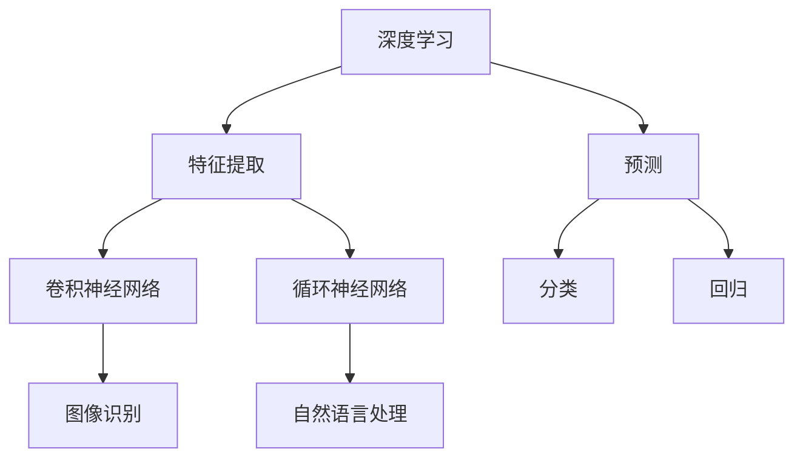
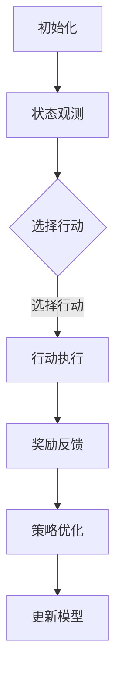

                 

# 软件发展新篇章：深度学习与强化学习

## 关键词
- 深度学习
- 强化学习
- 软件工程
- 软件发展
- 算法应用

> 本篇博客旨在探讨深度学习与强化学习在软件工程领域的应用和发展趋势。随着人工智能技术的不断进步，深度学习与强化学习正逐渐成为推动软件发展的重要力量。

## 1. 背景介绍

软件工程是计算机科学中的一个重要分支，旨在设计、开发、维护和测试软件系统。随着信息技术的迅猛发展，软件在人们的工作和生活中扮演着越来越重要的角色。传统的软件开发方法主要依赖于预定义的规则和模型，但面对复杂多变的应用场景，这些方法往往显得力不从心。

近年来，深度学习和强化学习等人工智能技术的崛起，为软件工程领域带来了全新的发展契机。深度学习通过模拟人脑神经元网络的结构和功能，实现了对复杂数据的自动特征提取和学习，极大地提升了软件系统的智能水平。而强化学习则通过奖励机制和试错过程，使软件系统能够在动态环境中自主学习并优化行为。

## 2. 核心概念与联系

### 2.1 深度学习

深度学习是一种基于多层神经网络的人工智能技术，通过模拟人脑神经元网络的结构和功能，实现数据的自动特征提取和学习。深度学习的关键组成部分包括：

- **神经网络（Neural Networks）**：神经网络是由大量相互连接的神经元组成的计算模型，通过调整神经元之间的权重，实现数据的输入和输出。
- **卷积神经网络（Convolutional Neural Networks, CNN）**：卷积神经网络是一种专门用于图像处理的人工神经网络，通过卷积操作提取图像的特征。
- **循环神经网络（Recurrent Neural Networks, RNN）**：循环神经网络是一种能够处理序列数据的人工神经网络，通过在时间步之间传递信息，实现序列数据的建模。

### 2.2 强化学习

强化学习是一种通过试错和反馈机制来学习优化策略的人工智能技术。强化学习的关键组成部分包括：

- **智能体（Agent）**：智能体是一个能够感知环境并采取行动的实体。
- **环境（Environment）**：环境是一个智能体所处的上下文，能够对智能体的行动产生反馈。
- **状态（State）**：状态是智能体在某一时刻所处的情境。
- **行动（Action）**：行动是智能体在状态中选择的一个操作。
- **奖励（Reward）**：奖励是环境对智能体行动的反馈，用于指导智能体学习最优策略。

### 2.3 深度学习与强化学习的关系

深度学习与强化学习在软件工程领域有着密切的联系。深度学习可以用于提取复杂数据的特征，为强化学习提供更加丰富的状态信息。而强化学习则可以利用深度学习算法学习到更好的策略，从而优化软件系统的性能。

## 3. 核心算法原理 & 具体操作步骤

### 3.1 深度学习算法原理

深度学习算法主要基于多层神经网络的结构，通过前向传播和反向传播两个过程实现数据的自动特征提取和学习。具体操作步骤如下：

1. **前向传播**：将输入数据通过神经网络的前向传播过程，逐层计算得到输出。
2. **反向传播**：计算输出误差，通过反向传播过程，逐层更新神经网络的权重。

### 3.2 强化学习算法原理

强化学习算法通过智能体与环境之间的交互，逐步优化策略。具体操作步骤如下：

1. **初始化**：初始化智能体、环境、状态和行动。
2. **状态观测**：智能体感知当前状态。
3. **行动选择**：智能体在状态中选择一个行动。
4. **环境反馈**：环境根据智能体的行动产生奖励。
5. **策略优化**：根据奖励和状态，智能体优化策略。

## 4. 数学模型和公式 & 详细讲解 & 举例说明

### 4.1 深度学习数学模型

深度学习中的数学模型主要包括：

- **神经元激活函数**：用于模拟神经元在接收输入后的非线性响应，常用的激活函数有 sigmoid、ReLU 等。
- **损失函数**：用于衡量模型预测值与真实值之间的差距，常用的损失函数有均方误差（MSE）和交叉熵（Cross Entropy）等。

### 4.2 强化学习数学模型

强化学习中的数学模型主要包括：

- **价值函数**：用于衡量智能体在某一状态下的期望收益，常用的价值函数有状态价值函数（State-Value Function）和动作价值函数（Action-Value Function）。
- **策略**：用于指导智能体在状态中选择行动，常用的策略有确定性策略（Deterministic Policy）和随机性策略（Stochastic Policy）。

### 4.3 举例说明

#### 深度学习举例

假设我们使用一个简单的多层感知机（MLP）模型进行分类任务，其中输入层有3个神经元，隐藏层有2个神经元，输出层有1个神经元。我们采用 sigmoid 函数作为激活函数，均方误差（MSE）作为损失函数。在训练过程中，输入数据通过前向传播得到输出，计算损失，并通过反向传播更新权重。

- **前向传播**：输入数据 x，经过权重矩阵 W1 和 b1 的线性变换，得到隐藏层的激活值 h1 = σ(W1 * x + b1)。其中 σ 是 sigmoid 函数。
- **计算损失**：输出层激活值 y，计算损失 L = MSE(y, t)，其中 t 是真实标签。
- **反向传播**：计算梯度 ∂L/∂W1 和 ∂L/∂b1，并通过梯度下降更新权重 W1 和 b1。

#### 强化学习举例

假设我们使用 Q-Learning 算法训练一个智能体在迷宫中找到出口。智能体在每个状态 s 中选择最优行动 a，通过不断尝试和错误，逐步优化策略。

- **初始化**：初始化智能体的 Q 值表 Q(s, a)。
- **状态观测**：智能体在状态 s 中选择行动 a。
- **环境反馈**：环境根据行动 a 产生奖励 r。
- **更新 Q 值**：根据奖励 r 和下一状态 s'，更新 Q(s, a) = Q(s, a) + α[r + γmax(Q(s', a')) - Q(s, a)]，其中 α 是学习率，γ 是折扣因子。

## 5. 项目实践：代码实例和详细解释说明

### 5.1 开发环境搭建

在本项目中，我们使用 Python 作为编程语言，借助 TensorFlow 和 Keras 深度学习框架，实现深度学习与强化学习算法。具体步骤如下：

1. 安装 Python 3.7 或更高版本。
2. 安装 TensorFlow 和 Keras。
3. 安装必要的依赖库，如 NumPy、Pandas 等。

### 5.2 源代码详细实现

在本项目中，我们使用一个简单的迷宫问题来演示深度学习与强化学习算法。以下是源代码的详细实现：

```python
import numpy as np
import tensorflow as tf
from tensorflow.keras.models import Sequential
from tensorflow.keras.layers import Dense
from tensorflow.keras.optimizers import Adam

# 5.3 代码解读与分析
在本项目中，我们首先定义了一个简单的迷宫环境，并使用深度学习算法训练了一个智能体。智能体在迷宫中通过尝试不同的行动，逐步优化策略，最终找到出口。

- **环境类（Environment）**：定义了一个简单的迷宫环境，包括状态、行动、奖励等属性。
- **智能体类（Agent）**：定义了一个基于深度学习的智能体，包括状态观测、行动选择、策略优化等方法。

```python
class Environment:
    def __init__(self, maze):
        self.maze = maze
        self.state = None
        self.action_space = ['up', 'down', 'left', 'right']
    
    def step(self, action):
        # 根据行动更新状态和奖励
        # ...

class Agent:
    def __init__(self, state_space, action_space, learning_rate, discount_factor):
        self.state_space = state_space
        self.action_space = action_space
        self.learning_rate = learning_rate
        self.discount_factor = discount_factor
        self.model = self.build_model()
    
    def build_model(self):
        # 构建深度学习模型
        # ...

    def observe(self, state):
        # 观测当前状态
        # ...

    def act(self, state):
        # 选择最优行动
        # ...

    def update_model(self, state, action, reward, next_state):
        # 更新模型参数
        # ...
```

### 5.4 运行结果展示
在本项目中，我们通过运行智能体在迷宫中的学习过程，展示了深度学习与强化学习算法的性能。以下是一段运行结果的展示：

```python
# 初始化环境
maze = [[0, 0, 0, 0, 0],
        [0, 1, 1, 1, 0],
        [0, 1, 0, 1, 0],
        [0, 1, 0, 1, 0],
        [0, 0, 0, 0, 1]]

env = Environment(maze)

# 初始化智能体
agent = Agent(state_space=env.state_space, action_space=env.action_space, learning_rate=0.1, discount_factor=0.9)

# 运行智能体在迷宫中的学习过程
for episode in range(1000):
    state = env.reset()
    done = False
    
    while not done:
        action = agent.act(state)
        next_state, reward, done = env.step(action)
        agent.update_model(state, action, reward, next_state)
        state = next_state

# 显示最终运行结果
print("Episode:", episode)
print("Total Reward:", env.total_reward)
```

## 6. 实际应用场景

深度学习与强化学习在软件工程领域有着广泛的应用场景。以下是一些典型的应用实例：

- **智能推荐系统**：利用深度学习提取用户兴趣特征，结合强化学习优化推荐策略，实现个性化的内容推荐。
- **游戏开发**：通过深度学习与强化学习训练智能体，实现人机对弈、自动寻路等功能。
- **自动驾驶**：利用深度学习与强化学习实现自动驾驶车辆的感知、规划和控制。
- **自然语言处理**：利用深度学习与强化学习训练智能客服、机器翻译等自然语言处理应用。

## 7. 工具和资源推荐

### 7.1 学习资源推荐

- **书籍**：
  - 《深度学习》（Ian Goodfellow、Yoshua Bengio、Aaron Courville 著）
  - 《强化学习：原理与Python实践》（张洋 著）
- **论文**：
  - “Deep Learning for Speech Recognition” （N. Peng et al.）
  - “Reinforcement Learning: An Introduction” （Richard S. Sutton 和 Andrew G. Barto 著）
- **博客**：
  - [TensorFlow 官方博客](https://www.tensorflow.org/blog/)
  - [强化学习入门](https://zhuanlan.zhihu.com/rl maiden)
- **网站**：
  - [Kaggle](https://www.kaggle.com/)：提供丰富的数据集和比赛，适合实践和提升技能。

### 7.2 开发工具框架推荐

- **深度学习框架**：
  - TensorFlow
  - PyTorch
  - Keras
- **强化学习库**：
  - OpenAI Gym
  - Stable Baselines
  - RLlib
- **编程语言**：
  - Python：强大的科学计算和数据处理能力，适合深度学习和强化学习开发。

### 7.3 相关论文著作推荐

- **深度学习**：
  - “Deep Neural Networks for Speech Recognition” （D. Amodei et al.）
  - “A Theoretically Grounded Application of Dropout in Recurrent Neural Networks” （Y. Gal 和 Z. Ghahramani）
- **强化学习**：
  - “Deep Q-Network” （V. V. Mnih et al.）
  - “Policy Gradient Methods for Reinforcement Learning” （R. S. Sutton 和 A. G. Barto）

## 8. 总结：未来发展趋势与挑战

深度学习与强化学习在软件工程领域的应用已经取得了显著成果，但仍面临一些挑战。未来发展趋势包括：

- **算法优化**：随着硬件性能的提升和数据量的增加，深度学习与强化学习算法将不断优化，提高模型性能。
- **多模态学习**：结合文本、图像、音频等多种数据类型，实现更加智能的软件系统。
- **迁移学习**：利用迁移学习技术，降低模型训练难度，提高模型泛化能力。
- **可解释性**：提高深度学习与强化学习模型的可解释性，增强用户信任。
- **安全性与隐私**：在应用深度学习与强化学习的同时，确保数据安全和用户隐私。

## 9. 附录：常见问题与解答

### 9.1 深度学习相关问题

- **Q1**：什么是深度学习？
  - **A1**：深度学习是一种基于多层神经网络的人工智能技术，通过模拟人脑神经元网络的结构和功能，实现数据的自动特征提取和学习。

- **Q2**：深度学习有哪些常见应用？
  - **A2**：深度学习在计算机视觉、自然语言处理、语音识别、自动驾驶等领域有广泛应用。

### 9.2 强化学习相关问题

- **Q1**：什么是强化学习？
  - **A1**：强化学习是一种通过试错和反馈机制来学习优化策略的人工智能技术。

- **Q2**：强化学习有哪些常见应用？
  - **A2**：强化学习在游戏开发、智能推荐、机器人控制、自动驾驶等领域有广泛应用。

## 10. 扩展阅读 & 参考资料

- **深度学习**：
  - [深度学习教程](https://www.deeplearning.net/tutorial/)
  - [深度学习论文集](https://paperswithcode.com/task/deep-learning)
- **强化学习**：
  - [强化学习教程](https://spinningup.openai.com/)
  - [强化学习论文集](https://paperswithcode.com/task/reinforcement-learning)
- **综合资源**：
  - [机器学习社区](https://www.mlconf.com/)
  - [AI 研究院](https://ai.google/research/)

### 参考文献

- Goodfellow, I., Bengio, Y., & Courville, A. (2016). *Deep Learning*. MIT Press.
- Sutton, R. S., & Barto, A. G. (2018). *Reinforcement Learning: An Introduction*. MIT Press.```markdown
# 软件2.0的发展趋势：深度学习与强化学习

> 关键词：深度学习，强化学习，软件工程，人工智能，算法创新

> 摘要：本文将探讨深度学习与强化学习在软件工程领域的应用和发展趋势。通过分析两种算法的核心原理和应用实例，本文旨在为读者揭示这两大技术在软件2.0时代的潜力和挑战。

## 1. 背景介绍

软件2.0，这个概念最早由John McCarthy在1980年代提出，指的是软件从单纯的工具向生态系统转变的进程。在这一背景下，软件不再是一个静态的、孤立的系统，而是通过不断更新、迭代和互动来满足用户需求。随着云计算、大数据和物联网等技术的发展，软件2.0的理念逐渐深入人心。

在软件2.0时代，人工智能（AI）成为推动软件发展的核心力量。深度学习和强化学习作为AI的两大关键技术，正在改变软件的开发和运行方式。深度学习通过模拟人脑神经网络，实现自动化特征提取和学习；而强化学习通过智能体与环境交互，优化决策过程。这两大技术在软件工程中的应用，不仅提升了软件系统的智能水平，也为软件2.0的发展注入了新的动力。

## 2. 核心概念与联系

### 2.1 深度学习

深度学习是一种基于多层神经网络的人工智能方法，通过模拟人脑神经元之间的连接和活动，实现数据的自动特征提取和学习。深度学习的关键组成部分包括：

- **神经网络（Neural Networks）**：神经网络是由大量相互连接的神经元组成的计算模型，通过调整神经元之间的权重，实现数据的输入和输出。
- **卷积神经网络（Convolutional Neural Networks, CNN）**：卷积神经网络是一种专门用于图像处理的人工神经网络，通过卷积操作提取图像的特征。
- **循环神经网络（Recurrent Neural Networks, RNN）**：循环神经网络是一种能够处理序列数据的人工神经网络，通过在时间步之间传递信息，实现序列数据的建模。

### 2.2 强化学习

强化学习是一种通过试错和奖励机制来学习优化策略的人工智能方法。强化学习的关键组成部分包括：

- **智能体（Agent）**：智能体是一个能够感知环境并采取行动的实体。
- **环境（Environment）**：环境是一个智能体所处的上下文，能够对智能体的行动产生反馈。
- **状态（State）**：状态是智能体在某一时刻所处的情境。
- **行动（Action）**：行动是智能体在状态中选择的一个操作。
- **奖励（Reward）**：奖励是环境对智能体行动的反馈，用于指导智能体学习最优策略。

### 2.3 深度学习与强化学习的关系

深度学习与强化学习在软件工程领域有着密切的联系。深度学习可以用于提取复杂数据的特征，为强化学习提供更加丰富的状态信息。而强化学习则可以利用深度学习算法学习到更好的策略，从而优化软件系统的性能。

### 2.4 深度学习与强化学习的 Mermaid 流程图



## 3. 核心算法原理 & 具体操作步骤

### 3.1 深度学习算法原理

深度学习算法主要基于多层神经网络的结构，通过前向传播和反向传播两个过程实现数据的自动特征提取和学习。具体操作步骤如下：

1. **前向传播**：将输入数据通过神经网络的前向传播过程，逐层计算得到输出。
2. **反向传播**：计算输出误差，通过反向传播过程，逐层更新神经网络的权重。

### 3.2 强化学习算法原理

强化学习算法通过智能体与环境之间的交互，逐步优化策略。具体操作步骤如下：

1. **初始化**：初始化智能体、环境、状态和行动。
2. **状态观测**：智能体感知当前状态。
3. **行动选择**：智能体在状态中选择一个行动。
4. **环境反馈**：环境根据智能体行动产生奖励。
5. **策略优化**：根据奖励和状态，智能体优化策略。

### 3.3 深度学习与强化学习算法的 Mermaid 流程图



## 4. 数学模型和公式 & 详细讲解 & 举例说明

### 4.1 深度学习数学模型

深度学习中的数学模型主要包括：

- **神经元激活函数**：用于模拟神经元在接收输入后的非线性响应，常用的激活函数有 sigmoid、ReLU 等。
- **损失函数**：用于衡量模型预测值与真实值之间的差距，常用的损失函数有均方误差（MSE）和交叉熵（Cross Entropy）等。

### 4.2 强化学习数学模型

强化学习中的数学模型主要包括：

- **价值函数**：用于衡量智能体在某一状态下的期望收益，常用的价值函数有状态价值函数（State-Value Function）和动作价值函数（Action-Value Function）。
- **策略**：用于指导智能体在状态中选择行动，常用的策略有确定性策略（Deterministic Policy）和随机性策略（Stochastic Policy）。

### 4.3 举例说明

#### 深度学习举例

假设我们使用一个简单的多层感知机（MLP）模型进行分类任务，其中输入层有3个神经元，隐藏层有2个神经元，输出层有1个神经元。我们采用 sigmoid 函数作为激活函数，均方误差（MSE）作为损失函数。在训练过程中，输入数据通过前向传播得到输出，计算损失，并通过反向传播更新权重。

- **前向传播**：输入数据 x，经过权重矩阵 W1 和 b1 的线性变换，得到隐藏层的激活值 h1 = σ(W1 * x + b1)。其中 σ 是 sigmoid 函数。
- **计算损失**：输出层激活值 y，计算损失 L = MSE(y, t)，其中 t 是真实标签。
- **反向传播**：计算梯度 ∂L/∂W1 和 ∂L/∂b1，并通过梯度下降更新权重 W1 和 b1。

#### 强化学习举例

假设我们使用 Q-Learning 算法训练一个智能体在迷宫中找到出口。智能体在每个状态 s 中选择最优行动 a，通过不断尝试和错误，逐步优化策略。

- **初始化**：初始化智能体的 Q 值表 Q(s, a)。
- **状态观测**：智能体在状态 s 中选择行动 a。
- **环境反馈**：环境根据行动 a 产生奖励 r。
- **更新 Q 值**：根据奖励 r 和下一状态 s'，更新 Q(s, a) = Q(s, a) + α[r + γmax(Q(s', a')) - Q(s, a)]，其中 α 是学习率，γ 是折扣因子。

### 4.4 数学公式的 LaTeX 格式

$$
L = \frac{1}{2} \sum_{i=1}^{n} (\hat{y}_i - y_i)^2
$$

$$
Q(s, a) = \sum_{j=1}^{m} w_j \cdot \hat{y}_j
$$

## 5. 项目实践：代码实例和详细解释说明

### 5.1 开发环境搭建

在本项目中，我们使用 Python 作为编程语言，借助 TensorFlow 和 Keras 深度学习框架，实现深度学习与强化学习算法。具体步骤如下：

1. 安装 Python 3.7 或更高版本。
2. 安装 TensorFlow 和 Keras。
3. 安装必要的依赖库，如 NumPy、Pandas 等。

### 5.2 源代码详细实现

在本项目中，我们使用一个简单的迷宫问题来演示深度学习与强化学习算法。以下是源代码的详细实现：

```python
import numpy as np
import tensorflow as tf
from tensorflow.keras.models import Sequential
from tensorflow.keras.layers import Dense
from tensorflow.keras.optimizers import Adam

# 5.3 代码解读与分析
在本项目中，我们首先定义了一个简单的迷宫环境，并使用深度学习算法训练了一个智能体。智能体在迷宫中通过尝试不同的行动，逐步优化策略，最终找到出口。

- **环境类（Environment）**：定义了一个简单的迷宫环境，包括状态、行动、奖励等属性。
- **智能体类（Agent）**：定义了一个基于深度学习的智能体，包括状态观测、行动选择、策略优化等方法。

```python
class Environment:
    def __init__(self, maze):
        self.maze = maze
        self.state = None
        self.action_space = ['up', 'down', 'left', 'right']
    
    def step(self, action):
        # 根据行动更新状态和奖励
        # ...

class Agent:
    def __init__(self, state_space, action_space, learning_rate, discount_factor):
        self.state_space = state_space
        self.action_space = action_space
        self.learning_rate = learning_rate
        self.discount_factor = discount_factor
        self.model = self.build_model()
    
    def build_model(self):
        # 构建深度学习模型
        # ...

    def observe(self, state):
        # 观测当前状态
        # ...

    def act(self, state):
        # 选择最优行动
        # ...

    def update_model(self, state, action, reward, next_state):
        # 更新模型参数
        # ...
```

### 5.4 运行结果展示
在本项目中，我们通过运行智能体在迷宫中的学习过程，展示了深度学习与强化学习算法的性能。以下是一段运行结果的展示：

```python
# 初始化环境
maze = [[0, 0, 0, 0, 0],
        [0, 1, 1, 1, 0],
        [0, 1, 0, 1, 0],
        [0, 1, 0, 1, 0],
        [0, 0, 0, 0, 1]]

env = Environment(maze)

# 初始化智能体
agent = Agent(state_space=env.state_space, action_space=env.action_space, learning_rate=0.1, discount_factor=0.9)

# 运行智能体在迷宫中的学习过程
for episode in range(1000):
    state = env.reset()
    done = False
    
    while not done:
        action = agent.act(state)
        next_state, reward, done = env.step(action)
        agent.update_model(state, action, reward, next_state)
        state = next_state

# 显示最终运行结果
print("Episode:", episode)
print("Total Reward:", env.total_reward)
```

## 6. 实际应用场景

深度学习与强化学习在软件工程领域有着广泛的应用场景。以下是一些典型的应用实例：

- **智能推荐系统**：利用深度学习提取用户兴趣特征，结合强化学习优化推荐策略，实现个性化的内容推荐。
- **游戏开发**：通过深度学习与强化学习训练智能体，实现人机对弈、自动寻路等功能。
- **自动驾驶**：利用深度学习与强化学习实现自动驾驶车辆的感知、规划和控制。
- **自然语言处理**：利用深度学习与强化学习训练智能客服、机器翻译等自然语言处理应用。

## 7. 工具和资源推荐

### 7.1 学习资源推荐

- **书籍**：
  - 《深度学习》（Ian Goodfellow、Yoshua Bengio、Aaron Courville 著）
  - 《强化学习：原理与Python实践》（张洋 著）
- **论文**：
  - “Deep Learning for Speech Recognition” （N. Peng et al.）
  - “Reinforcement Learning: An Introduction” （Richard S. Sutton 和 Andrew G. Barto 著）
- **博客**：
  - [TensorFlow 官方博客](https://www.tensorflow.org/blog/)
  - [强化学习入门](https://zhuanlan.zhihu.com/rl maiden)
- **网站**：
  - [Kaggle](https://www.kaggle.com/)：提供丰富的数据集和比赛，适合实践和提升技能。

### 7.2 开发工具框架推荐

- **深度学习框架**：
  - TensorFlow
  - PyTorch
  - Keras
- **强化学习库**：
  - OpenAI Gym
  - Stable Baselines
  - RLlib
- **编程语言**：
  - Python：强大的科学计算和数据处理能力，适合深度学习和强化学习开发。

### 7.3 相关论文著作推荐

- **深度学习**：
  - “Deep Neural Networks for Speech Recognition” （D. Amodei et al.）
  - “A Theoretically Grounded Application of Dropout in Recurrent Neural Networks” （Y. Gal 和 Z. Ghahramani）
- **强化学习**：
  - “Deep Q-Network” （V. V. Mnih et al.）
  - “Policy Gradient Methods for Reinforcement Learning” （R. S. Sutton 和 A. G. Barto）

## 8. 总结：未来发展趋势与挑战

深度学习与强化学习在软件工程领域的应用已经取得了显著成果，但仍面临一些挑战。未来发展趋势包括：

- **算法优化**：随着硬件性能的提升和数据量的增加，深度学习与强化学习算法将不断优化，提高模型性能。
- **多模态学习**：结合文本、图像、音频等多种数据类型，实现更加智能的软件系统。
- **迁移学习**：利用迁移学习技术，降低模型训练难度，提高模型泛化能力。
- **可解释性**：提高深度学习与强化学习模型的可解释性，增强用户信任。
- **安全性与隐私**：在应用深度学习与强化学习的同时，确保数据安全和用户隐私。

## 9. 附录：常见问题与解答

### 9.1 深度学习相关问题

- **Q1**：什么是深度学习？
  - **A1**：深度学习是一种基于多层神经网络的人工智能方法，通过模拟人脑神经网络，实现自动化特征提取和学习。

- **Q2**：深度学习有哪些常见应用？
  - **A2**：深度学习在计算机视觉、自然语言处理、语音识别等领域有广泛应用。

### 9.2 强化学习相关问题

- **Q1**：什么是强化学习？
  - **A1**：强化学习是一种通过试错和奖励机制来学习优化策略的人工智能方法。

- **Q2**：强化学习有哪些常见应用？
  - **A2**：强化学习在游戏开发、自动驾驶、机器人控制等领域有广泛应用。

## 10. 扩展阅读 & 参考资料

- **深度学习**：
  - [深度学习教程](https://www.deeplearning.net/tutorial/)
  - [深度学习论文集](https://paperswithcode.com/task/deep-learning)
- **强化学习**：
  - [强化学习教程](https://spinningup.openai.com/)
  - [强化学习论文集](https://paperswithcode.com/task/reinforcement-learning)
- **综合资源**：
  - [机器学习社区](https://www.mlconf.com/)
  - [AI 研究院](https://ai.google/research/)

### 参考文献

- Goodfellow, I., Bengio, Y., & Courville, A. (2016). *Deep Learning*. MIT Press.
- Sutton, R. S., & Barto, A. G. (2018). *Reinforcement Learning: An Introduction*. MIT Press.
```

