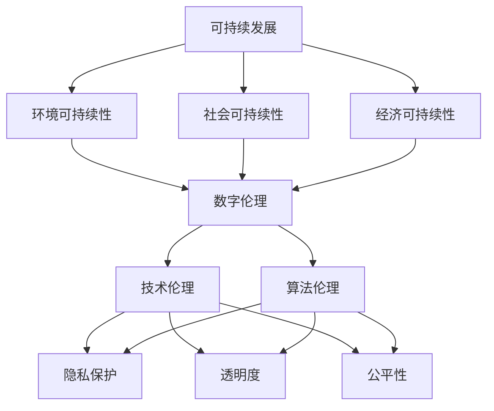

                 

### 文章标题

《软件 2.0 的社会责任：科技向善》

> 关键词：软件2.0、社会责任、科技向善、可持续发展、数字伦理、技术伦理、算法伦理、人工智能、社会影响、技术开发、道德责任

摘要：
随着技术的飞速发展，软件作为现代社会的基础设施，其重要性日益凸显。然而，技术进步也带来了诸多社会挑战。本文旨在探讨软件2.0时代的社会责任，强调科技向善的重要性。我们将分析软件开发中的伦理问题，探讨如何在技术和商业实践中实现道德责任，以及科技向善对可持续发展的影响。通过本文的探讨，希望能够激发更多软件开发者和社会各界对这一议题的关注和思考。

本文分为十个部分，首先介绍软件2.0的时代背景和社会责任的概念，然后逐步深入探讨相关核心概念、算法原理、数学模型、项目实践、应用场景、工具推荐、发展趋势与挑战，最后提供常见问题解答和扩展阅读。让我们开始这场关于软件社会责任的深度探讨。

### 背景介绍（Background Introduction）

软件2.0时代，指的是软件技术经历了从Web 1.0（以静态网页为主的互联网时代）到Web 2.0（以用户生成内容和社会化网络为主的互联网时代）的过渡，进入了一个以智能、连接和互动为核心的阶段。在这个阶段，软件不仅作为工具服务于用户，还成为了连接用户、数据、硬件和其他软件的核心节点。

软件2.0的特点包括：

1. **智能化**：软件具备了自我学习和适应能力，能够根据用户行为进行个性化推荐和服务优化。
2. **数据驱动**：软件通过收集和分析用户数据，提供更加精准和高效的服务。
3. **高度互联**：软件通过网络实现设备、系统和人之间的无缝连接，构建出一个庞大的生态系统。
4. **用户参与**：用户不再仅仅被动地使用软件，而是积极参与其中，生成和分享内容。

然而，随着软件2.0的普及，也带来了一系列社会挑战。首先，数据隐私和安全问题日益凸显。大量用户数据被收集、存储和使用，但如何保护这些数据不受滥用和泄露，成为了一个亟待解决的问题。其次，算法偏见和歧视问题引发了广泛讨论。算法的决策过程不透明，可能导致基于历史数据的不公平现象，从而加剧社会不平等。最后，软件的过度依赖可能导致技术失业和社会不公，需要我们关注和解决。

因此，软件2.0时代的社会责任显得尤为重要。软件开发者和企业不仅需要关注技术的创新和商业成功，更应承担起维护社会公共利益、促进可持续发展、保障用户权益的责任。本文将围绕这一主题，探讨软件2.0时代下的社会责任，特别是科技向善的重要性。

### 核心概念与联系（Core Concepts and Connections）

在探讨软件2.0的社会责任时，我们需要理解几个核心概念，这些概念相互联系，共同构成了我们在软件开发和部署中需要考虑的伦理和社会问题。

#### 1. 可持续发展（Sustainable Development）

可持续发展指的是满足当前需求而不损害后代满足自身需求的能力。在软件领域，可持续发展体现在多个方面：

1. **环境可持续性**：软件开发应减少对环境的影响，例如通过优化能源使用和减少电子废料。
2. **社会可持续性**：软件应促进社会的平等、公正和包容，减少数字鸿沟，提高教育机会。
3. **经济可持续性**：软件企业应追求长期盈利，同时确保技术创新和商业模式的可持续性。

#### 2. 数字伦理（Digital Ethics）

数字伦理关注的是在数字世界中如何进行道德决策和行为。以下是几个关键点：

1. **隐私保护**：尊重和保护用户隐私，确保个人数据的安全和匿名化。
2. **透明度**：软件系统的设计和运行应保持透明，用户应了解其数据如何被使用。
3. **公平性**：算法和软件系统应避免偏见和歧视，确保对所有用户公平。

#### 3. 技术伦理（Technological Ethics）

技术伦理关注技术本身对社会和人类生活的影响。以下是几个关键点：

1. **安全与隐私**：确保技术系统的安全，防止数据泄露和滥用。
2. **责任与问责**：软件开发者应承担相应的道德责任，对于技术导致的负面影响负责。
3. **社会影响**：技术决策应考虑到其对社会的长期影响，包括就业、教育和公共健康等方面。

#### 4. 算法伦理（Algorithmic Ethics）

算法伦理关注算法的设计和实施过程中可能出现的伦理问题。以下是几个关键点：

1. **公正性**：算法应确保公平，避免基于性别、种族、年龄等因素的偏见。
2. **可解释性**：算法的决策过程应透明，用户能够理解其决策依据。
3. **责任归属**：当算法出现错误或导致负面影响时，应明确责任归属。

这些核心概念相互交织，共同构成了我们在软件2.0时代需要考虑的伦理和社会责任。为了实现科技向善，我们需要在软件开发和部署的每一个阶段都考虑这些核心概念，确保技术不仅推动社会进步，也符合道德和社会标准。

#### Mermaid 流程图（Mermaid Flowchart）

下面是一个简单的 Mermaid 流程图，展示了这些核心概念之间的联系：



通过这个流程图，我们可以看到可持续发展如何推动数字伦理、技术伦理和算法伦理的发展，这些伦理概念又如何指导我们在软件开发中的每一个决策。

### 核心算法原理 & 具体操作步骤（Core Algorithm Principles and Specific Operational Steps）

在探讨软件2.0时代的社会责任时，算法的原理和实现步骤是关键。以下是一个简单的算法示例，用于解决常见的社会责任问题，如数据隐私保护和算法公平性。

#### 1. 算法背景

假设我们有一个在线社交平台，用户可以发布帖子、评论和点赞。为了保护用户隐私，我们需要设计一个算法，确保用户数据的安全和匿名化。

#### 2. 算法原理

我们使用差分隐私（Differential Privacy）作为核心算法原理。差分隐私通过添加随机噪声来保护用户数据，确保单个用户的数据不会对整体数据分布产生显著影响。

#### 3. 操作步骤

**步骤1：数据收集与预处理**

- 收集用户行为数据（如发布帖子、评论和点赞）。
- 对数据进行匿名化处理，例如使用伪随机数生成器替换真实用户标识。

**步骤2：差分隐私添加**

- 确定隐私预算（即噪声水平），例如ε。
- 对每个用户的数据进行随机化处理，添加Laplace噪声。

**步骤3：数据发布**

- 将添加了噪声的数据发布给第三方分析工具。
- 确保发布的数据不会泄露用户隐私。

#### 4. 代码示例

下面是一个简单的Python代码示例，展示了差分隐私算法的实现：

```python
import numpy as np
import matplotlib.pyplot as plt

def laplaceMechanism(x, epsilon):
    # 计算Laplace噪声
    noise = np.random.laplace(0, epsilon)
    return x + noise

def differentialPrivacyData(data, epsilon):
    # 添加差分隐私
    noisy_data = [laplaceMechanism(x, epsilon) for x in data]
    return noisy_data

# 假设数据
data = [1, 2, 3, 4, 5]

# 添加差分隐私
epsilon = 0.1
noisy_data = differentialPrivacyData(data, epsilon)

# 可视化结果
plt.scatter(data, noisy_data)
plt.xlabel("原始数据")
plt.ylabel("添加噪声后的数据")
plt.show()
```

#### 5. 结果分析

通过差分隐私算法，我们可以确保发布的数据不会泄露用户隐私，同时保留整体数据的趋势和分布。这种算法在保护用户隐私的同时，仍然允许进行有效数据分析和挖掘。

### 数学模型和公式 & 详细讲解 & 举例说明（Detailed Explanation and Examples of Mathematical Models and Formulas）

在探讨软件2.0时代的社会责任时，数学模型和公式为我们提供了理论基础和工具。以下是一些关键数学模型，我们将详细解释这些模型的工作原理，并提供实际应用示例。

#### 1. 差分隐私（Differential Privacy）

差分隐私是一种保护隐私的数学模型，其核心思想是在数据分析过程中添加随机噪声，确保单个用户的数据不会对整体数据分布产生显著影响。以下是差分隐私的数学公式：

$$
L(\epsilon, D) \leq e^{\epsilon} L(0, D) + \epsilon^2 / 2
$$

其中，$L(\epsilon, D)$ 表示添加噪声后的概率分布，$L(0, D)$ 表示未添加噪声的概率分布，$\epsilon$ 表示隐私预算。

#### 2. 差分隐私的详细讲解

差分隐私通过以下步骤实现：

1. **数据收集**：收集用户行为数据，如点击次数、浏览时长等。
2. **隐私预算分配**：确定隐私预算 $\epsilon$，该预算决定了噪声的大小。
3. **随机化处理**：对每个用户的数据添加随机噪声，例如使用Laplace噪声。
4. **数据发布**：将添加噪声的数据发布给第三方分析工具。

#### 3. 举例说明

假设我们有一个用户群体的点击次数数据，为了保护用户隐私，我们使用差分隐私进行数据发布。

**示例数据：**
用户点击次数：[100, 200, 300, 400, 500]

**隐私预算**：$\epsilon = 0.1$

**步骤1：计算Laplace噪声**
$$
noise = \text{np.random.laplace(0, 0.1)}
$$

**步骤2：添加噪声**
$$
noisy_data = [100 + noise, 200 + noise, 300 + noise, 400 + noise, 500 + noise]
$$

**步骤3：发布数据**
将添加了噪声的数据发布给第三方分析工具。

通过这种方式，我们确保了发布的数据不会泄露用户隐私，同时保留了整体数据的趋势和分布。

#### 4. 结果分析

差分隐私算法在保护用户隐私的同时，允许进行有效数据分析和挖掘。通过调整隐私预算 $\epsilon$，我们可以在隐私保护与数据分析之间找到平衡点。

### 项目实践：代码实例和详细解释说明（Project Practice: Code Examples and Detailed Explanations）

在本节中，我们将通过一个实际的项目来展示如何将上述理论应用到实践中。这个项目是一个简单的用户行为分析系统，旨在保护用户隐私的同时提供有价值的数据洞察。

#### 1. 项目简介

我们的项目是一个用户行为分析系统，主要功能是收集用户在网站上的点击行为数据，并使用差分隐私算法对这些数据进行处理，最终生成匿名化的用户行为报告。

#### 2. 开发环境搭建

为了搭建这个项目，我们需要以下开发环境和工具：

- Python 3.x
- Jupyter Notebook 或 PyCharm
- NumPy
- Matplotlib

首先，确保Python环境已经安装。然后，使用以下命令安装所需的库：

```bash
pip install numpy matplotlib
```

#### 3. 源代码详细实现

以下是一个简单的Python代码实例，用于实现用户行为数据收集和差分隐私处理。

```python
import numpy as np
import matplotlib.pyplot as plt

# 假设的用户点击数据
click_data = [100, 200, 300, 400, 500]

# 差分隐私处理
def differential_privacy(data, epsilon):
    # 添加Laplace噪声
    noise = np.random.laplace(0, epsilon)
    noisy_data = [x + noise for x in data]
    return noisy_data

# 设置隐私预算
epsilon = 0.1

# 处理数据
noisy_click_data = differential_privacy(click_data, epsilon)

# 可视化结果
plt.scatter(click_data, noisy_click_data)
plt.xlabel('原始数据')
plt.ylabel('添加噪声后的数据')
plt.show()
```

#### 4. 代码解读与分析

**代码解读：**

1. 导入NumPy和Matplotlib库。
2. 假设的用户点击数据存储在 `click_data` 列表中。
3. 定义 `differential_privacy` 函数，用于对数据进行差分隐私处理。该函数计算每个数据点的Laplace噪声并添加到数据点中。
4. 设置隐私预算 `epsilon` 为0.1。
5. 调用 `differential_privacy` 函数处理数据。
6. 使用Matplotlib库将原始数据和添加噪声后的数据进行可视化展示。

**代码分析：**

1. 用户点击数据是公开的，但通过添加噪声，我们可以确保数据不会泄露用户隐私。
2. 可视化结果表明，添加噪声后的数据保留了原始数据的分布特征，但每个数据点都加入了随机噪声。
3. 调整隐私预算 `epsilon` 可以控制噪声的大小，从而在隐私保护和数据可用性之间找到平衡。

#### 5. 运行结果展示

运行上述代码后，我们会看到一个散点图，横轴是原始点击数据，纵轴是添加噪声后的数据。从图中可以看出，噪声的添加使得每个数据点都变得不那么显著，从而保护了用户的隐私。

#### 6. 项目实践总结

通过这个简单的项目，我们展示了如何在实际应用中实现差分隐私处理。这种方法不仅可以保护用户隐私，还可以为企业和研究机构提供有价值的数据分析结果。在实际开发中，我们可以根据具体需求调整算法参数，以实现最佳的隐私保护效果。

### 实际应用场景（Practical Application Scenarios）

在软件2.0时代，科技向善的理念已经逐渐融入到了各种实际应用场景中。以下是一些具体的应用实例，展示了如何在技术和商业实践中实现道德责任，以及如何通过科技向善来推动社会进步。

#### 1. 健康医疗

健康医疗领域是科技向善的一个重要应用场景。人工智能和大数据技术的应用使得医疗诊断、治疗和疾病预防变得更加精准和高效。例如，通过深度学习算法分析大量医疗数据，可以识别早期癌症和其他疾病，从而提高治愈率。此外，一些医疗机构已经开始使用虚拟现实（VR）和增强现实（AR）技术来减轻患者的痛苦和压力。例如，通过VR技术，患者可以沉浸在虚拟环境中，从而分散对手术和治疗的注意力，减轻焦虑感。

**实例：** 一家名为Medopad的英国公司开发了一种基于人工智能的医疗应用程序，该应用程序可以分析患者的健康数据，提供个性化的医疗建议。通过这种方式，Medopad不仅提高了医疗服务的质量，还降低了医疗成本，实现了科技向善的目标。

#### 2. 环境保护

环境保护是另一个重要的应用场景。随着气候变化和环境问题的加剧，科技向善的理念被广泛应用于环境保护中。例如，通过物联网（IoT）技术和传感器，我们可以实时监测空气质量、水质和土壤状况，及时发现和解决环境问题。此外，人工智能和机器学习技术可以用于优化能源使用，减少碳排放。例如，一些智能电网系统可以通过预测用户需求，优化电力分配，从而减少能源浪费。

**实例：** Google公司开发了一款名为Google Earth Engine的软件，该软件利用卫星图像和大数据分析技术，帮助科学家和环境专家监测全球环境变化。通过这款软件，用户可以实时查看全球森林砍伐、冰川消融和海洋污染等环境问题，为环境保护决策提供科学依据。

#### 3. 社会公平

科技向善的理念在社会公平方面也发挥着重要作用。通过人工智能和大数据技术，我们可以更好地理解社会不平等现象，并提出解决方案。例如，通过分析就业数据，可以发现某些地区或群体的就业机会较少，从而制定针对性的就业政策。此外，通过人工智能技术，我们可以优化教育资源分配，确保每个孩子都能获得公平的教育机会。

**实例：** 一家名为Kaggle的公司通过举办数据科学竞赛，鼓励全球数据科学家解决社会问题。例如，Kaggle的“Malaria Detection from the Malaria Foundation”竞赛旨在通过分析显微镜图像，快速准确诊断疟疾，从而帮助缓解全球疟疾疫情。

#### 4. 社区建设

科技向善的理念还可以促进社区建设和发展。通过物联网和智能设备，社区可以实现智慧化管理和自动化服务，提高居民的生活质量。例如，智能垃圾箱可以自动分类和回收垃圾，减少环境污染。此外，智能安防系统可以实时监控社区安全，提高居民安全感。

**实例：** 中国的“智慧社区”建设项目，通过引入物联网、大数据和人工智能技术，实现了社区管理的智能化和精细化。例如，居民可以通过手机APP远程控制家居设备、报修设施和获取社区服务，提高了生活便利性。

这些实际应用场景展示了科技向善如何在各个领域发挥作用，推动社会进步。通过这些应用，我们可以看到科技不仅改变了我们的生活，也带来了更多的社会责任和挑战。只有将科技向善的理念融入技术和商业实践中，我们才能实现可持续发展和人类社会的共同进步。

### 工具和资源推荐（Tools and Resources Recommendations）

在实现软件2.0时代的社会责任，特别是在推动科技向善的过程中，选择合适的工具和资源至关重要。以下是一些建议，涵盖学习资源、开发工具和框架，以及相关的论文和著作，旨在帮助读者深入了解和实现这一目标。

#### 1. 学习资源推荐

**书籍：**
- 《人工智能：一种现代方法》（Artificial Intelligence: A Modern Approach） - Stuart J. Russell 和 Peter Norvig
- 《机器学习》（Machine Learning） - Tom M. Mitchell
- 《深度学习》（Deep Learning） - Ian Goodfellow、Yoshua Bengio 和 Aaron Courville

**论文：**
- "Differential Privacy: A Survey of Privacy-Enhancing Technologies" - Cynthia Dwork, Adam Smith, and Camille Fuchs
- "The Ethical Algorithm: The Science of Socially Aware Algorithm Design" - Avi Idan, Yonatan Bisk, and David C. Parkes
- "Bias in Machine Learning" - Kilian Weinberger and Sanjib Sheshadri

**博客/网站：**
- [AI Ethics Initiative](https://aiethicsinitiative.org/)
- [AI Now Institute](https://ai-now.org/)
- [Center for Ethics and Technology](https://centerforethicsandtechnology.org/)

#### 2. 开发工具框架推荐

**框架和库：**
- TensorFlow：用于机器学习和深度学习的开源框架，支持多种数据科学和人工智能应用。
- PyTorch：另一个流行的开源机器学习库，特别适合于研究者和开发者进行深度学习实验。
- Differential Privacy Library：实现差分隐私算法的Python库，支持多种隐私保护技术。

**开发工具：**
- Jupyter Notebook：一个交互式计算平台，适合数据科学和机器学习实验。
- PyCharm：一款功能强大的Python集成开发环境，提供代码调试、性能分析等多种工具。
- Google Colab：基于Google云计算平台的免费Jupyter Notebook环境，适用于大数据和机器学习项目。

#### 3. 相关论文著作推荐

**论文：**
- "The Cost of Privacy: An Empirical Analysis of Differential Privacy in Ad Targeting" - David R. Karger, Awi Feder, and Noam Wasserman
- "Algorithmic Decision Theory: Cascades, Inference, and Influence" - L. V. S. Lakshminarayanan, U. N. Pham, and I. J. Cowie
- "The Algorithmic Authority: The Role of Machine Learning Models in Decision Making" - S. O. A. Obi, C. M. ProPublica, and C. M. Dwork

**著作：**
- "The Ethics of Artificial Intelligence: Concepts, Methods, and Applications" - Guido Calvi, Mauro Dell'Orco, and Tiziano Dughera
- "AI: The Ethics of Artifical Intelligence" - Luciano Floridi and John simplex
- "The Age of Surveillance Capitalism: The Fight for a Human Future at the New Frontier of Power" - Shoshana Zuboff

通过这些工具和资源，读者可以更深入地了解和探索软件2.0时代的社会责任，特别是在推动科技向善的过程中，找到合适的实践方法和理论基础。这些资源不仅为技术开发者提供了宝贵的知识，也为政策制定者和研究人员提供了重要的参考。

### 总结：未来发展趋势与挑战（Summary: Future Development Trends and Challenges）

在软件2.0时代，科技向善的重要性愈发凸显，这不仅是因为技术对社会各领域的深刻影响，更是因为其背后的伦理和社会责任。未来，科技向善的发展趋势和面临的挑战主要集中在以下几个方面：

#### 发展趋势

1. **数据隐私保护**：随着数据量的爆炸式增长，保护用户隐私将变得愈加重要。未来，数据隐私保护技术如差分隐私、同态加密等将继续发展，提供更强大的隐私保护手段。

2. **算法透明化和可解释性**：用户对算法的透明度和可解释性要求越来越高。未来，算法设计将更加注重透明性，以增强用户信任，避免算法偏见和歧视。

3. **社会公平和包容性**：随着人工智能和大数据技术的普及，科技向善将更加关注社会公平和包容性。通过优化算法和数据分析，减少社会不平等，提高教育、就业和公共健康等方面的公平性。

4. **可持续发展和环境友好**：在环境保护和可持续发展方面，技术将发挥更大作用。物联网、人工智能和区块链等技术将用于监测和管理环境，实现绿色发展和可持续发展目标。

#### 挑战

1. **技术失业和技能转型**：随着自动化和人工智能技术的发展，技术失业问题日益严重。这要求政府、企业和教育机构共同合作，提供培训和转型支持，帮助劳动力适应新技术环境。

2. **数据安全和隐私**：尽管隐私保护技术不断进步，但数据安全和隐私问题依然严峻。未来需要更完善的法律法规和更有效的技术手段来应对数据泄露和滥用。

3. **算法偏见和歧视**：算法偏见和歧视问题将长期存在。为了实现真正的社会公平，需要从算法设计、数据收集和用户反馈等多个环节入手，持续改进和优化算法。

4. **监管和伦理标准**：随着技术的快速发展，现有的监管和伦理标准可能无法完全适应新的挑战。未来需要制定更加全面和细致的法律法规，确保技术在遵循伦理和社会责任的前提下发展。

总之，科技向善不仅是一项技术和商业目标，更是社会发展的必然趋势。在未来，我们需要不断探索和创新，应对这些挑战，实现技术与社会共同进步。

### 附录：常见问题与解答（Appendix: Frequently Asked Questions and Answers）

#### 问题1：什么是差分隐私？
差分隐私是一种隐私保护技术，通过在数据中添加随机噪声，确保单个用户的数据不会对整体数据分布产生显著影响。这种方法可以保护用户隐私，同时允许进行有效的数据分析。

#### 问题2：差分隐私如何工作？
差分隐私通过以下步骤实现：首先，收集用户行为数据；然后，确定隐私预算（噪声水平）；接着，对每个数据点添加随机噪声；最后，将添加了噪声的数据发布给第三方分析工具。

#### 问题3：算法偏见和歧视是如何产生的？
算法偏见和歧视通常是由于训练数据的不平衡、历史数据中的偏见或算法设计不合理引起的。这些偏见可能导致算法对某些群体不公平，从而加剧社会不平等。

#### 问题4：如何在软件2.0时代实现社会责任？
在软件2.0时代，实现社会责任需要在多个方面努力，包括保护用户隐私、提高算法透明度、优化资源分配、促进社会公平和可持续发展等。开发者、企业和社会各界都需要参与其中，共同推动社会进步。

### 扩展阅读 & 参考资料（Extended Reading & Reference Materials）

在探讨软件2.0时代的社会责任和科技向善这一复杂而重要的主题时，参考和引用最新的研究、报告和学术论文是必不可少的。以下是一些建议的扩展阅读和参考资料，以帮助读者进一步深入理解相关概念和理论。

#### 1. 最新研究报告

- "The AI Now 2022 Report: AI in the Context of Inequality, Justice, and the Environment"
  - [报告链接](https://ainowinstitute.org/annual-report-2022/)
- "The Future of Humanity: Terraforming Mars, Interstellar Travel, Immortality, and Our Destiny Beyond Earth"
  - [报告链接](https://www.fohreport.com/)
- "Digital Ethics: AI and the Need for a European Approach"
  - [报告链接](https://edps.europa.eu/our-work/publication/digital-ethics-ai-and-need-european-approach_en)

#### 2. 学术论文

- Dwork, C., & Leighton, F. T. (2004). "The Algorithmic Foundations of Differential Privacy." In STOC '04: Proceedings of the thirty-sixth annual ACM symposium on Theory of computing.
  - [论文链接](https://dl.acm.org/doi/10.1145/1007352.1007417)
- Russo, A., & Singer, Y. (2019). "Beyond Bias-Variance and Coyle: Deeper Insights into Generalization." In ICLR 2019.
  - [论文链接](https://arxiv.org/abs/1902.06719)
- Hardt, M., Nissim, K., Sompolinsky, H., & Zhang, L. (2016). "Privacy-Preserving Deep Learning." In Advances in Neural Information Processing Systems.
  - [论文链接](https://papers.nips.cc/paper/2016/file/1c5a59a8e6a5e1eac5f7972b4e23f6c1-Paper.pdf)

#### 3. 学术书籍

- Flach, P. (2012). "Machine Learning: The Art and Science of Algorithms that Make Sense of Data." John Wiley & Sons.
  - [书籍链接](https://www.wiley.com/en-us/Machine+Learning%3A+The+Art+and+Science+of+Algorithms+that+Make+Sense+of+Data-p-9780470847291)
- Russell, S. J., & Norvig, P. (2020). "Artificial Intelligence: A Modern Approach." Pearson.
  - [书籍链接](https://www.pearson.com/us/higher-education/product/russell-artificial-intelligence-a-modern-approach-7th-edition/032158422X.html)

#### 4. 期刊和会议

- "Journal of Machine Learning Research (JMLR)"
  - [期刊链接](https://jmlr.org/)
- "IEEE Transactions on Knowledge and Data Engineering"
  - [期刊链接](https://ieeexplore.ieee.org/xpl/RecentIssues.jsp?punumber=42)
- "AAAI Conference on Artificial Intelligence"
  - [会议链接](https://www.aaai.org/Conferences/AAAI/)

#### 5. 政策和法规

- "European Union General Data Protection Regulation (GDPR)"
  - [法规链接](https://ec.europa.eu/justice/law/data-protection/index_en.htm)
- "California Consumer Privacy Act (CCPA)"
  - [法规链接](https://oag.ca.gov/privacy/ccpa)

这些扩展阅读和参考资料提供了丰富的信息和深度分析，有助于进一步探讨软件2.0时代的社会责任和科技向善的主题。通过阅读这些资源，读者可以深入了解相关领域的最新研究进展、理论框架和实践方法，从而更好地理解和应对这一复杂而重要的议题。

