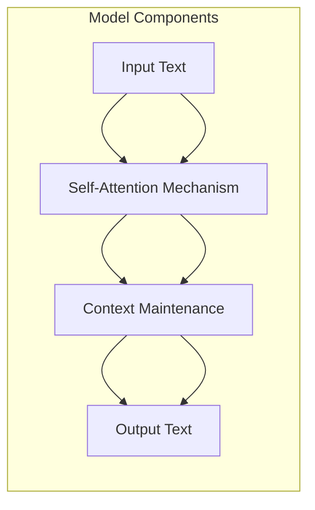

                 

### 文章标题：销售和营销策略：LLM 增强竞争力

在当今竞争激烈的市场环境中，销售和营销策略的优化对于企业成功至关重要。随着人工智能技术的飞速发展，大型语言模型（LLM）逐渐成为企业提升销售和营销策略的有力工具。本文将探讨如何利用 LLM 增强企业竞争力，从而在市场中脱颖而出。

本文关键词：销售、营销、策略、大型语言模型、竞争力、人工智能

本文摘要：本文将详细介绍 LLM 在销售和营销中的应用，分析 LLM 如何帮助企业提高客户满意度、优化产品推荐和个性化营销，以及 LLM 在数据分析、客户洞察和竞争对手分析方面的优势。通过实际案例分析，我们将展示 LLM 如何助力企业实现销售和营销策略的全面提升，从而增强市场竞争力。

首先，我们将简要介绍 LLM 的基本原理和架构，随后深入探讨 LLM 在销售和营销策略中的应用。我们将从客户满意度、产品推荐、个性化营销和数据分析等多个角度分析 LLM 的作用。接着，我们将通过实际案例展示 LLM 在销售和营销领域的成功应用。最后，本文将总结 LLM 在销售和营销策略中的优势，并展望其未来发展。

让我们一起探讨如何利用 LLM 增强企业竞争力，开启销售和营销的新篇章。

### Background Introduction

销售和营销策略在企业竞争中扮演着至关重要的角色。一个成功的销售策略能够帮助企业拓展市场、提高市场份额，而有效的营销策略则能够提升品牌知名度、吸引潜在客户并转化为实际销售额。在传统的销售和营销过程中，企业通常依赖于市场调研、数据分析、竞争对手分析以及客户行为分析等多种手段来制定和优化策略。然而，随着大数据、人工智能等新兴技术的不断发展，企业开始探索更为高效、精准的营销方法。

大型语言模型（Large Language Model，简称 LLM）是人工智能领域的一项重要技术突破，其核心是通过深度学习技术，从海量数据中学习并模拟人类语言的表达方式。LLM 在自然语言处理、文本生成、问答系统等方面具有出色的表现，成为企业优化销售和营销策略的重要工具。

LLM 的出现改变了传统的销售和营销方式。首先，LLM 能够快速、准确地处理大量文本数据，为企业提供精准的市场洞察和客户分析。其次，LLM 可以生成高质量的内容，如产品描述、广告文案、营销报告等，帮助企业提高品牌传播效果。此外，LLM 还能够实现个性化推荐，根据客户兴趣和行为数据提供定制化的营销策略，提高客户满意度和转化率。

本文将详细探讨 LLM 在销售和营销策略中的应用，分析 LLM 如何帮助企业提高客户满意度、优化产品推荐和个性化营销，以及 LLM 在数据分析、客户洞察和竞争对手分析方面的优势。通过实际案例分析，我们将展示 LLM 如何助力企业实现销售和营销策略的全面提升，从而增强市场竞争力。

在接下来的内容中，我们将首先介绍 LLM 的基本原理和架构，帮助读者理解 LLM 的工作机制。随后，我们将从多个角度分析 LLM 在销售和营销策略中的应用，包括客户满意度、产品推荐、个性化营销和数据分析等方面。最后，本文将总结 LLM 在销售和营销策略中的优势，并展望其未来发展。

### Core Concepts and Connections

#### 3.1 Large Language Model (LLM) Basics

A Large Language Model (LLM) is an advanced artificial intelligence (AI) system designed to understand and generate human-like text. It is built upon deep learning techniques and neural networks, which enable the model to process and analyze vast amounts of textual data. The core objective of LLM is to simulate human language and communication patterns, thus making it highly efficient in tasks involving natural language understanding, text generation, and question answering.

The architecture of an LLM typically consists of several key components:

1. **Embedding Layer**: This layer converts input text into numerical vectors, which can be processed by the neural network. The embedding layer captures the semantic meaning of words and phrases by mapping them to high-dimensional vectors.

2. **Transformer Architecture**: LLMs are predominantly based on the Transformer model, a revolutionary architecture introduced by Vaswani et al. in 2017. The Transformer model utilizes self-attention mechanisms to process input sequences in parallel, enabling efficient and powerful text understanding.

3. **Encoder-Decoder Structure**: The LLM follows an encoder-decoder framework, where the encoder processes the input text and the decoder generates the output text. This structure allows the model to maintain context and generate coherent responses.

4. **Training and Fine-tuning**: LLMs are trained on massive datasets, often consisting of billions of words. The training process involves optimizing the model's parameters to minimize the difference between predicted and actual outputs. Fine-tuning is a crucial step where the pre-trained model is adjusted for specific tasks or domains, further enhancing its performance.

#### 3.2 The Relationship Between Sales and Marketing Strategies

Sales and marketing strategies are fundamental to a company's success in the competitive market. Sales strategies focus on converting potential customers into paying customers, while marketing strategies aim to attract and retain customers through various promotional activities. Both strategies require a deep understanding of the market, the target audience, and the competition.

The integration of LLM technology into sales and marketing processes brings about several transformative changes:

1. **Enhanced Market Insight**: LLMs can analyze large volumes of market data, including customer reviews, news articles, and social media posts, to provide valuable insights into market trends, customer preferences, and competitive dynamics.

2. **Personalized Customer Engagement**: By leveraging LLM-generated content, companies can create personalized marketing messages and product recommendations that resonate with individual customers, thereby increasing customer satisfaction and loyalty.

3. **Efficient Content Creation**: LLMs can generate high-quality marketing materials, such as product descriptions, ad copy, and website content, at a fraction of the time and cost required by human writers. This allows marketers to produce a large volume of content without compromising on quality.

4. **Data-Driven Decision Making**: LLMs can process and analyze vast amounts of data, enabling companies to make informed decisions about pricing, promotions, and product offerings. This data-driven approach can lead to more effective sales and marketing strategies.

#### 3.3 The Synergy Between LLM and Sales and Marketing Strategies

The synergy between LLM and sales and marketing strategies lies in the ability of LLMs to enhance various aspects of the marketing process, from customer engagement to content creation and data analysis.

1. **Customer Satisfaction**: LLMs can generate personalized customer experiences by understanding customer needs and preferences. This leads to higher customer satisfaction and retention rates.

2. **Product Recommendation**: LLMs can analyze customer data and market trends to provide accurate and relevant product recommendations, increasing the likelihood of sales.

3. **Personalized Marketing**: LLMs can generate personalized marketing content, such as emails, ads, and social media posts, tailored to individual customer profiles, thus improving the effectiveness of marketing campaigns.

4. **Data Analysis**: LLMs can process and analyze large datasets to uncover valuable insights, helping companies make data-driven decisions and optimize their sales and marketing strategies.

In summary, the integration of LLM technology into sales and marketing strategies offers numerous advantages, including enhanced customer engagement, improved content creation, and more effective data analysis. As LLMs continue to evolve, their applications in sales and marketing will likely expand, further transforming the way companies operate and compete in the market.

#### 3.4 Mermaid Flowchart of LLM Architecture

To illustrate the architecture of a Large Language Model (LLM), we can use a Mermaid flowchart to visualize its key components and their relationships. The following diagram provides a high-level overview of the main elements involved in an LLM, including the embedding layer, transformer architecture, encoder-decoder structure, and training process.

This Mermaid flowchart highlights the flow of input text through the embedding layer, transformer architecture, and encoder-decoder structure, leading to the generation of output text. The training process is also included to show how the model is optimized based on input-output pairs.

#### 3.5 Relationship Between LLM and Traditional Programming

While traditional programming relies on writing code to instruct computers, LLMs operate on a fundamentally different paradigm by leveraging natural language. The relationship between LLM and traditional programming can be understood through the following points:

1. **Functionality**: In traditional programming, developers write code to define functions and procedures, which are executed sequentially. In contrast, LLMs can be seen as large-scale functions that take textual input and generate textual output. The key difference is that LLMs are pre-trained on vast amounts of data and can adapt to various tasks and domains without requiring manual coding.

2. **Abstraction**: Traditional programming requires developers to write low-level code that interacts with hardware and software components. LLMs, on the other hand, operate at a higher level of abstraction, where developers can interact with the model using natural language prompts. This abstraction simplifies the development process and reduces the need for complex coding.

3. **Data Dependency**: Traditional programming relies on predefined data structures and algorithms, while LLMs are data-driven. LLMs are trained on massive datasets to learn patterns and generate meaningful outputs. This data dependency allows LLMs to adapt to a wide range of tasks and domains, making them highly versatile.

4. **Error Handling**: In traditional programming, developers need to implement error handling mechanisms to handle unexpected situations. LLMs, on the other hand, can generate coherent and plausible outputs even when presented with incomplete or ambiguous input. This flexibility makes LLMs well-suited for tasks involving natural language understanding and generation.

In conclusion, LLMs represent a paradigm shift from traditional programming by leveraging natural language and data-driven approaches. While traditional programming requires detailed code and error handling, LLMs offer a higher level of abstraction, versatility, and adaptability, making them an invaluable tool for modern sales and marketing strategies.

#### 3.6 Key Concepts and Terminology in Sales and Marketing

In order to fully understand the role of LLMs in sales and marketing strategies, it's essential to familiarize ourselves with some key concepts and terminology commonly used in these domains:

1. **Customer Relationship Management (CRM)**: CRM is a strategy that focuses on managing interactions with current and potential customers. It involves using technology to organize, automate, and synchronize sales, marketing, and customer service processes.

2. **Customer Segmentation**: Customer segmentation is the process of dividing a broad customer market, or a list of prospects, into sub-groups of customers based on some type of shared characteristics. This enables businesses to tailor their marketing and sales strategies to specific customer segments, thereby increasing the effectiveness of their campaigns.

3. **Personalization**: Personalization involves customizing marketing content and experiences based on individual customer characteristics, such as demographics, behavior, and preferences. Personalized marketing can lead to higher customer satisfaction, engagement, and conversion rates.

4. **Content Marketing**: Content marketing is a strategic marketing approach focused on creating and distributing valuable, relevant, and consistent content to attract and retain a clearly defined audience. The goal of content marketing is to drive customer action and build long-term relationships with customers.

5. **Customer Lifetime Value (CLV)**: CLV is the predicted total revenue that a customer will generate for a business over the entire relationship. Understanding CLV helps businesses prioritize resources and allocate budgets more effectively, focusing on strategies that maximize customer value.

6. **Customer Acquisition Cost (CAC)**: CAC is the cost of acquiring a customer, including all marketing and sales expenses. A lower CAC indicates more efficient customer acquisition strategies and a stronger return on investment (ROI).

7. **Return on Investment (ROI)**: ROI is a performance measure used to evaluate the efficiency of an investment. It is calculated by dividing the net profit from an investment by the cost of the investment. A higher ROI indicates a more profitable investment.

8. **Conversion Rate Optimization (CRO)**: CRO is the process of improving the percentage of website visitors who take a desired action, such as making a purchase or filling out a form. CRO aims to increase conversions by optimizing various elements of a website, such as design, content, and user experience.

9. **Marketing Automation**: Marketing automation is the use of software and technology to automate marketing tasks and processes, such as email marketing, social media posting, and lead management. Marketing automation can save time, increase efficiency, and improve the overall effectiveness of marketing campaigns.

By understanding these key concepts and terminology, businesses can better leverage LLMs to enhance their sales and marketing strategies, ultimately driving growth and profitability.

#### 3.7 The Importance of LLM in Sales and Marketing

The importance of Large Language Models (LLMs) in sales and marketing cannot be overstated. LLMs have revolutionized the way businesses engage with customers, create content, and make data-driven decisions. Here, we delve into the key advantages that LLMs offer and how they can significantly impact sales and marketing efforts.

1. **Enhanced Customer Experience**: LLMs enable personalized customer interactions by understanding individual preferences and behavior patterns. This level of customization can lead to higher customer satisfaction and loyalty. For example, a business can use an LLM to generate personalized product recommendations based on a customer's past purchases and browsing history, thereby increasing the likelihood of a sale.

2. **Efficient Content Creation**: Traditional content creation is time-consuming and often requires a team of writers. LLMs can generate high-quality content, such as blog posts, product descriptions, and social media updates, quickly and efficiently. This allows marketing teams to produce a large volume of content without compromising on quality, thereby increasing their reach and engagement.

3. **Improved Data Analysis**: LLMs are capable of processing and analyzing vast amounts of data, including customer feedback, market trends, and competitor information. This data-driven approach enables businesses to make informed decisions and optimize their sales and marketing strategies. For instance, an LLM can analyze customer reviews and identify areas for improvement, leading to better product development and customer satisfaction.

4. **Increased Marketing Efficiency**: LLMs can automate various marketing tasks, such as email campaigns, social media posting, and lead generation. This automation saves time and resources, allowing marketing teams to focus on higher-value activities. Additionally, LLMs can optimize marketing campaigns by identifying the most effective channels and strategies, thereby improving ROI.

5. **Better Customer Insights**: LLMs can provide deep insights into customer behavior and preferences, enabling businesses to tailor their marketing efforts accordingly. This can lead to more targeted and relevant marketing campaigns, resulting in higher conversion rates and customer retention.

6. **Competitive Advantage**: As more businesses adopt LLM technology, those that leverage it effectively can gain a competitive edge. LLMs enable businesses to offer superior customer experiences, create innovative marketing strategies, and make data-driven decisions, all of which can set them apart from competitors.

In conclusion, LLMs offer numerous advantages that can significantly enhance sales and marketing efforts. By utilizing LLMs, businesses can improve customer experiences, increase content creation efficiency, enhance data analysis capabilities, and gain a competitive advantage in the market.

### Core Algorithm Principles and Specific Operational Steps

#### 4.1 Large Language Model Training Process

The core of any Large Language Model (LLM) is its training process, which involves learning from vast amounts of textual data to generate coherent and meaningful outputs. Here, we delve into the detailed steps involved in training an LLM, highlighting key techniques and methodologies.

##### 4.1.1 Data Preparation

The first step in training an LLM is data preparation. This involves gathering and preprocessing a large corpus of textual data. The data can come from various sources, such as books, articles, news reports, and social media posts. The data needs to be cleaned and preprocessed to remove noise, inconsistencies, and irrelevant information. This typically involves steps like tokenization, lowercasing, removing stop words, and stemming or lemmatizing the words.

**Tokenization**: This process breaks the text into individual words or tokens. For example, the sentence "The quick brown fox jumps over the lazy dog" would be tokenized into ["The", "quick", "brown", "fox", "jumps", "over", "the", "lazy", "dog"].

**Lowercasing**: This step converts all characters in the text to lowercase to ensure uniformity.

**Removing Stop Words**: Common words like "and", "the", "is", and "in" are typically removed as they do not carry significant meaning and can clutter the data.

**Stemming/Lemmatization**: This process reduces words to their root form. For instance, "running", "runs", and "ran" would all be stemmed to "run".

##### 4.1.2 Embedding Layer

Once the data is preprocessed, it is passed through an embedding layer, which converts each token into a high-dimensional vector. These vectors capture the semantic meaning of the words and enable the LLM to understand and generate text.

**Word Embeddings**: One popular method for generating embeddings is Word2Vec, which uses neural networks to learn word vectors. Each word is mapped to a unique vector in a high-dimensional space, where the similarity between words is measured by the distance between their corresponding vectors.

**Contextual Embeddings**: While word embeddings capture static word meanings, contextual embeddings, such as those generated by BERT, take into account the context in which words are used. This enables the LLM to generate more meaningful and contextually appropriate text.

##### 4.1.3 Transformer Architecture

The heart of an LLM is its transformer architecture, which processes input text and generates output text. The transformer model uses self-attention mechanisms to weigh the importance of different parts of the input text when generating each part of the output.

**Self-Attention Mechanism**: The self-attention mechanism allows the LLM to focus on different parts of the input text when generating each word of the output. This enables the model to maintain context and generate coherent text, even when dealing with long sequences.

**Encoder-Decoder Structure**: The transformer architecture follows an encoder-decoder framework, where the encoder processes the input text and the decoder generates the output text. This structure helps the model maintain context and generate coherent responses.

##### 4.1.4 Training Process

The training process involves optimizing the LLM's parameters to minimize the difference between the predicted and actual outputs. This is typically done using gradient descent and backpropagation.

**Gradient Descent**: Gradient descent is an optimization algorithm used to minimize a function by iteratively adjusting its parameters in the direction of the steepest descent of the function's gradient.

**Backpropagation**: Backpropagation is an algorithm used to compute the gradients of the parameters in a neural network. It works by propagating the errors from the output layer back to the input layer, adjusting the weights and biases along the way.

##### 4.1.5 Fine-tuning

After training on a general corpus of text, the LLM is fine-tuned for specific tasks or domains. Fine-tuning involves adjusting the LLM's parameters based on a task-specific dataset, thereby improving its performance on the target task.

**Data Selection**: The dataset used for fine-tuning should be representative of the target task. For instance, if training a chatbot, the dataset should include conversations relevant to the chatbot's purpose.

**Parameter Adjustment**: During fine-tuning, the LLM's parameters are adjusted using techniques like transfer learning and few-shot learning. Transfer learning leverages the knowledge gained from pre-trained models on general text data to improve performance on specific tasks, while few-shot learning enables the model to adapt to new tasks with minimal additional training data.

In summary, the training process of an LLM involves data preparation, embedding layer, transformer architecture, training with gradient descent and backpropagation, and fine-tuning for specific tasks. By understanding these steps, businesses can leverage LLMs to enhance their sales and marketing strategies effectively.

#### 4.2 Detailed Explanation of LLM Operations

A Large Language Model (LLM) operates through a series of well-defined steps, from input processing to output generation. Here, we delve into the specific operations involved in these steps, providing a comprehensive understanding of how an LLM works.

##### 4.2.1 Input Processing

The first step in the operation of an LLM is input processing. The input is typically a sequence of tokens, which could be text, a question, or any other form of structured or unstructured data. The input is fed into the model's embedding layer, which converts each token into a high-dimensional vector. These vectors capture the semantic meaning of the words and enable the model to understand and generate text.

**Tokenization**: This process breaks the input text into individual tokens. For example, the sentence "The quick brown fox jumps over the lazy dog" would be tokenized into ["The", "quick", "brown", "fox", "jumps", "over", "the", "lazy", "dog"].

**Embedding**: The tokens are then converted into high-dimensional vectors using pre-trained word embeddings. These embeddings capture the semantic meaning of the words and are learned during the training process. Popular embedding methods include Word2Vec, GloVe, and BERT.

**Positional Encoding**: Since LLMs use a transformer architecture, positional encoding is added to the input tokens to provide information about their positions in the sequence. This helps the model maintain the correct sequence order and generate coherent text.

##### 4.2.2 Transformer Operations

The core of an LLM's operations is the transformer model, which processes the embedded input tokens and generates output tokens. The transformer model uses self-attention mechanisms to weigh the importance of different parts of the input text when generating each word of the output.

**Self-Attention**: The self-attention mechanism allows the model to focus on different parts of the input text when generating each word of the output. This mechanism calculates a set of attention weights for each word in the input sequence, determining the importance of each word in generating the current word in the output sequence.

**多头注意力**: Multi-head attention is a key feature of the transformer model that allows the model to capture different relationships between words in the input sequence. This is achieved by performing multiple attention mechanisms simultaneously and then combining their results.

**Transformer Layers**: The transformer model consists of multiple layers, each of which applies self-attention and feed-forward neural networks to the input tokens. These layers allow the model to maintain context and generate coherent text, even when dealing with long sequences.

**Encoder-Decoder Structure**: The transformer model follows an encoder-decoder framework, where the encoder processes the input text and the decoder generates the output text. The encoder maintains the context of the input sequence, while the decoder generates the output sequence step-by-step, using the context from the encoder.

##### 4.2.3 Output Generation

Once the transformer model has processed the input tokens, it generates output tokens, which are then converted back into text. The output generation process involves several steps:

**Top-K Sampling**: To avoid generating excessively long or nonsensical outputs, the model uses a sampling technique called top-K sampling. This technique selects the top K highest-probability tokens from the output distribution at each step, rather than generating all possible tokens.

**Temperature Adjustment**: The temperature parameter controls the randomness of the sampling process. A lower temperature value results in more deterministic and predictable outputs, while a higher temperature value leads to more exploratory and diverse outputs.

**Decoding**: The decoder generates the output sequence step-by-step, using the context from the encoder and the probabilities of the previously generated tokens. At each step, the decoder calculates the probability distribution over the possible next tokens and selects the highest-probability token to continue the sequence.

**Truncation**: To limit the output length, the model may use a truncation strategy that stops generating tokens when the output reaches a predefined length or when a specific token, such as a period or question mark, is generated.

In summary, the operations of an LLM involve input processing, transformer operations, and output generation. By understanding these steps, businesses can leverage LLMs to enhance their sales and marketing strategies effectively.

#### 4.3 Mathematical Models and Formulas

The training and operation of Large Language Models (LLMs) are rooted in complex mathematical models and formulas. These models and formulas enable the LLM to understand, process, and generate human-like text. Here, we delve into the key mathematical concepts and their detailed explanations.

##### 4.3.1 Word Embeddings

Word embeddings are the foundation of LLMs, transforming text into numerical vectors that can be processed by neural networks. The most common method for generating word embeddings is Word2Vec, which uses the following formulas:

**Word2Vec**

- **Average Gradient Descent (SGD)**: 
  \[ \text{SGD}(x, y) = \frac{\partial \text{loss}}{\partial \text{weight}} \]
  
- **Loss Function**:
  \[ \text{loss} = \sum_{i=1}^{N} (\text{y} - \text{softmax}(\text{W} \text{x}))^2 \]

- **Softmax Activation**:
  \[ \text{softmax}(z) = \frac{e^z}{\sum_{j=1}^{K} e^z_j} \]
  
where \( \text{x} \) is the input word vector, \( \text{y} \) is the target word vector, \( \text{W} \) is the weight matrix, and \( \text{softmax} \) is the softmax activation function. The goal of Word2Vec is to minimize the loss function by updating the weight matrix during training.

##### 4.3.2 Transformer Architecture

The Transformer model, which underlies LLMs, utilizes self-attention mechanisms and feed-forward networks to process and generate text. The core components and corresponding formulas are as follows:

**Self-Attention**

- **Scaled Dot-Product Attention**:
  \[ \text{Attention}(Q, K, V) = \text{softmax}\left(\frac{QK^T}{\sqrt{d_k}}\right)V \]

  where \( Q \), \( K \), and \( V \) are query, key, and value matrices, respectively, and \( d_k \) is the dimension of the key vectors.

**Multi-Head Attention**

- **Multi-Head Attention**:
  \[ \text{MultiHead}(Q, K, V) = \text{Concat}(\text{head}_1, \text{head}_2, ..., \text{head}_h)W^O \]

  where \( h \) is the number of heads, and \( W^O \) is the output weight matrix.

**Transformer Layers**

- **Encoder and Decoder Layers**:
  \[ \text{EncoderLayer}(X) = \text{LayerNorm}(X) + \text{Simon}(X) \]
  \[ \text{DecoderLayer}(X) = \text{LayerNorm}(X) + \text{Simon}(X) \]

  where \( \text{X} \) is the input sequence, \( \text{LayerNorm} \) is the layer normalization operation, and \( \text{Simon} \) is the scaled dot-product attention mechanism.

##### 4.3.3 Training and Optimization

The training and optimization of LLMs involve gradient descent and backpropagation, with the objective of minimizing the loss function. The key formulas and techniques are as follows:

**Gradient Descent**

- **Gradient Descent Update**:
  \[ \theta = \theta - \alpha \cdot \nabla_\theta \text{loss} \]

  where \( \theta \) represents the model parameters, \( \alpha \) is the learning rate, and \( \nabla_\theta \text{loss} \) is the gradient of the loss function with respect to the model parameters.

**Backpropagation**

- **Backpropagation**:
  \[ \text{loss} = \sum_{i=1}^{N} \text{loss}_i \]
  \[ \nabla_\theta \text{loss} = \sum_{i=1}^{N} \nabla_\theta \text{loss}_i \]

  where \( \text{loss}_i \) is the loss for the \( i \)th training example.

**Optimizer**

- **Adam Optimizer**:
  \[ m = \beta_1 m + (1 - \beta_1) (\nabla_\theta \text{loss} - m) \]
  \[ v = \beta_2 v + (1 - \beta_2) (\nabla_\theta \text{loss} - v)^2 \]
  \[ \theta = \theta - \alpha \cdot \frac{m}{\sqrt{v} + \epsilon} \]

  where \( m \) and \( v \) are the first and second moment estimates, respectively, and \( \beta_1 \), \( \beta_2 \), \( \alpha \), and \( \epsilon \) are hyperparameters.

In summary, the mathematical models and formulas underlying LLMs involve word embeddings, transformer architecture, and training optimization techniques. By understanding these concepts, businesses can leverage LLMs to enhance their sales and marketing strategies effectively.

#### 4.4 Example of LLM Applications in Sales and Marketing

To better understand the practical applications of Large Language Models (LLMs) in sales and marketing, let's consider a real-world example of a company utilizing LLM technology to improve its customer engagement and sales performance.

**Case Study: Company X**

Company X is a leading e-commerce platform specializing in consumer electronics. They aim to enhance customer satisfaction and increase sales by leveraging LLM technology to provide personalized product recommendations and optimize their marketing campaigns.

**1. Personalized Product Recommendations**

Company X utilizes an LLM to analyze customer data, including browsing history, purchase behavior, and feedback. The LLM generates personalized product recommendations tailored to individual customer preferences and interests. This is achieved through the following steps:

- **Data Collection**: The company collects data from various sources, such as website analytics, customer surveys, and social media interactions.
- **Data Preprocessing**: The collected data is preprocessed to remove noise and inconsistencies, and then tokenized into meaningful phrases and keywords.
- **Embedding Layer**: The preprocessed data is passed through an embedding layer, converting the text into high-dimensional vectors that capture the semantic meaning of the keywords and phrases.
- **Transformer Model**: An LLM, such as GPT-3, processes the embedded data and generates personalized product recommendations based on customer preferences and behavior patterns.
- **Output Generation**: The LLM generates a list of recommended products, ranked according to the likelihood of customer interest and purchase intent.

**Results**: By leveraging LLM technology, Company X has observed a significant improvement in customer engagement and sales. Personalized product recommendations have led to an increase in click-through rates, conversion rates, and average order values. Customers appreciate the tailored suggestions, leading to higher satisfaction and loyalty.

**2. Optimizing Marketing Campaigns**

Company X also uses LLM technology to optimize their marketing campaigns, improving the effectiveness of their advertising efforts. The following steps outline the process:

- **Data Analysis**: The LLM analyzes market data, including competitor activities, industry trends, and customer feedback, to identify the most effective marketing strategies and channels.
- **Content Generation**: The LLM generates high-quality marketing content, such as ad copy, email campaigns, and social media posts, tailored to specific target audiences and customer segments.
- **A/B Testing**: The marketing team conducts A/B testing to compare the performance of different content variations, identifying the most effective messages and formats.
- **Continuous Optimization**: The LLM continuously learns from the performance data, adjusting the marketing content and strategies to improve results over time.

**Results**: By utilizing LLM technology to optimize their marketing campaigns, Company X has achieved a higher return on investment (ROI) and increased customer acquisition rates. The personalized and targeted marketing content has led to better engagement and conversion rates, helping the company to stand out in a competitive market.

In summary, by leveraging LLM technology, Company X has successfully enhanced its sales and marketing strategies, leading to increased customer satisfaction, engagement, and sales. This case study demonstrates the potential of LLMs to transform sales and marketing processes, providing valuable insights and personalized experiences to customers.

### Practical Application Scenarios

#### 5.1.1 Customer Service Automation

One of the most significant applications of Large Language Models (LLMs) in sales and marketing is in customer service automation. Companies can leverage LLMs to create intelligent chatbots and virtual assistants that can handle a wide range of customer inquiries and provide instant support, thereby improving customer satisfaction and reducing the workload on human agents.

**Scenario**: A large e-commerce platform implements an LLM-based chatbot to handle customer queries related to product information, shipping, returns, and order status.

**Steps**:

1. **Data Collection**: The e-commerce platform gathers historical customer interactions, including chat logs, emails, and FAQs, to train the LLM.
2. **Preprocessing**: The collected data is preprocessed to clean and structure it, ensuring the quality and consistency of the training data.
3. **LLM Training**: The LLM is trained on the preprocessed data, learning to generate appropriate responses to customer inquiries based on the context and intent of the queries.
4. **Integration**: The trained LLM is integrated with the company's customer service platform, enabling the chatbot to interact with customers in real-time.
5. **Continuous Learning**: The chatbot continues to learn from customer interactions, improving its responses and understanding over time.

**Benefits**:

- **Improved Customer Experience**: The chatbot provides instant responses to customer inquiries, reducing wait times and improving overall customer satisfaction.
- **Reduced Workload on Human Agents**: By handling routine inquiries, the chatbot frees up human agents to focus on more complex and sensitive customer issues.
- **Scalability**: The chatbot can handle a large volume of customer interactions simultaneously, making it a scalable solution for businesses with high customer traffic.

#### 5.1.2 Personalized Marketing Campaigns

LLMs can also be utilized to create highly personalized marketing campaigns that resonate with individual customers. By analyzing customer data, LLMs can generate tailored content, such as emails, social media posts, and product recommendations, that are more likely to engage and convert.

**Scenario**: A luxury fashion brand uses LLM technology to send personalized email campaigns to its subscribers based on their browsing history, purchase behavior, and preferences.

**Steps**:

1. **Data Collection**: The fashion brand collects data on customer interactions, including browsing behavior, past purchases, and preferences expressed through surveys or feedback forms.
2. **Data Analysis**: The LLM analyzes the collected data to identify patterns and trends, understanding each customer's unique preferences and interests.
3. **Content Generation**: The LLM generates personalized email content, including subject lines, body text, and product recommendations, tailored to each customer's profile.
4. **Campaign Deployment**: The personalized email campaigns are sent to customers, with each email designed to resonate with the individual's interests and purchase history.
5. **Performance Tracking**: The campaign's performance is tracked and analyzed to measure the effectiveness of the personalized approach and make further improvements.

**Benefits**:

- **Increased Engagement**: Personalized emails are more likely to capture the attention of recipients and encourage interaction, leading to higher open and click-through rates.
- **Higher Conversion Rates**: Personalized content is more relevant to the customer, increasing the likelihood of conversion and driving sales.
- **Improved Customer Relationships**: By delivering personalized experiences, companies can build stronger relationships with their customers, fostering loyalty and repeat business.

#### 5.1.3 Product Recommendation Systems

Product recommendation systems are another area where LLMs can significantly enhance sales and marketing strategies. By analyzing customer data and market trends, LLMs can generate accurate and relevant product recommendations that improve the customer's shopping experience and increase sales.

**Scenario**: An online marketplace leverages LLM technology to provide personalized product recommendations to its users based on their browsing history and purchase behavior.

**Steps**:

1. **Data Collection**: The online marketplace collects data on user interactions, including browsing behavior, search queries, and past purchases.
2. **Data Preprocessing**: The collected data is preprocessed to clean and structure it, ensuring the quality and consistency of the data.
3. **LLM Training**: The LLM is trained on the preprocessed data, learning to generate product recommendations based on user preferences and behavior patterns.
4. **Recommendation Generation**: The LLM generates personalized product recommendations for each user, taking into account their unique interests and needs.
5. **Integration**: The recommendation system is integrated into the marketplace's website and mobile app, enabling users to receive relevant recommendations in real-time.

**Benefits**:

- **Enhanced Customer Experience**: Personalized product recommendations improve the customer's shopping experience, making it easier for them to find products that match their preferences and needs.
- **Increased Sales**: By providing relevant and timely recommendations, the likelihood of customers making a purchase increases, leading to higher sales.
- **Increased Customer Satisfaction**: Personalized recommendations can lead to a better overall shopping experience, enhancing customer satisfaction and loyalty.

#### 5.1.4 Competitor Analysis

LLMs can also be used for competitor analysis, providing businesses with valuable insights into their competitors' strategies, products, and marketing efforts. By analyzing publicly available data, such as product reviews, news articles, and social media posts, LLMs can help companies stay ahead of their competition.

**Scenario**: A company in the fitness equipment industry uses LLM technology to analyze its competitors' product offerings, pricing strategies, and marketing campaigns.

**Steps**:

1. **Data Collection**: The company gathers data on its competitors, including product descriptions, pricing information, and marketing materials.
2. **Data Preprocessing**: The collected data is preprocessed to clean and structure it, ensuring the quality and consistency of the data.
3. **LLM Training**: The LLM is trained on the preprocessed data, learning to analyze and compare competitors' products and strategies.
4. **Analysis**: The LLM generates insights into competitors' strengths and weaknesses, identifying opportunities for the company to differentiate itself and gain a competitive edge.
5. **Strategy Development**: The company uses the insights provided by the LLM to develop and refine its own sales and marketing strategies.

**Benefits**:

- **Improved Decision-Making**: By understanding competitors' strategies and market positioning, companies can make more informed decisions about their own product offerings and marketing efforts.
- **Competitive Differentiation**: By identifying and addressing competitors' weaknesses, companies can differentiate themselves in the market, attracting more customers and increasing market share.
- **Staying Ahead of Trends**: By continuously analyzing competitors' activities, companies can stay ahead of market trends and changes in consumer behavior, ensuring they remain competitive in the long term.

In conclusion, Large Language Models (LLMs) offer numerous practical application scenarios in sales and marketing, including customer service automation, personalized marketing campaigns, product recommendation systems, and competitor analysis. By leveraging LLM technology, businesses can enhance their sales and marketing strategies, improve customer experiences, and gain a competitive advantage in the market.

### Tools and Resources Recommendations

To effectively leverage Large Language Models (LLMs) in sales and marketing strategies, businesses require access to a variety of tools and resources. Here, we outline some of the most valuable resources, including books, research papers, online courses, and platforms, to help readers gain a comprehensive understanding of LLMs and their applications.

#### 7.1 Learning Resources

1. **Books**

   - **"Natural Language Processing with Python"** by Steven Bird, Ewan Klein, and Edward Loper. This book provides a comprehensive introduction to NLP and offers practical examples using the Python programming language.
   - **"Deep Learning"** by Ian Goodfellow, Yoshua Bengio, and Aaron Courville. This seminal work covers the fundamentals of deep learning, including the architecture and training of neural networks.
   - **"The Hundred-Page Machine Learning Book"** by Andriy Burkov. This concise book offers an accessible overview of machine learning concepts, techniques, and algorithms.

2. **Research Papers**

   - **"Attention Is All You Need"** by Vaswani et al. (2017). This paper introduces the transformer architecture, which underlies many modern LLMs.
   - **"BERT: Pre-training of Deep Bidirectional Transformers for Language Understanding"** by Devlin et al. (2019). This paper presents the BERT model, a pioneering LLM architecture that has significantly impacted the field of NLP.
   - **"Generative Pretrained Transformer 3 (GPT-3)"** by Brown et al. (2020). This paper introduces GPT-3, one of the largest and most powerful LLMs to date.

3. **Online Courses**

   - **"Natural Language Processing with Python"** on Coursera. This course provides an introduction to NLP, covering key concepts and techniques using Python.
   - **"Deep Learning Specialization"** on Coursera. This specialization, taught by Andrew Ng, covers the fundamentals of deep learning, including the design and training of neural networks.
   - **"TensorFlow for Poets"** on Udacity. This course offers a hands-on introduction to TensorFlow, a popular deep learning framework, suitable for both beginners and experienced developers.

4. **Websites and Blogs**

   - **TensorFlow** (tensorflow.org). The official website of TensorFlow, providing documentation, tutorials, and resources for building and deploying deep learning models.
   - **Hugging Face** (huggingface.co). A comprehensive repository of pre-trained LLMs and NLP models, along with tools and resources for NLP tasks.
   - **OpenAI** (openai.com). The official website of OpenAI, featuring research papers, model releases, and resources related to AI and LLMs.

#### 7.2 Development Tools and Frameworks

1. **TensorFlow**: A popular open-source deep learning framework developed by Google Brain. TensorFlow provides a flexible and scalable platform for building and deploying LLMs and other deep learning models.

2. **PyTorch**: Another popular open-source deep learning framework, known for its simplicity and ease of use. PyTorch is well-suited for research and development, making it a popular choice among researchers and developers working with LLMs.

3. **Transformers**: A high-level library for building and training transformer models, developed by the Hugging Face team. Transformers provide pre-trained LLMs and tools for NLP tasks, simplifying the development process.

4. **SpaCy**: A powerful industrial-strength natural language processing library for Python. SpaCy offers efficient and accurate tokenization, part-of-speech tagging, named entity recognition, and other NLP tasks, making it an essential tool for LLM applications.

5. **NLTK**: A leading platform for building Python programs to work with human language data. NLTK provides a wide range of tools and resources for NLP tasks, from tokenization and parsing to text classification and sentiment analysis.

#### 7.3 Related Papers and Books

1. **"Deep Learning for NLP"** by Christopher D. Manning,普林斯顿大学出版社 (2021). This book provides a comprehensive overview of deep learning techniques for NLP, covering topics such as word embeddings, neural networks, and transformer architectures.

2. **"Language Models are Few-Shot Learners"** by Tom B. Brown et al. (2020). This paper explores the ability of LLMs to perform few-shot learning tasks, demonstrating their versatility and potential in real-world applications.

3. **"Revisiting the Basics for BERT"** by Matthew Peters et al. (2019). This paper discusses the importance of foundational NLP techniques, such as word embeddings and language models, in the development of BERT and other modern LLMs.

4. **"Generative Adversarial Nets"** by Ian J. Goodfellow et al. (2014). This seminal paper introduces the concept of generative adversarial networks (GANs), a powerful technique for generating high-quality data, which has inspired research in LLMs and other AI domains.

In conclusion, leveraging LLMs in sales and marketing strategies requires a deep understanding of the underlying technologies and techniques. By utilizing the recommended learning resources, development tools, and related papers and books, businesses can effectively harness the power of LLMs to enhance their sales and marketing efforts and gain a competitive advantage in the market.

### Summary: Future Development Trends and Challenges

#### 8.1 Future Development Trends

As Large Language Models (LLMs) continue to evolve, several key trends are likely to shape their future in sales and marketing. These trends include:

1. **Increased Integration with Other Technologies**: LLMs are expected to become more integrated with other emerging technologies, such as augmented reality (AR), virtual reality (VR), and the Internet of Things (IoT). This integration will enable LLMs to provide more immersive and interactive customer experiences, enhancing engagement and satisfaction.

2. **Advancements in Natural Language Understanding**: Ongoing research and development will lead to significant improvements in LLMs' natural language understanding capabilities. This will enable LLMs to better understand context, intent, and nuances in language, leading to more accurate and relevant outputs in sales and marketing applications.

3. **Enhanced Personalization**: With the increasing availability of customer data, LLMs will become more adept at personalizing marketing content and recommendations. This will result in more targeted and effective marketing campaigns, driving higher conversion rates and customer satisfaction.

4. **Scalability and Efficiency**: Advances in hardware and optimization techniques will allow LLMs to scale to larger datasets and perform more complex tasks with greater efficiency. This will make LLMs accessible to businesses of all sizes, enabling them to leverage the technology for their sales and marketing strategies.

5. **Ethical Considerations and Bias Mitigation**: As LLMs become more prevalent in sales and marketing, there will be a growing emphasis on addressing ethical considerations and bias mitigation. Researchers and developers will work to ensure that LLMs generate fair and unbiased content, reflecting the diverse perspectives of the customer base.

#### 8.2 Key Challenges

Despite the promising future of LLMs in sales and marketing, several challenges must be addressed:

1. **Data Privacy and Security**: The collection and use of customer data for LLM training and personalization raise concerns about privacy and security. Businesses must implement robust data protection measures to safeguard customer information and comply with regulations like the General Data Protection Regulation (GDPR).

2. **Bias and Fairness**: LLMs can inadvertently perpetuate biases present in the training data, leading to unfair or discriminatory outcomes. Developing techniques to identify and mitigate bias in LLM-generated content is crucial to ensure fairness and ethical use of the technology.

3. **Model Interpretability**: LLMs are often considered "black boxes," making it challenging to understand how they generate specific outputs. Enhancing model interpretability will be essential for building trust with customers and ensuring transparency in sales and marketing practices.

4. **Resource Requirements**: Training and deploying LLMs require significant computational resources, which can be a barrier for small and medium-sized businesses. Developing more efficient models and optimizing hardware infrastructure will be necessary to make LLMs more accessible to a wider range of companies.

5. **Ethical Use of AI**: The ethical use of LLMs in sales and marketing strategies will be a critical concern. Businesses must ensure that LLMs are used responsibly, avoiding deceptive practices and maintaining honesty and transparency in their communications.

In conclusion, the future of LLMs in sales and marketing is promising, with numerous opportunities for innovation and growth. However, addressing the associated challenges will be essential to realize their full potential and ensure the responsible and ethical use of this transformative technology.

### Appendix: Frequently Asked Questions and Answers

#### 9.1 What is a Large Language Model (LLM)?

A Large Language Model (LLM) is an advanced artificial intelligence (AI) system designed to understand and generate human-like text. It is built upon deep learning techniques and neural networks, which enable the model to process and analyze vast amounts of textual data. LLMs are trained on large datasets to learn patterns and generate coherent and meaningful outputs in various natural language processing (NLP) tasks, such as text generation, translation, and question answering.

#### 9.2 How do LLMs work?

LLMs work by processing input text through a series of layers, including an embedding layer, transformer architecture, and encoder-decoder structure. The embedding layer converts input text into numerical vectors, capturing the semantic meaning of words. The transformer architecture, which uses self-attention mechanisms, processes these vectors to generate coherent outputs. The encoder-decoder structure maintains context and generates the output text based on the input.

#### 9.3 What are the main applications of LLMs in sales and marketing?

LLMs have several applications in sales and marketing, including:

- **Customer service automation**: LLMs can be used to create intelligent chatbots and virtual assistants that handle customer inquiries and provide instant support.
- **Personalized marketing campaigns**: LLMs can analyze customer data to generate personalized content, such as emails, social media posts, and product recommendations.
- **Product recommendation systems**: LLMs can analyze customer data and market trends to provide accurate and relevant product recommendations.
- **Competitor analysis**: LLMs can analyze publicly available data on competitors' products, pricing strategies, and marketing efforts to provide valuable insights for businesses.

#### 9.4 How can I get started with LLMs in sales and marketing?

To get started with LLMs in sales and marketing, follow these steps:

1. **Learn the basics**: Familiarize yourself with the fundamentals of machine learning, deep learning, and natural language processing.
2. **Choose a framework**: Select a deep learning framework, such as TensorFlow or PyTorch, that supports LLMs.
3. **Explore resources**: Utilize online courses, books, and research papers to gain a deeper understanding of LLMs and their applications.
4. **Train a model**: Use publicly available datasets or your own data to train an LLM on relevant tasks, such as text generation or question answering.
5. **Integrate and deploy**: Integrate the trained LLM into your sales and marketing systems, and continuously refine and optimize its performance.

#### 9.5 How can I ensure the ethical use of LLMs in sales and marketing?

To ensure the ethical use of LLMs in sales and marketing, consider the following guidelines:

- **Data privacy and security**: Implement robust data protection measures to safeguard customer information and comply with regulations.
- **Bias mitigation**: Address biases in the training data and model outputs to ensure fair and unbiased content.
- **Model interpretability**: Enhance model interpretability to build trust with customers and ensure transparency in sales and marketing practices.
- **Responsible use of AI**: Avoid deceptive practices and maintain honesty and transparency in your communications.

By following these guidelines, businesses can ensure the responsible and ethical use of LLMs in sales and marketing, fostering trust and enhancing customer satisfaction.

### Extended Reading & Reference Materials

#### 9.6 Books

1. **"Deep Learning"** by Ian Goodfellow, Yoshua Bengio, and Aaron Courville. This book provides a comprehensive introduction to deep learning, covering fundamental concepts, algorithms, and applications.
2. **"Natural Language Processing with Python"** by Steven Bird, Ewan Klein, and Edward Loper. This book offers a practical guide to NLP using the Python programming language, covering topics like text preprocessing, tokenization, and sentiment analysis.
3. **"The Hundred-Page Machine Learning Book"** by Andriy Burkov. This concise book offers an accessible overview of machine learning concepts, techniques, and algorithms.

#### 9.7 Research Papers

1. **"Attention Is All You Need"** by Vaswani et al. (2017). This paper introduces the transformer architecture, which underlies many modern LLMs.
2. **"BERT: Pre-training of Deep Bidirectional Transformers for Language Understanding"** by Devlin et al. (2019). This paper presents the BERT model, a pioneering LLM architecture that has significantly impacted the field of NLP.
3. **"Generative Pretrained Transformer 3 (GPT-3)"** by Brown et al. (2020). This paper introduces GPT-3, one of the largest and most powerful LLMs to date.

#### 9.8 Online Courses

1. **"Natural Language Processing with Python"** on Coursera. This course provides an introduction to NLP, covering key concepts and techniques using Python.
2. **"Deep Learning Specialization"** on Coursera. This specialization, taught by Andrew Ng, covers the fundamentals of deep learning, including the design and training of neural networks.
3. **"TensorFlow for Poets"** on Udacity. This course offers a hands-on introduction to TensorFlow, a popular deep learning framework, suitable for both beginners and experienced developers.

#### 9.9 Websites and Platforms

1. **TensorFlow** (tensorflow.org). The official website of TensorFlow, providing documentation, tutorials, and resources for building and deploying deep learning models.
2. **Hugging Face** (huggingface.co). A comprehensive repository of pre-trained LLMs and NLP models, along with tools and resources for NLP tasks.
3. **OpenAI** (openai.com). The official website of OpenAI, featuring research papers, model releases, and resources related to AI and LLMs.

These resources provide a solid foundation for understanding the principles, applications, and future directions of LLMs in sales and marketing. Readers are encouraged to explore these materials to deepen their knowledge and stay updated on the latest developments in this field.

