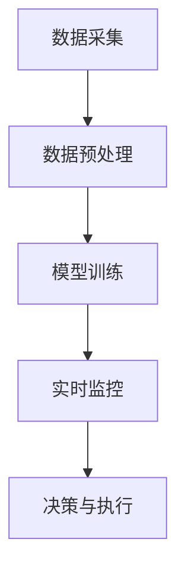

                 

# 阿里巴巴2024跨境支付风控系统校招面试真题

## 摘要

本文针对阿里巴巴2024年跨境支付风控系统的校招面试真题进行了详细的分析和解答。文章首先介绍了跨境支付风控系统的背景，然后深入探讨了风控系统中的核心概念和联系，以及具体算法原理和操作步骤。接着，本文通过数学模型和公式详细讲解了风控系统的实现细节，并提供了代码实例和详细解释。最后，文章探讨了风控系统的实际应用场景，并推荐了相关工具和资源。

## 1. 背景介绍（Background Introduction）

### 跨境支付背景

随着全球化的加速，跨境支付业务已经成为国际贸易的重要组成部分。跨境支付涉及到不同国家和货币之间的交易，具有高风险和高复杂性的特点。为了保证跨境支付的安全性和可靠性，风控系统成为不可或缺的一环。

### 风控系统的重要性

跨境支付风控系统旨在识别和预防欺诈行为、违规交易和异常活动。它通过对交易数据进行分析和监控，及时识别潜在风险，并采取相应的措施进行风险控制。风控系统的有效运行有助于提高跨境支付的安全性和稳定性，降低金融机构的运营风险。

### 阿里巴巴风控系统介绍

阿里巴巴作为全球领先的电子商务企业，其跨境支付业务规模庞大，风控系统也相应地得到了高度关注。阿里巴巴的风控系统采用了先进的技术手段，包括大数据分析、机器学习算法和智能监控等，以实现高效、准确的风险识别和控制。

## 2. 核心概念与联系（Core Concepts and Connections）

### 2.1 什么是跨境支付风控系统？

跨境支付风控系统是指专门用于识别、监控和管理跨境支付过程中潜在风险的系统。它通过分析交易数据、用户行为和风险特征，实现对跨境支付交易的实时监控和风险预警。

### 2.2 风险类型和特征

跨境支付过程中可能面临的风险包括：

- **欺诈风险**：恶意用户通过伪造身份、盗用账户等手段进行非法交易。
- **洗钱风险**：利用跨境支付渠道清洗非法所得资金。
- **异常交易风险**：包括大额交易、高频交易、跨境转账等异常行为。
- **合规风险**：违反跨境支付相关法律法规，如反洗钱（AML）和反欺诈（ATF）规定。

### 2.3 风控系统中的核心概念

- **数据采集**：收集跨境支付交易数据、用户行为数据和相关外部数据。
- **数据预处理**：清洗、归一化和特征提取，为后续分析提供高质量的数据。
- **模型训练**：利用机器学习算法对数据进行训练，构建风险识别模型。
- **实时监控**：对交易进行实时监控，识别潜在风险并触发预警。
- **决策与执行**：根据预警结果采取相应的措施，如拦截交易、报警、通知等。

### 2.4 Mermaid 流程图



## 3. 核心算法原理 & 具体操作步骤（Core Algorithm Principles and Specific Operational Steps）

### 3.1 数据采集

跨境支付风控系统的第一步是数据采集。系统需要从多个数据源收集与交易相关的数据，包括交易金额、交易时间、交易方信息、交易路径等。此外，还需要收集用户行为数据，如登录行为、支付行为等。

### 3.2 数据预处理

数据预处理是风控系统成功的关键。在这一步骤中，需要对采集到的数据进行清洗、归一化和特征提取。

- **数据清洗**：去除重复、缺失和异常数据，确保数据质量。
- **归一化**：将不同量纲的数据转化为同一量纲，便于后续分析。
- **特征提取**：从原始数据中提取能够反映交易特征的信息，如交易频率、交易金额分布等。

### 3.3 模型训练

模型训练是风控系统的核心。系统采用机器学习算法，如决策树、支持向量机（SVM）、神经网络等，对预处理后的数据进行训练。训练过程包括以下几个步骤：

- **数据划分**：将数据划分为训练集和测试集。
- **特征选择**：选择对风险识别最重要的特征。
- **模型选择**：根据数据特点和业务需求选择合适的模型。
- **模型训练**：使用训练集对模型进行训练。
- **模型评估**：使用测试集评估模型性能，调整模型参数。

### 3.4 实时监控

实时监控是风控系统的关键环节。系统通过实时分析交易数据，识别潜在的欺诈行为和异常交易。具体步骤如下：

- **数据流处理**：对交易数据流进行实时处理，提取特征。
- **风险评分**：使用训练好的模型对交易进行风险评分。
- **阈值设定**：设定风险评分的阈值，确定何时触发预警。
- **预警处理**：根据预警结果采取相应的措施，如拦截交易、报警等。

### 3.5 决策与执行

在风险识别和预警之后，系统需要根据预警结果采取相应的决策和执行措施。决策与执行过程包括：

- **拦截交易**：对高风险交易进行拦截，防止欺诈行为。
- **报警通知**：对潜在风险进行报警通知，提醒相关人员关注。
- **风险分析**：对预警交易进行进一步分析，寻找欺诈模式和规律。

## 4. 数学模型和公式 & 详细讲解 & 举例说明（Detailed Explanation and Examples of Mathematical Models and Formulas）

### 4.1 决策树模型

决策树是一种常见的机器学习模型，广泛应用于分类和回归任务。在跨境支付风控系统中，决策树模型可以用于风险评分。

- **基本概念**：决策树由一系列条件节点和叶子节点组成。条件节点表示特征，叶子节点表示分类结果。
- **构建过程**：通过递归划分数据集，找到最优特征和分割点，构建决策树。
- **分类过程**：给定一个交易数据，从根节点开始，根据特征和分割点进行决策，直到到达叶子节点，输出分类结果。

### 4.2 支持向量机（SVM）

支持向量机是一种强大的分类模型，在跨境支付风控系统中也有广泛应用。

- **基本概念**：SVM通过找到一个最佳的超平面，将不同类别的数据点分隔开来。
- **构建过程**：通过求解最优化问题，找到最佳超平面和支持向量。
- **分类过程**：给定一个交易数据，计算其到超平面的距离，根据距离判断分类结果。

### 4.3 神经网络

神经网络是一种模拟人脑结构的机器学习模型，具有强大的非线性建模能力。

- **基本概念**：神经网络由多个神经元组成，通过前向传播和反向传播进行学习。
- **构建过程**：通过调整网络结构和权重，使网络输出与实际分类结果尽可能接近。
- **分类过程**：给定一个交易数据，通过网络计算输出概率，根据概率判断分类结果。

### 4.4 举例说明

假设我们使用决策树模型对跨境支付交易进行风险评分。给定一个交易数据集，包含以下特征：

- 交易金额
- 交易时间
- 交易频率
- 用户行为评分

我们使用决策树模型对数据集进行训练，构建决策树。假设决策树模型的最优分割点为交易金额和交易频率，分别划分为高低两个类别。

- **条件节点**：交易金额 > 5000 或 交易频率 > 10
- **叶子节点**：高风险

给定一个交易数据，如交易金额 6000，交易频率 15，根据决策树模型，我们将其划分为高风险交易，并采取相应的风控措施。

## 5. 项目实践：代码实例和详细解释说明（Project Practice: Code Examples and Detailed Explanations）

### 5.1 开发环境搭建

在开发跨境支付风控系统之前，我们需要搭建相应的开发环境。以下是一个简单的开发环境搭建步骤：

1. 安装 Python 3.8 及以上版本。
2. 安装 NumPy、Pandas、Scikit-learn、Matplotlib 等相关库。
3. 配置 Jupyter Notebook 或 PyCharm 等开发工具。

### 5.2 源代码详细实现

以下是一个简单的示例，展示如何使用 Python 实现一个基于决策树的跨境支付风控系统。

```python
import numpy as np
import pandas as pd
from sklearn.tree import DecisionTreeClassifier
from sklearn.model_selection import train_test_split
from sklearn.metrics import classification_report

# 5.2.1 数据加载
data = pd.read_csv('transaction_data.csv')
X = data[['amount', 'frequency', 'user_score']]
y = data['risk_label']

# 5.2.2 数据划分
X_train, X_test, y_train, y_test = train_test_split(X, y, test_size=0.2, random_state=42)

# 5.2.3 模型训练
model = DecisionTreeClassifier()
model.fit(X_train, y_train)

# 5.2.4 模型评估
y_pred = model.predict(X_test)
print(classification_report(y_test, y_pred))

# 5.2.5 实时监控
new_transaction = np.array([[6000, 15, 0.8]])
risk_score = model.predict(new_transaction)
print("Risk Score:", risk_score)
```

### 5.3 代码解读与分析

- **5.3.1 数据加载**：使用 Pandas 读取交易数据，提取特征和标签。
- **5.3.2 数据划分**：将数据集划分为训练集和测试集，用于模型训练和评估。
- **5.3.3 模型训练**：使用 Scikit-learn 的 DecisionTreeClassifier 类实现决策树模型，并使用训练集进行训练。
- **5.3.4 模型评估**：使用测试集对模型进行评估，输出分类报告。
- **5.3.5 实时监控**：使用训练好的模型对新的交易数据进行风险评分。

## 6. 实际应用场景（Practical Application Scenarios）

跨境支付风控系统在实际业务中具有广泛的应用场景：

- **电商支付**：识别和预防电商平台的欺诈交易，保障用户资金安全。
- **跨境转账**：实时监控跨境转账交易，识别异常行为和风险。
- **金融理财**：对金融理财产品的交易进行风控，防止欺诈和违规操作。
- **跨境支付平台**：保障跨境支付平台的交易安全和稳定性。

## 7. 工具和资源推荐（Tools and Resources Recommendations）

### 7.1 学习资源推荐

- **书籍**：《机器学习实战》、《深入理解机器学习》
- **论文**：《Support Vector Machines for Classification and Regression》、《Recurrent Neural Networks for Speech Recognition》
- **博客**：[机器学习](https://machinelearningmastery.com/)、[深度学习](https://blog.keras.io/)、[Python 数据科学](https://www.datascience.com/)

### 7.2 开发工具框架推荐

- **开发工具**：PyCharm、Visual Studio Code
- **机器学习框架**：Scikit-learn、TensorFlow、PyTorch
- **数据处理库**：NumPy、Pandas、Matplotlib

### 7.3 相关论文著作推荐

- **论文**：《Data-Driven Dynamic Risk Scoring for Cross-Border E-Commerce Payments》
- **著作**：《算法导论》、《Python编程：从入门到实践》

## 8. 总结：未来发展趋势与挑战（Summary: Future Development Trends and Challenges）

随着人工智能技术的不断发展，跨境支付风控系统将面临以下发展趋势和挑战：

- **趋势**：
  - **大数据分析**：利用大数据技术提升风控系统的数据处理能力和分析精度。
  - **深度学习**：引入深度学习模型，提高风控系统的识别和预测能力。
  - **自动化和智能化**：通过自动化和智能化手段降低风控系统的运营成本，提高效率。

- **挑战**：
  - **数据隐私**：跨境支付涉及大量敏感数据，如何保护用户隐私成为一大挑战。
  - **实时性**：随着交易量的增加，风控系统的实时性要求越来越高。
  - **适应性**：面对不断变化的风险环境和欺诈手段，风控系统需要具备良好的适应性。

## 9. 附录：常见问题与解答（Appendix: Frequently Asked Questions and Answers）

### 9.1 什么是跨境支付风控系统？

跨境支付风控系统是一种用于识别、监控和管理跨境支付过程中潜在风险的系统。它通过分析交易数据、用户行为和风险特征，实现对跨境支付交易的实时监控和风险预警。

### 9.2 风险类型和特征有哪些？

跨境支付过程中可能面临的风险包括欺诈风险、洗钱风险、异常交易风险和合规风险。具体特征包括交易金额、交易时间、交易频率、用户行为等。

### 9.3 跨境支付风控系统的核心概念是什么？

跨境支付风控系统的核心概念包括数据采集、数据预处理、模型训练、实时监控和决策与执行。这些概念共同构成了风控系统的完整工作流程。

### 9.4 如何搭建开发环境？

搭建开发环境需要安装 Python 3.8 及以上版本，安装相关库如 NumPy、Pandas、Scikit-learn 等，并配置 Jupyter Notebook 或 PyCharm 等开发工具。

### 9.5 如何实现决策树模型？

实现决策树模型需要使用 Scikit-learn 库，通过 DecisionTreeClassifier 类创建决策树模型，并使用训练集进行训练。具体步骤包括数据加载、数据划分、模型训练和模型评估等。

## 10. 扩展阅读 & 参考资料（Extended Reading & Reference Materials）

- **书籍**：《机器学习实战》、《深入理解机器学习》
- **论文**：《Data-Driven Dynamic Risk Scoring for Cross-Border E-Commerce Payments》
- **网站**：[机器学习](https://machinelearningmastery.com/)、[深度学习](https://blog.keras.io/)、[Python 数据科学](https://www.datascience.com/)

-----------------------
作者：禅与计算机程序设计艺术 / Zen and the Art of Computer Programming
-----------------------

