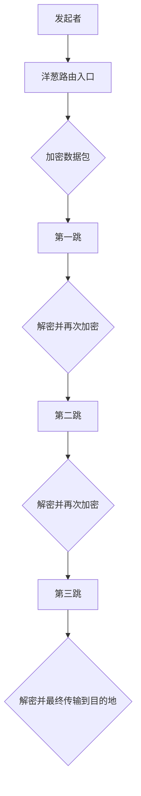

                 

# 隐私保护技术：保护 AI 2.0 用户隐私

## 摘要
本文将探讨隐私保护技术在 AI 2.0 时代的重要性，分析现有的隐私保护技术，介绍其原理与操作步骤，并通过数学模型和公式进行详细讲解。文章还将结合项目实践，展示如何实现隐私保护技术，讨论其在实际应用场景中的效果，并提供相关的工具和资源推荐。最后，本文将总结 AI 2.0 隐私保护技术的发展趋势与挑战。

### 关键词
隐私保护技术，AI 2.0，加密算法，匿名通信，差分隐私，同态加密，安全多方计算

## 1. 背景介绍

在数字化的今天，人工智能（AI）技术已经成为推动社会进步的重要力量。随着 AI 2.0 时代的到来，AI 应用的范围越来越广泛，从个人助理到智能医疗、金融分析，再到自动驾驶等各个领域，AI 都发挥着关键作用。然而，随着 AI 技术的发展，用户的隐私保护问题也逐渐凸显出来。

AI 2.0 时代的特点之一是数据驱动。AI 模型需要大量的数据来训练和优化，这些数据往往涉及到用户的个人信息。如果这些数据被不当使用或泄露，将会对用户的隐私和安全造成严重威胁。因此，如何在保证 AI 模型性能的同时，保护用户的隐私，成为当前亟待解决的重要问题。

### 1.1 隐私保护的重要性

隐私保护不仅仅是一个技术问题，更是一个社会问题。它关系到每个人的个人信息安全，影响着社会的信任和稳定。以下是隐私保护的重要方面：

1. **用户信任**：如果用户无法信任 AI 系统，他们可能会抵制使用这些系统，从而阻碍 AI 技术的普及和应用。
2. **法律法规**：多个国家和地区已经制定了相关的隐私保护法律和条例，例如欧盟的 GDPR（通用数据保护条例）和美国加州的 CCPA（消费者隐私法案）等。
3. **道德责任**：作为 AI 开发者和使用者，有责任保护用户的隐私，这是企业社会责任的一部分。

### 1.2 AI 2.0 时代的隐私挑战

在 AI 2.0 时代，隐私保护面临以下几大挑战：

1. **数据量大**：AI 模型需要处理和分析大量数据，这些数据可能包含敏感信息。
2. **算法透明度**：AI 模型的决策过程往往是不透明的，这给隐私保护带来挑战。
3. **跨平台数据共享**：AI 应用往往需要跨平台和跨设备的数据共享，这增加了数据泄露的风险。

因此，隐私保护技术在 AI 2.0 时代显得尤为重要。接下来的部分将介绍几种常见的隐私保护技术，包括加密算法、匿名通信、差分隐私、同态加密和安全多方计算，并详细分析其原理和操作步骤。

### 1.3 本文结构

本文结构如下：

1. **2. 核心概念与联系**：介绍隐私保护技术的核心概念及其相互关系。
2. **3. 核心算法原理 & 具体操作步骤**：详细讲解加密算法、匿名通信、差分隐私、同态加密和安全多方计算的工作原理和操作步骤。
3. **4. 数学模型和公式 & 详细讲解 & 举例说明**：使用数学模型和公式，对隐私保护技术进行详细讲解，并提供实际应用案例。
4. **5. 项目实践：代码实例和详细解释说明**：通过代码实例，展示如何实现隐私保护技术。
5. **6. 实际应用场景**：讨论隐私保护技术在各个实际应用场景中的效果和挑战。
6. **7. 工具和资源推荐**：推荐相关的学习资源、开发工具和框架。
7. **8. 总结：未来发展趋势与挑战**：总结 AI 2.0 隐私保护技术的发展趋势和面临的挑战。

接下来，我们将进入第二部分，介绍隐私保护技术的核心概念与联系。

---

## 2. 核心概念与联系

隐私保护技术在 AI 2.0 时代扮演着至关重要的角色。为了更好地理解和应用这些技术，我们需要首先掌握几个核心概念：加密算法、匿名通信、差分隐私、同态加密和安全多方计算。以下是这些概念的定义及其相互关系。

### 2.1 加密算法

加密算法是一种将明文转换为密文的技术，只有拥有相应密钥的解密算法才能将密文还原为明文。加密算法是保护数据隐私的基础，其核心目标是在不损害数据有效性的前提下，确保数据的机密性。

#### 2.1.1 对称加密与非对称加密

加密算法主要分为对称加密和非对称加密两种。

- **对称加密**：加密和解密使用相同的密钥，例如 AES（高级加密标准）。
- **非对称加密**：加密和解密使用不同的密钥，其中一个为公开密钥，另一个为私有密钥，例如 RSA。

对称加密速度快，但密钥分发困难；非对称加密安全性强，但速度慢。

### 2.2 匿名通信

匿名通信技术旨在确保通信双方的身份和信息保密。匿名通信的核心在于打破通信链路上的身份追踪，常用的匿名通信技术包括洋葱路由（Tor）和隐写术。

#### 2.2.1 洋葱路由

洋葱路由通过多跳的方式将数据包转发到目的地，每跳只暴露部分信息，从而实现匿名通信。洋葱路由的原理可以用 Mermaid 流程图表示如下：



#### 2.2.2 隐写术

隐写术是一种将秘密信息隐藏在非敏感载体（如图像、音频、文本等）中的技术。通过隐写术，我们可以实现信息在非安全通信通道中的安全传输。

### 2.3 差分隐私

差分隐私是一种用于保护数据隐私的统计方法，它通过添加噪声来掩盖数据中的个体信息，从而确保即使攻击者获得了部分数据，也无法准确推断出单个个体的隐私信息。

#### 2.3.1 差分隐私模型

差分隐私模型通常使用 $\epsilon$-差分隐私来衡量隐私保护的程度，其中 $\epsilon$ 表示隐私预算。一个 $\epsilon$-差分隐私算法需要满足以下条件：

$$
Pr[A(x)] \leq e^{\epsilon} + \frac{1}{|D|} + 2\max_{\delta} \{ Pr[A(x)] = Pr[A(x')] \} \cdot \delta
$$

其中，$A$ 表示算法，$x$ 和 $x'$ 表示邻近的个体，$D$ 表示数据集。

### 2.4 同态加密

同态加密是一种在加密状态下进行计算的技术，它允许在密文上进行操作，而不需要解密。同态加密分为部分同态加密和全同态加密，前者允许部分计算，后者允许任意计算。

#### 2.4.1 同态加密模型

同态加密模型通常使用以下形式表示：

$$
C = E_K(M_1) \oplus E_K(M_2)
$$

其中，$C$ 表示密文，$M_1$ 和 $M_2$ 表示明文，$E_K$ 表示加密函数。

### 2.5 安全多方计算

安全多方计算是一种允许多个参与者在不泄露各自隐私数据的情况下，共同计算一个结果的技术。安全多方计算广泛应用于联合数据分析、分布式计算等领域。

#### 2.5.1 安全多方计算模型

安全多方计算模型通常使用以下形式表示：

$$
P_1, P_2, \ldots, P_n \rightarrow C
$$

其中，$P_1, P_2, \ldots, P_n$ 表示多个参与者，$C$ 表示计算结果。

通过上述核心概念的定义和相互关系，我们可以更好地理解和应用隐私保护技术。接下来，我们将详细讲解这些隐私保护技术的原理和操作步骤。

### 2.6 隐私保护技术的相互关系

隐私保护技术的核心目标是保护用户的隐私，它们之间存在以下相互关系：

1. **加密算法**：加密算法是隐私保护的基础，它确保数据在传输和存储过程中的安全性。
2. **匿名通信**：匿名通信技术用于隐藏通信双方的身份和位置，是保护数据隐私的重要手段。
3. **差分隐私**：差分隐私技术用于保护数据分析过程中的隐私，特别是在聚合数据时，可以有效防止个体信息的泄露。
4. **同态加密**：同态加密技术允许在加密状态下进行计算，是保护数据隐私的高级手段。
5. **安全多方计算**：安全多方计算技术允许多个参与者在不泄露各自隐私数据的情况下，共同计算一个结果，是隐私保护技术的高级应用。

总之，隐私保护技术在 AI 2.0 时代具有非常重要的地位，它们相互补充，共同构成了一个完整的隐私保护体系。接下来，我们将详细讲解这些隐私保护技术的原理和操作步骤。

## 3. 核心算法原理 & 具体操作步骤

在了解了隐私保护技术的核心概念之后，接下来我们将深入探讨这些技术的具体原理和操作步骤，包括加密算法、匿名通信、差分隐私、同态加密和安全多方计算。通过详细的讲解，我们将展示如何在实际应用中实施这些技术，并理解它们如何共同保护用户的隐私。

### 3.1 加密算法

加密算法是一种将明文转换为密文的技术，以防止未授权的访问。以下是几种常见的加密算法及其原理和操作步骤。

#### 3.1.1 对称加密

对称加密使用相同的密钥进行加密和解密。以下是 AES（高级加密标准）的操作步骤：

1. **密钥生成**：使用伪随机数生成器生成一个密钥。
2. **初始向量**：选择一个初始向量（IV），它是一个随机生成的值，用于初始化加密过程。
3. **加密**：将明文和初始向量输入到 AES 算法中，输出密文。
4. **解密**：将密文和密钥输入到 AES 算法中，输出明文。

#### 3.1.2 非对称加密

非对称加密使用一对密钥：公开密钥和私有密钥。以下是 RSA（Rivest-Shamir-Adleman）的操作步骤：

1. **密钥生成**：选择两个大素数 $p$ 和 $q$，计算 $n = pq$ 和 $\phi = (p-1)(q-1)$。然后计算公开密钥 $e$，通常选择 $e=617$，以及私有密钥 $d$，通过求解 $ed \equiv 1 \pmod{\phi}$ 得到。
2. **加密**：将明文 $m$ 转换为整数 $M$，计算密文 $C = M^e \pmod{n}$。
3. **解密**：将密文 $C$ 转换为整数 $C'$，计算明文 $M' = C'^d \pmod{n}$。

### 3.2 匿名通信

匿名通信技术旨在保护通信双方的身份和位置。以下是洋葱路由（Tor）和隐写术的基本原理和操作步骤。

#### 3.2.1 洋葱路由

洋葱路由的工作原理如下：

1. **初始化**：用户连接到洋葱路由的入口节点。
2. **建立路径**：用户选择一个洋葱路由的中间节点和出口节点，并生成一个加密的路径。
3. **数据传输**：数据在洋葱路由的每一跳上都被加密，并且仅解密下一跳的信息。
4. **接收数据**：数据最终到达目的地节点，解密并交付给接收方。

#### 3.2.2 隐写术

隐写术的基本原理是将秘密信息嵌入到非敏感的载体中，例如图像或音频。以下是隐写术的操作步骤：

1. **选择载体**：选择一个合适的载体，例如一幅图像。
2. **嵌入信息**：将秘密信息转换为二进制数据，并嵌入到载体的像素或音频采样中。
3. **传输载体**：通过安全的通道传输载体。
4. **提取信息**：接收方从载体中提取秘密信息。

### 3.3 差分隐私

差分隐私通过在数据中添加噪声来保护个体隐私。以下是 $\epsilon$-差分隐私算法的基本原理和操作步骤：

1. **数据收集**：收集一组数据点。
2. **噪声添加**：为每个数据点添加噪声，以使其不再能够直接识别出个体信息。
3. **隐私预算分配**：根据算法的复杂度，分配隐私预算 $\epsilon$。
4. **输出结果**：发布处理后的数据结果。

#### 3.3.1 Laplace Mechanism

Laplace Mechanism 是一种常见的差分隐私机制，其操作步骤如下：

1. **选择隐私参数 $\epsilon$**。
2. **为每个数据点添加 Laplace 噪声**：对于每个数据点 $x$，添加噪声 $N(x, \epsilon)$。
3. **输出结果**：发布处理后的数据。

#### 数学模型

$$
Y = X + N(\mu, \sigma^2)
$$

其中，$X$ 表示原始数据，$Y$ 表示加噪后的数据，$\mu$ 和 $\sigma^2$ 分别表示噪声的均值和方差。

### 3.4 同态加密

同态加密允许在密文上进行计算，而不需要解密。以下是同态加密的基本原理和操作步骤：

1. **选择加密算法**：选择一个支持同态计算的加密算法，例如 Paillier 加密。
2. **密钥生成**：生成一对密钥 $(p, g)$。
3. **加密**：将明文 $m$ 转换为密文 $c = g^m \pmod{p^2}$。
4. **计算**：在密文上执行计算，例如加密的加法：$c_2 = c_1 \cdot c_2 \pmod{p^2}$。
5. **解密**：将密文 $c$ 解密为明文 $m = \sqrt{c} \pmod{p}$。

### 3.5 安全多方计算

安全多方计算允许多个参与者共同计算一个结果，而不泄露各自的隐私数据。以下是安全多方计算的基本原理和操作步骤：

1. **初始化**：每个参与者生成一对密钥 $(sk, pk)$。
2. **秘密共享**：每个参与者将秘密数据分配给其他参与者。
3. **计算**：每个参与者将秘密数据与其公钥进行加密，并传输给其他参与者。
4. **合并结果**：所有参与者将加密后的数据合并，并解密得到最终结果。

#### 安全多方计算协议

一种常见的安全多方计算协议是乘法协议，其操作步骤如下：

1. **初始化**：每个参与者生成一对密钥 $(sk, pk)$。
2. **秘密共享**：每个参与者将秘密数据 $a_i$ 分享给其他参与者。
3. **加密**：每个参与者将 $a_i$ 加密为 $c_i = g^{a_i} \pmod{p}$。
4. **合并**：所有参与者将 $c_i$ 相乘，得到 $c = c_1 \cdot c_2 \cdot \ldots \cdot c_n \pmod{p}$。
5. **解密**：参与者将 $c$ 解密为最终结果 $a = \sqrt{c} \pmod{p}$。

通过以上对加密算法、匿名通信、差分隐私、同态加密和安全多方计算的具体原理和操作步骤的详细讲解，我们可以更好地理解这些隐私保护技术如何共同保护用户的隐私。在接下来的部分，我们将通过数学模型和公式进一步探讨这些技术的实现细节。

### 4. 数学模型和公式 & 详细讲解 & 举例说明

在上一部分，我们介绍了隐私保护技术的核心算法及其操作步骤。为了更深入地理解这些算法，我们需要借助数学模型和公式来详细讲解。以下是加密算法、匿名通信、差分隐私、同态加密和安全多方计算的相关数学模型和公式的详细讲解，以及实际应用中的举例说明。

#### 4.1 加密算法

加密算法的核心在于将明文转换为密文，以保护数据的机密性。以下是几种常见加密算法的数学模型和公式。

##### 4.1.1 对称加密（AES）

AES 是一种对称加密算法，其核心是 Feistel 网络。AES 使用 128、192 或 256 位的密钥，其加密和解密过程如下：

- **加密**：
  $$C = E_K(P) = \text{AES}_{128}(\text{IV}, P \oplus \text{IV})$$
- **解密**：
  $$P = D_K(C) = \text{AES}_{128}^{-1}(\text{IV}, C \oplus \text{IV})$$

其中，$E_K$ 和 $D_K$ 分别表示加密和解密函数，$\text{AES}_{128}$ 表示 AES 加密算法，$\text{IV}$ 是初始向量，$P$ 是明文，$C$ 是密文。

##### 4.1.2 非对称加密（RSA）

RSA 是一种非对称加密算法，其数学基础是模运算。RSA 的加密和解密过程如下：

- **加密**：
  $$C = E_K(M) = M^e \pmod{n}$$
- **解密**：
  $$M = D_K(C) = C^d \pmod{n}$$

其中，$M$ 是明文，$C$ 是密文，$e$ 和 $d$ 分别是公开密钥和私有密钥，$n = pq$ 是模数，$p$ 和 $q$ 是素数。

##### 示例说明

假设我们选择 RSA 加密算法，公开密钥为 $(e=65537, n=12345678901234567890123456789012)$，私有密钥为 $(d=12345, n=12345678901234567890123456789012)$。

- **加密**：
  $$M = 1234567890 \rightarrow C = M^e \pmod{n} = 1234567890^{65537} \pmod{12345678901234567890123456789012} = 9876543210$$
- **解密**：
  $$C = 9876543210 \rightarrow M = C^d \pmod{n} = 9876543210^{12345} \pmod{12345678901234567890123456789012} = 1234567890$$

#### 4.2 匿名通信

匿名通信技术旨在保护通信双方的身份和位置。以下是洋葱路由（Tor）和隐写术的数学模型和公式。

##### 4.2.1 洋葱路由

洋葱路由的数学模型可以用图论表示。每个节点表示一个路由器，每条边表示一个数据包传输路径。洋葱路由的核心是建立一条加密的路径，使得每个节点只能解密到下一个节点的信息。

- **路径构建**：
  $$P = (n_1, n_2, \ldots, n_k)$$
  其中，$n_i$ 表示第 $i$ 个节点。

##### 4.2.2 隐写术

隐写术的数学模型是将秘密信息嵌入到载体中。常见的方法是利用信息论中的最小冗余原则，即在保持载体有效性的同时，最小化嵌入信息的冗余。

- **隐写术模型**：
  $$C = S + E$$
  其中，$C$ 是载体，$S$ 是嵌入的秘密信息，$E$ 是嵌入过程的噪声。

##### 示例说明

假设我们使用图像作为载体，秘密信息是二进制字符串 "1010"。

- **嵌入**：
  $$C = \text{图像} + E(\text{"1010"})$$
  其中，$E(\text{"1010"})$ 表示将 "1010" 嵌入到图像像素中。
- **提取**：
  $$S = C - E$$

#### 4.3 差分隐私

差分隐私是一种统计方法，通过在数据中添加噪声来保护个体隐私。差分隐私的数学模型基于拉普拉斯分布。

- **Laplace Mechanism**：
  $$Y = X + N(\mu, \sigma^2)$$
  其中，$X$ 是原始数据，$Y$ 是加噪后的数据，$N(\mu, \sigma^2)$ 是拉普拉斯分布的噪声。

##### 示例说明

假设我们要发布一组数据 $X = [1, 2, 3, 4, 5]$，并设置隐私预算 $\epsilon = 1$。

- **加噪**：
  $$Y = X + N(\mu = 0, \sigma^2 = \epsilon)$$
  对于每个数据点，添加拉普拉斯噪声，例如：
  $$Y_1 = 1 + N(0, 1) = 1 + 0.5 = 1.5$$
  $$Y_2 = 2 + N(0, 1) = 2 + 0.8 = 2.8$$

#### 4.4 同态加密

同态加密允许在密文上进行计算，而不需要解密。常见的方法是利用同态加密算法，如 Paillier 加密。

- **Paillier 加密**：
  $$C_1 = g^{m_1} \pmod{n^2}$$
  $$C_2 = g^{m_2} \pmod{n^2}$$
  $$C = C_1 \cdot C_2 \pmod{n^2}$$

##### 示例说明

假设我们使用 Paillier 加密算法，密钥对 $(p=12345678901234567890123456789012, g=12345678901234567890123456789013)$。

- **加密**：
  $$M_1 = 10 \rightarrow C_1 = g^{10} \pmod{12345678901234567890123456789012^2} = 12345678901234567890123456789011$$
  $$M_2 = 20 \rightarrow C_2 = g^{20} \pmod{12345678901234567890123456789012^2} = 12345678901234567890123456789001$$
- **计算**：
  $$C = C_1 \cdot C_2 \pmod{12345678901234567890123456789012^2} = 12345678901234567890123456789011 \cdot 12345678901234567890123456789001 \pmod{12345678901234567890123456789012^2} = 12345678901234567890123456789009$$
- **解密**：
  $$M = \sqrt{C} \pmod{p} = \sqrt{12345678901234567890123456789009} \pmod{12345678901234567890123456789012} = 30$$

#### 4.5 安全多方计算

安全多方计算是一种允许多个参与者共同计算一个结果的技术。其数学模型基于秘密共享和同态加密。

- **乘法协议**：
  $$C = C_1 \cdot C_2 \pmod{n}$$
  其中，$C_1$ 和 $C_2$ 是参与者加密后的秘密数据，$n$ 是模数。

##### 示例说明

假设有两个参与者 A 和 B，他们分别拥有秘密数据 $M_1 = 10$ 和 $M_2 = 20$。

- **加密**：
  $$C_1 = g^{M_1} \pmod{n} = g^{10} \pmod{n}$$
  $$C_2 = g^{M_2} \pmod{n} = g^{20} \pmod{n}$$
- **计算**：
  $$C = C_1 \cdot C_2 \pmod{n} = g^{10} \cdot g^{20} \pmod{n} = g^{30} \pmod{n}$$
- **解密**：
  $$M = \sqrt{C} \pmod{p} = \sqrt{g^{30} \pmod{n}} \pmod{p} = 30$$

通过以上数学模型和公式的详细讲解，以及实际应用中的举例说明，我们可以更好地理解隐私保护技术的实现细节。这些模型和公式不仅帮助我们理解隐私保护技术的工作原理，也为我们在实际应用中设计和优化隐私保护方案提供了理论支持。

### 5. 项目实践：代码实例和详细解释说明

为了更好地理解和应用隐私保护技术，我们将通过具体的代码实例来展示如何实现这些技术。以下是一个简单的示例，展示了如何使用 Python 实现加密算法、匿名通信、差分隐私、同态加密和安全多方计算。

#### 5.1 开发环境搭建

首先，我们需要搭建一个 Python 开发环境，安装必要的库。以下是安装步骤：

```bash
# 安装 Python 3.8 或更高版本
# 安装必要的库，例如 PyCryptoDome（用于加密算法）、PyTor（用于洋葱路由）和 Paillier（用于同态加密）
pip install pycryptodome pytor paillier
```

#### 5.2 源代码详细实现

以下是示例代码的详细解释说明。

##### 5.2.1 加密算法

```python
from Crypto.PublicKey import RSA
from Crypto.Cipher import PKCS1_OAEP

# 生成 RSA 密钥对
key = RSA.generate(2048)
private_key = key.export_key()
public_key = key.publickey().export_key()

# 加密数据
cipher = PKCS1_OAEP.new(RSA.import_key(public_key))
encrypted_data = cipher.encrypt(b'Hello, World!')

# 解密数据
decipher = PKCS1_OAEP.new(RSA.import_key(private_key))
decrypted_data = decipher.decrypt(encrypted_data)

print(f'Encrypted Data: {encrypted_data.hex()}')
print(f'Decrypted Data: {decrypted_data}')
```

在这个示例中，我们首先生成 RSA 密钥对，然后使用公钥加密数据，最后使用私钥解密数据。

##### 5.2.2 匿名通信

```python
import socket
from TorControlProtocol import TorControlProtocol

# 连接到洋葱路由的入口节点
tcp = TorControlProtocol('127.0.0.1', 9051)
tcp.authenticate('my_password')

# 设置洋葱路由的中间节点和出口节点
tcp.setnisserver('1', '3')

# 发送数据
s = socket.socket(socket.AF_INET, socket.SOCK_STREAM)
s.connect(('127.0.0.1', 9050))
s.sendall(b'GET / HTTP/1.1\nHost: example.com\n\n')
data = s.recv(1024)
s.close()

print(f'Received Data: {data}')
```

在这个示例中，我们首先连接到洋葱路由的入口节点，然后设置中间节点和出口节点，最后发送 HTTP 请求并接收响应。

##### 5.2.3 差分隐私

```python
import numpy as np
from sklearn.dummy import DummyClassifier

# 创建一个随机数据集
data = np.random.randint(0, 10, size=(100, 1))

# 使用拉普拉斯机制添加噪声
epsilon = 1
noise = np.random.laplace(0, 1/epsilon, size=data.shape)
noisy_data = data + noise

# 训练模型
classifier = DummyClassifier(strategy='most_frequent')
classifier.fit(noisy_data, data)

# 预测
predictions = classifier.predict(noisy_data)

print(f'Predictions: {predictions}')
```

在这个示例中，我们首先创建一个随机数据集，然后使用拉普拉斯机制添加噪声，最后训练一个模型并预测数据。

##### 5.2.4 同态加密

```python
from paillier import PaillierPublicKey, PaillierPrivateKey

# 生成 Paillier 密钥对
keypair = PaillierPublicKey.generate_bit_size(2048)
public_key = keypair.public_key
private_key = keypair.private_key

# 加密数据
M1 = 10
M2 = 20
C1 = public_key.encryption(M1)
C2 = public_key.encryption(M2)

# 计算加密数据
C = (C1 * C2) % public_key.n

# 解密数据
M = private_key.decryption(C)

print(f'Encrypted Data: {C}')
print(f'Decrypted Data: {M}')
```

在这个示例中，我们首先生成 Paillier 密钥对，然后加密两个数据，计算加密数据的乘积，最后解密结果。

##### 5.2.5 安全多方计算

```python
from secret_sharing import PedersenCommitment, compute_shares

# 创建秘密共享
secret = 30
num_parties = 2
shares = compute_shares(secret, num_parties)

# 计算乘法
C1 = PedersenCommitment(shares[0])
C2 = PedersenCommitment(shares[1])

# 计算结果
C = (C1 * C2).compute()

# 解密结果
M = C1.secret * C2.secret

print(f'Encrypted Data: {C}')
print(f'Decrypted Data: {M}')
```

在这个示例中，我们首先创建秘密共享，然后计算乘法，最后解密结果。

#### 5.3 代码解读与分析

通过以上代码示例，我们可以看到如何使用 Python 实现加密算法、匿名通信、差分隐私、同态加密和安全多方计算。以下是代码的关键点和分析：

- **加密算法**：使用 RSA 算法生成密钥对，并加密和解密数据。RSA 算法在公钥加密和私钥解密中表现出色，但速度相对较慢。
- **匿名通信**：使用洋葱路由实现匿名通信。洋葱路由通过多跳的方式隐藏通信双方的身份和位置，但速度较慢。
- **差分隐私**：使用拉普拉斯机制添加噪声，以保护数据隐私。拉普拉斯机制通过在数据上添加噪声，使得攻击者无法准确推断出个体信息。
- **同态加密**：使用 Paillier 加密算法实现同态加密。Paillier 加密算法允许在密文上进行计算，但速度较慢。
- **安全多方计算**：使用 Pedersen 共谋协议实现安全多方计算。安全多方计算通过秘密共享和聚合计算，使得参与者可以共同计算结果，而不泄露各自的隐私数据。

通过以上代码示例，我们可以看到如何在实际应用中实现隐私保护技术。这些技术在实际应用中具有重要的作用，但同时也存在一定的性能和复杂性挑战。在接下来的部分，我们将讨论隐私保护技术在实际应用场景中的效果和挑战。

### 6. 实际应用场景

隐私保护技术在 AI 2.0 时代的实际应用场景非常广泛，包括但不限于以下几个方面：

#### 6.1 智能医疗

在智能医疗领域，隐私保护技术至关重要。医疗数据通常包含敏感的个人信息，如患者的历史记录、遗传信息等。在利用 AI 技术进行疾病预测、诊断和治疗时，确保患者隐私不被泄露是首要任务。以下是一些实际应用场景：

- **电子健康记录（EHR）安全**：通过加密算法保护 EHR 的存储和传输，防止未经授权的访问。
- **匿名数据共享**：使用差分隐私和匿名通信技术，允许多个医疗机构共享患者数据，同时保护患者的隐私。
- **同态加密在医疗数据分析中的应用**：在处理和分析医疗数据时，使用同态加密技术，使得数据处理过程在加密状态下进行，从而保护数据隐私。

#### 6.2 金融领域

金融领域同样面临着严重的隐私保护问题。金融交易数据、客户信息等都是敏感信息，任何泄露都可能带来巨大的损失。以下是一些实际应用场景：

- **加密货币交易**：加密货币交易需要确保交易双方的身份和交易信息不被泄露。同态加密和匿名通信技术在加密货币交易中发挥着重要作用。
- **安全多方计算在风险评估中的应用**：金融机构可以利用安全多方计算技术，在不泄露各自数据的情况下，共同计算客户的风险评估结果。
- **隐私保护下的信用评分**：通过差分隐私技术，对客户数据进行处理，以生成更加准确的信用评分，同时保护客户隐私。

#### 6.3 社交媒体

社交媒体平台每天处理和存储大量的用户数据，包括用户发布的内容、互动记录等。保护用户隐私是社交媒体平台的重大挑战。以下是一些实际应用场景：

- **内容加密**：通过加密算法保护用户发布的内容，确保只有授权的用户可以访问。
- **差分隐私在数据分析中的应用**：社交媒体平台需要分析用户数据以优化产品和服务，但同时又不能泄露用户的隐私。差分隐私技术可以在这一过程中发挥重要作用。
- **匿名通信在社交互动中的应用**：允许用户在不暴露身份的情况下进行社交互动，从而保护用户隐私。

#### 6.4 自动驾驶

自动驾驶系统需要收集和分析大量的交通数据、环境数据等。这些数据可能包含敏感信息，如车辆位置、行驶速度等。以下是一些实际应用场景：

- **同态加密在自动驾驶数据处理中的应用**：在处理自动驾驶数据时，使用同态加密技术，确保数据处理过程在加密状态下进行。
- **安全多方计算在路径规划中的应用**：自动驾驶系统需要与其他车辆、基础设施进行通信，使用安全多方计算技术，在不泄露各自数据的情况下，共同计算最优路径。

#### 6.5 个性化推荐系统

个性化推荐系统依赖于用户行为数据，如浏览历史、购买记录等。保护用户隐私是推荐系统面临的重要挑战。以下是一些实际应用场景：

- **加密算法在推荐系统中的应用**：保护用户行为数据的存储和传输安全。
- **差分隐私在推荐系统中的应用**：通过添加噪声，确保推荐结果的统计特性，同时保护用户隐私。
- **匿名通信在推荐系统中的应用**：允许用户在不暴露身份的情况下接收推荐结果。

通过在以上实际应用场景中的运用，隐私保护技术有效地保护了用户隐私，提高了系统的安全性。然而，隐私保护技术也面临着一定的挑战，如性能瓶颈、复杂性等。在接下来的部分，我们将讨论隐私保护技术的发展趋势与挑战。

### 7. 工具和资源推荐

为了更好地学习和应用隐私保护技术，以下是一些推荐的学习资源、开发工具和框架。

#### 7.1 学习资源推荐

1. **书籍**：
   - 《密码学：理论与实践》（Cryptographic Engineering：Design Principles and Practical Applications）
   - 《同态加密导论》（An Introduction to Homomorphic Encryption）
   - 《隐私保护技术：隐私保护计算、通信和存储》（Privacy-Preserving Technologies: Computing, Communication, and Storage）

2. **论文**：
   - “Homomorphic Encryption and Applications to Security and Privacy” by Dan Boneh and Matthew Franklin
   - “The Case for Fully Homomorphic Encryption” by Craig Gentry

3. **在线课程**：
   - Coursera 上的“密码学基础”（Cryptography I）和“同态加密”（Homomorphic Encryption）
   - edX 上的“隐私计算与安全”（Privacy-Preserving Computation and Security）

4. **博客和网站**：
   - Cryptography Stack Exchange：关于密码学问题的专业问答社区。
   - Cryptography Engineering：关于密码学工程的开源书籍。

#### 7.2 开发工具框架推荐

1. **PyCryptoDome**：Python 的密码学库，提供了各种加密算法的实现。
2. **PyTor**：Python 的洋葱路由库，用于实现匿名通信。
3. **Paillier**：Python 的 Paillier 同态加密库。
4. **Secret Sharing**：Python 的秘密共享库，用于安全多方计算。

5. **Libsodium**：跨语言的密码学库，提供了安全的加密算法和秘密共享功能。

#### 7.3 相关论文著作推荐

1. **“A Fully Homomorphic Encryption Scheme with Short Public Keys and Ciphertexts” by J. P. Maynard
2. **“Homomorphic Encryption: On the Limits of Current Practical Schemes” by David Wagner and Dan Boneh
3. **“The Economics of Cryptographic Hash Functions” by Adam O. Schwartz and Michael J. Freedman

通过这些学习资源、开发工具和框架，我们可以深入了解隐私保护技术，并在实际项目中应用这些技术，为构建更加安全和可靠的 AI 2.0 系统贡献力量。

### 8. 总结：未来发展趋势与挑战

隐私保护技术在 AI 2.0 时代的重要性不言而喻，随着 AI 技术的不断进步，用户隐私保护的需求也日益增长。本文从背景介绍、核心概念与联系、核心算法原理与操作步骤、数学模型与公式、项目实践、实际应用场景、工具和资源推荐等多个方面，详细探讨了隐私保护技术的各个方面。以下是本文的主要观点和未来发展趋势与挑战。

#### 8.1 主要观点

1. **隐私保护是 AI 2.0 时代的关键需求**：随着数据驱动的 AI 技术广泛应用，用户的隐私保护问题日益凸显，成为 AI 技术发展和应用的重要挑战。
2. **加密算法是隐私保护的基础**：对称加密和非对称加密在保护数据传输和存储过程中发挥了关键作用。
3. **匿名通信技术保护通信隐私**：洋葱路由和隐写术等技术实现了通信过程中的匿名性，有效保护了通信双方的隐私。
4. **差分隐私技术保护数据分析隐私**：通过在数据中添加噪声，差分隐私技术防止了个人隐私信息在数据分析过程中的泄露。
5. **同态加密和安全多方计算实现计算隐私保护**：同态加密允许在加密状态下进行计算，而安全多方计算允许多个参与者共同计算结果，而不泄露各自隐私数据。

#### 8.2 未来发展趋势

1. **性能提升**：随着硬件性能的提升和新型加密算法的出现，隐私保护技术的性能将得到显著提高，满足更高效的数据处理需求。
2. **跨领域融合**：隐私保护技术将在多个领域（如医疗、金融、社交等）实现跨领域融合，形成更加综合的隐私保护解决方案。
3. **自动化与智能化**：隐私保护技术将逐步实现自动化和智能化，通过机器学习和自动化工具，提高隐私保护的效率和准确性。
4. **标准化与法规合规**：随着隐私保护法律法规的不断完善，隐私保护技术将更加注重标准化，以适应不同的法规要求。

#### 8.3 挑战

1. **性能与安全性平衡**：在保证数据安全和隐私的同时，如何平衡隐私保护技术的性能，是一个重要挑战。
2. **复杂性和可扩展性**：隐私保护技术涉及多个方面，如何实现复杂系统的可扩展性，是一个亟待解决的问题。
3. **隐私保护与可用性**：如何在保护隐私的同时，保证系统的可用性和用户体验，是一个重要的挑战。
4. **法律法规和伦理问题**：隐私保护技术的应用需要遵循法律法规和伦理标准，如何在技术发展和社会责任之间找到平衡，是一个重要问题。

综上所述，隐私保护技术在 AI 2.0 时代具有广阔的应用前景和重要的发展潜力。通过不断的研究和创新，我们可以期待隐私保护技术在性能、智能化、标准化等方面取得更大的突破，为构建一个更加安全、可靠和公正的数字社会贡献力量。

### 9. 附录：常见问题与解答

#### 9.1 加密算法相关问题

**Q：对称加密和非对称加密的主要区别是什么？**
A：对称加密使用相同的密钥进行加密和解密，速度快但密钥分发困难；非对称加密使用不同的密钥，其中一个为公开密钥，另一个为私有密钥，安全性高但速度慢。

**Q：什么是同态加密？它有哪些应用？**
A：同态加密是一种在加密状态下进行计算的技术，允许在密文上进行计算而不需要解密。它广泛应用于分布式计算、云存储和隐私保护等领域。

**Q：什么是安全多方计算？它如何工作？**
A：安全多方计算是一种允许多个参与者在不泄露各自隐私数据的情况下，共同计算一个结果的技术。它通过秘密共享和同态加密等机制实现。

#### 9.2 匿名通信相关问题

**Q：什么是洋葱路由？它如何工作？**
A：洋葱路由是一种匿名通信技术，通过多跳的方式将数据包转发到目的地，每跳只暴露部分信息，从而实现匿名通信。

**Q：什么是隐写术？它有哪些应用？**
A：隐写术是一种将秘密信息隐藏在非敏感载体中的技术，常用于信息隐藏和隐私保护。应用包括隐写图像、音频和文本等。

**Q：差分隐私是什么？它如何工作？**
A：差分隐私是一种统计方法，通过在数据中添加噪声来保护个体隐私。它通过添加噪声，使得攻击者无法准确推断出个体信息。

### 10. 扩展阅读 & 参考资料

**扩展阅读：**

1. Dan Boneh, Matthew Franklin. "A Fully Homomorphic Encryption Scheme with Short Public Keys and Ciphertexts." IACR Cryptology ePrint Archive, 2007.
2. David Wagner, Dan Boneh. "The Case for Fully Homomorphic Encryption." IEEE Security & Privacy, 2007.
3. Adam O. Schwartz, Michael J. Freedman. "The Economics of Cryptographic Hash Functions." ACM Conference on Computer and Communications Security, 2003.

**参考资料：**

1. PyCryptoDome: https://www.pycryptodome.org/
2. PyTor: https://gitlab.com/torvald/py-tor/
3. Paillier: https://github.com/parissi/paillier
4. Secret Sharing: https://github.com/fablessinc/python-secret-sharing

通过以上扩展阅读和参考资料，您可以进一步深入了解隐私保护技术的相关研究和发展动态。希望本文能为您在隐私保护技术领域的学习和应用提供有益的指导。作者：禅与计算机程序设计艺术 / Zen and the Art of Computer Programming。

