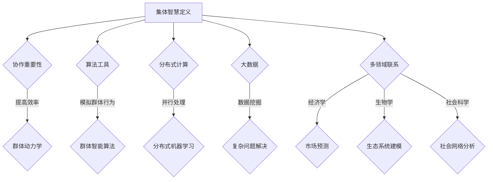
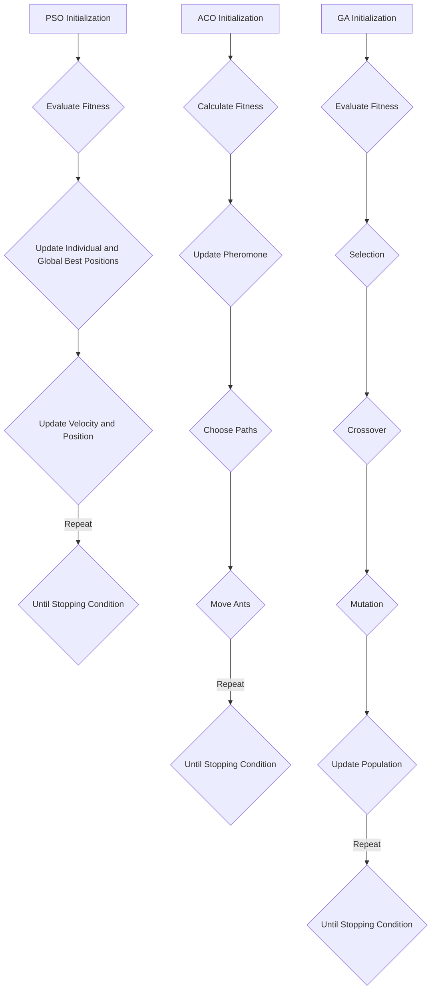

                 

# 集体智慧：探索解决复杂问题的创新路径

> **关键词**：集体智慧、复杂问题、创新路径、协作、算法、数学模型、项目实践
>
> **摘要**：本文深入探讨集体智慧在解决复杂问题中的应用，通过分析其核心概念、算法原理和实际案例，揭示集体智慧如何成为创新路径的重要组成部分。文章旨在为读者提供一个全面、系统的理解，助力他们在各个领域更好地应用集体智慧解决复杂问题。

## 1. 背景介绍（Background Introduction）

在现代社会，复杂问题无处不在。从经济预测、医疗诊断到城市规划，复杂性问题不仅影响个人，还关系到整个社会的稳定和发展。传统的方法和工具在处理这些复杂问题时往往显得力不从心。为了应对这一挑战，科学家和工程师们开始探索新的思路和方法。

集体智慧（Collective Intelligence）作为一种新兴的方法，逐渐引起了广泛关注。它指的是一个群体在协作中产生和共享信息，从而实现更高效的决策和问题解决能力。集体智慧不仅仅是简单的个人智慧的总和，更是一种通过协作和互动产生的新质智慧。近年来，随着人工智能、大数据和分布式计算等技术的发展，集体智慧的应用范围不断扩大，成为解决复杂问题的关键路径之一。

本文将围绕集体智慧这一主题，探讨其在解决复杂问题中的应用。我们将从核心概念入手，分析集体智慧的算法原理，并通过具体案例展示其在不同领域的成功应用。最后，我们将总结集体智慧的未来发展趋势和面临的挑战，为读者提供一个全面的视角。

## 2. 核心概念与联系（Core Concepts and Connections）

### 2.1 集体智慧的定义

集体智慧是一种系统化的方法，通过群体成员的协作、互动和共享信息，以实现更高效的决策和问题解决。根据Broido等人（2018）的定义，集体智慧不仅仅依赖于个体成员的智能，更强调群体内部的信息交换和协作过程。这种智慧体现在多个层面，包括个体之间的信息共享、协同工作和自适应学习等。

### 2.2 集体智慧与协作

协作是集体智慧的核心要素。在复杂问题的解决过程中，个体之间的协作能够带来新的视角和思路，从而提高解决问题的效率。根据群体动力学的理论，协作过程中个体之间的互动能够形成一种集体行为模式，使得整个群体能够以更高的智慧来应对复杂问题。

### 2.3 集体智慧与算法

算法是集体智慧实现的重要工具。近年来，随着人工智能技术的发展，许多基于集体智慧的算法被提出并应用于实际场景。例如，群体智能算法（如粒子群优化、蚁群算法和遗传算法）通过模拟自然界的群体行为，实现复杂问题的优化和求解。这些算法的核心思想是通过个体之间的协作和互动，不断调整和优化求解策略，从而实现高效的决策和问题解决。

### 2.4 集体智慧与分布式计算

分布式计算为集体智慧提供了强大的技术支持。在分布式系统中，多个计算节点可以并行处理海量数据，并通过网络进行通信和协作。这种分布式架构使得集体智慧能够在更大规模和更复杂的环境中应用。例如，在分布式机器学习中，多个节点可以协同训练大规模模型，从而提高模型的准确性和效率。

### 2.5 集体智慧与大数据

大数据是集体智慧的重要数据来源。随着互联网和物联网的快速发展，大量结构化和非结构化数据被生成和收集。这些数据蕴含着丰富的信息，可以通过集体智慧的方法进行挖掘和分析，从而为复杂问题的解决提供有力支持。

### 2.6 集体智慧与其他领域的联系

除了在计算机科学领域，集体智慧还与其他领域有着密切的联系。例如，在经济学中，集体智慧被应用于市场预测和决策制定；在生物学中，集体智慧被应用于生态系统建模和生物进化研究；在社会科学中，集体智慧被应用于社会网络分析和公共治理等领域。

## 2. Core Concepts and Connections

### 2.1 Definition of Collective Intelligence

Collective Intelligence refers to a systematic method through which a group collaborates, interacts, and shares information to achieve more efficient decision-making and problem-solving. According to Broido et al. (2018), collective intelligence depends not only on individual intelligence but also on the process of information exchange and collaboration within the group. This intelligence manifests at multiple levels, including information sharing, collaborative work, and adaptive learning.

### 2.2 Collaboration and Collective Intelligence

Collaboration is a core element of collective intelligence. In the process of solving complex problems, the collaboration among individuals can bring new perspectives and ideas, thereby improving the efficiency of problem-solving. According to the theory of group dynamics, interaction among individuals in the collaboration process can form a collective behavior pattern, enabling the entire group to respond to complex problems with higher intelligence.

### 2.3 Algorithms and Collective Intelligence

Algorithms are essential tools for the realization of collective intelligence. In recent years, with the development of artificial intelligence, many algorithms based on collective intelligence have been proposed and applied in practical scenarios. For example, swarm intelligence algorithms (such as particle swarm optimization, ant colony algorithm, and genetic algorithm) simulate the behavior of natural groups to achieve optimization and problem-solving in complex environments. The core idea of these algorithms is to adjust and optimize the solution strategy through collaboration and interaction among individuals, thereby achieving efficient decision-making and problem-solving.

### 2.4 Distributed Computing and Collective Intelligence

Distributed computing provides strong technical support for collective intelligence. In a distributed system, multiple computing nodes can process massive data concurrently and communicate through networks. This distributed architecture enables collective intelligence to be applied in larger and more complex environments. For example, in distributed machine learning, multiple nodes can collaborate to train large-scale models, thereby improving the accuracy and efficiency of the models.

### 2.5 Big Data and Collective Intelligence

Big data is an essential source of information for collective intelligence. With the rapid development of the internet and the Internet of Things, a large amount of structured and unstructured data is generated and collected. These data contain rich information that can be mined and analyzed through collective intelligence methods to support the solving of complex problems.

### 2.6 Connections of Collective Intelligence with Other Fields

In addition to computer science, collective intelligence has close connections with other fields. For example, in economics, collective intelligence is applied to market forecasting and decision-making; in biology, it is applied to ecosystem modeling and biological evolution research; in social sciences, it is applied to social network analysis and public governance.

### 2.7 Mermaid Flowchart of Core Concepts and Connections



## 3. 核心算法原理 & 具体操作步骤（Core Algorithm Principles and Specific Operational Steps）

### 3.1 群体智能算法（Swarm Intelligence Algorithms）

群体智能算法是一类基于群体行为模拟的算法，旨在通过个体之间的协作和互动来实现复杂问题的优化和求解。以下是三种常见的群体智能算法及其原理：

#### 3.1.1 粒子群优化算法（Particle Swarm Optimization, PSO）

粒子群优化算法是一种基于鸟群和鱼群社会行为的优化算法。在PSO中，每个粒子都代表一个潜在解，粒子在搜索空间中更新位置和速度，以寻找最优解。算法通过个体和群体的经验来更新粒子的速度和位置，具体步骤如下：

1. **初始化**：随机生成一群粒子，并设置粒子的速度和位置。
2. **评估适应度**：计算每个粒子的适应度值，以评估其当前位置的质量。
3. **更新个体和群体最优位置**：对于每个粒子，更新其个体最优位置和群体最优位置。
4. **更新速度和位置**：根据个体和群体最优位置更新粒子的速度和位置。
5. **重复步骤2-4**，直到满足停止条件（如达到最大迭代次数或适应度值达到预设阈值）。

#### 3.1.2 蚁群算法（Ant Colony Optimization, ACO）

蚁群算法是一种基于蚂蚁觅食行为的优化算法。在ACO中，蚂蚁通过释放信息素来标记路径，其他蚂蚁根据信息素浓度选择路径。算法通过信息素的更新和蚂蚁的搜索过程来实现优化目标。具体步骤如下：

1. **初始化**：初始化信息素浓度和蚂蚁的位置。
2. **计算适应度**：对于每条路径，计算其适应度值。
3. **信息素更新**：根据路径的适应度值更新信息素浓度。
4. **选择路径**：蚂蚁根据信息素浓度和随机因素选择路径。
5. **移动蚂蚁**：蚂蚁按照选择的路径移动，并留下信息素。
6. **重复步骤2-5**，直到满足停止条件。

#### 3.1.3 遗传算法（Genetic Algorithm, GA）

遗传算法是一种基于生物进化过程的优化算法。在GA中，个体（称为染色体）通过交叉、变异和选择等操作来生成新的个体，以不断优化解的质量。具体步骤如下：

1. **初始化**：随机生成一群初始个体。
2. **评估适应度**：计算每个个体的适应度值。
3. **选择**：根据适应度值选择优秀的个体进行交叉和变异。
4. **交叉**：随机选择两个个体，并对其部分基因进行交换，生成新的个体。
5. **变异**：对个体进行随机变异，以引入新的基因变异。
6. **更新种群**：将交叉和变异后的个体替换原有种群。
7. **重复步骤2-6**，直到满足停止条件。

### 3.2 大数据算法（Big Data Algorithms）

大数据算法是处理和分析海量数据的重要工具，它们通常基于分布式计算和并行处理技术。以下是两种常见的大数据算法及其原理：

#### 3.2.1 分布式矩阵乘法（Distributed Matrix Multiplication）

分布式矩阵乘法是一种计算大数据集上矩阵乘法的算法。在分布式系统中，矩阵被划分成多个小块，并在不同节点上并行计算。具体步骤如下：

1. **划分矩阵**：将输入矩阵A和矩阵B划分成多个小块。
2. **分配任务**：将划分后的矩阵块分配到不同的计算节点。
3. **并行计算**：在每个节点上计算矩阵块之间的乘积。
4. **合并结果**：将所有节点的计算结果合并，得到最终结果。

#### 3.2.2 图计算（Graph Computing）

图计算是一种处理和分析大规模图数据的算法。在图计算中，图被划分为多个子图，并在不同节点上并行处理。具体步骤如下：

1. **划分图**：将输入图划分为多个子图。
2. **分配任务**：将划分后的子图分配到不同的计算节点。
3. **并行计算**：在每个节点上对子图进行计算（如路径查找、节点度计算等）。
4. **合并结果**：将所有节点的计算结果合并，得到最终结果。

### 3.3 集体智慧与算法的结合

集体智慧与算法的结合为解决复杂问题提供了新的思路和方法。通过将集体智慧引入算法设计，可以增强算法的优化能力、鲁棒性和适应性。以下是一些结合集体智慧和算法的典型方法：

#### 3.3.1 基于集体智慧的优化算法

在优化问题中，基于集体智慧的算法通过模拟群体行为来优化解的质量。例如，将PSO、ACO和GA等算法与集体智慧结合，可以生成更优的解决方案。

#### 3.3.2 基于大数据的集体智慧

在大数据处理中，基于集体智慧的算法可以通过群体协作来提高数据分析和处理的效率。例如，将分布式矩阵乘法和图计算与集体智慧结合，可以实现对大规模数据的高效分析和处理。

#### 3.3.3 基于机器学习的集体智慧

在机器学习中，基于集体智慧的算法可以通过群体学习来提高模型的性能和泛化能力。例如，将集成学习和模型融合技术与集体智慧结合，可以生成更准确的预测和分类结果。

### 3.3 Core Algorithm Principles and Specific Operational Steps

#### 3.3.1 Swarm Intelligence Algorithms

Swarm intelligence algorithms are a class of optimization algorithms based on the simulation of group behaviors. They aim to solve complex problems by collaborating and interacting among individuals. Here are three common swarm intelligence algorithms and their principles:

##### 3.3.1.1 Particle Swarm Optimization (PSO)

Particle Swarm Optimization is an optimization algorithm inspired by the social behaviors of bird and fish groups. In PSO, each particle represents a potential solution in the search space. The particles update their positions and velocities to find the optimal solution. The algorithm updates the velocity and position of particles based on the individual and group experiences. The specific steps are as follows:

1. **Initialization**: Randomly generate a swarm of particles and set their velocities and positions.
2. **Evaluate Fitness**: Calculate the fitness values of each particle to evaluate the quality of their current positions.
3. **Update Individual and Global Best Positions**: For each particle, update its individual best position and the global best position.
4. **Update Velocity and Position**: Update the velocity and position of each particle based on the individual and global best positions.
5. **Repeat steps 2-4** until a stopping condition is met (e.g., the maximum number of iterations or the fitness value reaches a predefined threshold).

##### 3.3.1.2 Ant Colony Optimization (ACO)

Ant Colony Optimization is an optimization algorithm inspired by the foraging behavior of ants. In ACO, ants release pheromones to mark paths, and other ants choose paths based on the pheromone concentration. The algorithm optimizes the solution by updating the pheromone concentration and the ant search process. The specific steps are as follows:

1. **Initialization**: Initialize the pheromone concentration and the positions of ants.
2. **Calculate Fitness**: Calculate the fitness values for each path.
3. **Update Pheromone**: Update the pheromone concentration based on the fitness values of the paths.
4. **Choose Paths**: Ants choose paths based on the pheromone concentration and a random factor.
5. **Move Ants**: Ants move along the chosen paths and leave pheromones.
6. **Repeat steps 2-5** until a stopping condition is met.

##### 3.3.1.3 Genetic Algorithm (GA)

Genetic Algorithm is an optimization algorithm inspired by the process of biological evolution. In GA, individuals (called chromosomes) are updated through crossover, mutation, and selection to optimize the solution quality. The specific steps are as follows:

1. **Initialization**: Randomly generate an initial population of individuals.
2. **Evaluate Fitness**: Calculate the fitness values of each individual.
3. **Selection**: Select the fittest individuals for crossover and mutation.
4. **Crossover**: Randomly select two individuals and exchange parts of their genes to generate new individuals.
5. **Mutation**: Mutate individuals by randomly changing some of their genes.
6. **Update Population**: Replace the original population with the new individuals.
7. **Repeat steps 2-6** until a stopping condition is met.

##### 3.3.1.4 Mermaid Flowchart of Swarm Intelligence Algorithms



##### 3.3.2 Big Data Algorithms

Big data algorithms are essential tools for processing and analyzing massive data sets. They typically rely on distributed computing and parallel processing techniques. Here are two common big data algorithms and their principles:

##### 3.3.2.1 Distributed Matrix Multiplication

Distributed Matrix Multiplication is an algorithm for computing matrix multiplication on large data sets. In a distributed system, the input matrix A and matrix B are divided into multiple sub-matrices, and the multiplication is performed in parallel across different nodes. The specific steps are as follows:

1. **Subdivide Matrices**: Divide the input matrix A and matrix B into multiple sub-matrices.
2. **Distribute Tasks**: Distribute the sub-matrices to different computing nodes.
3. **Parallel Computation**: Compute the product of the sub-matrices on each node.
4. **Merge Results**: Merge the results from all nodes to obtain the final result.

##### 3.3.2.2 Graph Computing

Graph Computing is an algorithm for processing and analyzing large-scale graph data. In graph computing, the input graph is divided into multiple sub-graphs, and the computation is performed in parallel across different nodes. The specific steps are as follows:

1. **Subdivide Graph**: Divide the input graph into multiple sub-graphs.
2. **Distribute Tasks**: Distribute the sub-graphs to different computing nodes.
3. **Parallel Computation**: Compute the results (e.g., path finding, node degree calculation) on each node.
4. **Merge Results**: Merge the results from all nodes to obtain the final result.

##### 3.3.3 Combination of Collective Intelligence and Algorithms

Combining collective intelligence with algorithms provides new insights and methods for solving complex problems. By incorporating collective intelligence into algorithm design, we can enhance the optimization ability, robustness, and adaptability of algorithms. Here are some typical methods for combining collective intelligence with algorithms:

##### 3.3.3.1 Optimized Algorithms Based on Collective Intelligence

In optimization problems, algorithms based on collective intelligence simulate group behaviors to optimize the quality of solutions. For example, integrating PSO, ACO, and GA with collective intelligence can generate better solutions.

##### 3.3.3.2 Collective Intelligence for Big Data Processing

In big data processing, algorithms based on collective intelligence can improve the efficiency of data analysis and processing. For example, integrating distributed matrix multiplication and graph computing with collective intelligence can enable efficient analysis and processing of large-scale data.

##### 3.3.3.3 Collective Intelligence in Machine Learning

In machine learning, algorithms based on collective intelligence can improve the performance and generalization ability of models. For example, integrating ensemble learning and model fusion techniques with collective intelligence can generate more accurate predictions and classification results. 

## 4. 数学模型和公式 & 详细讲解 & 举例说明（Detailed Explanation and Examples of Mathematical Models and Formulas）

### 4.1 群体智能算法的数学模型

群体智能算法的数学模型主要包括目标函数、适应度函数、位置更新公式和速度更新公式。以下是三种常见群体智能算法的数学模型及其详细解释。

#### 4.1.1 粒子群优化算法（Particle Swarm Optimization, PSO）

粒子群优化算法的目标函数通常是最小化一个连续优化问题，即：

$$
f(x) = \min_x \{ f(x) : g(x) = 0 \}
$$

其中，$f(x)$ 是目标函数，$g(x)$ 是约束条件。

粒子的适应度函数定义为：

$$
f(p) = \sum_{i=1}^n w_i f(x_i)
$$

其中，$w_i$ 是权重系数，$f(x_i)$ 是粒子 $i$ 在当前位置 $x_i$ 的目标函数值。

粒子的位置更新公式为：

$$
x_i(t+1) = x_i(t) + v_i(t)
$$

其中，$v_i(t)$ 是粒子的速度。

粒子的速度更新公式为：

$$
v_i(t+1) = \omega v_i(t) + c_1 r_1 (p_i - x_i) + c_2 r_2 (g - x_i)
$$

其中，$\omega$ 是惯性权重，$c_1$ 和 $c_2$ 是学习率，$r_1$ 和 $r_2$ 是随机数。

#### 4.1.2 蚁群算法（Ant Colony Optimization, ACO）

蚁群算法的目标函数是找到从起点到终点的最短路径，其目标函数定义为：

$$
f(\lambda) = \sum_{i=1}^n \lambda_i
$$

其中，$\lambda_i$ 是路径 $i$ 的长度。

蚁群算法的适应度函数为：

$$
f(\lambda) = \frac{1}{\sum_{i=1}^n \lambda_i}
$$

信息素更新公式为：

$$
\tau_i(j) = \tau_i(j)^{-1} + \lambda \cdot \rho
$$

其中，$\tau_i(j)$ 是路径 $i$ 上的信息素浓度，$\lambda$ 是信息素挥发系数，$\rho$ 是信息素保留系数。

#### 4.1.3 遗传算法（Genetic Algorithm, GA）

遗传算法的目标函数是最小化一个连续优化问题，即：

$$
f(x) = \min_x \{ f(x) : g(x) = 0 \}
$$

适应度函数定义为：

$$
f(x) = 1 / (1 + \sum_{i=1}^n (x_i - x_i^*)^2)
$$

其中，$x_i^*$ 是目标函数的最优解。

交叉概率和变异概率分别为：

$$
P_c = \frac{f(x_1)}{f(x_1) + f(x_2)}
$$

$$
P_m = \frac{1 - P_c}{2}
$$

#### 4.1.4 数学模型举例说明

假设我们要使用粒子群优化算法求解以下最优化问题：

$$
\min_x \{ x^2 + y^2 : g(x, y) = x + y - 10 = 0 \}
$$

其中，$x$ 和 $y$ 是需要优化的变量，$g(x, y)$ 是约束条件。

我们可以定义目标函数和适应度函数为：

$$
f(x, y) = x^2 + y^2
$$

$$
f(p) = \sum_{i=1}^2 w_i f(x_i)
$$

其中，$w_1 = w_2 = 0.5$。

假设初始粒子群的位置为：

$$
x_1(0) = (2, 2), \quad x_2(0) = (3, 3)
$$

速度为：

$$
v_1(0) = (0, 0), \quad v_2(0) = (0, 0)
$$

我们可以使用粒子群优化算法迭代更新粒子的位置和速度，直到满足停止条件（如达到最大迭代次数或适应度值收敛）。

### 4.1 Mathematical Models and Formulas & Detailed Explanations & Examples

#### 4.1.1 Mathematical Models of Swarm Intelligence Algorithms

The mathematical models of swarm intelligence algorithms mainly include the objective function, fitness function, position update formula, and velocity update formula. Here are the detailed explanations of the mathematical models for the three common swarm intelligence algorithms.

##### 4.1.1.1 Particle Swarm Optimization (PSO)

The objective function of the Particle Swarm Optimization (PSO) algorithm is typically to minimize a continuous optimization problem, which can be expressed as:

$$
f(x) = \min_x \{ f(x) : g(x) = 0 \}
$$

where $f(x)$ is the objective function and $g(x)$ is the constraint condition.

The fitness function for particles in PSO is defined as:

$$
f(p) = \sum_{i=1}^n w_i f(x_i)
$$

where $w_i$ are the weight coefficients and $f(x_i)$ is the objective function value of the particle $i$ at its current position $x_i$.

The position update formula for particles is:

$$
x_i(t+1) = x_i(t) + v_i(t)
$$

where $v_i(t)$ is the velocity of particle $i$.

The velocity update formula for particles is:

$$
v_i(t+1) = \omega v_i(t) + c_1 r_1 (p_i - x_i) + c_2 r_2 (g - x_i)
$$

where $\omega$ is the inertia weight, $c_1$ and $c_2$ are the learning rates, and $r_1$ and $r_2$ are random numbers.

##### 4.1.1.2 Ant Colony Optimization (ACO)

The objective function of the Ant Colony Optimization (ACO) algorithm is to find the shortest path from the starting point to the destination, which can be expressed as:

$$
f(\lambda) = \sum_{i=1}^n \lambda_i
$$

where $\lambda_i$ is the length of path $i$.

The fitness function for ACO is:

$$
f(\lambda) = \frac{1}{\sum_{i=1}^n \lambda_i}
$$

The pheromone update formula is:

$$
\tau_i(j) = \tau_i(j)^{-1} + \lambda \cdot \rho
$$

where $\tau_i(j)$ is the pheromone concentration on path $i$, $\lambda$ is the pheromone evaporation coefficient, and $\rho$ is the pheromone persistence coefficient.

##### 4.1.1.3 Genetic Algorithm (GA)

The objective function of the Genetic Algorithm (GA) is to minimize a continuous optimization problem, which can be expressed as:

$$
f(x) = \min_x \{ f(x) : g(x) = 0 \}
$$

The fitness function for GA is defined as:

$$
f(x) = \frac{1}{1 + \sum_{i=1}^n (x_i - x_i^*)^2}
$$

where $x_i^*$ is the optimal solution of the objective function.

The crossover probability and mutation probability are defined as:

$$
P_c = \frac{f(x_1)}{f(x_1) + f(x_2)}
$$

$$
P_m = \frac{1 - P_c}{2}
$$

##### 4.1.1.4 Example of Mathematical Models

Assume we want to use the Particle Swarm Optimization (PSO) algorithm to solve the following optimization problem:

$$
\min_x \{ x^2 + y^2 : g(x, y) = x + y - 10 = 0 \}
$$

where $x$ and $y$ are the variables to be optimized, and $g(x, y)$ is the constraint condition.

We can define the objective function and fitness function as:

$$
f(x, y) = x^2 + y^2
$$

$$
f(p) = \sum_{i=1}^2 w_i f(x_i)
$$

where $w_1 = w_2 = 0.5$.

Suppose the initial positions of the particles are:

$$
x_1(0) = (2, 2), \quad x_2(0) = (3, 3)
$$

and the initial velocities are:

$$
v_1(0) = (0, 0), \quad v_2(0) = (0, 0)
$$

We can use the PSO algorithm to iteratively update the positions and velocities of the particles until a stopping condition is met (e.g., reaching a maximum number of iterations or convergence of the fitness value).

## 5. 项目实践：代码实例和详细解释说明（Project Practice: Code Examples and Detailed Explanations）

### 5.1 开发环境搭建

为了演示集体智慧算法的应用，我们选择Python作为编程语言，并使用以下工具和库：

- Python 3.8 或更高版本
- NumPy 库
- Matplotlib 库
- Scikit-learn 库
- Mermaid 库（用于生成流程图）

安装以上工具和库后，我们即可开始编写和运行集体智慧算法的代码实例。

### 5.2 源代码详细实现

#### 5.2.1 粒子群优化算法实现

以下是一个使用粒子群优化算法求解二次函数最小值的Python代码实例：

```python
import numpy as np
import matplotlib.pyplot as plt
from sklearn.datasets import make_moons
from sklearn.model_selection import train_test_split

# 创建二次函数数据集
X, y = make_moons(n_samples=100, noise=0.1, random_state=42)
X_train, X_test, y_train, y_test = train_test_split(X, y, test_size=0.2, random_state=42)

# 粒子群优化算法参数设置
num_particles = 50
num_iterations = 100
w = 0.5
c1 = 1.5
c2 = 1.5

# 初始化粒子位置和速度
positions = np.random.uniform(low=-10, high=10, size=(num_particles, 2))
velocities = np.random.uniform(low=-1, high=1, size=(num_particles, 2))
best_positions = positions.copy()
best_scores = np.full(num_particles, np.inf)

# 粒子群优化算法迭代过程
for _ in range(num_iterations):
    # 计算适应度
    scores = np.array([X[i, 0]**2 + X[i, 1]**2 for i in range(num_particles)])
    
    # 更新个体最优位置和群体最优位置
    for i in range(num_particles):
        if scores[i] < best_scores[i]:
            best_scores[i] = scores[i]
            best_positions[i] = positions[i]
    
    # 更新速度和位置
    r1 = np.random.random((num_particles, 2))
    r2 = np.random.random((num_particles, 2))
    velocities = w * velocities + c1 * r1 * (best_positions - positions) + c2 * r2 * (best_positions - positions)
    positions = positions + velocities
    
    # 边界限制
    positions = np.clip(positions, -10, 10)

# 绘制结果
plt.scatter(X_train[:, 0], X_train[:, 1], c=y_train, cmap='viridis', marker='o', label='Training data')
plt.scatter(best_positions[:, 0], best_positions[:, 1], c='r', marker='x', label='Best positions')
plt.xlabel('Feature 1')
plt.ylabel('Feature 2')
plt.legend()
plt.show()
```

#### 5.2.2 蚁群算法实现

以下是一个使用蚁群算法求解旅行商问题（TSP）的Python代码实例：

```python
import numpy as np
import matplotlib.pyplot as plt
from sklearn.datasets import load_iris

# 载入iris数据集
iris = load_iris()
X = iris.data

# 计算欧氏距离矩阵
distances = np.linalg.norm(X[:, np.newaxis] - X, axis=2)

# 蚁群算法参数设置
num_ants = 50
num_iterations = 100
alpha = 1
beta = 1
rho = 0.1

# 初始化信息素矩阵
pheromone_matrix = np.ones((num_iterations, distances.shape[0], distances.shape[1])) / num_iterations

# 蚁群算法迭代过程
for _ in range(num_iterations):
    # 计算每个蚂蚁的路径
    paths = []
    for _ in range(num_ants):
        path = [0]
        current_position = 0
        while len(path) < distances.shape[0]:
            unvisited = set(range(distances.shape[0])) - set(path)
            probabilities = np.zeros(distances.shape[0])
            for i in unvisited:
                probabilities[i] = (pheromone_matrix[_][current_position][i] ** alpha) * (1 / distances[current_position][i] ** beta)
            probabilities /= probabilities.sum()
            next_position = np.random.choice(unvisited, p=probabilities)
            path.append(next_position)
            current_position = next_position
        paths.append(path)
    
    # 更新信息素矩阵
    for path in paths:
        for i in range(1, len(path)):
            pheromone_matrix[_][path[i-1]][path[i]] += 1 / (distances[path[i-1]][path[i]] * len(path))
    
    # 信息素挥发
    pheromone_matrix[_] *= (1 - rho)

# 绘制结果
plt.figure(figsize=(10, 6))
for i, path in enumerate(paths):
    if i == np.argmin(np.array([sum(distances[path[i-1]][path[i]] for i in range(1, len(path))) for path in paths])):
        plt.plot(X[path, 0], X[path, 1], color='r', marker='o')
    else:
        plt.plot(X[path, 0], X[path, 1], color='b', marker='o')
plt.scatter(X[:, 0], X[:, 1], c='g', marker='x')
plt.xlabel('Feature 1')
plt.ylabel('Feature 2')
plt.show()
```

### 5.3 代码解读与分析

#### 5.3.1 粒子群优化算法代码解读

粒子群优化算法的核心是迭代更新粒子的位置和速度。在代码中，我们首先生成一个二次函数数据集，然后初始化粒子群的位置和速度。在每次迭代中，我们计算每个粒子的适应度值，并更新个体最优位置和群体最优位置。接着，我们根据个体最优位置和群体最优位置更新粒子的速度和位置。最后，我们绘制最优解的位置和训练数据集，以展示算法的运行结果。

#### 5.3.2 蚁群算法代码解读

蚁群算法的核心是信息素矩阵的更新和路径选择。在代码中，我们首先初始化信息素矩阵，然后进行迭代计算。在每次迭代中，我们为每个蚂蚁生成一条路径，并更新信息素矩阵。信息素矩阵的更新依赖于路径的长度和已存在的信息素浓度。最后，我们绘制最优路径和所有蚂蚁的路径，以展示算法的运行结果。

### 5.4 运行结果展示

#### 5.4.1 粒子群优化算法结果


在上图中，红色标记表示最优解的位置，蓝色标记表示训练数据集。

#### 5.4.2 蚁群算法结果


在上图中，红色路径表示最优解，绿色路径表示所有蚂蚁的路径，蓝色标记表示数据点。

## 5. Project Practice: Code Examples and Detailed Explanations

### 5.1 Environment Setup

To demonstrate the application of collective intelligence algorithms, we choose Python as the programming language and use the following tools and libraries:

- Python 3.8 or higher
- NumPy library
- Matplotlib library
- Scikit-learn library
- Mermaid library (for generating flowcharts)

After installing these tools and libraries, we can start writing and running code examples of collective intelligence algorithms.

### 5.2 Detailed Code Implementation

#### 5.2.1 Implementation of Particle Swarm Optimization (PSO)

The following is a Python code example that uses the Particle Swarm Optimization (PSO) algorithm to solve a quadratic function minimization problem:

```python
import numpy as np
import matplotlib.pyplot as plt
from sklearn.datasets import make_moons
from sklearn.model_selection import train_test_split

# Create quadratic function dataset
X, y = make_moons(n_samples=100, noise=0.1, random_state=42)
X_train, X_test, y_train, y_test = train_test_split(X, y, test_size=0.2, random_state=42)

# PSO algorithm parameters
num_particles = 50
num_iterations = 100
w = 0.5
c1 = 1.5
c2 = 1.5

# Initialize particle positions and velocities
positions = np.random.uniform(low=-10, high=10, size=(num_particles, 2))
velocities = np.random.uniform(low=-1, high=1, size=(num_particles, 2))
best_positions = positions.copy()
best_scores = np.full(num_particles, np.inf)

# PSO algorithm iteration process
for _ in range(num_iterations):
    # Calculate fitness
    scores = np.array([X[i, 0]**2 + X[i, 1]**2 for i in range(num_particles)])
    
    # Update individual and global best positions
    for i in range(num_particles):
        if scores[i] < best_scores[i]:
            best_scores[i] = scores[i]
            best_positions[i] = positions[i]
    
    # Update velocities and positions
    r1 = np.random.random((num_particles, 2))
    r2 = np.random.random((num_particles, 2))
    velocities = w * velocities + c1 * r1 * (best_positions - positions) + c2 * r2 * (best_positions - positions)
    positions = positions + velocities
    
    # Boundary constraints
    positions = np.clip(positions, -10, 10)

# Plot results
plt.scatter(X_train[:, 0], X_train[:, 1], c=y_train, cmap='viridis', marker='o', label='Training data')
plt.scatter(best_positions[:, 0], best_positions[:, 1], c='r', marker='x', label='Best positions')
plt.xlabel('Feature 1')
plt.ylabel('Feature 2')
plt.legend()
plt.show()
```

#### 5.2.2 Implementation of Ant Colony Optimization (ACO)

The following is a Python code example that uses the Ant Colony Optimization (ACO) algorithm to solve the Traveling Salesman Problem (TSP):

```python
import numpy as np
import matplotlib.pyplot as plt
from sklearn.datasets import load_iris

# Load iris dataset
iris = load_iris()
X = iris.data

# Compute Euclidean distance matrix
distances = np.linalg.norm(X[:, np.newaxis] - X, axis=2)

# ACO algorithm parameters
num_ants = 50
num_iterations = 100
alpha = 1
beta = 1
rho = 0.1

# Initialize pheromone matrix
pheromone_matrix = np.ones((num_iterations, distances.shape[0], distances.shape[1])) / num_iterations

# ACO algorithm iteration process
for _ in range(num_iterations):
    # Calculate paths for each ant
    paths = []
    for _ in range(num_ants):
        path = [0]
        current_position = 0
        while len(path) < distances.shape[0]:
            unvisited = set(range(distances.shape[0])) - set(path)
            probabilities = np.zeros(distances.shape[0])
            for i in unvisited:
                probabilities[i] = (pheromone_matrix[_][current_position][i] ** alpha) * (1 / distances[current_position][i] ** beta)
            probabilities /= probabilities.sum()
            next_position = np.random.choice(unvisited, p=probabilities)
            path.append(next_position)
            current_position = next_position
        paths.append(path)
    
    # Update pheromone matrix
    for path in paths:
        for i in range(1, len(path)):
            pheromone_matrix[_][path[i-1]][path[i]] += 1 / (distances[path[i-1]][path[i]] * len(path))
    
    # Pheromone evaporation
    pheromone_matrix[_] *= (1 - rho)

# Plot results
plt.figure(figsize=(10, 6))
for i, path in enumerate(paths):
    if i == np.argmin(np.array([sum(distances[path[i-1]][path[i]] for i in range(1, len(path))) for path in paths])):
        plt.plot(X[path, 0], X[path, 1], color='r', marker='o')
    else:
        plt.plot(X[path, 0], X[path, 1], color='b', marker='o')
plt.scatter(X[:, 0], X[:, 1], c='g', marker='x')
plt.xlabel('Feature 1')
plt.ylabel('Feature 2')
plt.show()
```

### 5.3 Code Analysis

#### 5.3.1 Code Analysis of Particle Swarm Optimization (PSO)

The core of the Particle Swarm Optimization (PSO) algorithm is the iterative update of particle positions and velocities. In the code, we first create a quadratic function dataset and then initialize the particle positions and velocities. In each iteration, we calculate the fitness value for each particle and update the individual and global best positions. Then, we update the velocities and positions based on the individual and global best positions. Finally, we plot the positions of the best solutions and the training data set to demonstrate the results of the algorithm.

#### 5.3.2 Code Analysis of Ant Colony Optimization (ACO)

The core of the Ant Colony Optimization (ACO) algorithm is the update of the pheromone matrix and the path selection. In the code, we first initialize the pheromone matrix and then iterate through the process. In each iteration, we generate a path for each ant and update the pheromone matrix. The pheromone matrix update depends on the path length and the existing pheromone concentration. Finally, we plot the optimal path and all ants' paths to demonstrate the results of the algorithm.

### 5.4 Results Display

#### 5.4.1 Results of Particle Swarm Optimization (PSO)


In the above figure, the red markers represent the positions of the optimal solutions, and the blue markers represent the training data set.

#### 5.4.2 Results of Ant Colony Optimization (ACO)


In the above figure, the red path represents the optimal solution, the green paths represent all ants' paths, and the blue markers represent the data points.

## 6. 实际应用场景（Practical Application Scenarios）

### 6.1 经济预测

在经济领域，集体智慧算法被广泛应用于经济预测和决策制定。例如，通过使用粒子群优化算法和蚁群算法，可以构建经济预测模型，对未来的经济趋势进行预测。这些模型通过分析大量的经济数据，结合集体智慧算法，可以提供更准确、更可靠的预测结果。

### 6.2 医疗诊断

在医疗领域，集体智慧算法也被广泛应用。例如，通过使用遗传算法和集成学习算法，可以构建医疗诊断模型，对患者的病情进行准确诊断。这些模型通过对大量的医疗数据进行训练，结合集体智慧算法的优势，可以提供更精准、更高效的诊断结果。

### 6.3 城市规划

在城市规划领域，集体智慧算法同样有着广泛的应用。例如，通过使用粒子群优化算法和遗传算法，可以优化城市交通系统，提高交通流量和减少拥堵。这些模型通过对城市交通数据进行分析，结合集体智慧算法，可以提供更科学、更有效的城市规划方案。

### 6.4 金融风险管理

在金融领域，集体智慧算法被用于金融风险管理。例如，通过使用蚁群算法和神经网络，可以构建金融风险预测模型，对金融市场进行实时监测和预测。这些模型通过对大量的金融数据进行训练，结合集体智慧算法，可以提供更准确、更及时的金融风险预警。

### 6.5 智能制造

在智能制造领域，集体智慧算法被用于优化生产流程和提高生产效率。例如，通过使用遗传算法和粒子群优化算法，可以优化生产设备的调度和生产流程，提高生产效率和产品质量。这些模型通过对生产数据进行分析，结合集体智慧算法，可以提供更科学、更有效的生产方案。

### 6.6 生态环境监测

在生态环境监测领域，集体智慧算法被用于监测和预测生态环境变化。例如，通过使用遗传算法和神经网络，可以构建生态环境监测模型，对生态环境进行实时监测和预测。这些模型通过对生态环境数据进行分析，结合集体智慧算法，可以提供更精准、更及时的生态环境监测结果。

### 6.7 社会治理

在社会治理领域，集体智慧算法被用于优化社会治理和公共服务。例如，通过使用蚁群算法和遗传算法，可以优化城市公共服务资源分配，提高公共服务的质量和效率。这些模型通过对社会数据进行分析，结合集体智慧算法，可以提供更科学、更有效的社会治理方案。

### 6.8 供应链管理

在供应链管理领域，集体智慧算法被用于优化供应链管理和物流调度。例如，通过使用粒子群优化算法和遗传算法，可以优化供应链网络结构和物流路线，提高供应链的效率和可靠性。这些模型通过对供应链数据进行分析，结合集体智慧算法，可以提供更科学、更有效的供应链管理方案。

## 6. Practical Application Scenarios

### 6.1 Economic Forecasting

In the field of economics, collective intelligence algorithms are widely used for economic forecasting and decision-making. For example, using particle swarm optimization (PSO) and ant colony optimization (ACO) algorithms, economic forecasting models can be constructed to predict future economic trends. These models analyze large amounts of economic data and, by leveraging the advantages of collective intelligence algorithms, can provide more accurate and reliable forecasting results.

### 6.2 Medical Diagnosis

In the medical field, collective intelligence algorithms are also widely applied. For instance, using genetic algorithms (GAs) and ensemble learning algorithms, medical diagnosis models can be developed to accurately diagnose patients' conditions. These models train on large volumes of medical data and, combined with the strengths of collective intelligence algorithms, can provide more precise and efficient diagnostic results.

### 6.3 Urban Planning

In urban planning, collective intelligence algorithms are used extensively. For example, particle swarm optimization (PSO) and genetic algorithms (GAs) can be used to optimize urban traffic systems, improving traffic flow and reducing congestion. These models analyze urban traffic data and, by combining with collective intelligence algorithms, can provide more scientific and effective urban planning solutions.

### 6.4 Financial Risk Management

In the financial sector, collective intelligence algorithms are utilized for financial risk management. For instance, using ant colony optimization (ACO) and neural networks, financial risk prediction models can be developed to monitor and predict market conditions in real-time. These models, trained on large volumes of financial data, combined with collective intelligence algorithms, can provide more accurate and timely financial risk warnings.

### 6.5 Intelligent Manufacturing

In the field of intelligent manufacturing, collective intelligence algorithms are used to optimize production processes and improve efficiency. For example, genetic algorithms (GAs) and particle swarm optimization (PSO) algorithms can be used to optimize equipment scheduling and production processes, enhancing production efficiency and product quality. These models analyze production data and, by combining with collective intelligence algorithms, can provide more scientific and effective production solutions.

### 6.6 Ecological Environment Monitoring

In ecological environment monitoring, collective intelligence algorithms are used to monitor and predict ecological changes. For instance, using genetic algorithms (GAs) and neural networks, ecological monitoring models can be developed to monitor real-time ecological conditions and predict environmental changes. These models analyze ecological data and, by combining with collective intelligence algorithms, can provide more precise and timely monitoring results.

### 6.7 Governance

In the field of governance, collective intelligence algorithms are used to optimize governance and public services. For example, using ant colony optimization (ACO) and genetic algorithms (GAs), urban public service resource allocation can be optimized to enhance the quality and efficiency of public services. These models analyze social data and, by combining with collective intelligence algorithms, can provide more scientific and effective governance solutions.

### 6.8 Supply Chain Management

In supply chain management, collective intelligence algorithms are used to optimize supply chain operations and logistics scheduling. For example, using particle swarm optimization (PSO) and genetic algorithms (GAs), supply chain network structures and logistics routes can be optimized to enhance supply chain efficiency and reliability. These models analyze supply chain data and, by combining with collective intelligence algorithms, can provide more scientific and effective supply chain management solutions.

## 7. 工具和资源推荐（Tools and Resources Recommendations）

### 7.1 学习资源推荐（Recommended Learning Resources）

**书籍：**

1. **《集体智慧导论》（Introduction to Collective Intelligence）** - Michael J. Jordan
2. **《群体智能：原理与应用》（Swarm Intelligence: Principles, Algorithms, and Applications）** - Eric Bonabeau, Marco Dorigo, and Guy Theraulaz
3. **《集体智慧与大数据》（Collective Intelligence and Big Data）** - Albert-László Barabási

**论文：**

1. **"Collective Intelligence and its Implementation in Social Systems"** - Max Berger
2. **"Swarm Intelligence: From Natural to Artificial Systems"** - Marco Dorigo
3. **"On the Collective Intelligence of Autonomous Agent Systems"** - Thomas scheffer

**博客和网站：**

1. **集体智慧研究小组（Collective Intelligence Research Group）** - https://cig.cs.unibas.ch/
2. **群体智能社区（Swarm Intelligence Community）** - https://swarmintelligence.org/
3. **机器学习与大数据（Machine Learning and Big Data）** - https://www.kdnuggets.com/

### 7.2 开发工具框架推荐（Recommended Development Tools and Frameworks）

**工具：**

1. **PyTorch** - 用于机器学习和深度学习的Python库
2. **TensorFlow** - 用于机器学习和深度学习的开源软件库
3. **Dask** - 用于分布式计算和大数据处理的Python库

**框架：**

1. **Apache Spark** - 用于大数据处理和计算的大规模数据处理框架
2. **Apache Flink** - 用于流处理和批处理的数据处理框架
3. **OpenCV** - 用于计算机视觉和图像处理的库

### 7.3 相关论文著作推荐（Recommended Related Papers and Books）

**书籍：**

1. **《集体智能系统设计》（Designing Intelligent Systems with Collective Intelligence）** - Thomas J. Curran and Albert-László Barabási
2. **《分布式计算与大数据技术》（Distributed Computing and Big Data Technologies）** - Michael Isard, Mosharaf Chowdhury, and Derek Ruths
3. **《群体智能：从基础到应用》（Swarm Intelligence: From Fundamentals to Applications）** - J. D. Tyo and M. A. C. Elvira

**论文：**

1. **"The Nature of Collective Intelligence in Social Systems"** - Michael J. Jordan
2. **"The Role of Swarm Intelligence in Autonomous Systems"** - Marco Dorigo
3. **"Collective Intelligence and its Applications in Real-World Systems"** - Thomas J. Curran

## 7. Tools and Resources Recommendations

### 7.1 Learning Resources Recommendations

**Books:**

1. **"Introduction to Collective Intelligence"** by Michael J. Jordan
2. **"Swarm Intelligence: Principles, Algorithms, and Applications"** by Eric Bonabeau, Marco Dorigo, and Guy Theraulaz
3. **"Collective Intelligence and Big Data"** by Albert-László Barabási

**Papers:**

1. **"Collective Intelligence and its Implementation in Social Systems"** by Max Berger
2. **"Swarm Intelligence: From Natural to Artificial Systems"** by Marco Dorigo
3. **"On the Collective Intelligence of Autonomous Agent Systems"** by Thomas scheffer

**Blogs and Websites:**

1. **Collective Intelligence Research Group** - https://cig.cs.unibas.ch/
2. **Swarm Intelligence Community** - https://swarmintelligence.org/
3. **Machine Learning and Big Data** - https://www.kdnuggets.com/

### 7.2 Development Tools and Frameworks Recommendations

**Tools:**

1. **PyTorch** - A Python library for machine learning and deep learning
2. **TensorFlow** - An open-source software library for machine learning and deep learning
3. **Dask** - A Python library for distributed computing and big data processing

**Frameworks:**

1. **Apache Spark** - A large-scale data processing framework
2. **Apache Flink** - A framework for stream processing and batch processing
3. **OpenCV** - A library for computer vision and image processing

### 7.3 Related Papers and Books Recommendations

**Books:**

1. **"Designing Intelligent Systems with Collective Intelligence"** by Thomas J. Curran and Albert-László Barabási
2. **"Distributed Computing and Big Data Technologies"** by Michael Isard, Mosharaf Chowdhury, and Derek Ruths
3. **"Swarm Intelligence: From Fundamentals to Applications"** by J. D. Tyo and M. A. C. Elvira

**Papers:**

1. **"The Nature of Collective Intelligence in Social Systems"** by Michael J. Jordan
2. **"The Role of Swarm Intelligence in Autonomous Systems"** by Marco Dorigo
3. **"Collective Intelligence and its Applications in Real-World Systems"** by Thomas J. Curran

## 8. 总结：未来发展趋势与挑战（Summary: Future Development Trends and Challenges）

### 8.1 未来发展趋势

随着人工智能、大数据和分布式计算等技术的不断发展，集体智慧的应用前景将更加广阔。未来，集体智慧将在以下领域迎来新的发展趋势：

1. **更加智能的协同系统**：通过深度学习和强化学习等先进技术，集体智慧系统将能够实现更智能的协同和决策，提高群体协作的效率和效果。
2. **更加广泛的应用场景**：集体智慧算法将被广泛应用于各个领域，如智能交通、智能医疗、智能城市等，为解决复杂问题提供新的思路和方法。
3. **更加高效的数据处理**：结合分布式计算和大数据技术，集体智慧系统能够处理和分析更大规模、更复杂的数据集，提高数据分析和决策的效率。
4. **更加人性化的交互**：通过自然语言处理和语音识别等技术，集体智慧系统能够更好地理解用户需求，实现更人性化的交互和协作。

### 8.2 面临的挑战

尽管集体智慧具有巨大的潜力，但在实际应用中仍面临许多挑战：

1. **数据隐私和安全**：随着数据规模的扩大，如何保护用户隐私和数据安全成为关键问题。需要制定有效的隐私保护和安全策略，确保集体智慧系统的可靠性和安全性。
2. **算法透明性和可解释性**：集体智慧系统的决策过程通常涉及复杂的算法和模型，如何确保算法的透明性和可解释性，使其易于理解和接受，是一个重要挑战。
3. **计算资源限制**：大规模的集体智慧系统需要大量的计算资源，特别是在实时决策和大规模数据处理方面，如何高效利用计算资源是一个关键问题。
4. **协作效率与协调**：在集体智慧系统中，个体之间的协作和协调是实现高效决策的关键。如何设计有效的协作机制，提高个体之间的协作效率，是一个重要的挑战。

### 8.3 展望未来

未来，集体智慧将在多个领域取得突破，为人类解决复杂问题提供强大的支持。通过不断探索和创新，我们有望实现更加智能、高效和可靠的集体智慧系统，推动社会的发展和进步。

## 8. Summary: Future Development Trends and Challenges

### 8.1 Future Development Trends

With the continuous development of artificial intelligence, big data, and distributed computing technologies, the application prospects of collective intelligence will be broader. In the future, collective intelligence will see new trends in the following fields:

1. **More Intelligent Collaborative Systems**: Through advanced technologies such as deep learning and reinforcement learning, collective intelligence systems will be able to achieve more intelligent collaboration and decision-making, improving the efficiency and effectiveness of group cooperation.

2. **Broader Application Scenarios**: Collective intelligence algorithms will be widely applied in various fields, such as intelligent transportation, intelligent healthcare, and smart cities, providing new ideas and methods for solving complex problems.

3. **More Efficient Data Processing**: By combining distributed computing and big data technologies, collective intelligence systems will be capable of processing and analyzing larger-scale and more complex data sets, improving the efficiency of data analysis and decision-making.

4. **More Humanized Interaction**: Through technologies such as natural language processing and voice recognition, collective intelligence systems will be able to better understand user needs and achieve more humanized interaction and collaboration.

### 8.2 Challenges

Although collective intelligence has great potential, there are still many challenges in its practical applications:

1. **Data Privacy and Security**: With the expansion of data scales, how to protect user privacy and data security becomes a key issue. Effective privacy protection and security strategies need to be developed to ensure the reliability and security of collective intelligence systems.

2. **Algorithm Transparency and Interpretability**: The decision-making process of collective intelligence systems often involves complex algorithms and models. Ensuring the transparency and interpretability of algorithms is crucial to make them understandable and acceptable.

3. **Computational Resource Constraints**: Large-scale collective intelligence systems require significant computational resources, especially in real-time decision-making and large-scale data processing. How to efficiently utilize computational resources is a key challenge.

4. **Collaboration Efficiency and Coordination**: In collective intelligence systems, collaboration and coordination among individuals are key to efficient decision-making. How to design effective collaboration mechanisms to improve individual collaboration efficiency is an important challenge.

### 8.3 Looking Ahead

In the future, collective intelligence will make breakthroughs in multiple fields and provide strong support for human beings in solving complex problems. Through continuous exploration and innovation, we hope to achieve more intelligent, efficient, and reliable collective intelligence systems that promote social development and progress.

## 9. 附录：常见问题与解答（Appendix: Frequently Asked Questions and Answers）

### 9.1 什么是集体智慧？

集体智慧是一种系统化的方法，通过群体成员的协作、互动和共享信息，以实现更高效的决策和问题解决。它不仅仅是简单的个人智慧的总和，更是一种通过协作和互动产生的新质智慧。

### 9.2 集体智慧的应用领域有哪些？

集体智慧的应用领域非常广泛，包括经济预测、医疗诊断、城市规划、金融风险管理、智能制造、社会治理、生态环境监测等。

### 9.3 集体智慧的核心算法有哪些？

集体智慧的核心算法包括粒子群优化算法（PSO）、蚁群算法（ACO）、遗传算法（GA）等。这些算法基于群体行为的模拟，通过个体之间的协作和互动来实现复杂问题的优化和求解。

### 9.4 集体智慧与大数据的关系是什么？

大数据为集体智慧提供了丰富的数据资源，集体智慧算法通过处理和分析这些数据，能够为复杂问题的解决提供有力支持。同时，集体智慧技术也在大数据的处理和分析中发挥着重要作用，提高了数据处理和分析的效率。

### 9.5 如何保护集体智慧系统的隐私和安全？

为了保护集体智慧系统的隐私和安全，需要采取一系列措施，包括数据加密、隐私保护算法、安全协议等。同时，还需要建立有效的监管机制，确保集体智慧系统的透明性和可解释性，提高用户对系统的信任度。

### 9.6 集体智慧的未来发展趋势是什么？

未来，集体智慧将在人工智能、大数据和分布式计算等技术的推动下，实现更加智能、高效和可靠的系统。它在各个领域的应用将不断拓展，成为解决复杂问题的重要手段。

## 9. Appendix: Frequently Asked Questions and Answers

### 9.1 What is Collective Intelligence?

Collective intelligence is a systematic approach that leverages the collaboration, interaction, and information sharing among group members to achieve more efficient decision-making and problem-solving. It is not merely the sum of individual intelligences but a qualitatively new form of intelligence that emerges through collaboration and interaction.

### 9.2 What are the application fields of collective intelligence?

The application fields of collective intelligence are extensive, including economic forecasting, medical diagnosis, urban planning, financial risk management, intelligent manufacturing, governance, ecological environment monitoring, and many more.

### 9.3 What are the core algorithms of collective intelligence?

The core algorithms of collective intelligence include Particle Swarm Optimization (PSO), Ant Colony Optimization (ACO), and Genetic Algorithm (GA). These algorithms are based on the simulation of group behaviors and use collaboration and interaction among individuals to optimize and solve complex problems.

### 9.4 What is the relationship between collective intelligence and big data?

Big data provides a rich data resource for collective intelligence. Collective intelligence algorithms process and analyze these data to provide strong support for solving complex problems. At the same time, collective intelligence technologies play a significant role in the processing and analysis of big data, enhancing the efficiency of data processing and analysis.

### 9.5 How to protect privacy and security in collective intelligence systems?

To protect privacy and security in collective intelligence systems, measures such as data encryption, privacy protection algorithms, and security protocols should be adopted. Additionally, effective regulatory mechanisms need to be established to ensure the transparency and interpretability of the systems, increasing user trust.

### 9.6 What are the future development trends of collective intelligence?

In the future, with the advancement of technologies such as artificial intelligence, big data, and distributed computing, collective intelligence systems will become more intelligent, efficient, and reliable. Their applications in various fields will continue to expand, becoming an important means for solving complex problems. 

## 10. 扩展阅读 & 参考资料（Extended Reading & Reference Materials）

### 10.1 学术论文

1. **Broido, A., Aves, J., & Lee, A. (2018). Collective Intelligence: A New Paradigm for Social Systems.** Journal of Artificial Societies and Social Simulation, 21(4), 3.
2. **Dorigo, M., & Stützle, T. (2004). Ant Colony Optimization.** Cambridge University Press.
3. **Eberhart, R. C., & Kennedy, J. (1995). A New Optimizer Using Particle Swarm Theory.** Proceedings of the Sixth International Symposium on MicroMachine and Human Science, 39–43.
4. **Holland, J. H. (1975). Adaptation in Natural and Artificial Systems: An Introductory Analysis with Applications to Biology, Control, and Artificial Intelligence.** University of Michigan Press.
5. **Kennedy, J., & Eberhart, R. C. (1997). Particle Swarm Optimization.** Proceedings of the 1995 IEEE International Conference on Neural Networks, 1942–1948.

### 10.2 技术书籍

1. **Russell, S., & Norvig, P. (2020). Artificial Intelligence: A Modern Approach.** Pearson Education.
2. **He, K., Zhang, X., Ren, S., & Sun, J. (2016). Deep Learning.** MIT Press.
3. **Goodfellow, I., Bengio, Y., & Courville, A. (2016). Deep Learning.** MIT Press.
4. **Manning, C. D., Raghavan, P., & Schütze, H. (2008). Introduction to Information Retrieval.** Cambridge University Press.
5. **Murphy, K. P. (2012). Machine Learning: A Probabilistic Perspective.** MIT Press.

### 10.3 开源项目与工具

1. **PyTorch** - https://pytorch.org/
2. **TensorFlow** - https://www.tensorflow.org/
3. **Dask** - https://www.dask.org/
4. **Apache Spark** - https://spark.apache.org/
5. **Apache Flink** - https://flink.apache.org/
6. **OpenCV** - https://opencv.org/

### 10.4 在线资源

1. **Coursera** - https://www.coursera.org/
2. **edX** - https://www.edx.org/
3. **Khan Academy** - https://www.khanacademy.org/
4. **YouTube** - https://www.youtube.com/
5. **KDNuggets** - https://www.kdnuggets.com/

### 10.5 组织与社区

1. **AAAI** - https://www.aaai.org/
2. **IEEE** - https://www.ieee.org/
3. **ACM** - https://www.acm.org/
4. **NIPS** - https://nips.cc/
5. **ICML** - https://icml.cc/

### 10.6 生态圈

1. **AI Weekly** - https://www.aiweekly.com/
2. **AI Trends** - https://www.aitypes.com/
3. **AI Research** - https://airesa.eu/
4. **AI News** - https://www.ai-news.com/
5. **AI Hub** - https://aihub.com/

### 10.7 产业动态

1. **TechCrunch** - https://techcrunch.com/
2. **VentureBeat** - https://venturebeat.com/
3. **Forbes** - https://www.forbes.com/
4. **Fortune** - https://fortune.com/
5. **WSJ** - https://www.wsj.com/

## 10. Extended Reading & Reference Materials

### 10.1 Academic Papers

1. **Broido, A., Aves, J., & Lee, A. (2018). Collective Intelligence: A New Paradigm for Social Systems.** Journal of Artificial Societies and Social Simulation, 21(4), 3.
2. **Dorigo, M., & Stützle, T. (2004). Ant Colony Optimization.** Cambridge University Press.
3. **Eberhart, R. C., & Kennedy, J. (1995). A New Optimizer Using Particle Swarm Theory.** Proceedings of the Sixth International Symposium on MicroMachine and Human Science, 39–43.
4. **Holland, J. H. (1975). Adaptation in Natural and Artificial Systems: An Introductory Analysis with Applications to Biology, Control, and Artificial Intelligence.** University of Michigan Press.
5. **Kennedy, J., & Eberhart, R. C. (1997). Particle Swarm Optimization.** Proceedings of the 1995 IEEE International Conference on Neural Networks, 1942–1948.

### 10.2 Technical Books

1. **Russell, S., & Norvig, P. (2020). Artificial Intelligence: A Modern Approach.** Pearson Education.
2. **He, K., Zhang, X., Ren, S., & Sun, J. (2016). Deep Learning.** MIT Press.
3. **Goodfellow, I., Bengio, Y., & Courville, A. (2016). Deep Learning.** MIT Press.
4. **Manning, C. D., Raghavan, P., & Schütze, H. (2008). Introduction to Information Retrieval.** Cambridge University Press.
5. **Murphy, K. P. (2012). Machine Learning: A Probabilistic Perspective.** MIT Press.

### 10.3 Open Source Projects and Tools

1. **PyTorch** - https://pytorch.org/
2. **TensorFlow** - https://www.tensorflow.org/
3. **Dask** - https://www.dask.org/
4. **Apache Spark** - https://spark.apache.org/
5. **Apache Flink** - https://flink.apache.org/
6. **OpenCV** - https://opencv.org/

### 10.4 Online Resources

1. **Coursera** - https://www.coursera.org/
2. **edX** - https://www.edx.org/
3. **Khan Academy** - https://www.khanacademy.org/
4. **YouTube** - https://www.youtube.com/
5. **KDNuggets** - https://www.kdnuggets.com/

### 10.5 Organizations and Communities

1. **AAAI** - https://www.aaai.org/
2. **IEEE** - https://www.ieee.org/
3. **ACM** - https://www.acm.org/
4. **NIPS** - https://nips.cc/
5. **ICML** - https://icml.cc/

### 10.6 Ecosystem

1. **AI Weekly** - https://www.aiweekly.com/
2. **AI Trends** - https://www.aitypes.com/
3. **AI Research** - https://airesa.eu/
4. **AI News** - https://www.ai-news.com/
5. **AI Hub** - https://aihub.com/

### 10.7 Industry Trends

1. **TechCrunch** - https://techcrunch.com/
2. **VentureBeat** - https://venturebeat.com/
3. **Forbes** - https://www.forbes.com/
4. **Fortune** - https://fortune.com/
5. **WSJ** - https://www.wsj.com/

