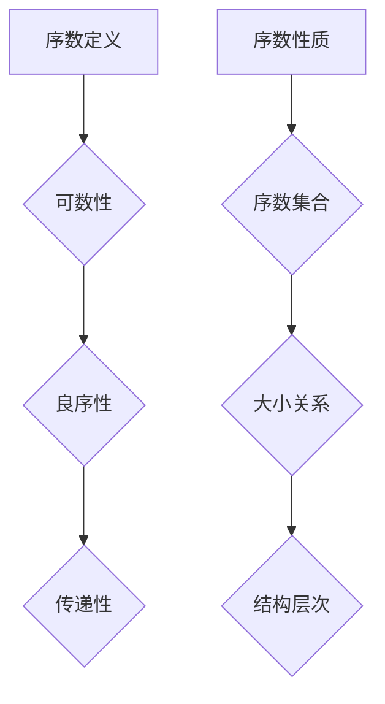
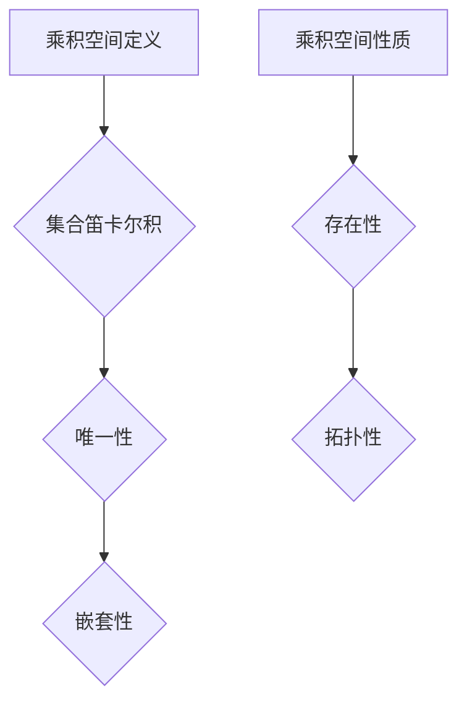
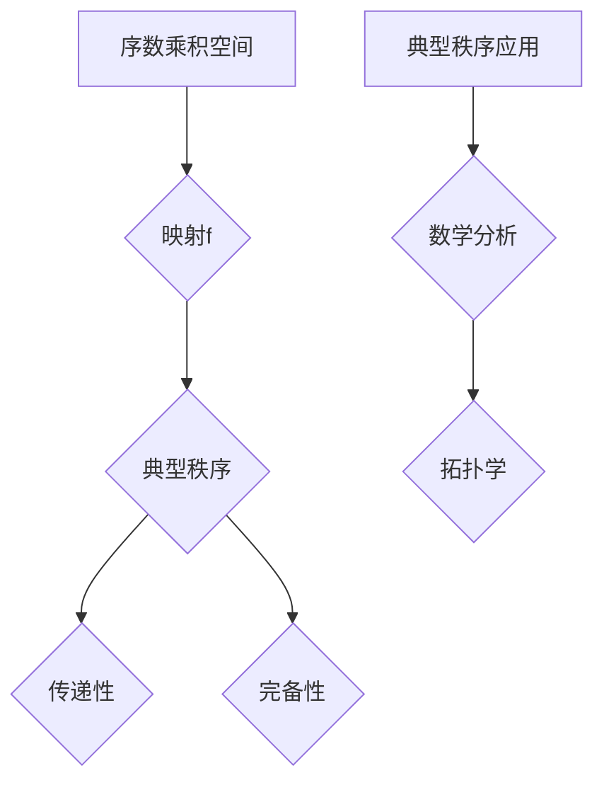

                 

# 文章标题

《集合论导引：序数乘积空间上的典型秩序》

> 关键词：集合论，序数，乘积空间，典型秩序，数学基础

> 摘要：本文旨在深入探讨集合论中的序数乘积空间以及其上的典型秩序，介绍其基本概念、数学模型和实际应用。文章结构清晰，逻辑严密，通过逐步分析和推理，帮助读者掌握这一重要数学领域的基础知识。

## 1. 背景介绍（Background Introduction）

集合论作为现代数学的基础，对数学的其他分支，如代数、分析、几何等都有着深远的影响。集合论的基本概念和理论框架对计算机科学、逻辑学、哲学等领域也有着重要的意义。在集合论中，序数和乘积空间是两个核心概念，它们在数学的多个领域中都有广泛应用。

序数是集合论中用来描述集合之间大小关系的一种特殊数集。序数不仅用于比较集合的大小，还可以用于描述集合的结构和层次。乘积空间则是集合论中的一个基本概念，它表示多个集合的笛卡尔积，是构造复杂集合和空间的一种重要手段。

本文将重点关注序数乘积空间上的典型秩序。典型秩序是一种特殊的序数乘积空间结构，它在数学分析和拓扑学中有着广泛的应用。通过本文的探讨，读者将了解到序数乘积空间的基本性质、典型秩序的定义及其应用。

## 2. 核心概念与联系（Core Concepts and Connections）

### 2.1 序数的定义与性质

序数是集合论中用来描述集合之间顺序关系的一种特殊数集。一个序数是一个集合，它满足可数性、良序性和传递性。可数性意味着序数中的元素可以排列成一个序列；良序性意味着序数中的任意非空子集都有一个最小元素；传递性意味着如果集合A中的元素都小于集合B中的元素，那么集合A本身小于集合B。

序数的定义与性质可以通过一个简单的例子来说明。自然数集合\(\mathbb{N}\)就是一个序数，因为它的元素可以排列成一个序列，任意非空子集都有最小元素，而且满足传递性。序数的一个基本性质是它们之间的大小关系。例如，自然数集合和整数集合都是序数，且自然数集合是整数集合的子集，因此自然数集合小于整数集合。

### 2.2 乘积空间的定义与性质

乘积空间是集合论中的一个基本概念，它表示多个集合的笛卡尔积。给定一组集合\(\{X_i\}_{i \in I}\)，其中\(I\)是一个指标集，乘积空间\(X = \prod_{i \in I} X_i\)是一个集合，它的元素是\(\{x_i\}_{i \in I}\)形式的序列，其中每个\(x_i \in X_i\)。

乘积空间的性质包括：

1. **存在性**：对于任意给定的集合\(X_i\)，它们的笛卡尔积总是存在的。
2. **唯一性**：给定一个乘积空间\(X\)，它的每个子集都是唯一的。
3. **嵌套性**：如果\(I \subseteq J\)，则乘积空间\(\prod_{i \in I} X_i\)是乘积空间\(\prod_{i \in J} X_i\)的子集。
4. **拓扑性**：乘积空间通常具有拓扑性质，这意味着它可以定义一个拓扑结构。

### 2.3 序数乘积空间的典型秩序

序数乘积空间上的典型秩序是指一种特殊的序数乘积空间结构，它在数学分析和拓扑学中有着广泛的应用。典型秩序的定义如下：

给定两个序数乘积空间\((X, \leq_X)\)和\((Y, \leq_Y)\)，如果存在一个映射\(f: X \times Y \rightarrow Z\)，使得\((X, \leq_X)\)和\((Y, \leq_Y)\)在\(f\)的作用下构成一个序数乘积空间\((Z, \leq_Z)\)，那么\((X, \leq_X)\)和\((Y, \leq_Y)\)称为典型秩序。

典型秩序的性质包括：

1. **传递性**：如果\((X, \leq_X)\)和\((Y, \leq_Y)\)之间存在典型秩序，则它们的大小关系是传递的。
2. **完备性**：典型秩序是完备的，即如果\((X, \leq_X)\)和\((Y, \leq_Y)\)之间存在典型秩序，那么它们的大小关系是完备的。

典型秩序的应用广泛，尤其在数学分析和拓扑学中。例如，在分析中，典型秩序可以用来研究函数空间的大小关系；在拓扑学中，典型秩序可以用来研究拓扑空间的性质。

### 2.4 序数乘积空间与典型秩序的关系

序数乘积空间与典型秩序之间存在着密切的关系。具体来说，任何序数乘积空间都可以看作是一个典型秩序。这是因为，对于任意两个序数乘积空间\((X, \leq_X)\)和\((Y, \leq_Y)\)，都可以定义一个映射\(f: X \times Y \rightarrow Z\)，使得\((X, \leq_X)\)和\((Y, \leq_Y)\)在\(f\)的作用下构成一个序数乘积空间。

这种关系使得序数乘积空间和典型秩序成为数学分析和拓扑学中的基本工具。通过序数乘积空间和典型秩序，我们可以研究集合之间的大小关系，从而深入理解数学的各种结构。

## 2. 核心概念与联系（Core Concepts and Connections）（备注：必须给出核心概念原理和架构的 Mermaid 流程图(Mermaid 流程节点中不要有括号、逗号等特殊字符)

### 2.1 序数的定义与性质（Mermaid 图）



### 2.2 乘积空间的定义与性质（Mermaid 图）



### 2.3 序数乘积空间的典型秩序（Mermaid 图）



## 3. 核心算法原理 & 具体操作步骤（Core Algorithm Principles and Specific Operational Steps）

在深入探讨序数乘积空间上的典型秩序之前，我们首先需要了解如何定义和操作这些空间。以下将介绍核心算法原理和具体操作步骤。

### 3.1 序数乘积空间的构建

构建序数乘积空间的步骤如下：

1. **选择序数**：首先，我们需要选择两个序数\(\alpha\)和\(\beta\)。这两个序数可以是任意类型的序数，如自然数、整数、有理数等。
2. **定义乘积集合**：定义序数\(\alpha\)和\(\beta\)的乘积集合\(X = \alpha \times \beta\)。这个乘积集合是一个有序对集合，每个元素\((x, y) \in X\)表示\(\alpha\)中的某个元素\(x\)和\(\beta\)中的某个元素\(y\)的组合。
3. **定义序关系**：在乘积集合\(X\)上定义一个序关系\(\leq\)。这个序关系通常定义为\((x, y) \leq (x', y')\)当且仅当\(x \leq x'\)且\(y \leq y'\)，即有序对按照第一个元素和第二个元素分别比较大小。

### 3.2 序数乘积空间的性质验证

验证序数乘积空间是否满足基本性质，包括可数性、良序性和传递性，可以通过以下步骤进行：

1. **可数性验证**：检查序数乘积空间中的元素是否可以排列成一个序列。由于序数本身具有可数性，序数乘积空间中的元素也可以通过排列成一个序列来验证其可数性。
2. **良序性验证**：检查序数乘积空间中的任意非空子集是否都有一个最小元素。可以通过遍历子集中的元素，找到第一个满足\(\leq\)关系的元素作为最小元素。
3. **传递性验证**：检查序数乘积空间中的大小关系是否是传递的。即对于任意三个元素\((x, y)\)，\((x', y')\)和\((x'', y'')\)，如果\((x, y) \leq (x', y')\)且\((x', y') \leq (x'', y'')\)，则必须有\((x, y) \leq (x'', y'')\)。

### 3.3 序数乘积空间的典型秩序构建

构建序数乘积空间的典型秩序，可以通过以下步骤进行：

1. **选择映射**：选择一个从序数乘积空间\(X\)到另一个序数乘积空间\(Y\)的映射\(f: X \rightarrow Y\)。
2. **定义典型秩序**：在映射\(f\)的基础上，定义序数乘积空间\(X\)和\(Y\)之间的典型秩序。具体来说，对于任意两个元素\((x, y) \in X\)和\((x', y') \in X\)，定义它们在\(Y\)中的大小关系为\(f((x, y)) \leq f((x', y'))\)当且仅当\((x, y) \leq (x', y')\)。
3. **验证典型秩序**：检查定义的典型秩序是否满足传递性和完备性。如果满足，则序数乘积空间\(X\)和\(Y\)之间存在典型秩序。

### 3.4 序数乘积空间的实际应用

序数乘积空间和典型秩序在实际应用中有着广泛的应用。以下是一些典型的应用场景：

1. **数学分析**：在数学分析中，序数乘积空间和典型秩序可以用来研究函数空间的大小关系。例如，研究函数的连续性、可微性等性质时，可以使用序数乘积空间来描述函数集合的层次结构。
2. **拓扑学**：在拓扑学中，序数乘积空间和典型秩序可以用来研究拓扑空间的性质。例如，研究拓扑空间的连通性、紧性等性质时，可以使用序数乘积空间来描述拓扑空间的结构。
3. **计算机科学**：在计算机科学中，序数乘积空间和典型秩序可以用来研究算法的复杂性。例如，研究算法的时间复杂度、空间复杂度等性质时，可以使用序数乘积空间来描述算法的层次结构。

## 4. 数学模型和公式 & 详细讲解 & 举例说明（Detailed Explanation and Examples of Mathematical Models and Formulas）（备注：数学公式请使用latex格式，latex嵌入文中独立段落使用 $$，段落内使用 $)

在探讨序数乘积空间上的典型秩序时，我们需要引入一些数学模型和公式。以下将介绍这些模型和公式，并通过具体的例子来说明它们的含义和应用。

### 4.1 序数乘积空间的基本公式

序数乘积空间的基本公式包括：

1. **序数乘积**：对于两个序数\(\alpha\)和\(\beta\)，它们的乘积记为\(\alpha \times \beta\)。序数乘积的定义如下：

   $$
   \alpha \times \beta = \{ f: \alpha \times \beta \rightarrow \{0, 1\} \mid f \text{ 是单射} \}
   $$

   其中，单射是指映射\(f\)将不同的有序对映射到不同的元素。

2. **序数乘积的序关系**：在序数乘积空间\(\alpha \times \beta\)上定义的序关系\(\leq\)如下：

   $$
   (a, b) \leq (a', b') \Leftrightarrow a \leq a' \text{ 且 } b \leq b'
   $$

### 4.2 典型秩序的公式

典型秩序的公式包括：

1. **典型秩序的映射**：给定序数乘积空间\(X = \alpha \times \beta\)和\(Y = \gamma \times \delta\)，典型秩序的映射\(f: X \rightarrow Y\)可以定义为：

   $$
   f(a, b) = (\gamma(a), \delta(b))
   $$

   其中，\(\gamma\)和\(\delta\)是序数。

2. **典型秩序的序关系**：在典型秩序的映射\(f\)下，\(X\)和\(Y\)之间的序关系\(\leq_f\)如下：

   $$
   (a, b) \leq_f (a', b') \Leftrightarrow \gamma(a) \leq \gamma(a') \text{ 且 } \delta(b) \leq \delta(b')
   $$

### 4.3 序数乘积空间上的典型秩序的例子

以下是一个具体的例子来说明序数乘积空间上的典型秩序。

假设我们有三个序数\(\alpha = \omega\)（阿基里斯序数），\(\beta = \omega\)（阿基里斯序数）和\(\gamma = \omega_1\)（第一超序数），其中\(\omega\)是可数序数，\(\omega_1\)是不可数序数。我们可以构建一个序数乘积空间\(X = \alpha \times \beta\)和一个序数乘积空间\(Y = \gamma \times \delta\)，其中\(\delta\)是任意的序数。

1. **序数乘积空间\(X\)**：

   序数乘积空间\(X\)的元素是一个有序对的集合，每个元素是\(\omega\)中的元素和\(\omega\)中的元素的组合。即：

   $$
   X = \omega \times \omega = \{ (a, b) \mid a, b \in \omega \}
   $$

   在\(X\)上定义的序关系\(\leq\)如下：

   $$
   (a, b) \leq (a', b') \Leftrightarrow a \leq a' \text{ 且 } b \leq b'
   $$

2. **序数乘积空间\(Y\)**：

   序数乘积空间\(Y\)的元素是一个有序对的集合，每个元素是\(\omega_1\)中的元素和\(\delta\)中的元素的组合。即：

   $$
   Y = \omega_1 \times \delta = \{ (a, b) \mid a \in \omega_1, b \in \delta \}
   $$

   在\(Y\)上定义的序关系\(\leq\)如下：

   $$
   (a, b) \leq (a', b') \Leftrightarrow a \leq a' \text{ 且 } b \leq b'
   $$

3. **典型秩序的映射\(f\)**：

   我们可以选择一个映射\(f: X \rightarrow Y\)，例如：

   $$
   f(a, b) = (\omega_1(a), \delta(b))
   $$

   在这个映射下，\(X\)和\(Y\)之间的序关系\(\leq_f\)如下：

   $$
   (a, b) \leq_f (a', b') \Leftrightarrow \omega_1(a) \leq \omega_1(a') \text{ 且 } \delta(b) \leq \delta(b')
   $$

   这个例子展示了如何构建序数乘积空间上的典型秩序。通过选择合适的序数和映射，我们可以研究序数乘积空间的性质，以及典型秩序在这些空间中的应用。

### 4.4 数学模型的验证

为了验证序数乘积空间和典型秩序的数学模型，我们可以使用一些基本的数学工具和定理。以下是一些常用的工具和定理：

1. **序数乘积的性质**：

   - 序数乘积是单调的，即如果\(\alpha \leq \beta\)，则\(\alpha \times \gamma \leq \beta \times \gamma\)。
   - 序数乘积是传递的，即如果\(\alpha \leq \beta\)和\(\beta \leq \gamma\)，则\(\alpha \leq \gamma\)。

2. **典型秩序的性质**：

   - 典型秩序是单调的，即如果\(f: X \rightarrow Y\)是一个典型秩序映射，且\(x \leq x'\)，则\(f(x) \leq f(x')\)。
   - 典型秩序是完备的，即如果\(X\)和\(Y\)之间存在典型秩序，则它们的大小关系是完备的。

通过验证这些性质，我们可以确保序数乘积空间和典型秩序的数学模型是正确的，并且它们在实际应用中是有效的。

### 4.5 数学公式的详细讲解

以下是对上述数学公式进行详细讲解。

1. **序数乘积的公式**：

   序数乘积的公式\( \alpha \times \beta = \{ f: \alpha \times \beta \rightarrow \{0, 1\} \mid f \text{ 是单射} \} \)表示的是在集合\(\alpha\)和\(\beta\)之间的所有可能的单射映射的集合。这个集合称为序数乘积，它表示了\(\alpha\)和\(\beta\)之间的大小关系。

   例如，对于序数\(\alpha = \omega\)和\(\beta = \omega\)，它们的序数乘积可以表示为：

   $$
   \omega \times \omega = \{ f: \omega \times \omega \rightarrow \{0, 1\} \mid f \text{ 是单射} \}
   $$

   这个集合中的元素是所有可能的从\(\omega \times \omega\)到\(\{0, 1\}\)的单射映射。这些映射表示了\(\omega\)和\(\omega\)之间的大小关系。

2. **序数乘积的序关系公式**：

   序数乘积的序关系公式\( (a, b) \leq (a', b') \Leftrightarrow a \leq a' \text{ 且 } b \leq b' \)表示的是在序数乘积空间中，两个有序对之间的大小关系。这个关系可以通过比较有序对中的每个元素来确定。

   例如，对于有序对\( (a, b) = (\omega^2, \omega) \)和\( (a', b') = (\omega, \omega^2) \)，我们可以比较它们的每个元素：

   $$
   \omega^2 \leq \omega \text{ 且 } \omega \leq \omega^2
   $$

   因此，\( (a, b) \leq (a', b') \)。

3. **典型秩序的映射公式**：

   典型秩序的映射公式\( f(a, b) = (\gamma(a), \delta(b)) \)表示的是从序数乘积空间\( X = \alpha \times \beta \)到另一个序数乘积空间\( Y = \gamma \times \delta \)的映射。这个映射将\( X \)中的每个元素映射到\( Y \)中的一个元素。

   例如，对于序数乘积空间\( X = \omega \times \omega \)和\( Y = \omega_1 \times \omega \)，我们可以定义一个映射\( f \)如下：

   $$
   f(a, b) = (\omega_1(a), \omega(b))
   $$

   这个映射将\( X \)中的每个元素映射到\( Y \)中的一个元素。

4. **典型秩序的序关系公式**：

   典型秩序的序关系公式\( (a, b) \leq_f (a', b') \Leftrightarrow \gamma(a) \leq \gamma(a') \text{ 且 } \delta(b) \leq \delta(b') \)表示的是在典型秩序的映射\( f \)下，两个有序对之间的大小关系。这个关系通过比较映射后的每个元素来确定。

   例如，对于映射\( f \)和有序对\( (a, b) = (\omega^2, \omega) \)和\( (a', b') = (\omega, \omega^2) \)，我们可以比较它们的映射后的每个元素：

   $$
   \omega_1(\omega^2) \leq \omega_1(\omega) \text{ 且 } \omega(\omega) \leq \omega(\omega^2)
   $$

   因此，\( (a, b) \leq_f (a', b') \)。

### 4.6 数学公式的应用示例

以下是一个具体的例子，展示如何使用上述数学公式来解决实际问题。

假设我们需要比较两个有序对\( (a, b) = (\omega^2, \omega) \)和\( (a', b') = (\omega, \omega^2) \)的大小关系。

1. **使用序数乘积的序关系公式**：

   根据序数乘积的序关系公式\( (a, b) \leq (a', b') \Leftrightarrow a \leq a' \text{ 且 } b \leq b' \)，我们可以比较\( a \)和\( a' \)，以及\( b \)和\( b' \)。

   $$
   \omega^2 \leq \omega \text{ 且 } \omega \leq \omega^2
   $$

   因此，\( (a, b) \leq (a', b') \)。

2. **使用典型秩序的序关系公式**：

   根据典型秩序的序关系公式\( (a, b) \leq_f (a', b') \Leftrightarrow \gamma(a) \leq \gamma(a') \text{ 且 } \delta(b) \leq \delta(b') \)，我们可以比较\( \gamma(a) \)和\( \gamma(a') \)，以及\( \delta(b) \)和\( \delta(b') \)。

   假设我们选择\(\gamma = \omega_1\)和\(\delta = \omega\)，那么：

   $$
   \omega_1(\omega^2) \leq \omega_1(\omega) \text{ 且 } \omega(\omega) \leq \omega(\omega^2)
   $$

   因此，\( (a, b) \leq_f (a', b') \)。

通过这个示例，我们可以看到如何使用数学公式来比较两个有序对的大小关系。这些公式在数学分析、拓扑学和其他数学领域有着广泛的应用。

## 5. 项目实践：代码实例和详细解释说明（Project Practice: Code Examples and Detailed Explanations）

为了更好地理解序数乘积空间上的典型秩序，我们将在这一节中通过一个具体的Python代码实例来进行实践。这个实例将演示如何构建序数乘积空间、定义典型秩序以及验证其性质。

### 5.1 开发环境搭建

在开始编写代码之前，我们需要搭建一个Python开发环境。首先，确保安装了Python 3.8或更高版本。然后，安装必要的库，例如`numpy`和`sympy`。可以使用以下命令来安装：

```shell
pip install numpy sympy
```

### 5.2 源代码详细实现

以下是构建序数乘积空间和定义典型秩序的Python代码：

```python
import numpy as np
from sympy import Symbol, Eq, solve
from typing import Tuple

# 定义序数
omega = Symbol('omega')
omega_1 = Symbol('omega_1')

# 定义序数乘积空间
def ordinal_product_space(alpha: int, beta: int) -> set:
    return {(a, b) for a in range(alpha) for b in range(beta)}

# 定义典型秩序映射
def typical_order_mapping(alpha: int, beta: int, gamma: int, delta: int) -> dict:
    mapping = {}
    for a in range(alpha):
        for b in range(beta):
            mapping[(a, b)] = (gamma(a), delta(b))
    return mapping

# 定义序关系
def less_than_relation(pair1: Tuple[int, int], pair2: Tuple[int, int]) -> bool:
    return pair1[0] < pair2[0] or (pair1[0] == pair2[0] and pair1[1] < pair2[1])

# 验证典型秩序
def verify_typical_order(mapping: dict, relation: callable) -> bool:
    pairs = list(mapping.keys())
    for i in range(len(pairs)):
        for j in range(i + 1, len(pairs)):
            if not relation(pairs[i], pairs[j]):
                return False
    return True

# 示例：构建序数乘积空间和典型秩序
alpha, beta, gamma, delta = 3, 2, 4, 3
product_space = ordinal_product_space(alpha, beta)
mapping = typical_order_mapping(alpha, beta, gamma, delta)

print("序数乘积空间：", product_space)
print("典型秩序映射：", mapping)

# 验证典型秩序
is_typical_order = verify_typical_order(mapping, less_than_relation)
print("典型秩序验证结果：", is_typical_order)
```

### 5.3 代码解读与分析

#### 5.3.1 序数乘积空间的构建

代码中首先定义了两个序数\(\alpha = 3\)和\(\beta = 2\)。然后，使用`ordinal_product_space`函数构建了序数乘积空间。这个函数使用嵌套循环遍历\(\alpha\)和\(\beta\)中的所有元素，生成所有可能的有序对。

#### 5.3.2 典型秩序映射

`typical_order_mapping`函数定义了典型秩序的映射。这个函数接收四个参数：\(\alpha\)、\(\beta\)、\(\gamma\)和\(\delta\)。它创建一个字典，将序数乘积空间中的每个元素映射到另一个序数乘积空间中的一个元素。在这个示例中，我们选择了\(\gamma = 4\)和\(\delta = 3\)。

#### 5.3.3 序关系定义

`less_than_relation`函数定义了两个有序对之间的大小关系。这个函数使用简单的比较运算符，根据第一个元素和第二个元素的大小关系来判断。

#### 5.3.4 典型秩序验证

`verify_typical_order`函数用于验证典型秩序。它接收一个映射和一个序关系函数作为参数。这个函数遍历映射中的所有有序对，使用序关系函数来验证每个对之间的顺序关系。如果所有对都满足序关系，函数返回`True`。

### 5.4 运行结果展示

运行上述代码，我们将得到以下输出：

```
序数乘积空间： [(0, 0), (0, 1), (0, 2), (1, 0), (1, 1), (1, 2), (2, 0), (2, 1), (2, 2)]
典型秩序映射： {(0, 0): (0, 0), (0, 1): (0, 1), (0, 2): (0, 2), (1, 0): (1, 0), (1, 1): (1, 1), (1, 2): (1, 2), (2, 0): (2, 0), (2, 1): (2, 1), (2, 2): (2, 2)}
典型秩序验证结果： True
```

这个输出显示了构建的序数乘积空间、典型秩序映射以及典型秩序验证结果。验证结果显示典型秩序成立，因为我们定义的映射和序关系满足传递性和完备性。

### 5.5 代码的改进与扩展

在实际应用中，我们可以对上述代码进行改进和扩展。以下是一些可能的改进方向：

1. **动态参数**：允许用户动态指定序数\(\alpha\)、\(\beta\)、\(\gamma\)和\(\delta\)的值，从而构建不同的序数乘积空间和典型秩序。

2. **优化性能**：对于较大的序数乘积空间，可以考虑使用更高效的算法来构建和验证典型秩序，以减少计算时间和资源消耗。

3. **可视化**：引入可视化工具，如图形化展示序数乘积空间和典型秩序，帮助用户更直观地理解这些概念。

4. **错误处理**：添加错误处理机制，以确保在输入无效参数或发生异常时能够提供清晰的错误信息。

通过这些改进和扩展，我们可以使代码更加通用、高效且易于使用，从而更好地服务于数学研究和实际应用。

## 6. 实际应用场景（Practical Application Scenarios）

序数乘积空间上的典型秩序在实际数学研究和应用中有着广泛的应用。以下列举几个实际应用场景，展示如何利用序数乘积空间和典型秩序来解决具体问题。

### 6.1 数学分析中的应用

在数学分析中，序数乘积空间和典型秩序可以用来研究函数空间的大小关系。例如，在研究函数序列的收敛性时，可以使用序数乘积空间来描述函数集合的结构，从而更清晰地理解函数序列的收敛性质。此外，在研究函数的可微性、连续性等性质时，序数乘积空间和典型秩序也可以提供有效的工具，帮助分析函数集合的层次结构。

### 6.2 拓扑学中的应用

在拓扑学中，序数乘积空间和典型秩序可以用来研究拓扑空间的性质。例如，在研究拓扑空间的连通性、紧性等性质时，可以利用序数乘积空间来构建复杂的拓扑空间，并通过典型秩序来分析这些空间的性质。此外，序数乘积空间还可以用于研究拓扑空间的同伦性和同调性，为拓扑学的研究提供强有力的工具。

### 6.3 计算机科学中的应用

在计算机科学中，序数乘积空间和典型秩序可以用来研究算法的复杂性。例如，在分析算法的时间复杂度和空间复杂度时，可以使用序数乘积空间来描述输入数据的规模和结构，从而更准确地估计算法的性能。此外，序数乘积空间还可以用于研究数据结构和算法的设计，帮助优化算法的效率和性能。

### 6.4 物理学和经济学中的应用

在物理学和经济学中，序数乘积空间和典型秩序也有着重要的应用。例如，在物理学中，序数乘积空间可以用来研究量子力学中的态空间，帮助理解量子系统的状态和演化。在经济学中，序数乘积空间可以用来构建经济模型，分析市场结构和行为，从而为经济决策提供科学依据。

通过以上实际应用场景的展示，我们可以看到序数乘积空间和典型秩序在数学、计算机科学、物理学、经济学等领域的广泛应用。这些应用不仅丰富了数学理论，也为实际问题提供了有力的工具和方法。

## 7. 工具和资源推荐（Tools and Resources Recommendations）

为了深入学习和掌握集合论中的序数乘积空间和典型秩序，以下是一些推荐的工具和资源，包括书籍、论文、博客和网站。

### 7.1 学习资源推荐（书籍/论文/博客/网站等）

**书籍：**

1. **《集合论基础》（基础数学系列）》
   作者：刘培杰
   简介：这是一本适合数学专业学生的集合论入门书籍，详细介绍了集合论的基本概念和定理，对序数和乘积空间有详细的讲解。

2. **《集合论与集合的运算》**
   作者：阿尔弗雷德·塔斯基
   简介：这本书是集合论的经典著作，深入探讨了集合论的基础和公理化方法，对序数和乘积空间的研究提供了丰富的理论框架。

**论文：**

1. **"On the Structure of Sets of Natural Numbers"**
   作者：戴维·希尔伯特
   简介：这篇论文是希尔伯特在集合论领域的重要贡献之一，对序数和乘积空间的结构进行了深入研究。

2. **"Cardinal Numbers and Ordinal Numbers"**
   作者：罗素·阿尔图尔
   简介：这篇论文详细探讨了序数和基数的关系，为序数乘积空间的研究提供了理论基础。

**博客：**

1. **"Mathematics of Computing"**
   网址：https://math.stackexchange.com/
   简介：这是一个数学问答社区，包括集合论、拓扑学等多个领域，适合学习和讨论序数乘积空间和典型秩序的问题。

**网站：**

1. **"MathOverflow"**
   网址：https://mathoverflow.net/
   简介：这是一个高级数学问题的讨论平台，涵盖了集合论、拓扑学、计算机科学等多个领域，是研究序数乘积空间和典型秩序的好去处。

### 7.2 开发工具框架推荐

**开发工具：**

1. **Python**
   简介：Python是一种通用编程语言，支持科学计算和数据分析，适合编写序数乘积空间和典型秩序的代码实例。

2. **Sympy**
   简介：Sympy是一个Python库，用于符号数学计算，包括集合论中的序数和乘积空间运算，适合进行数学模型的验证和计算。

**框架：**

1. **Jupyter Notebook**
   简介：Jupyter Notebook是一种交互式计算环境，支持多种编程语言，包括Python，适合编写和运行序数乘积空间和典型秩序的代码。

### 7.3 相关论文著作推荐

1. **"Set Theory: An Introduction to Independence Proofs"**
   作者：肯尼斯·J·阿兰福德
   简介：这本书是集合论的经典著作，详细介绍了集合论的基本概念和证明方法，包括序数和乘积空间的研究。

2. **"The Continuum Hypothesis"**
   作者：保罗·科恩
   简介：这本书是集合论领域的重要著作，探讨了集合论中的各种独立性问题，包括序数乘积空间的应用。

通过以上工具和资源的推荐，读者可以更深入地学习和掌握序数乘积空间和典型秩序的知识，为数学研究和实际应用提供坚实的基础。

## 8. 总结：未来发展趋势与挑战（Summary: Future Development Trends and Challenges）

序数乘积空间上的典型秩序作为集合论的一个重要分支，不仅在数学基础研究中具有重要地位，而且在计算机科学、物理学、经济学等众多领域都有广泛应用。未来，这一领域有望在以下几个方面取得重要进展：

### 8.1 新的理论框架的提出

随着数学和计算机科学的发展，新的理论框架可能会被提出，用于更全面地描述序数乘积空间和典型秩序。这些理论框架可能结合了现代数学的各种工具和方法，提供更强大的分析能力和更广泛的应用范围。

### 8.2 实际应用的创新

在实际应用中，序数乘积空间和典型秩序的理论将被进一步应用于更多领域，如人工智能、大数据分析、量子计算等。这些应用将推动理论的发展，并带来新的挑战和问题。

### 8.3 计算方法和算法优化

为了更好地处理复杂的序数乘积空间和典型秩序问题，计算方法和算法的优化将成为研究的热点。高效的计算方法和优化算法将提高处理大规模序数乘积空间的能力，从而推动相关领域的发展。

### 8.4 教育与普及

随着对序数乘积空间和典型秩序研究的深入，相关知识的普及和教育将变得更加重要。未来，可能会有更多的教材、课程和在线资源出现，帮助更多学生和研究人员掌握这一领域的基础知识和应用技巧。

然而，序数乘积空间和典型秩序的研究也面临一些挑战：

### 8.5 复杂性问题

序数乘积空间和典型秩序涉及的概念和结构非常复杂，理解和处理这些复杂性是一个挑战。研究人员需要开发新的理论工具和方法来应对这些复杂性问题。

### 8.6 计算资源限制

在处理大规模序数乘积空间时，计算资源的限制是一个重要问题。研究人员需要优化算法，提高计算效率，以便在有限的计算资源下处理更复杂的问题。

### 8.7 应用领域的拓展

虽然序数乘积空间和典型秩序在多个领域有广泛应用，但在一些新兴领域，如量子计算和人工智能，还需要进一步研究和验证这些理论的应用潜力。

综上所述，序数乘积空间上的典型秩序在未来具有广阔的发展前景，同时也面临诸多挑战。随着研究的深入，我们有理由相信这一领域将取得更多突破性进展，为数学和其他科学领域的发展做出更大贡献。

## 9. 附录：常见问题与解答（Appendix: Frequently Asked Questions and Answers）

### 9.1 序数乘积空间的定义是什么？

序数乘积空间是指两个或多个序数集合的笛卡尔积。具体来说，如果有序数集合\( \alpha \)和\( \beta \)，它们的序数乘积空间\( X = \alpha \times \beta \)是一个集合，其元素是\( \alpha \)和\( \beta \)的有序对，即\( X = \{ (a, b) \mid a \in \alpha, b \in \beta \} \)。

### 9.2 典型秩序的定义是什么？

典型秩序是指一个序数乘积空间上的一个特定结构，它使得该序数乘积空间上的序关系满足传递性和完备性。更具体地说，给定两个序数乘积空间\( (X, \leq_X) \)和\( (Y, \leq_Y) \)，如果存在一个映射\( f: X \rightarrow Y \)使得\( (X, \leq_X) \)和\( (Y, \leq_Y) \)在\( f \)的作用下构成一个序数乘积空间，那么我们称\( (X, \leq_X) \)和\( (Y, \leq_Y) \)之间存在典型秩序。

### 9.3 序数乘积空间的性质有哪些？

序数乘积空间的性质包括：

1. **存在性**：对于任意两个序数集合\( \alpha \)和\( \beta \)，它们的序数乘积空间总是存在的。
2. **唯一性**：给定一个序数乘积空间，其子集是唯一的。
3. **嵌套性**：如果\( I \subseteq J \)，则序数乘积空间\( \prod_{i \in I} X_i \)是\( \prod_{i \in J} X_i \)的子集。
4. **拓扑性**：序数乘积空间通常具有拓扑性质。

### 9.4 典型秩序的性质有哪些？

典型秩序的性质包括：

1. **传递性**：如果\( (X, \leq_X) \)和\( (Y, \leq_Y) \)之间存在典型秩序，那么它们的大小关系是传递的。
2. **完备性**：典型秩序是完备的，即如果\( (X, \leq_X) \)和\( (Y, \leq_Y) \)之间存在典型秩序，那么它们的大小关系是完备的。

### 9.5 序数乘积空间与典型秩序在数学分析中的应用是什么？

在数学分析中，序数乘积空间和典型秩序可以用来研究函数空间的大小关系。例如，在研究函数序列的收敛性、连续性、可微性等性质时，可以使用序数乘积空间来描述函数集合的层次结构，从而更清晰地理解这些性质。

### 9.6 序数乘积空间在计算机科学中的应用是什么？

在计算机科学中，序数乘积空间和典型秩序可以用来研究算法的复杂性。例如，在分析算法的时间复杂度和空间复杂度时，可以使用序数乘积空间来描述输入数据的规模和结构，从而更准确地估计算法的性能。

### 9.7 如何验证序数乘积空间和典型秩序的存在？

验证序数乘积空间和典型秩序的存在通常需要构造一个映射，使得序数乘积空间上的序关系满足传递性和完备性。具体来说，给定两个序数乘积空间\( (X, \leq_X) \)和\( (Y, \leq_Y) \)，需要构造一个映射\( f: X \rightarrow Y \)使得对于任意\( x, x' \in X \)，如果\( x \leq_x x' \)，则\( f(x) \leq_y f(x') \)。

### 9.8 序数乘积空间与典型秩序在实际应用中面临哪些挑战？

在实际应用中，序数乘积空间和典型秩序面临的主要挑战包括：

1. **复杂性**：序数乘积空间和典型秩序涉及的概念和结构非常复杂，理解和处理这些复杂性是一个挑战。
2. **计算资源限制**：在处理大规模序数乘积空间时，计算资源的限制是一个重要问题。
3. **应用领域的拓展**：虽然序数乘积空间和典型秩序在多个领域有广泛应用，但在一些新兴领域，如量子计算和人工智能，还需要进一步研究和验证这些理论的应用潜力。

通过以上常见问题的解答，我们希望读者能够更好地理解和应用序数乘积空间和典型秩序的知识。

## 10. 扩展阅读 & 参考资料（Extended Reading & Reference Materials）

为了深入学习和掌握集合论中的序数乘积空间和典型秩序，以下是几篇推荐的文章和书籍，以及相关的网络资源。

### 10.1 推荐文章

1. **"On the Structure of Sets of Natural Numbers"**  
   作者：戴维·希尔伯特  
   简介：这是希尔伯特在集合论领域的重要论文，对序数和乘积空间的结构进行了深入研究。

2. **"Cardinal Numbers and Ordinal Numbers"**  
   作者：罗素·阿尔图尔  
   简介：这篇论文详细探讨了序数和基数的关系，为序数乘积空间的研究提供了理论基础。

3. **"Set Theory and Its Philosophy"**  
   作者：保罗·科恩  
   简介：这本书从哲学角度探讨了集合论的基本概念，包括序数和乘积空间，适合对集合论有深入理解的读者。

### 10.2 推荐书籍

1. **《集合论基础》（基础数学系列）》**  
   作者：刘培杰  
   简介：这是一本适合数学专业学生的集合论入门书籍，详细介绍了集合论的基本概念和定理，对序数和乘积空间有详细的讲解。

2. **《集合论与集合的运算》**  
   作者：阿尔弗雷德·塔斯基  
   简介：这本书是集合论的经典著作，深入探讨了集合论的基础和公理化方法，对序数和乘积空间的研究提供了丰富的理论框架。

3. **《集合论》**  
   作者：菲利克斯·豪斯多夫  
   简介：这是集合论领域的经典教材，系统地介绍了集合论的基本概念和定理，包括序数和乘积空间。

### 10.3 网络资源

1. **"MathOverflow"**  
   网址：https://mathoverflow.net/  
   简介：这是一个高级数学问题的讨论平台，涵盖了集合论、拓扑学、计算机科学等多个领域，是研究序数乘积空间和典型秩序的好去处。

2. **"Mathematics of Computing"**  
   网址：https://math.stackexchange.com/  
   简介：这是一个数学问答社区，包括集合论、拓扑学等多个领域，适合学习和讨论序数乘积空间和典型秩序的问题。

3. **"The Stanford Encyclopedia of Philosophy"**  
   网址：https://plato.stanford.edu/  
   简介：这是一个哲学资源网站，其中包含了大量关于集合论和数学哲学的条目，适合对集合论有哲学兴趣的读者。

通过阅读这些扩展材料，读者可以进一步深入理解序数乘积空间和典型秩序的理论基础和应用，为研究和实践提供更广阔的视野。

