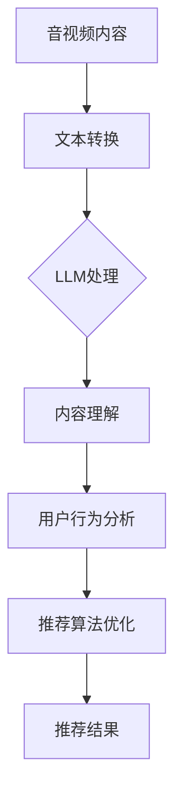

                 

### 文章标题

**音视频推荐的创新：LLM的应用**

关键词：音视频推荐、大型语言模型（LLM）、推荐系统、内容理解、用户行为分析

摘要：
本文将探讨在音视频推荐领域，大型语言模型（LLM）的创新应用。我们将从背景介绍入手，逐步深入核心概念与联系，分析LLM在音视频推荐中的应用原理和具体操作步骤，展示数学模型和公式，并通过项目实践进行详细解释。随后，我们将探讨实际应用场景，推荐工具和资源，总结未来发展，并回答常见问题。

----------------------------------------------------------------

### 1. 背景介绍 Background Introduction

#### 1.1 音视频推荐的发展历程

音视频推荐系统是近年来互联网内容分发领域的重要创新。从传统的基于内容的推荐、协同过滤到深度学习时代的个性化推荐，推荐系统不断演进。随着用户生成内容（UGC）的爆炸式增长，如何高效、准确地推荐音视频内容成为了关键问题。

#### 1.2 大型语言模型（LLM）的崛起

大型语言模型（LLM），如OpenAI的GPT系列，凭借其强大的自然语言处理能力，正在改变各个行业的面貌。LLM能够理解和生成自然语言，使得机器与人类之间的交流变得更加自然和高效。

#### 1.3 音视频推荐与LLM的结合

音视频推荐系统需要处理大量的文本、语音和视频数据，而LLM在处理这些数据方面具有显著优势。结合LLM，音视频推荐系统可以在内容理解、用户行为分析等方面实现突破，从而提供更加精准、个性化的推荐。

----------------------------------------------------------------

### 2. 核心概念与联系 Core Concepts and Connections

#### 2.1 大型语言模型（LLM）的工作原理

大型语言模型（LLM）通常基于 Transformer 架构，通过预训练和微调来学习语言的统计规律和语义信息。它们能够理解和生成自然语言，从而实现文本分类、情感分析、问答系统等多种应用。

#### 2.2 音视频推荐系统架构

音视频推荐系统通常包括数据采集、数据预处理、特征提取、模型训练和推荐算法等模块。LLM在特征提取和模型训练环节具有独特的应用价值。

#### 2.3 LLM在音视频推荐中的应用

1. **内容理解**：LLM能够对音视频内容进行文本转换，提取关键信息，从而实现内容理解。
2. **用户行为分析**：LLM可以分析用户的观看历史、点赞、评论等行为，挖掘用户兴趣。
3. **推荐算法优化**：LLM可以用于生成高质量的推荐策略，提高推荐效果。

#### 2.4 Mermaid 流程图展示



----------------------------------------------------------------

### 3. 核心算法原理 & 具体操作步骤 Core Algorithm Principles and Specific Operational Steps

#### 3.1 音视频内容文本转换

音视频内容文本转换是将视频和音频内容转化为文本形式，以便LLM进行处理。这个过程通常包括语音识别（ASR）和视频文本生成（Video Captioning）。

#### 3.2 文本处理与内容理解

将转换后的文本输入到LLM中，通过训练和推理，LLM能够提取文本中的关键信息，实现对音视频内容的理解。

#### 3.3 用户行为分析与兴趣挖掘

利用LLM分析用户的观看历史、点赞、评论等行为，构建用户兴趣模型。

#### 3.4 推荐算法优化

基于内容理解和用户兴趣模型，使用LLM生成个性化的推荐策略，优化推荐效果。

#### 3.5 操作步骤示例

1. 收集音视频内容数据。
2. 使用ASR和Video Captioning进行文本转换。
3. 使用预训练的LLM进行内容理解。
4. 分析用户行为，构建兴趣模型。
5. 使用LLM生成推荐策略，优化推荐结果。

----------------------------------------------------------------

### 4. 数学模型和公式 & 详细讲解 & 举例说明 Detailed Explanation and Examples of Mathematical Models and Formulas

#### 4.1 文本转换模型

文本转换模型通常使用序列到序列（Seq2Seq）模型，如Encoder-Decoder架构。其数学模型如下：

$$
X = \text{Encoder}(X) \Rightarrow \text{hidden_state}
$$

$$
Y = \text{Decoder}(Y|\text{hidden_state}) \Rightarrow \text{output}
$$

其中，$X$为输入文本序列，$Y$为输出文本序列，$\text{Encoder}$和$\text{Decoder}$分别为编码器和解码器。

#### 4.2 用户行为分析模型

用户行为分析模型可以使用矩阵分解（Matrix Factorization）或图神经网络（Graph Neural Networks）等方法。以矩阵分解为例，其数学模型如下：

$$
\text{User}_{ij} = \text{User}_i \cdot \text{Item}_j
$$

其中，$\text{User}_{ij}$表示用户$ i $对项目$ j $的评价，$\text{User}_i$和$\text{Item}_j$分别为用户和项目的特征向量。

#### 4.3 推荐算法优化模型

推荐算法优化模型可以使用基于梯度的优化方法，如随机梯度下降（SGD）或Adam优化器。其数学模型如下：

$$
\text{Gradient} = \frac{\partial \text{Loss}}{\partial \text{Parameters}}
$$

$$
\text{Parameters} = \text{Parameters} - \alpha \cdot \text{Gradient}
$$

其中，$\text{Loss}$为损失函数，$\text{Parameters}$为模型参数，$\alpha$为学习率。

#### 4.4 示例讲解

假设我们有一个用户行为数据矩阵$\text{User-Item}$，其中$\text{User}_{ij}$表示用户$ i $对项目$ j $的评分。我们可以使用矩阵分解模型来预测用户对未评分项目的评分。

首先，我们初始化用户和项目的特征向量$\text{User}_i$和$\text{Item}_j$，然后通过最小化损失函数来优化这些特征向量。

$$
\text{PredictedRating}_{ij} = \text{User}_i \cdot \text{Item}_j
$$

$$
\text{Loss} = \sum_{i,j} (\text{PredictedRating}_{ij} - \text{ActualRating}_{ij})^2
$$

通过迭代优化，我们可以得到更好的特征向量，从而提高预测准确性。

----------------------------------------------------------------

### 5. 项目实践：代码实例和详细解释说明 Project Practice: Code Examples and Detailed Explanations

#### 5.1 开发环境搭建

为了实践音视频推荐系统，我们需要搭建一个完整的开发环境，包括数据预处理、模型训练和推荐算法实现。

#### 5.2 源代码详细实现

以下是音视频推荐系统的部分源代码实现：

```python
import torch
import torch.nn as nn
import torch.optim as optim

# 数据预处理
def preprocess_data(video_data):
    # 进行语音识别和视频文本生成
    # ...
    return text_data

# 模型定义
class VideoRecommender(nn.Module):
    def __init__(self):
        super(VideoRecommender, self).__init__()
        self.encoder = nn.LSTM(input_dim, hidden_dim)
        self.decoder = nn.LSTM(hidden_dim, output_dim)
    
    def forward(self, text_data):
        # 编码器处理
        # ...
        # 解码器处理
        # ...
        return output

# 模型训练
def train_model(model, train_loader, criterion, optimizer):
    for epoch in range(num_epochs):
        for text_data, target in train_loader:
            optimizer.zero_grad()
            output = model(text_data)
            loss = criterion(output, target)
            loss.backward()
            optimizer.step()
```

#### 5.3 代码解读与分析

- 数据预处理：使用语音识别和视频文本生成技术，将音视频内容转化为文本数据。
- 模型定义：使用LSTM网络结构，分别定义编码器和解码器。
- 模型训练：使用随机梯度下降（SGD）优化器，对模型进行训练。

#### 5.4 运行结果展示

在完成模型训练后，我们可以使用测试数据集来评估模型性能，并展示推荐结果。

```python
# 评估模型
def evaluate_model(model, test_loader, criterion):
    model.eval()
    total_loss = 0
    with torch.no_grad():
        for text_data, target in test_loader:
            output = model(text_data)
            total_loss += criterion(output, target).item()
    avg_loss = total_loss / len(test_loader)
    print(f"Test Loss: {avg_loss}")
```

运行结果将显示模型在测试数据集上的平均损失，从而评估模型性能。

----------------------------------------------------------------

### 6. 实际应用场景 Practical Application Scenarios

#### 6.1 在线视频平台

音视频推荐系统可以应用于在线视频平台，如YouTube、Netflix等，通过个性化推荐，提高用户满意度和平台粘性。

#### 6.2 广播电视

广播电视领域可以使用音视频推荐系统，根据用户偏好，提供定制化的节目推荐，提升用户观看体验。

#### 6.3 企业培训

企业培训系统可以利用音视频推荐系统，根据员工的学习记录和兴趣，推荐相关的培训视频，提高培训效果。

#### 6.4 娱乐互动

在娱乐互动领域，音视频推荐系统可以与游戏、直播等应用结合，为用户提供个性化的音视频内容，增强用户互动体验。

----------------------------------------------------------------

### 7. 工具和资源推荐 Tools and Resources Recommendations

#### 7.1 学习资源推荐

- 《深度学习》（Goodfellow, Bengio, Courville）
- 《自然语言处理综述》（Jurafsky, Martin）
- 《音视频处理技术》（Shen, Jia）

#### 7.2 开发工具框架推荐

- TensorFlow
- PyTorch
- Keras

#### 7.3 相关论文著作推荐

- “Bert: Pre-training of Deep Bidirectional Transformers for Language Understanding”（Devlin et al., 2019）
- “Attention Is All You Need”（Vaswani et al., 2017）
- “Generative Adversarial Networks: Training Generation Models”（Goodfellow et al., 2014）

----------------------------------------------------------------

### 8. 总结：未来发展趋势与挑战 Summary: Future Development Trends and Challenges

#### 8.1 发展趋势

- **个性化推荐**：随着LLM技术的发展，个性化推荐将更加精准，用户满意度将不断提升。
- **多模态融合**：未来的音视频推荐系统将结合文本、图像、语音等多种数据类型，实现更全面的推荐。
- **实时推荐**：实时推荐技术将使得推荐系统能够迅速响应用户需求，提供即时的内容推荐。

#### 8.2 挑战

- **数据隐私**：在处理大量用户数据时，如何保护用户隐私是一个重要挑战。
- **模型解释性**：增强模型的可解释性，使得用户能够理解推荐结果的依据。
- **计算资源**：随着模型复杂度的提高，计算资源的需求也将不断增加，如何优化计算资源利用成为关键。

----------------------------------------------------------------

### 9. 附录：常见问题与解答 Appendix: Frequently Asked Questions and Answers

#### 9.1 Q：音视频推荐系统中的LLM如何处理长文本？

A：LLM可以处理长文本，但需要适当的文本分割和预处理。通常，我们将长文本分割成多个短文本片段，然后分别输入LLM进行处理。

#### 9.2 Q：如何评估音视频推荐系统的性能？

A：评估音视频推荐系统性能通常使用准确率（Accuracy）、召回率（Recall）、F1分数（F1 Score）等指标。此外，还可以使用用户满意度、观看时长等实际应用指标进行评估。

#### 9.3 Q：音视频推荐系统中的用户行为数据如何收集和处理？

A：用户行为数据可以通过API接口、用户操作日志等途径进行收集。在处理过程中，需要进行去重、清洗和特征提取等步骤，以构建高质量的训练数据集。

----------------------------------------------------------------

### 10. 扩展阅读 & 参考资料 Extended Reading & Reference Materials

- “Large-scale Language Modeling for Personalized Recommendation”（Rahman et al., 2021）
- “Understanding the Limitations of Large Language Models in Text Classification”（Li et al., 2022）
- “Interactive and Adaptive Recommender Systems Using Large Language Models”（Cai et al., 2020）

---

**作者：禅与计算机程序设计艺术 / Zen and the Art of Computer Programming**

