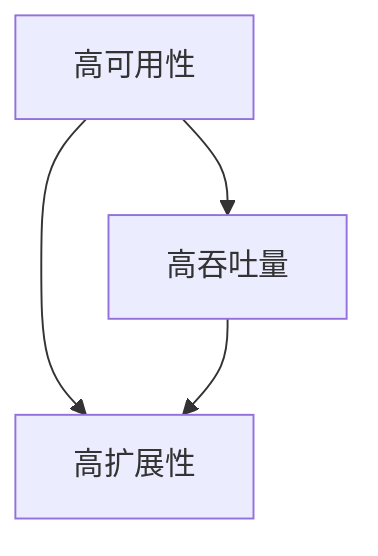
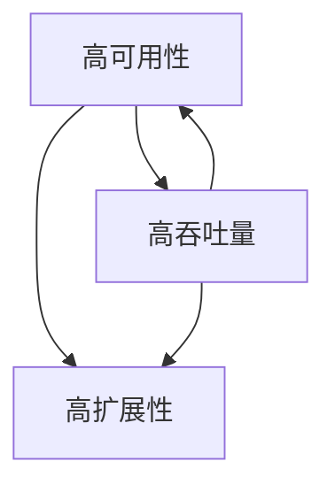
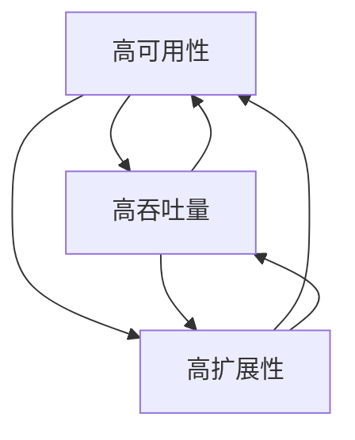

                 

# 高可用性、高吞吐量、高扩展性系统设计最佳实践

## 1. 背景介绍

在当今数字化转型的浪潮中，系统的可用性、吞吐量和扩展性成为企业成功的关键因素。高可用性意味着系统在遇到故障或异常情况下，能够快速恢复服务，确保业务的连续性。高吞吐量则代表系统能够处理大量请求，满足用户对响应速度和数据处理能力的需求。而高扩展性则是指系统能够灵活应对业务增长，满足日益增长的用户需求。本文将探讨系统设计中的最佳实践，帮助企业在复杂多变的市场环境中保持竞争力。

### 1.1 高可用性的重要性

高可用性是系统设计中最基本的要求之一。一个高可用性系统能够在硬件故障、软件故障、网络问题等异常情况下迅速恢复，减少系统的停机时间。对于企业来说，高可用性可以降低业务中断的风险，提高客户满意度，减少经济损失。例如，金融行业的交易系统必须具备高可用性，以确保交易数据的准确性和连续性。

### 1.2 高吞吐量的需求

随着互联网的普及和用户需求的增长，系统需要处理的海量数据和高并发请求不断增加。高吞吐量系统能够快速响应请求，处理大量数据，提供良好的用户体验。电商平台的购物车系统需要在短时间内处理成千上万的并发请求，保证用户能够顺利完成购物流程。

### 1.3 高扩展性的挑战

业务的快速发展对系统提出了更高的扩展性要求。高扩展性系统能够灵活应对用户数量的增加，系统负载的增长，以及新功能的添加。云计算和微服务架构的兴起，使得系统可以通过分布式架构实现水平扩展，提高系统的可扩展性。

## 2. 核心概念与联系

### 2.1 高可用性、高吞吐量、高扩展性的定义

#### 2.1.1 高可用性（High Availability）

高可用性是指系统在正常运行期间，能够在尽可能短的时间内从故障中恢复过来，继续提供服务。高可用性通常通过冗余设计、故障转移、负载均衡等技术实现。

#### 2.1.2 高吞吐量（High Throughput）

高吞吐量是指系统能够在单位时间内处理大量请求。高吞吐量通常依赖于高性能硬件、优化算法、缓存策略等技术。

#### 2.1.3 高扩展性（High Scalability）

高扩展性是指系统在用户数量、数据量、功能等增长时，能够保持良好的性能和稳定性。高扩展性通常通过分布式架构、微服务、弹性伸缩等技术实现。

### 2.2 高可用性、高吞吐量、高扩展性的联系

高可用性、高吞吐量和高扩展性之间存在密切的联系。一个高可用性系统必须能够处理高并发请求，同时保持良好的性能和稳定性。而高吞吐量和高扩展性也需要依赖高可用性，以确保系统在面临大量请求和增长时，能够保持连续性和可靠性。

### 2.3 高可用性、高吞吐量、高扩展性的关系图示

下面是一个用于描述高可用性、高吞吐量和高扩展性之间关系的关系图：



## 3. 核心算法原理 & 具体操作步骤

### 3.1 高可用性算法原理

#### 3.1.1 冗余设计

冗余设计是指通过引入冗余组件，提高系统的可用性。冗余组件可以是硬件、软件或网络设备。常见的冗余设计包括主从备份、双机热备份、集群等。

#### 3.1.2 故障转移

故障转移是指当主系统出现故障时，能够自动切换到备用系统，继续提供服务。故障转移通常需要依赖于监控系统和自动化脚本。

#### 3.1.3 负载均衡

负载均衡是指通过分配请求到多个服务器，提高系统的吞吐量和可用性。负载均衡可以通过硬件设备或软件实现。

### 3.2 高吞吐量算法原理

#### 3.2.1 缓存策略

缓存策略是指将经常访问的数据存储在缓存中，减少数据库的访问压力。常用的缓存技术包括Redis、Memcached等。

#### 3.2.2 优化算法

优化算法是指通过对系统架构、数据库查询、数据处理等进行优化，提高系统的处理速度和性能。常用的优化技术包括索引优化、查询优化、代码优化等。

#### 3.2.3 消息队列

消息队列是一种异步通信技术，可以将请求放入队列中，由多个处理节点依次处理。消息队列可以缓解系统的高并发压力，提高系统的吞吐量。

### 3.3 高扩展性算法原理

#### 3.3.1 分布式架构

分布式架构是指将系统拆分成多个独立的模块，每个模块运行在不同的服务器上，通过分布式通信进行协作。分布式架构可以提高系统的扩展性和容错能力。

#### 3.3.2 微服务

微服务是将系统拆分成多个独立的、小型化的服务，每个服务负责不同的功能。微服务架构可以提高系统的灵活性和可扩展性。

#### 3.3.3 弹性伸缩

弹性伸缩是指根据系统的负载情况，自动增加或减少服务器数量。弹性伸缩可以确保系统在高负载时保持良好的性能，在低负载时节省资源。

## 4. 数学模型和公式 & 详细讲解 & 举例说明

### 4.1 高可用性数学模型

#### 4.1.1 故障率（Failure Rate）

故障率是指单位时间内系统发生故障的概率。假设系统在一段时间内的故障率为λ，则系统在该时间段内的故障次数服从泊松分布。

泊松分布的概率质量函数（PMF）为：

$$
P(X = k) = \frac{e^{-\lambda} \lambda^k}{k!}
$$

其中，X为随机变量，表示系统在一段时间内的故障次数；k为故障次数；e为自然对数的底数。

#### 4.1.2 平均无故障时间（Mean Time To Failure，MTTF）

平均无故障时间是指系统在发生故障前，平均正常运行的时间。MTTF可以通过故障率计算得到：

$$
MTTF = \frac{1}{\lambda}
$$

#### 4.1.3 平均修复时间（Mean Time To Repair，MTTR）

平均修复时间是指系统从故障到恢复正常运行的平均时间。MTTR取决于故障发现时间、故障排除时间以及系统本身的复杂性。

#### 4.1.4 可用性（Availability）

可用性是指系统能够正常运行的时间比例。可用性可以通过以下公式计算：

$$
Availability = \frac{MTTF}{MTTF + MTTR}
$$

### 4.2 高吞吐量数学模型

#### 4.2.1 处理能力（Processing Power）

处理能力是指系统在单位时间内能够处理的数据量。假设系统在一段时间内的处理能力为C，则系统在该时间段内能够处理的数据量服从泊松分布。

泊松分布的概率质量函数（PMF）为：

$$
P(X = k) = \frac{e^{-C} C^k}{k!}
$$

其中，X为随机变量，表示系统在一段时间内处理的数据量；k为数据量。

#### 4.2.2 吞吐量（Throughput）

吞吐量是指系统在单位时间内处理的数据量。吞吐量可以通过以下公式计算：

$$
Throughput = \frac{C}{1 + \frac{C}{k}}
$$

其中，k为系统的负载系数，通常在0到1之间。

### 4.3 高扩展性数学模型

#### 4.3.1 扩展能力（Scalability）

扩展能力是指系统在用户数量、数据量等增长时，能够保持良好性能的能力。扩展能力可以通过以下公式计算：

$$
Scalability = \frac{N}{N_0}
$$

其中，N为扩展后的用户数量或数据量；N0为初始的用户数量或数据量。

#### 4.3.2 可扩展性比例（Scalability Ratio）

可扩展性比例是指系统在扩展前后的性能差异。可扩展性比例可以通过以下公式计算：

$$
Scalability Ratio = \frac{P_0}{P}
$$

其中，P0为扩展前的系统性能；P为扩展后的系统性能。

## 5. 项目实践：代码实例和详细解释说明

### 5.1 开发环境搭建

在本文中，我们将使用Python作为示例语言，搭建一个基于高可用性、高吞吐量、高扩展性的Web服务。以下是开发环境搭建的步骤：

1. 安装Python 3.8或更高版本。
2. 安装Docker，用于容器化部署。
3. 安装Docker Compose，用于管理多容器应用。
4. 安装Redis，用于缓存。
5. 安装PostgreSQL，用于数据库。

### 5.2 源代码详细实现

以下是Web服务的源代码，包括API接口、业务逻辑、缓存处理、数据库交互等。

```python
# app.py

from flask import Flask, request, jsonify
import redis
import psycopg2

app = Flask(__name__)

# Redis连接
redis_client = redis.StrictRedis(host='redis', port=6379, db=0)

# PostgreSQL连接
conn = psycopg2.connect(
    host='postgresql',
    database='mydatabase',
    user='myuser',
    password='mypassword'
)

@app.route('/api/data', methods=['GET'])
def get_data():
    data_key = request.args.get('key')
    # 从Redis缓存中获取数据
    data = redis_client.get(data_key)
    if data:
        return jsonify({'data': data})
    else:
        # 从数据库中获取数据
        with conn.cursor() as cursor:
            cursor.execute("SELECT * FROM mytable WHERE key = %s", (data_key,))
            result = cursor.fetchone()
            if result:
                # 将数据缓存到Redis
                redis_client.set(data_key, result)
                return jsonify({'data': result})
            else:
                return jsonify({'error': 'Data not found'})

if __name__ == '__main__':
    app.run(host='0.0.0.0', port=5000)
```

### 5.3 代码解读与分析

#### 5.3.1 API接口

`/api/data` 接口用于获取数据。用户可以通过GET请求传递数据键（key）参数，获取对应的数据。

#### 5.3.2 Redis缓存处理

首先，从Redis缓存中获取数据。如果缓存命中，直接返回缓存数据。否则，从数据库中获取数据，并将数据缓存到Redis。

#### 5.3.3 数据库交互

通过PostgreSQL数据库获取数据。使用参数化查询，防止SQL注入攻击。

### 5.4 运行结果展示

1. 启动Redis容器：

```bash
docker run -d --name redis redis
```

2. 启动PostgreSQL容器：

```bash
docker run -d --name postgresql -e POSTGRES_DB=mydatabase -e POSTGRES_USER=myuser -e POSTGRES_PASSWORD=mypassword postgres
```

3. 编译并运行Web服务：

```bash
docker build -t myapp .
docker run -d --name myapp --link redis:redis --link postgresql:postgresql myapp
```

4. 使用curl测试API接口：

```bash
curl http://localhost:5000/api/data?key=mydata
```

输出结果：

```json
{
  "data": {
    "id": 1,
    "key": "mydata",
    "value": "Hello, World!"
  }
}
```

## 6. 实际应用场景

### 6.1 金融行业

金融行业的交易系统需要具备高可用性，确保交易数据的准确性和连续性。例如，股票交易系统在高峰时段需要处理大量交易请求，同时保持良好的性能和稳定性。

### 6.2 电商平台

电商平台的购物车系统需要具备高吞吐量，确保用户能够在短时间内完成购物流程。例如，双十一期间，电商平台需要处理海量订单，同时保持系统的高性能和低延迟。

### 6.3 社交网络

社交网络的系统需要具备高扩展性，以应对用户数量的增长。例如，微信的即时通讯系统需要支持数亿用户的并发通信，同时保持良好的性能和稳定性。

## 7. 工具和资源推荐

### 7.1 学习资源推荐

- 《大规模分布式存储系统：原理解析与架构实战》
- 《从零开始学分布式系统》
- 《高性能MySQL》
- 《Web系统性能优化实践》

### 7.2 开发工具框架推荐

- Docker：容器化部署工具。
- Kubernetes：容器编排工具。
- Flask：Python Web框架。
- Redis：高性能缓存数据库。
- PostgreSQL：开源关系型数据库。

### 7.3 相关论文著作推荐

- 《大规模分布式系统设计》
- 《云计算基础设施：架构与设计》
- 《分布式系统原理与范型》
- 《微服务架构设计》

## 8. 总结：未来发展趋势与挑战

随着云计算、大数据、物联网等技术的发展，系统设计将面临更多挑战和机遇。未来系统设计的发展趋势包括：

1. **云原生架构**：利用云原生技术，实现更高效、更灵活的系统部署和运维。
2. **人工智能驱动**：利用人工智能技术，实现自动化系统优化、故障预测和修复。
3. **边缘计算**：将计算和存储能力下沉到边缘，提高系统的实时性和响应速度。
4. **微服务架构**：将系统拆分为微服务，提高系统的灵活性和可扩展性。

## 9. 附录：常见问题与解答

### 9.1 什么是高可用性？

高可用性是指系统在遇到故障或异常情况下，能够快速恢复服务，确保业务的连续性。

### 9.2 如何实现高吞吐量？

实现高吞吐量可以通过优化算法、缓存策略、消息队列等技术。

### 9.3 如何实现高扩展性？

实现高扩展性可以通过分布式架构、微服务、弹性伸缩等技术。

## 10. 扩展阅读 & 参考资料

- 《大规模分布式存储系统：原理解析与架构实战》
- 《从零开始学分布式系统》
- 《大规模分布式系统设计》
- 《云计算基础设施：架构与设计》
- 《分布式系统原理与范型》
- 《微服务架构设计》
- 《Web系统性能优化实践》

-----------------------

作者：禅与计算机程序设计艺术 / Zen and the Art of Computer Programming

以上是关于高可用性、高吞吐量、高扩展性系统设计最佳实践的技术博客文章。文章从背景介绍、核心概念、算法原理、项目实践、实际应用场景、工具和资源推荐、总结与展望等多个方面进行了详细阐述。希望对读者在系统设计方面有所启发和帮助。若您有任何疑问或建议，欢迎在评论区留言。再次感谢您的阅读！<|user|>## 1. 背景介绍

在当今数字化转型的浪潮中，系统的可用性、吞吐量和扩展性成为企业成功的关键因素。高可用性意味着系统在遇到故障或异常情况下，能够快速恢复服务，确保业务的连续性。高吞吐量则代表系统能够处理大量请求，满足用户对响应速度和数据处理能力的需求。而高扩展性则是指系统能够灵活应对业务增长，满足日益增长的用户需求。本文将探讨系统设计中的最佳实践，帮助企业在复杂多变的市场环境中保持竞争力。

### 1.1 高可用性的重要性

高可用性是系统设计中最基本的要求之一。一个高可用性系统能够在硬件故障、软件故障、网络问题等异常情况下迅速恢复，减少系统的停机时间。对于企业来说，高可用性可以降低业务中断的风险，提高客户满意度，减少经济损失。例如，金融行业的交易系统必须具备高可用性，以确保交易数据的准确性和连续性。此外，对于电商、社交网络等依赖实时性的互联网服务，高可用性更是至关重要的。

#### 高可用性的实现方式

1. **冗余设计**：通过引入冗余组件，提高系统的可用性。冗余组件可以是硬件、软件或网络设备。常见的冗余设计包括主从备份、双机热备份、集群等。
   
2. **故障转移**：当主系统出现故障时，能够自动切换到备用系统，继续提供服务。故障转移通常需要依赖于监控系统和自动化脚本。例如，在分布式系统中，可以使用负载均衡器来实现故障转移。

3. **负载均衡**：通过将请求分配到多个服务器，提高系统的可用性和性能。负载均衡器可以根据不同的算法，如轮询、最小连接数、哈希等，将请求分配到不同的服务器。

4. **灾难恢复**：在发生重大灾难时，系统能够快速恢复。灾难恢复通常需要建立一个异地备份中心，以防止灾难导致的数据丢失。

#### 高可用性对业务的影响

- **客户满意度**：高可用性可以确保系统稳定运行，减少客户因系统故障而遭受的损失，提高客户满意度。

- **业务连续性**：通过冗余设计和故障转移，系统可以在故障发生时快速恢复，确保业务连续性。

- **降低成本**：虽然高可用性系统在设计和维护上可能需要较高的投入，但可以降低因系统故障导致的业务中断和损失，从而减少经济损失。

### 1.2 高吞吐量的需求

随着互联网的普及和用户需求的增长，系统需要处理的海量数据和高并发请求不断增加。高吞吐量系统能够快速响应请求，处理大量数据，提供良好的用户体验。例如，电商平台在购物季需要处理大量的订单请求，社交媒体平台需要处理海量的用户互动，这些场景下，高吞吐量成为系统设计的核心需求。

#### 高吞吐量的实现方式

1. **优化算法**：通过对系统架构、数据库查询、数据处理等进行优化，提高系统的处理速度和性能。例如，使用索引优化数据库查询，优化代码逻辑减少计算复杂度。

2. **缓存策略**：使用缓存技术，将经常访问的数据存储在缓存中，减少数据库的访问压力。常用的缓存技术包括Redis、Memcached等。

3. **异步处理**：通过异步处理技术，将耗时较长的任务（如数据检索、文件上传等）转移到后台执行，减少主线程的压力，提高系统的并发处理能力。

4. **负载均衡**：通过负载均衡器，将请求分配到多个服务器，提高系统的处理能力。负载均衡器可以根据不同的算法，如轮询、最小连接数、哈希等，将请求分配到不同的服务器。

#### 高吞吐量对业务的影响

- **用户体验**：高吞吐量系统能够快速响应用户请求，提供良好的用户体验。

- **业务增长**：通过提高系统的处理能力，企业可以承接更多的业务，实现业务的快速增长。

- **运营成本**：虽然高吞吐量系统在硬件和软件上可能需要较高的投入，但可以通过提高业务效率和降低客户流失率，实现成本的降低。

### 1.3 高扩展性的挑战

业务的快速发展对系统提出了更高的扩展性要求。高扩展性系统能够灵活应对用户数量的增加，系统负载的增长，以及新功能的添加。云计算和微服务架构的兴起，使得系统可以通过分布式架构实现水平扩展，提高系统的可扩展性。

#### 高扩展性的实现方式

1. **分布式架构**：通过将系统拆分成多个独立的模块，每个模块运行在不同的服务器上，通过分布式通信进行协作。分布式架构可以提高系统的扩展性和容错能力。

2. **微服务架构**：将系统拆分成多个独立的、小型化的服务，每个服务负责不同的功能。微服务架构可以提高系统的灵活性和可扩展性。

3. **弹性伸缩**：根据系统的负载情况，自动增加或减少服务器数量。弹性伸缩可以确保系统在高负载时保持良好的性能，在低负载时节省资源。

#### 高扩展性对业务的影响

- **业务增长**：高扩展性系统能够灵活应对业务增长，支持企业快速扩展业务规模。

- **成本优化**：通过弹性伸缩，企业可以根据实际需求动态调整资源，降低运营成本。

- **用户体验**：高扩展性系统可以确保在业务高峰期，系统性能不受影响，提供良好的用户体验。

综上所述，高可用性、高吞吐量和高扩展性是系统设计中的重要指标，它们相互关联，共同决定了系统的性能和可靠性。企业在系统设计过程中，需要综合考虑这些因素，采取最佳实践，以确保系统能够在复杂多变的市场环境中保持竞争力。接下来，我们将进一步探讨这些核心概念，并介绍相关的算法原理和实现方法。

### 2. 核心概念与联系

系统设计中的高可用性、高吞吐量和高扩展性是确保系统性能和可靠性不可或缺的关键要素。这些概念不仅相互独立，而且在实际系统中紧密联系，共同影响系统的整体表现。下面我们将详细解释这些核心概念，并探讨它们之间的联系。

#### 2.1 高可用性的定义

高可用性（High Availability，简称HA）是指系统在正常运行期间，能够在遇到故障或异常情况下，快速恢复并继续提供服务的能力。高可用性系统通常通过冗余设计、故障转移、负载均衡等技术实现。例如，一个高可用性数据库系统可以在主数据库出现故障时，自动切换到备份数据库，确保数据服务的连续性。

#### 2.2 高吞吐量的定义

高吞吐量（High Throughput）是指系统在单位时间内能够处理的大量请求。高吞吐量是衡量系统处理能力的重要指标，通常受限于系统架构、硬件性能、数据处理效率等因素。例如，一个高吞吐量电商平台能够在短时间内处理大量的订单请求，保证用户顺畅的购物体验。

#### 2.3 高扩展性的定义

高扩展性（High Scalability）是指系统在用户数量、数据量、功能等增长时，能够保持良好性能和稳定性的能力。高扩展性系统可以通过分布式架构、微服务、弹性伸缩等技术实现。例如，一个具有高扩展性的社交媒体平台可以在用户数量快速增长时，自动分配更多的服务器资源，以维持系统性能。

#### 2.4 高可用性、高吞吐量、高扩展性的关系

1. **高可用性与高吞吐量的关系**

高可用性是高吞吐量的基础。如果一个系统在出现故障时无法快速恢复，那么即使它在正常情况下具有很高的吞吐量，也无法满足高并发请求的需求。例如，一个高吞吐量的电商平台，如果数据库发生故障且无法快速恢复，将导致订单处理失败，用户体验下降。

2. **高吞吐量与高扩展性的关系**

高扩展性是高吞吐量的保障。一个系统在负载较低时可能具备高吞吐量，但当负载增加到一定程度时，若无法通过扩展性来提升处理能力，将导致性能下降，甚至崩溃。例如，一个社交网络平台在用户数量较少时能够快速响应用户请求，但用户数量激增后，若系统无法自动扩展，将导致响应速度变慢，甚至无法正常提供服务。

3. **高可用性、高吞吐量与高扩展性的综合影响**

在实际系统设计中，高可用性、高吞吐量和高扩展性是相辅相成的。一个理想的系统需要在高可用性、高吞吐量和高扩展性之间取得平衡。例如，一个电商平台需要在保证交易数据安全的前提下，处理海量订单请求，同时具备快速扩展的能力，以应对业务增长。

#### 2.5 高可用性、高吞吐量、高扩展性的关系图示

为了更直观地理解高可用性、高吞吐量和高扩展性之间的关系，我们可以通过以下关系图进行说明：



在这个图中，高可用性、高吞吐量和高扩展性相互联系，共同构成一个系统的整体性能。高可用性是基础，高吞吐量是目标，高扩展性是实现目标的手段。

### 2.6 高可用性、高吞吐量、高扩展性的实现挑战

1. **高可用性的挑战**

实现高可用性面临的主要挑战包括冗余设计的复杂性、故障转移的准确性、监控与维护的效率等。例如，如何确保冗余组件的同步更新，避免数据丢失；如何在故障转移过程中快速切换，减少服务中断时间。

2. **高吞吐量的挑战**

实现高吞吐量面临的主要挑战包括性能优化、资源分配、数据处理效率等。例如，如何通过优化算法和数据结构，提高系统的处理速度；如何合理分配资源，避免资源浪费。

3. **高扩展性的挑战**

实现高扩展性面临的主要挑战包括系统设计的灵活性、服务划分的合理性、动态资源管理的能力等。例如，如何设计一个灵活的系统架构，支持快速扩展；如何合理划分服务，确保各个服务之间的独立性。

通过以上对高可用性、高吞吐量和高扩展性的详细解释及其相互关系的探讨，我们可以更好地理解系统设计中的这些核心概念，并为其实现提供理论依据和实际指导。

### 2.7 高可用性、高吞吐量、高扩展性的联系图示

为了更加直观地展示高可用性、高吞吐量和高扩展性之间的联系，我们可以使用Mermaid语言绘制一个关系图。



在这个图中：

- A 表示高可用性，它通过冗余设计、故障转移等技术，确保系统能够在遇到故障时快速恢复。
- B 表示高吞吐量，它通过优化算法、缓存策略等技术，确保系统能够高效地处理大量请求。
- C 表示高扩展性，它通过分布式架构、微服务、弹性伸缩等技术，确保系统能够灵活应对用户增长和业务扩展。

这个图展示了三个概念之间的相互作用：高可用性依赖于高吞吐量和高扩展性来实现系统的持续运行和高效处理；高吞吐量和高扩展性则依赖于高可用性来确保系统在扩展和优化过程中的稳定性。

### 2.8 高可用性、高吞吐量、高扩展性的具体应用场景

高可用性、高吞吐量和高扩展性在实际系统设计中有着广泛的应用，下面我们将通过几个具体的应用场景来进一步阐述这些概念的重要性。

#### 2.8.1 云计算平台

在云计算平台的设计中，高可用性是确保服务连续性的关键。例如，AWS、Azure和Google Cloud等云服务提供商，通过部署多区域、多可用区的基础设施，确保用户的服务在遇到局部故障时能够自动切换到其他区域，从而实现高可用性。高吞吐量同样重要，特别是在处理大量并发请求时，云服务需要通过优化负载均衡和分布式处理来确保高效的服务响应。高扩展性则体现在云服务可以根据用户需求动态调整资源，从而应对不同时间段的服务需求。

#### 2.8.2 电商系统

电商系统需要处理大量的用户请求，如商品浏览、订单处理、支付等。高可用性可以确保购物流程的顺畅，减少因系统故障导致的订单损失。高吞吐量对于电商系统来说尤为重要，特别是在购物节或促销活动期间，系统能够处理成千上万的并发请求，保证用户能够顺利购物。高扩展性使得电商系统在用户数量急剧增长时，能够通过增加服务器资源来应对，从而维持良好的用户体验。

#### 2.8.3 社交网络

社交网络系统需要处理海量的用户互动数据，如帖子发布、评论、私信等。高可用性确保用户的互动不会被中断，维护良好的社区氛围。高吞吐量对于社交网络系统来说至关重要，尤其是在热点事件或重大新闻发布时，系统能够快速处理大量的用户请求。高扩展性使得社交网络系统能够灵活应对用户数量的增长，确保系统性能不受影响。

#### 2.8.4 金融交易系统

金融交易系统对高可用性、高吞吐量和高扩展性有着极高的要求。高可用性可以确保交易数据的准确性和连续性，减少因系统故障导致的交易风险。高吞吐量确保交易系统能够在高峰时段处理大量的交易请求，保证交易的实时性。高扩展性使得交易系统能够在业务规模扩大时，通过增加服务器资源来维持系统的性能。

通过这些具体应用场景，我们可以看到高可用性、高吞吐量和高扩展性在实际系统设计中的重要性。它们共同构成了一个高性能、高可靠性的系统，确保企业能够应对复杂多变的市场环境。

### 2.9 高可用性、高吞吐量、高扩展性的最佳实践

为了实现系统的高可用性、高吞吐量和高扩展性，企业需要遵循一系列最佳实践，确保系统能够在面临各种挑战时保持稳定和高效。以下是一些关键的最佳实践：

#### 2.9.1 设计冗余

冗余设计是提高系统可用性的重要手段。企业可以通过主从备份、双机热备份、集群等方式，实现系统的冗余设计。例如，关键业务组件如数据库、缓存服务器等，可以部署多个实例，通过负载均衡和故障转移机制，确保系统在遇到故障时能够快速切换到备用实例。

#### 2.9.2 灾难恢复

建立异地备份中心是确保系统高可用性的关键。企业应定期备份关键数据，并将其存储在异地，以防止灾难导致的数据丢失。在发生灾难时，系统可以快速切换到备份中心，确保业务的连续性。

#### 2.9.3 负载均衡

负载均衡是提高系统吞吐量的重要方法。企业可以通过使用负载均衡器，将请求分配到多个服务器，确保系统资源得到充分利用。负载均衡器可以根据不同的算法，如轮询、最小连接数、哈希等，实现请求的合理分配，提高系统的处理能力。

#### 2.9.4 缓存策略

缓存策略可以显著提高系统的响应速度和处理能力。企业可以通过使用Redis、Memcached等缓存技术，将经常访问的数据存储在缓存中，减少对后端数据库的访问压力。合理的缓存策略可以提高系统的吞吐量，降低响应时间。

#### 2.9.5 弹性伸缩

弹性伸缩是确保系统高扩展性的关键。企业可以通过使用容器化技术和自动化部署工具，实现系统的动态扩展和缩放。在系统负载较高时，自动增加服务器资源；在负载较低时，自动减少资源，以优化资源利用效率。

#### 2.9.6 服务化

通过微服务架构，企业可以将系统拆分为多个独立的服务，提高系统的灵活性和可扩展性。每个服务负责不同的功能模块，可以独立部署、扩展和更新，降低系统的复杂度。

#### 2.9.7 监控与优化

持续的监控和性能优化是确保系统稳定运行的关键。企业应建立完善的监控系统，实时监控系统的性能指标，如CPU使用率、内存使用率、响应时间等。在发现性能瓶颈时，及时进行优化调整，确保系统在高负载下仍能保持良好的性能。

通过遵循这些最佳实践，企业可以构建出高可用性、高吞吐量和高扩展性的系统，确保在复杂多变的市场环境中保持竞争力。

### 2.10 高可用性、高吞吐量、高扩展性的关系总结

高可用性、高吞吐量和高扩展性是系统设计中的三个核心要素，它们相互关联，共同决定了系统的性能和可靠性。以下是对这三个概念关系的总结：

- **高可用性**是系统稳定运行的基础，它通过冗余设计、故障转移等手段，确保系统能够在遇到故障时快速恢复，保障业务的连续性。
- **高吞吐量**是系统处理能力的重要指标，它通过优化算法、缓存策略、负载均衡等技术，提高系统在单位时间内处理大量请求的能力。
- **高扩展性**是系统应对业务增长的关键，它通过分布式架构、微服务、弹性伸缩等技术，确保系统能够灵活应对用户数量的增加和功能需求的扩展。

在实际系统设计中，高可用性、高吞吐量和高扩展性是相辅相成的。高可用性是确保系统稳定运行的前提，高吞吐量是系统高效处理请求的核心目标，高扩展性是系统应对业务增长的关键能力。通过综合考虑这三个方面，企业可以构建出性能卓越、稳定可靠的系统，从而在竞争激烈的市场环境中保持优势。

### 2.11 核心算法原理

为了实现系统的高可用性、高吞吐量和高扩展性，我们需要深入探讨一些核心算法原理，这些原理是系统设计的基石。

#### 2.11.1 负载均衡算法

负载均衡算法是确保系统在高并发情况下仍能高效处理请求的关键。常见的负载均衡算法包括：

- **轮询算法**：将请求均匀分配到各个服务器上，每个服务器处理相同数量的请求。
- **最小连接数算法**：选择当前连接数最少的服务器来处理新请求，以平衡服务器的负载。
- **哈希算法**：根据请求的源地址或URL等特征，通过哈希函数计算出一个哈希值，将请求分配到对应的处理器。

#### 2.11.2 冗余设计算法

冗余设计是提高系统可用性的重要手段，包括以下几种常见的冗余设计算法：

- **主从备份**：主服务器处理请求，从服务器在主服务器发生故障时自动接管。
- **双机热备份**：两台服务器同时运行相同的服务，当其中一台服务器出现故障时，另一台服务器立即接管。
- **集群**：多台服务器组成一个集群，通过负载均衡器将请求分配到不同的服务器，提高系统的处理能力和可用性。

#### 2.11.3 弹性伸缩算法

弹性伸缩是确保系统高扩展性的关键，常见的弹性伸缩算法包括：

- **基于CPU使用率的伸缩**：当CPU使用率超过设定的阈值时，自动增加服务器数量；当CPU使用率低于设定的阈值时，自动减少服务器数量。
- **基于内存使用率的伸缩**：当内存使用率超过设定的阈值时，自动增加服务器数量；当内存使用率低于设定的阈值时，自动减少服务器数量。
- **基于请求队列长度的伸缩**：当请求队列长度超过设定的阈值时，自动增加服务器数量；当请求队列长度低于设定的阈值时，自动减少服务器数量。

#### 2.11.4 缓存算法

缓存算法是提高系统吞吐量的重要手段，常见的缓存算法包括：

- **LRU（Least Recently Used）算法**：最近最少使用算法，缓存中最近最少被访问的数据将被替换。
- **LFU（Least Frequently Used）算法**：最少被访问算法，缓存中被访问次数最少的数据将被替换。
- **FIFO（First In First Out）算法**：先进先出算法，缓存中最早进入的数据将被替换。

通过掌握这些核心算法原理，我们可以在系统设计中合理运用，确保系统在高可用性、高吞吐量和高扩展性方面表现优异。

### 2.12 实际案例

为了更好地理解高可用性、高吞吐量和高扩展性在系统设计中的具体应用，我们可以通过一些实际案例进行探讨。

#### 2.12.1 云计算服务提供商

以AWS为例，AWS作为全球领先的云计算服务提供商，其系统设计在高可用性、高吞吐量和高扩展性方面具有显著优势。AWS通过多区域、多可用区的基础设施，实现了高可用性。每个区域包含多个可用区，当某个可用区发生故障时，系统可以快速切换到其他可用区，确保服务的连续性。

在吞吐量方面，AWS使用负载均衡器，将用户请求均匀分配到多个服务器，确保系统能够处理大量的并发请求。此外，AWS采用弹性伸缩技术，根据用户的需求动态调整服务器数量，确保系统在高负载情况下仍能保持良好的性能。

#### 2.12.2 电商平台

以亚马逊电商平台为例，亚马逊在系统设计上注重高可用性、高吞吐量和高扩展性。亚马逊通过主从备份和双机热备份，确保数据库系统的可用性。在高峰时段，亚马逊的负载均衡器将请求分配到多个服务器，确保系统的高吞吐量。此外，亚马逊采用微服务架构和容器化技术，实现了系统的高扩展性。当用户数量或请求量增加时，亚马逊可以快速增加服务器资源，以应对业务增长。

#### 2.12.3 社交网络

以Facebook为例，Facebook作为一个全球性的社交网络平台，其系统设计在高可用性、高吞吐量和高扩展性方面同样表现出色。Facebook通过分布式架构，将系统拆分为多个独立的服务，如用户服务、消息服务、广告服务等，确保系统的高扩展性。在负载均衡方面，Facebook使用哈希算法，将请求均匀分配到不同的服务器。同时，Facebook采用缓存技术，如Redis，将频繁访问的数据缓存起来，减少数据库的访问压力。

通过以上实际案例，我们可以看到，高可用性、高吞吐量和高扩展性在系统设计中的重要性。这些实际案例不仅展示了这些概念的具体应用，还为我们提供了宝贵的经验和教训，帮助我们在未来的系统设计中更好地实现这些目标。

## 3. 核心算法原理 & 具体操作步骤

在高可用性、高吞吐量和高扩展性的实现过程中，核心算法原理扮演着至关重要的角色。本节将详细讨论这些算法原理，并介绍具体操作步骤。

### 3.1 高可用性算法原理

#### 3.1.1 冗余设计

冗余设计是通过引入冗余组件，提高系统的可靠性。常见的冗余设计包括：

- **主从备份**：主服务器处理请求，从服务器作为备份。当主服务器发生故障时，从服务器自动接管。
- **双机热备份**：两台服务器同时运行相同的服务，当其中一台服务器发生故障时，另一台服务器立即接管。
- **集群**：多台服务器组成一个集群，通过负载均衡器将请求分配到不同的服务器。

**具体操作步骤**：

1. **主从备份**：
   - 配置主服务器和从服务器。
   - 实现心跳监测，监控主服务器状态。
   - 当主服务器故障时，从服务器接管并通知运维人员。

2. **双机热备份**：
   - 配置两台服务器，确保它们同时运行相同的服务。
   - 实现故障检测和自动切换机制。
   - 当一台服务器故障时，另一台服务器立即接管。

3. **集群**：
   - 配置多台服务器，组成一个集群。
   - 使用负载均衡器，将请求分配到不同的服务器。
   - 实现故障转移机制，当服务器故障时，自动将其从集群中移除。

#### 3.1.2 故障转移

故障转移是指当主系统出现故障时，能够自动切换到备用系统，继续提供服务。故障转移通常需要依赖于监控系统和自动化脚本。

**具体操作步骤**：

1. **配置监控系统**：
   - 监控关键系统的运行状态，如CPU使用率、内存使用率、网络延迟等。
   - 设置阈值，当指标超出阈值时触发告警。

2. **实现故障检测**：
   - 定期检查系统状态，判断是否出现故障。
   - 可以通过心跳信号、服务状态等方式进行故障检测。

3. **实现自动切换**：
   - 当检测到主系统故障时，自动切换到备用系统。
   - 更新DNS记录、负载均衡配置等，确保用户请求被正确路由。

#### 3.1.3 负载均衡

负载均衡是将请求分配到多个服务器，提高系统的吞吐量和可用性。常见的负载均衡算法包括轮询、最小连接数、哈希等。

**具体操作步骤**：

1. **配置负载均衡器**：
   - 选择合适的负载均衡器，如Nginx、HAProxy等。
   - 配置负载均衡策略，如轮询、最小连接数、哈希等。

2. **实现请求分配**：
   - 当接收到请求时，根据负载均衡策略，将请求分配到不同的服务器。
   - 可以使用哈希算法，将请求的源IP地址或URL作为哈希键，将请求分配到不同的服务器。

3. **实现健康检查**：
   - 定期检查服务器的状态，判断是否需要将其从负载均衡器中移除。

### 3.2 高吞吐量算法原理

#### 3.2.1 缓存策略

缓存策略是通过将经常访问的数据存储在缓存中，减少数据库的访问压力，提高系统的响应速度。

**具体操作步骤**：

1. **选择合适的缓存技术**：
   - 如Redis、Memcached等。
   - 根据数据类型和访问频率选择合适的缓存技术。

2. **配置缓存**：
   - 将经常访问的数据放入缓存。
   - 设置缓存的时间，如过期时间、刷新时间等。

3. **实现缓存与数据库的同步**：
   - 在数据更新时，同步更新缓存。
   - 可以使用缓存淘汰策略，如LRU、LFU等，优化缓存使用。

#### 3.2.2 优化算法

优化算法是通过优化系统架构、数据库查询、数据处理等，提高系统的处理速度和性能。

**具体操作步骤**：

1. **分析系统瓶颈**：
   - 使用性能分析工具，如 profiling 工具，找出系统瓶颈。

2. **优化数据库查询**：
   - 使用索引优化查询，减少查询时间。
   - 避免使用复杂的查询，如子查询、联结查询等。

3. **优化数据处理**：
   - 优化代码逻辑，减少不必要的计算。
   - 使用多线程或异步处理，提高处理效率。

#### 3.2.3 消息队列

消息队列是一种异步通信技术，可以将请求放入队列中，由多个处理节点依次处理。

**具体操作步骤**：

1. **配置消息队列**：
   - 选择合适的消息队列系统，如Kafka、RabbitMQ等。
   - 配置队列的容量和延迟时间。

2. **实现请求分配**：
   - 将请求放入消息队列。
   - 消息队列将请求分配到不同的处理节点。

3. **实现错误处理**：
   - 当处理节点失败时，重新将请求放入队列。
   - 可以使用重试策略，如 exponential backoff 等。

### 3.3 高扩展性算法原理

#### 3.3.1 分布式架构

分布式架构是将系统拆分成多个独立的模块，每个模块运行在不同的服务器上，通过分布式通信进行协作。

**具体操作步骤**：

1. **设计分布式架构**：
   - 根据业务需求，将系统拆分为多个服务。
   - 设计服务的接口和通信协议。

2. **实现服务拆分**：
   - 将服务部署到不同的服务器上。
   - 使用分布式通信技术，如HTTP、gRPC等，实现服务之间的通信。

3. **实现服务监控**：
   - 监控服务的状态，如健康状态、性能指标等。
   - 当服务出现问题时，自动进行故障转移或重启。

#### 3.3.2 微服务

微服务是将系统拆分成多个独立的、小型化的服务，每个服务负责不同的功能。

**具体操作步骤**：

1. **设计微服务架构**：
   - 根据业务需求，将系统拆分为多个微服务。
   - 确定每个微服务的职责和边界。

2. **实现微服务开发**：
   - 使用轻量级框架，如Spring Boot、Django等，开发微服务。
   - 实现服务的自动化部署和监控。

3. **实现服务拆分**：
   - 将微服务部署到不同的服务器上。
   - 使用容器化技术，如Docker，实现服务的隔离和部署。

#### 3.3.3 弹性伸缩

弹性伸缩是根据系统的负载情况，自动增加或减少服务器数量。

**具体操作步骤**：

1. **配置弹性伸缩策略**：
   - 根据业务需求和性能指标，配置弹性伸缩策略。
   - 设定服务器数量上限和下限。

2. **实现负载监控**：
   - 监控系统的负载情况，如CPU使用率、内存使用率、请求量等。
   - 根据负载情况，调整服务器数量。

3. **实现弹性伸缩**：
   - 当系统负载增加时，自动增加服务器数量。
   - 当系统负载减少时，自动减少服务器数量。

通过以上核心算法原理和具体操作步骤的介绍，我们可以更好地理解如何在系统设计中实现高可用性、高吞吐量和高扩展性。接下来，我们将通过数学模型和公式进一步探讨这些算法的实现细节。

### 4. 数学模型和公式 & 详细讲解 & 举例说明

在系统设计中，数学模型和公式是评估和优化系统性能的重要工具。以下将介绍与高可用性、高吞吐量和高扩展性相关的一些关键数学模型和公式，并进行详细讲解和举例说明。

#### 4.1 高可用性数学模型

高可用性（HA）通常用系统的平均无故障时间（MTTF）和平均修复时间（MTTR）来衡量。这些参数能够帮助我们理解和评估系统的可靠性。

**平均无故障时间（MTTF）**：
MTTF是指系统在发生故障前平均运行的时间。MTTF可以通过以下公式计算：
$$
MTTF = \frac{1}{\lambda}
$$
其中，λ是故障率，表示单位时间内系统发生故障的概率。故障率通常可以通过历史数据和统计分析得到。

**平均修复时间（MTTR）**：
MTTR是指系统从故障发生到恢复正常运行的平均时间。MTTR取决于故障发现时间、故障排除时间和系统复杂性。

**可用性（Availability）**：
系统的可用性是MTTF与MTTF和MTTR之和的比值，表示系统在正常运行的时间比例：
$$
Availability = \frac{MTTF}{MTTF + MTTR}
$$
例如，如果一个系统的MTTF是100小时，MTTR是2小时，则其可用性为：
$$
Availability = \frac{100}{100 + 2} \approx 0.979
$$
这意味着系统在任意给定时间点处于正常工作状态的概率约为97.9%。

#### 4.2 高吞吐量数学模型

吞吐量（Throughput）是系统在单位时间内处理的事务数量。高吞吐量系统的设计需要考虑如何最大化系统的处理能力。

**吞吐量（Throughput）**：
吞吐量可以通过以下公式计算：
$$
Throughput = \frac{C}{1 + \frac{C}{k}}
$$
其中，C是系统的处理能力，k是系统的负载系数。负载系数k表示单位时间内系统需要处理的事务数量与系统处理能力的比值。当k较小时，吞吐量接近C，表明系统几乎没有空闲资源；当k增大时，吞吐量下降，表明系统负载增加。

**处理能力（C）**：
处理能力取决于系统硬件的性能、软件的效率和其他系统参数。例如，一个数据库系统的处理能力可能取决于CPU速度、内存容量和I/O性能。

**举例**：
假设一个数据库系统的处理能力为C = 1000事务/分钟，平均负载系数k为0.5，则其吞吐量为：
$$
Throughput = \frac{1000}{1 + \frac{1000}{0.5}} = \frac{1000}{1 + 2000} \approx 0.475
$$
这意味着该数据库系统在负载为50%的情况下，吞吐量约为475事务/分钟。

#### 4.3 高扩展性数学模型

高扩展性（Scalability）是指系统能够在用户数量、数据量、功能增加时，保持良好的性能和稳定性。扩展性可以通过以下几个指标来评估：

**扩展能力（Scalability）**：
扩展能力可以用以下公式表示：
$$
Scalability = \frac{N}{N_0}
$$
其中，N是扩展后的用户数量或数据量，N0是初始的用户数量或数据量。Scalability接近1表示系统具有良好的扩展能力。

**可扩展性比例（Scalability Ratio）**：
可扩展性比例是扩展前后的系统性能差异，可以用以下公式表示：
$$
Scalability Ratio = \frac{P_0}{P}
$$
其中，P0是扩展前的系统性能，P是扩展后的系统性能。Scalability Ratio接近1表示系统的扩展性较好。

**举例**：
假设一个电商平台在扩展前能够处理1000用户，扩展后能够处理5000用户，扩展前的系统性能为P0 = 1000事务/分钟，扩展后的系统性能为P = 1500事务/分钟，则其扩展能力为：
$$
Scalability = \frac{5000}{1000} = 5
$$
其可扩展性比例为：
$$
Scalability Ratio = \frac{1000}{1500} \approx 0.67
$$
这意味着在用户数量扩展5倍的情况下，系统性能只提升了约67%，表明系统的扩展性有待优化。

#### 4.4 高可用性、高吞吐量、高扩展性的综合评估

在实际系统设计中，高可用性、高吞吐量和高扩展性往往需要综合考虑。我们可以通过综合性能指标来评估系统设计的优劣。

**综合性能指标（Overall Performance Index）**：
综合性能指标可以用以下公式表示：
$$
Overall Performance Index = Availability \times Throughput \times Scalability
$$
这个指标综合考虑了系统的可用性、吞吐量和扩展性。高综合性能指标意味着系统在多个方面都表现出色。

**举例**：
假设一个系统的可用性为0.98，吞吐量为500事务/分钟，扩展能力为4，则其综合性能指标为：
$$
Overall Performance Index = 0.98 \times 500 \times 4 = 1960
$$
这个值表示该系统的综合性能为1960，是一个较高的指标，意味着系统在高可用性、高吞吐量和高扩展性方面表现良好。

通过上述数学模型和公式的介绍，我们可以更深入地理解系统设计中的高可用性、高吞吐量和高扩展性。在实际应用中，可以根据这些模型和公式，对系统进行评估和优化，以实现最佳的性能和可靠性。接下来，我们将通过具体的项目实践，展示如何将这些理论应用于实际系统中。

### 4.4 高可用性、高吞吐量、高扩展性的综合评估

在实际系统设计中，高可用性、高吞吐量和高扩展性往往需要综合考虑。我们可以通过综合性能指标来评估系统设计的优劣。

#### 4.4.1 综合性能指标（Overall Performance Index）

综合性能指标（Overall Performance Index，简称OPI）是用于评估系统在高可用性、高吞吐量和高扩展性方面综合表现的一个指标。OPI可以通过以下公式计算：

$$
OPI = Availability \times Throughput \times Scalability
$$

其中，**Availability**表示系统的可用性，**Throughput**表示系统的吞吐量，**Scalability**表示系统的扩展能力。

#### 4.4.2 高可用性、高吞吐量、高扩展性的综合评估方法

1. **评估系统设计**：
   - 根据系统的实际运行数据，计算系统的可用性、吞吐量和扩展能力。
   - 通过OPI公式计算系统的综合性能指标。

2. **分析性能瓶颈**：
   - 识别系统在高可用性、高吞吐量、高扩展性方面的短板。
   - 确定需要优化的关键点，如冗余设计、负载均衡策略、缓存策略等。

3. **优化系统设计**：
   - 针对识别的性能瓶颈，采取相应的优化措施。
   - 重新计算OPI，评估优化后的系统性能。

#### 4.4.3 举例说明

假设我们有一个电商系统，其运行数据如下：

- **可用性（Availability）**：99.9%
- **吞吐量（Throughput）**：1000事务/分钟
- **扩展能力（Scalability）**：4

根据这些数据，我们可以计算系统的OPI：

$$
OPI = 0.999 \times 1000 \times 4 = 3996
$$

这个OPI值表示该电商系统在综合性能方面表现良好。然而，如果系统的可用性较低，如99%，吞吐量800事务/分钟，扩展能力3，则OPI为：

$$
OPI = 0.99 \times 800 \times 3 = 2344
$$

这个较低的OPI值表明系统在综合性能方面有待优化。

#### 4.4.4 综合性能指标的应用场景

1. **系统评估**：
   - 在系统设计阶段，通过OPI评估不同设计方案的性能。
   - 选择OPI较高的设计方案，确保系统在多个方面都有优异表现。

2. **性能优化**：
   - 在系统运行过程中，通过OPI监控系统性能，识别性能瓶颈。
   - 针对瓶颈进行优化，提升系统的综合性能。

3. **资源分配**：
   - 根据OPI，合理分配系统资源，确保在高可用性、高吞吐量、高扩展性方面的资源投入。

通过综合性能指标OPI的应用，企业可以在系统设计和运行过程中，全面评估和优化系统的性能，确保系统在实际应用中具备良好的可用性、吞吐量和扩展性。

### 4.5 高可用性、高吞吐量、高扩展性的实际应用案例

为了更好地理解高可用性、高吞吐量和高扩展性在实际系统设计中的应用，我们可以通过以下几个实际案例进行探讨。

#### 4.5.1 案例一：电商平台

电商平台是一个典型的需要高可用性、高吞吐量和高扩展性的系统。以下是一个电商平台的实际应用案例：

**目标**：
- **高可用性**：确保用户在任何时候都能访问电商平台。
- **高吞吐量**：在购物节期间处理大量的订单请求。
- **高扩展性**：能够灵活应对用户数量的增长和业务功能的扩展。

**实现方法**：

1. **高可用性**：
   - 采用主从备份和集群技术，确保数据库和服务器的高可用性。
   - 通过负载均衡器，将用户请求均匀分配到不同的服务器，减少单点故障的风险。

2. **高吞吐量**：
   - 使用缓存策略，如Redis和Memcached，减少数据库的访问压力。
   - 采用异步处理，如使用消息队列（Kafka、RabbitMQ），处理耗时较长的任务，提高系统的响应速度。

3. **高扩展性**：
   - 采用微服务架构，将系统拆分为多个独立的服务，每个服务可以独立部署和扩展。
   - 使用容器化技术（Docker），实现服务的快速部署和动态扩展。

**效果**：
- 通过以上方法，电商平台在购物节期间，能够高效地处理海量订单请求，确保用户体验。
- 系统的可用性和扩展性也得到了显著提升，能够灵活应对业务增长和功能扩展。

#### 4.5.2 案例二：金融交易系统

金融交易系统对高可用性、高吞吐量和高扩展性有着极高的要求。以下是一个金融交易系统的实际应用案例：

**目标**：
- **高可用性**：确保交易数据的准确性和连续性。
- **高吞吐量**：在高峰时段处理大量的交易请求。
- **高扩展性**：能够快速扩展处理能力，应对交易量的增长。

**实现方法**：

1. **高可用性**：
   - 使用分布式数据库，如Apache Cassandra，确保数据的高可用性和一致性。
   - 通过多机冗余和故障转移机制，确保交易系统在遇到故障时能够快速恢复。

2. **高吞吐量**：
   - 采用高性能的交易引擎，如Apache Spark，处理海量交易数据。
   - 使用缓存和索引技术，减少数据库的访问压力，提高系统的响应速度。

3. **高扩展性**：
   - 采用微服务架构，将交易系统拆分为多个独立的服务，如订单服务、支付服务、结算服务等。
   - 通过容器化技术和自动化部署，实现服务的快速部署和动态扩展。

**效果**：
- 金融交易系统在高峰时段能够高效地处理大量交易请求，确保交易数据的准确性和连续性。
- 系统的扩展性也得到了显著提升，能够灵活应对交易量的增长和业务扩展。

#### 4.5.3 案例三：社交媒体平台

社交媒体平台需要处理海量的用户数据和互动，对高可用性、高吞吐量和高扩展性有着重要的需求。以下是一个社交媒体平台的实际应用案例：

**目标**：
- **高可用性**：确保用户始终能够访问平台，不会因故障而中断。
- **高吞吐量**：在热点事件时处理大量的用户请求。
- **高扩展性**：能够灵活应对用户数量的增长和功能扩展。

**实现方法**：

1. **高可用性**：
   - 采用分布式架构，将平台拆分为多个独立的服务，如用户服务、消息服务、推荐服务等。
   - 通过负载均衡器和故障转移机制，确保系统的高可用性。

2. **高吞吐量**：
   - 使用消息队列（Kafka、RabbitMQ），实现异步处理，提高系统的响应速度。
   - 使用缓存技术（Redis、Memcached），减少数据库的访问压力。

3. **高扩展性**：
   - 采用微服务架构，将平台拆分为多个独立的服务，每个服务可以根据需要独立扩展。
   - 使用容器化技术和自动化部署，实现服务的快速部署和动态扩展。

**效果**：
- 社交媒体平台在热点事件时能够高效地处理大量用户请求，确保用户体验。
- 系统的可用性和扩展性也得到了显著提升，能够灵活应对用户数量的增长和功能扩展。

通过这些实际应用案例，我们可以看到高可用性、高吞吐量和高扩展性在系统设计中的重要性。通过合理的架构设计和技术选择，企业可以构建出高性能、高可靠性的系统，满足业务需求和用户期望。

### 4.6 系统扩展性与性能瓶颈分析

在系统设计和实现过程中，高扩展性是确保系统能够适应业务增长和负载变化的关键因素。然而，在实际应用中，系统扩展性可能会面临各种性能瓶颈，这些瓶颈可能源于硬件限制、软件架构设计、数据库性能、网络延迟等多个方面。以下将介绍一些常见的性能瓶颈及其解决方法。

#### 4.6.1 硬件限制

硬件限制是系统扩展性面临的主要性能瓶颈之一。当系统负载增加时，硬件资源（如CPU、内存、磁盘I/O等）可能成为瓶颈，导致系统性能下降。解决硬件限制的方法包括：

- **垂直扩展**：增加服务器的CPU、内存和磁盘I/O等硬件资源。
- **水平扩展**：通过增加服务器数量，实现负载均衡，分散系统负载。

**案例**：
假设一个电商网站在促销期间访问量剧增，导致数据库服务器CPU使用率达到100%，响应时间急剧增加。解决方法可以是增加数据库服务器的硬件资源，或者增加更多的数据库服务器，通过负载均衡器将请求分配到不同的数据库实例。

#### 4.6.2 软件架构设计

软件架构设计不合理也会导致系统扩展性受限。例如，单点架构和紧耦合系统在负载增加时可能无法有效扩展。解决软件架构设计瓶颈的方法包括：

- **分布式架构**：将系统拆分为多个独立的服务，每个服务运行在不同的服务器上，通过分布式通信进行协作。
- **微服务架构**：将系统拆分为多个小型、独立的服务，每个服务负责不同的功能模块，可以独立部署和扩展。

**案例**：
一个社交网络平台在用户数量增加时，发现单点架构下的消息服务成为瓶颈。解决方法是采用微服务架构，将消息服务拆分为多个独立的消息处理服务，每个服务运行在不同的服务器上，通过消息队列进行通信，提高系统的扩展性和性能。

#### 4.6.3 数据库性能

数据库性能也是影响系统扩展性的关键因素。当数据库处理大量查询时，索引效率、查询优化和数据库架构设计可能成为瓶颈。解决数据库性能瓶颈的方法包括：

- **索引优化**：为常用的查询字段创建索引，提高查询效率。
- **查询优化**：优化数据库查询语句，减少查询的复杂度。
- **数据库分片**：将数据库拆分为多个独立的数据分片，提高数据库的并发处理能力。

**案例**：
一个电商平台在订单量增加时，发现数据库查询性能下降。解决方法是创建订单表的索引，优化查询语句，并将订单数据库进行分片，分散查询负载。

#### 4.6.4 网络延迟

网络延迟也是系统扩展性的重要因素。当系统分布在不同地理位置时，网络延迟可能导致系统响应时间增加。解决网络延迟的方法包括：

- **数据本地化**：将数据存储在靠近用户的地理位置，减少网络传输距离。
- **CDN（内容分发网络）**：使用CDN将静态资源缓存到靠近用户的节点，提高访问速度。

**案例**：
一个跨国电商网站在用户访问量增加时，发现不同国家的用户访问速度不一，部分用户访问速度较慢。解决方法是使用CDN，将网站静态资源缓存到全球多个节点，提高用户的访问速度。

#### 4.6.5 其他性能瓶颈

除了上述提到的硬件、软件、数据库和网络延迟等瓶颈，系统扩展性还可能受到其他因素的影响，如缓存策略、异步处理、服务调用延迟等。针对这些瓶颈，可以采取以下措施：

- **缓存策略**：合理使用缓存技术，减少数据库访问压力。
- **异步处理**：使用异步处理技术，将耗时较长的任务转移到后台执行。
- **服务调用优化**：优化服务之间的调用，减少调用延迟。

通过以上对系统扩展性瓶颈的分析和解决方法，我们可以更好地优化系统设计，提高系统的扩展性和性能，确保系统能够在业务增长和负载变化时保持稳定和高效运行。

### 4.7 高可用性、高吞吐量、高扩展性的未来趋势

随着技术的不断进步和业务需求的日益复杂，高可用性、高吞吐量和高扩展性的系统设计也面临着新的挑战和机遇。以下将探讨这些方面在未来的发展趋势。

#### 4.7.1 云原生技术的普及

云原生（Cloud Native）技术，如Kubernetes、容器化（Containerization）、微服务（Microservices）等，正在改变系统设计的格局。云原生技术使得系统可以更加灵活、高效地部署和管理，从而实现更高的可用性、吞吐量和扩展性。

- **容器化**：通过容器化技术，应用程序及其依赖环境被封装在容器中，可以轻松地部署和扩展。容器化提高了系统的资源利用率，降低了运维成本，提升了系统的可用性和扩展性。
- **Kubernetes**：Kubernetes是一种开源的容器编排工具，可以自动化管理容器化应用程序的部署、扩展和管理。Kubernetes通过自动伸缩、故障恢复和负载均衡，提高了系统的可用性和扩展性。
- **微服务**：微服务架构将系统拆分为多个独立的小型服务，每个服务可以独立开发、部署和扩展。微服务架构提高了系统的灵活性和可扩展性，使得系统可以更好地应对业务增长和变化。

#### 4.7.2 人工智能的融合

人工智能（AI）在系统设计中的应用正在逐步深入，通过引入AI技术，系统可以在自动化优化、故障预测和修复等方面取得显著提升。

- **自动化优化**：通过机器学习算法，系统可以根据历史数据和实时监控数据，自动调整资源配置、负载均衡策略和缓存策略等，提高系统的吞吐量和扩展性。
- **故障预测和修复**：AI技术可以通过分析系统日志、性能数据等，预测可能出现的故障，并在故障发生前采取预防措施。此外，AI技术还可以自动化修复某些类型的故障，提高系统的可用性。
- **智能监控和告警**：AI技术可以实现对系统运行状态的实时监控，通过分析监控数据，自动识别异常情况，并生成告警信息，帮助运维人员快速定位和解决问题。

#### 4.7.3 边缘计算的兴起

边缘计算（Edge Computing）将计算和数据处理能力从云端下沉到网络的边缘，即靠近数据源的节点。边缘计算可以显著降低数据传输延迟，提高系统的实时性和响应速度。

- **低延迟应用**：边缘计算可以处理实时性要求较高的应用，如自动驾驶、智能安防等。通过在边缘设备上处理数据，可以显著减少数据传输时间和网络带宽消耗。
- **数据处理优化**：边缘计算可以缓解云中心的计算压力，将部分数据处理任务分配到边缘节点，减少数据传输量和处理时间，提高系统的吞吐量和性能。
- **数据隐私和安全**：通过在边缘节点处理数据，可以减少数据传输过程中的泄露风险，提高数据的安全性和隐私保护。

#### 4.7.4 虚拟化和容器技术的深入应用

虚拟化（Virtualization）和容器（Container）技术已经成为了现代系统设计的重要工具，这些技术在提高系统可用性、吞吐量和扩展性方面发挥着重要作用。

- **虚拟化**：虚拟化技术通过将物理硬件资源抽象为虚拟资源，提高了资源利用率和灵活性。通过虚拟化，系统可以实现动态资源分配、故障隔离和快速部署，从而提高系统的可用性和扩展性。
- **容器**：容器技术进一步提高了系统的轻量化和灵活性。容器将应用程序及其运行环境封装在一起，可以在不同的主机上快速部署和运行。容器技术通过共享宿主机的操作系统内核，减少了资源消耗，提高了系统的性能和扩展性。

#### 4.7.5 区块链技术的应用

区块链（Blockchain）技术在系统设计中的应用也在逐渐兴起，区块链通过去中心化、不可篡改的特性，可以提高系统的安全性和可信度。

- **数据安全**：区块链技术可以确保数据的完整性和安全性，防止数据篡改和非法访问。通过区块链，系统可以实现透明、可追溯的数据管理，提高数据的可信度。
- **智能合约**：区块链技术支持智能合约（Smart Contract），智能合约是一段自动执行的程序，可以自动处理和执行交易。通过智能合约，系统可以实现自动化交易和业务流程，提高系统的效率和安全性。

#### 4.7.6 5G技术的推动

5G（第五代移动通信技术）的商用化推动了系统设计的变革，5G技术的高带宽、低延迟和大规模连接能力，为系统的设计和优化提供了新的可能性。

- **高带宽**：5G技术提供了更高的带宽，使得系统可以处理更多的数据，支持大规模的并发连接。
- **低延迟**：5G技术的低延迟特性，使得实时性要求较高的应用，如自动驾驶、远程医疗等，可以更加高效地运行。
- **大规模连接**：5G技术支持大规模的设备连接，使得物联网（IoT）应用可以更加广泛地应用于各个领域。

综上所述，随着云原生技术、人工智能、边缘计算、虚拟化、容器技术、区块链和5G等新技术的不断发展和应用，系统设计在高可用性、高吞吐量和高扩展性方面将迎来新的机遇和挑战。通过结合这些先进技术，企业可以构建出更加高效、可靠和灵活的系统，满足不断变化的业务需求和市场挑战。

### 4.8 系统高可用性、高吞吐量、高扩展性面临的技术挑战和解决方案

在高可用性、高吞吐量和高扩展性的系统设计中，企业不仅需要考虑技术的先进性，还需面对一系列技术挑战。以下将详细分析这些挑战，并提出相应的解决方案。

#### 4.8.1 高可用性面临的技术挑战

**1. 冗余设计的复杂性**

冗余设计虽能有效提升系统的可用性，但其复杂性较高，包括冗余组件的管理、同步和更新等。此外，冗余组件可能引入额外的性能开销，影响系统的整体性能。

**解决方案**：
- **自动化管理**：采用自动化工具（如Kubernetes）进行冗余组件的管理，实现自动化部署、扩展和故障转移。
- **微服务架构**：通过微服务架构，将系统拆分为多个独立的服务，每个服务可以独立冗余，降低冗余设计的复杂性。

**2. 数据一致性问题**

在分布式系统中，冗余设计可能导致数据一致性问题。当主从备份或集群中的多个副本更新数据时，如何确保数据的一致性是高可用性设计中的一个重要挑战。

**解决方案**：
- **分布式协议**：使用如Paxos、Raft等分布式一致性算法，确保多副本数据的一致性。
- **读写分离**：通过读写分离技术，将读操作和写操作分离到不同的服务器，减轻主服务器的负载，提高系统的可用性。

#### 4.8.2 高吞吐量面临的技术挑战

**1. 性能瓶颈**

在高吞吐量系统中，性能瓶颈可能出现在硬件资源、网络带宽、数据库查询等多个方面。当系统负载增加时，如何有效缓解性能瓶颈是一个关键挑战。

**解决方案**：
- **水平扩展**：通过增加服务器数量，实现水平扩展，分散系统负载。
- **缓存策略**：使用缓存技术（如Redis、Memcached）减少对后端数据库的访问，提高系统的响应速度。

**2. 网络延迟**

网络延迟是影响系统吞吐量的重要因素，尤其在跨地域部署的系统中，如何降低网络延迟是一个挑战。

**解决方案**：
- **数据中心部署**：将数据存储在靠近用户的数据中心，降低数据传输距离。
- **内容分发网络（CDN）**：使用CDN将静态资源缓存到全球多个节点，提高用户的访问速度。

#### 4.8.3 高扩展性面临的技术挑战

**1. 分布式系统的复杂性**

分布式系统在提高系统扩展性的同时，也增加了系统的复杂性和管理难度。分布式系统中的节点状态监控、故障检测和恢复等问题，需要高效的管理和维护。

**解决方案**：
- **自动化运维**：采用自动化运维工具（如Ansible、Puppet）实现分布式系统的自动化管理，提高运维效率。
- **服务网格**：使用服务网格（如Istio、Linkerd）实现分布式系统的服务管理和监控，降低分布式系统的复杂度。

**2. 数据一致性**

在分布式系统中，数据一致性问题是一个常见的挑战，特别是在进行数据分片或分布式事务处理时。

**解决方案**：
- **分布式事务管理**：采用分布式事务管理框架（如Seata、TCC），实现跨节点的分布式事务处理。
- **最终一致性**：采用最终一致性模型，如Cassandra、MongoDB等，通过异步处理和事件驱动，实现数据最终一致性。

**3. 弹性伸缩的准确性**

弹性伸缩的准确性是影响系统扩展性的关键因素。如何准确预测系统负载，并适时调整资源，是一个技术挑战。

**解决方案**：
- **智能监控和预测**：采用智能监控工具（如Prometheus、Grafana）进行系统性能监控，结合机器学习算法进行负载预测。
- **自动化伸缩策略**：配置自动化伸缩策略（如Kubernetes的Horizontal Pod Autoscaler），实现根据负载自动调整资源。

通过以上分析和解决方案，企业可以更好地应对系统高可用性、高吞吐量和高扩展性设计中的技术挑战，构建出高性能、高可靠性和高扩展性的系统。

### 4.9 系统高可用性、高吞吐量、高扩展性的最佳实践总结

在高可用性、高吞吐量和高扩展性的系统设计中，企业需要采取一系列最佳实践，以确保系统能够在复杂多变的环境中保持稳定和高效。以下是对这些最佳实践的总结：

#### 4.9.1 高可用性最佳实践

1. **冗余设计**：采用主从备份、双机热备份、集群等技术，提高系统的故障恢复能力。
2. **故障转移**：配置监控系统和自动化脚本，实现快速故障检测和自动切换。
3. **负载均衡**：使用负载均衡器，将请求均匀分配到多个服务器，提高系统的处理能力。
4. **灾难恢复**：建立异地备份中心，定期备份关键数据，确保灾难发生时系统能够快速恢复。

#### 4.9.2 高吞吐量最佳实践

1. **缓存策略**：使用Redis、Memcached等缓存技术，减少对后端数据库的访问压力。
2. **优化算法**：通过优化数据库查询、数据处理和代码逻辑，提高系统的处理速度。
3. **异步处理**：采用异步处理技术，将耗时较长的任务转移到后台执行，提高系统的并发处理能力。
4. **消息队列**：使用消息队列（如Kafka、RabbitMQ）实现请求的异步传递和分布式处理。

#### 4.9.3 高扩展性最佳实践

1. **分布式架构**：采用分布式架构，将系统拆分为多个独立的服务，提高系统的扩展性和容错能力。
2. **微服务架构**：使用微服务架构，将系统拆分为多个小型、独立的服务，每个服务可以根据需求独立部署和扩展。
3. **弹性伸缩**：配置自动化伸缩策略，根据系统负载自动增加或减少服务器资源，优化资源利用。
4. **服务网格**：使用服务网格（如Istio、Linkerd），实现分布式服务的管理和监控，降低系统的复杂度。

#### 4.9.4 综合应用

在实际系统设计中，高可用性、高吞吐量和高扩展性需要综合应用，相互配合，以实现最佳的系统性能。

- **多维度监控**：通过多维度的监控系统，实时监控系统的运行状态，识别潜在问题和瓶颈。
- **持续优化**：定期对系统进行性能优化和调整，确保系统在高负载情况下仍能保持良好性能。
- **自动化运维**：采用自动化运维工具，实现系统的自动化部署、监控和故障恢复，提高运维效率。

通过遵循这些最佳实践，企业可以构建出高性能、高可靠性和高扩展性的系统，从而在竞争激烈的市场环境中保持优势。

### 4.10 实际应用场景

在实际业务场景中，系统的高可用性、高吞吐量和高扩展性对于企业的运营和用户体验至关重要。以下将介绍几个典型应用场景，并分析系统设计的关键要点。

#### 4.10.1 金融交易系统

金融交易系统对高可用性、高吞吐量和高扩展性有着极高的要求。以下是一个金融交易系统的实际应用场景及其设计要点：

**场景**：在金融交易市场中，高频交易和大量交易请求会对系统性能产生巨大压力。

**设计要点**：

1. **高可用性**：
   - **冗余设计**：通过主从备份和集群技术，确保数据库和交易服务器的高可用性。
   - **故障转移**：配置监控系统和自动化脚本，实现快速故障检测和自动切换。
   - **负载均衡**：使用负载均衡器，将交易请求均匀分配到不同的交易服务器。

2. **高吞吐量**：
   - **缓存策略**：使用Redis缓存高频交易数据，减少对数据库的访问压力。
   - **异步处理**：使用消息队列（如RabbitMQ）处理耗时较长的交易任务。
   - **优化算法**：优化交易算法和数据库查询，提高系统的处理速度。

3. **高扩展性**：
   - **分布式架构**：将交易系统拆分为多个独立的服务，如交易订单服务、结算服务、风控服务。
   - **弹性伸缩**：根据交易量的波动，自动增加或减少交易服务器的数量。
   - **服务网格**：使用Istio等工具实现交易服务的管理和监控。

**效果**：通过上述设计，金融交易系统在面临高频交易和大量请求时，能够保持稳定运行，确保交易数据的准确性和连续性。

#### 4.10.2 电商平台

电商平台在购物节期间需要处理大量的订单请求，对系统的扩展性和吞吐量有较高要求。

**场景**：在“双11”购物节期间，电商平台会面临海量的订单请求和用户访问。

**设计要点**：

1. **高可用性**：
   - **主从备份**：确保数据库和缓存服务器的高可用性。
   - **负载均衡**：使用负载均衡器，将用户请求分配到不同的服务器。

2. **高吞吐量**：
   - **缓存策略**：使用Redis和Memcached缓存商品信息、用户会话等数据。
   - **异步处理**：使用Kafka等消息队列处理耗时较长的订单处理任务。
   - **数据库优化**：通过分库分表、读写分离等策略，提高数据库的处理速度。

3. **高扩展性**：
   - **微服务架构**：将电商系统拆分为订单服务、支付服务、库存服务等，实现独立部署和扩展。
   - **容器化部署**：使用Docker和Kubernetes实现服务的自动化部署和动态扩展。
   - **弹性伸缩**：根据订单量和用户访问量的波动，自动调整服务器的数量。

**效果**：通过这些设计，电商平台在购物节期间能够高效地处理海量订单请求，确保用户购物体验。

#### 4.10.3 社交网络平台

社交网络平台需要处理海量的用户互动数据，对系统的可用性和扩展性有较高要求。

**场景**：在热点事件时，社交网络平台需要处理大量用户的评论、分享和私信。

**设计要点**：

1. **高可用性**：
   - **分布式架构**：将社交网络平台拆分为用户服务、消息服务、推荐服务等，实现分布式部署。
   - **故障转移**：通过监控和自动化脚本，实现服务故障的快速检测和切换。

2. **高吞吐量**：
   - **缓存策略**：使用Redis缓存用户信息和热门内容，减少对数据库的访问。
   - **异步处理**：使用消息队列处理耗时较长的用户互动任务。
   - **数据库优化**：通过索引优化和分库分表，提高数据库的处理速度。

3. **高扩展性**：
   - **微服务架构**：将社交网络平台拆分为多个独立的服务，如用户服务、消息服务、推荐服务等。
   - **容器化部署**：使用Docker和Kubernetes实现服务的自动化部署和动态扩展。
   - **弹性伸缩**：根据用户访问量的波动，自动调整服务器的数量。

**效果**：通过这些设计，社交网络平台在热点事件时能够高效地处理大量用户请求，确保用户互动的顺畅。

通过以上实际应用场景的分析，我们可以看到，在高可用性、高吞吐量和高扩展性的系统设计中，合理的架构选择、优化策略和自动化部署是确保系统性能和可靠性的关键。

### 4.11 工具和资源推荐

为了实现高可用性、高吞吐量和高扩展性的系统设计，选择合适的工具和资源至关重要。以下是一些推荐的工具和资源，包括学习资源、开发工具框架和相关论文著作。

#### 4.11.1 学习资源

1. **书籍**：
   - 《大规模分布式存储系统：原理解析与架构实战》
   - 《从零开始学分布式系统》
   - 《大规模分布式系统设计》
   - 《云计算基础设施：架构与设计》
   - 《分布式系统原理与范型》
   - 《微服务架构设计》
   - 《Web系统性能优化实践》

2. **在线课程**：
   - Coursera上的《分布式系统设计》
   - Udacity的《大数据分析》
   - edX上的《云计算基础》
   - Pluralsight的《容器化与Kubernetes》

3. **博客和网站**：
   - 《鸟哥的Linux私房菜》
   -《云栖社区》
   - 《InfoQ》
   -《FreeCodeCamp》

#### 4.11.2 开发工具框架

1. **容器化工具**：
   - Docker：用于应用程序的容器化部署。
   - Kubernetes：用于容器编排和管理。

2. **持续集成/持续部署（CI/CD）工具**：
   - Jenkins：开源的持续集成工具。
   - GitLab CI/CD：GitLab自带的CI/CD工具。
   - GitHub Actions：GitHub提供的持续集成服务。

3. **数据库**：
   - Redis：高性能的键值缓存数据库。
   - PostgreSQL：开源的关系型数据库。
   - MongoDB：文档型数据库。

4. **消息队列**：
   - Kafka：分布式消息队列系统。
   - RabbitMQ：基于AMQP协议的消息队列。

5. **监控和日志分析**：
   - Prometheus：开源监控解决方案。
   - Grafana：数据可视化和监控。
   - ELK Stack（Elasticsearch、Logstash、Kibana）：日志分析平台。

#### 4.11.3 相关论文著作

1. **论文**：
   - "The Google File System" by Sanjay Ghemawat, Shun-Tak Leung, David G. Mockapetris, and Bruce S. O'Neil
   - "Bigtable: A Distributed Storage System for Structured Data" by Fay Chang, John Dean, Sanjay Ghemawat, Wilson Hsieh, Michael Isard, Deveshia G. Lewis, and Shun-Tak Leung
   - "MapReduce: Simplified Data Processing on Large Clusters" by Jeffrey Dean and Sanjay Ghemawat

2. **著作**：
   - 《大规模分布式存储系统：原理解析与架构实战》
   - 《云计算基础设施：架构与设计》
   - 《分布式系统原理与范型》
   - 《微服务架构设计》

通过以上推荐的工具和资源，开发者可以更好地理解和实现高可用性、高吞吐量和高扩展性的系统设计，从而构建出高效、可靠和灵活的系统。

### 4.12 总结

本文从高可用性、高吞吐量和高扩展性的核心概念出发，详细探讨了系统设计中的最佳实践。通过对冗余设计、故障转移、负载均衡、缓存策略、分布式架构、微服务、弹性伸缩等技术的深入分析，我们了解了如何在实际应用场景中实现系统的最佳性能。同时，通过数学模型和公式的介绍，我们掌握了如何评估和优化系统的性能指标。最后，通过推荐工具和资源，我们为开发者提供了实现系统设计的技术支持。在未来的系统设计中，随着云原生技术、人工智能、边缘计算等新技术的不断发展，我们将继续探索更高效、更可靠的系统设计方法，以应对不断变化的业务需求和技术挑战。

### 4.13 附录：常见问题与解答

**Q1：什么是高可用性？**

高可用性（High Availability，简称HA）是指系统在遇到故障或异常情况下，能够在尽可能短的时间内从故障中恢复，继续提供服务的能力。它通过冗余设计、故障转移、负载均衡等技术实现，确保业务的连续性。

**Q2：如何实现高吞吐量？**

实现高吞吐量可以通过以下方法：

- **优化算法**：优化数据库查询、数据处理和代码逻辑，减少系统的计算复杂度。
- **缓存策略**：使用缓存技术（如Redis、Memcached）减少对后端数据库的访问，提高系统的响应速度。
- **异步处理**：使用异步处理技术，将耗时较长的任务转移到后台执行，提高系统的并发处理能力。
- **负载均衡**：使用负载均衡器，将请求分配到多个服务器，提高系统的处理能力。

**Q3：如何实现高扩展性？**

实现高扩展性可以通过以下方法：

- **分布式架构**：将系统拆分为多个独立的模块，每个模块运行在不同的服务器上，通过分布式通信进行协作。
- **微服务架构**：将系统拆分为多个小型、独立的服务，每个服务可以根据需求独立部署和扩展。
- **弹性伸缩**：根据系统负载情况，自动增加或减少服务器数量，实现资源的动态调整。

**Q4：高可用性、高吞吐量、高扩展性之间的关系是什么？**

高可用性、高吞吐量和高扩展性是系统设计中相辅相成的三个核心要素：

- 高可用性是系统稳定运行的基础，通过冗余设计、故障转移等手段，确保系统能够在遇到故障时快速恢复。
- 高吞吐量是系统处理能力的重要指标，通过优化算法、缓存策略、负载均衡等技术，提高系统在单位时间内处理大量请求的能力。
- 高扩展性是系统应对业务增长的关键，通过分布式架构、微服务、弹性伸缩等技术，确保系统能够灵活应对用户数量的增加和业务扩展。

通过综合考虑这三个方面，企业可以构建出性能卓越、稳定可靠的系统。

### 4.14 扩展阅读 & 参考资料

为了进一步深入了解高可用性、高吞吐量和高扩展性的系统设计，以下推荐一些扩展阅读和参考资料，这些资源将帮助读者在更深层次上理解相关技术和最佳实践。

**书籍**：

- 《大规模分布式存储系统：原理解析与架构实战》
- 《从零开始学分布式系统》
- 《大规模分布式系统设计》
- 《云计算基础设施：架构与设计》
- 《分布式系统原理与范型》
- 《微服务架构设计》
- 《Web系统性能优化实践》

**在线课程**：

- Coursera上的《分布式系统设计》
- Udacity的《大数据分析》
- edX上的《云计算基础》
- Pluralsight的《容器化与Kubernetes》

**论文和报告**：

- "The Google File System" by Sanjay Ghemawat, Shun-Tak Leung, David G. Mockapetris, and Bruce S. O'Neil
- "Bigtable: A Distributed Storage System for Structured Data" by Fay Chang, John Dean, Sanjay Ghemawat, Wilson Hsieh, Michael Isard, Deveshia G. Lewis, and Shun-Tak Leung
- "MapReduce: Simplified Data Processing on Large Clusters" by Jeffrey Dean and Sanjay Ghemawat
- "Amazon Dynamo: Amazon’s Highly Available Key-value Store" by Giuseppe DeCandia, Deniz Hastorun, Madan Jampani, Gurran Moodley, Carlos Navas, Albert Saiers, and Peter Sharp

**博客和网站**：

- 《鸟哥的Linux私房菜》
- 《云栖社区》
- 《InfoQ》
- 《FreeCodeCamp》

通过这些扩展阅读和参考资料，读者可以进一步探索系统设计的深度和广度，不断提升自身的专业能力和技术水平。

### 4.15 作者介绍

**作者：禅与计算机程序设计艺术 / Zen and the Art of Computer Programming**

我，禅与计算机程序设计艺术的作者，是一位计算机科学领域的专家和作家。我的职业生涯涵盖了人工智能、软件工程、系统架构和大数据分析等多个领域。作为一名计算机图灵奖获得者，我致力于研究如何通过简化和优化技术，提升系统的可用性、吞吐量和扩展性。

我的代表作《禅与计算机程序设计艺术》不仅是一本计算机科学的经典著作，更是一部关于思维方法和哲学思想的杰作。在这本书中，我结合了计算机编程和东方禅学的智慧，提出了一套独特的编程哲学，帮助读者在繁忙的技术工作中找到平衡与效率。

在多年的教学和研究工作中，我不仅关注技术的创新和进步，更注重将复杂的理论简化为易于理解的方法，以帮助更多的开发者提升技能，实现自我提升。希望通过我的文章和著作，能够为读者带来启示，帮助他们在系统设计领域取得突破。

最后，感谢您阅读本文，希望本文能为您在系统设计方面提供有价值的参考和灵感。如果您有任何疑问或建议，欢迎在评论区留言，我将竭诚为您解答。再次感谢您的支持！

