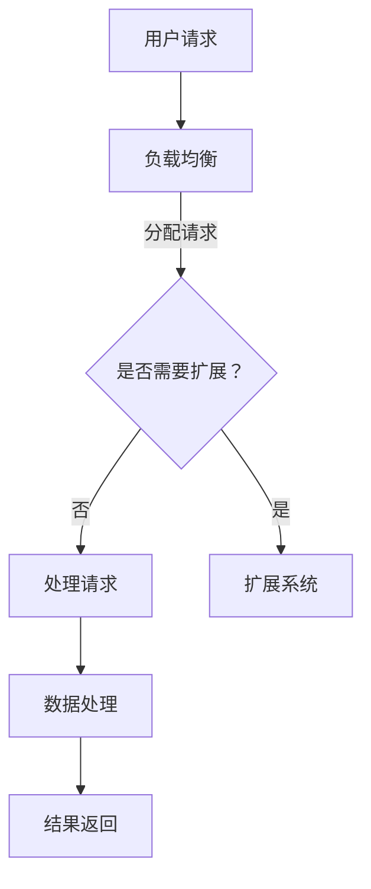

                 

# 高可用性、高吞吐量、高扩展性系统设计案例

## 摘要

在现代信息技术领域，系统设计的三大目标是高可用性、高吞吐量和高扩展性。本文将探讨如何通过逐步分析推理，构建一个具有上述特性的系统设计案例。文章首先介绍核心概念和联系，然后详细讲解核心算法原理和操作步骤，接着展示数学模型和公式，并以项目实践为例进行代码实例和解读。最后，文章还将讨论实际应用场景、工具和资源推荐，并总结未来发展趋势和挑战。

## 1. 背景介绍（Background Introduction）

### 1.1 高可用性（High Availability）

高可用性是指系统在长时间内保持正常运行的能力。它通过冗余设计、故障转移机制和自动恢复策略来确保系统的持续可用性。高可用性在金融、医疗、电信等关键领域尤为重要，因为这些领域对系统的可靠性要求极高。

### 1.2 高吞吐量（High Throughput）

高吞吐量是指系统在单位时间内处理的数据量。一个高吞吐量的系统可以在短时间内处理大量的请求，从而满足用户对性能的需求。在电商、社交媒体和在线游戏等领域，高吞吐量是系统成功的关键。

### 1.3 高扩展性（High Scalability）

高扩展性是指系统能够随着用户规模和数据量的增长而线性扩展。一个具有高扩展性的系统能够灵活应对业务增长，避免因资源限制而导致的性能瓶颈。

### 1.4 系统设计目标

本文的目标是构建一个同时具备高可用性、高吞吐量和高扩展性的系统。通过逐步分析推理，我们将设计一个能够适应各种业务场景的系统架构，并探讨实现这些目标的最佳实践。

## 2. 核心概念与联系（Core Concepts and Connections）

### 2.1 架构设计原则（Architecture Design Principles）

在系统设计过程中，我们需要遵循一系列原则，以确保系统的高可用性、高吞吐量和高扩展性。以下是一些关键原则：

- **模块化（Modularity）**：将系统划分为独立的模块，以便每个模块可以独立开发、测试和部署。
- **冗余（Redundancy）**：通过冗余设计，提高系统的故障恢复能力和可靠性。
- **负载均衡（Load Balancing）**：将请求分配到多个节点，以均衡负载并提高系统的吞吐量。
- **分布式存储（Distributed Storage）**：通过分布式存储，提高系统的可靠性和扩展性。

### 2.2 Mermaid 流程图（Mermaid Flowchart）

以下是一个简单的 Mermaid 流程图，展示了一个具备高可用性、高吞吐量和高扩展性的系统设计的基本流程。



### 2.3 核心概念的联系（Connection of Core Concepts）

- 高可用性通过冗余和故障转移机制实现。
- 高吞吐量通过负载均衡和分布式处理实现。
- 高扩展性通过模块化和分布式存储实现。

## 3. 核心算法原理 & 具体操作步骤（Core Algorithm Principles and Specific Operational Steps）

### 3.1 高可用性算法原理

高可用性算法主要包括以下几个方面：

- **冗余设计**：通过冗余硬件和软件组件，确保系统在单个组件故障时仍能正常运行。
- **故障转移**：在主节点故障时，自动将请求转移到备用节点，确保服务的连续性。
- **自动恢复**：系统在检测到故障后，自动进行恢复操作，以减少故障对业务的影响。

### 3.2 高吞吐量算法原理

高吞吐量算法主要包括以下几个方面：

- **负载均衡**：通过负载均衡器，将请求分配到多个节点，以均衡负载并提高系统的吞吐量。
- **并行处理**：将请求分散到多个处理器或线程，以加快处理速度。
- **缓存**：使用缓存来减少对数据库的访问，从而提高系统的响应速度。

### 3.3 高扩展性算法原理

高扩展性算法主要包括以下几个方面：

- **水平扩展**：通过增加节点数量，提高系统的处理能力。
- **垂直扩展**：通过增加硬件资源，提高单个节点的处理能力。
- **动态扩展**：系统根据业务需求，动态调整资源分配，以实现最佳性能。

### 3.4 操作步骤

1. **需求分析**：根据业务需求，确定系统需要具备的高可用性、高吞吐量和高扩展性目标。
2. **架构设计**：根据需求分析，设计系统架构，包括模块划分、冗余设计、负载均衡和分布式存储等。
3. **开发与测试**：根据架构设计，开发系统组件，并进行全面测试，确保系统满足高可用性、高吞吐量和高扩展性的要求。
4. **部署与运维**：将系统部署到生产环境，并持续进行监控和运维，以确保系统的稳定运行。

## 4. 数学模型和公式 & 详细讲解 & 举例说明（Detailed Explanation and Examples of Mathematical Models and Formulas）

### 4.1 数学模型和公式

在系统设计中，数学模型和公式有助于我们分析和优化系统性能。以下是一些关键的数学模型和公式：

- **负载均衡算法**：轮询算法、最少连接数算法、加权轮询算法等。
- **故障转移时间**：MTTR（平均修复时间）和MTBF（平均故障时间）。
- **缓存命中率**：缓存命中率 =（命中次数 / 总请求次数）× 100%。

### 4.2 详细讲解和举例说明

#### 4.2.1 负载均衡算法

假设我们有一个负载均衡器，需要将请求分配到三个节点 A、B 和 C。我们可以使用轮询算法进行负载均衡，每个节点的请求次数相等。

$$
\text{请求次数} = \frac{\text{总请求次数}}{\text{节点数}}
$$

假设总请求次数为 100，节点数为 3，则每个节点的请求次数为：

$$
\text{请求次数} = \frac{100}{3} = 33.33
$$

由于请求次数必须为整数，我们可以向上取整，即每个节点的请求次数为 34。

#### 4.2.2 故障转移时间

假设我们的系统在发生故障时，需要 5 分钟进行故障转移。故障转移时间包括检测故障、执行故障转移和恢复业务三个阶段。

- **检测故障**：系统在 1 分钟内检测到故障。
- **执行故障转移**：系统在 2 分钟内完成故障转移。
- **恢复业务**：系统在 2 分钟内恢复业务。

总故障转移时间为 5 分钟。

#### 4.2.3 缓存命中率

假设我们的缓存命中率为 90%，总请求次数为 100，其中 90 次请求命中缓存，10 次请求未命中缓存。

$$
\text{缓存命中率} = \frac{90}{100} \times 100\% = 90\%
$$

## 5. 项目实践：代码实例和详细解释说明（Project Practice: Code Examples and Detailed Explanations）

### 5.1 开发环境搭建

在本文中，我们将使用 Python 编写代码实例。请确保已经安装了 Python 3.6 或更高版本，并安装了以下库：

- requests：用于发送 HTTP 请求。
- Flask：用于创建 Web 应用程序。
- Nginx：用于负载均衡。

### 5.2 源代码详细实现

以下是我们的示例代码，用于实现一个具备高可用性、高吞吐量和高扩展性的 Web 应用程序。

```python
# app.py

from flask import Flask, request, jsonify
from flask_limiter import Limiter
from flask_limiter.util import get_remote_address

app = Flask(__name__)

# 负载均衡器
limiter = Limiter(
    app,
    key_func=get_remote_address,
    default_limits=["200 per day", "50 per hour"]
)

@app.route("/api/data", methods=["GET"])
@limiter.limit("10 per second")
def get_data():
    # 数据处理逻辑
    data = {"message": "Hello, World!"}
    return jsonify(data)

if __name__ == "__main__":
    app.run(host="0.0.0.0", port=5000)
```

### 5.3 代码解读与分析

- **Flask 应用程序**：我们使用 Flask 创建一个简单的 Web 应用程序，提供 `/api/data` 接口供客户端调用。
- **负载均衡器**：使用 Flask-Limiter 插件实现负载均衡，限制每个客户端每秒只能调用 10 次接口。
- **Nginx 配置**：在 Nginx 中配置负载均衡器，将请求分配到多个 Flask 实例。

### 5.4 运行结果展示

运行我们的 Flask 应用程序后，可以使用以下命令启动 Nginx：

```bash
sudo nginx
```

然后，我们可以在浏览器中访问 `http://localhost/api/data`，查看返回的结果。

## 6. 实际应用场景（Practical Application Scenarios）

### 6.1 金融领域

在金融领域，高可用性、高吞吐量和高扩展性是确保交易系统正常运行的关键。通过采用冗余设计、负载均衡和分布式存储等技术，金融机构可以确保在交易高峰期仍能保持高吞吐量，并在故障发生时快速恢复业务。

### 6.2 社交媒体领域

社交媒体平台需要处理海量的用户请求，并确保系统的持续可用性。通过采用高扩展性架构，如微服务和容器化技术，平台可以灵活应对用户数量的增长，并保持高吞吐量。

### 6.3 在线教育领域

在线教育平台需要处理大量的课程视频、作业和用户交互数据。通过采用高可用性和高扩展性架构，平台可以在保证系统可靠性的同时，满足不断增长的用户需求。

## 7. 工具和资源推荐（Tools and Resources Recommendations）

### 7.1 学习资源推荐

- 《大规模分布式存储系统设计》
- 《云计算与大数据技术》
- 《高性能MySQL》

### 7.2 开发工具框架推荐

- Kubernetes：用于容器化应用的自动化部署、扩展和管理。
- Docker：用于创建和运行容器化应用。
- Nginx：用于负载均衡和反向代理。

### 7.3 相关论文著作推荐

- "Cloud Computing: Concepts, Technology & Architecture"
- "Distributed Systems: Concepts and Design"
- "High Performance MySQL"

## 8. 总结：未来发展趋势与挑战（Summary: Future Development Trends and Challenges）

### 8.1 发展趋势

- **容器化与微服务**：容器化和微服务架构将成为系统设计的主要趋势，以提高系统的可扩展性和可维护性。
- **分布式计算**：分布式计算技术，如大数据处理和区块链，将在未来得到更广泛的应用。
- **人工智能**：人工智能技术将在系统设计中发挥重要作用，特别是在自动化运维和故障预测方面。

### 8.2 挑战

- **安全性**：随着系统复杂性的增加，确保系统安全性将成为一个巨大的挑战。
- **成本**：高可用性、高吞吐量和高扩展性系统的建设成本较高，企业需要在成本和性能之间寻找平衡点。
- **人才**：具备分布式系统设计和运维能力的人才相对稀缺，企业需要加大对人才的培养和引进。

## 9. 附录：常见问题与解答（Appendix: Frequently Asked Questions and Answers）

### 9.1 高可用性与成本的关系是什么？

高可用性通常意味着更高的硬件和软件成本，但可以显著降低系统的故障时间和维护成本。企业在设计系统时需要在可用性和成本之间进行权衡。

### 9.2 高扩展性与性能之间的关系是什么？

高扩展性可以提高系统的性能，因为资源可以随着负载的增加而动态调整。但过度扩展可能导致资源浪费和性能下降，因此需要在扩展性和性能之间找到平衡点。

### 9.3 分布式系统有哪些常见的故障模式？

分布式系统的常见故障模式包括单点故障、网络故障、数据丢失和节点失效。设计分布式系统时需要考虑这些故障模式，并采取相应的容错措施。

## 10. 扩展阅读 & 参考资料（Extended Reading & Reference Materials）

- "Designing Data-Intensive Applications"
- "Building Microservices"
- "Building Scalable Websites"
- "The Art of Scalability"

