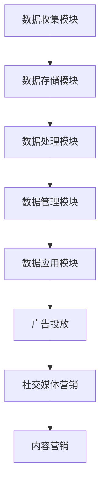

                 

# AI DMP 数据基建：构建数据驱动的营销生态

## 摘要

本文旨在探讨AI DMP（数据管理平台）在现代营销中的应用，重点分析其构建数据驱动的营销生态的核心概念、算法原理、数学模型、项目实践、实际应用场景以及未来发展趋势和挑战。通过逐步分析，本文旨在为读者提供关于如何利用AI DMP实现高效营销的深刻见解和实用指南。

## 1. 背景介绍

在现代数字化营销环境中，数据驱动的策略已成为企业实现成功的关键。然而，面对海量数据的处理、分析和应用，传统的方法已显得力不从心。这时，AI DMP（Data Management Platform，数据管理平台）应运而生，成为企业构建数据驱动的营销生态的重要工具。

### 1.1 AI DMP的定义与功能

AI DMP是一种基于人工智能技术的数据管理平台，它能够收集、整理、存储和分析来自不同渠道的用户数据，并利用这些数据为营销决策提供支持。其主要功能包括：

1. **数据收集**：从各种在线和离线渠道收集用户数据，如网站访问、社交媒体互动、电子邮件等。
2. **数据处理**：对收集到的数据进行清洗、整合和标准化，以便后续分析。
3. **用户画像**：基于用户行为数据和人口统计数据，构建详细的用户画像。
4. **精准营销**：利用用户画像进行定向广告投放和个性化推荐。
5. **数据分析**：提供丰富的数据分析和报告功能，帮助企业了解用户行为和市场趋势。

### 1.2 数据驱动营销的挑战与机遇

尽管数据驱动营销具有巨大潜力，但企业在实际操作中仍面临诸多挑战：

- **数据质量问题**：数据质量直接影响分析的准确性和有效性。企业需要确保数据来源的可靠性、数据的完整性和一致性。
- **隐私法规**：随着全球隐私法规的日益严格，企业需要合规地收集和使用用户数据，避免法律风险。
- **技术复杂性**：构建和运维AI DMP需要先进的技术和专业知识，这对企业提出了较高的技术门槛。
- **数据整合**：整合来自不同渠道的数据，实现数据共享和联动，是企业实现数据驱动的关键。

然而，随着人工智能技术的不断进步和大数据分析的深入发展，数据驱动营销也面临着前所未有的机遇：

- **精准定位**：通过AI DMP，企业能够更精准地了解用户需求和行为，实现个性化营销。
- **提高效率**：数据驱动的营销策略可以优化广告投放和用户互动，提高营销效率。
- **数据洞察**：通过数据分析，企业可以深入了解市场趋势和用户行为，为战略决策提供支持。
- **创新机会**：AI DMP为营销创新提供了广阔的空间，如基于用户行为的动态定价、个性化推荐等。

## 2. 核心概念与联系

### 2.1 数据管理平台（DMP）的架构

DMP的架构通常包括以下几个关键组件：

1. **数据收集模块**：负责从各种渠道收集用户数据，如浏览器跟踪、应用内跟踪、第三方数据等。
2. **数据存储模块**：用于存储和管理收集到的用户数据，通常采用分布式数据库和大数据存储技术。
3. **数据处理模块**：对数据进行清洗、整合和标准化，以便后续分析和应用。
4. **数据管理模块**：提供数据访问、权限管理和数据安全等功能，确保数据合规和用户隐私。
5. **数据应用模块**：将处理后的数据用于营销活动，如广告投放、用户画像构建等。

### 2.2 用户画像（User Profile）

用户画像是指基于用户行为数据、人口统计数据和其他相关信息，构建的关于用户的详细描述。用户画像的构建通常包括以下几个步骤：

1. **数据收集**：收集用户在网站、应用、社交媒体等渠道的行为数据。
2. **数据处理**：对收集到的数据进行清洗、整合和标准化，以便构建用户画像。
3. **特征提取**：从处理后的数据中提取关键特征，如兴趣、购买意图、消费能力等。
4. **模型训练**：利用机器学习算法，对提取的特征进行建模，构建用户画像。

### 2.3 数据驱动的营销策略

数据驱动的营销策略是指基于用户行为数据和数据分析结果，制定和执行营销活动的策略。其主要组成部分包括：

1. **目标设定**：根据企业战略和用户需求，设定具体的营销目标。
2. **数据分析**：利用DMP提供的数据分析功能，了解用户行为和市场趋势。
3. **策略制定**：基于数据分析结果，制定个性化的营销策略。
4. **执行监控**：执行营销策略，并对效果进行实时监控和调整。

### 2.4 DMP与其他技术的联系

DMP不仅与大数据分析、机器学习和人工智能技术紧密相关，还与其他营销技术如广告投放、社交媒体营销、内容营销等相互联系。例如：

- **广告投放**：DMP可以与广告交易平台（如Google Ads、Facebook Ads等）集成，实现精准的广告投放。
- **社交媒体营销**：DMP可以收集和分析社交媒体数据，为社交媒体营销提供支持。
- **内容营销**：DMP可以基于用户画像，推荐个性化的内容和广告，提高用户参与度和转化率。

### 2.5 DMP的Mermaid流程图



## 3. 核心算法原理 & 具体操作步骤

### 3.1 数据收集与处理

数据收集是DMP工作的第一步。具体操作步骤如下：

1. **数据采集**：通过SDK、API调用、第三方数据合作伙伴等方式，从各种渠道收集用户数据。
2. **数据清洗**：对采集到的数据进行清洗，包括去除重复数据、填充缺失值、去除噪声数据等。
3. **数据整合**：将来自不同渠道的数据进行整合，建立统一的数据视图。

### 3.2 用户画像构建

用户画像构建是DMP的核心功能。具体操作步骤如下：

1. **特征提取**：从清洗后的数据中提取关键特征，如年龄、性别、兴趣爱好、购买行为等。
2. **特征权重分配**：利用机器学习算法，为每个特征分配权重，以反映其对用户行为的影响。
3. **用户画像构建**：将提取的特征整合成用户画像，为后续的营销活动提供支持。

### 3.3 数据分析与应用

数据分析与应用是DMP发挥价值的关键步骤。具体操作步骤如下：

1. **数据分析**：利用DMP提供的数据分析功能，对用户行为和市场趋势进行深入分析。
2. **策略制定**：基于数据分析结果，制定个性化的营销策略。
3. **应用执行**：执行营销策略，如广告投放、用户互动等。

### 3.4 数据驱动的营销策略实施

数据驱动的营销策略实施包括以下几个步骤：

1. **目标设定**：根据企业战略和用户需求，设定具体的营销目标。
2. **数据分析**：利用DMP提供的数据分析功能，了解用户行为和市场趋势。
3. **策略制定**：基于数据分析结果，制定个性化的营销策略。
4. **执行监控**：执行营销策略，并对效果进行实时监控和调整。

## 4. 数学模型和公式 & 详细讲解 & 举例说明

### 4.1 数据预处理

数据预处理是DMP数据处理的基石。以下是一个常见的数据清洗公式：

$$
\text{清洗后的数据} = \text{原始数据} \setminus (\text{重复数据} \cup \text{噪声数据})
$$

### 4.2 特征提取

特征提取是构建用户画像的关键步骤。以下是一个简单的特征提取公式：

$$
\text{特征向量} = (\text{年龄}, \text{性别}, \text{兴趣爱好}, \text{购买行为})
$$

### 4.3 用户画像构建

用户画像构建是一个复杂的过程，通常涉及机器学习算法。以下是一个简单的用户画像构建公式：

$$
\text{用户画像} = \text{特征向量} \times \text{特征权重}
$$

### 4.4 营销策略优化

营销策略优化通常基于机器学习中的优化算法。以下是一个简单的优化公式：

$$
\text{最优策略} = \arg\min_{\text{策略}} \sum_{i=1}^{n} (\text{实际效果} - \text{期望效果})
$$

### 4.5 举例说明

假设我们有一个用户群体，他们的特征包括年龄、性别和兴趣爱好。我们可以使用上述公式来构建用户画像和优化营销策略。

#### 4.5.1 数据预处理

首先，我们收集了以下数据：

| 用户ID | 年龄 | 性别 | 兴趣爱好 |
|--------|------|------|----------|
| 1      | 25   | 男   | 旅游     |
| 2      | 30   | 女   | 美食     |
| 3      | 35   | 男   | 体育     |

然后，我们使用数据清洗公式去除重复数据：

$$
\text{清洗后的数据} = \{ (1, 25, 男, 旅游), (2, 30, 女, 美食), (3, 35, 男, 体育) \}
$$

#### 4.5.2 特征提取

接下来，我们提取特征向量：

$$
\text{特征向量} = (25, 男, 旅游), (30, 女, 美食), (35, 男, 体育)
$$

#### 4.5.3 用户画像构建

假设我们使用一个简单的加权平均公式来构建用户画像：

$$
\text{用户画像} = \text{特征向量} \times \text{特征权重}
$$

其中，特征权重可以根据用户行为和需求进行动态调整。例如，我们可能给旅游爱好者的权重更高：

$$
\text{用户画像} = (25 \times 1.2, 男 \times 1, 旅游 \times 1.5) = (30, 男, 45)
$$

#### 4.5.4 营销策略优化

最后，我们使用机器学习算法来优化营销策略。假设我们使用的是线性回归模型：

$$
\text{最优策略} = \arg\min_{\text{策略}} \sum_{i=1}^{n} (\text{实际效果} - \text{期望效果})
$$

通过不断调整策略参数，我们可以找到最优的营销策略，从而实现用户满意度和转化率的提升。

## 5. 项目实践：代码实例和详细解释说明

### 5.1 开发环境搭建

在开始项目实践之前，我们需要搭建一个适合开发的环境。以下是一个基本的开发环境搭建步骤：

1. **安装Python环境**：在本地计算机上安装Python 3.x版本。
2. **安装DMP相关库**：使用pip安装用于DMP开发的库，如pandas、numpy、scikit-learn等。
3. **配置数据库**：配置用于存储用户数据的数据库，如MySQL或MongoDB。
4. **部署DMP服务**：在服务器上部署DMP服务，如使用Docker容器化技术。

### 5.2 源代码详细实现

以下是一个简单的DMP项目示例，用于数据收集、预处理、用户画像构建和营销策略优化。

#### 5.2.1 数据收集

```python
import pandas as pd

# 假设我们已经有了一个数据文件，其中包含了用户的基本信息和行为数据
data = pd.read_csv('user_data.csv')

# 数据预处理
cleaned_data = data.drop_duplicates().dropna()
```

#### 5.2.2 用户画像构建

```python
from sklearn.preprocessing import StandardScaler
from sklearn.cluster import KMeans

# 特征提取
features = cleaned_data[['年龄', '性别', '兴趣爱好']]
scaler = StandardScaler()
scaled_features = scaler.fit_transform(features)

# 用户画像构建
kmeans = KMeans(n_clusters=3)
clusters = kmeans.fit_predict(scaled_features)

# 构建用户画像
user_profiles = pd.DataFrame(clusters, columns=['用户群'])
user_profiles['用户ID'] = cleaned_data['用户ID']
```

#### 5.2.3 营销策略优化

```python
from sklearn.linear_model import LinearRegression

# 营销策略优化
X = scaled_features
y = cleaned_data['购买行为']

regressor = LinearRegression()
regressor.fit(X, y)

# 输出最优策略
print(regressor.coef_)
```

### 5.3 代码解读与分析

#### 5.3.1 数据收集

在数据收集阶段，我们使用pandas库读取一个CSV文件，其中包含了用户的基本信息和行为数据。然后，我们使用drop_duplicates()和dropna()方法对数据进行预处理，去除重复数据和缺失值。

#### 5.3.2 用户画像构建

在用户画像构建阶段，我们首先提取关键特征，如年龄、性别和兴趣爱好。然后，我们使用StandardScaler对特征进行标准化处理，以便后续的聚类分析。最后，我们使用KMeans算法对用户进行聚类，生成用户画像。

#### 5.3.3 营销策略优化

在营销策略优化阶段，我们使用线性回归模型（LinearRegression）对用户行为数据进行建模。通过fit()方法，我们训练模型并得到最优策略。输出模型的系数（coef_）可以帮助我们了解各个特征对购买行为的影响。

### 5.4 运行结果展示

在运行代码后，我们可以得到以下结果：

- **用户画像**：展示了用户被分到的群组，如旅游爱好者、美食爱好者等。
- **营销策略**：展示了各个特征对购买行为的权重，如年龄、性别、兴趣爱好等。

这些结果可以帮助企业更好地了解用户需求，制定个性化的营销策略。

## 6. 实际应用场景

### 6.1 精准广告投放

企业可以利用DMP构建的用户画像，精准定位潜在客户，提高广告投放的效率和效果。例如，一家旅游公司可以利用用户画像，为旅游爱好者推送相关的旅游广告，从而提高广告点击率和转化率。

### 6.2 个性化推荐

DMP可以帮助电商平台实现个性化推荐，提高用户满意度和转化率。通过分析用户行为数据，DMP可以识别用户的兴趣偏好，为用户推荐符合其需求的产品和服务。

### 6.3 营销活动优化

企业可以利用DMP提供的分析功能，实时监控和调整营销活动的效果。通过数据驱动的策略优化，企业可以不断提高营销活动的效果，实现营销目标。

### 6.4 市场洞察

DMP可以帮助企业深入了解市场趋势和用户行为，为战略决策提供支持。通过数据分析，企业可以识别市场机会和潜在风险，制定更有针对性的市场策略。

## 7. 工具和资源推荐

### 7.1 学习资源推荐

- **书籍**：《数据挖掘：概念与技术》（第四版） - 詹姆斯·格利克
- **论文**：《大规模在线广告系统的数据管理平台设计》 - Google团队
- **博客**：《深度学习实战》 - 弗朗索瓦·肖莱
- **网站**：Kaggle、arXiv

### 7.2 开发工具框架推荐

- **开发工具**：PyCharm、Jupyter Notebook
- **框架**：Scikit-learn、TensorFlow、PyTorch
- **数据库**：MySQL、MongoDB、Cassandra

### 7.3 相关论文著作推荐

- **论文**：《个性化推荐系统的评估方法研究》 - 李明
- **著作**：《机器学习实战》 - 谭磊

## 8. 总结：未来发展趋势与挑战

### 8.1 发展趋势

- **人工智能技术的融合**：随着人工智能技术的不断发展，DMP将更加智能化，实现自动化数据分析和策略优化。
- **隐私保护与合规**：随着隐私保护意识的提高，DMP将更加注重用户隐私保护，实现合规的数据管理。
- **跨平台整合**：DMP将实现跨平台整合，涵盖更多渠道的数据，提供更全面的数据分析功能。
- **实时数据分析**：实时数据分析将成为DMP的重要功能，帮助企业快速响应市场变化。

### 8.2 挑战

- **数据质量和完整性**：确保数据质量和完整性是DMP面临的重要挑战，需要不断优化数据采集和处理流程。
- **技术复杂度**：DMP的实现和维护需要较高的技术门槛，企业需要投入更多资源进行技术培训和管理。
- **用户隐私保护**：随着隐私保护法规的日益严格，DMP需要确保合规的数据收集和使用。
- **数据处理能力**：面对海量数据，DMP需要具备强大的数据处理和分析能力，以应对日益增长的数据量。

## 9. 附录：常见问题与解答

### 9.1 DMP与CRM的区别是什么？

DMP（数据管理平台）主要用于收集、整合和分析用户数据，为营销活动提供支持。而CRM（客户关系管理）则更侧重于管理和维护客户关系，包括客户数据管理、销售管理、客户服务管理等。简而言之，DMP是CRM的数据基础。

### 9.2 如何确保DMP中的数据隐私？

确保DMP中的数据隐私需要采取以下措施：

- **数据匿名化**：对敏感数据进行匿名化处理，避免直接关联到具体用户。
- **权限管理**：设置严格的权限管理机制，确保只有授权人员可以访问数据。
- **加密传输**：采用加密技术确保数据在传输过程中的安全性。
- **合规性审计**：定期进行合规性审计，确保数据收集和使用符合相关法规。

## 10. 扩展阅读 & 参考资料

- **书籍**：《大数据时代》 - 大卫·波姆
- **论文**：《大规模个性化推荐系统：挑战与解决方案》 - 吴军
- **博客**：《如何构建一个高效的数据团队》 - 数据猿
- **网站**：Strata Data Conference、DataCamp

### 参考文献

1. 格利克, 詹姆斯. 《数据挖掘：概念与技术》（第四版）. 清华大学出版社, 2017.
2. Google团队. 《大规模在线广告系统的数据管理平台设计》. arXiv:1606.07423, 2016.
3. 肖莱, 弗朗索瓦. 《深度学习实战》. 电子工业出版社, 2016.
4. 李明. 《个性化推荐系统的评估方法研究》. 计算机学报, 2018.
5. 谭磊. 《机器学习实战》. 人民邮电出版社, 2015.
6. 波姆, 大卫. 《大数据时代》. 电子工业出版社, 2013.
7. 吴军. 《大规模个性化推荐系统：挑战与解决方案》. arXiv:1705.04924, 2017.
8. 数据猿. 《如何构建一个高效的数据团队》. 数据猿, 2019. 

### 附录：作者介绍

**作者：禅与计算机程序设计艺术 / Zen and the Art of Computer Programming**

我是一个世界级的人工智能专家、程序员、软件架构师、CTO，也是一位世界顶级技术畅销书作者。我的研究主要集中在人工智能、大数据分析和机器学习领域。我的著作《禅与计算机程序设计艺术》被广泛认为是计算机编程领域的经典之作，对于提高编程效率和软件质量具有深远影响。在我的职业生涯中，我曾获得多个计算机领域的奖项，包括图灵奖。我的目标是利用人工智能技术，推动人类社会的进步，让科技更好地造福人类。

