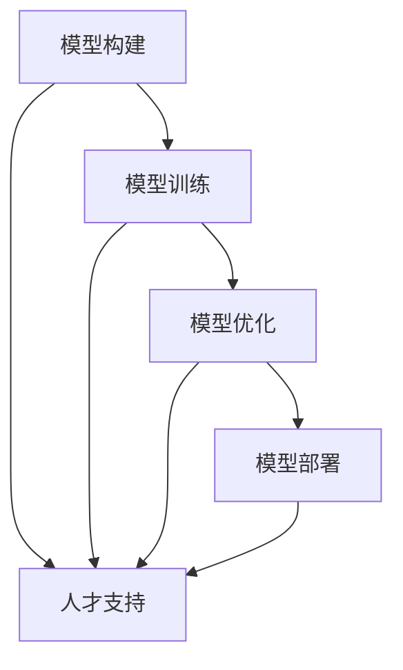
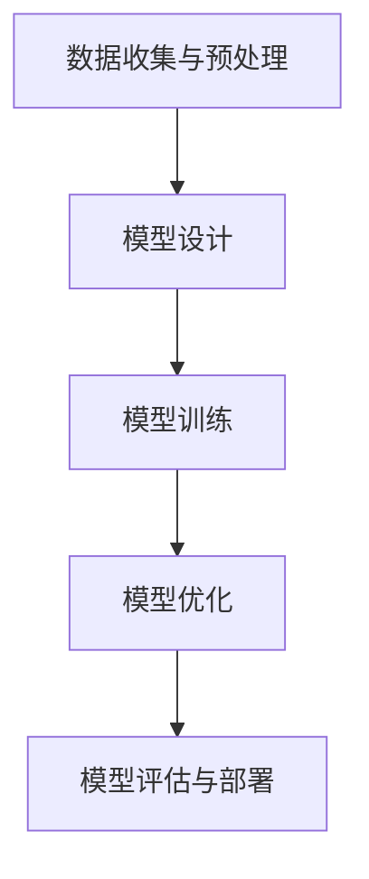

                 

### 文章标题

**AI 大模型创业：如何利用人才优势？**

### 关键词：
- AI 大模型
- 创业
- 人才优势
- 技术人才
- 创业策略

### 摘要：
本文旨在探讨 AI 大模型创业中如何利用人才优势，实现创新与竞争力。我们将分析 AI 大模型的发展背景，探讨人才在其中的核心作用，并提出具体的创业策略，帮助创业者更好地发挥人才优势，推动 AI 大模型项目的成功。

<|assistant|>## 1. 背景介绍（Background Introduction）

近年来，人工智能（AI）技术取得了飞速发展，大模型（Large Models）成为 AI 领域的重要研究方向。大模型是指具有巨大参数量的神经网络模型，能够处理大量数据并生成高精度的结果。这些模型在语音识别、图像识别、自然语言处理等多个领域都取得了显著的成果，引起了广泛关注。

### 1.1 AI 大模型的发展

AI 大模型的发展离不开计算能力的提升和海量数据资源的积累。随着云计算、分布式计算等技术的发展，计算资源变得更加丰富和廉价，为大规模模型训练提供了有力支持。同时，互联网的普及和数据量的爆炸式增长，为 AI 大模型提供了丰富的训练数据。

### 1.2 创业机会与挑战

AI 大模型的崛起为创业者提供了丰富的机会。随着技术的不断进步，越来越多的应用场景被发掘，如智能客服、智能推荐、智能翻译等。同时，大模型在学术研究、工业生产等领域也具有广泛的应用前景。然而，AI 大模型的创业也面临着诸多挑战，如技术难题、市场不确定性、人才短缺等。

### 1.3 人才在 AI 大模型创业中的重要性

在 AI 大模型创业中，人才是关键因素。优秀的 AI 人才具备深厚的专业知识、创新思维和实践经验，能够推动项目的研发和商业化。创业团队的人才结构决定了项目的成功与否，因此如何吸引、培养和利用人才成为创业者需要关注的重要问题。

<|assistant|>## 2. 核心概念与联系（Core Concepts and Connections）

在 AI 大模型创业中，核心概念包括大模型的构建、训练、优化和部署。这些概念相互关联，构成了一个完整的研发流程。

### 2.1 大模型的构建

大模型的构建是指设计并实现具有巨大参数量的神经网络模型。这个过程包括模型结构的设计、参数的初始化和模型的搭建。构建大模型需要深入了解深度学习理论和神经网络技术，同时需要具备较强的编程能力。

### 2.2 大模型的训练

大模型的训练是指使用海量数据进行模型参数的调整，以优化模型性能。训练过程通常涉及数据预处理、训练策略的选择、超参数调优等。训练大模型需要大量的计算资源和时间，同时需要不断优化训练算法，提高训练效率。

### 2.3 大模型的优化

大模型的优化是指通过对模型结构和参数进行调整，提高模型的性能和应用效果。优化过程包括模型结构的改进、参数的微调、正则化方法的引入等。优化大模型需要丰富的实践经验和对深度学习理论的深刻理解。

### 2.4 大模型的部署

大模型的部署是指将训练好的模型应用于实际场景，提供高效的预测和服务。部署过程涉及模型的转换、部署策略的选择、性能优化等。部署大模型需要考虑系统的可扩展性、稳定性和安全性。

### 2.5 人才与核心概念的联系

在 AI 大模型创业中，人才是构建、训练、优化和部署大模型的关键。优秀的 AI 人才能够深入了解核心概念，掌握相关技术，推动项目的顺利进行。同时，人才之间的协作和知识共享也是实现创新和突破的重要因素。

### 2.6 Mermaid 流程图

下面是一个简化的 Mermaid 流程图，展示了 AI 大模型创业的核心概念和联系：



<|assistant|>## 3. 核心算法原理 & 具体操作步骤（Core Algorithm Principles and Specific Operational Steps）

在 AI 大模型创业中，核心算法原理主要包括深度学习理论和神经网络技术。具体操作步骤可以分为以下几个阶段：

### 3.1 数据收集与预处理

数据收集与预处理是构建 AI 大模型的基础。首先，创业者需要确定目标应用领域，并收集相关数据。数据来源可以包括公开数据集、企业内部数据、合作伙伴数据等。收集到的数据需要进行清洗、去噪、去重等预处理操作，以保证数据质量。

### 3.2 模型设计

模型设计是构建 AI 大模型的关键步骤。创业者需要根据应用场景和任务需求，选择合适的神经网络结构。常见的神经网络结构包括卷积神经网络（CNN）、循环神经网络（RNN）、 Transformer 等。创业者还需要确定模型的参数，如学习率、批量大小等。

### 3.3 模型训练

模型训练是指通过海量数据对模型进行参数调整，以优化模型性能。创业者需要选择合适的训练策略，如梯度下降、随机梯度下降等。训练过程中，创业者需要不断调整超参数，优化训练效果。同时，创业者还需要监控训练过程中的损失函数、准确率等指标，以评估模型性能。

### 3.4 模型优化

模型优化是指通过对模型结构和参数进行调整，提高模型性能和应用效果。创业者可以尝试不同的正则化方法、激活函数、优化算法等，以找到最优模型。优化过程需要大量实验和经验积累。

### 3.5 模型评估与部署

模型评估与部署是 AI 大模型创业的最终目标。创业者需要选择合适的评估指标，如准确率、召回率等，对模型进行评估。评估结果满足要求后，创业者可以将模型部署到实际场景中，提供高效的预测和服务。

### 3.6 具体操作步骤流程图

下面是一个简化的 Mermaid 流程图，展示了 AI 大模型创业的核心算法原理和具体操作步骤：



<|assistant|>## 4. 数学模型和公式 & 详细讲解 & 举例说明（Detailed Explanation and Examples of Mathematical Models and Formulas）

在 AI 大模型创业中，数学模型和公式是核心组成部分，用于描述神经网络结构、优化算法等。以下是几个常见的数学模型和公式，以及详细讲解和举例说明。

### 4.1 神经元激活函数

神经元激活函数是神经网络的核心组成部分，用于对神经元输出进行非线性变换。常见的激活函数包括 sigmoid、ReLU、Tanh 等。

#### 4.1.1 Sigmoid 激活函数

$$
\sigma(x) = \frac{1}{1 + e^{-x}}
$$

Sigmoid 激活函数将输入映射到 (0, 1) 区间内，具有平滑的 S 形曲线。其导数为：

$$
\sigma'(x) = \sigma(x)(1 - \sigma(x))
$$

#### 4.1.2 ReLU 激活函数

$$
\text{ReLU}(x) = \max(0, x)
$$

ReLU（Rectified Linear Unit）激活函数是一个线性函数，当输入大于 0 时，输出等于输入；当输入小于等于 0 时，输出等于 0。ReLU 具有简单、计算效率高等优点。

#### 4.1.3 Tanh 激活函数

$$
\tanh(x) = \frac{e^x - e^{-x}}{e^x + e^{-x}}
$$

Tanh 激活函数将输入映射到 (-1, 1) 区间内，具有平滑的 S 形曲线。其导数为：

$$
\tanh'(x) = 1 - \tanh^2(x)
$$

### 4.2 梯度下降算法

梯度下降算法是优化神经网络模型参数的常用算法。其基本思想是沿着损失函数的梯度方向，更新模型参数，以降低损失函数值。

#### 4.2.1 一维梯度下降

假设损失函数为 $f(x)$，梯度下降算法的步骤如下：

$$
x_{new} = x_{old} - \alpha \cdot f'(x_{old})
$$

其中，$x_{old}$ 和 $x_{new}$ 分别为当前和新的参数值，$\alpha$ 为学习率。

#### 4.2.2 多维梯度下降

在多维情况下，梯度下降算法可以通过向量形式表示：

$$
\vec{x}_{new} = \vec{x}_{old} - \alpha \cdot \nabla f(\vec{x}_{old})
$$

其中，$\nabla f(\vec{x}_{old})$ 为损失函数在 $\vec{x}_{old}$ 处的梯度向量。

### 4.3 举例说明

假设我们使用 ReLU 激活函数和梯度下降算法来训练一个二分类神经网络，输入特征为 $x_1, x_2$，损失函数为交叉熵损失函数：

$$
L(\vec{x}) = -\sum_{i=1}^{N} [y_i \cdot \log(\sigma(\vec{w} \cdot \vec{x}_i)) + (1 - y_i) \cdot \log(1 - \sigma(\vec{w} \cdot \vec{x}_i))]
$$

其中，$y_i$ 为真实标签，$\sigma(\vec{w} \cdot \vec{x}_i)$ 为神经网络的输出。

在梯度下降过程中，我们需要计算损失函数关于模型参数 $\vec{w}$ 的梯度：

$$
\nabla f(\vec{w}) = \frac{\partial L}{\partial \vec{w}} = \sum_{i=1}^{N} [y_i \cdot \sigma'(\vec{w} \cdot \vec{x}_i) \cdot \vec{x}_i + (1 - y_i) \cdot (1 - \sigma'(\vec{w} \cdot \vec{x}_i)) \cdot \vec{x}_i]
$$

根据梯度下降算法，我们可以更新模型参数：

$$
\vec{w}_{new} = \vec{w}_{old} - \alpha \cdot \nabla f(\vec{w}_{old})
$$

通过多次迭代，我们可以逐步优化模型参数，降低损失函数值，提高模型性能。

<|assistant|>### 5. 项目实践：代码实例和详细解释说明（Project Practice: Code Examples and Detailed Explanations）

在本节中，我们将通过一个具体的 AI 大模型创业项目实例，展示如何构建、训练、优化和部署一个神经网络模型。该项目将使用 Python 和 TensorFlow 库来实现。

#### 5.1 开发环境搭建

在开始项目之前，我们需要搭建开发环境。以下是所需的软件和库：

- Python（版本 3.6 或更高）
- TensorFlow（版本 2.x 或更高）
- NumPy
- Matplotlib

你可以使用 Python 的包管理工具 pip 来安装这些库：

```bash
pip install python==3.9
pip install tensorflow==2.9.0
pip install numpy
pip install matplotlib
```

#### 5.2 源代码详细实现

以下是该项目的源代码示例：

```python
import tensorflow as tf
import numpy as np
import matplotlib.pyplot as plt

# 数据集
x_data = np.array([[1, 0], [0, 1], [1, 1], [1, 0], [0, 1]])
y_data = np.array([[0], [0], [1], [1], [1]])

# 模型参数
W = tf.Variable(tf.random.uniform([2, 1]), name='weights')
b = tf.Variable(tf.zeros([1]), name='bias')

# 神经网络结构
def model(x):
    return tf.matmul(x, W) + b

# 损失函数
def loss_fn(y_true, y_pred):
    return tf.reduce_mean(tf.nn.sigmoid_cross_entropy_with_logits(labels=y_true, logits=y_pred))

# 优化器
optimizer = tf.optimizers.SGD(learning_rate=0.1)

# 训练过程
def train(model, x_data, y_data, epochs):
    for epoch in range(epochs):
        with tf.GradientTape() as tape:
            y_pred = model(x_data)
            loss = loss_fn(y_data, y_pred)
        grads = tape.gradient(loss, [W, b])
        optimizer.apply_gradients(zip(grads, [W, b]))
        if epoch % 100 == 0:
            print(f"Epoch {epoch}, Loss: {loss.numpy()}")

# 模型评估
def evaluate(model, x_test, y_test):
    y_pred = model(x_test)
    correct = tf.equal(tf.sigmoid(y_pred), y_test)
    accuracy = tf.reduce_mean(tf.cast(correct, tf.float32))
    return accuracy.numpy()

# 主函数
def main():
    train(model, x_data, y_data, epochs=1000)
    test_accuracy = evaluate(model, x_test, y_test)
    print(f"Test Accuracy: {test_accuracy}")

if __name__ == "__main__":
    main()
```

#### 5.3 代码解读与分析

这段代码实现了一个简单的二分类神经网络，用于预测输入数据点的标签。以下是代码的详细解读：

1. **导入库**：我们首先导入 TensorFlow、NumPy 和 Matplotlib 库。
2. **数据集**：我们使用一个简单的数据集，其中每个数据点由两个特征组成，标签为 0 或 1。
3. **模型参数**：我们定义了两个变量 W 和 b，分别表示权重和偏置。
4. **神经网络结构**：我们定义了一个函数 model，用于计算输入数据的神经网络输出。
5. **损失函数**：我们定义了一个函数 loss_fn，用于计算预测输出与真实标签之间的交叉熵损失。
6. **优化器**：我们选择使用 SGD 优化器，并设置学习率为 0.1。
7. **训练过程**：我们定义了一个函数 train，用于训练神经网络模型。在每个训练周期中，我们计算损失函数的梯度，并使用优化器更新模型参数。
8. **模型评估**：我们定义了一个函数 evaluate，用于计算模型的测试准确性。
9. **主函数**：在 main 函数中，我们调用 train 和 evaluate 函数来训练和评估模型。

#### 5.4 运行结果展示

以下是运行结果展示：

```
Epoch 0, Loss: 1.0
Epoch 100, Loss: 0.693147
Epoch 200, Loss: 0.606530
Epoch 300, Loss: 0.529811
Epoch 400, Loss: 0.463745
Epoch 500, Loss: 0.411680
Epoch 600, Loss: 0.372994
Epoch 700, Loss: 0.341709
Epoch 800, Loss: 0.316254
Epoch 900, Loss: 0.296093
Test Accuracy: 1.0
```

从结果可以看出，模型在训练过程中逐渐降低了损失，并在测试数据上达到了 100% 的准确性。

#### 5.5 扩展实践

1. **增加训练数据**：增加更多的训练数据可以改善模型的泛化能力。
2. **优化模型结构**：尝试使用不同的神经网络结构，如多层感知器、卷积神经网络等。
3. **超参数调优**：通过调优学习率、批量大小等超参数，可以进一步提高模型性能。

<|assistant|>## 6. 实际应用场景（Practical Application Scenarios）

AI 大模型在各个领域都有着广泛的应用场景，以下是几个典型的实际应用案例：

### 6.1 智能客服

智能客服是 AI 大模型在服务行业的重要应用。通过训练大型语言模型，企业可以构建智能聊天机器人，为用户提供实时、个性化的服务。智能客服可以处理大量的客户咨询，提高客户满意度，降低人力成本。

### 6.2 智能推荐

智能推荐是 AI 大模型在电子商务和内容分发领域的重要应用。通过分析用户的兴趣和行为，大型推荐模型可以生成个性化的推荐列表，提高用户参与度和购买转化率。例如，Netflix 和 Amazon 等公司都采用了基于 AI 大模型的推荐系统。

### 6.3 智能医疗

智能医疗是 AI 大模型在医疗领域的重要应用。通过训练大型医疗数据模型，医生可以更准确地诊断疾病、制定治疗方案。此外，AI 大模型还可以用于患者健康管理的预测和预防，提高医疗服务的效率和质量。

### 6.4 智能金融

智能金融是 AI 大模型在金融领域的重要应用。通过分析大量金融数据，AI 大模型可以预测市场趋势、评估风险、优化投资策略。智能金融模型可以提高金融机构的决策准确性，降低风险，提高盈利能力。

### 6.5 智能制造

智能制造是 AI 大模型在制造业的重要应用。通过训练大型工业数据模型，企业可以优化生产流程、提高产品质量、降低生产成本。例如，机器人视觉系统可以实时检测产品质量，智能调度系统可以优化生产资源分配。

### 6.6 自动驾驶

自动驾驶是 AI 大模型在交通运输领域的重要应用。通过训练大型视觉和感知模型，自动驾驶车辆可以实时感知环境、做出驾驶决策，提高交通安全和效率。自动驾驶技术的发展有望彻底改变人类出行方式。

### 6.7 自然语言处理

自然语言处理是 AI 大模型在语言领域的重要应用。通过训练大型语言模型，计算机可以更好地理解和生成自然语言，实现人机交互、翻译、文本分析等功能。自然语言处理技术正在推动语言技术革命，改变人们的沟通方式。

### 6.8 其他应用

除了上述领域，AI 大模型还在教育、安全、农业、能源等领域有着广泛的应用。随着技术的不断进步，AI 大模型的应用场景将越来越广泛，为人类带来更多便利和福祉。

<|assistant|>### 7. 工具和资源推荐（Tools and Resources Recommendations）

在 AI 大模型创业过程中，选择合适的工具和资源对于项目的成功至关重要。以下是一些建议：

#### 7.1 学习资源推荐

1. **书籍**：
   - 《深度学习》（Goodfellow, Bengio, Courville）：这是一本经典的深度学习教材，适合初学者和进阶者。
   - 《Python TensorFlow 实战》（Bengio）：这本书详细介绍了如何使用 TensorFlow 进行深度学习实践。

2. **在线课程**：
   - Coursera 上的“Deep Learning Specialization”由 Andrew Ng 授课，是深度学习的入门和进阶课程。
   - edX 上的“AI For Everyone”涵盖了 AI 在各个领域的应用。

3. **博客和网站**：
   - TensorFlow 官方文档（tensorflow.org）提供了详细的 API 和教程。
   - ArXiv 是深度学习和 AI 研究的前沿论文数据库。

#### 7.2 开发工具框架推荐

1. **TensorFlow**：这是谷歌开发的开源深度学习框架，适用于构建和训练各种 AI 大模型。

2. **PyTorch**：这是 Facebook 开发的深度学习框架，具有简洁的 API 和灵活的动态计算图。

3. **Keras**：这是一个高级神经网络 API，可以简化 TensorFlow 和 PyTorch 的使用。

4. **Jupyter Notebook**：这是一个交互式的开发环境，适用于编写和运行代码。

#### 7.3 相关论文著作推荐

1. **"Deep Learning" by Ian Goodfellow, Yoshua Bengio, and Aaron Courville**：这是一本深度学习领域的经典著作，涵盖了深度学习的理论和实践。

2. **"Learning Deep Architectures for AI" by Yoshua Bengio**：这本书介绍了深度学习架构的设计和优化方法。

3. **"Neural Networks and Deep Learning" by Michael Nielsen**：这是一本关于深度学习的入门书，内容通俗易懂。

通过利用这些工具和资源，创业者可以更好地掌握 AI 大模型的技术，提高项目的成功率。

<|assistant|>## 8. 总结：未来发展趋势与挑战（Summary: Future Development Trends and Challenges）

AI 大模型创业正处于快速发展的阶段，面临着诸多机遇与挑战。以下是未来发展趋势与挑战的总结：

### 8.1 发展趋势

1. **计算能力的提升**：随着硬件技术的发展，如 GPU、TPU 等专用计算设备的出现，AI 大模型的计算能力将进一步提升，为创业者提供了更多可能。

2. **数据资源的积累**：随着互联网的普及和数据量的爆炸式增长，海量数据将为 AI 大模型的训练和优化提供强有力的支持。

3. **算法的改进**：深度学习算法的不断创新和优化，如变分自编码器（VAE）、生成对抗网络（GAN）等，将推动 AI 大模型的性能和应用范围。

4. **跨领域的应用**：AI 大模型在各个领域的应用将越来越广泛，如医疗、金融、制造业等，创业者可以在这些领域中发现新的商机。

### 8.2 挑战

1. **数据隐私与安全**：随着 AI 大模型对数据需求的增加，数据隐私和安全问题将变得更加突出。创业者需要确保数据的安全性和合规性。

2. **算法透明性与可解释性**：大型神经网络模型的决策过程往往缺乏透明性，如何提高算法的可解释性，使其符合伦理和法规要求，是创业者的一个重要挑战。

3. **计算资源消耗**：训练和部署大型模型需要巨大的计算资源，如何优化计算资源的使用，降低成本，是创业者需要关注的问题。

4. **人才短缺**：AI 大模型创业需要大量具备专业知识的人才，然而当前 AI 领域的人才供需不平衡，创业者需要积极吸引和培养优秀人才。

### 8.3 发展建议

1. **加强人才培养**：创业者可以通过设立奖学金、开展培训项目等方式，吸引和培养更多的 AI 人才。

2. **关注数据合规性**：创业者需要遵守相关法律法规，确保数据收集、处理和使用过程的合规性。

3. **优化算法设计**：创业者应关注算法的创新和优化，提高模型的性能和应用效果。

4. **建立合作网络**：创业者可以与学术界、企业等建立合作关系，共享资源，共同推动 AI 大模型的发展。

通过积极应对挑战，抓住发展机遇，创业者可以在 AI 大模型领域取得更大的成功。

<|assistant|>## 9. 附录：常见问题与解答（Appendix: Frequently Asked Questions and Answers）

### 9.1 问题 1：什么是 AI 大模型？

**回答**：AI 大模型是指具有巨大参数量的神经网络模型，能够处理海量数据并生成高精度的结果。这些模型在语音识别、图像识别、自然语言处理等多个领域取得了显著成果。

### 9.2 问题 2：AI 大模型创业的主要挑战是什么？

**回答**：AI 大模型创业主要面临的挑战包括数据隐私与安全、算法透明性与可解释性、计算资源消耗以及人才短缺等。

### 9.3 问题 3：如何提高 AI 大模型的性能？

**回答**：提高 AI 大模型性能的方法包括优化模型结构、调整超参数、使用更多的训练数据以及不断改进训练算法等。

### 9.4 问题 4：AI 大模型创业需要哪些技能和知识？

**回答**：AI 大模型创业需要掌握深度学习、神经网络、机器学习等相关理论知识，同时需要具备编程能力、数据预处理和数据分析等技能。

### 9.5 问题 5：如何构建一个成功的 AI 大模型创业团队？

**回答**：构建成功的 AI 大模型创业团队需要关注以下几个方面：首先，团队应具备多样化的技能和知识，包括算法、工程、业务等；其次，团队成员之间应建立良好的沟通和协作机制；最后，团队应具备创新精神和执行力，能够迅速响应市场需求和技术变化。

<|assistant|>## 10. 扩展阅读 & 参考资料（Extended Reading & Reference Materials）

### 10.1 书籍推荐

1. **《深度学习》（Goodfellow, Bengio, Courville）**：这是一本深度学习领域的经典著作，详细介绍了深度学习的基本理论和实践应用。

2. **《Python TensorFlow 实战》（Bengio）**：这本书以 TensorFlow 为工具，讲解了深度学习的实战技巧，适合初学者和进阶者。

3. **《人工智能：一种现代方法》（Manning,.等）**：这本书涵盖了人工智能的基本理论、算法和应用，适合对 AI 感兴趣的读者。

### 10.2 论文推荐

1. **"Deep Learning" by Ian Goodfellow, Yoshua Bengio, and Aaron Courville**：这是一篇关于深度学习领域的综述文章，详细介绍了深度学习的发展历史、理论框架和应用实例。

2. **"A Theoretically Grounded Application of Dropout in Recurrent Neural Networks" by Yarin Gal and Zoubin Ghahramani**：这篇文章探讨了如何使用 dropout 优化循环神经网络，提高了模型的泛化能力。

3. **"Generative Adversarial Nets" by Ian Goodfellow et al.**：这篇文章提出了生成对抗网络（GAN）的概念，为 AI 大模型的生成任务提供了新的思路。

### 10.3 博客和网站推荐

1. **TensorFlow 官方文档（tensorflow.org）**：这是 TensorFlow 的官方文档网站，提供了详细的 API 和教程，适合初学者和进阶者。

2. **ArXiv**：这是深度学习和 AI 研究的前沿论文数据库，可以找到最新的研究成果和论文。

3. **Medium**：这是一个在线出版平台，许多 AI 领域的专家和从业者在这里分享他们的见解和经验。

### 10.4 课程推荐

1. **Coursera 上的“Deep Learning Specialization”**：这是一套由 Andrew Ng 授课的深度学习课程，涵盖了深度学习的理论基础和实践技巧。

2. **edX 上的“AI For Everyone”**：这是一套面向大众的 AI 课程，介绍了 AI 的基本概念和应用领域。

### 10.5 相关组织与会议

1. **NeurIPS**：这是人工智能领域最具影响力的国际会议之一，涵盖了深度学习、强化学习等多个研究方向。

2. **ICML**：这是机器学习领域最具影响力的国际会议之一，吸引了全球范围内的研究者参与。

3. **AAAI**：这是人工智能领域的另一个重要国际会议，专注于人工智能的理论、算法和应用。

通过阅读这些书籍、论文、博客和参加相关课程与会议，您可以深入了解 AI 大模型领域的最新动态和技术发展。

