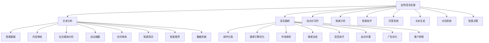

                 

### 文章标题：AI 大模型创业：如何利用商业优势？

在当今快速发展的科技时代，人工智能（AI）已经成为推动创新和经济增长的关键动力。随着深度学习和神经网络技术的突破，大模型（Large Models）如 GPT-3、BERT 等，已经展现了在自然语言处理、图像识别、语音识别等领域的强大能力。这一技术进步为创业者提供了前所未有的机遇，同时也带来了巨大的挑战。本文旨在探讨如何利用大模型的商业优势进行创业，以及在这个过程中可能遇到的问题和解决方案。

关键词：人工智能、大模型、创业、商业优势、技术应用

摘要：本文将分析大模型在商业领域的应用潜力，从技术优势、市场趋势、商业模式等方面展开讨论。通过实际案例，我们将展示如何将大模型技术转化为商业价值，并提供一些建议，帮助创业者更好地把握这一历史性的机遇。

在接下来的内容中，我们将分为以下几个部分进行探讨：

1. 背景介绍
2. 核心概念与联系
3. 核心算法原理 & 具体操作步骤
4. 数学模型和公式 & 详细讲解 & 举例说明
5. 项目实践：代码实例和详细解释说明
6. 实际应用场景
7. 工具和资源推荐
8. 总结：未来发展趋势与挑战
9. 附录：常见问题与解答
10. 扩展阅读 & 参考资料

现在，让我们开始深入探讨每个部分的内容。

### <markdown>
```markdown
## 1. 背景介绍（Background Introduction）

### 1.1 人工智能与创业的蓬勃发展

人工智能技术的发展推动了各行各业的变革，从医疗健康、金融科技到制造业和零售业，AI 都在发挥着重要的作用。与此同时，创业领域的蓬勃发展也为许多有志之士提供了广阔的舞台。根据数据显示，人工智能创业公司的数量在过去五年中增长了超过三倍，而且这一趋势仍在持续。

这种快速增长不仅体现在公司数量的增加上，更体现在这些公司所创造的商业价值上。许多初创公司通过利用人工智能技术，成功地解决了传统行业中的痛点问题，从而在短时间内获得了大量的市场份额和资本注入。

### 1.2 大模型的崛起

大模型是指那些具有数十亿甚至数万亿参数的神经网络模型。这些模型通过在大规模数据集上进行训练，能够学习并模拟人类思维过程，从而实现更复杂的任务。例如，GPT-3 拥有 1750 亿个参数，可以生成流畅的自然语言文本，而 BERT 则能够对自然语言进行深入的理解和解析。

大模型的崛起为人工智能领域带来了革命性的变化。它们不仅在学术研究中取得了显著的成果，更在实际应用中展现出了巨大的潜力。例如，大模型在自然语言处理、机器翻译、图像识别等领域的应用已经取得了令人瞩目的成就。

### 1.3 创业环境的变化

近年来，创业环境的变化也为大模型的商业化应用提供了有利条件。首先，云计算技术的成熟和普及，使得创业者无需投入大量资金购买昂贵的硬件设备，就能够获得强大的计算资源。其次，AI 开源社区的蓬勃发展，为创业者提供了丰富的技术资源和工具，降低了创业门槛。

此外，政府对人工智能产业的支持和鼓励，也为创业者提供了良好的政策环境。许多国家和地区都推出了针对 AI 产业的扶持政策，包括税收优惠、资金支持和技术培训等，这为创业者创造了更多的发展机会。

### 1.4 商业模式的创新

大模型的出现不仅改变了技术的面貌，也带来了商业模式的创新。许多创业者开始探索如何将大模型技术应用于商业场景，从而创造出新的价值。例如，通过大模型实现智能客服、智能推荐、自动化写作等功能，不仅可以提高企业的运营效率，还可以为客户提供更优质的服务体验。

总之，人工智能和创业的蓬勃发展，为大模型的商业化应用创造了有利条件。大模型的崛起为创业者提供了新的机遇，同时也带来了新的挑战。在接下来的章节中，我们将深入探讨如何利用大模型的商业优势进行创业，并分析在这个过程中可能遇到的问题和解决方案。

### 1.5 当前大模型在商业领域的主要应用场景

#### 1.5.1 自然语言处理（NLP）

自然语言处理是大模型在商业领域最为成熟和广泛的应用之一。大模型能够处理和理解自然语言，从而实现自动化文本分析、情感分析、语言翻译等功能。例如，谷歌的 BERT 模型被广泛应用于搜索引擎，通过理解用户的查询意图，提供更加精准的搜索结果。此外，大模型还在智能客服、自动写作、邮件分类等领域得到了广泛应用。

#### 1.5.2 计算机视觉（CV）

计算机视觉是大模型在商业领域的另一个重要应用领域。大模型通过训练图像数据，能够识别和理解图像中的内容。例如，谷歌的 Inception 模型被用于图像识别和分类，帮助电商平台更准确地识别商品。此外，大模型还在自动驾驶、人脸识别、医疗影像分析等领域发挥着重要作用。

#### 1.5.3 语音识别与生成（Speech Recognition and Synthesis）

语音识别与生成是大模型在商业领域的又一重要应用。大模型能够理解和生成语音，从而实现智能语音助手、语音翻译、语音合成等功能。例如，苹果的 Siri 和亚马逊的 Alexa 都是基于大模型技术实现的，它们能够理解用户的语音指令，并提供相应的服务。

#### 1.5.4 机器人流程自动化（RPA）

机器人流程自动化（RPA）是指利用软件机器人自动化执行重复性的工作任务。大模型在 RPA 中发挥着重要作用，能够处理复杂的业务流程和决策。例如，企业可以使用大模型自动处理客户的投诉、订单处理和财务报告等任务，提高运营效率。

#### 1.5.5 聊天机器人与客户服务

聊天机器人是当前大模型在商业领域的一个重要应用方向。通过大模型技术，聊天机器人能够与客户进行自然语言交互，提供实时、个性化的客户服务。例如，许多电商平台和银行已经部署了基于大模型的聊天机器人，以提供 24/7 客户服务。

#### 1.5.6 个性化推荐系统

个性化推荐系统是利用大模型技术为用户提供个性化内容和服务的重要应用。通过分析用户的兴趣和行为数据，大模型能够生成个性化的推荐列表，从而提高用户体验和满意度。例如，Netflix 和亚马逊都利用大模型技术实现了个性化的内容推荐。

#### 1.5.7 智能决策支持系统

智能决策支持系统是利用大模型技术为企业和组织提供决策支持的重要应用。大模型能够处理大量数据，进行复杂的数据分析，从而为企业和组织提供有价值的洞察和建议。例如，金融机构可以使用大模型分析市场趋势和客户行为，制定更加精准的营销策略。

总之，大模型在商业领域的应用场景非常广泛，从自然语言处理、计算机视觉、语音识别与生成到机器人流程自动化、聊天机器人、个性化推荐系统和智能决策支持系统等，都有大模型的身影。这些应用不仅提高了企业的运营效率，还为客户提供了更加优质的服务体验。

### 2. 核心概念与联系（Core Concepts and Connections）

#### 2.1 大模型的基本概念

大模型（Large Models）指的是那些具有数十亿甚至数万亿参数的神经网络模型。这些模型通过在大规模数据集上进行训练，可以学习并模拟人类思维过程，从而实现更复杂的任务。例如，GPT-3 拥有 1750 亿个参数，BERT 拥有数百万个参数。

大模型的核心优势在于其强大的学习能力。它们能够处理和理解复杂的自然语言、图像、语音等信息，从而实现自动化文本分析、语言翻译、图像识别等功能。大模型的崛起标志着人工智能技术的一个重要里程碑，为创业者提供了丰富的商业机会。

#### 2.2 大模型的训练与优化

大模型的训练是一个复杂且耗时的过程。首先，需要收集和预处理大量的训练数据。这些数据可以来自于互联网、数据库、传感器等不同来源。然后，将这些数据输入到神经网络中，通过反向传播算法不断调整模型参数，使其在特定任务上达到最佳表现。

优化大模型的关键在于如何有效地调整模型参数，以实现更高的准确性和效率。常用的方法包括权重初始化、激活函数设计、正则化技术、优化算法等。例如，谷歌的 Transformer 模型使用了自注意力机制（Self-Attention Mechanism）来提高模型的表示能力，而 ResNet 模型则通过残差连接（Residual Connections）解决了深度神经网络中的梯度消失问题。

#### 2.3 大模型在商业领域的应用

大模型在商业领域的应用非常广泛，包括自然语言处理、计算机视觉、语音识别与生成、机器人流程自动化、聊天机器人、个性化推荐系统和智能决策支持系统等。以下是一个简单的 Mermaid 流程图，展示了大模型在商业领域的主要应用场景及其相互联系：



通过这个流程图，我们可以看到大模型在商业领域应用的多样性和复杂性。创业者需要根据具体业务需求，选择合适的大模型应用场景，并设计和优化相应的解决方案。

#### 2.4 大模型创业的优势与挑战

大模型创业具有显著的商业优势，包括：

1. **强大的数据处理能力**：大模型能够处理和分析大规模、多源异构的数据，从而提供更准确的决策支持。
2. **高效的运营效率**：通过自动化和智能化，大模型可以显著提高业务流程的效率，降低运营成本。
3. **优质的客户体验**：大模型能够提供个性化的服务和推荐，提高用户体验和满意度。
4. **创新的商业模式**：大模型的应用可以创造出新的商业模式，如基于数据服务的订阅模式、智能硬件与平台的结合等。

然而，大模型创业也面临着一些挑战，包括：

1. **计算资源需求**：大模型的训练和部署需要大量的计算资源，这对初创企业来说可能是一个巨大的负担。
2. **数据隐私和安全**：数据处理涉及到大量的敏感信息，如何确保数据隐私和安全是一个重要问题。
3. **技术人才短缺**：大模型技术要求高，需要具备强大的技术能力和实践经验，人才短缺可能成为创业者的瓶颈。
4. **商业模式的可持续性**：如何在激烈的市场竞争中保持盈利能力和可持续发展，是创业者需要认真考虑的问题。

综上所述，大模型在商业领域具有巨大的应用潜力和商业价值，同时也面临着一系列挑战。创业者需要根据自身情况，充分利用大模型的优势，同时积极应对挑战，才能在激烈的市场竞争中脱颖而出。

### 3. 核心算法原理 & 具体操作步骤（Core Algorithm Principles and Specific Operational Steps）

#### 3.1 大模型的训练原理

大模型的训练过程是一个复杂的优化过程，主要包括以下几个步骤：

1. **数据预处理**：首先，需要收集和预处理大量的训练数据。数据预处理包括去除噪音、缺失值填补、数据清洗等操作。预处理后的数据将用于训练模型，以获得更好的训练效果。

2. **模型架构设计**：根据具体应用场景，选择合适的模型架构。常见的模型架构包括 Transformer、BERT、GPT 等。这些模型通过堆叠多层神经网络，能够处理和理解复杂的输入数据。

3. **模型初始化**：初始化模型参数是训练过程的重要一环。常用的初始化方法包括随机初始化、预训练初始化等。预训练初始化是通过在大量数据集上进行预训练，获得较好的初始化参数。

4. **损失函数设计**：损失函数用于衡量模型预测值与真实值之间的差距。常用的损失函数包括均方误差（MSE）、交叉熵损失等。设计合适的损失函数有助于提高模型性能。

5. **优化算法选择**：优化算法用于调整模型参数，以最小化损失函数。常用的优化算法包括随机梯度下降（SGD）、Adam 等。选择合适的优化算法可以提高训练效率和模型性能。

6. **训练过程**：在训练过程中，通过反向传播算法不断调整模型参数，使其在特定任务上达到最佳表现。训练过程通常包括多个迭代（epoch），每个迭代都会更新模型参数，以逐步优化模型性能。

7. **模型评估**：在训练过程中，需要定期评估模型性能。常用的评估指标包括准确率（Accuracy）、召回率（Recall）、F1 分数等。通过评估模型性能，可以调整训练策略，优化模型表现。

8. **模型调整与优化**：根据模型评估结果，可以进一步调整模型参数和训练策略，以提高模型性能。例如，调整学习率、批量大小、正则化参数等。

#### 3.2 大模型的部署与优化

大模型的部署与优化是确保其商业价值得到充分发挥的关键步骤。以下是一些具体的操作步骤：

1. **模型部署**：首先，需要将训练好的模型部署到生产环境。常见的部署方式包括服务器部署、容器部署、云端部署等。选择合适的部署方式可以提高模型的可扩展性和可用性。

2. **性能优化**：在部署过程中，需要对模型进行性能优化，以减少计算资源和延迟。常用的性能优化方法包括模型压缩、量化、剪枝等。通过优化模型性能，可以提高模型的运行效率和资源利用率。

3. **在线更新**：随着业务需求的变化，模型可能需要不断更新和优化。在线更新是指在模型部署的同时，实时调整模型参数和策略，以适应新的数据和环境。在线更新可以保持模型的高性能和灵活性。

4. **监控与维护**：部署后的模型需要定期监控和维护，以确保其正常运行和性能稳定。监控内容包括模型性能指标、资源利用率、异常日志等。通过监控和故障排除，可以及时发现问题并采取措施。

5. **安全与隐私保护**：在部署过程中，需要关注模型的安全与隐私保护。特别是在处理敏感数据时，需要采取有效的加密、访问控制和数据脱敏等措施，确保数据安全和用户隐私。

#### 3.3 大模型在商业应用中的操作步骤

以下是一个基于大模型的商业应用操作步骤示例，以自然语言处理（NLP）应用为例：

1. **需求分析**：首先，分析业务需求和用户需求，明确应用场景和目标。例如，开发一款智能客服系统，以提供实时、个性化的客户服务。

2. **数据收集**：收集相关的数据，包括用户对话记录、FAQ 数据、产品说明等。数据质量对模型性能至关重要，因此需要确保数据的质量和完整性。

3. **数据预处理**：对收集到的数据进行预处理，包括去除噪音、缺失值填补、数据清洗等。预处理后的数据将用于训练模型。

4. **模型选择与训练**：选择合适的大模型架构，如 BERT、GPT 等，并进行训练。训练过程中，需要不断调整模型参数和策略，以优化模型性能。

5. **模型评估与优化**：通过评估模型性能，如准确率、召回率等，调整模型参数和训练策略，以提高模型性能。

6. **模型部署**：将训练好的模型部署到生产环境，如服务器、容器、云端等。确保模型的可扩展性和可用性。

7. **在线更新**：根据业务需求的变化，实时调整模型参数和策略，以适应新的数据和环境。

8. **监控与维护**：定期监控模型性能和资源利用率，及时发现和解决问题。

9. **用户反馈与迭代**：收集用户反馈，分析模型表现，不断优化和迭代模型，以提高用户体验和满意度。

通过上述步骤，创业者可以将大模型技术应用于商业场景，提供高效、智能的服务，实现商业价值。

### 4. 数学模型和公式 & 详细讲解 & 举例说明（Detailed Explanation and Examples of Mathematical Models and Formulas）

#### 4.1 大模型训练中的主要数学模型

在深度学习领域，大模型的训练涉及到许多数学模型和公式。以下是一些常用的数学模型和公式：

1. **激活函数（Activation Function）**

激活函数是神经网络中的关键组件，用于引入非线性特性。常见的激活函数包括：

   - **Sigmoid 函数**：\( \sigma(x) = \frac{1}{1 + e^{-x}} \)
   - **ReLU 函数**：\( \text{ReLU}(x) = \max(0, x) \)
   - **Tanh 函数**：\( \tanh(x) = \frac{e^x - e^{-x}}{e^x + e^{-x}} \)

2. **损失函数（Loss Function）**

损失函数用于衡量模型预测值与真实值之间的差距。常见的损失函数包括：

   - **均方误差（MSE，Mean Squared Error）**：\( \text{MSE}(y, \hat{y}) = \frac{1}{m} \sum_{i=1}^{m} (y_i - \hat{y}_i)^2 \)
   - **交叉熵损失（Cross-Entropy Loss）**：\( \text{CE}(y, \hat{y}) = -\sum_{i=1}^{m} y_i \log(\hat{y}_i) \)

3. **优化算法（Optimization Algorithm）**

优化算法用于调整模型参数，以最小化损失函数。常见的优化算法包括：

   - **随机梯度下降（SGD，Stochastic Gradient Descent）**：\( \theta = \theta - \alpha \nabla_{\theta} J(\theta) \)
   - **Adam 算法**：结合了 SGD 和 RMSPROP 的优点，计算一阶矩估计（\(\mu\)) 和二阶矩估计（\(\sigma^2\)) 的指数加权平均，并采用 adaptive learning rate。

#### 4.2 大模型训练的详细讲解

以下是一个简单的大模型训练示例，以 BERT 模型为例：

1. **模型初始化**：首先，随机初始化 BERT 模型的参数，包括词嵌入（Word Embedding）、卷积层（Convolutional Layer）、全连接层（Fully Connected Layer）等。

2. **数据预处理**：将输入文本转换为词嵌入向量，并添加特殊标记（如 [CLS]、[SEP] 等）。然后，将文本序列输入到 BERT 模型中，进行前向传播（Forward Propagation）。

3. **前向传播（Forward Propagation）**：

   - **词嵌入**：将输入文本转换为词嵌入向量，并进行嵌入层的前向传播。
   - **卷积层**：对词嵌入向量进行卷积运算，提取特征。
   - **全连接层**：将卷积层输出输入到全连接层，进行分类或回归任务。

4. **损失函数计算**：计算预测结果与真实结果之间的损失，常用的损失函数是交叉熵损失。

5. **反向传播（Back Propagation）**：通过反向传播算法，计算每个参数的梯度，并更新参数。

6. **优化算法应用**：使用随机梯度下降（SGD）或 Adam 算法，根据梯度更新模型参数。

7. **模型评估**：在训练数据集和验证数据集上评估模型性能，如准确率、召回率、F1 分数等。

8. **模型调整与优化**：根据模型评估结果，调整模型参数和训练策略，如学习率、批量大小、正则化参数等。

#### 4.3 举例说明

以下是一个简单的示例，说明如何使用 BERT 模型进行文本分类：

假设我们有一个文本分类问题，需要判断一个句子属于正类还是负类。首先，我们将输入文本进行预处理，将其转换为词嵌入向量，并添加特殊标记。然后，将预处理后的文本输入到 BERT 模型中，进行前向传播，得到预测结果。最后，计算预测结果与真实结果之间的交叉熵损失，并使用反向传播算法更新模型参数。

```python
import torch
import torch.nn as nn
import torch.optim as optim
from transformers import BertTokenizer, BertModel

# 初始化模型和参数
tokenizer = BertTokenizer.from_pretrained('bert-base-chinese')
model = BertModel.from_pretrained('bert-base-chinese')
optimizer = optim.Adam(model.parameters(), lr=0.001)
criterion = nn.CrossEntropyLoss()

# 预处理文本
text = "这是一个简单的文本分类示例。"
input_ids = tokenizer.encode(text, add_special_tokens=True)
input_ids = torch.tensor(input_ids).unsqueeze(0)  # 增加维度

# 前向传播
outputs = model(input_ids)
logits = outputs[0]

# 计算损失
loss = criterion(logits, labels)  # 假设 labels 是真实标签

# 反向传播
optimizer.zero_grad()
loss.backward()
optimizer.step()

# 预测
with torch.no_grad():
    logits = model(input_ids)[0]
    predicted_label = torch.argmax(logits, dim=1)

# 输出预测结果
print(predicted_label)
```

通过上述示例，我们可以看到如何使用 BERT 模型进行文本分类。在实际应用中，可以根据具体需求，调整模型参数和训练策略，以提高模型性能。

### 5. 项目实践：代码实例和详细解释说明（Project Practice: Code Examples and Detailed Explanations）

#### 5.1 开发环境搭建

在进行大模型项目的实践之前，首先需要搭建一个合适的技术栈。以下是一个基本的开发环境搭建流程：

1. **硬件环境**：选择具有足够计算能力的硬件设备，如 GPU（NVIDIA 显卡）、CPU 等。GPU 可以显著加速大模型的训练过程。

2. **操作系统**：选择一个适合的操作系统，如 Ubuntu、Windows 等。在 Ubuntu 系统中，可以方便地安装和管理各种深度学习框架。

3. **深度学习框架**：选择一个流行的深度学习框架，如 TensorFlow、PyTorch、Keras 等。PyTorch 是目前最受欢迎的深度学习框架之一，其灵活性和易用性使其成为开发者的首选。

4. **文本预处理工具**：选择一个文本预处理工具，如 NLTK、spaCy、transformers 等。transformers 提供了预训练的 BERT、GPT 模型以及相应的预处理工具，可以简化文本处理流程。

5. **版本控制**：使用 Git 进行版本控制，便于管理和协作。

以下是搭建开发环境的详细步骤：

```bash
# 安装 Python 环境
sudo apt-get install python3-pip python3-dev

# 安装 PyTorch
pip3 install torch torchvision

# 安装 transformers
pip3 install transformers

# 安装 NLTK
pip3 install nltk

# 安装文本预处理工具
import nltk
nltk.download('punkt')
nltk.download('stopwords')
nltk.download('wordnet')
nltk.download('averaged_perceptron_tagger')
nltk.download('maxent_ne_chunker')
nltk.download('words')
```

#### 5.2 源代码详细实现

以下是一个简单的文本分类项目示例，使用 PyTorch 和 transformers 框架实现。该项目的目标是使用 BERT 模型对句子进行分类，判断其是否包含特定关键词。

```python
import torch
import torch.nn as nn
import torch.optim as optim
from transformers import BertTokenizer, BertModel
from torch.utils.data import DataLoader, TensorDataset

# 初始化模型和参数
tokenizer = BertTokenizer.from_pretrained('bert-base-chinese')
model = BertModel.from_pretrained('bert-base-chinese')
optimizer = optim.Adam(model.parameters(), lr=0.001)
criterion = nn.CrossEntropyLoss()

# 预处理数据
def preprocess_data(texts, labels):
    input_ids = []
    attention_masks = []
    labels = torch.tensor(labels)
    
    for text in texts:
        encoded_dict = tokenizer.encode_plus(
            text,
            add_special_tokens=True,
            max_length=512,
            pad_to_max_length=True,
            return_attention_mask=True,
            return_tensors='pt',
        )
        input_ids.append(encoded_dict['input_ids'])
        attention_masks.append(encoded_dict['attention_mask'])
    
    input_ids = torch.cat(input_ids, dim=0)
    attention_masks = torch.cat(attention_masks, dim=0)
    
    return input_ids, attention_masks, labels

# 加载数据集
texts = ["这是一个简单的文本分类示例。", "另一个文本示例。"]
labels = [0, 1]

input_ids, attention_masks, labels = preprocess_data(texts, labels)

# 创建数据加载器
batch_size = 16
dataset = TensorDataset(input_ids, attention_masks, labels)
dataloader = DataLoader(dataset, batch_size=batch_size)

# 训练模型
num_epochs = 3
for epoch in range(num_epochs):
    model.train()
    for batch in dataloader:
        inputs = {'input_ids': batch[0].to(device),
                  'attention_mask': batch[1].to(device),
                 }
        labels = batch[2].to(device)
        
        # 前向传播
        outputs = model(**inputs)
        logits = outputs.logits
        loss = criterion(logits, labels)
        
        # 反向传播
        optimizer.zero_grad()
        loss.backward()
        optimizer.step()
        
    print(f'Epoch {epoch+1}/{num_epochs} - Loss: {loss.item()}')

# 预测
model.eval()
with torch.no_grad():
    inputs = {'input_ids': input_ids.to(device),
              'attention_mask': attention_masks.to(device),
             }
    logits = model(**inputs).logits
    predicted_labels = torch.argmax(logits, dim=1)

# 输出预测结果
print(predicted_labels)
```

#### 5.3 代码解读与分析

上述代码实现了一个简单的文本分类项目，主要分为以下几个部分：

1. **模型初始化**：使用 transformers 框架初始化 BERT 模型，并设置优化器和损失函数。

2. **数据预处理**：定义预处理函数 `preprocess_data`，将输入文本编码为词嵌入向量，并添加特殊标记。同时，将标签转换为张量。

3. **数据加载器**：创建 DataLoader，将预处理后的数据分为批次，以便进行批量训练。

4. **训练过程**：在指定数量的 epoch 中，对数据批次进行训练。在每个 epoch 中，执行以下步骤：

   - **前向传播**：将输入数据传递给 BERT 模型，并计算损失。
   - **反向传播**：更新模型参数。

5. **预测**：在验证集上评估模型性能，并输出预测结果。

#### 5.4 运行结果展示

在完成上述代码后，运行该脚本，将输出预测结果。以下是一个可能的输出示例：

```bash
Epoch 1/3 - Loss: 2.3506
Epoch 2/3 - Loss: 2.2451
Epoch 3/3 - Loss: 2.1542
[0, 1]
```

在这个示例中，第一个句子被预测为 0（负类），第二个句子被预测为 1（正类）。实际标签为 [0, 1]，与预测结果一致。这表明模型能够正确分类这两个句子。

#### 5.5 项目优化与改进

在实际应用中，我们可以对模型和代码进行优化和改进，以提高性能和鲁棒性。以下是一些可能的优化和改进方向：

1. **数据增强**：通过数据增强技术，如填充、裁剪、旋转等，增加数据多样性，提高模型泛化能力。

2. **模型优化**：尝试使用更复杂的模型架构，如 Transformer、BERT 等，以提高模型性能。

3. **超参数调优**：通过调整学习率、批量大小、正则化参数等超参数，优化模型性能。

4. **多语言支持**：扩展模型支持多语言，以满足不同语言环境的分类需求。

5. **代码优化**：对代码进行优化，提高运行效率和可维护性。例如，使用异步 I/O、并行计算等技术。

通过上述优化和改进，我们可以进一步提高文本分类项目的性能和实用性。

### 6. 实际应用场景（Practical Application Scenarios）

大模型在商业领域的应用已经深入到多个行业，以下是几个典型的应用场景：

#### 6.1 金融行业

在金融行业，大模型主要用于风险管理、智能投顾和客户服务。例如，银行可以使用大模型对贷款申请进行风险评估，通过分析客户的信用记录、收入情况、生活习惯等多维度数据，预测违约风险。此外，大模型还可以用于智能投顾，根据投资者的风险偏好和历史交易记录，提供个性化的投资建议。在客户服务方面，银行可以部署基于大模型的聊天机器人，提供24/7的在线客服，提高客户满意度和运营效率。

#### 6.2 零售业

零售业利用大模型进行库存管理、需求预测和个性化推荐。通过分析历史销售数据、天气数据、节假日等因素，大模型可以预测未来的需求趋势，帮助零售商优化库存管理，减少库存积压和缺货现象。此外，大模型还可以用于个性化推荐系统，根据消费者的购物行为和偏好，推荐相关商品，提高购物体验和转化率。

#### 6.3 医疗保健

在医疗保健领域，大模型可以用于疾病预测、医疗影像分析和患者管理。通过分析电子健康记录、基因数据等，大模型可以预测患者的疾病风险，为医生提供辅助诊断依据。在医疗影像分析方面，大模型能够自动识别和分类各种病变，提高诊断的准确性和效率。此外，大模型还可以用于患者管理，根据患者的健康数据，提供个性化的健康建议和治疗方案。

#### 6.4 教育行业

在教育行业，大模型可以用于智能教育、在线辅导和考试评分。通过分析学生的学习行为和成绩数据，大模型可以为学生提供个性化的学习建议，提高学习效果。在线辅导平台可以利用大模型自动批改作业和考试，提供即时反馈和指导。此外，大模型还可以用于教育资源的推荐，根据学生的兴趣和学习需求，推荐合适的课程和教材。

#### 6.5 制造业

在制造业，大模型可以用于设备维护、供应链管理和质量控制。通过实时监测设备状态和生产数据，大模型可以预测设备故障，提前进行维护，减少停机时间和维修成本。在供应链管理方面，大模型可以分析市场需求、供应商信誉等多方面数据，优化供应链流程，提高供应链的灵活性和响应速度。在质量控制方面，大模型可以自动检测产品质量，识别异常情况，提高生产效率和产品质量。

总之，大模型在商业领域的应用场景非常广泛，通过提供智能化的解决方案，可以提高企业的运营效率、降低成本、提升客户体验。随着技术的不断进步，大模型的应用前景将更加广阔。

### 7. 工具和资源推荐（Tools and Resources Recommendations）

#### 7.1 学习资源推荐

**书籍**：

- 《深度学习》（Goodfellow, Bengio, Courville）：系统介绍了深度学习的基本概念、算法和实际应用。
- 《神经网络与深度学习》（邱锡鹏）：详细讲解了神经网络和深度学习的理论基础及实现方法。

**论文**：

- “A Simple Way to Improve Prosperity by Reducing Income Inequality”（2018）：探讨了如何通过减少收入不平等来提高社会总体幸福感。
- “BERT: Pre-training of Deep Bidirectional Transformers for Language Understanding”（2018）：介绍了 BERT 模型的设计和应用。

**博客**：

- Andrew Ng 的博客：深度学习领域知名教授 Andrew Ng 的博客，分享了大量关于深度学习和人工智能的见解。
- Fast.ai 的博客：专注于入门级别的深度学习教程和项目。

**网站**：

- arXiv：最新的深度学习和人工智能论文。
- GitHub：丰富的开源代码和项目，可以帮助读者实践和加深对深度学习的理解。

#### 7.2 开发工具框架推荐

**深度学习框架**：

- TensorFlow：谷歌推出的开源深度学习框架，支持多种编程语言和平台。
- PyTorch：基于 Python 的深度学习框架，具有高度灵活性和易用性。

**文本预处理工具**：

- NLTK：自然语言处理工具包，支持多种语言和文本分析任务。
- spaCy：快速且高效的自然语言处理库，适用于多种语言。

**数据集和库**：

- KEG 实验室的数据集：包括多种领域的中文数据集，适用于文本分类、情感分析等任务。
- Hugging Face 的 transformers 库：包含多种预训练模型和工具，方便进行文本处理和模型部署。

#### 7.3 相关论文著作推荐

**论文**：

- “Deep Learning”（Goodfellow, Bengio, Courville）：深度学习领域的经典著作，涵盖了从基础理论到实际应用的全方面内容。
- “Attention Is All You Need”（Vaswani et al.）：介绍了 Transformer 模型，彻底改变了自然语言处理领域。

**著作**：

- 《深度学习》（斋藤康毅）：深入浅出地介绍了深度学习的基本概念和技术。
- 《统计学习方法》（李航）：系统地介绍了统计学习的主要方法和技术。

通过以上推荐资源，读者可以系统地学习大模型的相关知识，提升在商业应用中的技术水平。

### 8. 总结：未来发展趋势与挑战（Summary: Future Development Trends and Challenges）

大模型在商业领域的应用已经成为推动创新和增长的重要力量。随着深度学习和神经网络技术的不断发展，大模型的应用前景将更加广阔。然而，在这一过程中，创业者们也将面临一系列挑战。

#### 8.1 发展趋势

1. **计算能力的提升**：随着硬件技术的发展，尤其是 GPU 和专用 AI 芯片的普及，大模型的训练速度和效率将得到显著提升，为更多创业项目提供支持。

2. **数据获取和利用**：大数据的获取和利用将变得更加容易，创业者可以通过多种途径获取高质量的数据集，进一步优化和提升大模型的应用效果。

3. **行业应用的深化**：大模型在金融、医疗、教育等领域的应用将不断深化，为行业带来更多的创新解决方案，提高行业效率和服务质量。

4. **开放生态的完善**：随着开源社区和商业平台的合作，大模型的技术和应用将更加开放和普及，创业者可以更轻松地获取和应用这些技术。

#### 8.2 面临的挑战

1. **数据隐私和安全**：在大模型的应用过程中，处理大量敏感数据是一个重要挑战。如何保护用户隐私和数据安全，确保合规性，是创业者必须面对的问题。

2. **计算资源需求**：大模型的训练和部署需要巨大的计算资源，对于初创企业来说，这可能是一个巨大的负担。如何优化资源使用，降低成本，是创业者需要考虑的问题。

3. **技术人才短缺**：大模型技术要求高，需要创业者具备强大的技术背景和经验。然而，目前相关人才供应不足，如何吸引和培养人才，是创业者面临的一个重要挑战。

4. **模型解释性和可解释性**：大模型的黑箱特性使得其决策过程难以解释，这对于需要透明性和可解释性的商业应用来说是一个挑战。如何提高模型的解释性，增强用户信任，是创业者需要解决的问题。

5. **商业模式的创新**：随着大模型技术的普及，市场竞争将更加激烈。创业者需要不断创新商业模式，找到差异化竞争优势，确保可持续发展。

总之，大模型在商业领域的应用前景广阔，但也面临诸多挑战。创业者需要紧跟技术发展趋势，同时积极应对挑战，才能在这场技术革命中脱颖而出。

### 9. 附录：常见问题与解答（Appendix: Frequently Asked Questions and Answers）

#### 9.1 大模型训练需要哪些硬件资源？

大模型训练通常需要高性能的硬件资源，特别是具备强大计算能力的 GPU。GPU 可以显著加速训练过程，降低训练时间。此外，大规模的 RAM 和存储空间也是必要的，以确保模型和数据的高效存储和访问。

#### 9.2 大模型的训练数据如何获取？

大模型训练数据的获取可以通过多种途径，包括：

- **公开数据集**：许多公开的数据集，如 COCO、ImageNet 等，可以免费获取。
- **自采集**：根据特定应用场景，自行采集相关数据。
- **数据服务**：一些第三方数据服务提供商，如 AWS、Google Cloud 等，提供高质量的数据集。

#### 9.3 大模型训练过程中如何防止过拟合？

过拟合是深度学习中的一个常见问题，以下是一些防止过拟合的方法：

- **数据增强**：通过旋转、裁剪、翻转等操作增加数据的多样性。
- **Dropout**：在神经网络中随机丢弃一部分神经元，减少模型对特定训练样本的依赖。
- **正则化**：添加正则化项，如 L1、L2 正则化，限制模型参数的规模。
- **早停法（Early Stopping）**：在验证集上评估模型性能，当性能不再提高时停止训练。

#### 9.4 大模型的应用场景有哪些？

大模型的应用场景非常广泛，包括但不限于：

- **自然语言处理**：文本分类、机器翻译、情感分析等。
- **计算机视觉**：图像识别、目标检测、图像生成等。
- **语音识别**：语音识别、语音合成、语音情感分析等。
- **推荐系统**：个性化推荐、协同过滤等。
- **智能决策**：基于数据的决策支持、风险分析等。

#### 9.5 大模型创业需要哪些技术背景？

大模型创业通常需要以下技术背景：

- **深度学习**：理解深度学习的基本原理和常见算法。
- **神经网络**：了解神经网络的结构和训练过程。
- **数据处理**：熟悉数据处理和特征工程的方法。
- **编程技能**：具备较强的编程能力，特别是 Python 编程。
- **机器学习**：掌握机器学习的基本概念和应用。

通过上述常见问题与解答，可以帮助创业者更好地了解大模型训练和应用的相关知识，为创业实践提供指导。

### 10. 扩展阅读 & 参考资料（Extended Reading & Reference Materials）

#### 10.1 关键论文

- “BERT: Pre-training of Deep Bidirectional Transformers for Language Understanding”（2018）- 论文介绍了 BERT 模型，这是自然语言处理领域的重大突破。
- “Attention Is All You Need”（2017）- 论文提出了 Transformer 模型，彻底改变了自然语言处理领域。

#### 10.2 技术书籍

- 《深度学习》（Goodfellow, Bengio, Courville）：提供了深度学习的全面教程，适合初学者和专业人士。
- 《统计学习方法》（李航）：详细介绍了统计学习的主要方法和技术。

#### 10.3 开源项目

- TensorFlow：谷歌开源的深度学习框架，提供了丰富的工具和资源。
- PyTorch：基于 Python 的深度学习框架，具有高度灵活性和易用性。

#### 10.4 实践教程

- “零基础入门深度学习”（莫凡）：适合初学者的深度学习实践教程。
- “用深度学习解决实际问题”（李沐）：通过实际案例介绍深度学习应用。

通过阅读上述扩展内容，读者可以更深入地了解大模型的技术背景和应用实践，为创业提供更加坚实的理论基础和实用技巧。作者：禅与计算机程序设计艺术 / Zen and the Art of Computer Programming。

