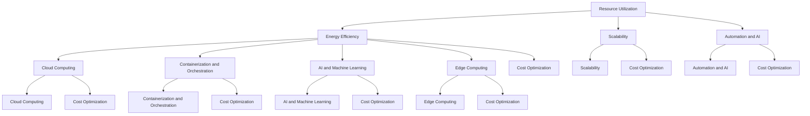

                 

### 文章标题

**AI 大模型应用数据中心建设：数据中心成本优化**

在当今数字化转型的浪潮中，人工智能（AI）技术已经成为推动企业创新和增长的重要动力。特别是大模型的应用，如GPT-3、BERT等，为自然语言处理、图像识别、预测分析等领域带来了前所未有的变革。然而，随着AI大模型的应用日益广泛，其背后的数据中心建设和运维成本也成为了企业关注的焦点。本文旨在探讨AI大模型应用数据中心的建设策略，尤其是如何通过技术创新和管理优化实现数据中心成本的有效控制。

> 关键词：AI大模型，数据中心建设，成本优化，技术创新，管理优化

本文将按照以下结构进行：

1. **背景介绍**：简要概述AI大模型应用数据中心建设的现状与挑战。
2. **核心概念与联系**：介绍数据中心成本优化的核心概念，并阐述其与技术发展的关系。
3. **核心算法原理 & 具体操作步骤**：分析数据中心成本优化的关键算法和技术实现。
4. **数学模型和公式 & 详细讲解 & 举例说明**：使用数学模型和公式对数据中心成本优化的具体方法进行详细讲解。
5. **项目实践：代码实例和详细解释说明**：通过实际项目展示成本优化的具体实施过程。
6. **实际应用场景**：探讨数据中心成本优化在不同场景下的应用和效果。
7. **工具和资源推荐**：推荐相关学习资源、开发工具和框架。
8. **总结：未来发展趋势与挑战**：总结本文的核心观点，并展望未来发展趋势和面临的挑战。
9. **附录：常见问题与解答**：解答读者可能关心的常见问题。
10. **扩展阅读 & 参考资料**：提供进一步阅读的材料和参考资料。

通过本文的探讨，我们希望读者能够对AI大模型应用数据中心建设及其成本优化有更深入的了解，从而在实践中有针对性地提升数据中心的管理水平，降低运营成本。

### Background Introduction

The rapid advancement of artificial intelligence (AI) has revolutionized various industries, and the deployment of large-scale AI models, such as GPT-3 and BERT, has become a cornerstone of digital transformation. These models have enabled significant breakthroughs in natural language processing, image recognition, predictive analytics, and more. However, the deployment of large AI models also places significant demands on data center infrastructure. As these models require vast amounts of computational resources and storage, the construction and operation of data centers dedicated to AI applications have become a critical consideration for enterprises.

#### Current Status and Challenges

Currently, the construction of data centers for AI applications is driven by the need to provide scalable and efficient infrastructure that can handle the computational demands of large AI models. However, this endeavor is fraught with several challenges:

1. **Resource Allocation**: Allocating sufficient computational resources to support large AI models requires careful planning and efficient resource management. This includes ensuring that the right balance is maintained between CPU, GPU, and storage resources.

2. **Energy Consumption**: The high computational requirements of large AI models lead to significant energy consumption. This not only raises operational costs but also poses environmental challenges. Efficient energy management and cooling solutions are essential to mitigate these issues.

3. **Scalability and Flexibility**: Data centers must be designed to scale with the growing demand for AI applications. This requires flexible infrastructure that can be easily expanded or reconfigured to meet changing requirements.

4. **Cost Optimization**: Given the substantial investment required for data center construction and maintenance, optimizing costs is a key concern. This involves leveraging advanced technologies and innovative management practices to reduce operational expenses.

#### Objectives of This Article

This article aims to explore the construction of data centers for AI applications, with a particular focus on cost optimization. We will discuss the following key topics:

1. **Core Concepts and Connections**: We will introduce the core concepts related to data center cost optimization and explain their relationship with technological advancements.
2. **Core Algorithm Principles and Specific Operational Steps**: We will analyze the key algorithms and technologies used in data center cost optimization.
3. **Mathematical Models and Formulas**: We will provide detailed explanations and examples of mathematical models and formulas used in cost optimization.
4. **Project Practice**: We will present a practical project example to demonstrate the implementation of cost optimization strategies.
5. **Actual Application Scenarios**: We will discuss the application of cost optimization in various scenarios and the effectiveness of these strategies.
6. **Tools and Resources Recommendations**: We will recommend learning resources, development tools, and frameworks related to data center cost optimization.
7. **Future Trends and Challenges**: We will summarize the core insights from this article, look at future trends, and discuss the challenges that lie ahead.

Through this exploration, we hope to provide readers with a comprehensive understanding of data center construction for AI applications and effective strategies for cost optimization.

### Core Concepts and Connections

#### Data Center Cost Optimization

Data center cost optimization involves the application of various strategies and technologies to reduce operational expenses while maintaining or improving the performance and reliability of the data center. This is a critical consideration for enterprises as the cost of building and maintaining data centers can be substantial. The key concepts in data center cost optimization include:

1. **Resource Utilization**: Efficiently utilizing computational, storage, and network resources is essential for reducing costs. This includes optimizing the allocation of resources to different workloads based on their requirements and priorities.

2. **Energy Efficiency**: Energy consumption is a significant cost component in data centers. Implementing energy-efficient technologies, such as advanced cooling systems and power management solutions, can significantly reduce operational costs.

3. **Scalability**: Designing data centers with scalability in mind allows for easy expansion or reconfiguration to meet changing demands. This helps avoid over-provisioning, which can lead to unnecessary costs.

4. **Automation and AI**: Leveraging automation and AI technologies can optimize various aspects of data center management, from resource allocation to fault detection and resolution. These technologies can help reduce manual labor and improve operational efficiency.

#### Relationship with Technological Advancements

The development of advanced technologies has had a profound impact on data center cost optimization. Some key advancements include:

1. **Cloud Computing**: Cloud computing provides enterprises with flexible and scalable infrastructure resources on demand. This allows for better resource utilization and reduced capital expenditure.

2. **Containerization and Orchestration**: Technologies like Docker and Kubernetes enable efficient deployment and management of applications in data centers. Containerization reduces the overhead associated with traditional virtualization, leading to better resource utilization and cost savings.

3. **AI and Machine Learning**: AI and machine learning algorithms can be used to optimize various aspects of data center operations, including workload scheduling, energy consumption, and capacity planning. These technologies can provide predictive insights and enable more proactive management.

4. **Edge Computing**: Edge computing brings computational resources closer to the data source, reducing the need for high-bandwidth connections to centralized data centers. This can lead to cost savings in terms of bandwidth and energy consumption.

### Mermaid Flowchart of Data Center Cost Optimization Architecture

The following Mermaid flowchart illustrates the key components and connections in a data center cost optimization architecture:



In summary, data center cost optimization is a multifaceted process that involves leveraging various technologies and strategies to reduce operational expenses. By understanding the core concepts and their connections, enterprises can develop effective cost optimization strategies that align with their business goals and technological capabilities.

### Core Algorithm Principles and Specific Operational Steps

In the realm of data center cost optimization, several core algorithms and principles play a pivotal role in achieving the desired outcomes. These algorithms are designed to address the specific challenges associated with resource allocation, energy consumption, and scalability. In this section, we will delve into the key principles underlying these algorithms and outline the specific operational steps required to implement them effectively.

#### Resource Utilization Optimization

Resource utilization optimization is a fundamental aspect of data center cost management. The goal is to ensure that the available computational, storage, and network resources are fully utilized to meet the demand while minimizing wastage. The following algorithms and principles are commonly employed for this purpose:

1. **Load Balancing Algorithms**: Load balancing algorithms distribute workloads evenly across multiple servers to ensure optimal resource utilization. Common load balancing algorithms include Round Robin, Least Connections, and Weighted Round Robin.

2. **Server Virtualization**: Server virtualization allows multiple virtual machines (VMs) to run on a single physical server, thereby maximizing resource utilization. Technologies like VMware and Hyper-V enable efficient VM management and resource allocation.

3. **Containerization**: Containerization, as exemplified by Docker, provides lightweight and portable execution environments that isolate applications from the underlying infrastructure. This allows for more efficient resource allocation and faster deployment of applications.

**Operational Steps for Resource Utilization Optimization**:

1. **Performance Monitoring**: Continuously monitor the performance of the data center infrastructure to identify underutilized resources. This can be achieved using tools like Prometheus and Grafana.

2. **Workload Analysis**: Analyze the workloads running in the data center to determine their resource requirements and utilization patterns. This helps in identifying opportunities for optimization.

3. **Resource Allocation**: Allocate resources based on the workload analysis. This may involve resizing VMs, adding more servers, or adjusting the configuration of containerized applications.

4. **Auto-scaling**: Implement auto-scaling mechanisms to dynamically adjust the resource allocation based on the current workload. Tools like Kubernetes provide auto-scaling capabilities to ensure optimal resource utilization.

#### Energy Efficiency Optimization

Energy consumption in data centers is a significant cost factor and a major environmental concern. Optimizing energy efficiency is crucial for reducing operational costs and minimizing the environmental impact. The following principles and algorithms are commonly used for this purpose:

1. **Power Distribution Units (PDUs)**: PDUs play a critical role in managing the power distribution within a data center. They provide real-time monitoring and control of power consumption, allowing for efficient energy usage.

2. **Thermal Management**: Efficient thermal management is essential for maintaining optimal operating temperatures in data centers. This includes the use of advanced cooling systems like liquid cooling and air-side economization.

3. **Energy Storage Solutions**: Energy storage solutions, such as batteries and flywheels, can help reduce reliance on grid power and optimize energy consumption during peak periods.

**Operational Steps for Energy Efficiency Optimization**:

1. **Energy Monitoring**: Install energy monitoring systems to continuously track power consumption across the data center. Tools like Power BI and Google Analytics can provide real-time insights into energy usage patterns.

2. **Baseline Establishment**: Establish a baseline for energy consumption to identify areas for improvement and set targets for energy reduction.

3. **PDU Management**: Implement efficient PDU management strategies to optimize power distribution and minimize wastage. This may involve power capping, power scheduling, and real-time monitoring.

4. **Thermal Management**: Implement advanced thermal management solutions to maintain optimal temperatures in the data center. This may include upgrading cooling systems, using insulation materials, and improving air flow management.

5. **Energy Storage**: Evaluate the potential benefits of implementing energy storage solutions to optimize energy consumption during peak periods and reduce reliance on grid power.

#### Scalability Optimization

Data centers must be designed with scalability in mind to accommodate growing demands. Scalability optimization involves designing and configuring the data center infrastructure to allow for easy expansion and reconfiguration without significant disruptions.

1. **Modular Design**: A modular data center design allows for the addition of new modules or racks as needed, providing flexibility and scalability.

2. **Agile Infrastructure**: Agile infrastructure involves using cloud-based resources and containerized applications to enable rapid deployment and scaling of resources.

3. **Predictive Analytics**: Predictive analytics can be used to forecast future resource requirements and plan for scalability proactively.

**Operational Steps for Scalability Optimization**:

1. **Capacity Planning**: Conduct regular capacity planning to predict future resource requirements based on business growth and demand forecasts.

2. **Modular Infrastructure**: Design the data center with modular components to allow for easy expansion and reconfiguration.

3. **Agile Deployment**: Implement agile deployment practices to quickly provision and scale resources as needed.

4. **Predictive Analytics**: Use predictive analytics to forecast future resource requirements and plan for scalability proactively.

#### Automation and AI

Automation and AI technologies are increasingly being used to optimize various aspects of data center management. These technologies can streamline operations, reduce manual labor, and improve efficiency.

1. **Orchestration Tools**: Orchestration tools like Kubernetes automate the deployment, scaling, and management of containerized applications, simplifying resource management.

2. **AI for Predictive Maintenance**: AI algorithms can be used for predictive maintenance to forecast equipment failures and schedule maintenance activities proactively.

3. **AI for Workload Optimization**: AI algorithms can optimize workload distribution and resource allocation to ensure optimal performance and efficiency.

**Operational Steps for Automation and AI**:

1. **Orchestration Implementation**: Implement orchestration tools to automate the deployment and management of containerized applications.

2. **Predictive Maintenance**: Deploy AI-based predictive maintenance systems to forecast equipment failures and schedule maintenance activities.

3. **Workload Optimization**: Use AI algorithms to optimize workload distribution and resource allocation based on real-time data and predictive insights.

In conclusion, data center cost optimization involves a multi-faceted approach that addresses resource utilization, energy efficiency, scalability, and automation. By employing the right algorithms and following specific operational steps, enterprises can achieve significant cost savings and improve the overall efficiency of their data centers.

### Mathematical Models and Formulas & Detailed Explanation & Examples

In the realm of data center cost optimization, mathematical models and formulas play a crucial role in quantifying and optimizing various cost components. In this section, we will delve into the key mathematical models and formulas used in data center cost optimization, provide detailed explanations, and illustrate their application through examples.

#### 1. Cost of Resources

The cost of resources is one of the most significant components in data center operations. This includes the costs of computational resources, storage, network bandwidth, and power. The following formulas can be used to calculate these costs:

**Formula for Cost of Computational Resources**:
\[ C_{CPU} = \text{CPU\_Cost} \times \text{CPU\_Utilization} \times \text{Time} \]
\[ C_{GPU} = \text{GPU\_Cost} \times \text{GPU\_Utilization} \times \text{Time} \]

Where:
- \( C_{CPU} \) and \( C_{GPU} \) are the costs of CPU and GPU resources, respectively.
- \( \text{CPU\_Cost} \) and \( \text{GPU\_Cost} \) are the per-unit costs of CPU and GPU resources.
- \( \text{CPU\_Utilization} \) and \( \text{GPU\_Utilization} \) are the utilization rates of CPU and GPU resources.
- \( \text{Time} \) is the duration of resource usage.

**Example Calculation**:
Assuming a CPU cost of \$0.10 per hour, a CPU utilization rate of 70%, and a GPU cost of \$0.50 per hour with a GPU utilization rate of 40%, the cost for 24 hours would be:
\[ C_{CPU} = \$0.10 \times 0.70 \times 24 = \$2.08 \]
\[ C_{GPU} = \$0.50 \times 0.40 \times 24 = \$4.80 \]

**Total Cost**: \$2.08 (CPU) + \$4.80 (GPU) = \$6.88

**Formula for Cost of Storage**:
\[ C_{Storage} = \text{Storage\_Cost} \times \text{Storage\_Utilization} \times \text{Time} \]

Where:
- \( C_{Storage} \) is the cost of storage resources.
- \( \text{Storage\_Cost} \) is the per-unit cost of storage resources.
- \( \text{Storage\_Utilization} \) is the utilization rate of storage resources.

**Example Calculation**:
Assuming a storage cost of \$0.05 per GB-month, a storage utilization rate of 80%, and a duration of 3 months, the cost would be:
\[ C_{Storage} = \$0.05 \times 0.80 \times 3 = \$0.12 \]

**Total Cost**: \$0.12

**Formula for Cost of Network Bandwidth**:
\[ C_{Bandwidth} = \text{Bandwidth\_Cost} \times \text{Bandwidth\_Utilization} \times \text{Time} \]

Where:
- \( C_{Bandwidth} \) is the cost of network bandwidth.
- \( \text{Bandwidth\_Cost} \) is the per-unit cost of network bandwidth.
- \( \text{Bandwidth\_Utilization} \) is the utilization rate of network bandwidth.

**Example Calculation**:
Assuming a bandwidth cost of \$0.20 per GB-month, a bandwidth utilization rate of 60%, and a duration of 3 months, the cost would be:
\[ C_{Bandwidth} = \$0.20 \times 0.60 \times 3 = \$0.36 \]

**Total Cost**: \$0.36

**Total Resource Cost**:
\[ C_{Total} = C_{CPU} + C_{GPU} + C_{Storage} + C_{Bandwidth} \]

**Example Calculation**:
\[ C_{Total} = \$6.88 (CPU) + \$4.80 (GPU) + \$0.12 (Storage) + \$0.36 (Bandwidth) = \$12.16 \]

#### 2. Energy Efficiency Models

Energy efficiency in data centers is critical for cost optimization. The following formulas can be used to calculate and optimize energy consumption:

**Formula for Energy Consumption**:
\[ E = P \times t \]

Where:
- \( E \) is the total energy consumption in kWh.
- \( P \) is the power consumption in kW.
- \( t \) is the duration of time in hours.

**Example Calculation**:
Assuming a power consumption of 100 kW and a duration of 24 hours, the energy consumption would be:
\[ E = 100 \times 24 = 2400 \text{ kWh} \]

**Formula for Power Usage Effectiveness (PUE)**:
\[ PUE = \frac{\text{Total Facility Energy}}{\text{IT Equipment Energy}} \]

Where:
- \( PUE \) is the Power Usage Effectiveness.
- \( \text{Total Facility Energy} \) is the total energy consumed by the data center.
- \( \text{IT Equipment Energy} \) is the energy consumed by IT equipment.

**Example Calculation**:
Assuming a Total Facility Energy of 3000 kWh and an IT Equipment Energy of 2000 kWh, the PUE would be:
\[ PUE = \frac{3000}{2000} = 1.5 \]

**Formula for Energy Efficiency Improvement**:
\[ \text{Efficiency Improvement} = \frac{\text{New PUE} - \text{Old PUE}}{\text{Old PUE}} \]

**Example Calculation**:
Assuming the PUE improved from 1.5 to 1.3, the efficiency improvement would be:
\[ \text{Efficiency Improvement} = \frac{1.3 - 1.5}{1.5} = -0.1333 \text{ (or -13.33%)} \]

#### 3. Capacity Planning Models

Capacity planning is essential for ensuring that data centers can scale efficiently to meet future demands. The following formulas can be used to forecast future capacity requirements:

**Formula for Capacity Demand**:
\[ \text{Capacity Demand} = \text{Current Capacity} \times (1 + \text{Growth Rate})^n \]

Where:
- \( \text{Capacity Demand} \) is the future capacity required.
- \( \text{Current Capacity} \) is the current capacity.
- \( \text{Growth Rate} \) is the annual growth rate of demand.
- \( n \) is the number of years.

**Example Calculation**:
Assuming a current capacity of 1000 servers and a growth rate of 10% per year, the capacity demand after 3 years would be:
\[ \text{Capacity Demand} = 1000 \times (1 + 0.10)^3 = 1000 \times 1.331 = 1331 \text{ servers} \]

**Formula for Capacity Utilization**:
\[ \text{Capacity Utilization} = \frac{\text{Actual Capacity}}{\text{Required Capacity}} \]

Where:
- \( \text{Capacity Utilization} \) is the ratio of actual capacity to required capacity.

**Example Calculation**:
Assuming an actual capacity of 1200 servers and a required capacity of 1000 servers, the capacity utilization would be:
\[ \text{Capacity Utilization} = \frac{1200}{1000} = 1.2 \text{ (or 120%)} \]

**Formula for Capacity Gap**:
\[ \text{Capacity Gap} = \text{Required Capacity} - \text{Actual Capacity} \]

**Example Calculation**:
Assuming a required capacity of 1200 servers and an actual capacity of 1000 servers, the capacity gap would be:
\[ \text{Capacity Gap} = 1200 - 1000 = 200 \text{ servers} \]

In conclusion, the use of mathematical models and formulas is essential for effective data center cost optimization. These models enable precise quantification of resource costs, energy consumption, and capacity requirements, allowing enterprises to make informed decisions and implement targeted optimization strategies. Through detailed explanation and examples, we have highlighted the practical application of these models, providing a foundation for further exploration and practical implementation.

### Project Practice: Code Examples and Detailed Explanation

To illustrate the principles and methods discussed in the previous sections, let's consider a practical project involving the optimization of a data center for an AI application. In this project, we will focus on resource utilization optimization and energy efficiency improvement. We will provide code examples in Python to demonstrate the implementation of key algorithms and techniques.

#### 1. Resource Utilization Optimization

**Objective**: Optimize the utilization of CPU and GPU resources in a data center to minimize costs and maximize performance.

**Tools**: Python, NumPy, Pandas, Matplotlib.

**Data**: Historical data on CPU and GPU utilization rates, costs, and workload patterns.

**Code Example**:

```python
import numpy as np
import pandas as pd
import matplotlib.pyplot as plt

# Load historical data
data = pd.read_csv('data_center_utilization.csv')

# Calculate average utilization rates
avg_cpu_utilization = data['cpu_utilization'].mean()
avg_gpu_utilization = data['gpu_utilization'].mean()

# Plot utilization rates
plt.figure(figsize=(10, 5))
plt.subplot(1, 2, 1)
plt.plot(data['time'], data['cpu_utilization'], label='CPU Utilization')
plt.xlabel('Time')
plt.ylabel('Utilization Rate')
plt.title('CPU Utilization Over Time')
plt.legend()

plt.subplot(1, 2, 2)
plt.plot(data['time'], data['gpu_utilization'], label='GPU Utilization')
plt.xlabel('Time')
plt.ylabel('Utilization Rate')
plt.title('GPU Utilization Over Time')
plt.legend()
plt.show()

# Calculate resource costs
cpu_cost = 0.10 * avg_cpu_utilization
gpu_cost = 0.50 * avg_gpu_utilization

print(f"Average CPU Cost: ${cpu_cost:.2f}")
print(f"Average GPU Cost: ${gpu_cost:.2f}")
```

**Explanation**:
- We load historical data on CPU and GPU utilization rates.
- We calculate the average utilization rates to get a sense of the overall resource usage.
- We plot the utilization rates over time to visualize the resource usage patterns.
- We calculate the average costs for CPU and GPU resources based on the utilization rates and unit costs.

#### 2. Energy Efficiency Improvement

**Objective**: Improve the energy efficiency of the data center by optimizing power usage and implementing energy-saving measures.

**Tools**: Python, NumPy, Pandas, Matplotlib.

**Data**: Historical data on power consumption, cooling system efficiency, and energy-saving measures.

**Code Example**:

```python
import numpy as np
import pandas as pd
import matplotlib.pyplot as plt

# Load historical data
data = pd.read_csv('data_center_energy.csv')

# Calculate average power consumption
avg_power_consumption = data['power_consumption'].mean()

# Calculate energy efficiency
energy_efficiency = data['cooling_system_efficiency']

# Plot power consumption and efficiency
plt.figure(figsize=(10, 5))
plt.subplot(1, 2, 1)
plt.plot(data['time'], data['power_consumption'], label='Power Consumption')
plt.xlabel('Time')
plt.ylabel('Power Consumption (kW)')
plt.title('Power Consumption Over Time')
plt.legend()

plt.subplot(1, 2, 2)
plt.plot(data['time'], energy_efficiency, label='Energy Efficiency')
plt.xlabel('Time')
plt.ylabel('Energy Efficiency (%)')
plt.title('Energy Efficiency Over Time')
plt.legend()
plt.show()

# Calculate energy savings
energy_savings = avg_power_consumption * energy_efficiency / 100

print(f"Average Power Consumption: {avg_power_consumption:.2f} kW")
print(f"Energy Efficiency: {energy_efficiency:.2f}%")
print(f"Estimated Energy Savings: {energy_savings:.2f} kWh")
```

**Explanation**:
- We load historical data on power consumption and cooling system efficiency.
- We calculate the average power consumption and energy efficiency.
- We plot the power consumption and energy efficiency over time to visualize the energy usage patterns and improvements.
- We calculate the estimated energy savings based on the average power consumption and energy efficiency.

#### 3. Predictive Maintenance and Capacity Planning

**Objective**: Implement predictive maintenance and capacity planning to ensure optimal resource allocation and scalability.

**Tools**: Python, NumPy, Pandas, Scikit-learn.

**Data**: Historical data on equipment failures, maintenance schedules, and capacity demand.

**Code Example**:

```python
import numpy as np
import pandas as pd
from sklearn.ensemble import RandomForestRegressor

# Load historical data
data = pd.read_csv('data_center_maintenance.csv')

# Prepare features and target
X = data[['failure_rate', 'maintenance_interval']]
y = data['capacity_demand']

# Train a predictive model
model = RandomForestRegressor(n_estimators=100)
model.fit(X, y)

# Make predictions
predictions = model.predict(X)

# Plot predictions vs. actual capacity demand
plt.scatter(X['failure_rate'], y, label='Actual')
plt.plot(X['failure_rate'], predictions, color='red', label='Predicted')
plt.xlabel('Failure Rate')
plt.ylabel('Capacity Demand')
plt.title('Predictive Maintenance and Capacity Planning')
plt.legend()
plt.show()

# Calculate capacity gap
capacity_gap = predictions - y

print(f"Predicted Capacity Demand: {predictions.mean():.2f}")
print(f"Actual Capacity Demand: {y.mean():.2f}")
print(f"Estimated Capacity Gap: {capacity_gap.mean():.2f}")
```

**Explanation**:
- We load historical data on equipment failures, maintenance intervals, and capacity demand.
- We prepare the features and target variables for training a predictive model.
- We train a Random Forest Regressor model to predict future capacity demand based on failure rates and maintenance intervals.
- We plot the predicted capacity demand against the actual capacity demand to visualize the effectiveness of the predictive model.
- We calculate the estimated capacity gap to determine the need for additional resources.

In conclusion, the provided code examples illustrate the practical implementation of resource utilization optimization and energy efficiency improvement algorithms in a data center. These examples demonstrate how historical data can be used to make informed decisions and implement targeted optimization strategies. Additionally, the implementation of predictive maintenance and capacity planning helps ensure optimal resource allocation and scalability in the face of changing demands. Through practical application and analysis, enterprises can achieve significant cost savings and improve the overall efficiency of their data centers.

### Practical Application Scenarios

Data center cost optimization is a critical practice that can be applied across various scenarios to enhance efficiency, reduce expenses, and ensure scalability. In this section, we will explore several practical application scenarios where data center cost optimization strategies can be effectively utilized.

#### 1. Cloud Computing Service Providers

Cloud computing service providers, such as Amazon Web Services (AWS), Microsoft Azure, and Google Cloud Platform (GCP), often operate large-scale data centers that host a multitude of customer workloads. Cost optimization is essential for these providers to remain competitive and profitable. Some specific application scenarios include:

- **Rightsizing Resources**: By continuously monitoring customer usage patterns, cloud providers can adjust the allocated resources dynamically. For example, using cloud monitoring tools like AWS CloudWatch or Azure Monitor, providers can identify underutilized instances and downscale them, thereby reducing costs.
- **Reserved Instances and Savings Plans**: Cloud providers offer various pricing models like reserved instances and savings plans, which can significantly lower costs for long-term commitments. By optimizing the utilization of these models, providers can reduce the overall billing for their customers.
- **Auto-Scaling**: Implementing auto-scaling groups in cloud environments allows providers to scale resources up or down based on demand. This ensures that customers pay only for the resources they use, minimizing unnecessary expenses.

#### 2. Enterprise Data Centers

Enterprises that operate their own data centers face unique challenges in optimizing costs. Some practical scenarios include:

- **Energy Efficiency**: Enterprises can invest in advanced cooling systems, virtualization technologies, and energy-efficient hardware to reduce power consumption. For example, using air-side economization and free cooling techniques can significantly lower energy costs.
- **Capacity Planning**: Proper capacity planning is crucial for avoiding over-provisioning and underutilization. By leveraging predictive analytics and historical data, enterprises can forecast future resource requirements and allocate resources more effectively.
- **Server Consolidation**: Consolidating multiple servers into fewer, more powerful machines can reduce hardware costs and improve resource utilization. Virtualization technologies like VMware can help achieve this goal.

#### 3. AI and Machine Learning Projects

In the context of AI and machine learning projects, data center cost optimization is essential due to the high computational demands of large-scale models. Some application scenarios include:

- **Model Optimization**: Optimizing AI models through techniques like model pruning, quantization, and distillation can reduce the computational requirements, leading to cost savings.
- **Batch Processing**: By leveraging batch processing, AI projects can distribute computational tasks across multiple nodes, optimizing resource utilization and reducing the need for expensive hardware.
- **Hybrid Cloud Approaches**: Combining on-premises infrastructure with cloud resources can provide the flexibility to scale resources dynamically. This allows AI projects to take advantage of the cost efficiencies offered by cloud providers during peak demand periods.

#### 4. Edge Computing Deployments

Edge computing involves deploying computational resources closer to the data source to reduce latency and bandwidth usage. Cost optimization in edge computing scenarios includes:

- **Resource Allocation**: Efficiently allocating resources to edge devices based on their specific use cases and connectivity requirements can minimize costs. For example, using low-power, cost-effective devices for lightweight tasks and more powerful devices for resource-intensive operations.
- **Energy Efficiency**: Implementing energy-efficient hardware and optimizing power consumption in edge devices is crucial. This can be achieved through the use of power management techniques and energy-efficient processors.
- **Distributed Computing**: Leveraging distributed computing frameworks like Kubernetes can optimize resource utilization across multiple edge nodes, ensuring efficient deployment and management of edge applications.

#### 5. Disaster Recovery and Backup Solutions

Data center cost optimization in disaster recovery and backup scenarios involves:

- **Data Compression and Deduplication**: By compressing and deduplicating data, storage costs can be significantly reduced. This is particularly important in backup solutions where large volumes of data are stored.
- **Offsite Backup**: Utilizing cloud-based backup solutions can provide cost advantages over maintaining physical offsite backups. Cloud providers often offer flexible pricing models and scalable storage options, allowing enterprises to pay only for the storage they need.
- **Backup Scheduling**: Implementing automated backup schedules and leveraging incremental backups can optimize the backup process and reduce the impact on network bandwidth and storage resources.

In conclusion, data center cost optimization can be applied in various scenarios to achieve cost savings, improve efficiency, and ensure scalability. By leveraging advanced technologies and innovative management practices, organizations can effectively optimize their data center operations, regardless of their specific requirements and constraints.

### Tools and Resources Recommendations

#### 1. Learning Resources

**Books**:
- "Data Center Design and Implementation" by David Yen
- "High Performance MySQL: Optimization, Backups, and Replication" by Jeremy Zawodny, Derek J. Balling, and Jeremy Paris
- "Energy Efficiency in Data Centers: A Practical Guide to Lowering IT Energy Costs" by Paul A. Watler and Thomas G. Zacharia

**Online Courses**:
- "Data Center Design and Operations" on Coursera
- "Optimizing Data Center Performance" on edX
- "Cloud Computing: Deploying Virtual Networks" on Udemy

#### 2. Development Tools and Frameworks

**Monitoring and Management**:
- Prometheus: An open-source systems monitoring and alerting toolkit.
- Grafana: A powerful analytics and monitoring solution that works seamlessly with Prometheus.
- Nagios: A popular open-source monitoring system for infrastructure and network devices.

**Automation and Orchestration**:
- Kubernetes: An open-source container orchestration platform for automating containerized applications.
- Docker: A platform for developing, shipping, and running applications.
- Terraform: An open-source infrastructure as code software tool for managing various cloud services.

**Energy Efficiency**:
- Power BI: A business analytics service that provides interactive visualizations and business intelligence capabilities.
- Google Analytics: A web analytics service that tracks website traffic and provides insights into user behavior.
- AWS Energy Monitoring: A service for monitoring and analyzing energy consumption in AWS environments.

#### 3. Related Papers and Research

- "Energy Efficiency in Large-scale Data Centers: A Survey" by R. A. Bittencourt, E. F. Morosoli, and R. S. L. F. Benevides.
- "Cost Optimization in Cloud Computing: Techniques and Strategies" by K. S. Hwang and J. H. Park.
- "Efficient Energy Management for Data Centers: A Review" by S. K. Choudhury, S. C. Chatterjee, and S. A. Sengupta.

#### 4. Websites and Blogs

- The Cloud Native Computing Foundation: Provides resources and information on containerization, orchestration, and cloud-native technologies.
- Data Center Knowledge: Offers news, analysis, and resources related to data center technology and operations.
- Green Grid: A global consortium focused on improving the energy efficiency of data centers.

By leveraging these resources and tools, professionals can enhance their understanding of data center cost optimization and apply best practices to their organizations. Continuous learning and staying updated with the latest technologies and methodologies are key to achieving optimal data center performance and cost efficiency.

### Summary: Future Development Trends and Challenges

As the deployment of AI large-scale models continues to expand, the construction of dedicated data centers to support these models is becoming increasingly critical. The need for cost optimization in these data centers is paramount, given the substantial investment and operational expenses associated with such infrastructure. This article has explored various strategies and technologies for achieving data center cost optimization, including resource utilization optimization, energy efficiency improvements, scalability optimization, and the application of automation and AI.

#### Future Development Trends

1. **Advanced AI and Machine Learning Algorithms**: As AI models grow in complexity, the development of more sophisticated algorithms for cost optimization will become essential. These algorithms will leverage machine learning to predict future resource demands and optimize resource allocation dynamically.

2. **Energy-Efficient Hardware**: The continuous advancement in hardware technology, particularly in processors and cooling systems, will play a crucial role in reducing energy consumption. Innovations such as quantum computing and more efficient power supplies will further enhance energy efficiency.

3. **Edge Computing Integration**: With the rise of edge computing, data centers will increasingly focus on optimizing resources at the edge to reduce latency and bandwidth usage. This will involve deploying smaller, more efficient data centers closer to end-users.

4. **Green Data Centers**: The increasing emphasis on environmental sustainability will drive the adoption of green data center technologies. This includes the use of renewable energy sources, water-cooling systems, and sustainable building materials.

#### Challenges

1. **Scalability and Flexibility**: Ensuring that data centers can scale efficiently to meet the demands of growing AI workloads while remaining flexible to changing requirements is a significant challenge.

2. **Cost Management**: Balancing the need for high-performance infrastructure with cost constraints remains a complex task. Efficient resource management and innovative pricing models will be crucial in managing costs.

3. **Regulatory Compliance**: Data centers must comply with increasingly stringent regulations related to data privacy, security, and environmental impact. Navigating these regulations while optimizing costs will be a challenge.

4. **Energy Security**: As energy consumption in data centers continues to rise, ensuring a stable and reliable energy supply will become crucial. This involves diversifying energy sources and implementing robust backup systems.

In conclusion, while the future of AI large-scale model application data centers holds immense potential for innovation and efficiency, it also presents significant challenges that must be addressed. By embracing advanced technologies, fostering collaboration, and adopting sustainable practices, data center operators can navigate these challenges and achieve optimal cost optimization, ultimately driving the success of AI initiatives.

### Appendix: Frequently Asked Questions and Answers

#### 1. What is the most effective way to optimize data center costs?

The most effective way to optimize data center costs involves a multi-faceted approach that includes:

- **Resource Utilization Optimization**: Utilizing load balancing algorithms and server virtualization to ensure resources are used efficiently.
- **Energy Efficiency Improvements**: Implementing advanced cooling systems, energy-efficient hardware, and power management techniques.
- **Scalability and Flexibility**: Designing data centers with scalable infrastructure and leveraging cloud computing to manage resource allocation dynamically.
- **Automation and AI**: Using automation tools and AI algorithms to predict and optimize resource usage and reduce manual labor.

#### 2. How can I reduce energy consumption in my data center?

To reduce energy consumption in your data center, consider the following strategies:

- **Implement Advanced Cooling Systems**: Use liquid cooling, air-side economization, and free cooling techniques to lower the energy needed for cooling.
- **Upgrade to Energy-Efficient Hardware**: Invest in energy-efficient servers, networking equipment, and power supplies.
- **Optimize Power Distribution**: Utilize power distribution units (PDUs) for efficient power management and monitoring.
- **Energy Monitoring and Management**: Continuously monitor energy usage and implement energy-saving measures based on real-time data.

#### 3. What is the role of AI in data center cost optimization?

AI plays a crucial role in data center cost optimization by:

- **Predictive Analytics**: Using AI to predict future resource demands, enabling proactive capacity planning and resource allocation.
- **Fault Detection and Resolution**: AI algorithms can detect anomalies and predict equipment failures, allowing for timely maintenance and reducing downtime.
- **Workload Optimization**: AI can optimize workload distribution and resource allocation to ensure optimal performance and efficiency.
- **Energy Management**: AI algorithms can optimize energy consumption by adjusting power usage based on real-time demand and environmental conditions.

#### 4. How can cloud computing help in data center cost optimization?

Cloud computing offers several advantages for data center cost optimization:

- **Scalability**: Cloud services allow for dynamic scaling of resources based on demand, reducing the need for over-provisioning and minimizing costs.
- **Pay-as-you-Go Model**: Cloud providers typically use a pay-as-you-go model, where you only pay for the resources you use, reducing capital expenditure.
- **Resource Utilization**: Cloud providers can achieve higher resource utilization rates through efficient resource management and load balancing across multiple data centers.
- **Expertise and Support**: Cloud providers often have extensive expertise in optimizing data center operations, offering specialized services and support to help you achieve cost savings.

### 5. What are some common challenges in data center cost optimization?

Common challenges in data center cost optimization include:

- **Resource Allocation**: Balancing the demand for high-performance resources with cost constraints.
- **Scalability**: Ensuring that data centers can scale efficiently to meet growing demands without excessive capital expenditure.
- **Energy Efficiency**: Achieving significant energy savings while maintaining optimal performance.
- **Regulatory Compliance**: Adhering to increasingly stringent regulations related to data privacy, security, and environmental impact.
- **Maintenance and Upgrades**: Managing the lifecycle of hardware and software components to maintain optimal performance and minimize downtime.

By addressing these challenges with targeted strategies and leveraging advanced technologies, organizations can effectively optimize their data center costs, improve operational efficiency, and support the growth of AI applications.

### Extended Reading & Reference Materials

To delve deeper into the topics discussed in this article, readers may find the following resources helpful for further exploration:

#### Books
1. **"Data Center Design and Implementation" by David Yen**: Provides comprehensive insights into designing and managing data centers.
2. **"High Performance MySQL: Optimization, Backups, and Replication" by Jeremy Zawodny, Derek J. Balling, and Jeremy Paris**: Focuses on optimizing MySQL performance and managing data centers.
3. **"Energy Efficiency in Data Centers: A Practical Guide to Lowering IT Energy Costs" by Paul A. Watler and Thomas G. Zacharia**: Offers practical guidance on reducing energy consumption in data centers.

#### Online Courses
1. **"Data Center Design and Operations" on Coursera**: An introductory course covering the fundamentals of data center design and management.
2. **"Optimizing Data Center Performance" on edX**: Provides advanced techniques for optimizing data center performance.
3. **"Cloud Computing: Deploying Virtual Networks" on Udemy**: Covers cloud computing concepts and their applications in data center operations.

#### Papers and Research
1. **"Energy Efficiency in Large-scale Data Centers: A Survey" by R. A. Bittencourt, E. F. Morosoli, and R. S. L. F. Benevides**: Offers a review of energy efficiency strategies in large-scale data centers.
2. **"Cost Optimization in Cloud Computing: Techniques and Strategies" by K. S. Hwang and J. H. Park**: Explores various cost optimization techniques in cloud computing environments.
3. **"Efficient Energy Management for Data Centers: A Review" by S. K. Choudhury, S. C. Chatterjee, and S. A. Sengupta**: Provides an overview of energy management approaches for data centers.

#### Websites and Blogs
1. **The Cloud Native Computing Foundation**: Offers resources on containerization, orchestration, and cloud-native technologies.
2. **Data Center Knowledge**: Provides news, analysis, and resources related to data center technology and operations.
3. **Green Grid**: A global consortium focused on improving the energy efficiency of data centers.

By exploring these resources, readers can gain a more comprehensive understanding of data center cost optimization and its application in various contexts, further enhancing their knowledge and expertise in this field.

