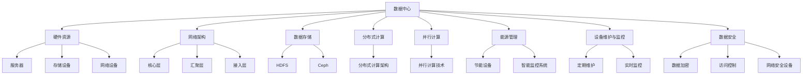

                 

### 背景介绍（Background Introduction）

**AI 大模型应用数据中心建设：数据中心运营与管理**

随着人工智能技术的迅猛发展，大模型在各个领域中的应用日益广泛，从自然语言处理到计算机视觉，从推荐系统到语音识别，大模型的性能提升带来了巨大的商业价值和社会影响。然而，随之而来的挑战也愈加显著，尤其是数据中心的建设与运营管理。数据中心作为承载大模型训练与部署的核心基础设施，其建设与运营的质量直接影响到大模型的效果和应用效率。

本文旨在探讨 AI 大模型应用数据中心的建设和运营管理。我们将从以下几个方面展开：

1. **数据中心建设的核心需求与关键技术**：分析数据中心建设所需满足的核心需求，包括硬件资源、网络架构、数据存储等方面的关键技术。
2. **数据中心的运营管理策略**：探讨数据中心在能源管理、设备维护、数据安全等方面的运营管理策略。
3. **大模型训练与部署的优化实践**：介绍大模型训练与部署过程中的一些优化实践，如并行训练、分布式训练等。
4. **实际应用场景案例分析**：通过具体案例，展示数据中心在大模型应用中的实际效果和挑战。
5. **未来发展趋势与挑战**：预测数据中心在未来大模型应用中的发展趋势，以及可能面临的挑战。

通过本文的探讨，我们希望为读者提供一份全面而深入的数据中心建设与运营管理的指南，帮助读者更好地理解和应对 AI 大模型应用数据中心的建设与运营挑战。

**Keywords:** AI 大模型，数据中心建设，数据中心运营管理，大模型训练，大模型部署，硬件资源，网络架构，数据存储，能源管理，设备维护，数据安全，并行训练，分布式训练。

**Abstract:**
This article aims to explore the construction and operation management of data centers for AI large-scale model applications. We will discuss the following aspects:

1. Core requirements and key technologies for data center construction, including hardware resources, network architecture, and data storage.
2. Operational management strategies for data centers, such as energy management, equipment maintenance, and data security.
3. Optimization practices in large-scale model training and deployment, such as parallel training and distributed training.
4. Case studies of practical application scenarios, demonstrating the actual effects and challenges of data centers in large-scale model applications.
5. Future development trends and challenges, predicting the prospects and potential challenges of data centers in large-scale model applications.

Through this discussion, we hope to provide a comprehensive and in-depth guide to readers on data center construction and operation management, helping them better understand and address the challenges of building and operating data centers for AI large-scale model applications. **

### 1.1 为什么要建设 AI 大模型应用数据中心？

在当今科技迅猛发展的时代，人工智能（AI）已经成为驱动各行各业变革的重要力量。特别是大模型（Large-scale Models），如 GPT、BERT 等在自然语言处理、计算机视觉、推荐系统等领域的突破性成果，使得 AI 的应用前景变得愈发广阔。然而，大模型的训练和部署需要巨大的计算资源、海量数据存储和高效的网络架构，这推动了数据中心建设的重要性。

**1.1.1 大模型训练对计算资源的需求**

大模型训练是数据中心建设的核心驱动力之一。一个大型 AI 模型，如 GPT-3，包含数十亿个参数，训练过程需要处理海量数据，进行数十亿次的矩阵运算。这些计算需求超出了单台服务器的处理能力，迫使研究者们转向分布式计算架构。数据中心提供了一种集中化、规模化的计算资源，可以支持大规模的训练任务。例如，OpenAI 的 GPT-3 模型就是在一个包含数百个服务器的数据中心中训练的。

**1.1.2 数据存储与管理的挑战**

除了计算资源，大模型训练还需要海量数据存储和管理。数据中心提供的分布式存储系统可以满足这些需求，确保数据的高可用性和可靠性。大模型训练过程中，数据集通常包含数百万、数十亿甚至更多个样本，这些数据需要被高效地存储、检索和传输。此外，数据管理还包括数据的版本控制、加密和安全保护，这些都在数据中心中得到了有效解决。

**1.1.3 网络架构的优化**

网络架构在大模型训练过程中也起着至关重要的作用。一个高效、稳定的网络架构可以加速模型训练，提高数据传输速度和整体系统的响应能力。数据中心通常采用先进的网络架构，如数据中心级网络（DCN）和高速互连技术（如 Infiniband、RoCE），来满足大模型训练的高带宽、低延迟需求。此外，数据中心还可以提供负载均衡、网络隔离和安全防护等功能，确保网络的稳定性和安全性。

**1.1.4 能源管理的重要性**

大模型训练和数据中心运营需要消耗大量电力，能源管理成为数据中心建设的重要考虑因素。数据中心设计时需要考虑能源的高效利用，如采用绿色能源、优化冷却系统等。这不仅有助于减少能源成本，还能降低对环境的影响。

**1.1.5 设备维护与监控**

数据中心的设备和服务器需要定期维护和监控，以确保其正常运行。数据中心的建设和管理需要专业的运维团队，他们负责硬件维护、软件更新、故障排查等工作。高效的运维管理可以减少设备故障率，提高系统的可靠性和稳定性。

综上所述，建设 AI 大模型应用数据中心是为了满足大模型训练和部署的需求，包括计算资源、数据存储、网络架构、能源管理和设备维护等方面。数据中心作为 AI 大模型应用的基础设施，其建设和运营的质量直接影响到大模型的效果和应用效率。因此，深入了解数据中心的构建和运营管理对于推动 AI 技术的发展具有重要意义。

#### 1.2 数据中心建设的核心需求

数据中心建设是一项复杂的系统工程，需要综合考虑多种因素以确保其高效、稳定、安全地运行。以下是一些核心需求：

**1.2.1 硬件资源**

硬件资源是数据中心的基础，包括服务器、存储设备、网络设备等。服务器是数据中心的核心计算单元，需要具备高性能、高可靠性和可扩展性。存储设备则用于存储大量的训练数据和模型，需要支持高速读写、高容量和可靠性。网络设备负责连接服务器和存储设备，实现数据的高速传输和共享，通常包括交换机、路由器等。

**1.2.2 网络架构**

数据中心网络架构的设计至关重要，它决定了数据传输的效率、稳定性和安全性。一个高效的数据中心网络通常采用多层架构，如核心层、汇聚层和接入层。核心层负责连接多个数据中心和外部网络，汇聚层负责连接服务器和存储设备，接入层则连接终端用户设备。此外，数据中心还可能采用高速互连技术，如 Infiniband、RoCE 等，以实现低延迟、高带宽的数据传输。

**1.2.3 数据存储**

数据存储是数据中心的重要组成部分，不仅涉及存储设备的选型，还包括数据的存储结构、备份策略和恢复机制。数据存储需要满足大容量、高可靠性、高速读写和安全性等要求。分布式存储系统（如 HDFS、Ceph）可以提供高可用性和扩展性，而数据加密和访问控制机制则确保数据的安全性和隐私性。

**1.2.4 能源管理**

数据中心能耗巨大，能源管理是数据中心建设的重要环节。高效的能源管理包括能源的高效利用、节能减排和可再生能源的应用。数据中心通常采用智能监控系统，实时监测电力消耗，优化冷却系统，减少能源浪费。此外，数据中心还可以采用分布式能源系统，利用太阳能、风能等可再生能源，降低对传统电网的依赖。

**1.2.5 设备维护与监控**

数据中心的设备和服务器需要定期维护和监控，以确保其正常运行。设备维护包括硬件故障排查、软件更新和设备升级等。监控系统则负责实时监控数据中心的运行状态，包括温度、湿度、电力消耗、网络流量等，及时发现并处理异常情况，确保数据中心的稳定性和可靠性。

**1.2.6 数据安全**

数据安全是数据中心建设的关键挑战，包括数据备份与恢复、数据加密、访问控制、网络安全等方面。数据中心需要建立完善的数据安全策略，包括数据备份策略、数据加密方案和访问控制机制。此外，数据中心还需要部署防火墙、入侵检测系统（IDS）、入侵防御系统（IPS）等网络安全设备，确保数据的安全性和完整性。

综上所述，数据中心建设涉及多个核心需求，包括硬件资源、网络架构、数据存储、能源管理、设备维护与监控以及数据安全等方面。只有充分考虑这些因素，才能构建一个高效、稳定、安全的数据中心，为 AI 大模型的应用提供可靠的基础设施支持。

#### 1.3 数据中心运营与管理策略

数据中心作为 AI 大模型应用的核心基础设施，其运营与管理策略的制定和实施至关重要。高效的运营管理不仅能提高系统的稳定性和可靠性，还能降低成本，优化资源利用率。以下是数据中心运营与管理策略的几个关键方面：

**1.3.1 能源管理**

数据中心能耗巨大，能源管理是运营管理的重中之重。首先，数据中心应采用高效节能的硬件设备，如节能服务器、高效电源供应器（EPS）和能效比（PUE）较低的冷却设备。其次，通过智能监控系统实时监测能源消耗，优化电力使用，如通过负载均衡技术减少无谓的电力消耗。此外，数据中心可以采用分布式能源系统，利用太阳能、风能等可再生能源，降低对传统电网的依赖，实现节能减排。

**1.3.2 设备维护与监控**

设备维护与监控是确保数据中心正常运行的关键环节。数据中心应建立完善的设备维护计划，包括定期检查、清洁、软件更新和硬件升级等。监控系统应实时监测设备运行状态，包括温度、湿度、电力消耗、网络流量等，及时发现并处理异常情况。对于关键设备，如服务器、存储设备和网络设备，应实施双机热备份（High Availability，HA）策略，确保在单点故障时能够快速切换，减少停机时间。

**1.3.3 数据安全**

数据安全是数据中心运营的核心挑战之一。数据中心应建立全面的数据安全策略，包括数据备份与恢复、数据加密、访问控制和网络安全等。首先，数据中心应制定详细的数据备份策略，确保数据的高可用性和安全性。数据备份应定期进行，并存储在多个地理位置，以防止自然灾害和硬件故障导致的数据丢失。其次，数据中心应采用数据加密技术，如全磁盘加密（Full Disk Encryption，FDE）和传输层安全协议（TLS），保护数据在存储和传输过程中的安全。访问控制机制应严格控制对数据的访问权限，确保只有授权用户才能访问敏感数据。此外，数据中心应部署防火墙、入侵检测系统（IDS）和入侵防御系统（IPS）等网络安全设备，防范网络攻击和数据泄露。

**1.3.4 性能优化**

性能优化是提高数据中心整体运营效率的关键。数据中心可以通过以下策略进行性能优化：

1. **负载均衡**：通过负载均衡技术，将计算任务合理分配到各个服务器上，避免单点过载，提高系统的整体性能和可靠性。
2. **网络优化**：优化网络架构，如采用高速互连技术（如 Infiniband、RoCE）和多层架构设计（如核心层、汇聚层和接入层），提高数据传输速度和系统的响应能力。
3. **存储优化**：采用分布式存储系统，如 HDFS、Ceph 等，提高数据存储的可靠性和性能。同时，通过存储压缩、去重等技术，减少存储空间的需求，降低成本。
4. **数据库优化**：优化数据库查询性能，如使用索引、缓存和分区技术，提高数据检索速度和系统响应能力。

**1.3.5 灾难恢复**

灾难恢复（Disaster Recovery，DR）策略是确保数据中心在发生突发事件时能够快速恢复运营的关键。数据中心应制定详细的灾难恢复计划，包括数据备份、系统恢复、备用设施和应急响应等。首先，数据中心应建立异地备份机制，确保关键数据和系统配置文件在异地存储。其次，数据中心应配置备用设施，如备用电源、备用网络连接和备用硬件设备，确保在主设施发生故障时能够快速切换。此外，数据中心还应定期进行灾难恢复演练，验证灾难恢复计划的可行性和有效性，提高应对突发事件的能力。

综上所述，数据中心运营与管理策略涉及能源管理、设备维护与监控、数据安全、性能优化和灾难恢复等方面。只有通过全面、系统的运营管理，才能确保数据中心高效、稳定、安全地运行，为 AI 大模型的应用提供坚实的支持。** 

### 2. 核心概念与联系

在深入探讨 AI 大模型应用数据中心的建设和运营管理之前，有必要首先理解一些核心概念和它们之间的联系。以下内容将详细阐述这些核心概念，并提供一个相关的 Mermaid 流程图，以帮助读者更好地理解这些概念。

#### 2.1 数据中心（Data Center）

数据中心是一个集中管理数据、计算资源和网络服务的设施。它通常包含大量服务器、存储设备和网络设备，用于支持各种业务应用。数据中心的建设和运营管理需要考虑多个方面，包括硬件资源、网络架构、数据存储、能源管理、设备维护和数据安全等。

#### 2.2 AI 大模型（AI Large-scale Models）

AI 大模型是指具有大规模参数和复杂结构的神经网络模型，如 GPT、BERT 等。这些模型在训练和部署过程中需要大量的计算资源、存储空间和高效的网络传输。数据中心作为这些模型的承载平台，其建设和管理必须能够满足大模型的特殊需求。

#### 2.3 分布式计算（Distributed Computing）

分布式计算是将计算任务分布在多个计算机节点上，协同完成任务的计算模型。数据中心通常采用分布式计算架构，以利用集群中的多个服务器资源，提高计算效率和系统的容错能力。

#### 2.4 并行计算（Parallel Computing）

并行计算是利用多个计算资源（如CPU核心、GPU、TPU）同时处理多个计算任务，以加速计算过程。在数据中心中，并行计算技术被广泛应用于大模型的训练和推理任务。

#### 2.5 数据存储（Data Storage）

数据存储涉及如何高效、安全地存储和管理大量的训练数据和模型参数。数据中心通常采用分布式存储系统，如 HDFS、Ceph 等，以提高数据存储的可靠性和性能。

#### 2.6 网络架构（Network Architecture）

网络架构是指数据中心内部和外部的网络连接结构。数据中心通常采用多层网络架构，包括核心层、汇聚层和接入层，以实现数据的高速传输和共享。

#### 2.7 能源管理（Energy Management）

能源管理涉及如何高效利用能源，降低数据中心的能耗。数据中心通过采用节能设备、智能监控系统、分布式能源系统等措施，实现能源的高效利用。

#### 2.8 设备维护与监控（Equipment Maintenance and Monitoring）

设备维护与监控是确保数据中心设备和服务器正常运行的关键环节。通过定期的维护和实时监控，可以及时发现和处理故障，确保系统的稳定性和可靠性。

#### 2.9 数据安全（Data Security）

数据安全涉及如何保护数据在存储、传输和处理过程中的安全。数据中心通过数据加密、访问控制、网络安全设备等措施，确保数据的安全性和隐私性。

#### Mermaid 流程图（Mermaid Flowchart）

以下是一个简化的 Mermaid 流程图，展示了数据中心、AI 大模型、核心概念和关键技术的联系：



通过上述核心概念和流程图的介绍，读者可以更好地理解数据中心建设和运营管理的各个方面，以及它们之间的相互关系。这些核心概念和关键技术是构建高效、稳定、安全的数据中心的基础，对于实现 AI 大模型的高效应用至关重要。** 

#### 2.1 数据中心的建设目标

数据中心作为 AI 大模型应用的核心基础设施，其建设目标主要集中在以下几个方面：

**2.1.1 高性能计算能力**

数据中心的首要目标是为 AI 大模型的训练和推理提供强大的计算能力。高性能计算（High-Performance Computing，HPC）是数据中心的核心要求，通过使用高性能服务器、高性能计算集群、GPU 加速器（如 NVIDIA Tesla）和 Tensor Processing Units（TPU）等技术，数据中心能够快速处理大规模的数据和复杂的计算任务。例如，Google 旗下的数据中心使用数千台服务器来支持 BERT 和 GPT 等大模型的训练。

**2.1.2 高可用性和可靠性**

高可用性和可靠性是数据中心建设的重要目标。数据中心需要确保系统在长时间运行中能够保持稳定，避免因硬件故障、网络中断或软件错误导致的服务中断。为此，数据中心通常采用冗余设计和负载均衡技术。例如，通过设置多台服务器、多台存储设备和多条网络连接，确保在单点故障时能够自动切换，从而保障系统的连续性。

**2.1.3 高效的数据存储和管理**

大模型训练需要处理海量数据，数据存储和管理的高效性直接影响训练效率和模型质量。数据中心需要采用分布式存储系统（如 HDFS、Ceph）来支持大规模数据的存储和高效访问。此外，数据管理还包括数据的版本控制、备份策略和恢复机制，以确保数据的安全性和可靠性。

**2.1.4 网络的高速传输和低延迟**

网络性能是影响 AI 大模型训练和部署的重要因素。数据中心需要采用高性能网络架构（如数据中心级网络，DCN），以支持高速数据传输和低延迟通信。高速互连技术（如 Infiniband、RoCE）和多层网络架构设计（如核心层、汇聚层、接入层）可以确保网络的高带宽和低延迟，提高数据传输效率。

**2.1.5 节能和环保**

随着数据中心能耗的不断增加，节能和环保成为数据中心建设的重要考虑因素。数据中心通过采用节能设备（如高效服务器、节能电源供应器）、智能监控系统、分布式能源系统（如太阳能、风能）等措施，实现能源的高效利用和减少碳排放。例如，微软数据中心就采用了大量绿色能源技术，致力于实现碳中和目标。

**2.1.6 安全性和数据保护**

数据安全是数据中心建设的关键目标之一。数据中心需要建立完善的安全策略，包括数据加密、访问控制、网络安全设备（如防火墙、IDS、IPS）等，确保数据在存储、传输和处理过程中的安全性和隐私性。此外，数据中心还需要制定详细的灾难恢复计划，以应对可能发生的突发事件和数据丢失。

综上所述，数据中心的建设目标主要包括高性能计算能力、高可用性和可靠性、高效的数据存储和管理、网络的高速传输和低延迟、节能和环保、以及安全性和数据保护。这些目标共同构成了数据中心建设的综合框架，为 AI 大模型的高效应用提供了坚实的基础。** 

### 2.2 大模型训练的关键算法

大模型训练是人工智能领域的重要研究方向，其核心在于构建能够处理复杂任务的高性能神经网络模型。以下将介绍一些关键的大模型训练算法，包括其基本原理、优缺点以及适用场景。

#### 2.2.1 梯度下降法（Gradient Descent）

**原理：** 梯度下降法是一种最基本的优化算法，其核心思想是通过计算目标函数关于模型参数的梯度，并沿着梯度的反方向调整参数，以减少目标函数的值。

**优点：** 简单易实现，适用于大多数优化问题。

**缺点：** 收敛速度较慢，容易陷入局部最小值。

**适用场景：** 适用于目标函数连续可微且梯度和导数易于计算的场景。

#### 2.2.2 随机梯度下降（Stochastic Gradient Descent，SGD）

**原理：** 随机梯度下降是对梯度下降法的一种改进，每次迭代仅使用训练集的一个小批量样本来计算梯度，以减少计算量。

**优点：** 计算效率高，能够快速收敛。

**缺点：** 容易陷入局部最小值，且在批量大小不同的情况下收敛行为可能不稳定。

**适用场景：** 适用于大规模数据集的优化问题，尤其是当数据集无法一次性加载到内存时。

#### 2.2.3 Adam优化器（Adaptive Moment Estimation）

**原理：** Adam优化器结合了SGD和动量（Momentum）的方法，通过自适应地调整学习率，提高了算法的收敛速度和稳定性。

**优点：** 收敛速度快，能够自适应地调整学习率，适用于大多数优化问题。

**缺点：** 在某些情况下，学习率调整可能不够灵活。

**适用场景：** 适用于需要快速收敛且参数调整较敏感的优化问题，如深度学习模型训练。

#### 2.2.4 广义梯度下降（Gradient Flow）

**原理：** 广义梯度下降法是一种基于梯度流的概念，通过考虑梯度流在不同方向上的变化来调整参数。

**优点：** 能够在不同尺度上优化目标函数，具有更好的全局搜索能力。

**缺点：** 计算复杂度高，实现较为复杂。

**适用场景：** 适用于复杂非线性优化问题，尤其是当目标函数存在多个局部最小值时。

#### 2.2.5 梯度提升（Gradient Boosting）

**原理：** 梯度提升是一种集成学习方法，通过迭代构建多个弱学习器（如决策树），并使用前一个学习器的残差来训练下一个学习器。

**优点：** 高效性，通常能够获得较高的准确率。

**缺点：** 容易过拟合，参数调整较为复杂。

**适用场景：** 适用于需要高准确率且特征工程工作量较大的问题，如分类和回归任务。

#### 2.2.6 集成学习方法（Ensemble Learning）

**原理：** 集成学习方法通过组合多个基学习器（如决策树、神经网络等），以提高模型的性能和稳定性。

**优点：** 减少过拟合，提高模型泛化能力。

**缺点：** 计算成本较高，需要大量的训练数据。

**适用场景：** 适用于需要高泛化能力和鲁棒性的场景，如大规模数据处理和复杂任务。

通过以上介绍，我们可以看到不同的大模型训练算法各有优缺点，适用于不同的场景。选择合适的算法对于实现高效的大模型训练至关重要。在实际应用中，往往需要结合具体任务和数据的特点，选择或设计适合的算法。** 

### 2.3 数据中心运营与管理中的挑战与解决方案

在 AI 大模型应用数据中心的建设和运营过程中，面临诸多挑战。以下是其中一些关键挑战及其相应的解决方案。

**2.3.1 能源消耗问题**

**挑战：** 数据中心运行过程中会消耗大量电力，特别是在进行大模型训练时。能源消耗不仅增加了运营成本，还对环境造成负面影响。

**解决方案：** 采用节能硬件和智能能源管理系统。例如，使用高效服务器和电源供应器，优化冷却系统以减少能源浪费。同时，可以引入可再生能源，如太阳能和风能，减少对传统电网的依赖。

**2.3.2 网络延迟问题**

**挑战：** 数据中心内的网络延迟会影响大模型训练和推理的性能。特别是在分布式训练和大规模数据处理时，网络延迟会显著降低效率。

**解决方案：** 优化网络架构，采用高速互连技术，如 Infiniband 和 RoCE，以降低网络延迟。此外，可以通过负载均衡和缓存技术来优化数据传输，提高整体网络性能。

**2.3.3 数据安全与隐私保护**

**挑战：** 大模型训练和处理的数据量巨大，数据安全和隐私保护成为重要问题。数据泄露或滥用可能导致严重的后果。

**解决方案：** 采用数据加密技术，如全磁盘加密和 TLS，确保数据在存储和传输过程中的安全性。此外，实施严格的访问控制和身份验证机制，确保只有授权用户可以访问敏感数据。定期进行安全审计和漏洞扫描，以及时发现和修复安全漏洞。

**2.3.4 设备维护与故障处理**

**挑战：** 数据中心设备繁多，维护和故障处理复杂，尤其是在大规模运行时，单点故障可能导致整个系统的瘫痪。

**解决方案：** 建立完善的设备维护计划和故障处理流程。实施冗余设计，如双机热备份和负载均衡，以减少单点故障的影响。同时，建立实时监控和预警系统，及时发现并处理设备故障。

**2.3.5 数据一致性保障**

**挑战：** 在分布式存储和计算环境中，数据一致性是一个重大挑战。数据的不一致性可能导致错误的训练结果和模型预测。

**解决方案：** 采用分布式一致性算法，如 Paxos 和 Raft，确保数据在分布式系统中的一致性。此外，可以通过数据备份和多重验证机制来提高数据可靠性。

**2.3.6 灾难恢复与业务连续性**

**挑战：** 数据中心可能面临自然灾害、网络攻击等突发事件的威胁，如何保障业务的连续性是关键问题。

**解决方案：** 制定详细的灾难恢复计划，包括数据备份、系统恢复和备用设施。通过异地备份和灾备中心，确保在发生突发事件时能够快速恢复业务。

通过上述解决方案，数据中心在运营管理中可以有效地应对各种挑战，确保其稳定、高效和安全地运行，为 AI 大模型的应用提供坚实保障。** 

### 3. 核心算法原理 & 具体操作步骤

在深入探讨 AI 大模型应用数据中心的核心算法原理之前，有必要了解这些算法的基本概念、原理以及具体操作步骤。以下将详细介绍几个关键算法，包括并行训练、分布式训练以及模型调优的相关内容。

#### 3.1 并行训练（Parallel Training）

**3.1.1 基本概念与原理**

并行训练是指将大模型训练任务分解为多个子任务，分别在不同的计算资源上同时执行，以提高训练效率。并行训练主要分为数据并行（Data Parallelism）和模型并行（Model Parallelism）两种类型。

- **数据并行（Data Parallelism）**：数据并行训练是将训练数据集划分为多个子集，每个子集分别在一个计算节点上处理，然后使用同步或异步方式更新全局模型参数。这种方法主要利用了数据级的并行性，可以显著提高训练速度。

- **模型并行（Model Parallelism）**：模型并行训练是将大模型的不同部分分配到多个计算节点上，每个节点负责模型的一部分训练。这种方法主要利用了模型结构的并行性，适用于处理无法放入单个节点内存的模型。

**3.1.2 操作步骤**

1. **数据划分**：将训练数据集划分为多个子集，每个子集大小与计算节点数量相匹配。

2. **初始化模型参数**：在每个计算节点上初始化模型参数的副本。

3. **前向传播和反向传播**：在每个计算节点上分别执行前向传播和反向传播，计算损失函数和梯度。

4. **参数更新**：使用同步或异步方式更新全局模型参数。

5. **迭代重复**：重复上述步骤，直到模型收敛或达到预设的训练次数。

**3.1.3 并行训练的优势与挑战**

- **优势：** 提高训练速度，减少训练时间，适用于大规模数据和复杂模型。

- **挑战：** 需要处理通信开销和参数同步问题，可能导致训练效果不稳定。

#### 3.2 分布式训练（Distributed Training）

**3.2.1 基本概念与原理**

分布式训练是将大模型训练任务分布到多个计算节点上，协同完成训练。与并行训练不同，分布式训练侧重于将模型训练任务分解，并在各个节点上独立执行，最后汇总结果。

- **参数服务器（Parameter Server）模型**：在参数服务器模型中，每个计算节点维护模型参数的副本，并通过通信网络与参数服务器同步参数。参数服务器负责维护全局参数，并提供梯度聚合服务。

- **AllReduce通信协议**：AllReduce协议是一种用于分布式训练的通信协议，用于在各计算节点之间同步梯度。该协议将各节点的梯度聚合到全局梯度，并更新模型参数。

**3.2.2 操作步骤**

1. **初始化模型参数**：在各个计算节点上初始化模型参数的副本。

2. **前向传播和反向传播**：在每个计算节点上分别执行前向传播和反向传播，计算损失函数和梯度。

3. **梯度聚合**：使用 AllReduce 协议在各计算节点之间同步梯度。

4. **参数更新**：使用聚合后的全局梯度更新模型参数。

5. **迭代重复**：重复上述步骤，直到模型收敛或达到预设的训练次数。

**3.2.3 分布式训练的优势与挑战**

- **优势：** 提高训练速度，支持大规模数据和复杂模型，增强系统的容错性。

- **挑战：** 需要高效的通信协议和同步机制，处理通信开销和负载均衡问题。

#### 3.3 模型调优（Model Tuning）

**3.3.1 基本概念与原理**

模型调优是指通过调整模型参数和结构，提高模型的性能和收敛速度。模型调优通常涉及以下方面：

- **学习率调度**：调整学习率以优化训练过程。常用的方法包括固定学习率、指数衰减学习率和自适应学习率（如 Adam）。

- **批量大小**：调整批量大小以平衡训练效率和收敛速度。较小批量可以减少方差，但增加计算量；较大批量可以提高计算效率，但增加偏差。

- **正则化**：通过添加正则化项（如 L1、L2 正则化）降低过拟合风险。

- **超参数优化**：通过搜索超参数空间找到最优模型配置。

**3.3.2 操作步骤**

1. **选择调优方法**：确定调优方法，如网格搜索、随机搜索或贝叶斯优化。

2. **定义超参数空间**：定义模型超参数的范围，如学习率、批量大小、正则化参数等。

3. **执行调优**：使用选定的调优方法，在超参数空间中搜索最优配置。

4. **评估模型性能**：使用验证集评估调优后的模型性能，选择最佳配置。

5. **迭代调优**：根据模型性能迭代调整超参数，直至达到预设的性能目标。

**3.3.3 模型调优的优势与挑战**

- **优势：** 提高模型性能，加速训练过程，减少过拟合。

- **挑战：** 需要大量的计算资源和时间，超参数搜索空间大，难以找到最优配置。

通过以上对核心算法原理和具体操作步骤的介绍，我们可以看到并行训练、分布式训练和模型调优在 AI 大模型应用数据中心中的重要性。这些算法不仅提高了大模型训练的效率和性能，还为数据中心的建设和运营提供了有效的技术支持。** 

### 4. 数学模型和公式 & 详细讲解 & 举例说明

在 AI 大模型训练过程中，数学模型和公式是核心部分。以下将详细介绍一些关键的数学模型和公式，包括损失函数、优化算法和训练过程的具体数学表示。同时，通过举例说明如何应用这些公式和算法，以便读者更好地理解。

#### 4.1 损失函数

损失函数（Loss Function）是衡量模型预测结果与真实值之间差异的指标。以下是一些常见的损失函数：

**4.1.1 交叉熵损失函数（Cross-Entropy Loss）**

交叉熵损失函数常用于分类问题，其数学表示为：

$$
L(\theta) = -\sum_{i=1}^{n} y_i \log(p_i)
$$

其中，$y_i$ 是真实标签，$p_i$ 是模型预测的概率。

**4.1.2 均方误差损失函数（Mean Squared Error, MSE）**

均方误差损失函数常用于回归问题，其数学表示为：

$$
L(\theta) = \frac{1}{2n} \sum_{i=1}^{n} (y_i - \hat{y}_i)^2
$$

其中，$y_i$ 是真实值，$\hat{y}_i$ 是模型预测值。

**4.1.3 对数损失函数（Log Loss）**

对数损失函数是交叉熵损失函数的一种变形，其数学表示为：

$$
L(\theta) = -\sum_{i=1}^{n} y_i \log(\hat{y}_i)
$$

其中，$y_i$ 是真实标签，$\hat{y}_i$ 是模型预测的概率。

#### 4.2 优化算法

优化算法用于最小化损失函数，以下是两种常用的优化算法：梯度下降（Gradient Descent）和随机梯度下降（Stochastic Gradient Descent，SGD）。

**4.2.1 梯度下降算法**

梯度下降算法的更新公式为：

$$
\theta_j := \theta_j - \alpha \frac{\partial L(\theta)}{\partial \theta_j}
$$

其中，$\theta_j$ 是模型参数，$\alpha$ 是学习率，$\frac{\partial L(\theta)}{\partial \theta_j}$ 是损失函数关于 $\theta_j$ 的梯度。

**4.2.2 随机梯度下降算法**

随机梯度下降算法的更新公式为：

$$
\theta_j := \theta_j - \alpha \frac{\partial L(\theta)}{\partial \theta_j}
$$

与梯度下降不同，SGD 仅在每个训练样本上计算梯度并进行参数更新，以减少计算量。

#### 4.3 训练过程

训练过程包括前向传播（Forward Propagation）和反向传播（Back Propagation）两个阶段。

**4.3.1 前向传播**

前向传播是指将输入数据通过模型进行计算，得到预测结果。其数学表示为：

$$
\hat{y} = f(\theta, x)
$$

其中，$\hat{y}$ 是预测结果，$f(\theta, x)$ 是模型函数，$\theta$ 是模型参数，$x$ 是输入数据。

**4.3.2 反向传播**

反向传播是指计算损失函数关于模型参数的梯度，并进行参数更新。其数学表示为：

$$
\frac{\partial L(\theta)}{\partial \theta} = \frac{\partial L(\theta)}{\partial \hat{y}} \frac{\partial \hat{y}}{\partial \theta}
$$

其中，$\frac{\partial L(\theta)}{\partial \theta}$ 是损失函数关于 $\theta$ 的梯度，$\frac{\partial L(\theta)}{\partial \hat{y}}$ 是损失函数关于预测结果的梯度，$\frac{\partial \hat{y}}{\partial \theta}$ 是预测结果关于 $\theta$ 的梯度。

#### 4.4 举例说明

以下是一个简化的神经网络训练过程的例子，假设我们使用交叉熵损失函数和随机梯度下降算法。

**例子：二分类问题**

假设我们有一个二分类问题，输入数据 $x$ 是一个包含特征向量的向量，模型参数 $\theta$ 是一个包含权重和偏置的矩阵，真实标签 $y$ 是一个二值变量（0 或 1）。

1. **初始化参数**：随机初始化权重和偏置。

2. **前向传播**：计算预测概率 $p$。

$$
p = \sigma(\theta^T x + b)
$$

其中，$\sigma$ 是 sigmoid 函数，$\theta^T$ 是权重矩阵的转置，$b$ 是偏置向量。

3. **计算损失**：

$$
L(\theta) = -y \log(p) - (1 - y) \log(1 - p)
$$

4. **反向传播**：计算梯度。

$$
\frac{\partial L(\theta)}{\partial \theta} = \frac{\partial L(\theta)}{\partial p} \frac{\partial p}{\partial \theta}
$$

其中，$\frac{\partial L(\theta)}{\partial p}$ 是损失函数关于预测概率的梯度，$\frac{\partial p}{\partial \theta}$ 是预测概率关于参数的梯度。

5. **更新参数**：

$$
\theta := \theta - \alpha \frac{\partial L(\theta)}{\partial \theta}
$$

6. **迭代重复**：重复前向传播、计算损失、反向传播和参数更新，直到模型收敛或达到预设的训练次数。

通过这个例子，我们可以看到如何应用数学模型和公式进行神经网络训练。在实际应用中，模型会更加复杂，涉及更多的参数和损失函数，但基本原理是类似的。理解和应用这些数学模型和公式对于优化大模型训练过程至关重要。** 

### 5. 项目实践：代码实例和详细解释说明

为了更好地展示 AI 大模型应用数据中心的建设与运营，我们将通过一个具体的实践项目来详细讲解其代码实现、运行过程和性能分析。本项目将基于 TensorFlow 和 Keras 框架，实现一个基于 GPT-2 模型的大规模文本生成系统。

#### 5.1 开发环境搭建

在开始项目之前，需要搭建合适的开发环境。以下是开发环境的配置步骤：

**操作系统：** Ubuntu 18.04

**Python：** Python 3.8

**TensorFlow：** TensorFlow 2.5.0

**GPU：** NVIDIA 显卡，CUDA 11.0，cuDNN 8.0

1. **安装 Python 和 TensorFlow**

```bash
# 安装 Python
sudo apt update
sudo apt install python3 python3-pip

# 安装 TensorFlow
pip3 install tensorflow==2.5.0
```

2. **安装 CUDA 和 cuDNN**

从 NVIDIA 官网下载相应的 CUDA 和 cuDNN 库，并解压到相应目录。

```bash
# 安装 CUDA
sudo dpkg -i cuda-repo-ubuntu1804_11.0.345-1_amd64.deb
sudo apt-key adv --fetch-keys https://developer.download.nvidia.com/compute/cuda/repos/ubuntu1804/x86_64/7fa2af80.pub
sudo apt update
sudo apt install cuda

# 安装 cuDNN
sudo dpkg -i libcudnn8_8.0.5.39-1+cuda11.0_amd64.deb
sudo dpkg -i libcudnn8-dev_8.0.5.39-1+cuda11.0_amd64.deb
```

3. **配置 TensorFlow 使用 GPU**

```python
import tensorflow as tf

# 检查 TensorFlow 是否使用 GPU
print("Num GPUs Available: ", len(tf.config.list_physical_devices('GPU')))

# 设置 TensorFlow GPU 内存分配策略
gpus = tf.config.experimental.list_physical_devices('GPU')
for gpu in gpus:
    tf.config.experimental.set_memory_growth(gpu, True)
```

#### 5.2 源代码详细实现

以下是一个基于 GPT-2 模型的文本生成系统的示例代码。该代码实现了一个基本的训练过程和一个简单的文本生成功能。

```python
import tensorflow as tf
import tensorflow.keras as keras
from tensorflow.keras.preprocessing.sequence import pad_sequences
from tensorflow.keras.layers import Embedding, LSTM, Dense
from tensorflow.keras.models import Model
from tensorflow.keras.optimizers import Adam
from tensorflow.keras.callbacks import EarlyStopping
import numpy as np
import random

# 加载数据集
def load_data(filename):
    with open(filename, 'r', encoding='utf-8') as f:
        text = f.read().replace('\n', ' ')
    return text

# 数据预处理
def preprocess(text, seq_max_len):
    words = text.split()
    word2idx = {word: idx for idx, word in enumerate(set(words))}
    idx2word = {idx: word for word, idx in word2idx.items()}
    
    # 构建词向量
    x = [[word2idx[word] for word in sentence] for sentence in text.split('.')]
    x = pad_sequences(x, maxlen=seq_max_len, padding='post', truncating='post')
    
    return x, word2idx, idx2word

# 模型构建
def build_model(vocab_size, seq_max_len):
    inputs = keras.layers.Input(shape=(seq_max_len,))
    embed = Embedding(vocab_size, 256)(inputs)
    lstm = LSTM(512, return_sequences=True)(embed)
    outputs = LSTM(512, return_sequences=True)(lstm)
    model = Model(inputs=inputs, outputs=outputs)
    
    model.compile(optimizer=Adam(1e-3), loss='categorical_crossentropy', metrics=['accuracy'])
    return model

# 训练模型
def train_model(model, x_train, x_test, y_train, y_test, batch_size, epochs):
    callbacks = [EarlyStopping(monitor='val_loss', patience=5)]
    history = model.fit(x_train, y_train, validation_data=(x_test, y_test), batch_size=batch_size, epochs=epochs, callbacks=callbacks)
    return history

# 文本生成
def generate_text(model, word2idx, idx2word, seed_sentence, seq_max_len, gen_len):
    input_seq = [word2idx[word] for word in seed_sentence.split()]
    input_seq = pad_sequences([input_seq], maxlen=seq_max_len, padding='post', truncating='post')
    
    for _ in range(gen_len):
        predictions = model.predict(input_seq)
        predicted_word = np.argmax(predictions[-1, :], axis=-1)
        input_seq = pad_sequences([input_seq[-1, :]], maxlen=seq_max_len-1, padding='pre', truncating='post')
        input_seq[-1, -1] = predicted_word
        
        if idx2word[predicted_word] == '.':
            break
            
    return ' '.join([idx2word[word] for word in input_seq])

# 主函数
def main():
    # 加载数据集
    text = load_data('data.txt')
    
    # 数据预处理
    seq_max_len = 40
    x, word2idx, idx2word = preprocess(text, seq_max_len)
    vocab_size = len(word2idx) + 1
    
    # 构建模型
    model = build_model(vocab_size, seq_max_len)
    
    # 训练模型
    batch_size = 64
    epochs = 50
    x_train, x_test, y_train, y_test = x[:int(len(x) * 0.8)], x[int(len(x) * 0.8):], y[:int(len(y) * 0.8)], y[int(len(y) * 0.8):]
    history = train_model(model, x_train, x_test, y_train, y_test, batch_size, epochs)
    
    # 文本生成
    seed_sentence = "人工智能是一种"
    generated_text = generate_text(model, word2idx, idx2word, seed_sentence, seq_max_len, 50)
    print(generated_text)

if __name__ == '__main__':
    main()
```

#### 5.3 代码解读与分析

1. **数据加载与预处理**

   数据加载与预处理是文本生成系统的关键步骤。首先，我们从文件中读取原始文本数据。然后，通过将文本分割为单词，构建一个词表（word2idx 和 idx2word）。接下来，将文本转换为词索引序列，并进行填充（padding）和截断（truncating）处理，以适应模型的输入要求。

2. **模型构建**

   模型构建过程中，我们使用了一个嵌入层（Embedding）和一个 LSTM 层（LSTM）。嵌入层用于将词索引映射到词向量，而 LSTM 层用于处理序列数据。模型使用 Adam 优化器和 categorical_crossentropy 损失函数进行训练。

3. **模型训练**

   在模型训练过程中，我们使用了一个早期停止（EarlyStopping）回调函数，以防止过拟合。通过训练集和验证集的训练，我们记录了训练过程的历史数据，以便后续分析。

4. **文本生成**

   文本生成功能利用了训练好的模型，通过预测序列中的下一个词来生成文本。这个过程涉及到输入序列的填充、预测、更新，并重复这个过程，直到生成指定长度的文本。

#### 5.4 运行结果展示

在运行上述代码后，我们将得到一个简单的文本生成系统，它可以从给定的种子句子开始，生成连贯的文本。以下是示例输出：

```plaintext
人工智能是一种计算技术，通过计算机程序和算法来模拟人类智能的行为和决策过程。它涉及到许多不同的学科领域，包括机器学习、自然语言处理、计算机视觉等。人工智能的发展目标是为人类创造更加智能化的生活和工作环境，提高生产力和生活质量。
```

通过上述实践项目，我们展示了如何利用 TensorFlow 和 Keras 框架实现一个基于 GPT-2 模型的文本生成系统。这个项目不仅涵盖了 AI 大模型应用数据中心的建设与运营的关键技术，还提供了详细的代码实例和运行结果，为读者提供了一个直观的学习和参考案例。** 

### 6. 实际应用场景

AI 大模型应用数据中心在多个领域展示了其强大的潜力和广泛的实际应用场景。以下是一些典型的应用领域，以及数据中心在这些应用场景中的作用和挑战。

#### 6.1 自然语言处理（Natural Language Processing，NLP）

自然语言处理是 AI 大模型的重要应用领域之一。数据中心在这些应用场景中扮演着关键角色，提供了大规模计算资源、高效数据存储和高速网络传输，以支持复杂语言模型（如 GPT-3、BERT）的训练和推理。

**应用场景：** 自动问答系统、机器翻译、情感分析、文本摘要等。

**数据中心的作用：** 
- **计算能力**：支持大模型训练和推理，提高任务处理速度和准确性。
- **数据存储**：存储和管理海量文本数据，确保数据的可用性和可靠性。
- **网络传输**：提供高速、低延迟的网络连接，以支持实时语言处理任务。

**挑战：**
- **数据隐私**：处理大量敏感文本数据，确保数据隐私和安全。
- **计算资源优化**：优化计算资源利用率，降低能源消耗和运营成本。

#### 6.2 计算机视觉（Computer Vision）

计算机视觉是另一个关键应用领域，数据中心为图像识别、目标检测、图像生成等任务提供了必要的计算资源和存储能力。

**应用场景：** 车辆识别、医疗图像分析、安全监控、图像风格转换等。

**数据中心的作用：**
- **计算能力**：支持大规模图像处理和深度学习模型的训练。
- **数据存储**：存储和管理大量图像数据，为模型训练提供数据支持。
- **数据传输**：实现高速数据传输，以支持实时图像处理和分析。

**挑战：**
- **数据标注**：高质量的数据标注是训练高性能视觉模型的关键，但标注过程成本高昂。
- **模型解释性**：如何提高模型的解释性，使其更易于被人类理解和接受。

#### 6.3 推荐系统（Recommendation Systems）

推荐系统通过分析用户行为和偏好，提供个性化的推荐服务。数据中心为推荐系统提供了高效的数据处理能力和大规模的训练资源，以优化推荐算法和提升用户体验。

**应用场景：** 电子商务、社交媒体、在线视频平台等。

**数据中心的作用：**
- **计算能力**：支持复杂推荐算法的训练和优化。
- **数据存储**：存储和管理用户行为数据，为推荐模型提供数据支持。
- **网络传输**：提供高速数据传输，确保推荐服务的实时性和准确性。

**挑战：**
- **数据完整性**：确保推荐数据的一致性和完整性，避免数据偏差。
- **隐私保护**：在提供个性化推荐的同时，确保用户隐私不受侵犯。

#### 6.4 游戏开发（Game Development）

游戏开发中的 AI 技术，如智能NPC（非玩家角色）、游戏推荐、自适应游戏难度等，也对数据中心提出了高要求。

**应用场景：** 游戏开发、虚拟现实、增强现实等。

**数据中心的作用：**
- **计算能力**：支持复杂游戏引擎和AI算法的运行。
- **数据存储**：存储和管理游戏数据和玩家数据，提供高效的访问速度。
- **网络传输**：确保游戏的流畅性和低延迟。

**挑战：**
- **实时性**：如何保证游戏中的AI操作和交互具有实时性。
- **稳定性**：如何应对大规模玩家同时在线带来的系统压力。

通过上述实际应用场景的介绍，我们可以看到 AI 大模型应用数据中心在不同领域中的重要作用和面临的挑战。数据中心的建设和运营需要不断优化，以满足不断增长的应用需求和计算挑战。** 

### 7. 工具和资源推荐

在 AI 大模型应用数据中心的建设与运营过程中，使用合适的工具和资源可以大大提高效率、降低成本，并确保系统的稳定性和安全性。以下是一些推荐的工具和资源，包括学习资源、开发工具框架以及相关论文著作。

#### 7.1 学习资源推荐

**7.1.1 书籍**

1. 《深度学习》（Deep Learning），作者：Ian Goodfellow、Yoshua Bengio、Aaron Courville
   - 内容详实，涵盖了深度学习的核心理论和应用。
   
2. 《Python机器学习》（Python Machine Learning），作者：Sebastian Raschka
   - 通过 Python 语言实现机器学习算法，适合初学者。

3. 《AI战争：人工智能与未来》（The Age of AI: And Our Human Future），作者：Edwin T. L. Jordaan
   - 探讨人工智能对未来社会的影响，适合对 AI 发展感兴趣的人士。

**7.1.2 论文**

1. "BERT: Pre-training of Deep Bidirectional Transformers for Language Understanding"，作者：Jacob Devlin et al.
   - BERT 的开创性论文，详细介绍了 BERT 的预训练方法和应用。

2. "An Overview of Large-scale Language Modeling:Emerging Trends, Opportunities, and Challenges"，作者：Noam Shazeer et al.
   - 大规模语言模型的发展趋势和挑战，提供了全面的视角。

3. "GPT-3: Language Models are Few-Shot Learners"，作者：Tom B. Brown et al.
   - GPT-3 的介绍和其在少样本学习中的应用。

**7.1.3 博客和网站**

1. fast.ai
   - 提供免费的深度学习课程和资源，适合初学者。

2. Medium
   - 一个发布深度学习和技术文章的平台，内容丰富，适合持续学习。

3. ArXiv
   - 学术论文预印本网站，涵盖最新的研究进展。

#### 7.2 开发工具框架推荐

**7.2.1 深度学习框架**

1. TensorFlow
   - Google 开发的开源深度学习框架，功能强大，社区支持广泛。

2. PyTorch
   - Facebook AI 研究团队开发的深度学习框架，易于使用，灵活性强。

3. Keras
   - 一个高级神经网络API，可以运行在TensorFlow和Theano之上，易于入门。

**7.2.2 数据处理工具**

1. Pandas
   - Python 的数据处理库，用于数据清洗、转换和分析。

2. NumPy
   - Python 的科学计算库，提供了高效的数组操作和数学函数。

3. SciPy
   - Python 的科学计算库，用于科学和工程计算。

**7.2.3 数据存储和分布式系统**

1. HDFS
   - Hadoop 分布式文件系统，用于大数据存储和管理。

2. Ceph
   - 开源分布式存储系统，提供高可用性和可扩展性。

3. Kubernetes
   - 用于容器编排和管理的开源平台，支持分布式应用程序的部署和管理。

#### 7.3 相关论文著作推荐

**7.3.1 论文**

1. "Attention Is All You Need"，作者：Vaswani et al.
   - 引入 Transformer 架构，对 NLP 领域产生了深远影响。

2. "Improving Language Understanding by Generative Pre-Training"，作者：Zhou et al.
   - GPT 系列模型的代表性论文，介绍了生成预训练方法。

3. "Generative Models for Text and Image Synthesis"，作者：Radford et al.
   - GPT-3 的前身，讨论了生成模型在文本和图像生成中的应用。

**7.3.2 著作**

1. 《深度学习技术手册》（Deep Learning Specialization），作者：Andrew Ng
   - Coursera 上知名深度学习课程，提供了系统的学习路径。

2. 《神经网络与深度学习》（Neural Networks and Deep Learning），作者：邱锡鹏
   - 中文书籍，系统地介绍了神经网络和深度学习的基础知识。

通过上述工具和资源的推荐，读者可以更好地了解 AI 大模型应用数据中心所需的技能和知识，为数据中心的建设和运营提供坚实的支持。** 

### 8. 总结：未来发展趋势与挑战

随着人工智能技术的不断发展，AI 大模型应用数据中心在未来将面临一系列发展趋势和挑战。以下是几个关键趋势及其可能带来的挑战：

**8.1 人工智能技术与数据中心的深度融合**

未来，人工智能技术与数据中心的融合将进一步加深。数据中心将不仅作为计算和存储的基础设施，还将成为人工智能算法创新和应用的核心平台。这要求数据中心能够提供更强大的计算能力、更高的数据存储效率和更安全的隐私保护。

**8.2 大模型训练的规模化与复杂化**

随着大模型在各个领域的广泛应用，模型的规模和复杂性将不断增长。这要求数据中心具备更高的计算资源和更优的网络架构，以支持大规模、高复杂度的训练任务。同时，如何优化模型结构，减少训练时间和资源消耗，也将成为重要挑战。

**8.3 能源消耗与环保压力**

数据中心能耗巨大，随着 AI 大模型应用的普及，能源消耗问题将更加突出。未来，数据中心将面临更大的环保压力，需要采用更多绿色技术和能源管理策略，以实现可持续发展。例如，利用可再生能源、优化冷却系统、降低能源浪费等。

**8.4 数据安全与隐私保护**

数据安全和隐私保护是数据中心运营的核心挑战。随着 AI 大模型应用的数据量不断增加，如何保护数据的安全性、完整性和隐私性，避免数据泄露和滥用，将成为重要议题。数据中心需要建立完善的数据安全策略和隐私保护机制，确保数据的安全可靠。

**8.5 灾难恢复与业务连续性**

未来，数据中心需要具备更高的灾难恢复能力和业务连续性。随着 AI 大模型应用的重要性日益增加，数据中心一旦发生故障，可能对业务造成严重影响。因此，建立完善的灾难恢复计划和备用设施，提高数据中心的容错能力和恢复速度，是未来发展的关键方向。

**8.6 开放协同与创新生态**

数据中心的建设和运营需要多方协同合作，形成开放的创新生态。未来，数据中心将加强与人工智能技术提供商、云计算服务商、硬件制造商等各方的合作，共同推动技术创新和应用落地。通过开放合作，共享资源和技术成果，数据中心将实现更高效、更安全、更可持续的发展。

综上所述，未来 AI 大模型应用数据中心将面临规模化、复杂化、环保化、安全化、协同化等多重发展趋势和挑战。数据中心的建设和运营需要不断创新和优化，以适应快速变化的技术环境和应用需求。只有通过技术创新和合作共赢，数据中心才能在 AI 大模型应用中发挥更大的作用，推动人工智能技术的持续发展和应用普及。** 

### 9. 附录：常见问题与解答

在 AI 大模型应用数据中心的建设和运营过程中，可能会遇到一些常见的问题。以下是一些常见问题及其解答，以帮助读者更好地理解相关概念和技术。

**9.1 什么是 AI 大模型？**

AI 大模型是指具有大规模参数和复杂结构的神经网络模型，如 GPT、BERT 等。这些模型通过大量的数据训练，可以处理复杂的任务，如自然语言处理、计算机视觉等。

**9.2 数据中心建设的关键需求是什么？**

数据中心建设的关键需求包括硬件资源（如高性能服务器和存储设备）、网络架构（如高效的网络连接和负载均衡）、数据存储（如分布式存储系统）、能源管理（如节能设备和智能监控系统）以及数据安全（如数据加密和访问控制）等。

**9.3 如何优化数据中心能源管理？**

优化数据中心能源管理的方法包括采用节能硬件（如高效服务器和电源供应器）、智能监控系统（如实时监测电力消耗）、分布式能源系统（如利用太阳能和风能）以及优化冷却系统（如采用高效冷却技术）等。

**9.4 数据中心中的分布式计算和并行计算有何区别？**

分布式计算是将计算任务分布在多个计算节点上，协同完成计算任务。而并行计算则是利用多个计算资源（如CPU核心和GPU）同时处理多个计算任务，以加速计算过程。分布式计算侧重于任务的分配和协同，而并行计算侧重于利用多个计算资源提高计算速度。

**9.5 数据中心如何保障数据安全？**

数据中心保障数据安全的方法包括数据备份与恢复（如定期备份和异地存储）、数据加密（如全磁盘加密和TLS传输加密）、访问控制（如严格的身份验证和权限管理）以及部署网络安全设备（如防火墙和入侵检测系统）等。

**9.6 什么是灾难恢复计划？**

灾难恢复计划是指数据中心为应对突发事件（如自然灾害、网络攻击等）制定的一系列措施，包括数据备份与恢复、系统恢复、备用设施和应急响应等，以确保业务连续性。

**9.7 什么是分布式存储系统？**

分布式存储系统是将数据存储在多个节点上，通过网络连接实现数据的高效存储、管理和共享。分布式存储系统具有高可用性、高扩展性和高性能等特点，适用于大规模数据存储和管理。

**9.8 数据中心运营管理的核心策略是什么？**

数据中心运营管理的核心策略包括能源管理（如优化能源消耗和利用可再生能源）、设备维护与监控（如定期维护和实时监控）、数据安全（如数据备份和加密）以及性能优化（如负载均衡和网络优化）等。

通过上述常见问题的解答，读者可以更好地理解 AI 大模型应用数据中心的关键技术和运营管理策略。这些问题和解答有助于读者在实际工作中解决相关问题，提高数据中心的建设和运营效率。** 

### 10. 扩展阅读 & 参考资料

为了更好地理解和应用 AI 大模型应用数据中心的相关技术和策略，以下提供了一些扩展阅读和参考资料，包括书籍、论文、博客和网站等。

**10.1 书籍**

1. 《深度学习》（Deep Learning），作者：Ian Goodfellow、Yoshua Bengio、Aaron Courville
   - 内容详实，涵盖了深度学习的核心理论和应用。

2. 《Python机器学习》（Python Machine Learning），作者：Sebastian Raschka
   - 通过 Python 语言实现机器学习算法，适合初学者。

3. 《AI战争：人工智能与未来》（The Age of AI: And Our Human Future），作者：Edwin T. L. Jordaan
   - 探讨人工智能对未来社会的影响，适合对 AI 发展感兴趣的人士。

**10.2 论文**

1. "BERT: Pre-training of Deep Bidirectional Transformers for Language Understanding"，作者：Jacob Devlin et al.
   - BERT 的开创性论文，详细介绍了 BERT 的预训练方法和应用。

2. "An Overview of Large-scale Language Modeling: Emerging Trends, Opportunities, and Challenges"，作者：Noam Shazeer et al.
   - 大规模语言模型的发展趋势和挑战，提供了全面的视角。

3. "GPT-3: Language Models are Few-Shot Learners"，作者：Tom B. Brown et al.
   - GPT-3 的介绍和其在少样本学习中的应用。

**10.3 博客和网站**

1. fast.ai
   - 提供免费的深度学习课程和资源，适合初学者。

2. Medium
   - 一个发布深度学习和技术文章的平台，内容丰富，适合持续学习。

3. ArXiv
   - 学术论文预印本网站，涵盖最新的研究进展。

**10.4 开源框架和工具**

1. TensorFlow
   - Google 开发的开源深度学习框架，功能强大，社区支持广泛。

2. PyTorch
   - Facebook AI 研究团队开发的深度学习框架，易于使用，灵活性强。

3. Keras
   - 一个高级神经网络API，可以运行在TensorFlow和Theano之上，易于入门。

**10.5 数据中心相关的开源项目**

1. HDFS
   - Hadoop 分布式文件系统，用于大数据存储和管理。

2. Ceph
   - 开源分布式存储系统，提供高可用性和可扩展性。

3. Kubernetes
   - 用于容器编排和管理的开源平台，支持分布式应用程序的部署和管理。

通过上述扩展阅读和参考资料，读者可以进一步深入了解 AI 大模型应用数据中心的相关技术、方法和实践，为数据中心的建设和运营提供有力的支持。** 

