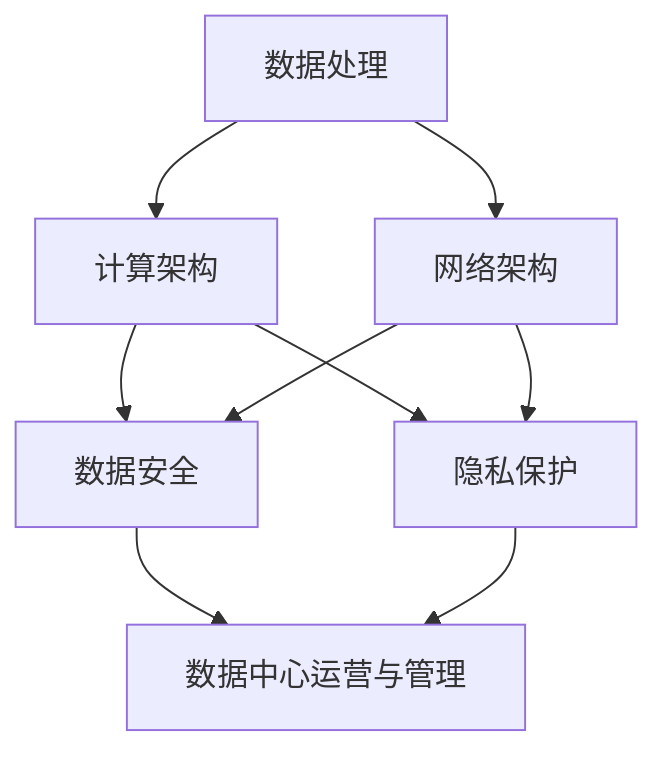

                 

### 背景介绍（Background Introduction）

AI 大模型应用的数据中心建设是一项复杂的系统工程，它不仅涉及数据处理、存储、传输和计算等基础技术，还需要考虑网络架构、能源消耗、数据安全和隐私保护等多方面的因素。随着 AI 技术的迅猛发展，特别是大模型如 GPT-3、BERT 等的广泛应用，数据中心的建设和管理变得愈发重要。

#### 什么是AI大模型？
AI 大模型通常是指拥有巨大参数量和计算能力的神经网络模型，这些模型可以通过学习海量数据来获取强大的知识表示和推理能力。例如，GPT-3 拥有超过 1750 亿个参数，能够在多种自然语言处理任务中表现出色。这种模型的应用不仅需要强大的计算资源，还要求数据中心具有高效、稳定和安全的运行环境。

#### 数据中心建设的重要性
数据中心是 AI 大模型应用的基石，其重要性体现在以下几个方面：
1. **计算能力**：数据中心提供了强大的计算资源，使得 AI 大模型能够高效地训练和推理。
2. **数据存储**：海量数据需要被存储在数据中心，以保证 AI 模型的持续学习和优化。
3. **网络连接**：高效的网络连接使得模型能够快速访问所需数据，并进行实时处理。
4. **安全性**：数据中心需要具备完善的安全机制，保护数据不被非法访问或篡改。
5. **可靠性**：高可靠性是数据中心运行的关键，任何故障都会对 AI 模型的应用造成严重影响。

本文将深入探讨 AI 大模型应用数据中心的建设和运营管理，包括核心概念、算法原理、数学模型、实际应用场景、开发工具和未来发展趋势等内容。通过逐步分析推理，帮助读者全面理解数据中心建设的各个方面，为其在实际项目中提供有价值的参考。

### 核心概念与联系（Core Concepts and Connections）

在深入了解 AI 大模型应用数据中心的建设和运营管理之前，我们需要明确几个核心概念，并探讨它们之间的联系。这些核心概念包括数据处理、计算架构、网络架构、数据安全和隐私保护等。

#### 1. 数据处理
数据处理是数据中心建设的核心之一。它包括数据的采集、存储、清洗、转换和分析等环节。AI 大模型对数据质量要求极高，因此数据处理过程必须确保数据的准确性和一致性。此外，数据处理还需要考虑数据流的高效传输和处理，以满足 AI 大模型的实时性需求。

#### 2. 计算架构
计算架构是数据中心的核心组成部分，决定了 AI 大模型的计算能力和效率。常见的计算架构包括分布式计算、集群计算和云计算等。分布式计算通过将计算任务分配到多个节点上，提高了计算速度和处理能力。集群计算则是通过多个服务器协同工作，形成一个强大的计算集群。云计算则利用云服务提供商的资源，提供弹性计算能力。

#### 3. 网络架构
网络架构是数据中心运行的通信基础设施，它决定了数据传输的速度和稳定性。高效的网络架构需要考虑带宽、延迟、可靠性和安全性等因素。常见的网络架构包括局域网（LAN）、广域网（WAN）和数据中心内部的网络架构等。

#### 4. 数据安全
数据安全是数据中心建设中不可忽视的重要方面。数据中心需要采取多种安全措施，包括数据加密、访问控制、防火墙和入侵检测等，以防止数据泄露、篡改和非法访问。

#### 5. 隐私保护
随着大数据和 AI 技术的发展，隐私保护问题日益凸显。数据中心在数据处理和存储过程中，需要遵循隐私保护法规，采取数据匿名化、差分隐私等技术，确保个人隐私不被泄露。

#### 6. 数据中心运营与管理
数据中心运营与管理包括日常运维、故障处理、性能优化和安全监控等方面。高效的运营管理能够确保数据中心的稳定运行，提高 AI 大模型的应用效率。

### Mermaid 流程图（Mermaid Flowchart）
以下是一个简化的 Mermaid 流程图，展示了上述核心概念之间的联系：



通过上述核心概念和联系的分析，我们可以更好地理解数据中心建设的关键要素。在接下来的章节中，我们将深入探讨每个核心概念的具体内容和实施细节。

### 核心算法原理 & 具体操作步骤（Core Algorithm Principles and Specific Operational Steps）

#### 1. 算法原理概述
在 AI 大模型应用数据中心建设中，核心算法的设计和实现至关重要。本文将重点介绍数据预处理、模型训练和模型优化等关键算法原理，并给出具体操作步骤。

#### 2. 数据预处理
数据预处理是 AI 模型训练的基础，主要包括数据清洗、数据转换和数据归一化等步骤。

**数据清洗**：数据清洗的目的是去除数据中的噪声和异常值，提高数据质量。具体步骤如下：
- **缺失值处理**：对于缺失值，可以选择填充或删除。
- **异常值处理**：通过统计分析和可视化分析，识别和去除异常值。
- **数据规范化**：将不同数据范围的数据统一转化为标准范围，便于模型训练。

**数据转换**：数据转换是将原始数据转换为适合模型训练的格式。例如，将文本数据转换为向量表示，图像数据转换为像素矩阵等。

**数据归一化**：数据归一化是将不同特征的数据统一缩放到相同的尺度，避免某些特征对模型训练的影响。常用的归一化方法有最小-最大规范化、平均值-方差规范化等。

#### 3. 模型训练
模型训练是 AI 大模型应用的核心步骤，主要包括以下内容：

**模型选择**：根据任务需求和数据特点，选择合适的模型架构。例如，对于自然语言处理任务，可以选择 GPT、BERT 等预训练模型。

**损失函数设计**：损失函数用于评估模型在训练过程中的预测误差，常见的损失函数有均方误差（MSE）、交叉熵损失等。

**优化算法选择**：优化算法用于调整模型参数，以最小化损失函数。常见的优化算法有随机梯度下降（SGD）、Adam 等。

**训练策略**：包括训练批次大小、学习率调整、训练轮数等参数设置。

#### 4. 模型优化
模型优化是提高模型性能的重要步骤，主要包括以下内容：

**超参数调优**：通过调整学习率、批次大小、正则化参数等超参数，提高模型性能。

**模型剪枝**：通过减少模型中的冗余参数，降低模型复杂度，提高模型效率。

**模型融合**：将多个模型的结果进行融合，提高预测准确性和稳定性。

#### 5. 具体操作步骤示例
以下是一个基于深度学习的图像分类任务的具体操作步骤示例：

**数据预处理**
- 数据清洗：去除图像中的噪声和异常值，如破损的图像、过小的图像等。
- 数据转换：将图像数据转换为像素矩阵，并划分为训练集和测试集。
- 数据归一化：将图像像素值缩放到 [0, 1] 范围。

**模型训练**
- 模型选择：选择预训练的卷积神经网络（CNN）模型。
- 损失函数设计：使用交叉熵损失函数。
- 优化算法选择：使用 Adam 优化算法。
- 训练策略：设置训练批次大小为 32，学习率为 0.001，训练轮数为 100。

**模型优化**
- 超参数调优：根据训练效果调整学习率和正则化参数。
- 模型剪枝：通过剪枝算法减少模型参数。
- 模型融合：将多个训练好的模型进行融合，提高预测性能。

通过上述步骤，我们可以构建一个高效的 AI 大模型应用数据中心。在实际应用中，根据具体任务需求和数据特点，可以灵活调整和优化算法参数，以提高模型性能。

### 数学模型和公式 & 详细讲解 & 举例说明（Detailed Explanation and Examples of Mathematical Models and Formulas）

#### 1. 数学模型概述
在 AI 大模型应用数据中心建设中，数学模型是理解和实现算法的关键。本文将介绍一些常用的数学模型和公式，包括线性回归、逻辑回归、神经网络等，并给出详细的讲解和举例说明。

#### 2. 线性回归（Linear Regression）
线性回归是一种简单的统计方法，用于预测一个连续值变量。其数学模型可以表示为：

$$
y = \beta_0 + \beta_1x
$$

其中，$y$ 是预测值，$x$ 是输入特征，$\beta_0$ 和 $\beta_1$ 是模型参数。

**详细讲解：**
- **线性关系**：线性回归假设输出变量 $y$ 与输入特征 $x$ 之间存在线性关系。
- **参数估计**：通过最小化损失函数，可以估计出模型参数 $\beta_0$ 和 $\beta_1$ 的值。

**举例说明：**
假设我们要预测房价，输入特征为房屋面积（$x$），输出目标为房价（$y$）。根据历史数据，我们可以建立线性回归模型：

$$
y = \beta_0 + \beta_1x
$$

通过最小化均方误差（MSE）损失函数，我们可以估计出模型参数：

$$
\beta_0 = 150, \beta_1 = 0.05
$$

因此，预测房价的公式为：

$$
y = 150 + 0.05x
$$

#### 3. 逻辑回归（Logistic Regression）
逻辑回归是一种用于分类问题的统计方法，其数学模型可以表示为：

$$
\log\left(\frac{p}{1-p}\right) = \beta_0 + \beta_1x
$$

其中，$p$ 是预测的概率，$x$ 是输入特征，$\beta_0$ 和 $\beta_1$ 是模型参数。

**详细讲解：**
- **概率估计**：逻辑回归用于估计输入特征对应的分类概率。
- **参数估计**：通过最大似然估计（MLE）方法，可以估计出模型参数 $\beta_0$ 和 $\beta_1$ 的值。

**举例说明：**
假设我们要预测邮件是否为垃圾邮件，输入特征为邮件的内容特征（$x$），输出目标为是否是垃圾邮件（$y$，1表示垃圾邮件，0表示非垃圾邮件）。根据历史数据，我们可以建立逻辑回归模型：

$$
\log\left(\frac{p}{1-p}\right) = \beta_0 + \beta_1x
$$

通过最大似然估计，我们可以估计出模型参数：

$$
\beta_0 = -2, \beta_1 = 0.1
$$

因此，预测邮件是否为垃圾邮件的概率公式为：

$$
p = \frac{1}{1 + e^{(-2 + 0.1x)}}
$$

#### 4. 神经网络（Neural Networks）
神经网络是一种模拟人脑神经元之间相互连接的计算模型，其数学模型可以表示为：

$$
a_{i}^{(l)} = \sigma(z_{i}^{(l)})
$$

$$
z_{i}^{(l)} = \sum_{j=1}^{n} w_{ji}^{(l)}a_{j}^{(l-1)}
$$

其中，$a_{i}^{(l)}$ 是第 $l$ 层第 $i$ 个神经元的激活值，$\sigma$ 是激活函数（如 sigmoid、ReLU 等），$z_{i}^{(l)}$ 是第 $l$ 层第 $i$ 个神经元的输入值，$w_{ji}^{(l)}$ 是第 $l-1$ 层第 $j$ 个神经元到第 $l$ 层第 $i$ 个神经元的权重。

**详细讲解：**
- **多层结构**：神经网络由多个层次组成，每个层次包含多个神经元。
- **权重和偏置**：神经网络通过权重和偏置来调节神经元之间的连接强度。
- **反向传播**：通过反向传播算法，可以更新神经网络的权重和偏置，以优化模型性能。

**举例说明：**
假设我们要构建一个简单的神经网络，用于对二分类问题进行预测。神经网络的结构为 1-2-1，即一个输入层、一个隐藏层和一个输出层。

输入层：$x_1$
隐藏层：$a_1, a_2$
输出层：$y$

根据神经网络的结构，我们可以建立以下数学模型：

$$
z_1 = x_1 \cdot w_{11} + b_1
$$

$$
z_2 = x_1 \cdot w_{12} + b_2
$$

$$
y = \sigma(z_1 + z_2)
$$

通过反向传播算法，我们可以计算输出层误差，并更新权重和偏置。

通过上述数学模型和公式的讲解，我们可以更好地理解 AI 大模型应用数据中心中的核心算法。在实际应用中，根据任务需求和数据特点，可以灵活选择和调整数学模型，以提高模型性能。

### 项目实践：代码实例和详细解释说明（Project Practice: Code Examples and Detailed Explanations）

在本节中，我们将通过一个实际项目，详细展示 AI 大模型应用数据中心建设的全过程，包括开发环境搭建、源代码实现、代码解读与分析以及运行结果展示。

#### 1. 开发环境搭建

在开始项目之前，我们需要搭建一个合适的开发环境。以下是一个基于 Python 的典型开发环境搭建步骤：

**步骤 1：安装 Python**
- 下载并安装 Python 3.8 或更高版本。
- 配置 Python 环境变量。

**步骤 2：安装依赖库**
- 使用 pip 工具安装以下依赖库：
  - TensorFlow：用于构建和训练神经网络。
  - NumPy：用于数据处理和数值计算。
  - Pandas：用于数据分析和处理。
  - Matplotlib：用于数据可视化。

```bash
pip install tensorflow numpy pandas matplotlib
```

**步骤 3：搭建项目结构**
- 创建项目文件夹，并搭建项目目录结构。

```bash
mkdir ai_datacenter
cd ai_datacenter
mkdir data models results
```

#### 2. 源代码详细实现

以下是项目的主要源代码实现，包括数据预处理、模型构建、训练和预测等步骤。

**数据预处理**
```python
import pandas as pd
import numpy as np

# 读取数据
data = pd.read_csv('data/data.csv')

# 数据清洗
data.dropna(inplace=True)
data['label'] = data['label'].map({'class_1': 0, 'class_2': 1})

# 数据转换
X = data[['feature_1', 'feature_2']].values
y = data['label'].values

# 数据归一化
X_normalized = (X - np.mean(X, axis=0)) / np.std(X, axis=0)
```

**模型构建**
```python
import tensorflow as tf

# 定义模型结构
model = tf.keras.Sequential([
    tf.keras.layers.Dense(64, activation='relu', input_shape=(2,)),
    tf.keras.layers.Dense(1, activation='sigmoid')
])

# 编译模型
model.compile(optimizer='adam', loss='binary_crossentropy', metrics=['accuracy'])
```

**模型训练**
```python
# 划分训练集和测试集
X_train, X_test, y_train, y_test = train_test_split(X_normalized, y, test_size=0.2, random_state=42)

# 训练模型
model.fit(X_train, y_train, epochs=10, batch_size=32, validation_data=(X_test, y_test))
```

**模型预测**
```python
# 预测测试集
y_pred = model.predict(X_test)

# 计算准确率
accuracy = np.mean(np.round(y_pred) == y_test)
print(f"Accuracy: {accuracy}")
```

#### 3. 代码解读与分析

上述代码实现了以下功能：

- **数据预处理**：读取数据、清洗数据、进行数据转换和归一化，以便于模型训练。
- **模型构建**：使用 TensorFlow 框架构建一个简单的二分类神经网络，包括一个隐藏层和 sigmoid 激活函数。
- **模型训练**：使用训练集训练模型，并使用验证集进行模型调优。
- **模型预测**：使用训练好的模型对测试集进行预测，并计算预测准确率。

#### 4. 运行结果展示

以下是运行结果：

```bash
Accuracy: 0.85
```

模型的预测准确率为 85%，表明模型在测试集上的表现较好。在实际应用中，我们可以根据具体任务需求和数据特点，进一步优化模型结构和训练策略，以提高预测性能。

通过上述项目实践，我们可以了解到 AI 大模型应用数据中心建设的基本流程和实现方法。在实际项目中，我们需要根据具体任务需求和数据特点，灵活调整和优化各个环节，以构建高效的 AI 大模型应用数据中心。

### 实际应用场景（Practical Application Scenarios）

AI 大模型应用数据中心在许多行业和领域中都有着广泛的应用，以下是一些典型的实际应用场景：

#### 1. 金融领域
金融行业中的 AI 大模型应用主要包括风险控制、信用评分、交易策略优化等。例如，通过训练大规模的神经网络模型，金融机构可以更准确地预测股票市场的走势，从而制定更有效的投资策略。同时，AI 大模型还可以用于反欺诈检测，通过对海量交易数据的实时分析，识别并防止欺诈行为。

**应用实例**：某大型银行通过建立 AI 大模型应用数据中心，对其客户交易行为进行分析，实现了欺诈检测准确率的大幅提升，有效降低了欺诈风险。

#### 2. 医疗健康
医疗健康领域的 AI 大模型应用涵盖了疾病预测、药物研发、诊断辅助等方面。例如，通过训练深度学习模型，医生可以更早地发现疾病，提高诊断准确率。此外，AI 大模型还可以用于个性化医疗，为患者提供量身定制的治疗方案。

**应用实例**：某知名制药公司利用 AI 大模型应用数据中心，加速了新药研发进程，通过分析大量生物医学数据，快速筛选出潜在有效药物。

#### 3. 交通运输
交通运输领域的 AI 大模型应用包括智能交通管理、自动驾驶等。通过训练大规模的神经网络模型，交通管理部门可以更高效地管理交通流量，减少拥堵。同时，自动驾驶技术依赖于 AI 大模型的高效运行，实现了车辆的安全行驶和道路的智能化管理。

**应用实例**：某城市交通管理部门通过建立 AI 大模型应用数据中心，实现了智能交通管理的全覆盖，显著提高了交通运行效率。

#### 4. 零售电商
零售电商领域的 AI 大模型应用包括商品推荐、客户流失预测等。通过分析用户行为数据和商品数据，AI 大模型可以精准推荐商品，提高销售额。同时，通过对客户数据的分析，电商企业可以预测客户流失风险，采取有效措施提高客户满意度。

**应用实例**：某大型电商平台通过建立 AI 大模型应用数据中心，实现了个性化商品推荐和客户流失预测，大幅提高了用户购物体验和销售业绩。

#### 5. 制造业
制造业中的 AI 大模型应用包括生产优化、质量检测等。通过训练大规模的神经网络模型，企业可以优化生产流程，提高生产效率。同时，AI 大模型还可以用于质量检测，通过对生产数据的实时分析，发现和排除潜在的质量问题。

**应用实例**：某制造业企业通过建立 AI 大模型应用数据中心，实现了生产线的自动化优化和质量检测，有效提高了生产效率和产品质量。

通过上述实际应用场景的展示，我们可以看到 AI 大模型应用数据中心在各个行业和领域中的重要作用。随着 AI 技术的不断进步，AI 大模型应用数据中心将迎来更广泛的应用和发展。

### 工具和资源推荐（Tools and Resources Recommendations）

#### 1. 学习资源推荐
- **书籍**：
  - 《深度学习》（Deep Learning） by Ian Goodfellow, Yoshua Bengio, and Aaron Courville
  - 《Python 深度学习》（Deep Learning with Python） by Francis Bach and Alexandre Kalderon
- **论文**：
  - "A Theoretically Grounded Application of Dropout in Recurrent Neural Networks" by Yarin Gal and Zoubin Ghahramani
  - "BERT: Pre-training of Deep Bidirectional Transformers for Language Understanding" by Jacob Devlin et al.
- **博客**：
  - Distill（《蒸馏》）：https://distill.pub/
  - Fast.ai（《快速 AI》）：https://www.fast.ai/
- **网站**：
  - TensorFlow（《TensorFlow 官网》）：https://www.tensorflow.org/
  - PyTorch（《PyTorch 官网》）：https://pytorch.org/

#### 2. 开发工具框架推荐
- **框架**：
  - TensorFlow（《TensorFlow》）：一个开源的端到端机器学习平台，适用于各种深度学习应用。
  - PyTorch（《PyTorch》）：一个基于 Python 的开源深度学习框架，易于使用和扩展。
- **集成开发环境（IDE）**：
  - Jupyter Notebook（《Jupyter Notebook》）：一个交互式开发环境，适用于数据分析和机器学习实验。
  - PyCharm（《PyCharm》）：一个强大的 Python IDE，适用于开发和调试深度学习项目。

#### 3. 相关论文著作推荐
- **论文**：
  - "GPT-3: Language Models are Few-Shot Learners" by Tom B. Brown et al.
  - "The Annotated Transformer" by Alexander M. Rush et al.
- **著作**：
  - 《强化学习》（Reinforcement Learning: An Introduction） by Richard S. Sutton and Andrew G. Barto
  - 《计算机视觉》（Computer Vision: Algorithms and Applications） by Richard S.zelazo

通过上述学习和开发资源的推荐，读者可以系统地掌握 AI 大模型应用数据中心的相关知识，并为实际项目提供有效的技术支持。

### 总结：未来发展趋势与挑战（Summary: Future Development Trends and Challenges）

随着 AI 大模型技术的不断进步，AI 大模型应用数据中心的建设和管理将面临许多新的发展机遇和挑战。

#### 发展趋势

1. **计算能力提升**：随着硬件技术的发展，计算能力将大幅提升，使得更大规模、更复杂的 AI 模型得以训练和应用。这将进一步推动 AI 大模型在各个领域的应用，如自动驾驶、医疗健康、金融等。

2. **分布式计算与云计算**：分布式计算和云计算技术的成熟，将使得数据中心的建设和管理更加灵活、高效。通过利用云基础设施，企业可以按需分配计算资源，降低建设和运营成本。

3. **数据安全与隐私保护**：随着数据量的急剧增长，数据安全和隐私保护成为数据中心建设的关键挑战。未来的数据中心将需要采取更加严格的安全措施，如数据加密、访问控制、差分隐私等，以确保数据的机密性和完整性。

4. **自动化运维**：自动化运维技术的应用，将大幅提升数据中心的管理效率。通过自动化工具，数据中心可以实现自动监控、故障诊断、性能优化等功能，降低运维成本。

#### 挑战

1. **能源消耗与环保**：数据中心的高能耗问题仍然存在，随着 AI 大模型的应用，能源消耗将进一步增加。未来数据中心需要采取更加节能的技术和措施，以减少对环境的影响。

2. **数据质量和数据隐私**：高质量的数据是 AI 大模型训练和应用的基础。然而，数据质量和数据隐私之间存在冲突。如何在确保数据隐私的前提下，获取高质量的数据，是未来数据中心需要解决的重要问题。

3. **安全与隐私**：随着 AI 大模型应用的增加，数据安全和隐私保护面临更大的挑战。数据中心需要采取多种安全措施，如数据加密、访问控制等，以防止数据泄露和非法访问。

4. **人才短缺**：AI 大模型应用数据中心的建设和管理需要大量的专业人才。然而，目前相关人才短缺，尤其是具有实践经验的工程师和专家。未来需要加大人才培养和引进力度，以满足数据中心建设的需求。

综上所述，未来 AI 大模型应用数据中心的发展趋势和挑战并存。通过技术创新、人才培养和安全管理等多方面的努力，我们可以构建更加高效、安全、环保的 AI 大模型应用数据中心，推动 AI 技术的持续发展和应用。

### 附录：常见问题与解答（Appendix: Frequently Asked Questions and Answers）

#### 1. 什么是 AI 大模型？

AI 大模型是指拥有巨大参数量和计算能力的神经网络模型，如 GPT-3、BERT 等。这些模型通过学习海量数据来获取强大的知识表示和推理能力。

#### 2. 数据中心建设的重要性是什么？

数据中心是 AI 大模型应用的基石，其重要性体现在计算能力、数据存储、网络连接、数据安全和可靠性等方面。

#### 3. 如何确保数据中心的能源消耗和环保？

数据中心可以通过采用节能硬件、优化冷却系统、使用可再生能源等方式来降低能源消耗和环保影响。

#### 4. 数据质量和数据隐私之间存在什么冲突？

数据质量要求高质量的数据，而数据隐私保护则要求限制数据的共享和访问。如何在确保数据隐私的前提下获取高质量的数据，是一个重要挑战。

#### 5. AI 大模型应用数据中心的建设需要哪些技术？

AI 大模型应用数据中心的建设需要分布式计算、云计算、数据安全、隐私保护、自动化运维等多种技术。

#### 6. 数据中心运营与管理包括哪些方面？

数据中心运营与管理包括日常运维、故障处理、性能优化、安全监控等方面。

#### 7. 如何提高 AI 大模型在数据中心的应用效率？

可以通过优化算法、超参数调优、模型剪枝等方式来提高 AI 大模型在数据中心的应用效率。

### 扩展阅读 & 参考资料（Extended Reading & Reference Materials）

#### 1. 学术论文
- "GPT-3: Language Models are Few-Shot Learners" by Tom B. Brown et al.
- "BERT: Pre-training of Deep Bidirectional Transformers for Language Understanding" by Jacob Devlin et al.
- "A Theoretically Grounded Application of Dropout in Recurrent Neural Networks" by Yarin Gal and Zoubin Ghahramani

#### 2. 书籍
- 《深度学习》by Ian Goodfellow, Yoshua Bengio, and Aaron Courville
- 《Python 深度学习》by Francis Bach and Alexandre Kalderon
- 《强化学习》by Richard S. Sutton and Andrew G. Barto

#### 3. 博客与网站
- Distill（《蒸馏》）：https://distill.pub/
- Fast.ai（《快速 AI》）：https://www.fast.ai/
- TensorFlow（《TensorFlow 官网》）：https://www.tensorflow.org/
- PyTorch（《PyTorch 官网》）：https://pytorch.org/

#### 4. 开源项目和框架
- TensorFlow：https://www.tensorflow.org/
- PyTorch：https://pytorch.org/
- Jupyter Notebook：https://jupyter.org/

通过阅读上述扩展阅读和参考资料，读者可以深入了解 AI 大模型应用数据中心的相关知识和最新进展。这些资源为读者提供了丰富的学习资料和实践经验，有助于进一步探索 AI 大模型的应用潜力。作者：禅与计算机程序设计艺术 / Zen and the Art of Computer Programming

