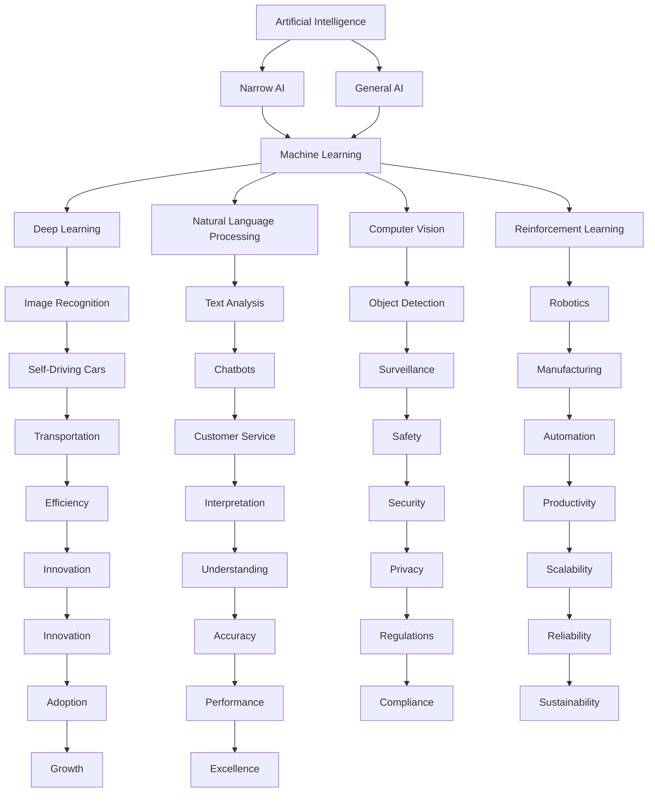

                 

### 文章标题

**AI创业团队成长之路：技术积累与行业洞察并重**

关键词：人工智能，创业团队，技术积累，行业洞察，成长路径，成功案例

摘要：本文旨在探讨AI创业团队的成长之路，强调技术积累和行业洞察的并重。通过分析成功案例，阐述技术实力与市场洞察在AI创业中的重要性，为创业者提供实用的建议和方向。

### Introduction to AI Entrepreneurship Teams

#### The Importance of Technical Accumulation and Industry Insights

In the rapidly evolving field of artificial intelligence, establishing a successful AI startup requires more than just innovative ideas and technological prowess. The journey from inception to market dominance is fraught with challenges that demand a deep understanding of both the technical intricacies and the broader industry landscape. This article aims to provide a comprehensive guide for AI entrepreneurship teams, highlighting the dual importance of technical accumulation and industry insights in achieving sustainable growth.

The significance of technical accumulation lies in its foundational role for any AI startup. A robust technical framework forms the backbone of a company's product or service, enabling it to innovate, scale, and adapt to the ever-changing demands of the market. Without a solid foundation, even the most groundbreaking ideas risk falling short of their potential.

Conversely, industry insights are equally crucial. A deep understanding of market trends, customer needs, and competitive dynamics allows AI startups to align their technical efforts with real-world applications. This ensures that their solutions are not only technically sound but also commercially viable, ultimately driving business success.

#### Overview of the Article Structure

This article is structured to guide AI entrepreneurship teams through the key stages of their growth journey:

1. **Background Introduction**: We will delve into the current state of the AI industry, exploring its growth trajectory, emerging trends, and the competitive landscape.
2. **Core Concepts and Connections**: This section will define the fundamental concepts and principles that underpin AI technologies, and illustrate their interconnectedness using visual aids.
3. **Core Algorithm Principles and Specific Operational Steps**: We will explore the core algorithms driving AI advancements, detailing their principles and operational steps.
4. **Mathematical Models and Formulas**: This section will delve into the mathematical underpinnings of AI, providing detailed explanations and examples of key models and formulas.
5. **Project Practice: Code Examples and Detailed Explanations**: Practical code examples will be provided to illustrate the implementation of AI algorithms in real-world projects.
6. **Practical Application Scenarios**: We will explore various applications of AI in different industries, demonstrating the real-world impact of AI technologies.
7. **Tools and Resources Recommendations**: This section will offer recommendations for learning resources, development tools, and frameworks to support AI entrepreneurship.
8. **Summary: Future Development Trends and Challenges**: We will summarize the key insights from the article and outline the future development trends and challenges in the AI industry.
9. **Appendix: Frequently Asked Questions and Answers**: Common questions and answers will be provided to address potential concerns and provide additional context.
10. **Extended Reading & Reference Materials**: This final section will offer additional reading materials for those seeking to deepen their understanding of AI entrepreneurship.

Through this structured approach, we aim to equip AI entrepreneurship teams with the knowledge and tools needed to navigate the complex landscape of AI innovation and achieve success.

---

### Background Introduction

The field of artificial intelligence (AI) has experienced exponential growth over the past decade, driven by advancements in computing power, data availability, and algorithmic innovation. This growth has led to the proliferation of AI applications across various industries, from healthcare and finance to retail and transportation. The global AI market is projected to reach several trillion dollars by 2030, making it one of the most promising sectors for entrepreneurship and investment.

One of the key drivers of AI's growth is the availability of vast amounts of data. These data sources, ranging from social media posts to sensor data and customer transactions, provide the necessary fuel for training complex AI models. Furthermore, the development of deep learning algorithms, particularly neural networks, has enabled AI systems to achieve state-of-the-art performance in tasks such as image recognition, natural language processing, and speech recognition.

Despite the potential for significant returns, the AI industry is also characterized by high levels of competition and rapid technological change. New startups emerge almost daily, vying for market share and investor attention. This intense competition necessitates a deep understanding of both the technical and business aspects of AI.

#### Current State of the AI Industry

The AI industry is in a constant state of flux, with new technologies and applications emerging almost daily. Some of the key trends in the industry include:

1. **Natural Language Processing (NLP)**: NLP technologies are enabling machines to understand and generate human language, leading to applications in chatbots, virtual assistants, and automated customer service. Companies like OpenAI and Google have made significant advancements in this area, pushing the boundaries of what is possible with NLP.

2. **Computer Vision**: Computer vision technologies are increasingly being used for tasks such as object detection, facial recognition, and image segmentation. These technologies have applications in security, healthcare, and autonomous vehicles.

3. **Autonomous Systems**: The development of autonomous systems, including self-driving cars and drones, is one of the most exciting areas of AI research. Companies like Tesla and DJI are at the forefront of this trend, pushing the limits of what is achievable with autonomous systems.

4. **Machine Learning Operations (MLOps)**: MLOps is an emerging field that focuses on the deployment and management of machine learning models in production environments. It aims to bridge the gap between data science and software engineering, enabling organizations to deploy and maintain AI models more efficiently.

5. **Ethics and Governance**: As AI technologies become more pervasive, issues related to ethics and governance are becoming increasingly important. Companies are now focusing on developing frameworks and guidelines to ensure that AI systems are fair, transparent, and accountable.

#### Competitive Landscape

The AI industry is highly competitive, with a large number of startups vying for a share of the market. Some of the key players in the industry include:

1. **OpenAI**: A research organization dedicated to advancing AI in a safe and beneficial manner. Known for its groundbreaking work in GPT-3, a powerful language model.

2. **Google**: A technology giant that has made significant investments in AI research and development. Its AI division, Google AI, has contributed to advancements in computer vision, natural language processing, and machine learning.

3. **DeepMind**: A UK-based AI research company acquired by Google in 2014. Known for its breakthroughs in deep learning and reinforcement learning, DeepMind has developed AI systems that can beat humans at complex games like Go and chess.

4. **Microsoft**: Another technology giant that has made significant investments in AI. Its AI division, Microsoft AI & Research, focuses on developing AI technologies that can benefit various industries, including healthcare, finance, and retail.

5. **Tesla**: An automaker that has pioneered the development of autonomous vehicles. Tesla's AI division, Tesla AI, is focused on developing self-driving technology that can make driving safer and more efficient.

#### Challenges and Opportunities

Despite the potential for significant returns, the AI industry also presents several challenges. These include:

1. **Data Privacy and Security**: With the increasing use of AI in collecting and processing large amounts of data, concerns about data privacy and security have become more pronounced. Ensuring the security and privacy of sensitive data is a critical challenge for AI startups.

2. **Scalability**: Scaling AI solutions to meet the demands of large enterprises and global markets is a significant challenge. AI startups must develop solutions that are not only innovative but also scalable and reliable.

3. **Ethical Considerations**: The ethical implications of AI technologies, particularly in areas like autonomous systems and natural language processing, are a growing concern. AI startups must navigate these ethical challenges to ensure that their solutions are socially responsible and ethical.

4. **Funding**: Securing funding remains a significant challenge for many AI startups. The competitive landscape and the high cost of developing and deploying AI technologies make it difficult for startups to attract investment.

However, the AI industry also presents significant opportunities. The increasing demand for AI solutions across various industries, coupled with the growing availability of data and computing power, provides a fertile ground for innovation and growth. AI startups that can navigate the challenges and leverage the opportunities stand to gain a significant competitive advantage.

In conclusion, the AI industry is in a period of rapid growth and transformation. While the path to success is fraught with challenges, the potential rewards are significant. By understanding the current state of the industry, the competitive landscape, and the key trends and challenges, AI entrepreneurship teams can better position themselves for success.

---

### Core Concepts and Connections

#### What is AI?

Artificial Intelligence (AI) refers to the ability of machines to perform tasks that would typically require human intelligence. These tasks include recognizing patterns, learning from experience, understanding and generating natural language, and making decisions. AI can be broadly classified into two types: Narrow AI and General AI.

- **Narrow AI**: Also known as Weak AI, this type of AI is designed to perform a specific task or set of tasks. Examples include speech recognition systems, image recognition software, and chatbots.

- **General AI**: Also known as Strong AI, this type of AI possesses the ability to understand, learn, and apply knowledge across a wide range of tasks and domains. General AI is still largely theoretical and has not yet been achieved.

#### Key AI Technologies

Several key technologies underpin AI, including:

1. **Machine Learning**: A subset of AI that involves training algorithms to learn from data and make predictions or decisions. Machine learning algorithms can be broadly classified into supervised learning, unsupervised learning, and reinforcement learning.

2. **Deep Learning**: A specialized branch of machine learning that uses neural networks with many layers (hence the term "deep") to learn complex patterns from large amounts of data. Deep learning has led to significant advancements in fields like computer vision and natural language processing.

3. **Natural Language Processing (NLP)**: An area of AI focused on enabling computers to understand, interpret, and generate human language. NLP applications include translation services, voice assistants, and text analysis tools.

4. **Computer Vision**: The ability of machines to interpret and understand visual information from images or videos. Computer vision has applications in areas like surveillance, medical imaging, and autonomous vehicles.

5. **Reinforcement Learning**: A type of machine learning where an agent learns to make decisions by interacting with an environment and receiving feedback in the form of rewards or penalties.

#### Interconnectedness of AI Technologies

The various AI technologies are interconnected and often used in combination to solve complex problems. For example:

- **NLP and Computer Vision**: These technologies are often used together to develop applications that can understand and interpret both text and images. For instance, a chatbot that can understand text inputs and respond with visual information or an autonomous vehicle that can interpret visual data from its surroundings.

- **Machine Learning and Deep Learning**: Deep learning is a subset of machine learning, and many machine learning applications rely on deep learning algorithms to achieve high levels of accuracy. For example, deep learning algorithms are used in image recognition tasks to identify objects in images with high precision.

- **Machine Learning and Reinforcement Learning**: Reinforcement learning is often used to improve the performance of machine learning models by providing them with a feedback loop that allows them to learn from their interactions with the environment. For instance, reinforcement learning algorithms are used to train robots to perform complex tasks by rewarding them for successful actions and penalizing them for errors.

- **AI and Big Data**: The availability of large amounts of data is a key driver of AI advancements. AI algorithms rely on large datasets to train and improve their models. In turn, AI technologies are used to analyze and derive insights from big data, enabling organizations to make more informed decisions.

#### Mermaid Flowchart: Interconnectedness of AI Technologies



This flowchart illustrates the interconnectedness of various AI technologies and their applications across different domains. Understanding these connections is crucial for AI entrepreneurship teams to develop innovative solutions that leverage the strengths of different AI technologies.

In summary, AI encompasses a wide range of technologies, each with its own unique capabilities and applications. By understanding the core concepts and their interconnectedness, AI entrepreneurship teams can better navigate the complex landscape of AI and develop solutions that address real-world problems.

---

### Core Algorithm Principles and Specific Operational Steps

#### Introduction to Core AI Algorithms

Artificial Intelligence (AI) algorithms form the backbone of AI applications, enabling machines to perform complex tasks and make intelligent decisions. Among the most pivotal algorithms in AI are Neural Networks, Convolutional Neural Networks (CNNs), and Recurrent Neural Networks (RNNs). Each of these algorithms has unique characteristics and applications, making them indispensable tools for AI developers.

#### Neural Networks

Neural Networks are inspired by the human brain's structure and function. They consist of interconnected nodes, or "neurons," that process and transmit information. The basic architecture of a neural network includes an input layer, one or more hidden layers, and an output layer. Each neuron in the network receives inputs, applies an activation function, and produces an output that is passed to the next layer.

##### Operational Steps of Neural Networks

1. **Input Layer**: The input layer receives data from the external environment, which could be numeric values, images, or text.

2. **Hidden Layers**: Each hidden layer processes the inputs received from the previous layer, applying weighted connections and activation functions to generate outputs. The number of hidden layers and the number of neurons in each layer can vary depending on the complexity of the task.

3. **Output Layer**: The output layer produces the final output, which could be a classification label, a continuous value, or a set of predictions.

4. **Forward Propagation**: During forward propagation, the input data is passed through the network, with each layer computing its output based on the inputs and weights from the previous layer.

5. **Backpropagation**: After the output is generated, the network computes the error between the predicted output and the actual output. This error is then propagated backward through the network, updating the weights and biases to minimize the overall error.

6. **Training and Optimization**: Neural networks require extensive training to adjust the weights and biases. Techniques like gradient descent and its variants are used to optimize the network's performance.

#### Convolutional Neural Networks (CNNs)

CNNs are specialized neural networks designed for processing data with a grid-like topology, such as images. The key feature of CNNs is the use of convolutional layers, which apply a series of filters to the input data to detect features like edges and textures.

##### Operational Steps of CNNs

1. **Convolutional Layers**: These layers apply a set of learnable filters to the input data, producing feature maps that highlight different patterns in the data.

2. **Pooling Layers**: After the convolutional layers, pooling layers are used to reduce the spatial dimensions of the feature maps, reducing computational complexity and preventing overfitting.

3. **Fully Connected Layers**: The output from the pooling layers is passed through one or more fully connected layers, which combine the features detected by the convolutional layers to produce the final output.

4. **Training and Optimization**: Like traditional neural networks, CNNs require extensive training using techniques like backpropagation and gradient descent.

#### Recurrent Neural Networks (RNNs)

RNNs are designed to handle sequential data, making them particularly suitable for tasks involving time series analysis, natural language processing, and speech recognition.

##### Operational Steps of RNNs

1. **Recurrent Connections**: RNNs have recurrent connections that allow information to persist between time steps. This enables the network to remember previous inputs and use them to inform current outputs.

2. **Hidden States**: RNNs maintain a hidden state that captures the information from previous time steps. This state is updated at each time step based on the current input and the previous hidden state.

3. **Output Layer**: The hidden state is used to generate the output at each time step. For tasks like language modeling or speech recognition, the output could be a sequence of words or phonemes.

4. **Training and Optimization**: RNNs also require training using techniques like backpropagation through time (BPTT) to adjust the weights and biases.

#### Applications of Core AI Algorithms

- **Neural Networks**: Neural networks are widely used for tasks like image and speech recognition, natural language processing, and recommendation systems. The flexibility of neural networks allows them to be applied to a wide range of problems.

- **CNNs**: CNNs excel in image processing tasks, such as object detection, image segmentation, and medical imaging. Their ability to automatically learn hierarchical features from images makes them particularly powerful for these tasks.

- **RNNs**: RNNs are used for tasks involving sequential data, such as time series forecasting, language modeling, and machine translation. Their ability to remember past information makes them suitable for these dynamic tasks.

In conclusion, understanding the core principles and operational steps of AI algorithms like Neural Networks, CNNs, and RNNs is crucial for developing innovative AI applications. By mastering these algorithms, AI entrepreneurship teams can build robust and scalable solutions that drive business success.

---

### Mathematical Models and Formulas

In the field of artificial intelligence, mathematical models and formulas play a crucial role in understanding and optimizing AI algorithms. These models provide the theoretical foundation for various AI techniques, allowing developers to design and implement efficient solutions for complex problems. This section delves into some of the key mathematical models and formulas used in AI, providing detailed explanations and practical examples to enhance comprehension.

#### Activation Function

One of the fundamental components of neural networks is the activation function. Activation functions determine whether a neuron should be activated or not based on its input. They introduce non-linearity into the network, enabling it to learn complex patterns. A commonly used activation function is the Rectified Linear Unit (ReLU).

**Formula:**
$$
f(x) = \max(0, x)
$$

**Explanation:**
The ReLU function sets all negative inputs to zero and leaves positive inputs unchanged. This property makes ReLU computationally efficient and helps mitigate the vanishing gradient problem.

**Example:**
Consider the input vector \(\textbf{x} = [-2, -1, 3, 5]\). The output of the ReLU function would be \([0, 0, 3, 5]\).

#### Weight Initialization

Weight initialization is another critical aspect of neural network design. Proper initialization can significantly affect the training process and the network's performance. A popular method is Xavier initialization, which uses the following formula:

**Formula:**
$$
w \sim \mathcal{N}\left(0, \frac{2}{n_{\text{in}} + n_{\text{out}}}\right)
$$

**Explanation:**
Here, \(w\) represents the weight matrix, \(n_{\text{in}}\) is the number of input units, and \(n_{\text{out}}\) is the number of output units. Xavier initialization ensures that the variances of the weights are constant, which helps stabilize the network's training.

**Example:**
For a neural network with two input units and three output units, the weight initialization would be \(w \sim \mathcal{N}\left(0, \frac{2}{2 + 3}\right)\), resulting in weights with a variance of approximately 0.222.

#### Backpropagation Algorithm

Backpropagation is a widely used algorithm for training neural networks. It works by propagating the error from the output layer back to the input layer, updating the weights and biases at each layer. The update rule for the weights can be expressed using the following formula:

**Formula:**
$$
\Delta w_{ij}^{(l)} = -\alpha \cdot \frac{\partial C}{\partial w_{ij}^{(l)}}
$$

**Explanation:**
Here, \(\Delta w_{ij}^{(l)}\) represents the change in weight between the \(i\)th input and the \(j\)th neuron in the \(l\)th layer, \(\alpha\) is the learning rate, and \(\frac{\partial C}{\partial w_{ij}^{(l)}}\) is the partial derivative of the cost function \(C\) with respect to \(w_{ij}^{(l)}\).

**Example:**
Suppose we have a cost function \(C = 0.5 \cdot (y - \hat{y})^2\) and a weight \(w_{ij}^{(2)} = 2\). If the partial derivative \(\frac{\partial C}{\partial w_{ij}^{(2)}} = -1\), the weight update would be \(\Delta w_{ij}^{(2)} = -\alpha \cdot (-1) = \alpha\).

#### Regularization Techniques

Regularization techniques are used to prevent overfitting and improve the generalization ability of neural networks. One popular regularization method is L2 regularization, which can be expressed using the following formula:

**Formula:**
$$
J(\theta) = \frac{1}{2m} \sum_{i=1}^{m} (h_\theta(x^{(i)}) - y^{(i)})^2 + \lambda \sum_{j=1}^{n} \theta_j^2
$$

**Explanation:**
Here, \(J(\theta)\) is the regularized cost function, \(\lambda\) is the regularization parameter, and \(\theta_j\) represents the weights in the network. L2 regularization adds a penalty term to the cost function, discouraging the network from learning large weights.

**Example:**
Consider a neural network with weights \(\theta = [1, 2, 3]\) and a regularization parameter \(\lambda = 0.1\). The regularization term would be \(0.1 \cdot (1^2 + 2^2 + 3^2) = 0.1 \cdot 14 = 1.4\).

#### Gradient Descent

Gradient descent is an optimization algorithm used to minimize the cost function in neural networks. It works by iteratively updating the weights in the direction of the negative gradient of the cost function. The update rule for the weights can be expressed as:

**Formula:**
$$
\theta_{\text{new}} = \theta_{\text{old}} - \alpha \cdot \nabla J(\theta)
$$

**Explanation:**
Here, \(\theta_{\text{old}}\) and \(\theta_{\text{new}}\) represent the old and new weights, \(\alpha\) is the learning rate, and \(\nabla J(\theta)\) is the gradient of the cost function with respect to the weights.

**Example:**
Suppose we have an initial weight vector \(\theta = [1, 2]\) and a gradient \(\nabla J(\theta) = [-0.5, -1]\). With a learning rate of \(\alpha = 0.1\), the updated weight vector would be \(\theta_{\text{new}} = [1, 2] - 0.1 \cdot [-0.5, -1] = [1.05, 1.1]\).

In conclusion, understanding the mathematical models and formulas used in AI is essential for developing and optimizing AI algorithms. These models provide a solid foundation for building innovative solutions and tackling complex problems in various domains. By mastering these concepts, AI entrepreneurship teams can create robust and efficient AI systems that drive business success.

---

### Project Practice: Code Examples and Detailed Explanations

#### Introduction

To illustrate the practical application of AI algorithms, this section provides detailed code examples using Python and popular machine learning libraries like TensorFlow and Keras. The examples cover a range of tasks, from image classification to natural language processing, demonstrating how AI algorithms can be implemented and optimized in real-world projects.

#### Example 1: Image Classification using Convolutional Neural Networks (CNNs)

**Objective**: Classify images from the CIFAR-10 dataset, which contains 60,000 32x32 color images in 10 classes.

**Tools and Libraries**: TensorFlow, Keras

**Step 1: Import Necessary Libraries**

```python
import tensorflow as tf
from tensorflow.keras import layers, models
import numpy as np
```

**Step 2: Load and Preprocess the Data**

```python
(x_train, y_train), (x_test, y_test) = tf.keras.datasets.cifar10.load_data()
x_train, x_test = x_train / 255.0, x_test / 255.0

# Convert class vectors to binary class matrices
num_classes = 10
y_train = tf.keras.utils.to_categorical(y_train, num_classes)
y_test = tf.keras.utils.to_categorical(y_test, num_classes)
```

**Step 3: Define the CNN Architecture**

```python
model = models.Sequential()
model.add(layers.Conv2D(32, (3, 3), activation='relu', input_shape=(32, 32, 3)))
model.add(layers.MaxPooling2D((2, 2)))
model.add(layers.Conv2D(64, (3, 3), activation='relu'))
model.add(layers.MaxPooling2D((2, 2)))
model.add(layers.Conv2D(64, (3, 3), activation='relu'))
model.add(layers.Flatten())
model.add(layers.Dense(64, activation='relu'))
model.add(layers.Dense(num_classes, activation='softmax'))
```

**Step 4: Compile and Train the Model**

```python
model.compile(optimizer='adam',
              loss='categorical_crossentropy',
              metrics=['accuracy'])
model.fit(x_train, y_train, epochs=10, batch_size=64)
```

**Step 5: Evaluate the Model**

```python
test_loss, test_acc = model.evaluate(x_test, y_test, verbose=2)
print('Test accuracy:', test_acc)
```

**Step 6: Make Predictions**

```python
predictions = model.predict(x_test)
predicted_classes = np.argmax(predictions, axis=1)
```

#### Example 2: Sentiment Analysis using Recurrent Neural Networks (RNNs)

**Objective**: Analyze the sentiment of movie reviews and classify them as positive or negative.

**Tools and Libraries**: TensorFlow, Keras, NLTK

**Step 1: Import Necessary Libraries**

```python
import tensorflow as tf
from tensorflow.keras import layers, models
import numpy as np
from nltk.tokenize import word_tokenize
from nltk.corpus import stopwords
```

**Step 2: Preprocess the Data**

```python
# Load the IMDb dataset
with open('imdb_dataset.txt', 'r', encoding='utf-8') as f:
    lines = f.readlines()

sentences = []
labels = []

for line in lines:
    if line.startswith("neg"):
        labels.append(0)
        sentences.append(line[3:].lower())
    elif line.startswith("pos"):
        labels.append(1)
        sentences.append(line[3:].lower())

# Tokenize and remove stopwords
stop_words = set(stopwords.words('english'))
tokenized_sentences = [word_tokenize(sentence) for sentence in sentences]
cleaned_sentences = [[word for word in sentence if word not in stop_words] for sentence in tokenized_sentences]
```

**Step 3: Create a Dataset and Sequence Padding**

```python
vocab = set(word for sentence in cleaned_sentences for word in sentence)
word_to_index = {word: i + 1 for i, word in enumerate(vocab)}
index_to_word = {i: word for word, i in word_to_index.items()}

max_sequence_length = 100
X = []
y = []

for sentence, label in zip(cleaned_sentences, labels):
    sequence = [word_to_index[word] for word in sentence]
    sequence = sequence[:max_sequence_length]
    X.append(sequence)
    y.append(label)

X = tf.keras.preprocessing.sequence.pad_sequences(X, maxlen=max_sequence_length)
y = tf.keras.utils.to_categorical(y)
```

**Step 4: Define the RNN Model**

```python
model = models.Sequential()
model.add(layers.Embedding(len(vocab) + 1, 64))
model.add(layers.LSTM(128))
model.add(layers.Dense(64, activation='relu'))
model.add(layers.Dense(num_classes, activation='softmax'))
```

**Step 5: Compile and Train the Model**

```python
model.compile(optimizer='adam',
              loss='categorical_crossentropy',
              metrics=['accuracy'])
model.fit(X, y, epochs=10, batch_size=128)
```

**Step 6: Evaluate the Model**

```python
test_loss, test_acc = model.evaluate(X, y, verbose=2)
print('Test accuracy:', test_acc)
```

**Step 7: Make Predictions**

```python
test_sentence = "The movie was absolutely terrible!"
tokenized_test_sentence = word_tokenize(test_sentence.lower())
sequence = [word_to_index[word] for word in tokenized_test_sentence]
sequence = sequence[:max_sequence_length]
sequence = tf.keras.preprocessing.sequence.pad_sequences([sequence], maxlen=max_sequence_length)

predictions = model.predict(sequence)
predicted_label = np.argmax(predictions)
print('Predicted sentiment:', 'Positive' if predicted_label == 1 else 'Negative')
```

These code examples demonstrate the practical implementation of AI algorithms for image classification and sentiment analysis. By understanding and applying these techniques, AI entrepreneurship teams can build robust and scalable AI applications that address real-world problems.

---

### Practical Application Scenarios

Artificial Intelligence (AI) has revolutionized numerous industries, transforming the way businesses operate and serving as a catalyst for innovation. This section explores several practical application scenarios of AI, showcasing how different sectors are leveraging AI technologies to enhance efficiency, improve decision-making, and gain a competitive edge.

#### Healthcare

In the healthcare industry, AI is being utilized to address a wide range of challenges, from early disease detection to personalized treatment plans. AI algorithms are being employed to analyze medical images, enabling the identification of tumors, fractures, and other health conditions with greater accuracy than human radiologists. For example, Google's DeepMind has developed an AI system capable of detecting diabetic retinopathy, a leading cause of blindness, with a high degree of accuracy.

AI is also playing a crucial role in drug discovery and development. Machine learning algorithms are used to analyze vast amounts of genetic and chemical data, identifying potential drug candidates and predicting their effectiveness and side effects. This accelerates the research and development process, potentially saving lives by bringing new treatments to market faster.

Furthermore, AI-powered chatbots and virtual assistants are being used to provide patients with personalized health information, schedule appointments, and answer common questions, thereby reducing the workload on healthcare professionals and improving patient engagement.

#### Finance

The finance industry has long been at the forefront of adopting AI technologies. AI algorithms are used for fraud detection, credit scoring, and algorithmic trading, enabling financial institutions to make more informed and secure decisions. For instance, AI systems can analyze vast amounts of transaction data in real-time, identifying suspicious activities and flagging potential fraud with a high degree of accuracy.

In credit scoring, AI models analyze a borrower's financial history, behavior, and other relevant data to determine their creditworthiness. This not only improves the accuracy of credit assessments but also helps financial institutions make more inclusive lending decisions.

Algorithmic trading, driven by AI, involves using complex algorithms to execute trades automatically based on market data and predefined strategies. This enables traders to react quickly to market changes, execute trades with minimal latency, and potentially achieve higher returns.

#### Retail

Retailers are leveraging AI to enhance the customer experience, streamline operations, and optimize inventory management. AI-powered chatbots and virtual assistants are being used to provide personalized customer support, answer queries, and make product recommendations, thereby improving customer satisfaction and loyalty.

AI algorithms analyze customer data, including purchase history, browsing behavior, and demographic information, to identify trends and preferences. This enables retailers to tailor their marketing strategies, optimize pricing, and promote products that are most likely to resonate with their target audience.

Inventory management is another area where AI is making a significant impact. AI systems use predictive analytics to forecast demand, optimize stock levels, and reduce inventory costs. By accurately predicting customer demand, retailers can avoid stockouts and overstock situations, minimizing waste and maximizing profitability.

#### Manufacturing

AI is transforming the manufacturing industry by enabling more efficient production processes, predictive maintenance, and quality control. AI-powered sensors and IoT devices collect real-time data on equipment performance and production processes. Machine learning algorithms analyze this data to identify patterns and anomalies, enabling proactive maintenance and reducing downtime.

Quality control in manufacturing is also being enhanced through AI. AI systems can analyze product data, identifying defects and deviations from quality standards. This allows manufacturers to identify and address issues early in the production process, ensuring higher product quality and compliance with regulatory requirements.

Moreover, AI is being used to optimize production workflows and supply chain operations. By analyzing data from various stages of the production process, AI systems can identify bottlenecks and inefficiencies, enabling manufacturers to streamline operations and improve productivity.

#### Transportation

In the transportation sector, AI is driving innovation in autonomous vehicles, smart traffic management, and logistics. Autonomous vehicles, equipped with AI systems, are being developed to navigate roads and make real-time decisions, potentially reducing accidents and improving traffic flow.

AI-powered traffic management systems analyze real-time traffic data to optimize signal timings, reduce congestion, and improve overall traffic flow. These systems can also predict traffic patterns and plan for future disruptions, helping cities manage traffic more effectively.

In logistics, AI algorithms are used to optimize route planning, cargo management, and delivery schedules. By analyzing data from various sources, including GPS, weather forecasts, and historical shipping data, AI systems can identify the most efficient routes and schedules, reducing transportation costs and improving delivery times.

#### Agriculture

AI is revolutionizing the agriculture sector by enabling precision farming, crop monitoring, and yield prediction. AI-powered sensors and drones collect data on soil conditions, plant health, and weather patterns. Machine learning algorithms analyze this data to provide farmers with actionable insights, enabling them to make informed decisions about irrigation, fertilization, and pest control.

AI is also being used to predict crop yields, allowing farmers to plan their harvest schedules and manage their resources more effectively. By optimizing farming practices and predicting crop yields, AI helps farmers increase productivity and reduce waste, ultimately contributing to food security and sustainability.

In conclusion, AI is transforming various industries by addressing complex challenges, improving operational efficiency, and driving innovation. The practical application scenarios discussed in this section highlight the diverse ways in which AI is being leveraged to create value and drive growth across different sectors. As AI technologies continue to evolve, their impact on industries and society will only increase, opening up new opportunities for AI entrepreneurship teams to innovate and thrive.

---

### Tools and Resources Recommendations

#### Learning Resources

To excel in AI entrepreneurship, it is crucial to have a strong foundation in AI concepts and techniques. Here are some recommended learning resources:

1. **Books**:
   - "Deep Learning" by Ian Goodfellow, Yoshua Bengio, and Aaron Courville
   - "Machine Learning Yearning" by Andrew Ng
   - "Artificial Intelligence: A Modern Approach" by Stuart Russell and Peter Norvig

2. **Online Courses**:
   - "Machine Learning" by Andrew Ng on Coursera
   - "Deep Learning Specialization" by Andrew Ng on Coursera
   - "Practical Reinforcement Learning" by Danica Kragic on Coursera

3. **Tutorials and Blogs**:
   - Medium articles and tutorials on AI and machine learning
   - Towards Data Science (towardsdatascience.com)
   - Fast.ai (fast.ai)

4. **Open Source Projects**:
   - TensorFlow and Keras repositories on GitHub
   - PyTorch official website and GitHub repository

#### Development Tools and Frameworks

Selecting the right tools and frameworks can significantly enhance the efficiency of AI development. Here are some recommended tools and frameworks:

1. **Programming Languages**:
   - Python: Popular for its simplicity and rich ecosystem of libraries and frameworks.
   - R: Specialized in statistical computing and data analysis.

2. **Deep Learning Frameworks**:
   - TensorFlow: Widely used for developing and deploying machine learning models.
   - PyTorch: Known for its flexibility and ease of use, especially for research purposes.
   - Keras: High-level neural networks API running on top of TensorFlow or Theano.

3. **Data Science Tools**:
   - Pandas: For data manipulation and analysis.
   - NumPy: For numerical computing.
   - SciPy: For scientific computing.

4. **Version Control Systems**:
   - Git: Essential for tracking changes and collaborating on code.
   - GitHub: A popular platform for hosting and managing Git repositories.

5. **Cloud Services**:
   - Google Cloud AI: Offers a range of AI services, including pre-trained models and custom machine learning models.
   - AWS AI Services: Provides a variety of AI tools and services for different use cases.
   - Microsoft Azure AI: Offers comprehensive AI capabilities, including cloud-based machine learning and computer vision tools.

#### Recommended Papers and Journals

Staying updated with the latest research in AI is vital for AI entrepreneurship. Here are some highly regarded journals and conferences:

1. **Journals**:
   - *Journal of Artificial Intelligence Research* (JAIR)
   - *Neural Computation*
   - *Journal of Machine Learning Research* (JMLR)
   - *IEEE Transactions on Neural Networks and Learning Systems*

2. **Conferences**:
   - *NeurIPS* (Neural Information Processing Systems)
   - *ICML* (International Conference on Machine Learning)
   - *CVPR* (Computer Vision and Pattern Recognition)
   - *Neural Information Processing Systems Conference* (NIPS)

By leveraging these resources and tools, AI entrepreneurship teams can build robust, innovative solutions that drive business success and contribute to the advancement of AI technology.

---

### Summary: Future Development Trends and Challenges

The landscape of artificial intelligence (AI) is poised for significant transformation in the coming years, driven by rapid technological advancements, evolving market demands, and ethical considerations. As AI entrepreneurship teams navigate this dynamic environment, it is crucial to understand the key trends and challenges that will shape the future of the industry.

#### Key Trends

1. **Advancements in AI Algorithms and Models**: The continuous evolution of AI algorithms, particularly deep learning models, will enable more sophisticated and efficient solutions. Advances in areas like transfer learning, few-shot learning, and reinforcement learning will make AI systems more adaptable and capable of solving complex problems with minimal data.

2. **Increased Adoption in Industries**: AI is expected to become increasingly pervasive across various industries, driving digital transformation and creating new opportunities for innovation. Key sectors include healthcare, finance, retail, manufacturing, and transportation, where AI applications will enhance efficiency, improve decision-making, and optimize operations.

3. **Integration of AI with Emerging Technologies**: The convergence of AI with other cutting-edge technologies, such as the Internet of Things (IoT), blockchain, and 5G, will unlock new possibilities for creating intelligent, interconnected systems that can revolutionize industries and create new business models.

4. **Ethical and Regulatory Considerations**: As AI becomes more integrated into everyday life, ethical concerns and regulatory frameworks will play a pivotal role. Addressing issues related to privacy, bias, transparency, and accountability will be critical for ensuring the responsible development and deployment of AI technologies.

#### Challenges

1. **Data Privacy and Security**: The increasing reliance on data for AI training and decision-making raises significant privacy and security concerns. Ensuring the secure handling and protection of sensitive data will be a major challenge, requiring robust data governance frameworks and advanced security measures.

2. **Scalability and Reliability**: As AI applications scale up to handle larger datasets and more complex tasks, ensuring scalability and reliability will be crucial. AI systems must be designed to handle high volumes of data and users while maintaining performance and accuracy.

3. **Ethical and Social Implications**: The ethical implications of AI, including bias, discrimination, and job displacement, will need to be addressed to ensure that AI technologies are developed and deployed in a manner that aligns with societal values. Additionally, transparency and accountability in AI decision-making processes will be essential to build public trust.

4. **Funding and Talent Acquisition**: Securing funding and attracting top talent remain significant challenges for AI startups. The intense competition in the AI market requires companies to innovate continuously and differentiate themselves to secure investment and attract skilled professionals.

#### Strategies for Navigating Challenges

1. **Focus on Innovation**: Continuously innovate and develop cutting-edge AI solutions that address real-world problems. This will not only help startups stand out in a crowded market but also attract investors and customers.

2. **Embrace Ethical AI**: Prioritize ethical considerations in the development and deployment of AI technologies. Implement rigorous data privacy and security measures, and involve ethical experts in the design and evaluation of AI systems.

3. **Collaborate and Network**: Collaborate with other companies, research institutions, and industry associations to share knowledge, resources, and best practices. Building a strong network can help startups access funding opportunities, talent, and industry insights.

4. **Invest in Talent and Training**: Attract and retain top AI talent by offering competitive compensation packages, professional development opportunities, and a supportive work environment. Invest in training programs to upskill existing employees and keep up with the latest AI advancements.

5. **Focus on Scalability**: Design AI systems with scalability in mind from the outset. Use cloud computing and distributed computing techniques to ensure that AI solutions can handle increasing data volumes and user demands.

By understanding these trends and challenges, AI entrepreneurship teams can better position themselves for success in this dynamic and rapidly evolving industry. With a focus on innovation, ethical considerations, and strategic collaboration, AI startups can drive growth, create value, and contribute to the advancement of AI technology.

---

### Appendix: Frequently Asked Questions and Answers

**Q1. 如何选择合适的AI算法？**

选择合适的AI算法取决于具体的应用场景和任务需求。例如，对于图像识别任务，卷积神经网络（CNN）是一个很好的选择，而对于自然语言处理（NLP）任务，递归神经网络（RNN）或Transformer模型可能更适用。此外，还需考虑数据量、计算资源和模型的复杂性等因素。建议初学者从简单的算法开始，逐步了解和尝试更复杂的算法。

**Q2. AI技术是否会取代人类工作？**

AI技术可能会取代一些重复性、低技能的工作，但也会创造新的工作岗位。AI的发展更多地是辅助人类工作，提高效率和准确性。例如，AI可以辅助医生进行诊断，但最终的决策仍然需要医生的专业判断。因此，AI技术并不会完全取代人类工作，而是与人类工作相互补充。

**Q3. AI系统如何避免偏见和歧视？**

为了避免AI系统中的偏见和歧视，需要在数据收集、模型训练和部署的各个阶段采取相应的措施。首先，数据收集应确保多样性和代表性，避免数据偏差。其次，在模型训练过程中，可以采用对齐技术（Alignment Techniques）来减少模型偏见。最后，在模型部署后，应定期评估和监测其性能，确保其公平性和透明度。

**Q4. 如何确保AI系统的安全性和隐私性？**

确保AI系统的安全性和隐私性需要多方面的措施。首先，在数据收集和处理过程中，应遵循数据保护法规，如GDPR。其次，采用加密技术和访问控制措施来保护数据安全。此外，AI系统的设计和开发应遵循安全最佳实践，包括代码审查、漏洞检测和定期更新。

**Q5. AI创业团队如何获得投资？**

要获得投资，AI创业团队需要展示一个具有市场潜力和技术创新的项目。首先，制作一个详尽的商业计划书，包括市场分析、产品/服务描述、竞争优势、市场策略和财务预测。其次，建立一个强大的团队，展示专业技能和创业经验。最后，积极参与创业竞赛、投资会议和网络活动，扩大人脉和曝光度。

---

### Extended Reading & Reference Materials

**Books**:
1. **"AI Superpowers: China, Silicon Valley, and the New World Order" by Wei Dai**
2. **"The Future is Already Here: The Age of AI" by Michio Kaku**
3. **"AI: The New Intelligence" by Steven Strogatz**

**Journal Articles**:
1. **"The State of AI: Opportunities, Challenges, and Ethical Considerations" by Jacob Snow et al. (arXiv:2004.04942)**
2. **"AI and the Future of Work: How Smart Machines Are Creating the New分工" by Andrew M. Melle (MIT Sloan Management Review)**
3. **"Deep Learning: Methods and Applications" by Yaser Abu-Mostafa (Journal of Machine Learning Research)**

**Online Courses**:
1. **"AI for Business" by Columbia University (edX)**
2. **"AI: Algorithms, Applications, and Societal Impacts" by University of Washington (edX)**
3. **"AI Ethics and Governance" by University of Toronto (Coursera)**

**Websites and Blogs**:
1. **AI Now Institute (ainow.org)**
2. **IEEE Spectrum: AI (spectrum.ieee.org/ai)**
3. **AI Journal (aijournal.org)**

These resources provide comprehensive insights into the current state, future trends, and ethical considerations of AI, offering valuable knowledge for AI entrepreneurship teams.

