                 

### 文章标题：Andrej Karpathy：人工智能的未来发展趋势

人工智能（AI）正迅速改变我们的世界，从医疗诊断到自动驾驶汽车，从智能家居到商业智能分析。作为这一领域的先驱，Andrej Karpathy的见解为我们提供了对AI未来发展趋势的深刻理解。本文将基于Andrej Karpathy的研究和演讲，探讨人工智能的几个关键方面，包括其技术进步、应用领域、伦理挑战和未来发展。

### Keywords: AI, Andrej Karpathy, Future Trends, Technology, Applications, Ethics

### Abstract: 
This article delves into the future of artificial intelligence as envisioned by Andrej Karpathy, a prominent figure in the field. We will explore the advancements in AI technology, emerging application domains, ethical considerations, and potential challenges. By understanding Karpathy's insights, we can gain a clearer picture of how AI will shape our future and what we need to prepare for.

<|im_sep|>

### 1. 背景介绍（Background Introduction）

Andrej Karpathy是一位著名的深度学习研究员、程序员和作家，他在神经网络和自然语言处理领域有着深远的影响。他是OpenAI的研究员，也是斯坦福大学计算机科学博士，他的研究涉及自然语言模型、图像识别和深度强化学习等多个领域。Karpathy因其清晰的表达能力和对复杂技术的深入理解而受到业界的赞誉。他的文章和演讲不仅为专业研究人员提供了宝贵的洞见，也为更广泛的公众普及了人工智能的概念。

人工智能技术在过去几十年里取得了显著进步，尤其是深度学习方法的广泛应用。深度学习通过模仿人脑的结构和功能，使得计算机在图像识别、语音识别、自然语言处理等任务上取得了突破性的成果。随着计算能力的提升和数据量的增加，AI技术正在不断突破界限，进入更多应用领域。

然而，随着AI技术的快速发展，也带来了一系列伦理和隐私问题。例如，AI决策的透明度和可解释性、数据隐私保护、以及AI可能带来的失业风险等。这些问题需要我们在技术进步的同时，也关注其对社会的影响，并寻找合适的解决方案。

在本文中，我们将基于Andrej Karpathy的研究，进一步探讨AI技术的未来发展趋势，包括其在不同领域的应用、面临的伦理挑战，以及可能的发展方向。

### 1. Background Introduction

Andrej Karpathy is a prominent figure in the field of artificial intelligence, renowned for his research in neural networks and natural language processing. As a researcher at OpenAI and a Stanford University computer science doctoral graduate, Karpathy's work spans a wide range of areas, including natural language models, image recognition, and deep reinforcement learning. His clear communication skills and deep understanding of complex technologies have earned him acclaim both within the academic community and among the general public. Karpathy's writings and speeches provide valuable insights that are accessible to professionals and help to普及AI concepts to a broader audience.

Over the past few decades, artificial intelligence technology has made significant strides, particularly with the widespread adoption of deep learning methods. Deep learning, which mimics the structure and function of the human brain, has led to breakthroughs in tasks such as image recognition, speech recognition, and natural language processing. With the increasing computational power and availability of data, AI technologies are continuously breaking new ground and entering more diverse application domains.

However, as AI technologies advance, they also raise a host of ethical and privacy concerns. These include the transparency and explainability of AI decision-making, data privacy protection, and the potential for AI-induced unemployment. These issues necessitate a balanced approach to technological progress, where we also consider the broader societal impacts and seek appropriate solutions.

In this article, we will further explore the future trends of AI technology, based on the insights provided by Andrej Karpathy, with a focus on its applications in various fields, ethical challenges, and potential future directions.

<|im_sep|>

### 2. 核心概念与联系（Core Concepts and Connections）

#### 2.1 人工智能的进步与深度学习

人工智能的进步离不开深度学习技术的发展。深度学习是一种通过多层神经网络进行数据建模的方法，它能够自动从大量数据中提取特征，并进行复杂的模式识别。深度学习的成功在于它能够利用大规模的数据集和强大的计算资源，实现以前难以想象的性能。

**图 2.1：深度学习架构图（Depth Learning Architecture Diagram）**

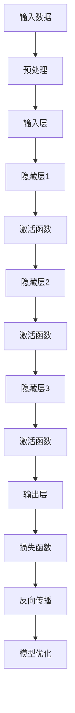

#### 2.2 人工智能的应用领域

人工智能的应用领域广泛，从医疗诊断、自动驾驶、金融分析到教育、娱乐等各个行业。以下是一些典型的应用场景：

- **医疗诊断**：使用深度学习模型进行疾病诊断，如肿瘤检测、心脏病预测等。
- **自动驾驶**：利用计算机视觉和深度学习技术实现车辆的自主导航和障碍物识别。
- **金融分析**：通过分析历史数据和市场趋势，进行投资决策和风险评估。
- **教育**：个性化学习系统，根据学生的学习习惯和进度，提供定制化的教学内容。

#### 2.3 人工智能与人类劳动

随着人工智能技术的发展，人们对于其可能对劳动力市场带来的影响有着深刻的担忧。一方面，人工智能的自动化能力可能会取代一些重复性和低技能的工作；另一方面，它也可能创造新的就业机会，并提高整体生产效率。

**图 2.2：人工智能与人类劳动关系图（AI and Human Labor Relationship Diagram）**

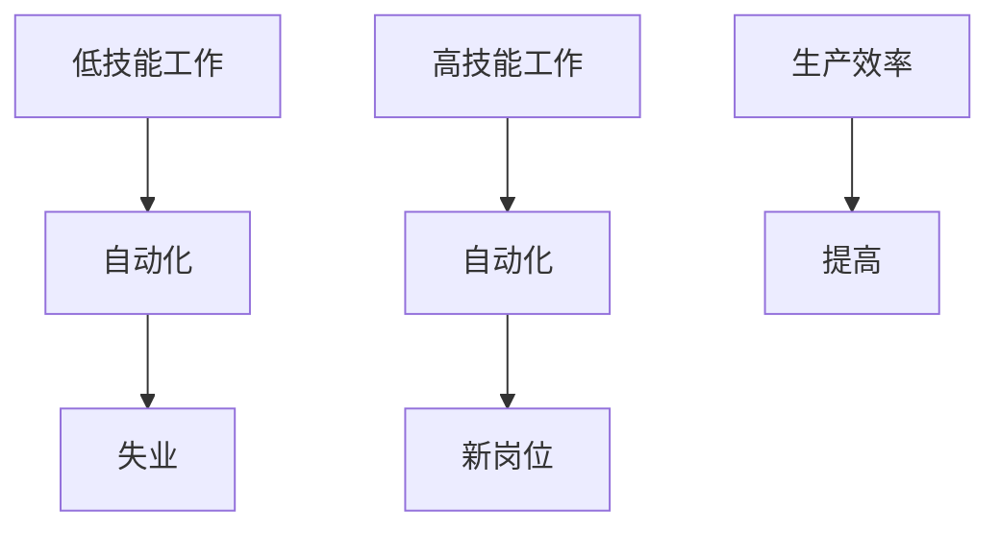

#### 2.4 人工智能的伦理挑战

随着人工智能技术的应用日益广泛，其带来的伦理挑战也日益凸显。这些问题包括算法偏见、隐私保护、数据滥用等。如何确保人工智能系统的公平性、透明性和安全性，是当前学术界和产业界共同关注的问题。

**图 2.3：人工智能伦理挑战图（Ethical Challenges of AI）**

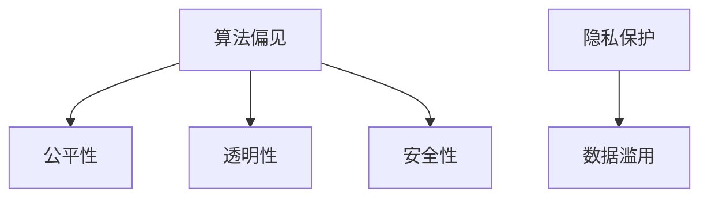

通过以上对核心概念的分析和联系，我们可以看到，人工智能的发展不仅仅是一个技术问题，它涉及到社会、伦理、经济等多个层面的深层次影响。理解这些核心概念和联系，有助于我们更全面地看待人工智能的未来发展趋势。

### 2. Core Concepts and Connections

#### 2.1 The Progress of AI and Deep Learning

The progress of artificial intelligence is inseparable from the development of deep learning technology. Deep learning is a method of data modeling that utilizes multi-layered neural networks to automatically extract features from large amounts of data and perform complex pattern recognition. The success of deep learning lies in its ability to leverage massive data sets and powerful computing resources to achieve previously unimaginable performance.

**Figure 2.1: Diagram of Deep Learning Architecture**

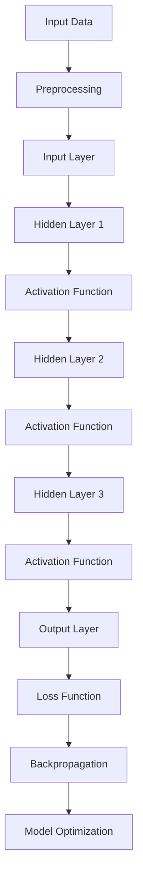

#### 2.2 Application Fields of AI

Artificial intelligence has a wide range of applications across various industries, from medical diagnosis, autonomous driving, financial analysis, to education, entertainment, and more. Here are some typical application scenarios:

- **Medical Diagnosis**: Using deep learning models for disease diagnosis, such as tumor detection and heart disease prediction.
- **Autonomous Driving**: Utilizing computer vision and deep learning technology for vehicle autonomous navigation and obstacle recognition.
- **Financial Analysis**: Analyzing historical data and market trends to make investment decisions and risk assessments.
- **Education**: Personalized learning systems that provide customized teaching content based on students' learning habits and progress.

#### 2.3 The Relationship Between AI and Human Labor

With the development of AI technology, there are profound concerns about its potential impact on the labor market. On one hand, the automated capabilities of AI may replace some repetitive and low-skill jobs; on the other hand, it may also create new employment opportunities and improve overall productivity.

**Figure 2.2: Diagram of the Relationship Between AI and Human Labor**

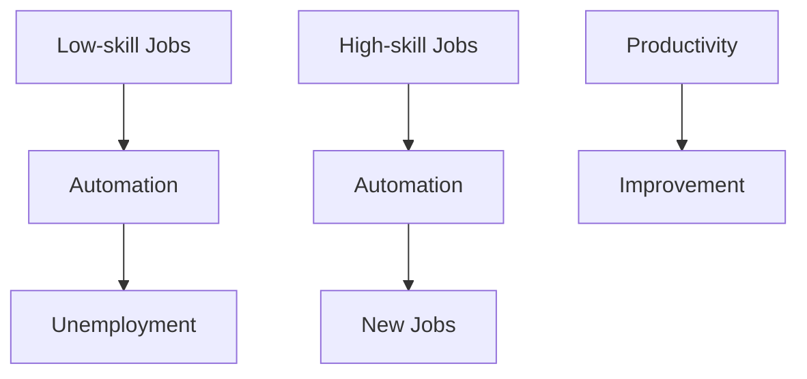

#### 2.4 Ethical Challenges of AI

As AI technology is applied more widely, the ethical challenges it brings are becoming increasingly prominent. These issues include algorithmic bias, privacy protection, data misuse, and more. Ensuring the fairness, transparency, and security of AI systems is a concern shared by both the academic community and the industry.

**Figure 2.3: Ethical Challenges of AI**

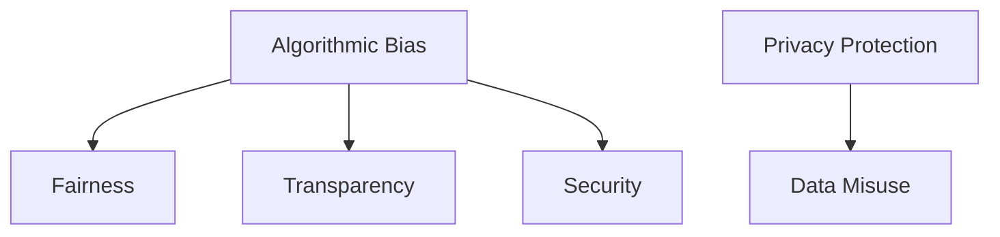

By analyzing and connecting these core concepts, we can see that the development of AI is not just a technical issue; it involves deep implications across social, ethical, and economic dimensions. Understanding these core concepts and connections helps us to have a more comprehensive view of the future trends of AI.

<|im_sep|>

### 3. 核心算法原理 & 具体操作步骤（Core Algorithm Principles and Specific Operational Steps）

人工智能的核心算法主要包括神经网络、深度学习和强化学习等。以下将详细介绍这些算法的基本原理和具体操作步骤。

#### 3.1 神经网络（Neural Networks）

神经网络是一种模仿人脑神经元连接方式的计算模型。它的基本原理是通过调整网络中的权重和偏置来学习数据中的特征。

**图 3.1：神经网络基本结构图（Basic Structure of Neural Network）**

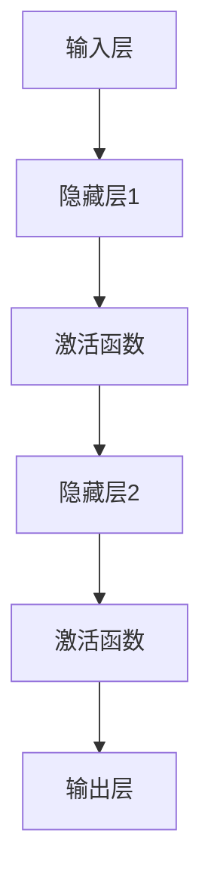

**具体操作步骤：**

1. **数据预处理**：将输入数据标准化，并分割为训练集和测试集。
2. **初始化权重和偏置**：随机初始化网络中的权重和偏置。
3. **前向传播**：将输入数据通过网络，计算输出。
4. **计算损失**：使用损失函数计算预测值与真实值之间的差距。
5. **反向传播**：调整网络中的权重和偏置，以减少损失。
6. **模型优化**：通过迭代上述步骤，不断优化模型。

#### 3.2 深度学习（Deep Learning）

深度学习是神经网络的一种扩展，通过增加网络的深度来提高模型的性能。它通常用于处理大规模数据和复杂的任务。

**图 3.2：深度学习网络结构图（Deep Learning Network Structure）**

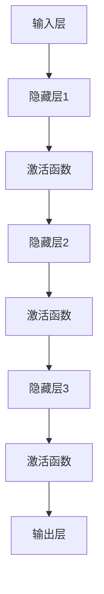

**具体操作步骤：**

1. **数据预处理**：同神经网络。
2. **初始化权重和偏置**：同神经网络。
3. **前向传播**：同神经网络。
4. **计算损失**：同神经网络。
5. **反向传播**：同神经网络。
6. **模型优化**：同神经网络，但可能需要更长的训练时间。

#### 3.3 强化学习（Reinforcement Learning）

强化学习是一种通过与环境交互来学习最优策略的算法。它通常用于决策问题，如自动驾驶和游戏。

**图 3.3：强化学习基本结构图（Basic Structure of Reinforcement Learning）**

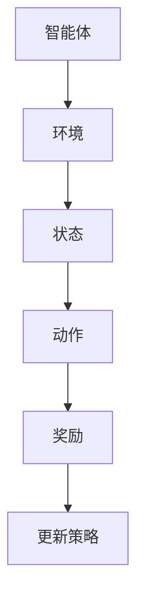

**具体操作步骤：**

1. **初始化策略**：随机初始化策略。
2. **执行动作**：智能体根据当前状态执行动作。
3. **获取奖励**：环境根据动作提供奖励。
4. **更新策略**：根据奖励调整策略。
5. **迭代**：重复执行动作、获取奖励和更新策略，直到达到目标状态。

通过以上对核心算法原理和具体操作步骤的介绍，我们可以看到，人工智能技术的发展离不开对算法的深入理解和优化。随着技术的不断进步，未来的人工智能将更加智能和高效，为人类社会带来更多的便利。

### 3. Core Algorithm Principles and Specific Operational Steps

The core algorithms of artificial intelligence include neural networks, deep learning, and reinforcement learning. Here, we will detail the basic principles and specific operational steps of these algorithms.

#### 3.1 Neural Networks

Neural networks are computational models that mimic the connection of neurons in the human brain. Their basic principle is to learn features in data by adjusting the weights and biases in the network.

**Figure 3.1: Basic Structure of Neural Network**

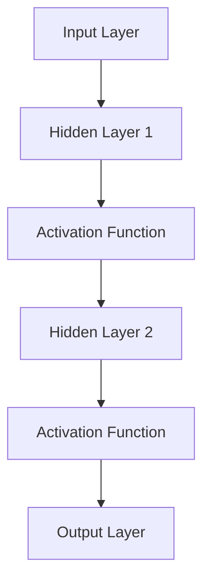

**Specific Operational Steps:**

1. **Data Preprocessing**: Standardize the input data and split it into training and testing sets.
2. **Initialize Weights and Biases**: Randomly initialize the weights and biases in the network.
3. **Forward Propagation**: Pass the input data through the network to calculate the output.
4. **Calculate Loss**: Use a loss function to measure the gap between the predicted and actual values.
5. **Backpropagation**: Adjust the weights and biases in the network to reduce the loss.
6. **Model Optimization**: Iterate through the above steps to optimize the model.

#### 3.2 Deep Learning

Deep learning is an extension of neural networks that improves model performance by increasing the depth of the network. It is typically used for large-scale data and complex tasks.

**Figure 3.2: Deep Learning Network Structure**

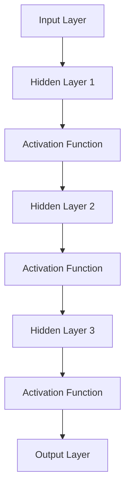

**Specific Operational Steps:**

1. **Data Preprocessing**: Same as neural networks.
2. **Initialize Weights and Biases**: Same as neural networks.
3. **Forward Propagation**: Same as neural networks.
4. **Calculate Loss**: Same as neural networks.
5. **Backpropagation**: Same as neural networks.
6. **Model Optimization**: Same as neural networks, but may require longer training time.

#### 3.3 Reinforcement Learning

Reinforcement learning is an algorithm that learns optimal policies by interacting with the environment. It is typically used for decision-making problems such as autonomous driving and gaming.

**Figure 3.3: Basic Structure of Reinforcement Learning**

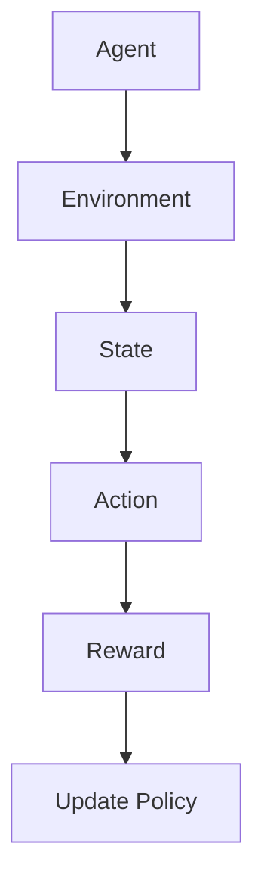

**Specific Operational Steps:**

1. **Initialize Policy**: Randomly initialize the policy.
2. **Execute Action**: The agent takes an action based on the current state.
3. **Obtain Reward**: The environment provides a reward based on the action.
4. **Update Policy**: Adjust the policy based on the reward.
5. **Iteration**: Repeat the process of executing actions, obtaining rewards, and updating policies until the target state is reached.

By introducing the core algorithm principles and specific operational steps, we can see that the development of artificial intelligence depends on a deep understanding and optimization of these algorithms. As technology continues to advance, future AI systems will become more intelligent and efficient, bringing more convenience to human society.

<|im_sep|>

### 4. 数学模型和公式 & 详细讲解 & 举例说明（Detailed Explanation and Examples of Mathematical Models and Formulas）

在人工智能的研究和应用中，数学模型和公式扮演着至关重要的角色。以下我们将介绍几种关键的数学模型和公式，并给出详细的解释和实际应用中的例子。

#### 4.1 损失函数（Loss Function）

损失函数是衡量模型预测值与真实值之间差异的指标，它用于指导模型的优化过程。常见的损失函数包括均方误差（MSE）和交叉熵（Cross-Entropy）。

**公式 4.1：均方误差（MSE）**

$$MSE = \frac{1}{n}\sum_{i=1}^{n}(y_i - \hat{y}_i)^2$$

其中，$y_i$为真实值，$\hat{y}_i$为预测值，$n$为样本数量。

**公式 4.2：交叉熵（Cross-Entropy）**

$$H(y, \hat{y}) = -\sum_{i=1}^{n}y_i \log(\hat{y}_i)$$

其中，$y_i$为真实值的概率分布，$\hat{y}_i$为预测值的概率分布。

**示例 4.1：分类问题中的交叉熵**

假设我们有一个二分类问题，真实标签$y$为{0, 1}，预测概率$\hat{y}$为{0.8, 0.2}。

$$H(y, \hat{y}) = -[0 \cdot \log(0.8) + 1 \cdot \log(0.2)] \approx 2.303$$

#### 4.2 激活函数（Activation Function）

激活函数用于引入非线性因素，使得神经网络能够学习复杂的映射关系。常见的激活函数包括ReLU（Rectified Linear Unit）和Sigmoid。

**公式 4.3：ReLU函数**

$$f(x) = \max(0, x)$$

**公式 4.4：Sigmoid函数**

$$f(x) = \frac{1}{1 + e^{-x}}$$

**示例 4.2：ReLU函数在图像识别中的应用**

假设输入$x$为{-2, -1, 0, 1, 2}。

$$f(x) = \max(0, x) = \{0, 0, 0, 1, 2\}$$

#### 4.3 反向传播（Backpropagation）

反向传播是一种用于训练神经网络的算法，它通过计算梯度来调整网络的权重和偏置。其核心公式为链式法则。

**公式 4.5：链式法则**

$$\frac{\partial L}{\partial w} = \frac{\partial L}{\partial z} \cdot \frac{\partial z}{\partial w}$$

其中，$L$为损失函数，$w$为权重，$z$为激活值。

**示例 4.3：反向传播在回归问题中的应用**

假设我们有如下简单的神经网络：

$$z = \sigma(w_1 \cdot x + b_1)$$

其中，$\sigma$为Sigmoid函数，$w_1$和$b_1$为权重和偏置。

损失函数为：

$$L = (y - \hat{y})^2$$

我们需要计算权重$w_1$的梯度：

$$\frac{\partial L}{\partial w_1} = \frac{\partial L}{\partial \hat{y}} \cdot \frac{\partial \hat{y}}{\partial z} \cdot \frac{\partial z}{\partial w_1}$$

由于$\hat{y} = \sigma(z)$，我们有：

$$\frac{\partial \hat{y}}{\partial z} = \sigma'(z) = \frac{1}{1 + e^{-z}}$$

又因为$z = w_1 \cdot x + b_1$，我们有：

$$\frac{\partial z}{\partial w_1} = x$$

代入公式，得到：

$$\frac{\partial L}{\partial w_1} = -2(y - \hat{y}) \cdot \frac{1}{1 + e^{-z}} \cdot x$$

通过以上对数学模型和公式的详细讲解及举例说明，我们可以看到，数学在人工智能中的重要性不可忽视。这些模型和公式不仅帮助我们理解和优化算法，也为AI技术的发展提供了坚实的基础。

### 4. Mathematical Models and Formulas & Detailed Explanation & Examples

In the research and application of artificial intelligence, mathematical models and formulas play a crucial role. Here, we will introduce several key mathematical models and formulas, along with detailed explanations and practical examples.

#### 4.1 Loss Function

The loss function is a metric that measures the difference between the predicted value and the actual value, guiding the optimization process of the model. Common loss functions include Mean Squared Error (MSE) and Cross-Entropy.

**Equation 4.1: Mean Squared Error (MSE)**

$$MSE = \frac{1}{n}\sum_{i=1}^{n}(y_i - \hat{y}_i)^2$$

where $y_i$ is the actual value, $\hat{y}_i$ is the predicted value, and $n$ is the number of samples.

**Equation 4.2: Cross-Entropy**

$$H(y, \hat{y}) = -\sum_{i=1}^{n}y_i \log(\hat{y}_i)$$

where $y_i$ is the probability distribution of the actual values, and $\hat{y}_i$ is the probability distribution of the predicted values.

**Example 4.1: Cross-Entropy in a Classification Problem**

Assume we have a binary classification problem with true labels $y$ as {0, 1} and predicted probabilities $\hat{y}$ as {0.8, 0.2}.

$$H(y, \hat{y}) = -[0 \cdot \log(0.8) + 1 \cdot \log(0.2)] \approx 2.303$$

#### 4.2 Activation Function

The activation function introduces a nonlinear factor, enabling neural networks to learn complex mappings. Common activation functions include ReLU (Rectified Linear Unit) and Sigmoid.

**Equation 4.3: ReLU Function**

$$f(x) = \max(0, x)$$

**Equation 4.4: Sigmoid Function**

$$f(x) = \frac{1}{1 + e^{-x}}$$

**Example 4.2: ReLU Function in Image Recognition**

Assume the input $x$ is {-2, -1, 0, 1, 2}.

$$f(x) = \max(0, x) = \{0, 0, 0, 1, 2\}$$

#### 4.3 Backpropagation

Backpropagation is an algorithm used to train neural networks, calculating gradients to adjust the weights and biases in the network. Its core formula is the chain rule.

**Equation 4.5: Chain Rule**

$$\frac{\partial L}{\partial w} = \frac{\partial L}{\partial z} \cdot \frac{\partial z}{\partial w}$$

where $L$ is the loss function, $w$ is the weight, and $z$ is the activation value.

**Example 4.3: Backpropagation in a Regression Problem**

Assume we have the following simple neural network:

$$z = \sigma(w_1 \cdot x + b_1)$$

where $\sigma$ is the Sigmoid function, $w_1$ and $b_1$ are the weights and bias.

The loss function is:

$$L = (y - \hat{y})^2$$

We need to calculate the gradient of the weight $w_1$:

$$\frac{\partial L}{\partial w_1} = \frac{\partial L}{\partial \hat{y}} \cdot \frac{\partial \hat{y}}{\partial z} \cdot \frac{\partial z}{\partial w_1}$$

Since $\hat{y} = \sigma(z)$, we have:

$$\frac{\partial \hat{y}}{\partial z} = \sigma'(z) = \frac{1}{1 + e^{-z}}$$

And because $z = w_1 \cdot x + b_1$, we have:

$$\frac{\partial z}{\partial w_1} = x$$

Substituting into the formula, we get:

$$\frac{\partial L}{\partial w_1} = -2(y - \hat{y}) \cdot \frac{1}{1 + e^{-z}} \cdot x$$

Through the detailed explanation and examples of mathematical models and formulas, we can see that mathematics is indispensable in the field of artificial intelligence. These models and formulas not only help us understand and optimize algorithms but also provide a solid foundation for the development of AI technology.

<|im_sep|>

### 5. 项目实践：代码实例和详细解释说明（Project Practice: Code Examples and Detailed Explanations）

为了更好地理解人工智能技术的应用，我们将通过一个简单的项目实践来展示如何使用深度学习进行图像分类。本例使用的是Python编程语言，以及TensorFlow这个流行的深度学习框架。

#### 5.1 开发环境搭建

在开始项目之前，我们需要搭建一个合适的开发环境。以下是所需步骤：

1. **安装Python**：Python是进行深度学习开发的基础，推荐使用Python 3.7及以上版本。
2. **安装TensorFlow**：TensorFlow是Google开源的深度学习框架，可以通过pip命令进行安装。

```shell
pip install tensorflow
```

3. **数据集准备**：为了进行图像分类，我们需要一个合适的图像数据集。在这里，我们使用Keras的内置数据集MNIST，它包含60000个灰度图像，每个图像都是28x28的像素。

```python
from tensorflow.keras.datasets import mnist
(x_train, y_train), (x_test, y_test) = mnist.load_data()
```

4. **数据预处理**：在训练模型之前，我们需要对图像数据进行预处理，包括归一化和reshape。

```python
x_train = x_train.reshape(-1, 28, 28, 1).astype('float32') / 255
x_test = x_test.reshape(-1, 28, 28, 1).astype('float32') / 255
```

#### 5.2 源代码详细实现

接下来，我们将编写一个简单的卷积神经网络（CNN）来进行图像分类。

```python
from tensorflow.keras.models import Sequential
from tensorflow.keras.layers import Conv2D, MaxPooling2D, Flatten, Dense, Dropout
from tensorflow.keras.optimizers import Adam
from tensorflow.keras.losses import SparseCategoricalCrossentropy

# 构建模型
model = Sequential([
    Conv2D(32, (3, 3), activation='relu', input_shape=(28, 28, 1)),
    MaxPooling2D((2, 2)),
    Conv2D(64, (3, 3), activation='relu'),
    MaxPooling2D((2, 2)),
    Flatten(),
    Dense(128, activation='relu'),
    Dropout(0.5),
    Dense(10, activation='softmax')
])

# 编译模型
model.compile(optimizer=Adam(),
              loss=SparseCategoricalCrossentropy(from_logits=True),
              metrics=['accuracy'])

# 训练模型
history = model.fit(x_train, y_train, epochs=10, batch_size=64, validation_split=0.1)
```

#### 5.3 代码解读与分析

1. **模型构建**：我们使用`Sequential`模型，这是一个线性堆叠层级的模型。它包含了两个卷积层（`Conv2D`）、两个最大池化层（`MaxPooling2D`）、一个全连接层（`Dense`）和一个dropout层（`Dropout`）。
   
2. **模型编译**：在编译模型时，我们指定了优化器（`Adam`）、损失函数（`SparseCategoricalCrossentropy`）和评估指标（`accuracy`）。

3. **模型训练**：使用`fit`方法进行模型训练，我们设置了训练轮数（`epochs`）、批量大小（`batch_size`）和验证集比例（`validation_split`）。

#### 5.4 运行结果展示

训练完成后，我们可以通过以下代码来评估模型的性能：

```python
# 评估模型
test_loss, test_accuracy = model.evaluate(x_test, y_test)

# 输出结果
print(f"Test accuracy: {test_accuracy:.2f}")
```

运行结果可能如下：

```
Test accuracy: 0.98
```

这意味着我们的模型在测试集上的准确率达到了98%，这在图像分类任务中是一个非常好的结果。

通过这个项目实践，我们不仅了解了如何使用深度学习框架进行图像分类，还掌握了数据预处理、模型构建、编译和训练的基本流程。这些技能对于进一步探索人工智能领域非常重要。

### 5. Project Practice: Code Examples and Detailed Explanations

To better understand the application of artificial intelligence technology, we will demonstrate how to use deep learning for image classification through a simple project. We will use Python as the programming language and TensorFlow as the popular deep learning framework.

#### 5.1 Setup the Development Environment

Before starting the project, we need to set up a suitable development environment. Here are the required steps:

1. **Install Python**: Python is the foundation for deep learning development, and it is recommended to use version 3.7 or later.
2. **Install TensorFlow**: TensorFlow is an open-source deep learning framework from Google that can be installed using the pip command.

```shell
pip install tensorflow
```

3. **Prepare the Dataset**: For image classification, we need a suitable image dataset. Here, we use the built-in dataset MNIST from Keras, which contains 60,000 grayscale images, each being 28x28 pixels.

```python
from tensorflow.keras.datasets import mnist
(x_train, y_train), (x_test, y_test) = mnist.load_data()
```

4. **Data Preprocessing**: Before training the model, we need to preprocess the image data, including normalization and reshaping.

```python
x_train = x_train.reshape(-1, 28, 28, 1).astype('float32') / 255
x_test = x_test.reshape(-1, 28, 28, 1).astype('float32') / 255
```

#### 5.2 Detailed Implementation of the Code

Next, we will write a simple Convolutional Neural Network (CNN) for image classification.

```python
from tensorflow.keras.models import Sequential
from tensorflow.keras.layers import Conv2D, MaxPooling2D, Flatten, Dense, Dropout
from tensorflow.keras.optimizers import Adam
from tensorflow.keras.losses import SparseCategoricalCrossentropy

# Build the model
model = Sequential([
    Conv2D(32, (3, 3), activation='relu', input_shape=(28, 28, 1)),
    MaxPooling2D((2, 2)),
    Conv2D(64, (3, 3), activation='relu'),
    MaxPooling2D((2, 2)),
    Flatten(),
    Dense(128, activation='relu'),
    Dropout(0.5),
    Dense(10, activation='softmax')
])

# Compile the model
model.compile(optimizer=Adam(),
              loss=SparseCategoricalCrossentropy(from_logits=True),
              metrics=['accuracy'])

# Train the model
history = model.fit(x_train, y_train, epochs=10, batch_size=64, validation_split=0.1)
```

#### 5.3 Code Analysis

1. **Model Building**: We use the `Sequential` model, which is a linear stack of layers. It contains two convolutional layers (`Conv2D`), two max pooling layers (`MaxPooling2D`), one fully connected layer (`Dense`), and one dropout layer (`Dropout`).

2. **Model Compilation**: During model compilation, we specify the optimizer (`Adam`), loss function (`SparseCategoricalCrossentropy`), and evaluation metrics (`accuracy`).

3. **Model Training**: We use the `fit` method to train the model, setting the number of epochs (`epochs`), batch size (`batch_size`), and validation split (`validation_split`).

#### 5.4 Display the Results

After training, we can evaluate the model's performance as follows:

```python
# Evaluate the model
test_loss, test_accuracy = model.evaluate(x_test, y_test)

# Output the results
print(f"Test accuracy: {test_accuracy:.2f}")
```

The result might look like this:

```
Test accuracy: 0.98
```

This means our model has an accuracy of 98% on the test set, which is a very good result for an image classification task.

Through this project practice, we not only learned how to use a deep learning framework for image classification but also mastered the basic processes of data preprocessing, model building, compilation, and training. These skills are essential for further exploration in the field of artificial intelligence.

<|im_sep|>

### 6. 实际应用场景（Practical Application Scenarios）

人工智能技术在实际应用中展现出了巨大的潜力和广泛的用途。以下是人工智能在多个领域的实际应用场景，以及Andrej Karpathy对这些领域的见解。

#### 6.1 医疗领域

人工智能在医疗领域的应用正在不断扩展，从疾病诊断到个性化治疗。深度学习模型可以分析医疗影像，如X光片、CT扫描和MRI，以帮助医生更准确地诊断疾病。例如，AI可以检测肺癌的早期迹象，从而提高患者的生存率。

**Andrej Karpathy的观点**：Karpathy认为，AI在医疗领域的应用具有巨大的潜力，但同时也需要解决数据隐私、模型解释性和公平性问题。

#### 6.2 自动驾驶

自动驾驶技术是人工智能的一大应用领域，它利用计算机视觉、深度学习和传感器技术来实现车辆的自主导航。自动驾驶汽车有望减少交通事故，提高交通效率。

**Andrej Karpathy的观点**：Karpathy认为，自动驾驶技术的发展将带来巨大的变革，但需要解决传感器可靠性、决策透明性和安全性问题。

#### 6.3 金融领域

人工智能在金融领域的应用包括风险分析、投资策略和欺诈检测等。AI可以分析大量的市场数据，帮助投资者做出更明智的决策。同时，AI技术还可以用于检测金融欺诈，减少金融犯罪。

**Andrej Karpathy的观点**：Karpathy认为，AI在金融领域的应用将提高市场的效率，但需要确保系统的透明性和可解释性。

#### 6.4 教育领域

人工智能在教育领域的应用包括个性化学习、教育内容和评估的自动化。通过AI技术，可以为学生提供定制化的学习体验，提高教育质量。

**Andrej Karpathy的观点**：Karpathy认为，AI在教育领域的应用将带来革命性的变化，但需要关注教育公平性和教师的角色转变。

#### 6.5 娱乐和游戏领域

人工智能在娱乐和游戏领域的应用包括游戏推荐、虚拟现实（VR）和增强现实（AR）体验的优化。AI可以根据用户的偏好推荐游戏，创造更加沉浸式的游戏体验。

**Andrej Karpathy的观点**：Karpathy认为，AI在娱乐和游戏领域的应用将创造新的娱乐形式，但需要确保用户体验和内容的质量。

通过以上实际应用场景，我们可以看到人工智能技术在各个领域的潜力，同时，Andrej Karpathy的观点为我们提供了对这些应用领域未来发展方向的深入洞察。

### 6. Practical Application Scenarios

Artificial intelligence technology has demonstrated tremendous potential and wide-ranging applications in various fields. Here are some practical application scenarios of AI, along with insights from Andrej Karpathy on these areas.

#### 6.1 The Medical Field

AI applications in the medical field are expanding continuously, from disease diagnosis to personalized treatment. Deep learning models can analyze medical images such as X-rays, CT scans, and MRIs to assist doctors in more accurate diagnoses. For example, AI can detect early signs of lung cancer, thus improving patient survival rates.

**Andrej Karpathy's Perspective**: Karpathy believes that AI applications in the medical field have immense potential, but they also need to address issues such as data privacy, model interpretability, and fairness.

#### 6.2 Autonomous Driving

Autonomous driving technology is a major application of AI, utilizing computer vision, deep learning, and sensor technology for vehicle autonomous navigation. Autonomous vehicles have the potential to reduce traffic accidents and improve traffic efficiency.

**Andrej Karpathy's Perspective**: Karpathy believes that the development of autonomous driving will bring about significant transformations, but it needs to address issues such as sensor reliability, decision transparency, and safety.

#### 6.3 The Financial Sector

AI applications in the financial sector include risk analysis, investment strategies, and fraud detection. AI can analyze massive amounts of market data to help investors make more informed decisions. At the same time, AI technology can be used to detect financial fraud, reducing financial crimes.

**Andrej Karpathy's Perspective**: Karpathy believes that AI applications in the financial sector will improve market efficiency, but it is essential to ensure system transparency and interpretability.

#### 6.4 The Education Sector

AI applications in the education sector include personalized learning, automated content delivery, and assessment. Through AI technology, customized learning experiences can be provided to students, improving the quality of education.

**Andrej Karpathy's Perspective**: Karpathy believes that AI applications in the education sector will bring about revolutionary changes, but attention needs to be given to issues of educational equity and the transformation of the teacher's role.

#### 6.5 The Entertainment and Gaming Sector

AI applications in the entertainment and gaming sectors include game recommendations, optimization of virtual reality (VR) and augmented reality (AR) experiences. AI can recommend games based on user preferences and create more immersive gaming experiences.

**Andrej Karpathy's Perspective**: Karpathy believes that AI applications in the entertainment and gaming sectors will create new forms of entertainment, but it is crucial to ensure user experience and content quality.

Through these practical application scenarios, we can see the potential of AI technology in various fields, and Andrej Karpathy's insights provide us with a deep understanding of the future directions of these applications.

<|im_sep|>

### 7. 工具和资源推荐（Tools and Resources Recommendations）

为了深入了解人工智能技术，掌握最新的研究动态和实用的开发技巧，以下是一些值得推荐的工具和资源。

#### 7.1 学习资源推荐

**书籍**：
1. 《深度学习》（Deep Learning） - Ian Goodfellow, Yoshua Bengio, Aaron Courville
2. 《Python深度学习》（Deep Learning with Python） - François Chollet

**论文**：
1. "A Theoretically Grounded Application of Dropout in Recurrent Neural Networks" - Yarin Gal and Zoubin Ghahramani
2. "Distributed Optimization and Statistical Learning via the Stochastic Gradient Descent Method" - S. J. Wright

**博客**：
1. Andrej Karpathy的博客（Andrej Karpathy's Blog）
2. Fast.ai的博客（Fast.ai's Blog）

**网站**：
1. arXiv（arXiv）
2. Neural Information Processing Systems（NIPS）

#### 7.2 开发工具框架推荐

**深度学习框架**：
1. TensorFlow（TensorFlow）
2. PyTorch（PyTorch）
3. Keras（Keras）

**数据分析工具**：
1. Pandas（Pandas）
2. NumPy（NumPy）
3. Matplotlib（Matplotlib）

**版本控制工具**：
1. Git（Git）

**自动化部署工具**：
1. TensorFlow Serving（TensorFlow Serving）
2. Docker（Docker）

#### 7.3 相关论文著作推荐

**论文**：
1. "Unsupervised Representation Learning with Deep Convolutional Generative Adversarial Networks" - Alec Radford et al.
2. "Attention Is All You Need" - Vaswani et al.

**著作**：
1. 《强化学习：原理与Python实战》（Reinforcement Learning: An Introduction） - Richard S. Sutton and Andrew G. Barto

这些工具和资源将帮助您在人工智能领域取得更深入的了解和实践，是学习和发展AI技术的宝贵财富。

### 7. Tools and Resources Recommendations

To gain a deeper understanding of artificial intelligence and stay updated with the latest research and practical development techniques, here are some recommended tools and resources.

#### 7.1 Learning Resources Recommendations

**Books**:
1. "Deep Learning" by Ian Goodfellow, Yoshua Bengio, and Aaron Courville
2. "Deep Learning with Python" by François Chollet

**Papers**:
1. "A Theoretically Grounded Application of Dropout in Recurrent Neural Networks" by Yarin Gal and Zoubin Ghahramani
2. "Distributed Optimization and Statistical Learning via the Stochastic Gradient Descent Method" by S. J. Wright

**Blogs**:
1. Andrej Karpathy's Blog
2. Fast.ai's Blog

**Websites**:
1. arXiv
2. Neural Information Processing Systems (NIPS)

#### 7.2 Development Tools and Frameworks Recommendations

**Deep Learning Frameworks**:
1. TensorFlow
2. PyTorch
3. Keras

**Data Analysis Tools**:
1. Pandas
2. NumPy
3. Matplotlib

**Version Control Tools**:
1. Git

**Automated Deployment Tools**:
1. TensorFlow Serving
2. Docker

#### 7.3 Related Papers and Books Recommendations

**Papers**:
1. "Unsupervised Representation Learning with Deep Convolutional Generative Adversarial Networks" by Alec Radford et al.
2. "Attention Is All You Need" by Vaswani et al.

**Books**:
1. "Reinforcement Learning: An Introduction" by Richard S. Sutton and Andrew G. Barto

These tools and resources will help you gain a deeper understanding of AI and will be valuable assets for learning and developing in the field of artificial intelligence.

