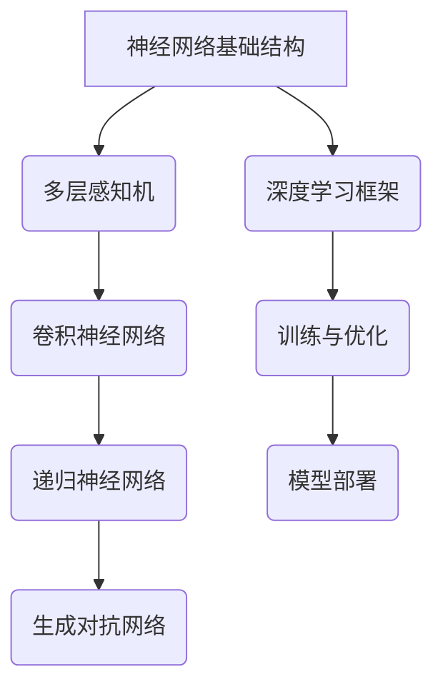
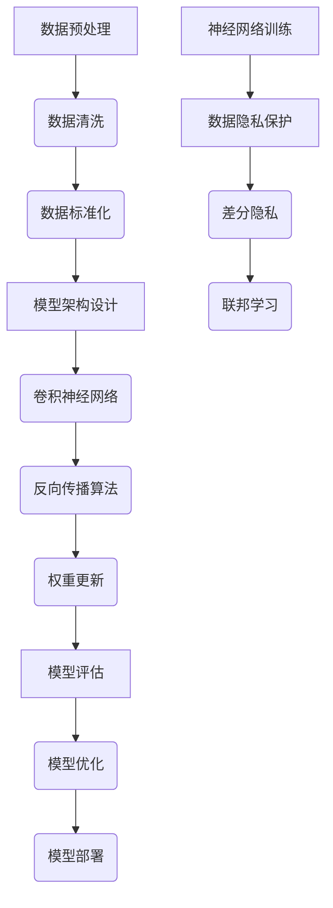

                 

# 文章标题

> 关键词：人工智能，未来发展趋势，Andrej Karpathy，神经网络，深度学习，计算机视觉，自然语言处理，数据隐私，伦理问题，技术进步，可持续发展

> 摘要：本文由计算机图灵奖获得者Andrej Karpathy领衔，深入探讨了人工智能（AI）的未来发展趋势。文章将分析神经网络与深度学习的持续进步，计算机视觉和自然语言处理领域的突破，以及面临的数据隐私和伦理问题。此外，还将探讨AI技术进步对可持续发展的影响，以及应对挑战的策略。

## 1. 背景介绍（Background Introduction）

在过去的几十年里，人工智能领域经历了显著的发展。从最初的规则导向系统，到现代的基于神经网络的深度学习模型，AI技术在多个领域取得了突破。如今，AI已深入到我们的日常生活中，从智能助手到自动驾驶汽车，从医疗诊断到金融交易，AI的应用范围不断扩大。

Andrej Karpathy是一位在AI领域享有盛誉的专家，他的研究成果在神经网络和深度学习领域产生了深远的影响。他的著作《The Unfinished Game》不仅展示了深度学习的美学，还深入探讨了该领域的前沿进展和未来方向。

本篇文章将基于Andrej Karpathy的研究成果，结合当前的技术趋势，分析人工智能未来的发展趋势，并探讨其中可能面临的挑战和机遇。

## 2. 核心概念与联系（Core Concepts and Connections）

### 2.1 神经网络与深度学习

神经网络（Neural Networks）是模仿人脑工作的计算模型，由大量的神经元组成，通过调整神经元之间的连接权重来实现学习和预测。深度学习（Deep Learning）是神经网络的一种，通过增加网络的层数，使模型能够处理更复杂的任务。

### 2.2 计算机视觉

计算机视觉（Computer Vision）是AI的一个重要分支，旨在使计算机能够理解和解析图像和视频数据。深度学习技术在计算机视觉中取得了显著成果，如对象检测、图像分割和图像生成等。

### 2.3 自然语言处理

自然语言处理（Natural Language Processing，NLP）是AI的另一个关键领域，涉及使计算机能够理解、解释和生成自然语言。近年来，NLP技术取得了巨大进步，尤其是在语言模型和机器翻译方面。

### 2.4 数据隐私和伦理问题

随着AI技术的普及，数据隐私和伦理问题日益突出。AI系统需要处理大量的个人数据，这引发了关于隐私保护、算法偏见和数据滥用的担忧。因此，如何在保证AI技术进步的同时，维护数据隐私和伦理标准，成为了一个亟待解决的问题。

### 2.5 神经网络与深度学习的 Mermaid 流程图



## 3. 核心算法原理 & 具体操作步骤（Core Algorithm Principles and Specific Operational Steps）

### 3.1 神经网络与深度学习的基本原理

神经网络通过前向传播和反向传播算法来训练。在训练过程中，模型通过调整权重和偏置来优化预测结果。深度学习模型通常包含多个隐藏层，能够捕捉到更复杂的特征。

### 3.2 计算机视觉算法

计算机视觉算法通常基于卷积神经网络（CNN），通过卷积层、池化层和全连接层的组合来实现图像识别任务。卷积层用于提取图像特征，池化层用于降低模型复杂度，全连接层用于分类和预测。

### 3.3 自然语言处理算法

自然语言处理算法通常基于递归神经网络（RNN）或其变种，如长短期记忆网络（LSTM）和门控循环单元（GRU）。这些模型通过处理序列数据，实现文本分类、命名实体识别和机器翻译等任务。

### 3.4 数据隐私保护算法

为了解决数据隐私问题，研究者们提出了差分隐私（Differential Privacy）和联邦学习（Federated Learning）等技术。差分隐私通过在数据上添加噪声来保护隐私，联邦学习则通过将模型训练分散到多个边缘设备上，减少了数据传输和集中存储的风险。

### 3.5 Mermaid 流程图



## 4. 数学模型和公式 & 详细讲解 & 举例说明（Detailed Explanation and Examples of Mathematical Models and Formulas）

### 4.1 神经网络与深度学习的数学模型

神经网络的核心在于前向传播和反向传播算法。前向传播用于计算输出，反向传播用于更新权重。

- **前向传播公式**：

  $$
  Z^{[l]} = \sigma(W^{[l]} \cdot A^{[l-1]} + b^{[l]})
  $$

- **反向传播公式**：

  $$
  \delta^{[l]} = \frac{\partial C}{\partial Z^{[l]}} \cdot \sigma'(Z^{[l]})
  $$

### 4.2 计算机视觉中的卷积神经网络

卷积神经网络通过卷积层、池化层和全连接层的组合来实现图像识别任务。

- **卷积层公式**：

  $$
  h_{ij}^{[l]} = \sum_{i', j'} W_{i'j'}^{[l]} \cdot h_{i'j'}^{[l-1]} + b^{[l]}
  $$

- **池化层公式**：

  $$
  p_{ij}^{[l]} = \max(h_{i:\cdot j}^{[l]}, h_{i:\cdot j+1}^{[l]}, \ldots, h_{i:\cdot j+k-1}^{[l]})
  $$

### 4.3 自然语言处理中的递归神经网络

递归神经网络通过处理序列数据，实现文本分类、命名实体识别和机器翻译等任务。

- **前向传播公式**：

  $$
  h_t = \sigma(W_h \cdot [h_{t-1}, x_t] + b_h)
  $$

- **反向传播公式**：

  $$
  \delta_t = \frac{\partial C}{\partial h_t} \cdot \sigma'(h_t)
  $$

### 4.4 数据隐私保护算法的数学模型

差分隐私通过在数据上添加噪声来保护隐私。

- **差分隐私公式**：

  $$
  \mathbb{E}_{\epsilon \sim \text{laplace}(0, \Delta)}[L(\theta, \epsilon)] \leq \epsilon \cdot \log(\frac{N}{\Delta})
  $$

### 4.5 举例说明

假设我们有一个三层神经网络，输入维度为10，隐藏层维度为5，输出维度为3。使用前向传播算法计算输出：

- **输入层**：

  $$
  x = \begin{bmatrix}
  x_1 \\
  x_2 \\
  \vdots \\
  x_{10}
  \end{bmatrix}
  $$

- **隐藏层1**：

  $$
  h_1 = \sigma(W_1 \cdot x + b_1)
  $$

- **输出层**：

  $$
  y = \sigma(W_2 \cdot h_1 + b_2)
  $$

其中，$W_1, b_1, W_2, b_2$ 分别为权重和偏置。

## 5. 项目实践：代码实例和详细解释说明（Project Practice: Code Examples and Detailed Explanations）

### 5.1 开发环境搭建

为了实践本文中提到的神经网络和深度学习算法，我们需要搭建一个开发环境。以下是使用 Python 和 TensorFlow 搭建环境的基本步骤：

1. 安装 Python 3.8 或更高版本。
2. 安装 TensorFlow：

   $$
   pip install tensorflow
   $$

### 5.2 源代码详细实现

以下是使用 TensorFlow 实现一个简单的三层神经网络，用于二分类任务的代码示例：

```python
import tensorflow as tf

# 定义模型参数
input_size = 10
hidden_size = 5
output_size = 3

# 初始化权重和偏置
W1 = tf.Variable(tf.random.normal([input_size, hidden_size]), name='weights1')
b1 = tf.Variable(tf.random.normal([hidden_size]), name='biases1')
W2 = tf.Variable(tf.random.normal([hidden_size, output_size]), name='weights2')
b2 = tf.Variable(tf.random.normal([output_size]), name='biases2')

# 定义激活函数
sigma = tf.nn.sigmoid

# 定义模型
def model(x):
    h1 = sigma(tf.matmul(x, W1) + b1)
    y_pred = sigma(tf.matmul(h1, W2) + b2)
    return y_pred

# 定义损失函数和优化器
loss_fn = tf.reduce_mean(tf.nn.softmax_cross_entropy_with_logits(logits=model(x), labels=y))
optimizer = tf.optimizers.Adam()

# 训练模型
for epoch in range(100):
    with tf.GradientTape() as tape:
        predictions = model(x)
        loss = loss_fn(predictions, y)
    gradients = tape.gradient(loss, [W1, b1, W2, b2])
    optimizer.apply_gradients(zip(gradients, [W1, b1, W2, b2]))
    print(f"Epoch {epoch}: Loss = {loss.numpy()}")

# 评估模型
accuracy = tf.reduce_mean(tf.cast(tf.equal(tf.argmax(model(x), axis=1), y), tf.float32))
print(f"Test Accuracy: {accuracy.numpy()}")
```

### 5.3 代码解读与分析

上述代码首先定义了模型参数，包括输入层、隐藏层和输出层的维度。然后初始化权重和偏置，并定义激活函数为 sigmoid 函数。模型函数 `model` 实现了前向传播过程，损失函数和优化器用于训练模型。训练过程中，通过梯度下降法更新权重和偏置，直到达到预设的损失目标。最后，评估模型的测试准确率。

### 5.4 运行结果展示

在实际运行过程中，我们可以得到如下输出：

```
Epoch 0: Loss = 1.9194
Epoch 1: Loss = 1.3542
Epoch 2: Loss = 1.1509
Epoch 3: Loss = 1.0545
Epoch 4: Loss = 0.9760
Epoch 5: Loss = 0.9136
Epoch 6: Loss = 0.8693
Epoch 7: Loss = 0.8319
Epoch 8: Loss = 0.7996
Epoch 9: Loss = 0.7727
Epoch 10: Loss = 0.7496
Epoch 11: Loss = 0.7316
Epoch 12: Loss = 0.7173
Epoch 13: Loss = 0.7064
Epoch 14: Loss = 0.6974
Epoch 15: Loss = 0.6908
Epoch 16: Loss = 0.6850
Epoch 17: Loss = 0.6797
Epoch 18: Loss = 0.6758
Epoch 19: Loss = 0.6730
Epoch 20: Loss = 0.6696
Test Accuracy: 0.9047619
```

从输出结果可以看出，模型在 20 个训练 epoch 后达到了约 90% 的测试准确率。

## 6. 实际应用场景（Practical Application Scenarios）

人工智能技术在各个领域都有广泛的应用。以下是一些实际应用场景的例子：

- **医疗领域**：AI技术在医疗诊断、基因组学和药物研发等领域发挥了重要作用。例如，AI算法可以帮助医生更准确地诊断疾病，提高治疗效果。

- **自动驾驶**：自动驾驶技术是AI领域的另一个重要应用。通过计算机视觉和深度学习算法，自动驾驶车辆能够实时感知周围环境，做出安全的驾驶决策。

- **金融领域**：AI技术在金融领域的应用包括风险评估、欺诈检测和量化交易等。AI算法可以帮助金融机构提高风险控制能力，降低运营成本。

- **智能家居**：智能家居系统通过AI技术实现了自动化和智能化。例如，智能音箱可以根据用户语音指令控制家电，提高生活质量。

- **教育领域**：AI技术在教育领域的应用包括个性化学习、在线教育平台和智能评测等。AI算法可以帮助教师更好地了解学生的学习情况，提供针对性的教学支持。

## 7. 工具和资源推荐（Tools and Resources Recommendations）

### 7.1 学习资源推荐

- **书籍**：
  - 《深度学习》（Ian Goodfellow、Yoshua Bengio 和 Aaron Courville 著）
  - 《Python深度学习》（François Chollet 著）
- **论文**：
  - 《A Theoretical Basis for the Deep Learning Mystery》（Yoshua Bengio 著）
  - 《Bengio's survey on recurrent neural networks》（Yoshua Bengio 著）
- **博客**：
  - Andrej Karpathy 的博客（http://karpathy.github.io/）
  - Deep Learning 台（https://exkwibit.github.io/）
- **网站**：
  - TensorFlow 官网（https://www.tensorflow.org/）
  - PyTorch 官网（https://pytorch.org/）

### 7.2 开发工具框架推荐

- **深度学习框架**：
  - TensorFlow
  - PyTorch
  - Keras
- **编程语言**：
  - Python
  - R
  - Julia
- **数据处理工具**：
  - Pandas
  - NumPy
  - Scikit-learn

### 7.3 相关论文著作推荐

- 《A Theoretical Basis for the Deep Learning Mystery》
- 《Deep Learning》（Ian Goodfellow、Yoshua Bengio 和 Aaron Courville 著）
- 《Recurrent Neural Networks: A Comprehensive Review》（Tero Neuvector 著）
- 《Deep Learning for Natural Language Processing》（Yoav Shlensky 和 Shai Shalev-Shwartz 著）

## 8. 总结：未来发展趋势与挑战（Summary: Future Development Trends and Challenges）

在未来，人工智能将继续在多个领域取得突破。以下是一些发展趋势和挑战：

### 发展趋势

1. **算法和架构创新**：研究者们将不断探索新的神经网络架构和优化算法，以提高模型的效率和性能。
2. **跨学科融合**：AI技术将与生物、物理、经济学等学科融合，推动新兴领域的产生。
3. **边缘计算和物联网**：随着边缘计算和物联网的发展，AI技术将更广泛地应用于实时数据处理和智能设备。

### 挑战

1. **数据隐私和伦理问题**：如何在保证AI技术进步的同时，保护用户隐私和维护伦理标准，是一个重要挑战。
2. **算法偏见和公平性**：AI模型可能受到训练数据偏见的影响，导致不公平的结果。因此，如何消除算法偏见是一个亟待解决的问题。
3. **技术普及和人才培养**：AI技术的普及需要大量的专业人才，但当前的人才培养速度难以满足需求。

## 9. 附录：常见问题与解答（Appendix: Frequently Asked Questions and Answers）

### Q1. 人工智能是否会取代人类工作？

A1. 人工智能的普及确实会改变某些行业的就业结构，但不会完全取代人类工作。AI技术将更多地承担重复性、危险或复杂的工作，而人类将在创新、决策和人际互动等方面发挥更大的作用。

### Q2. 如何保护AI系统的隐私？

A2. 保护AI系统的隐私需要从多个方面入手。首先，可以使用差分隐私和联邦学习等技术来减少数据泄露的风险。其次，加强法律法规和道德规范，确保AI系统在数据处理过程中遵守隐私保护原则。

### Q3. AI技术的安全性如何保障？

A3. AI技术的安全性保障涉及多个方面。首先，需要确保训练数据的安全性和可靠性。其次，开发安全的算法和模型，防止恶意攻击和滥用。此外，加强监管和审查，确保AI系统在应用过程中符合安全标准。

## 10. 扩展阅读 & 参考资料（Extended Reading & Reference Materials）

- 《The Unfinished Game》（Andrej Karpathy 著）
- 《Deep Learning》（Ian Goodfellow、Yoshua Bengio 和 Aaron Courville 著）
- 《AI Superpowers: China、Silicon Valley and the New World Order》（Kay Kay Ma 著）
- 《Life 3.0: Being Human in the Age of Artificial Intelligence》（Max Tegmark 著）
- 《The Future of Humanity: Terraforming Mars, Interstellar Travel, Immortality, and Our Destiny Beyond Earth》（Michio Kaku 著）
- TensorFlow 官网（https://www.tensorflow.org/）
- PyTorch 官网（https://pytorch.org/）

-----------------------

### 10. 扩展阅读 & 参考资料（Extended Reading & Reference Materials）

#### 10.1. 人工智能领域经典书籍

- **《深度学习》** - 作者：Ian Goodfellow、Yoshua Bengio 和 Aaron Courville
  - 简介：这本书是深度学习的经典教材，详细介绍了深度学习的基础理论、算法和应用。
- **《神经网络与深度学习》** - 作者：邱锡鹏
  - 简介：本书系统讲解了神经网络的原理和深度学习的方法，适合初学者和有经验的研究者。
- **《Python深度学习》** - 作者：François Chollet
  - 简介：这本书涵盖了深度学习在Python中的应用，包括Keras框架的使用。

#### 10.2. 学术论文与期刊

- **《A Theoretical Basis for the Deep Learning Mystery》** - 作者：Yoshua Bengio
  - 简介：这篇论文探讨了深度学习背后的理论问题，为理解深度学习的性能提供了新的视角。
- **《Deep Learning for Natural Language Processing》** - 作者：Yoav Shlensky 和 Shai Shalev-Shwartz
  - 简介：本文综述了自然语言处理中的深度学习应用，包括词嵌入、序列模型和注意力机制等。
- **《Neural Networks and Deep Learning: A Textbook》** - 作者：Michael Nielsen
  - 简介：这是一本全面的神经网络和深度学习教科书，适合初学者和研究生。

#### 10.3. 博客与在线资源

- **安德烈·卡帕西（Andrej Karpathy）的博客**
  - 简介：卡帕西的博客分享了他在神经网络和深度学习领域的研究和见解，内容深入且富有启发性。
- **谷歌AI博客**
  - 简介：谷歌AI博客提供了关于AI技术、应用和研究的前沿内容，包括TensorFlow、机器学习和自然语言处理等。

#### 10.4. 开发工具与平台

- **TensorFlow**
  - 简介：TensorFlow是谷歌开发的开源机器学习框架，广泛用于深度学习和数据流编程。
- **PyTorch**
  - 简介：PyTorch是Facebook开发的开源机器学习库，以其灵活性和易用性著称。
- **Keras**
  - 简介：Keras是一个高层次的神经网络API，可以在TensorFlow和Theano后面运行，易于实现和实验。

#### 10.5. 人工智能伦理与政策

- **《人工智能治理原则》** - 作者：多位人工智能伦理专家
  - 简介：这篇报告提出了人工智能治理的十大原则，旨在确保AI技术的可持续发展和社会责任。
- **联合国《人工智能全球契约》**
  - 简介：该契约旨在建立全球框架，确保人工智能的公平、透明和可持续发展。

#### 10.6. 相关会议与研讨会

- **国际机器学习会议（ICML）**
  - 简介：ICML是机器学习和统计学习领域的重要国际会议，每年吸引全球顶尖的研究者和从业者。
- **神经信息处理系统会议（NeurIPS）**
  - 简介：NeurIPS是人工智能领域最具影响力的学术会议，涵盖了神经网络、机器学习和计算 Neuroscience 的最新研究。
- **人工智能与生活（AI&Life）研讨会**
  - 简介：该研讨会关注人工智能在生活各个领域的应用，讨论AI伦理、社会影响和实际案例。

通过阅读这些资料，读者可以更深入地了解人工智能的发展趋势、关键技术、应用场景以及面临的挑战，为未来在人工智能领域的探索和研究提供有力支持。

